$~$

The overall purpose of this project is to [].

$~$

# **Code Setup** {#codesetup}

$~$

This code applies to all code chunks in this document, like ensuring the figures in this HTML will be centered and fullsize, saving all figures to the computer as high-resolution SVG files, and removing comment marks in outputted text.

$~$


``` r
overall_path <- c("")
fig_path <- paste0(overall_path, "figures/")
table_path <- paste0(overall_path, "tables/")
input_path <- paste0(overall_path, "inputs/")
analogous_germline_path <- c("../confirmed-p53-germline-variant-carriers-mut-spectrum-TP53-database_files/tables/")

knitr::opts_chunk$set(fig.align = "center",
                      comment = "",
                      dev = "svg",
                      dpi = 600,
                      out.width = "100%",
                      out.height = "100%",
                      fig.path = fig_path)
```

$~$

# **Libraries Used** {#librariesused}

$~$

This code calls all the packages used in this document's analysis, and sets a seed for reproducibility.

$~$


``` r
#load (and install if needed) pacman and use it to load important packages
if (!require("pacman", quietly = TRUE)) install.packages("pacman"); library(pacman)
pacman::p_load(BiocManager, cBioPortalData, AnVIL, janitor, knitr, devtools, rmarkdown, tidyverse, ggplot2, dplyr, plotly, cowplot, readr, scales, grid, gridExtra, condformat, cbioportalR, pivottabler, reshape2, RColorBrewer, ComplexHeatmap, ggalluvial, gt, gtsummary, webshot2, svglite, ggh4x, webr)

#update all loaded packages
#pacman::p_update() 

#set seed for reproducibility
set.seed(1212)

# create function to show significance stars in gt summary tables 
pvalue_with_stars <- function(x) {
  dplyr::case_when(
    x < 0.001 ~ paste0(style_pvalue(x, digits = 3), " (***)"),
    x < 0.01 ~ paste0(style_pvalue(x, digits = 3), " (**)"),
    x < 0.05 ~ paste0(style_pvalue(x, digits = 3), " (*)"),
    TRUE ~ style_pvalue(x, digits = 3)
  )
}
```

$~$

# **Input Data** {#inputdata}

$~$

[]

$~$


``` r
#find all nonoverlapping studies by going to cbioportal in chrome, hit F12, click curated list of nonredundant studies button, then within F12 console go to network --> fetch/XHR --> fetch entry --> payload --> right-click on second study ids for copy value and paste to Excel and from Excel paste to here (remove precancerous/nl studies in Excel itself so not added here); 237 total nonoverlapping - 5 precan/nl = 232 studies as of 12.23.25
nonoverlapping <- list("acbc_mskcc_2015",
                       "acc_2019",
                       "acc_tcga_pan_can_atlas_2018",
                       "acyc_fmi_2014",
                       "acyc_jhu_2016",
                       "acyc_mda_2015",
                       "acyc_mskcc_2013",
                       "acyc_sanger_2013",
                       "all_phase2_target_2018_pub",
                       "all_stjude_2016",
                       "aml_ohsu_2018",
                       "aml_ohsu_2022", 
                       "aml_target_2018_pub",
                       "ampca_bcm_2016",
                       "angs_painter_2020",
                       "angs_project_painter_2018",
                       "bcc_unige_2016",
                       "bfn_duke_nus_2015",
                       "biliary_tract_summit_2022",
                       "bladder_columbia_msk_2018", 
                       "blca_bcan_hcrn_2022",
                       "blca_bgi",
                       "blca_cornell_2016",
                       "blca_dfarber_mskcc_2014",
                       "blca_mskcc_solit_2012",
                       "blca_mskcc_solit_2014",
                       "blca_tcga_pan_can_atlas_2018",
                       "brain_cptac_2020",
                       "brca_bccrc",
                       "brca_broad",
                       "brca_cptac_2020",
                       "brca_dfci_2020",
                       "brca_dldccc_2022",
                       "brca_fuscc_2020",
                       "brca_hta9_htan_2022",
                       "brca_igr_2015",
                       "brca_mbcproject_wagle_2017",
                       "brca_metabric",
                       "brca_mskcc_2019",
                       "brca_sanger",
                       "brca_smc_2018",
                       "brca_tcga_pan_can_atlas_2018",
                       "ccle_genentech_2014",
                       "ccrcc_dfci_2019",
                       "ccrcc_irc_2014",
                       "ccrcc_utokyo_2013",
                       "cesc_tcga_pan_can_atlas_2018",
                       "chl_sccc_2023",
                       "chol_icgc_2017",
                       "chol_jhu_2013",
                       "chol_nccs_2013",
                       "chol_nus_2012",
                       "chol_tcga_pan_can_atlas_2018",
                       "cll_broad_2015",
                       "cll_broad_2022",
                       "cll_iuopa_2015",
                       "cllsll_icgc_2011",
                       "coad_caseccc_2015",
                       "coad_cptac_2019",
                       "coad_silu_2022", 
                       "coadread_cass_2020",
                       "coadread_dfci_2016",
                       "coadread_genentech",
                       "coadread_mskcc",
                       "coadread_tcga_pan_can_atlas_2018",
                       "crc_nigerian_2020",
                       "crc_orion_2024",
                       "crc_sysucc_2022",
                       "cscc_dfarber_2015",
                       "cscc_hgsc_bcm_2014",
                       "cscc_ucsf_2021",
                       "ctcl_columbia_2015",
                       "desm_broad_2015",
                       "difg_glass_2019",
                       "dlbc_tcga_pan_can_atlas_2018",
                       "dlbcl_dfci_2018",
                       "dlbcl_duke_2017",
                       "egc_tmucih_2015",
                       "es_dfarber_broad_2014",
                       "es_iocurie_2014",
                       "esca_broad",
                       "esca_tcga_pan_can_atlas_2018",
                       "escc_icgc",
                       "escc_ucla_2014",
                       "gbc_shanghai_2014",
                       "gbm_columbia_2019",
                       "gbm_cptac_2021",
                       "gbm_tcga_pan_can_atlas_2018",
                       "glioma_msk_2018",
                       "hcc_clca_2024",
                       "hcc_inserm_fr_2015",
                       "hcc_meric_2021",
                       "hcc_msk_venturaa_2018",
                       "hccihch_pku_2019",
                       "histiocytosis_cobi_msk_2019",
                       "hnsc_broad",
                       "hnsc_jhu",
                       "hnsc_mdanderson_2013",
                       "hnsc_tcga_pan_can_atlas_2018",
                       "ihch_ismms_2015",
                       "ihch_smmu_2014",
                       "kich_tcga_pan_can_atlas_2018",
                       "kirc_bgi",
                       "kirc_tcga_pan_can_atlas_2018",
                       "kirp_tcga_pan_can_atlas_2018",
                       "laml_tcga_pan_can_atlas_2018",
                       "lcll_broad_2013",
                       "lgg_tcga_pan_can_atlas_2018",
                       "lgg_ucsf_2014",
                       "lgsoc_mapk_msk_2022",
                       "liad_inserm_fr_2014",
                       "lihc_amc_prv",
                       "lihc_riken",
                       "lihc_tcga_pan_can_atlas_2018",
                       "luad_broad",
                       "luad_cas_2020",
                       "luad_cptac_2020",
                       "luad_oncosg_2020",
                       "luad_tcga_pan_can_atlas_2018",
                       "luad_tsp",
                       "lung_nci_2022",
                       "lung_smc_2016",
                       "lusc_cptac_2021",
                       "lusc_tcga_pan_can_atlas_2018",
                       "mbl_broad_2012",
                       "mbl_dkfz_2017",
                       "mbl_pcgp",
                       "mbl_sickkids_2016",
                       "mcl_idibips_2013",
                       "mds_iwg_2022",
                       "mds_tokyo_2011",
                       "mel_dfci_2019",
                       "mel_tsam_liang_2017",
                       "mel_ucla_2016",
                       "meso_tcga_pan_can_atlas_2018",
                       "metastatic_solid_tumors_mich_2017",
                       "mixed_allen_2018",
                       "mixed_pipseq_2017",
                       "mixed_selpercatinib_2020",
                       "mm_broad",
                       "mng_utoronto_2021",
                       "mnm_washu_2016",
                       "mpcproject_broad_2021",
                       "mpn_cimr_2013",
                       "mpnst_mskcc",
                       "mrt_bcgsc_2016",
                       "msk_chord_2024",
                       "nbl_amc_2012",
                       "nbl_target_2018_pub",
                       "nbl_ucologne_2015",
                       "nccrcc_genentech_2014",
                       "nepc_wcm_2016",
                       "nhl_bcgsc_2011",
                       "nhl_bcgsc_2013",
                       "npc_nusingapore",
                       "nsclc_mskcc_2018",
                       "nsclc_tracerx_2017",
                       "nsclc_unito_2016",
                       "ov_tcga_pan_can_atlas_2018",
                       "paac_jhu_2014",
                       "paad_cptac_2021",
                       "paad_qcmg_uq_2016",
                       "paad_tcga_pan_can_atlas_2018",
                       "paad_utsw_2015",
                       "pact_jhu_2011",
                       "pan_origimed_2020",
                       "pancan_pcawg_2020",
                       "panet_arcnet_2017",
                       "panet_jhu_2011",
                       "panet_shanghai_2013",
                       "pcnsl_mayo_2015",
                       "pcpg_tcga_pan_can_atlas_2018",
                       "pediatric_dkfz_2017",
                       "plmeso_nyu_2015",
                       "pog570_bcgsc_2020",
                       "pptc_2019",
                       "prad_broad",
                       "prad_eururol_2017",
                       "prad_fhcrc",
                       "prad_mich",
                       "prad_msk_2019",
                       "prad_msk_mdanderson_2023",
                       "prad_mskcc",
                       "prad_mskcc_cheny1_organoids_2014",
                       "prad_su2c_2019",
                       "prad_tcga_pan_can_atlas_2018",
                       "prostate_dkfz_2018",
                       "prostate_pcbm_swiss_2019",
                       "rms_nih_2014",
                       "rt_target_2018_pub",
                       "sarc_mskcc",
                       "sarc_tcga_pan_can_atlas_2018",
                       "sarcoma_msk_2022",
                       "sarcoma_ucla_2024",
                       "scco_mskcc",
                       "sclc_cancercell_gardner_2017",
                       "sclc_jhu",
                       "sclc_ucologne_2015",
                       "sft_sysucc_2023",
                       "skcm_broad",
                       "skcm_broad_brafresist_2012",
                       "skcm_dfci_2015",
                       "skcm_mskcc_2014",
                       "skcm_tcga_pan_can_atlas_2018",
                       "skcm_vanderbilt_mskcc_2015",
                       "skcm_yale",
                       "stad_oncosg_2018",
                       "stad_pfizer_uhongkong",
                       "stad_tcga_pan_can_atlas_2018",
                       "stad_utokyo",
                       "stmyec_wcm_2022", 
                       "summit_2018",
                       "tet_nci_2014",
                       "tgct_tcga_pan_can_atlas_2018",
                       "thca_tcga_pan_can_atlas_2018",
                       "thym_tcga_pan_can_atlas_2018",
                       "uccc_nih_2017",
                       "ucec_ccr_cfdna_msk_2022",
                       "ucec_ccr_msk_2022",
                       "ucec_cptac_2020",
                       "ucec_tcga_pan_can_atlas_2018",
                       "ucs_jhu_2014",
                       "ucs_tcga_pan_can_atlas_2018",
                       "um_qimr_2016",
                       "urcc_mskcc_2016",
                       "utuc_cornell_baylor_mdacc_2019",
                       "utuc_igbmc_2021",
                       "utuc_msk_2019",
                       "utuc_mskcc_2015",
                       "uvm_tcga_pan_can_atlas_2018",
                       "vsc_cuk_2018",
                       "wt_target_2018_pub"
)

#feed in altered and unaltered samples lists from cbioportal download when TP53 queried in cBioPortal website as only muts checkbox genomic profiles, only cases with muts data dropdown, OQL search datatypes: mut; tp53, combine into 1 list, rename columns 
alteredsamples <- read.delim(paste0(input_path, 
                                    "altered_samples (2).txt"),  # ALL 232 unique studies
                             header = FALSE, 
                             sep = ":")
unalteredsamples <- read.delim(paste0(input_path, 
                                      "unaltered_samples (2).txt"), # ALL 232 unique studies
                               header = FALSE, 
                               sep = ":")

# # because T125T is an important mutation from germline data, but it's not annotated properly in TCGA samples in cbioportal somatic p53muts df, read in cases of GDC TCGA T125= i.e. T125T manually gotten from --> <https://portal.gdc.cancer.gov/v1/exploration?cases_size=100&cases_sort=%5B%7B%22field%22%3A%22project.project_id%22%2C%22order%22%3A%22asc%22%7D%5D&facetTab=cases&filters=%7B%22content%22%3A%5B%7B%22content%22%3A%7B%22field%22%3A%22cases.case_id%22%2C%22value%22%3A%5B%22set_id%3Adeee4d915eb6683cc5d01bf5197456a4f18103a434bb3447efbb7b16d8324d032a9699c386a38c7c22fe6cf84aafe4b4c81f347e4bd5e3e288239dd21ba9f027%22%5D%7D%2C%22op%22%3A%22IN%22%7D%2C%7B%22op%22%3A%22in%22%2C%22content%22%3A%7B%22field%22%3A%22genes.gene_id%22%2C%22value%22%3A%5B%22ENSG00000141510%22%5D%7D%7D%5D%2C%22op%22%3A%22AND%22%7D&searchTableTab=cases>. once file read in, change incorrect annotations in p53muts to T125= for consistency with other studies' annotations
# tcga_known_t125t <- read.delim(paste0(input_path, 
#                                       "explore-case-table.2024-02-20 GDC TCGA T125=.tsv"), 
#                                header = TRUE,
#                                sep = "\t") %>%
#   clean_names()

# because above gdc link was for v1 and does not work now due to v2, obtain GDC TCGA T125= i.e., T125T manually from <https://portal.gdc.cancer.gov/> with program TCGA, mutated gene TP53, tissue type tumor, tumor descriptor primary, and ssm ID three muts that generate T125= (make mutation set after other parameters filter down cases a lot), final list of 40 cases is identical to above file
tcga_known_t125t <- read.delim(paste0(input_path,
                                      "biospecimen.cohort.2025-12-24/sample.tsv"), 
                               na.strings = "'--", 
                               header = TRUE, 
                               sep = "\t") %>%
  clean_names() %>% # next few lines are to collapse down to 40 cases and remove empty rows/cols
  filter(samples_sample_type == "Primary Tumor") %>% 
  distinct(cases_submitter_id, .keep_all = TRUE) %>% 
  remove_empty(which = c("rows", 
                         "cols")) 

# read in functional and structural annotations of p53 for all codons, obtained from: https://tp53.cancer.gov/view_data?bq_view_name=MutationView and downloaded as-is with no filters
#how to get to download page --> https://tp53.cancer.gov/ --> Functional/Structural Data --> Data Downloads Functional/Structural Data --> Functional/structural data in TP53 with their annotations (includes validated polymorphisms) --> click Preview icon to get to filterable data table --> download entire table without filters
origfunction <- read.csv(file = paste0(input_path, 
                                       "MutationView_r21.csv"), 
                         sep = ",",
                         header = TRUE) %>% 
  distinct() %>% 
  remove_rownames()

# read in arsenic-trioxide (ATO) rescuable p53 muts compiled in germline muts analyses
mut_rescued <- readRDS(file = paste0(analogous_germline_path, 
                                     "mut_rescued.rds"))

mut_rescue_PAT <- readRDS(file = paste0(analogous_germline_path, 
                                     "mut_rescue_PAT.rds"))

mut_not_rescued <- readRDS(file = paste0(analogous_germline_path, 
                                     "mut_not_rescued.rds"))

# mapped TP53 consensus SD and SA sites from hg19 UCSC same link as in isoforms Rmd file, to count as mut at consensus position, needs to start at these bp, which is how germline defines consensus muts too
intron_1_consensus_SD_bp <- c("7590694",
                              "7590693")

intron_1_consensus_SA_bp <- c("7579942",
                              "7579941") 

intron_2_consensus_SD_bp <- c("7579838",
                              "7579837")

intron_2_consensus_SA_bp <- c("7579723",
                              "7579722")

intron_3_consensus_SD_bp <- c("7579699",
                              "7579698")

intron_3_consensus_SA_bp <- c("7579592",
                              "7579591") 

intron_4_consensus_SD_bp <- c("7579311",
                              "7579310")

intron_4_consensus_SA_bp <- c("7578556",
                              "7578555")

intron_5_consensus_SD_bp <- c("7578370",
                              "7578369")

intron_5_consensus_SA_bp <- c("7578291",
                              "7578290")

intron_6_consensus_SD_bp <- c("7578176",
                              "7578175")

intron_6_consensus_SA_bp <- c("7577610",
                              "7577609")

intron_7_consensus_SD_bp <- c("7577498",
                              "7577497")

intron_7_consensus_SA_bp <- c("7577157",
                              "7577156")

intron_8_consensus_SD_bp <- c("7577018",
                              "7577017")

intron_8_consensus_SA_bp <- c("7576928",
                              "7576927")

intron_9_consensus_SD_bp <- c("7576852",
                              "7576851")

intron_9_consensus_SA_bp <- c("7574035",
                              "7574034")

intron_10_consensus_SD_bp <- c("7573926",
                               "7573925")

intron_10_consensus_SA_bp <- c("7573010",
                               "7573009")
```

$~$

# **Getting Cases from cBioPortal** {#getcases}

$~$

[]

$~$


``` r
#start package to get data from cBioPortal
cbio <- cBioPortal()

#get all clinical data of studies and add column listing study name 
clindata <- list()
for(i in nonoverlapping){
  clindata[[i]] <- clinicalData(api = cbio, studyId = i)
  clindata[[i]]$StudyID <- i
}

#COMBINE ALL CLINICAL DATA TIBBLES WITHIN LIST WITHOUT LOSING DATA SINCE COLUMNS ARE DIFFERENT 
clindatacombined <- Reduce(full_join, clindata) %>% 
  drop_na(sampleId) %>% #remove rows without sample ID
  drop_na(CANCER_TYPE_DETAILED) #remove rows without detailed cancer type

# combine read in samples into the search query list of samples
queriedsamples <- rbind(alteredsamples, 
                        unalteredsamples) %>% #can rbind because same column names and width
  remove_rownames() %>% 
  dplyr::rename(StudyID = V1, 
                SampleID = V2)

#create unique queried samples
uniquequeriedsamples <- distinct(queriedsamples, 
                                 SampleID) %>% 
  remove_rownames()

#only keep clinical data of unique queried samples and remove cancer of unknown primary rows, but keep NA cancer type since we just care about detailed cancer anyways, and only keep primary samples
clindatacombined <- clindatacombined %>% 
  subset(clindatacombined$sampleId %in% uniquequeriedsamples$SampleID) %>% 
  subset(CANCER_TYPE != "Cancer of Unknown Primary" | is.na(CANCER_TYPE)) %>%
  subset(SAMPLE_TYPE %in% (clindatacombined[grepl("Primary", 
                                                  clindatacombined$SAMPLE_TYPE, 
                                                  ignore.case = TRUE), # take upper or lowercase primary phrase
                                            "SAMPLE_TYPE"] %>% 
                             unique() %>% 
                             pull()))

#combine duplicate cancers that only have slight differences in spelling but are seen as different in R
clindatacombined <- clindatacombined %>%
  dplyr::mutate(CANCER_TYPE_DETAILED = ifelse(CANCER_TYPE_DETAILED %in% c('Glioblastoma', 
                                                                          'Glioblastoma multiforme'), 
                                              'Glioblastoma Multiforme', 
                                              CANCER_TYPE_DETAILED)) %>%
  dplyr::mutate(CANCER_TYPE_DETAILED = ifelse(CANCER_TYPE_DETAILED %in% c('Papillary Thyroid Cancer', 
                                                                          'Papillary Throid Carcinoma'), 
                                              'Papillary Thyroid Carcinoma', 
                                              CANCER_TYPE_DETAILED)) %>%
  dplyr::mutate(CANCER_TYPE_DETAILED = ifelse(CANCER_TYPE_DETAILED %in% c('Acute myeloid leukemia', 
                                                                          'Acute myeloid leukemias'), 
                                              'Acute Myeloid Leukemia', 
                                              CANCER_TYPE_DETAILED)) %>%
  dplyr::mutate(CANCER_TYPE_DETAILED = ifelse(CANCER_TYPE_DETAILED %in% c('Adrenocortical carcinoma'),
                                              'Adrenocortical Carcinoma', 
                                              CANCER_TYPE_DETAILED)) %>%
  dplyr::mutate(CANCER_TYPE_DETAILED = ifelse(CANCER_TYPE_DETAILED %in% c('Breast Invasive Carcinoma, NOS', 
                                                                          'Breast Invasive Carcinoma (NOS)',
                                                                          'Breast Invasive Cancer, NOS', 
                                                                          'Breast Invasive Carcinoma', 
                                                                          'Invasive Breast Carcinoma'), 
                                              'Breast Invasive Carcinoma, NOS', 
                                              CANCER_TYPE_DETAILED)) %>%
  dplyr::mutate(CANCER_TYPE_DETAILED = ifelse(CANCER_TYPE_DETAILED %in% c('Atypical teratoid/rhabdoid tumor'),
                                              'Atypical Teratoid/Rhabdoid Tumor', 
                                              CANCER_TYPE_DETAILED)) %>%
  dplyr::mutate(CANCER_TYPE_DETAILED = ifelse(CANCER_TYPE_DETAILED %in% c('Anaplastic ependymoma'), 
                                              'Anaplastic Ependymoma', 
                                              CANCER_TYPE_DETAILED)) %>%
  dplyr::mutate(CANCER_TYPE_DETAILED = ifelse(tolower(CANCER_TYPE_DETAILED) %>% 
                                                str_detect('chromophobe.*renal cell carcinoma'), 
                                              'Chromophobe Renal Cell Carcinoma', 
                                              CANCER_TYPE_DETAILED)) %>% 
  dplyr::mutate(CANCER_TYPE_DETAILED = ifelse(CANCER_TYPE_DETAILED %in% c('Anaplastic pleomorphic xanthoastrocytoma'), 
                                              'Anaplastic Pleomorphic Xanthoastrocytoma', 
                                              CANCER_TYPE_DETAILED)) %>%
  dplyr::mutate(CANCER_TYPE_DETAILED = ifelse(CANCER_TYPE_DETAILED %in% c("Ewing's sarcoma"), 
                                              'Ewing Sarcoma',
                                              CANCER_TYPE_DETAILED)) %>%
  dplyr::mutate(CANCER_TYPE_DETAILED = ifelse(CANCER_TYPE_DETAILED %in% c('Follicular Thyroid Cancer'), 
                                              'Follicular Thyroid Carcinoma', 
                                              CANCER_TYPE_DETAILED)) %>%
  dplyr::mutate(CANCER_TYPE_DETAILED = ifelse(CANCER_TYPE_DETAILED %in% c('Head and Neck Carcinoma Other'), 
                                              'Head and Neck Carcinoma, Other', 
                                              CANCER_TYPE_DETAILED)) %>%
  dplyr::mutate(CANCER_TYPE_DETAILED = ifelse(CANCER_TYPE_DETAILED %in% c('Head and Neck Squamous Cell CarcinomaÊ'), 
                                              'Head and Neck Squamous Cell Carcinoma',
                                              CANCER_TYPE_DETAILED)) %>%
  dplyr::mutate(CANCER_TYPE_DETAILED = ifelse(CANCER_TYPE_DETAILED %in% c('Hepatocellular carcinoma', 
                                                                          'Liver Hepatocellular Carcinoma'),
                                              'Hepatocellular Carcinoma', 
                                              CANCER_TYPE_DETAILED)) %>%
  dplyr::mutate(CANCER_TYPE_DETAILED = ifelse(CANCER_TYPE_DETAILED %in% c('Liver Hepatocellular Carcinoma plus Intrahepatic Cholangiocarcinoma'),
                                              'Hepatocellular Carcinoma plus Intrahepatic Cholangiocarcinoma',
                                              CANCER_TYPE_DETAILED)) %>%
  dplyr::mutate(CANCER_TYPE_DETAILED = ifelse(CANCER_TYPE_DETAILED %in% c('Inflammatory myofibroblastic tumor'),
                                              'Inflammatory Myofibroblastic Tumor', 
                                              CANCER_TYPE_DETAILED)) %>%
  dplyr::mutate(CANCER_TYPE_DETAILED = ifelse(CANCER_TYPE_DETAILED %in% c('Low-Grade Glioma (NOS)'), 
                                              'Low-Grade Glioma, NOS', 
                                              CANCER_TYPE_DETAILED)) %>%
  dplyr::mutate(CANCER_TYPE_DETAILED = ifelse(CANCER_TYPE_DETAILED %in% c('Low grade Fibromyxoid Sarcoma'), 
                                              'Low-Grade Fibromyxoid Sarcoma', 
                                              CANCER_TYPE_DETAILED)) %>%
  dplyr::mutate(CANCER_TYPE_DETAILED = ifelse(CANCER_TYPE_DETAILED %in% c('Medullary Thyroid Cancer'), 
                                              'Medullary Thyroid Carcinoma', 
                                              CANCER_TYPE_DETAILED)) %>%
  dplyr::mutate(CANCER_TYPE_DETAILED = ifelse(CANCER_TYPE_DETAILED %in% c('Neuroendocrine Tumor, NOS'),
                                              'Neuroendocrine Carcinoma, NOS', 
                                              CANCER_TYPE_DETAILED)) %>%
  dplyr::mutate(CANCER_TYPE_DETAILED = ifelse(CANCER_TYPE_DETAILED %in% c('Ovarian Carcinoma Other', 
                                                                          'Ovarian Cancer, Other'), 
                                              'Ovarian Carcinoma, Other', 
                                              CANCER_TYPE_DETAILED)) %>%
  dplyr::mutate(CANCER_TYPE_DETAILED = ifelse(CANCER_TYPE_DETAILED %in% c('Papillary Kidney Renal Cell Carcinoma'),
                                              'Papillary Renal Cell Carcinoma', 
                                              CANCER_TYPE_DETAILED)) %>%
  dplyr::mutate(CANCER_TYPE_DETAILED = ifelse(CANCER_TYPE_DETAILED %in% c('Pilocytic astrocytoma'),
                                              'Pilocytic Astrocytoma', 
                                              CANCER_TYPE_DETAILED)) %>%
  dplyr::mutate(CANCER_TYPE_DETAILED = ifelse(CANCER_TYPE_DETAILED %in% c("Wilms' tumors",
                                                                          'Wilms Tumor'), 
                                              "Wilms' Tumor", 
                                              CANCER_TYPE_DETAILED)) %>%
  dplyr::mutate(CANCER_TYPE_DETAILED = ifelse(CANCER_TYPE_DETAILED %in% c("Prostate"), 
                                              "Prostate Cancer, NOS",
                                              CANCER_TYPE_DETAILED)) %>%
  dplyr::mutate(CANCER_TYPE_DETAILED = ifelse(CANCER_TYPE_DETAILED %in% c("Breast"),
                                              "Breast Cancer", 
                                              CANCER_TYPE_DETAILED)) %>%
  dplyr::mutate(CANCER_TYPE_DETAILED = ifelse(CANCER_TYPE_DETAILED %in% c("Bowel"), 
                                              "Bowel Cancer, NOS", 
                                              CANCER_TYPE_DETAILED)) %>%
  dplyr::mutate(CANCER_TYPE_DETAILED = ifelse(CANCER_TYPE_DETAILED %in% c("Adenocarcinoma"),
                                              "Pancreatic Adenocarcinoma", 
                                              CANCER_TYPE_DETAILED)) %>%
  dplyr::mutate(CANCER_TYPE_DETAILED = ifelse(CANCER_TYPE_DETAILED %in% c('Well Differentiated Liposarcoma'), 
                                              "Well-Differentiated Liposarcoma", 
                                              CANCER_TYPE_DETAILED)) %>%
  dplyr::mutate(CANCER_TYPE_DETAILED = ifelse(CANCER_TYPE_DETAILED %in% c("Undifferentiated Sarcoma"),
                                              "Undifferentiated Soft Tissue Sarcoma", 
                                              CANCER_TYPE_DETAILED)) %>%
  dplyr::mutate(CANCER_TYPE_DETAILED = ifelse(CANCER_TYPE_DETAILED %in% c("Undifferentiated Pleomorphic Sarcoma Malignant Fibrous Histiocytoma"), 
                                              "Undifferentiated Pleomorphic Sarcoma/Malignant Fibrous Histiocytoma",
                                              CANCER_TYPE_DETAILED)) %>%
  dplyr::mutate(CANCER_TYPE_DETAILED = ifelse(CANCER_TYPE_DETAILED %in% c('Unclassified Kidney Renal Cell Carcinoma'), 
                                              "Unclassified Renal Cell Carcinoma", 
                                              CANCER_TYPE_DETAILED)) %>%
  dplyr::mutate(CANCER_TYPE_DETAILED = ifelse(CANCER_TYPE_DETAILED %in% c("Diffse large B-cell lymphoma"), 
                                              "Diffuse Large B-Cell Lymphoma", 
                                              CANCER_TYPE_DETAILED)) %>%
  dplyr::mutate(CANCER_TYPE_DETAILED = ifelse(CANCER_TYPE_DETAILED %in% c('Follicular lymphoma'), 
                                              "Follicular Lymphoma",
                                              CANCER_TYPE_DETAILED)) %>%
  dplyr::mutate(CANCER_TYPE_DETAILED = ifelse(CANCER_TYPE_DETAILED %in% c("Gallbladder Cancer"), 
                                              "Gallbladder Carcinoma", 
                                              CANCER_TYPE_DETAILED)) %>%
  dplyr::mutate(CANCER_TYPE_DETAILED = ifelse(CANCER_TYPE_DETAILED %in% c("Head and Neck"), 
                                              "Head and Neck Cancer, NOS",
                                              CANCER_TYPE_DETAILED)) %>%
  dplyr::mutate(CANCER_TYPE_DETAILED = ifelse(CANCER_TYPE_DETAILED %in% c("Kidney Renal Cell Carcinoma Other"),
                                              "Renal Cell Carcinoma, Other", 
                                              CANCER_TYPE_DETAILED)) %>%
  dplyr::mutate(CANCER_TYPE_DETAILED = ifelse(CANCER_TYPE_DETAILED %in% c("Lung"), 
                                              "Lung Cancer, NOS", 
                                              CANCER_TYPE_DETAILED)) %>%
  dplyr::mutate(CANCER_TYPE_DETAILED = ifelse(CANCER_TYPE_DETAILED %in% c("Mixed Carcinoma"), 
                                              "Breast Mixed Carcinoma",
                                              CANCER_TYPE_DETAILED)) %>%
  dplyr::mutate(CANCER_TYPE_DETAILED = ifelse(CANCER_TYPE_DETAILED %in% c("Sarcoma, NOS"), 
                                              "Soft Tissue Sarcoma, NOS", 
                                              CANCER_TYPE_DETAILED)) %>%
  dplyr::mutate(CANCER_TYPE_DETAILED = ifelse(CANCER_TYPE_DETAILED %in% c("Gastric Adenocarcinoma", 
                                                                          'Stomach Adenocarcinoma',
                                                                          "Diffuse Type Stomach Adenocarcinoma",
                                                                          "Intestinal Type Stomach Adenocarcinoma",
                                                                          "Mucinous Stomach Adenocarcinoma",
                                                                          "Papillary Stomach Adenocarcinoma",
                                                                          "Signet Ring Cell Carcinoma of the Stomach",
                                                                          "Tubular Stomach Adenocarcinoma"),
                                              "Gastric Adenocarcinoma", 
                                              CANCER_TYPE_DETAILED)) %>%
  dplyr::mutate(CANCER_TYPE_DETAILED = ifelse(CANCER_TYPE_DETAILED %in% c("Bone Sarcoma Other"),
                                              "Bone Sarcoma, Other", 
                                              CANCER_TYPE_DETAILED)) %>%
  dplyr::mutate(CANCER_TYPE_DETAILED = ifelse(CANCER_TYPE_DETAILED %in% c("Breast Carcinoma Other", 
                                                                          "Breast Neoplasm, NOS"), 
                                              "Breast Carcinoma, Other", 
                                              CANCER_TYPE_DETAILED)) %>%
  dplyr::mutate(CANCER_TYPE_DETAILED = ifelse(CANCER_TYPE_DETAILED %in% c("Colon Adenocarcinoma",
                                                                          "Rectal Adenocarcinoma",
                                                                          "Mucinous Adenocarcinoma of the Colon and Rectum",
                                                                          "Signet Ring Cell Adenocarcinoma of the Colon and Rectum"),
                                              "Colorectal Adenocarcinoma", 
                                              CANCER_TYPE_DETAILED)) %>%
  dplyr::mutate(CANCER_TYPE_DETAILED = ifelse(CANCER_TYPE_DETAILED %in% c("Colorectal Carcinoma Other"), 
                                              "Colorectal Carcinoma, Other", 
                                              CANCER_TYPE_DETAILED)) %>%
  dplyr::mutate(CANCER_TYPE_DETAILED = ifelse(CANCER_TYPE_DETAILED %in% c("Esophageal Carcinoma Other"),
                                              "Esophageal Carcinoma, Other", 
                                              CANCER_TYPE_DETAILED)) %>%
  dplyr::mutate(CANCER_TYPE_DETAILED = ifelse(CANCER_TYPE_DETAILED %in% c("Gallbladder Carcinoma Other"),
                                              "Gallbladder Carcinoma, Other", 
                                              CANCER_TYPE_DETAILED)) %>%
  dplyr::mutate(CANCER_TYPE_DETAILED = ifelse(CANCER_TYPE_DETAILED %in% c("Gastric Carcinoma Other"), 
                                              "Gastric Carcinoma, Other", 
                                              CANCER_TYPE_DETAILED)) %>%
  dplyr::mutate(CANCER_TYPE_DETAILED = ifelse(CANCER_TYPE_DETAILED %in% c("Melanoma Other"), 
                                              "Melanoma, Other", 
                                              CANCER_TYPE_DETAILED)) %>%
  dplyr::mutate(CANCER_TYPE_DETAILED = ifelse(CANCER_TYPE_DETAILED %in% c("Non Small Cell Lung Cancer Other"), 
                                              "Non Small Cell Lung Cancer, Other", 
                                              CANCER_TYPE_DETAILED)) %>%
  dplyr::mutate(CANCER_TYPE_DETAILED = ifelse(CANCER_TYPE_DETAILED %in% c("Pancreatic Cancer Other"),
                                              "Pancreatic Cancer, Other", 
                                              CANCER_TYPE_DETAILED)) %>%
  dplyr::mutate(CANCER_TYPE_DETAILED = ifelse(CANCER_TYPE_DETAILED %in% c("Soft Tissue Sarcoma Other"), 
                                              "Soft Tissue Sarcoma, Other", 
                                              CANCER_TYPE_DETAILED)) %>%
  dplyr::mutate(CANCER_TYPE_DETAILED = ifelse(CANCER_TYPE_DETAILED %in% c("Thyroid Carcinoma Other"), 
                                              "Thyroid Carcinoma, Other", 
                                              CANCER_TYPE_DETAILED)) %>%
  dplyr::mutate(CANCER_TYPE_DETAILED = ifelse(CANCER_TYPE_DETAILED %in% c("Urothelial Carcinoma Other"),
                                              "Urothelial Carcinoma, Other", 
                                              CANCER_TYPE_DETAILED)) %>%
  dplyr::mutate(CANCER_TYPE_DETAILED = ifelse(CANCER_TYPE_DETAILED %in% c("Uterine Corpus Endometrial Carcinoma Other"), 
                                              "Uterine Corpus Endometrial Carcinoma, Other", 
                                              CANCER_TYPE_DETAILED)) %>%
  dplyr::mutate(CANCER_TYPE_DETAILED = ifelse(CANCER_TYPE_DETAILED %in% c("Breast Cancer", 
                                                                          "Breast Carcinoma, Other"), 
                                              "Breast Carcinoma, Other", 
                                              CANCER_TYPE_DETAILED)) %>%
  dplyr::mutate(CANCER_TYPE_DETAILED = ifelse(CANCER_TYPE_DETAILED %in% c("Diffuse Large B-Cell Lymphoma"),
                                              "Diffuse Large B-Cell Lymphoma, NOS",
                                              CANCER_TYPE_DETAILED)) %>%
  dplyr::mutate(CANCER_TYPE_DETAILED = ifelse(CANCER_TYPE_DETAILED %in% c("Anaplastic medulloblastoma"),
                                              "Anaplastic Medulloblastoma",
                                              CANCER_TYPE_DETAILED)) %>%
  dplyr::mutate(CANCER_TYPE_DETAILED = ifelse(CANCER_TYPE_DETAILED %in% c("Ductal Carcinoma In Situ (DCIS)"),
                                              "Breast Ductal Carcinoma In Situ",
                                              CANCER_TYPE_DETAILED)) %>%
  dplyr::mutate(CANCER_TYPE_DETAILED = ifelse(CANCER_TYPE_DETAILED %in% c("Endometrioid Carcinoma"),
                                              "Cervical Endometrioid Carcinoma",
                                              CANCER_TYPE_DETAILED)) %>%
  dplyr::mutate(CANCER_TYPE_DETAILED = ifelse(CANCER_TYPE_DETAILED %in% c("Ependymomal Tumor"),
                                              "Ependymoma",
                                              CANCER_TYPE_DETAILED)) %>%
  dplyr::mutate(CANCER_TYPE_DETAILED = ifelse(CANCER_TYPE_DETAILED %in% c("Adenocarcinoma of the Gastroesophageal Junction"),
                                              "Esophagogastric Adenocarcinoma",
                                              CANCER_TYPE_DETAILED)) %>%
  dplyr::mutate(CANCER_TYPE_DETAILED = ifelse(CANCER_TYPE_DETAILED %in% c("Gallbladder Carcinoma, Other"),
                                              "Gallbladder Carcinoma",
                                              CANCER_TYPE_DETAILED)) %>%
  dplyr::mutate(CANCER_TYPE_DETAILED = ifelse(CANCER_TYPE_DETAILED %in% c("Head and Neck Carcinoma, Other", 
                                                                          "Head and Neck Cancer, NOS"),
                                              "Head and Neck Carcinoma, NOS",
                                              CANCER_TYPE_DETAILED)) %>%
  dplyr::mutate(CANCER_TYPE_DETAILED = ifelse(CANCER_TYPE_DETAILED %in% c("Infiltrating Ductal Carcinoma"),
                                              "Breast Invasive Ductal Carcinoma",
                                              CANCER_TYPE_DETAILED)) %>%
  dplyr::mutate(CANCER_TYPE_DETAILED = ifelse(CANCER_TYPE_DETAILED %in% c("Infiltrating Lobular Carcinoma"),
                                              "Breast Invasive Lobular Carcinoma",
                                              CANCER_TYPE_DETAILED)) %>%
  dplyr::mutate(CANCER_TYPE_DETAILED = ifelse(CANCER_TYPE_DETAILED %in% c("Infiltrating Tubular Carcinoma"),
                                              "Breast Invasive Tubular Carcinoma",
                                              CANCER_TYPE_DETAILED)) %>%
  dplyr::mutate(CANCER_TYPE_DETAILED = ifelse(CANCER_TYPE_DETAILED %in% c("Melanoma, Other",
                                                                          "Cutaneous Melanoma",
                                                                          "Uveal Melanoma",
                                                                          "Acral Melanoma",
                                                                          "Anorectal Mucosal Melanoma",
                                                                          "Mucosal Melanoma of the Vulva/Vagina",
                                                                          "Head and Neck Mucosal Melanoma",
                                                                          "Mucosal Melanoma of the Esophagus",
                                                                          "Mucosal Melanoma of the Urethra",
                                                                          "Melanoma of Unknown Primary"),
                                              "Melanoma",
                                              CANCER_TYPE_DETAILED)) %>%
  dplyr::mutate(CANCER_TYPE_DETAILED = ifelse(CANCER_TYPE_DETAILED %in% c("Non Small Cell Lung Cancer, Other",
                                                                          "Poorly Differentiated Non-Small Cell Lung Cancer",
                                                                          "Large Cell Lung Carcinoma",
                                                                          "Sarcomatoid Carcinoma of the Lung",
                                                                          "Lung Adenosquamous Carcinoma",
                                                                          "Spindle Cell Carcinoma of the Lung",
                                                                          "Lung Adenocarcinoma",
                                                                          "Lung Squamous Cell Carcinoma",
                                                                          "Basaloid Large Cell Carcinoma of the Lung",
                                                                          "Adenoid Cystic Carcinoma of the Lung",
                                                                          "Ciliated Muconodular Papillary Tumor of the Lung"),
                                              "Non-Small Cell Lung Cancer",
                                              CANCER_TYPE_DETAILED)) %>%
  dplyr::mutate(CANCER_TYPE_DETAILED = ifelse(CANCER_TYPE_DETAILED %in% c("Renal Cell Carcinoma, Other"),
                                              "Renal Cell Carcinoma",
                                              CANCER_TYPE_DETAILED)) %>%
  dplyr::mutate(CANCER_TYPE_DETAILED = ifelse(CANCER_TYPE_DETAILED %in% c("Salivary Carcinoma, Other"),
                                              "Salivary Carcinoma",
                                              CANCER_TYPE_DETAILED)) %>%
  dplyr::mutate(CANCER_TYPE_DETAILED = ifelse(CANCER_TYPE_DETAILED %in% c("Soft Tissue Sarcoma, Other"),
                                              "Soft Tissue Sarcoma, NOS",
                                              CANCER_TYPE_DETAILED)) %>%
  dplyr::mutate(CANCER_TYPE_DETAILED = ifelse(CANCER_TYPE_DETAILED %in% c("Extrahepatic Cholangiocarcinoma",
                                                                          "Intrahepatic Cholangiocarcinoma",
                                                                          "Perihilar Cholangiocarcinoma"),
                                              "Cholangiocarcinoma",
                                              CANCER_TYPE_DETAILED)) %>%
  dplyr::mutate(CANCER_TYPE_DETAILED = ifelse(CANCER_TYPE_DETAILED %in% c("High-Grade Serous Ovarian Cancer",
                                                                          "Low-Grade Serous Ovarian Cancer",
                                                                          "Ovarian Serous Carcinoma"),
                                              "Serous Ovarian Cancer",
                                              CANCER_TYPE_DETAILED)) %>%
  dplyr::mutate(CANCER_TYPE_DETAILED = ifelse(CANCER_TYPE_DETAILED %in% c("Anaplastic Astrocytoma",
                                                                          "Diffuse Astrocytoma",
                                                                          "Pilocytic Astrocytoma"),
                                              "Astrocytoma",
                                              CANCER_TYPE_DETAILED)) %>%
  dplyr::mutate(CANCER_TYPE_DETAILED = ifelse(CANCER_TYPE_DETAILED %in% c("Anaplastic Oligoastrocytoma"),
                                              "Oligoastrocytoma",
                                              CANCER_TYPE_DETAILED)) %>%
  dplyr::mutate(CANCER_TYPE_DETAILED = ifelse(CANCER_TYPE_DETAILED %in% c("Anaplastic Oligodendroglioma"),
                                              "Oligodendroglioma",
                                              CANCER_TYPE_DETAILED)) %>%
  dplyr::mutate(CANCER_TYPE_DETAILED = ifelse(CANCER_TYPE_DETAILED %in% c("Nasopharyngeal Carcinoma",
                                                                          "Oropharynx Squamous Cell Carcinoma",
                                                                          "Hypopharynx Squamous Cell Carcinoma",
                                                                          "Oral Cavity Squamous Cell Carcinoma",
                                                                          "Larynx Squamous Cell Carcinoma",
                                                                          "Sinonasal Squamous Cell Carcinoma"),
                                              "Head and Neck Squamous Cell Carcinoma",
                                              CANCER_TYPE_DETAILED)) %>%
  dplyr::mutate(CANCER_TYPE_DETAILED = ifelse(CANCER_TYPE_DETAILED %in% c("Lung Neuroendocrine Tumor",
                                                                          "Large Cell Neuroendocrine Carcinoma",
                                                                          "Atypical Lung Carcinoid",
                                                                          "Lung Carcinoid"),
                                              "Lung Neuroendocrine Tumor, Other",
                                              CANCER_TYPE_DETAILED)) %>%
  dplyr::mutate(CANCER_TYPE_DETAILED = ifelse(CANCER_TYPE_DETAILED %in% c("Pleural Mesothelioma, Epithelioid Type",
                                                                          "Pleural Mesothelioma, Biphasic Type",
                                                                          "Pleural Mesothelioma, Sarcomatoid Type",
                                                                          "Pleural Mesothelioma",
                                                                          "Peritoneal Mesothelioma"),
                                              "Mesothelioma",
                                              CANCER_TYPE_DETAILED)) %>%
  dplyr::mutate(CANCER_TYPE_DETAILED = ifelse(CANCER_TYPE_DETAILED %in% c("Papillary Thyroid Carcinoma",
                                                                          "Poorly Differentiated Thyroid Cancer",
                                                                          "Anaplastic Thyroid Cancer",
                                                                          "Follicular Thyroid Carcinoma",
                                                                          "Medullary Thyroid Carcinoma",
                                                                          "Hurthle Cell Thyroid Cancer",
                                                                          "Thyroid Carcinoma, Other"),
                                              "Thyroid Carcinoma",
                                              CANCER_TYPE_DETAILED)) %>%
  dplyr::mutate(CANCER_TYPE_DETAILED = ifelse(CANCER_TYPE_DETAILED %in% c("Chondroblastic Osteosarcoma",
                                                                          "Osteoblastic Osteosarcoma",
                                                                          "Fibroblastic Osteosarcoma",
                                                                          "Small Cell Osteosarcoma"),
                                              "Osteosarcoma",
                                              CANCER_TYPE_DETAILED)) %>%
  dplyr::mutate(CANCER_TYPE_DETAILED = ifelse(CANCER_TYPE_DETAILED %in% c("Endometrioid Ovarian Cancer",
                                                                          "Clear Cell Ovarian Cancer",
                                                                          "Mucinous Ovarian Cancer",
                                                                          "Ovarian Epithelial Tumor"),
                                              "Ovarian Epithelial Tumor, Other",
                                              CANCER_TYPE_DETAILED)) %>%
  dplyr::mutate(CANCER_TYPE_DETAILED = ifelse(CANCER_TYPE_DETAILED %in% c("High-Grade Glioma, NOS",
                                                                          "Diffuse Glioma",
                                                                          "Low-Grade Glioma, NOS",
                                                                          "Diffuse Intrinsic Pontine Glioma",
                                                                          "Anaplastic Ganglioglioma",
                                                                          "Ganglioglioma"),
                                              "Glioma, Other",
                                              CANCER_TYPE_DETAILED))

#make new altered and unaltered samples and queried sample list now that problematic rows are removed
alteredsamples <- alteredsamples %>% 
  subset(alteredsamples$V2 %in% clindatacombined$sampleId)
unalteredsamples <- unalteredsamples %>% 
  subset(unalteredsamples$V2 %in% clindatacombined$sampleId)
queriedsamples <- rbind(alteredsamples, 
                        unalteredsamples) %>% 
  remove_rownames() %>% 
  dplyr::rename(StudyID = V1, 
                SampleID = V2)

#make new unique queried samples list and apply again to clinical data (should not change latter)
uniquequeriedsamples <- distinct(queriedsamples, 
                                 SampleID) %>% 
  remove_rownames()
clindatacombined <- clindatacombined %>%  
  subset(clindatacombined$sampleId %in% uniquequeriedsamples$SampleID)

#sort cancer type detailed by unique sample count, take only cancers with 100+ unique samples, add total row
cancersunique <- clindatacombined %>%                              
  dplyr::group_by(CANCER_TYPE_DETAILED) %>%
  dplyr::summarise(count = n_distinct(sampleId))
cancersunique <- cancersunique[order(-cancersunique$count),]
cancersuniquewithtotal <- cancersunique %>% 
  adorn_totals()
cancersover100 <- cancersunique %>%  
  subset(count >= 100)
cancersover100 <- cancersover100[order(-cancersover100$count),]
cancersover100withtotal <- cancersover100 %>% 
  adorn_totals()

# save as table
write_csv(cancersover100withtotal, 
          file = paste0(table_path, 
                        "cancersover100.csv"))

# further clean up clindatacombined df
clindatacombined <- clindatacombined %>% 
  remove_empty("cols") %>%
  relocate(c(sampleId,
             StudyID,
             CANCER_TYPE,
             CANCER_TYPE_DETAILED,
             SAMPLE_TYPE,
             SEX,
             RACE,
             ETHNICITY,
             COUNTRY,
             COUNTRY_OF_PROCUREMENT
             #,
             #TMB_NONSYNONYMOUS,
             #MUTATION_COUNT
             ),
           .after = patientId) %>%
  mutate_at(c(#"TMB_NONSYNONYMOUS",
              #"MUTATION_COUNT",
              "SAMPLE_COUNT"),
            as.numeric)

#extract samples of interest with study ID, cancer info
set_cbioportal_db(db = "public")
test_cbioportal_db()
studiesandsamples <- clindatacombined[, c("sampleId", 
                                          "StudyID", 
                                          "CANCER_TYPE", 
                                          "CANCER_TYPE_DETAILED")] # can only have columns with no NAs
studiesandsamples <- studiesandsamples %>% 
  dplyr::rename(sample_id = sampleId, 
                study_id = StudyID)

#get p53 mutation data for samples
p53muts <- get_mutations_by_sample(sample_study_pairs = studiesandsamples, 
                                   genes = "TP53")

#add cancer type and detailed columns
studiesandsamples <- studiesandsamples %>% 
  dplyr::rename(sampleId = sample_id, 
                studyId = study_id)
p53muts <- merge(p53muts, 
                 studiesandsamples, 
                 by = c("sampleId", 
                        "studyId")) 
p53muts <- merge(p53muts,
                 clindatacombined %>%
                   dplyr::select(c("sampleId", 
                                   "StudyID", 
                                   "SAMPLE_TYPE",
                                   "RACE",
                                   "ETHNICITY",
                                   "COUNTRY",
                                   "COUNTRY_OF_PROCUREMENT"
                                   #,
                                   #"TMB_NONSYNONYMOUS",
                                   #"MUTATION_COUNT"
                                   )) %>%
                   dplyr::rename(studyId = StudyID), 
                 by = c("sampleId", 
                        "studyId")) 

#rearrange columns 
p53muts <- p53muts %>% 
  relocate(hugoGeneSymbol, 
           sampleId, 
           studyId, 
           CANCER_TYPE, 
           CANCER_TYPE_DETAILED, 
           proteinChange, 
           mutationType, 
           variantType, 
           #TMB_NONSYNONYMOUS,
           #MUTATION_COUNT,
           #referenceAllele, 
           #variantAllele, 
           .before = entrezGeneId)

# freezing it in time almost, so that can add to clindata before mut subsetting which loses pts
p53muts_forclindata <- p53muts

# combine duplicate mut types based on spelling and remove any muts denoted as germline but keep NA in that column
p53muts <- p53muts %>% 
  subset(mutationStatus != "GERMLINE" | is.na(mutationStatus)) %>% 
  dplyr::mutate(mutationType = ifelse(mutationType %in% c("Frame_Shift_Del", 
                                                          'frame_shift_del'), 
                                      "Frame_Shift_Del", 
                                      mutationType)) %>% 
  remove_empty("cols") # remove all cols which have only NA in them

# remove mutations with unspecified protein change 
p53muts <- p53muts %>% 
  subset(proteinChange != "MUTATED") %>% 
  subset(proteinChange != "-") %>%
  remove_empty("cols") # remove all cols which have only NA in them

#check correct joining of cancer columns to p53muts dataset by concatenating key columns
test <- as.list(paste0(studiesandsamples$sampleId, 
                       studiesandsamples$studyId, 
                       studiesandsamples$CANCER_TYPE, 
                       studiesandsamples$CANCER_TYPE_DETAILED))
test2 <- as.list(paste0(p53muts$sampleId, 
                        p53muts$studyId, 
                        p53muts$CANCER_TYPE, 
                        p53muts$CANCER_TYPE_DETAILED))
all(test2 %in% test) #should be TRUE if joined correctly as it checks if all p53muts columns exactly in main

# # some studies overlap with TP53 database somatic studies so removing them from here, comment these lines out if these studies need to be retained i.e. data not shown in conjunction with TP53 somatic data
# p53muts <- p53muts %>% 
#   subset(!(studyId %in% c("sarc_mskcc", # soft tissue sarcoma paper nature genetics 2010
#                           "hnsc_broad", # HNSCC paper science 2011
#                           "hnsc_jhu"))) # HNSCC paper science 2011

# correct T125= annotations which have been misannotated in cbioportal but are proper in GDC
p53muts <- p53muts %>% 
  mutate(proteinChange = ifelse((patientId %in% tcga_known_t125t$cases_submitter_id & proteinChange == "X125_splice"), 
                                "T125=", 
                                proteinChange))

# correct splice muts not annotated as T125= although same genomic position and nucleotide changes
p53muts <- p53muts %>%
  dplyr::mutate(proteinChange = ifelse((chr == "17" & startPosition == 7579312 & endPosition == 7579312 & ncbiBuild == "GRCh37" & referenceAllele == "C" & variantAllele %in% c("A", "G", "T") & proteinChange == "X125_splice"),
                                       "T125=", 
                                       proteinChange))

# add ages to p53mutscancersover100 and p53muts dfs
clindataages <- clindatacombined %>% 
  dplyr::select(c(sampleId, 
                  starts_with("AGE"),
                  contains("diagnosis age", 
                           ignore.case = TRUE),
                  contains("CURRENT_AGE_DEID", 
                           ignore.case = TRUE))) %>% 
  distinct() %>% 
  remove_empty("cols") # remove all cols which have only NA in them
# %>%dplyr::select(-c(AGENT, 
#           AGE_IN_DAYS, 
#           AGE_CLASS,
#           AGE_CURRENT,
#           AGE_AT_INITIAL_DIAGNOSIS, 
#           AGE_AT_LAST_KNOWN_CLINICAL_STATUS, 
#           AGE_AT_CHEMOTHERAPY_STOP, 
#           AGE_AT_RADIATION_START, 
#           AGE_AT_RADIATION_STOP,
#           AGE_AT_SPECIMEN_DIAGNOSIS,
#           AGE_AT_CHEMOTHERAPY_START, 
#           AGE_GROUP, 
#           AGE_TESTING_YEARS))
clindataages <- clindataages[!duplicated(clindataages$sampleId),]
clindataages$Age_used <- clindataages$AGE
table(is.na(clindataages$AGE))
table(is.na(clindataages$Age_used)) # check how many are NA in column every time, should be decreasing over time
clindataages <- clindataages %>% 
  mutate(Age_used = ifelse(is.na(clindataages$Age_used),
                           AGE_AT_DIAGNOSIS,
                           Age_used))
table(is.na(clindataages$Age_used))
clindataages <- clindataages %>%
  mutate(Age_used = ifelse(is.na(clindataages$Age_used),
                           AGE_AT_DX,
                           Age_used))
table(is.na(clindataages$Age_used))
clindataages <- clindataages %>%
  mutate(Age_used = ifelse(is.na(clindataages$Age_used),
                           `DIAGNOSIS AGE`,
                           Age_used))
table(is.na(clindataages$Age_used))
clindataages <- clindataages %>%
  mutate(Age_used = ifelse(is.na(clindataages$Age_used),
                           AGE_AT_PROCUREMENT,
                           Age_used))
table(is.na(clindataages$Age_used))
clindataages <- clindataages %>%
  mutate(Age_used = ifelse(is.na(clindataages$Age_used),
                           AGE_AT_LAST_FOLLOWUP,
                           Age_used))
table(is.na(clindataages$Age_used)) 
clindataages <- clindataages %>%
  mutate(Age_used = ifelse(is.na(clindataages$Age_used),
                           AGE_CURRENT,
                           Age_used))
table(is.na(clindataages$Age_used)) 
clindataages <- clindataages %>%
  mutate(Age_used = ifelse(is.na(clindataages$Age_used),
                           CURRENT_AGE_DEID,
                           Age_used))
table(is.na(clindataages$Age_used)) # still don't have all ages annotated but these are best possible ages added
clindataages <- clindataages %>% 
  dplyr::select(c(sampleId, 
                  Age_used)) %>% 
  # drop_na() %>% 
  distinct() 

# p53mutscancersover100 <- left_join(p53mutscancersover100, 
#                                    clindataages, 
#                                    by = 'sampleId')
# table(is.na(p53mutscancersover100$Age_used)) # not all muts have ages associated w/ them as evidenced by TRUE NAs
# class(p53mutscancersover100$Age_used) <- 'numeric'
# p53mutscancersover100 <- p53mutscancersover100 %>% 
#   transform(Age_stratum = ifelse(Age_used < 20,
#                                  "0-19",
#                                  "notyet")) %>% 
#   transform(Age_stratum = ifelse(Age_used >= 20 & Age_used < 30,
#                                  "20-29",
#                                  Age_stratum)) %>% 
#   transform(Age_stratum = ifelse(Age_used >= 30 & Age_used < 40,
#                                  "30-39",
#                                  Age_stratum)) %>% 
#   transform(Age_stratum = ifelse(Age_used >= 40 & Age_used < 50,
#                                  "40-49",
#                                  Age_stratum)) %>% 
#   transform(Age_stratum = ifelse(Age_used >= 50 & Age_used < 60,
#                                  "50-59",
#                                  Age_stratum)) %>% 
#   transform(Age_stratum = ifelse(Age_used >= 60 & Age_used < 70,
#                                  "60-69",
#                                  Age_stratum)) %>% 
#   transform(Age_stratum = ifelse(Age_used >= 70 & Age_used < 80,
#                                  "70-79",
#                                  Age_stratum)) %>% 
#   transform(Age_stratum = ifelse(Age_used >= 80,
#                                  "80 and up",
#                                  Age_stratum)) %>% # some pts repeated in studies but ages not updated
#   transform(Age_stratum = ifelse(patientId %in% c("TCGA-06-0190"),
#                                  "60-69",
#                                  Age_stratum)) %>% # some pts repeated in studies but ages not updated
#   transform(Age_stratum = ifelse(patientId %in% c("TCGA-06-0210"),
#                                  "70-79",
#                                  Age_stratum)) %>% # some pts repeated in studies but ages not updated
#   transform(Age_stratum = ifelse(patientId %in% c("TCGA-06-0221"),
#                                  "30-39",
#                                  Age_stratum)) %>% # some pts repeated in studies but ages not updated
#   transform(Age_used = ifelse(patientId %in% c("TCGA-06-0190"),
#                               "62",
#                               Age_used)) %>% # some pts repeated in studies but ages not updated
#   transform(Age_used = ifelse(patientId %in% c("TCGA-06-0210"),
#                               "72",
#                               Age_used)) %>% # some pts repeated in studies but ages not updated
#   transform(Age_used = ifelse(patientId %in% c("TCGA-06-0221"),
#                               "31",
#                               Age_used)) %>% 
#   # drop_na(Age_stratum) %>% 
#   distinct()

p53muts <- left_join(p53muts, 
                     clindataages, 
                     by = 'sampleId')
table(is.na(p53muts$Age_used)) # not all muts have ages associated with them as evidenced by TRUE NAs
class(p53muts$Age_used) <- 'numeric'
p53muts <- p53muts %>% 
  transform(Age_stratum = ifelse(Age_used < 20,
                                 "0-19",
                                 "notyet")) %>% 
  transform(Age_stratum = ifelse(Age_used >= 20 & Age_used < 30,
                                 "20-29",
                                 Age_stratum)) %>% 
  transform(Age_stratum = ifelse(Age_used >= 30 & Age_used < 40,
                                 "30-39",
                                 Age_stratum)) %>% 
  transform(Age_stratum = ifelse(Age_used >= 40 & Age_used < 50,
                                 "40-49",
                                 Age_stratum)) %>% 
  transform(Age_stratum = ifelse(Age_used >= 50 & Age_used < 60,
                                 "50-59",
                                 Age_stratum)) %>% 
  transform(Age_stratum = ifelse(Age_used >= 60 & Age_used < 70,
                                 "60-69",
                                 Age_stratum)) %>% 
  transform(Age_stratum = ifelse(Age_used >= 70 & Age_used < 80,
                                 "70-79",
                                 Age_stratum)) %>% 
  transform(Age_stratum = ifelse(Age_used >= 80,
                                 "80 and up",
                                 Age_stratum)) %>% # some pts repeated in studies but ages not updated
  transform(Age_stratum = ifelse(patientId %in% c("TCGA-06-0190"),
                                 "60-69",
                                 Age_stratum)) %>% # some pts repeated in studies but ages not updated
  transform(Age_stratum = ifelse(patientId %in% c("TCGA-06-0210"),
                                 "70-79",
                                 Age_stratum)) %>% # some pts repeated in studies but ages not updated
  transform(Age_stratum = ifelse(patientId %in% c("TCGA-06-0221"),
                                 "30-39",
                                 Age_stratum)) %>% # some pts repeated in studies but ages not updated
  transform(Age_used = ifelse(patientId %in% c("TCGA-06-0190"),
                              "62",
                              Age_used)) %>% # some pts repeated in studies but ages not updated
  transform(Age_used = ifelse(patientId %in% c("TCGA-06-0210"),
                              "72",
                              Age_used)) %>% # some pts repeated in studies but ages not updated
  transform(Age_used = ifelse(patientId %in% c("TCGA-06-0221"),
                              "31",
                              Age_used)) %>% 
  # drop_na(Age_stratum) %>% 
  distinct()

# add sexes to p53mutscancersover100 and p53muts dfs
clindatasexes <- clindatacombined %>% 
  dplyr::select(c(sampleId, 
                  SEX)) %>% 
  distinct()
clindatasexes <- clindatasexes[!duplicated(clindatasexes$sampleId),]
# clindatasexes <- clindatasexes %>% 
#   drop_na()

# p53mutscancersover100 <- left_join(p53mutscancersover100, 
#                                    clindatasexes, 
#                                    by = 'sampleId')
# p53mutscancersover100 <- p53mutscancersover100 %>%
#   transform(SEX = ifelse(CANCER_TYPE_DETAILED %in% c("Uterine Carcinosarcoma/Uterine Malignant Mixed Mullerian Tumor",
#                                                      "Breast Invasive Carcinoma, NOS",
#                                                      "Serous Ovarian Cancer"),
#                          "Female",
#                          SEX))
# # p53mutscancersover100 <- p53mutscancersover100 %>% 
# #   drop_na(SEX)
# p53mutscancersover100 <- p53mutscancersover100 %>% 
#   transform(SEX = ifelse(SEX %in% c("FEMALE"),
#                          "Female",
#                          SEX)) %>% 
#   transform(SEX = ifelse(SEX %in% c("MALE"),
#                          "Male",
#                          SEX)) %>% 
#   transform(SEX = ifelse(SEX %in% c("U") | is.na(SEX),
#                          "Unknown",
#                          SEX)) %>% 
#   transform(SEX = ifelse(patientId %in% c("TCGA-06-0210"), # some pts repeated in studies but sexes not updated
#                          "Female",
#                          SEX)) %>% 
#   transform(SEX = ifelse(patientId %in% c("TCGA-06-0190",
#                                           "TCGA-06-0221"), # some pts repeated in studies but sexes not updated
#                          "Male",
#                          SEX))  

p53muts <- left_join(p53muts, 
                     clindatasexes, 
                     by = 'sampleId')
p53muts <- p53muts %>%
  transform(SEX = ifelse(CANCER_TYPE_DETAILED %in% c("Uterine Carcinosarcoma/Uterine Malignant Mixed Mullerian Tumor",
                                                     "Breast Invasive Carcinoma, NOS",
                                                     "Serous Ovarian Cancer"),
                         "Female",
                         SEX))
# p53muts <- p53muts %>% 
#   drop_na(SEX)
p53muts <- p53muts %>% 
  transform(SEX = ifelse(SEX %in% c("FEMALE"),
                         "Female",
                         SEX)) %>% 
  transform(SEX = ifelse(SEX %in% c("MALE"),
                         "Male",
                         SEX)) %>% 
  transform(SEX = ifelse(SEX %in% c("U") | is.na(SEX),
                         "Unknown",
                         SEX)) %>% 
  transform(SEX = ifelse(patientId %in% c("TCGA-06-0210"), # some pts repeated in studies but sexes not updated
                         "Female",
                         SEX)) %>% 
  transform(SEX = ifelse(patientId %in% c("TCGA-06-0190",
                                          "TCGA-06-0221"), # some pts repeated in studies but sexes not updated
                         "Male",
                         SEX)) 

# update clin data sexes and ages too
clindatacombined <- Reduce(full_join, 
                           list((clindatacombined %>% 
                                   dplyr::select(-c(SEX))), # don't want to retain old sexes
                                clindataages,
                                clindatasexes)) %>% 
  remove_empty("cols")

class(clindatacombined$Age_used) <- 'numeric'
clindatacombined <- clindatacombined %>% 
  transform(Age_stratum = ifelse(Age_used < 20,
                                 "0-19",
                                 "notyet")) %>% 
  transform(Age_stratum = ifelse(Age_used >= 20 & Age_used < 30,
                                 "20-29",
                                 Age_stratum)) %>% 
  transform(Age_stratum = ifelse(Age_used >= 30 & Age_used < 40,
                                 "30-39",
                                 Age_stratum)) %>% 
  transform(Age_stratum = ifelse(Age_used >= 40 & Age_used < 50,
                                 "40-49",
                                 Age_stratum)) %>% 
  transform(Age_stratum = ifelse(Age_used >= 50 & Age_used < 60,
                                 "50-59",
                                 Age_stratum)) %>% 
  transform(Age_stratum = ifelse(Age_used >= 60 & Age_used < 70,
                                 "60-69",
                                 Age_stratum)) %>% 
  transform(Age_stratum = ifelse(Age_used >= 70 & Age_used < 80,
                                 "70-79",
                                 Age_stratum)) %>% 
  transform(Age_stratum = ifelse(Age_used >= 80,
                                 "80 and up",
                                 Age_stratum)) %>% # some pts repeated in studies but ages not updated
  transform(Age_stratum = ifelse(patientId %in% c("TCGA-06-0190"),
                                 "60-69",
                                 Age_stratum)) %>% # some pts repeated in studies but ages not updated
  transform(Age_stratum = ifelse(patientId %in% c("TCGA-06-0210"),
                                 "70-79",
                                 Age_stratum)) %>% # some pts repeated in studies but ages not updated
  transform(Age_stratum = ifelse(patientId %in% c("TCGA-06-0221"),
                                 "30-39",
                                 Age_stratum)) %>% # some pts repeated in studies but ages not updated
  transform(Age_used = ifelse(patientId %in% c("TCGA-06-0190"),
                              "62",
                              Age_used)) %>% # some pts repeated in studies but ages not updated
  transform(Age_used = ifelse(patientId %in% c("TCGA-06-0210"),
                              "72",
                              Age_used)) %>% # some pts repeated in studies but ages not updated
  transform(Age_used = ifelse(patientId %in% c("TCGA-06-0221"),
                              "31",
                              Age_used)) %>% 
  remove_empty("cols") %>% 
  distinct()

clindatacombined <- clindatacombined %>%
  transform(SEX = ifelse(CANCER_TYPE_DETAILED %in% c("Uterine Carcinosarcoma/Uterine Malignant Mixed Mullerian Tumor",
                                                     "Breast Invasive Carcinoma, NOS",
                                                     "Serous Ovarian Cancer"),
                         "Female",
                         SEX)) %>% 
  transform(SEX = ifelse(SEX %in% c("FEMALE"),
                         "Female",
                         SEX)) %>% 
  transform(SEX = ifelse(SEX %in% c("MALE"),
                         "Male",
                         SEX)) %>% 
  transform(SEX = ifelse(SEX %in% c("U") | is.na(SEX),
                         "Unknown",
                         SEX)) %>% 
  transform(SEX = ifelse(patientId %in% c("TCGA-06-0210"), # some pts repeated in studies but sexes not updated
                         "Female",
                         SEX)) %>% 
  transform(SEX = ifelse(patientId %in% c("TCGA-06-0190",
                                          "TCGA-06-0221"), # some pts repeated in studies but sexes not updated
                         "Male",
                         SEX)) %>% 
  remove_empty("cols") 


# ignore this, it loses info and still has same number of rows as regular full join
# full_join((clindatacombined %>% # match on fewest cols to be safe since dfs edited along the way
#              dplyr::select(-c(#patientId,
#                               #sampleId,
#                               #CANCER_TYPE,
#                               #CANCER_TYPE_DETAILED,
#                               SAMPLE_TYPE,
#                               RACE,
#                               ETHNICITY,
#                               COUNTRY,
#                               TMB_NONSYNONYMOUS,
#                               MUTATION_COUNT,
#                               Age_used,
#                               SEX,
#                               Age_stratum))),
#           (p53muts %>%
#              dplyr::select(-c(#patientId,
#                               #sampleId,
#                               #CANCER_TYPE,
#                               #CANCER_TYPE_DETAILED,
#                               SAMPLE_TYPE,
#                               RACE,
#                               ETHNICITY,
#                               COUNTRY,
#                               TMB_NONSYNONYMOUS,
#                               MUTATION_COUNT,
#                               Age_used,
#                               SEX,
#                               Age_stratum))))


# identify pts with multiple distinct mutations and remove them, so that only have pts with 1 mut each
dup_muts_pts <- p53muts %>% 
  dplyr::select(c(proteinChange, 
                  patientId)) %>% 
  group_by(patientId) %>% 
  filter(n() > 1) %>% # first get all pts with multiple entries regardless of muts
  distinct() %>% # only keep pts with multiple entries and multiple distinct muts
  group_by(patientId) %>% 
  filter(n() > 1) %>% # get all pts with multiple distinct muts
  arrange(patientId) %>%
  pull(patientId) %>%
  unique()

p53muts <- p53muts %>%
  subset(!(patientId %in% dup_muts_pts)) %>%
  distinct()


#make subset of p53muts which only have cancers with at least 100 samples; not changing object name
p53mutscancersover100 <- p53muts
# %>% subset(p53muts$CANCER_TYPE_DETAILED %in% cancersover100$CANCER_TYPE_DETAILED)

#check that cancers in new subset of p53 muts are only those with over 100 samples
#all(p53mutscancersover100$CANCER_TYPE_DETAILED %in% cancersover100$CANCER_TYPE_DETAILED) #should be TRUE

#identify which of 100+ samples cancers don't have p53 muts and will not be included in pivot tables
#cancersover100$CANCER_TYPE_DETAILED[!cancersover100$CANCER_TYPE_DETAILED %in% p53mutscancersover100$CANCER_TYPE_DETAILED] #can search orig p53muts for ID'd cancers to confirm their absence


# find patients listed once or multiple times, subset data to such patients, and compare if equivalent
ptswithcancer <- p53mutscancersover100 %>% 
  dplyr::count(patientId, 
               #Age_used, # duplicates b/c if pts repeated across studies (rare) could have missing ages
               #CANCER_TYPE, # duplicates b/c slightly different cancer name despite same age and detailed cancer
               CANCER_TYPE_DETAILED, 
               sort = TRUE) %>% 
  distinct() %>% 
  remove_rownames()
ptswithcancer <- ptswithcancer %>% 
  dplyr::count(patientId,
               sort = TRUE) %>% 
  distinct() %>% 
  remove_rownames()

solepts <- ptswithcancer %>% 
  subset(n == 1) %>% 
  remove_rownames()
solepts <- solepts[order(-solepts$n),] %>% 
  remove_rownames()
p53mutssolecancer <- p53mutscancersover100 %>% 
  subset(patientId %in% solepts$patientId) %>% 
  distinct()
all(p53mutssolecancer$patientId %in% solepts$patientId) # should be TRUE in console

multpts <- ptswithcancer %>% 
  subset(n > 1) %>% 
  remove_rownames()
multpts <- multpts[order(-multpts$n),] %>% 
  remove_rownames()
p53mutsmultcancer <- p53mutscancersover100 %>% 
  subset(patientId %in% multpts$patientId) %>% 
  distinct()
all(p53mutsmultcancer$patientId %in% multpts$patientId) # should be TRUE in console

# not all multpts actually have mult cancers because called diff cancers in diff studies where same pts repeated, but since can't change cancer types listed b/c don't know which one is correct, inevitably counted mult times

# not worth doing separate mult vs sole analyses b/c most of mult not actually mult and are so few

# however, since most key analyses done on p53mutsover100 df, just make that df have only sole pts to match better with germline
p53mutscancersover100 <- p53mutscancersover100 %>% 
  subset(patientId %in% solepts$patientId) %>% 
  remove_empty("cols") %>% 
  distinct()

p53muts <- p53muts %>% 
  subset(patientId %in% solepts$patientId) %>% 
  remove_empty("cols") %>% 
  distinct()

# need to add mut info to clindata for future calcs of muts out of all possible somatic cancers
clindatacombined <- clindatacombined %>% # do by sample so that if mult cancers in pt, only mut marked
  mutate(p53mut = ifelse(sampleId %in% p53muts_forclindata$sampleId,
                         "yes", 
                         "no")) %>% 
  remove_empty("cols") %>%
  distinct()

# because # of rows changes when p53muts added to clindatacombined, keep as separate df just for specific pos calcs across all possible somatic cancers
clindatacombined_forpos <- full_join(clindatacombined, 
                                     p53muts_forclindata) %>% 
  remove_empty("cols") %>%
  distinct()

# save p53muts and clin data as tables and rds objects
write_csv(p53muts %>% 
            remove_empty("cols"), 
          file = paste0(table_path, 
                        "p53muts.csv"))

write_csv(p53mutscancersover100 %>% 
            remove_empty("cols"),
          file = paste0(table_path, 
                        "p53mutscancersover100.csv"))

write_csv(clindatacombined %>% 
            remove_empty("cols"),
          file = paste0(table_path, 
                        "clindatacombined.csv"))

write_csv(clindatacombined_forpos %>% 
            remove_empty("cols"),
          file = paste0(table_path, 
                        "clindatacombined_forpos.csv"))

saveRDS(p53muts %>% 
          remove_empty("cols"), 
        file = paste0(table_path, 
                      "p53muts.rds"))

saveRDS(p53mutscancersover100 %>% 
          remove_empty("cols"),
        file = paste0(table_path, 
                      "p53mutscancersover100.rds"))

saveRDS(clindatacombined %>% 
          remove_empty("cols"),
        file = paste0(table_path, 
                      "clindatacombined.rds"))

saveRDS(clindatacombined_forpos %>% 
          remove_empty("cols"),
        file = paste0(table_path, 
                      "clindatacombined_forpos.rds"))

# pull out damage info of muts in origfunction df, remove p. prefix, arrange by increasing codon, remove rows without damage information
origfunction_damageinfo <- origfunction %>% 
  dplyr::select(c(ProtDescription, # first few cols are mut info, then agvgdc onwards are damage info
                  Effect,
                  AGVGDClass,
                  BayesDel,
                  REVEL,
                  SIFTClass,
                  Polyphen2,
                  TransactivationClass,
                  DNE_LOFclass,
                  DNEclass,
                  StructureFunctionClass)) %>% 
  filter(!str_detect(ProtDescription,
                     "\\?")) %>% # must remove these because can't exactly match my muts
  filter(!str_detect(ProtDescription,
                     "delins")) %>% # don't have any info on damage muts
  filter(!str_detect(ProtDescription, 
                     "\\;")) %>% # double muts which can't be properly accounted for
  subset(Effect %in% c("missense",
                       "nonsense",
                       "silent") | ProtDescription %in% c("p.T125T",
                                                          "p.E224D",
                                                          "p.E224E",
                                                          "p.G187R",
                                                          "p.S261T",
                                                          "p.T125N")) %>% # can only keep these because they have fixed final residues/effects, adding muts with specified final residues in splice category so that not overlooked
  dplyr::select(-Effect) %>% # causing duplicated residues otherwise because at nucleotide level were diff
  distinct() %>% 
  remove_rownames()

origfunction_damageinfo$ProtDescription <- substring(origfunction_damageinfo$ProtDescription, 3)

# origfunction_damageinfo <- origfunction_damageinfo[!(origfunction_damageinfo$DNE_LOFclass == "unclass." & is.na(origfunction_damageinfo$SIFTClass)),] # removes all that effectively had no damage information as unclass means nothing and sift class chosen as it had the next most information in unclass residues

origfunction_damageinfo <- origfunction_damageinfo %>% 
  arrange(abs(parse_number(ProtDescription))) %>% 
  remove_rownames() 
# %>% 
# remove_empty("rows")

# get number of studies that final list of 12793 patients come from

# identify studies with same suffixes and thus potentially duplicate studies
(p53muts$studyId %>% 
    unique() %>% 
    gsub("^.*?_", # remove characters before first underscore so that study suffix is all that remains
         "", 
         .) %>% 
    sort() %>% 
    table())[(p53muts$studyId %>% 
                unique() %>% 
                gsub("^.*?_", 
                     "", 
                     .) %>% 
                sort() %>%
                table()) > 1]

# get number of studies
p53muts$studyId %>% 
  unique() %>% # gives 67 studies but many are just cancers from same 2018 tcga study
  gsub("^.*?_", # remove characters before first underscore so that study suffix is all that remains
       "", 
       .) %>% 
  unique() %>% # to collapse all 31 cancers of 2018 tcga study down to 1 study (so -30)
  n_distinct() + 1 # 37 (+ 1 because mskcc suffix is for 2 different studies but collapsed into 1 in unique)

# get number of distinct studies in nonoverlapping

# identify studies with same suffixes and thus potentially duplicate studies
(unlist(nonoverlapping) %>% 
    unique() %>% 
    gsub("^.*?_", # remove characters before first underscore so that study suffix is all that remains
         "", 
         .) %>% 
    sort() %>% 
    table())[(unlist(nonoverlapping) %>% 
                unique() %>% 
                gsub("^.*?_", 
                     "", 
                     .) %>% 
                sort() %>%
                table()) > 1]

# get number of studies
unlist(nonoverlapping) %>% 
    n_distinct() - 4 - 31 # TARGET has 5 overall (including phase II) and TCGA has 32 overall so need to collapse to 1 each
```

$~$


``` r
#graph table as a plot and save
cancersover100grid <- tableGrob(cancersover100withtotal, 
                                rows = NULL, 
                                theme = ttheme_default(base_size = 10, 
                                                       core = list(padding = unit(c(2, 2), 
                                                                                  "mm"))))
cancersgrid <- grid.arrange(cancersover100grid)
```

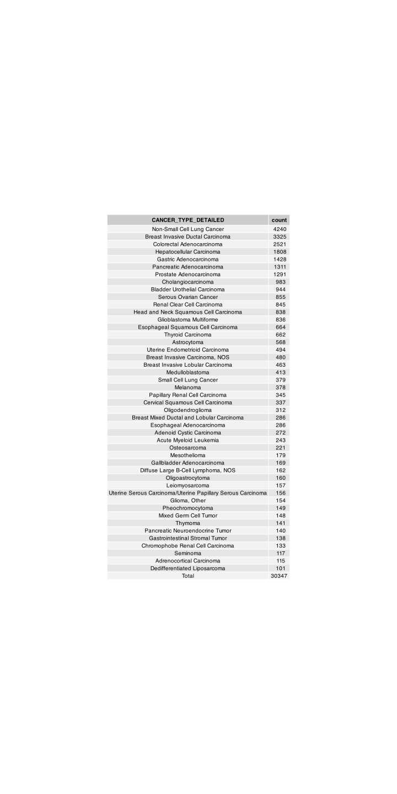

$~$

# **Generating Pivot Tables and Calculations** {#pivotsandcalc}

$~$

[]

$~$


``` r
#make pivot table based on num pts per study, sorted by descending counts for rows and columns
studyptspivot <- PivotTable$new()
studyptspivot$addData(p53muts)
studyptspivot$addRowDataGroups("studyId")
studyptspivot$defineCalculation(calculationName = "Count of distinct individuals", 
                                summariseExpression = "n_distinct(patientId)")
studyptspivot$sortRowDataGroups(levelNumber = 1,
                                orderBy = "calculation", 
                                sortOrder = "desc")
studyptspivot$evaluatePivot()

#make pivot table as dataframe for further calculations
pivotdf_studypts <- studyptspivot$asDataFrame(rowGroupsAsColumns = TRUE) %>% 
  remove_rownames()

#make pivot table based on mutation type, sorted by descending counts for rows and columns
muttypepivot <- PivotTable$new()
muttypepivot$addData(p53mutscancersover100)
muttypepivot$addRowDataGroups("CANCER_TYPE_DETAILED")
muttypepivot$addColumnDataGroups("mutationType")
muttypepivot$defineCalculation(calculationName = "Count of distinct individuals", 
                               summariseExpression = "n_distinct(patientId)")
muttypepivot$sortColumnDataGroups(levelNumber = 1, 
                                  orderBy = "calculation", 
                                  sortOrder = "desc")
muttypepivot$sortRowDataGroups(levelNumber = 1,
                               orderBy = "calculation", 
                               sortOrder = "desc")
muttypepivot$evaluatePivot()

#make pivot table as dataframe for further calculations
pivotdf <- muttypepivot$asDataFrame(rowGroupsAsColumns = TRUE) %>% 
  remove_rownames()

# make pivot table on prevalence of p53 muts across all somatic cancers

# don't really need this pivot since i can just keep total row of per cancer for overall proportion
# mutsomatic <- PivotTable$new()
# mutsomatic$addData(clindatacombined)
# mutsomatic$addRowDataGroups("p53mut")
# mutsomatic$defineCalculation(calculationName = "Count of distinct individuals", 
#                                    summariseExpression = "n_distinct(patientId)")
# mutsomatic$sortColumnDataGroups(levelNumber = 1, 
#                                       orderBy = "calculation", 
#                                       sortOrder = "desc")
# mutsomatic$sortRowDataGroups(levelNumber = 1,
#                                    orderBy = "calculation", 
#                                    sortOrder = "desc")
# mutsomatic$evaluatePivot()

muttissuesomatic <- PivotTable$new()
muttissuesomatic$addData(clindatacombined)
muttissuesomatic$addRowDataGroups("CANCER_TYPE_DETAILED")
muttissuesomatic$addColumnDataGroups("p53mut")
muttissuesomatic$defineCalculation(calculationName = "Count of distinct individuals", 
                                   summariseExpression = "n_distinct(patientId)")
muttissuesomatic$sortColumnDataGroups(levelNumber = 1, 
                                      orderBy = "calculation", 
                                      sortOrder = "desc")
muttissuesomatic$sortRowDataGroups(levelNumber = 1,
                                   orderBy = "calculation", 
                                   sortOrder = "desc")
muttissuesomatic$evaluatePivot()

# need to get actual mut prevalence across all somatic cancers
# pivottabler takes too long; make pivot table using dplyr, widen table to make cols = muts, add totals
mutpossomaticpivot <- clindatacombined_forpos %>% 
  group_by(CANCER_TYPE_DETAILED, 
           proteinChange) %>%
  summarise(n = n_distinct(patientId)) %>%
  arrange(-n)
mutpossomaticpivot <- pivot_wider(mutpossomaticpivot, 
                                  names_from = proteinChange, 
                                  values_from = n) 

# can't adorn_totals because it just adds rows and columns up, doesn't do distinct indiv like pivottabler, so need to make 1 row/col dfs of each distinct number of individuals for each position and cancer and add to pivot
# first getting distinct indivs for each mut and adding to pivot df
zed <- lapply(colnames(mutpossomaticpivot), 
              FUN = function(x) clindatacombined_forpos %>%
                subset(proteinChange == x) %>% 
                pull(patientId) %>% 
                n_distinct())
names(zed) <- colnames(mutpossomaticpivot) # ensure list names are muts
zed <- reshape2::melt(zed) %>% 
  column_to_rownames("L1") %>% 
  as.matrix() %>% 
  t() %>% 
  as.data.frame() %>% 
  remove_rownames()
zed[1,1] <- "Total" # rename 0 placeholder as Total

pivotdfpos_somatic <- bind_rows(mutpossomaticpivot,
                                zed)

# now getting distinct indivs for each cancer and adding to pivot df
zed <- lapply(mutpossomaticpivot$CANCER_TYPE_DETAILED,
              FUN = function(x) clindatacombined_forpos %>%
                subset(CANCER_TYPE_DETAILED == x) %>% 
                pull(patientId) %>% 
                n_distinct())
names(zed) <- mutpossomaticpivot$CANCER_TYPE_DETAILED
zed <- reshape2::melt(zed) %>% 
  dplyr::rename(CANCER_TYPE_DETAILED = L1,
                Total = value)

pivotdfpos_somatic <- full_join(pivotdfpos_somatic,
                                zed,
                                by = "CANCER_TYPE_DETAILED")

# add total distinct indivs as final df total
pivotdfpos_somatic[nrow(pivotdfpos_somatic),ncol(pivotdfpos_somatic)] <- n_distinct(clindatacombined_forpos$patientId)

# add num of pts who dont have mut
pivotdfpos_somatic[nrow(pivotdfpos_somatic),"NA"] <- (setdiff(unique(clindatacombined_forpos$patientId), 
                                                              unique(p53muts$patientId)) %>%
                                                        length())

# add num pts per cancer/total to cancer col, divide across for prop of muts per cancer/total, remove total col and rownames
pivotdfpos_somatic_calc <- pivotdfpos_somatic %>% 
  subset(Total >= 50) %>% # not removing bottom total since we want that as part of barchart
  mutate(CANCER_TYPE_DETAILED = paste0(CANCER_TYPE_DETAILED,
                                       " (",
                                       format(Total, 
                                              big.mark = ",", 
                                              trim = TRUE),
                                       " individuals)")) %>%
  mutate_at(vars(2:Total), 
            .funs = ~./Total) %>% 
  subset(select = -c(Total)) %>%
  remove_rownames()

# melt for tables, barcharts, heatmaps later on
pivotdfpos_somatic_melted <- pivotdfpos_somatic_calc %>%
  reshape2::melt() %>% 
  dplyr::rename(Mutation = variable, 
                Cancer = CANCER_TYPE_DETAILED, 
                Proportion = value)

# make pivot tables as dataframes for further calculations
# pivotdf_mutsomatic <- mutsomatic$asDataFrame(rowGroupsAsColumns = TRUE) %>% 
#   remove_rownames()

pivotdf_muttissuesomatic <- muttissuesomatic$asDataFrame(rowGroupsAsColumns = TRUE) %>% 
  remove_rownames()

# #add counts of cancer distinct samples to help to divide pivot table rows by # distinct samples
# cancersover100used <- cancersover100 %>% 
#   subset(cancersover100$CANCER_TYPE_DETAILED %in% pivotdf$CANCER_TYPE_DETAILED)
# pivotdfnobottomtotal <- pivotdf %>% 
#   subset(CANCER_TYPE_DETAILED != "Total")
# pivotdfnobottomtotal <- merge(pivotdfnobottomtotal, 
#                               cancersover100used, 
#                               by = "CANCER_TYPE_DETAILED")
# 
# #check correct joining of distinct sample counts to pivot table by concatenating key columns
# testagain <- as.list(paste0(cancersover100used$CANCER_TYPE_DETAILED, 
#                             cancersover100used$count))
# testagain2 <- as.list(paste0(pivotdfnobottomtotal$CANCER_TYPE_DETAILED, 
#                              pivotdfnobottomtotal$count))
# all(testagain2 %in% testagain) #should be TRUE if joined correctly as it checks if all pivot columns exactly in main
# 
# #divide pivot table rows by # distinct samples
# pivotdfnobottomtotal <- pivotdfnobottomtotal %>%
#   mutate_at(vars(2:Total), 
#             .funs = ~./count)
# 
# #remove counts and total columns so that they're not included in heatmap or any other visualization
# pivotdfnobottomtotal <- pivotdfnobottomtotal %>% 
#   subset(select = -c(count, 
#                      Total)) %>% 
#   remove_rownames()

#make heatmap with ggplot2

# #make dataframe into long form for ggplot2 
# data_melt <- reshape2::melt(pivotdfnobottomtotal) %>% 
#   dplyr::rename(Mutation = variable,
#                 Cancer = CANCER_TYPE_DETAILED, 
#                 Prevalence = value)
# head(data_melt)
# 
# #remove mutations with less than 1% prevalence in distinct samples
# data_meltover0.01 <- data_melt %>% 
#   subset(Prevalence >= 0.01)
# 
# #sort cancers by lowest to highest missense mutation prevalence for heatmap
# missensemutorder = data_meltover0.01[data_meltover0.01$Mutation == 'Missense_Mutation',]
# data_meltover0.01$Cancer = factor(data_meltover0.01$Cancer, 
#                                   levels = missensemutorder$Cancer[order(missensemutorder$Prevalence)])

#make 100% stacked barchart based on cancers with at least 100 indivs
#remove bottom total row again
pivotdfnobottomtotal100muts <- pivotdf %>% 
  subset(CANCER_TYPE_DETAILED != "Total")

#subset dataframe to cancers with at least 100 indivs ; not changing object name
pivotdfnobottomtotal100muts <- pivotdfnobottomtotal100muts %>% 
  subset(Total >= 50) %>%
  mutate(CANCER_TYPE_DETAILED = paste0(CANCER_TYPE_DETAILED,
                                       " (",
                                       format(Total, 
                                              big.mark = ",", 
                                              trim = TRUE),
                                       " individuals)"))

pivotdf_muttissuesomatic100muts <- pivotdf_muttissuesomatic %>% 
  subset(Total >= 50) %>% # not removing bottom total since we want that as part of barchart
  mutate(CANCER_TYPE_DETAILED = paste0(CANCER_TYPE_DETAILED,
                                       " (",
                                       format(Total, 
                                              big.mark = ",", 
                                              trim = TRUE),
                                       " individuals)"))

#divide each column by total # indiv
pivotdfnobottomtotal100muts <- pivotdfnobottomtotal100muts %>%
  mutate_at(vars(2:Total), 
            .funs = ~./Total)

pivotdf_muttissuesomatic100muts <- pivotdf_muttissuesomatic100muts %>%
  mutate_at(vars(2:Total), 
            .funs = ~./Total)

#remove total column so it's not included in barchart
pivotdfnobottomtotal100muts <- pivotdfnobottomtotal100muts %>% 
  subset(select = -c(Total)) %>%
  remove_rownames()

pivotdf_muttissuesomatic100muts <- pivotdf_muttissuesomatic100muts %>% 
  subset(select = -c(Total)) %>%
  remove_rownames()

#melt dataframe and rename columns to use for ggplot2 100% stacked barchart
data_barchart <- reshape2::melt(pivotdfnobottomtotal100muts) %>% 
  dplyr::rename(Mutation = variable, 
                Cancer = CANCER_TYPE_DETAILED, 
                Proportion = value)
head(data_barchart)
```

<div class="kable-table">

|Cancer                                               |Mutation          | Proportion|
|:----------------------------------------------------|:-----------------|----------:|
|Colorectal Adenocarcinoma (3,855 individuals)        |Missense_Mutation |  0.6573281|
|Non-Small Cell Lung Cancer (3,698 individuals)       |Missense_Mutation |  0.6471065|
|Breast Invasive Ductal Carcinoma (2,106 individuals) |Missense_Mutation |  0.5655271|
|Pancreatic Adenocarcinoma (1,970 individuals)        |Missense_Mutation |  0.6329949|
|Hepatocellular Carcinoma (792 individuals)           |Missense_Mutation |  0.6641414|
|Gastric Adenocarcinoma (713 individuals)             |Missense_Mutation |  0.6016830|

</div>

``` r
data_muttissuesomatic <- reshape2::melt(pivotdf_muttissuesomatic100muts) %>% 
  dplyr::rename(Mutation = variable, 
                Cancer = CANCER_TYPE_DETAILED, 
                Proportion = value)

#sort cancers by lowest to highest missense mutation proportion for stacked barchart
missensemutorderbarchart = data_barchart[data_barchart$Mutation == 'Missense_Mutation',]
data_barchart$Cancer = factor(data_barchart$Cancer, 
                              levels = missensemutorderbarchart$Cancer[order(missensemutorderbarchart$Proportion)])

# call low-frequency cancers as other for subsequent pivot tables and work
p53mutscancersover100 <- p53mutscancersover100 %>% 
  transform(Cancer_Label = ifelse(CANCER_TYPE_DETAILED %in% gsub(" \\(.*", 
                                                                 "",
                                                                 pivotdfnobottomtotal100muts$CANCER_TYPE_DETAILED),
                                  CANCER_TYPE_DETAILED, 
                                  "OTHER"))

# save table and object
write_csv(p53mutscancersover100,
          file = paste0(table_path, 
                        "p53mutscancersover100.csv"))

saveRDS(p53mutscancersover100,
        file = paste0(table_path, 
                      "p53mutscancersover100.rds"))

#make pivot tables based on mutation position, sorted by descending counts for rows and columns
# mutpospivot <- PivotTable$new()
# mutpospivot$addData(p53mutscancersover100)
# mutpospivot$addRowDataGroups("CANCER_TYPE_DETAILED")
# mutpospivot$addColumnDataGroups("proteinChange")
# mutpospivot$defineCalculation(calculationName = "Count of distinct individuals",
#                               summariseExpression = "n_distinct(patientId)")
# mutpospivot$sortColumnDataGroups(levelNumber = 1, 
#                                  orderBy = "calculation",
#                                  sortOrder = "desc")
# mutpospivot$sortRowDataGroups(levelNumber = 1, 
#                               orderBy = "calculation", 
#                               sortOrder = "desc")
# mutpospivot$evaluatePivot()

#make pivot table as dataframe for further calculations
# pivotdfpos <- mutpospivot$asDataFrame(rowGroupsAsColumns = TRUE) %>% remove_rownames()

# because pivottabler taking too long, make pivot table using dplyr, widen table to make cols = muts, add totals
mutpospivot <- p53mutscancersover100 %>% 
  group_by(CANCER_TYPE_DETAILED, 
           proteinChange) %>%
  summarise(n = n_distinct(patientId)) %>%
  arrange(-n)
mutpospivot <- pivot_wider(mutpospivot, 
                           names_from = proteinChange, 
                           values_from = n) 

# can't adorn_totals because it just adds rows and columns up, doesn't do distinct indiv like pivottabler, so need to make 1 row/col dfs of each distinct number of individuals for each position and cancer and add to pivot
# first getting distinct indivs for each mut and adding to pivot df
zed <- lapply(colnames(mutpospivot), 
              FUN = function(x) p53mutscancersover100 %>%
                subset(proteinChange == x) %>% 
                pull(patientId) %>% 
                n_distinct())
names(zed) <- colnames(mutpospivot) # ensure list names are muts
zed <- reshape2::melt(zed) %>% 
  column_to_rownames("L1") %>% 
  as.matrix() %>% 
  t() %>% 
  as.data.frame() %>% 
  remove_rownames()
zed[1,1] <- "Total" # rename 0 placeholder as Total

pivotdfpos <- bind_rows(mutpospivot,
                        zed)

# now getting distinct indivs for each cancer and adding to pivot df
zed <- lapply(mutpospivot$CANCER_TYPE_DETAILED,
              FUN = function(x) p53mutscancersover100 %>%
                subset(CANCER_TYPE_DETAILED == x) %>% 
                pull(patientId) %>% 
                n_distinct())
names(zed) <- mutpospivot$CANCER_TYPE_DETAILED
zed <- reshape2::melt(zed) %>% 
  dplyr::rename(CANCER_TYPE_DETAILED = L1,
                Total = value)

pivotdfpos <- full_join(pivotdfpos,
                        zed,
                        by = "CANCER_TYPE_DETAILED")

# although not necessary, can add total distinct indivs as final df total
pivotdfpos[nrow(pivotdfpos),ncol(pivotdfpos)] <- n_distinct(p53mutscancersover100$patientId)

# get mut pos of pts with less prevalent cancers

# prepared it this way as well just in case pivottabler becomes unusuably slow later on
# mutposotherpivot <- p53mutscancersover100 %>% 
#   subset(Cancer_Label == "OTHER") %>% 
#   group_by(CANCER_TYPE_DETAILED, 
#            proteinChange) %>%
#   summarise(n = n_distinct(patientId)) %>%
#   arrange(-n)
# mutposotherpivot <- pivot_wider(mutposotherpivot, 
#                            names_from = proteinChange, 
#                            values_from = n) 
# 
# # can't adorn_totals because it just adds rows and columns up, doesn't do distinct indiv like pivottabler, so need to make 1 row/col dfs of each distinct number of individuals for each posotherition and cancer and add to pivot
# # first getting distinct indivs for each mut and adding to pivot df
# zed <- lapply(colnames(mutposotherpivot), 
#               FUN = function(x) p53mutscancersover100 %>%
#                 subset(Cancer_Label == "OTHER") %>% 
#                 subset(proteinChange == x) %>% 
#                 pull(patientId) %>% 
#                 n_distinct())
# names(zed) <- colnames(mutposotherpivot) # ensure list names are muts
# zed <- reshape2::melt(zed) %>% 
#   column_to_rownames("L1") %>% 
#   as.matrix() %>% 
#   t() %>% 
#   as.data.frame() %>% 
#   remove_rownames()
# zed[1,1] <- "Total" # rename 0 placeholder as Total
# 
# pivotdfposother <- bind_rows(mutposotherpivot,
#                         zed)
# 
# # now getting distinct indivs for each cancer and adding to pivot df
# zed <- lapply(mutposotherpivot$CANCER_TYPE_DETAILED,
#               FUN = function(x) p53mutscancersover100 %>%
#                 subset(Cancer_Label == "OTHER") %>% 
#                 subset(CANCER_TYPE_DETAILED == x) %>% 
#                 pull(patientId) %>% 
#                 n_distinct())
# names(zed) <- mutposotherpivot$CANCER_TYPE_DETAILED
# zed <- reshape2::melt(zed) %>% 
#   dplyr::rename(CANCER_TYPE_DETAILED = L1,
#                 Total = value)
# 
# pivotdfposother <- full_join(pivotdfposother,
#                         zed,
#                         by = "CANCER_TYPE_DETAILED")
# 
# # although not necessary, can add total distinct indivs as final df total
# pivotdfposother[nrow(pivotdfposother),ncol(pivotdfposother)] <- n_distinct(
#   p53mutscancersover100 
#   %>% subset(Cancer_Label == "OTHER") %>% 
#     pull(patientId)
#   )

mutposotherpivot <- PivotTable$new()
mutposotherpivot$addData(p53mutscancersover100 %>% subset(Cancer_Label == "OTHER"))
mutposotherpivot$addRowDataGroups("CANCER_TYPE_DETAILED")
mutposotherpivot$addColumnDataGroups("proteinChange")
mutposotherpivot$defineCalculation(calculationName = "Count of distinct individuals",
                                   summariseExpression = "n_distinct(patientId)")
mutposotherpivot$sortColumnDataGroups(levelNumber = 1,
                                      orderBy = "calculation",
                                      sortOrder = "desc")
mutposotherpivot$sortRowDataGroups(levelNumber = 1,
                                   orderBy = "calculation",
                                   sortOrder = "desc")
mutposotherpivot$evaluatePivot()

# make pivot table as dataframe for further calculations
pivotdfposother <- mutposotherpivot$asDataFrame(rowGroupsAsColumns = TRUE) %>% remove_rownames()

# change T125= to T125T for grid
colnames(pivotdfposother) <- gsub("T125=",
                                  "T125T",
                                  colnames(pivotdfposother))

#make 100% stacked barchart based on cancers with at least 100 indivs
#remove bottom total row again
pivotdfposnobottomtotal <- pivotdfpos %>% 
  subset(CANCER_TYPE_DETAILED != "Total")

#subset to cancers with at least 100 total p53 indivs; not changing object name, add # indivs to cancers
pivotdfposnobottomtotal100muts <- pivotdfposnobottomtotal %>% 
  subset(Total >= 50) %>%
  mutate(CANCER_TYPE_DETAILED = paste0(CANCER_TYPE_DETAILED,
                                       " (",
                                       format(Total, 
                                              big.mark = ",", 
                                              trim = TRUE),
                                       " individuals)"))

#divide pivot table rows by # distinct indiv
pivotdfposnobottomtotal100muts <- pivotdfposnobottomtotal100muts %>%
  mutate_at(vars(2:Total), 
            .funs = ~./Total)

#remove total column so that not included in heatmap or any other visualization
pivotdfposnobottomtotal100muts <- pivotdfposnobottomtotal100muts %>% 
  subset(select = -c(Total))

# #make dataframe into long form for ggplot2 
# datapos_melt <- reshape2::melt(pivotdfposnobottomtotal100muts) %>% 
#   dplyr::rename(Mutation = variable, 
#                 Cancer = CANCER_TYPE_DETAILED, 
#                 Prevalence = value) 
# head(datapos_melt)
# 
# #remove mutations with less than 1% prevalence in distinct samples
# datapos_meltover0.01 <- datapos_melt %>% 
#   subset(Prevalence >= 0.01) 

# also get mut types of less common cancers
muttypeotherpivot <- PivotTable$new()
muttypeotherpivot$addData(p53mutscancersover100 %>% subset(Cancer_Label == "OTHER"))
muttypeotherpivot$addRowDataGroups("CANCER_TYPE_DETAILED")
muttypeotherpivot$addColumnDataGroups("mutationType")
muttypeotherpivot$defineCalculation(calculationName = "Count of distinct individuals", 
                                    summariseExpression = "n_distinct(patientId)")
muttypeotherpivot$sortColumnDataGroups(levelNumber = 1, 
                                       orderBy = "calculation", 
                                       sortOrder = "desc")
muttypeotherpivot$sortRowDataGroups(levelNumber = 1,
                                    orderBy = "calculation", 
                                    sortOrder = "desc")
muttypeotherpivot$evaluatePivot()

#make pivot table as dataframe for further calculations
pivotdf_othercancers <- muttypeotherpivot$asDataFrame(rowGroupsAsColumns = TRUE) %>% 
  remove_rownames()

# can't really make pivots of ages because not sufficiently annotated, CODE NOT EDITED FOR MOST ACCURACY
# make pivot tables of age vs cancer, age vs mutation type, and age vs pos
agetissue <- PivotTable$new()
agetissue$addData(p53mutscancersover100)
agetissue$addRowDataGroups("Age_stratum")
agetissue$addColumnDataGroups("Cancer_Label")
agetissue$defineCalculation(calculationName = "Count of distinct individuals",
                            summariseExpression = "n_distinct(patientId)")
agetissue$sortColumnDataGroups(levelNumber = 1,
                               orderBy = "calculation",
                               sortOrder = "desc")
agetissue$sortRowDataGroups(levelNumber = 1,
                            orderBy = "calculation",
                            sortOrder = "desc")
agetissue$evaluatePivot() #doing this instead of renderPivot() which takes too long as it shows an actual pivot table, but we need this as a dataframe anyways for calculations later so we don't need to print a pivot table

# get ages of pts with less common cancers
agetissueother <- PivotTable$new()
agetissueother$addData(p53mutscancersover100 %>% subset(Cancer_Label == "OTHER"))
agetissueother$addRowDataGroups("CANCER_TYPE_DETAILED")
agetissueother$addColumnDataGroups("Age_stratum")
agetissueother$defineCalculation(calculationName = "Count of distinct individuals",
                                 summariseExpression = "n_distinct(patientId)")
agetissueother$sortColumnDataGroups(levelNumber = 1,
                                    orderBy = "calculation",
                                    sortOrder = "desc")
agetissueother$sortRowDataGroups(levelNumber = 1,
                                 orderBy = "calculation",
                                 sortOrder = "desc")
agetissueother$evaluatePivot() #doing this instead of renderPivot() which takes too long as it shows an actual pivot table, but we need this as a dataframe anyways for calculations later so we don't need to print a pivot table

# agetype <- PivotTable$new()
# agetype$addData(p53mutscancersover100)
# agetype$addRowDataGroups("Age_stratum")
# agetype$addColumnDataGroups("mutationType") 
# agetype$defineCalculation(calculationName = "Count of distinct individuals", 
#                                 summariseExpression = "n_distinct(patientId)")
# agetype$sortColumnDataGroups(levelNumber = 1, 
#                                    orderBy = "calculation", 
#                                    sortOrder = "desc")
# agetype$sortRowDataGroups(levelNumber = 1, 
#                                 orderBy = "calculation", 
#                                 sortOrder = "desc")
# agetype$evaluatePivot() #doing this instead of renderPivot() which takes too long as it shows an actual pivot table, but we need this as a dataframe anyways for calculations later so we don't need to print a pivot table
# 
#make pivot tables as dataframes for further calculations
pivotage <- agetissue$asDataFrame(rowGroupsAsColumns = TRUE) %>%
  remove_rownames()

pivotage_othercancers <- agetissueother$asDataFrame(rowGroupsAsColumns = TRUE) %>%
  remove_rownames()

# pivotage_type <- agetype$asDataFrame(rowGroupsAsColumns = TRUE) %>% 
#   remove_rownames()
# 
# typical way to make pivot table of positions with pivottabler package:
# agepos <- PivotTable$new()
# agepos$addData(p53mutscancersover100)
# agepos$addRowDataGroups("Age_stratum")
# agepos$addColumnDataGroups("proteinChange") 
# agepos$defineCalculation(calculationName = "Count of distinct individuals", 
#                                summariseExpression = "n_distinct(patientId)")
# agepos$sortColumnDataGroups(levelNumber = 1, 
#                                   orderBy = "calculation", 
#                                   sortOrder = "desc")
# agepos$sortRowDataGroups(levelNumber = 1, 
#                                orderBy = "calculation", 
#                                sortOrder = "desc")
# agepos$evaluatePivot() #doing this instead of renderPivot() which takes too long as it shows an actual pivot table, but we need this as a dataframe anyways for calculations later so we don't need to print a pivot table

#make pivot tables as dataframes for further calculations
# pivotage_pos <- agepos$asDataFrame(rowGroupsAsColumns = TRUE) %>% 
#   remove_rownames()

# #however, since pivot table of positions takes too long to make with this package, do via dplyr instead as below:
# # because pivottabler taking too long, make pivot table using dplyr, widen table to make cols = muts, add totals 
# agepos <- p53mutscancersover100 %>% 
#   dplyr::count(Age_stratum, 
#                proteinChange, 
#                sort = TRUE)
# agepos <- pivot_wider(agepos, 
#                             names_from = proteinChange, 
#                             values_from = n) 
# pivotage_pos <- adorn_totals(agepos, 
#                                    where = c("row", "col"))

# make pivot tables of sex vs cancer, sex vs mutation type, and sex vs pos
sextissue <- PivotTable$new()
sextissue$addData(p53mutscancersover100)
sextissue$addRowDataGroups("SEX")
sextissue$addColumnDataGroups("Cancer_Label") 
sextissue$defineCalculation(calculationName = "Count of distinct individuals", 
                            summariseExpression = "n_distinct(patientId)")
sextissue$sortColumnDataGroups(levelNumber = 1, 
                               orderBy = "calculation", 
                               sortOrder = "desc")
sextissue$sortRowDataGroups(levelNumber = 1, 
                            orderBy = "calculation", 
                            sortOrder = "desc")
sextissue$evaluatePivot() #doing this instead of renderPivot() which takes too long as it shows an actual pivot table, but we need this as a dataframe anyways for calculations later so we don't need to print a pivot table

# get sexes of pts with less common cancers
sextissueother <- PivotTable$new()
sextissueother$addData(p53mutscancersover100 %>% subset(Cancer_Label == "OTHER"))
sextissueother$addRowDataGroups("CANCER_TYPE_DETAILED") 
sextissueother$addColumnDataGroups("SEX")
sextissueother$defineCalculation(calculationName = "Count of distinct individuals", 
                                 summariseExpression = "n_distinct(patientId)")
sextissueother$sortColumnDataGroups(levelNumber = 1, 
                                    orderBy = "calculation", 
                                    sortOrder = "desc")
sextissueother$sortRowDataGroups(levelNumber = 1, 
                                 orderBy = "calculation", 
                                 sortOrder = "desc")
sextissueother$evaluatePivot() #doing this instead of renderPivot() which takes too long as it shows an actual pivot table, but we need this as a dataframe anyways for calculations later so we don't need to print a pivot table

sextype <- PivotTable$new()
sextype$addData(p53mutscancersover100)
sextype$addRowDataGroups("SEX")
sextype$addColumnDataGroups("mutationType") 
sextype$defineCalculation(calculationName = "Count of distinct individuals", 
                          summariseExpression = "n_distinct(patientId)")
sextype$sortColumnDataGroups(levelNumber = 1, 
                             orderBy = "calculation", 
                             sortOrder = "desc")
sextype$sortRowDataGroups(levelNumber = 1, 
                          orderBy = "calculation", 
                          sortOrder = "desc")
sextype$evaluatePivot() #doing this instead of renderPivot() which takes too long as it shows an actual pivot table, but we need this as a dataframe anyways for calculations later so we don't need to print a pivot table

# get freq of codons affected
codonfreqdf <- p53mutscancersover100 %>% 
  mutate(Codon = abs((parse_number(as.character(proteinChange), 
                                   na = character())))) %>%
  mutate(Codon = ifelse(grepl("_", # assign indefinite splices, indels, etc as 0 like germline
                              proteinChange),
                        0, 
                        Codon))

codonfreq <- PivotTable$new()
codonfreq$addData(codonfreqdf)
codonfreq$addRowDataGroups("Codon") 
codonfreq$defineCalculation(calculationName = "Count of distinct individuals", 
                            summariseExpression = "n_distinct(patientId)")
codonfreq$sortColumnDataGroups(levelNumber = 1, 
                               orderBy = "calculation", 
                               sortOrder = "desc")
codonfreq$sortRowDataGroups(levelNumber = 1, 
                            orderBy = "calculation", 
                            sortOrder = "desc")
codonfreq$evaluatePivot() #doing this instead of renderPivot() which takes too long as it shows an actual pivot table, but we need this as a dataframe anyways for calculations later so we don't need to print a pivot table

#make pivot tables as dataframes for further calculations
pivotsex <- sextissue$asDataFrame(rowGroupsAsColumns = TRUE) %>% 
  remove_rownames()

pivotsex_othercancers <- sextissueother$asDataFrame(rowGroupsAsColumns = TRUE) %>% 
  remove_rownames()

pivotsex_type <- sextype$asDataFrame(rowGroupsAsColumns = TRUE) %>% 
  remove_rownames()

pivotcodonfreq <- codonfreq$asDataFrame(rowGroupsAsColumns = TRUE) %>% 
  remove_rownames()

# typical way to make pivot table of positions with pivottabler packsex:
# sexpos <- PivotTable$new()
# sexpos$addData(p53mutscancersover100)
# sexpos$addRowDataGroups("SEX")
# sexpos$addColumnDataGroups("proteinChange") 
# sexpos$defineCalculation(calculationName = "Count of distinct individuals", 
#                                summariseExpression = "n_distinct(patientId)")
# sexpos$sortColumnDataGroups(levelNumber = 1, 
#                                   orderBy = "calculation", 
#                                   sortOrder = "desc")
# sexpos$sortRowDataGroups(levelNumber = 1, 
#                                orderBy = "calculation", 
#                                sortOrder = "desc")
# sexpos$evaluatePivot() #doing this instead of renderPivot() which takes too long as it shows an actual pivot table, but we need this as a dataframe anyways for calculations later so we don't need to print a pivot table

#make pivot tables as dataframes for further calculations
# pivotsex_pos <- sexpos$asDataFrame(rowGroupsAsColumns = TRUE) %>% 
#   remove_rownames()

#however, since pivot table of positions takes too long to make with this packsex, do via dplyr instead as below:
# because pivottabler taking too long, make pivot table using dplyr, widen table to make cols = muts, add totals 
sexpos <- p53mutscancersover100 %>% 
  group_by(SEX, 
           proteinChange) %>%
  summarise(n = n_distinct(patientId)) %>%
  arrange(-n)
sexpos <- pivot_wider(sexpos, 
                      names_from = proteinChange, 
                      values_from = n) 

# can't adorn_totals because it just adds rows and columns up, doesn't do distinct indiv like pivottabler, so need to make 1 row/col dfs of each distinct number of individuals for each position and cancer and add to pivot
# first getting distinct indivs for each mut and adding to pivot df
zed <- lapply(colnames(sexpos), 
              FUN = function(x) p53mutscancersover100 %>%
                subset(proteinChange == x) %>% 
                pull(patientId) %>% 
                n_distinct())
names(zed) <- colnames(sexpos) # ensure list names are muts
zed <- reshape2::melt(zed) %>% 
  column_to_rownames("L1") %>% 
  as.matrix() %>% 
  t() %>% 
  as.data.frame() %>% 
  remove_rownames()
zed[1,1] <- "Total" # rename 0 placeholder as Total

pivotsex_pos <- bind_rows(sexpos,
                          zed)

# now getting distinct indivs for each cancer and adding to pivot df
zed <- lapply(sexpos$SEX,
              FUN = function(x) p53mutscancersover100 %>%
                subset(SEX == x) %>% 
                pull(patientId) %>% 
                n_distinct())
names(zed) <- sexpos$SEX
zed <- reshape2::melt(zed) %>% 
  dplyr::rename(SEX = L1,
                Total = value)

pivotsex_pos <- full_join(pivotsex_pos,
                          zed,
                          by = "SEX")

# although not necessary, can add total distinct indivs as final df total
pivotsex_pos[nrow(pivotsex_pos),ncol(pivotsex_pos)] <- n_distinct(p53mutscancersover100$patientId)

#remove bottom total row from dataframes so that it doesn't interfere with things later
pivotagenobottom <- pivotage %>%
  subset(Age_stratum != "Total") %>%
  mutate(Age_stratum = paste0(Age_stratum,
                              " (",
                              format(Total, 
                                     big.mark = ",", 
                                     trim = TRUE),
                              " individuals)")) %>%
  remove_rownames()
# pivotage_typenobottom <- pivotage_type %>% 
#   subset(Age_stratum != "Total") %>% 
#   remove_rownames()
# pivotage_posnobottom <- pivotage_pos %>% 
#   subset(Age_stratum != "Total" | is.na(Age_stratum)) %>% 
#   remove_rownames()
pivotsexnobottom <- pivotsex %>% 
  subset(SEX != "Total") %>% 
  mutate(SEX = paste0(SEX,
                      " (",
                      format(Total, 
                             big.mark = ",", 
                             trim = TRUE),
                      " individuals)")) %>%
  remove_rownames()
pivotsex_typenobottom <- pivotsex_type %>% 
  subset(SEX != "Total") %>% 
  mutate(SEX = paste0(SEX,
                      " (",
                      format(Total, 
                             big.mark = ",", 
                             trim = TRUE),
                      " individuals)")) %>%
  remove_rownames()
pivotsex_posnobottom <- pivotsex_pos %>% 
  subset(SEX != "Total") %>% 
  mutate(SEX = paste0(SEX,
                      " (",
                      format(Total, 
                             big.mark = ",", 
                             trim = TRUE),
                      " individuals)")) %>%
  remove_rownames()

#subset dataframes to cancers and age strata with at least 100 indiv (should not cause any changes as all are over 100 anyways); not changing object names but less than 100 indivs now
pivotagenobottom100muts <- pivotagenobottom %>%
  subset(Total >= 50) %>% 
  remove_rownames()
# pivotage_typenobottom100muts <- pivotage_typenobottom %>% 
#   subset(Total >= 100) %>% 
#   remove_rownames() 
# pivotage_posnobottom100muts <- pivotage_posnobottom %>% 
#   subset(Total >= 100) %>% 
#   remove_rownames() 
pivotsexnobottom100muts <- pivotsexnobottom %>% 
  subset(Total >= 50) %>% 
  remove_rownames()
pivotsex_typenobottom100muts <- pivotsex_typenobottom %>% 
  subset(Total >= 50) %>% 
  remove_rownames() 
pivotsex_posnobottom100muts <- pivotsex_posnobottom %>% 
  subset(Total >= 50) %>% 
  remove_rownames() 

#divide each column in dataframes by total number of mutations to get proportions
pivotagenobottom100muts <- pivotagenobottom100muts %>%
  mutate_at(vars(2:Total),
            .funs = ~./Total) %>%
  remove_rownames()
# pivotage_typenobottom100muts <- pivotage_typenobottom100muts %>%
#   mutate_at(vars(2:Total), 
#             .funs = ~./Total) %>% 
#   remove_rownames()
# pivotage_posnobottom100muts <- pivotage_posnobottom100muts %>%
#   mutate_at(vars(2:Total), 
#             .funs = ~./Total) %>% 
#   remove_rownames()
pivotsexnobottom100muts <- pivotsexnobottom100muts %>%
  mutate_at(vars(2:Total), 
            .funs = ~./Total) %>% 
  remove_rownames()
pivotsex_typenobottom100muts <- pivotsex_typenobottom100muts %>%
  mutate_at(vars(2:Total), 
            .funs = ~./Total) %>% 
  remove_rownames()
pivotsex_posnobottom100muts <- pivotsex_posnobottom100muts %>%
  mutate_at(vars(2:Total), 
            .funs = ~./Total) %>% 
  remove_rownames()

#remove total column so it's not included in heatmaps
pivotagenobottom100muts <- pivotagenobottom100muts %>%
  subset(select = -c(Total)) %>%
  remove_rownames()
# pivotage_typenobottom100muts <- pivotage_typenobottom100muts %>% 
#   subset(select = -c(Total)) %>% 
#   remove_rownames()
# pivotage_posnobottom100muts <- pivotage_posnobottom100muts %>% 
#   subset(select = -c(Total)) %>% 
#   remove_rownames()
pivotsexnobottom100muts <- pivotsexnobottom100muts %>% 
  subset(select = -c(Total)) %>% 
  remove_rownames()
pivotsex_typenobottom100muts <- pivotsex_typenobottom100muts %>% 
  subset(select = -c(Total)) %>% 
  remove_rownames()
pivotsex_posnobottom100muts <- pivotsex_posnobottom100muts %>% 
  subset(select = -c(Total)) %>% 
  remove_rownames()

# need to only have cancers which have 100 indiv or more
# remove columns which don't have at least 100 indiv after checking df and using colnames() to see which cols to keep (actually at least 50 indiv)
# not needed now that other labelled as such
# pivotagenobottom100muts <- pivotagenobottom100muts %>% 
#  dplyr::select(c(1:36)) 
# pivotsexnobottom100muts <- pivotsexnobottom100muts %>% 
#  dplyr::select(c(1:36)) 

#melt dataframes and rename columns (not doing ggplot2 heatmap which requires melted data but easier to work with melted dataframes as can impose threshold cutoffs easier later on if needed, and need to melt for ggplot2 stacked barchart anyways)
pivotage_melted <- reshape2::melt(pivotagenobottom100muts) %>%
  dplyr::rename(Cancer = variable,
                Age = Age_stratum,
                Proportion = value)
# pivotage_type_melted <- reshape2::melt(pivotage_typenobottom100muts) %>% 
#   dplyr::rename(Mutation = variable, 
#                 Age = Age_stratum, 
#                 Proportion = value) 
# pivotage_pos_melted <- reshape2::melt(pivotage_posnobottom100muts) %>% 
#   dplyr::rename(Mutation = variable, 
#                 Age = Age_stratum, 
#                 Proportion = value)
pivotsex_melted <- reshape2::melt(pivotsexnobottom100muts) %>% 
  dplyr::rename(Cancer = variable, 
                Proportion = value) 
pivotsex_type_melted <- reshape2::melt(pivotsex_typenobottom100muts) %>% 
  dplyr::rename(Mutation = variable, 
                Proportion = value) 
pivotsex_pos_melted <- reshape2::melt(pivotsex_posnobottom100muts) %>% 
  dplyr::rename(Mutation = variable, 
                Proportion = value)

# #rename NA text rows in age pivot tables to "No age listed"
pivotage_melted$Age <- str_replace(pivotage_melted$Age, 
                                   "NA", 
                                   "No age listed")

# pivotage_melted$Age[pivotage_melted$Age == 'NA'] <- 'No age listed'
# pivotage_type_melted$Age[pivotage_type_melted$Age == 'NA'] <- 'No age listed'
# pivotage_pos_melted$Age[pivotage_pos_melted$Age == 'NA'] <- 'No age listed'

# #remove mutations with no age listed since analysis is specifically looking for age-associated mutations
# pivotage_melted <- pivotage_melted %>% 
#   subset(Age != 'No age listed')
# pivotage_type_melted <- pivotage_type_melted %>% 
#   subset(Age != 'No age listed')
# pivotage_pos_melted <- pivotage_pos_melted %>% 
#   subset(Age != 'No age listed')

#remove mutated codons with less than 1% proportion in total mutations (not needed for mutation types)
# pivotage_pos_melted_over0.01 <- pivotage_pos_melted %>% 
#   subset(Proportion >= 0.01) %>%
#   remove_rownames()
pivotsex_pos_melted_over0.01 <- pivotsex_pos_melted %>% 
  subset(Mutation %in% (pivotsex_pos_melted %>%
                          subset(Proportion >= 0.01) %>%
                          pull(Mutation) %>%
                          unique() %>%
                          as.vector())) %>%
  remove_rownames()

#sort cancers by lowest to highest missense mutation proportion for stacked barchart
# barchartorder_age = pivotage_type_melted[pivotage_type_melted$Mutation == 'Missense_Mutation',]
# pivotage_type_melted$Age = factor(pivotage_type_melted$Age, 
#                                         levels = barchartorder_age$Age[order(barchartorder_age$Proportion)])

# barchartorder_age_tissue = pivotage_melted[pivotage_melted$Cancer == 'Breast Invasive Ductal Carcinoma',]
# pivotage_melted$Age = factor(pivotage_melted$Age, 
#                                         levels = barchartorder_age_tissue$Age[order(barchartorder_age_tissue$Proportion)])
# 
barchartorder_sex = pivotsex_type_melted[pivotsex_type_melted$Mutation == 'Missense_Mutation',]
pivotsex_type_melted$SEX = factor(pivotsex_type_melted$SEX, 
                                  levels = barchartorder_sex$SEX[order(barchartorder_sex$Proportion)])

# barchartorder_sex_tissue = pivotsex_melted[pivotsex_melted$Cancer == 'Breast Invasive Ductal Carcinoma',]
# pivotsex_melted$SEX = factor(pivotsex_melted$SEX, 
#                                    levels = barchartorder_sex_tissue$SEX[order(barchartorder_sex_tissue$Proportion)])

# make OTHER as last level in list of cancers for barchart
pivotage_melted$Cancer <- factor(pivotage_melted$Cancer,
                                 levels = as.character(c((sort(levels(pivotage_melted$Cancer)))[(sort(levels(pivotage_melted$Cancer))) != "OTHER"],
                                                         "OTHER")))

# make OTHER as last level in list of cancers for barchart
pivotsex_melted$Cancer <- factor(pivotsex_melted$Cancer,
                                 levels = as.character(c((sort(levels(pivotsex_melted$Cancer)))[(sort(levels(pivotsex_melted$Cancer))) != "OTHER"],
                                                         "OTHER")))

#melt dataframe although not doing ggplot because easier to identify ≥ 1% proportion mutated codons
datapospheatmap_melt <- reshape2::melt(pivotdfposnobottomtotal100muts) %>% 
  dplyr::rename(Mutation = variable, 
                Cancer = CANCER_TYPE_DETAILED, 
                Proportion = value) 
head(datapospheatmap_melt)
```

<div class="kable-table">

|Cancer                                               |Mutation | Proportion|
|:----------------------------------------------------|:--------|----------:|
|Colorectal Adenocarcinoma (3,855 individuals)        |R175H    |  0.0967575|
|Pancreatic Adenocarcinoma (1,970 individuals)        |R175H    |  0.0695431|
|Hepatocellular Carcinoma (792 individuals)           |R175H    |  0.0037879|
|Breast Invasive Ductal Carcinoma (2,106 individuals) |R175H    |  0.0436847|
|Non-Small Cell Lung Cancer (3,698 individuals)       |R175H    |  0.0140617|
|Gastric Adenocarcinoma (713 individuals)             |R175H    |  0.0504909|

</div>

``` r
#remove mutations with less than 1% proportion in total indivs
datapospheatmap_meltover0.01 <- datapospheatmap_melt %>% 
  subset(Mutation %in% (datapospheatmap_melt %>% 
                          subset(Proportion >= 0.01) %>%
                          pull(Mutation) %>% 
                          unique() %>% 
                          as.vector()))
```

$~$

# **Preparing Heatmap Annotations** {#heatmapannot}

$~$


``` r
#need to prepare pheatmap clustering heatmap, with tissue types as row annotations and p53 domains and sorted positions as column annotations
#make 2 dataframes of annotations, either with rownames as cancer types or p53 mutations, so that columns of 1 dataframe have cancer tissue for row annotations and 2nd dataframe has codon number and domain for column annotations - dataframes are what will be added to pheatmap
#for heatmaps, display whatever has at least 1% value AND display all unfiltered data
#remake mutation type heatmap with tissue clustering and position heatmap with tissue and domain clustering and sorted order of codons

#sort cancers by lowest to highest point mutation prevalence for heatmap (all cancers must have this mutation at 1% prevalence otherwise it will make cancers NA)
#mutposorder = datapos_meltover0.01[datapos_meltover0.01$Mutation == 'R248Q',]
#datapos_meltover0.01$Cancer = factor(datapos_meltover0.01$Cancer, levels = mutposorder$Cancer[order(mutposorder$Prevalence, na.last = FALSE)])

# #create new dataframe of positions with 1% prevalence and keep distinct positions
# posused <- data.frame(datapos_meltover0.01$Mutation, 
#                       stringsAsFactors = FALSE) %>% 
#   dplyr::rename(Mutation = datapos_meltover0.01.Mutation) %>% 
#   distinct() %>% 
#   remove_rownames()
# head(posused)
# 
# #add codon number to dataframe of positions at 1% prevalence 
# posused <- posused %>% 
#   mutate(Codon = parse_number(as.character(Mutation), 
#                               na = character())) %>% 
#   remove_rownames()

# #add p53 domains to dataframe of positions at 1% prevalence (domain positions defined per Joruiz et al. Cancers (Basel) 2020 doi: 10.3390/cancers12113422 Figure 1; DBD loops defined per Cho et al Science 1994 doi: 10.1126/science.8023157)
# posused <- posused %>% 
#   transform(Domain = ifelse(Codon <= 39, 
#                             "TAD1", 
#                             "notyet")) %>% 
#   transform(Domain = ifelse(Codon >= 40 & Codon <= 61, 
#                             "TAD2", 
#                             Domain)) %>% 
#   transform(Domain = ifelse(Codon >= 62 & Codon <= 93, 
#                             "PRD", 
#                             Domain)) %>% 
#   transform(Domain = ifelse(Codon >= 94 & Codon <= 289, 
#                             "DBD",
#                             Domain)) %>% 
#   transform(Domain = ifelse(Codon >= 112 & Codon <= 124, 
#                             "DBD L1 loop", 
#                             Domain)) %>% 
#   transform(Domain = ifelse(Codon >= 163 & Codon <= 195, 
#                             "DBD L2 loop", 
#                             Domain)) %>% 
#   transform(Domain = ifelse(Codon >= 236 & Codon <= 251, 
#                             "DBD L3 loop", 
#                             Domain)) %>% 
#   transform(Domain = ifelse(Codon >= 290 & Codon <= 324, 
#                             "HD", 
#                             Domain)) %>% 
#   transform(Domain = ifelse(Codon >= 325 & Codon <= 356, 
#                             "OD", 
#                             Domain)) %>% 
#   transform(Domain = ifelse(Codon >= 357, 
#                             "CTD", 
#                             Domain))

#add residue function to dataframe of positions
#pull out key columns needed for annotation i.e. codon number and residue function, condense down to distinct codons
length(unique(origfunction$Codon_number)) # tells you how many distinct codons there should be in final data
origfxcleaned <- origfunction %>% 
  dplyr::select(c(Codon_number, 
                  ProtDescription,
                  Residue_function,
                  SIFTClass,
                  DNE_LOFclass))  %>%
  mutate(ProtDescription = gsub("p.",
                                "",
                                ProtDescription)) %>% 
  distinct()

#sort by ascending codon
origfxcleaned <- origfxcleaned[order(origfxcleaned$Codon_number),] %>% 
  remove_rownames()

#rename codon_number column to codon and protdescription to mutation to facilitate merging dataframes later
origfxcleaned <- origfxcleaned %>% 
  dplyr::rename(Codon = Codon_number,
                Mutation = ProtDescription)

# #merge residue functions to posused dataframe
# posused <- left_join(posused, 
#                       origfxcleaned, 
#                       by = "Codon")
# 
# #sort position dataframe by ascending codon
# posused <- posused[order(posused$Codon),] %>% 
#   remove_rownames()
# head(posused)
# 
# #need rownames to be things to match for annotation in pheatmap, so add positions to rownames
# rownames(posused) <- posused$Mutation
# head(posused)
# 
# #as some annotations are NA and will not show up in heatmap annotations, need to actually write cells as NA text
# posused <- posused %>% 
#   replace_na(list(Domain = 'NA', 
#                   Residue_function = 'NA'))
# 
# #create new dataframe of cancers which are used in heatmap and keep distinct cancers 
# cancersused <- data.frame(datapos_meltover0.01$Cancer, 
#                           stringsAsFactors = FALSE) %>% 
#   dplyr::rename(Cancer = datapos_meltover0.01.Cancer) %>% 
#   distinct() %>% 
#   remove_rownames()
# head(cancersused)
# 
# #add tissue to dataframe of cancer 
# cancersused <- cancersused %>% 
#   transform(Tissue = ifelse(Cancer %in% c("Breast Invasive Carcinoma (NOS)", 
#                                           "Breast Invasive Ductal Carcinoma"), 
#                             "Breast", 
#                             "notyet")) %>% 
#   transform(Tissue = ifelse(Cancer %in% c("Anaplastic Astrocytoma",
#                                           "Astrocytoma", 
#                                           "Glioblastoma Multiforme", 
#                                           "Oligoastrocytoma"), 
#                             "Brain", 
#                             Tissue)) %>% 
#   transform(Tissue = ifelse(Cancer %in% c("Bladder Urothelial Carcinoma"),
#                             "Bladder", 
#                             Tissue)) %>% 
#   transform(Tissue = ifelse(Cancer %in% c("Colon Adenocarcinoma", 
#                                           "Colorectal Adenocarcinoma", 
#                                           "Rectal Adenocarcinoma"), 
#                             "Colon/Rectum", 
#                             Tissue)) %>% 
#   transform(Tissue = ifelse(Cancer %in% c("Esophageal Adenocarcinoma",
#                                           "Esophageal Squamous Cell Carcinoma",
#                                           "Gastric Adenocarcinoma", 
#                                           "Ampullary Carcinoma", 
#                                           "Cholangiocarcinoma", 
#                                           "Extrahepatic Cholangiocarcinoma",
#                                           "Gallbladder Adenocarcinoma", 
#                                           "Hepatocellular Carcinoma", 
#                                           "Hepatocellular Carcinoma plus Intrahepatic Cholangiocarcinoma",
#                                           "Intrahepatic Cholangiocarcinoma", 
#                                           "Pancreatic Adenocarcinoma"), 
#                             "Foregut", 
#                             Tissue)) %>% 
#   transform(Tissue = ifelse(Cancer %in% c("Cutaneous Melanoma", "Melanoma",
#                                           "Cutaneous Squamous Cell Carcinoma", 
#                                           "Skin Cancer, Non-Melanoma"), 
#                             "Skin",
#                             Tissue)) %>% 
#   transform(Tissue = ifelse(Cancer %in% c("High-Grade Serous Ovarian Cancer", 
#                                           "Serous Ovarian Cancer",
#                                           "Uterine Carcinosarcoma/Uterine Malignant Mixed Mullerian Tumor", 
#                                           "Uterine Endometrioid Carcinoma",
#                                           "Uterine Serous Carcinoma/Uterine Papillary Serous Carcinoma"),
#                             "Gynecologic", 
#                             Tissue)) %>% 
#   transform(Tissue = ifelse(Cancer %in% c("Lung Squamous Cell Carcinoma",
#                                           "Non-Small Cell Lung Cancer", 
#                                           "Small Cell Lung Cancer"), 
#                             "Lung", 
#                             Tissue)) %>% 
#   transform(Tissue = ifelse(Cancer %in% c("Head and Neck Squamous Cell Carcinoma"),
#                             "Head and Neck", 
#                             Tissue)) %>%
#   transform(Tissue = ifelse(Cancer %in% c("Leiomyosarcoma"),
#                             "Smooth Muscle",
#                             Tissue)) %>%
#   transform(Tissue = ifelse(Cancer %in% c("Osteosarcoma"),
#                             "Bone",
#                             Tissue)) %>%
#   transform(Tissue = ifelse(Cancer %in% c("Prostate Adenocarcinoma"),
#                             "Prostate", 
#                             Tissue))
# 
# #add germ layers to dataframe of cancer
# cancersused <- cancersused %>%
#   transform(Germ_Layer = ifelse(Tissue %in% c("Foregut", 
#                                               "Bladder", 
#                                               "Colon/Rectum",
#                                               "Lung", 
#                                               "Prostate"), 
#                                 "Endoderm", 
#                                 "notyet")) %>% 
#   transform(Germ_Layer = ifelse(Tissue %in% c("Blood", 
#                                               "Smooth Muscle",
#                                               "Bone",
#                                               "Gynecologic"), 
#                                 "Mesoderm", 
#                                 Germ_Layer)) %>% 
#   transform(Germ_Layer = ifelse(Tissue %in% c("Skin", 
#                                               "Brain", 
#                                               "Breast"), 
#                                 "Ectoderm", 
#                                 Germ_Layer)) %>% 
#   transform(Germ_Layer = ifelse(Tissue %in% c("Head and Neck"), 
#                                 "Ectoderm/Endoderm", 
#                                 Germ_Layer))
# 
# #sort dataframe of cancer by alphabetical germ layer, alphabetical tissue, and then by alphabetical cancer
# cancersused <- cancersused[with(cancersused, 
#                                 order(Germ_Layer, 
#                                       Tissue, 
#                                       Cancer)), ] %>% 
#   remove_rownames()
# head(cancersused)
# 
# #need rownames to be things to match for annotation in pheatmap, so add cancers to rownames
# rownames(cancersused) <- cancersused$Cancer
# head(cancersused)

# #convert melted dataframe to matrix for pheatmap, filling anything below 0.01 as 0 although not 0 in reality, just placeholder to not have errors in making heatmap later on
# pos_matrix <- datapos_meltover0.01 %>% 
#   reshape2::acast(Cancer ~ Mutation, 
#                   value.var = 'Prevalence', 
#                   fill = '0')
# class(pos_matrix) <- "numeric"
# 
# #set up annotation dataframes to just have column used for annotation, otherwise all columns used for annotation in heatmap
# posused_annotate <- posused %>% 
#  dplyr::select(-c(Mutation,
#             Codon))
# cancersused_annotate <- cancersused %>%
#  dplyr::select(-Cancer)

# #order domain by p53 domain and residue function as factors so that they are maintained in legend too
# unique(posused_annotate$Domain) #to find list of domains in order to use as factors
# posused_annotate$Domain <- factor(posused_annotate$Domain, 
#                                   levels = c("TAD1", 
#                                              "PRD", 
#                                              "DBD", 
#                                              "DBD L2 loop", 
#                                              "DBD L3 loop", 
#                                              "HD", 
#                                              "OD"))
# 
# sort(as.vector(unique(posused_annotate$Residue_function))) #to find list of residue functions in order to use as factors
# posused_annotate$Residue_function <- factor(posused_annotate$Residue_function, 
#                                             levels = c("ADP-ribosylation",
#                                                        "Buried", 
#                                                        "DNA binding", 
#                                                        "Exposed", 
#                                                        "Partially exposed", 
#                                                        "Phosphorylation site",  
#                                                        "Tetramerisation", 
#                                                        "Zn binding", 
#                                                        "NA"))
#create pheatmap
#library(pheatmap)
# color <- colorRampPalette((c("white", "red")))(50)
# display.brewer.all(colorblindFriendly = TRUE)
# annotationcolor <- list(Domain = RColorBrewer::brewer.pal(n = 7, 
#                                                           name = "Set2"), 
#                         Residue_function = RColorBrewer::brewer.pal(n = 9,
#                                                                     name = "Pastel1"),
#                         Tissue = RColorBrewer::brewer.pal(n = 11, 
#                                                           name = "Paired"),
#                         Germ_Layer = RColorBrewer::brewer.pal(n = 4,
#                                                               name = "Dark2"))
# annotationcolornamed <- list(Domain = c(TAD1 = "#E78AC3", 
#                                         PRD = "#FC8D62", 
#                                         DBD = "#E5C494", 
#                                         `DBD L2 loop` = "#FFD92F", 
#                                         `DBD L3 loop` = "#A6D854", 
#                                         HD = "#66C2A5", 
#                                         OD = "#8DA0CB"), 
#                              Residue_function = c("ADP-ribosylation" = "#FFFFCC",
#                                                   "Buried" = "#B3CDE3", 
#                                                   "DNA binding" = "#FBB4AE", 
#                                                   "Exposed" = "#DECBE4", 
#                                                   "Partially exposed" = "#CCEBC5", 
#                                                   "Phosphorylation site" = "#E5D8BD",  
#                                                   "Tetramerisation" = "#FED9A6", 
#                                                   "Zn binding" = "#FDDAEC", 
#                                                   "NA" = "#F2F2F2"),
#                              Tissue = c(Bladder = "#E30B5C", 
#                                         Brain = "#FF10F0", 
#                                         Breast = "#FF7F00", 
#                                         `Colon/Rectum` = "#FDBF6F", 
#                                         Foregut = "black", 
#                                         Gynecologic = "#B2DF8A", 
#                                         `Head and Neck` = "#33A02C", 
#                                         Lung = "#A6CEE3", 
#                                         Prostate = "#1F78B4", 
#                                         Skin = "#CAB2D6", 
#                                         `Smooth Muscle` = "#6A3D9A"),
#                              Germ_Layer = c(Ectoderm = "#1B9E77",
#                                             `Ectoderm/Endoderm` = "#D95F02",
#                                             Endoderm = "#7570B3",
#                                             Mesoderm = "#E7298A"))

#order matrix based on codon order and tissue so that heatmap organized by tissue type and ascending codon
# pos_matrix_ordered <- pos_matrix[rownames(cancersused_annotate),rownames(posused_annotate)]

#create pheatmap for # mutated codons divided by total # indivs

#create new dataframe of positions with 1% proportion and keep distinct positions
posused_totalmuts <- data.frame(datapospheatmap_meltover0.01$Mutation, 
                                stringsAsFactors = FALSE) %>%
  dplyr::rename(Mutation = datapospheatmap_meltover0.01.Mutation) %>% 
  distinct() %>%
  remove_rownames()

# pos_totalmuts_age <- data.frame(pivotage_pos_melted_over0.01$Mutation,
#                                       stringsAsFactors = FALSE) %>% 
#   dplyr::rename(Mutation = pivotage_pos_melted_over0.01.Mutation) %>% 
#   distinct() %>% 
#   remove_rownames()

pos_totalmuts_sex <- data.frame(pivotsex_pos_melted_over0.01$Mutation,
                                stringsAsFactors = FALSE) %>% 
  dplyr::rename(Mutation = pivotsex_pos_melted_over0.01.Mutation) %>% 
  distinct() %>% 
  remove_rownames()

#add codon number to dataframe of positions at 1% proportion 
posused_totalmuts <- posused_totalmuts %>% 
  mutate(Codon = abs((parse_number(as.character(Mutation), 
                                   na = character())))) %>% 
  remove_rownames()

# pos_totalmuts_age <- pos_totalmuts_age %>% 
# mutate(Codon = abs((parse_number(as.character(Mutation), 
#                                  na = character())))) %>% 
#   remove_rownames()

pos_totalmuts_sex <- pos_totalmuts_sex %>% 
  mutate(Codon = abs((parse_number(as.character(Mutation), 
                                   na = character())))) %>% 
  remove_rownames()

#add p53 domains to dataframe of positions at 1% proportion (domain positions defined per Joruiz et al. Cancers (Basel) 2020 doi: 10.3390/cancers12113422 Figure 1; DBD loops defined per Cho et al Science 1994 doi: 10.1126/science.8023157)
posused_totalmuts <- posused_totalmuts %>% 
  transform(Domain = ifelse(Codon <= 39, 
                            "TAD1", 
                            "notyet")) %>%
  transform(Domain = ifelse(Codon >= 40 & Codon <= 61, 
                            "TAD2", 
                            Domain)) %>% 
  transform(Domain = ifelse(Codon >= 62 & Codon <= 93, 
                            "PRD", 
                            Domain)) %>% 
  transform(Domain = ifelse(Codon >= 94 & Codon <= 289, 
                            "DBD",
                            Domain)) %>% 
  transform(Domain = ifelse(Codon >= 112 & Codon <= 124,
                            "DBD L1 loop",
                            Domain)) %>% 
  transform(Domain = ifelse(Codon >= 163 & Codon <= 195, 
                            "DBD L2 loop",
                            Domain)) %>% 
  transform(Domain = ifelse(Codon >= 236 & Codon <= 251,
                            "DBD L3 loop", 
                            Domain)) %>% 
  transform(Domain = ifelse(Codon >= 290 & Codon <= 324, 
                            "HD",
                            Domain)) %>% 
  transform(Domain = ifelse(Codon >= 325 & Codon <= 356, 
                            "OD", 
                            Domain)) %>% 
  transform(Domain = ifelse(Codon >= 357, 
                            "CTD", 
                            Domain)) %>%
  transform(Rescued = ifelse(Mutation %in% mut_rescued,
                             "Rescued by treatment",
                             "Not documented"))

# pos_totalmuts_age <- pos_totalmuts_age %>% 
#   transform(Domain = ifelse(Codon <= 39, 
#                             "TAD1", 
#                             "notyet")) %>%
#   transform(Domain = ifelse(Codon >= 40 & Codon <= 61, 
#                             "TAD2", 
#                             Domain)) %>% 
#   transform(Domain = ifelse(Codon >= 62 & Codon <= 93, 
#                             "PRD", 
#                             Domain)) %>% 
#   transform(Domain = ifelse(Codon >= 94 & Codon <= 289, 
#                             "DBD",
#                             Domain)) %>% 
#   transform(Domain = ifelse(Codon >= 112 & Codon <= 124,
#                             "DBD L1 loop",
#                             Domain)) %>% 
#   transform(Domain = ifelse(Codon >= 163 & Codon <= 195, 
#                             "DBD L2 loop",
#                             Domain)) %>% 
#   transform(Domain = ifelse(Codon >= 236 & Codon <= 251,
#                             "DBD L3 loop", 
#                             Domain)) %>% 
#   transform(Domain = ifelse(Codon >= 290 & Codon <= 324, 
#                             "HD",
#                             Domain)) %>% 
#   transform(Domain = ifelse(Codon >= 325 & Codon <= 356, 
#                             "OD", 
#                             Domain)) %>% 
#   transform(Domain = ifelse(Codon >= 357, 
#                             "CTD", 
#                             Domain)) %>%
#   transform(Rescued = ifelse(Mutation %in% mut_rescued,
#                              "Rescued by treatment",
#                              "Not documented"))

pos_totalmuts_sex <- pos_totalmuts_sex %>% 
  transform(Domain = ifelse(Codon <= 39, 
                            "TAD1", 
                            "notyet")) %>%
  transform(Domain = ifelse(Codon >= 40 & Codon <= 61, 
                            "TAD2", 
                            Domain)) %>% 
  transform(Domain = ifelse(Codon >= 62 & Codon <= 93, 
                            "PRD", 
                            Domain)) %>% 
  transform(Domain = ifelse(Codon >= 94 & Codon <= 289, 
                            "DBD",
                            Domain)) %>% 
  transform(Domain = ifelse(Codon >= 112 & Codon <= 124,
                            "DBD L1 loop",
                            Domain)) %>% 
  transform(Domain = ifelse(Codon >= 163 & Codon <= 195, 
                            "DBD L2 loop",
                            Domain)) %>% 
  transform(Domain = ifelse(Codon >= 236 & Codon <= 251,
                            "DBD L3 loop", 
                            Domain)) %>% 
  transform(Domain = ifelse(Codon >= 290 & Codon <= 324, 
                            "HD",
                            Domain)) %>% 
  transform(Domain = ifelse(Codon >= 325 & Codon <= 356, 
                            "OD", 
                            Domain)) %>% 
  transform(Domain = ifelse(Codon >= 357, 
                            "CTD", 
                            Domain)) %>%
  transform(Rescued = ifelse(Mutation %in% mut_rescued,
                             "Rescued by treatment",
                             "Not documented"))

#merge residue functions and SIFT/DNE parameters to posused dataframes
posused_totalmuts <- left_join(posused_totalmuts, 
                               origfxcleaned %>% 
                                 dplyr::select(c(Codon,
                                                 Residue_function)) %>%
                                 distinct(), 
                               by = "Codon")
posused_totalmuts <- left_join(posused_totalmuts, 
                               origfxcleaned %>% 
                                 dplyr::select(c(Mutation,
                                                 SIFTClass,
                                                 DNE_LOFclass)) %>%
                                 distinct(), 
                               by = "Mutation")
# pos_totalmuts_age <- left_join(pos_totalmuts_age, 
#                                       origfxcleaned, 
#                                       by = "Codon")
pos_totalmuts_sex <- left_join(pos_totalmuts_sex, 
                               origfxcleaned %>% 
                                 dplyr::select(c(Codon,
                                                 Residue_function)) %>%
                                 distinct(), 
                               by = "Codon")
pos_totalmuts_sex <- left_join(pos_totalmuts_sex, 
                               origfxcleaned %>% 
                                 dplyr::select(c(Mutation,
                                                 SIFTClass,
                                                 DNE_LOFclass)) %>%
                                 distinct(), 
                               by = "Mutation")

#add mut type to df of age vs pos and sex vs pos for alluvials
types_muts <- p53mutscancersover100 %>% 
  dplyr::select(c(proteinChange, 
                  mutationType)) %>% 
  dplyr::rename(Mutation = proteinChange, 
                Type = mutationType) %>% 
  distinct() 

types_muts <- types_muts %>% 
  mutate(Type = ifelse(Mutation %in% (types_muts %>% 
                                        subset(Mutation %in% (types_muts[duplicated(types_muts$Mutation),
                                                                         "Mutation"] %>% 
                                                                unique())) %>%
                                        arrange(Mutation) %>% 
                                        pull(Mutation) %>% 
                                        unique() %>% 
                                        str_subset(pattern = "_splice$")),
                       "Splice_Site",
                       Type)) %>% 
  mutate(Type = ifelse(Mutation %in% (types_muts %>% 
                                        subset(Mutation %in% (types_muts[duplicated(types_muts$Mutation),
                                                                         "Mutation"] %>% 
                                                                unique())) %>%
                                        arrange(Mutation) %>% 
                                        pull(Mutation) %>% 
                                        unique() %>% 
                                        str_subset(pattern = "\\*$")),
                       "Nonsense_Mutation",
                       Type)) %>% 
  distinct() 

# pos_totalmuts_age <- left_join(pos_totalmuts_age,
#                                       types_muts,
#                                       by = "Mutation")

# pos_totalmuts_sex <- left_join(pos_totalmuts_sex,
#                                       types_muts,
#                                       by = "Mutation")

#sort position dataframe by ascending codon
posused_totalmuts <- posused_totalmuts[order(posused_totalmuts$Codon),] %>% 
  remove_rownames()
# pos_totalmuts_age <- pos_totalmuts_age[order(pos_totalmuts_age$Codon),] %>% 
#   remove_rownames()
pos_totalmuts_sex <- pos_totalmuts_sex[order(pos_totalmuts_sex$Codon),] %>% 
  remove_rownames()

#need rownames to be things to match for annotation in pheatmap, so add positions to rownames
rownames(posused_totalmuts) <- posused_totalmuts$Mutation
# rownames(pos_totalmuts_age) <- pos_totalmuts_age$Mutation
rownames(pos_totalmuts_sex) <- pos_totalmuts_sex$Mutation

#as some annotations are NA and will not show up in heatmap annotations, need to actually write cells as NA text
posused_totalmuts <- posused_totalmuts %>% 
  replace_na(list(Domain = 'NA', 
                  Residue_function = 'NA',
                  SIFTClass = 'NA',
                  DNE_LOFclass = 'NA'))
# pos_totalmuts_age <- pos_totalmuts_age %>% 
#   replace_na(list(Domain = 'NA', 
#                   Residue_function = 'NA',
# SIFTClass = 'NA',
# DNE_LOFclass = 'NA'))
pos_totalmuts_sex <- pos_totalmuts_sex %>% 
  replace_na(list(Domain = 'NA', 
                  Residue_function = 'NA',
                  SIFTClass = 'NA',
                  DNE_LOFclass = 'NA'))

#create new dataframe of cancers which are used in heatmap and keep distinct cancers 
cancersused_totalmuts <- data.frame(datapospheatmap_meltover0.01$Cancer, 
                                    stringsAsFactors = FALSE) %>% 
  dplyr::rename(Cancer = datapospheatmap_meltover0.01.Cancer) %>% 
  distinct() %>% 
  remove_rownames()

#confirm that age and sex and mutation dfs have same cancers and thus don't need to redo annotations df prep
# table(sort(unique(datapospheatmap_meltover0.01$Cancer)) == sort(as.character(unique(pivotage_melted$Cancer)))) # should be all 35 TRUE in console 

table(sort(unique(datapospheatmap_meltover0.01$Cancer)) == sort(as.character(unique(pivotsex_melted$Cancer)))) # should be all 35 TRUE in console

#add tissue to dataframe of cancer 
cancersused_totalmuts <- cancersused_totalmuts %>% 
  mutate(Cancer_temp = gsub(" \\(.*",
                            "",
                            Cancer)) %>%
  mutate(Tissue = ifelse(Cancer_temp %in% c("Breast Invasive Carcinoma, NOS", 
                                            "Breast Invasive Ductal Carcinoma",
                                            "Breast Invasive Lobular Carcinoma",
                                            "Breast Mixed Ductal and Lobular Carcinoma"), 
                         "Breast", 
                         "notyet")) %>% 
  mutate(Tissue = ifelse(Cancer_temp %in% c("Anaplastic Astrocytoma",
                                            "Astrocytoma", 
                                            "Glioblastoma Multiforme", 
                                            "Oligoastrocytoma",
                                            "High-Grade Glioma, NOS",
                                            "Glioma, Other",
                                            "Oligodendroglioma"), 
                         "Brain",
                         Tissue)) %>% 
  mutate(Tissue = ifelse(Cancer_temp %in% c("Bladder Urothelial Carcinoma"),
                         "Bladder", 
                         Tissue)) %>% 
  mutate(Tissue = ifelse(Cancer_temp %in% c("Colon Adenocarcinoma", 
                                            "Colorectal Adenocarcinoma", 
                                            "Rectal Adenocarcinoma"), 
                         "Colon/Rectum", 
                         Tissue)) %>% 
  mutate(Tissue = ifelse(Cancer_temp %in% c("Esophageal Adenocarcinoma",
                                            "Esophageal Squamous Cell Carcinoma",
                                            "Gastric Adenocarcinoma", 
                                            "Tubular Stomach Adenocarcinoma",
                                            "Ampullary Carcinoma", 
                                            "Cholangiocarcinoma", 
                                            "Extrahepatic Cholangiocarcinoma",
                                            "Gallbladder Adenocarcinoma",
                                            "Hepatocellular Carcinoma",
                                            "Hepatocellular Carcinoma plus Intrahepatic Cholangiocarcinoma",
                                            "Intrahepatic Cholangiocarcinoma", 
                                            "Pancreatic Adenocarcinoma",
                                            "Perihilar Cholangiocarcinoma"), 
                         "Foregut", 
                         Tissue)) %>% 
  mutate(Tissue = ifelse(Cancer_temp %in% c("Cutaneous Melanoma",
                                            "Melanoma",
                                            "Cutaneous Squamous Cell Carcinoma",
                                            "Skin Cancer, Non-Melanoma"), 
                         "Skin",
                         Tissue)) %>% 
  mutate(Tissue = ifelse(Cancer_temp %in% c("High-Grade Serous Ovarian Cancer", 
                                            "Serous Ovarian Cancer", 
                                            "Uterine Carcinosarcoma/Uterine Malignant Mixed Mullerian Tumor", 
                                            "Uterine Endometrioid Carcinoma", 
                                            "Uterine Serous Carcinoma/Uterine Papillary Serous Carcinoma"),
                         "Gynecologic", 
                         Tissue)) %>% 
  mutate(Tissue = ifelse(Cancer_temp %in% c("Lung Squamous Cell Carcinoma", 
                                            "Non-Small Cell Lung Cancer",
                                            "Small Cell Lung Cancer", 
                                            "Lung Adenocarcinoma"), 
                         "Lung",
                         Tissue)) %>% 
  mutate(Tissue = ifelse(Cancer_temp %in% c("Head and Neck Squamous Cell Carcinoma"),
                         "Head and Neck", 
                         Tissue)) %>%
  mutate(Tissue = ifelse(Cancer_temp %in% c("Leiomyosarcoma"),
                         "Smooth Muscle", 
                         Tissue)) %>%
  mutate(Tissue = ifelse(Cancer_temp %in% c("Prostate Adenocarcinoma"),
                         "Prostate", 
                         Tissue)) %>%
  mutate(Tissue = ifelse(Cancer_temp %in% c("Diffuse Large B-Cell Lymphoma, NOS"), 
                         "Blood",
                         Tissue)) %>%
  mutate(Tissue = ifelse(Cancer_temp %in% c("Osteosarcoma"), 
                         "Bone",
                         Tissue)) %>%
  mutate(Tissue = ifelse(Cancer_temp %in% c("Renal Clear Cell Carcinoma"), 
                         "Kidney",
                         Tissue)) %>%
  dplyr::select(-c(Cancer_temp))

#add germ layers to dataframe of cancer
cancersused_totalmuts <- cancersused_totalmuts %>%
  mutate(Germ_Layer = ifelse(Tissue %in% c("Foregut", 
                                           "Bladder",
                                           "Colon/Rectum", 
                                           "Lung", 
                                           "Prostate"), 
                             "Endoderm", 
                             "notyet")) %>% 
  mutate(Germ_Layer = ifelse(Tissue %in% c("Blood", 
                                           "Smooth Muscle",
                                           "Bone",
                                           "Gynecologic",
                                           "Kidney"), 
                             "Mesoderm", 
                             Germ_Layer)) %>% 
  mutate(Germ_Layer = ifelse(Tissue %in% c("Skin", 
                                           "Brain",
                                           "Breast"), 
                             "Ectoderm", 
                             Germ_Layer)) %>% 
  mutate(Germ_Layer = ifelse(Tissue %in% c("Head and Neck"), 
                             "Ectoderm/Endoderm", 
                             Germ_Layer))

#sort dataframe of cancer by alphabetical germ layer, alphabetical tissue, and then by alphabetical cancer
cancersused_totalmuts <- cancersused_totalmuts[with(cancersused_totalmuts, 
                                                    order(Germ_Layer, 
                                                          Tissue,
                                                          Cancer)), ] %>% remove_rownames()

#need rownames to be things to match for annotation in pheatmap, so add cancers to rownames
rownames(cancersused_totalmuts) <- cancersused_totalmuts$Cancer

#convert melted dataframe to matrix for pheatmap, filling anything below 0.01 as 0 although not 0 in reality, just placeholder to not have errors in making heatmap later on
pos_matrix_totalmuts <- datapospheatmap_meltover0.01 %>% 
  reshape2::acast(Cancer ~ Mutation,
                  value.var = 'Proportion', 
                  fill = '0')
class(pos_matrix_totalmuts) <- "numeric"

# age_matrix <- pivotage_melted %>% 
#   reshape2::acast(Age ~ Cancer, 
#                   value.var = 'Proportion', 
#                   fill = '0')
# class(age_matrix) <- "numeric"
# 
# age_type_matrix <- pivotage_type_melted %>% 
#   reshape2::acast(Age ~ Mutation, 
#                   value.var = 'Proportion', 
#                   fill = '0')
# class(age_type_matrix) <- "numeric"
# 
# age_pos_matrix <- pivotage_pos_melted_over0.01 %>% 
#   reshape2::acast(Age ~ Mutation, 
#                   value.var = 'Proportion', 
#                   fill = '0')
# class(age_pos_matrix) <- "numeric"

# sex_matrix <- pivotsex_melted %>% 
#   reshape2::acast(SEX ~ Cancer, 
#                   value.var = 'Proportion', 
#                   fill = '0')
# class(sex_matrix) <- "numeric"
# 
# sex_type_matrix <- pivotsex_type_melted %>% 
#   reshape2::acast(SEX ~ Mutation, 
#                   value.var = 'Proportion', 
#                   fill = '0')
# class(sex_type_matrix) <- "numeric"

sex_pos_matrix <- pivotsex_pos_melted_over0.01 %>% 
  reshape2::acast(SEX ~ Mutation, 
                  value.var = 'Proportion', 
                  fill = '0')
class(sex_pos_matrix) <- "numeric"

#set up annotation dataframes to just have column used for annotation, otherwise all columns used for annotation in heatmap
posused_totalmuts_annotate <- posused_totalmuts %>% 
  dplyr::select(-c(Mutation, 
                   Codon))
# mutinfo_annotate_age <- pos_totalmuts_age %>% 
#  dplyr::select(-c(Mutation, 
#             Codon,
#             Type))
mutinfo_annotate_sex <- pos_totalmuts_sex %>% 
  dplyr::select(-c(Mutation, 
                   Codon,
                   #Type
  ))
cancersused_totalmuts_annotate <- cancersused_totalmuts %>%
  dplyr::select(-c(Cancer,
                   Tissue))

#collapse different iterations of ADP-ribosylation, e.g. site and site not written, into 1 version
posused_totalmuts_annotate <- posused_totalmuts_annotate %>% 
  transform(Residue_function = ifelse(Residue_function %in% c("ADP-ribosylation"),
                                      "ADP-ribosylation site",
                                      Residue_function))

#order domain by p53 domain and residue function as factors so that they are maintained in legend too
unique(posused_totalmuts_annotate$Domain) #to find list of domains in order to use as factors
posused_totalmuts_annotate$Domain <- factor(posused_totalmuts_annotate$Domain, 
                                            levels = c("TAD1", 
                                                       "TAD2", 
                                                       "PRD", 
                                                       "DBD", 
                                                       "DBD L1 loop",
                                                       "DBD L2 loop", 
                                                       "DBD L3 loop", 
                                                       "HD", 
                                                       "OD", 
                                                       "CTD"))

sort(as.vector(unique(posused_totalmuts_annotate$Residue_function))) #to find list of residue functions in order to use as factors
posused_totalmuts_annotate$Residue_function <- factor(posused_totalmuts_annotate$Residue_function, 
                                                      levels = c("Acetylation/Methylation/Ubiquitination site",
                                                                 "Acetylation/Ubiquitination site",
                                                                 "ADP-ribosylation site",
                                                                 "Buried",
                                                                 "DNA binding",
                                                                 "Exposed",
                                                                 "Isoaspartyl methylation site",
                                                                 "Methylation site",
                                                                 "Partially exposed",
                                                                 "Phosphorylation site",
                                                                 #"Phosphorylation/O-GlcNAcylation site",
                                                                 "S-glutathionylation site",
                                                                 "Tetramerisation",
                                                                 "Tetramerisation/Methylation site",
                                                                 "Transactivation",
                                                                 "Ubiquitination site",
                                                                 "Zn binding",
                                                                 "NA"))

posused_totalmuts_annotate$Rescued <- factor(posused_totalmuts_annotate$Rescued, 
                                             levels = sort(as.vector(unique(posused_totalmuts_annotate$Rescued)),
                                                           decreasing = TRUE))

posused_totalmuts_annotate$SIFTClass <- factor(posused_totalmuts_annotate$SIFTClass, 
                                               levels = c("Damaging",
                                                          "Tolerated",
                                                          "NA"))

posused_totalmuts_annotate$DNE_LOFclass <- factor(posused_totalmuts_annotate$DNE_LOFclass,
                                                  levels = c("DNE_LOF",
                                                             "notDNE_LOF",
                                                             "notDNE_notLOF",
                                                             "unclass.",
                                                             "NA"))

# unique(mutinfo_annotate_age$Domain) #to find list of domains in order to use as factors
# mutinfo_annotate_age$Domain <- factor(mutinfo_annotate_age$Domain, 
#                                             levels = c("PRD", 
#                                                        "DBD",  
#                                                        "DBD L2 loop", 
#                                                        "DBD L3 loop", 
#                                                        "HD", 
#                                                        "OD"))
# 
# sort(as.vector(unique(mutinfo_annotate_age$Residue_function))) #to find list of residue functions in order to use as factors
# mutinfo_annotate_age$Residue_function <- factor(mutinfo_annotate_age$Residue_function, 
#                                                       levels = c("Buried", 
#                                                                  "DNA binding", 
#                                                                  "Exposed", 
#                                                                  "Partially exposed", 
#                                                                  "Phosphorylation site",
#                                                                  "Tetramerisation/Methylation site",
#                                                                  "Zn binding", 
#                                                                  "NA"))

unique(mutinfo_annotate_sex$Domain) #to find list of domains in order to use as factors
mutinfo_annotate_sex$Domain <- factor(mutinfo_annotate_sex$Domain, 
                                      levels = c(#"TAD1",
                                        "PRD",
                                        "DBD",  
                                        "DBD L2 loop", 
                                        "DBD L3 loop", 
                                        "HD",
                                        "OD"))

sort(as.vector(unique(mutinfo_annotate_sex$Residue_function))) #to find list of residue functions in order to use as factors
mutinfo_annotate_sex$Residue_function <- factor(mutinfo_annotate_sex$Residue_function, 
                                                levels = c("Buried", 
                                                           "DNA binding", 
                                                           "Exposed", 
                                                           #"Phosphorylation site",
                                                           "Zn binding",
                                                           "NA"))

mutinfo_annotate_sex$Rescued <- factor(mutinfo_annotate_sex$Rescued, 
                                       levels = sort(as.vector(unique(mutinfo_annotate_sex$Rescued)),
                                                     decreasing = TRUE))

mutinfo_annotate_sex$SIFTClass <- factor(mutinfo_annotate_sex$SIFTClass, 
                                         levels = c("Damaging",
                                                    "Tolerated",
                                                    "NA"))

mutinfo_annotate_sex$DNE_LOFclass <- factor(mutinfo_annotate_sex$DNE_LOFclass,
                                            levels = c("DNE_LOF",
                                                       "notDNE_LOF",
                                                       "notDNE_notLOF",
                                                       "unclass.",
                                                       "NA"))

#create pheatmap
# #show all color-blind friendly palettes in RColorBrewer
# display.brewer.all(colorblindFriendly = TRUE)
# 
# #need to extend color-blind palette colors because not enough colors for all annotations in the chosen palette
# longercolorSet2 <- colorRampPalette(brewer.pal(8, "Set2"))(length(unique(posused_totalmuts_annotate$Domain)))
# longercolorPastel1 <- colorRampPalette(brewer.pal(9, "Pastel1"))(length(unique(posused_totalmuts_annotate$Residue_function)))

#assign color hex codes to annotations
# annotationcolor_totalmuts <- list(Domain = longercolorSet2, 
#                                   Residue_function = longercolorPastel1,
#                                   Tissue = RColorBrewer::brewer.pal(n = 12, name = "Paired"),
#                                   Germ_Layer = RColorBrewer::brewer.pal(n = 4, name = "Dark2"))
annotationcolornamed_totalmuts <- list(
  Domain = c(TAD1 = "darkgray",
             TAD2 = "lightblue",
             PRD = "#E78AC3", 
             DBD = "#FFD92F",
             `DBD L1 loop` = "#FC8D62", 
             `DBD L2 loop` = "#8DA0CB", 
             `DBD L3 loop` = "brown",
             HD = "#A6D854",
             OD = "#D3D3D3",
             CTD = "red"), 
  Residue_function = c(`Acetylation/Methylation/Ubiquitination site` = "lavender",
                       `Acetylation/Ubiquitination site` = "hotpink",
                       `ADP-ribosylation site` = "#B2DF8A",
                       Buried = "#FF10F0",
                       `DNA binding` = "#6A3D9A",
                       Exposed = "#1F78B4",
                       `Isoaspartyl methylation site` = "#F2F2F2",
                       `Methylation site` = "lightpink",
                       `Partially exposed` = "#A6CEE3",
                       `Phosphorylation site` = "#33A02C",
                       #`Phosphorylation/O-GlcNAcylation site` = "#D2DFCF",
                       `S-glutathionylation site` = "aquamarine",
                       Tetramerisation = "#8B8000",
                       `Tetramerisation/Methylation site` = "#CAB2D6",
                       `Transactivation` = "#FEE1AE",
                       `Ubiquitination site` = "#FF7F00",
                       `Zn binding` = "#E30B5C",
                       `NA` = "#5A5A5A"),
  Germ_Layer = c(Ectoderm = "#7570B3",
                 `Ectoderm/Endoderm` = "#E7298A",
                 Endoderm = "#D95F02",
                 Mesoderm = "#1B9E77"),
  Rescued = c(`Rescued by treatment` = "forestgreen",
              `Not documented` = "ivory2"),
  SIFTClass = c(`Damaging` = "hotpink3", 
                `Tolerated` = "aliceblue",
                `NA` = "dimgray"),
  DNE_LOFclass = c(`DNE_LOF` = "maroon",    
                   `notDNE_LOF` = "sienna1",
                   `notDNE_notLOF` = "slategray1",
                   `unclass.` = "linen",
                   `NA` = "darkslategray"))

# annotationcolorage <- list(Domain = RColorBrewer::brewer.pal(n = 6, name = "Set2"), 
#                                   Residue_function = RColorBrewer::brewer.pal(n = 8, name = "Paired"),
#                                   Tissue = RColorBrewer::brewer.pal(n = 12, name = "Paired"),
#                                   Germ_Layer = RColorBrewer::brewer.pal(n = 4, name = "Dark2"))
# annotationcolornamedage <- list(
#   Domain = c(PRD = "#DEC197", 
#              DBD = "#B3B3B3", 
#              `DBD L2 loop` = "#F8D348",
#              `DBD L3 loop` = "#C7D846", 
#              HD = "#66C2A5", 
#              OD = "#A89BB0"), 
#   Residue_function = c(Buried = "#BBD7D9",
#                        `DNA binding` = "#FBB4AE",
#                        Exposed = "#CCEBC5",
#                        `Partially exposed` = "#F4D9DC",
#                        `Phosphorylation site` = "#FED9A6",
#                        `Tetramerisation/Methylation site` = "#E5D8BD",
#                        `Zn binding` = "#CBC4D1",
#                        `NA` = "#F2F2F2"),
#   Tissue = c(Bladder = "#E30B5C", 
#              Blood = "#FF10F0", 
#              Brain = "#B15928", 
#              Breast = "#FF7F00", 
#              `Colon/Rectum` = "#FDBF6F", 
#              Foregut = "black", 
#              Gynecologic = "#B2DF8A", 
#              `Head and Neck` = "#33A02C", 
#              Lung = "#A6CEE3", 
#              Prostate = "#1F78B4", 
#              Skin = "#CAB2D6", 
#              `Smooth Muscle` = "#6A3D9A"),
#   Germ_Layer = c(Ectoderm = "#1B9E77",
#                  `Ectoderm/Endoderm` = "#D95F02",
#                  Endoderm = "#7570B3",
#                  Mesoderm = "#E7298A"))
# 
# annotationcolorsex <- list(Domain = RColorBrewer::brewer.pal(n = 4, name = "Set2"), 
#                                   Residue_function = RColorBrewer::brewer.pal(n = 4, name = "Paired"),
#                                   Tissue = RColorBrewer::brewer.pal(n = 12, name = "Paired"),
#                                   Germ_Layer = RColorBrewer::brewer.pal(n = 4, name = "Dark2"))
annotationcolornamedsex <- list(
  Domain = c(#TAD1 = "darkgray",
    PRD = "#E78AC3",
    DBD = "#FFD92F", 
    `DBD L2 loop` = "#8DA0CB", 
    `DBD L3 loop` = "brown",
    HD = "#A6D854",
    OD = "#D3D3D3"), 
  Residue_function = c(Buried = "#FF10F0",
                       `DNA binding` = "#6A3D9A",
                       Exposed = "#1F78B4",
                       #`Phosphorylation site` = "#33A02C",
                       `Zn binding` = "#E30B5C",
                       `NA` = "#5A5A5A"),
  Germ_Layer = c(Ectoderm = "#7570B3",
                 `Ectoderm/Endoderm` = "#E7298A",
                 Endoderm = "#D95F02",
                 Mesoderm = "#1B9E77"),
  Rescued = c(`Rescued by treatment` = "forestgreen",
              `Not documented` = "ivory2"),
  SIFTClass = c(`Damaging` = "hotpink3", 
                `Tolerated` = "aliceblue",
                `NA` = "dimgray"),
  DNE_LOFclass = c(`DNE_LOF` = "maroon",    
                   `notDNE_LOF` = "sienna1",
                   `notDNE_notLOF` = "slategray1",
                   `unclass.` = "linen",
                   `NA` = "darkslategray"))

# change T125= to T125T for heatmap
colnames(pos_matrix_totalmuts) <- gsub("T125=",
                                       "T125T",
                                       colnames(pos_matrix_totalmuts))

colnames(sex_pos_matrix) <- gsub("T125=",
                                 "T125T",
                                 colnames(sex_pos_matrix))

rownames(posused_totalmuts_annotate) <- gsub("T125=",
                                             "T125T",
                                             rownames(posused_totalmuts_annotate))

rownames(mutinfo_annotate_sex) <- gsub("T125=",
                                       "T125T",
                                       rownames(mutinfo_annotate_sex))

#order matrix based on codon order and tissue so that heatmap organized by tissue type and ascending codon
pos_matrix_ordered_totalmuts <- pos_matrix_totalmuts[rownames(cancersused_totalmuts_annotate),rownames(posused_totalmuts_annotate)]
# age_matrix_ordered <- age_matrix[,rownames(cancersused_totalmuts_annotate)]
# age_pos_matrix_ordered <- age_pos_matrix[,rownames(mutinfo_annotate_age)]
# sex_matrix_ordered <- sex_matrix[,rownames(cancersused_totalmuts_annotate %>%
#                                              rownames_to_column("Cancer_temp") %>%
#                                              mutate(Cancer = gsub(" \\(.*",
#                                                                   "",
#                                                                   Cancer_temp)) %>%
#                                              column_to_rownames("Cancer"))]
sex_pos_matrix_ordered <- sex_pos_matrix[,rownames(mutinfo_annotate_sex)]

#need to recreate annotations as annotation class for complexheatmap
# row_ha_1 <- ComplexHeatmap::rowAnnotation(df = cancersused_annotate,
#                                           col = annotationcolornamed, 
#                                           annotation_label = c("Tissue", 
#                                                                "Germ Layer"),
#                                           na_col = "white", 
#                                           show_annotation_name = FALSE)
# column_ha_1 <- ComplexHeatmap::columnAnnotation(df = posused_annotate,
#                                                 col = annotationcolornamed,
#                                                 annotation_label = c("Domain", 
#                                                                      "Feature"), 
#                                                 na_col = "white",
#                                                 show_annotation_name = FALSE)
# 
row_ha_2 <- ComplexHeatmap::rowAnnotation(df = cancersused_totalmuts_annotate,
                                          col = annotationcolornamed_totalmuts,  
                                          annotation_label = "Germ Layer", 
                                          na_col = "white", 
                                          show_annotation_name = TRUE, 
                                          annotation_name_gp = gpar(fontsize = 10,
                                                                    fontface = "bold"))
column_ha_2 <- ComplexHeatmap::columnAnnotation(df = posused_totalmuts_annotate, 
                                                col = annotationcolornamed_totalmuts,
                                                annotation_label = c("Domain", 
                                                                     "Rescued", 
                                                                     "Feature", 
                                                                     "SIFT", 
                                                                     "DNE"
                                                ), 
                                                na_col = "white", 
                                                show_annotation_name = TRUE, 
                                                annotation_name_side = c("left", "left", "left", "left", "left"), 
                                                annotation_name_gp = gpar(fontsize = 10,
                                                                          fontface = "bold"),
                                                annotation_legend_param = list(Domain = list(direction = "horizontal",
                                                                                             ncol = 1),
                                                                               Residue_function = list(direction = "horizontal",
                                                                                                       ncol = 2),
                                                                               
                                                                               DNE_LOFclass = list(direction = "horizontal",
                                                                                                   ncol = 1)))
# column_ha_age_cancer <- ComplexHeatmap::columnAnnotation(df = cancersused_totalmuts_annotate, 
#                                                          col = annotationcolornamedage, 
#                                                          annotation_label = c("Tissue", 
#                                                                               "Germ Layer"),
#                                                          na_col = "white", 
#                                                          show_annotation_name = FALSE)
# column_ha_age_pos <- ComplexHeatmap::columnAnnotation(df = mutinfo_annotate_age, 
#                                                       col = annotationcolornamedage, 
#                                                       annotation_label = c("Domain", 
#                                                                            "Feature"), 
#                                                       na_col = "white", 
#                                                       show_annotation_name = FALSE)
# column_ha_sex_cancer <- ComplexHeatmap::columnAnnotation(df = cancersused_totalmuts_annotate %>%
#                                                            rownames_to_column("Cancer_temp") %>%
#                                                            mutate(Cancer = gsub(" \\(.*",
#                                                                                 "",
#                                                                                 Cancer_temp)) %>%
#                                                            column_to_rownames("Cancer"), 
#                                                          col = annotationcolornamedsex,  
#                                                          annotation_label = "Germ Layer", 
#                                                          na_col = "white", 
#                                                          show_annotation_name = TRUE, 
#                                                          annotation_name_gp = gpar(fontsize = 10,
#                                                                                    fontface = "bold"))
column_ha_sex_pos <- ComplexHeatmap::columnAnnotation(df = mutinfo_annotate_sex, 
                                                      col = annotationcolornamedsex, 
                                                      annotation_label = c("Domain", 
                                                                           "Rescued",
                                                                           "Feature", 
                                                                           "SIFT", 
                                                                           "DNE" 
                                                      ), 
                                                      na_col = "white", 
                                                      show_annotation_name = TRUE, 
                                                      annotation_name_side = c("left", "left", "left", "left", "left"), 
                                                      annotation_name_gp = gpar(fontsize = 10,
                                                                                fontface = "bold"),
                                                      annotation_legend_param = list(Domain = list(direction = "horizontal",
                                                                                                   ncol = 1),
                                                                                     Residue_function = list(direction = "horizontal",
                                                                                                             ncol = 1),
                                                                                     
                                                                                     DNE_LOFclass = list(direction = "horizontal",
                                                                                                         ncol = 1)))

# don't need to make barchart data into heatmap, CODE NOT UPDATED AS A RESULT
# #can create complexheatmap for mutation types stacked barchart data to see cancer clustering
# #create new dataframe of cancers which were used in stacked barchart and keep distinct cancers 
# cancersused_barchart <- data.frame(as.character(data_barchart$Cancer),
#                                    stringsAsFactors = FALSE) %>% 
#   dplyr::rename(Cancer = as.character.data_barchart.Cancer.) %>% 
#   distinct() %>% 
#   remove_rownames()
# 
# #add tissue to dataframe of cancer 
# cancersused_barchart <- cancersused_barchart %>% 
#   transform(Tissue = ifelse(Cancer %in% c("Breast Invasive Carcinoma, NOS", 
#                                           "Breast Invasive Ductal Carcinoma"), 
#                             "Breast", 
#                             "notyet")) %>% 
#   transform(Tissue = ifelse(Cancer %in% c("Anaplastic Astrocytoma", 
#                                           "Astrocytoma",
#                                           "Glioblastoma Multiforme",
#                                           "Oligoastrocytoma"),
#                             "Brain", 
#                             Tissue)) %>% 
#   transform(Tissue = ifelse(Cancer %in% c("Bladder Urothelial Carcinoma"),
#                             "Bladder", 
#                             Tissue)) %>% 
#   transform(Tissue = ifelse(Cancer %in% c("Colon Adenocarcinoma",
#                                           "Colorectal Adenocarcinoma",
#                                           "Rectal Adenocarcinoma"), 
#                             "Colon/Rectum",
#                             Tissue)) %>% 
#   transform(Tissue = ifelse(Cancer %in% c("Esophageal Adenocarcinoma", 
#                                           "Esophageal Squamous Cell Carcinoma", 
#                                           "Gastric Adenocarcinoma", 
#                                           "Ampullary Carcinoma", 
#                                           "Cholangiocarcinoma",
#                                           "Extrahepatic Cholangiocarcinoma",
#                                           "Gallbladder Adenocarcinoma", 
#                                           "Hepatocellular Carcinoma",
#                                           "Hepatocellular Carcinoma plus Intrahepatic Cholangiocarcinoma",
#                                           "Intrahepatic Cholangiocarcinoma", 
#                                           "Pancreatic Adenocarcinoma"),
#                             "Foregut", 
#                             Tissue)) %>% 
#   transform(Tissue = ifelse(Cancer %in% c("Cutaneous Melanoma", "Melanoma",
#                                           "Cutaneous Squamous Cell Carcinoma",
#                                           "Skin Cancer, Non-Melanoma"),
#                             "Skin", 
#                             Tissue)) %>% 
#   transform(Tissue = ifelse(Cancer %in% c("High-Grade Serous Ovarian Cancer", 
#                                           "Serous Ovarian Cancer", 
#                                           "Uterine Carcinosarcoma/Uterine Malignant Mixed Mullerian Tumor", 
#                                           "Uterine Endometrioid Carcinoma", 
#                                           "Uterine Serous Carcinoma/Uterine Papillary Serous Carcinoma"),
#                             "Gynecologic",
#                             Tissue)) %>% 
#   transform(Tissue = ifelse(Cancer %in% c("Lung Squamous Cell Carcinoma", 
#                                           "Non-Small Cell Lung Cancer", 
#                                           "Small Cell Lung Cancer", 
#                                           "Lung Adenocarcinoma"),
#                             "Lung", 
#                             Tissue)) %>% 
#   transform(Tissue = ifelse(Cancer %in% c("Head and Neck Squamous Cell Carcinoma"),
#                             "Head and Neck", 
#                             Tissue)) %>%
#   transform(Tissue = ifelse(Cancer %in% c("Leiomyosarcoma"),
#                             "Smooth Muscle",
#                             Tissue)) %>%
#   transform(Tissue = ifelse(Cancer %in% c("Prostate Adenocarcinoma"),
#                             "Prostate", 
#                             Tissue)) %>%
#   transform(Tissue = ifelse(Cancer %in% c("Osteosarcoma"),
#                             "Bone", 
#                             Tissue)) %>%
#   transform(Tissue = ifelse(Cancer %in% c("Diffuse Large B-Cell Lymphoma, NOS"),
#                             "Blood", 
#                             Tissue))
# 
# #add germ layers to dataframe of cancer
# cancersused_barchart <- cancersused_barchart %>%
#   transform(Germ_Layer = ifelse(Tissue %in% c("Foregut", 
#                                               "Bladder",
#                                               "Colon/Rectum",
#                                               "Lung", 
#                                               "Prostate"), 
#                                 "Endoderm", 
#                                 "notyet")) %>% 
#   transform(Germ_Layer = ifelse(Tissue %in% c("Blood", 
#                                               "Smooth Muscle",
#                                               "Bone",
#                                               "Gynecologic"), 
#                                 "Mesoderm", 
#                                 Germ_Layer)) %>% 
#   transform(Germ_Layer = ifelse(Tissue %in% c("Skin", 
#                                               "Brain", 
#                                               "Breast"), 
#                                 "Ectoderm", 
#                                 Germ_Layer)) %>% 
#   transform(Germ_Layer = ifelse(Tissue %in% c("Head and Neck"), 
#                                 "Ectoderm/Endoderm", 
#                                 Germ_Layer))
# 
# #sort dataframe of cancer by alphabetical germ layer, alphabetical tissue, and then by alphabetical cancer
# cancersused_barchart <- cancersused_barchart[with(cancersused_barchart, 
#                                                   order(Germ_Layer, 
#                                                         Tissue, 
#                                                         Cancer)), ] %>% remove_rownames()
# 
# #need rownames to be things to match for annotation in pheatmap, so add cancers to rownames
# rownames(cancersused_barchart) <- cancersused_barchart$Cancer
# 
# #convert melted dataframe to matrix for pheatmap, filling anything below 0.01 as 0 although not 0 in reality, just placeholder to not have errors in making heatmap later on
# barchart_matrix <- data_barchart %>% 
#   reshape2::acast(Cancer ~ Mutation,
#                   value.var = 'Proportion', 
#                   fill = '0')
# class(barchart_matrix) <- "numeric"
# 
# #set up annotation dataframe to just have column used for annotation, otherwise all columns used for annotation in heatmap
# cancersused_barchart_annotate <- cancersused_barchart %>% 
#  dplyr::select(-Cancer)
# 
# #show all color-blind friendly palettes in RColorBrewer
# display.brewer.all(colorblindFriendly = TRUE)
# 
# #assign color hex codes to annotations
# # annotationcolor_barchart <- list(Tissue = RColorBrewer::brewer.pal(n = 12, name = "Paired"),
# #                                  Germ_Layer = RColorBrewer::brewer.pal(n = 4, name = "Dark2"))
# annotationcolornamed_barchart <- list(
#   Tissue = c(Bladder = "#E30B5C", 
#              Blood = "#FF10F0", 
#              Brain = "#B15928", 
#              Breast = "#FF7F00", 
#              `Colon/Rectum` = "#FDBF6F", 
#              Foregut = "black", 
#              Gynecologic = "#B2DF8A", 
#              `Head and Neck` = "#33A02C", 
#              Lung = "#A6CEE3", 
#              Prostate = "#1F78B4", 
#              Skin = "#CAB2D6", 
#              `Smooth Muscle` = "#6A3D9A"),
#   Germ_Layer = c(Ectoderm = "#7570B3",
#                  `Ectoderm/Endoderm` = "#E7298A",
#                  Endoderm = "#D95F02",
#                  Mesoderm = "#1B9E77"),
#   Rescued = c(`Rescued by treatment` = "forestgreen",
#               `Not documented` = "ivory2"),
#   SIFTClass = c(`Damaging` = "hotpink3", 
#                 `Tolerated` = "aliceblue",
#                 `NA` = "dimgray"),
#   DNE_LOFclass = c(`DNE_LOF` = "maroon",    
#                    `notDNE_LOF` = "sienna1",
#                    `notDNE_notLOF` = "slategray1",
#                    `unclass.` = "linen",
#                    `NA` = "darkslategray"))
# 
# #order matrix based on codon order and tissue so that heatmap organized by tissue type and ascending codon
# barchart_matrix_ordered <- barchart_matrix[rownames(cancersused_barchart_annotate),]
# 
# #need to recreate annotations as annotation class for complexheatmap
# row_ha_barchart <- ComplexHeatmap::rowAnnotation(df = cancersused_barchart_annotate,
#                                                  col = annotationcolornamed_barchart,
#                                                  annotation_label = c("Tissue",
#                                                                       "Germ Layer"),
#                                                  na_col = "white", 
#                                                  show_annotation_name = FALSE)
```

$~$

# **Splicing Analyses** {#splicing}

$~$


``` r
# indicate whether patients have splicing and isoform positions affected
p53muts_forsplice <- p53muts %>% 
  transform(Cancer_Label = ifelse(CANCER_TYPE_DETAILED %in% gsub(" \\(.*", 
                                                                 "",
                                                                 pivotdfnobottomtotal100muts$CANCER_TYPE_DETAILED),
                                  CANCER_TYPE_DETAILED, 
                                  "OTHER")) %>% 
  mutate(Codon = abs((parse_number(as.character(proteinChange), 
                                   na = character())))) %>% 
  mutate(Isoform = ifelse(mutationType %in% (p53muts[grepl(pattern = "splice", 
                                                           p53muts$mutationType, 
                                                           ignore.case = TRUE),
                                                     "mutationType"] %>% 
                                               unique()) | Codon %in% (c(40, 133, 160)),
                          "yes",
                          "no")) %>% 
  mutate(Isoform = ifelse(is.na(Isoform),
                          "no",
                          Isoform)) %>% 
  mutate(protchange_collapseintronic = ifelse(str_detect(proteinChange,
                                                         "_splice$"),
                                              "Intronic", 
                                              proteinChange)) %>% 
  mutate(consensus_sd_sa = dplyr::case_when(
    protchange_collapseintronic == "Intronic" & startPosition %in% intron_1_consensus_SD_bp ~ "Intron 1, consensus SD",                         
    protchange_collapseintronic == "Intronic" & startPosition %in% intron_1_consensus_SA_bp ~ "Intron 1, consensus SA", 
    protchange_collapseintronic == "Intronic" & startPosition %in% intron_2_consensus_SD_bp ~ "Intron 2, consensus SD",                         
    protchange_collapseintronic == "Intronic" & startPosition %in% intron_2_consensus_SA_bp ~ "Intron 2, consensus SA", 
    protchange_collapseintronic == "Intronic" & startPosition %in% intron_3_consensus_SD_bp ~ "Intron 3, consensus SD",                         
    protchange_collapseintronic == "Intronic" & startPosition %in% intron_3_consensus_SA_bp ~ "Intron 3, consensus SA", 
    protchange_collapseintronic == "Intronic" & startPosition %in% intron_4_consensus_SD_bp ~ "Intron 4, consensus SD",                         
    protchange_collapseintronic == "Intronic" & startPosition %in% intron_4_consensus_SA_bp ~ "Intron 4, consensus SA", 
    protchange_collapseintronic == "Intronic" & startPosition %in% intron_5_consensus_SD_bp ~ "Intron 5, consensus SD",                         
    protchange_collapseintronic == "Intronic" & startPosition %in% intron_5_consensus_SA_bp ~ "Intron 5, consensus SA", 
    protchange_collapseintronic == "Intronic" & startPosition %in% intron_6_consensus_SD_bp ~ "Intron 6, consensus SD",                         
    protchange_collapseintronic == "Intronic" & startPosition %in% intron_6_consensus_SA_bp ~ "Intron 6, consensus SA", 
    protchange_collapseintronic == "Intronic" & startPosition %in% intron_7_consensus_SD_bp ~ "Intron 7, consensus SD",                         
    protchange_collapseintronic == "Intronic" & startPosition %in% intron_7_consensus_SA_bp ~ "Intron 7, consensus SA", 
    protchange_collapseintronic == "Intronic" & startPosition %in% intron_8_consensus_SD_bp ~ "Intron 8, consensus SD",                         
    protchange_collapseintronic == "Intronic" & startPosition %in% intron_8_consensus_SA_bp ~ "Intron 8, consensus SA", 
    protchange_collapseintronic == "Intronic" & startPosition %in% intron_9_consensus_SD_bp ~ "Intron 9, consensus SD",                         
    protchange_collapseintronic == "Intronic" & startPosition %in% intron_9_consensus_SA_bp ~ "Intron 9, consensus SA", 
    protchange_collapseintronic == "Intronic" & startPosition %in% intron_10_consensus_SD_bp ~ "Intron 10, consensus SD",                         
    protchange_collapseintronic == "Intronic" & startPosition %in% intron_10_consensus_SA_bp ~ "Intron 10, consensus SA", 
                                            TRUE ~ NA)) %>% 
  mutate(intron_manual = gsub(", c.*", 
                              "",
                              consensus_sd_sa)) %>% 
  mutate(intron_manual = dplyr::case_when(
    protchange_collapseintronic == "Intronic" & is.na(intron_manual) & proteinChange %in% c("X10_splice") ~ "Intron 1", 
    protchange_collapseintronic == "Intronic" & is.na(intron_manual) & proteinChange %in% c("X32_splice") ~ "Intron 3",
    protchange_collapseintronic == "Intronic" & is.na(intron_manual) & proteinChange %in% c("X33_splice") & startPosition %in% c(7579594, 7579593) ~ "Intron 3",
    protchange_collapseintronic == "Intronic" & is.na(intron_manual) & proteinChange %in% c("X125_splice") ~ "Intron 4",
    protchange_collapseintronic == "Intronic" & is.na(intron_manual) & proteinChange %in% c("X126_splice") & startPosition %in% c(7578561, 7578557) ~ "Intron 4",
    protchange_collapseintronic == "Intronic" & is.na(intron_manual) & proteinChange %in% c("X178_splice", "X186_splice", "X185_splice", "X187_splice", "X169_splice") & startPosition %in% c(7578365, 7578352, 7578351, 7578332, 7578313, 7578292) ~ "Intron 5",
    protchange_collapseintronic == "Intronic" & is.na(intron_manual) & proteinChange %in% c("X224_splice", "X225_splice") & startPosition %in% c(7578098, 7577611) ~ "Intron 6",
    protchange_collapseintronic == "Intronic" & is.na(intron_manual) & proteinChange %in% c("X257_splice", "X256_splice", "X255_splice", "X261_splice", "X246_splice") & startPosition %in% c(7577495, 7577489, 7577412, 7577161) ~ "Intron 7",
    protchange_collapseintronic == "Intronic" & is.na(intron_manual) & proteinChange %in% c("X305_splice", "X295_splice") & startPosition %in% c(7577005, 7576985) ~ "Intron 8",
    protchange_collapseintronic == "Intronic" & is.na(intron_manual) & proteinChange %in% c("X331_splice", "X329_splice", "X330_splice", "X326_splice", "X332_splice") & startPosition %in% c(7576850, 7576843, 7576840, 7576828, 7576662, 7574041) ~ "Intron 9",
                                          TRUE ~ intron_manual)) %>% 
  mutate(protchange_collapseintronic = ifelse(str_detect(proteinChange,
                                                       "_splice$") & protchange_collapseintronic == "Intronic" & is.na(intron_manual), 
                                              proteinChange, 
                                              protchange_collapseintronic))

p53mutssolecancer_forsplice <- p53mutssolecancer %>% 
  mutate(Codon = abs((parse_number(as.character(proteinChange), 
                                   na = character())))) %>% 
  mutate(Isoform = ifelse(mutationType %in% (p53muts[grepl(pattern = "splice", 
                                                           p53muts$mutationType, 
                                                           ignore.case = TRUE),
                                                     "mutationType"] %>% 
                                               unique()) | Codon %in% (c(40, 133, 160)),
                          "yes",
                          "no")) %>% 
  mutate(Isoform = ifelse(is.na(Isoform),
                          "no",
                          Isoform)) %>% 
  mutate(protchange_collapseintronic = ifelse(str_detect(proteinChange,
                                                         "_splice$"),
                                              "Intronic", 
                                              proteinChange)) %>% 
  mutate(consensus_sd_sa = dplyr::case_when(
    protchange_collapseintronic == "Intronic" & startPosition %in% intron_1_consensus_SD_bp ~ "Intron 1, consensus SD",                         
    protchange_collapseintronic == "Intronic" & startPosition %in% intron_1_consensus_SA_bp ~ "Intron 1, consensus SA", 
    protchange_collapseintronic == "Intronic" & startPosition %in% intron_2_consensus_SD_bp ~ "Intron 2, consensus SD",                         
    protchange_collapseintronic == "Intronic" & startPosition %in% intron_2_consensus_SA_bp ~ "Intron 2, consensus SA", 
    protchange_collapseintronic == "Intronic" & startPosition %in% intron_3_consensus_SD_bp ~ "Intron 3, consensus SD",                         
    protchange_collapseintronic == "Intronic" & startPosition %in% intron_3_consensus_SA_bp ~ "Intron 3, consensus SA", 
    protchange_collapseintronic == "Intronic" & startPosition %in% intron_4_consensus_SD_bp ~ "Intron 4, consensus SD",                         
    protchange_collapseintronic == "Intronic" & startPosition %in% intron_4_consensus_SA_bp ~ "Intron 4, consensus SA", 
    protchange_collapseintronic == "Intronic" & startPosition %in% intron_5_consensus_SD_bp ~ "Intron 5, consensus SD",                         
    protchange_collapseintronic == "Intronic" & startPosition %in% intron_5_consensus_SA_bp ~ "Intron 5, consensus SA", 
    protchange_collapseintronic == "Intronic" & startPosition %in% intron_6_consensus_SD_bp ~ "Intron 6, consensus SD",                         
    protchange_collapseintronic == "Intronic" & startPosition %in% intron_6_consensus_SA_bp ~ "Intron 6, consensus SA", 
    protchange_collapseintronic == "Intronic" & startPosition %in% intron_7_consensus_SD_bp ~ "Intron 7, consensus SD",                         
    protchange_collapseintronic == "Intronic" & startPosition %in% intron_7_consensus_SA_bp ~ "Intron 7, consensus SA", 
    protchange_collapseintronic == "Intronic" & startPosition %in% intron_8_consensus_SD_bp ~ "Intron 8, consensus SD",                         
    protchange_collapseintronic == "Intronic" & startPosition %in% intron_8_consensus_SA_bp ~ "Intron 8, consensus SA", 
    protchange_collapseintronic == "Intronic" & startPosition %in% intron_9_consensus_SD_bp ~ "Intron 9, consensus SD",                         
    protchange_collapseintronic == "Intronic" & startPosition %in% intron_9_consensus_SA_bp ~ "Intron 9, consensus SA", 
    protchange_collapseintronic == "Intronic" & startPosition %in% intron_10_consensus_SD_bp ~ "Intron 10, consensus SD",                         
    protchange_collapseintronic == "Intronic" & startPosition %in% intron_10_consensus_SA_bp ~ "Intron 10, consensus SA", 
                                            TRUE ~ NA)) %>% 
  mutate(intron_manual = gsub(", c.*", 
                              "",
                              consensus_sd_sa)) %>% 
  mutate(intron_manual = dplyr::case_when(
    protchange_collapseintronic == "Intronic" & is.na(intron_manual) & proteinChange %in% c("X10_splice") ~ "Intron 1", 
    protchange_collapseintronic == "Intronic" & is.na(intron_manual) & proteinChange %in% c("X32_splice") ~ "Intron 3",
    protchange_collapseintronic == "Intronic" & is.na(intron_manual) & proteinChange %in% c("X33_splice") & startPosition %in% c(7579594, 7579593) ~ "Intron 3",
    protchange_collapseintronic == "Intronic" & is.na(intron_manual) & proteinChange %in% c("X125_splice") ~ "Intron 4",
    protchange_collapseintronic == "Intronic" & is.na(intron_manual) & proteinChange %in% c("X126_splice") & startPosition %in% c(7578561, 7578557) ~ "Intron 4",
    protchange_collapseintronic == "Intronic" & is.na(intron_manual) & proteinChange %in% c("X178_splice", "X186_splice", "X185_splice", "X187_splice", "X169_splice") & startPosition %in% c(7578365, 7578352, 7578351, 7578332, 7578313, 7578292) ~ "Intron 5",
    protchange_collapseintronic == "Intronic" & is.na(intron_manual) & proteinChange %in% c("X224_splice", "X225_splice") & startPosition %in% c(7578098, 7577611) ~ "Intron 6",
    protchange_collapseintronic == "Intronic" & is.na(intron_manual) & proteinChange %in% c("X257_splice", "X256_splice", "X255_splice", "X261_splice", "X246_splice") & startPosition %in% c(7577495, 7577489, 7577412, 7577161) ~ "Intron 7",
    protchange_collapseintronic == "Intronic" & is.na(intron_manual) & proteinChange %in% c("X305_splice", "X295_splice") & startPosition %in% c(7577005, 7576985) ~ "Intron 8",
    protchange_collapseintronic == "Intronic" & is.na(intron_manual) & proteinChange %in% c("X331_splice", "X329_splice", "X330_splice", "X326_splice", "X332_splice") & startPosition %in% c(7576850, 7576843, 7576840, 7576828, 7576662, 7574041) ~ "Intron 9",
                                          TRUE ~ intron_manual)) %>% 
  mutate(protchange_collapseintronic = ifelse(str_detect(proteinChange,
                                                       "_splice$") & protchange_collapseintronic == "Intronic" & is.na(intron_manual), 
                                              proteinChange, 
                                              protchange_collapseintronic))

p53mutsmultcancer_forsplice <- p53mutsmultcancer %>% 
  mutate(Codon = abs((parse_number(as.character(proteinChange), 
                                   na = character())))) %>% 
  mutate(Isoform = ifelse(mutationType %in% (p53muts[grepl(pattern = "splice", 
                                                           p53muts$mutationType, 
                                                           ignore.case = TRUE),
                                                     "mutationType"] %>% 
                                               unique()) | Codon %in% (c(40, 133, 160)),
                          "yes",
                          "no")) %>% 
  mutate(Isoform = ifelse(is.na(Isoform),
                          "no",
                          Isoform)) %>% 
  mutate(protchange_collapseintronic = ifelse(str_detect(proteinChange,
                                                         "_splice$"),
                                              "Intronic", 
                                              proteinChange)) %>% 
  mutate(consensus_sd_sa = dplyr::case_when(
    protchange_collapseintronic == "Intronic" & startPosition %in% intron_1_consensus_SD_bp ~ "Intron 1, consensus SD",                         
    protchange_collapseintronic == "Intronic" & startPosition %in% intron_1_consensus_SA_bp ~ "Intron 1, consensus SA", 
    protchange_collapseintronic == "Intronic" & startPosition %in% intron_2_consensus_SD_bp ~ "Intron 2, consensus SD",                         
    protchange_collapseintronic == "Intronic" & startPosition %in% intron_2_consensus_SA_bp ~ "Intron 2, consensus SA", 
    protchange_collapseintronic == "Intronic" & startPosition %in% intron_3_consensus_SD_bp ~ "Intron 3, consensus SD",                         
    protchange_collapseintronic == "Intronic" & startPosition %in% intron_3_consensus_SA_bp ~ "Intron 3, consensus SA", 
    protchange_collapseintronic == "Intronic" & startPosition %in% intron_4_consensus_SD_bp ~ "Intron 4, consensus SD",                         
    protchange_collapseintronic == "Intronic" & startPosition %in% intron_4_consensus_SA_bp ~ "Intron 4, consensus SA", 
    protchange_collapseintronic == "Intronic" & startPosition %in% intron_5_consensus_SD_bp ~ "Intron 5, consensus SD",                         
    protchange_collapseintronic == "Intronic" & startPosition %in% intron_5_consensus_SA_bp ~ "Intron 5, consensus SA", 
    protchange_collapseintronic == "Intronic" & startPosition %in% intron_6_consensus_SD_bp ~ "Intron 6, consensus SD",                         
    protchange_collapseintronic == "Intronic" & startPosition %in% intron_6_consensus_SA_bp ~ "Intron 6, consensus SA", 
    protchange_collapseintronic == "Intronic" & startPosition %in% intron_7_consensus_SD_bp ~ "Intron 7, consensus SD",                         
    protchange_collapseintronic == "Intronic" & startPosition %in% intron_7_consensus_SA_bp ~ "Intron 7, consensus SA", 
    protchange_collapseintronic == "Intronic" & startPosition %in% intron_8_consensus_SD_bp ~ "Intron 8, consensus SD",                         
    protchange_collapseintronic == "Intronic" & startPosition %in% intron_8_consensus_SA_bp ~ "Intron 8, consensus SA", 
    protchange_collapseintronic == "Intronic" & startPosition %in% intron_9_consensus_SD_bp ~ "Intron 9, consensus SD",                         
    protchange_collapseintronic == "Intronic" & startPosition %in% intron_9_consensus_SA_bp ~ "Intron 9, consensus SA", 
    protchange_collapseintronic == "Intronic" & startPosition %in% intron_10_consensus_SD_bp ~ "Intron 10, consensus SD",                         
    protchange_collapseintronic == "Intronic" & startPosition %in% intron_10_consensus_SA_bp ~ "Intron 10, consensus SA", 
                                            TRUE ~ NA)) %>% 
  mutate(intron_manual = gsub(", c.*", 
                              "",
                              consensus_sd_sa)) %>% 
  mutate(intron_manual = dplyr::case_when(
    protchange_collapseintronic == "Intronic" & is.na(intron_manual) & proteinChange %in% c("X10_splice") ~ "Intron 1", 
    protchange_collapseintronic == "Intronic" & is.na(intron_manual) & proteinChange %in% c("X32_splice") ~ "Intron 3",
    protchange_collapseintronic == "Intronic" & is.na(intron_manual) & proteinChange %in% c("X33_splice") & startPosition %in% c(7579594, 7579593) ~ "Intron 3",
    protchange_collapseintronic == "Intronic" & is.na(intron_manual) & proteinChange %in% c("X125_splice") ~ "Intron 4",
    protchange_collapseintronic == "Intronic" & is.na(intron_manual) & proteinChange %in% c("X126_splice") & startPosition %in% c(7578561, 7578557) ~ "Intron 4",
    protchange_collapseintronic == "Intronic" & is.na(intron_manual) & proteinChange %in% c("X178_splice", "X186_splice", "X185_splice", "X187_splice", "X169_splice") & startPosition %in% c(7578365, 7578352, 7578351, 7578332, 7578313, 7578292) ~ "Intron 5",
    protchange_collapseintronic == "Intronic" & is.na(intron_manual) & proteinChange %in% c("X224_splice", "X225_splice") & startPosition %in% c(7578098, 7577611) ~ "Intron 6",
    protchange_collapseintronic == "Intronic" & is.na(intron_manual) & proteinChange %in% c("X257_splice", "X256_splice", "X255_splice", "X261_splice", "X246_splice") & startPosition %in% c(7577495, 7577489, 7577412, 7577161) ~ "Intron 7",
    protchange_collapseintronic == "Intronic" & is.na(intron_manual) & proteinChange %in% c("X305_splice", "X295_splice") & startPosition %in% c(7577005, 7576985) ~ "Intron 8",
    protchange_collapseintronic == "Intronic" & is.na(intron_manual) & proteinChange %in% c("X331_splice", "X329_splice", "X330_splice", "X326_splice", "X332_splice") & startPosition %in% c(7576850, 7576843, 7576840, 7576828, 7576662, 7574041) ~ "Intron 9",
                                          TRUE ~ intron_manual)) %>% 
  mutate(protchange_collapseintronic = ifelse(str_detect(proteinChange,
                                                       "_splice$") & protchange_collapseintronic == "Intronic" & is.na(intron_manual), 
                                              proteinChange, 
                                              protchange_collapseintronic))

# smaller df of less-frequent mut cancers for 1:1 matching cancers proportions with germline; subsetting to cancers of interest to reduce computational time, as all muts within the cancer will be picked up anyways without so many irrelevant 0 presence muts
splicedf_match_germline <- p53muts_forsplice %>% 
  filter(str_detect(CANCER_TYPE,
                    "Brain|Glio|Ependy|Embryo|glio|astrocy|Neuroep|Sellar|Breast|Soft Tissue Sarcoma") | CANCER_TYPE_DETAILED %in% c("Adrenocortical Carcinoma",
                                                                                                                                     "Osteosarcoma")) %>%
  mutate(match_label = ifelse(CANCER_TYPE_DETAILED %in% c("Adrenocortical Carcinoma",
                                                          "Osteosarcoma"),
                              CANCER_TYPE_DETAILED,
                              CANCER_TYPE)) %>%
  mutate(match_label = dplyr::case_when(str_detect(match_label, "Breast") ~ "Breast, any",
                                        str_detect(match_label, "Brain|Glio|Ependy|Embryo|glio|astrocy|Neuroep|Sellar") ~ "Brain, any",
                                        TRUE ~ match_label))

# make pivot tables for specific splice and other positions proportions across pts
p53mutsspliceperpos <- PivotTable$new()
p53mutsspliceperpos$addData(p53muts_forsplice)
p53mutsspliceperpos$addRowDataGroups("Isoform") 
p53mutsspliceperpos$addRowDataGroups("protchange_collapseintronic", addTotal = FALSE) # don't keep overall totals
p53mutsspliceperpos$defineCalculation(calculationName = "Count of distinct individuals",
                                      summariseExpression = "n_distinct(patientId)")
p53mutsspliceperpos$sortRowDataGroups(levelNumber = 2,
                                      orderBy = "calculation",
                                      sortOrder = "desc")
p53mutsspliceperpos$evaluatePivot() #doing this instead of renderPivot() which takes too long as it shows an actual pivot table, but we need this as a dataframe anyways for calculations later so we don't need to print a pivot table

p53mutssplice_consensusperpos <- PivotTable$new()
p53mutssplice_consensusperpos$addData(p53muts_forsplice)
p53mutssplice_consensusperpos$addRowDataGroups("Isoform") 
p53mutssplice_consensusperpos$addRowDataGroups("consensus_sd_sa", addTotal = FALSE) # don't keep overall totals
p53mutssplice_consensusperpos$defineCalculation(calculationName = "Count of distinct individuals",
                                      summariseExpression = "n_distinct(patientId)")
p53mutssplice_consensusperpos$sortRowDataGroups(levelNumber = 2,
                                      orderBy = "calculation",
                                      sortOrder = "desc")
p53mutssplice_consensusperpos$evaluatePivot() #doing this instead of renderPivot() which takes too long as it shows an actual pivot table, but we need this as a dataframe anyways for calculations later so we don't need to print a pivot table

p53mutssplice_intronicperpos <- PivotTable$new()
p53mutssplice_intronicperpos$addData(p53muts_forsplice)
p53mutssplice_intronicperpos$addRowDataGroups("Isoform") 
p53mutssplice_intronicperpos$addRowDataGroups("intron_manual", addTotal = FALSE) # don't keep overall totals
p53mutssplice_intronicperpos$defineCalculation(calculationName = "Count of distinct individuals",
                                      summariseExpression = "n_distinct(patientId)")
p53mutssplice_intronicperpos$sortRowDataGroups(levelNumber = 2,
                                      orderBy = "calculation",
                                      sortOrder = "desc")
p53mutssplice_intronicperpos$evaluatePivot() #doing this instead of renderPivot() which takes too long as it shows an actual pivot table, but we need this as a dataframe anyways for calculations later so we don't need to print a pivot table

p53mutssolespliceperpos <- PivotTable$new()
p53mutssolespliceperpos$addData(p53mutssolecancer_forsplice)
p53mutssolespliceperpos$addRowDataGroups("Isoform") 
p53mutssolespliceperpos$addRowDataGroups("protchange_collapseintronic", addTotal = FALSE) # don't keep overall totals
p53mutssolespliceperpos$defineCalculation(calculationName = "Count of distinct individuals",
                                          summariseExpression = "n_distinct(patientId)")
p53mutssolespliceperpos$sortRowDataGroups(levelNumber = 2,
                                          orderBy = "calculation",
                                          sortOrder = "desc")
p53mutssolespliceperpos$evaluatePivot() #doing this instead of renderPivot() which takes too long as it shows an actual pivot table, but we need this as a dataframe anyways for calculations later so we don't need to print a pivot table

p53mutsmultspliceperpos <- PivotTable$new()
p53mutsmultspliceperpos$addData(p53mutsmultcancer_forsplice)
p53mutsmultspliceperpos$addRowDataGroups("Isoform") 
p53mutsmultspliceperpos$addRowDataGroups("protchange_collapseintronic", addTotal = FALSE) # don't keep overall totals
p53mutsmultspliceperpos$defineCalculation(calculationName = "Count of distinct individuals",
                                          summariseExpression = "n_distinct(patientId)")
p53mutsmultspliceperpos$sortRowDataGroups(levelNumber = 2,
                                          orderBy = "calculation",
                                          sortOrder = "desc")
p53mutsmultspliceperpos$evaluatePivot() #doing this instead of renderPivot() which takes too long as it shows an actual pivot table, but we need this as a dataframe anyways for calculations later so we don't need to print a pivot table

p53mutssplicepercancerpos <- PivotTable$new()
p53mutssplicepercancerpos$addData(p53muts_forsplice)
p53mutssplicepercancerpos$addRowDataGroups("Isoform") 
p53mutssplicepercancerpos$addRowDataGroups("protchange_collapseintronic", addTotal = FALSE) # don't keep overall totals
p53mutssplicepercancerpos$addColumnDataGroups("Cancer_Label")
p53mutssplicepercancerpos$defineCalculation(calculationName = "Count of distinct individuals",
                                            summariseExpression = "n_distinct(patientId)")
p53mutssplicepercancerpos$sortRowDataGroups(levelNumber = 2,
                                            orderBy = "calculation",
                                            sortOrder = "desc")
p53mutssplicepercancerpos$sortColumnDataGroups(levelNumber = 1,
                                               orderBy = "calculation",
                                               sortOrder = "desc")
p53mutssplicepercancerpos$evaluatePivot() #doing this instead of renderPivot() which takes too long as it shows an actual pivot table, but we need this as a dataframe anyways for calculations later so we don't need to print a pivot table

p53mutssplice_consensuspercancerpos <- PivotTable$new()
p53mutssplice_consensuspercancerpos$addData(p53muts_forsplice)
p53mutssplice_consensuspercancerpos$addRowDataGroups("Isoform") 
p53mutssplice_consensuspercancerpos$addRowDataGroups("consensus_sd_sa", addTotal = FALSE) # don't keep overall totals
p53mutssplice_consensuspercancerpos$addColumnDataGroups("Cancer_Label")
p53mutssplice_consensuspercancerpos$defineCalculation(calculationName = "Count of distinct individuals",
                                            summariseExpression = "n_distinct(patientId)")
p53mutssplice_consensuspercancerpos$sortRowDataGroups(levelNumber = 2,
                                            orderBy = "calculation",
                                            sortOrder = "desc")
p53mutssplice_consensuspercancerpos$sortColumnDataGroups(levelNumber = 1,
                                               orderBy = "calculation",
                                               sortOrder = "desc")
p53mutssplice_consensuspercancerpos$evaluatePivot() #doing this instead of renderPivot() which takes too long as it shows an actual pivot table, but we need this as a dataframe anyways for calculations later so we don't need to print a pivot table

p53mutssplice_intronicpercancerpos <- PivotTable$new()
p53mutssplice_intronicpercancerpos$addData(p53muts_forsplice)
p53mutssplice_intronicpercancerpos$addRowDataGroups("Isoform") 
p53mutssplice_intronicpercancerpos$addRowDataGroups("intron_manual", addTotal = FALSE) # don't keep overall totals
p53mutssplice_intronicpercancerpos$addColumnDataGroups("Cancer_Label")
p53mutssplice_intronicpercancerpos$defineCalculation(calculationName = "Count of distinct individuals",
                                            summariseExpression = "n_distinct(patientId)")
p53mutssplice_intronicpercancerpos$sortRowDataGroups(levelNumber = 2,
                                            orderBy = "calculation",
                                            sortOrder = "desc")
p53mutssplice_intronicpercancerpos$sortColumnDataGroups(levelNumber = 1,
                                               orderBy = "calculation",
                                               sortOrder = "desc")
p53mutssplice_intronicpercancerpos$evaluatePivot() #doing this instead of renderPivot() which takes too long as it shows an actual pivot table, but we need this as a dataframe anyways for calculations later so we don't need to print a pivot table

p53mutssplicepercancerpos_matchgermline <- PivotTable$new()
p53mutssplicepercancerpos_matchgermline$addData(splicedf_match_germline)
p53mutssplicepercancerpos_matchgermline$addRowDataGroups("Isoform") 
p53mutssplicepercancerpos_matchgermline$addRowDataGroups("protchange_collapseintronic", addTotal = FALSE) # don't keep overall totals
p53mutssplicepercancerpos_matchgermline$addColumnDataGroups("match_label")
p53mutssplicepercancerpos_matchgermline$defineCalculation(calculationName = "Count of distinct individuals",
                                                          summariseExpression = "n_distinct(patientId)")
p53mutssplicepercancerpos_matchgermline$sortRowDataGroups(levelNumber = 2,
                                                          orderBy = "calculation",
                                                          sortOrder = "desc")
p53mutssplicepercancerpos_matchgermline$sortColumnDataGroups(levelNumber = 1,
                                                             orderBy = "calculation",
                                                             sortOrder = "desc")
p53mutssplicepercancerpos_matchgermline$evaluatePivot() #doing this instead of renderPivot() which takes too long as it shows an actual pivot table, but we need this as a dataframe anyways for calculations later so we don't need to print a pivot table

p53mutssplice_consensuspercancerpos_matchgermline <- PivotTable$new()
p53mutssplice_consensuspercancerpos_matchgermline$addData(splicedf_match_germline)
p53mutssplice_consensuspercancerpos_matchgermline$addRowDataGroups("Isoform") 
p53mutssplice_consensuspercancerpos_matchgermline$addRowDataGroups("consensus_sd_sa", addTotal = FALSE) # don't keep overall totals
p53mutssplice_consensuspercancerpos_matchgermline$addColumnDataGroups("match_label")
p53mutssplice_consensuspercancerpos_matchgermline$defineCalculation(calculationName = "Count of distinct individuals",
                                                          summariseExpression = "n_distinct(patientId)")
p53mutssplice_consensuspercancerpos_matchgermline$sortRowDataGroups(levelNumber = 2,
                                                          orderBy = "calculation",
                                                          sortOrder = "desc")
p53mutssplice_consensuspercancerpos_matchgermline$sortColumnDataGroups(levelNumber = 1,
                                                             orderBy = "calculation",
                                                             sortOrder = "desc")
p53mutssplice_consensuspercancerpos_matchgermline$evaluatePivot() #doing this instead of renderPivot() which takes too long as it shows an actual pivot table, but we need this as a dataframe anyways for calculations later so we don't need to print a pivot table

p53mutssplice_intronicpercancerpos_matchgermline <- PivotTable$new()
p53mutssplice_intronicpercancerpos_matchgermline$addData(splicedf_match_germline)
p53mutssplice_intronicpercancerpos_matchgermline$addRowDataGroups("Isoform") 
p53mutssplice_intronicpercancerpos_matchgermline$addRowDataGroups("intron_manual", addTotal = FALSE) # don't keep overall totals
p53mutssplice_intronicpercancerpos_matchgermline$addColumnDataGroups("match_label")
p53mutssplice_intronicpercancerpos_matchgermline$defineCalculation(calculationName = "Count of distinct individuals",
                                                          summariseExpression = "n_distinct(patientId)")
p53mutssplice_intronicpercancerpos_matchgermline$sortRowDataGroups(levelNumber = 2,
                                                          orderBy = "calculation",
                                                          sortOrder = "desc")
p53mutssplice_intronicpercancerpos_matchgermline$sortColumnDataGroups(levelNumber = 1,
                                                             orderBy = "calculation",
                                                             sortOrder = "desc")
p53mutssplice_intronicpercancerpos_matchgermline$evaluatePivot() #doing this instead of renderPivot() which takes too long as it shows an actual pivot table, but we need this as a dataframe anyways for calculations later so we don't need to print a pivot table

p53mutssplicepercancer_matchgermline <- PivotTable$new()
p53mutssplicepercancer_matchgermline$addData(splicedf_match_germline)
p53mutssplicepercancer_matchgermline$addRowDataGroups("Isoform") 
p53mutssplicepercancer_matchgermline$addColumnDataGroups("match_label")
p53mutssplicepercancer_matchgermline$defineCalculation(calculationName = "Count of distinct individuals",
                                                       summariseExpression = "n_distinct(patientId)")
p53mutssplicepercancer_matchgermline$sortRowDataGroups(levelNumber = 2,
                                                       orderBy = "calculation",
                                                       sortOrder = "desc")
p53mutssplicepercancer_matchgermline$sortColumnDataGroups(levelNumber = 1,
                                                          orderBy = "calculation",
                                                          sortOrder = "desc")
p53mutssplicepercancer_matchgermline$evaluatePivot() #doing this instead of renderPivot() which takes too long as it shows an actual pivot table, but we need this as a dataframe anyways for calculations later so we don't need to print a pivot table

# convert pivot tables to dfs
p53mutsspliceperpos_pivot <- p53mutsspliceperpos$asDataFrame(rowGroupsAsColumns = TRUE) %>% 
  mutate(across(everything(),
                ~ replace_na(.,
                             0))) %>% 
  dplyr::rename(Total = `Count of distinct individuals`) %>%
  remove_rownames()

p53mutssplice_consensusperpos_pivot <- p53mutssplice_consensusperpos$asDataFrame(rowGroupsAsColumns = TRUE) %>% 
  mutate(across(everything(),
                ~ replace_na(.,
                             0))) %>% 
  dplyr::rename(Total = `Count of distinct individuals`) %>%
  remove_rownames()

p53mutssplice_intronicperpos_pivot <- p53mutssplice_intronicperpos$asDataFrame(rowGroupsAsColumns = TRUE) %>% 
  mutate(across(everything(),
                ~ replace_na(.,
                             0))) %>% 
  dplyr::rename(Total = `Count of distinct individuals`) %>%
  remove_rownames()

p53mutssolespliceperpos_pivot <- p53mutssolespliceperpos$asDataFrame(rowGroupsAsColumns = TRUE) %>% 
  mutate(across(everything(),
                ~ replace_na(.,
                             0))) %>% 
  dplyr::rename(Total = `Count of distinct individuals`) %>%
  remove_rownames()

p53mutsmultspliceperpos_pivot <- p53mutsmultspliceperpos$asDataFrame(rowGroupsAsColumns = TRUE) %>% 
  mutate(across(everything(),
                ~ replace_na(.,
                             0))) %>% 
  dplyr::rename(Total = `Count of distinct individuals`) %>%
  remove_rownames()

p53mutssplicepercancerpos_pivot <- p53mutssplicepercancerpos$asDataFrame(rowGroupsAsColumns = TRUE) %>% 
  mutate(across(everything(),
                ~ replace_na(.,
                             0))) %>% 
  remove_rownames()

p53mutssplice_consensuspercancerpos_pivot <- p53mutssplice_consensuspercancerpos$asDataFrame(rowGroupsAsColumns = TRUE) %>% 
  mutate(across(everything(),
                ~ replace_na(.,
                             0))) %>% 
  remove_rownames()

p53mutssplice_intronicpercancerpos_pivot <- p53mutssplice_intronicpercancerpos$asDataFrame(rowGroupsAsColumns = TRUE) %>% 
  mutate(across(everything(),
                ~ replace_na(.,
                             0))) %>% 
  remove_rownames()

p53mutssplicepercancerpos_matchgermline_pivot <- p53mutssplicepercancerpos_matchgermline$asDataFrame(rowGroupsAsColumns = TRUE) %>% 
  mutate(across(everything(),
                ~ replace_na(.,
                             0))) %>% 
  remove_rownames()

p53mutssplice_consensuspercancerpos_matchgermline_pivot <- p53mutssplice_consensuspercancerpos_matchgermline$asDataFrame(rowGroupsAsColumns = TRUE) %>% 
  mutate(across(everything(),
                ~ replace_na(.,
                             0))) %>% 
  remove_rownames()

p53mutssplice_intronicpercancerpos_matchgermline_pivot <- p53mutssplice_intronicpercancerpos_matchgermline$asDataFrame(rowGroupsAsColumns = TRUE) %>% 
  mutate(across(everything(),
                ~ replace_na(.,
                             0))) %>% 
  remove_rownames()

p53mutssplicepercancer_matchgermline_pivot <- p53mutssplicepercancer_matchgermline$asDataFrame(rowGroupsAsColumns = TRUE) %>% 
  mutate(across(everything(),
                ~ replace_na(.,
                             0))) %>% 
  remove_rownames()

# calculate proportions of pts with isoforms by dividing down, remove total row and column, add pt numbers
p53mutsspliceperpos_pivot_calc <- p53mutsspliceperpos_pivot %>%
  transform(Calc = Total/as.numeric(p53mutsspliceperpos_pivot[nrow(p53mutsspliceperpos_pivot), "Total"])) %>% 
  transform(Patient = paste0("All with cancer (",
                             format(as.numeric(p53mutsspliceperpos_pivot[nrow(p53mutsspliceperpos_pivot), "Total"]), 
                                    big.mark = ",", 
                                    trim = TRUE),
                             " individuals)")) %>%
  transform(Label = ifelse(Isoform == "yes",
                           protchange_collapseintronic,
                           "Other")) %>%
  subset(Isoform != "Total") %>%
  dplyr::select(-Total)

p53mutssplice_consensusperpos_pivot_calc <- p53mutssplice_consensusperpos_pivot %>%
  transform(Calc = Total/as.numeric(p53mutssplice_consensusperpos_pivot[nrow(p53mutssplice_consensusperpos_pivot), "Total"])) %>% 
  transform(Patient = paste0("All with cancer (",
                             format(as.numeric(p53mutssplice_consensusperpos_pivot[nrow(p53mutssplice_consensusperpos_pivot), "Total"]), 
                                    big.mark = ",", 
                                    trim = TRUE),
                             " individuals)")) %>%
  transform(Label = ifelse(Isoform == "yes",
                           consensus_sd_sa,
                           "Other")) %>%
  subset(Isoform != "Total") %>%
  dplyr::select(-Total)

p53mutssplice_intronicperpos_pivot_calc <- p53mutssplice_intronicperpos_pivot %>%
  transform(Calc = Total/as.numeric(p53mutssplice_intronicperpos_pivot[nrow(p53mutssplice_intronicperpos_pivot), "Total"])) %>% 
  transform(Patient = paste0("All with cancer (",
                             format(as.numeric(p53mutssplice_intronicperpos_pivot[nrow(p53mutssplice_intronicperpos_pivot), "Total"]), 
                                    big.mark = ",", 
                                    trim = TRUE),
                             " individuals)")) %>%
  transform(Label = ifelse(Isoform == "yes",
                           intron_manual,
                           "Other")) %>%
  subset(Isoform != "Total") %>%
  dplyr::select(-Total)

p53mutssolespliceperpos_pivot_calc <- p53mutssolespliceperpos_pivot %>%
  transform(Calc = Total/as.numeric(p53mutssolespliceperpos_pivot[nrow(p53mutssolespliceperpos_pivot), "Total"])) %>% 
  transform(Patient = paste0("One cancer (",
                             format(as.numeric(p53mutssolespliceperpos_pivot[nrow(p53mutssolespliceperpos_pivot), "Total"]), 
                                    big.mark = ",", 
                                    trim = TRUE),
                             " individuals)")) %>%
  transform(Label = ifelse(Isoform == "yes",
                           protchange_collapseintronic,
                           "Other")) %>%
  subset(Isoform != "Total") %>%
  dplyr::select(-Total)

p53mutsmultspliceperpos_pivot_calc <- p53mutsmultspliceperpos_pivot %>%
  transform(Calc = Total/as.numeric(p53mutsmultspliceperpos_pivot[nrow(p53mutsmultspliceperpos_pivot), "Total"])) %>% 
  transform(Patient = paste0("Multiple cancers (",
                             format(as.numeric(p53mutsmultspliceperpos_pivot[nrow(p53mutsmultspliceperpos_pivot), "Total"]), 
                                    big.mark = ",", 
                                    trim = TRUE),
                             " individuals)")) %>%
  transform(Label = ifelse(Isoform == "yes",
                           protchange_collapseintronic,
                           "Other")) %>%
  subset(Isoform != "Total") %>%
  dplyr::select(-Total)

p53mutssplicepercancerpos_pivot_calc <- p53mutssplicepercancerpos_pivot %>% # add num pts to cancer colnames
  rename_at(vars(3:(ncol(.) - 1)),
            ~ paste0(.,
                     " (",
                     format(as.numeric(p53mutssplicepercancerpos_pivot[nrow(p53mutssplicepercancerpos_pivot), .]), 
                            big.mark = ",", 
                            trim = TRUE),
                     " individuals)")) %>% # divide down each col by last value i.e. total pts
  mutate(across(where(is.numeric),
                ~ .x/last(.x))) %>% 
  mutate(Label = ifelse(Isoform == "yes",
                        protchange_collapseintronic,
                        "Other")) %>%
  subset(Isoform != "Total") %>%
  dplyr::select(-Total)

p53mutssplicepercancerpos_pivot_melted <- p53mutssplicepercancerpos_pivot_calc %>% 
  reshape2::melt() %>% 
  dplyr::rename(Cancer = variable,
                Proportion = value)

p53mutssplice_consensuspercancerpos_pivot_calc <- p53mutssplice_consensuspercancerpos_pivot %>% # add num pts to cancer colnames
  rename_at(vars(3:(ncol(.) - 1)),
            ~ paste0(.,
                     " (",
                     format(as.numeric(p53mutssplice_consensuspercancerpos_pivot[nrow(p53mutssplice_consensuspercancerpos_pivot), .]), 
                            big.mark = ",", 
                            trim = TRUE),
                     " individuals)")) %>% # divide down each col by last value i.e. total pts
  mutate(across(where(is.numeric),
                ~ .x/last(.x))) %>% 
  mutate(Label = ifelse(Isoform == "yes",
                        consensus_sd_sa,
                        "Other")) %>%
  subset(Isoform != "Total") %>%
  dplyr::select(-Total)

p53mutssplice_consensuspercancerpos_pivot_melted <- p53mutssplice_consensuspercancerpos_pivot_calc %>% 
  reshape2::melt() %>% 
  dplyr::rename(Cancer = variable,
                Proportion = value)

p53mutssplice_intronicpercancerpos_pivot_calc <- p53mutssplice_intronicpercancerpos_pivot %>% # add num pts to cancer colnames
  rename_at(vars(3:(ncol(.) - 1)),
            ~ paste0(.,
                     " (",
                     format(as.numeric(p53mutssplice_intronicpercancerpos_pivot[nrow(p53mutssplice_intronicpercancerpos_pivot), .]), 
                            big.mark = ",", 
                            trim = TRUE),
                     " individuals)")) %>% # divide down each col by last value i.e. total pts
  mutate(across(where(is.numeric),
                ~ .x/last(.x))) %>% 
  mutate(Label = ifelse(Isoform == "yes",
                        intron_manual,
                        "Other")) %>%
  subset(Isoform != "Total") %>%
  dplyr::select(-Total)

p53mutssplice_intronicpercancerpos_pivot_melted <- p53mutssplice_intronicpercancerpos_pivot_calc %>% 
  reshape2::melt() %>% 
  dplyr::rename(Cancer = variable,
                Proportion = value)

p53mutssplicepercancerpos_matchgermline_calc <- p53mutssplicepercancerpos_matchgermline_pivot %>% # add num pts to cancer colnames
  rename_at(vars(3:(ncol(.) - 1)),
            ~ paste0(.,
                     " (",
                     format(as.numeric(p53mutssplicepercancerpos_matchgermline_pivot[nrow(p53mutssplicepercancerpos_matchgermline_pivot), .]), 
                            big.mark = ",", 
                            trim = TRUE),
                     " individuals)")) %>% # divide down each col by last value i.e. total pts
  mutate(across(where(is.numeric),
                ~ .x/last(.x))) %>% 
  mutate(Label = ifelse(Isoform == "yes",
                        protchange_collapseintronic,
                        "Other")) %>%
  subset(Isoform != "Total") %>%
  dplyr::select(-Total)

p53mutssplicepercancerpos_matchgermline_melted <- p53mutssplicepercancerpos_matchgermline_calc %>% 
  reshape2::melt() %>% 
  dplyr::rename(Cancer = variable,
                Proportion = value)

p53mutssplice_consensuspercancerpos_matchgermline_calc <- p53mutssplice_consensuspercancerpos_matchgermline_pivot %>% # add num pts to cancer colnames
  rename_at(vars(3:(ncol(.) - 1)),
            ~ paste0(.,
                     " (",
                     format(as.numeric(p53mutssplice_consensuspercancerpos_matchgermline_pivot[nrow(p53mutssplice_consensuspercancerpos_matchgermline_pivot), .]), 
                            big.mark = ",", 
                            trim = TRUE),
                     " individuals)")) %>% # divide down each col by last value i.e. total pts
  mutate(across(where(is.numeric),
                ~ .x/last(.x))) %>% 
  mutate(Label = ifelse(Isoform == "yes",
                        consensus_sd_sa,
                        "Other")) %>%
  subset(Isoform != "Total") %>%
  dplyr::select(-Total)

p53mutssplice_consensuspercancerpos_matchgermline_melted <- p53mutssplice_consensuspercancerpos_matchgermline_calc %>% 
  reshape2::melt() %>% 
  dplyr::rename(Cancer = variable,
                Proportion = value)

p53mutssplice_intronicpercancerpos_matchgermline_calc <- p53mutssplice_intronicpercancerpos_matchgermline_pivot %>% # add num pts to cancer colnames
  rename_at(vars(3:(ncol(.) - 1)),
            ~ paste0(.,
                     " (",
                     format(as.numeric(p53mutssplice_intronicpercancerpos_matchgermline_pivot[nrow(p53mutssplice_intronicpercancerpos_matchgermline_pivot), .]), 
                            big.mark = ",", 
                            trim = TRUE),
                     " individuals)")) %>% # divide down each col by last value i.e. total pts
  mutate(across(where(is.numeric),
                ~ .x/last(.x))) %>% 
  mutate(Label = ifelse(Isoform == "yes",
                        intron_manual,
                        "Other")) %>%
  subset(Isoform != "Total") %>%
  dplyr::select(-Total)

p53mutssplice_intronicpercancerpos_matchgermline_melted <- p53mutssplice_intronicpercancerpos_matchgermline_calc %>% 
  reshape2::melt() %>% 
  dplyr::rename(Cancer = variable,
                Proportion = value)

p53mutssplicepercancer_matchgermline_calc <- p53mutssplicepercancer_matchgermline_pivot %>% # add num pts to cancer colnames
  rename_at(vars(2:(ncol(.) - 1)),
            ~ paste0(.,
                     " (",
                     format(as.numeric(p53mutssplicepercancer_matchgermline_pivot[nrow(p53mutssplicepercancer_matchgermline_pivot), .]), 
                            big.mark = ",", 
                            trim = TRUE),
                     " individuals)")) %>% # divide down each col by last value i.e. total pts
  mutate(across(where(is.numeric),
                ~ .x/last(.x))) %>% 
  subset(Isoform != "Total") %>%
  dplyr::select(-Total)

p53mutssplicepercancer_matchgermline_melted <- p53mutssplicepercancer_matchgermline_calc %>% 
  reshape2::melt() %>% 
  dplyr::rename(Cancer = variable,
                Proportion = value)

# prepare contingency table to compare germline vs somatic
# pull out muts of interest and pivot wider/transpose so that muts are cols 
contingency_som_germ_splice <- p53mutsspliceperpos_pivot %>% 
  subset(protchange_collapseintronic %in% c("T125=",
                              "M133T",
                              "M133R")) %>% 
  dplyr::select(c(protchange_collapseintronic,
                  Total)) %>% 
  mutate(Patient = "Somatic") %>% 
  mutate(protchange_collapseintronic = ifelse(protchange_collapseintronic == "T125=",
                                "T125T",
                                protchange_collapseintronic)) %>% 
  pivot_wider(names_from = protchange_collapseintronic,
              values_from = Total) %>% 
  remove_rownames()

contingency_som_germ_cancers_splice <- p53mutssplicepercancerpos_matchgermline_pivot %>% 
  subset(Isoform == "yes" & protchange_collapseintronic %in% c("T125=",
                                                 "M133T",
                                                 "M133R")) %>% 
  dplyr::select(-c(Isoform,
                   Total)) %>% 
  mutate(protchange_collapseintronic = ifelse(protchange_collapseintronic == "T125=",
                                "T125T",
                                protchange_collapseintronic)) %>% 
  remove_rownames() %>% 
  column_to_rownames("protchange_collapseintronic") %>%
  t() %>%
  as.data.frame() %>% 
  rownames_to_column("Cancer") %>% 
  mutate(Cancer = paste0(Cancer,
                         "_somatic"))

contingency_som_germ_cancers_overall_splice <- p53mutssplicepercancer_matchgermline_pivot %>% 
  dplyr::select(-c(Total)) %>% 
  remove_rownames() %>% 
  column_to_rownames("Isoform") %>%
  t() %>%
  as.data.frame() %>% 
  rownames_to_column("Cancer") %>% 
  mutate(Cancer = paste0(Cancer,
                         "_somatic"))

# add new cols with subtractions of pts/cancers with muts from total
# add new cols as placeholders
contingency_som_germ_splice[c(paste0(colnames(contingency_som_germ_splice)[-1],
                                     "_Not"))] <- NA 

contingency_som_germ_cancers_splice[c(paste0(colnames(contingency_som_germ_cancers_splice)[-1],
                                             "_Not"))] <- NA 

# reorder cols such that pt/cancer is first and not muts immediately follow respective muts
contingency_som_germ_splice <- contingency_som_germ_splice[,sort(names(contingency_som_germ_splice))] %>% 
  relocate(Patient)

contingency_som_germ_cancers_splice <- 
  contingency_som_germ_cancers_splice[,sort(names(contingency_som_germ_cancers_splice))] %>% 
  relocate(Cancer)

# subtract final pt/cancer tally from each mut in its own vector, add to df and collapse rows to remove NAs, thus line up NAs where new subtracted values only go into other mut cols
contingency_som_germ_splice <- rbind(contingency_som_germ_splice,
                                     c(NA, (last(p53mutsspliceperpos_pivot$Total) - contingency_som_germ_splice[1,] %>% as.numeric()) %>% head(-1))) %>% 
  summarise(across(everything(),
                   ~ na.omit(.x))) %>% 
  mutate(Total = last(p53mutsspliceperpos_pivot$Total))

# because need to subtract total minus each previous column, make intermediate df with all total pt numbers per cancer and subtract total from previous column to col of interest
blah <- left_join(contingency_som_germ_cancers_splice,
                  p53mutssplicepercancerpos_matchgermline_pivot %>% # total num pts per cancer
                    dplyr::select(-c(Isoform,
                                     Total)) %>% 
                    last() %>% 
                    mutate(protchange_collapseintronic = "Total") %>%
                    remove_rownames() %>% 
                    column_to_rownames("protchange_collapseintronic") %>% 
                    t() %>% 
                    as.data.frame() %>% 
                    rownames_to_column("Cancer") %>% 
                    mutate(Cancer = paste0(Cancer,
                                           "_somatic")),
                  by = "Cancer")

# define columns to be subtracted
columns_to_subtract <- colnames(blah)[grepl("_Not",
                                            colnames(blah))]

# subtract cols
blah[, columns_to_subtract] <- lapply(columns_to_subtract, 
                                      function(col) {
                                        index <- match(col, 
                                                       names(blah)) # index of current col
                                        blah[, "Total"] - blah[, index - 1] # total - prev col
                                      })

contingency_som_germ_cancers_splice <- blah

# make pivot tables to evaluate frequencies of splice alterations across sex, cancers, age, SD/SA, etc.
splicepivotdf <- p53muts_forsplice %>% 
  subset(Isoform == "yes") 

# p53mutsspliceintronsex <- PivotTable$new()
# p53mutsspliceintronsex$addData(splicepivotdf)
# p53mutsspliceintronsex$addRowDataGroups("ExonIntron")
# p53mutsspliceintronsex$addColumnDataGroups("Sex")
# p53mutsspliceintronsex$defineCalculation(calculationName = "Count of distinct individuals",
#                                       summariseExpression = "n_distinct(patientId)")
# p53mutsspliceintronsex$sortColumnDataGroups(levelNumber = 1,
#                                          orderBy = "calculation",
#                                          sortOrder = "desc")
# p53mutsspliceintronsex$sortRowDataGroups(levelNumber = 1,
#                                       orderBy = "calculation",
#                                       sortOrder = "desc")
# p53mutsspliceintronsex$evaluatePivot() #doing this instead of renderPivot() which takes too long as it shows an actual pivot table, but we need this as a dataframe anyways for calculations later so we don't need to print a pivot table

p53mutssplicepossex <- PivotTable$new()
p53mutssplicepossex$addData(splicepivotdf)
p53mutssplicepossex$addRowDataGroups("protchange_collapseintronic")
p53mutssplicepossex$addColumnDataGroups("SEX")
p53mutssplicepossex$defineCalculation(calculationName = "Count of distinct individuals",
                                      summariseExpression = "n_distinct(patientId)")
p53mutssplicepossex$sortColumnDataGroups(levelNumber = 1,
                                         orderBy = "calculation",
                                         sortOrder = "desc")
p53mutssplicepossex$sortRowDataGroups(levelNumber = 1,
                                      orderBy = "calculation",
                                      sortOrder = "desc")
p53mutssplicepossex$evaluatePivot() #doing this instead of renderPivot() which takes too long as it shows an actual pivot table, but we need this as a dataframe anyways for calculations later so we don't need to print a pivot table

# p53mutsspliceintronage <- PivotTable$new()
# p53mutsspliceintronage$addData(splicepivotdf)
# p53mutsspliceintronage$addRowDataGroups("ExonIntron")
# p53mutsspliceintronage$addColumnDataGroups("Age_stratum")
# p53mutsspliceintronage$defineCalculation(calculationName = "Count of distinct individuals",
#                                       summariseExpression = "n_distinct(patientId)")
# p53mutsspliceintronage$sortColumnDataGroups(levelNumber = 1,
#                                          orderBy = "calculation",
#                                          sortOrder = "desc")
# p53mutsspliceintronage$sortRowDataGroups(levelNumber = 1,
#                                       orderBy = "calculation",
#                                       sortOrder = "desc")
# p53mutsspliceintronage$evaluatePivot() #doing this instead of renderPivot() which takes too long as it shows an actual pivot table, but we need this as a dataframe anyways for calculations later so we don't need to print a pivot table

p53mutsspliceposage <- PivotTable$new()
p53mutsspliceposage$addData(splicepivotdf)
p53mutsspliceposage$addRowDataGroups("protchange_collapseintronic")
p53mutsspliceposage$addColumnDataGroups("Age_stratum")
p53mutsspliceposage$defineCalculation(calculationName = "Count of distinct individuals",
                                      summariseExpression = "n_distinct(patientId)")
p53mutsspliceposage$sortColumnDataGroups(levelNumber = 1,
                                         orderBy = "calculation",
                                         sortOrder = "desc")
p53mutsspliceposage$sortRowDataGroups(levelNumber = 1,
                                      orderBy = "calculation",
                                      sortOrder = "desc")
p53mutsspliceposage$evaluatePivot() #doing this instead of renderPivot() which takes too long as it shows an actual pivot table, but we need this as a dataframe anyways for calculations later so we don't need to print a pivot table

# p53mutsspliceintron <- PivotTable$new()
# p53mutsspliceintron$addData(splicepivotdf)
# p53mutsspliceintron$addRowDataGroups("ExonIntron")
# p53mutsspliceintron$addColumnDataGroups("Cancer_Label")
# p53mutsspliceintron$defineCalculation(calculationName = "Count of distinct individuals",
#                                    summariseExpression = "n_distinct(patientId)")
# p53mutsspliceintron$sortColumnDataGroups(levelNumber = 1,
#                                       orderBy = "calculation",
#                                       sortOrder = "desc")
# p53mutsspliceintron$sortRowDataGroups(levelNumber = 1,
#                                    orderBy = "calculation",
#                                    sortOrder = "desc")
# p53mutsspliceintron$evaluatePivot() #doing this instead of renderPivot() which takes too long as it shows an actual pivot table, but we need this as a dataframe anyways for calculations later so we don't need to print a pivot table

p53mutssplicepos <- PivotTable$new()
p53mutssplicepos$addData(splicepivotdf)
p53mutssplicepos$addRowDataGroups("protchange_collapseintronic")
p53mutssplicepos$addColumnDataGroups("Cancer_Label")
p53mutssplicepos$defineCalculation(calculationName = "Count of distinct individuals",
                                   summariseExpression = "n_distinct(patientId)")
p53mutssplicepos$sortColumnDataGroups(levelNumber = 1,
                                      orderBy = "calculation",
                                      sortOrder = "desc")
p53mutssplicepos$sortRowDataGroups(levelNumber = 1,
                                   orderBy = "calculation",
                                   sortOrder = "desc")
p53mutssplicepos$evaluatePivot() #doing this instead of renderPivot() which takes too long as it shows an actual pivot table, but we need this as a dataframe anyways for calculations later so we don't need to print a pivot table

# p53mutsspliceintronsite <- PivotTable$new()
# p53mutsspliceintronsite$addData(splicepivotdf)
# p53mutsspliceintronsite$addRowDataGroups("ExonIntron")
# p53mutsspliceintronsite$addColumnDataGroups("Splice_site")
# p53mutsspliceintronsite$defineCalculation(calculationName = "Count of distinct individuals",
#                                        summariseExpression = "n_distinct(patientId)")
# p53mutsspliceintronsite$sortColumnDataGroups(levelNumber = 1,
#                                           orderBy = "calculation",
#                                           sortOrder = "desc")
# p53mutsspliceintronsite$sortRowDataGroups(levelNumber = 1,
#                                        orderBy = "calculation",
#                                        sortOrder = "desc")
# p53mutsspliceintronsite$evaluatePivot() #doing this instead of renderPivot() which takes too long as it shows an actual pivot table, but we need this as a dataframe anyways for calculations later so we don't need to print a pivot table

# p53mutssplicepossite <- PivotTable$new()
# p53mutssplicepossite$addData(splicepivotdf)
# p53mutssplicepossite$addRowDataGroups("protchange_collapseintronic")
# p53mutssplicepossite$addColumnDataGroups("Splice_site")
# p53mutssplicepossite$defineCalculation(calculationName = "Count of distinct individuals",
#                                     summariseExpression = "n_distinct(patientId)")
# p53mutssplicepossite$sortColumnDataGroups(levelNumber = 1,
#                                        orderBy = "calculation",
#                                        sortOrder = "desc")
# p53mutssplicepossite$sortRowDataGroups(levelNumber = 1,
#                                     orderBy = "calculation",
#                                     sortOrder = "desc")
# p53mutssplicepossite$evaluatePivot() #doing this instead of renderPivot() which takes too long as it shows an actual pivot table, but we need this as a dataframe anyways for calculations later so we don't need to print a pivot table

# convert pivot tables to dataframes
# p53mutsspliceintronsex_pivot <- p53mutsspliceintronsex$asDataFrame(rowGroupsAsColumns = TRUE) %>% 
#   mutate(across(everything(),
#                 ~ replace_na(.,
#                              0))) %>% 
#   arrange(abs(parse_number(ExonIntron))) %>% # arrange muts by increasing exon number
#   mutate(ExonIntron = paste0(ExonIntron,
#                                 " (",
#                                 Total,
#                                 " individuals)")) %>% 
#   mutate(ExonIntron = ifelse(Total == 1,
#                                 gsub("individuals",
#                                      "individual",
#                                      ExonIntron),
#                                 ExonIntron)) %>% 
#   remove_rownames()

p53mutssplicepossex_pivot <- p53mutssplicepossex$asDataFrame(rowGroupsAsColumns = TRUE) %>% 
  mutate(across(everything(),
                ~ replace_na(.,
                             0))) %>% 
  arrange(abs(parse_number(protchange_collapseintronic))) %>% # arrange muts by increasing exon number
  mutate(protchange_collapseintronic = paste0(protchange_collapseintronic,
                                " (",
                                Total,
                                " individuals)")) %>% 
  mutate(protchange_collapseintronic = ifelse(Total == 1,
                                gsub("individuals",
                                     "individual",
                                     protchange_collapseintronic),
                                protchange_collapseintronic)) %>% 
  remove_rownames()

# p53mutsspliceintronage_pivot <- p53mutsspliceintronage$asDataFrame(rowGroupsAsColumns = TRUE) %>% 
#   mutate(across(everything(),
#                 ~ replace_na(.,
#                              0))) %>% 
#   arrange(abs(parse_number(ExonIntron))) %>% # arrange muts by increasing exon number
#   mutate(ExonIntron = paste0(ExonIntron,
#                                 " (",
#                                 Total,
#                                 " individuals)")) %>% 
#   mutate(ExonIntron = ifelse(Total == 1,
#                                 gsub("individuals",
#                                      "individual",
#                                      ExonIntron),
#                                 ExonIntron)) %>% 
#   remove_rownames()

p53mutsspliceposage_pivot <- p53mutsspliceposage$asDataFrame(rowGroupsAsColumns = TRUE) %>% 
  mutate(across(everything(),
                ~ replace_na(.,
                             0))) %>% 
  arrange(abs(parse_number(protchange_collapseintronic))) %>% # arrange muts by increasing exon number
  mutate(protchange_collapseintronic = paste0(protchange_collapseintronic,
                                " (",
                                Total,
                                " individuals)")) %>% 
  mutate(protchange_collapseintronic = ifelse(Total == 1,
                                gsub("individuals",
                                     "individual",
                                     protchange_collapseintronic),
                                protchange_collapseintronic)) %>% 
  remove_rownames()

# p53mutsspliceintron_pivot <- p53mutsspliceintron$asDataFrame(rowGroupsAsColumns = TRUE) %>% 
#   mutate(across(everything(),
#                 ~ replace_na(.,
#                              0))) %>% 
#   arrange(abs(parse_number(ExonIntron))) %>% # arrange muts by increasing exon number
#   mutate(ExonIntron = paste0(ExonIntron,
#                                 " (",
#                                 Total,
#                                 " individuals)")) %>% 
#   mutate(ExonIntron = ifelse(Total == 1,
#                                 gsub("individuals",
#                                      "individual",
#                                      ExonIntron),
#                                 ExonIntron)) %>% 
#   remove_rownames()

p53mutssplicepos_pivot <- p53mutssplicepos$asDataFrame(rowGroupsAsColumns = TRUE) %>% 
  mutate(across(everything(),
                ~ replace_na(.,
                             0))) %>% 
  arrange(abs(parse_number(protchange_collapseintronic))) %>% # arrange muts by increasing exon number
  mutate(protchange_collapseintronic = paste0(protchange_collapseintronic,
                                " (",
                                Total,
                                " individuals)")) %>% 
  mutate(protchange_collapseintronic = ifelse(Total == 1,
                                gsub("individuals",
                                     "individual",
                                     protchange_collapseintronic),
                                protchange_collapseintronic)) %>% 
  remove_rownames()

# p53mutsspliceintronsite_pivot <- p53mutsspliceintronsite$asDataFrame(rowGroupsAsColumns = TRUE) %>% 
#   mutate(across(everything(),
#                 ~ replace_na(.,
#                              0))) %>% 
#   arrange(abs(parse_number(ExonIntron))) %>% # arrange muts by increasing exon number
#   mutate(ExonIntron = paste0(ExonIntron,
#                                 " (",
#                                 Total,
#                                 " individuals)")) %>% 
#   mutate(ExonIntron = ifelse(Total == 1,
#                                 gsub("individuals",
#                                      "individual",
#                                      ExonIntron),
#                                 ExonIntron)) %>% 
#   remove_rownames()

# p53mutssplicepossite_pivot <- p53mutssplicepossite$asDataFrame(rowGroupsAsColumns = TRUE) %>% 
#   mutate(across(everything(),
#                 ~ replace_na(.,
#                              0))) %>% 
#   arrange(abs(parse_number(protchange_collapseintronic))) %>% # arrange muts by increasing exon number
#   mutate(protchange_collapseintronic = paste0(protchange_collapseintronic,
#                                      " (",
#                                      Total,
#                                      " individuals)")) %>% 
#   mutate(protchange_collapseintronic = ifelse(Total == 1,
#                                      gsub("individuals",
#                                           "individual",
#                                           protchange_collapseintronic),
#                                      protchange_collapseintronic)) %>% 
#   remove_rownames()

# divide across by total number and remove total row at bottom
# p53mutsspliceintronsex_pivot_calc <- p53mutsspliceintronsex_pivot %>%
#   mutate_at(vars(2:Total),
#             .funs = ~./Total) %>% 
#   filter(!str_detect(ExonIntron,
#                      'Total')) %>% 
#   dplyr::select(-Total)

p53mutssplicepossex_pivot_calc <- p53mutssplicepossex_pivot %>%
  mutate_at(vars(2:Total),
            .funs = ~./Total) %>% 
  filter(!str_detect(protchange_collapseintronic,
                     'Total')) %>% 
  dplyr::select(-Total)

# p53mutsspliceintronage_pivot_calc <- p53mutsspliceintronage_pivot %>%
#   mutate_at(vars(2:Total),
#             .funs = ~./Total) %>% 
#   filter(!str_detect(ExonIntron,
#                      'Total')) %>% 
#   dplyr::select(-Total)

p53mutsspliceposage_pivot_calc <- p53mutsspliceposage_pivot %>%
  mutate_at(vars(2:Total),
            .funs = ~./Total) %>% 
  filter(!str_detect(protchange_collapseintronic,
                     'Total')) %>% 
  dplyr::select(-Total)

# p53mutsspliceintron_pivot_calc <- p53mutsspliceintron_pivot %>%
#   mutate_at(vars(2:Total),
#             .funs = ~./Total) %>% 
#   filter(!str_detect(ExonIntron,
#                      'Total')) %>% 
#   dplyr::select(-Total)

p53mutssplicepos_pivot_calc <- p53mutssplicepos_pivot %>%
  mutate_at(vars(2:Total),
            .funs = ~./Total) %>% 
  filter(!str_detect(protchange_collapseintronic,
                     'Total')) %>% 
  dplyr::select(-Total)

# p53mutsspliceintronsite_pivot_calc <- p53mutsspliceintronsite_pivot %>%
#   mutate_at(vars(2:Total),
#             .funs = ~./Total) %>% 
#   filter(!str_detect(ExonIntron,
#                      'Total')) %>% 
#   dplyr::select(-Total)

# p53mutssplicepossite_pivot_calc <- p53mutssplicepossite_pivot %>%
#   mutate_at(vars(2:Total),
#             .funs = ~./Total) %>% 
#   filter(!str_detect(protchange_collapseintronic,
#                      'Total')) %>% 
#   dplyr::select(-Total)


# melt calc dataframes to use for stacked barcharts
# p53mutsspliceintronsex_pivot_melted <- p53mutsspliceintronsex_pivot_calc %>% 
#   reshape2::melt() %>% 
#   dplyr::rename(Sex = variable,
#                 Proportion = value)

p53mutssplicepossex_pivot_melted <- p53mutssplicepossex_pivot_calc %>% 
  reshape2::melt() %>% 
  dplyr::rename(Sex = variable,
                Proportion = value)

# p53mutsspliceintronage_pivot_melted <- p53mutsspliceintronage_pivot_calc %>% 
#   reshape2::melt() %>% 
#   dplyr::rename(Age = variable,
#                 Proportion = value)

p53mutsspliceposage_pivot_melted <- p53mutsspliceposage_pivot_calc %>% 
  reshape2::melt() %>% 
  dplyr::rename(Age = variable,
                Proportion = value)

# p53mutsspliceintron_pivot_melted <- p53mutsspliceintron_pivot_calc %>% 
#   reshape2::melt() %>% 
#   dplyr::rename(Cancer = variable,
#                 Proportion = value)

p53mutssplicepos_pivot_melted <- p53mutssplicepos_pivot_calc %>% 
  reshape2::melt() %>% 
  dplyr::rename(Cancer = variable,
                Proportion = value)

# p53mutsspliceintronsite_pivot_melted <- p53mutsspliceintronsite_pivot_calc %>% 
#   reshape2::melt() %>% 
#   dplyr::rename(Site = variable,
#                 Proportion = value)

# p53mutssplicepossite_pivot_melted <- p53mutssplicepossite_pivot_calc %>% 
#   reshape2::melt() %>% 
#   dplyr::rename(Site = variable,
#                 Proportion = value)

# fix naming of age strata
p53mutsspliceposage_pivot_melted <- p53mutsspliceposage_pivot_melted %>% 
  mutate(Age = gsub("X",
                    "",
                    Age)) %>% 
  mutate(Age = gsub("\\.and\\.",
                    " and ",
                    Age)) %>% 
  mutate(Age = gsub("\\.",
                    "-",
                    Age))

# p53mutsspliceintronage_pivot_melted <- p53mutsspliceintronage_pivot_melted %>% 
#   mutate(Age = gsub("X",
#                        "",
#                        Age)) %>% 
#   mutate(Age = gsub("\\.and\\.",
#                        " and ",
#                        Age)) %>% 
#   mutate(Age = gsub("\\.",
#                        "-",
#                        Age))

# fix cancer naming and transform as factor for stacked barcharts
# p53mutsspliceintron_pivot_melted <- p53mutsspliceintron_pivot_melted %>% 
#   transform(Cancer = gsub("\\.",
#                           " ",
#                           Cancer))
# 
# p53mutsspliceintron_pivot_melted$Cancer <- factor(p53mutsspliceintron_pivot_melted$Cancer,
#                                                levels = c(sort(unique(p53mutsspliceintron_pivot_melted$Cancer))[sort(unique(p53mutsspliceintron_pivot_melted$Cancer)) != "OTHER"], 
#                                                           "OTHER"))

p53mutssplicepos_pivot_melted <- p53mutssplicepos_pivot_melted %>% 
  transform(Cancer = gsub(" ",
                          " ",
                          Cancer))

p53mutssplicepos_pivot_melted$Cancer <- factor(p53mutssplicepos_pivot_melted$Cancer,
                                               levels = c(sort(unique(p53mutssplicepos_pivot_melted$Cancer))[sort(unique(p53mutssplicepos_pivot_melted$Cancer)) != "OTHER"], 
                                                          "OTHER"))

# fix splice site naming and transform as factor for stacked barchart
# p53mutssplicepossite_pivot_melted <- p53mutssplicepossite_pivot_melted %>% 
#   transform(Site = gsub("consensus\\.",
#                         "",
#                         Site)) %>%
#   transform(Site = dplyr::case_when(Site == "SD" ~ "Splice donor",
#                                     Site == "SA" ~ "Splice acceptor",
#                                     Site == "no" ~ "Neither",
#                                     TRUE ~ "notyet"))
# 
# p53mutssplicepossite_pivot_melted$Site <- factor(p53mutssplicepossite_pivot_melted$Site,
#                                               levels = sort(unique(p53mutssplicepossite_pivot_melted$Site),
#                                                             decreasing = TRUE))


# p53mutsspliceintronsite_pivot_melted <- p53mutsspliceintronsite_pivot_melted %>% 
#   transform(Site = gsub("consensus\\.",
#                         "",
#                         Site)) %>%
#   transform(Site = dplyr::case_when(Site == "SD" ~ "Splice donor",
#                                     Site == "SA" ~ "Splice acceptor",
#                                     Site == "no" ~ "Neither",
#                                     TRUE ~ "notyet"))
# 
# p53mutsspliceintronsite_pivot_melted$Site <- factor(p53mutsspliceintronsite_pivot_melted$Site,
#                                                  levels = sort(unique(p53mutsspliceintronsite_pivot_melted$Site),
#                                                                decreasing = TRUE))


# make muts and exons/introns as factors for stacked barchart
# p53mutsspliceintronsex_pivot_melted$ExonIntron <- factor(p53mutsspliceintronsex_pivot_melted$ExonIntron,
#                                                       levels = unique(p53mutsspliceintronsex_pivot_melted$ExonIntron))

p53mutssplicepossex_pivot_melted$protchange_collapseintronic <- factor(p53mutssplicepossex_pivot_melted$protchange_collapseintronic,
                                                         levels = unique(p53mutssplicepossex_pivot_melted$protchange_collapseintronic))

# p53mutsspliceintronage_pivot_melted$ExonIntron <- factor(p53mutsspliceintronage_pivot_melted$ExonIntron,
#                                                       levels = unique(p53mutsspliceintronage_pivot_melted$ExonIntron))

p53mutsspliceposage_pivot_melted$protchange_collapseintronic <- factor(p53mutsspliceposage_pivot_melted$protchange_collapseintronic,
                                                         levels = unique(p53mutsspliceposage_pivot_melted$protchange_collapseintronic))

# p53mutsspliceintron_pivot_melted$ExonIntron <- factor(p53mutsspliceintron_pivot_melted$ExonIntron,
#                                                    levels = unique(p53mutsspliceintron_pivot_melted$ExonIntron))

p53mutssplicepos_pivot_melted$protchange_collapseintronic <- factor(p53mutssplicepos_pivot_melted$protchange_collapseintronic,
                                                      levels = unique(p53mutssplicepos_pivot_melted$protchange_collapseintronic))

# p53mutsspliceintronsite_pivot_melted$ExonIntron <- factor(p53mutsspliceintronsite_pivot_melted$ExonIntron,
#                                                        levels = unique(p53mutsspliceintronsite_pivot_melted$ExonIntron))

# p53mutssplicepossite_pivot_melted$protchange_collapseintronic <- factor(p53mutssplicepossite_pivot_melted$protchange_collapseintronic,
#                                                          levels = unique(p53mutssplicepossite_pivot_melted$protchange_collapseintronic))


# make df for chi square tests and plots
splicechisq_df <- p53muts_forsplice %>% 
  mutate(protchange_collapseintronic = gsub("T125=",
                              "T125T",
                              protchange_collapseintronic)) %>% 
  left_join(.,
            origfunction_damageinfo, 
            by = c("protchange_collapseintronic" = "ProtDescription")) %>% 
  # mutate(across(everything(),
  #               ~ str_replace(.,
  #                             "NA",
  #                             ""))) %>%
  # mutate(across(where(is.character),
  #               ~ replace_na(.,
  #                            ""))) %>% 
  dplyr::rename(Mutation = protchange_collapseintronic) %>% 
  dplyr::select(c(patientId,
                  Age_used,
                  Age_stratum,
                  Isoform,
                  SEX,
                  Cancer_Label, TransactivationClass, SIFTClass, DNE_LOFclass, BayesDel, REVEL, Polyphen2, AGVGDClass, DNEclass)) %>% 
  distinct() %>% # remove pts with mult muts where one has splice 
  subset(!(patientId %in% (p53muts_forsplice %>% 
                             left_join(.,
                                       origfunction_damageinfo, 
                                       by = c("protchange_collapseintronic" = "ProtDescription")) %>% 
                             # mutate(across(everything(),
                             #               ~ str_replace(.,
                             #                             "NA",
                             #                             ""))) %>%
                             # mutate(across(where(is.character),
                             #               ~ replace_na(.,
                             #                            ""))) %>% 
                             dplyr::rename(Mutation = protchange_collapseintronic) %>% 
                             dplyr::select(c(patientId,
                                             Age_used,
                                             Age_stratum,
                                             Isoform,
                                             SEX,
                                             Cancer_Label, TransactivationClass, SIFTClass, DNE_LOFclass, BayesDel, REVEL, Polyphen2, AGVGDClass, DNEclass)) %>% 
                             distinct() %>% 
                             dplyr::count(patientId) %>% 
                             subset(n > 1) %>% 
                             pull(patientId))))


# ensuring pts with both splice and other muts all count as yes for isoform alterations
p53muts_forsplice <- p53muts_forsplice %>%
  transform(Isoform = ifelse(patientId %in% intersect(p53muts_forsplice %>%
                                                        subset(Isoform == "yes") %>%
                                                        pull(patientId), 
                                                      p53muts_forsplice %>%
                                                        subset(Isoform == "no") %>%
                                                        pull(patientId)),
                             "yes",
                             Isoform))

p53mutssolecancer_forsplice <- p53mutssolecancer_forsplice %>%
  transform(Isoform = ifelse(patientId %in% intersect(p53mutssolecancer_forsplice %>%
                                                        subset(Isoform == "yes") %>%
                                                        pull(patientId), 
                                                      p53mutssolecancer_forsplice %>%
                                                        subset(Isoform == "no") %>%
                                                        pull(patientId)),
                             "yes",
                             Isoform))

p53mutsmultcancer_forsplice <- p53mutsmultcancer_forsplice %>%
  transform(Isoform = ifelse(patientId %in% intersect(p53mutsmultcancer_forsplice %>%
                                                        subset(Isoform == "yes") %>%
                                                        pull(patientId), 
                                                      p53mutsmultcancer_forsplice %>%
                                                        subset(Isoform == "no") %>%
                                                        pull(patientId)),
                             "yes",
                             Isoform))

# get overall splice proportions across all somatic cancers
clindatacombined_forsplice <- clindatacombined %>%
  mutate(Isoform = ifelse(patientId %in% (p53muts_forsplice %>%
                                            subset(Isoform == "yes") %>%
                                            pull(patientId) %>%
                                            unique()),
                          "yes",
                          "no"))

# need overall counts of splicing muts in each dataset and across all somatic cancers
p53mutssplice <- PivotTable$new()
p53mutssplice$addData(p53muts_forsplice)
p53mutssplice$addRowDataGroups("Isoform")
p53mutssplice$defineCalculation(calculationName = "Count of distinct individuals",
                                summariseExpression = "n_distinct(patientId)")
p53mutssplice$sortRowDataGroups(levelNumber = 1,
                                orderBy = "calculation",
                                sortOrder = "desc")
p53mutssplice$evaluatePivot() #doing this instead of renderPivot() which takes too long as it shows an actual pivot table, but we need this as a dataframe anyways for calculations later so we don't need to print a pivot table

p53mutssolesplice <- PivotTable$new()
p53mutssolesplice$addData(p53mutssolecancer_forsplice)
p53mutssolesplice$addRowDataGroups("Isoform")
p53mutssolesplice$defineCalculation(calculationName = "Count of distinct individuals",
                                    summariseExpression = "n_distinct(patientId)")
p53mutssolesplice$sortRowDataGroups(levelNumber = 1,
                                    orderBy = "calculation",
                                    sortOrder = "desc")
p53mutssolesplice$evaluatePivot() #doing this instead of renderPivot() which takes too long as it shows an actual pivot table, but we need this as a dataframe anyways for calculations later so we don't need to print a pivot table

p53mutsmultsplice <- PivotTable$new()
p53mutsmultsplice$addData(p53mutsmultcancer_forsplice)
p53mutsmultsplice$addRowDataGroups("Isoform")
p53mutsmultsplice$defineCalculation(calculationName = "Count of distinct individuals",
                                    summariseExpression = "n_distinct(patientId)")
p53mutsmultsplice$sortRowDataGroups(levelNumber = 1,
                                    orderBy = "calculation",
                                    sortOrder = "desc")
p53mutsmultsplice$evaluatePivot() #doing this instead of renderPivot() which takes too long as it shows an actual pivot table, but we need this as a dataframe anyways for calculations later so we don't need to print a pivot table

p53mutssplicepercancer <- PivotTable$new()
p53mutssplicepercancer$addData(p53muts_forsplice)
p53mutssplicepercancer$addRowDataGroups("Isoform")
p53mutssplicepercancer$addColumnDataGroups("Cancer_Label")
p53mutssplicepercancer$defineCalculation(calculationName = "Count of distinct individuals",
                                         summariseExpression = "n_distinct(patientId)")
p53mutssplicepercancer$sortRowDataGroups(levelNumber = 1,
                                         orderBy = "calculation",
                                         sortOrder = "desc")
p53mutssplicepercancer$sortColumnDataGroups(levelNumber = 1,
                                            orderBy = "calculation",
                                            sortOrder = "desc")
p53mutssplicepercancer$evaluatePivot() #doing this instead of renderPivot() which takes too long as it shows an actual pivot table, but we need this as a dataframe anyways for calculations later so we don't need to print a pivot table

splicetissuesomatic <- PivotTable$new()
splicetissuesomatic$addData(clindatacombined_forsplice)
splicetissuesomatic$addRowDataGroups("CANCER_TYPE_DETAILED")
splicetissuesomatic$addColumnDataGroups("Isoform")
splicetissuesomatic$defineCalculation(calculationName = "Count of distinct individuals", 
                                      summariseExpression = "n_distinct(patientId)")
splicetissuesomatic$sortColumnDataGroups(levelNumber = 1, 
                                         orderBy = "calculation", 
                                         sortOrder = "desc")
splicetissuesomatic$sortRowDataGroups(levelNumber = 1,
                                      orderBy = "calculation", 
                                      sortOrder = "desc")
splicetissuesomatic$evaluatePivot()

# convert pivot tables to dfs
p53mutssplice_pivot <- p53mutssplice$asDataFrame(rowGroupsAsColumns = TRUE) %>% 
  mutate(across(everything(),
                ~ replace_na(.,
                             0))) %>% 
  dplyr::rename(Total = `Count of distinct individuals`) %>%
  remove_rownames()

p53mutssolesplice_pivot <- p53mutssolesplice$asDataFrame(rowGroupsAsColumns = TRUE) %>% 
  mutate(across(everything(),
                ~ replace_na(.,
                             0))) %>% 
  dplyr::rename(Total = `Count of distinct individuals`) %>%
  remove_rownames()

p53mutsmultsplice_pivot <- p53mutsmultsplice$asDataFrame(rowGroupsAsColumns = TRUE) %>% 
  mutate(across(everything(),
                ~ replace_na(.,
                             0))) %>% 
  dplyr::rename(Total = `Count of distinct individuals`) %>%
  remove_rownames()

p53mutssplicepercancer_pivot <- p53mutssplicepercancer$asDataFrame(rowGroupsAsColumns = TRUE) %>% 
  mutate(across(everything(),
                ~ replace_na(.,
                             0))) %>% 
  remove_rownames()

splicetissuesomatic_pivot <- splicetissuesomatic$asDataFrame(rowGroupsAsColumns = TRUE) %>% 
  mutate(across(everything(),
                ~ replace_na(.,
                             0))) %>% 
  remove_rownames()

# calculate proportions of pts with isoforms by dividing down, remove total row and column, add pt numbers
p53mutssplice_pivot_calc <- p53mutssplice_pivot %>%
  transform(Calc = Total/as.numeric(p53mutssplice_pivot[nrow(p53mutssplice_pivot), "Total"])) %>% 
  transform(Patient = paste0("All with cancer (",
                             format(as.numeric(p53mutssplice_pivot[nrow(p53mutssplice_pivot), "Total"]), 
                                    big.mark = ",", 
                                    trim = TRUE),
                             " individuals)")) %>%
  subset(Isoform != "Total") %>%
  dplyr::select(-Total) 

p53mutssolesplice_pivot_calc <- p53mutssolesplice_pivot %>%
  transform(Calc = Total/as.numeric(p53mutssolesplice_pivot[nrow(p53mutssolesplice_pivot), "Total"])) %>% 
  transform(Patient = paste0("One cancer (",
                             format(as.numeric(p53mutssolesplice_pivot[nrow(p53mutssolesplice_pivot), "Total"]), 
                                    big.mark = ",", 
                                    trim = TRUE),
                             " individuals)")) %>%
  subset(Isoform != "Total") %>%
  dplyr::select(-Total) 

p53mutsmultsplice_pivot_calc <- p53mutsmultsplice_pivot %>%
  transform(Calc = Total/as.numeric(p53mutsmultsplice_pivot[nrow(p53mutsmultsplice_pivot), "Total"])) %>% 
  transform(Patient = paste0("Multiple cancers (",
                             format(as.numeric(p53mutsmultsplice_pivot[nrow(p53mutsmultsplice_pivot), "Total"]), 
                                    big.mark = ",", 
                                    trim = TRUE),
                             " individuals)")) %>%
  subset(Isoform != "Total") %>%
  dplyr::select(-Total) 

p53mutssplicepercancer_pivot_calc <- p53mutssplicepercancer_pivot %>% # add num pts to cancer colnames
  rename_at(vars(2:(ncol(.) - 1)),
            ~ paste0(.,
                     " (",
                     format(as.numeric(p53mutssplicepercancer_pivot[nrow(p53mutssplicepercancer_pivot), .]), 
                            big.mark = ",", 
                            trim = TRUE),
                     " individuals)")) %>% # divide down each col by last value i.e. total pts
  mutate(across(where(is.numeric),
                ~ .x/last(.x))) %>% 
  subset(Isoform != "Total") %>%
  dplyr::select(-Total)

p53mutssplicepercancer_pivot_melted <- p53mutssplicepercancer_pivot_calc %>% 
  reshape2::melt() %>% 
  dplyr::rename(Cancer = variable,
                Proportion = value)

# divide across for proportions of splice muts across all somatic cancers, and keep total too
splicetissuesomatic_pivot_calc <- splicetissuesomatic_pivot %>%
  subset(CANCER_TYPE_DETAILED %in% gsub(" \\(.*",
                                        "",
                                        pivotdf_muttissuesomatic100muts$CANCER_TYPE_DETAILED)) %>%
  subset(Total >= 50) %>%
  mutate(CANCER_TYPE_DETAILED = paste0(CANCER_TYPE_DETAILED,
                                       " (",
                                       format(Total, 
                                              big.mark = ",", 
                                              trim = TRUE),
                                       " individuals)")) %>%
  mutate_at(vars(2:Total), 
            .funs = ~./Total) %>%
  dplyr::select(-c(Total))

splicetissuesomatic_pivot_melted <- splicetissuesomatic_pivot_calc %>% 
  reshape2::melt() %>% 
  dplyr::rename(Isoform = variable,
                Cancer = CANCER_TYPE_DETAILED,
                Proportion = value) %>%
  mutate(temp = ifelse(str_detect(Cancer, "Total") & Isoform == "yes",
                       "total",
                       as.character(Isoform))) %>%
  mutate(temp = ifelse(gsub(" \\(.*",
                            "",
                            Cancer) %in% gsub(" \\(.*",
                                              "",
                                              pivotdfnobottomtotal100muts$CANCER_TYPE_DETAILED) & Isoform == "yes",
                       "subset",
                       temp))

# rbind because same columns to make df for stacked barchart
pt_splice_df_ggplot <- do.call(rbind, 
                               list(p53mutssolesplice_pivot_calc, 
                                    p53mutsmultsplice_pivot_calc, 
                                    p53mutssplice_pivot_calc))

pt_spliceperpos_df_ggplot <- do.call(rbind,
                                     list(p53mutssolespliceperpos_pivot_calc,
                                          p53mutsmultspliceperpos_pivot_calc,
                                          p53mutsspliceperpos_pivot_calc))

# prepare contingency table of splicing p53mutssole, p53mutsmult, all for chi square tests
pt_splice_df_contingency <- Reduce(full_join,
                                   list(p53mutssolesplice_pivot %>%
                                          dplyr::rename(`Sole` = Total),
                                        p53mutsmultsplice_pivot %>%
                                          dplyr::rename(`Multiple` = Total),
                                        p53mutssplice_pivot %>%
                                          dplyr::rename(`All` = Total))) %>% 
  mutate(across(everything(),
                ~ replace_na(.,
                             0)))

# fisher's test for association between splicing alteration and p53mutssole or p53mutsmultiple pts
stats::fisher.test(as.matrix(pt_splice_df_contingency[1:2,2:3]))
```

```

	Fisher's Exact Test for Count Data

data:  as.matrix(pt_splice_df_contingency[1:2, 2:3])
p-value = 1
alternative hypothesis: true odds ratio is not equal to 1
95 percent confidence interval:
  0.00000 17.79295
sample estimates:
odds ratio 
         0 
```

``` r
# for overall % vs % splice prevalence in germ and som need to merge raw counts for prop test
contingency_som_germ_overallraw_splice <- p53mutssplicepercancer_pivot %>% 
  dplyr::select(c(Isoform, 
                  Total)) %>% 
  dplyr::rename(Somatic = Total)

# save objects to read into germline analysis
saveRDS(p53mutssplicepercancerpos_matchgermline_melted,
        file = paste0(table_path, 
                      "p53mutssplicepercancerpos_matchgermline_melted.rds"))

saveRDS(p53mutssplicepercancer_matchgermline_melted,
        file = paste0(table_path, 
                      "p53mutssplicepercancer_matchgermline_melted.rds"))

saveRDS(p53mutsspliceperpos_pivot_calc,
        file = paste0(table_path, 
                      "p53mutsspliceperpos_pivot_calc.rds"))

saveRDS(contingency_som_germ_splice,
        file = paste0(table_path, 
                      "contingency_som_germ_splice.rds"))

saveRDS(contingency_som_germ_cancers_splice,
        file = paste0(table_path, 
                      "contingency_som_germ_cancers_splice.rds"))

saveRDS(contingency_som_germ_overallraw_splice,
        file = paste0(table_path,
                      "contingency_som_germ_overallraw_splice.rds"))

saveRDS(contingency_som_germ_cancers_overall_splice,
        file = paste0(table_path, 
                      "contingency_som_germ_cancers_overall_splice.rds"))

saveRDS((splicechisq_df %>% 
           left_join(., 
                     splicedf_match_germline %>% 
                       dplyr::select(c(patientId,
                                       match_label)) %>% 
                       distinct(), 
                     by = "patientId") %>% 
           subset(!is.na(match_label))), 
        file = paste0(table_path,
                      "splicedf_matchgermline_somatic.rds"))

saveRDS(splicechisq_df, 
        file = paste0(table_path,
                      "splicechisq_df_somatic.rds"))

# number of pts with diff T125T base changes (data in df is complementary so written C is actually G, written A is actually T, etc.)
p53muts_forsplice %>% 
  subset(protchange_collapseintronic == "T125=") %>%
  dplyr::select(c(referenceAllele, 
                  variantAllele)) %>%
  table()
```

```
               variantAllele
referenceAllele  A  G  T
              C 47 10 21
```

``` r
p53muts_forsplice %>% 
  subset(protchange_collapseintronic == "T125=") %>% 
  dplyr::select(c(startPosition, 
                  endPosition)) %>% 
  table()
```

```
             endPosition
startPosition 7579312
      7579312      78
```

``` r
p53muts_forsplice %>% 
  subset(protchange_collapseintronic == "T125=") %>% 
  dplyr::select(c(ncbiBuild)) %>% 
  table()
```

```
ncbiBuild
GRCh37 
    78 
```

``` r
# confirming that entire df is using hg19 i.e. GRCh37
p53muts_forsplice %>% 
  dplyr::select(c(ncbiBuild)) %>% 
  table()
```

```
ncbiBuild
GRCh37 
 18474 
```

$~$

# **ATO-Rescuable Analyses** {#ATOrescue}

$~$


``` r
# indicate whether patients have ATO-rescuable positions
p53muts_forATO <- p53muts %>% 
  transform(Cancer_Label = ifelse(CANCER_TYPE_DETAILED %in% gsub(" \\(.*", 
                                                                 "",
                                                                 pivotdfnobottomtotal100muts$CANCER_TYPE_DETAILED),
                                  CANCER_TYPE_DETAILED, 
                                  "OTHER")) %>% 
  mutate(Codon = abs((parse_number(as.character(proteinChange), 
                                   na = character())))) %>% 
  mutate(ATO = ifelse(proteinChange %in% mut_rescued,
                      "yes",
                      "no")) %>% 
  mutate(ATO_not = ifelse(proteinChange %in% mut_not_rescued, 
                          "no",
                          "notyet")) %>% 
  mutate(PAT = ifelse(proteinChange %in% mut_rescue_PAT,
                      "yes",
                      "no"))

p53mutssolecancer_forATO <- p53mutssolecancer %>% 
  mutate(Codon = abs((parse_number(as.character(proteinChange), 
                                   na = character())))) %>% 
  mutate(ATO = ifelse(proteinChange %in% mut_rescued,
                      "yes",
                      "no")) %>% 
  mutate(ATO_not = ifelse(proteinChange %in% mut_not_rescued, 
                          "no",
                          "notyet")) %>% 
  mutate(PAT = ifelse(proteinChange %in% mut_rescue_PAT,
                      "yes",
                      "no"))

p53mutsmultcancer_forATO <- p53mutsmultcancer %>% 
  mutate(Codon = abs((parse_number(as.character(proteinChange), 
                                   na = character())))) %>% 
  mutate(ATO = ifelse(proteinChange %in% mut_rescued,
                      "yes",
                      "no")) %>% 
  mutate(ATO_not = ifelse(proteinChange %in% mut_not_rescued, 
                          "no",
                          "notyet")) %>% 
  mutate(PAT = ifelse(proteinChange %in% mut_rescue_PAT,
                      "yes",
                      "no"))

# separate df of less-frequent mut cancers for 1:1 matching cancers proportions with germline
ATOdf_match_germline <- p53muts_forATO %>% 
  filter(str_detect(CANCER_TYPE,
                    "Brain|Glio|Ependy|Embryo|glio|astrocy|Neuroep|Sellar|Breast|Soft Tissue Sarcoma") | CANCER_TYPE_DETAILED %in% c("Adrenocortical Carcinoma",
                                                                                                                                     "Osteosarcoma")) %>%
  mutate(match_label = ifelse(CANCER_TYPE_DETAILED %in% c("Adrenocortical Carcinoma",
                                                          "Osteosarcoma"),
                              CANCER_TYPE_DETAILED,
                              CANCER_TYPE)) %>%
  mutate(match_label = dplyr::case_when(str_detect(match_label, "Breast") ~ "Breast, any",
                                        str_detect(match_label, "Brain|Glio|Ependy|Embryo|glio|astrocy|Neuroep|Sellar") ~ "Brain, any",
                                        TRUE ~ match_label))

# make pivot tables for specific ATO-rescuable and other positions proportions across pts
p53mutsATOperpos <- PivotTable$new()
p53mutsATOperpos$addData(p53muts_forATO)
p53mutsATOperpos$addRowDataGroups("ATO") 
p53mutsATOperpos$addRowDataGroups("proteinChange", addTotal = FALSE) # don't keep overall totals
p53mutsATOperpos$defineCalculation(calculationName = "Count of distinct individuals",
                                   summariseExpression = "n_distinct(patientId)")
p53mutsATOperpos$sortRowDataGroups(levelNumber = 2,
                                   orderBy = "calculation",
                                   sortOrder = "desc")
p53mutsATOperpos$evaluatePivot() #doing this instead of renderPivot() which takes too long as it shows an actual pivot table, but we need this as a dataframe anyways for calculations later so we don't need to print a pivot table

p53mutssoleATOperpos <- PivotTable$new()
p53mutssoleATOperpos$addData(p53mutssolecancer_forATO)
p53mutssoleATOperpos$addRowDataGroups("ATO") 
p53mutssoleATOperpos$addRowDataGroups("proteinChange", addTotal = FALSE) # don't keep overall totals
p53mutssoleATOperpos$defineCalculation(calculationName = "Count of distinct individuals",
                                       summariseExpression = "n_distinct(patientId)")
p53mutssoleATOperpos$sortRowDataGroups(levelNumber = 2,
                                       orderBy = "calculation",
                                       sortOrder = "desc")
p53mutssoleATOperpos$evaluatePivot() #doing this instead of renderPivot() which takes too long as it shows an actual pivot table, but we need this as a dataframe anyways for calculations later so we don't need to print a pivot table

p53mutsmultATOperpos <- PivotTable$new()
p53mutsmultATOperpos$addData(p53mutsmultcancer_forATO)
p53mutsmultATOperpos$addRowDataGroups("ATO") 
p53mutsmultATOperpos$addRowDataGroups("proteinChange", addTotal = FALSE) # don't keep overall totals
p53mutsmultATOperpos$defineCalculation(calculationName = "Count of distinct individuals",
                                       summariseExpression = "n_distinct(patientId)")
p53mutsmultATOperpos$sortRowDataGroups(levelNumber = 2,
                                       orderBy = "calculation",
                                       sortOrder = "desc")
p53mutsmultATOperpos$evaluatePivot() #doing this instead of renderPivot() which takes too long as it shows an actual pivot table, but we need this as a dataframe anyways for calculations later so we don't need to print a pivot table

p53mutsATOpercancerpos <- PivotTable$new()
p53mutsATOpercancerpos$addData(p53muts_forATO)
p53mutsATOpercancerpos$addRowDataGroups("ATO") 
p53mutsATOpercancerpos$addRowDataGroups("proteinChange", addTotal = FALSE) # don't keep overall totals
p53mutsATOpercancerpos$addColumnDataGroups("Cancer_Label")
p53mutsATOpercancerpos$defineCalculation(calculationName = "Count of distinct individuals",
                                         summariseExpression = "n_distinct(patientId)")
p53mutsATOpercancerpos$sortRowDataGroups(levelNumber = 2,
                                         orderBy = "calculation",
                                         sortOrder = "desc")
p53mutsATOpercancerpos$sortColumnDataGroups(levelNumber = 1,
                                            orderBy = "calculation",
                                            sortOrder = "desc")
p53mutsATOpercancerpos$evaluatePivot() #doing this instead of renderPivot() which takes too long as it shows an actual pivot table, but we need this as a dataframe anyways for calculations later so we don't need to print a pivot table

p53mutsATOpercancerpos_matchgermline <- PivotTable$new()
p53mutsATOpercancerpos_matchgermline$addData(ATOdf_match_germline)
p53mutsATOpercancerpos_matchgermline$addRowDataGroups("ATO") 
p53mutsATOpercancerpos_matchgermline$addRowDataGroups("proteinChange", addTotal = FALSE) # don't keep overall totals
p53mutsATOpercancerpos_matchgermline$addColumnDataGroups("match_label")
p53mutsATOpercancerpos_matchgermline$defineCalculation(calculationName = "Count of distinct individuals",
                                                       summariseExpression = "n_distinct(patientId)")
p53mutsATOpercancerpos_matchgermline$sortRowDataGroups(levelNumber = 2,
                                                       orderBy = "calculation",
                                                       sortOrder = "desc")
p53mutsATOpercancerpos_matchgermline$sortColumnDataGroups(levelNumber = 1,
                                                          orderBy = "calculation",
                                                          sortOrder = "desc")
p53mutsATOpercancerpos_matchgermline$evaluatePivot() #doing this instead of renderPivot() which takes too long as it shows an actual pivot table, but we need this as a dataframe anyways for calculations later so we don't need to print a pivot table

p53mutsATOpercancer_matchgermline <- PivotTable$new()
p53mutsATOpercancer_matchgermline$addData(ATOdf_match_germline)
p53mutsATOpercancer_matchgermline$addRowDataGroups("ATO") 
p53mutsATOpercancer_matchgermline$addColumnDataGroups("match_label")
p53mutsATOpercancer_matchgermline$defineCalculation(calculationName = "Count of distinct individuals",
                                                    summariseExpression = "n_distinct(patientId)")
p53mutsATOpercancer_matchgermline$sortRowDataGroups(levelNumber = 2,
                                                    orderBy = "calculation",
                                                    sortOrder = "desc")
p53mutsATOpercancer_matchgermline$sortColumnDataGroups(levelNumber = 1,
                                                       orderBy = "calculation",
                                                       sortOrder = "desc")
p53mutsATOpercancer_matchgermline$evaluatePivot() #doing this instead of renderPivot() which takes too long as it shows an actual pivot table, but we need this as a dataframe anyways for calculations later so we don't need to print a pivot table

p53mutsATOnotperpos <- PivotTable$new()
p53mutsATOnotperpos$addData(p53muts_forATO)
p53mutsATOnotperpos$addRowDataGroups("ATO_not") 
p53mutsATOnotperpos$addRowDataGroups("proteinChange", addTotal = FALSE) # don't keep overall totals
p53mutsATOnotperpos$defineCalculation(calculationName = "Count of distinct individuals",
                                   summariseExpression = "n_distinct(patientId)")
p53mutsATOnotperpos$sortRowDataGroups(levelNumber = 2,
                                   orderBy = "calculation",
                                   sortOrder = "desc")
p53mutsATOnotperpos$evaluatePivot() #doing this instead of renderPivot() which takes too long as it shows an actual pivot table, but we need this as a dataframe anyways for calculations later so we don't need to print a pivot table

p53mutsATOnotpercancerpos <- PivotTable$new()
p53mutsATOnotpercancerpos$addData(p53muts_forATO)
p53mutsATOnotpercancerpos$addRowDataGroups("ATO_not") 
p53mutsATOnotpercancerpos$addRowDataGroups("proteinChange", addTotal = FALSE) # don't keep overall totals
p53mutsATOnotpercancerpos$addColumnDataGroups("Cancer_Label")
p53mutsATOnotpercancerpos$defineCalculation(calculationName = "Count of distinct individuals",
                                         summariseExpression = "n_distinct(patientId)")
p53mutsATOnotpercancerpos$sortRowDataGroups(levelNumber = 2,
                                         orderBy = "calculation",
                                         sortOrder = "desc")
p53mutsATOnotpercancerpos$sortColumnDataGroups(levelNumber = 1,
                                            orderBy = "calculation",
                                            sortOrder = "desc")
p53mutsATOnotpercancerpos$evaluatePivot() #doing this instead of renderPivot() which takes too long as it shows an actual pivot table, but we need this as a dataframe anyways for calculations later so we don't need to print a pivot table

p53mutsATOnotpercancerpos_matchgermline <- PivotTable$new()
p53mutsATOnotpercancerpos_matchgermline$addData(ATOdf_match_germline)
p53mutsATOnotpercancerpos_matchgermline$addRowDataGroups("ATO_not") 
p53mutsATOnotpercancerpos_matchgermline$addRowDataGroups("proteinChange", addTotal = FALSE) # don't keep overall totals
p53mutsATOnotpercancerpos_matchgermline$addColumnDataGroups("match_label")
p53mutsATOnotpercancerpos_matchgermline$defineCalculation(calculationName = "Count of distinct individuals",
                                                       summariseExpression = "n_distinct(patientId)")
p53mutsATOnotpercancerpos_matchgermline$sortRowDataGroups(levelNumber = 2,
                                                       orderBy = "calculation",
                                                       sortOrder = "desc")
p53mutsATOnotpercancerpos_matchgermline$sortColumnDataGroups(levelNumber = 1,
                                                          orderBy = "calculation",
                                                          sortOrder = "desc")
p53mutsATOnotpercancerpos_matchgermline$evaluatePivot() #doing this instead of renderPivot() which takes too long as it shows an actual pivot table, but we need this as a dataframe anyways for calculations later so we don't need to print a pivot table

p53mutsATOnotpercancer_matchgermline <- PivotTable$new()
p53mutsATOnotpercancer_matchgermline$addData(ATOdf_match_germline)
p53mutsATOnotpercancer_matchgermline$addRowDataGroups("ATO_not") 
p53mutsATOnotpercancer_matchgermline$addColumnDataGroups("match_label")
p53mutsATOnotpercancer_matchgermline$defineCalculation(calculationName = "Count of distinct individuals",
                                                    summariseExpression = "n_distinct(patientId)")
p53mutsATOnotpercancer_matchgermline$sortRowDataGroups(levelNumber = 2,
                                                    orderBy = "calculation",
                                                    sortOrder = "desc")
p53mutsATOnotpercancer_matchgermline$sortColumnDataGroups(levelNumber = 1,
                                                       orderBy = "calculation",
                                                       sortOrder = "desc")
p53mutsATOnotpercancer_matchgermline$evaluatePivot() #doing this instead of renderPivot() which takes too long as it shows an actual pivot table, but we need this as a dataframe anyways for calculations later so we don't need to print a pivot table

p53mutsPATperpos <- PivotTable$new()
p53mutsPATperpos$addData(p53muts_forATO)
p53mutsPATperpos$addRowDataGroups("PAT") 
p53mutsPATperpos$addRowDataGroups("proteinChange", addTotal = FALSE) # don't keep overall totals
p53mutsPATperpos$defineCalculation(calculationName = "Count of distinct individuals",
                                   summariseExpression = "n_distinct(patientId)")
p53mutsPATperpos$sortRowDataGroups(levelNumber = 2,
                                   orderBy = "calculation",
                                   sortOrder = "desc")
p53mutsPATperpos$evaluatePivot() #doing this instead of renderPivot() which takes too long as it shows an actual pivot table, but we need this as a dataframe anyways for calculations later so we don't need to print a pivot table

p53mutsPATpercancerpos <- PivotTable$new()
p53mutsPATpercancerpos$addData(p53muts_forATO)
p53mutsPATpercancerpos$addRowDataGroups("PAT") 
p53mutsPATpercancerpos$addRowDataGroups("proteinChange", addTotal = FALSE) # don't keep overall totals
p53mutsPATpercancerpos$addColumnDataGroups("Cancer_Label")
p53mutsPATpercancerpos$defineCalculation(calculationName = "Count of distinct individuals",
                                         summariseExpression = "n_distinct(patientId)")
p53mutsPATpercancerpos$sortRowDataGroups(levelNumber = 2,
                                         orderBy = "calculation",
                                         sortOrder = "desc")
p53mutsPATpercancerpos$sortColumnDataGroups(levelNumber = 1,
                                            orderBy = "calculation",
                                            sortOrder = "desc")
p53mutsPATpercancerpos$evaluatePivot() #doing this instead of renderPivot() which takes too long as it shows an actual pivot table, but we need this as a dataframe anyways for calculations later so we don't need to print a pivot table

p53mutsPATpercancerpos_matchgermline <- PivotTable$new()
p53mutsPATpercancerpos_matchgermline$addData(ATOdf_match_germline)
p53mutsPATpercancerpos_matchgermline$addRowDataGroups("PAT") 
p53mutsPATpercancerpos_matchgermline$addRowDataGroups("proteinChange", addTotal = FALSE) # don't keep overall totals
p53mutsPATpercancerpos_matchgermline$addColumnDataGroups("match_label")
p53mutsPATpercancerpos_matchgermline$defineCalculation(calculationName = "Count of distinct individuals",
                                                       summariseExpression = "n_distinct(patientId)")
p53mutsPATpercancerpos_matchgermline$sortRowDataGroups(levelNumber = 2,
                                                       orderBy = "calculation",
                                                       sortOrder = "desc")
p53mutsPATpercancerpos_matchgermline$sortColumnDataGroups(levelNumber = 1,
                                                          orderBy = "calculation",
                                                          sortOrder = "desc")
p53mutsPATpercancerpos_matchgermline$evaluatePivot() #doing this instead of renderPivot() which takes too long as it shows an actual pivot table, but we need this as a dataframe anyways for calculations later so we don't need to print a pivot table

p53mutsPATpercancer_matchgermline <- PivotTable$new()
p53mutsPATpercancer_matchgermline$addData(ATOdf_match_germline)
p53mutsPATpercancer_matchgermline$addRowDataGroups("PAT") 
p53mutsPATpercancer_matchgermline$addColumnDataGroups("match_label")
p53mutsPATpercancer_matchgermline$defineCalculation(calculationName = "Count of distinct individuals",
                                                    summariseExpression = "n_distinct(patientId)")
p53mutsPATpercancer_matchgermline$sortRowDataGroups(levelNumber = 2,
                                                    orderBy = "calculation",
                                                    sortOrder = "desc")
p53mutsPATpercancer_matchgermline$sortColumnDataGroups(levelNumber = 1,
                                                       orderBy = "calculation",
                                                       sortOrder = "desc")
p53mutsPATpercancer_matchgermline$evaluatePivot() #doing this instead of renderPivot() which takes too long as it shows an actual pivot table, but we need this as a dataframe anyways for calculations later so we don't need to print a pivot table

# convert pivot tables to dfs
p53mutsATOperpos_pivot <- p53mutsATOperpos$asDataFrame(rowGroupsAsColumns = TRUE) %>% 
  mutate(across(everything(),
                ~ replace_na(.,
                             0))) %>% 
  dplyr::rename(Total = `Count of distinct individuals`) %>%
  remove_rownames()


p53mutssoleATOperpos_pivot <- p53mutssoleATOperpos$asDataFrame(rowGroupsAsColumns = TRUE) %>% 
  mutate(across(everything(),
                ~ replace_na(.,
                             0))) %>% 
  dplyr::rename(Total = `Count of distinct individuals`) %>%
  remove_rownames()


p53mutsmultATOperpos_pivot <- p53mutsmultATOperpos$asDataFrame(rowGroupsAsColumns = TRUE) %>% 
  mutate(across(everything(),
                ~ replace_na(.,
                             0))) %>% 
  dplyr::rename(Total = `Count of distinct individuals`) %>%
  remove_rownames()

p53mutsATOpercancerpos_pivot <- p53mutsATOpercancerpos$asDataFrame(rowGroupsAsColumns = TRUE) %>% 
  mutate(across(everything(),
                ~ replace_na(.,
                             0))) %>% 
  remove_rownames()

p53mutsATOpercancerpos_matchgermline_pivot <- p53mutsATOpercancerpos_matchgermline$asDataFrame(rowGroupsAsColumns = TRUE) %>% 
  mutate(across(everything(),
                ~ replace_na(.,
                             0))) %>% 
  remove_rownames()

p53mutsATOpercancer_matchgermline_pivot <- p53mutsATOpercancer_matchgermline$asDataFrame(rowGroupsAsColumns = TRUE) %>% 
  mutate(across(everything(),
                ~ replace_na(.,
                             0))) %>% 
  remove_rownames()

p53mutsATOnotperpos_pivot <- p53mutsATOnotperpos$asDataFrame(rowGroupsAsColumns = TRUE) %>% 
  mutate(across(everything(),
                ~ replace_na(.,
                             0))) %>% 
  dplyr::rename(Total = `Count of distinct individuals`) %>%
  remove_rownames()

p53mutsATOnotpercancerpos_pivot <- p53mutsATOnotpercancerpos$asDataFrame(rowGroupsAsColumns = TRUE) %>% 
  mutate(across(everything(),
                ~ replace_na(.,
                             0))) %>% 
  remove_rownames()

p53mutsATOnotpercancerpos_matchgermline_pivot <- p53mutsATOnotpercancerpos_matchgermline$asDataFrame(rowGroupsAsColumns = TRUE) %>% 
  mutate(across(everything(),
                ~ replace_na(.,
                             0))) %>% 
  remove_rownames()

p53mutsATOnotpercancer_matchgermline_pivot <- p53mutsATOnotpercancer_matchgermline$asDataFrame(rowGroupsAsColumns = TRUE) %>% 
  mutate(across(everything(),
                ~ replace_na(.,
                             0))) %>% 
  remove_rownames()

p53mutsPATperpos_pivot <- p53mutsPATperpos$asDataFrame(rowGroupsAsColumns = TRUE) %>% 
  mutate(across(everything(),
                ~ replace_na(.,
                             0))) %>% 
  dplyr::rename(Total = `Count of distinct individuals`) %>%
  remove_rownames()

p53mutsPATpercancerpos_pivot <- p53mutsPATpercancerpos$asDataFrame(rowGroupsAsColumns = TRUE) %>% 
  mutate(across(everything(),
                ~ replace_na(.,
                             0))) %>% 
  remove_rownames()

p53mutsPATpercancerpos_matchgermline_pivot <- p53mutsPATpercancerpos_matchgermline$asDataFrame(rowGroupsAsColumns = TRUE) %>% 
  mutate(across(everything(),
                ~ replace_na(.,
                             0))) %>% 
  remove_rownames()

p53mutsPATpercancer_matchgermline_pivot <- p53mutsPATpercancer_matchgermline$asDataFrame(rowGroupsAsColumns = TRUE) %>% 
  mutate(across(everything(),
                ~ replace_na(.,
                             0))) %>% 
  remove_rownames()

# calculate proportions of pts with ATO-rescuable muts by dividing down, remove total row and column, add pt numbers
p53mutsATOperpos_pivot_calc <- p53mutsATOperpos_pivot %>%
  transform(Calc = Total/as.numeric(p53mutsATOperpos_pivot[nrow(p53mutsATOperpos_pivot), "Total"])) %>% 
  transform(Patient = paste0("All with cancer (",
                             format(as.numeric(p53mutsATOperpos_pivot[nrow(p53mutsATOperpos_pivot), "Total"]), 
                                    big.mark = ",", 
                                    trim = TRUE),
                             " individuals)")) %>%
  transform(Label = ifelse(ATO == "yes",
                           proteinChange,
                           "Other")) %>%
  subset(ATO != "Total") %>%
  dplyr::select(-Total)

p53mutssoleATOperpos_pivot_calc <- p53mutssoleATOperpos_pivot %>%
  transform(Calc = Total/as.numeric(p53mutssoleATOperpos_pivot[nrow(p53mutssoleATOperpos_pivot), "Total"])) %>% 
  transform(Patient = paste0("One cancer (",
                             format(as.numeric(p53mutssoleATOperpos_pivot[nrow(p53mutssoleATOperpos_pivot), "Total"]), 
                                    big.mark = ",", 
                                    trim = TRUE),
                             " individuals)")) %>%
  transform(Label = ifelse(ATO == "yes",
                           proteinChange,
                           "Other")) %>%
  subset(ATO != "Total") %>%
  dplyr::select(-Total)

p53mutsmultATOperpos_pivot_calc <- p53mutsmultATOperpos_pivot %>%
  transform(Calc = Total/as.numeric(p53mutsmultATOperpos_pivot[nrow(p53mutsmultATOperpos_pivot), "Total"])) %>% 
  transform(Patient = paste0("Multiple cancers (",
                             format(as.numeric(p53mutsmultATOperpos_pivot[nrow(p53mutsmultATOperpos_pivot), "Total"]), 
                                    big.mark = ",", 
                                    trim = TRUE),
                             " individuals)")) %>%
  transform(Label = ifelse(ATO == "yes",
                           proteinChange,
                           "Other")) %>%
  subset(ATO != "Total") %>%
  dplyr::select(-Total)

p53mutsATOpercancerpos_pivot_calc <- p53mutsATOpercancerpos_pivot %>% # add num pts to cancer colnames
  rename_at(vars(3:(ncol(.) - 1)),
            ~ paste0(.,
                     " (",
                     format(as.numeric(p53mutsATOpercancerpos_pivot[nrow(p53mutsATOpercancerpos_pivot), .]), 
                            big.mark = ",", 
                            trim = TRUE),
                     " individuals)")) %>% # divide down each col by last value i.e. total pts
  mutate(across(where(is.numeric),
                ~ .x/last(.x))) %>% 
  mutate(Label = ifelse(ATO == "yes",
                        proteinChange,
                        "Other")) %>%
  subset(ATO != "Total") %>%
  dplyr::select(-Total)

p53mutsATOpercancerpos_pivot_melted <- p53mutsATOpercancerpos_pivot_calc %>% 
  reshape2::melt() %>% 
  dplyr::rename(Cancer = variable,
                Proportion = value)

p53mutsATOpercancerpos_matchgermline_calc <- p53mutsATOpercancerpos_matchgermline_pivot %>% # add num pts to cancer colnames
  rename_at(vars(3:(ncol(.) - 1)),
            ~ paste0(.,
                     " (",
                     format(as.numeric(p53mutsATOpercancerpos_matchgermline_pivot[nrow(p53mutsATOpercancerpos_matchgermline_pivot), .]), 
                            big.mark = ",", 
                            trim = TRUE),
                     " individuals)")) %>% # divide down each col by last value i.e. total pts
  mutate(across(where(is.numeric),
                ~ .x/last(.x))) %>% 
  mutate(Label = ifelse(ATO == "yes",
                        proteinChange,
                        "Other")) %>%
  subset(ATO != "Total") %>%
  dplyr::select(-Total)

p53mutsATOpercancerpos_matchgermline_melted <- p53mutsATOpercancerpos_matchgermline_calc %>% 
  reshape2::melt() %>% 
  dplyr::rename(Cancer = variable,
                Proportion = value)

p53mutsATOpercancer_matchgermline_calc <- p53mutsATOpercancer_matchgermline_pivot %>% # add num pts to cancer colnames
  rename_at(vars(2:(ncol(.) - 1)),
            ~ paste0(.,
                     " (",
                     format(as.numeric(p53mutsATOpercancer_matchgermline_pivot[nrow(p53mutsATOpercancer_matchgermline_pivot), .]), 
                            big.mark = ",", 
                            trim = TRUE),
                     " individuals)")) %>% # divide down each col by last value i.e. total pts
  mutate(across(where(is.numeric),
                ~ .x/last(.x))) %>% 
  subset(ATO != "Total") %>%
  dplyr::select(-Total)

p53mutsATOpercancer_matchgermline_melted <- p53mutsATOpercancer_matchgermline_calc %>% 
  reshape2::melt() %>% 
  dplyr::rename(Cancer = variable,
                Proportion = value)

p53mutsATOnotperpos_pivot_calc <- p53mutsATOnotperpos_pivot %>%
  transform(Calc = Total/as.numeric(p53mutsATOnotperpos_pivot[nrow(p53mutsATOnotperpos_pivot), "Total"])) %>% 
  transform(Patient = paste0("All with cancer (",
                             format(as.numeric(p53mutsATOnotperpos_pivot[nrow(p53mutsATOnotperpos_pivot), "Total"]), 
                                    big.mark = ",", 
                                    trim = TRUE),
                             " individuals)")) %>%
  transform(Label = ifelse(ATO_not == "no",
                           proteinChange,
                           "Other")) %>%
  subset(ATO_not != "Total") %>%
  dplyr::select(-Total)

p53mutsATOnotpercancerpos_pivot_calc <- p53mutsATOnotpercancerpos_pivot %>% # add num pts to cancer colnames
  rename_at(vars(3:(ncol(.) - 1)),
            ~ paste0(.,
                     " (",
                     format(as.numeric(p53mutsATOnotpercancerpos_pivot[nrow(p53mutsATOnotpercancerpos_pivot), .]), 
                            big.mark = ",", 
                            trim = TRUE),
                     " individuals)")) %>% # divide down each col by last value i.e. total pts
  mutate(across(where(is.numeric),
                ~ .x/last(.x))) %>% 
  mutate(Label = ifelse(ATO_not == "no",
                        proteinChange,
                        "Other")) %>%
  subset(ATO_not != "Total") %>%
  dplyr::select(-Total)

p53mutsATOnotpercancerpos_pivot_melted <- p53mutsATOnotpercancerpos_pivot_calc %>% 
  reshape2::melt() %>% 
  dplyr::rename(Cancer = variable,
                Proportion = value)

p53mutsATOnotpercancerpos_matchgermline_calc <- p53mutsATOnotpercancerpos_matchgermline_pivot %>% # add num pts to cancer colnames
  rename_at(vars(3:(ncol(.) - 1)),
            ~ paste0(.,
                     " (",
                     format(as.numeric(p53mutsATOnotpercancerpos_matchgermline_pivot[nrow(p53mutsATOnotpercancerpos_matchgermline_pivot), .]), 
                            big.mark = ",", 
                            trim = TRUE),
                     " individuals)")) %>% # divide down each col by last value i.e. total pts
  mutate(across(where(is.numeric),
                ~ .x/last(.x))) %>% 
  mutate(Label = ifelse(ATO_not == "no",
                        proteinChange,
                        "Other")) %>%
  subset(ATO_not != "Total") %>%
  dplyr::select(-Total)

p53mutsATOnotpercancerpos_matchgermline_melted <- p53mutsATOnotpercancerpos_matchgermline_calc %>% 
  reshape2::melt() %>% 
  dplyr::rename(Cancer = variable,
                Proportion = value)

p53mutsATOnotpercancer_matchgermline_calc <- p53mutsATOnotpercancer_matchgermline_pivot %>% # add num pts to cancer colnames
  rename_at(vars(2:(ncol(.) - 1)),
            ~ paste0(.,
                     " (",
                     format(as.numeric(p53mutsATOnotpercancer_matchgermline_pivot[nrow(p53mutsATOnotpercancer_matchgermline_pivot), .]), 
                            big.mark = ",", 
                            trim = TRUE),
                     " individuals)")) %>% # divide down each col by last value i.e. total pts
  mutate(across(where(is.numeric),
                ~ .x/last(.x))) %>% 
  subset(ATO_not != "Total") %>%
  dplyr::select(-Total)

p53mutsATOnotpercancer_matchgermline_melted <- p53mutsATOnotpercancer_matchgermline_calc %>% 
  reshape2::melt() %>% 
  dplyr::rename(Cancer = variable,
                Proportion = value)

p53mutsPATperpos_pivot_calc <- p53mutsPATperpos_pivot %>%
  transform(Calc = Total/as.numeric(p53mutsPATperpos_pivot[nrow(p53mutsPATperpos_pivot), "Total"])) %>% 
  transform(Patient = paste0("All with cancer (",
                             format(as.numeric(p53mutsPATperpos_pivot[nrow(p53mutsPATperpos_pivot), "Total"]), 
                                    big.mark = ",", 
                                    trim = TRUE),
                             " individuals)")) %>%
  transform(Label = ifelse(PAT == "yes",
                           proteinChange,
                           "Other")) %>%
  subset(PAT != "Total") %>%
  dplyr::select(-Total)

p53mutsPATpercancerpos_pivot_calc <- p53mutsPATpercancerpos_pivot %>% # add num pts to cancer colnames
  rename_at(vars(3:(ncol(.) - 1)),
            ~ paste0(.,
                     " (",
                     format(as.numeric(p53mutsPATpercancerpos_pivot[nrow(p53mutsPATpercancerpos_pivot), .]), 
                            big.mark = ",", 
                            trim = TRUE),
                     " individuals)")) %>% # divide down each col by last value i.e. total pts
  mutate(across(where(is.numeric),
                ~ .x/last(.x))) %>% 
  mutate(Label = ifelse(PAT == "yes",
                        proteinChange,
                        "Other")) %>%
  subset(PAT != "Total") %>%
  dplyr::select(-Total)

p53mutsPATpercancerpos_pivot_melted <- p53mutsPATpercancerpos_pivot_calc %>% 
  reshape2::melt() %>% 
  dplyr::rename(Cancer = variable,
                Proportion = value)

p53mutsPATpercancerpos_matchgermline_calc <- p53mutsPATpercancerpos_matchgermline_pivot %>% # add num pts to cancer colnames
  rename_at(vars(3:(ncol(.) - 1)),
            ~ paste0(.,
                     " (",
                     format(as.numeric(p53mutsPATpercancerpos_matchgermline_pivot[nrow(p53mutsPATpercancerpos_matchgermline_pivot), .]), 
                            big.mark = ",", 
                            trim = TRUE),
                     " individuals)")) %>% # divide down each col by last value i.e. total pts
  mutate(across(where(is.numeric),
                ~ .x/last(.x))) %>% 
  mutate(Label = ifelse(PAT == "yes",
                        proteinChange,
                        "Other")) %>%
  subset(PAT != "Total") %>%
  dplyr::select(-Total)

p53mutsPATpercancerpos_matchgermline_melted <- p53mutsPATpercancerpos_matchgermline_calc %>% 
  reshape2::melt() %>% 
  dplyr::rename(Cancer = variable,
                Proportion = value)

p53mutsPATpercancer_matchgermline_calc <- p53mutsPATpercancer_matchgermline_pivot %>% # add num pts to cancer colnames
  rename_at(vars(2:(ncol(.) - 1)),
            ~ paste0(.,
                     " (",
                     format(as.numeric(p53mutsPATpercancer_matchgermline_pivot[nrow(p53mutsPATpercancer_matchgermline_pivot), .]), 
                            big.mark = ",", 
                            trim = TRUE),
                     " individuals)")) %>% # divide down each col by last value i.e. total pts
  mutate(across(where(is.numeric),
                ~ .x/last(.x))) %>% 
  subset(PAT != "Total") %>%
  dplyr::select(-Total)

p53mutsPATpercancer_matchgermline_melted <- p53mutsPATpercancer_matchgermline_calc %>% 
  reshape2::melt() %>% 
  dplyr::rename(Cancer = variable,
                Proportion = value)

# save objects to read into germline analysis
saveRDS(p53mutsATOpercancerpos_matchgermline_melted,
        file = paste0(table_path,
                      "p53mutsATOpercancerpos_matchgermline_melted.rds"))

saveRDS(p53mutsATOpercancer_matchgermline_melted,
        file = paste0(table_path,
                      "p53mutsATOpercancer_matchgermline_melted.rds"))

saveRDS(p53mutsATOperpos_pivot_calc,
        file = paste0(table_path, 
                      "p53mutsATOperpos_pivot_calc.rds"))

saveRDS(p53mutsATOnotpercancerpos_matchgermline_melted,
        file = paste0(table_path,
                      "p53mutsATOnotpercancerpos_matchgermline_melted.rds"))

saveRDS(p53mutsATOnotpercancer_matchgermline_melted,
        file = paste0(table_path,
                      "p53mutsATOnotpercancer_matchgermline_melted.rds"))

saveRDS(p53mutsATOnotperpos_pivot_calc,
        file = paste0(table_path, 
                      "p53mutsATOnotperpos_pivot_calc.rds"))

saveRDS(p53mutsPATpercancerpos_matchgermline_melted,
        file = paste0(table_path,
                      "p53mutsPATpercancerpos_matchgermline_melted.rds"))

saveRDS(p53mutsPATpercancer_matchgermline_melted,
        file = paste0(table_path,
                      "p53mutsPATpercancer_matchgermline_melted.rds"))

saveRDS(p53mutsPATperpos_pivot_calc,
        file = paste0(table_path, 
                      "p53mutsPATperpos_pivot_calc.rds"))

# make pivot tables to evaluate frequencies of ATO-rescuable alterations across sex, cancers, age, SD/SA, etc.
ATOpivotdf <- p53muts_forATO %>% 
  # transform(Cancer_Label = ifelse(CANCER_TYPE_DETAILED %in% gsub(" \\(.*", 
  #                                                                "",
  #                                                                pivotdfnobottomtotal100muts$CANCER_TYPE_DETAILED),
  #                                 CANCER_TYPE_DETAILED, 
  #                                 "OTHER")) %>% 
  subset(ATO == "yes") 

# p53mutsATOintronsex <- PivotTable$new()
# p53mutsATOintronsex$addData(ATOpivotdf)
# p53mutsATOintronsex$addRowDataGroups("ExonIntron")
# p53mutsATOintronsex$addColumnDataGroups("Sex")
# p53mutsATOintronsex$defineCalculation(calculationName = "Count of distinct individuals",
#                                       summariseExpression = "n_distinct(patientId)")
# p53mutsATOintronsex$sortColumnDataGroups(levelNumber = 1,
#                                          orderBy = "calculation",
#                                          sortOrder = "desc")
# p53mutsATOintronsex$sortRowDataGroups(levelNumber = 1,
#                                       orderBy = "calculation",
#                                       sortOrder = "desc")
# p53mutsATOintronsex$evaluatePivot() #doing this instead of renderPivot() which takes too long as it shows an actual pivot table, but we need this as a dataframe anyways for calculations later so we don't need to print a pivot table

p53mutsATOpossex <- PivotTable$new()
p53mutsATOpossex$addData(ATOpivotdf)
p53mutsATOpossex$addRowDataGroups("proteinChange")
p53mutsATOpossex$addColumnDataGroups("SEX")
p53mutsATOpossex$defineCalculation(calculationName = "Count of distinct individuals",
                                   summariseExpression = "n_distinct(patientId)")
p53mutsATOpossex$sortColumnDataGroups(levelNumber = 1,
                                      orderBy = "calculation",
                                      sortOrder = "desc")
p53mutsATOpossex$sortRowDataGroups(levelNumber = 1,
                                   orderBy = "calculation",
                                   sortOrder = "desc")
p53mutsATOpossex$evaluatePivot() #doing this instead of renderPivot() which takes too long as it shows an actual pivot table, but we need this as a dataframe anyways for calculations later so we don't need to print a pivot table

# p53mutsATOintronage <- PivotTable$new()
# p53mutsATOintronage$addData(ATOpivotdf)
# p53mutsATOintronage$addRowDataGroups("ExonIntron")
# p53mutsATOintronage$addColumnDataGroups("Age_stratum")
# p53mutsATOintronage$defineCalculation(calculationName = "Count of distinct individuals",
#                                       summariseExpression = "n_distinct(patientId)")
# p53mutsATOintronage$sortColumnDataGroups(levelNumber = 1,
#                                          orderBy = "calculation",
#                                          sortOrder = "desc")
# p53mutsATOintronage$sortRowDataGroups(levelNumber = 1,
#                                       orderBy = "calculation",
#                                       sortOrder = "desc")
# p53mutsATOintronage$evaluatePivot() #doing this instead of renderPivot() which takes too long as it shows an actual pivot table, but we need this as a dataframe anyways for calculations later so we don't need to print a pivot table

p53mutsATOposage <- PivotTable$new()
p53mutsATOposage$addData(ATOpivotdf)
p53mutsATOposage$addRowDataGroups("proteinChange")
p53mutsATOposage$addColumnDataGroups("Age_stratum")
p53mutsATOposage$defineCalculation(calculationName = "Count of distinct individuals",
                                   summariseExpression = "n_distinct(patientId)")
p53mutsATOposage$sortColumnDataGroups(levelNumber = 1,
                                      orderBy = "calculation",
                                      sortOrder = "desc")
p53mutsATOposage$sortRowDataGroups(levelNumber = 1,
                                   orderBy = "calculation",
                                   sortOrder = "desc")
p53mutsATOposage$evaluatePivot() #doing this instead of renderPivot() which takes too long as it shows an actual pivot table, but we need this as a dataframe anyways for calculations later so we don't need to print a pivot table

# p53mutsATOintron <- PivotTable$new()
# p53mutsATOintron$addData(ATOpivotdf)
# p53mutsATOintron$addRowDataGroups("ExonIntron")
# p53mutsATOintron$addColumnDataGroups("Cancer_Label")
# p53mutsATOintron$defineCalculation(calculationName = "Count of distinct individuals",
#                                    summariseExpression = "n_distinct(patientId)")
# p53mutsATOintron$sortColumnDataGroups(levelNumber = 1,
#                                       orderBy = "calculation",
#                                       sortOrder = "desc")
# p53mutsATOintron$sortRowDataGroups(levelNumber = 1,
#                                    orderBy = "calculation",
#                                    sortOrder = "desc")
# p53mutsATOintron$evaluatePivot() #doing this instead of renderPivot() which takes too long as it shows an actual pivot table, but we need this as a dataframe anyways for calculations later so we don't need to print a pivot table

p53mutsATOpos <- PivotTable$new()
p53mutsATOpos$addData(ATOpivotdf)
p53mutsATOpos$addRowDataGroups("proteinChange")
p53mutsATOpos$addColumnDataGroups("Cancer_Label")
p53mutsATOpos$defineCalculation(calculationName = "Count of distinct individuals",
                                summariseExpression = "n_distinct(patientId)")
p53mutsATOpos$sortColumnDataGroups(levelNumber = 1,
                                   orderBy = "calculation",
                                   sortOrder = "desc")
p53mutsATOpos$sortRowDataGroups(levelNumber = 1,
                                orderBy = "calculation",
                                sortOrder = "desc")
p53mutsATOpos$evaluatePivot() #doing this instead of renderPivot() which takes too long as it shows an actual pivot table, but we need this as a dataframe anyways for calculations later so we don't need to print a pivot table

# p53mutsATOintronsite <- PivotTable$new()
# p53mutsATOintronsite$addData(ATOpivotdf)
# p53mutsATOintronsite$addRowDataGroups("ExonIntron")
# p53mutsATOintronsite$addColumnDataGroups("ATO_site")
# p53mutsATOintronsite$defineCalculation(calculationName = "Count of distinct individuals",
#                                        summariseExpression = "n_distinct(patientId)")
# p53mutsATOintronsite$sortColumnDataGroups(levelNumber = 1,
#                                           orderBy = "calculation",
#                                           sortOrder = "desc")
# p53mutsATOintronsite$sortRowDataGroups(levelNumber = 1,
#                                        orderBy = "calculation",
#                                        sortOrder = "desc")
# p53mutsATOintronsite$evaluatePivot() #doing this instead of renderPivot() which takes too long as it shows an actual pivot table, but we need this as a dataframe anyways for calculations later so we don't need to print a pivot table

# p53mutsATOpossite <- PivotTable$new()
# p53mutsATOpossite$addData(ATOpivotdf)
# p53mutsATOpossite$addRowDataGroups("proteinChange")
# p53mutsATOpossite$addColumnDataGroups("ATO_site")
# p53mutsATOpossite$defineCalculation(calculationName = "Count of distinct individuals",
#                                     summariseExpression = "n_distinct(patientId)")
# p53mutsATOpossite$sortColumnDataGroups(levelNumber = 1,
#                                        orderBy = "calculation",
#                                        sortOrder = "desc")
# p53mutsATOpossite$sortRowDataGroups(levelNumber = 1,
#                                     orderBy = "calculation",
#                                     sortOrder = "desc")
# p53mutsATOpossite$evaluatePivot() #doing this instead of renderPivot() which takes too long as it shows an actual pivot table, but we need this as a dataframe anyways for calculations later so we don't need to print a pivot table

# convert pivot tables to dataframes
# p53mutsATOintronsex_pivot <- p53mutsATOintronsex$asDataFrame(rowGroupsAsColumns = TRUE) %>% 
#   mutate(across(everything(),
#                 ~ replace_na(.,
#                              0))) %>% 
#   arrange(abs(parse_number(ExonIntron))) %>% # arrange muts by increasing exon number
#   mutate(ExonIntron = paste0(ExonIntron,
#                                 " (",
#                                 Total,
#                                 " individuals)")) %>% 
#   mutate(ExonIntron = ifelse(Total == 1,
#                                 gsub("individuals",
#                                      "individual",
#                                      ExonIntron),
#                                 ExonIntron)) %>% 
#   remove_rownames()

p53mutsATOpossex_pivot <- p53mutsATOpossex$asDataFrame(rowGroupsAsColumns = TRUE) %>% 
  mutate(across(everything(),
                ~ replace_na(.,
                             0))) %>% 
  arrange(abs(parse_number(proteinChange))) %>% # arrange muts by increasing exon number
  mutate(proteinChange = paste0(proteinChange,
                                " (",
                                Total,
                                " individuals)")) %>% 
  mutate(proteinChange = ifelse(Total == 1,
                                gsub("individuals",
                                     "individual",
                                     proteinChange),
                                proteinChange)) %>% 
  remove_rownames()

# p53mutsATOintronage_pivot <- p53mutsATOintronage$asDataFrame(rowGroupsAsColumns = TRUE) %>% 
#   mutate(across(everything(),
#                 ~ replace_na(.,
#                              0))) %>% 
#   arrange(abs(parse_number(ExonIntron))) %>% # arrange muts by increasing exon number
#   mutate(ExonIntron = paste0(ExonIntron,
#                                 " (",
#                                 Total,
#                                 " individuals)")) %>% 
#   mutate(ExonIntron = ifelse(Total == 1,
#                                 gsub("individuals",
#                                      "individual",
#                                      ExonIntron),
#                                 ExonIntron)) %>% 
#   remove_rownames()

p53mutsATOposage_pivot <- p53mutsATOposage$asDataFrame(rowGroupsAsColumns = TRUE) %>% 
  mutate(across(everything(),
                ~ replace_na(.,
                             0))) %>% 
  arrange(abs(parse_number(proteinChange))) %>% # arrange muts by increasing exon number
  mutate(proteinChange = paste0(proteinChange,
                                " (",
                                Total,
                                " individuals)")) %>% 
  mutate(proteinChange = ifelse(Total == 1,
                                gsub("individuals",
                                     "individual",
                                     proteinChange),
                                proteinChange)) %>% 
  remove_rownames()

# p53mutsATOintron_pivot <- p53mutsATOintron$asDataFrame(rowGroupsAsColumns = TRUE) %>% 
#   mutate(across(everything(),
#                 ~ replace_na(.,
#                              0))) %>% 
#   arrange(abs(parse_number(ExonIntron))) %>% # arrange muts by increasing exon number
#   mutate(ExonIntron = paste0(ExonIntron,
#                                 " (",
#                                 Total,
#                                 " individuals)")) %>% 
#   mutate(ExonIntron = ifelse(Total == 1,
#                                 gsub("individuals",
#                                      "individual",
#                                      ExonIntron),
#                                 ExonIntron)) %>% 
#   remove_rownames()

p53mutsATOpos_pivot <- p53mutsATOpos$asDataFrame(rowGroupsAsColumns = TRUE) %>% 
  mutate(across(everything(),
                ~ replace_na(.,
                             0))) %>% 
  arrange(abs(parse_number(proteinChange))) %>% # arrange muts by increasing exon number
  mutate(proteinChange = paste0(proteinChange,
                                " (",
                                Total,
                                " individuals)")) %>% 
  mutate(proteinChange = ifelse(Total == 1,
                                gsub("individuals",
                                     "individual",
                                     proteinChange),
                                proteinChange)) %>% 
  remove_rownames()

# p53mutsATOintronsite_pivot <- p53mutsATOintronsite$asDataFrame(rowGroupsAsColumns = TRUE) %>% 
#   mutate(across(everything(),
#                 ~ replace_na(.,
#                              0))) %>% 
#   arrange(abs(parse_number(ExonIntron))) %>% # arrange muts by increasing exon number
#   mutate(ExonIntron = paste0(ExonIntron,
#                                 " (",
#                                 Total,
#                                 " individuals)")) %>% 
#   mutate(ExonIntron = ifelse(Total == 1,
#                                 gsub("individuals",
#                                      "individual",
#                                      ExonIntron),
#                                 ExonIntron)) %>% 
#   remove_rownames()

# p53mutsATOpossite_pivot <- p53mutsATOpossite$asDataFrame(rowGroupsAsColumns = TRUE) %>% 
#   mutate(across(everything(),
#                 ~ replace_na(.,
#                              0))) %>% 
#   arrange(abs(parse_number(proteinChange))) %>% # arrange muts by increasing exon number
#   mutate(proteinChange = paste0(proteinChange,
#                                      " (",
#                                      Total,
#                                      " individuals)")) %>% 
#   mutate(proteinChange = ifelse(Total == 1,
#                                      gsub("individuals",
#                                           "individual",
#                                           proteinChange),
#                                      proteinChange)) %>% 
#   remove_rownames()

# divide across by total number and remove total row at bottom
# p53mutsATOintronsex_pivot_calc <- p53mutsATOintronsex_pivot %>%
#   mutate_at(vars(2:Total),
#             .funs = ~./Total) %>% 
#   filter(!str_detect(ExonIntron,
#                      'Total')) %>% 
#   dplyr::select(-Total)

p53mutsATOpossex_pivot_calc <- p53mutsATOpossex_pivot %>%
  mutate_at(vars(2:Total),
            .funs = ~./Total) %>% 
  filter(!str_detect(proteinChange,
                     'Total')) %>% 
  dplyr::select(-Total)

# p53mutsATOintronage_pivot_calc <- p53mutsATOintronage_pivot %>%
#   mutate_at(vars(2:Total),
#             .funs = ~./Total) %>% 
#   filter(!str_detect(ExonIntron,
#                      'Total')) %>% 
#   dplyr::select(-Total)

p53mutsATOposage_pivot_calc <- p53mutsATOposage_pivot %>%
  mutate_at(vars(2:Total),
            .funs = ~./Total) %>% 
  filter(!str_detect(proteinChange,
                     'Total')) %>% 
  dplyr::select(-Total)

# p53mutsATOintron_pivot_calc <- p53mutsATOintron_pivot %>%
#   mutate_at(vars(2:Total),
#             .funs = ~./Total) %>% 
#   filter(!str_detect(ExonIntron,
#                      'Total')) %>% 
#   dplyr::select(-Total)

p53mutsATOpos_pivot_calc <- p53mutsATOpos_pivot %>%
  mutate_at(vars(2:Total),
            .funs = ~./Total) %>% 
  filter(!str_detect(proteinChange,
                     'Total')) %>% 
  dplyr::select(-Total)

# p53mutsATOintronsite_pivot_calc <- p53mutsATOintronsite_pivot %>%
#   mutate_at(vars(2:Total),
#             .funs = ~./Total) %>% 
#   filter(!str_detect(ExonIntron,
#                      'Total')) %>% 
#   dplyr::select(-Total)

# p53mutsATOpossite_pivot_calc <- p53mutsATOpossite_pivot %>%
#   mutate_at(vars(2:Total),
#             .funs = ~./Total) %>% 
#   filter(!str_detect(proteinChange,
#                      'Total')) %>% 
#   dplyr::select(-Total)


# melt calc dataframes to use for stacked barcharts
# p53mutsATOintronsex_pivot_melted <- p53mutsATOintronsex_pivot_calc %>% 
#   reshape2::melt() %>% 
#   dplyr::rename(Sex = variable,
#                 Proportion = value)

p53mutsATOpossex_pivot_melted <- p53mutsATOpossex_pivot_calc %>% 
  reshape2::melt() %>% 
  dplyr::rename(Sex = variable,
                Proportion = value)

# p53mutsATOintronage_pivot_melted <- p53mutsATOintronage_pivot_calc %>% 
#   reshape2::melt() %>% 
#   dplyr::rename(Age = variable,
#                 Proportion = value)

p53mutsATOposage_pivot_melted <- p53mutsATOposage_pivot_calc %>% 
  reshape2::melt() %>% 
  dplyr::rename(Age = variable,
                Proportion = value)

# p53mutsATOintron_pivot_melted <- p53mutsATOintron_pivot_calc %>% 
#   reshape2::melt() %>% 
#   dplyr::rename(Cancer = variable,
#                 Proportion = value)

p53mutsATOpos_pivot_melted <- p53mutsATOpos_pivot_calc %>% 
  reshape2::melt() %>% 
  dplyr::rename(Cancer = variable,
                Proportion = value)

# p53mutsATOintronsite_pivot_melted <- p53mutsATOintronsite_pivot_calc %>% 
#   reshape2::melt() %>% 
#   dplyr::rename(Site = variable,
#                 Proportion = value)

# p53mutsATOpossite_pivot_melted <- p53mutsATOpossite_pivot_calc %>% 
#   reshape2::melt() %>% 
#   dplyr::rename(Site = variable,
#                 Proportion = value)

# fix naming of age strata
p53mutsATOposage_pivot_melted <- p53mutsATOposage_pivot_melted %>% 
  mutate(Age = gsub("X",
                    "",
                    Age)) %>% 
  mutate(Age = gsub("\\.and\\.",
                    " and ",
                    Age)) %>% 
  mutate(Age = gsub("\\.",
                    "-",
                    Age))

# p53mutsATOintronage_pivot_melted <- p53mutsATOintronage_pivot_melted %>% 
#   mutate(Age = gsub("X",
#                        "",
#                        Age)) %>% 
#   mutate(Age = gsub("\\.and\\.",
#                        " and ",
#                        Age)) %>% 
#   mutate(Age = gsub("\\.",
#                        "-",
#                        Age))

# fix cancer naming and transform as factor for stacked barcharts
# p53mutsATOintron_pivot_melted <- p53mutsATOintron_pivot_melted %>% 
#   transform(Cancer = gsub("\\.",
#                           " ",
#                           Cancer))
# 
# p53mutsATOintron_pivot_melted$Cancer <- factor(p53mutsATOintron_pivot_melted$Cancer,
#                                                levels = c(sort(unique(p53mutsATOintron_pivot_melted$Cancer))[sort(unique(p53mutsATOintron_pivot_melted$Cancer)) != "OTHER"], 
#                                                           "OTHER"))

p53mutsATOpos_pivot_melted <- p53mutsATOpos_pivot_melted %>% 
  transform(Cancer = gsub(" ",
                          " ",
                          Cancer))

p53mutsATOpos_pivot_melted$Cancer <- factor(p53mutsATOpos_pivot_melted$Cancer,
                                            levels = c(sort(unique(p53mutsATOpos_pivot_melted$Cancer))[sort(unique(p53mutsATOpos_pivot_melted$Cancer)) != "OTHER"], 
                                                       "OTHER"))

# fix splice site naming and transform as factor for stacked barchart
# p53mutsATOpossite_pivot_melted <- p53mutsATOpossite_pivot_melted %>% 
#   transform(Site = gsub("consensus\\.",
#                         "",
#                         Site)) %>%
#   transform(Site = dplyr::case_when(Site == "SD" ~ "Splice donor",
#                                     Site == "SA" ~ "Splice acceptor",
#                                     Site == "no" ~ "Neither",
#                                     TRUE ~ "notyet"))
# 
# p53mutsATOpossite_pivot_melted$Site <- factor(p53mutsATOpossite_pivot_melted$Site,
#                                               levels = sort(unique(p53mutsATOpossite_pivot_melted$Site),
#                                                             decreasing = TRUE))


# p53mutsATOintronsite_pivot_melted <- p53mutsATOintronsite_pivot_melted %>% 
#   transform(Site = gsub("consensus\\.",
#                         "",
#                         Site)) %>%
#   transform(Site = dplyr::case_when(Site == "SD" ~ "Splice donor",
#                                     Site == "SA" ~ "Splice acceptor",
#                                     Site == "no" ~ "Neither",
#                                     TRUE ~ "notyet"))
# 
# p53mutsATOintronsite_pivot_melted$Site <- factor(p53mutsATOintronsite_pivot_melted$Site,
#                                                  levels = sort(unique(p53mutsATOintronsite_pivot_melted$Site),
#                                                                decreasing = TRUE))


# make muts and exons/introns as factors for stacked barchart
# p53mutsATOintronsex_pivot_melted$ExonIntron <- factor(p53mutsATOintronsex_pivot_melted$ExonIntron,
#                                                       levels = unique(p53mutsATOintronsex_pivot_melted$ExonIntron))

p53mutsATOpossex_pivot_melted$proteinChange <- factor(p53mutsATOpossex_pivot_melted$proteinChange,
                                                      levels = unique(p53mutsATOpossex_pivot_melted$proteinChange))

# p53mutsATOintronage_pivot_melted$ExonIntron <- factor(p53mutsATOintronage_pivot_melted$ExonIntron,
#                                                       levels = unique(p53mutsATOintronage_pivot_melted$ExonIntron))

p53mutsATOposage_pivot_melted$proteinChange <- factor(p53mutsATOposage_pivot_melted$proteinChange,
                                                      levels = unique(p53mutsATOposage_pivot_melted$proteinChange))

# p53mutsATOintron_pivot_melted$ExonIntron <- factor(p53mutsATOintron_pivot_melted$ExonIntron,
#                                                    levels = unique(p53mutsATOintron_pivot_melted$ExonIntron))

p53mutsATOpos_pivot_melted$proteinChange <- factor(p53mutsATOpos_pivot_melted$proteinChange,
                                                   levels = unique(p53mutsATOpos_pivot_melted$proteinChange))

# p53mutsATOintronsite_pivot_melted$ExonIntron <- factor(p53mutsATOintronsite_pivot_melted$ExonIntron,
#                                                        levels = unique(p53mutsATOintronsite_pivot_melted$ExonIntron))

# p53mutsATOpossite_pivot_melted$proteinChange <- factor(p53mutsATOpossite_pivot_melted$proteinChange,
#                                                          levels = unique(p53mutsATOpossite_pivot_melted$proteinChange))


# make df for chi square tests and plots
ATOchisq_df <- p53muts_forATO %>% 
  left_join(.,
            origfunction_damageinfo, 
            by = c("proteinChange" = "ProtDescription")) %>% 
  # mutate(across(everything(),
  #               ~ str_replace(.,
  #                             "NA",
  #                             ""))) %>%
  # mutate(across(where(is.character),
  #               ~ replace_na(.,
  #                            ""))) %>% 
  dplyr::rename(Mutation = proteinChange) %>% 
  dplyr::select(c(patientId,
                  Age_used,
                  Age_stratum,
                  ATO,
                  SEX,
                  Cancer_Label, TransactivationClass, SIFTClass, DNE_LOFclass, BayesDel, REVEL, Polyphen2, AGVGDClass, DNEclass)) %>% 
  distinct() %>% # remove pts with mult muts where one has ATO 
  subset(!(patientId %in% (p53muts_forATO %>% 
                             left_join(.,
                                       origfunction_damageinfo, 
                                       by = c("proteinChange" = "ProtDescription")) %>% 
                             # mutate(across(everything(),
                             #               ~ str_replace(.,
                             #                             "NA",
                             #                             ""))) %>%
                             # mutate(across(where(is.character),
                             #               ~ replace_na(.,
                             #                            ""))) %>% 
                             dplyr::rename(Mutation = proteinChange) %>% 
                             dplyr::select(c(patientId,
                                             Age_used,
                                             Age_stratum,
                                             ATO,
                                             SEX,
                                             Cancer_Label, TransactivationClass, SIFTClass, DNE_LOFclass, BayesDel, REVEL, Polyphen2, AGVGDClass, DNEclass)) %>% 
                             distinct() %>% 
                             dplyr::count(patientId) %>% 
                             subset(n > 1) %>% 
                             pull(patientId))))

ATOnotchisq_df <- p53muts_forATO %>% 
  left_join(.,
            origfunction_damageinfo, 
            by = c("proteinChange" = "ProtDescription")) %>% 
  # mutate(across(everything(),
  #               ~ str_replace(.,
  #                             "NA",
  #                             ""))) %>%
  # mutate(across(where(is.character),
  #               ~ replace_na(.,
  #                            ""))) %>% 
  dplyr::rename(Mutation = proteinChange) %>% 
  dplyr::select(c(patientId,
                  Age_used,
                  Age_stratum,
                  ATO_not,
                  SEX,
                  Cancer_Label, TransactivationClass, SIFTClass, DNE_LOFclass, BayesDel, REVEL, Polyphen2, AGVGDClass, DNEclass)) %>% 
  distinct() %>% # remove pts with mult muts where one has mut not rescued by ATO 
  subset(!(patientId %in% (p53muts_forATO %>% 
                             left_join(.,
                                       origfunction_damageinfo, 
                                       by = c("proteinChange" = "ProtDescription")) %>% 
                             # mutate(across(everything(),
                             #               ~ str_replace(.,
                             #                             "NA",
                             #                             ""))) %>%
                             # mutate(across(where(is.character),
                             #               ~ replace_na(.,
                             #                            ""))) %>% 
                             dplyr::rename(Mutation = proteinChange) %>% 
                             dplyr::select(c(patientId,
                                             Age_used,
                                             Age_stratum,
                                             ATO_not,
                                             SEX,
                                             Cancer_Label, TransactivationClass, SIFTClass, DNE_LOFclass, BayesDel, REVEL, Polyphen2, AGVGDClass, DNEclass)) %>% 
                             distinct() %>% 
                             dplyr::count(patientId) %>% 
                             subset(n > 1) %>% 
                             pull(patientId))))

PATchisq_df <- p53muts_forATO %>% 
  left_join(.,
            origfunction_damageinfo, 
            by = c("proteinChange" = "ProtDescription")) %>% 
  # mutate(across(everything(),
  #               ~ str_replace(.,
  #                             "NA",
  #                             ""))) %>%
  # mutate(across(where(is.character),
  #               ~ replace_na(.,
  #                            ""))) %>% 
  dplyr::rename(Mutation = proteinChange) %>% 
  dplyr::select(c(patientId,
                  Age_used,
                  Age_stratum,
                  PAT,
                  SEX,
                  Cancer_Label, TransactivationClass, SIFTClass, DNE_LOFclass, BayesDel, REVEL, Polyphen2, AGVGDClass, DNEclass)) %>% 
  distinct() %>% # remove pts with mult muts where one has PAT 
  subset(!(patientId %in% (p53muts_forATO %>% 
                             left_join(.,
                                       origfunction_damageinfo, 
                                       by = c("proteinChange" = "ProtDescription")) %>% 
                             # mutate(across(everything(),
                             #               ~ str_replace(.,
                             #                             "NA",
                             #                             ""))) %>%
                             # mutate(across(where(is.character),
                             #               ~ replace_na(.,
                             #                            ""))) %>% 
                             dplyr::rename(Mutation = proteinChange) %>% 
                             dplyr::select(c(patientId,
                                             Age_used,
                                             Age_stratum,
                                             PAT,
                                             SEX,
                                             Cancer_Label, TransactivationClass, SIFTClass, DNE_LOFclass, BayesDel, REVEL, Polyphen2, AGVGDClass, DNEclass)) %>% 
                             distinct() %>% 
                             dplyr::count(patientId) %>% 
                             subset(n > 1) %>% 
                             pull(patientId))))

# ensuring pts with both ATO-rescuable and other muts all count as yes for ATO-rescuable alterations
p53muts_forATO <- p53muts_forATO %>%
  transform(ATO = ifelse(patientId %in% intersect(p53muts_forATO %>%
                                                    subset(ATO == "yes") %>%
                                                    pull(patientId), 
                                                  p53muts_forATO %>%
                                                    subset(ATO == "no") %>%
                                                    pull(patientId)),
                         "yes",
                         ATO)) %>%
  mutate(ATO_not = ifelse(patientId %in% intersect(p53muts_forATO %>%
                                                    subset(ATO_not == "no") %>%
                                                    pull(patientId), 
                                                  p53muts_forATO %>%
                                                    subset(ATO_not == "notyet") %>%
                                                    pull(patientId)),
                         "yes",
                         ATO_not)) %>%
  mutate(PAT = ifelse(patientId %in% intersect(p53muts_forATO %>%
                                                    subset(PAT == "yes") %>%
                                                    pull(patientId), 
                                                  p53muts_forATO %>%
                                                    subset(PAT == "no") %>%
                                                    pull(patientId)),
                         "yes",
                         PAT))

p53mutssolecancer_forATO <- p53mutssolecancer_forATO %>%
  transform(ATO = ifelse(patientId %in% intersect(p53mutssolecancer_forATO %>%
                                                    subset(ATO == "yes") %>%
                                                    pull(patientId), 
                                                  p53mutssolecancer_forATO %>%
                                                    subset(ATO == "no") %>%
                                                    pull(patientId)),
                         "yes",
                         ATO)) %>%
  mutate(ATO_not = ifelse(patientId %in% intersect(p53mutssolecancer_forATO %>%
                                                    subset(ATO_not == "no") %>%
                                                    pull(patientId), 
                                                  p53mutssolecancer_forATO %>%
                                                    subset(ATO_not == "notyet") %>%
                                                    pull(patientId)),
                         "yes",
                         ATO_not)) %>%
  mutate(PAT = ifelse(patientId %in% intersect(p53mutssolecancer_forATO %>%
                                                    subset(PAT == "yes") %>%
                                                    pull(patientId), 
                                                  p53mutssolecancer_forATO %>%
                                                    subset(PAT == "no") %>%
                                                    pull(patientId)),
                         "yes",
                         PAT))

p53mutsmultcancer_forATO <- p53mutsmultcancer_forATO %>%
  transform(ATO = ifelse(patientId %in% intersect(p53mutsmultcancer_forATO %>%
                                                    subset(ATO == "yes") %>%
                                                    pull(patientId), 
                                                  p53mutsmultcancer_forATO %>%
                                                    subset(ATO == "no") %>%
                                                    pull(patientId)),
                         "yes",
                         ATO)) %>%
  mutate(ATO_not = ifelse(patientId %in% intersect(p53mutsmultcancer_forATO %>%
                                                    subset(ATO_not == "no") %>%
                                                    pull(patientId), 
                                                  p53mutsmultcancer_forATO %>%
                                                    subset(ATO_not == "notyet") %>%
                                                    pull(patientId)),
                         "yes",
                         ATO_not)) %>%
  mutate(PAT = ifelse(patientId %in% intersect(p53mutsmultcancer_forATO %>%
                                                    subset(PAT == "yes") %>%
                                                    pull(patientId), 
                                                  p53mutsmultcancer_forATO %>%
                                                    subset(PAT == "no") %>%
                                                    pull(patientId)),
                         "yes",
                         PAT))

# need overall ATO proportions across all somatic cancers
clindatacombined_forATO <- clindatacombined %>%
  mutate(ATO = ifelse(patientId %in% (p53muts_forATO %>%
                                        subset(ATO == "yes") %>%
                                        pull(patientId) %>%
                                        unique()),
                      "yes",
                      "no"))

# need overall counts of ATO-rescuable muts in each dataset and across all somatic cancers
p53mutsATO <- PivotTable$new()
p53mutsATO$addData(p53muts_forATO)
p53mutsATO$addRowDataGroups("ATO")
p53mutsATO$defineCalculation(calculationName = "Count of distinct individuals",
                             summariseExpression = "n_distinct(patientId)")
p53mutsATO$sortRowDataGroups(levelNumber = 1,
                             orderBy = "calculation",
                             sortOrder = "desc")
p53mutsATO$evaluatePivot() #doing this instead of renderPivot() which takes too long as it shows an actual pivot table, but we need this as a dataframe anyways for calculations later so we don't need to print a pivot table

p53mutssoleATO <- PivotTable$new()
p53mutssoleATO$addData(p53mutssolecancer_forATO)
p53mutssoleATO$addRowDataGroups("ATO")
p53mutssoleATO$defineCalculation(calculationName = "Count of distinct individuals",
                                 summariseExpression = "n_distinct(patientId)")
p53mutssoleATO$sortRowDataGroups(levelNumber = 1,
                                 orderBy = "calculation",
                                 sortOrder = "desc")
p53mutssoleATO$evaluatePivot() #doing this instead of renderPivot() which takes too long as it shows an actual pivot table, but we need this as a dataframe anyways for calculations later so we don't need to print a pivot table

p53mutsmultATO <- PivotTable$new()
p53mutsmultATO$addData(p53mutsmultcancer_forATO)
p53mutsmultATO$addRowDataGroups("ATO")
p53mutsmultATO$defineCalculation(calculationName = "Count of distinct individuals",
                                 summariseExpression = "n_distinct(patientId)")
p53mutsmultATO$sortRowDataGroups(levelNumber = 1,
                                 orderBy = "calculation",
                                 sortOrder = "desc")
p53mutsmultATO$evaluatePivot() #doing this instead of renderPivot() which takes too long as it shows an actual pivot table, but we need this as a dataframe anyways for calculations later so we don't need to print a pivot table

p53mutsATOpercancer <- PivotTable$new()
p53mutsATOpercancer$addData(p53muts_forATO)
p53mutsATOpercancer$addRowDataGroups("ATO")
p53mutsATOpercancer$addColumnDataGroups("Cancer_Label")
p53mutsATOpercancer$defineCalculation(calculationName = "Count of distinct individuals",
                                      summariseExpression = "n_distinct(patientId)")
p53mutsATOpercancer$sortRowDataGroups(levelNumber = 1,
                                      orderBy = "calculation",
                                      sortOrder = "desc")
p53mutsATOpercancer$sortColumnDataGroups(levelNumber = 1,
                                         orderBy = "calculation",
                                         sortOrder = "desc")
p53mutsATOpercancer$evaluatePivot() #doing this instead of renderPivot() which takes too long as it shows an actual pivot table, but we need this as a dataframe anyways for calculations later so we don't need to print a pivot table

p53mutsATOnot <- PivotTable$new()
p53mutsATOnot$addData(p53muts_forATO)
p53mutsATOnot$addRowDataGroups("ATO_not")
p53mutsATOnot$defineCalculation(calculationName = "Count of distinct individuals",
                             summariseExpression = "n_distinct(patientId)")
p53mutsATOnot$sortRowDataGroups(levelNumber = 1,
                             orderBy = "calculation",
                             sortOrder = "desc")
p53mutsATOnot$evaluatePivot() #doing this instead of renderPivot() which takes too long as it shows an actual pivot table, but we need this as a dataframe anyways for calculations later so we don't need to print a pivot table

p53mutsATOnotpercancer <- PivotTable$new()
p53mutsATOnotpercancer$addData(p53muts_forATO)
p53mutsATOnotpercancer$addRowDataGroups("ATO_not")
p53mutsATOnotpercancer$addColumnDataGroups("Cancer_Label")
p53mutsATOnotpercancer$defineCalculation(calculationName = "Count of distinct individuals",
                                      summariseExpression = "n_distinct(patientId)")
p53mutsATOnotpercancer$sortRowDataGroups(levelNumber = 1,
                                      orderBy = "calculation",
                                      sortOrder = "desc")
p53mutsATOnotpercancer$sortColumnDataGroups(levelNumber = 1,
                                         orderBy = "calculation",
                                         sortOrder = "desc")
p53mutsATOnotpercancer$evaluatePivot() #doing this instead of renderPivot() which takes too long as it shows an actual pivot table, but we need this as a dataframe anyways for calculations later so we don't need to print a pivot table

p53mutsPAT <- PivotTable$new()
p53mutsPAT$addData(p53muts_forATO)
p53mutsPAT$addRowDataGroups("PAT")
p53mutsPAT$defineCalculation(calculationName = "Count of distinct individuals",
                             summariseExpression = "n_distinct(patientId)")
p53mutsPAT$sortRowDataGroups(levelNumber = 1,
                             orderBy = "calculation",
                             sortOrder = "desc")
p53mutsPAT$evaluatePivot() #doing this instead of renderPivot() which takes too long as it shows an actual pivot table, but we need this as a dataframe anyways for calculations later so we don't need to print a pivot table

p53mutsPATpercancer <- PivotTable$new()
p53mutsPATpercancer$addData(p53muts_forATO)
p53mutsPATpercancer$addRowDataGroups("PAT")
p53mutsPATpercancer$addColumnDataGroups("Cancer_Label")
p53mutsPATpercancer$defineCalculation(calculationName = "Count of distinct individuals",
                                      summariseExpression = "n_distinct(patientId)")
p53mutsPATpercancer$sortRowDataGroups(levelNumber = 1,
                                      orderBy = "calculation",
                                      sortOrder = "desc")
p53mutsPATpercancer$sortColumnDataGroups(levelNumber = 1,
                                         orderBy = "calculation",
                                         sortOrder = "desc")
p53mutsPATpercancer$evaluatePivot() #doing this instead of renderPivot() which takes too long as it shows an actual pivot table, but we need this as a dataframe anyways for calculations later so we don't need to print a pivot table

ATOtissuesomatic <- PivotTable$new()
ATOtissuesomatic$addData(clindatacombined_forATO)
ATOtissuesomatic$addRowDataGroups("CANCER_TYPE_DETAILED")
ATOtissuesomatic$addColumnDataGroups("ATO")
ATOtissuesomatic$defineCalculation(calculationName = "Count of distinct individuals", 
                                   summariseExpression = "n_distinct(patientId)")
ATOtissuesomatic$sortColumnDataGroups(levelNumber = 1, 
                                      orderBy = "calculation", 
                                      sortOrder = "desc")
ATOtissuesomatic$sortRowDataGroups(levelNumber = 1,
                                   orderBy = "calculation", 
                                   sortOrder = "desc")
ATOtissuesomatic$evaluatePivot()

# convert pivot tables to dfs
p53mutsATO_pivot <- p53mutsATO$asDataFrame(rowGroupsAsColumns = TRUE) %>% 
  mutate(across(everything(),
                ~ replace_na(.,
                             0))) %>% 
  dplyr::rename(Total = `Count of distinct individuals`) %>%
  remove_rownames()

p53mutssoleATO_pivot <- p53mutssoleATO$asDataFrame(rowGroupsAsColumns = TRUE) %>% 
  mutate(across(everything(),
                ~ replace_na(.,
                             0))) %>% 
  dplyr::rename(Total = `Count of distinct individuals`) %>%
  remove_rownames()

p53mutsmultATO_pivot <- p53mutsmultATO$asDataFrame(rowGroupsAsColumns = TRUE) %>% 
  mutate(across(everything(),
                ~ replace_na(.,
                             0))) %>% 
  dplyr::rename(Total = `Count of distinct individuals`) %>%
  remove_rownames()

p53mutsATOpercancer_pivot <- p53mutsATOpercancer$asDataFrame(rowGroupsAsColumns = TRUE) %>% 
  mutate(across(everything(),
                ~ replace_na(.,
                             0))) %>% 
  remove_rownames()

p53mutsATOnot_pivot <- p53mutsATOnot$asDataFrame(rowGroupsAsColumns = TRUE) %>% 
  mutate(across(everything(),
                ~ replace_na(.,
                             0))) %>% 
  dplyr::rename(Total = `Count of distinct individuals`) %>%
  remove_rownames()

p53mutsATOnotpercancer_pivot <- p53mutsATOnotpercancer$asDataFrame(rowGroupsAsColumns = TRUE) %>% 
  mutate(across(everything(),
                ~ replace_na(.,
                             0))) %>% 
  remove_rownames()

p53mutsPAT_pivot <- p53mutsPAT$asDataFrame(rowGroupsAsColumns = TRUE) %>% 
  mutate(across(everything(),
                ~ replace_na(.,
                             0))) %>% 
  dplyr::rename(Total = `Count of distinct individuals`) %>%
  remove_rownames()

p53mutsPATpercancer_pivot <- p53mutsPATpercancer$asDataFrame(rowGroupsAsColumns = TRUE) %>% 
  mutate(across(everything(),
                ~ replace_na(.,
                             0))) %>% 
  remove_rownames()

ATOtissuesomatic_pivot <- ATOtissuesomatic$asDataFrame(rowGroupsAsColumns = TRUE) %>% 
  mutate(across(everything(),
                ~ replace_na(.,
                             0))) %>% 
  remove_rownames()

# calculate proportions of pts with ATO-rescuable muts by dividing down, remove total row and column, add pt numbers
p53mutsATO_pivot_calc <- p53mutsATO_pivot %>%
  transform(Calc = Total/as.numeric(p53mutsATO_pivot[nrow(p53mutsATO_pivot), "Total"])) %>% 
  transform(Patient = paste0("All with cancer (",
                             format(as.numeric(p53mutsATO_pivot[nrow(p53mutsATO_pivot), "Total"]), 
                                    big.mark = ",", 
                                    trim = TRUE),
                             " individuals)")) %>%
  subset(ATO != "Total") %>%
  dplyr::select(-Total) 

p53mutssoleATO_pivot_calc <- p53mutssoleATO_pivot %>%
  transform(Calc = Total/as.numeric(p53mutssoleATO_pivot[nrow(p53mutssoleATO_pivot), "Total"])) %>% 
  transform(Patient = paste0("One cancer (",
                             format(as.numeric(p53mutssoleATO_pivot[nrow(p53mutssoleATO_pivot), "Total"]), 
                                    big.mark = ",", 
                                    trim = TRUE),
                             " individuals)")) %>%
  subset(ATO != "Total") %>%
  dplyr::select(-Total) 

p53mutsmultATO_pivot_calc <- p53mutsmultATO_pivot %>%
  transform(Calc = Total/as.numeric(p53mutsmultATO_pivot[nrow(p53mutsmultATO_pivot), "Total"])) %>% 
  transform(Patient = paste0("Multiple cancers (",
                             format(as.numeric(p53mutsmultATO_pivot[nrow(p53mutsmultATO_pivot), "Total"]), 
                                    big.mark = ",", 
                                    trim = TRUE),
                             " individuals)")) %>%
  subset(ATO != "Total") %>%
  dplyr::select(-Total) 

p53mutsATOpercancer_pivot_calc <- p53mutsATOpercancer_pivot %>% # add num pts to cancer colnames
  rename_at(vars(2:(ncol(.) - 1)),
            ~ paste0(.,
                     " (",
                     format(as.numeric(p53mutsATOpercancer_pivot[nrow(p53mutsATOpercancer_pivot), .]), 
                            big.mark = ",", 
                            trim = TRUE),
                     " individuals)")) %>% # divide down each col by last value i.e. total pts
  mutate(across(where(is.numeric),
                ~ .x/last(.x))) %>% 
  subset(ATO != "Total") %>%
  dplyr::select(-Total) 

p53mutsATOpercancer_pivot_melted <- p53mutsATOpercancer_pivot_calc %>% 
  reshape2::melt() %>% 
  dplyr::rename(Cancer = variable,
                Proportion = value)

p53mutsATOnot_pivot_calc <- p53mutsATOnot_pivot %>%
  transform(Calc = Total/as.numeric(p53mutsATOnot_pivot[nrow(p53mutsATOnot_pivot), "Total"])) %>% 
  transform(Patient = paste0("All with cancer (",
                             format(as.numeric(p53mutsATOnot_pivot[nrow(p53mutsATOnot_pivot), "Total"]), 
                                    big.mark = ",", 
                                    trim = TRUE),
                             " individuals)")) %>%
  subset(ATO_not != "Total") %>%
  dplyr::select(-Total) 

p53mutsATOnotpercancer_pivot_calc <- p53mutsATOnotpercancer_pivot %>% # add num pts to cancer colnames
  rename_at(vars(2:(ncol(.) - 1)),
            ~ paste0(.,
                     " (",
                     format(as.numeric(p53mutsATOnotpercancer_pivot[nrow(p53mutsATOnotpercancer_pivot), .]), 
                            big.mark = ",", 
                            trim = TRUE),
                     " individuals)")) %>% # divide down each col by last value i.e. total pts
  mutate(across(where(is.numeric),
                ~ .x/last(.x))) %>% 
  subset(ATO_not != "Total") %>%
  dplyr::select(-Total) 

p53mutsATOnotpercancer_pivot_melted <- p53mutsATOnotpercancer_pivot_calc %>% 
  reshape2::melt() %>% 
  dplyr::rename(Cancer = variable,
                Proportion = value)

p53mutsPAT_pivot_calc <- p53mutsPAT_pivot %>%
  transform(Calc = Total/as.numeric(p53mutsPAT_pivot[nrow(p53mutsPAT_pivot), "Total"])) %>% 
  transform(Patient = paste0("All with cancer (",
                             format(as.numeric(p53mutsPAT_pivot[nrow(p53mutsPAT_pivot), "Total"]), 
                                    big.mark = ",", 
                                    trim = TRUE),
                             " individuals)")) %>%
  subset(PAT != "Total") %>%
  dplyr::select(-Total) 

p53mutsPATpercancer_pivot_calc <- p53mutsPATpercancer_pivot %>% # add num pts to cancer colnames
  rename_at(vars(2:(ncol(.) - 1)),
            ~ paste0(.,
                     " (",
                     format(as.numeric(p53mutsPATpercancer_pivot[nrow(p53mutsPATpercancer_pivot), .]), 
                            big.mark = ",", 
                            trim = TRUE),
                     " individuals)")) %>% # divide down each col by last value i.e. total pts
  mutate(across(where(is.numeric),
                ~ .x/last(.x))) %>% 
  subset(PAT != "Total") %>%
  dplyr::select(-Total) 

p53mutsPATpercancer_pivot_melted <- p53mutsPATpercancer_pivot_calc %>% 
  reshape2::melt() %>% 
  dplyr::rename(Cancer = variable,
                Proportion = value)

# divide across for proportions of ATO-rescuable muts across all somatic cancers, and keep total too
ATOtissuesomatic_pivot_calc <- ATOtissuesomatic_pivot %>%
  subset(CANCER_TYPE_DETAILED %in% gsub(" \\(.*",
                                        "",
                                        pivotdf_muttissuesomatic100muts$CANCER_TYPE_DETAILED)) %>%
  subset(Total >= 50) %>%
  mutate(CANCER_TYPE_DETAILED = paste0(CANCER_TYPE_DETAILED,
                                       " (",
                                       format(Total, 
                                              big.mark = ",", 
                                              trim = TRUE),
                                       " individuals)")) %>%
  mutate_at(vars(2:Total), 
            .funs = ~./Total) %>%
  dplyr::select(-c(Total))

ATOtissuesomatic_pivot_melted <- ATOtissuesomatic_pivot_calc %>% 
  reshape2::melt() %>% 
  dplyr::rename(ATO = variable,
                Cancer = CANCER_TYPE_DETAILED,
                Proportion = value) %>%
  mutate(temp = ifelse(str_detect(Cancer, "Total") & ATO == "yes",
                       "total",
                       as.character(ATO))) %>%
  mutate(temp = ifelse(gsub(" \\(.*",
                            "",
                            Cancer) %in% gsub(" \\(.*",
                                              "",
                                              pivotdfnobottomtotal100muts$CANCER_TYPE_DETAILED) & ATO == "yes",
                       "subset",
                       temp))

# rbind because same columns to make df for stacked barchart
pt_ATO_df_ggplot <- do.call(rbind, 
                            list(p53mutssoleATO_pivot_calc, 
                                 p53mutsmultATO_pivot_calc, 
                                 p53mutsATO_pivot_calc))

pt_ATOperpos_df_ggplot <- do.call(rbind,
                                  list(p53mutssoleATOperpos_pivot_calc,
                                       p53mutsmultATOperpos_pivot_calc,
                                       p53mutsATOperpos_pivot_calc))

# prepare contingency table of ATO-rescuable p53mutssole, p53mutsmult, all for chi square tests
pt_ATO_df_contingency <- Reduce(full_join,
                                list(p53mutssoleATO_pivot %>%
                                       dplyr::rename(`Sole` = Total),
                                     p53mutsmultATO_pivot %>%
                                       dplyr::rename(`Multiple` = Total),
                                     p53mutsATO_pivot %>%
                                       dplyr::rename(`All` = Total)))

# chi square test for association b/t ATO-rescuable alteration and p53mutssole or p53mutsmult pts
stats::chisq.test(as.matrix(pt_ATO_df_contingency[1:2,2:3]))
```

```

	Pearson's Chi-squared test with Yates' continuity correction

data:  as.matrix(pt_ATO_df_contingency[1:2, 2:3])
X-squared = 1.1347e-24, df = 1, p-value = 1
```

``` r
# identify top ATO-recuable muts in all pts
top_ATO_in_somatic_cbioportal_vector <- pt_ATOperpos_df_ggplot %>%
  filter(str_detect(Patient, 
                    "All with cancer") & ATO == "yes") %>% 
  arrange(-Calc) %>%
  head(6) %>% # doing to 6 b/c analogous germline vector has 7 muts from all, sole, mult (now 6 sole)
  pull(Label)

top_PAT_in_somatic_cbioportal_vector <- p53mutsPATperpos_pivot_calc %>%
  filter(str_detect(Patient, 
                    "All with cancer") & PAT == "yes") %>% 
  arrange(-Calc) %>%
  head(6) %>% # doing to 6 b/c analogous germline vector has 7 muts from all, sole, mult (now 6 sole)
  pull(Label)

top_ATOnot_in_somatic_cbioportal_vector <- p53mutsATOnotperpos_pivot_calc %>%
  filter(str_detect(Patient, 
                    "All with cancer") & ATO_not == "no") %>% 
  arrange(-Calc) %>%
  head(6) %>% # doing to 6 b/c analogous germline vector has 7 muts from all, sole, mult (now 6 sole)
  pull(Label)

# identify top somatic muts in all pts
top_muts_somatic_cbioportal_vector <- p53muts %>% 
  # drop_na(c(SEX, 
  #           Age_stratum)) %>% 
  group_by(proteinChange) %>% 
  summarise(n = n_distinct(patientId)) %>% 
  arrange(-n) %>% 
  filter(!(grepl("\\?", 
                 proteinChange))) %>% # removes splices, indels, anything without specific residue
  head(10) %>% # do to 10 b/c analogous germline vector has 12 muts from all, sole, mult (now 10 sole)
  dplyr::rename(Mutant_Residue = proteinChange,
                Num_Pts = n) %>% 
  pull(Mutant_Residue) %>% 
  trimws() 

# save these vectors to read into germline script for plots 
saveRDS(top_ATO_in_somatic_cbioportal_vector,
        file = paste0(table_path, 
                      "top_ATO_in_somatic_cbioportal_vector.rds"))

saveRDS(top_PAT_in_somatic_cbioportal_vector,
        file = paste0(table_path, 
                      "top_PAT_in_somatic_cbioportal_vector.rds"))

saveRDS(top_ATOnot_in_somatic_cbioportal_vector,
        file = paste0(table_path, 
                      "top_ATOnot_in_somatic_cbioportal_vector.rds"))

saveRDS(top_muts_somatic_cbioportal_vector,
        file = paste0(table_path, 
                      "top_muts_somatic_cbioportal_vector.rds"))

# read in analogous vectors from germline dataset
top_ATO_in_germline_vector <- readRDS(file = paste0(analogous_germline_path, 
                                                    "top_ATO_in_germline_vector.rds"))

# top_PAT_in_germline_vector <- readRDS(file = paste0(analogous_germline_path, 
#                                                     "top_PAT_in_germline_vector.rds"))
# 
# top_ATOnot_in_germline_vector <- readRDS(file = paste0(analogous_germline_path, 
#                                                     "top_ATOnot_in_germline_vector.rds"))

top_muts_germline_vector <- readRDS(file = paste0(analogous_germline_path, 
                                                  "top_muts_germline_vector.rds"))

# combine somatic cbioportal with germline muts so that all top muts in both are plotted at once
top_ATO_germ_som_cbio_combined <- unique(c(top_ATO_in_germline_vector,
                                           top_ATO_in_somatic_cbioportal_vector))

# top_PAT_germ_som_cbio_combined <- unique(c(top_PAT_in_germline_vector,
#                                            top_PAT_in_somatic_cbioportal_vector))
# 
# top_ATOnot_germ_som_cbio_combined <- unique(c(top_ATOnot_in_germline_vector,
#                                            top_ATOnot_in_somatic_cbioportal_vector))

top_muts_germ_som_cbio_combined <- unique(c(top_muts_germline_vector,
                                            top_muts_somatic_cbioportal_vector))

# color code muts exclusively in germ or som, and keep common muts as black 

# setdiff syntax matters, here saying check which elements of first vector i.e germline muts not in second vector i.e the overlap of germline and somatic, would need to reverse terms for other way or do union(setdiff(1,2), setdiff(2,1)) to get what is not common in in either vector
# setdiff(x, y) returns the elements of x that are not in y but asymmetric difference, so setdiff(y, x) gives what elements of y are not in x and could be different answer

# which germline muts not in germ and som overlap i.e. exclusive to germline
top_ATO_combined_germ_exclusive <- setdiff(top_ATO_in_germline_vector,
                                           intersect(top_ATO_in_germline_vector,
                                                     top_ATO_in_somatic_cbioportal_vector))

top_muts_combined_germ_exclusive <- setdiff(top_muts_germline_vector,
                                            intersect(top_muts_germline_vector,
                                                      top_muts_somatic_cbioportal_vector))

# which somatic muts not in germ and som overlap i.e. exclusive to somatic
top_ATO_combined_som_cbio_exclusive <- setdiff(top_ATO_in_somatic_cbioportal_vector,
                                               intersect(top_ATO_in_germline_vector,
                                                         top_ATO_in_somatic_cbioportal_vector))

top_muts_combined_som_cbio_exclusive <- setdiff(top_muts_somatic_cbioportal_vector,
                                                intersect(top_muts_germline_vector,
                                                          top_muts_somatic_cbioportal_vector))

# set color of strip i.e. facet text and create named vectors of colors for plots
strip_text_color_topATO <- dplyr::case_when(top_ATO_germ_som_cbio_combined %in%  top_ATO_combined_germ_exclusive ~ "#56B4E9",
                                            top_ATO_germ_som_cbio_combined %in% top_ATO_combined_som_cbio_exclusive ~ "#CC79A7",
                                            top_ATO_germ_som_cbio_combined %in% intersect(top_ATO_in_germline_vector,
                                                                                          top_ATO_in_somatic_cbioportal_vector) ~ "black",
                                            TRUE ~ "notyet")

strip_text_color_topmuts <- dplyr::case_when(top_muts_germ_som_cbio_combined %in% top_muts_combined_germ_exclusive ~ "#56B4E9",
                                             top_muts_germ_som_cbio_combined %in% top_muts_combined_som_cbio_exclusive ~ "#CC79A7",
                                             top_muts_germ_som_cbio_combined %in% intersect(top_muts_germline_vector,
                                                                                            top_muts_somatic_cbioportal_vector) ~ "black",
                                             TRUE ~ "notyet")

strip_text_color_topATO_scale <- setNames(strip_text_color_topATO,
                                          top_ATO_germ_som_cbio_combined)

strip_text_color_topmuts_scale <- setNames(strip_text_color_topmuts,
                                           top_muts_germ_som_cbio_combined)

# create conditional strips objects that can be added to facet plots and order by codon number
conditional_strips_ATO <- strip_themed(text_x = elem_list_text(colour = strip_text_color_topATO_scale[order(abs(parse_number(names(strip_text_color_topATO_scale))))], 
                                                               face = 'bold'))

conditional_strips_muts <- strip_themed(text_x = elem_list_text(colour = strip_text_color_topmuts_scale[order(abs(parse_number(names(strip_text_color_topmuts_scale))))],
                                                                face = 'bold'))

# confirm that facet colors ordering is the same as facet levels
table(top_ATO_germ_som_cbio_combined[order(abs(parse_number(top_ATO_germ_som_cbio_combined)))] == names(strip_text_color_topATO_scale[order(abs(parse_number(names(strip_text_color_topATO_scale))))])) # should be all 10 (now 9) TRUE
```

```

TRUE 
   9 
```

``` r
# confirm that facet colors ordering is the same as facet levels
table(top_muts_germ_som_cbio_combined[order(abs(parse_number(top_muts_germ_som_cbio_combined)))] == names(strip_text_color_topmuts_scale[order(abs(parse_number(names(strip_text_color_topmuts_scale))))])) # should be all 15 (now 13) TRUE
```

```

TRUE 
  14 
```

``` r
# prepare contingency table to compare germline vs somatic
# pull out muts of interest and pivot wider/transpose so that muts are cols 
contingency_som_germ_ATO <- p53mutsATOperpos_pivot %>% 
  subset(proteinChange %in% top_ATO_germ_som_cbio_combined) %>% 
  dplyr::select(c(proteinChange,
                  Total)) %>% 
  mutate(Patient = "Somatic") %>% 
  pivot_wider(names_from = proteinChange,
              values_from = Total) %>% 
  remove_rownames()

# contingency_som_germ_ATOnot <- p53mutsATOnotperpos_pivot %>% 
#   subset(proteinChange %in% top_ATOnot_germ_som_cbio_combined) %>% 
#   dplyr::select(c(proteinChange,
#                   Total)) %>% 
#   mutate(Patient = "Somatic") %>% 
#   pivot_wider(names_from = proteinChange,
#               values_from = Total) %>% 
#   remove_rownames()
# 
# contingency_som_germ_PAT <- p53mutsPATperpos_pivot %>% 
#   subset(proteinChange %in% top_PAT_germ_som_cbio_combined) %>% 
#   dplyr::select(c(proteinChange,
#                   Total)) %>% 
#   mutate(Patient = "Somatic") %>% 
#   pivot_wider(names_from = proteinChange,
#               values_from = Total) %>% 
#   remove_rownames()

contingency_som_germ_ATO_addit <- p53mutsATOperpos_pivot %>% 
  subset(proteinChange %in% c("R158L")) %>% 
  dplyr::select(c(proteinChange,
                  Total)) %>% 
  mutate(Patient = "Somatic") %>% 
  pivot_wider(names_from = proteinChange,
              values_from = Total) %>% 
  remove_rownames()

contingency_som_germ_cancers_ATO <- p53mutsATOpercancerpos_matchgermline_pivot %>% 
  subset(ATO == "yes" & proteinChange %in% top_ATO_germ_som_cbio_combined) %>% 
  dplyr::select(-c(ATO,
                   Total)) %>% 
  remove_rownames() %>% 
  column_to_rownames("proteinChange") %>%
  t() %>%
  as.data.frame() %>% 
  rownames_to_column("Cancer") %>% 
  mutate(Cancer = paste0(Cancer,
                         "_somatic"))

# contingency_som_germ_cancers_ATOnot <- p53mutsATOnotpercancerpos_matchgermline_pivot %>% 
#   subset(ATO_not == "no" & proteinChange %in% top_ATOnot_germ_som_cbio_combined) %>% 
#   dplyr::select(-c(ATO_not,
#                    Total)) %>% 
#   remove_rownames() %>% 
#   column_to_rownames("proteinChange") %>%
#   t() %>%
#   as.data.frame() %>% 
#   rownames_to_column("Cancer") %>% 
#   mutate(Cancer = paste0(Cancer,
#                          "_somatic"))
# 
# contingency_som_germ_cancers_PAT <- p53mutsPATpercancerpos_matchgermline_pivot %>% 
#   subset(PAT == "yes" & proteinChange %in% top_PAT_germ_som_cbio_combined) %>% 
#   dplyr::select(-c(PAT,
#                    Total)) %>% 
#   remove_rownames() %>% 
#   column_to_rownames("proteinChange") %>%
#   t() %>%
#   as.data.frame() %>% 
#   rownames_to_column("Cancer") %>% 
#   mutate(Cancer = paste0(Cancer,
#                          "_somatic"))

contingency_som_germ_cancers_ATO_addit <- p53mutsATOpercancerpos_matchgermline_pivot %>% 
  subset(ATO == "yes" & proteinChange %in% c("R158L")) %>% 
  dplyr::select(-c(ATO,
                   Total)) %>% 
  remove_rownames() %>% 
  column_to_rownames("proteinChange") %>%
  t() %>%
  as.data.frame() %>% 
  rownames_to_column("Cancer") %>% 
  mutate(Cancer = paste0(Cancer,
                         "_somatic"))

contingency_som_germ_cancers_overall_ATO <- p53mutsATOpercancer_matchgermline_pivot %>% 
  dplyr::select(-c(Total)) %>% 
  remove_rownames() %>% 
  column_to_rownames("ATO") %>%
  t() %>%
  as.data.frame() %>% 
  rownames_to_column("Cancer") %>% 
  mutate(Cancer = paste0(Cancer,
                         "_somatic"))

contingency_som_germ_cancers_overall_ATOnot <- p53mutsATOnotpercancer_matchgermline_pivot %>%
  dplyr::select(-c(Total)) %>%
  remove_rownames() %>%
  column_to_rownames("ATO_not") %>%
  t() %>%
  as.data.frame() %>%
  rownames_to_column("Cancer") %>%
  mutate(Cancer = paste0(Cancer,
                         "_somatic"))

contingency_som_germ_cancers_overall_PAT <- p53mutsPATpercancer_matchgermline_pivot %>%
  dplyr::select(-c(Total)) %>%
  remove_rownames() %>%
  column_to_rownames("PAT") %>%
  t() %>%
  as.data.frame() %>%
  rownames_to_column("Cancer") %>%
  mutate(Cancer = paste0(Cancer,
                         "_somatic"))

# for overall 17% vs 13% ATO prevalence in germ and som need to merge raw counts for prop test
contingency_som_germ_overallraw_ATO <- p53mutsATOpercancer_pivot %>% 
  dplyr::select(c(ATO, 
                  Total)) %>% 
  dplyr::rename(Somatic = Total)

contingency_som_germ_overallraw_ATOnot <- p53mutsATOnotpercancer_pivot %>%
  dplyr::select(c(ATO_not,
                  Total)) %>%
  dplyr::rename(Somatic = Total)

contingency_som_germ_overallraw_PAT <- p53mutsPATpercancer_pivot %>%
  dplyr::select(c(PAT,
                  Total)) %>%
  dplyr::rename(Somatic = Total)

# not needed here as all muts are present in somatic
# # b/c 1 mut not in germline but in somatic, need to make placeholder filled with 0
# # use setdiff to get mut not in common and add as new col of 0
# contingency_som_germ_ATO[[setdiff(top_ATO_germ_som_cbio_combined,
#                                   colnames(contingency_som_germ_ATO))]] <- 0
# 
# contingency_som_germ_cancers_ATO[[setdiff(top_ATO_germ_som_cbio_combined,
#                                           colnames(contingency_som_germ_cancers_ATO))]] <- 0

# reorder colnames per top ATO vector which will be how somatic is made, helping rbind later on
contingency_som_germ_ATO <- contingency_som_germ_ATO %>% 
  relocate(all_of(top_ATO_germ_som_cbio_combined),
           .after = 1)

# contingency_som_germ_ATOnot <- contingency_som_germ_ATOnot %>% 
#   relocate(all_of(top_ATOnot_germ_som_cbio_combined),
#            .after = 1)
# 
# contingency_som_germ_PAT <- contingency_som_germ_PAT %>% 
#   relocate(all_of(top_PAT_germ_som_cbio_combined),
#            .after = 1)

contingency_som_germ_cancers_ATO <- contingency_som_germ_cancers_ATO %>% 
  relocate(all_of(top_ATO_germ_som_cbio_combined),
           .after = 1)

# contingency_som_germ_cancers_ATOnot <- contingency_som_germ_cancers_ATOnot %>% 
#   relocate(all_of(top_ATOnot_germ_som_cbio_combined),
#            .after = 1)
# 
# contingency_som_germ_cancers_PAT <- contingency_som_germ_cancers_PAT %>% 
#   relocate(all_of(top_PAT_germ_som_cbio_combined),
#            .after = 1)

# add new cols with subtractions of pts/cancers with muts from total
# add new cols as placeholders
contingency_som_germ_ATO[c(paste0(colnames(contingency_som_germ_ATO)[-1],
                                  "_Not"))] <- NA 

contingency_som_germ_cancers_ATO[c(paste0(colnames(contingency_som_germ_cancers_ATO)[-1],
                                          "_Not"))] <- NA 

# contingency_som_germ_ATOnot[c(paste0(colnames(contingency_som_germ_ATOnot)[-1],
#                                   "_Not"))] <- NA 
# 
# contingency_som_germ_cancers_ATOnot[c(paste0(colnames(contingency_som_germ_cancers_ATOnot)[-1],
#                                           "_Not"))] <- NA 
# 
# contingency_som_germ_PAT[c(paste0(colnames(contingency_som_germ_PAT)[-1],
#                                   "_Not"))] <- NA 
# 
# contingency_som_germ_cancers_PAT[c(paste0(colnames(contingency_som_germ_cancers_PAT)[-1],
#                                           "_Not"))] <- NA 

contingency_som_germ_ATO_addit[c(paste0(colnames(contingency_som_germ_ATO_addit)[-1],
                                        "_Not"))] <- NA 

contingency_som_germ_cancers_ATO_addit[c(paste0(colnames(contingency_som_germ_cancers_ATO_addit)[-1],
                                                "_Not"))] <- NA 

# reorder cols such that pt/cancer is first and not muts immediately follow respective muts
contingency_som_germ_ATO <- contingency_som_germ_ATO[,sort(names(contingency_som_germ_ATO))] %>% 
  relocate(Patient)

contingency_som_germ_cancers_ATO <- 
  contingency_som_germ_cancers_ATO[,sort(names(contingency_som_germ_cancers_ATO))] %>% 
  relocate(Cancer)

# contingency_som_germ_ATOnot <- contingency_som_germ_ATOnot[,sort(names(contingency_som_germ_ATOnot))] %>% 
#   relocate(Patient)
# 
# contingency_som_germ_cancers_ATOnot <- 
#   contingency_som_germ_cancers_ATOnot[,sort(names(contingency_som_germ_cancers_ATOnot))] %>% 
#   relocate(Cancer)
# 
# contingency_som_germ_PAT <- contingency_som_germ_PAT[,sort(names(contingency_som_germ_PAT))] %>% 
#   relocate(Patient)
# 
# contingency_som_germ_cancers_PAT <- 
#   contingency_som_germ_cancers_PAT[,sort(names(contingency_som_germ_cancers_PAT))] %>% 
#   relocate(Cancer)

contingency_som_germ_ATO_addit <- contingency_som_germ_ATO_addit[,sort(names(contingency_som_germ_ATO_addit))] %>% 
  relocate(Patient)

contingency_som_germ_cancers_ATO_addit <- 
  contingency_som_germ_cancers_ATO_addit[,sort(names(contingency_som_germ_cancers_ATO_addit))] %>% 
  relocate(Cancer)

# subtract final pt/cancer tally from each mut in its own vector, add to df and collapse rows to remove NAs, thus line up NAs where new subtracted values only go into other mut cols
contingency_som_germ_ATO <- rbind(contingency_som_germ_ATO,
                                  c(NA, (last(p53mutsATOperpos_pivot$Total) - contingency_som_germ_ATO[1,] %>% as.numeric()) %>% head(-1))) %>% 
  summarise(across(everything(),
                   ~ na.omit(.x))) %>% 
  mutate(Total = last(p53mutsATOperpos_pivot$Total))

# contingency_som_germ_ATOnot <- rbind(contingency_som_germ_ATOnot,
#                                   c(NA, (last(p53mutsATOnotperpos_pivot$Total) - contingency_som_germ_ATOnot[1,] %>% as.numeric()) %>% head(-1))) %>% 
#   summarise(across(everything(),
#                    ~ na.omit(.x))) %>% 
#   mutate(Total = last(p53mutsATOnotperpos_pivot$Total))
# 
# contingency_som_germ_PAT <- rbind(contingency_som_germ_PAT,
#                                   c(NA, (last(p53mutsPATperpos_pivot$Total) - contingency_som_germ_PAT[1,] %>% as.numeric()) %>% head(-1))) %>% 
#   summarise(across(everything(),
#                    ~ na.omit(.x))) %>% 
#   mutate(Total = last(p53mutsPATperpos_pivot$Total))

contingency_som_germ_ATO_addit <- rbind(contingency_som_germ_ATO_addit,
                                        c(NA, (last(p53mutsATOperpos_pivot$Total) - contingency_som_germ_ATO_addit[1,] %>% as.numeric()) %>% head(-1))) %>% 
  summarise(across(everything(),
                   ~ na.omit(.x))) %>% 
  mutate(Total = last(p53mutsATOperpos_pivot$Total))

# because need to subtract total minus each previous column, make intermediate df with all total pt numbers per cancer and subtract total from previous column to col of interest
blah <- left_join(contingency_som_germ_cancers_ATO,
                  p53mutsATOpercancerpos_matchgermline_pivot %>% # total num pts per cancer
                    dplyr::select(-c(ATO,
                                     Total)) %>% 
                    last() %>% 
                    mutate(proteinChange = "Total") %>%
                    remove_rownames() %>% 
                    column_to_rownames("proteinChange") %>% 
                    t() %>% 
                    as.data.frame() %>% 
                    rownames_to_column("Cancer") %>% 
                    mutate(Cancer = paste0(Cancer,
                                           "_somatic")),
                  by = "Cancer")

# define columns to be subtracted
columns_to_subtract <- colnames(blah)[grepl("_Not",
                                            colnames(blah))]

# subtract cols
blah[, columns_to_subtract] <- lapply(columns_to_subtract, 
                                      function(col) {
                                        index <- match(col, 
                                                       names(blah)) # index of current col
                                        blah[, "Total"] - blah[, index - 1] # total - prev col
                                      })

contingency_som_germ_cancers_ATO <- blah


# blah <- left_join(contingency_som_germ_cancers_ATOnot,
#                   p53mutsATOnotpercancerpos_matchgermline_pivot %>% # total num pts per cancer
#                     dplyr::select(-c(ATO_not,
#                                      Total)) %>% 
#                     last() %>% 
#                     mutate(proteinChange = "Total") %>%
#                     remove_rownames() %>% 
#                     column_to_rownames("proteinChange") %>% 
#                     t() %>% 
#                     as.data.frame() %>% 
#                     rownames_to_column("Cancer") %>% 
#                     mutate(Cancer = paste0(Cancer,
#                                            "_somatic")),
#                   by = "Cancer")
# 
# # define columns to be subtracted
# columns_to_subtract <- colnames(blah)[grepl("_Not",
#                                             colnames(blah))]
# 
# # subtract cols
# blah[, columns_to_subtract] <- lapply(columns_to_subtract, 
#                                       function(col) {
#                                         index <- match(col, 
#                                                        names(blah)) # index of current col
#                                         blah[, "Total"] - blah[, index - 1] # total - prev col
#                                       })
# 
# contingency_som_germ_cancers_ATOnot <- blah


# blah <- left_join(contingency_som_germ_cancers_PAT,
#                   p53mutsPATpercancerpos_matchgermline_pivot %>% # total num pts per cancer
#                     dplyr::select(-c(PAT,
#                                      Total)) %>% 
#                     last() %>% 
#                     mutate(proteinChange = "Total") %>%
#                     remove_rownames() %>% 
#                     column_to_rownames("proteinChange") %>% 
#                     t() %>% 
#                     as.data.frame() %>% 
#                     rownames_to_column("Cancer") %>% 
#                     mutate(Cancer = paste0(Cancer,
#                                            "_somatic")),
#                   by = "Cancer")
# 
# # define columns to be subtracted
# columns_to_subtract <- colnames(blah)[grepl("_Not",
#                                             colnames(blah))]
# 
# # subtract cols
# blah[, columns_to_subtract] <- lapply(columns_to_subtract, 
#                                       function(col) {
#                                         index <- match(col, 
#                                                        names(blah)) # index of current col
#                                         blah[, "Total"] - blah[, index - 1] # total - prev col
#                                       })
# 
# contingency_som_germ_cancers_PAT <- blah


blah <- left_join(contingency_som_germ_cancers_ATO_addit,
                  p53mutsATOpercancerpos_matchgermline_pivot %>% # total num pts per cancer
                    dplyr::select(-c(ATO,
                                     Total)) %>% 
                    last() %>% 
                    mutate(proteinChange = "Total") %>%
                    remove_rownames() %>% 
                    column_to_rownames("proteinChange") %>% 
                    t() %>% 
                    as.data.frame() %>% 
                    rownames_to_column("Cancer") %>% 
                    mutate(Cancer = paste0(Cancer,
                                           "_somatic")),
                  by = "Cancer")

# define columns to be subtracted
columns_to_subtract <- colnames(blah)[grepl("_Not",
                                            colnames(blah))]

# subtract cols
blah[, columns_to_subtract] <- lapply(columns_to_subtract, 
                                      function(col) {
                                        index <- match(col, 
                                                       names(blah)) # index of current col
                                        blah[, "Total"] - blah[, index - 1] # total - prev col
                                      })

contingency_som_germ_cancers_ATO_addit <- blah

# save objects for germline analyses
saveRDS(contingency_som_germ_ATO,
        file = paste0(table_path, 
                      "contingency_som_germ_ATO.rds"))

saveRDS(contingency_som_germ_cancers_ATO,
        file = paste0(table_path,
                      "contingency_som_germ_cancers_ATO.rds"))

saveRDS(contingency_som_germ_overallraw_ATO,
        file = paste0(table_path,
                      "contingency_som_germ_overallraw_ATO.rds"))

# saveRDS(contingency_som_germ_ATOnot,
#         file = paste0(table_path, 
#                       "contingency_som_germ_ATOnot.rds"))
# 
# saveRDS(contingency_som_germ_cancers_ATOnot,
#         file = paste0(table_path,
#                       "contingency_som_germ_cancers_ATOnot.rds"))

saveRDS(contingency_som_germ_overallraw_ATOnot,
        file = paste0(table_path,
                      "contingency_som_germ_overallraw_ATOnot.rds"))

# saveRDS(contingency_som_germ_PAT,
#         file = paste0(table_path, 
#                       "contingency_som_germ_PAT.rds"))
# 
# saveRDS(contingency_som_germ_cancers_PAT,
#         file = paste0(table_path,
#                       "contingency_som_germ_cancers_PAT.rds"))

saveRDS(contingency_som_germ_overallraw_PAT,
        file = paste0(table_path,
                      "contingency_som_germ_overallraw_PAT.rds"))

saveRDS(contingency_som_germ_ATO_addit,
        file = paste0(table_path, 
                      "contingency_som_germ_ATO_addit.rds"))

saveRDS(contingency_som_germ_cancers_ATO_addit,
        file = paste0(table_path,
                      "contingency_som_germ_cancers_ATO_addit.rds"))

saveRDS(contingency_som_germ_cancers_overall_ATO,
        file = paste0(table_path,
                      "contingency_som_germ_cancers_overall_ATO.rds"))

saveRDS(contingency_som_germ_cancers_overall_ATOnot,
        file = paste0(table_path,
                      "contingency_som_germ_cancers_overall_ATOnot.rds"))

saveRDS(contingency_som_germ_cancers_overall_PAT,
        file = paste0(table_path,
                      "contingency_som_germ_cancers_overall_PAT.rds"))

saveRDS((ATOchisq_df %>% 
           left_join(., 
                     ATOdf_match_germline %>% 
                       dplyr::select(c(patientId,
                                       match_label)) %>% 
                       distinct(), 
                     by = "patientId") %>% 
           subset(!is.na(match_label))), 
        file = paste0(table_path,
                      "ATOdf_matchgermline_somatic.rds"))

saveRDS((ATOnotchisq_df %>%
           left_join(.,
                     ATOdf_match_germline %>%
                       dplyr::select(c(patientId,
                                       match_label)) %>%
                       distinct(),
                     by = "patientId") %>%
           subset(!is.na(match_label))),
        file = paste0(table_path,
                      "ATOnotdf_matchgermline_somatic.rds"))

saveRDS((PATchisq_df %>%
           left_join(.,
                     ATOdf_match_germline %>%
                       dplyr::select(c(patientId,
                                       match_label)) %>%
                       distinct(),
                     by = "patientId") %>%
           subset(!is.na(match_label))),
        file = paste0(table_path,
                      "PATdf_matchgermline_somatic.rds"))

saveRDS(ATOchisq_df, 
        file = paste0(table_path,
                      "ATOchisq_df_somatic.rds"))

saveRDS(ATOnotchisq_df,
        file = paste0(table_path,
                      "ATOnotchisq_df_somatic.rds"))

saveRDS(PATchisq_df,
        file = paste0(table_path,
                      "PATchisq_df_somatic.rds"))
```

$~$

# **All Patients with ACC** {#allACCpts .hidden .unlisted .unnumbered}

$~$


$~$

# **All Patients with Soft Tissue Sarcomas** {#allsofttissuepts .hidden .unlisted .unnumbered}

$~$


$~$

# **All Patients with Osteosarcoma** {#allosteosarcomapts .hidden .unlisted .unnumbered}

$~$


$~$

# **All Patients with Brain Cancers** {#allbrainpts .hidden .unlisted .unnumbered}

$~$


$~$

# **Preparing Data for Alluvial Plots** {#alluvialprep .hidden .unlisted .unnumbered}

$~$


$~$

# **Drawing Justification/Frequency Plots, Patient Tables, etc.** {#miscellaneousplots}

$~$


``` r
studies_pts_gridprep <- condformat(pivotdf_studypts %>% 
                                     dplyr::rename(Study = studyId, 
                                                   Individuals = `Count of distinct individuals`)) %>%
  theme_grob(rows = NULL, 
             theme = ttheme_default(base_size = 10,
                                    core = list(padding = unit(c(15, 4), "mm"),
                                                fg_params = list(fontface = c(rep("plain", 
                                                                                  nrow(pivotdf_studypts) - 1), 
                                                                              "bold")),
                                                bg_params = list(fill = c(rep(c("grey95", "grey90"),
                                                                              length.out = (nrow(pivotdf_studypts) - 1)),
                                                                          "grey80")))
             )) %>%
  condformat2grob(draw = FALSE)

studies_pts_grid <- grid.arrange(studies_pts_gridprep,
                                 top = textGrob("Individuals with Cancers and Somatic TP53 Mutations Per Study",
                                                hjust = 0.5,
                                                gp = gpar(fontface = "bold")))
```

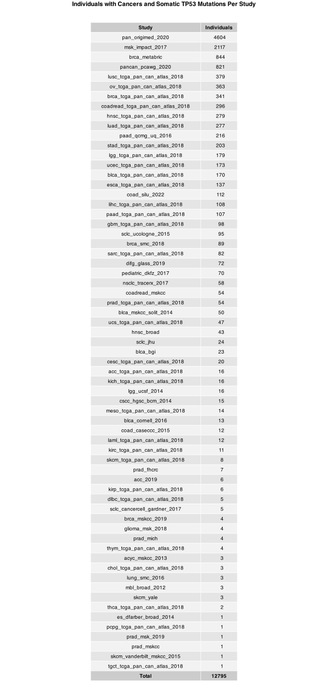

$~$


``` r
# make df for piedonut chart of amount of representation each study in dataset has with cases (inner ring is tcga and other studies, outer ring is each study named)
piedonut_df <- pivotdf_studypts %>% 
  mutate(prop = `Count of distinct individuals`/last(`Count of distinct individuals`)) %>% 
  mutate(prop_round = plyr::round_any(prop * 100,
                                    0.1)) %>% 
  arrange(-prop) %>% 
  subset(studyId != "Total") %>% 
  dplyr::rename(Deeper = studyId) %>% 
  mutate(Surface = ifelse(str_detect(Deeper,
                                     "tcga_pan_can_atlas_2018"), 
                          "TCGA_Pan_Can_Atlas_2018", 
                          "other")) %>% 
  mutate(Deeper = gsub("_tcga_pan_can_atlas_2018", 
                       "", 
                       Deeper)) %>% 
  mutate(Deeper = ifelse(Surface != "other", 
                         str_to_upper(Deeper), # make tcga studies all caps
                         Deeper)) %>% 
  mutate(Deeper = gsub("_",
                       " ",
                       Deeper)) %>% 
  mutate(Surface = gsub("_", 
                        " ", 
                        Surface)) %>% # need to factorize so that darker to lighter colors are most to least cases
  mutate(Deeper = factor(Deeper,
                         levels = rev(unique(Deeper)))) %>%
  mutate(Surface = factor(Surface,
                          levels = rev(unique(Surface))))

# make piedonut figure
webr::PieDonut(piedonut_df, 
               aes(Surface, # what inner pie should be
                   Deeper, # what outer should be
                   count = prop_round), # what labels should show
               pieLabelSize = 5,
               donutLabelSize = 3, 
               titlesize = 7,
               ratioByGroup = FALSE, # show outer percents as part of total chart, not as part of slice group
               explode = 1, # which level to jut out of chart
               pieAlpha = 0.7, # transparency of inner
               donutAlpha = 1, # transparency of outer
               showPieName = FALSE, # don't show inner name in middle
               r0 = 0.15, # radius of inner white space
               r1 = 0.9, # radius of inner pie
               r2 = 1.3, # radius of outer
               showRatioThreshold = 0.015, # percent at which labels are written
               labelpositionThreshold = 0.03, #percent at which labels are put outside plot instead of inside
               title = "Studies of p53-mutant somatic cancer cases")
```

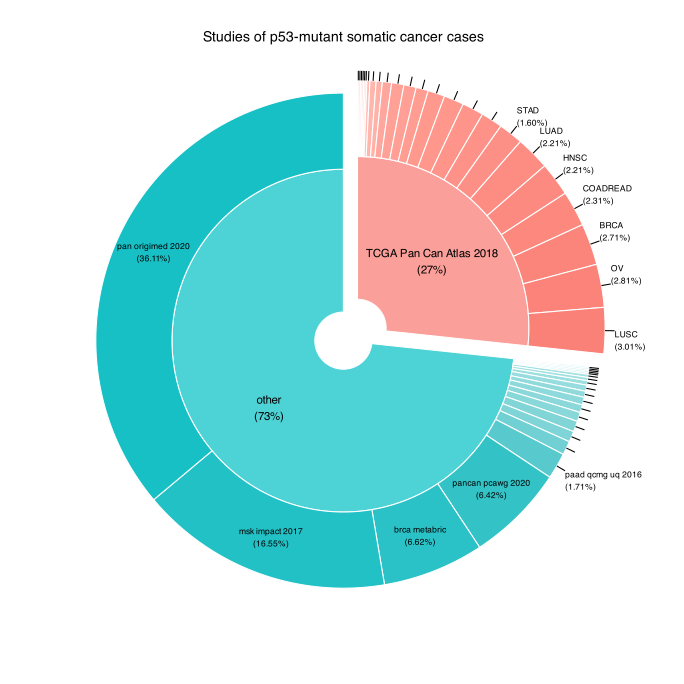

$~$


``` r
mut_rescued_hematological_gridprep <- condformat(p53mutscancersover100 %>% 
                                                   subset(str_detect(CANCER_TYPE, 
                                                                     "ature|eukemia|ymphoma|hrombocythemia|istiocytosis|yelodysplastic|yeloproliferative|ymphoblastic")) %>%
                                                   dplyr::select(c(CANCER_TYPE,
                                                                   CANCER_TYPE_DETAILED,
                                                                   #COUNTRY,
                                                                   SEX,
                                                                   Age_stratum,
                                                                   mutationType,
                                                                   proteinChange)) %>%
                                                   dplyr::rename(Mutation = proteinChange) %>%
                                                   mutate(Mutation = gsub("T125=",
                                                                          "T125T",
                                                                          Mutation)) %>% # to allow proper matching b/c fxcleaned has T125T
                                                   mutate(Codon = as.numeric(abs(parse_number(Mutation)))) %>%
                                                   left_join(.,
                                                             origfxcleaned %>% 
                                                               dplyr::select(c(Codon,
                                                                               Residue_function)) %>%
                                                               distinct(), 
                                                             by = "Codon") %>%
                                                   left_join(.,
                                                             origfxcleaned %>% 
                                                               dplyr::select(c(Mutation,
                                                                               SIFTClass,
                                                                               DNE_LOFclass)) %>%
                                                               distinct(), 
                                                             by = "Mutation") %>%
                                                   # mutate(Mutation = gsub("T125T",
                                                   #                        "T125=",
                                                   #                        Mutation)) %>% # revert to original annotation
                                                   arrange(Codon) %>%
                                                   mutate(across(everything(), 
                                                                 ~ replace(., 
                                                                           . %in% c("NA", NA),
                                                                           ""))) %>% 
                                                   dplyr::rename(Category = CANCER_TYPE,
                                                                 Cancer = CANCER_TYPE_DETAILED,
                                                                 Sex = SEX,
                                                                 `Age stratum` = Age_stratum,
                                                                 Type = mutationType,
                                                                 `Feature` = Residue_function,
                                                                 `SIFT` = SIFTClass,
                                                                 `DNE` = DNE_LOFclass) %>% 
                                                   dplyr::select(-c(Codon)) %>%
                                                   remove_rownames()) %>% 
  rule_text_color(Mutation,
                  ifelse(Mutation %in% mut_rescued,
                         "red",
                         "")) %>%
  rule_text_bold(Mutation,
                 expression = Mutation %in% mut_rescued) %>%
  theme_grob(rows = NULL, 
             theme = ttheme_default(base_size = 10,
                                    core = list(padding = unit(c(15, 4), "mm")))) %>%
  condformat2grob(draw = FALSE)

mut_rescued_hematological_grid <- grid.arrange(mut_rescued_hematological_gridprep,
                                               top = textGrob("Individuals with Hematological Cancers and Somatic TP53 Mutations",
                                                              hjust = 0.5,
                                                              gp = gpar(fontface = "bold")))
```

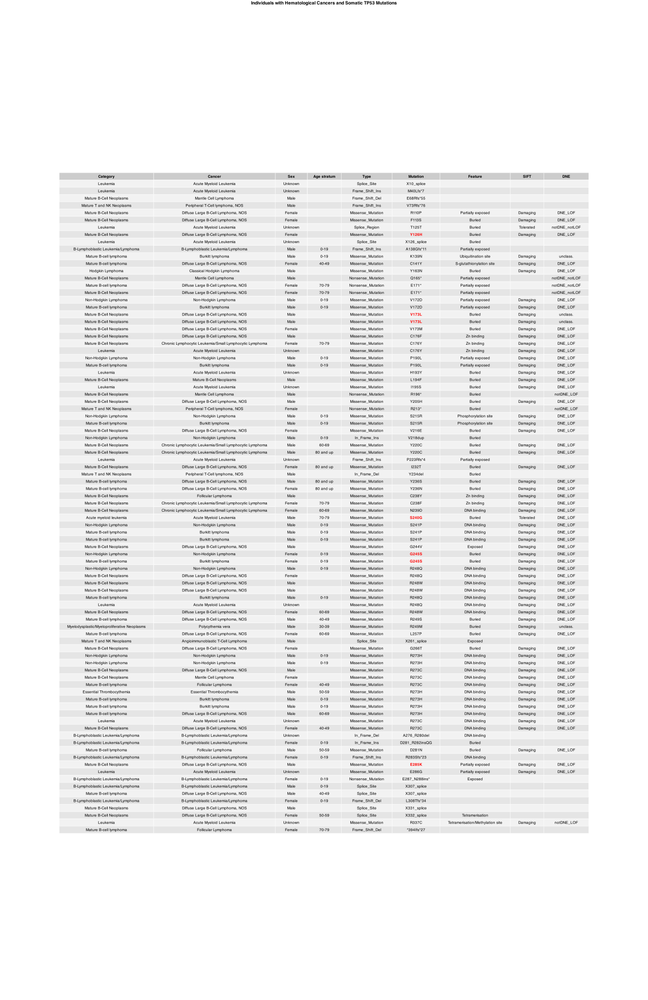

$~$


``` r
# vectors for pie chart
prop <- n_distinct(p53mutsATOperpos_pivot_calc %>%
                     filter(str_detect(Patient, 
                                       "All with cancer") & ATO == "yes") %>% 
                     arrange(-Calc) %>%
                     head(3) %>% 
                     pull(Label) %>%
                     as.vector()) / n_distinct(p53mutsATOperpos_pivot_calc %>%
                                                 filter(str_detect(Patient, 
                                                                   "All with cancer") & ATO == "yes") %>% 
                                                 arrange(-Calc) %>%
                                                 pull(Label) %>%
                                                 as.vector())
vec <- c(prop,
         1 - prop)
raw <- c(n_distinct(p53mutsATOperpos_pivot_calc %>%
                      filter(str_detect(Patient, 
                                        "All with cancer") & ATO == "yes") %>% 
                      arrange(-Calc) %>%
                      head(3) %>% 
                      pull(Label) %>%
                      as.vector()),
         n_distinct(setdiff(unique(p53mutsATOperpos_pivot_calc %>%
                                     filter(str_detect(Patient, 
                                                       "All with cancer") & ATO == "yes") %>% 
                                     arrange(-Calc) %>%
                                     pull(Label) %>%
                                     as.vector()),
                            unique(p53mutsATOperpos_pivot_calc %>%
                                     filter(str_detect(Patient, 
                                                       "All with cancer") & ATO == "yes") %>% 
                                     arrange(-Calc) %>%
                                     head(3) %>% 
                                     pull(Label) %>%
                                     as.vector()))))

# make prevalence waterfall plots (base R barplots + abline at 1%) of all ATO muts in solecancer to justify why 1% chosen for focus in table
barplot(height = sort(as.numeric(p53mutsATOperpos_pivot_calc %>%
                                                 filter(str_detect(Patient, 
                                                                   "All with cancer") & ATO == "yes") %>% 
                                                 pull(Calc)) %>% na.omit(),
                      decreasing = TRUE),
        xaxs = "i", # remove space between left side of bars and y axis
        ylab = "Proportion of distinct individuals with cancer", 
        xlab = "", # "p53 mutation" text is cutting into labels otherwise
        main = "ATO-Rescuable p53 Mutations in Individuals with Cancer",
        names.arg = p53mutsATOperpos_pivot_calc %>% filter(str_detect(Patient, "All with cancer") & ATO == "yes") %>% arrange(-Calc) %>% pull(Label) %>% as.vector(),
        font.lab = 2,
        ylim = c(0, plyr::round_any(max(p53mutsATOperpos_pivot_calc %>%
                                                 filter(str_detect(Patient, 
                                                                   "All with cancer") & ATO == "yes") %>% 
                                                 pull(Calc),
                                        na.rm = TRUE),
                                    0.05,
                                    f = ceiling)),
        col = ifelse((p53mutsATOperpos_pivot_calc %>%
                        filter(str_detect(Patient, 
                                          "All with cancer") & ATO == "yes") %>% 
                        arrange(-Calc) %>%
                        pull(Label) %>%
                        as.vector()) %in% (p53mutsATOperpos_pivot_calc %>%
                                             filter(str_detect(Patient, 
                                                               "All with cancer") & ATO == "yes") %>% 
                                             arrange(-Calc) %>%
                                             head(3) %>% 
                                             pull(Label) %>%
                                             as.vector()),
                     "black",
                     "grey"),
        las = 2,
        space = 0,
        border = NA)
abline(h = 0.01,
       col = "red",
       lty = 2,
       lwd = 2)
legend("right",
       legend = c("Subset", 
                  "Other"),
       col = c("black", 
               "gray"),
       bty = "n", # no border around legend
       pch = 15, # filled square shape
       pt.cex = 1.75) # increase shape size in legend
axis(side = 1, 
     at = seq(0.5, 
              length(p53mutsATOperpos_pivot_calc %>%
                       filter(str_detect(Patient, 
                                         "All with cancer") & ATO == "yes") %>% 
                       arrange(-Calc) %>%
                       pull(Label) %>%
                       as.vector()) - 0.5, 
              1), 
     tick = TRUE, 
     labels = FALSE)
```

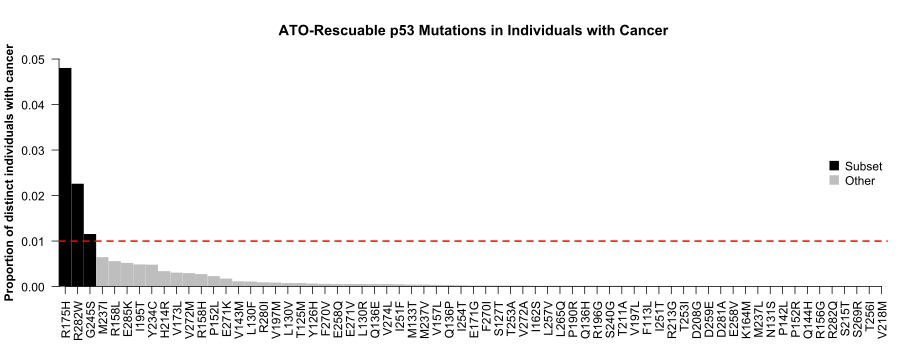

``` r
# pie chart
pie(vec,
    main = "ATO-Rescuable p53 Mutations in Individuals with Cancer",
    labels = paste0(plyr::round_any(vec * 100,
                                    0.1),
                    "% (",
                    format(raw, 
                           big.mark = ",", 
                           trim = TRUE),
                    " mutations)"),
    col = c("black", "grey"),
    border = NA,
    clockwise = TRUE)
```

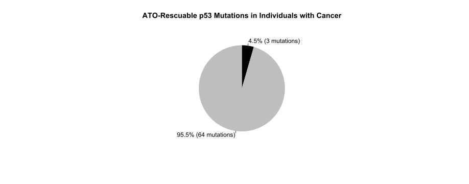

$~$


``` r
barplot(height = (pivotdf %>%
                    subset(CANCER_TYPE_DETAILED != "Total") %>%
                    pull(Total) %>% 
                    replace_na(., 0) %>%
                    as.numeric() %>%
                    sort(decreasing = TRUE)),
        xaxs = "i", # remove space between left side of bars and y axis
        ylab = "Number of distinct individuals", 
        xlab = "Cancer",
        main = "Prevalence of Distinct Individuals with p53-Mutant Cancers",
        ylim = c(0, plyr::round_any(pivotdf %>%
                                      subset(CANCER_TYPE_DETAILED != "Total") %>%
                                      pull(Total) %>%
                                      as.numeric() %>%
                                      max(),
                                    500, 
                                    f = ceiling)),
        col = ifelse(pivotdf$CANCER_TYPE_DETAILED %in% gsub(" \\(.*",
                                                            "",
                                                            pivotdfnobottomtotal100muts$CANCER_TYPE_DETAILED),
                     "black",
                     "grey"),
        font.lab = 2,
        las = 1,
        space = 0,
        border = NA)
abline(h = 50,
       col = "red",
       lty = 2,
       lwd = 2)
legend("right",
       legend = c("Subset", 
                  "Other"),
       col = c("black", 
               "gray"),
       bty = "n", # no border around legend
       pch = 15, # filled square shape
       pt.cex = 1.75) # increase shape size in legend
```

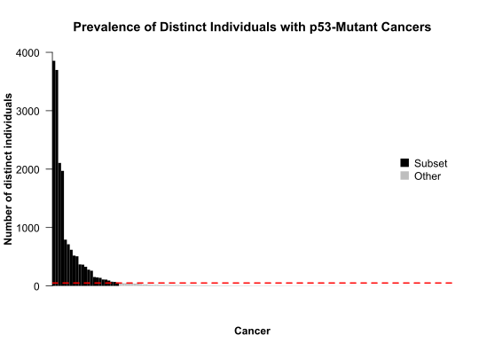

$~$


``` r
# calc prop of pts examined when 50 cutoff implemented i.e. most pts still looked at further
# need to remove any pts who also had another cancer
# setdiff syntax matters, here saying check which elements of first vector not in second vector, would need to reverse terms for other way or do union(setdiff(1,2), setdiff(2,1)) to get what is not common in in either vector
# setdiff(x, y) returns the elements of x that are not in y but asymmetric difference, so setdiff(y, x) gives what elements of y are not in x and could be different answer  
over50_p53prop <- setdiff(p53mutscancersover100 %>%
                            subset(CANCER_TYPE_DETAILED %in% (pivotdf %>%
                                                                subset(CANCER_TYPE_DETAILED != "Total") %>%
                                                                subset(Total >= 50) %>%
                                                                pull(CANCER_TYPE_DETAILED))) %>%
                            pull(patientId),
                          p53mutscancersover100 %>%
                            subset(!(CANCER_TYPE_DETAILED %in% (pivotdf %>%
                                                                  subset(CANCER_TYPE_DETAILED != "Total") %>%
                                                                  subset(Total >= 50) %>%
                                                                  pull(CANCER_TYPE_DETAILED)))) %>%
                            pull(patientId)) %>% 
  n_distinct() / n_distinct(p53mutscancersover100$patientId)

# pie chart
vec <- c(over50_p53prop,
         1 - over50_p53prop)

raw <- c(setdiff(p53mutscancersover100 %>%
                   subset(CANCER_TYPE_DETAILED %in% (pivotdf %>%
                                                       subset(CANCER_TYPE_DETAILED != "Total") %>%
                                                       subset(Total >= 50) %>%
                                                       pull(CANCER_TYPE_DETAILED))) %>%
                   pull(patientId),
                 p53mutscancersover100 %>%
                   subset(!(CANCER_TYPE_DETAILED %in% (pivotdf %>%
                                                         subset(CANCER_TYPE_DETAILED != "Total") %>%
                                                         subset(Total >= 50) %>%
                                                         pull(CANCER_TYPE_DETAILED)))) %>%
                   pull(patientId)) %>% 
           n_distinct(),
         setdiff(p53mutscancersover100 %>%
                   subset(!(CANCER_TYPE_DETAILED %in% (pivotdf %>%
                                                         subset(CANCER_TYPE_DETAILED != "Total") %>%
                                                         subset(Total >= 50) %>%
                                                         pull(CANCER_TYPE_DETAILED)))) %>%
                   pull(patientId),
                 p53mutscancersover100 %>%
                   subset(CANCER_TYPE_DETAILED %in% (pivotdf %>%
                                                       subset(CANCER_TYPE_DETAILED != "Total") %>%
                                                       subset(Total >= 50) %>%
                                                       pull(CANCER_TYPE_DETAILED))) %>%
                   pull(patientId)) %>% 
           n_distinct())

pie(vec,
    main = "Prevalence of Distinct Individuals with p53-Mutant Cancers",
    labels = paste0(plyr::round_any(vec * 100,
                                    0.1),
                    "% (",
                    format(raw, 
                           big.mark = ",", 
                           trim = TRUE),
                    " individuals)"),
    col = c("black", "grey"),
    border = NA,
    clockwise = TRUE)
```

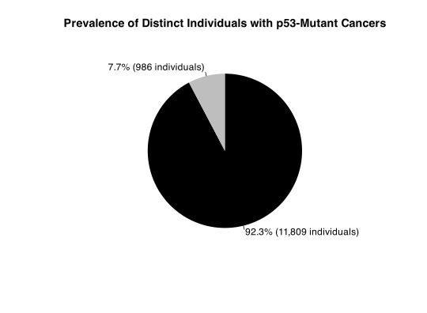

$~$


``` r
barplot(height = (pivotdf_muttissuesomatic %>%
                    subset(CANCER_TYPE_DETAILED != "Total") %>%
                    pull(Total) %>% 
                    replace_na(., 0) %>%
                    as.numeric() %>%
                    sort(decreasing = TRUE)),
        xaxs = "i", # remove space between left side of bars and y axis
        ylab = "Number of distinct individuals", 
        xlab = "Cancer",
        main = "Prevalence of Distinct Individuals with Cancer",
        ylim = c(0, plyr::round_any(pivotdf_muttissuesomatic %>%
                                      subset(CANCER_TYPE_DETAILED != "Total") %>%
                                      pull(Total) %>%
                                      as.numeric() %>%
                                      max(),
                                    500, 
                                    f = ceiling)),
        col = ifelse(pivotdf_muttissuesomatic$CANCER_TYPE_DETAILED %in% (pivotdf_muttissuesomatic %>%
                                                                           subset(CANCER_TYPE_DETAILED != "Total") %>%
                                                                           subset(Total >= 50) %>%
                                                                           pull(CANCER_TYPE_DETAILED) %>% 
                                                                           unique()),
                     "black",
                     "grey"),
        font.lab = 2,
        las = 1,
        space = 0,
        border = NA)
abline(h = 50,
       col = "red",
       lty = 2,
       lwd = 2)
legend("right",
       legend = c("Subset", 
                  "Other"),
       col = c("black", 
               "gray"),
       bty = "n", # no border around legend
       pch = 15, # filled square shape
       pt.cex = 1.75) # increase shape size in legend
```

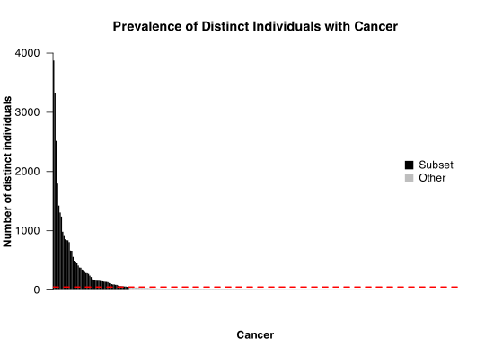

$~$


``` r
over50_somaticprop <- setdiff(clindatacombined %>%
                                subset(CANCER_TYPE_DETAILED %in% (pivotdf_muttissuesomatic %>%
                                                                    subset(CANCER_TYPE_DETAILED != "Total") %>%
                                                                    subset(Total >= 50) %>%
                                                                    pull(CANCER_TYPE_DETAILED))) %>%
                                pull(patientId),
                              clindatacombined %>%
                                subset(!(CANCER_TYPE_DETAILED %in% (pivotdf_muttissuesomatic %>%
                                                                      subset(CANCER_TYPE_DETAILED != "Total") %>%
                                                                      subset(Total >= 50) %>%
                                                                      pull(CANCER_TYPE_DETAILED)))) %>%
                                pull(patientId)) %>% 
  n_distinct() / n_distinct(clindatacombined$patientId)

# pie chart
vec <- c(over50_somaticprop,
         1 - over50_somaticprop)

raw <- c(setdiff(clindatacombined %>%
                   subset(CANCER_TYPE_DETAILED %in% (pivotdf_muttissuesomatic %>%
                                                       subset(CANCER_TYPE_DETAILED != "Total") %>%
                                                       subset(Total >= 50) %>%
                                                       pull(CANCER_TYPE_DETAILED))) %>%
                   pull(patientId),
                 clindatacombined %>%
                   subset(!(CANCER_TYPE_DETAILED %in% (pivotdf_muttissuesomatic %>%
                                                         subset(CANCER_TYPE_DETAILED != "Total") %>%
                                                         subset(Total >= 50) %>%
                                                         pull(CANCER_TYPE_DETAILED)))) %>%
                   pull(patientId)) %>% 
           n_distinct(),
         (n_distinct(clindatacombined$patientId) - (setdiff(clindatacombined %>%
                                                              subset(CANCER_TYPE_DETAILED %in% (pivotdf_muttissuesomatic %>%
                                                                                                  subset(CANCER_TYPE_DETAILED != "Total") %>%
                                                                                                  subset(Total >= 50) %>%
                                                                                                  pull(CANCER_TYPE_DETAILED))) %>%
                                                              pull(patientId),
                                                            clindatacombined %>%
                                                              subset(!(CANCER_TYPE_DETAILED %in% (pivotdf_muttissuesomatic %>%
                                                                                                    subset(CANCER_TYPE_DETAILED != "Total") %>%
                                                                                                    subset(Total >= 50) %>%
                                                                                                    pull(CANCER_TYPE_DETAILED)))) %>%
                                                              pull(patientId)) %>% 
                                                      n_distinct())))

pie(vec,
    main = "Prevalence of Distinct Individuals with Cancers",
    labels = paste0(plyr::round_any(vec * 100,
                                    0.1),
                    "% (",
                    format(raw, 
                           big.mark = ",", 
                           trim = TRUE),
                    " individuals)"),
    col = c("black", "grey"),
    border = NA,
    clockwise = TRUE)
```

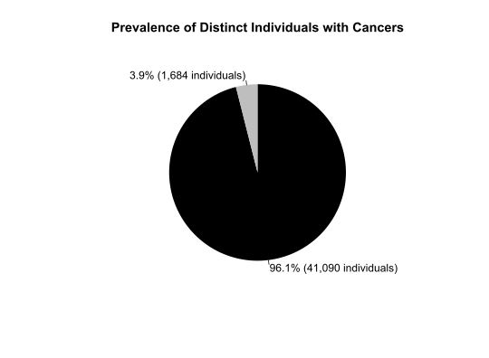

$~$


``` r
barplot(height = (pivotdf_muttissuesomatic %>%
                    subset(CANCER_TYPE_DETAILED != "Total") %>%
                    pull(Total) %>%
                    replace_na(., 0) %>%
                    as.numeric() %>%
                    sort(decreasing = TRUE)),
        xaxs = "i", # remove space between left side of bars and y axis
        ylab = "Number of distinct individuals", 
        xlab = "Cancer",
        main = "Prevalence of Distinct Individuals with Cancer",
        ylim = c(0, plyr::round_any(pivotdf_muttissuesomatic %>%
                                      subset(CANCER_TYPE_DETAILED != "Total") %>%
                                      pull(Total) %>%
                                      as.numeric() %>%
                                      max(),
                                    500, 
                                    f = ceiling)),
        col = ifelse(pivotdf_muttissuesomatic$CANCER_TYPE_DETAILED %in% gsub(" \\(.*",
                                                                             "",
                                                                             pivotdfnobottomtotal100muts$CANCER_TYPE_DETAILED),
                     "black",
                     "grey"),
        font.lab = 2,
        las = 1,
        space = 0,
        border = NA)
abline(h = 50,
       col = "red",
       lty = 2,
       lwd = 2)
legend("right",
       legend = c("Subset", 
                  "Other"),
       col = c("black", 
               "gray"),
       bty = "n", # no border around legend
       pch = 15, # filled square shape
       pt.cex = 1.75) # increase shape size in legend
```

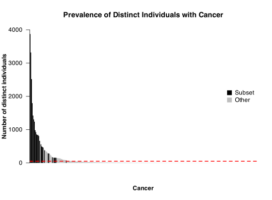

$~$


``` r
# also need to show global prevalence i.e. 13889/30000+
p53prop_allsomatic <- n_distinct(p53muts$patientId) / n_distinct(clindatacombined$patientId)

# pie chart
vec <- c(p53prop_allsomatic,
         1 - p53prop_allsomatic)

raw <- c(n_distinct(p53muts$patientId),
         n_distinct(setdiff(unique(clindatacombined$patientId),
                            unique(p53muts$patientId))))

pie(vec,
    main = "Prevalence of Distinct Individuals with Cancers",
    labels = paste0(plyr::round_any(vec * 100,
                                    0.1),
                    "% (",
                    format(raw, 
                           big.mark = ",", 
                           trim = TRUE),
                    " individuals)"),
    col = c("black", "grey"),
    border = NA,
    clockwise = TRUE)
```

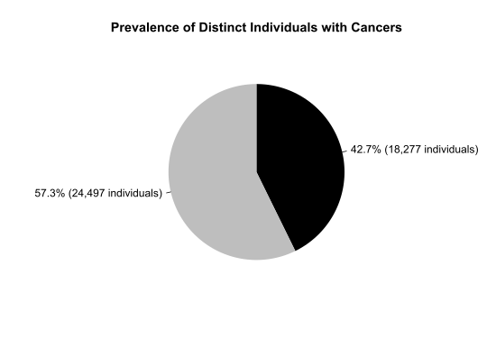

$~$


``` r
barplot(height = sort(as.numeric(datapospheatmap_melt$Proportion %>% replace_na(., 0)),
                      decreasing = TRUE),
        xaxs = "i", # remove space between left side of bars and y axis
        ylab = "Proportion of distinct individuals with cancer", 
        xlab = "p53 mutation",
        main = "Prevalence of p53 Mutations in Distinct Individuals with Cancer",
        ylim = c(0, plyr::round_any(max(datapospheatmap_melt$Proportion, 
                                        na.rm = TRUE), 
                                    0.01, 
                                    f = ceiling)),
        col = ifelse(datapospheatmap_melt$Mutation %in% datapospheatmap_meltover0.01$Mutation,
                     "black",
                     "grey"),
        font.lab = 2,
        las = 1,
        space = 0,
        border = NA)
abline(h = 0.01,
       col = "red",
       lty = 2,
       lwd = 2)
legend("right",
       legend = c("Subset", 
                  "Other"),
       col = c("black", 
               "gray"),
       bty = "n", # no border around legend
       pch = 15, # filled square shape
       pt.cex = 1.75) # increase shape size in legend
```

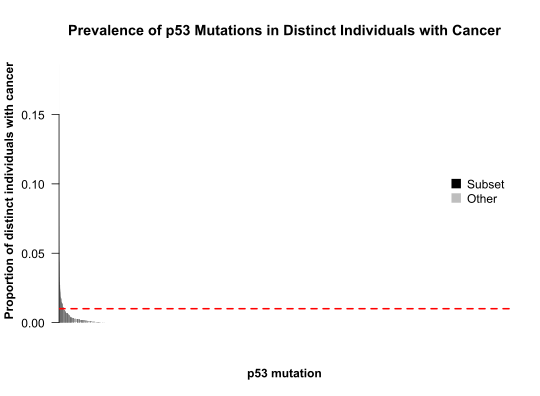

$~$


``` r
# proportions of majority included with 1% muts for heatmaps
hm_totalmuts_pos_1pct_prop <- n_distinct(datapospheatmap_meltover0.01$Mutation) / n_distinct(datapospheatmap_melt$Mutation)

# pie chart
vec <- c(hm_totalmuts_pos_1pct_prop,
         1 - hm_totalmuts_pos_1pct_prop)

raw <- c(n_distinct(datapospheatmap_meltover0.01$Mutation),
         n_distinct(setdiff(unique(datapospheatmap_melt$Mutation), 
                            unique(datapospheatmap_meltover0.01$Mutation))))

pie(vec,
    main = "Prevalence of p53 Mutations in Distinct Individuals with Cancer",
    labels = paste0(plyr::round_any(vec * 100,
                                    0.1),
                    "% (",
                    format(raw, 
                           big.mark = ",", 
                           trim = TRUE),
                    " mutations)"),
    col = c("black", "grey"),
    border = NA,
    clockwise = TRUE)
```

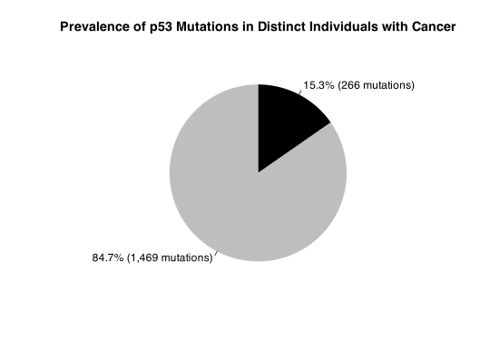

$~$


``` r
barplot(height = sort(as.numeric(pivotsex_pos_melted$Proportion %>% replace_na(., 0)),
                      decreasing = TRUE),
        xaxs = "i", # remove space between left side of bars and y axis
        ylab = "Proportion of distinct individuals with cancer", 
        xlab = "p53 mutation",
        main = "Prevalence of p53 Mutations in Distinct Individuals with Cancer",
        ylim = c(0, plyr::round_any(max(pivotsex_pos_melted$Proportion, 
                                        na.rm = TRUE), 
                                    0.01, 
                                    f = ceiling)),
        col = ifelse(pivotsex_pos_melted$Mutation %in% pivotsex_pos_melted_over0.01$Mutation,
                     "black",
                     "grey"),
        font.lab = 2,
        las = 1,
        space = 0,
        border = NA)
abline(h = 0.01,
       col = "red",
       lty = 2,
       lwd = 2)
legend("right",
       legend = c("Subset", 
                  "Other"),
       col = c("black", 
               "gray"),
       bty = "n", # no border around legend
       pch = 15, # filled square shape
       pt.cex = 1.75) # increase shape size in legend
```

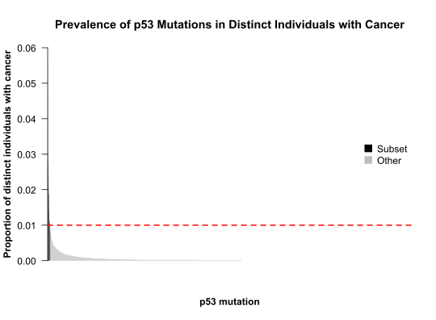

$~$


``` r
hm_pos_sex_1pct_prop <- n_distinct(pivotsex_pos_melted_over0.01$Mutation) / n_distinct(pivotsex_pos_melted$Mutation)

# pie chart
vec <- c(hm_pos_sex_1pct_prop,
         1 - hm_pos_sex_1pct_prop)

raw <- c(n_distinct(pivotsex_pos_melted_over0.01$Mutation),
         n_distinct(setdiff(unique(pivotsex_pos_melted$Mutation),
                            unique(pivotsex_pos_melted_over0.01$Mutation))))

pie(vec,
    main = "Prevalence of p53 Mutations in Distinct Individuals with Cancer",
    labels = paste0(plyr::round_any(vec * 100,
                                    0.1),
                    "% (",
                    format(raw, 
                           big.mark = ",", 
                           trim = TRUE),
                    " mutations)"),
    col = c("black", "grey"),
    border = NA,
    clockwise = TRUE)
```

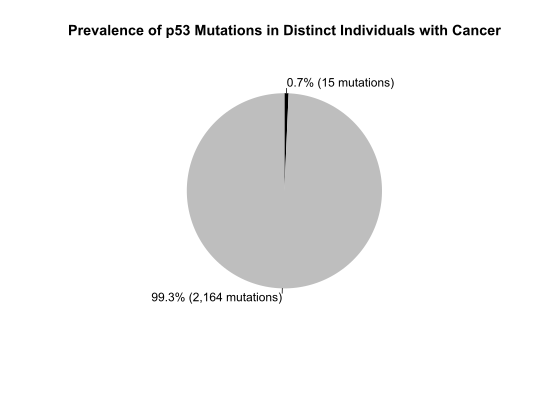

$~$


``` r
# barplot of each mut prevalence across entire p53muts dataset and top 20 muts table 
bar_df <- pivotdfpos %>% 
  subset(CANCER_TYPE_DETAILED == "Total") %>% 
  remove_rownames() %>% 
  column_to_rownames("CANCER_TYPE_DETAILED") %>% 
  t() %>% 
  as.data.frame() %>% 
  rownames_to_column("Mutation") %>% 
  mutate(Prop = Total/last(Total)) %>% 
  mutate(Proportion = plyr::round_any(Prop * 100,
                                      0.01)) %>% 
  subset(Mutation != "Total")

prop <- n_distinct(datapospheatmap_meltover0.01 %>% 
                     drop_na(Proportion) %>% 
                     pull(Mutation) %>%
                     as.vector()) / n_distinct(p53mutscancersover100$proteinChange)
vec <- c(prop,
         1 - prop)
raw <- c(n_distinct(datapospheatmap_meltover0.01 %>% 
                      drop_na(Proportion) %>% 
                      pull(Mutation) %>%
                      as.vector()),
         n_distinct(setdiff(unique(p53mutscancersover100$proteinChange),
                            unique(datapospheatmap_meltover0.01 %>% 
                                     drop_na(Proportion) %>% 
                                     pull(Mutation) %>%
                                     as.vector()))))

barplot(height = sort(as.numeric(bar_df$Prop),
                      decreasing = TRUE),
        xaxs = "i", # remove space between left side of bars and y axis
        ylab = "Proportion of distinct individuals with cancer", 
        xlab = "p53 mutation",
        main = "Prevalence of p53 Mutations in Distinct Individuals with Cancer",
        ylim = c(0, plyr::round_any(max(bar_df$Prop, 
                                        na.rm = TRUE), 
                                    0.01, 
                                    f = ceiling)),
        font.lab = 2,
        col = ifelse(bar_df$Mutation %in% (datapospheatmap_meltover0.01 %>% 
                                             drop_na(Proportion) %>% 
                                             pull(Mutation) %>%
                                             as.vector()),
                     "black",
                     "grey"),
        las = 1,
        space = 0,
        border = NA)
legend("right",
       legend = c("Subset", 
                  "Other"),
       col = c("black", 
               "gray"),
       bty = "n", # no border around legend
       pch = 15, # filled square shape
       pt.cex = 1.75) # increase shape size in legend
```

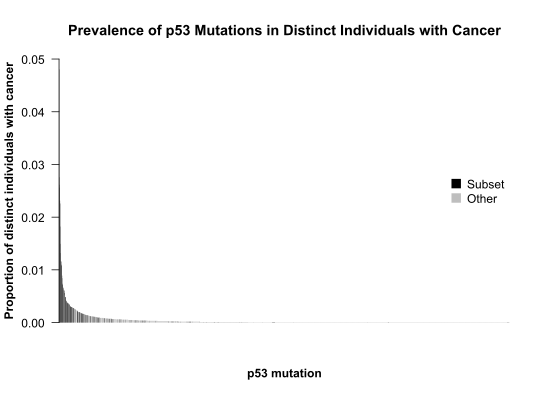

$~$


``` r
# pie chart
pie(vec,
    main = "Prevalence of p53 Mutations in Distinct Individuals with Cancer",
    labels = paste0(plyr::round_any(vec * 100,
                                    0.1),
                    "% (",
                    format(raw, 
                           big.mark = ",", 
                           trim = TRUE),
                    " mutations)"),
    col = c("black", "grey"),
    border = NA,
    clockwise = TRUE)
```


$~$


``` r
# save grid table of top muts across entire dataset
overall_mut_prevalence_top_gridprep <- condformat(bar_df %>% 
                                                    arrange(-Prop) %>%
                                                    dplyr::select(c(Mutation,
                                                                    Proportion)) %>% 
                                                    subset(Proportion >= 1)) %>%
  theme_grob(rows = NULL, # colnames are not removing with cols = NULL
             theme = ttheme_default(base_size = 10,
                                    core = list(padding = unit(c(15, 4), "mm")))) %>%
  condformat2grob(draw = FALSE)

overall_mut_prevalence_top_grid <- grid.arrange(overall_mut_prevalence_top_gridprep,
                                                top = textGrob("Proportion of Somatic p53 Mutations \nAcross Individuals with Cancer",
                                                               hjust = 0.5,
                                                               gp = gpar(fontface = "bold")))
```

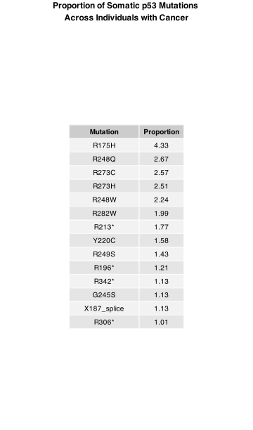

$~$


``` r
# divide down to calc prop of muts in all pts, add as new col and mult by 100, remove codon 0 which is splice, indel, etc throughout p53 and 394 which is outside p53, remove total row, sort by inc codon
codon_bar_df <- pivotcodonfreq %>%
  mutate(Prop = `Count of distinct individuals`/last(`Count of distinct individuals`)) %>%
  dplyr::rename(Count_of_distinct_individuals = `Count of distinct individuals`) %>%
  mutate(Prop_Label = plyr::round_any(Prop * 100,
                                      0.01)) %>%
  subset(!(Codon %in% c("0", 
                        "394",
                        "Total"))) %>%
  mutate_at("Codon",
            as.numeric) %>%
  arrange(Codon)

# because not all codons mutated need to add in missing codons as 0 pts and 0 prop
missing_codons_add <- data.frame(Codon = setdiff(1:393, # since p53 has 393 codons
                                                 codon_bar_df$Codon),
                                 Count_of_distinct_individuals = 0,
                                 Prop = 0,
                                 Prop_Label = 0)

# add missing codons to df
codon_bar_df <- full_join(codon_bar_df,
                          missing_codons_add) %>%
  arrange(Codon)

# barplot, adding codon numbers at intervals and label numbers of codons >= 1.5%
barplot(height = codon_bar_df$Prop,
        xaxs = "i", # remove space between left side of bars and y axis
        ylab = "Proportion of distinct individuals with cancer", 
        xlab = "Codon",
        main = "Prevalence of p53 Mutations in Distinct Individuals with Cancer",
        #axis.lty = 1,
        #names.arg = codon_bar_df$Codon,
        ylim = c(0, plyr::round_any(max(codon_bar_df$Prop, 
                                        na.rm = TRUE), 
                                    0.1, 
                                    f = ceiling)),
        font.lab = 2,
        col = dplyr::case_when(codon_bar_df$Prop >= 0.02 & codon_bar_df$Codon %in% c(175,
                                                                                     213, 
                                                                                     245, 
                                                                                     248, 
                                                                                     273, 
                                                                                     282) ~ "purple", 
                               codon_bar_df$Prop >= 0.02 ~ "red",
                               TRUE ~ "gray"),
        las = 1,
        space = 0,
        border = NA)
axis(side = 1,
     at = c(1, 
            seq(50,
                350, 
                50),
            393))
text(codon_bar_df$Codon[codon_bar_df$Prop >= 0.015], # x location 
     codon_bar_df$Prop[codon_bar_df$Prop >= 0.015], # y location
     codon_bar_df$Codon[codon_bar_df$Prop >= 0.015], # label to put
     cex = 1, # standard font size
     pos = 3) # text above (x,y) coordinates where it's placed
text(80,
     plyr::round_any(max(codon_bar_df$Prop, 
                         na.rm = TRUE), 
                     0.1, 
                     f = ceiling) * 0.95,
     paste0("Somatic (",
            format(last(pivotcodonfreq$`Count of distinct individuals`), 
                   big.mark = ",", 
                   trim = TRUE),
            " individuals)"),
     cex = 1.5) # increase font size
legend("topright",
       legend = c("≥ 2%",
                  "≥ 2% in germline sole too",
                  "Other"),
       col = c("red", 
               "purple", 
               "gray"),
       bty = "n", # no border around legend
       pch = 15, # filled square shape
       pt.cex = 1.75) # increase shape size in legend
```

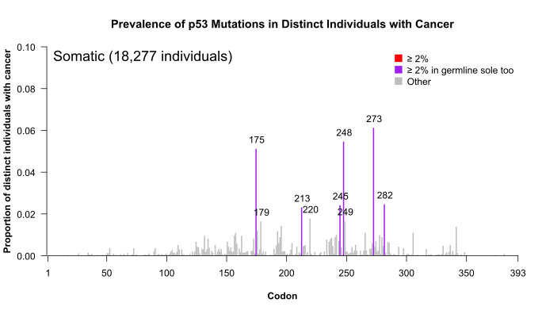

$~$


``` r
# make grid of ages of dx in less common cancers
age_othercancers_gridprep <- condformat(pivotage_othercancers %>%
                                          mutate(across(everything(), 
                                                        ~ replace(., 
                                                                  . %in% c("NA", NA),
                                                                  ""))) %>%
                                          relocate(colnames(.)[c(6,10,8,7,5,4,3,9,2)], # make ages ascending 
                                                   .after = CANCER_TYPE_DETAILED) %>%
                                          dplyr::rename(Cancer = CANCER_TYPE_DETAILED) %>%
                                          remove_rownames()) %>%
  rule_text_bold(Total,
                 expression = Total > 0) %>%
  # rule_fill_discrete(Total,
  #                    expression = Total > 0,
  #                    colours = c("TRUE" = "grey80")) %>% # also adds unremovable black borders
  theme_grob(rows = NULL, 
             theme = ttheme_default(base_size = 10,
                                    core = list(padding = unit(c(15, 4), "mm"),
                                                fg_params = list(fontface = c(rep("plain", 
                                                                                  nrow(pivotage_othercancers) - 1), 
                                                                              "bold")),
                                                bg_params = list(fill = c(rep(c("grey95", "grey90"),
                                                                              length.out = (nrow(pivotage_othercancers) - 1)),
                                                                          "grey80")))
             )) %>%
  condformat2grob(draw = FALSE)

age_othercancers_grid <- grid.arrange(age_othercancers_gridprep,
                                      top = textGrob("Ages of Cancer Diagnoses for Individuals with Less Prevalent Cancers and Somatic TP53 Mutations",
                                                     hjust = 0.5,
                                                     gp = gpar(fontface = "bold")))
```

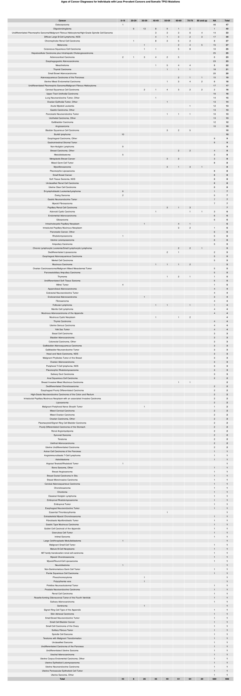

$~$


``` r
# make grid of sexes of pts with less prevalent cancers
sex_othercancers_gridprep <- condformat(pivotsex_othercancers %>%
                                          mutate(across(everything(), 
                                                        ~ replace(., 
                                                                  . %in% c("NA", NA),
                                                                  ""))) %>%
                                          dplyr::rename(Cancer = CANCER_TYPE_DETAILED) %>%
                                          remove_rownames()) %>%
  rule_text_bold(Total,
                 expression = Total > 0) %>%
  # rule_fill_discrete(Total,
  #                    expression = Total > 0,
  #                    colours = c("TRUE" = "grey80")) %>% # also adds unremovable black borders
  theme_grob(rows = NULL, 
             theme = ttheme_default(base_size = 10,
                                    core = list(padding = unit(c(15, 4), "mm"),
                                                fg_params = list(fontface = c(rep("plain", 
                                                                                  nrow(pivotsex_othercancers) - 1), 
                                                                              "bold")),
                                                bg_params = list(fill = c(rep(c("grey95", "grey90"),
                                                                              length.out = (nrow(pivotsex_othercancers) - 1)),
                                                                          "grey80")))
             )) %>%
  condformat2grob(draw = FALSE)

sex_othercancers_grid <- grid.arrange(sex_othercancers_gridprep,
                                      top = textGrob("Sexes of Individuals with Less Prevalent Cancers and Somatic TP53 Mutations",
                                                     hjust = 0.5,
                                                     gp = gpar(fontface = "bold")))
```

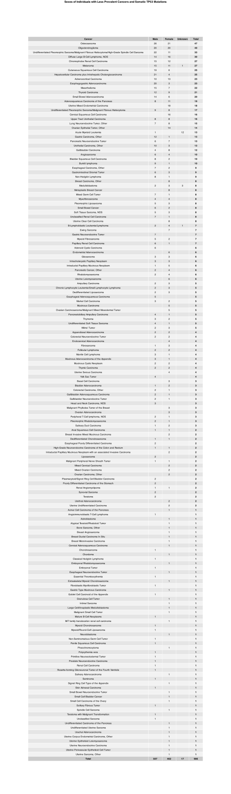

$~$


``` r
# make grid of mut types of pts with less prevalent cancers
df_othercancers_gridprep <- condformat(pivotdf_othercancers %>%
                                         mutate(across(everything(), 
                                                       ~ replace(., 
                                                                 . %in% c("NA", NA),
                                                                 ""))) %>%
                                         dplyr::rename(Cancer = CANCER_TYPE_DETAILED) %>%
                                         remove_rownames()) %>%
  rule_text_bold(Total,
                 expression = Total > 0) %>%
  # rule_fill_discrete(Total,
  #                    expression = Total > 0,
  #                    colours = c("TRUE" = "grey80")) %>% # also adds unremovable black borders
  theme_grob(rows = NULL, 
             theme = ttheme_default(base_size = 10,
                                    core = list(padding = unit(c(15, 4), "mm"),
                                                fg_params = list(fontface = c(rep("plain", 
                                                                                  nrow(pivotdf_othercancers) - 1), 
                                                                              "bold")),
                                                bg_params = list(fill = c(rep(c("grey95", "grey90"),
                                                                              length.out = (nrow(pivotdf_othercancers) - 1)),
                                                                          "grey80")))
             )) %>%
  condformat2grob(draw = FALSE)

df_othercancers_grid <- grid.arrange(df_othercancers_gridprep,
                                     top = textGrob("Mutation Types of Individuals with Less Prevalent Cancers and Somatic TP53 Mutations",
                                                    hjust = 0.5,
                                                    gp = gpar(fontface = "bold")))
```

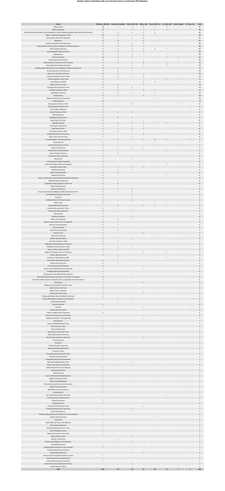

$~$


``` r
# # make grid of mut pos of pts with less prevalent cancers
# dfposother_gridprep <- condformat(pivotdfposother %>%
#                                          mutate(across(everything(), 
#                                                        ~ replace(., 
#                                                                  . %in% c("NA", NA),
#                                                                  ""))) %>%
#                                          dplyr::rename(Cancer = CANCER_TYPE_DETAILED) %>%
#                                          remove_rownames()) %>%
#   rule_text_bold(Total,
#                  expression = Total > 0) %>%
#   # rule_fill_discrete(Total,
#   #                    expression = Total > 0,
#   #                    colours = c("TRUE" = "grey80")) %>% # also adds unremovable black borders
#   theme_grob(rows = NULL, 
#              theme = ttheme_default(base_size = 10,
#                                     core = list(padding = unit(c(15, 4), "mm"),
#                                                 fg_params = list(fontface = c(rep("plain", 
#                                                                                   nrow(pivotdfposother) - 1), 
#                                                                               "bold")),
#                                                 bg_params = list(fill = c(rep(c("grey95", "grey90"),
#                                                                               length.out = (nrow(pivotdfposother) - 1)),
#                                                                           "grey80")))
#              )) %>%
#   condformat2grob(draw = FALSE)
# 
# dfposother_grid <- grid.arrange(dfposother_gridprep,
#                                      top = textGrob("Mutations of Individuals with Less Prevalent Cancers and Somatic TP53 Mutations",
#                                                     hjust = 0.5,
#                                                     gp = gpar(fontface = "bold")))
# 
# save_plot(dfposother_grid,
#           file = paste0(fig_path, "dfposother_grid.svg"),
#           base_width = 62,
#           base_height = 48,
#           limitsize = FALSE)

# grid too large to create so output as table instead
write_csv(pivotdfposother,
          file = paste0(table_path, 
                        "dfposother_table.csv"))
```

$~$


$~$


$~$


$~$


$~$


``` r
t <- tbl_summary(ATOchisq_df %>% 
                   filter(patientId %in% ATOdf_match_germline$patientId) %>% # only matched germline cancers
                   mutate(TransactivationClass = factor(TransactivationClass, 
                                                        levels = c("non-functional",
                                                                   "partially functional",
                                                                   "functional",
                                                                   "supertrans"))) %>% 
                   dplyr::select(c(ATO,
                                   TransactivationClass)), 
                 by = ATO,
                 label = list(TransactivationClass ~ "Transactivation Class")
                 #,
                 #sort = list(everything() ~ "frequency")
) %>% 
  add_p(pvalue_fun = pvalue_with_stars) %>% 
  add_stat_label() %>% 
  bold_labels() %>%
  as_gt()
t
```

```{=html}
<div id="jillwfmcyn" style="padding-left:0px;padding-right:0px;padding-top:10px;padding-bottom:10px;overflow-x:auto;overflow-y:auto;width:auto;height:auto;">
<style>#jillwfmcyn table {
  font-family: system-ui, 'Segoe UI', Roboto, Helvetica, Arial, sans-serif, 'Apple Color Emoji', 'Segoe UI Emoji', 'Segoe UI Symbol', 'Noto Color Emoji';
  -webkit-font-smoothing: antialiased;
  -moz-osx-font-smoothing: grayscale;
}

#jillwfmcyn thead, #jillwfmcyn tbody, #jillwfmcyn tfoot, #jillwfmcyn tr, #jillwfmcyn td, #jillwfmcyn th {
  border-style: none;
}

#jillwfmcyn p {
  margin: 0;
  padding: 0;
}

#jillwfmcyn .gt_table {
  display: table;
  border-collapse: collapse;
  line-height: normal;
  margin-left: auto;
  margin-right: auto;
  color: #333333;
  font-size: 16px;
  font-weight: normal;
  font-style: normal;
  background-color: #FFFFFF;
  width: auto;
  border-top-style: solid;
  border-top-width: 2px;
  border-top-color: #A8A8A8;
  border-right-style: none;
  border-right-width: 2px;
  border-right-color: #D3D3D3;
  border-bottom-style: solid;
  border-bottom-width: 2px;
  border-bottom-color: #A8A8A8;
  border-left-style: none;
  border-left-width: 2px;
  border-left-color: #D3D3D3;
}

#jillwfmcyn .gt_caption {
  padding-top: 4px;
  padding-bottom: 4px;
}

#jillwfmcyn .gt_title {
  color: #333333;
  font-size: 125%;
  font-weight: initial;
  padding-top: 4px;
  padding-bottom: 4px;
  padding-left: 5px;
  padding-right: 5px;
  border-bottom-color: #FFFFFF;
  border-bottom-width: 0;
}

#jillwfmcyn .gt_subtitle {
  color: #333333;
  font-size: 85%;
  font-weight: initial;
  padding-top: 3px;
  padding-bottom: 5px;
  padding-left: 5px;
  padding-right: 5px;
  border-top-color: #FFFFFF;
  border-top-width: 0;
}

#jillwfmcyn .gt_heading {
  background-color: #FFFFFF;
  text-align: center;
  border-bottom-color: #FFFFFF;
  border-left-style: none;
  border-left-width: 1px;
  border-left-color: #D3D3D3;
  border-right-style: none;
  border-right-width: 1px;
  border-right-color: #D3D3D3;
}

#jillwfmcyn .gt_bottom_border {
  border-bottom-style: solid;
  border-bottom-width: 2px;
  border-bottom-color: #D3D3D3;
}

#jillwfmcyn .gt_col_headings {
  border-top-style: solid;
  border-top-width: 2px;
  border-top-color: #D3D3D3;
  border-bottom-style: solid;
  border-bottom-width: 2px;
  border-bottom-color: #D3D3D3;
  border-left-style: none;
  border-left-width: 1px;
  border-left-color: #D3D3D3;
  border-right-style: none;
  border-right-width: 1px;
  border-right-color: #D3D3D3;
}

#jillwfmcyn .gt_col_heading {
  color: #333333;
  background-color: #FFFFFF;
  font-size: 100%;
  font-weight: normal;
  text-transform: inherit;
  border-left-style: none;
  border-left-width: 1px;
  border-left-color: #D3D3D3;
  border-right-style: none;
  border-right-width: 1px;
  border-right-color: #D3D3D3;
  vertical-align: bottom;
  padding-top: 5px;
  padding-bottom: 6px;
  padding-left: 5px;
  padding-right: 5px;
  overflow-x: hidden;
}

#jillwfmcyn .gt_column_spanner_outer {
  color: #333333;
  background-color: #FFFFFF;
  font-size: 100%;
  font-weight: normal;
  text-transform: inherit;
  padding-top: 0;
  padding-bottom: 0;
  padding-left: 4px;
  padding-right: 4px;
}

#jillwfmcyn .gt_column_spanner_outer:first-child {
  padding-left: 0;
}

#jillwfmcyn .gt_column_spanner_outer:last-child {
  padding-right: 0;
}

#jillwfmcyn .gt_column_spanner {
  border-bottom-style: solid;
  border-bottom-width: 2px;
  border-bottom-color: #D3D3D3;
  vertical-align: bottom;
  padding-top: 5px;
  padding-bottom: 5px;
  overflow-x: hidden;
  display: inline-block;
  width: 100%;
}

#jillwfmcyn .gt_spanner_row {
  border-bottom-style: hidden;
}

#jillwfmcyn .gt_group_heading {
  padding-top: 8px;
  padding-bottom: 8px;
  padding-left: 5px;
  padding-right: 5px;
  color: #333333;
  background-color: #FFFFFF;
  font-size: 100%;
  font-weight: initial;
  text-transform: inherit;
  border-top-style: solid;
  border-top-width: 2px;
  border-top-color: #D3D3D3;
  border-bottom-style: solid;
  border-bottom-width: 2px;
  border-bottom-color: #D3D3D3;
  border-left-style: none;
  border-left-width: 1px;
  border-left-color: #D3D3D3;
  border-right-style: none;
  border-right-width: 1px;
  border-right-color: #D3D3D3;
  vertical-align: middle;
  text-align: left;
}

#jillwfmcyn .gt_empty_group_heading {
  padding: 0.5px;
  color: #333333;
  background-color: #FFFFFF;
  font-size: 100%;
  font-weight: initial;
  border-top-style: solid;
  border-top-width: 2px;
  border-top-color: #D3D3D3;
  border-bottom-style: solid;
  border-bottom-width: 2px;
  border-bottom-color: #D3D3D3;
  vertical-align: middle;
}

#jillwfmcyn .gt_from_md > :first-child {
  margin-top: 0;
}

#jillwfmcyn .gt_from_md > :last-child {
  margin-bottom: 0;
}

#jillwfmcyn .gt_row {
  padding-top: 8px;
  padding-bottom: 8px;
  padding-left: 5px;
  padding-right: 5px;
  margin: 10px;
  border-top-style: solid;
  border-top-width: 1px;
  border-top-color: #D3D3D3;
  border-left-style: none;
  border-left-width: 1px;
  border-left-color: #D3D3D3;
  border-right-style: none;
  border-right-width: 1px;
  border-right-color: #D3D3D3;
  vertical-align: middle;
  overflow-x: hidden;
}

#jillwfmcyn .gt_stub {
  color: #333333;
  background-color: #FFFFFF;
  font-size: 100%;
  font-weight: initial;
  text-transform: inherit;
  border-right-style: solid;
  border-right-width: 2px;
  border-right-color: #D3D3D3;
  padding-left: 5px;
  padding-right: 5px;
}

#jillwfmcyn .gt_stub_row_group {
  color: #333333;
  background-color: #FFFFFF;
  font-size: 100%;
  font-weight: initial;
  text-transform: inherit;
  border-right-style: solid;
  border-right-width: 2px;
  border-right-color: #D3D3D3;
  padding-left: 5px;
  padding-right: 5px;
  vertical-align: top;
}

#jillwfmcyn .gt_row_group_first td {
  border-top-width: 2px;
}

#jillwfmcyn .gt_row_group_first th {
  border-top-width: 2px;
}

#jillwfmcyn .gt_summary_row {
  color: #333333;
  background-color: #FFFFFF;
  text-transform: inherit;
  padding-top: 8px;
  padding-bottom: 8px;
  padding-left: 5px;
  padding-right: 5px;
}

#jillwfmcyn .gt_first_summary_row {
  border-top-style: solid;
  border-top-color: #D3D3D3;
}

#jillwfmcyn .gt_first_summary_row.thick {
  border-top-width: 2px;
}

#jillwfmcyn .gt_last_summary_row {
  padding-top: 8px;
  padding-bottom: 8px;
  padding-left: 5px;
  padding-right: 5px;
  border-bottom-style: solid;
  border-bottom-width: 2px;
  border-bottom-color: #D3D3D3;
}

#jillwfmcyn .gt_grand_summary_row {
  color: #333333;
  background-color: #FFFFFF;
  text-transform: inherit;
  padding-top: 8px;
  padding-bottom: 8px;
  padding-left: 5px;
  padding-right: 5px;
}

#jillwfmcyn .gt_first_grand_summary_row {
  padding-top: 8px;
  padding-bottom: 8px;
  padding-left: 5px;
  padding-right: 5px;
  border-top-style: double;
  border-top-width: 6px;
  border-top-color: #D3D3D3;
}

#jillwfmcyn .gt_last_grand_summary_row_top {
  padding-top: 8px;
  padding-bottom: 8px;
  padding-left: 5px;
  padding-right: 5px;
  border-bottom-style: double;
  border-bottom-width: 6px;
  border-bottom-color: #D3D3D3;
}

#jillwfmcyn .gt_striped {
  background-color: rgba(128, 128, 128, 0.05);
}

#jillwfmcyn .gt_table_body {
  border-top-style: solid;
  border-top-width: 2px;
  border-top-color: #D3D3D3;
  border-bottom-style: solid;
  border-bottom-width: 2px;
  border-bottom-color: #D3D3D3;
}

#jillwfmcyn .gt_footnotes {
  color: #333333;
  background-color: #FFFFFF;
  border-bottom-style: none;
  border-bottom-width: 2px;
  border-bottom-color: #D3D3D3;
  border-left-style: none;
  border-left-width: 2px;
  border-left-color: #D3D3D3;
  border-right-style: none;
  border-right-width: 2px;
  border-right-color: #D3D3D3;
}

#jillwfmcyn .gt_footnote {
  margin: 0px;
  font-size: 90%;
  padding-top: 4px;
  padding-bottom: 4px;
  padding-left: 5px;
  padding-right: 5px;
}

#jillwfmcyn .gt_sourcenotes {
  color: #333333;
  background-color: #FFFFFF;
  border-bottom-style: none;
  border-bottom-width: 2px;
  border-bottom-color: #D3D3D3;
  border-left-style: none;
  border-left-width: 2px;
  border-left-color: #D3D3D3;
  border-right-style: none;
  border-right-width: 2px;
  border-right-color: #D3D3D3;
}

#jillwfmcyn .gt_sourcenote {
  font-size: 90%;
  padding-top: 4px;
  padding-bottom: 4px;
  padding-left: 5px;
  padding-right: 5px;
}

#jillwfmcyn .gt_left {
  text-align: left;
}

#jillwfmcyn .gt_center {
  text-align: center;
}

#jillwfmcyn .gt_right {
  text-align: right;
  font-variant-numeric: tabular-nums;
}

#jillwfmcyn .gt_font_normal {
  font-weight: normal;
}

#jillwfmcyn .gt_font_bold {
  font-weight: bold;
}

#jillwfmcyn .gt_font_italic {
  font-style: italic;
}

#jillwfmcyn .gt_super {
  font-size: 65%;
}

#jillwfmcyn .gt_footnote_marks {
  font-size: 75%;
  vertical-align: 0.4em;
  position: initial;
}

#jillwfmcyn .gt_asterisk {
  font-size: 100%;
  vertical-align: 0;
}

#jillwfmcyn .gt_indent_1 {
  text-indent: 5px;
}

#jillwfmcyn .gt_indent_2 {
  text-indent: 10px;
}

#jillwfmcyn .gt_indent_3 {
  text-indent: 15px;
}

#jillwfmcyn .gt_indent_4 {
  text-indent: 20px;
}

#jillwfmcyn .gt_indent_5 {
  text-indent: 25px;
}

#jillwfmcyn .katex-display {
  display: inline-flex !important;
  margin-bottom: 0.75em !important;
}

#jillwfmcyn div.Reactable > div.rt-table > div.rt-thead > div.rt-tr.rt-tr-group-header > div.rt-th-group:after {
  height: 0px !important;
}
</style>
<table class="gt_table" data-quarto-disable-processing="false" data-quarto-bootstrap="false">
  <thead>
    <tr class="gt_col_headings">
      <th class="gt_col_heading gt_columns_bottom_border gt_left" rowspan="1" colspan="1" scope="col" id="label"><span class='gt_from_md'><strong>Characteristic</strong></span></th>
      <th class="gt_col_heading gt_columns_bottom_border gt_center" rowspan="1" colspan="1" scope="col" id="stat_1"><span class='gt_from_md'><strong>no</strong><br />
N = 2,796</span></th>
      <th class="gt_col_heading gt_columns_bottom_border gt_center" rowspan="1" colspan="1" scope="col" id="stat_2"><span class='gt_from_md'><strong>yes</strong><br />
N = 372</span></th>
      <th class="gt_col_heading gt_columns_bottom_border gt_center" rowspan="1" colspan="1" scope="col" id="p.value"><span class='gt_from_md'><strong>p-value</strong></span><span class="gt_footnote_marks" style="white-space:nowrap;font-style:italic;font-weight:normal;line-height:0;"><sup>1</sup></span></th>
    </tr>
  </thead>
  <tbody class="gt_table_body">
    <tr><td headers="label" class="gt_row gt_left" style="font-weight: bold;">Transactivation Class, n (%)</td>
<td headers="stat_1" class="gt_row gt_center"><br /></td>
<td headers="stat_2" class="gt_row gt_center"><br /></td>
<td headers="p.value" class="gt_row gt_center">0.122</td></tr>
    <tr><td headers="label" class="gt_row gt_left">    non-functional</td>
<td headers="stat_1" class="gt_row gt_center">1,444 (94%)</td>
<td headers="stat_2" class="gt_row gt_center">358 (96%)</td>
<td headers="p.value" class="gt_row gt_center"><br /></td></tr>
    <tr><td headers="label" class="gt_row gt_left">    partially functional</td>
<td headers="stat_1" class="gt_row gt_center">70 (4.6%)</td>
<td headers="stat_2" class="gt_row gt_center">14 (3.8%)</td>
<td headers="p.value" class="gt_row gt_center"><br /></td></tr>
    <tr><td headers="label" class="gt_row gt_left">    functional</td>
<td headers="stat_1" class="gt_row gt_center">18 (1.2%)</td>
<td headers="stat_2" class="gt_row gt_center">0 (0%)</td>
<td headers="p.value" class="gt_row gt_center"><br /></td></tr>
    <tr><td headers="label" class="gt_row gt_left">    supertrans</td>
<td headers="stat_1" class="gt_row gt_center">2 (0.1%)</td>
<td headers="stat_2" class="gt_row gt_center">0 (0%)</td>
<td headers="p.value" class="gt_row gt_center"><br /></td></tr>
    <tr><td headers="label" class="gt_row gt_left">    Unknown</td>
<td headers="stat_1" class="gt_row gt_center">1,262</td>
<td headers="stat_2" class="gt_row gt_center">0</td>
<td headers="p.value" class="gt_row gt_center"><br /></td></tr>
  </tbody>
  <tfoot>
    <tr class="gt_footnotes">
      <td class="gt_footnote" colspan="4"><span class="gt_footnote_marks" style="white-space:nowrap;font-style:italic;font-weight:normal;line-height:0;"><sup>1</sup></span> <span class='gt_from_md'>Fisher’s exact test</span></td>
    </tr>
  </tfoot>
</table>
</div>
```

$~$


``` r
gt::gtsave(t, 
           file = paste0(fig_path, 
                         "p53muts-ATO-vs-transact.png"))
```

$~$


``` r
t <- tbl_summary(ATOchisq_df %>% 
                   filter(patientId %in% ATOdf_match_germline$patientId) %>% # only matched germline cancers
                   dplyr::select(c(ATO,
                                   SIFTClass)), 
                 by = ATO,
                 label = list(SIFTClass ~ "SIFT Class")
                 #,
                 #sort = list(everything() ~ "frequency")
) %>% 
  add_p(pvalue_fun = pvalue_with_stars) %>% 
  add_stat_label() %>% 
  bold_labels() %>%
  as_gt()
t
```

```{=html}
<div id="zplqzlpdsz" style="padding-left:0px;padding-right:0px;padding-top:10px;padding-bottom:10px;overflow-x:auto;overflow-y:auto;width:auto;height:auto;">
<style>#zplqzlpdsz table {
  font-family: system-ui, 'Segoe UI', Roboto, Helvetica, Arial, sans-serif, 'Apple Color Emoji', 'Segoe UI Emoji', 'Segoe UI Symbol', 'Noto Color Emoji';
  -webkit-font-smoothing: antialiased;
  -moz-osx-font-smoothing: grayscale;
}

#zplqzlpdsz thead, #zplqzlpdsz tbody, #zplqzlpdsz tfoot, #zplqzlpdsz tr, #zplqzlpdsz td, #zplqzlpdsz th {
  border-style: none;
}

#zplqzlpdsz p {
  margin: 0;
  padding: 0;
}

#zplqzlpdsz .gt_table {
  display: table;
  border-collapse: collapse;
  line-height: normal;
  margin-left: auto;
  margin-right: auto;
  color: #333333;
  font-size: 16px;
  font-weight: normal;
  font-style: normal;
  background-color: #FFFFFF;
  width: auto;
  border-top-style: solid;
  border-top-width: 2px;
  border-top-color: #A8A8A8;
  border-right-style: none;
  border-right-width: 2px;
  border-right-color: #D3D3D3;
  border-bottom-style: solid;
  border-bottom-width: 2px;
  border-bottom-color: #A8A8A8;
  border-left-style: none;
  border-left-width: 2px;
  border-left-color: #D3D3D3;
}

#zplqzlpdsz .gt_caption {
  padding-top: 4px;
  padding-bottom: 4px;
}

#zplqzlpdsz .gt_title {
  color: #333333;
  font-size: 125%;
  font-weight: initial;
  padding-top: 4px;
  padding-bottom: 4px;
  padding-left: 5px;
  padding-right: 5px;
  border-bottom-color: #FFFFFF;
  border-bottom-width: 0;
}

#zplqzlpdsz .gt_subtitle {
  color: #333333;
  font-size: 85%;
  font-weight: initial;
  padding-top: 3px;
  padding-bottom: 5px;
  padding-left: 5px;
  padding-right: 5px;
  border-top-color: #FFFFFF;
  border-top-width: 0;
}

#zplqzlpdsz .gt_heading {
  background-color: #FFFFFF;
  text-align: center;
  border-bottom-color: #FFFFFF;
  border-left-style: none;
  border-left-width: 1px;
  border-left-color: #D3D3D3;
  border-right-style: none;
  border-right-width: 1px;
  border-right-color: #D3D3D3;
}

#zplqzlpdsz .gt_bottom_border {
  border-bottom-style: solid;
  border-bottom-width: 2px;
  border-bottom-color: #D3D3D3;
}

#zplqzlpdsz .gt_col_headings {
  border-top-style: solid;
  border-top-width: 2px;
  border-top-color: #D3D3D3;
  border-bottom-style: solid;
  border-bottom-width: 2px;
  border-bottom-color: #D3D3D3;
  border-left-style: none;
  border-left-width: 1px;
  border-left-color: #D3D3D3;
  border-right-style: none;
  border-right-width: 1px;
  border-right-color: #D3D3D3;
}

#zplqzlpdsz .gt_col_heading {
  color: #333333;
  background-color: #FFFFFF;
  font-size: 100%;
  font-weight: normal;
  text-transform: inherit;
  border-left-style: none;
  border-left-width: 1px;
  border-left-color: #D3D3D3;
  border-right-style: none;
  border-right-width: 1px;
  border-right-color: #D3D3D3;
  vertical-align: bottom;
  padding-top: 5px;
  padding-bottom: 6px;
  padding-left: 5px;
  padding-right: 5px;
  overflow-x: hidden;
}

#zplqzlpdsz .gt_column_spanner_outer {
  color: #333333;
  background-color: #FFFFFF;
  font-size: 100%;
  font-weight: normal;
  text-transform: inherit;
  padding-top: 0;
  padding-bottom: 0;
  padding-left: 4px;
  padding-right: 4px;
}

#zplqzlpdsz .gt_column_spanner_outer:first-child {
  padding-left: 0;
}

#zplqzlpdsz .gt_column_spanner_outer:last-child {
  padding-right: 0;
}

#zplqzlpdsz .gt_column_spanner {
  border-bottom-style: solid;
  border-bottom-width: 2px;
  border-bottom-color: #D3D3D3;
  vertical-align: bottom;
  padding-top: 5px;
  padding-bottom: 5px;
  overflow-x: hidden;
  display: inline-block;
  width: 100%;
}

#zplqzlpdsz .gt_spanner_row {
  border-bottom-style: hidden;
}

#zplqzlpdsz .gt_group_heading {
  padding-top: 8px;
  padding-bottom: 8px;
  padding-left: 5px;
  padding-right: 5px;
  color: #333333;
  background-color: #FFFFFF;
  font-size: 100%;
  font-weight: initial;
  text-transform: inherit;
  border-top-style: solid;
  border-top-width: 2px;
  border-top-color: #D3D3D3;
  border-bottom-style: solid;
  border-bottom-width: 2px;
  border-bottom-color: #D3D3D3;
  border-left-style: none;
  border-left-width: 1px;
  border-left-color: #D3D3D3;
  border-right-style: none;
  border-right-width: 1px;
  border-right-color: #D3D3D3;
  vertical-align: middle;
  text-align: left;
}

#zplqzlpdsz .gt_empty_group_heading {
  padding: 0.5px;
  color: #333333;
  background-color: #FFFFFF;
  font-size: 100%;
  font-weight: initial;
  border-top-style: solid;
  border-top-width: 2px;
  border-top-color: #D3D3D3;
  border-bottom-style: solid;
  border-bottom-width: 2px;
  border-bottom-color: #D3D3D3;
  vertical-align: middle;
}

#zplqzlpdsz .gt_from_md > :first-child {
  margin-top: 0;
}

#zplqzlpdsz .gt_from_md > :last-child {
  margin-bottom: 0;
}

#zplqzlpdsz .gt_row {
  padding-top: 8px;
  padding-bottom: 8px;
  padding-left: 5px;
  padding-right: 5px;
  margin: 10px;
  border-top-style: solid;
  border-top-width: 1px;
  border-top-color: #D3D3D3;
  border-left-style: none;
  border-left-width: 1px;
  border-left-color: #D3D3D3;
  border-right-style: none;
  border-right-width: 1px;
  border-right-color: #D3D3D3;
  vertical-align: middle;
  overflow-x: hidden;
}

#zplqzlpdsz .gt_stub {
  color: #333333;
  background-color: #FFFFFF;
  font-size: 100%;
  font-weight: initial;
  text-transform: inherit;
  border-right-style: solid;
  border-right-width: 2px;
  border-right-color: #D3D3D3;
  padding-left: 5px;
  padding-right: 5px;
}

#zplqzlpdsz .gt_stub_row_group {
  color: #333333;
  background-color: #FFFFFF;
  font-size: 100%;
  font-weight: initial;
  text-transform: inherit;
  border-right-style: solid;
  border-right-width: 2px;
  border-right-color: #D3D3D3;
  padding-left: 5px;
  padding-right: 5px;
  vertical-align: top;
}

#zplqzlpdsz .gt_row_group_first td {
  border-top-width: 2px;
}

#zplqzlpdsz .gt_row_group_first th {
  border-top-width: 2px;
}

#zplqzlpdsz .gt_summary_row {
  color: #333333;
  background-color: #FFFFFF;
  text-transform: inherit;
  padding-top: 8px;
  padding-bottom: 8px;
  padding-left: 5px;
  padding-right: 5px;
}

#zplqzlpdsz .gt_first_summary_row {
  border-top-style: solid;
  border-top-color: #D3D3D3;
}

#zplqzlpdsz .gt_first_summary_row.thick {
  border-top-width: 2px;
}

#zplqzlpdsz .gt_last_summary_row {
  padding-top: 8px;
  padding-bottom: 8px;
  padding-left: 5px;
  padding-right: 5px;
  border-bottom-style: solid;
  border-bottom-width: 2px;
  border-bottom-color: #D3D3D3;
}

#zplqzlpdsz .gt_grand_summary_row {
  color: #333333;
  background-color: #FFFFFF;
  text-transform: inherit;
  padding-top: 8px;
  padding-bottom: 8px;
  padding-left: 5px;
  padding-right: 5px;
}

#zplqzlpdsz .gt_first_grand_summary_row {
  padding-top: 8px;
  padding-bottom: 8px;
  padding-left: 5px;
  padding-right: 5px;
  border-top-style: double;
  border-top-width: 6px;
  border-top-color: #D3D3D3;
}

#zplqzlpdsz .gt_last_grand_summary_row_top {
  padding-top: 8px;
  padding-bottom: 8px;
  padding-left: 5px;
  padding-right: 5px;
  border-bottom-style: double;
  border-bottom-width: 6px;
  border-bottom-color: #D3D3D3;
}

#zplqzlpdsz .gt_striped {
  background-color: rgba(128, 128, 128, 0.05);
}

#zplqzlpdsz .gt_table_body {
  border-top-style: solid;
  border-top-width: 2px;
  border-top-color: #D3D3D3;
  border-bottom-style: solid;
  border-bottom-width: 2px;
  border-bottom-color: #D3D3D3;
}

#zplqzlpdsz .gt_footnotes {
  color: #333333;
  background-color: #FFFFFF;
  border-bottom-style: none;
  border-bottom-width: 2px;
  border-bottom-color: #D3D3D3;
  border-left-style: none;
  border-left-width: 2px;
  border-left-color: #D3D3D3;
  border-right-style: none;
  border-right-width: 2px;
  border-right-color: #D3D3D3;
}

#zplqzlpdsz .gt_footnote {
  margin: 0px;
  font-size: 90%;
  padding-top: 4px;
  padding-bottom: 4px;
  padding-left: 5px;
  padding-right: 5px;
}

#zplqzlpdsz .gt_sourcenotes {
  color: #333333;
  background-color: #FFFFFF;
  border-bottom-style: none;
  border-bottom-width: 2px;
  border-bottom-color: #D3D3D3;
  border-left-style: none;
  border-left-width: 2px;
  border-left-color: #D3D3D3;
  border-right-style: none;
  border-right-width: 2px;
  border-right-color: #D3D3D3;
}

#zplqzlpdsz .gt_sourcenote {
  font-size: 90%;
  padding-top: 4px;
  padding-bottom: 4px;
  padding-left: 5px;
  padding-right: 5px;
}

#zplqzlpdsz .gt_left {
  text-align: left;
}

#zplqzlpdsz .gt_center {
  text-align: center;
}

#zplqzlpdsz .gt_right {
  text-align: right;
  font-variant-numeric: tabular-nums;
}

#zplqzlpdsz .gt_font_normal {
  font-weight: normal;
}

#zplqzlpdsz .gt_font_bold {
  font-weight: bold;
}

#zplqzlpdsz .gt_font_italic {
  font-style: italic;
}

#zplqzlpdsz .gt_super {
  font-size: 65%;
}

#zplqzlpdsz .gt_footnote_marks {
  font-size: 75%;
  vertical-align: 0.4em;
  position: initial;
}

#zplqzlpdsz .gt_asterisk {
  font-size: 100%;
  vertical-align: 0;
}

#zplqzlpdsz .gt_indent_1 {
  text-indent: 5px;
}

#zplqzlpdsz .gt_indent_2 {
  text-indent: 10px;
}

#zplqzlpdsz .gt_indent_3 {
  text-indent: 15px;
}

#zplqzlpdsz .gt_indent_4 {
  text-indent: 20px;
}

#zplqzlpdsz .gt_indent_5 {
  text-indent: 25px;
}

#zplqzlpdsz .katex-display {
  display: inline-flex !important;
  margin-bottom: 0.75em !important;
}

#zplqzlpdsz div.Reactable > div.rt-table > div.rt-thead > div.rt-tr.rt-tr-group-header > div.rt-th-group:after {
  height: 0px !important;
}
</style>
<table class="gt_table" data-quarto-disable-processing="false" data-quarto-bootstrap="false">
  <thead>
    <tr class="gt_col_headings">
      <th class="gt_col_heading gt_columns_bottom_border gt_left" rowspan="1" colspan="1" scope="col" id="label"><span class='gt_from_md'><strong>Characteristic</strong></span></th>
      <th class="gt_col_heading gt_columns_bottom_border gt_center" rowspan="1" colspan="1" scope="col" id="stat_1"><span class='gt_from_md'><strong>no</strong><br />
N = 2,796</span></th>
      <th class="gt_col_heading gt_columns_bottom_border gt_center" rowspan="1" colspan="1" scope="col" id="stat_2"><span class='gt_from_md'><strong>yes</strong><br />
N = 372</span></th>
      <th class="gt_col_heading gt_columns_bottom_border gt_center" rowspan="1" colspan="1" scope="col" id="p.value"><span class='gt_from_md'><strong>p-value</strong></span><span class="gt_footnote_marks" style="white-space:nowrap;font-style:italic;font-weight:normal;line-height:0;"><sup>1</sup></span></th>
    </tr>
  </thead>
  <tbody class="gt_table_body">
    <tr><td headers="label" class="gt_row gt_left" style="font-weight: bold;">SIFT Class, n (%)</td>
<td headers="stat_1" class="gt_row gt_center"><br /></td>
<td headers="stat_2" class="gt_row gt_center"><br /></td>
<td headers="p.value" class="gt_row gt_center">0.012 (*)</td></tr>
    <tr><td headers="label" class="gt_row gt_left">    Damaging</td>
<td headers="stat_1" class="gt_row gt_center">1,502 (98%)</td>
<td headers="stat_2" class="gt_row gt_center">371 (100%)</td>
<td headers="p.value" class="gt_row gt_center"><br /></td></tr>
    <tr><td headers="label" class="gt_row gt_left">    Tolerated</td>
<td headers="stat_1" class="gt_row gt_center">34 (2.2%)</td>
<td headers="stat_2" class="gt_row gt_center">1 (0.3%)</td>
<td headers="p.value" class="gt_row gt_center"><br /></td></tr>
    <tr><td headers="label" class="gt_row gt_left">    Unknown</td>
<td headers="stat_1" class="gt_row gt_center">1,260</td>
<td headers="stat_2" class="gt_row gt_center">0</td>
<td headers="p.value" class="gt_row gt_center"><br /></td></tr>
  </tbody>
  <tfoot>
    <tr class="gt_footnotes">
      <td class="gt_footnote" colspan="4"><span class="gt_footnote_marks" style="white-space:nowrap;font-style:italic;font-weight:normal;line-height:0;"><sup>1</sup></span> <span class='gt_from_md'>Pearson’s Chi-squared test</span></td>
    </tr>
  </tfoot>
</table>
</div>
```

$~$


``` r
gt::gtsave(t, 
           file = paste0(fig_path, 
                         "p53muts-ATO-vs-SIFT.png"))
```

$~$


``` r
t <- tbl_summary(ATOchisq_df %>% 
                   filter(patientId %in% ATOdf_match_germline$patientId) %>% # only matched germline cancers
                   dplyr::select(c(ATO,
                                   DNE_LOFclass)), 
                 by = ATO,
                 label = list(DNE_LOFclass ~ "DNE/LOF Class")
                 #,
                 #sort = list(everything() ~ "frequency")
) %>% 
  add_p(pvalue_fun = pvalue_with_stars) %>% 
  add_stat_label() %>% 
  bold_labels() %>%
  as_gt()
t
```

```{=html}
<div id="narhibkcfj" style="padding-left:0px;padding-right:0px;padding-top:10px;padding-bottom:10px;overflow-x:auto;overflow-y:auto;width:auto;height:auto;">
<style>#narhibkcfj table {
  font-family: system-ui, 'Segoe UI', Roboto, Helvetica, Arial, sans-serif, 'Apple Color Emoji', 'Segoe UI Emoji', 'Segoe UI Symbol', 'Noto Color Emoji';
  -webkit-font-smoothing: antialiased;
  -moz-osx-font-smoothing: grayscale;
}

#narhibkcfj thead, #narhibkcfj tbody, #narhibkcfj tfoot, #narhibkcfj tr, #narhibkcfj td, #narhibkcfj th {
  border-style: none;
}

#narhibkcfj p {
  margin: 0;
  padding: 0;
}

#narhibkcfj .gt_table {
  display: table;
  border-collapse: collapse;
  line-height: normal;
  margin-left: auto;
  margin-right: auto;
  color: #333333;
  font-size: 16px;
  font-weight: normal;
  font-style: normal;
  background-color: #FFFFFF;
  width: auto;
  border-top-style: solid;
  border-top-width: 2px;
  border-top-color: #A8A8A8;
  border-right-style: none;
  border-right-width: 2px;
  border-right-color: #D3D3D3;
  border-bottom-style: solid;
  border-bottom-width: 2px;
  border-bottom-color: #A8A8A8;
  border-left-style: none;
  border-left-width: 2px;
  border-left-color: #D3D3D3;
}

#narhibkcfj .gt_caption {
  padding-top: 4px;
  padding-bottom: 4px;
}

#narhibkcfj .gt_title {
  color: #333333;
  font-size: 125%;
  font-weight: initial;
  padding-top: 4px;
  padding-bottom: 4px;
  padding-left: 5px;
  padding-right: 5px;
  border-bottom-color: #FFFFFF;
  border-bottom-width: 0;
}

#narhibkcfj .gt_subtitle {
  color: #333333;
  font-size: 85%;
  font-weight: initial;
  padding-top: 3px;
  padding-bottom: 5px;
  padding-left: 5px;
  padding-right: 5px;
  border-top-color: #FFFFFF;
  border-top-width: 0;
}

#narhibkcfj .gt_heading {
  background-color: #FFFFFF;
  text-align: center;
  border-bottom-color: #FFFFFF;
  border-left-style: none;
  border-left-width: 1px;
  border-left-color: #D3D3D3;
  border-right-style: none;
  border-right-width: 1px;
  border-right-color: #D3D3D3;
}

#narhibkcfj .gt_bottom_border {
  border-bottom-style: solid;
  border-bottom-width: 2px;
  border-bottom-color: #D3D3D3;
}

#narhibkcfj .gt_col_headings {
  border-top-style: solid;
  border-top-width: 2px;
  border-top-color: #D3D3D3;
  border-bottom-style: solid;
  border-bottom-width: 2px;
  border-bottom-color: #D3D3D3;
  border-left-style: none;
  border-left-width: 1px;
  border-left-color: #D3D3D3;
  border-right-style: none;
  border-right-width: 1px;
  border-right-color: #D3D3D3;
}

#narhibkcfj .gt_col_heading {
  color: #333333;
  background-color: #FFFFFF;
  font-size: 100%;
  font-weight: normal;
  text-transform: inherit;
  border-left-style: none;
  border-left-width: 1px;
  border-left-color: #D3D3D3;
  border-right-style: none;
  border-right-width: 1px;
  border-right-color: #D3D3D3;
  vertical-align: bottom;
  padding-top: 5px;
  padding-bottom: 6px;
  padding-left: 5px;
  padding-right: 5px;
  overflow-x: hidden;
}

#narhibkcfj .gt_column_spanner_outer {
  color: #333333;
  background-color: #FFFFFF;
  font-size: 100%;
  font-weight: normal;
  text-transform: inherit;
  padding-top: 0;
  padding-bottom: 0;
  padding-left: 4px;
  padding-right: 4px;
}

#narhibkcfj .gt_column_spanner_outer:first-child {
  padding-left: 0;
}

#narhibkcfj .gt_column_spanner_outer:last-child {
  padding-right: 0;
}

#narhibkcfj .gt_column_spanner {
  border-bottom-style: solid;
  border-bottom-width: 2px;
  border-bottom-color: #D3D3D3;
  vertical-align: bottom;
  padding-top: 5px;
  padding-bottom: 5px;
  overflow-x: hidden;
  display: inline-block;
  width: 100%;
}

#narhibkcfj .gt_spanner_row {
  border-bottom-style: hidden;
}

#narhibkcfj .gt_group_heading {
  padding-top: 8px;
  padding-bottom: 8px;
  padding-left: 5px;
  padding-right: 5px;
  color: #333333;
  background-color: #FFFFFF;
  font-size: 100%;
  font-weight: initial;
  text-transform: inherit;
  border-top-style: solid;
  border-top-width: 2px;
  border-top-color: #D3D3D3;
  border-bottom-style: solid;
  border-bottom-width: 2px;
  border-bottom-color: #D3D3D3;
  border-left-style: none;
  border-left-width: 1px;
  border-left-color: #D3D3D3;
  border-right-style: none;
  border-right-width: 1px;
  border-right-color: #D3D3D3;
  vertical-align: middle;
  text-align: left;
}

#narhibkcfj .gt_empty_group_heading {
  padding: 0.5px;
  color: #333333;
  background-color: #FFFFFF;
  font-size: 100%;
  font-weight: initial;
  border-top-style: solid;
  border-top-width: 2px;
  border-top-color: #D3D3D3;
  border-bottom-style: solid;
  border-bottom-width: 2px;
  border-bottom-color: #D3D3D3;
  vertical-align: middle;
}

#narhibkcfj .gt_from_md > :first-child {
  margin-top: 0;
}

#narhibkcfj .gt_from_md > :last-child {
  margin-bottom: 0;
}

#narhibkcfj .gt_row {
  padding-top: 8px;
  padding-bottom: 8px;
  padding-left: 5px;
  padding-right: 5px;
  margin: 10px;
  border-top-style: solid;
  border-top-width: 1px;
  border-top-color: #D3D3D3;
  border-left-style: none;
  border-left-width: 1px;
  border-left-color: #D3D3D3;
  border-right-style: none;
  border-right-width: 1px;
  border-right-color: #D3D3D3;
  vertical-align: middle;
  overflow-x: hidden;
}

#narhibkcfj .gt_stub {
  color: #333333;
  background-color: #FFFFFF;
  font-size: 100%;
  font-weight: initial;
  text-transform: inherit;
  border-right-style: solid;
  border-right-width: 2px;
  border-right-color: #D3D3D3;
  padding-left: 5px;
  padding-right: 5px;
}

#narhibkcfj .gt_stub_row_group {
  color: #333333;
  background-color: #FFFFFF;
  font-size: 100%;
  font-weight: initial;
  text-transform: inherit;
  border-right-style: solid;
  border-right-width: 2px;
  border-right-color: #D3D3D3;
  padding-left: 5px;
  padding-right: 5px;
  vertical-align: top;
}

#narhibkcfj .gt_row_group_first td {
  border-top-width: 2px;
}

#narhibkcfj .gt_row_group_first th {
  border-top-width: 2px;
}

#narhibkcfj .gt_summary_row {
  color: #333333;
  background-color: #FFFFFF;
  text-transform: inherit;
  padding-top: 8px;
  padding-bottom: 8px;
  padding-left: 5px;
  padding-right: 5px;
}

#narhibkcfj .gt_first_summary_row {
  border-top-style: solid;
  border-top-color: #D3D3D3;
}

#narhibkcfj .gt_first_summary_row.thick {
  border-top-width: 2px;
}

#narhibkcfj .gt_last_summary_row {
  padding-top: 8px;
  padding-bottom: 8px;
  padding-left: 5px;
  padding-right: 5px;
  border-bottom-style: solid;
  border-bottom-width: 2px;
  border-bottom-color: #D3D3D3;
}

#narhibkcfj .gt_grand_summary_row {
  color: #333333;
  background-color: #FFFFFF;
  text-transform: inherit;
  padding-top: 8px;
  padding-bottom: 8px;
  padding-left: 5px;
  padding-right: 5px;
}

#narhibkcfj .gt_first_grand_summary_row {
  padding-top: 8px;
  padding-bottom: 8px;
  padding-left: 5px;
  padding-right: 5px;
  border-top-style: double;
  border-top-width: 6px;
  border-top-color: #D3D3D3;
}

#narhibkcfj .gt_last_grand_summary_row_top {
  padding-top: 8px;
  padding-bottom: 8px;
  padding-left: 5px;
  padding-right: 5px;
  border-bottom-style: double;
  border-bottom-width: 6px;
  border-bottom-color: #D3D3D3;
}

#narhibkcfj .gt_striped {
  background-color: rgba(128, 128, 128, 0.05);
}

#narhibkcfj .gt_table_body {
  border-top-style: solid;
  border-top-width: 2px;
  border-top-color: #D3D3D3;
  border-bottom-style: solid;
  border-bottom-width: 2px;
  border-bottom-color: #D3D3D3;
}

#narhibkcfj .gt_footnotes {
  color: #333333;
  background-color: #FFFFFF;
  border-bottom-style: none;
  border-bottom-width: 2px;
  border-bottom-color: #D3D3D3;
  border-left-style: none;
  border-left-width: 2px;
  border-left-color: #D3D3D3;
  border-right-style: none;
  border-right-width: 2px;
  border-right-color: #D3D3D3;
}

#narhibkcfj .gt_footnote {
  margin: 0px;
  font-size: 90%;
  padding-top: 4px;
  padding-bottom: 4px;
  padding-left: 5px;
  padding-right: 5px;
}

#narhibkcfj .gt_sourcenotes {
  color: #333333;
  background-color: #FFFFFF;
  border-bottom-style: none;
  border-bottom-width: 2px;
  border-bottom-color: #D3D3D3;
  border-left-style: none;
  border-left-width: 2px;
  border-left-color: #D3D3D3;
  border-right-style: none;
  border-right-width: 2px;
  border-right-color: #D3D3D3;
}

#narhibkcfj .gt_sourcenote {
  font-size: 90%;
  padding-top: 4px;
  padding-bottom: 4px;
  padding-left: 5px;
  padding-right: 5px;
}

#narhibkcfj .gt_left {
  text-align: left;
}

#narhibkcfj .gt_center {
  text-align: center;
}

#narhibkcfj .gt_right {
  text-align: right;
  font-variant-numeric: tabular-nums;
}

#narhibkcfj .gt_font_normal {
  font-weight: normal;
}

#narhibkcfj .gt_font_bold {
  font-weight: bold;
}

#narhibkcfj .gt_font_italic {
  font-style: italic;
}

#narhibkcfj .gt_super {
  font-size: 65%;
}

#narhibkcfj .gt_footnote_marks {
  font-size: 75%;
  vertical-align: 0.4em;
  position: initial;
}

#narhibkcfj .gt_asterisk {
  font-size: 100%;
  vertical-align: 0;
}

#narhibkcfj .gt_indent_1 {
  text-indent: 5px;
}

#narhibkcfj .gt_indent_2 {
  text-indent: 10px;
}

#narhibkcfj .gt_indent_3 {
  text-indent: 15px;
}

#narhibkcfj .gt_indent_4 {
  text-indent: 20px;
}

#narhibkcfj .gt_indent_5 {
  text-indent: 25px;
}

#narhibkcfj .katex-display {
  display: inline-flex !important;
  margin-bottom: 0.75em !important;
}

#narhibkcfj div.Reactable > div.rt-table > div.rt-thead > div.rt-tr.rt-tr-group-header > div.rt-th-group:after {
  height: 0px !important;
}
</style>
<table class="gt_table" data-quarto-disable-processing="false" data-quarto-bootstrap="false">
  <thead>
    <tr class="gt_col_headings">
      <th class="gt_col_heading gt_columns_bottom_border gt_left" rowspan="1" colspan="1" scope="col" id="label"><span class='gt_from_md'><strong>Characteristic</strong></span></th>
      <th class="gt_col_heading gt_columns_bottom_border gt_center" rowspan="1" colspan="1" scope="col" id="stat_1"><span class='gt_from_md'><strong>no</strong><br />
N = 2,796</span></th>
      <th class="gt_col_heading gt_columns_bottom_border gt_center" rowspan="1" colspan="1" scope="col" id="stat_2"><span class='gt_from_md'><strong>yes</strong><br />
N = 372</span></th>
      <th class="gt_col_heading gt_columns_bottom_border gt_center" rowspan="1" colspan="1" scope="col" id="p.value"><span class='gt_from_md'><strong>p-value</strong></span><span class="gt_footnote_marks" style="white-space:nowrap;font-style:italic;font-weight:normal;line-height:0;"><sup>1</sup></span></th>
    </tr>
  </thead>
  <tbody class="gt_table_body">
    <tr><td headers="label" class="gt_row gt_left" style="font-weight: bold;">DNE/LOF Class, n (%)</td>
<td headers="stat_1" class="gt_row gt_center"><br /></td>
<td headers="stat_2" class="gt_row gt_center"><br /></td>
<td headers="p.value" class="gt_row gt_center"><0.001 (***)</td></tr>
    <tr><td headers="label" class="gt_row gt_left">    DNE_LOF</td>
<td headers="stat_1" class="gt_row gt_center">1,365 (70%)</td>
<td headers="stat_2" class="gt_row gt_center">355 (95%)</td>
<td headers="p.value" class="gt_row gt_center"><br /></td></tr>
    <tr><td headers="label" class="gt_row gt_left">    notDNE_LOF</td>
<td headers="stat_1" class="gt_row gt_center">426 (22%)</td>
<td headers="stat_2" class="gt_row gt_center">1 (0.3%)</td>
<td headers="p.value" class="gt_row gt_center"><br /></td></tr>
    <tr><td headers="label" class="gt_row gt_left">    notDNE_notLOF</td>
<td headers="stat_1" class="gt_row gt_center">104 (5.3%)</td>
<td headers="stat_2" class="gt_row gt_center">2 (0.5%)</td>
<td headers="p.value" class="gt_row gt_center"><br /></td></tr>
    <tr><td headers="label" class="gt_row gt_left">    unclass.</td>
<td headers="stat_1" class="gt_row gt_center">62 (3.2%)</td>
<td headers="stat_2" class="gt_row gt_center">14 (3.8%)</td>
<td headers="p.value" class="gt_row gt_center"><br /></td></tr>
    <tr><td headers="label" class="gt_row gt_left">    Unknown</td>
<td headers="stat_1" class="gt_row gt_center">839</td>
<td headers="stat_2" class="gt_row gt_center">0</td>
<td headers="p.value" class="gt_row gt_center"><br /></td></tr>
  </tbody>
  <tfoot>
    <tr class="gt_footnotes">
      <td class="gt_footnote" colspan="4"><span class="gt_footnote_marks" style="white-space:nowrap;font-style:italic;font-weight:normal;line-height:0;"><sup>1</sup></span> <span class='gt_from_md'>Pearson’s Chi-squared test</span></td>
    </tr>
  </tfoot>
</table>
</div>
```

$~$


``` r
gt::gtsave(t, 
           file = paste0(fig_path, 
                         "p53muts-ATO-vs-DNE-LOF.png"))
```

$~$


``` r
t <- tbl_summary(ATOchisq_df %>% 
                   filter(patientId %in% ATOdf_match_germline$patientId) %>% # only matched germline cancers
                   mutate(Polyphen2 = dplyr::case_when(Polyphen2 == "D" ~ "Probably damaging",
                                                       Polyphen2 == "P" ~ "Possibly damaging",
                                                       Polyphen2 == "B" ~ "Benign",
                                                       TRUE ~ Polyphen2)) %>% 
                   mutate(Polyphen2 = factor(Polyphen2, 
                                             levels = c("Probably damaging",
                                                        "Possibly damaging",
                                                        "Benign"))) %>% 
                   dplyr::select(c(ATO,
                                   Polyphen2)), 
                 by = ATO,
                 label = list(Polyphen2 ~ "PolyPhen2")
                 #,
                 #sort = list(everything() ~ "frequency")
) %>% 
  add_p(pvalue_fun = pvalue_with_stars) %>% 
  add_stat_label() %>% 
  bold_labels() %>%
  as_gt()
t
```

```{=html}
<div id="scigknuzbx" style="padding-left:0px;padding-right:0px;padding-top:10px;padding-bottom:10px;overflow-x:auto;overflow-y:auto;width:auto;height:auto;">
<style>#scigknuzbx table {
  font-family: system-ui, 'Segoe UI', Roboto, Helvetica, Arial, sans-serif, 'Apple Color Emoji', 'Segoe UI Emoji', 'Segoe UI Symbol', 'Noto Color Emoji';
  -webkit-font-smoothing: antialiased;
  -moz-osx-font-smoothing: grayscale;
}

#scigknuzbx thead, #scigknuzbx tbody, #scigknuzbx tfoot, #scigknuzbx tr, #scigknuzbx td, #scigknuzbx th {
  border-style: none;
}

#scigknuzbx p {
  margin: 0;
  padding: 0;
}

#scigknuzbx .gt_table {
  display: table;
  border-collapse: collapse;
  line-height: normal;
  margin-left: auto;
  margin-right: auto;
  color: #333333;
  font-size: 16px;
  font-weight: normal;
  font-style: normal;
  background-color: #FFFFFF;
  width: auto;
  border-top-style: solid;
  border-top-width: 2px;
  border-top-color: #A8A8A8;
  border-right-style: none;
  border-right-width: 2px;
  border-right-color: #D3D3D3;
  border-bottom-style: solid;
  border-bottom-width: 2px;
  border-bottom-color: #A8A8A8;
  border-left-style: none;
  border-left-width: 2px;
  border-left-color: #D3D3D3;
}

#scigknuzbx .gt_caption {
  padding-top: 4px;
  padding-bottom: 4px;
}

#scigknuzbx .gt_title {
  color: #333333;
  font-size: 125%;
  font-weight: initial;
  padding-top: 4px;
  padding-bottom: 4px;
  padding-left: 5px;
  padding-right: 5px;
  border-bottom-color: #FFFFFF;
  border-bottom-width: 0;
}

#scigknuzbx .gt_subtitle {
  color: #333333;
  font-size: 85%;
  font-weight: initial;
  padding-top: 3px;
  padding-bottom: 5px;
  padding-left: 5px;
  padding-right: 5px;
  border-top-color: #FFFFFF;
  border-top-width: 0;
}

#scigknuzbx .gt_heading {
  background-color: #FFFFFF;
  text-align: center;
  border-bottom-color: #FFFFFF;
  border-left-style: none;
  border-left-width: 1px;
  border-left-color: #D3D3D3;
  border-right-style: none;
  border-right-width: 1px;
  border-right-color: #D3D3D3;
}

#scigknuzbx .gt_bottom_border {
  border-bottom-style: solid;
  border-bottom-width: 2px;
  border-bottom-color: #D3D3D3;
}

#scigknuzbx .gt_col_headings {
  border-top-style: solid;
  border-top-width: 2px;
  border-top-color: #D3D3D3;
  border-bottom-style: solid;
  border-bottom-width: 2px;
  border-bottom-color: #D3D3D3;
  border-left-style: none;
  border-left-width: 1px;
  border-left-color: #D3D3D3;
  border-right-style: none;
  border-right-width: 1px;
  border-right-color: #D3D3D3;
}

#scigknuzbx .gt_col_heading {
  color: #333333;
  background-color: #FFFFFF;
  font-size: 100%;
  font-weight: normal;
  text-transform: inherit;
  border-left-style: none;
  border-left-width: 1px;
  border-left-color: #D3D3D3;
  border-right-style: none;
  border-right-width: 1px;
  border-right-color: #D3D3D3;
  vertical-align: bottom;
  padding-top: 5px;
  padding-bottom: 6px;
  padding-left: 5px;
  padding-right: 5px;
  overflow-x: hidden;
}

#scigknuzbx .gt_column_spanner_outer {
  color: #333333;
  background-color: #FFFFFF;
  font-size: 100%;
  font-weight: normal;
  text-transform: inherit;
  padding-top: 0;
  padding-bottom: 0;
  padding-left: 4px;
  padding-right: 4px;
}

#scigknuzbx .gt_column_spanner_outer:first-child {
  padding-left: 0;
}

#scigknuzbx .gt_column_spanner_outer:last-child {
  padding-right: 0;
}

#scigknuzbx .gt_column_spanner {
  border-bottom-style: solid;
  border-bottom-width: 2px;
  border-bottom-color: #D3D3D3;
  vertical-align: bottom;
  padding-top: 5px;
  padding-bottom: 5px;
  overflow-x: hidden;
  display: inline-block;
  width: 100%;
}

#scigknuzbx .gt_spanner_row {
  border-bottom-style: hidden;
}

#scigknuzbx .gt_group_heading {
  padding-top: 8px;
  padding-bottom: 8px;
  padding-left: 5px;
  padding-right: 5px;
  color: #333333;
  background-color: #FFFFFF;
  font-size: 100%;
  font-weight: initial;
  text-transform: inherit;
  border-top-style: solid;
  border-top-width: 2px;
  border-top-color: #D3D3D3;
  border-bottom-style: solid;
  border-bottom-width: 2px;
  border-bottom-color: #D3D3D3;
  border-left-style: none;
  border-left-width: 1px;
  border-left-color: #D3D3D3;
  border-right-style: none;
  border-right-width: 1px;
  border-right-color: #D3D3D3;
  vertical-align: middle;
  text-align: left;
}

#scigknuzbx .gt_empty_group_heading {
  padding: 0.5px;
  color: #333333;
  background-color: #FFFFFF;
  font-size: 100%;
  font-weight: initial;
  border-top-style: solid;
  border-top-width: 2px;
  border-top-color: #D3D3D3;
  border-bottom-style: solid;
  border-bottom-width: 2px;
  border-bottom-color: #D3D3D3;
  vertical-align: middle;
}

#scigknuzbx .gt_from_md > :first-child {
  margin-top: 0;
}

#scigknuzbx .gt_from_md > :last-child {
  margin-bottom: 0;
}

#scigknuzbx .gt_row {
  padding-top: 8px;
  padding-bottom: 8px;
  padding-left: 5px;
  padding-right: 5px;
  margin: 10px;
  border-top-style: solid;
  border-top-width: 1px;
  border-top-color: #D3D3D3;
  border-left-style: none;
  border-left-width: 1px;
  border-left-color: #D3D3D3;
  border-right-style: none;
  border-right-width: 1px;
  border-right-color: #D3D3D3;
  vertical-align: middle;
  overflow-x: hidden;
}

#scigknuzbx .gt_stub {
  color: #333333;
  background-color: #FFFFFF;
  font-size: 100%;
  font-weight: initial;
  text-transform: inherit;
  border-right-style: solid;
  border-right-width: 2px;
  border-right-color: #D3D3D3;
  padding-left: 5px;
  padding-right: 5px;
}

#scigknuzbx .gt_stub_row_group {
  color: #333333;
  background-color: #FFFFFF;
  font-size: 100%;
  font-weight: initial;
  text-transform: inherit;
  border-right-style: solid;
  border-right-width: 2px;
  border-right-color: #D3D3D3;
  padding-left: 5px;
  padding-right: 5px;
  vertical-align: top;
}

#scigknuzbx .gt_row_group_first td {
  border-top-width: 2px;
}

#scigknuzbx .gt_row_group_first th {
  border-top-width: 2px;
}

#scigknuzbx .gt_summary_row {
  color: #333333;
  background-color: #FFFFFF;
  text-transform: inherit;
  padding-top: 8px;
  padding-bottom: 8px;
  padding-left: 5px;
  padding-right: 5px;
}

#scigknuzbx .gt_first_summary_row {
  border-top-style: solid;
  border-top-color: #D3D3D3;
}

#scigknuzbx .gt_first_summary_row.thick {
  border-top-width: 2px;
}

#scigknuzbx .gt_last_summary_row {
  padding-top: 8px;
  padding-bottom: 8px;
  padding-left: 5px;
  padding-right: 5px;
  border-bottom-style: solid;
  border-bottom-width: 2px;
  border-bottom-color: #D3D3D3;
}

#scigknuzbx .gt_grand_summary_row {
  color: #333333;
  background-color: #FFFFFF;
  text-transform: inherit;
  padding-top: 8px;
  padding-bottom: 8px;
  padding-left: 5px;
  padding-right: 5px;
}

#scigknuzbx .gt_first_grand_summary_row {
  padding-top: 8px;
  padding-bottom: 8px;
  padding-left: 5px;
  padding-right: 5px;
  border-top-style: double;
  border-top-width: 6px;
  border-top-color: #D3D3D3;
}

#scigknuzbx .gt_last_grand_summary_row_top {
  padding-top: 8px;
  padding-bottom: 8px;
  padding-left: 5px;
  padding-right: 5px;
  border-bottom-style: double;
  border-bottom-width: 6px;
  border-bottom-color: #D3D3D3;
}

#scigknuzbx .gt_striped {
  background-color: rgba(128, 128, 128, 0.05);
}

#scigknuzbx .gt_table_body {
  border-top-style: solid;
  border-top-width: 2px;
  border-top-color: #D3D3D3;
  border-bottom-style: solid;
  border-bottom-width: 2px;
  border-bottom-color: #D3D3D3;
}

#scigknuzbx .gt_footnotes {
  color: #333333;
  background-color: #FFFFFF;
  border-bottom-style: none;
  border-bottom-width: 2px;
  border-bottom-color: #D3D3D3;
  border-left-style: none;
  border-left-width: 2px;
  border-left-color: #D3D3D3;
  border-right-style: none;
  border-right-width: 2px;
  border-right-color: #D3D3D3;
}

#scigknuzbx .gt_footnote {
  margin: 0px;
  font-size: 90%;
  padding-top: 4px;
  padding-bottom: 4px;
  padding-left: 5px;
  padding-right: 5px;
}

#scigknuzbx .gt_sourcenotes {
  color: #333333;
  background-color: #FFFFFF;
  border-bottom-style: none;
  border-bottom-width: 2px;
  border-bottom-color: #D3D3D3;
  border-left-style: none;
  border-left-width: 2px;
  border-left-color: #D3D3D3;
  border-right-style: none;
  border-right-width: 2px;
  border-right-color: #D3D3D3;
}

#scigknuzbx .gt_sourcenote {
  font-size: 90%;
  padding-top: 4px;
  padding-bottom: 4px;
  padding-left: 5px;
  padding-right: 5px;
}

#scigknuzbx .gt_left {
  text-align: left;
}

#scigknuzbx .gt_center {
  text-align: center;
}

#scigknuzbx .gt_right {
  text-align: right;
  font-variant-numeric: tabular-nums;
}

#scigknuzbx .gt_font_normal {
  font-weight: normal;
}

#scigknuzbx .gt_font_bold {
  font-weight: bold;
}

#scigknuzbx .gt_font_italic {
  font-style: italic;
}

#scigknuzbx .gt_super {
  font-size: 65%;
}

#scigknuzbx .gt_footnote_marks {
  font-size: 75%;
  vertical-align: 0.4em;
  position: initial;
}

#scigknuzbx .gt_asterisk {
  font-size: 100%;
  vertical-align: 0;
}

#scigknuzbx .gt_indent_1 {
  text-indent: 5px;
}

#scigknuzbx .gt_indent_2 {
  text-indent: 10px;
}

#scigknuzbx .gt_indent_3 {
  text-indent: 15px;
}

#scigknuzbx .gt_indent_4 {
  text-indent: 20px;
}

#scigknuzbx .gt_indent_5 {
  text-indent: 25px;
}

#scigknuzbx .katex-display {
  display: inline-flex !important;
  margin-bottom: 0.75em !important;
}

#scigknuzbx div.Reactable > div.rt-table > div.rt-thead > div.rt-tr.rt-tr-group-header > div.rt-th-group:after {
  height: 0px !important;
}
</style>
<table class="gt_table" data-quarto-disable-processing="false" data-quarto-bootstrap="false">
  <thead>
    <tr class="gt_col_headings">
      <th class="gt_col_heading gt_columns_bottom_border gt_left" rowspan="1" colspan="1" scope="col" id="label"><span class='gt_from_md'><strong>Characteristic</strong></span></th>
      <th class="gt_col_heading gt_columns_bottom_border gt_center" rowspan="1" colspan="1" scope="col" id="stat_1"><span class='gt_from_md'><strong>no</strong><br />
N = 2,796</span></th>
      <th class="gt_col_heading gt_columns_bottom_border gt_center" rowspan="1" colspan="1" scope="col" id="stat_2"><span class='gt_from_md'><strong>yes</strong><br />
N = 372</span></th>
      <th class="gt_col_heading gt_columns_bottom_border gt_center" rowspan="1" colspan="1" scope="col" id="p.value"><span class='gt_from_md'><strong>p-value</strong></span><span class="gt_footnote_marks" style="white-space:nowrap;font-style:italic;font-weight:normal;line-height:0;"><sup>1</sup></span></th>
    </tr>
  </thead>
  <tbody class="gt_table_body">
    <tr><td headers="label" class="gt_row gt_left" style="font-weight: bold;">PolyPhen2, n (%)</td>
<td headers="stat_1" class="gt_row gt_center"><br /></td>
<td headers="stat_2" class="gt_row gt_center"><br /></td>
<td headers="p.value" class="gt_row gt_center">0.013 (*)</td></tr>
    <tr><td headers="label" class="gt_row gt_left">    Probably damaging</td>
<td headers="stat_1" class="gt_row gt_center">1,464 (95%)</td>
<td headers="stat_2" class="gt_row gt_center">367 (99%)</td>
<td headers="p.value" class="gt_row gt_center"><br /></td></tr>
    <tr><td headers="label" class="gt_row gt_left">    Possibly damaging</td>
<td headers="stat_1" class="gt_row gt_center">42 (2.7%)</td>
<td headers="stat_2" class="gt_row gt_center">2 (0.5%)</td>
<td headers="p.value" class="gt_row gt_center"><br /></td></tr>
    <tr><td headers="label" class="gt_row gt_left">    Benign</td>
<td headers="stat_1" class="gt_row gt_center">29 (1.9%)</td>
<td headers="stat_2" class="gt_row gt_center">3 (0.8%)</td>
<td headers="p.value" class="gt_row gt_center"><br /></td></tr>
    <tr><td headers="label" class="gt_row gt_left">    Unknown</td>
<td headers="stat_1" class="gt_row gt_center">1,261</td>
<td headers="stat_2" class="gt_row gt_center">0</td>
<td headers="p.value" class="gt_row gt_center"><br /></td></tr>
  </tbody>
  <tfoot>
    <tr class="gt_footnotes">
      <td class="gt_footnote" colspan="4"><span class="gt_footnote_marks" style="white-space:nowrap;font-style:italic;font-weight:normal;line-height:0;"><sup>1</sup></span> <span class='gt_from_md'>Pearson’s Chi-squared test</span></td>
    </tr>
  </tfoot>
</table>
</div>
```

$~$


``` r
gt::gtsave(t, 
           file = paste0(fig_path, 
                         "p53muts-ATO-vs-polyphen.png"))
```

$~$


``` r
t <- tbl_summary(ATOchisq_df %>% 
                   filter(patientId %in% ATOdf_match_germline$patientId) %>% # only matched germline cancers
                   mutate(DNEclass = factor(DNEclass, 
                                            levels = c("Yes",
                                                       "Moderate",
                                                       "No"))) %>% 
                   dplyr::select(c(ATO,
                                   DNEclass)), 
                 by = ATO,
                 label = list(DNEclass ~ "DNE")
                 #,
                 #sort = list(everything() ~ "frequency")
) %>% 
  add_p(pvalue_fun = pvalue_with_stars) %>% 
  add_stat_label() %>% 
  bold_labels() %>%
  as_gt()
t
```

```{=html}
<div id="nyobhvdfrn" style="padding-left:0px;padding-right:0px;padding-top:10px;padding-bottom:10px;overflow-x:auto;overflow-y:auto;width:auto;height:auto;">
<style>#nyobhvdfrn table {
  font-family: system-ui, 'Segoe UI', Roboto, Helvetica, Arial, sans-serif, 'Apple Color Emoji', 'Segoe UI Emoji', 'Segoe UI Symbol', 'Noto Color Emoji';
  -webkit-font-smoothing: antialiased;
  -moz-osx-font-smoothing: grayscale;
}

#nyobhvdfrn thead, #nyobhvdfrn tbody, #nyobhvdfrn tfoot, #nyobhvdfrn tr, #nyobhvdfrn td, #nyobhvdfrn th {
  border-style: none;
}

#nyobhvdfrn p {
  margin: 0;
  padding: 0;
}

#nyobhvdfrn .gt_table {
  display: table;
  border-collapse: collapse;
  line-height: normal;
  margin-left: auto;
  margin-right: auto;
  color: #333333;
  font-size: 16px;
  font-weight: normal;
  font-style: normal;
  background-color: #FFFFFF;
  width: auto;
  border-top-style: solid;
  border-top-width: 2px;
  border-top-color: #A8A8A8;
  border-right-style: none;
  border-right-width: 2px;
  border-right-color: #D3D3D3;
  border-bottom-style: solid;
  border-bottom-width: 2px;
  border-bottom-color: #A8A8A8;
  border-left-style: none;
  border-left-width: 2px;
  border-left-color: #D3D3D3;
}

#nyobhvdfrn .gt_caption {
  padding-top: 4px;
  padding-bottom: 4px;
}

#nyobhvdfrn .gt_title {
  color: #333333;
  font-size: 125%;
  font-weight: initial;
  padding-top: 4px;
  padding-bottom: 4px;
  padding-left: 5px;
  padding-right: 5px;
  border-bottom-color: #FFFFFF;
  border-bottom-width: 0;
}

#nyobhvdfrn .gt_subtitle {
  color: #333333;
  font-size: 85%;
  font-weight: initial;
  padding-top: 3px;
  padding-bottom: 5px;
  padding-left: 5px;
  padding-right: 5px;
  border-top-color: #FFFFFF;
  border-top-width: 0;
}

#nyobhvdfrn .gt_heading {
  background-color: #FFFFFF;
  text-align: center;
  border-bottom-color: #FFFFFF;
  border-left-style: none;
  border-left-width: 1px;
  border-left-color: #D3D3D3;
  border-right-style: none;
  border-right-width: 1px;
  border-right-color: #D3D3D3;
}

#nyobhvdfrn .gt_bottom_border {
  border-bottom-style: solid;
  border-bottom-width: 2px;
  border-bottom-color: #D3D3D3;
}

#nyobhvdfrn .gt_col_headings {
  border-top-style: solid;
  border-top-width: 2px;
  border-top-color: #D3D3D3;
  border-bottom-style: solid;
  border-bottom-width: 2px;
  border-bottom-color: #D3D3D3;
  border-left-style: none;
  border-left-width: 1px;
  border-left-color: #D3D3D3;
  border-right-style: none;
  border-right-width: 1px;
  border-right-color: #D3D3D3;
}

#nyobhvdfrn .gt_col_heading {
  color: #333333;
  background-color: #FFFFFF;
  font-size: 100%;
  font-weight: normal;
  text-transform: inherit;
  border-left-style: none;
  border-left-width: 1px;
  border-left-color: #D3D3D3;
  border-right-style: none;
  border-right-width: 1px;
  border-right-color: #D3D3D3;
  vertical-align: bottom;
  padding-top: 5px;
  padding-bottom: 6px;
  padding-left: 5px;
  padding-right: 5px;
  overflow-x: hidden;
}

#nyobhvdfrn .gt_column_spanner_outer {
  color: #333333;
  background-color: #FFFFFF;
  font-size: 100%;
  font-weight: normal;
  text-transform: inherit;
  padding-top: 0;
  padding-bottom: 0;
  padding-left: 4px;
  padding-right: 4px;
}

#nyobhvdfrn .gt_column_spanner_outer:first-child {
  padding-left: 0;
}

#nyobhvdfrn .gt_column_spanner_outer:last-child {
  padding-right: 0;
}

#nyobhvdfrn .gt_column_spanner {
  border-bottom-style: solid;
  border-bottom-width: 2px;
  border-bottom-color: #D3D3D3;
  vertical-align: bottom;
  padding-top: 5px;
  padding-bottom: 5px;
  overflow-x: hidden;
  display: inline-block;
  width: 100%;
}

#nyobhvdfrn .gt_spanner_row {
  border-bottom-style: hidden;
}

#nyobhvdfrn .gt_group_heading {
  padding-top: 8px;
  padding-bottom: 8px;
  padding-left: 5px;
  padding-right: 5px;
  color: #333333;
  background-color: #FFFFFF;
  font-size: 100%;
  font-weight: initial;
  text-transform: inherit;
  border-top-style: solid;
  border-top-width: 2px;
  border-top-color: #D3D3D3;
  border-bottom-style: solid;
  border-bottom-width: 2px;
  border-bottom-color: #D3D3D3;
  border-left-style: none;
  border-left-width: 1px;
  border-left-color: #D3D3D3;
  border-right-style: none;
  border-right-width: 1px;
  border-right-color: #D3D3D3;
  vertical-align: middle;
  text-align: left;
}

#nyobhvdfrn .gt_empty_group_heading {
  padding: 0.5px;
  color: #333333;
  background-color: #FFFFFF;
  font-size: 100%;
  font-weight: initial;
  border-top-style: solid;
  border-top-width: 2px;
  border-top-color: #D3D3D3;
  border-bottom-style: solid;
  border-bottom-width: 2px;
  border-bottom-color: #D3D3D3;
  vertical-align: middle;
}

#nyobhvdfrn .gt_from_md > :first-child {
  margin-top: 0;
}

#nyobhvdfrn .gt_from_md > :last-child {
  margin-bottom: 0;
}

#nyobhvdfrn .gt_row {
  padding-top: 8px;
  padding-bottom: 8px;
  padding-left: 5px;
  padding-right: 5px;
  margin: 10px;
  border-top-style: solid;
  border-top-width: 1px;
  border-top-color: #D3D3D3;
  border-left-style: none;
  border-left-width: 1px;
  border-left-color: #D3D3D3;
  border-right-style: none;
  border-right-width: 1px;
  border-right-color: #D3D3D3;
  vertical-align: middle;
  overflow-x: hidden;
}

#nyobhvdfrn .gt_stub {
  color: #333333;
  background-color: #FFFFFF;
  font-size: 100%;
  font-weight: initial;
  text-transform: inherit;
  border-right-style: solid;
  border-right-width: 2px;
  border-right-color: #D3D3D3;
  padding-left: 5px;
  padding-right: 5px;
}

#nyobhvdfrn .gt_stub_row_group {
  color: #333333;
  background-color: #FFFFFF;
  font-size: 100%;
  font-weight: initial;
  text-transform: inherit;
  border-right-style: solid;
  border-right-width: 2px;
  border-right-color: #D3D3D3;
  padding-left: 5px;
  padding-right: 5px;
  vertical-align: top;
}

#nyobhvdfrn .gt_row_group_first td {
  border-top-width: 2px;
}

#nyobhvdfrn .gt_row_group_first th {
  border-top-width: 2px;
}

#nyobhvdfrn .gt_summary_row {
  color: #333333;
  background-color: #FFFFFF;
  text-transform: inherit;
  padding-top: 8px;
  padding-bottom: 8px;
  padding-left: 5px;
  padding-right: 5px;
}

#nyobhvdfrn .gt_first_summary_row {
  border-top-style: solid;
  border-top-color: #D3D3D3;
}

#nyobhvdfrn .gt_first_summary_row.thick {
  border-top-width: 2px;
}

#nyobhvdfrn .gt_last_summary_row {
  padding-top: 8px;
  padding-bottom: 8px;
  padding-left: 5px;
  padding-right: 5px;
  border-bottom-style: solid;
  border-bottom-width: 2px;
  border-bottom-color: #D3D3D3;
}

#nyobhvdfrn .gt_grand_summary_row {
  color: #333333;
  background-color: #FFFFFF;
  text-transform: inherit;
  padding-top: 8px;
  padding-bottom: 8px;
  padding-left: 5px;
  padding-right: 5px;
}

#nyobhvdfrn .gt_first_grand_summary_row {
  padding-top: 8px;
  padding-bottom: 8px;
  padding-left: 5px;
  padding-right: 5px;
  border-top-style: double;
  border-top-width: 6px;
  border-top-color: #D3D3D3;
}

#nyobhvdfrn .gt_last_grand_summary_row_top {
  padding-top: 8px;
  padding-bottom: 8px;
  padding-left: 5px;
  padding-right: 5px;
  border-bottom-style: double;
  border-bottom-width: 6px;
  border-bottom-color: #D3D3D3;
}

#nyobhvdfrn .gt_striped {
  background-color: rgba(128, 128, 128, 0.05);
}

#nyobhvdfrn .gt_table_body {
  border-top-style: solid;
  border-top-width: 2px;
  border-top-color: #D3D3D3;
  border-bottom-style: solid;
  border-bottom-width: 2px;
  border-bottom-color: #D3D3D3;
}

#nyobhvdfrn .gt_footnotes {
  color: #333333;
  background-color: #FFFFFF;
  border-bottom-style: none;
  border-bottom-width: 2px;
  border-bottom-color: #D3D3D3;
  border-left-style: none;
  border-left-width: 2px;
  border-left-color: #D3D3D3;
  border-right-style: none;
  border-right-width: 2px;
  border-right-color: #D3D3D3;
}

#nyobhvdfrn .gt_footnote {
  margin: 0px;
  font-size: 90%;
  padding-top: 4px;
  padding-bottom: 4px;
  padding-left: 5px;
  padding-right: 5px;
}

#nyobhvdfrn .gt_sourcenotes {
  color: #333333;
  background-color: #FFFFFF;
  border-bottom-style: none;
  border-bottom-width: 2px;
  border-bottom-color: #D3D3D3;
  border-left-style: none;
  border-left-width: 2px;
  border-left-color: #D3D3D3;
  border-right-style: none;
  border-right-width: 2px;
  border-right-color: #D3D3D3;
}

#nyobhvdfrn .gt_sourcenote {
  font-size: 90%;
  padding-top: 4px;
  padding-bottom: 4px;
  padding-left: 5px;
  padding-right: 5px;
}

#nyobhvdfrn .gt_left {
  text-align: left;
}

#nyobhvdfrn .gt_center {
  text-align: center;
}

#nyobhvdfrn .gt_right {
  text-align: right;
  font-variant-numeric: tabular-nums;
}

#nyobhvdfrn .gt_font_normal {
  font-weight: normal;
}

#nyobhvdfrn .gt_font_bold {
  font-weight: bold;
}

#nyobhvdfrn .gt_font_italic {
  font-style: italic;
}

#nyobhvdfrn .gt_super {
  font-size: 65%;
}

#nyobhvdfrn .gt_footnote_marks {
  font-size: 75%;
  vertical-align: 0.4em;
  position: initial;
}

#nyobhvdfrn .gt_asterisk {
  font-size: 100%;
  vertical-align: 0;
}

#nyobhvdfrn .gt_indent_1 {
  text-indent: 5px;
}

#nyobhvdfrn .gt_indent_2 {
  text-indent: 10px;
}

#nyobhvdfrn .gt_indent_3 {
  text-indent: 15px;
}

#nyobhvdfrn .gt_indent_4 {
  text-indent: 20px;
}

#nyobhvdfrn .gt_indent_5 {
  text-indent: 25px;
}

#nyobhvdfrn .katex-display {
  display: inline-flex !important;
  margin-bottom: 0.75em !important;
}

#nyobhvdfrn div.Reactable > div.rt-table > div.rt-thead > div.rt-tr.rt-tr-group-header > div.rt-th-group:after {
  height: 0px !important;
}
</style>
<table class="gt_table" data-quarto-disable-processing="false" data-quarto-bootstrap="false">
  <thead>
    <tr class="gt_col_headings">
      <th class="gt_col_heading gt_columns_bottom_border gt_left" rowspan="1" colspan="1" scope="col" id="label"><span class='gt_from_md'><strong>Characteristic</strong></span></th>
      <th class="gt_col_heading gt_columns_bottom_border gt_center" rowspan="1" colspan="1" scope="col" id="stat_1"><span class='gt_from_md'><strong>no</strong><br />
N = 2,796</span></th>
      <th class="gt_col_heading gt_columns_bottom_border gt_center" rowspan="1" colspan="1" scope="col" id="stat_2"><span class='gt_from_md'><strong>yes</strong><br />
N = 372</span></th>
      <th class="gt_col_heading gt_columns_bottom_border gt_center" rowspan="1" colspan="1" scope="col" id="p.value"><span class='gt_from_md'><strong>p-value</strong></span><span class="gt_footnote_marks" style="white-space:nowrap;font-style:italic;font-weight:normal;line-height:0;"><sup>1</sup></span></th>
    </tr>
  </thead>
  <tbody class="gt_table_body">
    <tr><td headers="label" class="gt_row gt_left" style="font-weight: bold;">DNE, n (%)</td>
<td headers="stat_1" class="gt_row gt_center"><br /></td>
<td headers="stat_2" class="gt_row gt_center"><br /></td>
<td headers="p.value" class="gt_row gt_center">0.033 (*)</td></tr>
    <tr><td headers="label" class="gt_row gt_left">    Yes</td>
<td headers="stat_1" class="gt_row gt_center">704 (70%)</td>
<td headers="stat_2" class="gt_row gt_center">202 (68%)</td>
<td headers="p.value" class="gt_row gt_center"><br /></td></tr>
    <tr><td headers="label" class="gt_row gt_left">    Moderate</td>
<td headers="stat_1" class="gt_row gt_center">227 (23%)</td>
<td headers="stat_2" class="gt_row gt_center">83 (28%)</td>
<td headers="p.value" class="gt_row gt_center"><br /></td></tr>
    <tr><td headers="label" class="gt_row gt_left">    No</td>
<td headers="stat_1" class="gt_row gt_center">70 (7.0%)</td>
<td headers="stat_2" class="gt_row gt_center">11 (3.7%)</td>
<td headers="p.value" class="gt_row gt_center"><br /></td></tr>
    <tr><td headers="label" class="gt_row gt_left">    Unknown</td>
<td headers="stat_1" class="gt_row gt_center">1,795</td>
<td headers="stat_2" class="gt_row gt_center">76</td>
<td headers="p.value" class="gt_row gt_center"><br /></td></tr>
  </tbody>
  <tfoot>
    <tr class="gt_footnotes">
      <td class="gt_footnote" colspan="4"><span class="gt_footnote_marks" style="white-space:nowrap;font-style:italic;font-weight:normal;line-height:0;"><sup>1</sup></span> <span class='gt_from_md'>Pearson’s Chi-squared test</span></td>
    </tr>
  </tfoot>
</table>
</div>
```

$~$


``` r
gt::gtsave(t, 
           file = paste0(fig_path, 
                         "p53muts-ATO-vs-DNE.png"))
```

$~$


``` r
t <- tbl_summary(ATOchisq_df %>% 
                   filter(patientId %in% ATOdf_match_germline$patientId) %>% # only matched germline cancers
                   mutate(AGVGDClass = factor(AGVGDClass, 
                                              levels = sort(unique(ATOchisq_df$AGVGDClass), 
                                                            decreasing = TRUE))) %>% 
                   dplyr::select(c(ATO,
                                   AGVGDClass)), 
                 by = ATO,
                 label = list(AGVGDClass ~ "Align-GVGD")
                 #,
                 #sort = list(everything() ~ "frequency")
) %>% 
  add_p(pvalue_fun = pvalue_with_stars) %>% 
  add_stat_label() %>% 
  bold_labels() %>%
  as_gt()
t
```

```{=html}
<div id="hrrujxbxen" style="padding-left:0px;padding-right:0px;padding-top:10px;padding-bottom:10px;overflow-x:auto;overflow-y:auto;width:auto;height:auto;">
<style>#hrrujxbxen table {
  font-family: system-ui, 'Segoe UI', Roboto, Helvetica, Arial, sans-serif, 'Apple Color Emoji', 'Segoe UI Emoji', 'Segoe UI Symbol', 'Noto Color Emoji';
  -webkit-font-smoothing: antialiased;
  -moz-osx-font-smoothing: grayscale;
}

#hrrujxbxen thead, #hrrujxbxen tbody, #hrrujxbxen tfoot, #hrrujxbxen tr, #hrrujxbxen td, #hrrujxbxen th {
  border-style: none;
}

#hrrujxbxen p {
  margin: 0;
  padding: 0;
}

#hrrujxbxen .gt_table {
  display: table;
  border-collapse: collapse;
  line-height: normal;
  margin-left: auto;
  margin-right: auto;
  color: #333333;
  font-size: 16px;
  font-weight: normal;
  font-style: normal;
  background-color: #FFFFFF;
  width: auto;
  border-top-style: solid;
  border-top-width: 2px;
  border-top-color: #A8A8A8;
  border-right-style: none;
  border-right-width: 2px;
  border-right-color: #D3D3D3;
  border-bottom-style: solid;
  border-bottom-width: 2px;
  border-bottom-color: #A8A8A8;
  border-left-style: none;
  border-left-width: 2px;
  border-left-color: #D3D3D3;
}

#hrrujxbxen .gt_caption {
  padding-top: 4px;
  padding-bottom: 4px;
}

#hrrujxbxen .gt_title {
  color: #333333;
  font-size: 125%;
  font-weight: initial;
  padding-top: 4px;
  padding-bottom: 4px;
  padding-left: 5px;
  padding-right: 5px;
  border-bottom-color: #FFFFFF;
  border-bottom-width: 0;
}

#hrrujxbxen .gt_subtitle {
  color: #333333;
  font-size: 85%;
  font-weight: initial;
  padding-top: 3px;
  padding-bottom: 5px;
  padding-left: 5px;
  padding-right: 5px;
  border-top-color: #FFFFFF;
  border-top-width: 0;
}

#hrrujxbxen .gt_heading {
  background-color: #FFFFFF;
  text-align: center;
  border-bottom-color: #FFFFFF;
  border-left-style: none;
  border-left-width: 1px;
  border-left-color: #D3D3D3;
  border-right-style: none;
  border-right-width: 1px;
  border-right-color: #D3D3D3;
}

#hrrujxbxen .gt_bottom_border {
  border-bottom-style: solid;
  border-bottom-width: 2px;
  border-bottom-color: #D3D3D3;
}

#hrrujxbxen .gt_col_headings {
  border-top-style: solid;
  border-top-width: 2px;
  border-top-color: #D3D3D3;
  border-bottom-style: solid;
  border-bottom-width: 2px;
  border-bottom-color: #D3D3D3;
  border-left-style: none;
  border-left-width: 1px;
  border-left-color: #D3D3D3;
  border-right-style: none;
  border-right-width: 1px;
  border-right-color: #D3D3D3;
}

#hrrujxbxen .gt_col_heading {
  color: #333333;
  background-color: #FFFFFF;
  font-size: 100%;
  font-weight: normal;
  text-transform: inherit;
  border-left-style: none;
  border-left-width: 1px;
  border-left-color: #D3D3D3;
  border-right-style: none;
  border-right-width: 1px;
  border-right-color: #D3D3D3;
  vertical-align: bottom;
  padding-top: 5px;
  padding-bottom: 6px;
  padding-left: 5px;
  padding-right: 5px;
  overflow-x: hidden;
}

#hrrujxbxen .gt_column_spanner_outer {
  color: #333333;
  background-color: #FFFFFF;
  font-size: 100%;
  font-weight: normal;
  text-transform: inherit;
  padding-top: 0;
  padding-bottom: 0;
  padding-left: 4px;
  padding-right: 4px;
}

#hrrujxbxen .gt_column_spanner_outer:first-child {
  padding-left: 0;
}

#hrrujxbxen .gt_column_spanner_outer:last-child {
  padding-right: 0;
}

#hrrujxbxen .gt_column_spanner {
  border-bottom-style: solid;
  border-bottom-width: 2px;
  border-bottom-color: #D3D3D3;
  vertical-align: bottom;
  padding-top: 5px;
  padding-bottom: 5px;
  overflow-x: hidden;
  display: inline-block;
  width: 100%;
}

#hrrujxbxen .gt_spanner_row {
  border-bottom-style: hidden;
}

#hrrujxbxen .gt_group_heading {
  padding-top: 8px;
  padding-bottom: 8px;
  padding-left: 5px;
  padding-right: 5px;
  color: #333333;
  background-color: #FFFFFF;
  font-size: 100%;
  font-weight: initial;
  text-transform: inherit;
  border-top-style: solid;
  border-top-width: 2px;
  border-top-color: #D3D3D3;
  border-bottom-style: solid;
  border-bottom-width: 2px;
  border-bottom-color: #D3D3D3;
  border-left-style: none;
  border-left-width: 1px;
  border-left-color: #D3D3D3;
  border-right-style: none;
  border-right-width: 1px;
  border-right-color: #D3D3D3;
  vertical-align: middle;
  text-align: left;
}

#hrrujxbxen .gt_empty_group_heading {
  padding: 0.5px;
  color: #333333;
  background-color: #FFFFFF;
  font-size: 100%;
  font-weight: initial;
  border-top-style: solid;
  border-top-width: 2px;
  border-top-color: #D3D3D3;
  border-bottom-style: solid;
  border-bottom-width: 2px;
  border-bottom-color: #D3D3D3;
  vertical-align: middle;
}

#hrrujxbxen .gt_from_md > :first-child {
  margin-top: 0;
}

#hrrujxbxen .gt_from_md > :last-child {
  margin-bottom: 0;
}

#hrrujxbxen .gt_row {
  padding-top: 8px;
  padding-bottom: 8px;
  padding-left: 5px;
  padding-right: 5px;
  margin: 10px;
  border-top-style: solid;
  border-top-width: 1px;
  border-top-color: #D3D3D3;
  border-left-style: none;
  border-left-width: 1px;
  border-left-color: #D3D3D3;
  border-right-style: none;
  border-right-width: 1px;
  border-right-color: #D3D3D3;
  vertical-align: middle;
  overflow-x: hidden;
}

#hrrujxbxen .gt_stub {
  color: #333333;
  background-color: #FFFFFF;
  font-size: 100%;
  font-weight: initial;
  text-transform: inherit;
  border-right-style: solid;
  border-right-width: 2px;
  border-right-color: #D3D3D3;
  padding-left: 5px;
  padding-right: 5px;
}

#hrrujxbxen .gt_stub_row_group {
  color: #333333;
  background-color: #FFFFFF;
  font-size: 100%;
  font-weight: initial;
  text-transform: inherit;
  border-right-style: solid;
  border-right-width: 2px;
  border-right-color: #D3D3D3;
  padding-left: 5px;
  padding-right: 5px;
  vertical-align: top;
}

#hrrujxbxen .gt_row_group_first td {
  border-top-width: 2px;
}

#hrrujxbxen .gt_row_group_first th {
  border-top-width: 2px;
}

#hrrujxbxen .gt_summary_row {
  color: #333333;
  background-color: #FFFFFF;
  text-transform: inherit;
  padding-top: 8px;
  padding-bottom: 8px;
  padding-left: 5px;
  padding-right: 5px;
}

#hrrujxbxen .gt_first_summary_row {
  border-top-style: solid;
  border-top-color: #D3D3D3;
}

#hrrujxbxen .gt_first_summary_row.thick {
  border-top-width: 2px;
}

#hrrujxbxen .gt_last_summary_row {
  padding-top: 8px;
  padding-bottom: 8px;
  padding-left: 5px;
  padding-right: 5px;
  border-bottom-style: solid;
  border-bottom-width: 2px;
  border-bottom-color: #D3D3D3;
}

#hrrujxbxen .gt_grand_summary_row {
  color: #333333;
  background-color: #FFFFFF;
  text-transform: inherit;
  padding-top: 8px;
  padding-bottom: 8px;
  padding-left: 5px;
  padding-right: 5px;
}

#hrrujxbxen .gt_first_grand_summary_row {
  padding-top: 8px;
  padding-bottom: 8px;
  padding-left: 5px;
  padding-right: 5px;
  border-top-style: double;
  border-top-width: 6px;
  border-top-color: #D3D3D3;
}

#hrrujxbxen .gt_last_grand_summary_row_top {
  padding-top: 8px;
  padding-bottom: 8px;
  padding-left: 5px;
  padding-right: 5px;
  border-bottom-style: double;
  border-bottom-width: 6px;
  border-bottom-color: #D3D3D3;
}

#hrrujxbxen .gt_striped {
  background-color: rgba(128, 128, 128, 0.05);
}

#hrrujxbxen .gt_table_body {
  border-top-style: solid;
  border-top-width: 2px;
  border-top-color: #D3D3D3;
  border-bottom-style: solid;
  border-bottom-width: 2px;
  border-bottom-color: #D3D3D3;
}

#hrrujxbxen .gt_footnotes {
  color: #333333;
  background-color: #FFFFFF;
  border-bottom-style: none;
  border-bottom-width: 2px;
  border-bottom-color: #D3D3D3;
  border-left-style: none;
  border-left-width: 2px;
  border-left-color: #D3D3D3;
  border-right-style: none;
  border-right-width: 2px;
  border-right-color: #D3D3D3;
}

#hrrujxbxen .gt_footnote {
  margin: 0px;
  font-size: 90%;
  padding-top: 4px;
  padding-bottom: 4px;
  padding-left: 5px;
  padding-right: 5px;
}

#hrrujxbxen .gt_sourcenotes {
  color: #333333;
  background-color: #FFFFFF;
  border-bottom-style: none;
  border-bottom-width: 2px;
  border-bottom-color: #D3D3D3;
  border-left-style: none;
  border-left-width: 2px;
  border-left-color: #D3D3D3;
  border-right-style: none;
  border-right-width: 2px;
  border-right-color: #D3D3D3;
}

#hrrujxbxen .gt_sourcenote {
  font-size: 90%;
  padding-top: 4px;
  padding-bottom: 4px;
  padding-left: 5px;
  padding-right: 5px;
}

#hrrujxbxen .gt_left {
  text-align: left;
}

#hrrujxbxen .gt_center {
  text-align: center;
}

#hrrujxbxen .gt_right {
  text-align: right;
  font-variant-numeric: tabular-nums;
}

#hrrujxbxen .gt_font_normal {
  font-weight: normal;
}

#hrrujxbxen .gt_font_bold {
  font-weight: bold;
}

#hrrujxbxen .gt_font_italic {
  font-style: italic;
}

#hrrujxbxen .gt_super {
  font-size: 65%;
}

#hrrujxbxen .gt_footnote_marks {
  font-size: 75%;
  vertical-align: 0.4em;
  position: initial;
}

#hrrujxbxen .gt_asterisk {
  font-size: 100%;
  vertical-align: 0;
}

#hrrujxbxen .gt_indent_1 {
  text-indent: 5px;
}

#hrrujxbxen .gt_indent_2 {
  text-indent: 10px;
}

#hrrujxbxen .gt_indent_3 {
  text-indent: 15px;
}

#hrrujxbxen .gt_indent_4 {
  text-indent: 20px;
}

#hrrujxbxen .gt_indent_5 {
  text-indent: 25px;
}

#hrrujxbxen .katex-display {
  display: inline-flex !important;
  margin-bottom: 0.75em !important;
}

#hrrujxbxen div.Reactable > div.rt-table > div.rt-thead > div.rt-tr.rt-tr-group-header > div.rt-th-group:after {
  height: 0px !important;
}
</style>
<table class="gt_table" data-quarto-disable-processing="false" data-quarto-bootstrap="false">
  <thead>
    <tr class="gt_col_headings">
      <th class="gt_col_heading gt_columns_bottom_border gt_left" rowspan="1" colspan="1" scope="col" id="label"><span class='gt_from_md'><strong>Characteristic</strong></span></th>
      <th class="gt_col_heading gt_columns_bottom_border gt_center" rowspan="1" colspan="1" scope="col" id="stat_1"><span class='gt_from_md'><strong>no</strong><br />
N = 2,796</span></th>
      <th class="gt_col_heading gt_columns_bottom_border gt_center" rowspan="1" colspan="1" scope="col" id="stat_2"><span class='gt_from_md'><strong>yes</strong><br />
N = 372</span></th>
      <th class="gt_col_heading gt_columns_bottom_border gt_center" rowspan="1" colspan="1" scope="col" id="p.value"><span class='gt_from_md'><strong>p-value</strong></span><span class="gt_footnote_marks" style="white-space:nowrap;font-style:italic;font-weight:normal;line-height:0;"><sup>1</sup></span></th>
    </tr>
  </thead>
  <tbody class="gt_table_body">
    <tr><td headers="label" class="gt_row gt_left" style="font-weight: bold;">Align-GVGD, n (%)</td>
<td headers="stat_1" class="gt_row gt_center"><br /></td>
<td headers="stat_2" class="gt_row gt_center"><br /></td>
<td headers="p.value" class="gt_row gt_center"><0.001 (***)</td></tr>
    <tr><td headers="label" class="gt_row gt_left">    C65</td>
<td headers="stat_1" class="gt_row gt_center">923 (60%)</td>
<td headers="stat_2" class="gt_row gt_center">53 (14%)</td>
<td headers="p.value" class="gt_row gt_center"><br /></td></tr>
    <tr><td headers="label" class="gt_row gt_left">    C55</td>
<td headers="stat_1" class="gt_row gt_center">64 (4.2%)</td>
<td headers="stat_2" class="gt_row gt_center">91 (24%)</td>
<td headers="p.value" class="gt_row gt_center"><br /></td></tr>
    <tr><td headers="label" class="gt_row gt_left">    C45</td>
<td headers="stat_1" class="gt_row gt_center">29 (1.9%)</td>
<td headers="stat_2" class="gt_row gt_center">14 (3.8%)</td>
<td headers="p.value" class="gt_row gt_center"><br /></td></tr>
    <tr><td headers="label" class="gt_row gt_left">    C35</td>
<td headers="stat_1" class="gt_row gt_center">161 (10%)</td>
<td headers="stat_2" class="gt_row gt_center">0 (0%)</td>
<td headers="p.value" class="gt_row gt_center"><br /></td></tr>
    <tr><td headers="label" class="gt_row gt_left">    C25</td>
<td headers="stat_1" class="gt_row gt_center">199 (13%)</td>
<td headers="stat_2" class="gt_row gt_center">171 (46%)</td>
<td headers="p.value" class="gt_row gt_center"><br /></td></tr>
    <tr><td headers="label" class="gt_row gt_left">    C15</td>
<td headers="stat_1" class="gt_row gt_center">91 (5.9%)</td>
<td headers="stat_2" class="gt_row gt_center">16 (4.3%)</td>
<td headers="p.value" class="gt_row gt_center"><br /></td></tr>
    <tr><td headers="label" class="gt_row gt_left">    C0</td>
<td headers="stat_1" class="gt_row gt_center">68 (4.4%)</td>
<td headers="stat_2" class="gt_row gt_center">27 (7.3%)</td>
<td headers="p.value" class="gt_row gt_center"><br /></td></tr>
    <tr><td headers="label" class="gt_row gt_left">    Unknown</td>
<td headers="stat_1" class="gt_row gt_center">1,261</td>
<td headers="stat_2" class="gt_row gt_center">0</td>
<td headers="p.value" class="gt_row gt_center"><br /></td></tr>
  </tbody>
  <tfoot>
    <tr class="gt_footnotes">
      <td class="gt_footnote" colspan="4"><span class="gt_footnote_marks" style="white-space:nowrap;font-style:italic;font-weight:normal;line-height:0;"><sup>1</sup></span> <span class='gt_from_md'>Pearson’s Chi-squared test</span></td>
    </tr>
  </tfoot>
</table>
</div>
```

$~$


``` r
gt::gtsave(t, 
           file = paste0(fig_path, 
                         "p53muts-ATO-vs-AGVGD.png"))
```

$~$


``` r
t <- tbl_summary(ATOchisq_df %>% 
                   filter(patientId %in% ATOdf_match_germline$patientId) %>% # only matched germline cancers
                   dplyr::select(c(ATO,
                                   BayesDel)), 
                 by = ATO
                 #,
                 #label = list(BayesDel ~ "BayesDel")
                 #,
                 #sort = list(everything() ~ "frequency")
) %>% 
  add_p(pvalue_fun = pvalue_with_stars) %>% 
  add_stat_label() %>% 
  bold_labels() %>%
  as_gt()
t
```

```{=html}
<div id="iicazwdhfl" style="padding-left:0px;padding-right:0px;padding-top:10px;padding-bottom:10px;overflow-x:auto;overflow-y:auto;width:auto;height:auto;">
<style>#iicazwdhfl table {
  font-family: system-ui, 'Segoe UI', Roboto, Helvetica, Arial, sans-serif, 'Apple Color Emoji', 'Segoe UI Emoji', 'Segoe UI Symbol', 'Noto Color Emoji';
  -webkit-font-smoothing: antialiased;
  -moz-osx-font-smoothing: grayscale;
}

#iicazwdhfl thead, #iicazwdhfl tbody, #iicazwdhfl tfoot, #iicazwdhfl tr, #iicazwdhfl td, #iicazwdhfl th {
  border-style: none;
}

#iicazwdhfl p {
  margin: 0;
  padding: 0;
}

#iicazwdhfl .gt_table {
  display: table;
  border-collapse: collapse;
  line-height: normal;
  margin-left: auto;
  margin-right: auto;
  color: #333333;
  font-size: 16px;
  font-weight: normal;
  font-style: normal;
  background-color: #FFFFFF;
  width: auto;
  border-top-style: solid;
  border-top-width: 2px;
  border-top-color: #A8A8A8;
  border-right-style: none;
  border-right-width: 2px;
  border-right-color: #D3D3D3;
  border-bottom-style: solid;
  border-bottom-width: 2px;
  border-bottom-color: #A8A8A8;
  border-left-style: none;
  border-left-width: 2px;
  border-left-color: #D3D3D3;
}

#iicazwdhfl .gt_caption {
  padding-top: 4px;
  padding-bottom: 4px;
}

#iicazwdhfl .gt_title {
  color: #333333;
  font-size: 125%;
  font-weight: initial;
  padding-top: 4px;
  padding-bottom: 4px;
  padding-left: 5px;
  padding-right: 5px;
  border-bottom-color: #FFFFFF;
  border-bottom-width: 0;
}

#iicazwdhfl .gt_subtitle {
  color: #333333;
  font-size: 85%;
  font-weight: initial;
  padding-top: 3px;
  padding-bottom: 5px;
  padding-left: 5px;
  padding-right: 5px;
  border-top-color: #FFFFFF;
  border-top-width: 0;
}

#iicazwdhfl .gt_heading {
  background-color: #FFFFFF;
  text-align: center;
  border-bottom-color: #FFFFFF;
  border-left-style: none;
  border-left-width: 1px;
  border-left-color: #D3D3D3;
  border-right-style: none;
  border-right-width: 1px;
  border-right-color: #D3D3D3;
}

#iicazwdhfl .gt_bottom_border {
  border-bottom-style: solid;
  border-bottom-width: 2px;
  border-bottom-color: #D3D3D3;
}

#iicazwdhfl .gt_col_headings {
  border-top-style: solid;
  border-top-width: 2px;
  border-top-color: #D3D3D3;
  border-bottom-style: solid;
  border-bottom-width: 2px;
  border-bottom-color: #D3D3D3;
  border-left-style: none;
  border-left-width: 1px;
  border-left-color: #D3D3D3;
  border-right-style: none;
  border-right-width: 1px;
  border-right-color: #D3D3D3;
}

#iicazwdhfl .gt_col_heading {
  color: #333333;
  background-color: #FFFFFF;
  font-size: 100%;
  font-weight: normal;
  text-transform: inherit;
  border-left-style: none;
  border-left-width: 1px;
  border-left-color: #D3D3D3;
  border-right-style: none;
  border-right-width: 1px;
  border-right-color: #D3D3D3;
  vertical-align: bottom;
  padding-top: 5px;
  padding-bottom: 6px;
  padding-left: 5px;
  padding-right: 5px;
  overflow-x: hidden;
}

#iicazwdhfl .gt_column_spanner_outer {
  color: #333333;
  background-color: #FFFFFF;
  font-size: 100%;
  font-weight: normal;
  text-transform: inherit;
  padding-top: 0;
  padding-bottom: 0;
  padding-left: 4px;
  padding-right: 4px;
}

#iicazwdhfl .gt_column_spanner_outer:first-child {
  padding-left: 0;
}

#iicazwdhfl .gt_column_spanner_outer:last-child {
  padding-right: 0;
}

#iicazwdhfl .gt_column_spanner {
  border-bottom-style: solid;
  border-bottom-width: 2px;
  border-bottom-color: #D3D3D3;
  vertical-align: bottom;
  padding-top: 5px;
  padding-bottom: 5px;
  overflow-x: hidden;
  display: inline-block;
  width: 100%;
}

#iicazwdhfl .gt_spanner_row {
  border-bottom-style: hidden;
}

#iicazwdhfl .gt_group_heading {
  padding-top: 8px;
  padding-bottom: 8px;
  padding-left: 5px;
  padding-right: 5px;
  color: #333333;
  background-color: #FFFFFF;
  font-size: 100%;
  font-weight: initial;
  text-transform: inherit;
  border-top-style: solid;
  border-top-width: 2px;
  border-top-color: #D3D3D3;
  border-bottom-style: solid;
  border-bottom-width: 2px;
  border-bottom-color: #D3D3D3;
  border-left-style: none;
  border-left-width: 1px;
  border-left-color: #D3D3D3;
  border-right-style: none;
  border-right-width: 1px;
  border-right-color: #D3D3D3;
  vertical-align: middle;
  text-align: left;
}

#iicazwdhfl .gt_empty_group_heading {
  padding: 0.5px;
  color: #333333;
  background-color: #FFFFFF;
  font-size: 100%;
  font-weight: initial;
  border-top-style: solid;
  border-top-width: 2px;
  border-top-color: #D3D3D3;
  border-bottom-style: solid;
  border-bottom-width: 2px;
  border-bottom-color: #D3D3D3;
  vertical-align: middle;
}

#iicazwdhfl .gt_from_md > :first-child {
  margin-top: 0;
}

#iicazwdhfl .gt_from_md > :last-child {
  margin-bottom: 0;
}

#iicazwdhfl .gt_row {
  padding-top: 8px;
  padding-bottom: 8px;
  padding-left: 5px;
  padding-right: 5px;
  margin: 10px;
  border-top-style: solid;
  border-top-width: 1px;
  border-top-color: #D3D3D3;
  border-left-style: none;
  border-left-width: 1px;
  border-left-color: #D3D3D3;
  border-right-style: none;
  border-right-width: 1px;
  border-right-color: #D3D3D3;
  vertical-align: middle;
  overflow-x: hidden;
}

#iicazwdhfl .gt_stub {
  color: #333333;
  background-color: #FFFFFF;
  font-size: 100%;
  font-weight: initial;
  text-transform: inherit;
  border-right-style: solid;
  border-right-width: 2px;
  border-right-color: #D3D3D3;
  padding-left: 5px;
  padding-right: 5px;
}

#iicazwdhfl .gt_stub_row_group {
  color: #333333;
  background-color: #FFFFFF;
  font-size: 100%;
  font-weight: initial;
  text-transform: inherit;
  border-right-style: solid;
  border-right-width: 2px;
  border-right-color: #D3D3D3;
  padding-left: 5px;
  padding-right: 5px;
  vertical-align: top;
}

#iicazwdhfl .gt_row_group_first td {
  border-top-width: 2px;
}

#iicazwdhfl .gt_row_group_first th {
  border-top-width: 2px;
}

#iicazwdhfl .gt_summary_row {
  color: #333333;
  background-color: #FFFFFF;
  text-transform: inherit;
  padding-top: 8px;
  padding-bottom: 8px;
  padding-left: 5px;
  padding-right: 5px;
}

#iicazwdhfl .gt_first_summary_row {
  border-top-style: solid;
  border-top-color: #D3D3D3;
}

#iicazwdhfl .gt_first_summary_row.thick {
  border-top-width: 2px;
}

#iicazwdhfl .gt_last_summary_row {
  padding-top: 8px;
  padding-bottom: 8px;
  padding-left: 5px;
  padding-right: 5px;
  border-bottom-style: solid;
  border-bottom-width: 2px;
  border-bottom-color: #D3D3D3;
}

#iicazwdhfl .gt_grand_summary_row {
  color: #333333;
  background-color: #FFFFFF;
  text-transform: inherit;
  padding-top: 8px;
  padding-bottom: 8px;
  padding-left: 5px;
  padding-right: 5px;
}

#iicazwdhfl .gt_first_grand_summary_row {
  padding-top: 8px;
  padding-bottom: 8px;
  padding-left: 5px;
  padding-right: 5px;
  border-top-style: double;
  border-top-width: 6px;
  border-top-color: #D3D3D3;
}

#iicazwdhfl .gt_last_grand_summary_row_top {
  padding-top: 8px;
  padding-bottom: 8px;
  padding-left: 5px;
  padding-right: 5px;
  border-bottom-style: double;
  border-bottom-width: 6px;
  border-bottom-color: #D3D3D3;
}

#iicazwdhfl .gt_striped {
  background-color: rgba(128, 128, 128, 0.05);
}

#iicazwdhfl .gt_table_body {
  border-top-style: solid;
  border-top-width: 2px;
  border-top-color: #D3D3D3;
  border-bottom-style: solid;
  border-bottom-width: 2px;
  border-bottom-color: #D3D3D3;
}

#iicazwdhfl .gt_footnotes {
  color: #333333;
  background-color: #FFFFFF;
  border-bottom-style: none;
  border-bottom-width: 2px;
  border-bottom-color: #D3D3D3;
  border-left-style: none;
  border-left-width: 2px;
  border-left-color: #D3D3D3;
  border-right-style: none;
  border-right-width: 2px;
  border-right-color: #D3D3D3;
}

#iicazwdhfl .gt_footnote {
  margin: 0px;
  font-size: 90%;
  padding-top: 4px;
  padding-bottom: 4px;
  padding-left: 5px;
  padding-right: 5px;
}

#iicazwdhfl .gt_sourcenotes {
  color: #333333;
  background-color: #FFFFFF;
  border-bottom-style: none;
  border-bottom-width: 2px;
  border-bottom-color: #D3D3D3;
  border-left-style: none;
  border-left-width: 2px;
  border-left-color: #D3D3D3;
  border-right-style: none;
  border-right-width: 2px;
  border-right-color: #D3D3D3;
}

#iicazwdhfl .gt_sourcenote {
  font-size: 90%;
  padding-top: 4px;
  padding-bottom: 4px;
  padding-left: 5px;
  padding-right: 5px;
}

#iicazwdhfl .gt_left {
  text-align: left;
}

#iicazwdhfl .gt_center {
  text-align: center;
}

#iicazwdhfl .gt_right {
  text-align: right;
  font-variant-numeric: tabular-nums;
}

#iicazwdhfl .gt_font_normal {
  font-weight: normal;
}

#iicazwdhfl .gt_font_bold {
  font-weight: bold;
}

#iicazwdhfl .gt_font_italic {
  font-style: italic;
}

#iicazwdhfl .gt_super {
  font-size: 65%;
}

#iicazwdhfl .gt_footnote_marks {
  font-size: 75%;
  vertical-align: 0.4em;
  position: initial;
}

#iicazwdhfl .gt_asterisk {
  font-size: 100%;
  vertical-align: 0;
}

#iicazwdhfl .gt_indent_1 {
  text-indent: 5px;
}

#iicazwdhfl .gt_indent_2 {
  text-indent: 10px;
}

#iicazwdhfl .gt_indent_3 {
  text-indent: 15px;
}

#iicazwdhfl .gt_indent_4 {
  text-indent: 20px;
}

#iicazwdhfl .gt_indent_5 {
  text-indent: 25px;
}

#iicazwdhfl .katex-display {
  display: inline-flex !important;
  margin-bottom: 0.75em !important;
}

#iicazwdhfl div.Reactable > div.rt-table > div.rt-thead > div.rt-tr.rt-tr-group-header > div.rt-th-group:after {
  height: 0px !important;
}
</style>
<table class="gt_table" data-quarto-disable-processing="false" data-quarto-bootstrap="false">
  <thead>
    <tr class="gt_col_headings">
      <th class="gt_col_heading gt_columns_bottom_border gt_left" rowspan="1" colspan="1" scope="col" id="label"><span class='gt_from_md'><strong>Characteristic</strong></span></th>
      <th class="gt_col_heading gt_columns_bottom_border gt_center" rowspan="1" colspan="1" scope="col" id="stat_1"><span class='gt_from_md'><strong>no</strong><br />
N = 2,796</span></th>
      <th class="gt_col_heading gt_columns_bottom_border gt_center" rowspan="1" colspan="1" scope="col" id="stat_2"><span class='gt_from_md'><strong>yes</strong><br />
N = 372</span></th>
      <th class="gt_col_heading gt_columns_bottom_border gt_center" rowspan="1" colspan="1" scope="col" id="p.value"><span class='gt_from_md'><strong>p-value</strong></span><span class="gt_footnote_marks" style="white-space:nowrap;font-style:italic;font-weight:normal;line-height:0;"><sup>1</sup></span></th>
    </tr>
  </thead>
  <tbody class="gt_table_body">
    <tr><td headers="label" class="gt_row gt_left" style="font-weight: bold;">BayesDel, Median (Q1, Q3)</td>
<td headers="stat_1" class="gt_row gt_center">0.55 (0.47, 0.58)</td>
<td headers="stat_2" class="gt_row gt_center">0.55 (0.52, 0.55)</td>
<td headers="p.value" class="gt_row gt_center"><0.001 (***)</td></tr>
    <tr><td headers="label" class="gt_row gt_left">    Unknown</td>
<td headers="stat_1" class="gt_row gt_center">1,261</td>
<td headers="stat_2" class="gt_row gt_center">0</td>
<td headers="p.value" class="gt_row gt_center"><br /></td></tr>
  </tbody>
  <tfoot>
    <tr class="gt_footnotes">
      <td class="gt_footnote" colspan="4"><span class="gt_footnote_marks" style="white-space:nowrap;font-style:italic;font-weight:normal;line-height:0;"><sup>1</sup></span> <span class='gt_from_md'>Wilcoxon rank sum test</span></td>
    </tr>
  </tfoot>
</table>
</div>
```

$~$


``` r
gt::gtsave(t, 
           file = paste0(fig_path, 
                         "p53muts-ATO-vs-bayesdel.png"))
```

$~$


``` r
t <- tbl_summary(ATOchisq_df %>% 
                   filter(patientId %in% ATOdf_match_germline$patientId) %>% # only matched germline cancers
                   dplyr::select(c(ATO,
                                   REVEL)), 
                 by = ATO
                 #,
                 #label = list(REVEL ~ "REVEL")
                 #,
                 #sort = list(everything() ~ "frequency")
) %>% 
  add_p(pvalue_fun = pvalue_with_stars) %>% 
  add_stat_label() %>% 
  bold_labels() %>%
  as_gt()
t
```

```{=html}
<div id="zbgxttgclc" style="padding-left:0px;padding-right:0px;padding-top:10px;padding-bottom:10px;overflow-x:auto;overflow-y:auto;width:auto;height:auto;">
<style>#zbgxttgclc table {
  font-family: system-ui, 'Segoe UI', Roboto, Helvetica, Arial, sans-serif, 'Apple Color Emoji', 'Segoe UI Emoji', 'Segoe UI Symbol', 'Noto Color Emoji';
  -webkit-font-smoothing: antialiased;
  -moz-osx-font-smoothing: grayscale;
}

#zbgxttgclc thead, #zbgxttgclc tbody, #zbgxttgclc tfoot, #zbgxttgclc tr, #zbgxttgclc td, #zbgxttgclc th {
  border-style: none;
}

#zbgxttgclc p {
  margin: 0;
  padding: 0;
}

#zbgxttgclc .gt_table {
  display: table;
  border-collapse: collapse;
  line-height: normal;
  margin-left: auto;
  margin-right: auto;
  color: #333333;
  font-size: 16px;
  font-weight: normal;
  font-style: normal;
  background-color: #FFFFFF;
  width: auto;
  border-top-style: solid;
  border-top-width: 2px;
  border-top-color: #A8A8A8;
  border-right-style: none;
  border-right-width: 2px;
  border-right-color: #D3D3D3;
  border-bottom-style: solid;
  border-bottom-width: 2px;
  border-bottom-color: #A8A8A8;
  border-left-style: none;
  border-left-width: 2px;
  border-left-color: #D3D3D3;
}

#zbgxttgclc .gt_caption {
  padding-top: 4px;
  padding-bottom: 4px;
}

#zbgxttgclc .gt_title {
  color: #333333;
  font-size: 125%;
  font-weight: initial;
  padding-top: 4px;
  padding-bottom: 4px;
  padding-left: 5px;
  padding-right: 5px;
  border-bottom-color: #FFFFFF;
  border-bottom-width: 0;
}

#zbgxttgclc .gt_subtitle {
  color: #333333;
  font-size: 85%;
  font-weight: initial;
  padding-top: 3px;
  padding-bottom: 5px;
  padding-left: 5px;
  padding-right: 5px;
  border-top-color: #FFFFFF;
  border-top-width: 0;
}

#zbgxttgclc .gt_heading {
  background-color: #FFFFFF;
  text-align: center;
  border-bottom-color: #FFFFFF;
  border-left-style: none;
  border-left-width: 1px;
  border-left-color: #D3D3D3;
  border-right-style: none;
  border-right-width: 1px;
  border-right-color: #D3D3D3;
}

#zbgxttgclc .gt_bottom_border {
  border-bottom-style: solid;
  border-bottom-width: 2px;
  border-bottom-color: #D3D3D3;
}

#zbgxttgclc .gt_col_headings {
  border-top-style: solid;
  border-top-width: 2px;
  border-top-color: #D3D3D3;
  border-bottom-style: solid;
  border-bottom-width: 2px;
  border-bottom-color: #D3D3D3;
  border-left-style: none;
  border-left-width: 1px;
  border-left-color: #D3D3D3;
  border-right-style: none;
  border-right-width: 1px;
  border-right-color: #D3D3D3;
}

#zbgxttgclc .gt_col_heading {
  color: #333333;
  background-color: #FFFFFF;
  font-size: 100%;
  font-weight: normal;
  text-transform: inherit;
  border-left-style: none;
  border-left-width: 1px;
  border-left-color: #D3D3D3;
  border-right-style: none;
  border-right-width: 1px;
  border-right-color: #D3D3D3;
  vertical-align: bottom;
  padding-top: 5px;
  padding-bottom: 6px;
  padding-left: 5px;
  padding-right: 5px;
  overflow-x: hidden;
}

#zbgxttgclc .gt_column_spanner_outer {
  color: #333333;
  background-color: #FFFFFF;
  font-size: 100%;
  font-weight: normal;
  text-transform: inherit;
  padding-top: 0;
  padding-bottom: 0;
  padding-left: 4px;
  padding-right: 4px;
}

#zbgxttgclc .gt_column_spanner_outer:first-child {
  padding-left: 0;
}

#zbgxttgclc .gt_column_spanner_outer:last-child {
  padding-right: 0;
}

#zbgxttgclc .gt_column_spanner {
  border-bottom-style: solid;
  border-bottom-width: 2px;
  border-bottom-color: #D3D3D3;
  vertical-align: bottom;
  padding-top: 5px;
  padding-bottom: 5px;
  overflow-x: hidden;
  display: inline-block;
  width: 100%;
}

#zbgxttgclc .gt_spanner_row {
  border-bottom-style: hidden;
}

#zbgxttgclc .gt_group_heading {
  padding-top: 8px;
  padding-bottom: 8px;
  padding-left: 5px;
  padding-right: 5px;
  color: #333333;
  background-color: #FFFFFF;
  font-size: 100%;
  font-weight: initial;
  text-transform: inherit;
  border-top-style: solid;
  border-top-width: 2px;
  border-top-color: #D3D3D3;
  border-bottom-style: solid;
  border-bottom-width: 2px;
  border-bottom-color: #D3D3D3;
  border-left-style: none;
  border-left-width: 1px;
  border-left-color: #D3D3D3;
  border-right-style: none;
  border-right-width: 1px;
  border-right-color: #D3D3D3;
  vertical-align: middle;
  text-align: left;
}

#zbgxttgclc .gt_empty_group_heading {
  padding: 0.5px;
  color: #333333;
  background-color: #FFFFFF;
  font-size: 100%;
  font-weight: initial;
  border-top-style: solid;
  border-top-width: 2px;
  border-top-color: #D3D3D3;
  border-bottom-style: solid;
  border-bottom-width: 2px;
  border-bottom-color: #D3D3D3;
  vertical-align: middle;
}

#zbgxttgclc .gt_from_md > :first-child {
  margin-top: 0;
}

#zbgxttgclc .gt_from_md > :last-child {
  margin-bottom: 0;
}

#zbgxttgclc .gt_row {
  padding-top: 8px;
  padding-bottom: 8px;
  padding-left: 5px;
  padding-right: 5px;
  margin: 10px;
  border-top-style: solid;
  border-top-width: 1px;
  border-top-color: #D3D3D3;
  border-left-style: none;
  border-left-width: 1px;
  border-left-color: #D3D3D3;
  border-right-style: none;
  border-right-width: 1px;
  border-right-color: #D3D3D3;
  vertical-align: middle;
  overflow-x: hidden;
}

#zbgxttgclc .gt_stub {
  color: #333333;
  background-color: #FFFFFF;
  font-size: 100%;
  font-weight: initial;
  text-transform: inherit;
  border-right-style: solid;
  border-right-width: 2px;
  border-right-color: #D3D3D3;
  padding-left: 5px;
  padding-right: 5px;
}

#zbgxttgclc .gt_stub_row_group {
  color: #333333;
  background-color: #FFFFFF;
  font-size: 100%;
  font-weight: initial;
  text-transform: inherit;
  border-right-style: solid;
  border-right-width: 2px;
  border-right-color: #D3D3D3;
  padding-left: 5px;
  padding-right: 5px;
  vertical-align: top;
}

#zbgxttgclc .gt_row_group_first td {
  border-top-width: 2px;
}

#zbgxttgclc .gt_row_group_first th {
  border-top-width: 2px;
}

#zbgxttgclc .gt_summary_row {
  color: #333333;
  background-color: #FFFFFF;
  text-transform: inherit;
  padding-top: 8px;
  padding-bottom: 8px;
  padding-left: 5px;
  padding-right: 5px;
}

#zbgxttgclc .gt_first_summary_row {
  border-top-style: solid;
  border-top-color: #D3D3D3;
}

#zbgxttgclc .gt_first_summary_row.thick {
  border-top-width: 2px;
}

#zbgxttgclc .gt_last_summary_row {
  padding-top: 8px;
  padding-bottom: 8px;
  padding-left: 5px;
  padding-right: 5px;
  border-bottom-style: solid;
  border-bottom-width: 2px;
  border-bottom-color: #D3D3D3;
}

#zbgxttgclc .gt_grand_summary_row {
  color: #333333;
  background-color: #FFFFFF;
  text-transform: inherit;
  padding-top: 8px;
  padding-bottom: 8px;
  padding-left: 5px;
  padding-right: 5px;
}

#zbgxttgclc .gt_first_grand_summary_row {
  padding-top: 8px;
  padding-bottom: 8px;
  padding-left: 5px;
  padding-right: 5px;
  border-top-style: double;
  border-top-width: 6px;
  border-top-color: #D3D3D3;
}

#zbgxttgclc .gt_last_grand_summary_row_top {
  padding-top: 8px;
  padding-bottom: 8px;
  padding-left: 5px;
  padding-right: 5px;
  border-bottom-style: double;
  border-bottom-width: 6px;
  border-bottom-color: #D3D3D3;
}

#zbgxttgclc .gt_striped {
  background-color: rgba(128, 128, 128, 0.05);
}

#zbgxttgclc .gt_table_body {
  border-top-style: solid;
  border-top-width: 2px;
  border-top-color: #D3D3D3;
  border-bottom-style: solid;
  border-bottom-width: 2px;
  border-bottom-color: #D3D3D3;
}

#zbgxttgclc .gt_footnotes {
  color: #333333;
  background-color: #FFFFFF;
  border-bottom-style: none;
  border-bottom-width: 2px;
  border-bottom-color: #D3D3D3;
  border-left-style: none;
  border-left-width: 2px;
  border-left-color: #D3D3D3;
  border-right-style: none;
  border-right-width: 2px;
  border-right-color: #D3D3D3;
}

#zbgxttgclc .gt_footnote {
  margin: 0px;
  font-size: 90%;
  padding-top: 4px;
  padding-bottom: 4px;
  padding-left: 5px;
  padding-right: 5px;
}

#zbgxttgclc .gt_sourcenotes {
  color: #333333;
  background-color: #FFFFFF;
  border-bottom-style: none;
  border-bottom-width: 2px;
  border-bottom-color: #D3D3D3;
  border-left-style: none;
  border-left-width: 2px;
  border-left-color: #D3D3D3;
  border-right-style: none;
  border-right-width: 2px;
  border-right-color: #D3D3D3;
}

#zbgxttgclc .gt_sourcenote {
  font-size: 90%;
  padding-top: 4px;
  padding-bottom: 4px;
  padding-left: 5px;
  padding-right: 5px;
}

#zbgxttgclc .gt_left {
  text-align: left;
}

#zbgxttgclc .gt_center {
  text-align: center;
}

#zbgxttgclc .gt_right {
  text-align: right;
  font-variant-numeric: tabular-nums;
}

#zbgxttgclc .gt_font_normal {
  font-weight: normal;
}

#zbgxttgclc .gt_font_bold {
  font-weight: bold;
}

#zbgxttgclc .gt_font_italic {
  font-style: italic;
}

#zbgxttgclc .gt_super {
  font-size: 65%;
}

#zbgxttgclc .gt_footnote_marks {
  font-size: 75%;
  vertical-align: 0.4em;
  position: initial;
}

#zbgxttgclc .gt_asterisk {
  font-size: 100%;
  vertical-align: 0;
}

#zbgxttgclc .gt_indent_1 {
  text-indent: 5px;
}

#zbgxttgclc .gt_indent_2 {
  text-indent: 10px;
}

#zbgxttgclc .gt_indent_3 {
  text-indent: 15px;
}

#zbgxttgclc .gt_indent_4 {
  text-indent: 20px;
}

#zbgxttgclc .gt_indent_5 {
  text-indent: 25px;
}

#zbgxttgclc .katex-display {
  display: inline-flex !important;
  margin-bottom: 0.75em !important;
}

#zbgxttgclc div.Reactable > div.rt-table > div.rt-thead > div.rt-tr.rt-tr-group-header > div.rt-th-group:after {
  height: 0px !important;
}
</style>
<table class="gt_table" data-quarto-disable-processing="false" data-quarto-bootstrap="false">
  <thead>
    <tr class="gt_col_headings">
      <th class="gt_col_heading gt_columns_bottom_border gt_left" rowspan="1" colspan="1" scope="col" id="label"><span class='gt_from_md'><strong>Characteristic</strong></span></th>
      <th class="gt_col_heading gt_columns_bottom_border gt_center" rowspan="1" colspan="1" scope="col" id="stat_1"><span class='gt_from_md'><strong>no</strong><br />
N = 2,796</span></th>
      <th class="gt_col_heading gt_columns_bottom_border gt_center" rowspan="1" colspan="1" scope="col" id="stat_2"><span class='gt_from_md'><strong>yes</strong><br />
N = 372</span></th>
      <th class="gt_col_heading gt_columns_bottom_border gt_center" rowspan="1" colspan="1" scope="col" id="p.value"><span class='gt_from_md'><strong>p-value</strong></span><span class="gt_footnote_marks" style="white-space:nowrap;font-style:italic;font-weight:normal;line-height:0;"><sup>1</sup></span></th>
    </tr>
  </thead>
  <tbody class="gt_table_body">
    <tr><td headers="label" class="gt_row gt_left" style="font-weight: bold;">REVEL, Median (Q1, Q3)</td>
<td headers="stat_1" class="gt_row gt_center">0.93 (0.88, 0.94)</td>
<td headers="stat_2" class="gt_row gt_center">0.92 (0.90, 0.92)</td>
<td headers="p.value" class="gt_row gt_center">0.001 (**)</td></tr>
    <tr><td headers="label" class="gt_row gt_left">    Unknown</td>
<td headers="stat_1" class="gt_row gt_center">1,261</td>
<td headers="stat_2" class="gt_row gt_center">0</td>
<td headers="p.value" class="gt_row gt_center"><br /></td></tr>
  </tbody>
  <tfoot>
    <tr class="gt_footnotes">
      <td class="gt_footnote" colspan="4"><span class="gt_footnote_marks" style="white-space:nowrap;font-style:italic;font-weight:normal;line-height:0;"><sup>1</sup></span> <span class='gt_from_md'>Wilcoxon rank sum test</span></td>
    </tr>
  </tfoot>
</table>
</div>
```

$~$


``` r
gt::gtsave(t, 
           file = paste0(fig_path, 
                         "p53muts-ATO-vs-REVEL.png"))
```

$~$


``` r
t <- tbl_summary(ATOchisq_df %>% # do whole cohort to compare
                   mutate(TransactivationClass = factor(TransactivationClass, 
                                                        levels = c("non-functional",
                                                                   "partially functional",
                                                                   "functional",
                                                                   "supertrans"))) %>% 
                   dplyr::select(c(ATO,
                                   TransactivationClass)), 
                 by = ATO,
                 label = list(TransactivationClass ~ "Transactivation Class")
                 #,
                 #sort = list(everything() ~ "frequency")
) %>% 
  add_p(pvalue_fun = pvalue_with_stars) %>% 
  add_stat_label() %>% 
  bold_labels() %>%
  as_gt()
t
```

```{=html}
<div id="vleeskopet" style="padding-left:0px;padding-right:0px;padding-top:10px;padding-bottom:10px;overflow-x:auto;overflow-y:auto;width:auto;height:auto;">
<style>#vleeskopet table {
  font-family: system-ui, 'Segoe UI', Roboto, Helvetica, Arial, sans-serif, 'Apple Color Emoji', 'Segoe UI Emoji', 'Segoe UI Symbol', 'Noto Color Emoji';
  -webkit-font-smoothing: antialiased;
  -moz-osx-font-smoothing: grayscale;
}

#vleeskopet thead, #vleeskopet tbody, #vleeskopet tfoot, #vleeskopet tr, #vleeskopet td, #vleeskopet th {
  border-style: none;
}

#vleeskopet p {
  margin: 0;
  padding: 0;
}

#vleeskopet .gt_table {
  display: table;
  border-collapse: collapse;
  line-height: normal;
  margin-left: auto;
  margin-right: auto;
  color: #333333;
  font-size: 16px;
  font-weight: normal;
  font-style: normal;
  background-color: #FFFFFF;
  width: auto;
  border-top-style: solid;
  border-top-width: 2px;
  border-top-color: #A8A8A8;
  border-right-style: none;
  border-right-width: 2px;
  border-right-color: #D3D3D3;
  border-bottom-style: solid;
  border-bottom-width: 2px;
  border-bottom-color: #A8A8A8;
  border-left-style: none;
  border-left-width: 2px;
  border-left-color: #D3D3D3;
}

#vleeskopet .gt_caption {
  padding-top: 4px;
  padding-bottom: 4px;
}

#vleeskopet .gt_title {
  color: #333333;
  font-size: 125%;
  font-weight: initial;
  padding-top: 4px;
  padding-bottom: 4px;
  padding-left: 5px;
  padding-right: 5px;
  border-bottom-color: #FFFFFF;
  border-bottom-width: 0;
}

#vleeskopet .gt_subtitle {
  color: #333333;
  font-size: 85%;
  font-weight: initial;
  padding-top: 3px;
  padding-bottom: 5px;
  padding-left: 5px;
  padding-right: 5px;
  border-top-color: #FFFFFF;
  border-top-width: 0;
}

#vleeskopet .gt_heading {
  background-color: #FFFFFF;
  text-align: center;
  border-bottom-color: #FFFFFF;
  border-left-style: none;
  border-left-width: 1px;
  border-left-color: #D3D3D3;
  border-right-style: none;
  border-right-width: 1px;
  border-right-color: #D3D3D3;
}

#vleeskopet .gt_bottom_border {
  border-bottom-style: solid;
  border-bottom-width: 2px;
  border-bottom-color: #D3D3D3;
}

#vleeskopet .gt_col_headings {
  border-top-style: solid;
  border-top-width: 2px;
  border-top-color: #D3D3D3;
  border-bottom-style: solid;
  border-bottom-width: 2px;
  border-bottom-color: #D3D3D3;
  border-left-style: none;
  border-left-width: 1px;
  border-left-color: #D3D3D3;
  border-right-style: none;
  border-right-width: 1px;
  border-right-color: #D3D3D3;
}

#vleeskopet .gt_col_heading {
  color: #333333;
  background-color: #FFFFFF;
  font-size: 100%;
  font-weight: normal;
  text-transform: inherit;
  border-left-style: none;
  border-left-width: 1px;
  border-left-color: #D3D3D3;
  border-right-style: none;
  border-right-width: 1px;
  border-right-color: #D3D3D3;
  vertical-align: bottom;
  padding-top: 5px;
  padding-bottom: 6px;
  padding-left: 5px;
  padding-right: 5px;
  overflow-x: hidden;
}

#vleeskopet .gt_column_spanner_outer {
  color: #333333;
  background-color: #FFFFFF;
  font-size: 100%;
  font-weight: normal;
  text-transform: inherit;
  padding-top: 0;
  padding-bottom: 0;
  padding-left: 4px;
  padding-right: 4px;
}

#vleeskopet .gt_column_spanner_outer:first-child {
  padding-left: 0;
}

#vleeskopet .gt_column_spanner_outer:last-child {
  padding-right: 0;
}

#vleeskopet .gt_column_spanner {
  border-bottom-style: solid;
  border-bottom-width: 2px;
  border-bottom-color: #D3D3D3;
  vertical-align: bottom;
  padding-top: 5px;
  padding-bottom: 5px;
  overflow-x: hidden;
  display: inline-block;
  width: 100%;
}

#vleeskopet .gt_spanner_row {
  border-bottom-style: hidden;
}

#vleeskopet .gt_group_heading {
  padding-top: 8px;
  padding-bottom: 8px;
  padding-left: 5px;
  padding-right: 5px;
  color: #333333;
  background-color: #FFFFFF;
  font-size: 100%;
  font-weight: initial;
  text-transform: inherit;
  border-top-style: solid;
  border-top-width: 2px;
  border-top-color: #D3D3D3;
  border-bottom-style: solid;
  border-bottom-width: 2px;
  border-bottom-color: #D3D3D3;
  border-left-style: none;
  border-left-width: 1px;
  border-left-color: #D3D3D3;
  border-right-style: none;
  border-right-width: 1px;
  border-right-color: #D3D3D3;
  vertical-align: middle;
  text-align: left;
}

#vleeskopet .gt_empty_group_heading {
  padding: 0.5px;
  color: #333333;
  background-color: #FFFFFF;
  font-size: 100%;
  font-weight: initial;
  border-top-style: solid;
  border-top-width: 2px;
  border-top-color: #D3D3D3;
  border-bottom-style: solid;
  border-bottom-width: 2px;
  border-bottom-color: #D3D3D3;
  vertical-align: middle;
}

#vleeskopet .gt_from_md > :first-child {
  margin-top: 0;
}

#vleeskopet .gt_from_md > :last-child {
  margin-bottom: 0;
}

#vleeskopet .gt_row {
  padding-top: 8px;
  padding-bottom: 8px;
  padding-left: 5px;
  padding-right: 5px;
  margin: 10px;
  border-top-style: solid;
  border-top-width: 1px;
  border-top-color: #D3D3D3;
  border-left-style: none;
  border-left-width: 1px;
  border-left-color: #D3D3D3;
  border-right-style: none;
  border-right-width: 1px;
  border-right-color: #D3D3D3;
  vertical-align: middle;
  overflow-x: hidden;
}

#vleeskopet .gt_stub {
  color: #333333;
  background-color: #FFFFFF;
  font-size: 100%;
  font-weight: initial;
  text-transform: inherit;
  border-right-style: solid;
  border-right-width: 2px;
  border-right-color: #D3D3D3;
  padding-left: 5px;
  padding-right: 5px;
}

#vleeskopet .gt_stub_row_group {
  color: #333333;
  background-color: #FFFFFF;
  font-size: 100%;
  font-weight: initial;
  text-transform: inherit;
  border-right-style: solid;
  border-right-width: 2px;
  border-right-color: #D3D3D3;
  padding-left: 5px;
  padding-right: 5px;
  vertical-align: top;
}

#vleeskopet .gt_row_group_first td {
  border-top-width: 2px;
}

#vleeskopet .gt_row_group_first th {
  border-top-width: 2px;
}

#vleeskopet .gt_summary_row {
  color: #333333;
  background-color: #FFFFFF;
  text-transform: inherit;
  padding-top: 8px;
  padding-bottom: 8px;
  padding-left: 5px;
  padding-right: 5px;
}

#vleeskopet .gt_first_summary_row {
  border-top-style: solid;
  border-top-color: #D3D3D3;
}

#vleeskopet .gt_first_summary_row.thick {
  border-top-width: 2px;
}

#vleeskopet .gt_last_summary_row {
  padding-top: 8px;
  padding-bottom: 8px;
  padding-left: 5px;
  padding-right: 5px;
  border-bottom-style: solid;
  border-bottom-width: 2px;
  border-bottom-color: #D3D3D3;
}

#vleeskopet .gt_grand_summary_row {
  color: #333333;
  background-color: #FFFFFF;
  text-transform: inherit;
  padding-top: 8px;
  padding-bottom: 8px;
  padding-left: 5px;
  padding-right: 5px;
}

#vleeskopet .gt_first_grand_summary_row {
  padding-top: 8px;
  padding-bottom: 8px;
  padding-left: 5px;
  padding-right: 5px;
  border-top-style: double;
  border-top-width: 6px;
  border-top-color: #D3D3D3;
}

#vleeskopet .gt_last_grand_summary_row_top {
  padding-top: 8px;
  padding-bottom: 8px;
  padding-left: 5px;
  padding-right: 5px;
  border-bottom-style: double;
  border-bottom-width: 6px;
  border-bottom-color: #D3D3D3;
}

#vleeskopet .gt_striped {
  background-color: rgba(128, 128, 128, 0.05);
}

#vleeskopet .gt_table_body {
  border-top-style: solid;
  border-top-width: 2px;
  border-top-color: #D3D3D3;
  border-bottom-style: solid;
  border-bottom-width: 2px;
  border-bottom-color: #D3D3D3;
}

#vleeskopet .gt_footnotes {
  color: #333333;
  background-color: #FFFFFF;
  border-bottom-style: none;
  border-bottom-width: 2px;
  border-bottom-color: #D3D3D3;
  border-left-style: none;
  border-left-width: 2px;
  border-left-color: #D3D3D3;
  border-right-style: none;
  border-right-width: 2px;
  border-right-color: #D3D3D3;
}

#vleeskopet .gt_footnote {
  margin: 0px;
  font-size: 90%;
  padding-top: 4px;
  padding-bottom: 4px;
  padding-left: 5px;
  padding-right: 5px;
}

#vleeskopet .gt_sourcenotes {
  color: #333333;
  background-color: #FFFFFF;
  border-bottom-style: none;
  border-bottom-width: 2px;
  border-bottom-color: #D3D3D3;
  border-left-style: none;
  border-left-width: 2px;
  border-left-color: #D3D3D3;
  border-right-style: none;
  border-right-width: 2px;
  border-right-color: #D3D3D3;
}

#vleeskopet .gt_sourcenote {
  font-size: 90%;
  padding-top: 4px;
  padding-bottom: 4px;
  padding-left: 5px;
  padding-right: 5px;
}

#vleeskopet .gt_left {
  text-align: left;
}

#vleeskopet .gt_center {
  text-align: center;
}

#vleeskopet .gt_right {
  text-align: right;
  font-variant-numeric: tabular-nums;
}

#vleeskopet .gt_font_normal {
  font-weight: normal;
}

#vleeskopet .gt_font_bold {
  font-weight: bold;
}

#vleeskopet .gt_font_italic {
  font-style: italic;
}

#vleeskopet .gt_super {
  font-size: 65%;
}

#vleeskopet .gt_footnote_marks {
  font-size: 75%;
  vertical-align: 0.4em;
  position: initial;
}

#vleeskopet .gt_asterisk {
  font-size: 100%;
  vertical-align: 0;
}

#vleeskopet .gt_indent_1 {
  text-indent: 5px;
}

#vleeskopet .gt_indent_2 {
  text-indent: 10px;
}

#vleeskopet .gt_indent_3 {
  text-indent: 15px;
}

#vleeskopet .gt_indent_4 {
  text-indent: 20px;
}

#vleeskopet .gt_indent_5 {
  text-indent: 25px;
}

#vleeskopet .katex-display {
  display: inline-flex !important;
  margin-bottom: 0.75em !important;
}

#vleeskopet div.Reactable > div.rt-table > div.rt-thead > div.rt-tr.rt-tr-group-header > div.rt-th-group:after {
  height: 0px !important;
}
</style>
<table class="gt_table" data-quarto-disable-processing="false" data-quarto-bootstrap="false">
  <thead>
    <tr class="gt_col_headings">
      <th class="gt_col_heading gt_columns_bottom_border gt_left" rowspan="1" colspan="1" scope="col" id="label"><span class='gt_from_md'><strong>Characteristic</strong></span></th>
      <th class="gt_col_heading gt_columns_bottom_border gt_center" rowspan="1" colspan="1" scope="col" id="stat_1"><span class='gt_from_md'><strong>no</strong><br />
N = 15,698</span></th>
      <th class="gt_col_heading gt_columns_bottom_border gt_center" rowspan="1" colspan="1" scope="col" id="stat_2"><span class='gt_from_md'><strong>yes</strong><br />
N = 2,579</span></th>
      <th class="gt_col_heading gt_columns_bottom_border gt_center" rowspan="1" colspan="1" scope="col" id="p.value"><span class='gt_from_md'><strong>p-value</strong></span><span class="gt_footnote_marks" style="white-space:nowrap;font-style:italic;font-weight:normal;line-height:0;"><sup>1</sup></span></th>
    </tr>
  </thead>
  <tbody class="gt_table_body">
    <tr><td headers="label" class="gt_row gt_left" style="font-weight: bold;">Transactivation Class, n (%)</td>
<td headers="stat_1" class="gt_row gt_center"><br /></td>
<td headers="stat_2" class="gt_row gt_center"><br /></td>
<td headers="p.value" class="gt_row gt_center"><0.001 (***)</td></tr>
    <tr><td headers="label" class="gt_row gt_left">    non-functional</td>
<td headers="stat_1" class="gt_row gt_center">8,233 (92%)</td>
<td headers="stat_2" class="gt_row gt_center">2,485 (96%)</td>
<td headers="p.value" class="gt_row gt_center"><br /></td></tr>
    <tr><td headers="label" class="gt_row gt_left">    partially functional</td>
<td headers="stat_1" class="gt_row gt_center">605 (6.7%)</td>
<td headers="stat_2" class="gt_row gt_center">93 (3.6%)</td>
<td headers="p.value" class="gt_row gt_center"><br /></td></tr>
    <tr><td headers="label" class="gt_row gt_left">    functional</td>
<td headers="stat_1" class="gt_row gt_center">130 (1.4%)</td>
<td headers="stat_2" class="gt_row gt_center">1 (&lt;0.1%)</td>
<td headers="p.value" class="gt_row gt_center"><br /></td></tr>
    <tr><td headers="label" class="gt_row gt_left">    supertrans</td>
<td headers="stat_1" class="gt_row gt_center">4 (&lt;0.1%)</td>
<td headers="stat_2" class="gt_row gt_center">0 (0%)</td>
<td headers="p.value" class="gt_row gt_center"><br /></td></tr>
    <tr><td headers="label" class="gt_row gt_left">    Unknown</td>
<td headers="stat_1" class="gt_row gt_center">6,726</td>
<td headers="stat_2" class="gt_row gt_center">0</td>
<td headers="p.value" class="gt_row gt_center"><br /></td></tr>
  </tbody>
  <tfoot>
    <tr class="gt_footnotes">
      <td class="gt_footnote" colspan="4"><span class="gt_footnote_marks" style="white-space:nowrap;font-style:italic;font-weight:normal;line-height:0;"><sup>1</sup></span> <span class='gt_from_md'>Fisher’s exact test</span></td>
    </tr>
  </tfoot>
</table>
</div>
```

$~$


``` r
gt::gtsave(t, 
           file = paste0(fig_path, 
                         "p53muts-all-ATO-vs-transact.png"))
```

$~$


``` r
t <- tbl_summary(ATOchisq_df %>% # do whole cohort to compare
                   dplyr::select(c(ATO,
                                   SIFTClass)), 
                 by = ATO,
                 label = list(SIFTClass ~ "SIFT Class")
                 #,
                 #sort = list(everything() ~ "frequency")
) %>% 
  add_p(pvalue_fun = pvalue_with_stars) %>% 
  add_stat_label() %>% 
  bold_labels() %>%
  as_gt()
t
```

```{=html}
<div id="sxrdkeqzou" style="padding-left:0px;padding-right:0px;padding-top:10px;padding-bottom:10px;overflow-x:auto;overflow-y:auto;width:auto;height:auto;">
<style>#sxrdkeqzou table {
  font-family: system-ui, 'Segoe UI', Roboto, Helvetica, Arial, sans-serif, 'Apple Color Emoji', 'Segoe UI Emoji', 'Segoe UI Symbol', 'Noto Color Emoji';
  -webkit-font-smoothing: antialiased;
  -moz-osx-font-smoothing: grayscale;
}

#sxrdkeqzou thead, #sxrdkeqzou tbody, #sxrdkeqzou tfoot, #sxrdkeqzou tr, #sxrdkeqzou td, #sxrdkeqzou th {
  border-style: none;
}

#sxrdkeqzou p {
  margin: 0;
  padding: 0;
}

#sxrdkeqzou .gt_table {
  display: table;
  border-collapse: collapse;
  line-height: normal;
  margin-left: auto;
  margin-right: auto;
  color: #333333;
  font-size: 16px;
  font-weight: normal;
  font-style: normal;
  background-color: #FFFFFF;
  width: auto;
  border-top-style: solid;
  border-top-width: 2px;
  border-top-color: #A8A8A8;
  border-right-style: none;
  border-right-width: 2px;
  border-right-color: #D3D3D3;
  border-bottom-style: solid;
  border-bottom-width: 2px;
  border-bottom-color: #A8A8A8;
  border-left-style: none;
  border-left-width: 2px;
  border-left-color: #D3D3D3;
}

#sxrdkeqzou .gt_caption {
  padding-top: 4px;
  padding-bottom: 4px;
}

#sxrdkeqzou .gt_title {
  color: #333333;
  font-size: 125%;
  font-weight: initial;
  padding-top: 4px;
  padding-bottom: 4px;
  padding-left: 5px;
  padding-right: 5px;
  border-bottom-color: #FFFFFF;
  border-bottom-width: 0;
}

#sxrdkeqzou .gt_subtitle {
  color: #333333;
  font-size: 85%;
  font-weight: initial;
  padding-top: 3px;
  padding-bottom: 5px;
  padding-left: 5px;
  padding-right: 5px;
  border-top-color: #FFFFFF;
  border-top-width: 0;
}

#sxrdkeqzou .gt_heading {
  background-color: #FFFFFF;
  text-align: center;
  border-bottom-color: #FFFFFF;
  border-left-style: none;
  border-left-width: 1px;
  border-left-color: #D3D3D3;
  border-right-style: none;
  border-right-width: 1px;
  border-right-color: #D3D3D3;
}

#sxrdkeqzou .gt_bottom_border {
  border-bottom-style: solid;
  border-bottom-width: 2px;
  border-bottom-color: #D3D3D3;
}

#sxrdkeqzou .gt_col_headings {
  border-top-style: solid;
  border-top-width: 2px;
  border-top-color: #D3D3D3;
  border-bottom-style: solid;
  border-bottom-width: 2px;
  border-bottom-color: #D3D3D3;
  border-left-style: none;
  border-left-width: 1px;
  border-left-color: #D3D3D3;
  border-right-style: none;
  border-right-width: 1px;
  border-right-color: #D3D3D3;
}

#sxrdkeqzou .gt_col_heading {
  color: #333333;
  background-color: #FFFFFF;
  font-size: 100%;
  font-weight: normal;
  text-transform: inherit;
  border-left-style: none;
  border-left-width: 1px;
  border-left-color: #D3D3D3;
  border-right-style: none;
  border-right-width: 1px;
  border-right-color: #D3D3D3;
  vertical-align: bottom;
  padding-top: 5px;
  padding-bottom: 6px;
  padding-left: 5px;
  padding-right: 5px;
  overflow-x: hidden;
}

#sxrdkeqzou .gt_column_spanner_outer {
  color: #333333;
  background-color: #FFFFFF;
  font-size: 100%;
  font-weight: normal;
  text-transform: inherit;
  padding-top: 0;
  padding-bottom: 0;
  padding-left: 4px;
  padding-right: 4px;
}

#sxrdkeqzou .gt_column_spanner_outer:first-child {
  padding-left: 0;
}

#sxrdkeqzou .gt_column_spanner_outer:last-child {
  padding-right: 0;
}

#sxrdkeqzou .gt_column_spanner {
  border-bottom-style: solid;
  border-bottom-width: 2px;
  border-bottom-color: #D3D3D3;
  vertical-align: bottom;
  padding-top: 5px;
  padding-bottom: 5px;
  overflow-x: hidden;
  display: inline-block;
  width: 100%;
}

#sxrdkeqzou .gt_spanner_row {
  border-bottom-style: hidden;
}

#sxrdkeqzou .gt_group_heading {
  padding-top: 8px;
  padding-bottom: 8px;
  padding-left: 5px;
  padding-right: 5px;
  color: #333333;
  background-color: #FFFFFF;
  font-size: 100%;
  font-weight: initial;
  text-transform: inherit;
  border-top-style: solid;
  border-top-width: 2px;
  border-top-color: #D3D3D3;
  border-bottom-style: solid;
  border-bottom-width: 2px;
  border-bottom-color: #D3D3D3;
  border-left-style: none;
  border-left-width: 1px;
  border-left-color: #D3D3D3;
  border-right-style: none;
  border-right-width: 1px;
  border-right-color: #D3D3D3;
  vertical-align: middle;
  text-align: left;
}

#sxrdkeqzou .gt_empty_group_heading {
  padding: 0.5px;
  color: #333333;
  background-color: #FFFFFF;
  font-size: 100%;
  font-weight: initial;
  border-top-style: solid;
  border-top-width: 2px;
  border-top-color: #D3D3D3;
  border-bottom-style: solid;
  border-bottom-width: 2px;
  border-bottom-color: #D3D3D3;
  vertical-align: middle;
}

#sxrdkeqzou .gt_from_md > :first-child {
  margin-top: 0;
}

#sxrdkeqzou .gt_from_md > :last-child {
  margin-bottom: 0;
}

#sxrdkeqzou .gt_row {
  padding-top: 8px;
  padding-bottom: 8px;
  padding-left: 5px;
  padding-right: 5px;
  margin: 10px;
  border-top-style: solid;
  border-top-width: 1px;
  border-top-color: #D3D3D3;
  border-left-style: none;
  border-left-width: 1px;
  border-left-color: #D3D3D3;
  border-right-style: none;
  border-right-width: 1px;
  border-right-color: #D3D3D3;
  vertical-align: middle;
  overflow-x: hidden;
}

#sxrdkeqzou .gt_stub {
  color: #333333;
  background-color: #FFFFFF;
  font-size: 100%;
  font-weight: initial;
  text-transform: inherit;
  border-right-style: solid;
  border-right-width: 2px;
  border-right-color: #D3D3D3;
  padding-left: 5px;
  padding-right: 5px;
}

#sxrdkeqzou .gt_stub_row_group {
  color: #333333;
  background-color: #FFFFFF;
  font-size: 100%;
  font-weight: initial;
  text-transform: inherit;
  border-right-style: solid;
  border-right-width: 2px;
  border-right-color: #D3D3D3;
  padding-left: 5px;
  padding-right: 5px;
  vertical-align: top;
}

#sxrdkeqzou .gt_row_group_first td {
  border-top-width: 2px;
}

#sxrdkeqzou .gt_row_group_first th {
  border-top-width: 2px;
}

#sxrdkeqzou .gt_summary_row {
  color: #333333;
  background-color: #FFFFFF;
  text-transform: inherit;
  padding-top: 8px;
  padding-bottom: 8px;
  padding-left: 5px;
  padding-right: 5px;
}

#sxrdkeqzou .gt_first_summary_row {
  border-top-style: solid;
  border-top-color: #D3D3D3;
}

#sxrdkeqzou .gt_first_summary_row.thick {
  border-top-width: 2px;
}

#sxrdkeqzou .gt_last_summary_row {
  padding-top: 8px;
  padding-bottom: 8px;
  padding-left: 5px;
  padding-right: 5px;
  border-bottom-style: solid;
  border-bottom-width: 2px;
  border-bottom-color: #D3D3D3;
}

#sxrdkeqzou .gt_grand_summary_row {
  color: #333333;
  background-color: #FFFFFF;
  text-transform: inherit;
  padding-top: 8px;
  padding-bottom: 8px;
  padding-left: 5px;
  padding-right: 5px;
}

#sxrdkeqzou .gt_first_grand_summary_row {
  padding-top: 8px;
  padding-bottom: 8px;
  padding-left: 5px;
  padding-right: 5px;
  border-top-style: double;
  border-top-width: 6px;
  border-top-color: #D3D3D3;
}

#sxrdkeqzou .gt_last_grand_summary_row_top {
  padding-top: 8px;
  padding-bottom: 8px;
  padding-left: 5px;
  padding-right: 5px;
  border-bottom-style: double;
  border-bottom-width: 6px;
  border-bottom-color: #D3D3D3;
}

#sxrdkeqzou .gt_striped {
  background-color: rgba(128, 128, 128, 0.05);
}

#sxrdkeqzou .gt_table_body {
  border-top-style: solid;
  border-top-width: 2px;
  border-top-color: #D3D3D3;
  border-bottom-style: solid;
  border-bottom-width: 2px;
  border-bottom-color: #D3D3D3;
}

#sxrdkeqzou .gt_footnotes {
  color: #333333;
  background-color: #FFFFFF;
  border-bottom-style: none;
  border-bottom-width: 2px;
  border-bottom-color: #D3D3D3;
  border-left-style: none;
  border-left-width: 2px;
  border-left-color: #D3D3D3;
  border-right-style: none;
  border-right-width: 2px;
  border-right-color: #D3D3D3;
}

#sxrdkeqzou .gt_footnote {
  margin: 0px;
  font-size: 90%;
  padding-top: 4px;
  padding-bottom: 4px;
  padding-left: 5px;
  padding-right: 5px;
}

#sxrdkeqzou .gt_sourcenotes {
  color: #333333;
  background-color: #FFFFFF;
  border-bottom-style: none;
  border-bottom-width: 2px;
  border-bottom-color: #D3D3D3;
  border-left-style: none;
  border-left-width: 2px;
  border-left-color: #D3D3D3;
  border-right-style: none;
  border-right-width: 2px;
  border-right-color: #D3D3D3;
}

#sxrdkeqzou .gt_sourcenote {
  font-size: 90%;
  padding-top: 4px;
  padding-bottom: 4px;
  padding-left: 5px;
  padding-right: 5px;
}

#sxrdkeqzou .gt_left {
  text-align: left;
}

#sxrdkeqzou .gt_center {
  text-align: center;
}

#sxrdkeqzou .gt_right {
  text-align: right;
  font-variant-numeric: tabular-nums;
}

#sxrdkeqzou .gt_font_normal {
  font-weight: normal;
}

#sxrdkeqzou .gt_font_bold {
  font-weight: bold;
}

#sxrdkeqzou .gt_font_italic {
  font-style: italic;
}

#sxrdkeqzou .gt_super {
  font-size: 65%;
}

#sxrdkeqzou .gt_footnote_marks {
  font-size: 75%;
  vertical-align: 0.4em;
  position: initial;
}

#sxrdkeqzou .gt_asterisk {
  font-size: 100%;
  vertical-align: 0;
}

#sxrdkeqzou .gt_indent_1 {
  text-indent: 5px;
}

#sxrdkeqzou .gt_indent_2 {
  text-indent: 10px;
}

#sxrdkeqzou .gt_indent_3 {
  text-indent: 15px;
}

#sxrdkeqzou .gt_indent_4 {
  text-indent: 20px;
}

#sxrdkeqzou .gt_indent_5 {
  text-indent: 25px;
}

#sxrdkeqzou .katex-display {
  display: inline-flex !important;
  margin-bottom: 0.75em !important;
}

#sxrdkeqzou div.Reactable > div.rt-table > div.rt-thead > div.rt-tr.rt-tr-group-header > div.rt-th-group:after {
  height: 0px !important;
}
</style>
<table class="gt_table" data-quarto-disable-processing="false" data-quarto-bootstrap="false">
  <thead>
    <tr class="gt_col_headings">
      <th class="gt_col_heading gt_columns_bottom_border gt_left" rowspan="1" colspan="1" scope="col" id="label"><span class='gt_from_md'><strong>Characteristic</strong></span></th>
      <th class="gt_col_heading gt_columns_bottom_border gt_center" rowspan="1" colspan="1" scope="col" id="stat_1"><span class='gt_from_md'><strong>no</strong><br />
N = 15,698</span></th>
      <th class="gt_col_heading gt_columns_bottom_border gt_center" rowspan="1" colspan="1" scope="col" id="stat_2"><span class='gt_from_md'><strong>yes</strong><br />
N = 2,579</span></th>
      <th class="gt_col_heading gt_columns_bottom_border gt_center" rowspan="1" colspan="1" scope="col" id="p.value"><span class='gt_from_md'><strong>p-value</strong></span><span class="gt_footnote_marks" style="white-space:nowrap;font-style:italic;font-weight:normal;line-height:0;"><sup>1</sup></span></th>
    </tr>
  </thead>
  <tbody class="gt_table_body">
    <tr><td headers="label" class="gt_row gt_left" style="font-weight: bold;">SIFT Class, n (%)</td>
<td headers="stat_1" class="gt_row gt_center"><br /></td>
<td headers="stat_2" class="gt_row gt_center"><br /></td>
<td headers="p.value" class="gt_row gt_center">0.009 (**)</td></tr>
    <tr><td headers="label" class="gt_row gt_left">    Damaging</td>
<td headers="stat_1" class="gt_row gt_center">8,822 (98%)</td>
<td headers="stat_2" class="gt_row gt_center">2,550 (99%)</td>
<td headers="p.value" class="gt_row gt_center"><br /></td></tr>
    <tr><td headers="label" class="gt_row gt_left">    Tolerated</td>
<td headers="stat_1" class="gt_row gt_center">169 (1.9%)</td>
<td headers="stat_2" class="gt_row gt_center">29 (1.1%)</td>
<td headers="p.value" class="gt_row gt_center"><br /></td></tr>
    <tr><td headers="label" class="gt_row gt_left">    Unknown</td>
<td headers="stat_1" class="gt_row gt_center">6,707</td>
<td headers="stat_2" class="gt_row gt_center">0</td>
<td headers="p.value" class="gt_row gt_center"><br /></td></tr>
  </tbody>
  <tfoot>
    <tr class="gt_footnotes">
      <td class="gt_footnote" colspan="4"><span class="gt_footnote_marks" style="white-space:nowrap;font-style:italic;font-weight:normal;line-height:0;"><sup>1</sup></span> <span class='gt_from_md'>Pearson’s Chi-squared test</span></td>
    </tr>
  </tfoot>
</table>
</div>
```

$~$


``` r
gt::gtsave(t, 
           file = paste0(fig_path, 
                         "p53muts-all-ATO-vs-SIFT.png"))
```

$~$


``` r
t <- tbl_summary(ATOchisq_df %>% # do whole cohort to compare
                   dplyr::select(c(ATO,
                                   DNE_LOFclass)), 
                 by = ATO,
                 label = list(DNE_LOFclass ~ "DNE/LOF Class")
                 #,
                 #sort = list(everything() ~ "frequency")
) %>% 
  add_p(pvalue_fun = pvalue_with_stars) %>% 
  add_stat_label() %>% 
  bold_labels() %>%
  as_gt()
t
```

```{=html}
<div id="jafcgdlouc" style="padding-left:0px;padding-right:0px;padding-top:10px;padding-bottom:10px;overflow-x:auto;overflow-y:auto;width:auto;height:auto;">
<style>#jafcgdlouc table {
  font-family: system-ui, 'Segoe UI', Roboto, Helvetica, Arial, sans-serif, 'Apple Color Emoji', 'Segoe UI Emoji', 'Segoe UI Symbol', 'Noto Color Emoji';
  -webkit-font-smoothing: antialiased;
  -moz-osx-font-smoothing: grayscale;
}

#jafcgdlouc thead, #jafcgdlouc tbody, #jafcgdlouc tfoot, #jafcgdlouc tr, #jafcgdlouc td, #jafcgdlouc th {
  border-style: none;
}

#jafcgdlouc p {
  margin: 0;
  padding: 0;
}

#jafcgdlouc .gt_table {
  display: table;
  border-collapse: collapse;
  line-height: normal;
  margin-left: auto;
  margin-right: auto;
  color: #333333;
  font-size: 16px;
  font-weight: normal;
  font-style: normal;
  background-color: #FFFFFF;
  width: auto;
  border-top-style: solid;
  border-top-width: 2px;
  border-top-color: #A8A8A8;
  border-right-style: none;
  border-right-width: 2px;
  border-right-color: #D3D3D3;
  border-bottom-style: solid;
  border-bottom-width: 2px;
  border-bottom-color: #A8A8A8;
  border-left-style: none;
  border-left-width: 2px;
  border-left-color: #D3D3D3;
}

#jafcgdlouc .gt_caption {
  padding-top: 4px;
  padding-bottom: 4px;
}

#jafcgdlouc .gt_title {
  color: #333333;
  font-size: 125%;
  font-weight: initial;
  padding-top: 4px;
  padding-bottom: 4px;
  padding-left: 5px;
  padding-right: 5px;
  border-bottom-color: #FFFFFF;
  border-bottom-width: 0;
}

#jafcgdlouc .gt_subtitle {
  color: #333333;
  font-size: 85%;
  font-weight: initial;
  padding-top: 3px;
  padding-bottom: 5px;
  padding-left: 5px;
  padding-right: 5px;
  border-top-color: #FFFFFF;
  border-top-width: 0;
}

#jafcgdlouc .gt_heading {
  background-color: #FFFFFF;
  text-align: center;
  border-bottom-color: #FFFFFF;
  border-left-style: none;
  border-left-width: 1px;
  border-left-color: #D3D3D3;
  border-right-style: none;
  border-right-width: 1px;
  border-right-color: #D3D3D3;
}

#jafcgdlouc .gt_bottom_border {
  border-bottom-style: solid;
  border-bottom-width: 2px;
  border-bottom-color: #D3D3D3;
}

#jafcgdlouc .gt_col_headings {
  border-top-style: solid;
  border-top-width: 2px;
  border-top-color: #D3D3D3;
  border-bottom-style: solid;
  border-bottom-width: 2px;
  border-bottom-color: #D3D3D3;
  border-left-style: none;
  border-left-width: 1px;
  border-left-color: #D3D3D3;
  border-right-style: none;
  border-right-width: 1px;
  border-right-color: #D3D3D3;
}

#jafcgdlouc .gt_col_heading {
  color: #333333;
  background-color: #FFFFFF;
  font-size: 100%;
  font-weight: normal;
  text-transform: inherit;
  border-left-style: none;
  border-left-width: 1px;
  border-left-color: #D3D3D3;
  border-right-style: none;
  border-right-width: 1px;
  border-right-color: #D3D3D3;
  vertical-align: bottom;
  padding-top: 5px;
  padding-bottom: 6px;
  padding-left: 5px;
  padding-right: 5px;
  overflow-x: hidden;
}

#jafcgdlouc .gt_column_spanner_outer {
  color: #333333;
  background-color: #FFFFFF;
  font-size: 100%;
  font-weight: normal;
  text-transform: inherit;
  padding-top: 0;
  padding-bottom: 0;
  padding-left: 4px;
  padding-right: 4px;
}

#jafcgdlouc .gt_column_spanner_outer:first-child {
  padding-left: 0;
}

#jafcgdlouc .gt_column_spanner_outer:last-child {
  padding-right: 0;
}

#jafcgdlouc .gt_column_spanner {
  border-bottom-style: solid;
  border-bottom-width: 2px;
  border-bottom-color: #D3D3D3;
  vertical-align: bottom;
  padding-top: 5px;
  padding-bottom: 5px;
  overflow-x: hidden;
  display: inline-block;
  width: 100%;
}

#jafcgdlouc .gt_spanner_row {
  border-bottom-style: hidden;
}

#jafcgdlouc .gt_group_heading {
  padding-top: 8px;
  padding-bottom: 8px;
  padding-left: 5px;
  padding-right: 5px;
  color: #333333;
  background-color: #FFFFFF;
  font-size: 100%;
  font-weight: initial;
  text-transform: inherit;
  border-top-style: solid;
  border-top-width: 2px;
  border-top-color: #D3D3D3;
  border-bottom-style: solid;
  border-bottom-width: 2px;
  border-bottom-color: #D3D3D3;
  border-left-style: none;
  border-left-width: 1px;
  border-left-color: #D3D3D3;
  border-right-style: none;
  border-right-width: 1px;
  border-right-color: #D3D3D3;
  vertical-align: middle;
  text-align: left;
}

#jafcgdlouc .gt_empty_group_heading {
  padding: 0.5px;
  color: #333333;
  background-color: #FFFFFF;
  font-size: 100%;
  font-weight: initial;
  border-top-style: solid;
  border-top-width: 2px;
  border-top-color: #D3D3D3;
  border-bottom-style: solid;
  border-bottom-width: 2px;
  border-bottom-color: #D3D3D3;
  vertical-align: middle;
}

#jafcgdlouc .gt_from_md > :first-child {
  margin-top: 0;
}

#jafcgdlouc .gt_from_md > :last-child {
  margin-bottom: 0;
}

#jafcgdlouc .gt_row {
  padding-top: 8px;
  padding-bottom: 8px;
  padding-left: 5px;
  padding-right: 5px;
  margin: 10px;
  border-top-style: solid;
  border-top-width: 1px;
  border-top-color: #D3D3D3;
  border-left-style: none;
  border-left-width: 1px;
  border-left-color: #D3D3D3;
  border-right-style: none;
  border-right-width: 1px;
  border-right-color: #D3D3D3;
  vertical-align: middle;
  overflow-x: hidden;
}

#jafcgdlouc .gt_stub {
  color: #333333;
  background-color: #FFFFFF;
  font-size: 100%;
  font-weight: initial;
  text-transform: inherit;
  border-right-style: solid;
  border-right-width: 2px;
  border-right-color: #D3D3D3;
  padding-left: 5px;
  padding-right: 5px;
}

#jafcgdlouc .gt_stub_row_group {
  color: #333333;
  background-color: #FFFFFF;
  font-size: 100%;
  font-weight: initial;
  text-transform: inherit;
  border-right-style: solid;
  border-right-width: 2px;
  border-right-color: #D3D3D3;
  padding-left: 5px;
  padding-right: 5px;
  vertical-align: top;
}

#jafcgdlouc .gt_row_group_first td {
  border-top-width: 2px;
}

#jafcgdlouc .gt_row_group_first th {
  border-top-width: 2px;
}

#jafcgdlouc .gt_summary_row {
  color: #333333;
  background-color: #FFFFFF;
  text-transform: inherit;
  padding-top: 8px;
  padding-bottom: 8px;
  padding-left: 5px;
  padding-right: 5px;
}

#jafcgdlouc .gt_first_summary_row {
  border-top-style: solid;
  border-top-color: #D3D3D3;
}

#jafcgdlouc .gt_first_summary_row.thick {
  border-top-width: 2px;
}

#jafcgdlouc .gt_last_summary_row {
  padding-top: 8px;
  padding-bottom: 8px;
  padding-left: 5px;
  padding-right: 5px;
  border-bottom-style: solid;
  border-bottom-width: 2px;
  border-bottom-color: #D3D3D3;
}

#jafcgdlouc .gt_grand_summary_row {
  color: #333333;
  background-color: #FFFFFF;
  text-transform: inherit;
  padding-top: 8px;
  padding-bottom: 8px;
  padding-left: 5px;
  padding-right: 5px;
}

#jafcgdlouc .gt_first_grand_summary_row {
  padding-top: 8px;
  padding-bottom: 8px;
  padding-left: 5px;
  padding-right: 5px;
  border-top-style: double;
  border-top-width: 6px;
  border-top-color: #D3D3D3;
}

#jafcgdlouc .gt_last_grand_summary_row_top {
  padding-top: 8px;
  padding-bottom: 8px;
  padding-left: 5px;
  padding-right: 5px;
  border-bottom-style: double;
  border-bottom-width: 6px;
  border-bottom-color: #D3D3D3;
}

#jafcgdlouc .gt_striped {
  background-color: rgba(128, 128, 128, 0.05);
}

#jafcgdlouc .gt_table_body {
  border-top-style: solid;
  border-top-width: 2px;
  border-top-color: #D3D3D3;
  border-bottom-style: solid;
  border-bottom-width: 2px;
  border-bottom-color: #D3D3D3;
}

#jafcgdlouc .gt_footnotes {
  color: #333333;
  background-color: #FFFFFF;
  border-bottom-style: none;
  border-bottom-width: 2px;
  border-bottom-color: #D3D3D3;
  border-left-style: none;
  border-left-width: 2px;
  border-left-color: #D3D3D3;
  border-right-style: none;
  border-right-width: 2px;
  border-right-color: #D3D3D3;
}

#jafcgdlouc .gt_footnote {
  margin: 0px;
  font-size: 90%;
  padding-top: 4px;
  padding-bottom: 4px;
  padding-left: 5px;
  padding-right: 5px;
}

#jafcgdlouc .gt_sourcenotes {
  color: #333333;
  background-color: #FFFFFF;
  border-bottom-style: none;
  border-bottom-width: 2px;
  border-bottom-color: #D3D3D3;
  border-left-style: none;
  border-left-width: 2px;
  border-left-color: #D3D3D3;
  border-right-style: none;
  border-right-width: 2px;
  border-right-color: #D3D3D3;
}

#jafcgdlouc .gt_sourcenote {
  font-size: 90%;
  padding-top: 4px;
  padding-bottom: 4px;
  padding-left: 5px;
  padding-right: 5px;
}

#jafcgdlouc .gt_left {
  text-align: left;
}

#jafcgdlouc .gt_center {
  text-align: center;
}

#jafcgdlouc .gt_right {
  text-align: right;
  font-variant-numeric: tabular-nums;
}

#jafcgdlouc .gt_font_normal {
  font-weight: normal;
}

#jafcgdlouc .gt_font_bold {
  font-weight: bold;
}

#jafcgdlouc .gt_font_italic {
  font-style: italic;
}

#jafcgdlouc .gt_super {
  font-size: 65%;
}

#jafcgdlouc .gt_footnote_marks {
  font-size: 75%;
  vertical-align: 0.4em;
  position: initial;
}

#jafcgdlouc .gt_asterisk {
  font-size: 100%;
  vertical-align: 0;
}

#jafcgdlouc .gt_indent_1 {
  text-indent: 5px;
}

#jafcgdlouc .gt_indent_2 {
  text-indent: 10px;
}

#jafcgdlouc .gt_indent_3 {
  text-indent: 15px;
}

#jafcgdlouc .gt_indent_4 {
  text-indent: 20px;
}

#jafcgdlouc .gt_indent_5 {
  text-indent: 25px;
}

#jafcgdlouc .katex-display {
  display: inline-flex !important;
  margin-bottom: 0.75em !important;
}

#jafcgdlouc div.Reactable > div.rt-table > div.rt-thead > div.rt-tr.rt-tr-group-header > div.rt-th-group:after {
  height: 0px !important;
}
</style>
<table class="gt_table" data-quarto-disable-processing="false" data-quarto-bootstrap="false">
  <thead>
    <tr class="gt_col_headings">
      <th class="gt_col_heading gt_columns_bottom_border gt_left" rowspan="1" colspan="1" scope="col" id="label"><span class='gt_from_md'><strong>Characteristic</strong></span></th>
      <th class="gt_col_heading gt_columns_bottom_border gt_center" rowspan="1" colspan="1" scope="col" id="stat_1"><span class='gt_from_md'><strong>no</strong><br />
N = 15,698</span></th>
      <th class="gt_col_heading gt_columns_bottom_border gt_center" rowspan="1" colspan="1" scope="col" id="stat_2"><span class='gt_from_md'><strong>yes</strong><br />
N = 2,579</span></th>
      <th class="gt_col_heading gt_columns_bottom_border gt_center" rowspan="1" colspan="1" scope="col" id="p.value"><span class='gt_from_md'><strong>p-value</strong></span><span class="gt_footnote_marks" style="white-space:nowrap;font-style:italic;font-weight:normal;line-height:0;"><sup>1</sup></span></th>
    </tr>
  </thead>
  <tbody class="gt_table_body">
    <tr><td headers="label" class="gt_row gt_left" style="font-weight: bold;">DNE/LOF Class, n (%)</td>
<td headers="stat_1" class="gt_row gt_center"><br /></td>
<td headers="stat_2" class="gt_row gt_center"><br /></td>
<td headers="p.value" class="gt_row gt_center"><0.001 (***)</td></tr>
    <tr><td headers="label" class="gt_row gt_left">    DNE_LOF</td>
<td headers="stat_1" class="gt_row gt_center">7,744 (67%)</td>
<td headers="stat_2" class="gt_row gt_center">2,474 (96%)</td>
<td headers="p.value" class="gt_row gt_center"><br /></td></tr>
    <tr><td headers="label" class="gt_row gt_left">    notDNE_LOF</td>
<td headers="stat_1" class="gt_row gt_center">2,442 (21%)</td>
<td headers="stat_2" class="gt_row gt_center">3 (0.1%)</td>
<td headers="p.value" class="gt_row gt_center"><br /></td></tr>
    <tr><td headers="label" class="gt_row gt_left">    notDNE_notLOF</td>
<td headers="stat_1" class="gt_row gt_center">646 (5.6%)</td>
<td headers="stat_2" class="gt_row gt_center">24 (0.9%)</td>
<td headers="p.value" class="gt_row gt_center"><br /></td></tr>
    <tr><td headers="label" class="gt_row gt_left">    unclass.</td>
<td headers="stat_1" class="gt_row gt_center">666 (5.8%)</td>
<td headers="stat_2" class="gt_row gt_center">78 (3.0%)</td>
<td headers="p.value" class="gt_row gt_center"><br /></td></tr>
    <tr><td headers="label" class="gt_row gt_left">    Unknown</td>
<td headers="stat_1" class="gt_row gt_center">4,200</td>
<td headers="stat_2" class="gt_row gt_center">0</td>
<td headers="p.value" class="gt_row gt_center"><br /></td></tr>
  </tbody>
  <tfoot>
    <tr class="gt_footnotes">
      <td class="gt_footnote" colspan="4"><span class="gt_footnote_marks" style="white-space:nowrap;font-style:italic;font-weight:normal;line-height:0;"><sup>1</sup></span> <span class='gt_from_md'>Pearson’s Chi-squared test</span></td>
    </tr>
  </tfoot>
</table>
</div>
```

$~$


``` r
gt::gtsave(t, 
           file = paste0(fig_path, 
                         "p53muts-all-ATO-vs-DNE-LOF.png"))
```

$~$


``` r
t <- tbl_summary(ATOchisq_df %>% # do whole cohort to compare
                   mutate(Polyphen2 = dplyr::case_when(Polyphen2 == "D" ~ "Probably damaging",
                                                       Polyphen2 == "P" ~ "Possibly damaging",
                                                       Polyphen2 == "B" ~ "Benign",
                                                       TRUE ~ Polyphen2)) %>% 
                   mutate(Polyphen2 = factor(Polyphen2, 
                                             levels = c("Probably damaging",
                                                        "Possibly damaging",
                                                        "Benign"))) %>% 
                   dplyr::select(c(ATO,
                                   Polyphen2)), 
                 by = ATO,
                 label = list(Polyphen2 ~ "PolyPhen2")
                 #,
                 #sort = list(everything() ~ "frequency")
) %>% 
  add_p(pvalue_fun = pvalue_with_stars) %>% 
  add_stat_label() %>% 
  bold_labels() %>%
  as_gt()
t
```

```{=html}
<div id="pravsuybzb" style="padding-left:0px;padding-right:0px;padding-top:10px;padding-bottom:10px;overflow-x:auto;overflow-y:auto;width:auto;height:auto;">
<style>#pravsuybzb table {
  font-family: system-ui, 'Segoe UI', Roboto, Helvetica, Arial, sans-serif, 'Apple Color Emoji', 'Segoe UI Emoji', 'Segoe UI Symbol', 'Noto Color Emoji';
  -webkit-font-smoothing: antialiased;
  -moz-osx-font-smoothing: grayscale;
}

#pravsuybzb thead, #pravsuybzb tbody, #pravsuybzb tfoot, #pravsuybzb tr, #pravsuybzb td, #pravsuybzb th {
  border-style: none;
}

#pravsuybzb p {
  margin: 0;
  padding: 0;
}

#pravsuybzb .gt_table {
  display: table;
  border-collapse: collapse;
  line-height: normal;
  margin-left: auto;
  margin-right: auto;
  color: #333333;
  font-size: 16px;
  font-weight: normal;
  font-style: normal;
  background-color: #FFFFFF;
  width: auto;
  border-top-style: solid;
  border-top-width: 2px;
  border-top-color: #A8A8A8;
  border-right-style: none;
  border-right-width: 2px;
  border-right-color: #D3D3D3;
  border-bottom-style: solid;
  border-bottom-width: 2px;
  border-bottom-color: #A8A8A8;
  border-left-style: none;
  border-left-width: 2px;
  border-left-color: #D3D3D3;
}

#pravsuybzb .gt_caption {
  padding-top: 4px;
  padding-bottom: 4px;
}

#pravsuybzb .gt_title {
  color: #333333;
  font-size: 125%;
  font-weight: initial;
  padding-top: 4px;
  padding-bottom: 4px;
  padding-left: 5px;
  padding-right: 5px;
  border-bottom-color: #FFFFFF;
  border-bottom-width: 0;
}

#pravsuybzb .gt_subtitle {
  color: #333333;
  font-size: 85%;
  font-weight: initial;
  padding-top: 3px;
  padding-bottom: 5px;
  padding-left: 5px;
  padding-right: 5px;
  border-top-color: #FFFFFF;
  border-top-width: 0;
}

#pravsuybzb .gt_heading {
  background-color: #FFFFFF;
  text-align: center;
  border-bottom-color: #FFFFFF;
  border-left-style: none;
  border-left-width: 1px;
  border-left-color: #D3D3D3;
  border-right-style: none;
  border-right-width: 1px;
  border-right-color: #D3D3D3;
}

#pravsuybzb .gt_bottom_border {
  border-bottom-style: solid;
  border-bottom-width: 2px;
  border-bottom-color: #D3D3D3;
}

#pravsuybzb .gt_col_headings {
  border-top-style: solid;
  border-top-width: 2px;
  border-top-color: #D3D3D3;
  border-bottom-style: solid;
  border-bottom-width: 2px;
  border-bottom-color: #D3D3D3;
  border-left-style: none;
  border-left-width: 1px;
  border-left-color: #D3D3D3;
  border-right-style: none;
  border-right-width: 1px;
  border-right-color: #D3D3D3;
}

#pravsuybzb .gt_col_heading {
  color: #333333;
  background-color: #FFFFFF;
  font-size: 100%;
  font-weight: normal;
  text-transform: inherit;
  border-left-style: none;
  border-left-width: 1px;
  border-left-color: #D3D3D3;
  border-right-style: none;
  border-right-width: 1px;
  border-right-color: #D3D3D3;
  vertical-align: bottom;
  padding-top: 5px;
  padding-bottom: 6px;
  padding-left: 5px;
  padding-right: 5px;
  overflow-x: hidden;
}

#pravsuybzb .gt_column_spanner_outer {
  color: #333333;
  background-color: #FFFFFF;
  font-size: 100%;
  font-weight: normal;
  text-transform: inherit;
  padding-top: 0;
  padding-bottom: 0;
  padding-left: 4px;
  padding-right: 4px;
}

#pravsuybzb .gt_column_spanner_outer:first-child {
  padding-left: 0;
}

#pravsuybzb .gt_column_spanner_outer:last-child {
  padding-right: 0;
}

#pravsuybzb .gt_column_spanner {
  border-bottom-style: solid;
  border-bottom-width: 2px;
  border-bottom-color: #D3D3D3;
  vertical-align: bottom;
  padding-top: 5px;
  padding-bottom: 5px;
  overflow-x: hidden;
  display: inline-block;
  width: 100%;
}

#pravsuybzb .gt_spanner_row {
  border-bottom-style: hidden;
}

#pravsuybzb .gt_group_heading {
  padding-top: 8px;
  padding-bottom: 8px;
  padding-left: 5px;
  padding-right: 5px;
  color: #333333;
  background-color: #FFFFFF;
  font-size: 100%;
  font-weight: initial;
  text-transform: inherit;
  border-top-style: solid;
  border-top-width: 2px;
  border-top-color: #D3D3D3;
  border-bottom-style: solid;
  border-bottom-width: 2px;
  border-bottom-color: #D3D3D3;
  border-left-style: none;
  border-left-width: 1px;
  border-left-color: #D3D3D3;
  border-right-style: none;
  border-right-width: 1px;
  border-right-color: #D3D3D3;
  vertical-align: middle;
  text-align: left;
}

#pravsuybzb .gt_empty_group_heading {
  padding: 0.5px;
  color: #333333;
  background-color: #FFFFFF;
  font-size: 100%;
  font-weight: initial;
  border-top-style: solid;
  border-top-width: 2px;
  border-top-color: #D3D3D3;
  border-bottom-style: solid;
  border-bottom-width: 2px;
  border-bottom-color: #D3D3D3;
  vertical-align: middle;
}

#pravsuybzb .gt_from_md > :first-child {
  margin-top: 0;
}

#pravsuybzb .gt_from_md > :last-child {
  margin-bottom: 0;
}

#pravsuybzb .gt_row {
  padding-top: 8px;
  padding-bottom: 8px;
  padding-left: 5px;
  padding-right: 5px;
  margin: 10px;
  border-top-style: solid;
  border-top-width: 1px;
  border-top-color: #D3D3D3;
  border-left-style: none;
  border-left-width: 1px;
  border-left-color: #D3D3D3;
  border-right-style: none;
  border-right-width: 1px;
  border-right-color: #D3D3D3;
  vertical-align: middle;
  overflow-x: hidden;
}

#pravsuybzb .gt_stub {
  color: #333333;
  background-color: #FFFFFF;
  font-size: 100%;
  font-weight: initial;
  text-transform: inherit;
  border-right-style: solid;
  border-right-width: 2px;
  border-right-color: #D3D3D3;
  padding-left: 5px;
  padding-right: 5px;
}

#pravsuybzb .gt_stub_row_group {
  color: #333333;
  background-color: #FFFFFF;
  font-size: 100%;
  font-weight: initial;
  text-transform: inherit;
  border-right-style: solid;
  border-right-width: 2px;
  border-right-color: #D3D3D3;
  padding-left: 5px;
  padding-right: 5px;
  vertical-align: top;
}

#pravsuybzb .gt_row_group_first td {
  border-top-width: 2px;
}

#pravsuybzb .gt_row_group_first th {
  border-top-width: 2px;
}

#pravsuybzb .gt_summary_row {
  color: #333333;
  background-color: #FFFFFF;
  text-transform: inherit;
  padding-top: 8px;
  padding-bottom: 8px;
  padding-left: 5px;
  padding-right: 5px;
}

#pravsuybzb .gt_first_summary_row {
  border-top-style: solid;
  border-top-color: #D3D3D3;
}

#pravsuybzb .gt_first_summary_row.thick {
  border-top-width: 2px;
}

#pravsuybzb .gt_last_summary_row {
  padding-top: 8px;
  padding-bottom: 8px;
  padding-left: 5px;
  padding-right: 5px;
  border-bottom-style: solid;
  border-bottom-width: 2px;
  border-bottom-color: #D3D3D3;
}

#pravsuybzb .gt_grand_summary_row {
  color: #333333;
  background-color: #FFFFFF;
  text-transform: inherit;
  padding-top: 8px;
  padding-bottom: 8px;
  padding-left: 5px;
  padding-right: 5px;
}

#pravsuybzb .gt_first_grand_summary_row {
  padding-top: 8px;
  padding-bottom: 8px;
  padding-left: 5px;
  padding-right: 5px;
  border-top-style: double;
  border-top-width: 6px;
  border-top-color: #D3D3D3;
}

#pravsuybzb .gt_last_grand_summary_row_top {
  padding-top: 8px;
  padding-bottom: 8px;
  padding-left: 5px;
  padding-right: 5px;
  border-bottom-style: double;
  border-bottom-width: 6px;
  border-bottom-color: #D3D3D3;
}

#pravsuybzb .gt_striped {
  background-color: rgba(128, 128, 128, 0.05);
}

#pravsuybzb .gt_table_body {
  border-top-style: solid;
  border-top-width: 2px;
  border-top-color: #D3D3D3;
  border-bottom-style: solid;
  border-bottom-width: 2px;
  border-bottom-color: #D3D3D3;
}

#pravsuybzb .gt_footnotes {
  color: #333333;
  background-color: #FFFFFF;
  border-bottom-style: none;
  border-bottom-width: 2px;
  border-bottom-color: #D3D3D3;
  border-left-style: none;
  border-left-width: 2px;
  border-left-color: #D3D3D3;
  border-right-style: none;
  border-right-width: 2px;
  border-right-color: #D3D3D3;
}

#pravsuybzb .gt_footnote {
  margin: 0px;
  font-size: 90%;
  padding-top: 4px;
  padding-bottom: 4px;
  padding-left: 5px;
  padding-right: 5px;
}

#pravsuybzb .gt_sourcenotes {
  color: #333333;
  background-color: #FFFFFF;
  border-bottom-style: none;
  border-bottom-width: 2px;
  border-bottom-color: #D3D3D3;
  border-left-style: none;
  border-left-width: 2px;
  border-left-color: #D3D3D3;
  border-right-style: none;
  border-right-width: 2px;
  border-right-color: #D3D3D3;
}

#pravsuybzb .gt_sourcenote {
  font-size: 90%;
  padding-top: 4px;
  padding-bottom: 4px;
  padding-left: 5px;
  padding-right: 5px;
}

#pravsuybzb .gt_left {
  text-align: left;
}

#pravsuybzb .gt_center {
  text-align: center;
}

#pravsuybzb .gt_right {
  text-align: right;
  font-variant-numeric: tabular-nums;
}

#pravsuybzb .gt_font_normal {
  font-weight: normal;
}

#pravsuybzb .gt_font_bold {
  font-weight: bold;
}

#pravsuybzb .gt_font_italic {
  font-style: italic;
}

#pravsuybzb .gt_super {
  font-size: 65%;
}

#pravsuybzb .gt_footnote_marks {
  font-size: 75%;
  vertical-align: 0.4em;
  position: initial;
}

#pravsuybzb .gt_asterisk {
  font-size: 100%;
  vertical-align: 0;
}

#pravsuybzb .gt_indent_1 {
  text-indent: 5px;
}

#pravsuybzb .gt_indent_2 {
  text-indent: 10px;
}

#pravsuybzb .gt_indent_3 {
  text-indent: 15px;
}

#pravsuybzb .gt_indent_4 {
  text-indent: 20px;
}

#pravsuybzb .gt_indent_5 {
  text-indent: 25px;
}

#pravsuybzb .katex-display {
  display: inline-flex !important;
  margin-bottom: 0.75em !important;
}

#pravsuybzb div.Reactable > div.rt-table > div.rt-thead > div.rt-tr.rt-tr-group-header > div.rt-th-group:after {
  height: 0px !important;
}
</style>
<table class="gt_table" data-quarto-disable-processing="false" data-quarto-bootstrap="false">
  <thead>
    <tr class="gt_col_headings">
      <th class="gt_col_heading gt_columns_bottom_border gt_left" rowspan="1" colspan="1" scope="col" id="label"><span class='gt_from_md'><strong>Characteristic</strong></span></th>
      <th class="gt_col_heading gt_columns_bottom_border gt_center" rowspan="1" colspan="1" scope="col" id="stat_1"><span class='gt_from_md'><strong>no</strong><br />
N = 15,698</span></th>
      <th class="gt_col_heading gt_columns_bottom_border gt_center" rowspan="1" colspan="1" scope="col" id="stat_2"><span class='gt_from_md'><strong>yes</strong><br />
N = 2,579</span></th>
      <th class="gt_col_heading gt_columns_bottom_border gt_center" rowspan="1" colspan="1" scope="col" id="p.value"><span class='gt_from_md'><strong>p-value</strong></span><span class="gt_footnote_marks" style="white-space:nowrap;font-style:italic;font-weight:normal;line-height:0;"><sup>1</sup></span></th>
    </tr>
  </thead>
  <tbody class="gt_table_body">
    <tr><td headers="label" class="gt_row gt_left" style="font-weight: bold;">PolyPhen2, n (%)</td>
<td headers="stat_1" class="gt_row gt_center"><br /></td>
<td headers="stat_2" class="gt_row gt_center"><br /></td>
<td headers="p.value" class="gt_row gt_center"><0.001 (***)</td></tr>
    <tr><td headers="label" class="gt_row gt_left">    Probably damaging</td>
<td headers="stat_1" class="gt_row gt_center">8,588 (96%)</td>
<td headers="stat_2" class="gt_row gt_center">2,550 (99%)</td>
<td headers="p.value" class="gt_row gt_center"><br /></td></tr>
    <tr><td headers="label" class="gt_row gt_left">    Possibly damaging</td>
<td headers="stat_1" class="gt_row gt_center">222 (2.5%)</td>
<td headers="stat_2" class="gt_row gt_center">11 (0.4%)</td>
<td headers="p.value" class="gt_row gt_center"><br /></td></tr>
    <tr><td headers="label" class="gt_row gt_left">    Benign</td>
<td headers="stat_1" class="gt_row gt_center">166 (1.8%)</td>
<td headers="stat_2" class="gt_row gt_center">18 (0.7%)</td>
<td headers="p.value" class="gt_row gt_center"><br /></td></tr>
    <tr><td headers="label" class="gt_row gt_left">    Unknown</td>
<td headers="stat_1" class="gt_row gt_center">6,722</td>
<td headers="stat_2" class="gt_row gt_center">0</td>
<td headers="p.value" class="gt_row gt_center"><br /></td></tr>
  </tbody>
  <tfoot>
    <tr class="gt_footnotes">
      <td class="gt_footnote" colspan="4"><span class="gt_footnote_marks" style="white-space:nowrap;font-style:italic;font-weight:normal;line-height:0;"><sup>1</sup></span> <span class='gt_from_md'>Pearson’s Chi-squared test</span></td>
    </tr>
  </tfoot>
</table>
</div>
```

$~$


``` r
gt::gtsave(t, 
           file = paste0(fig_path, 
                         "p53muts-all-ATO-vs-polyphen.png"))
```

$~$


``` r
t <- tbl_summary(ATOchisq_df %>% # do whole cohort to compare
                   mutate(DNEclass = factor(DNEclass, 
                                            levels = c("Yes",
                                                       "Moderate",
                                                       "No"))) %>% 
                   dplyr::select(c(ATO,
                                   DNEclass)), 
                 by = ATO,
                 label = list(DNEclass ~ "DNE")
                 #,
                 #sort = list(everything() ~ "frequency")
) %>% 
  add_p(pvalue_fun = pvalue_with_stars) %>% 
  add_stat_label() %>% 
  bold_labels() %>%
  as_gt()
t
```

```{=html}
<div id="kdhgwakvls" style="padding-left:0px;padding-right:0px;padding-top:10px;padding-bottom:10px;overflow-x:auto;overflow-y:auto;width:auto;height:auto;">
<style>#kdhgwakvls table {
  font-family: system-ui, 'Segoe UI', Roboto, Helvetica, Arial, sans-serif, 'Apple Color Emoji', 'Segoe UI Emoji', 'Segoe UI Symbol', 'Noto Color Emoji';
  -webkit-font-smoothing: antialiased;
  -moz-osx-font-smoothing: grayscale;
}

#kdhgwakvls thead, #kdhgwakvls tbody, #kdhgwakvls tfoot, #kdhgwakvls tr, #kdhgwakvls td, #kdhgwakvls th {
  border-style: none;
}

#kdhgwakvls p {
  margin: 0;
  padding: 0;
}

#kdhgwakvls .gt_table {
  display: table;
  border-collapse: collapse;
  line-height: normal;
  margin-left: auto;
  margin-right: auto;
  color: #333333;
  font-size: 16px;
  font-weight: normal;
  font-style: normal;
  background-color: #FFFFFF;
  width: auto;
  border-top-style: solid;
  border-top-width: 2px;
  border-top-color: #A8A8A8;
  border-right-style: none;
  border-right-width: 2px;
  border-right-color: #D3D3D3;
  border-bottom-style: solid;
  border-bottom-width: 2px;
  border-bottom-color: #A8A8A8;
  border-left-style: none;
  border-left-width: 2px;
  border-left-color: #D3D3D3;
}

#kdhgwakvls .gt_caption {
  padding-top: 4px;
  padding-bottom: 4px;
}

#kdhgwakvls .gt_title {
  color: #333333;
  font-size: 125%;
  font-weight: initial;
  padding-top: 4px;
  padding-bottom: 4px;
  padding-left: 5px;
  padding-right: 5px;
  border-bottom-color: #FFFFFF;
  border-bottom-width: 0;
}

#kdhgwakvls .gt_subtitle {
  color: #333333;
  font-size: 85%;
  font-weight: initial;
  padding-top: 3px;
  padding-bottom: 5px;
  padding-left: 5px;
  padding-right: 5px;
  border-top-color: #FFFFFF;
  border-top-width: 0;
}

#kdhgwakvls .gt_heading {
  background-color: #FFFFFF;
  text-align: center;
  border-bottom-color: #FFFFFF;
  border-left-style: none;
  border-left-width: 1px;
  border-left-color: #D3D3D3;
  border-right-style: none;
  border-right-width: 1px;
  border-right-color: #D3D3D3;
}

#kdhgwakvls .gt_bottom_border {
  border-bottom-style: solid;
  border-bottom-width: 2px;
  border-bottom-color: #D3D3D3;
}

#kdhgwakvls .gt_col_headings {
  border-top-style: solid;
  border-top-width: 2px;
  border-top-color: #D3D3D3;
  border-bottom-style: solid;
  border-bottom-width: 2px;
  border-bottom-color: #D3D3D3;
  border-left-style: none;
  border-left-width: 1px;
  border-left-color: #D3D3D3;
  border-right-style: none;
  border-right-width: 1px;
  border-right-color: #D3D3D3;
}

#kdhgwakvls .gt_col_heading {
  color: #333333;
  background-color: #FFFFFF;
  font-size: 100%;
  font-weight: normal;
  text-transform: inherit;
  border-left-style: none;
  border-left-width: 1px;
  border-left-color: #D3D3D3;
  border-right-style: none;
  border-right-width: 1px;
  border-right-color: #D3D3D3;
  vertical-align: bottom;
  padding-top: 5px;
  padding-bottom: 6px;
  padding-left: 5px;
  padding-right: 5px;
  overflow-x: hidden;
}

#kdhgwakvls .gt_column_spanner_outer {
  color: #333333;
  background-color: #FFFFFF;
  font-size: 100%;
  font-weight: normal;
  text-transform: inherit;
  padding-top: 0;
  padding-bottom: 0;
  padding-left: 4px;
  padding-right: 4px;
}

#kdhgwakvls .gt_column_spanner_outer:first-child {
  padding-left: 0;
}

#kdhgwakvls .gt_column_spanner_outer:last-child {
  padding-right: 0;
}

#kdhgwakvls .gt_column_spanner {
  border-bottom-style: solid;
  border-bottom-width: 2px;
  border-bottom-color: #D3D3D3;
  vertical-align: bottom;
  padding-top: 5px;
  padding-bottom: 5px;
  overflow-x: hidden;
  display: inline-block;
  width: 100%;
}

#kdhgwakvls .gt_spanner_row {
  border-bottom-style: hidden;
}

#kdhgwakvls .gt_group_heading {
  padding-top: 8px;
  padding-bottom: 8px;
  padding-left: 5px;
  padding-right: 5px;
  color: #333333;
  background-color: #FFFFFF;
  font-size: 100%;
  font-weight: initial;
  text-transform: inherit;
  border-top-style: solid;
  border-top-width: 2px;
  border-top-color: #D3D3D3;
  border-bottom-style: solid;
  border-bottom-width: 2px;
  border-bottom-color: #D3D3D3;
  border-left-style: none;
  border-left-width: 1px;
  border-left-color: #D3D3D3;
  border-right-style: none;
  border-right-width: 1px;
  border-right-color: #D3D3D3;
  vertical-align: middle;
  text-align: left;
}

#kdhgwakvls .gt_empty_group_heading {
  padding: 0.5px;
  color: #333333;
  background-color: #FFFFFF;
  font-size: 100%;
  font-weight: initial;
  border-top-style: solid;
  border-top-width: 2px;
  border-top-color: #D3D3D3;
  border-bottom-style: solid;
  border-bottom-width: 2px;
  border-bottom-color: #D3D3D3;
  vertical-align: middle;
}

#kdhgwakvls .gt_from_md > :first-child {
  margin-top: 0;
}

#kdhgwakvls .gt_from_md > :last-child {
  margin-bottom: 0;
}

#kdhgwakvls .gt_row {
  padding-top: 8px;
  padding-bottom: 8px;
  padding-left: 5px;
  padding-right: 5px;
  margin: 10px;
  border-top-style: solid;
  border-top-width: 1px;
  border-top-color: #D3D3D3;
  border-left-style: none;
  border-left-width: 1px;
  border-left-color: #D3D3D3;
  border-right-style: none;
  border-right-width: 1px;
  border-right-color: #D3D3D3;
  vertical-align: middle;
  overflow-x: hidden;
}

#kdhgwakvls .gt_stub {
  color: #333333;
  background-color: #FFFFFF;
  font-size: 100%;
  font-weight: initial;
  text-transform: inherit;
  border-right-style: solid;
  border-right-width: 2px;
  border-right-color: #D3D3D3;
  padding-left: 5px;
  padding-right: 5px;
}

#kdhgwakvls .gt_stub_row_group {
  color: #333333;
  background-color: #FFFFFF;
  font-size: 100%;
  font-weight: initial;
  text-transform: inherit;
  border-right-style: solid;
  border-right-width: 2px;
  border-right-color: #D3D3D3;
  padding-left: 5px;
  padding-right: 5px;
  vertical-align: top;
}

#kdhgwakvls .gt_row_group_first td {
  border-top-width: 2px;
}

#kdhgwakvls .gt_row_group_first th {
  border-top-width: 2px;
}

#kdhgwakvls .gt_summary_row {
  color: #333333;
  background-color: #FFFFFF;
  text-transform: inherit;
  padding-top: 8px;
  padding-bottom: 8px;
  padding-left: 5px;
  padding-right: 5px;
}

#kdhgwakvls .gt_first_summary_row {
  border-top-style: solid;
  border-top-color: #D3D3D3;
}

#kdhgwakvls .gt_first_summary_row.thick {
  border-top-width: 2px;
}

#kdhgwakvls .gt_last_summary_row {
  padding-top: 8px;
  padding-bottom: 8px;
  padding-left: 5px;
  padding-right: 5px;
  border-bottom-style: solid;
  border-bottom-width: 2px;
  border-bottom-color: #D3D3D3;
}

#kdhgwakvls .gt_grand_summary_row {
  color: #333333;
  background-color: #FFFFFF;
  text-transform: inherit;
  padding-top: 8px;
  padding-bottom: 8px;
  padding-left: 5px;
  padding-right: 5px;
}

#kdhgwakvls .gt_first_grand_summary_row {
  padding-top: 8px;
  padding-bottom: 8px;
  padding-left: 5px;
  padding-right: 5px;
  border-top-style: double;
  border-top-width: 6px;
  border-top-color: #D3D3D3;
}

#kdhgwakvls .gt_last_grand_summary_row_top {
  padding-top: 8px;
  padding-bottom: 8px;
  padding-left: 5px;
  padding-right: 5px;
  border-bottom-style: double;
  border-bottom-width: 6px;
  border-bottom-color: #D3D3D3;
}

#kdhgwakvls .gt_striped {
  background-color: rgba(128, 128, 128, 0.05);
}

#kdhgwakvls .gt_table_body {
  border-top-style: solid;
  border-top-width: 2px;
  border-top-color: #D3D3D3;
  border-bottom-style: solid;
  border-bottom-width: 2px;
  border-bottom-color: #D3D3D3;
}

#kdhgwakvls .gt_footnotes {
  color: #333333;
  background-color: #FFFFFF;
  border-bottom-style: none;
  border-bottom-width: 2px;
  border-bottom-color: #D3D3D3;
  border-left-style: none;
  border-left-width: 2px;
  border-left-color: #D3D3D3;
  border-right-style: none;
  border-right-width: 2px;
  border-right-color: #D3D3D3;
}

#kdhgwakvls .gt_footnote {
  margin: 0px;
  font-size: 90%;
  padding-top: 4px;
  padding-bottom: 4px;
  padding-left: 5px;
  padding-right: 5px;
}

#kdhgwakvls .gt_sourcenotes {
  color: #333333;
  background-color: #FFFFFF;
  border-bottom-style: none;
  border-bottom-width: 2px;
  border-bottom-color: #D3D3D3;
  border-left-style: none;
  border-left-width: 2px;
  border-left-color: #D3D3D3;
  border-right-style: none;
  border-right-width: 2px;
  border-right-color: #D3D3D3;
}

#kdhgwakvls .gt_sourcenote {
  font-size: 90%;
  padding-top: 4px;
  padding-bottom: 4px;
  padding-left: 5px;
  padding-right: 5px;
}

#kdhgwakvls .gt_left {
  text-align: left;
}

#kdhgwakvls .gt_center {
  text-align: center;
}

#kdhgwakvls .gt_right {
  text-align: right;
  font-variant-numeric: tabular-nums;
}

#kdhgwakvls .gt_font_normal {
  font-weight: normal;
}

#kdhgwakvls .gt_font_bold {
  font-weight: bold;
}

#kdhgwakvls .gt_font_italic {
  font-style: italic;
}

#kdhgwakvls .gt_super {
  font-size: 65%;
}

#kdhgwakvls .gt_footnote_marks {
  font-size: 75%;
  vertical-align: 0.4em;
  position: initial;
}

#kdhgwakvls .gt_asterisk {
  font-size: 100%;
  vertical-align: 0;
}

#kdhgwakvls .gt_indent_1 {
  text-indent: 5px;
}

#kdhgwakvls .gt_indent_2 {
  text-indent: 10px;
}

#kdhgwakvls .gt_indent_3 {
  text-indent: 15px;
}

#kdhgwakvls .gt_indent_4 {
  text-indent: 20px;
}

#kdhgwakvls .gt_indent_5 {
  text-indent: 25px;
}

#kdhgwakvls .katex-display {
  display: inline-flex !important;
  margin-bottom: 0.75em !important;
}

#kdhgwakvls div.Reactable > div.rt-table > div.rt-thead > div.rt-tr.rt-tr-group-header > div.rt-th-group:after {
  height: 0px !important;
}
</style>
<table class="gt_table" data-quarto-disable-processing="false" data-quarto-bootstrap="false">
  <thead>
    <tr class="gt_col_headings">
      <th class="gt_col_heading gt_columns_bottom_border gt_left" rowspan="1" colspan="1" scope="col" id="label"><span class='gt_from_md'><strong>Characteristic</strong></span></th>
      <th class="gt_col_heading gt_columns_bottom_border gt_center" rowspan="1" colspan="1" scope="col" id="stat_1"><span class='gt_from_md'><strong>no</strong><br />
N = 15,698</span></th>
      <th class="gt_col_heading gt_columns_bottom_border gt_center" rowspan="1" colspan="1" scope="col" id="stat_2"><span class='gt_from_md'><strong>yes</strong><br />
N = 2,579</span></th>
      <th class="gt_col_heading gt_columns_bottom_border gt_center" rowspan="1" colspan="1" scope="col" id="p.value"><span class='gt_from_md'><strong>p-value</strong></span><span class="gt_footnote_marks" style="white-space:nowrap;font-style:italic;font-weight:normal;line-height:0;"><sup>1</sup></span></th>
    </tr>
  </thead>
  <tbody class="gt_table_body">
    <tr><td headers="label" class="gt_row gt_left" style="font-weight: bold;">DNE, n (%)</td>
<td headers="stat_1" class="gt_row gt_center"><br /></td>
<td headers="stat_2" class="gt_row gt_center"><br /></td>
<td headers="p.value" class="gt_row gt_center"><0.001 (***)</td></tr>
    <tr><td headers="label" class="gt_row gt_left">    Yes</td>
<td headers="stat_1" class="gt_row gt_center">3,966 (68%)</td>
<td headers="stat_2" class="gt_row gt_center">1,263 (59%)</td>
<td headers="p.value" class="gt_row gt_center"><br /></td></tr>
    <tr><td headers="label" class="gt_row gt_left">    Moderate</td>
<td headers="stat_1" class="gt_row gt_center">1,368 (23%)</td>
<td headers="stat_2" class="gt_row gt_center">752 (35%)</td>
<td headers="p.value" class="gt_row gt_center"><br /></td></tr>
    <tr><td headers="label" class="gt_row gt_left">    No</td>
<td headers="stat_1" class="gt_row gt_center">537 (9.1%)</td>
<td headers="stat_2" class="gt_row gt_center">128 (6.0%)</td>
<td headers="p.value" class="gt_row gt_center"><br /></td></tr>
    <tr><td headers="label" class="gt_row gt_left">    Unknown</td>
<td headers="stat_1" class="gt_row gt_center">9,827</td>
<td headers="stat_2" class="gt_row gt_center">436</td>
<td headers="p.value" class="gt_row gt_center"><br /></td></tr>
  </tbody>
  <tfoot>
    <tr class="gt_footnotes">
      <td class="gt_footnote" colspan="4"><span class="gt_footnote_marks" style="white-space:nowrap;font-style:italic;font-weight:normal;line-height:0;"><sup>1</sup></span> <span class='gt_from_md'>Pearson’s Chi-squared test</span></td>
    </tr>
  </tfoot>
</table>
</div>
```

$~$


``` r
gt::gtsave(t, 
           file = paste0(fig_path, 
                         "p53muts-all-ATO-vs-DNE.png"))
```

$~$


``` r
t <- tbl_summary(ATOchisq_df %>% # do whole cohort to compare
                   mutate(AGVGDClass = factor(AGVGDClass, 
                                              levels = sort(unique(ATOchisq_df$AGVGDClass), 
                                                            decreasing = TRUE))) %>% 
                   dplyr::select(c(ATO,
                                   AGVGDClass)), 
                 by = ATO,
                 label = list(AGVGDClass ~ "Align-GVGD")
                 #,
                 #sort = list(everything() ~ "frequency")
) %>% 
  add_p(pvalue_fun = pvalue_with_stars) %>% 
  add_stat_label() %>% 
  bold_labels() %>%
  as_gt()
t
```

```{=html}
<div id="fqsqmeikdr" style="padding-left:0px;padding-right:0px;padding-top:10px;padding-bottom:10px;overflow-x:auto;overflow-y:auto;width:auto;height:auto;">
<style>#fqsqmeikdr table {
  font-family: system-ui, 'Segoe UI', Roboto, Helvetica, Arial, sans-serif, 'Apple Color Emoji', 'Segoe UI Emoji', 'Segoe UI Symbol', 'Noto Color Emoji';
  -webkit-font-smoothing: antialiased;
  -moz-osx-font-smoothing: grayscale;
}

#fqsqmeikdr thead, #fqsqmeikdr tbody, #fqsqmeikdr tfoot, #fqsqmeikdr tr, #fqsqmeikdr td, #fqsqmeikdr th {
  border-style: none;
}

#fqsqmeikdr p {
  margin: 0;
  padding: 0;
}

#fqsqmeikdr .gt_table {
  display: table;
  border-collapse: collapse;
  line-height: normal;
  margin-left: auto;
  margin-right: auto;
  color: #333333;
  font-size: 16px;
  font-weight: normal;
  font-style: normal;
  background-color: #FFFFFF;
  width: auto;
  border-top-style: solid;
  border-top-width: 2px;
  border-top-color: #A8A8A8;
  border-right-style: none;
  border-right-width: 2px;
  border-right-color: #D3D3D3;
  border-bottom-style: solid;
  border-bottom-width: 2px;
  border-bottom-color: #A8A8A8;
  border-left-style: none;
  border-left-width: 2px;
  border-left-color: #D3D3D3;
}

#fqsqmeikdr .gt_caption {
  padding-top: 4px;
  padding-bottom: 4px;
}

#fqsqmeikdr .gt_title {
  color: #333333;
  font-size: 125%;
  font-weight: initial;
  padding-top: 4px;
  padding-bottom: 4px;
  padding-left: 5px;
  padding-right: 5px;
  border-bottom-color: #FFFFFF;
  border-bottom-width: 0;
}

#fqsqmeikdr .gt_subtitle {
  color: #333333;
  font-size: 85%;
  font-weight: initial;
  padding-top: 3px;
  padding-bottom: 5px;
  padding-left: 5px;
  padding-right: 5px;
  border-top-color: #FFFFFF;
  border-top-width: 0;
}

#fqsqmeikdr .gt_heading {
  background-color: #FFFFFF;
  text-align: center;
  border-bottom-color: #FFFFFF;
  border-left-style: none;
  border-left-width: 1px;
  border-left-color: #D3D3D3;
  border-right-style: none;
  border-right-width: 1px;
  border-right-color: #D3D3D3;
}

#fqsqmeikdr .gt_bottom_border {
  border-bottom-style: solid;
  border-bottom-width: 2px;
  border-bottom-color: #D3D3D3;
}

#fqsqmeikdr .gt_col_headings {
  border-top-style: solid;
  border-top-width: 2px;
  border-top-color: #D3D3D3;
  border-bottom-style: solid;
  border-bottom-width: 2px;
  border-bottom-color: #D3D3D3;
  border-left-style: none;
  border-left-width: 1px;
  border-left-color: #D3D3D3;
  border-right-style: none;
  border-right-width: 1px;
  border-right-color: #D3D3D3;
}

#fqsqmeikdr .gt_col_heading {
  color: #333333;
  background-color: #FFFFFF;
  font-size: 100%;
  font-weight: normal;
  text-transform: inherit;
  border-left-style: none;
  border-left-width: 1px;
  border-left-color: #D3D3D3;
  border-right-style: none;
  border-right-width: 1px;
  border-right-color: #D3D3D3;
  vertical-align: bottom;
  padding-top: 5px;
  padding-bottom: 6px;
  padding-left: 5px;
  padding-right: 5px;
  overflow-x: hidden;
}

#fqsqmeikdr .gt_column_spanner_outer {
  color: #333333;
  background-color: #FFFFFF;
  font-size: 100%;
  font-weight: normal;
  text-transform: inherit;
  padding-top: 0;
  padding-bottom: 0;
  padding-left: 4px;
  padding-right: 4px;
}

#fqsqmeikdr .gt_column_spanner_outer:first-child {
  padding-left: 0;
}

#fqsqmeikdr .gt_column_spanner_outer:last-child {
  padding-right: 0;
}

#fqsqmeikdr .gt_column_spanner {
  border-bottom-style: solid;
  border-bottom-width: 2px;
  border-bottom-color: #D3D3D3;
  vertical-align: bottom;
  padding-top: 5px;
  padding-bottom: 5px;
  overflow-x: hidden;
  display: inline-block;
  width: 100%;
}

#fqsqmeikdr .gt_spanner_row {
  border-bottom-style: hidden;
}

#fqsqmeikdr .gt_group_heading {
  padding-top: 8px;
  padding-bottom: 8px;
  padding-left: 5px;
  padding-right: 5px;
  color: #333333;
  background-color: #FFFFFF;
  font-size: 100%;
  font-weight: initial;
  text-transform: inherit;
  border-top-style: solid;
  border-top-width: 2px;
  border-top-color: #D3D3D3;
  border-bottom-style: solid;
  border-bottom-width: 2px;
  border-bottom-color: #D3D3D3;
  border-left-style: none;
  border-left-width: 1px;
  border-left-color: #D3D3D3;
  border-right-style: none;
  border-right-width: 1px;
  border-right-color: #D3D3D3;
  vertical-align: middle;
  text-align: left;
}

#fqsqmeikdr .gt_empty_group_heading {
  padding: 0.5px;
  color: #333333;
  background-color: #FFFFFF;
  font-size: 100%;
  font-weight: initial;
  border-top-style: solid;
  border-top-width: 2px;
  border-top-color: #D3D3D3;
  border-bottom-style: solid;
  border-bottom-width: 2px;
  border-bottom-color: #D3D3D3;
  vertical-align: middle;
}

#fqsqmeikdr .gt_from_md > :first-child {
  margin-top: 0;
}

#fqsqmeikdr .gt_from_md > :last-child {
  margin-bottom: 0;
}

#fqsqmeikdr .gt_row {
  padding-top: 8px;
  padding-bottom: 8px;
  padding-left: 5px;
  padding-right: 5px;
  margin: 10px;
  border-top-style: solid;
  border-top-width: 1px;
  border-top-color: #D3D3D3;
  border-left-style: none;
  border-left-width: 1px;
  border-left-color: #D3D3D3;
  border-right-style: none;
  border-right-width: 1px;
  border-right-color: #D3D3D3;
  vertical-align: middle;
  overflow-x: hidden;
}

#fqsqmeikdr .gt_stub {
  color: #333333;
  background-color: #FFFFFF;
  font-size: 100%;
  font-weight: initial;
  text-transform: inherit;
  border-right-style: solid;
  border-right-width: 2px;
  border-right-color: #D3D3D3;
  padding-left: 5px;
  padding-right: 5px;
}

#fqsqmeikdr .gt_stub_row_group {
  color: #333333;
  background-color: #FFFFFF;
  font-size: 100%;
  font-weight: initial;
  text-transform: inherit;
  border-right-style: solid;
  border-right-width: 2px;
  border-right-color: #D3D3D3;
  padding-left: 5px;
  padding-right: 5px;
  vertical-align: top;
}

#fqsqmeikdr .gt_row_group_first td {
  border-top-width: 2px;
}

#fqsqmeikdr .gt_row_group_first th {
  border-top-width: 2px;
}

#fqsqmeikdr .gt_summary_row {
  color: #333333;
  background-color: #FFFFFF;
  text-transform: inherit;
  padding-top: 8px;
  padding-bottom: 8px;
  padding-left: 5px;
  padding-right: 5px;
}

#fqsqmeikdr .gt_first_summary_row {
  border-top-style: solid;
  border-top-color: #D3D3D3;
}

#fqsqmeikdr .gt_first_summary_row.thick {
  border-top-width: 2px;
}

#fqsqmeikdr .gt_last_summary_row {
  padding-top: 8px;
  padding-bottom: 8px;
  padding-left: 5px;
  padding-right: 5px;
  border-bottom-style: solid;
  border-bottom-width: 2px;
  border-bottom-color: #D3D3D3;
}

#fqsqmeikdr .gt_grand_summary_row {
  color: #333333;
  background-color: #FFFFFF;
  text-transform: inherit;
  padding-top: 8px;
  padding-bottom: 8px;
  padding-left: 5px;
  padding-right: 5px;
}

#fqsqmeikdr .gt_first_grand_summary_row {
  padding-top: 8px;
  padding-bottom: 8px;
  padding-left: 5px;
  padding-right: 5px;
  border-top-style: double;
  border-top-width: 6px;
  border-top-color: #D3D3D3;
}

#fqsqmeikdr .gt_last_grand_summary_row_top {
  padding-top: 8px;
  padding-bottom: 8px;
  padding-left: 5px;
  padding-right: 5px;
  border-bottom-style: double;
  border-bottom-width: 6px;
  border-bottom-color: #D3D3D3;
}

#fqsqmeikdr .gt_striped {
  background-color: rgba(128, 128, 128, 0.05);
}

#fqsqmeikdr .gt_table_body {
  border-top-style: solid;
  border-top-width: 2px;
  border-top-color: #D3D3D3;
  border-bottom-style: solid;
  border-bottom-width: 2px;
  border-bottom-color: #D3D3D3;
}

#fqsqmeikdr .gt_footnotes {
  color: #333333;
  background-color: #FFFFFF;
  border-bottom-style: none;
  border-bottom-width: 2px;
  border-bottom-color: #D3D3D3;
  border-left-style: none;
  border-left-width: 2px;
  border-left-color: #D3D3D3;
  border-right-style: none;
  border-right-width: 2px;
  border-right-color: #D3D3D3;
}

#fqsqmeikdr .gt_footnote {
  margin: 0px;
  font-size: 90%;
  padding-top: 4px;
  padding-bottom: 4px;
  padding-left: 5px;
  padding-right: 5px;
}

#fqsqmeikdr .gt_sourcenotes {
  color: #333333;
  background-color: #FFFFFF;
  border-bottom-style: none;
  border-bottom-width: 2px;
  border-bottom-color: #D3D3D3;
  border-left-style: none;
  border-left-width: 2px;
  border-left-color: #D3D3D3;
  border-right-style: none;
  border-right-width: 2px;
  border-right-color: #D3D3D3;
}

#fqsqmeikdr .gt_sourcenote {
  font-size: 90%;
  padding-top: 4px;
  padding-bottom: 4px;
  padding-left: 5px;
  padding-right: 5px;
}

#fqsqmeikdr .gt_left {
  text-align: left;
}

#fqsqmeikdr .gt_center {
  text-align: center;
}

#fqsqmeikdr .gt_right {
  text-align: right;
  font-variant-numeric: tabular-nums;
}

#fqsqmeikdr .gt_font_normal {
  font-weight: normal;
}

#fqsqmeikdr .gt_font_bold {
  font-weight: bold;
}

#fqsqmeikdr .gt_font_italic {
  font-style: italic;
}

#fqsqmeikdr .gt_super {
  font-size: 65%;
}

#fqsqmeikdr .gt_footnote_marks {
  font-size: 75%;
  vertical-align: 0.4em;
  position: initial;
}

#fqsqmeikdr .gt_asterisk {
  font-size: 100%;
  vertical-align: 0;
}

#fqsqmeikdr .gt_indent_1 {
  text-indent: 5px;
}

#fqsqmeikdr .gt_indent_2 {
  text-indent: 10px;
}

#fqsqmeikdr .gt_indent_3 {
  text-indent: 15px;
}

#fqsqmeikdr .gt_indent_4 {
  text-indent: 20px;
}

#fqsqmeikdr .gt_indent_5 {
  text-indent: 25px;
}

#fqsqmeikdr .katex-display {
  display: inline-flex !important;
  margin-bottom: 0.75em !important;
}

#fqsqmeikdr div.Reactable > div.rt-table > div.rt-thead > div.rt-tr.rt-tr-group-header > div.rt-th-group:after {
  height: 0px !important;
}
</style>
<table class="gt_table" data-quarto-disable-processing="false" data-quarto-bootstrap="false">
  <thead>
    <tr class="gt_col_headings">
      <th class="gt_col_heading gt_columns_bottom_border gt_left" rowspan="1" colspan="1" scope="col" id="label"><span class='gt_from_md'><strong>Characteristic</strong></span></th>
      <th class="gt_col_heading gt_columns_bottom_border gt_center" rowspan="1" colspan="1" scope="col" id="stat_1"><span class='gt_from_md'><strong>no</strong><br />
N = 15,698</span></th>
      <th class="gt_col_heading gt_columns_bottom_border gt_center" rowspan="1" colspan="1" scope="col" id="stat_2"><span class='gt_from_md'><strong>yes</strong><br />
N = 2,579</span></th>
      <th class="gt_col_heading gt_columns_bottom_border gt_center" rowspan="1" colspan="1" scope="col" id="p.value"><span class='gt_from_md'><strong>p-value</strong></span><span class="gt_footnote_marks" style="white-space:nowrap;font-style:italic;font-weight:normal;line-height:0;"><sup>1</sup></span></th>
    </tr>
  </thead>
  <tbody class="gt_table_body">
    <tr><td headers="label" class="gt_row gt_left" style="font-weight: bold;">Align-GVGD, n (%)</td>
<td headers="stat_1" class="gt_row gt_center"><br /></td>
<td headers="stat_2" class="gt_row gt_center"><br /></td>
<td headers="p.value" class="gt_row gt_center"><0.001 (***)</td></tr>
    <tr><td headers="label" class="gt_row gt_left">    C65</td>
<td headers="stat_1" class="gt_row gt_center">5,354 (60%)</td>
<td headers="stat_2" class="gt_row gt_center">655 (25%)</td>
<td headers="p.value" class="gt_row gt_center"><br /></td></tr>
    <tr><td headers="label" class="gt_row gt_left">    C55</td>
<td headers="stat_1" class="gt_row gt_center">431 (4.8%)</td>
<td headers="stat_2" class="gt_row gt_center">438 (17%)</td>
<td headers="p.value" class="gt_row gt_center"><br /></td></tr>
    <tr><td headers="label" class="gt_row gt_left">    C45</td>
<td headers="stat_1" class="gt_row gt_center">185 (2.1%)</td>
<td headers="stat_2" class="gt_row gt_center">108 (4.2%)</td>
<td headers="p.value" class="gt_row gt_center"><br /></td></tr>
    <tr><td headers="label" class="gt_row gt_left">    C35</td>
<td headers="stat_1" class="gt_row gt_center">838 (9.3%)</td>
<td headers="stat_2" class="gt_row gt_center">4 (0.2%)</td>
<td headers="p.value" class="gt_row gt_center"><br /></td></tr>
    <tr><td headers="label" class="gt_row gt_left">    C25</td>
<td headers="stat_1" class="gt_row gt_center">1,092 (12%)</td>
<td headers="stat_2" class="gt_row gt_center">1,034 (40%)</td>
<td headers="p.value" class="gt_row gt_center"><br /></td></tr>
    <tr><td headers="label" class="gt_row gt_left">    C15</td>
<td headers="stat_1" class="gt_row gt_center">515 (5.7%)</td>
<td headers="stat_2" class="gt_row gt_center">120 (4.7%)</td>
<td headers="p.value" class="gt_row gt_center"><br /></td></tr>
    <tr><td headers="label" class="gt_row gt_left">    C0</td>
<td headers="stat_1" class="gt_row gt_center">567 (6.3%)</td>
<td headers="stat_2" class="gt_row gt_center">220 (8.5%)</td>
<td headers="p.value" class="gt_row gt_center"><br /></td></tr>
    <tr><td headers="label" class="gt_row gt_left">    Unknown</td>
<td headers="stat_1" class="gt_row gt_center">6,716</td>
<td headers="stat_2" class="gt_row gt_center">0</td>
<td headers="p.value" class="gt_row gt_center"><br /></td></tr>
  </tbody>
  <tfoot>
    <tr class="gt_footnotes">
      <td class="gt_footnote" colspan="4"><span class="gt_footnote_marks" style="white-space:nowrap;font-style:italic;font-weight:normal;line-height:0;"><sup>1</sup></span> <span class='gt_from_md'>Pearson’s Chi-squared test</span></td>
    </tr>
  </tfoot>
</table>
</div>
```

$~$


``` r
gt::gtsave(t, 
           file = paste0(fig_path, 
                         "p53muts-all-ATO-vs-AGVGD.png"))
```

$~$


``` r
t <- tbl_summary(ATOchisq_df %>% # do whole cohort to compare
                   dplyr::select(c(ATO,
                                   BayesDel)), 
                 by = ATO
                 #,
                 #label = list(BayesDel ~ "BayesDel")
                 #,
                 #sort = list(everything() ~ "frequency")
) %>% 
  add_p(pvalue_fun = pvalue_with_stars) %>% 
  add_stat_label() %>% 
  bold_labels() %>%
  as_gt()
t
```

```{=html}
<div id="qgdmnoatdk" style="padding-left:0px;padding-right:0px;padding-top:10px;padding-bottom:10px;overflow-x:auto;overflow-y:auto;width:auto;height:auto;">
<style>#qgdmnoatdk table {
  font-family: system-ui, 'Segoe UI', Roboto, Helvetica, Arial, sans-serif, 'Apple Color Emoji', 'Segoe UI Emoji', 'Segoe UI Symbol', 'Noto Color Emoji';
  -webkit-font-smoothing: antialiased;
  -moz-osx-font-smoothing: grayscale;
}

#qgdmnoatdk thead, #qgdmnoatdk tbody, #qgdmnoatdk tfoot, #qgdmnoatdk tr, #qgdmnoatdk td, #qgdmnoatdk th {
  border-style: none;
}

#qgdmnoatdk p {
  margin: 0;
  padding: 0;
}

#qgdmnoatdk .gt_table {
  display: table;
  border-collapse: collapse;
  line-height: normal;
  margin-left: auto;
  margin-right: auto;
  color: #333333;
  font-size: 16px;
  font-weight: normal;
  font-style: normal;
  background-color: #FFFFFF;
  width: auto;
  border-top-style: solid;
  border-top-width: 2px;
  border-top-color: #A8A8A8;
  border-right-style: none;
  border-right-width: 2px;
  border-right-color: #D3D3D3;
  border-bottom-style: solid;
  border-bottom-width: 2px;
  border-bottom-color: #A8A8A8;
  border-left-style: none;
  border-left-width: 2px;
  border-left-color: #D3D3D3;
}

#qgdmnoatdk .gt_caption {
  padding-top: 4px;
  padding-bottom: 4px;
}

#qgdmnoatdk .gt_title {
  color: #333333;
  font-size: 125%;
  font-weight: initial;
  padding-top: 4px;
  padding-bottom: 4px;
  padding-left: 5px;
  padding-right: 5px;
  border-bottom-color: #FFFFFF;
  border-bottom-width: 0;
}

#qgdmnoatdk .gt_subtitle {
  color: #333333;
  font-size: 85%;
  font-weight: initial;
  padding-top: 3px;
  padding-bottom: 5px;
  padding-left: 5px;
  padding-right: 5px;
  border-top-color: #FFFFFF;
  border-top-width: 0;
}

#qgdmnoatdk .gt_heading {
  background-color: #FFFFFF;
  text-align: center;
  border-bottom-color: #FFFFFF;
  border-left-style: none;
  border-left-width: 1px;
  border-left-color: #D3D3D3;
  border-right-style: none;
  border-right-width: 1px;
  border-right-color: #D3D3D3;
}

#qgdmnoatdk .gt_bottom_border {
  border-bottom-style: solid;
  border-bottom-width: 2px;
  border-bottom-color: #D3D3D3;
}

#qgdmnoatdk .gt_col_headings {
  border-top-style: solid;
  border-top-width: 2px;
  border-top-color: #D3D3D3;
  border-bottom-style: solid;
  border-bottom-width: 2px;
  border-bottom-color: #D3D3D3;
  border-left-style: none;
  border-left-width: 1px;
  border-left-color: #D3D3D3;
  border-right-style: none;
  border-right-width: 1px;
  border-right-color: #D3D3D3;
}

#qgdmnoatdk .gt_col_heading {
  color: #333333;
  background-color: #FFFFFF;
  font-size: 100%;
  font-weight: normal;
  text-transform: inherit;
  border-left-style: none;
  border-left-width: 1px;
  border-left-color: #D3D3D3;
  border-right-style: none;
  border-right-width: 1px;
  border-right-color: #D3D3D3;
  vertical-align: bottom;
  padding-top: 5px;
  padding-bottom: 6px;
  padding-left: 5px;
  padding-right: 5px;
  overflow-x: hidden;
}

#qgdmnoatdk .gt_column_spanner_outer {
  color: #333333;
  background-color: #FFFFFF;
  font-size: 100%;
  font-weight: normal;
  text-transform: inherit;
  padding-top: 0;
  padding-bottom: 0;
  padding-left: 4px;
  padding-right: 4px;
}

#qgdmnoatdk .gt_column_spanner_outer:first-child {
  padding-left: 0;
}

#qgdmnoatdk .gt_column_spanner_outer:last-child {
  padding-right: 0;
}

#qgdmnoatdk .gt_column_spanner {
  border-bottom-style: solid;
  border-bottom-width: 2px;
  border-bottom-color: #D3D3D3;
  vertical-align: bottom;
  padding-top: 5px;
  padding-bottom: 5px;
  overflow-x: hidden;
  display: inline-block;
  width: 100%;
}

#qgdmnoatdk .gt_spanner_row {
  border-bottom-style: hidden;
}

#qgdmnoatdk .gt_group_heading {
  padding-top: 8px;
  padding-bottom: 8px;
  padding-left: 5px;
  padding-right: 5px;
  color: #333333;
  background-color: #FFFFFF;
  font-size: 100%;
  font-weight: initial;
  text-transform: inherit;
  border-top-style: solid;
  border-top-width: 2px;
  border-top-color: #D3D3D3;
  border-bottom-style: solid;
  border-bottom-width: 2px;
  border-bottom-color: #D3D3D3;
  border-left-style: none;
  border-left-width: 1px;
  border-left-color: #D3D3D3;
  border-right-style: none;
  border-right-width: 1px;
  border-right-color: #D3D3D3;
  vertical-align: middle;
  text-align: left;
}

#qgdmnoatdk .gt_empty_group_heading {
  padding: 0.5px;
  color: #333333;
  background-color: #FFFFFF;
  font-size: 100%;
  font-weight: initial;
  border-top-style: solid;
  border-top-width: 2px;
  border-top-color: #D3D3D3;
  border-bottom-style: solid;
  border-bottom-width: 2px;
  border-bottom-color: #D3D3D3;
  vertical-align: middle;
}

#qgdmnoatdk .gt_from_md > :first-child {
  margin-top: 0;
}

#qgdmnoatdk .gt_from_md > :last-child {
  margin-bottom: 0;
}

#qgdmnoatdk .gt_row {
  padding-top: 8px;
  padding-bottom: 8px;
  padding-left: 5px;
  padding-right: 5px;
  margin: 10px;
  border-top-style: solid;
  border-top-width: 1px;
  border-top-color: #D3D3D3;
  border-left-style: none;
  border-left-width: 1px;
  border-left-color: #D3D3D3;
  border-right-style: none;
  border-right-width: 1px;
  border-right-color: #D3D3D3;
  vertical-align: middle;
  overflow-x: hidden;
}

#qgdmnoatdk .gt_stub {
  color: #333333;
  background-color: #FFFFFF;
  font-size: 100%;
  font-weight: initial;
  text-transform: inherit;
  border-right-style: solid;
  border-right-width: 2px;
  border-right-color: #D3D3D3;
  padding-left: 5px;
  padding-right: 5px;
}

#qgdmnoatdk .gt_stub_row_group {
  color: #333333;
  background-color: #FFFFFF;
  font-size: 100%;
  font-weight: initial;
  text-transform: inherit;
  border-right-style: solid;
  border-right-width: 2px;
  border-right-color: #D3D3D3;
  padding-left: 5px;
  padding-right: 5px;
  vertical-align: top;
}

#qgdmnoatdk .gt_row_group_first td {
  border-top-width: 2px;
}

#qgdmnoatdk .gt_row_group_first th {
  border-top-width: 2px;
}

#qgdmnoatdk .gt_summary_row {
  color: #333333;
  background-color: #FFFFFF;
  text-transform: inherit;
  padding-top: 8px;
  padding-bottom: 8px;
  padding-left: 5px;
  padding-right: 5px;
}

#qgdmnoatdk .gt_first_summary_row {
  border-top-style: solid;
  border-top-color: #D3D3D3;
}

#qgdmnoatdk .gt_first_summary_row.thick {
  border-top-width: 2px;
}

#qgdmnoatdk .gt_last_summary_row {
  padding-top: 8px;
  padding-bottom: 8px;
  padding-left: 5px;
  padding-right: 5px;
  border-bottom-style: solid;
  border-bottom-width: 2px;
  border-bottom-color: #D3D3D3;
}

#qgdmnoatdk .gt_grand_summary_row {
  color: #333333;
  background-color: #FFFFFF;
  text-transform: inherit;
  padding-top: 8px;
  padding-bottom: 8px;
  padding-left: 5px;
  padding-right: 5px;
}

#qgdmnoatdk .gt_first_grand_summary_row {
  padding-top: 8px;
  padding-bottom: 8px;
  padding-left: 5px;
  padding-right: 5px;
  border-top-style: double;
  border-top-width: 6px;
  border-top-color: #D3D3D3;
}

#qgdmnoatdk .gt_last_grand_summary_row_top {
  padding-top: 8px;
  padding-bottom: 8px;
  padding-left: 5px;
  padding-right: 5px;
  border-bottom-style: double;
  border-bottom-width: 6px;
  border-bottom-color: #D3D3D3;
}

#qgdmnoatdk .gt_striped {
  background-color: rgba(128, 128, 128, 0.05);
}

#qgdmnoatdk .gt_table_body {
  border-top-style: solid;
  border-top-width: 2px;
  border-top-color: #D3D3D3;
  border-bottom-style: solid;
  border-bottom-width: 2px;
  border-bottom-color: #D3D3D3;
}

#qgdmnoatdk .gt_footnotes {
  color: #333333;
  background-color: #FFFFFF;
  border-bottom-style: none;
  border-bottom-width: 2px;
  border-bottom-color: #D3D3D3;
  border-left-style: none;
  border-left-width: 2px;
  border-left-color: #D3D3D3;
  border-right-style: none;
  border-right-width: 2px;
  border-right-color: #D3D3D3;
}

#qgdmnoatdk .gt_footnote {
  margin: 0px;
  font-size: 90%;
  padding-top: 4px;
  padding-bottom: 4px;
  padding-left: 5px;
  padding-right: 5px;
}

#qgdmnoatdk .gt_sourcenotes {
  color: #333333;
  background-color: #FFFFFF;
  border-bottom-style: none;
  border-bottom-width: 2px;
  border-bottom-color: #D3D3D3;
  border-left-style: none;
  border-left-width: 2px;
  border-left-color: #D3D3D3;
  border-right-style: none;
  border-right-width: 2px;
  border-right-color: #D3D3D3;
}

#qgdmnoatdk .gt_sourcenote {
  font-size: 90%;
  padding-top: 4px;
  padding-bottom: 4px;
  padding-left: 5px;
  padding-right: 5px;
}

#qgdmnoatdk .gt_left {
  text-align: left;
}

#qgdmnoatdk .gt_center {
  text-align: center;
}

#qgdmnoatdk .gt_right {
  text-align: right;
  font-variant-numeric: tabular-nums;
}

#qgdmnoatdk .gt_font_normal {
  font-weight: normal;
}

#qgdmnoatdk .gt_font_bold {
  font-weight: bold;
}

#qgdmnoatdk .gt_font_italic {
  font-style: italic;
}

#qgdmnoatdk .gt_super {
  font-size: 65%;
}

#qgdmnoatdk .gt_footnote_marks {
  font-size: 75%;
  vertical-align: 0.4em;
  position: initial;
}

#qgdmnoatdk .gt_asterisk {
  font-size: 100%;
  vertical-align: 0;
}

#qgdmnoatdk .gt_indent_1 {
  text-indent: 5px;
}

#qgdmnoatdk .gt_indent_2 {
  text-indent: 10px;
}

#qgdmnoatdk .gt_indent_3 {
  text-indent: 15px;
}

#qgdmnoatdk .gt_indent_4 {
  text-indent: 20px;
}

#qgdmnoatdk .gt_indent_5 {
  text-indent: 25px;
}

#qgdmnoatdk .katex-display {
  display: inline-flex !important;
  margin-bottom: 0.75em !important;
}

#qgdmnoatdk div.Reactable > div.rt-table > div.rt-thead > div.rt-tr.rt-tr-group-header > div.rt-th-group:after {
  height: 0px !important;
}
</style>
<table class="gt_table" data-quarto-disable-processing="false" data-quarto-bootstrap="false">
  <thead>
    <tr class="gt_col_headings">
      <th class="gt_col_heading gt_columns_bottom_border gt_left" rowspan="1" colspan="1" scope="col" id="label"><span class='gt_from_md'><strong>Characteristic</strong></span></th>
      <th class="gt_col_heading gt_columns_bottom_border gt_center" rowspan="1" colspan="1" scope="col" id="stat_1"><span class='gt_from_md'><strong>no</strong><br />
N = 15,698</span></th>
      <th class="gt_col_heading gt_columns_bottom_border gt_center" rowspan="1" colspan="1" scope="col" id="stat_2"><span class='gt_from_md'><strong>yes</strong><br />
N = 2,579</span></th>
      <th class="gt_col_heading gt_columns_bottom_border gt_center" rowspan="1" colspan="1" scope="col" id="p.value"><span class='gt_from_md'><strong>p-value</strong></span><span class="gt_footnote_marks" style="white-space:nowrap;font-style:italic;font-weight:normal;line-height:0;"><sup>1</sup></span></th>
    </tr>
  </thead>
  <tbody class="gt_table_body">
    <tr><td headers="label" class="gt_row gt_left" style="font-weight: bold;">BayesDel, Median (Q1, Q3)</td>
<td headers="stat_1" class="gt_row gt_center">0.54 (0.47, 0.58)</td>
<td headers="stat_2" class="gt_row gt_center">0.55 (0.53, 0.55)</td>
<td headers="p.value" class="gt_row gt_center"><0.001 (***)</td></tr>
    <tr><td headers="label" class="gt_row gt_left">    Unknown</td>
<td headers="stat_1" class="gt_row gt_center">6,722</td>
<td headers="stat_2" class="gt_row gt_center">0</td>
<td headers="p.value" class="gt_row gt_center"><br /></td></tr>
  </tbody>
  <tfoot>
    <tr class="gt_footnotes">
      <td class="gt_footnote" colspan="4"><span class="gt_footnote_marks" style="white-space:nowrap;font-style:italic;font-weight:normal;line-height:0;"><sup>1</sup></span> <span class='gt_from_md'>Wilcoxon rank sum test</span></td>
    </tr>
  </tfoot>
</table>
</div>
```

$~$


``` r
gt::gtsave(t, 
           file = paste0(fig_path, 
                         "p53muts-all-ATO-vs-bayesdel.png"))
```

$~$


``` r
t <- tbl_summary(ATOchisq_df %>% # do whole cohort to compare
                   dplyr::select(c(ATO,
                                   REVEL)), 
                 by = ATO
                 #,
                 #label = list(REVEL ~ "REVEL")
                 #,
                 #sort = list(everything() ~ "frequency")
) %>% 
  add_p(pvalue_fun = pvalue_with_stars) %>% 
  add_stat_label() %>% 
  bold_labels() %>%
  as_gt()
t
```

```{=html}
<div id="ftovxziwyz" style="padding-left:0px;padding-right:0px;padding-top:10px;padding-bottom:10px;overflow-x:auto;overflow-y:auto;width:auto;height:auto;">
<style>#ftovxziwyz table {
  font-family: system-ui, 'Segoe UI', Roboto, Helvetica, Arial, sans-serif, 'Apple Color Emoji', 'Segoe UI Emoji', 'Segoe UI Symbol', 'Noto Color Emoji';
  -webkit-font-smoothing: antialiased;
  -moz-osx-font-smoothing: grayscale;
}

#ftovxziwyz thead, #ftovxziwyz tbody, #ftovxziwyz tfoot, #ftovxziwyz tr, #ftovxziwyz td, #ftovxziwyz th {
  border-style: none;
}

#ftovxziwyz p {
  margin: 0;
  padding: 0;
}

#ftovxziwyz .gt_table {
  display: table;
  border-collapse: collapse;
  line-height: normal;
  margin-left: auto;
  margin-right: auto;
  color: #333333;
  font-size: 16px;
  font-weight: normal;
  font-style: normal;
  background-color: #FFFFFF;
  width: auto;
  border-top-style: solid;
  border-top-width: 2px;
  border-top-color: #A8A8A8;
  border-right-style: none;
  border-right-width: 2px;
  border-right-color: #D3D3D3;
  border-bottom-style: solid;
  border-bottom-width: 2px;
  border-bottom-color: #A8A8A8;
  border-left-style: none;
  border-left-width: 2px;
  border-left-color: #D3D3D3;
}

#ftovxziwyz .gt_caption {
  padding-top: 4px;
  padding-bottom: 4px;
}

#ftovxziwyz .gt_title {
  color: #333333;
  font-size: 125%;
  font-weight: initial;
  padding-top: 4px;
  padding-bottom: 4px;
  padding-left: 5px;
  padding-right: 5px;
  border-bottom-color: #FFFFFF;
  border-bottom-width: 0;
}

#ftovxziwyz .gt_subtitle {
  color: #333333;
  font-size: 85%;
  font-weight: initial;
  padding-top: 3px;
  padding-bottom: 5px;
  padding-left: 5px;
  padding-right: 5px;
  border-top-color: #FFFFFF;
  border-top-width: 0;
}

#ftovxziwyz .gt_heading {
  background-color: #FFFFFF;
  text-align: center;
  border-bottom-color: #FFFFFF;
  border-left-style: none;
  border-left-width: 1px;
  border-left-color: #D3D3D3;
  border-right-style: none;
  border-right-width: 1px;
  border-right-color: #D3D3D3;
}

#ftovxziwyz .gt_bottom_border {
  border-bottom-style: solid;
  border-bottom-width: 2px;
  border-bottom-color: #D3D3D3;
}

#ftovxziwyz .gt_col_headings {
  border-top-style: solid;
  border-top-width: 2px;
  border-top-color: #D3D3D3;
  border-bottom-style: solid;
  border-bottom-width: 2px;
  border-bottom-color: #D3D3D3;
  border-left-style: none;
  border-left-width: 1px;
  border-left-color: #D3D3D3;
  border-right-style: none;
  border-right-width: 1px;
  border-right-color: #D3D3D3;
}

#ftovxziwyz .gt_col_heading {
  color: #333333;
  background-color: #FFFFFF;
  font-size: 100%;
  font-weight: normal;
  text-transform: inherit;
  border-left-style: none;
  border-left-width: 1px;
  border-left-color: #D3D3D3;
  border-right-style: none;
  border-right-width: 1px;
  border-right-color: #D3D3D3;
  vertical-align: bottom;
  padding-top: 5px;
  padding-bottom: 6px;
  padding-left: 5px;
  padding-right: 5px;
  overflow-x: hidden;
}

#ftovxziwyz .gt_column_spanner_outer {
  color: #333333;
  background-color: #FFFFFF;
  font-size: 100%;
  font-weight: normal;
  text-transform: inherit;
  padding-top: 0;
  padding-bottom: 0;
  padding-left: 4px;
  padding-right: 4px;
}

#ftovxziwyz .gt_column_spanner_outer:first-child {
  padding-left: 0;
}

#ftovxziwyz .gt_column_spanner_outer:last-child {
  padding-right: 0;
}

#ftovxziwyz .gt_column_spanner {
  border-bottom-style: solid;
  border-bottom-width: 2px;
  border-bottom-color: #D3D3D3;
  vertical-align: bottom;
  padding-top: 5px;
  padding-bottom: 5px;
  overflow-x: hidden;
  display: inline-block;
  width: 100%;
}

#ftovxziwyz .gt_spanner_row {
  border-bottom-style: hidden;
}

#ftovxziwyz .gt_group_heading {
  padding-top: 8px;
  padding-bottom: 8px;
  padding-left: 5px;
  padding-right: 5px;
  color: #333333;
  background-color: #FFFFFF;
  font-size: 100%;
  font-weight: initial;
  text-transform: inherit;
  border-top-style: solid;
  border-top-width: 2px;
  border-top-color: #D3D3D3;
  border-bottom-style: solid;
  border-bottom-width: 2px;
  border-bottom-color: #D3D3D3;
  border-left-style: none;
  border-left-width: 1px;
  border-left-color: #D3D3D3;
  border-right-style: none;
  border-right-width: 1px;
  border-right-color: #D3D3D3;
  vertical-align: middle;
  text-align: left;
}

#ftovxziwyz .gt_empty_group_heading {
  padding: 0.5px;
  color: #333333;
  background-color: #FFFFFF;
  font-size: 100%;
  font-weight: initial;
  border-top-style: solid;
  border-top-width: 2px;
  border-top-color: #D3D3D3;
  border-bottom-style: solid;
  border-bottom-width: 2px;
  border-bottom-color: #D3D3D3;
  vertical-align: middle;
}

#ftovxziwyz .gt_from_md > :first-child {
  margin-top: 0;
}

#ftovxziwyz .gt_from_md > :last-child {
  margin-bottom: 0;
}

#ftovxziwyz .gt_row {
  padding-top: 8px;
  padding-bottom: 8px;
  padding-left: 5px;
  padding-right: 5px;
  margin: 10px;
  border-top-style: solid;
  border-top-width: 1px;
  border-top-color: #D3D3D3;
  border-left-style: none;
  border-left-width: 1px;
  border-left-color: #D3D3D3;
  border-right-style: none;
  border-right-width: 1px;
  border-right-color: #D3D3D3;
  vertical-align: middle;
  overflow-x: hidden;
}

#ftovxziwyz .gt_stub {
  color: #333333;
  background-color: #FFFFFF;
  font-size: 100%;
  font-weight: initial;
  text-transform: inherit;
  border-right-style: solid;
  border-right-width: 2px;
  border-right-color: #D3D3D3;
  padding-left: 5px;
  padding-right: 5px;
}

#ftovxziwyz .gt_stub_row_group {
  color: #333333;
  background-color: #FFFFFF;
  font-size: 100%;
  font-weight: initial;
  text-transform: inherit;
  border-right-style: solid;
  border-right-width: 2px;
  border-right-color: #D3D3D3;
  padding-left: 5px;
  padding-right: 5px;
  vertical-align: top;
}

#ftovxziwyz .gt_row_group_first td {
  border-top-width: 2px;
}

#ftovxziwyz .gt_row_group_first th {
  border-top-width: 2px;
}

#ftovxziwyz .gt_summary_row {
  color: #333333;
  background-color: #FFFFFF;
  text-transform: inherit;
  padding-top: 8px;
  padding-bottom: 8px;
  padding-left: 5px;
  padding-right: 5px;
}

#ftovxziwyz .gt_first_summary_row {
  border-top-style: solid;
  border-top-color: #D3D3D3;
}

#ftovxziwyz .gt_first_summary_row.thick {
  border-top-width: 2px;
}

#ftovxziwyz .gt_last_summary_row {
  padding-top: 8px;
  padding-bottom: 8px;
  padding-left: 5px;
  padding-right: 5px;
  border-bottom-style: solid;
  border-bottom-width: 2px;
  border-bottom-color: #D3D3D3;
}

#ftovxziwyz .gt_grand_summary_row {
  color: #333333;
  background-color: #FFFFFF;
  text-transform: inherit;
  padding-top: 8px;
  padding-bottom: 8px;
  padding-left: 5px;
  padding-right: 5px;
}

#ftovxziwyz .gt_first_grand_summary_row {
  padding-top: 8px;
  padding-bottom: 8px;
  padding-left: 5px;
  padding-right: 5px;
  border-top-style: double;
  border-top-width: 6px;
  border-top-color: #D3D3D3;
}

#ftovxziwyz .gt_last_grand_summary_row_top {
  padding-top: 8px;
  padding-bottom: 8px;
  padding-left: 5px;
  padding-right: 5px;
  border-bottom-style: double;
  border-bottom-width: 6px;
  border-bottom-color: #D3D3D3;
}

#ftovxziwyz .gt_striped {
  background-color: rgba(128, 128, 128, 0.05);
}

#ftovxziwyz .gt_table_body {
  border-top-style: solid;
  border-top-width: 2px;
  border-top-color: #D3D3D3;
  border-bottom-style: solid;
  border-bottom-width: 2px;
  border-bottom-color: #D3D3D3;
}

#ftovxziwyz .gt_footnotes {
  color: #333333;
  background-color: #FFFFFF;
  border-bottom-style: none;
  border-bottom-width: 2px;
  border-bottom-color: #D3D3D3;
  border-left-style: none;
  border-left-width: 2px;
  border-left-color: #D3D3D3;
  border-right-style: none;
  border-right-width: 2px;
  border-right-color: #D3D3D3;
}

#ftovxziwyz .gt_footnote {
  margin: 0px;
  font-size: 90%;
  padding-top: 4px;
  padding-bottom: 4px;
  padding-left: 5px;
  padding-right: 5px;
}

#ftovxziwyz .gt_sourcenotes {
  color: #333333;
  background-color: #FFFFFF;
  border-bottom-style: none;
  border-bottom-width: 2px;
  border-bottom-color: #D3D3D3;
  border-left-style: none;
  border-left-width: 2px;
  border-left-color: #D3D3D3;
  border-right-style: none;
  border-right-width: 2px;
  border-right-color: #D3D3D3;
}

#ftovxziwyz .gt_sourcenote {
  font-size: 90%;
  padding-top: 4px;
  padding-bottom: 4px;
  padding-left: 5px;
  padding-right: 5px;
}

#ftovxziwyz .gt_left {
  text-align: left;
}

#ftovxziwyz .gt_center {
  text-align: center;
}

#ftovxziwyz .gt_right {
  text-align: right;
  font-variant-numeric: tabular-nums;
}

#ftovxziwyz .gt_font_normal {
  font-weight: normal;
}

#ftovxziwyz .gt_font_bold {
  font-weight: bold;
}

#ftovxziwyz .gt_font_italic {
  font-style: italic;
}

#ftovxziwyz .gt_super {
  font-size: 65%;
}

#ftovxziwyz .gt_footnote_marks {
  font-size: 75%;
  vertical-align: 0.4em;
  position: initial;
}

#ftovxziwyz .gt_asterisk {
  font-size: 100%;
  vertical-align: 0;
}

#ftovxziwyz .gt_indent_1 {
  text-indent: 5px;
}

#ftovxziwyz .gt_indent_2 {
  text-indent: 10px;
}

#ftovxziwyz .gt_indent_3 {
  text-indent: 15px;
}

#ftovxziwyz .gt_indent_4 {
  text-indent: 20px;
}

#ftovxziwyz .gt_indent_5 {
  text-indent: 25px;
}

#ftovxziwyz .katex-display {
  display: inline-flex !important;
  margin-bottom: 0.75em !important;
}

#ftovxziwyz div.Reactable > div.rt-table > div.rt-thead > div.rt-tr.rt-tr-group-header > div.rt-th-group:after {
  height: 0px !important;
}
</style>
<table class="gt_table" data-quarto-disable-processing="false" data-quarto-bootstrap="false">
  <thead>
    <tr class="gt_col_headings">
      <th class="gt_col_heading gt_columns_bottom_border gt_left" rowspan="1" colspan="1" scope="col" id="label"><span class='gt_from_md'><strong>Characteristic</strong></span></th>
      <th class="gt_col_heading gt_columns_bottom_border gt_center" rowspan="1" colspan="1" scope="col" id="stat_1"><span class='gt_from_md'><strong>no</strong><br />
N = 15,698</span></th>
      <th class="gt_col_heading gt_columns_bottom_border gt_center" rowspan="1" colspan="1" scope="col" id="stat_2"><span class='gt_from_md'><strong>yes</strong><br />
N = 2,579</span></th>
      <th class="gt_col_heading gt_columns_bottom_border gt_center" rowspan="1" colspan="1" scope="col" id="p.value"><span class='gt_from_md'><strong>p-value</strong></span><span class="gt_footnote_marks" style="white-space:nowrap;font-style:italic;font-weight:normal;line-height:0;"><sup>1</sup></span></th>
    </tr>
  </thead>
  <tbody class="gt_table_body">
    <tr><td headers="label" class="gt_row gt_left" style="font-weight: bold;">REVEL, Median (Q1, Q3)</td>
<td headers="stat_1" class="gt_row gt_center">0.92 (0.87, 0.94)</td>
<td headers="stat_2" class="gt_row gt_center">0.92 (0.90, 0.92)</td>
<td headers="p.value" class="gt_row gt_center"><0.001 (***)</td></tr>
    <tr><td headers="label" class="gt_row gt_left">    Unknown</td>
<td headers="stat_1" class="gt_row gt_center">6,722</td>
<td headers="stat_2" class="gt_row gt_center">0</td>
<td headers="p.value" class="gt_row gt_center"><br /></td></tr>
  </tbody>
  <tfoot>
    <tr class="gt_footnotes">
      <td class="gt_footnote" colspan="4"><span class="gt_footnote_marks" style="white-space:nowrap;font-style:italic;font-weight:normal;line-height:0;"><sup>1</sup></span> <span class='gt_from_md'>Wilcoxon rank sum test</span></td>
    </tr>
  </tfoot>
</table>
</div>
```

$~$


``` r
gt::gtsave(t, 
           file = paste0(fig_path, 
                         "p53muts-all-ATO-vs-REVEL.png"))
```

$~$


``` r
t <- ATOchisq_df %>% 
  left_join(., 
            ATOdf_match_germline %>% 
              dplyr::select(c(patientId,
                              match_label)) %>% 
              distinct(), 
            by = "patientId") %>% 
  subset(!is.na(match_label)) %>%
  mutate(TransactivationClass = factor(TransactivationClass, 
                                       levels = c("non-functional",
                                                  "partially functional",
                                                  "functional",
                                                  "supertrans"))) %>% 
  dplyr::select(c(ATO,
                  match_label,
                  TransactivationClass)) %>%
  tbl_strata(strata = match_label, 
             .tbl_fun = ~ .x %>% 
               tbl_summary(by = ATO,
                           label = list(TransactivationClass ~ "Transactivation Class"),
                           sort = list(everything() ~ "frequency")) %>% 
               add_p(pvalue_fun = pvalue_with_stars) %>% 
               add_stat_label() %>% 
               bold_labels()) %>%
  as_gt()
t
```

```{=html}
<div id="stfugaixhd" style="padding-left:0px;padding-right:0px;padding-top:10px;padding-bottom:10px;overflow-x:auto;overflow-y:auto;width:auto;height:auto;">
<style>#stfugaixhd table {
  font-family: system-ui, 'Segoe UI', Roboto, Helvetica, Arial, sans-serif, 'Apple Color Emoji', 'Segoe UI Emoji', 'Segoe UI Symbol', 'Noto Color Emoji';
  -webkit-font-smoothing: antialiased;
  -moz-osx-font-smoothing: grayscale;
}

#stfugaixhd thead, #stfugaixhd tbody, #stfugaixhd tfoot, #stfugaixhd tr, #stfugaixhd td, #stfugaixhd th {
  border-style: none;
}

#stfugaixhd p {
  margin: 0;
  padding: 0;
}

#stfugaixhd .gt_table {
  display: table;
  border-collapse: collapse;
  line-height: normal;
  margin-left: auto;
  margin-right: auto;
  color: #333333;
  font-size: 16px;
  font-weight: normal;
  font-style: normal;
  background-color: #FFFFFF;
  width: auto;
  border-top-style: solid;
  border-top-width: 2px;
  border-top-color: #A8A8A8;
  border-right-style: none;
  border-right-width: 2px;
  border-right-color: #D3D3D3;
  border-bottom-style: solid;
  border-bottom-width: 2px;
  border-bottom-color: #A8A8A8;
  border-left-style: none;
  border-left-width: 2px;
  border-left-color: #D3D3D3;
}

#stfugaixhd .gt_caption {
  padding-top: 4px;
  padding-bottom: 4px;
}

#stfugaixhd .gt_title {
  color: #333333;
  font-size: 125%;
  font-weight: initial;
  padding-top: 4px;
  padding-bottom: 4px;
  padding-left: 5px;
  padding-right: 5px;
  border-bottom-color: #FFFFFF;
  border-bottom-width: 0;
}

#stfugaixhd .gt_subtitle {
  color: #333333;
  font-size: 85%;
  font-weight: initial;
  padding-top: 3px;
  padding-bottom: 5px;
  padding-left: 5px;
  padding-right: 5px;
  border-top-color: #FFFFFF;
  border-top-width: 0;
}

#stfugaixhd .gt_heading {
  background-color: #FFFFFF;
  text-align: center;
  border-bottom-color: #FFFFFF;
  border-left-style: none;
  border-left-width: 1px;
  border-left-color: #D3D3D3;
  border-right-style: none;
  border-right-width: 1px;
  border-right-color: #D3D3D3;
}

#stfugaixhd .gt_bottom_border {
  border-bottom-style: solid;
  border-bottom-width: 2px;
  border-bottom-color: #D3D3D3;
}

#stfugaixhd .gt_col_headings {
  border-top-style: solid;
  border-top-width: 2px;
  border-top-color: #D3D3D3;
  border-bottom-style: solid;
  border-bottom-width: 2px;
  border-bottom-color: #D3D3D3;
  border-left-style: none;
  border-left-width: 1px;
  border-left-color: #D3D3D3;
  border-right-style: none;
  border-right-width: 1px;
  border-right-color: #D3D3D3;
}

#stfugaixhd .gt_col_heading {
  color: #333333;
  background-color: #FFFFFF;
  font-size: 100%;
  font-weight: normal;
  text-transform: inherit;
  border-left-style: none;
  border-left-width: 1px;
  border-left-color: #D3D3D3;
  border-right-style: none;
  border-right-width: 1px;
  border-right-color: #D3D3D3;
  vertical-align: bottom;
  padding-top: 5px;
  padding-bottom: 6px;
  padding-left: 5px;
  padding-right: 5px;
  overflow-x: hidden;
}

#stfugaixhd .gt_column_spanner_outer {
  color: #333333;
  background-color: #FFFFFF;
  font-size: 100%;
  font-weight: normal;
  text-transform: inherit;
  padding-top: 0;
  padding-bottom: 0;
  padding-left: 4px;
  padding-right: 4px;
}

#stfugaixhd .gt_column_spanner_outer:first-child {
  padding-left: 0;
}

#stfugaixhd .gt_column_spanner_outer:last-child {
  padding-right: 0;
}

#stfugaixhd .gt_column_spanner {
  border-bottom-style: solid;
  border-bottom-width: 2px;
  border-bottom-color: #D3D3D3;
  vertical-align: bottom;
  padding-top: 5px;
  padding-bottom: 5px;
  overflow-x: hidden;
  display: inline-block;
  width: 100%;
}

#stfugaixhd .gt_spanner_row {
  border-bottom-style: hidden;
}

#stfugaixhd .gt_group_heading {
  padding-top: 8px;
  padding-bottom: 8px;
  padding-left: 5px;
  padding-right: 5px;
  color: #333333;
  background-color: #FFFFFF;
  font-size: 100%;
  font-weight: initial;
  text-transform: inherit;
  border-top-style: solid;
  border-top-width: 2px;
  border-top-color: #D3D3D3;
  border-bottom-style: solid;
  border-bottom-width: 2px;
  border-bottom-color: #D3D3D3;
  border-left-style: none;
  border-left-width: 1px;
  border-left-color: #D3D3D3;
  border-right-style: none;
  border-right-width: 1px;
  border-right-color: #D3D3D3;
  vertical-align: middle;
  text-align: left;
}

#stfugaixhd .gt_empty_group_heading {
  padding: 0.5px;
  color: #333333;
  background-color: #FFFFFF;
  font-size: 100%;
  font-weight: initial;
  border-top-style: solid;
  border-top-width: 2px;
  border-top-color: #D3D3D3;
  border-bottom-style: solid;
  border-bottom-width: 2px;
  border-bottom-color: #D3D3D3;
  vertical-align: middle;
}

#stfugaixhd .gt_from_md > :first-child {
  margin-top: 0;
}

#stfugaixhd .gt_from_md > :last-child {
  margin-bottom: 0;
}

#stfugaixhd .gt_row {
  padding-top: 8px;
  padding-bottom: 8px;
  padding-left: 5px;
  padding-right: 5px;
  margin: 10px;
  border-top-style: solid;
  border-top-width: 1px;
  border-top-color: #D3D3D3;
  border-left-style: none;
  border-left-width: 1px;
  border-left-color: #D3D3D3;
  border-right-style: none;
  border-right-width: 1px;
  border-right-color: #D3D3D3;
  vertical-align: middle;
  overflow-x: hidden;
}

#stfugaixhd .gt_stub {
  color: #333333;
  background-color: #FFFFFF;
  font-size: 100%;
  font-weight: initial;
  text-transform: inherit;
  border-right-style: solid;
  border-right-width: 2px;
  border-right-color: #D3D3D3;
  padding-left: 5px;
  padding-right: 5px;
}

#stfugaixhd .gt_stub_row_group {
  color: #333333;
  background-color: #FFFFFF;
  font-size: 100%;
  font-weight: initial;
  text-transform: inherit;
  border-right-style: solid;
  border-right-width: 2px;
  border-right-color: #D3D3D3;
  padding-left: 5px;
  padding-right: 5px;
  vertical-align: top;
}

#stfugaixhd .gt_row_group_first td {
  border-top-width: 2px;
}

#stfugaixhd .gt_row_group_first th {
  border-top-width: 2px;
}

#stfugaixhd .gt_summary_row {
  color: #333333;
  background-color: #FFFFFF;
  text-transform: inherit;
  padding-top: 8px;
  padding-bottom: 8px;
  padding-left: 5px;
  padding-right: 5px;
}

#stfugaixhd .gt_first_summary_row {
  border-top-style: solid;
  border-top-color: #D3D3D3;
}

#stfugaixhd .gt_first_summary_row.thick {
  border-top-width: 2px;
}

#stfugaixhd .gt_last_summary_row {
  padding-top: 8px;
  padding-bottom: 8px;
  padding-left: 5px;
  padding-right: 5px;
  border-bottom-style: solid;
  border-bottom-width: 2px;
  border-bottom-color: #D3D3D3;
}

#stfugaixhd .gt_grand_summary_row {
  color: #333333;
  background-color: #FFFFFF;
  text-transform: inherit;
  padding-top: 8px;
  padding-bottom: 8px;
  padding-left: 5px;
  padding-right: 5px;
}

#stfugaixhd .gt_first_grand_summary_row {
  padding-top: 8px;
  padding-bottom: 8px;
  padding-left: 5px;
  padding-right: 5px;
  border-top-style: double;
  border-top-width: 6px;
  border-top-color: #D3D3D3;
}

#stfugaixhd .gt_last_grand_summary_row_top {
  padding-top: 8px;
  padding-bottom: 8px;
  padding-left: 5px;
  padding-right: 5px;
  border-bottom-style: double;
  border-bottom-width: 6px;
  border-bottom-color: #D3D3D3;
}

#stfugaixhd .gt_striped {
  background-color: rgba(128, 128, 128, 0.05);
}

#stfugaixhd .gt_table_body {
  border-top-style: solid;
  border-top-width: 2px;
  border-top-color: #D3D3D3;
  border-bottom-style: solid;
  border-bottom-width: 2px;
  border-bottom-color: #D3D3D3;
}

#stfugaixhd .gt_footnotes {
  color: #333333;
  background-color: #FFFFFF;
  border-bottom-style: none;
  border-bottom-width: 2px;
  border-bottom-color: #D3D3D3;
  border-left-style: none;
  border-left-width: 2px;
  border-left-color: #D3D3D3;
  border-right-style: none;
  border-right-width: 2px;
  border-right-color: #D3D3D3;
}

#stfugaixhd .gt_footnote {
  margin: 0px;
  font-size: 90%;
  padding-top: 4px;
  padding-bottom: 4px;
  padding-left: 5px;
  padding-right: 5px;
}

#stfugaixhd .gt_sourcenotes {
  color: #333333;
  background-color: #FFFFFF;
  border-bottom-style: none;
  border-bottom-width: 2px;
  border-bottom-color: #D3D3D3;
  border-left-style: none;
  border-left-width: 2px;
  border-left-color: #D3D3D3;
  border-right-style: none;
  border-right-width: 2px;
  border-right-color: #D3D3D3;
}

#stfugaixhd .gt_sourcenote {
  font-size: 90%;
  padding-top: 4px;
  padding-bottom: 4px;
  padding-left: 5px;
  padding-right: 5px;
}

#stfugaixhd .gt_left {
  text-align: left;
}

#stfugaixhd .gt_center {
  text-align: center;
}

#stfugaixhd .gt_right {
  text-align: right;
  font-variant-numeric: tabular-nums;
}

#stfugaixhd .gt_font_normal {
  font-weight: normal;
}

#stfugaixhd .gt_font_bold {
  font-weight: bold;
}

#stfugaixhd .gt_font_italic {
  font-style: italic;
}

#stfugaixhd .gt_super {
  font-size: 65%;
}

#stfugaixhd .gt_footnote_marks {
  font-size: 75%;
  vertical-align: 0.4em;
  position: initial;
}

#stfugaixhd .gt_asterisk {
  font-size: 100%;
  vertical-align: 0;
}

#stfugaixhd .gt_indent_1 {
  text-indent: 5px;
}

#stfugaixhd .gt_indent_2 {
  text-indent: 10px;
}

#stfugaixhd .gt_indent_3 {
  text-indent: 15px;
}

#stfugaixhd .gt_indent_4 {
  text-indent: 20px;
}

#stfugaixhd .gt_indent_5 {
  text-indent: 25px;
}

#stfugaixhd .katex-display {
  display: inline-flex !important;
  margin-bottom: 0.75em !important;
}

#stfugaixhd div.Reactable > div.rt-table > div.rt-thead > div.rt-tr.rt-tr-group-header > div.rt-th-group:after {
  height: 0px !important;
}
</style>
<table class="gt_table" data-quarto-disable-processing="false" data-quarto-bootstrap="false">
  <thead>
    <tr class="gt_col_headings gt_spanner_row">
      <th class="gt_col_heading gt_columns_bottom_border gt_left" rowspan="2" colspan="1" scope="col" id="label"><span class='gt_from_md'><strong>Characteristic</strong></span></th>
      <th class="gt_center gt_columns_top_border gt_column_spanner_outer" rowspan="1" colspan="3" scope="colgroup" id="level 1; stat_1_1">
        <div class="gt_column_spanner"><span class='gt_from_md'><strong>Adrenocortical Carcinoma</strong></span></div>
      </th>
      <th class="gt_center gt_columns_top_border gt_column_spanner_outer" rowspan="1" colspan="3" scope="colgroup" id="level 1; stat_1_2">
        <div class="gt_column_spanner"><span class='gt_from_md'><strong>Brain, any</strong></span></div>
      </th>
      <th class="gt_center gt_columns_top_border gt_column_spanner_outer" rowspan="1" colspan="3" scope="colgroup" id="level 1; stat_1_3">
        <div class="gt_column_spanner"><span class='gt_from_md'><strong>Breast, any</strong></span></div>
      </th>
      <th class="gt_center gt_columns_top_border gt_column_spanner_outer" rowspan="1" colspan="3" scope="colgroup" id="level 1; stat_1_4">
        <div class="gt_column_spanner"><span class='gt_from_md'><strong>Osteosarcoma</strong></span></div>
      </th>
      <th class="gt_center gt_columns_top_border gt_column_spanner_outer" rowspan="1" colspan="3" scope="colgroup" id="level 1; stat_1_5">
        <div class="gt_column_spanner"><span class='gt_from_md'><strong>Soft Tissue Sarcoma</strong></span></div>
      </th>
    </tr>
    <tr class="gt_col_headings">
      <th class="gt_col_heading gt_columns_bottom_border gt_center" rowspan="1" colspan="1" scope="col" id="stat_1_1"><span class='gt_from_md'><strong>no</strong><br />
N = 16</span></th>
      <th class="gt_col_heading gt_columns_bottom_border gt_center" rowspan="1" colspan="1" scope="col" id="stat_2_1"><span class='gt_from_md'><strong>yes</strong><br />
N = 1</span></th>
      <th class="gt_col_heading gt_columns_bottom_border gt_center" rowspan="1" colspan="1" scope="col" id="p.value_1"><span class='gt_from_md'><strong>p-value</strong></span><span class="gt_footnote_marks" style="white-space:nowrap;font-style:italic;font-weight:normal;line-height:0;"><sup>1</sup></span></th>
      <th class="gt_col_heading gt_columns_bottom_border gt_center" rowspan="1" colspan="1" scope="col" id="stat_1_2"><span class='gt_from_md'><strong>no</strong><br />
N = 356</span></th>
      <th class="gt_col_heading gt_columns_bottom_border gt_center" rowspan="1" colspan="1" scope="col" id="stat_2_2"><span class='gt_from_md'><strong>yes</strong><br />
N = 68</span></th>
      <th class="gt_col_heading gt_columns_bottom_border gt_center" rowspan="1" colspan="1" scope="col" id="p.value_2"><span class='gt_from_md'><strong>p-value</strong></span><span class="gt_footnote_marks" style="white-space:nowrap;font-style:italic;font-weight:normal;line-height:0;"><sup>1</sup></span></th>
      <th class="gt_col_heading gt_columns_bottom_border gt_center" rowspan="1" colspan="1" scope="col" id="stat_1_3"><span class='gt_from_md'><strong>no</strong><br />
N = 2,315</span></th>
      <th class="gt_col_heading gt_columns_bottom_border gt_center" rowspan="1" colspan="1" scope="col" id="stat_2_3"><span class='gt_from_md'><strong>yes</strong><br />
N = 285</span></th>
      <th class="gt_col_heading gt_columns_bottom_border gt_center" rowspan="1" colspan="1" scope="col" id="p.value_3"><span class='gt_from_md'><strong>p-value</strong></span><span class="gt_footnote_marks" style="white-space:nowrap;font-style:italic;font-weight:normal;line-height:0;"><sup>1</sup></span></th>
      <th class="gt_col_heading gt_columns_bottom_border gt_center" rowspan="1" colspan="1" scope="col" id="stat_1_4"><span class='gt_from_md'><strong>no</strong><br />
N = 36</span></th>
      <th class="gt_col_heading gt_columns_bottom_border gt_center" rowspan="1" colspan="1" scope="col" id="stat_2_4"><span class='gt_from_md'><strong>yes</strong><br />
N = 4</span></th>
      <th class="gt_col_heading gt_columns_bottom_border gt_center" rowspan="1" colspan="1" scope="col" id="p.value_4"><span class='gt_from_md'><strong>p-value</strong></span><span class="gt_footnote_marks" style="white-space:nowrap;font-style:italic;font-weight:normal;line-height:0;"><sup>1</sup></span></th>
      <th class="gt_col_heading gt_columns_bottom_border gt_center" rowspan="1" colspan="1" scope="col" id="stat_1_5"><span class='gt_from_md'><strong>no</strong><br />
N = 73</span></th>
      <th class="gt_col_heading gt_columns_bottom_border gt_center" rowspan="1" colspan="1" scope="col" id="stat_2_5"><span class='gt_from_md'><strong>yes</strong><br />
N = 14</span></th>
      <th class="gt_col_heading gt_columns_bottom_border gt_center" rowspan="1" colspan="1" scope="col" id="p.value_5"><span class='gt_from_md'><strong>p-value</strong></span><span class="gt_footnote_marks" style="white-space:nowrap;font-style:italic;font-weight:normal;line-height:0;"><sup>1</sup></span></th>
    </tr>
  </thead>
  <tbody class="gt_table_body">
    <tr><td headers="label" class="gt_row gt_left" style="font-weight: bold;">Transactivation Class, n (%)</td>
<td headers="stat_1_1" class="gt_row gt_center"><br /></td>
<td headers="stat_2_1" class="gt_row gt_center"><br /></td>
<td headers="p.value_1" class="gt_row gt_center">>0.999</td>
<td headers="stat_1_2" class="gt_row gt_center"><br /></td>
<td headers="stat_2_2" class="gt_row gt_center"><br /></td>
<td headers="p.value_2" class="gt_row gt_center">0.621</td>
<td headers="stat_1_3" class="gt_row gt_center"><br /></td>
<td headers="stat_2_3" class="gt_row gt_center"><br /></td>
<td headers="p.value_3" class="gt_row gt_center">0.181</td>
<td headers="stat_1_4" class="gt_row gt_center"><br /></td>
<td headers="stat_2_4" class="gt_row gt_center"><br /></td>
<td headers="p.value_4" class="gt_row gt_center">>0.999</td>
<td headers="stat_1_5" class="gt_row gt_center"><br /></td>
<td headers="stat_2_5" class="gt_row gt_center"><br /></td>
<td headers="p.value_5" class="gt_row gt_center">>0.999</td></tr>
    <tr><td headers="label" class="gt_row gt_left">    non-functional</td>
<td headers="stat_1_1" class="gt_row gt_center">3 (60%)</td>
<td headers="stat_2_1" class="gt_row gt_center">1 (100%)</td>
<td headers="p.value_1" class="gt_row gt_center"><br /></td>
<td headers="stat_1_2" class="gt_row gt_center">267 (95%)</td>
<td headers="stat_2_2" class="gt_row gt_center">64 (94%)</td>
<td headers="p.value_2" class="gt_row gt_center"><br /></td>
<td headers="stat_1_3" class="gt_row gt_center">1,118 (94%)</td>
<td headers="stat_2_3" class="gt_row gt_center">275 (96%)</td>
<td headers="p.value_3" class="gt_row gt_center"><br /></td>
<td headers="stat_1_4" class="gt_row gt_center">20 (100%)</td>
<td headers="stat_2_4" class="gt_row gt_center">4 (100%)</td>
<td headers="p.value_4" class="gt_row gt_center"><br /></td>
<td headers="stat_1_5" class="gt_row gt_center">36 (90%)</td>
<td headers="stat_2_5" class="gt_row gt_center">14 (100%)</td>
<td headers="p.value_5" class="gt_row gt_center"><br /></td></tr>
    <tr><td headers="label" class="gt_row gt_left">    partially functional</td>
<td headers="stat_1_1" class="gt_row gt_center">2 (40%)</td>
<td headers="stat_2_1" class="gt_row gt_center">0 (0%)</td>
<td headers="p.value_1" class="gt_row gt_center"><br /></td>
<td headers="stat_1_2" class="gt_row gt_center">12 (4.3%)</td>
<td headers="stat_2_2" class="gt_row gt_center">4 (5.9%)</td>
<td headers="p.value_2" class="gt_row gt_center"><br /></td>
<td headers="stat_1_3" class="gt_row gt_center">54 (4.5%)</td>
<td headers="stat_2_3" class="gt_row gt_center">10 (3.5%)</td>
<td headers="p.value_3" class="gt_row gt_center"><br /></td>
<td headers="stat_1_4" class="gt_row gt_center">0 (0%)</td>
<td headers="stat_2_4" class="gt_row gt_center">0 (0%)</td>
<td headers="p.value_4" class="gt_row gt_center"><br /></td>
<td headers="stat_1_5" class="gt_row gt_center">2 (5.0%)</td>
<td headers="stat_2_5" class="gt_row gt_center">0 (0%)</td>
<td headers="p.value_5" class="gt_row gt_center"><br /></td></tr>
    <tr><td headers="label" class="gt_row gt_left">    functional</td>
<td headers="stat_1_1" class="gt_row gt_center">0 (0%)</td>
<td headers="stat_2_1" class="gt_row gt_center">0 (0%)</td>
<td headers="p.value_1" class="gt_row gt_center"><br /></td>
<td headers="stat_1_2" class="gt_row gt_center">1 (0.4%)</td>
<td headers="stat_2_2" class="gt_row gt_center">0 (0%)</td>
<td headers="p.value_2" class="gt_row gt_center"><br /></td>
<td headers="stat_1_3" class="gt_row gt_center">15 (1.3%)</td>
<td headers="stat_2_3" class="gt_row gt_center">0 (0%)</td>
<td headers="p.value_3" class="gt_row gt_center"><br /></td>
<td headers="stat_1_4" class="gt_row gt_center">0 (0%)</td>
<td headers="stat_2_4" class="gt_row gt_center">0 (0%)</td>
<td headers="p.value_4" class="gt_row gt_center"><br /></td>
<td headers="stat_1_5" class="gt_row gt_center">2 (5.0%)</td>
<td headers="stat_2_5" class="gt_row gt_center">0 (0%)</td>
<td headers="p.value_5" class="gt_row gt_center"><br /></td></tr>
    <tr><td headers="label" class="gt_row gt_left">    supertrans</td>
<td headers="stat_1_1" class="gt_row gt_center">0 (0%)</td>
<td headers="stat_2_1" class="gt_row gt_center">0 (0%)</td>
<td headers="p.value_1" class="gt_row gt_center"><br /></td>
<td headers="stat_1_2" class="gt_row gt_center">0 (0%)</td>
<td headers="stat_2_2" class="gt_row gt_center">0 (0%)</td>
<td headers="p.value_2" class="gt_row gt_center"><br /></td>
<td headers="stat_1_3" class="gt_row gt_center">2 (0.2%)</td>
<td headers="stat_2_3" class="gt_row gt_center">0 (0%)</td>
<td headers="p.value_3" class="gt_row gt_center"><br /></td>
<td headers="stat_1_4" class="gt_row gt_center">0 (0%)</td>
<td headers="stat_2_4" class="gt_row gt_center">0 (0%)</td>
<td headers="p.value_4" class="gt_row gt_center"><br /></td>
<td headers="stat_1_5" class="gt_row gt_center">0 (0%)</td>
<td headers="stat_2_5" class="gt_row gt_center">0 (0%)</td>
<td headers="p.value_5" class="gt_row gt_center"><br /></td></tr>
    <tr><td headers="label" class="gt_row gt_left">    Unknown</td>
<td headers="stat_1_1" class="gt_row gt_center">11</td>
<td headers="stat_2_1" class="gt_row gt_center">0</td>
<td headers="p.value_1" class="gt_row gt_center"><br /></td>
<td headers="stat_1_2" class="gt_row gt_center">76</td>
<td headers="stat_2_2" class="gt_row gt_center">0</td>
<td headers="p.value_2" class="gt_row gt_center"><br /></td>
<td headers="stat_1_3" class="gt_row gt_center">1,126</td>
<td headers="stat_2_3" class="gt_row gt_center">0</td>
<td headers="p.value_3" class="gt_row gt_center"><br /></td>
<td headers="stat_1_4" class="gt_row gt_center">16</td>
<td headers="stat_2_4" class="gt_row gt_center">0</td>
<td headers="p.value_4" class="gt_row gt_center"><br /></td>
<td headers="stat_1_5" class="gt_row gt_center">33</td>
<td headers="stat_2_5" class="gt_row gt_center">0</td>
<td headers="p.value_5" class="gt_row gt_center"><br /></td></tr>
  </tbody>
  <tfoot>
    <tr class="gt_footnotes">
      <td class="gt_footnote" colspan="16"><span class="gt_footnote_marks" style="white-space:nowrap;font-style:italic;font-weight:normal;line-height:0;"><sup>1</sup></span> <span class='gt_from_md'>Fisher’s exact test</span></td>
    </tr>
  </tfoot>
</table>
</div>
```

$~$


``` r
gt::gtsave(t, 
           file = paste0(fig_path, 
                         "p53muts-ATO-vs-transact-cancers.png"))
```

$~$


``` r
t <- ATOchisq_df %>% 
  left_join(., 
            ATOdf_match_germline %>% 
              dplyr::select(c(patientId,
                              match_label)) %>% 
              distinct(), 
            by = "patientId") %>% 
  subset(!is.na(match_label)) %>%
  mutate(SIFTClass = factor(SIFTClass,
                            levels = c("Damaging",
                                       "Tolerated"))) %>% 
  dplyr::select(c(ATO,
                  match_label,
                  SIFTClass)) %>%
  tbl_strata(strata = match_label, 
             .tbl_fun = ~ .x %>% 
               tbl_summary(by = ATO,
                           label = list(SIFTClass ~ "SIFT Class"),
                           sort = list(everything() ~ "frequency")) %>% 
               add_p(test.args = all_tests("fisher.test") ~ list(workspace = 2e9), 
                     pvalue_fun = pvalue_with_stars) %>% 
               add_stat_label() %>% 
               bold_labels()) %>%
  as_gt()
t
```

```{=html}
<div id="xtiakrlezr" style="padding-left:0px;padding-right:0px;padding-top:10px;padding-bottom:10px;overflow-x:auto;overflow-y:auto;width:auto;height:auto;">
<style>#xtiakrlezr table {
  font-family: system-ui, 'Segoe UI', Roboto, Helvetica, Arial, sans-serif, 'Apple Color Emoji', 'Segoe UI Emoji', 'Segoe UI Symbol', 'Noto Color Emoji';
  -webkit-font-smoothing: antialiased;
  -moz-osx-font-smoothing: grayscale;
}

#xtiakrlezr thead, #xtiakrlezr tbody, #xtiakrlezr tfoot, #xtiakrlezr tr, #xtiakrlezr td, #xtiakrlezr th {
  border-style: none;
}

#xtiakrlezr p {
  margin: 0;
  padding: 0;
}

#xtiakrlezr .gt_table {
  display: table;
  border-collapse: collapse;
  line-height: normal;
  margin-left: auto;
  margin-right: auto;
  color: #333333;
  font-size: 16px;
  font-weight: normal;
  font-style: normal;
  background-color: #FFFFFF;
  width: auto;
  border-top-style: solid;
  border-top-width: 2px;
  border-top-color: #A8A8A8;
  border-right-style: none;
  border-right-width: 2px;
  border-right-color: #D3D3D3;
  border-bottom-style: solid;
  border-bottom-width: 2px;
  border-bottom-color: #A8A8A8;
  border-left-style: none;
  border-left-width: 2px;
  border-left-color: #D3D3D3;
}

#xtiakrlezr .gt_caption {
  padding-top: 4px;
  padding-bottom: 4px;
}

#xtiakrlezr .gt_title {
  color: #333333;
  font-size: 125%;
  font-weight: initial;
  padding-top: 4px;
  padding-bottom: 4px;
  padding-left: 5px;
  padding-right: 5px;
  border-bottom-color: #FFFFFF;
  border-bottom-width: 0;
}

#xtiakrlezr .gt_subtitle {
  color: #333333;
  font-size: 85%;
  font-weight: initial;
  padding-top: 3px;
  padding-bottom: 5px;
  padding-left: 5px;
  padding-right: 5px;
  border-top-color: #FFFFFF;
  border-top-width: 0;
}

#xtiakrlezr .gt_heading {
  background-color: #FFFFFF;
  text-align: center;
  border-bottom-color: #FFFFFF;
  border-left-style: none;
  border-left-width: 1px;
  border-left-color: #D3D3D3;
  border-right-style: none;
  border-right-width: 1px;
  border-right-color: #D3D3D3;
}

#xtiakrlezr .gt_bottom_border {
  border-bottom-style: solid;
  border-bottom-width: 2px;
  border-bottom-color: #D3D3D3;
}

#xtiakrlezr .gt_col_headings {
  border-top-style: solid;
  border-top-width: 2px;
  border-top-color: #D3D3D3;
  border-bottom-style: solid;
  border-bottom-width: 2px;
  border-bottom-color: #D3D3D3;
  border-left-style: none;
  border-left-width: 1px;
  border-left-color: #D3D3D3;
  border-right-style: none;
  border-right-width: 1px;
  border-right-color: #D3D3D3;
}

#xtiakrlezr .gt_col_heading {
  color: #333333;
  background-color: #FFFFFF;
  font-size: 100%;
  font-weight: normal;
  text-transform: inherit;
  border-left-style: none;
  border-left-width: 1px;
  border-left-color: #D3D3D3;
  border-right-style: none;
  border-right-width: 1px;
  border-right-color: #D3D3D3;
  vertical-align: bottom;
  padding-top: 5px;
  padding-bottom: 6px;
  padding-left: 5px;
  padding-right: 5px;
  overflow-x: hidden;
}

#xtiakrlezr .gt_column_spanner_outer {
  color: #333333;
  background-color: #FFFFFF;
  font-size: 100%;
  font-weight: normal;
  text-transform: inherit;
  padding-top: 0;
  padding-bottom: 0;
  padding-left: 4px;
  padding-right: 4px;
}

#xtiakrlezr .gt_column_spanner_outer:first-child {
  padding-left: 0;
}

#xtiakrlezr .gt_column_spanner_outer:last-child {
  padding-right: 0;
}

#xtiakrlezr .gt_column_spanner {
  border-bottom-style: solid;
  border-bottom-width: 2px;
  border-bottom-color: #D3D3D3;
  vertical-align: bottom;
  padding-top: 5px;
  padding-bottom: 5px;
  overflow-x: hidden;
  display: inline-block;
  width: 100%;
}

#xtiakrlezr .gt_spanner_row {
  border-bottom-style: hidden;
}

#xtiakrlezr .gt_group_heading {
  padding-top: 8px;
  padding-bottom: 8px;
  padding-left: 5px;
  padding-right: 5px;
  color: #333333;
  background-color: #FFFFFF;
  font-size: 100%;
  font-weight: initial;
  text-transform: inherit;
  border-top-style: solid;
  border-top-width: 2px;
  border-top-color: #D3D3D3;
  border-bottom-style: solid;
  border-bottom-width: 2px;
  border-bottom-color: #D3D3D3;
  border-left-style: none;
  border-left-width: 1px;
  border-left-color: #D3D3D3;
  border-right-style: none;
  border-right-width: 1px;
  border-right-color: #D3D3D3;
  vertical-align: middle;
  text-align: left;
}

#xtiakrlezr .gt_empty_group_heading {
  padding: 0.5px;
  color: #333333;
  background-color: #FFFFFF;
  font-size: 100%;
  font-weight: initial;
  border-top-style: solid;
  border-top-width: 2px;
  border-top-color: #D3D3D3;
  border-bottom-style: solid;
  border-bottom-width: 2px;
  border-bottom-color: #D3D3D3;
  vertical-align: middle;
}

#xtiakrlezr .gt_from_md > :first-child {
  margin-top: 0;
}

#xtiakrlezr .gt_from_md > :last-child {
  margin-bottom: 0;
}

#xtiakrlezr .gt_row {
  padding-top: 8px;
  padding-bottom: 8px;
  padding-left: 5px;
  padding-right: 5px;
  margin: 10px;
  border-top-style: solid;
  border-top-width: 1px;
  border-top-color: #D3D3D3;
  border-left-style: none;
  border-left-width: 1px;
  border-left-color: #D3D3D3;
  border-right-style: none;
  border-right-width: 1px;
  border-right-color: #D3D3D3;
  vertical-align: middle;
  overflow-x: hidden;
}

#xtiakrlezr .gt_stub {
  color: #333333;
  background-color: #FFFFFF;
  font-size: 100%;
  font-weight: initial;
  text-transform: inherit;
  border-right-style: solid;
  border-right-width: 2px;
  border-right-color: #D3D3D3;
  padding-left: 5px;
  padding-right: 5px;
}

#xtiakrlezr .gt_stub_row_group {
  color: #333333;
  background-color: #FFFFFF;
  font-size: 100%;
  font-weight: initial;
  text-transform: inherit;
  border-right-style: solid;
  border-right-width: 2px;
  border-right-color: #D3D3D3;
  padding-left: 5px;
  padding-right: 5px;
  vertical-align: top;
}

#xtiakrlezr .gt_row_group_first td {
  border-top-width: 2px;
}

#xtiakrlezr .gt_row_group_first th {
  border-top-width: 2px;
}

#xtiakrlezr .gt_summary_row {
  color: #333333;
  background-color: #FFFFFF;
  text-transform: inherit;
  padding-top: 8px;
  padding-bottom: 8px;
  padding-left: 5px;
  padding-right: 5px;
}

#xtiakrlezr .gt_first_summary_row {
  border-top-style: solid;
  border-top-color: #D3D3D3;
}

#xtiakrlezr .gt_first_summary_row.thick {
  border-top-width: 2px;
}

#xtiakrlezr .gt_last_summary_row {
  padding-top: 8px;
  padding-bottom: 8px;
  padding-left: 5px;
  padding-right: 5px;
  border-bottom-style: solid;
  border-bottom-width: 2px;
  border-bottom-color: #D3D3D3;
}

#xtiakrlezr .gt_grand_summary_row {
  color: #333333;
  background-color: #FFFFFF;
  text-transform: inherit;
  padding-top: 8px;
  padding-bottom: 8px;
  padding-left: 5px;
  padding-right: 5px;
}

#xtiakrlezr .gt_first_grand_summary_row {
  padding-top: 8px;
  padding-bottom: 8px;
  padding-left: 5px;
  padding-right: 5px;
  border-top-style: double;
  border-top-width: 6px;
  border-top-color: #D3D3D3;
}

#xtiakrlezr .gt_last_grand_summary_row_top {
  padding-top: 8px;
  padding-bottom: 8px;
  padding-left: 5px;
  padding-right: 5px;
  border-bottom-style: double;
  border-bottom-width: 6px;
  border-bottom-color: #D3D3D3;
}

#xtiakrlezr .gt_striped {
  background-color: rgba(128, 128, 128, 0.05);
}

#xtiakrlezr .gt_table_body {
  border-top-style: solid;
  border-top-width: 2px;
  border-top-color: #D3D3D3;
  border-bottom-style: solid;
  border-bottom-width: 2px;
  border-bottom-color: #D3D3D3;
}

#xtiakrlezr .gt_footnotes {
  color: #333333;
  background-color: #FFFFFF;
  border-bottom-style: none;
  border-bottom-width: 2px;
  border-bottom-color: #D3D3D3;
  border-left-style: none;
  border-left-width: 2px;
  border-left-color: #D3D3D3;
  border-right-style: none;
  border-right-width: 2px;
  border-right-color: #D3D3D3;
}

#xtiakrlezr .gt_footnote {
  margin: 0px;
  font-size: 90%;
  padding-top: 4px;
  padding-bottom: 4px;
  padding-left: 5px;
  padding-right: 5px;
}

#xtiakrlezr .gt_sourcenotes {
  color: #333333;
  background-color: #FFFFFF;
  border-bottom-style: none;
  border-bottom-width: 2px;
  border-bottom-color: #D3D3D3;
  border-left-style: none;
  border-left-width: 2px;
  border-left-color: #D3D3D3;
  border-right-style: none;
  border-right-width: 2px;
  border-right-color: #D3D3D3;
}

#xtiakrlezr .gt_sourcenote {
  font-size: 90%;
  padding-top: 4px;
  padding-bottom: 4px;
  padding-left: 5px;
  padding-right: 5px;
}

#xtiakrlezr .gt_left {
  text-align: left;
}

#xtiakrlezr .gt_center {
  text-align: center;
}

#xtiakrlezr .gt_right {
  text-align: right;
  font-variant-numeric: tabular-nums;
}

#xtiakrlezr .gt_font_normal {
  font-weight: normal;
}

#xtiakrlezr .gt_font_bold {
  font-weight: bold;
}

#xtiakrlezr .gt_font_italic {
  font-style: italic;
}

#xtiakrlezr .gt_super {
  font-size: 65%;
}

#xtiakrlezr .gt_footnote_marks {
  font-size: 75%;
  vertical-align: 0.4em;
  position: initial;
}

#xtiakrlezr .gt_asterisk {
  font-size: 100%;
  vertical-align: 0;
}

#xtiakrlezr .gt_indent_1 {
  text-indent: 5px;
}

#xtiakrlezr .gt_indent_2 {
  text-indent: 10px;
}

#xtiakrlezr .gt_indent_3 {
  text-indent: 15px;
}

#xtiakrlezr .gt_indent_4 {
  text-indent: 20px;
}

#xtiakrlezr .gt_indent_5 {
  text-indent: 25px;
}

#xtiakrlezr .katex-display {
  display: inline-flex !important;
  margin-bottom: 0.75em !important;
}

#xtiakrlezr div.Reactable > div.rt-table > div.rt-thead > div.rt-tr.rt-tr-group-header > div.rt-th-group:after {
  height: 0px !important;
}
</style>
<table class="gt_table" data-quarto-disable-processing="false" data-quarto-bootstrap="false">
  <thead>
    <tr class="gt_col_headings gt_spanner_row">
      <th class="gt_col_heading gt_columns_bottom_border gt_left" rowspan="2" colspan="1" scope="col" id="label"><span class='gt_from_md'><strong>Characteristic</strong></span></th>
      <th class="gt_center gt_columns_top_border gt_column_spanner_outer" rowspan="1" colspan="3" scope="colgroup" id="level 1; stat_1_1">
        <div class="gt_column_spanner"><span class='gt_from_md'><strong>Adrenocortical Carcinoma</strong></span></div>
      </th>
      <th class="gt_center gt_columns_top_border gt_column_spanner_outer" rowspan="1" colspan="3" scope="colgroup" id="level 1; stat_1_2">
        <div class="gt_column_spanner"><span class='gt_from_md'><strong>Brain, any</strong></span></div>
      </th>
      <th class="gt_center gt_columns_top_border gt_column_spanner_outer" rowspan="1" colspan="3" scope="colgroup" id="level 1; stat_1_3">
        <div class="gt_column_spanner"><span class='gt_from_md'><strong>Breast, any</strong></span></div>
      </th>
      <th class="gt_center gt_columns_top_border gt_column_spanner_outer" rowspan="1" colspan="3" scope="colgroup" id="level 1; stat_1_4">
        <div class="gt_column_spanner"><span class='gt_from_md'><strong>Osteosarcoma</strong></span></div>
      </th>
      <th class="gt_center gt_columns_top_border gt_column_spanner_outer" rowspan="1" colspan="3" scope="colgroup" id="level 1; stat_1_5">
        <div class="gt_column_spanner"><span class='gt_from_md'><strong>Soft Tissue Sarcoma</strong></span></div>
      </th>
    </tr>
    <tr class="gt_col_headings">
      <th class="gt_col_heading gt_columns_bottom_border gt_center" rowspan="1" colspan="1" scope="col" id="stat_1_1"><span class='gt_from_md'><strong>no</strong><br />
N = 16</span></th>
      <th class="gt_col_heading gt_columns_bottom_border gt_center" rowspan="1" colspan="1" scope="col" id="stat_2_1"><span class='gt_from_md'><strong>yes</strong><br />
N = 1</span></th>
      <th class="gt_col_heading gt_columns_bottom_border gt_center" rowspan="1" colspan="1" scope="col" id="p.value_1"><span class='gt_from_md'><strong>p-value</strong></span><span class="gt_footnote_marks" style="white-space:nowrap;font-style:italic;font-weight:normal;line-height:0;"><sup>1</sup></span></th>
      <th class="gt_col_heading gt_columns_bottom_border gt_center" rowspan="1" colspan="1" scope="col" id="stat_1_2"><span class='gt_from_md'><strong>no</strong><br />
N = 356</span></th>
      <th class="gt_col_heading gt_columns_bottom_border gt_center" rowspan="1" colspan="1" scope="col" id="stat_2_2"><span class='gt_from_md'><strong>yes</strong><br />
N = 68</span></th>
      <th class="gt_col_heading gt_columns_bottom_border gt_center" rowspan="1" colspan="1" scope="col" id="p.value_2"><span class='gt_from_md'><strong>p-value</strong></span><span class="gt_footnote_marks" style="white-space:nowrap;font-style:italic;font-weight:normal;line-height:0;"><sup>1</sup></span></th>
      <th class="gt_col_heading gt_columns_bottom_border gt_center" rowspan="1" colspan="1" scope="col" id="stat_1_3"><span class='gt_from_md'><strong>no</strong><br />
N = 2,315</span></th>
      <th class="gt_col_heading gt_columns_bottom_border gt_center" rowspan="1" colspan="1" scope="col" id="stat_2_3"><span class='gt_from_md'><strong>yes</strong><br />
N = 285</span></th>
      <th class="gt_col_heading gt_columns_bottom_border gt_center" rowspan="1" colspan="1" scope="col" id="p.value_3"><span class='gt_from_md'><strong>p-value</strong></span><span class="gt_footnote_marks" style="white-space:nowrap;font-style:italic;font-weight:normal;line-height:0;"><sup>2</sup></span></th>
      <th class="gt_col_heading gt_columns_bottom_border gt_center" rowspan="1" colspan="1" scope="col" id="stat_1_4"><span class='gt_from_md'><strong>no</strong><br />
N = 36</span></th>
      <th class="gt_col_heading gt_columns_bottom_border gt_center" rowspan="1" colspan="1" scope="col" id="stat_2_4"><span class='gt_from_md'><strong>yes</strong><br />
N = 4</span></th>
      <th class="gt_col_heading gt_columns_bottom_border gt_center" rowspan="1" colspan="1" scope="col" id="p.value_4"><span class='gt_from_md'><strong>p-value</strong></span><span class="gt_footnote_marks" style="white-space:nowrap;font-style:italic;font-weight:normal;line-height:0;"><sup>1</sup></span></th>
      <th class="gt_col_heading gt_columns_bottom_border gt_center" rowspan="1" colspan="1" scope="col" id="stat_1_5"><span class='gt_from_md'><strong>no</strong><br />
N = 73</span></th>
      <th class="gt_col_heading gt_columns_bottom_border gt_center" rowspan="1" colspan="1" scope="col" id="stat_2_5"><span class='gt_from_md'><strong>yes</strong><br />
N = 14</span></th>
      <th class="gt_col_heading gt_columns_bottom_border gt_center" rowspan="1" colspan="1" scope="col" id="p.value_5"><span class='gt_from_md'><strong>p-value</strong></span><span class="gt_footnote_marks" style="white-space:nowrap;font-style:italic;font-weight:normal;line-height:0;"><sup>1</sup></span></th>
    </tr>
  </thead>
  <tbody class="gt_table_body">
    <tr><td headers="label" class="gt_row gt_left" style="font-weight: bold;">SIFT Class, n (%)</td>
<td headers="stat_1_1" class="gt_row gt_center"><br /></td>
<td headers="stat_2_1" class="gt_row gt_center"><br /></td>
<td headers="p.value_1" class="gt_row gt_center">>0.999</td>
<td headers="stat_1_2" class="gt_row gt_center"><br /></td>
<td headers="stat_2_2" class="gt_row gt_center"><br /></td>
<td headers="p.value_2" class="gt_row gt_center">>0.999</td>
<td headers="stat_1_3" class="gt_row gt_center"><br /></td>
<td headers="stat_2_3" class="gt_row gt_center"><br /></td>
<td headers="p.value_3" class="gt_row gt_center">0.014 (*)</td>
<td headers="stat_1_4" class="gt_row gt_center"><br /></td>
<td headers="stat_2_4" class="gt_row gt_center"><br /></td>
<td headers="p.value_4" class="gt_row gt_center">>0.999</td>
<td headers="stat_1_5" class="gt_row gt_center"><br /></td>
<td headers="stat_2_5" class="gt_row gt_center"><br /></td>
<td headers="p.value_5" class="gt_row gt_center">>0.999</td></tr>
    <tr><td headers="label" class="gt_row gt_left">    Damaging</td>
<td headers="stat_1_1" class="gt_row gt_center">5 (100%)</td>
<td headers="stat_2_1" class="gt_row gt_center">1 (100%)</td>
<td headers="p.value_1" class="gt_row gt_center"><br /></td>
<td headers="stat_1_2" class="gt_row gt_center">279 (100%)</td>
<td headers="stat_2_2" class="gt_row gt_center">68 (100%)</td>
<td headers="p.value_2" class="gt_row gt_center"><br /></td>
<td headers="stat_1_3" class="gt_row gt_center">1,158 (97%)</td>
<td headers="stat_2_3" class="gt_row gt_center">284 (100%)</td>
<td headers="p.value_3" class="gt_row gt_center"><br /></td>
<td headers="stat_1_4" class="gt_row gt_center">20 (100%)</td>
<td headers="stat_2_4" class="gt_row gt_center">4 (100%)</td>
<td headers="p.value_4" class="gt_row gt_center"><br /></td>
<td headers="stat_1_5" class="gt_row gt_center">40 (100%)</td>
<td headers="stat_2_5" class="gt_row gt_center">14 (100%)</td>
<td headers="p.value_5" class="gt_row gt_center"><br /></td></tr>
    <tr><td headers="label" class="gt_row gt_left">    Tolerated</td>
<td headers="stat_1_1" class="gt_row gt_center">0 (0%)</td>
<td headers="stat_2_1" class="gt_row gt_center">0 (0%)</td>
<td headers="p.value_1" class="gt_row gt_center"><br /></td>
<td headers="stat_1_2" class="gt_row gt_center">1 (0.4%)</td>
<td headers="stat_2_2" class="gt_row gt_center">0 (0%)</td>
<td headers="p.value_2" class="gt_row gt_center"><br /></td>
<td headers="stat_1_3" class="gt_row gt_center">33 (2.8%)</td>
<td headers="stat_2_3" class="gt_row gt_center">1 (0.4%)</td>
<td headers="p.value_3" class="gt_row gt_center"><br /></td>
<td headers="stat_1_4" class="gt_row gt_center">0 (0%)</td>
<td headers="stat_2_4" class="gt_row gt_center">0 (0%)</td>
<td headers="p.value_4" class="gt_row gt_center"><br /></td>
<td headers="stat_1_5" class="gt_row gt_center">0 (0%)</td>
<td headers="stat_2_5" class="gt_row gt_center">0 (0%)</td>
<td headers="p.value_5" class="gt_row gt_center"><br /></td></tr>
    <tr><td headers="label" class="gt_row gt_left">    Unknown</td>
<td headers="stat_1_1" class="gt_row gt_center">11</td>
<td headers="stat_2_1" class="gt_row gt_center">0</td>
<td headers="p.value_1" class="gt_row gt_center"><br /></td>
<td headers="stat_1_2" class="gt_row gt_center">76</td>
<td headers="stat_2_2" class="gt_row gt_center">0</td>
<td headers="p.value_2" class="gt_row gt_center"><br /></td>
<td headers="stat_1_3" class="gt_row gt_center">1,124</td>
<td headers="stat_2_3" class="gt_row gt_center">0</td>
<td headers="p.value_3" class="gt_row gt_center"><br /></td>
<td headers="stat_1_4" class="gt_row gt_center">16</td>
<td headers="stat_2_4" class="gt_row gt_center">0</td>
<td headers="p.value_4" class="gt_row gt_center"><br /></td>
<td headers="stat_1_5" class="gt_row gt_center">33</td>
<td headers="stat_2_5" class="gt_row gt_center">0</td>
<td headers="p.value_5" class="gt_row gt_center"><br /></td></tr>
  </tbody>
  <tfoot>
    <tr class="gt_footnotes">
      <td class="gt_footnote" colspan="16"><span class="gt_footnote_marks" style="white-space:nowrap;font-style:italic;font-weight:normal;line-height:0;"><sup>1</sup></span> <span class='gt_from_md'>Fisher’s exact test</span></td>
    </tr>
    <tr class="gt_footnotes">
      <td class="gt_footnote" colspan="16"><span class="gt_footnote_marks" style="white-space:nowrap;font-style:italic;font-weight:normal;line-height:0;"><sup>2</sup></span> <span class='gt_from_md'>Pearson’s Chi-squared test</span></td>
    </tr>
  </tfoot>
</table>
</div>
```

$~$


``` r
gt::gtsave(t, 
           file = paste0(fig_path, 
                         "p53muts-ATO-vs-SIFT-cancers.png"))
```

$~$


``` r
t <- ATOchisq_df %>% 
  left_join(., 
            ATOdf_match_germline %>% 
              dplyr::select(c(patientId,
                              match_label)) %>% 
              distinct(), 
            by = "patientId") %>% 
  subset(!is.na(match_label)) %>%
  mutate(DNE_LOFclass = factor(DNE_LOFclass, 
                               levels = c("DNE_LOF",
                                          "notDNE_LOF", 
                                          "notDNE_notLOF",
                                          "unclass."))) %>% 
  dplyr::select(c(ATO,
                  match_label,
                  DNE_LOFclass)) %>%
  tbl_strata(strata = match_label, 
             .tbl_fun = ~ .x %>% 
               tbl_summary(by = ATO,
                           label = list(DNE_LOFclass ~ "DNE/LOF Class") 
                           #,
                           #sort = list(everything() ~ "frequency")
               ) %>% 
               add_p(pvalue_fun = pvalue_with_stars) %>% 
               add_stat_label() %>% 
               bold_labels()) %>%
  as_gt()
t
```

```{=html}
<div id="trhswbddzc" style="padding-left:0px;padding-right:0px;padding-top:10px;padding-bottom:10px;overflow-x:auto;overflow-y:auto;width:auto;height:auto;">
<style>#trhswbddzc table {
  font-family: system-ui, 'Segoe UI', Roboto, Helvetica, Arial, sans-serif, 'Apple Color Emoji', 'Segoe UI Emoji', 'Segoe UI Symbol', 'Noto Color Emoji';
  -webkit-font-smoothing: antialiased;
  -moz-osx-font-smoothing: grayscale;
}

#trhswbddzc thead, #trhswbddzc tbody, #trhswbddzc tfoot, #trhswbddzc tr, #trhswbddzc td, #trhswbddzc th {
  border-style: none;
}

#trhswbddzc p {
  margin: 0;
  padding: 0;
}

#trhswbddzc .gt_table {
  display: table;
  border-collapse: collapse;
  line-height: normal;
  margin-left: auto;
  margin-right: auto;
  color: #333333;
  font-size: 16px;
  font-weight: normal;
  font-style: normal;
  background-color: #FFFFFF;
  width: auto;
  border-top-style: solid;
  border-top-width: 2px;
  border-top-color: #A8A8A8;
  border-right-style: none;
  border-right-width: 2px;
  border-right-color: #D3D3D3;
  border-bottom-style: solid;
  border-bottom-width: 2px;
  border-bottom-color: #A8A8A8;
  border-left-style: none;
  border-left-width: 2px;
  border-left-color: #D3D3D3;
}

#trhswbddzc .gt_caption {
  padding-top: 4px;
  padding-bottom: 4px;
}

#trhswbddzc .gt_title {
  color: #333333;
  font-size: 125%;
  font-weight: initial;
  padding-top: 4px;
  padding-bottom: 4px;
  padding-left: 5px;
  padding-right: 5px;
  border-bottom-color: #FFFFFF;
  border-bottom-width: 0;
}

#trhswbddzc .gt_subtitle {
  color: #333333;
  font-size: 85%;
  font-weight: initial;
  padding-top: 3px;
  padding-bottom: 5px;
  padding-left: 5px;
  padding-right: 5px;
  border-top-color: #FFFFFF;
  border-top-width: 0;
}

#trhswbddzc .gt_heading {
  background-color: #FFFFFF;
  text-align: center;
  border-bottom-color: #FFFFFF;
  border-left-style: none;
  border-left-width: 1px;
  border-left-color: #D3D3D3;
  border-right-style: none;
  border-right-width: 1px;
  border-right-color: #D3D3D3;
}

#trhswbddzc .gt_bottom_border {
  border-bottom-style: solid;
  border-bottom-width: 2px;
  border-bottom-color: #D3D3D3;
}

#trhswbddzc .gt_col_headings {
  border-top-style: solid;
  border-top-width: 2px;
  border-top-color: #D3D3D3;
  border-bottom-style: solid;
  border-bottom-width: 2px;
  border-bottom-color: #D3D3D3;
  border-left-style: none;
  border-left-width: 1px;
  border-left-color: #D3D3D3;
  border-right-style: none;
  border-right-width: 1px;
  border-right-color: #D3D3D3;
}

#trhswbddzc .gt_col_heading {
  color: #333333;
  background-color: #FFFFFF;
  font-size: 100%;
  font-weight: normal;
  text-transform: inherit;
  border-left-style: none;
  border-left-width: 1px;
  border-left-color: #D3D3D3;
  border-right-style: none;
  border-right-width: 1px;
  border-right-color: #D3D3D3;
  vertical-align: bottom;
  padding-top: 5px;
  padding-bottom: 6px;
  padding-left: 5px;
  padding-right: 5px;
  overflow-x: hidden;
}

#trhswbddzc .gt_column_spanner_outer {
  color: #333333;
  background-color: #FFFFFF;
  font-size: 100%;
  font-weight: normal;
  text-transform: inherit;
  padding-top: 0;
  padding-bottom: 0;
  padding-left: 4px;
  padding-right: 4px;
}

#trhswbddzc .gt_column_spanner_outer:first-child {
  padding-left: 0;
}

#trhswbddzc .gt_column_spanner_outer:last-child {
  padding-right: 0;
}

#trhswbddzc .gt_column_spanner {
  border-bottom-style: solid;
  border-bottom-width: 2px;
  border-bottom-color: #D3D3D3;
  vertical-align: bottom;
  padding-top: 5px;
  padding-bottom: 5px;
  overflow-x: hidden;
  display: inline-block;
  width: 100%;
}

#trhswbddzc .gt_spanner_row {
  border-bottom-style: hidden;
}

#trhswbddzc .gt_group_heading {
  padding-top: 8px;
  padding-bottom: 8px;
  padding-left: 5px;
  padding-right: 5px;
  color: #333333;
  background-color: #FFFFFF;
  font-size: 100%;
  font-weight: initial;
  text-transform: inherit;
  border-top-style: solid;
  border-top-width: 2px;
  border-top-color: #D3D3D3;
  border-bottom-style: solid;
  border-bottom-width: 2px;
  border-bottom-color: #D3D3D3;
  border-left-style: none;
  border-left-width: 1px;
  border-left-color: #D3D3D3;
  border-right-style: none;
  border-right-width: 1px;
  border-right-color: #D3D3D3;
  vertical-align: middle;
  text-align: left;
}

#trhswbddzc .gt_empty_group_heading {
  padding: 0.5px;
  color: #333333;
  background-color: #FFFFFF;
  font-size: 100%;
  font-weight: initial;
  border-top-style: solid;
  border-top-width: 2px;
  border-top-color: #D3D3D3;
  border-bottom-style: solid;
  border-bottom-width: 2px;
  border-bottom-color: #D3D3D3;
  vertical-align: middle;
}

#trhswbddzc .gt_from_md > :first-child {
  margin-top: 0;
}

#trhswbddzc .gt_from_md > :last-child {
  margin-bottom: 0;
}

#trhswbddzc .gt_row {
  padding-top: 8px;
  padding-bottom: 8px;
  padding-left: 5px;
  padding-right: 5px;
  margin: 10px;
  border-top-style: solid;
  border-top-width: 1px;
  border-top-color: #D3D3D3;
  border-left-style: none;
  border-left-width: 1px;
  border-left-color: #D3D3D3;
  border-right-style: none;
  border-right-width: 1px;
  border-right-color: #D3D3D3;
  vertical-align: middle;
  overflow-x: hidden;
}

#trhswbddzc .gt_stub {
  color: #333333;
  background-color: #FFFFFF;
  font-size: 100%;
  font-weight: initial;
  text-transform: inherit;
  border-right-style: solid;
  border-right-width: 2px;
  border-right-color: #D3D3D3;
  padding-left: 5px;
  padding-right: 5px;
}

#trhswbddzc .gt_stub_row_group {
  color: #333333;
  background-color: #FFFFFF;
  font-size: 100%;
  font-weight: initial;
  text-transform: inherit;
  border-right-style: solid;
  border-right-width: 2px;
  border-right-color: #D3D3D3;
  padding-left: 5px;
  padding-right: 5px;
  vertical-align: top;
}

#trhswbddzc .gt_row_group_first td {
  border-top-width: 2px;
}

#trhswbddzc .gt_row_group_first th {
  border-top-width: 2px;
}

#trhswbddzc .gt_summary_row {
  color: #333333;
  background-color: #FFFFFF;
  text-transform: inherit;
  padding-top: 8px;
  padding-bottom: 8px;
  padding-left: 5px;
  padding-right: 5px;
}

#trhswbddzc .gt_first_summary_row {
  border-top-style: solid;
  border-top-color: #D3D3D3;
}

#trhswbddzc .gt_first_summary_row.thick {
  border-top-width: 2px;
}

#trhswbddzc .gt_last_summary_row {
  padding-top: 8px;
  padding-bottom: 8px;
  padding-left: 5px;
  padding-right: 5px;
  border-bottom-style: solid;
  border-bottom-width: 2px;
  border-bottom-color: #D3D3D3;
}

#trhswbddzc .gt_grand_summary_row {
  color: #333333;
  background-color: #FFFFFF;
  text-transform: inherit;
  padding-top: 8px;
  padding-bottom: 8px;
  padding-left: 5px;
  padding-right: 5px;
}

#trhswbddzc .gt_first_grand_summary_row {
  padding-top: 8px;
  padding-bottom: 8px;
  padding-left: 5px;
  padding-right: 5px;
  border-top-style: double;
  border-top-width: 6px;
  border-top-color: #D3D3D3;
}

#trhswbddzc .gt_last_grand_summary_row_top {
  padding-top: 8px;
  padding-bottom: 8px;
  padding-left: 5px;
  padding-right: 5px;
  border-bottom-style: double;
  border-bottom-width: 6px;
  border-bottom-color: #D3D3D3;
}

#trhswbddzc .gt_striped {
  background-color: rgba(128, 128, 128, 0.05);
}

#trhswbddzc .gt_table_body {
  border-top-style: solid;
  border-top-width: 2px;
  border-top-color: #D3D3D3;
  border-bottom-style: solid;
  border-bottom-width: 2px;
  border-bottom-color: #D3D3D3;
}

#trhswbddzc .gt_footnotes {
  color: #333333;
  background-color: #FFFFFF;
  border-bottom-style: none;
  border-bottom-width: 2px;
  border-bottom-color: #D3D3D3;
  border-left-style: none;
  border-left-width: 2px;
  border-left-color: #D3D3D3;
  border-right-style: none;
  border-right-width: 2px;
  border-right-color: #D3D3D3;
}

#trhswbddzc .gt_footnote {
  margin: 0px;
  font-size: 90%;
  padding-top: 4px;
  padding-bottom: 4px;
  padding-left: 5px;
  padding-right: 5px;
}

#trhswbddzc .gt_sourcenotes {
  color: #333333;
  background-color: #FFFFFF;
  border-bottom-style: none;
  border-bottom-width: 2px;
  border-bottom-color: #D3D3D3;
  border-left-style: none;
  border-left-width: 2px;
  border-left-color: #D3D3D3;
  border-right-style: none;
  border-right-width: 2px;
  border-right-color: #D3D3D3;
}

#trhswbddzc .gt_sourcenote {
  font-size: 90%;
  padding-top: 4px;
  padding-bottom: 4px;
  padding-left: 5px;
  padding-right: 5px;
}

#trhswbddzc .gt_left {
  text-align: left;
}

#trhswbddzc .gt_center {
  text-align: center;
}

#trhswbddzc .gt_right {
  text-align: right;
  font-variant-numeric: tabular-nums;
}

#trhswbddzc .gt_font_normal {
  font-weight: normal;
}

#trhswbddzc .gt_font_bold {
  font-weight: bold;
}

#trhswbddzc .gt_font_italic {
  font-style: italic;
}

#trhswbddzc .gt_super {
  font-size: 65%;
}

#trhswbddzc .gt_footnote_marks {
  font-size: 75%;
  vertical-align: 0.4em;
  position: initial;
}

#trhswbddzc .gt_asterisk {
  font-size: 100%;
  vertical-align: 0;
}

#trhswbddzc .gt_indent_1 {
  text-indent: 5px;
}

#trhswbddzc .gt_indent_2 {
  text-indent: 10px;
}

#trhswbddzc .gt_indent_3 {
  text-indent: 15px;
}

#trhswbddzc .gt_indent_4 {
  text-indent: 20px;
}

#trhswbddzc .gt_indent_5 {
  text-indent: 25px;
}

#trhswbddzc .katex-display {
  display: inline-flex !important;
  margin-bottom: 0.75em !important;
}

#trhswbddzc div.Reactable > div.rt-table > div.rt-thead > div.rt-tr.rt-tr-group-header > div.rt-th-group:after {
  height: 0px !important;
}
</style>
<table class="gt_table" data-quarto-disable-processing="false" data-quarto-bootstrap="false">
  <thead>
    <tr class="gt_col_headings gt_spanner_row">
      <th class="gt_col_heading gt_columns_bottom_border gt_left" rowspan="2" colspan="1" scope="col" id="label"><span class='gt_from_md'><strong>Characteristic</strong></span></th>
      <th class="gt_center gt_columns_top_border gt_column_spanner_outer" rowspan="1" colspan="3" scope="colgroup" id="level 1; stat_1_1">
        <div class="gt_column_spanner"><span class='gt_from_md'><strong>Adrenocortical Carcinoma</strong></span></div>
      </th>
      <th class="gt_center gt_columns_top_border gt_column_spanner_outer" rowspan="1" colspan="3" scope="colgroup" id="level 1; stat_1_2">
        <div class="gt_column_spanner"><span class='gt_from_md'><strong>Brain, any</strong></span></div>
      </th>
      <th class="gt_center gt_columns_top_border gt_column_spanner_outer" rowspan="1" colspan="3" scope="colgroup" id="level 1; stat_1_3">
        <div class="gt_column_spanner"><span class='gt_from_md'><strong>Breast, any</strong></span></div>
      </th>
      <th class="gt_center gt_columns_top_border gt_column_spanner_outer" rowspan="1" colspan="3" scope="colgroup" id="level 1; stat_1_4">
        <div class="gt_column_spanner"><span class='gt_from_md'><strong>Osteosarcoma</strong></span></div>
      </th>
      <th class="gt_center gt_columns_top_border gt_column_spanner_outer" rowspan="1" colspan="3" scope="colgroup" id="level 1; stat_1_5">
        <div class="gt_column_spanner"><span class='gt_from_md'><strong>Soft Tissue Sarcoma</strong></span></div>
      </th>
    </tr>
    <tr class="gt_col_headings">
      <th class="gt_col_heading gt_columns_bottom_border gt_center" rowspan="1" colspan="1" scope="col" id="stat_1_1"><span class='gt_from_md'><strong>no</strong><br />
N = 16</span></th>
      <th class="gt_col_heading gt_columns_bottom_border gt_center" rowspan="1" colspan="1" scope="col" id="stat_2_1"><span class='gt_from_md'><strong>yes</strong><br />
N = 1</span></th>
      <th class="gt_col_heading gt_columns_bottom_border gt_center" rowspan="1" colspan="1" scope="col" id="p.value_1"><span class='gt_from_md'><strong>p-value</strong></span><span class="gt_footnote_marks" style="white-space:nowrap;font-style:italic;font-weight:normal;line-height:0;"><sup>1</sup></span></th>
      <th class="gt_col_heading gt_columns_bottom_border gt_center" rowspan="1" colspan="1" scope="col" id="stat_1_2"><span class='gt_from_md'><strong>no</strong><br />
N = 356</span></th>
      <th class="gt_col_heading gt_columns_bottom_border gt_center" rowspan="1" colspan="1" scope="col" id="stat_2_2"><span class='gt_from_md'><strong>yes</strong><br />
N = 68</span></th>
      <th class="gt_col_heading gt_columns_bottom_border gt_center" rowspan="1" colspan="1" scope="col" id="p.value_2"><span class='gt_from_md'><strong>p-value</strong></span><span class="gt_footnote_marks" style="white-space:nowrap;font-style:italic;font-weight:normal;line-height:0;"><sup>1</sup></span></th>
      <th class="gt_col_heading gt_columns_bottom_border gt_center" rowspan="1" colspan="1" scope="col" id="stat_1_3"><span class='gt_from_md'><strong>no</strong><br />
N = 2,315</span></th>
      <th class="gt_col_heading gt_columns_bottom_border gt_center" rowspan="1" colspan="1" scope="col" id="stat_2_3"><span class='gt_from_md'><strong>yes</strong><br />
N = 285</span></th>
      <th class="gt_col_heading gt_columns_bottom_border gt_center" rowspan="1" colspan="1" scope="col" id="p.value_3"><span class='gt_from_md'><strong>p-value</strong></span><span class="gt_footnote_marks" style="white-space:nowrap;font-style:italic;font-weight:normal;line-height:0;"><sup>2</sup></span></th>
      <th class="gt_col_heading gt_columns_bottom_border gt_center" rowspan="1" colspan="1" scope="col" id="stat_1_4"><span class='gt_from_md'><strong>no</strong><br />
N = 36</span></th>
      <th class="gt_col_heading gt_columns_bottom_border gt_center" rowspan="1" colspan="1" scope="col" id="stat_2_4"><span class='gt_from_md'><strong>yes</strong><br />
N = 4</span></th>
      <th class="gt_col_heading gt_columns_bottom_border gt_center" rowspan="1" colspan="1" scope="col" id="p.value_4"><span class='gt_from_md'><strong>p-value</strong></span><span class="gt_footnote_marks" style="white-space:nowrap;font-style:italic;font-weight:normal;line-height:0;"><sup>1</sup></span></th>
      <th class="gt_col_heading gt_columns_bottom_border gt_center" rowspan="1" colspan="1" scope="col" id="stat_1_5"><span class='gt_from_md'><strong>no</strong><br />
N = 73</span></th>
      <th class="gt_col_heading gt_columns_bottom_border gt_center" rowspan="1" colspan="1" scope="col" id="stat_2_5"><span class='gt_from_md'><strong>yes</strong><br />
N = 14</span></th>
      <th class="gt_col_heading gt_columns_bottom_border gt_center" rowspan="1" colspan="1" scope="col" id="p.value_5"><span class='gt_from_md'><strong>p-value</strong></span><span class="gt_footnote_marks" style="white-space:nowrap;font-style:italic;font-weight:normal;line-height:0;"><sup>1</sup></span></th>
    </tr>
  </thead>
  <tbody class="gt_table_body">
    <tr><td headers="label" class="gt_row gt_left" style="font-weight: bold;">DNE/LOF Class, n (%)</td>
<td headers="stat_1_1" class="gt_row gt_center"><br /></td>
<td headers="stat_2_1" class="gt_row gt_center"><br /></td>
<td headers="p.value_1" class="gt_row gt_center">>0.999</td>
<td headers="stat_1_2" class="gt_row gt_center"><br /></td>
<td headers="stat_2_2" class="gt_row gt_center"><br /></td>
<td headers="p.value_2" class="gt_row gt_center">0.015 (*)</td>
<td headers="stat_1_3" class="gt_row gt_center"><br /></td>
<td headers="stat_2_3" class="gt_row gt_center"><br /></td>
<td headers="p.value_3" class="gt_row gt_center"><0.001 (***)</td>
<td headers="stat_1_4" class="gt_row gt_center"><br /></td>
<td headers="stat_2_4" class="gt_row gt_center"><br /></td>
<td headers="p.value_4" class="gt_row gt_center">0.671</td>
<td headers="stat_1_5" class="gt_row gt_center"><br /></td>
<td headers="stat_2_5" class="gt_row gt_center"><br /></td>
<td headers="p.value_5" class="gt_row gt_center">0.021 (*)</td></tr>
    <tr><td headers="label" class="gt_row gt_left">    DNE_LOF</td>
<td headers="stat_1_1" class="gt_row gt_center">2 (29%)</td>
<td headers="stat_2_1" class="gt_row gt_center">1 (100%)</td>
<td headers="p.value_1" class="gt_row gt_center"><br /></td>
<td headers="stat_1_2" class="gt_row gt_center">258 (86%)</td>
<td headers="stat_2_2" class="gt_row gt_center">67 (99%)</td>
<td headers="p.value_2" class="gt_row gt_center"><br /></td>
<td headers="stat_1_3" class="gt_row gt_center">1,062 (67%)</td>
<td headers="stat_2_3" class="gt_row gt_center">270 (95%)</td>
<td headers="p.value_3" class="gt_row gt_center"><br /></td>
<td headers="stat_1_4" class="gt_row gt_center">14 (61%)</td>
<td headers="stat_2_4" class="gt_row gt_center">3 (75%)</td>
<td headers="p.value_4" class="gt_row gt_center"><br /></td>
<td headers="stat_1_5" class="gt_row gt_center">29 (55%)</td>
<td headers="stat_2_5" class="gt_row gt_center">14 (100%)</td>
<td headers="p.value_5" class="gt_row gt_center"><br /></td></tr>
    <tr><td headers="label" class="gt_row gt_left">    notDNE_LOF</td>
<td headers="stat_1_1" class="gt_row gt_center">2 (29%)</td>
<td headers="stat_2_1" class="gt_row gt_center">0 (0%)</td>
<td headers="p.value_1" class="gt_row gt_center"><br /></td>
<td headers="stat_1_2" class="gt_row gt_center">27 (9.0%)</td>
<td headers="stat_2_2" class="gt_row gt_center">0 (0%)</td>
<td headers="p.value_2" class="gt_row gt_center"><br /></td>
<td headers="stat_1_3" class="gt_row gt_center">378 (24%)</td>
<td headers="stat_2_3" class="gt_row gt_center">1 (0.4%)</td>
<td headers="p.value_3" class="gt_row gt_center"><br /></td>
<td headers="stat_1_4" class="gt_row gt_center">5 (22%)</td>
<td headers="stat_2_4" class="gt_row gt_center">0 (0%)</td>
<td headers="p.value_4" class="gt_row gt_center"><br /></td>
<td headers="stat_1_5" class="gt_row gt_center">14 (26%)</td>
<td headers="stat_2_5" class="gt_row gt_center">0 (0%)</td>
<td headers="p.value_5" class="gt_row gt_center"><br /></td></tr>
    <tr><td headers="label" class="gt_row gt_left">    notDNE_notLOF</td>
<td headers="stat_1_1" class="gt_row gt_center">3 (43%)</td>
<td headers="stat_2_1" class="gt_row gt_center">0 (0%)</td>
<td headers="p.value_1" class="gt_row gt_center"><br /></td>
<td headers="stat_1_2" class="gt_row gt_center">6 (2.0%)</td>
<td headers="stat_2_2" class="gt_row gt_center">0 (0%)</td>
<td headers="p.value_2" class="gt_row gt_center"><br /></td>
<td headers="stat_1_3" class="gt_row gt_center">86 (5.5%)</td>
<td headers="stat_2_3" class="gt_row gt_center">2 (0.7%)</td>
<td headers="p.value_3" class="gt_row gt_center"><br /></td>
<td headers="stat_1_4" class="gt_row gt_center">2 (8.7%)</td>
<td headers="stat_2_4" class="gt_row gt_center">0 (0%)</td>
<td headers="p.value_4" class="gt_row gt_center"><br /></td>
<td headers="stat_1_5" class="gt_row gt_center">7 (13%)</td>
<td headers="stat_2_5" class="gt_row gt_center">0 (0%)</td>
<td headers="p.value_5" class="gt_row gt_center"><br /></td></tr>
    <tr><td headers="label" class="gt_row gt_left">    unclass.</td>
<td headers="stat_1_1" class="gt_row gt_center">0 (0%)</td>
<td headers="stat_2_1" class="gt_row gt_center">0 (0%)</td>
<td headers="p.value_1" class="gt_row gt_center"><br /></td>
<td headers="stat_1_2" class="gt_row gt_center">9 (3.0%)</td>
<td headers="stat_2_2" class="gt_row gt_center">1 (1.5%)</td>
<td headers="p.value_2" class="gt_row gt_center"><br /></td>
<td headers="stat_1_3" class="gt_row gt_center">48 (3.0%)</td>
<td headers="stat_2_3" class="gt_row gt_center">12 (4.2%)</td>
<td headers="p.value_3" class="gt_row gt_center"><br /></td>
<td headers="stat_1_4" class="gt_row gt_center">2 (8.7%)</td>
<td headers="stat_2_4" class="gt_row gt_center">1 (25%)</td>
<td headers="p.value_4" class="gt_row gt_center"><br /></td>
<td headers="stat_1_5" class="gt_row gt_center">3 (5.7%)</td>
<td headers="stat_2_5" class="gt_row gt_center">0 (0%)</td>
<td headers="p.value_5" class="gt_row gt_center"><br /></td></tr>
    <tr><td headers="label" class="gt_row gt_left">    Unknown</td>
<td headers="stat_1_1" class="gt_row gt_center">9</td>
<td headers="stat_2_1" class="gt_row gt_center">0</td>
<td headers="p.value_1" class="gt_row gt_center"><br /></td>
<td headers="stat_1_2" class="gt_row gt_center">56</td>
<td headers="stat_2_2" class="gt_row gt_center">0</td>
<td headers="p.value_2" class="gt_row gt_center"><br /></td>
<td headers="stat_1_3" class="gt_row gt_center">741</td>
<td headers="stat_2_3" class="gt_row gt_center">0</td>
<td headers="p.value_3" class="gt_row gt_center"><br /></td>
<td headers="stat_1_4" class="gt_row gt_center">13</td>
<td headers="stat_2_4" class="gt_row gt_center">0</td>
<td headers="p.value_4" class="gt_row gt_center"><br /></td>
<td headers="stat_1_5" class="gt_row gt_center">20</td>
<td headers="stat_2_5" class="gt_row gt_center">0</td>
<td headers="p.value_5" class="gt_row gt_center"><br /></td></tr>
  </tbody>
  <tfoot>
    <tr class="gt_footnotes">
      <td class="gt_footnote" colspan="16"><span class="gt_footnote_marks" style="white-space:nowrap;font-style:italic;font-weight:normal;line-height:0;"><sup>1</sup></span> <span class='gt_from_md'>Fisher’s exact test</span></td>
    </tr>
    <tr class="gt_footnotes">
      <td class="gt_footnote" colspan="16"><span class="gt_footnote_marks" style="white-space:nowrap;font-style:italic;font-weight:normal;line-height:0;"><sup>2</sup></span> <span class='gt_from_md'>Pearson’s Chi-squared test</span></td>
    </tr>
  </tfoot>
</table>
</div>
```

$~$


``` r
gt::gtsave(t, 
           file = paste0(fig_path, 
                         "p53muts-ATO-vs-DNE-LOF-cancers.png"))
```

$~$


``` r
t <- ATOchisq_df %>% 
  left_join(., 
            ATOdf_match_germline %>% 
              dplyr::select(c(patientId,
                              match_label)) %>% 
              distinct(), 
            by = "patientId") %>% 
  subset(!is.na(match_label)) %>%
  mutate(Polyphen2 = dplyr::case_when(Polyphen2 == "D" ~ "Probably damaging",
                                      Polyphen2 == "P" ~ "Possibly damaging",
                                      Polyphen2 == "B" ~ "Benign",
                                      TRUE ~ Polyphen2)) %>% 
  mutate(Polyphen2 = factor(Polyphen2, 
                            levels = c("Probably damaging",
                                       "Possibly damaging",
                                       "Benign"))) %>% 
  dplyr::select(c(ATO,
                  match_label,
                  Polyphen2)) %>%
  tbl_strata(strata = match_label, 
             .tbl_fun = ~ .x %>% 
               tbl_summary(by = ATO,
                           label = list(Polyphen2 ~ "PolyPhen2"),
                           sort = list(everything() ~ "frequency")) %>% 
               add_p(pvalue_fun = pvalue_with_stars) %>% 
               add_stat_label() %>% 
               bold_labels()) %>%
  as_gt()
t
```

```{=html}
<div id="womdclinzi" style="padding-left:0px;padding-right:0px;padding-top:10px;padding-bottom:10px;overflow-x:auto;overflow-y:auto;width:auto;height:auto;">
<style>#womdclinzi table {
  font-family: system-ui, 'Segoe UI', Roboto, Helvetica, Arial, sans-serif, 'Apple Color Emoji', 'Segoe UI Emoji', 'Segoe UI Symbol', 'Noto Color Emoji';
  -webkit-font-smoothing: antialiased;
  -moz-osx-font-smoothing: grayscale;
}

#womdclinzi thead, #womdclinzi tbody, #womdclinzi tfoot, #womdclinzi tr, #womdclinzi td, #womdclinzi th {
  border-style: none;
}

#womdclinzi p {
  margin: 0;
  padding: 0;
}

#womdclinzi .gt_table {
  display: table;
  border-collapse: collapse;
  line-height: normal;
  margin-left: auto;
  margin-right: auto;
  color: #333333;
  font-size: 16px;
  font-weight: normal;
  font-style: normal;
  background-color: #FFFFFF;
  width: auto;
  border-top-style: solid;
  border-top-width: 2px;
  border-top-color: #A8A8A8;
  border-right-style: none;
  border-right-width: 2px;
  border-right-color: #D3D3D3;
  border-bottom-style: solid;
  border-bottom-width: 2px;
  border-bottom-color: #A8A8A8;
  border-left-style: none;
  border-left-width: 2px;
  border-left-color: #D3D3D3;
}

#womdclinzi .gt_caption {
  padding-top: 4px;
  padding-bottom: 4px;
}

#womdclinzi .gt_title {
  color: #333333;
  font-size: 125%;
  font-weight: initial;
  padding-top: 4px;
  padding-bottom: 4px;
  padding-left: 5px;
  padding-right: 5px;
  border-bottom-color: #FFFFFF;
  border-bottom-width: 0;
}

#womdclinzi .gt_subtitle {
  color: #333333;
  font-size: 85%;
  font-weight: initial;
  padding-top: 3px;
  padding-bottom: 5px;
  padding-left: 5px;
  padding-right: 5px;
  border-top-color: #FFFFFF;
  border-top-width: 0;
}

#womdclinzi .gt_heading {
  background-color: #FFFFFF;
  text-align: center;
  border-bottom-color: #FFFFFF;
  border-left-style: none;
  border-left-width: 1px;
  border-left-color: #D3D3D3;
  border-right-style: none;
  border-right-width: 1px;
  border-right-color: #D3D3D3;
}

#womdclinzi .gt_bottom_border {
  border-bottom-style: solid;
  border-bottom-width: 2px;
  border-bottom-color: #D3D3D3;
}

#womdclinzi .gt_col_headings {
  border-top-style: solid;
  border-top-width: 2px;
  border-top-color: #D3D3D3;
  border-bottom-style: solid;
  border-bottom-width: 2px;
  border-bottom-color: #D3D3D3;
  border-left-style: none;
  border-left-width: 1px;
  border-left-color: #D3D3D3;
  border-right-style: none;
  border-right-width: 1px;
  border-right-color: #D3D3D3;
}

#womdclinzi .gt_col_heading {
  color: #333333;
  background-color: #FFFFFF;
  font-size: 100%;
  font-weight: normal;
  text-transform: inherit;
  border-left-style: none;
  border-left-width: 1px;
  border-left-color: #D3D3D3;
  border-right-style: none;
  border-right-width: 1px;
  border-right-color: #D3D3D3;
  vertical-align: bottom;
  padding-top: 5px;
  padding-bottom: 6px;
  padding-left: 5px;
  padding-right: 5px;
  overflow-x: hidden;
}

#womdclinzi .gt_column_spanner_outer {
  color: #333333;
  background-color: #FFFFFF;
  font-size: 100%;
  font-weight: normal;
  text-transform: inherit;
  padding-top: 0;
  padding-bottom: 0;
  padding-left: 4px;
  padding-right: 4px;
}

#womdclinzi .gt_column_spanner_outer:first-child {
  padding-left: 0;
}

#womdclinzi .gt_column_spanner_outer:last-child {
  padding-right: 0;
}

#womdclinzi .gt_column_spanner {
  border-bottom-style: solid;
  border-bottom-width: 2px;
  border-bottom-color: #D3D3D3;
  vertical-align: bottom;
  padding-top: 5px;
  padding-bottom: 5px;
  overflow-x: hidden;
  display: inline-block;
  width: 100%;
}

#womdclinzi .gt_spanner_row {
  border-bottom-style: hidden;
}

#womdclinzi .gt_group_heading {
  padding-top: 8px;
  padding-bottom: 8px;
  padding-left: 5px;
  padding-right: 5px;
  color: #333333;
  background-color: #FFFFFF;
  font-size: 100%;
  font-weight: initial;
  text-transform: inherit;
  border-top-style: solid;
  border-top-width: 2px;
  border-top-color: #D3D3D3;
  border-bottom-style: solid;
  border-bottom-width: 2px;
  border-bottom-color: #D3D3D3;
  border-left-style: none;
  border-left-width: 1px;
  border-left-color: #D3D3D3;
  border-right-style: none;
  border-right-width: 1px;
  border-right-color: #D3D3D3;
  vertical-align: middle;
  text-align: left;
}

#womdclinzi .gt_empty_group_heading {
  padding: 0.5px;
  color: #333333;
  background-color: #FFFFFF;
  font-size: 100%;
  font-weight: initial;
  border-top-style: solid;
  border-top-width: 2px;
  border-top-color: #D3D3D3;
  border-bottom-style: solid;
  border-bottom-width: 2px;
  border-bottom-color: #D3D3D3;
  vertical-align: middle;
}

#womdclinzi .gt_from_md > :first-child {
  margin-top: 0;
}

#womdclinzi .gt_from_md > :last-child {
  margin-bottom: 0;
}

#womdclinzi .gt_row {
  padding-top: 8px;
  padding-bottom: 8px;
  padding-left: 5px;
  padding-right: 5px;
  margin: 10px;
  border-top-style: solid;
  border-top-width: 1px;
  border-top-color: #D3D3D3;
  border-left-style: none;
  border-left-width: 1px;
  border-left-color: #D3D3D3;
  border-right-style: none;
  border-right-width: 1px;
  border-right-color: #D3D3D3;
  vertical-align: middle;
  overflow-x: hidden;
}

#womdclinzi .gt_stub {
  color: #333333;
  background-color: #FFFFFF;
  font-size: 100%;
  font-weight: initial;
  text-transform: inherit;
  border-right-style: solid;
  border-right-width: 2px;
  border-right-color: #D3D3D3;
  padding-left: 5px;
  padding-right: 5px;
}

#womdclinzi .gt_stub_row_group {
  color: #333333;
  background-color: #FFFFFF;
  font-size: 100%;
  font-weight: initial;
  text-transform: inherit;
  border-right-style: solid;
  border-right-width: 2px;
  border-right-color: #D3D3D3;
  padding-left: 5px;
  padding-right: 5px;
  vertical-align: top;
}

#womdclinzi .gt_row_group_first td {
  border-top-width: 2px;
}

#womdclinzi .gt_row_group_first th {
  border-top-width: 2px;
}

#womdclinzi .gt_summary_row {
  color: #333333;
  background-color: #FFFFFF;
  text-transform: inherit;
  padding-top: 8px;
  padding-bottom: 8px;
  padding-left: 5px;
  padding-right: 5px;
}

#womdclinzi .gt_first_summary_row {
  border-top-style: solid;
  border-top-color: #D3D3D3;
}

#womdclinzi .gt_first_summary_row.thick {
  border-top-width: 2px;
}

#womdclinzi .gt_last_summary_row {
  padding-top: 8px;
  padding-bottom: 8px;
  padding-left: 5px;
  padding-right: 5px;
  border-bottom-style: solid;
  border-bottom-width: 2px;
  border-bottom-color: #D3D3D3;
}

#womdclinzi .gt_grand_summary_row {
  color: #333333;
  background-color: #FFFFFF;
  text-transform: inherit;
  padding-top: 8px;
  padding-bottom: 8px;
  padding-left: 5px;
  padding-right: 5px;
}

#womdclinzi .gt_first_grand_summary_row {
  padding-top: 8px;
  padding-bottom: 8px;
  padding-left: 5px;
  padding-right: 5px;
  border-top-style: double;
  border-top-width: 6px;
  border-top-color: #D3D3D3;
}

#womdclinzi .gt_last_grand_summary_row_top {
  padding-top: 8px;
  padding-bottom: 8px;
  padding-left: 5px;
  padding-right: 5px;
  border-bottom-style: double;
  border-bottom-width: 6px;
  border-bottom-color: #D3D3D3;
}

#womdclinzi .gt_striped {
  background-color: rgba(128, 128, 128, 0.05);
}

#womdclinzi .gt_table_body {
  border-top-style: solid;
  border-top-width: 2px;
  border-top-color: #D3D3D3;
  border-bottom-style: solid;
  border-bottom-width: 2px;
  border-bottom-color: #D3D3D3;
}

#womdclinzi .gt_footnotes {
  color: #333333;
  background-color: #FFFFFF;
  border-bottom-style: none;
  border-bottom-width: 2px;
  border-bottom-color: #D3D3D3;
  border-left-style: none;
  border-left-width: 2px;
  border-left-color: #D3D3D3;
  border-right-style: none;
  border-right-width: 2px;
  border-right-color: #D3D3D3;
}

#womdclinzi .gt_footnote {
  margin: 0px;
  font-size: 90%;
  padding-top: 4px;
  padding-bottom: 4px;
  padding-left: 5px;
  padding-right: 5px;
}

#womdclinzi .gt_sourcenotes {
  color: #333333;
  background-color: #FFFFFF;
  border-bottom-style: none;
  border-bottom-width: 2px;
  border-bottom-color: #D3D3D3;
  border-left-style: none;
  border-left-width: 2px;
  border-left-color: #D3D3D3;
  border-right-style: none;
  border-right-width: 2px;
  border-right-color: #D3D3D3;
}

#womdclinzi .gt_sourcenote {
  font-size: 90%;
  padding-top: 4px;
  padding-bottom: 4px;
  padding-left: 5px;
  padding-right: 5px;
}

#womdclinzi .gt_left {
  text-align: left;
}

#womdclinzi .gt_center {
  text-align: center;
}

#womdclinzi .gt_right {
  text-align: right;
  font-variant-numeric: tabular-nums;
}

#womdclinzi .gt_font_normal {
  font-weight: normal;
}

#womdclinzi .gt_font_bold {
  font-weight: bold;
}

#womdclinzi .gt_font_italic {
  font-style: italic;
}

#womdclinzi .gt_super {
  font-size: 65%;
}

#womdclinzi .gt_footnote_marks {
  font-size: 75%;
  vertical-align: 0.4em;
  position: initial;
}

#womdclinzi .gt_asterisk {
  font-size: 100%;
  vertical-align: 0;
}

#womdclinzi .gt_indent_1 {
  text-indent: 5px;
}

#womdclinzi .gt_indent_2 {
  text-indent: 10px;
}

#womdclinzi .gt_indent_3 {
  text-indent: 15px;
}

#womdclinzi .gt_indent_4 {
  text-indent: 20px;
}

#womdclinzi .gt_indent_5 {
  text-indent: 25px;
}

#womdclinzi .katex-display {
  display: inline-flex !important;
  margin-bottom: 0.75em !important;
}

#womdclinzi div.Reactable > div.rt-table > div.rt-thead > div.rt-tr.rt-tr-group-header > div.rt-th-group:after {
  height: 0px !important;
}
</style>
<table class="gt_table" data-quarto-disable-processing="false" data-quarto-bootstrap="false">
  <thead>
    <tr class="gt_col_headings gt_spanner_row">
      <th class="gt_col_heading gt_columns_bottom_border gt_left" rowspan="2" colspan="1" scope="col" id="label"><span class='gt_from_md'><strong>Characteristic</strong></span></th>
      <th class="gt_center gt_columns_top_border gt_column_spanner_outer" rowspan="1" colspan="3" scope="colgroup" id="level 1; stat_1_1">
        <div class="gt_column_spanner"><span class='gt_from_md'><strong>Adrenocortical Carcinoma</strong></span></div>
      </th>
      <th class="gt_center gt_columns_top_border gt_column_spanner_outer" rowspan="1" colspan="3" scope="colgroup" id="level 1; stat_1_2">
        <div class="gt_column_spanner"><span class='gt_from_md'><strong>Brain, any</strong></span></div>
      </th>
      <th class="gt_center gt_columns_top_border gt_column_spanner_outer" rowspan="1" colspan="3" scope="colgroup" id="level 1; stat_1_3">
        <div class="gt_column_spanner"><span class='gt_from_md'><strong>Breast, any</strong></span></div>
      </th>
      <th class="gt_center gt_columns_top_border gt_column_spanner_outer" rowspan="1" colspan="3" scope="colgroup" id="level 1; stat_1_4">
        <div class="gt_column_spanner"><span class='gt_from_md'><strong>Osteosarcoma</strong></span></div>
      </th>
      <th class="gt_center gt_columns_top_border gt_column_spanner_outer" rowspan="1" colspan="3" scope="colgroup" id="level 1; stat_1_5">
        <div class="gt_column_spanner"><span class='gt_from_md'><strong>Soft Tissue Sarcoma</strong></span></div>
      </th>
    </tr>
    <tr class="gt_col_headings">
      <th class="gt_col_heading gt_columns_bottom_border gt_center" rowspan="1" colspan="1" scope="col" id="stat_1_1"><span class='gt_from_md'><strong>no</strong><br />
N = 16</span></th>
      <th class="gt_col_heading gt_columns_bottom_border gt_center" rowspan="1" colspan="1" scope="col" id="stat_2_1"><span class='gt_from_md'><strong>yes</strong><br />
N = 1</span></th>
      <th class="gt_col_heading gt_columns_bottom_border gt_center" rowspan="1" colspan="1" scope="col" id="p.value_1"><span class='gt_from_md'><strong>p-value</strong></span><span class="gt_footnote_marks" style="white-space:nowrap;font-style:italic;font-weight:normal;line-height:0;"><sup>1</sup></span></th>
      <th class="gt_col_heading gt_columns_bottom_border gt_center" rowspan="1" colspan="1" scope="col" id="stat_1_2"><span class='gt_from_md'><strong>no</strong><br />
N = 356</span></th>
      <th class="gt_col_heading gt_columns_bottom_border gt_center" rowspan="1" colspan="1" scope="col" id="stat_2_2"><span class='gt_from_md'><strong>yes</strong><br />
N = 68</span></th>
      <th class="gt_col_heading gt_columns_bottom_border gt_center" rowspan="1" colspan="1" scope="col" id="p.value_2"><span class='gt_from_md'><strong>p-value</strong></span><span class="gt_footnote_marks" style="white-space:nowrap;font-style:italic;font-weight:normal;line-height:0;"><sup>1</sup></span></th>
      <th class="gt_col_heading gt_columns_bottom_border gt_center" rowspan="1" colspan="1" scope="col" id="stat_1_3"><span class='gt_from_md'><strong>no</strong><br />
N = 2,315</span></th>
      <th class="gt_col_heading gt_columns_bottom_border gt_center" rowspan="1" colspan="1" scope="col" id="stat_2_3"><span class='gt_from_md'><strong>yes</strong><br />
N = 285</span></th>
      <th class="gt_col_heading gt_columns_bottom_border gt_center" rowspan="1" colspan="1" scope="col" id="p.value_3"><span class='gt_from_md'><strong>p-value</strong></span><span class="gt_footnote_marks" style="white-space:nowrap;font-style:italic;font-weight:normal;line-height:0;"><sup>2</sup></span></th>
      <th class="gt_col_heading gt_columns_bottom_border gt_center" rowspan="1" colspan="1" scope="col" id="stat_1_4"><span class='gt_from_md'><strong>no</strong><br />
N = 36</span></th>
      <th class="gt_col_heading gt_columns_bottom_border gt_center" rowspan="1" colspan="1" scope="col" id="stat_2_4"><span class='gt_from_md'><strong>yes</strong><br />
N = 4</span></th>
      <th class="gt_col_heading gt_columns_bottom_border gt_center" rowspan="1" colspan="1" scope="col" id="p.value_4"><span class='gt_from_md'><strong>p-value</strong></span><span class="gt_footnote_marks" style="white-space:nowrap;font-style:italic;font-weight:normal;line-height:0;"><sup>1</sup></span></th>
      <th class="gt_col_heading gt_columns_bottom_border gt_center" rowspan="1" colspan="1" scope="col" id="stat_1_5"><span class='gt_from_md'><strong>no</strong><br />
N = 73</span></th>
      <th class="gt_col_heading gt_columns_bottom_border gt_center" rowspan="1" colspan="1" scope="col" id="stat_2_5"><span class='gt_from_md'><strong>yes</strong><br />
N = 14</span></th>
      <th class="gt_col_heading gt_columns_bottom_border gt_center" rowspan="1" colspan="1" scope="col" id="p.value_5"><span class='gt_from_md'><strong>p-value</strong></span><span class="gt_footnote_marks" style="white-space:nowrap;font-style:italic;font-weight:normal;line-height:0;"><sup>1</sup></span></th>
    </tr>
  </thead>
  <tbody class="gt_table_body">
    <tr><td headers="label" class="gt_row gt_left" style="font-weight: bold;">PolyPhen2, n (%)</td>
<td headers="stat_1_1" class="gt_row gt_center"><br /></td>
<td headers="stat_2_1" class="gt_row gt_center"><br /></td>
<td headers="p.value_1" class="gt_row gt_center">>0.999</td>
<td headers="stat_1_2" class="gt_row gt_center"><br /></td>
<td headers="stat_2_2" class="gt_row gt_center"><br /></td>
<td headers="p.value_2" class="gt_row gt_center">0.846</td>
<td headers="stat_1_3" class="gt_row gt_center"><br /></td>
<td headers="stat_2_3" class="gt_row gt_center"><br /></td>
<td headers="p.value_3" class="gt_row gt_center">0.022 (*)</td>
<td headers="stat_1_4" class="gt_row gt_center"><br /></td>
<td headers="stat_2_4" class="gt_row gt_center"><br /></td>
<td headers="p.value_4" class="gt_row gt_center">>0.999</td>
<td headers="stat_1_5" class="gt_row gt_center"><br /></td>
<td headers="stat_2_5" class="gt_row gt_center"><br /></td>
<td headers="p.value_5" class="gt_row gt_center">>0.999</td></tr>
    <tr><td headers="label" class="gt_row gt_left">    Probably damaging</td>
<td headers="stat_1_1" class="gt_row gt_center">4 (80%)</td>
<td headers="stat_2_1" class="gt_row gt_center">1 (100%)</td>
<td headers="p.value_1" class="gt_row gt_center"><br /></td>
<td headers="stat_1_2" class="gt_row gt_center">269 (96%)</td>
<td headers="stat_2_2" class="gt_row gt_center">67 (99%)</td>
<td headers="p.value_2" class="gt_row gt_center"><br /></td>
<td headers="stat_1_3" class="gt_row gt_center">1,132 (95%)</td>
<td headers="stat_2_3" class="gt_row gt_center">281 (99%)</td>
<td headers="p.value_3" class="gt_row gt_center"><br /></td>
<td headers="stat_1_4" class="gt_row gt_center">20 (100%)</td>
<td headers="stat_2_4" class="gt_row gt_center">4 (100%)</td>
<td headers="p.value_4" class="gt_row gt_center"><br /></td>
<td headers="stat_1_5" class="gt_row gt_center">39 (98%)</td>
<td headers="stat_2_5" class="gt_row gt_center">14 (100%)</td>
<td headers="p.value_5" class="gt_row gt_center"><br /></td></tr>
    <tr><td headers="label" class="gt_row gt_left">    Possibly damaging</td>
<td headers="stat_1_1" class="gt_row gt_center">1 (20%)</td>
<td headers="stat_2_1" class="gt_row gt_center">0 (0%)</td>
<td headers="p.value_1" class="gt_row gt_center"><br /></td>
<td headers="stat_1_2" class="gt_row gt_center">6 (2.1%)</td>
<td headers="stat_2_2" class="gt_row gt_center">1 (1.5%)</td>
<td headers="p.value_2" class="gt_row gt_center"><br /></td>
<td headers="stat_1_3" class="gt_row gt_center">35 (2.9%)</td>
<td headers="stat_2_3" class="gt_row gt_center">1 (0.4%)</td>
<td headers="p.value_3" class="gt_row gt_center"><br /></td>
<td headers="stat_1_4" class="gt_row gt_center">0 (0%)</td>
<td headers="stat_2_4" class="gt_row gt_center">0 (0%)</td>
<td headers="p.value_4" class="gt_row gt_center"><br /></td>
<td headers="stat_1_5" class="gt_row gt_center">0 (0%)</td>
<td headers="stat_2_5" class="gt_row gt_center">0 (0%)</td>
<td headers="p.value_5" class="gt_row gt_center"><br /></td></tr>
    <tr><td headers="label" class="gt_row gt_left">    Benign</td>
<td headers="stat_1_1" class="gt_row gt_center">0 (0%)</td>
<td headers="stat_2_1" class="gt_row gt_center">0 (0%)</td>
<td headers="p.value_1" class="gt_row gt_center"><br /></td>
<td headers="stat_1_2" class="gt_row gt_center">5 (1.8%)</td>
<td headers="stat_2_2" class="gt_row gt_center">0 (0%)</td>
<td headers="p.value_2" class="gt_row gt_center"><br /></td>
<td headers="stat_1_3" class="gt_row gt_center">23 (1.9%)</td>
<td headers="stat_2_3" class="gt_row gt_center">3 (1.1%)</td>
<td headers="p.value_3" class="gt_row gt_center"><br /></td>
<td headers="stat_1_4" class="gt_row gt_center">0 (0%)</td>
<td headers="stat_2_4" class="gt_row gt_center">0 (0%)</td>
<td headers="p.value_4" class="gt_row gt_center"><br /></td>
<td headers="stat_1_5" class="gt_row gt_center">1 (2.5%)</td>
<td headers="stat_2_5" class="gt_row gt_center">0 (0%)</td>
<td headers="p.value_5" class="gt_row gt_center"><br /></td></tr>
    <tr><td headers="label" class="gt_row gt_left">    Unknown</td>
<td headers="stat_1_1" class="gt_row gt_center">11</td>
<td headers="stat_2_1" class="gt_row gt_center">0</td>
<td headers="p.value_1" class="gt_row gt_center"><br /></td>
<td headers="stat_1_2" class="gt_row gt_center">76</td>
<td headers="stat_2_2" class="gt_row gt_center">0</td>
<td headers="p.value_2" class="gt_row gt_center"><br /></td>
<td headers="stat_1_3" class="gt_row gt_center">1,125</td>
<td headers="stat_2_3" class="gt_row gt_center">0</td>
<td headers="p.value_3" class="gt_row gt_center"><br /></td>
<td headers="stat_1_4" class="gt_row gt_center">16</td>
<td headers="stat_2_4" class="gt_row gt_center">0</td>
<td headers="p.value_4" class="gt_row gt_center"><br /></td>
<td headers="stat_1_5" class="gt_row gt_center">33</td>
<td headers="stat_2_5" class="gt_row gt_center">0</td>
<td headers="p.value_5" class="gt_row gt_center"><br /></td></tr>
  </tbody>
  <tfoot>
    <tr class="gt_footnotes">
      <td class="gt_footnote" colspan="16"><span class="gt_footnote_marks" style="white-space:nowrap;font-style:italic;font-weight:normal;line-height:0;"><sup>1</sup></span> <span class='gt_from_md'>Fisher’s exact test</span></td>
    </tr>
    <tr class="gt_footnotes">
      <td class="gt_footnote" colspan="16"><span class="gt_footnote_marks" style="white-space:nowrap;font-style:italic;font-weight:normal;line-height:0;"><sup>2</sup></span> <span class='gt_from_md'>Pearson’s Chi-squared test</span></td>
    </tr>
  </tfoot>
</table>
</div>
```

$~$


``` r
gt::gtsave(t, 
           file = paste0(fig_path, 
                         "p53muts-ATO-vs-polyphen-cancers.png"))
```

$~$


``` r
t <- ATOchisq_df %>% 
  left_join(., 
            ATOdf_match_germline %>% 
              dplyr::select(c(patientId,
                              match_label)) %>% 
              distinct(), 
            by = "patientId") %>% 
  subset(!is.na(match_label)) %>%
  mutate(DNEclass = factor(DNEclass, 
                           levels = c("Yes",
                                      "Moderate",
                                      "No"))) %>% 
  dplyr::select(c(ATO,
                  match_label,
                  DNEclass)) %>%
  tbl_strata(strata = match_label, 
             .tbl_fun = ~ .x %>% 
               tbl_summary(by = ATO,
                           label = list(DNEclass ~ "DNE") 
                           #,
                           #sort = list(everything() ~ "frequency")
               ) %>% 
               add_p(pvalue_fun = pvalue_with_stars) %>% 
               add_stat_label() %>% 
               bold_labels()) %>%
  as_gt()
t
```

```{=html}
<div id="ynvwrifrqi" style="padding-left:0px;padding-right:0px;padding-top:10px;padding-bottom:10px;overflow-x:auto;overflow-y:auto;width:auto;height:auto;">
<style>#ynvwrifrqi table {
  font-family: system-ui, 'Segoe UI', Roboto, Helvetica, Arial, sans-serif, 'Apple Color Emoji', 'Segoe UI Emoji', 'Segoe UI Symbol', 'Noto Color Emoji';
  -webkit-font-smoothing: antialiased;
  -moz-osx-font-smoothing: grayscale;
}

#ynvwrifrqi thead, #ynvwrifrqi tbody, #ynvwrifrqi tfoot, #ynvwrifrqi tr, #ynvwrifrqi td, #ynvwrifrqi th {
  border-style: none;
}

#ynvwrifrqi p {
  margin: 0;
  padding: 0;
}

#ynvwrifrqi .gt_table {
  display: table;
  border-collapse: collapse;
  line-height: normal;
  margin-left: auto;
  margin-right: auto;
  color: #333333;
  font-size: 16px;
  font-weight: normal;
  font-style: normal;
  background-color: #FFFFFF;
  width: auto;
  border-top-style: solid;
  border-top-width: 2px;
  border-top-color: #A8A8A8;
  border-right-style: none;
  border-right-width: 2px;
  border-right-color: #D3D3D3;
  border-bottom-style: solid;
  border-bottom-width: 2px;
  border-bottom-color: #A8A8A8;
  border-left-style: none;
  border-left-width: 2px;
  border-left-color: #D3D3D3;
}

#ynvwrifrqi .gt_caption {
  padding-top: 4px;
  padding-bottom: 4px;
}

#ynvwrifrqi .gt_title {
  color: #333333;
  font-size: 125%;
  font-weight: initial;
  padding-top: 4px;
  padding-bottom: 4px;
  padding-left: 5px;
  padding-right: 5px;
  border-bottom-color: #FFFFFF;
  border-bottom-width: 0;
}

#ynvwrifrqi .gt_subtitle {
  color: #333333;
  font-size: 85%;
  font-weight: initial;
  padding-top: 3px;
  padding-bottom: 5px;
  padding-left: 5px;
  padding-right: 5px;
  border-top-color: #FFFFFF;
  border-top-width: 0;
}

#ynvwrifrqi .gt_heading {
  background-color: #FFFFFF;
  text-align: center;
  border-bottom-color: #FFFFFF;
  border-left-style: none;
  border-left-width: 1px;
  border-left-color: #D3D3D3;
  border-right-style: none;
  border-right-width: 1px;
  border-right-color: #D3D3D3;
}

#ynvwrifrqi .gt_bottom_border {
  border-bottom-style: solid;
  border-bottom-width: 2px;
  border-bottom-color: #D3D3D3;
}

#ynvwrifrqi .gt_col_headings {
  border-top-style: solid;
  border-top-width: 2px;
  border-top-color: #D3D3D3;
  border-bottom-style: solid;
  border-bottom-width: 2px;
  border-bottom-color: #D3D3D3;
  border-left-style: none;
  border-left-width: 1px;
  border-left-color: #D3D3D3;
  border-right-style: none;
  border-right-width: 1px;
  border-right-color: #D3D3D3;
}

#ynvwrifrqi .gt_col_heading {
  color: #333333;
  background-color: #FFFFFF;
  font-size: 100%;
  font-weight: normal;
  text-transform: inherit;
  border-left-style: none;
  border-left-width: 1px;
  border-left-color: #D3D3D3;
  border-right-style: none;
  border-right-width: 1px;
  border-right-color: #D3D3D3;
  vertical-align: bottom;
  padding-top: 5px;
  padding-bottom: 6px;
  padding-left: 5px;
  padding-right: 5px;
  overflow-x: hidden;
}

#ynvwrifrqi .gt_column_spanner_outer {
  color: #333333;
  background-color: #FFFFFF;
  font-size: 100%;
  font-weight: normal;
  text-transform: inherit;
  padding-top: 0;
  padding-bottom: 0;
  padding-left: 4px;
  padding-right: 4px;
}

#ynvwrifrqi .gt_column_spanner_outer:first-child {
  padding-left: 0;
}

#ynvwrifrqi .gt_column_spanner_outer:last-child {
  padding-right: 0;
}

#ynvwrifrqi .gt_column_spanner {
  border-bottom-style: solid;
  border-bottom-width: 2px;
  border-bottom-color: #D3D3D3;
  vertical-align: bottom;
  padding-top: 5px;
  padding-bottom: 5px;
  overflow-x: hidden;
  display: inline-block;
  width: 100%;
}

#ynvwrifrqi .gt_spanner_row {
  border-bottom-style: hidden;
}

#ynvwrifrqi .gt_group_heading {
  padding-top: 8px;
  padding-bottom: 8px;
  padding-left: 5px;
  padding-right: 5px;
  color: #333333;
  background-color: #FFFFFF;
  font-size: 100%;
  font-weight: initial;
  text-transform: inherit;
  border-top-style: solid;
  border-top-width: 2px;
  border-top-color: #D3D3D3;
  border-bottom-style: solid;
  border-bottom-width: 2px;
  border-bottom-color: #D3D3D3;
  border-left-style: none;
  border-left-width: 1px;
  border-left-color: #D3D3D3;
  border-right-style: none;
  border-right-width: 1px;
  border-right-color: #D3D3D3;
  vertical-align: middle;
  text-align: left;
}

#ynvwrifrqi .gt_empty_group_heading {
  padding: 0.5px;
  color: #333333;
  background-color: #FFFFFF;
  font-size: 100%;
  font-weight: initial;
  border-top-style: solid;
  border-top-width: 2px;
  border-top-color: #D3D3D3;
  border-bottom-style: solid;
  border-bottom-width: 2px;
  border-bottom-color: #D3D3D3;
  vertical-align: middle;
}

#ynvwrifrqi .gt_from_md > :first-child {
  margin-top: 0;
}

#ynvwrifrqi .gt_from_md > :last-child {
  margin-bottom: 0;
}

#ynvwrifrqi .gt_row {
  padding-top: 8px;
  padding-bottom: 8px;
  padding-left: 5px;
  padding-right: 5px;
  margin: 10px;
  border-top-style: solid;
  border-top-width: 1px;
  border-top-color: #D3D3D3;
  border-left-style: none;
  border-left-width: 1px;
  border-left-color: #D3D3D3;
  border-right-style: none;
  border-right-width: 1px;
  border-right-color: #D3D3D3;
  vertical-align: middle;
  overflow-x: hidden;
}

#ynvwrifrqi .gt_stub {
  color: #333333;
  background-color: #FFFFFF;
  font-size: 100%;
  font-weight: initial;
  text-transform: inherit;
  border-right-style: solid;
  border-right-width: 2px;
  border-right-color: #D3D3D3;
  padding-left: 5px;
  padding-right: 5px;
}

#ynvwrifrqi .gt_stub_row_group {
  color: #333333;
  background-color: #FFFFFF;
  font-size: 100%;
  font-weight: initial;
  text-transform: inherit;
  border-right-style: solid;
  border-right-width: 2px;
  border-right-color: #D3D3D3;
  padding-left: 5px;
  padding-right: 5px;
  vertical-align: top;
}

#ynvwrifrqi .gt_row_group_first td {
  border-top-width: 2px;
}

#ynvwrifrqi .gt_row_group_first th {
  border-top-width: 2px;
}

#ynvwrifrqi .gt_summary_row {
  color: #333333;
  background-color: #FFFFFF;
  text-transform: inherit;
  padding-top: 8px;
  padding-bottom: 8px;
  padding-left: 5px;
  padding-right: 5px;
}

#ynvwrifrqi .gt_first_summary_row {
  border-top-style: solid;
  border-top-color: #D3D3D3;
}

#ynvwrifrqi .gt_first_summary_row.thick {
  border-top-width: 2px;
}

#ynvwrifrqi .gt_last_summary_row {
  padding-top: 8px;
  padding-bottom: 8px;
  padding-left: 5px;
  padding-right: 5px;
  border-bottom-style: solid;
  border-bottom-width: 2px;
  border-bottom-color: #D3D3D3;
}

#ynvwrifrqi .gt_grand_summary_row {
  color: #333333;
  background-color: #FFFFFF;
  text-transform: inherit;
  padding-top: 8px;
  padding-bottom: 8px;
  padding-left: 5px;
  padding-right: 5px;
}

#ynvwrifrqi .gt_first_grand_summary_row {
  padding-top: 8px;
  padding-bottom: 8px;
  padding-left: 5px;
  padding-right: 5px;
  border-top-style: double;
  border-top-width: 6px;
  border-top-color: #D3D3D3;
}

#ynvwrifrqi .gt_last_grand_summary_row_top {
  padding-top: 8px;
  padding-bottom: 8px;
  padding-left: 5px;
  padding-right: 5px;
  border-bottom-style: double;
  border-bottom-width: 6px;
  border-bottom-color: #D3D3D3;
}

#ynvwrifrqi .gt_striped {
  background-color: rgba(128, 128, 128, 0.05);
}

#ynvwrifrqi .gt_table_body {
  border-top-style: solid;
  border-top-width: 2px;
  border-top-color: #D3D3D3;
  border-bottom-style: solid;
  border-bottom-width: 2px;
  border-bottom-color: #D3D3D3;
}

#ynvwrifrqi .gt_footnotes {
  color: #333333;
  background-color: #FFFFFF;
  border-bottom-style: none;
  border-bottom-width: 2px;
  border-bottom-color: #D3D3D3;
  border-left-style: none;
  border-left-width: 2px;
  border-left-color: #D3D3D3;
  border-right-style: none;
  border-right-width: 2px;
  border-right-color: #D3D3D3;
}

#ynvwrifrqi .gt_footnote {
  margin: 0px;
  font-size: 90%;
  padding-top: 4px;
  padding-bottom: 4px;
  padding-left: 5px;
  padding-right: 5px;
}

#ynvwrifrqi .gt_sourcenotes {
  color: #333333;
  background-color: #FFFFFF;
  border-bottom-style: none;
  border-bottom-width: 2px;
  border-bottom-color: #D3D3D3;
  border-left-style: none;
  border-left-width: 2px;
  border-left-color: #D3D3D3;
  border-right-style: none;
  border-right-width: 2px;
  border-right-color: #D3D3D3;
}

#ynvwrifrqi .gt_sourcenote {
  font-size: 90%;
  padding-top: 4px;
  padding-bottom: 4px;
  padding-left: 5px;
  padding-right: 5px;
}

#ynvwrifrqi .gt_left {
  text-align: left;
}

#ynvwrifrqi .gt_center {
  text-align: center;
}

#ynvwrifrqi .gt_right {
  text-align: right;
  font-variant-numeric: tabular-nums;
}

#ynvwrifrqi .gt_font_normal {
  font-weight: normal;
}

#ynvwrifrqi .gt_font_bold {
  font-weight: bold;
}

#ynvwrifrqi .gt_font_italic {
  font-style: italic;
}

#ynvwrifrqi .gt_super {
  font-size: 65%;
}

#ynvwrifrqi .gt_footnote_marks {
  font-size: 75%;
  vertical-align: 0.4em;
  position: initial;
}

#ynvwrifrqi .gt_asterisk {
  font-size: 100%;
  vertical-align: 0;
}

#ynvwrifrqi .gt_indent_1 {
  text-indent: 5px;
}

#ynvwrifrqi .gt_indent_2 {
  text-indent: 10px;
}

#ynvwrifrqi .gt_indent_3 {
  text-indent: 15px;
}

#ynvwrifrqi .gt_indent_4 {
  text-indent: 20px;
}

#ynvwrifrqi .gt_indent_5 {
  text-indent: 25px;
}

#ynvwrifrqi .katex-display {
  display: inline-flex !important;
  margin-bottom: 0.75em !important;
}

#ynvwrifrqi div.Reactable > div.rt-table > div.rt-thead > div.rt-tr.rt-tr-group-header > div.rt-th-group:after {
  height: 0px !important;
}
</style>
<table class="gt_table" data-quarto-disable-processing="false" data-quarto-bootstrap="false">
  <thead>
    <tr class="gt_col_headings gt_spanner_row">
      <th class="gt_col_heading gt_columns_bottom_border gt_left" rowspan="2" colspan="1" scope="col" id="label"><span class='gt_from_md'><strong>Characteristic</strong></span></th>
      <th class="gt_center gt_columns_top_border gt_column_spanner_outer" rowspan="1" colspan="3" scope="colgroup" id="level 1; stat_1_1">
        <div class="gt_column_spanner"><span class='gt_from_md'><strong>Adrenocortical Carcinoma</strong></span></div>
      </th>
      <th class="gt_center gt_columns_top_border gt_column_spanner_outer" rowspan="1" colspan="3" scope="colgroup" id="level 1; stat_1_2">
        <div class="gt_column_spanner"><span class='gt_from_md'><strong>Brain, any</strong></span></div>
      </th>
      <th class="gt_center gt_columns_top_border gt_column_spanner_outer" rowspan="1" colspan="3" scope="colgroup" id="level 1; stat_1_3">
        <div class="gt_column_spanner"><span class='gt_from_md'><strong>Breast, any</strong></span></div>
      </th>
      <th class="gt_center gt_columns_top_border gt_column_spanner_outer" rowspan="1" colspan="3" scope="colgroup" id="level 1; stat_1_4">
        <div class="gt_column_spanner"><span class='gt_from_md'><strong>Osteosarcoma</strong></span></div>
      </th>
      <th class="gt_center gt_columns_top_border gt_column_spanner_outer" rowspan="1" colspan="3" scope="colgroup" id="level 1; stat_1_5">
        <div class="gt_column_spanner"><span class='gt_from_md'><strong>Soft Tissue Sarcoma</strong></span></div>
      </th>
    </tr>
    <tr class="gt_col_headings">
      <th class="gt_col_heading gt_columns_bottom_border gt_center" rowspan="1" colspan="1" scope="col" id="stat_1_1"><span class='gt_from_md'><strong>no</strong><br />
N = 16</span></th>
      <th class="gt_col_heading gt_columns_bottom_border gt_center" rowspan="1" colspan="1" scope="col" id="stat_2_1"><span class='gt_from_md'><strong>yes</strong><br />
N = 1</span></th>
      <th class="gt_col_heading gt_columns_bottom_border gt_center" rowspan="1" colspan="1" scope="col" id="p.value_1"><span class='gt_from_md'><strong>p-value</strong></span><span class="gt_footnote_marks" style="white-space:nowrap;font-style:italic;font-weight:normal;line-height:0;"><sup>1</sup></span></th>
      <th class="gt_col_heading gt_columns_bottom_border gt_center" rowspan="1" colspan="1" scope="col" id="stat_1_2"><span class='gt_from_md'><strong>no</strong><br />
N = 356</span></th>
      <th class="gt_col_heading gt_columns_bottom_border gt_center" rowspan="1" colspan="1" scope="col" id="stat_2_2"><span class='gt_from_md'><strong>yes</strong><br />
N = 68</span></th>
      <th class="gt_col_heading gt_columns_bottom_border gt_center" rowspan="1" colspan="1" scope="col" id="p.value_2"><span class='gt_from_md'><strong>p-value</strong></span><span class="gt_footnote_marks" style="white-space:nowrap;font-style:italic;font-weight:normal;line-height:0;"><sup>1</sup></span></th>
      <th class="gt_col_heading gt_columns_bottom_border gt_center" rowspan="1" colspan="1" scope="col" id="stat_1_3"><span class='gt_from_md'><strong>no</strong><br />
N = 2,315</span></th>
      <th class="gt_col_heading gt_columns_bottom_border gt_center" rowspan="1" colspan="1" scope="col" id="stat_2_3"><span class='gt_from_md'><strong>yes</strong><br />
N = 285</span></th>
      <th class="gt_col_heading gt_columns_bottom_border gt_center" rowspan="1" colspan="1" scope="col" id="p.value_3"><span class='gt_from_md'><strong>p-value</strong></span><span class="gt_footnote_marks" style="white-space:nowrap;font-style:italic;font-weight:normal;line-height:0;"><sup>2</sup></span></th>
      <th class="gt_col_heading gt_columns_bottom_border gt_center" rowspan="1" colspan="1" scope="col" id="stat_1_4"><span class='gt_from_md'><strong>no</strong><br />
N = 36</span></th>
      <th class="gt_col_heading gt_columns_bottom_border gt_center" rowspan="1" colspan="1" scope="col" id="stat_2_4"><span class='gt_from_md'><strong>yes</strong><br />
N = 4</span></th>
      <th class="gt_col_heading gt_columns_bottom_border gt_center" rowspan="1" colspan="1" scope="col" id="p.value_4"><span class='gt_from_md'><strong>p-value</strong></span><span class="gt_footnote_marks" style="white-space:nowrap;font-style:italic;font-weight:normal;line-height:0;"><sup>1</sup></span></th>
      <th class="gt_col_heading gt_columns_bottom_border gt_center" rowspan="1" colspan="1" scope="col" id="stat_1_5"><span class='gt_from_md'><strong>no</strong><br />
N = 73</span></th>
      <th class="gt_col_heading gt_columns_bottom_border gt_center" rowspan="1" colspan="1" scope="col" id="stat_2_5"><span class='gt_from_md'><strong>yes</strong><br />
N = 14</span></th>
      <th class="gt_col_heading gt_columns_bottom_border gt_center" rowspan="1" colspan="1" scope="col" id="p.value_5"><span class='gt_from_md'><strong>p-value</strong></span><span class="gt_footnote_marks" style="white-space:nowrap;font-style:italic;font-weight:normal;line-height:0;"><sup>1</sup></span></th>
    </tr>
  </thead>
  <tbody class="gt_table_body">
    <tr><td headers="label" class="gt_row gt_left" style="font-weight: bold;">DNE, n (%)</td>
<td headers="stat_1_1" class="gt_row gt_center"><br /></td>
<td headers="stat_2_1" class="gt_row gt_center"><br /></td>
<td headers="p.value_1" class="gt_row gt_center">>0.999</td>
<td headers="stat_1_2" class="gt_row gt_center"><br /></td>
<td headers="stat_2_2" class="gt_row gt_center"><br /></td>
<td headers="p.value_2" class="gt_row gt_center">0.049 (*)</td>
<td headers="stat_1_3" class="gt_row gt_center"><br /></td>
<td headers="stat_2_3" class="gt_row gt_center"><br /></td>
<td headers="p.value_3" class="gt_row gt_center">0.002 (**)</td>
<td headers="stat_1_4" class="gt_row gt_center"><br /></td>
<td headers="stat_2_4" class="gt_row gt_center"><br /></td>
<td headers="p.value_4" class="gt_row gt_center">>0.999</td>
<td headers="stat_1_5" class="gt_row gt_center"><br /></td>
<td headers="stat_2_5" class="gt_row gt_center"><br /></td>
<td headers="p.value_5" class="gt_row gt_center">>0.999</td></tr>
    <tr><td headers="label" class="gt_row gt_left">    Yes</td>
<td headers="stat_1_1" class="gt_row gt_center">2 (67%)</td>
<td headers="stat_2_1" class="gt_row gt_center">0 (0%)</td>
<td headers="p.value_1" class="gt_row gt_center"><br /></td>
<td headers="stat_1_2" class="gt_row gt_center">162 (77%)</td>
<td headers="stat_2_2" class="gt_row gt_center">30 (64%)</td>
<td headers="p.value_2" class="gt_row gt_center"><br /></td>
<td headers="stat_1_3" class="gt_row gt_center">514 (69%)</td>
<td headers="stat_2_3" class="gt_row gt_center">161 (69%)</td>
<td headers="p.value_3" class="gt_row gt_center"><br /></td>
<td headers="stat_1_4" class="gt_row gt_center">9 (64%)</td>
<td headers="stat_2_4" class="gt_row gt_center">3 (75%)</td>
<td headers="p.value_4" class="gt_row gt_center"><br /></td>
<td headers="stat_1_5" class="gt_row gt_center">17 (68%)</td>
<td headers="stat_2_5" class="gt_row gt_center">8 (67%)</td>
<td headers="p.value_5" class="gt_row gt_center"><br /></td></tr>
    <tr><td headers="label" class="gt_row gt_left">    Moderate</td>
<td headers="stat_1_1" class="gt_row gt_center">1 (33%)</td>
<td headers="stat_2_1" class="gt_row gt_center">1 (100%)</td>
<td headers="p.value_1" class="gt_row gt_center"><br /></td>
<td headers="stat_1_2" class="gt_row gt_center">38 (18%)</td>
<td headers="stat_2_2" class="gt_row gt_center">10 (21%)</td>
<td headers="p.value_2" class="gt_row gt_center"><br /></td>
<td headers="stat_1_3" class="gt_row gt_center">180 (24%)</td>
<td headers="stat_2_3" class="gt_row gt_center">68 (29%)</td>
<td headers="p.value_3" class="gt_row gt_center"><br /></td>
<td headers="stat_1_4" class="gt_row gt_center">3 (21%)</td>
<td headers="stat_2_4" class="gt_row gt_center">1 (25%)</td>
<td headers="p.value_4" class="gt_row gt_center"><br /></td>
<td headers="stat_1_5" class="gt_row gt_center">5 (20%)</td>
<td headers="stat_2_5" class="gt_row gt_center">3 (25%)</td>
<td headers="p.value_5" class="gt_row gt_center"><br /></td></tr>
    <tr><td headers="label" class="gt_row gt_left">    No</td>
<td headers="stat_1_1" class="gt_row gt_center">0 (0%)</td>
<td headers="stat_2_1" class="gt_row gt_center">0 (0%)</td>
<td headers="p.value_1" class="gt_row gt_center"><br /></td>
<td headers="stat_1_2" class="gt_row gt_center">11 (5.2%)</td>
<td headers="stat_2_2" class="gt_row gt_center">7 (15%)</td>
<td headers="p.value_2" class="gt_row gt_center"><br /></td>
<td headers="stat_1_3" class="gt_row gt_center">54 (7.2%)</td>
<td headers="stat_2_3" class="gt_row gt_center">3 (1.3%)</td>
<td headers="p.value_3" class="gt_row gt_center"><br /></td>
<td headers="stat_1_4" class="gt_row gt_center">2 (14%)</td>
<td headers="stat_2_4" class="gt_row gt_center">0 (0%)</td>
<td headers="p.value_4" class="gt_row gt_center"><br /></td>
<td headers="stat_1_5" class="gt_row gt_center">3 (12%)</td>
<td headers="stat_2_5" class="gt_row gt_center">1 (8.3%)</td>
<td headers="p.value_5" class="gt_row gt_center"><br /></td></tr>
    <tr><td headers="label" class="gt_row gt_left">    Unknown</td>
<td headers="stat_1_1" class="gt_row gt_center">13</td>
<td headers="stat_2_1" class="gt_row gt_center">0</td>
<td headers="p.value_1" class="gt_row gt_center"><br /></td>
<td headers="stat_1_2" class="gt_row gt_center">145</td>
<td headers="stat_2_2" class="gt_row gt_center">21</td>
<td headers="p.value_2" class="gt_row gt_center"><br /></td>
<td headers="stat_1_3" class="gt_row gt_center">1,567</td>
<td headers="stat_2_3" class="gt_row gt_center">53</td>
<td headers="p.value_3" class="gt_row gt_center"><br /></td>
<td headers="stat_1_4" class="gt_row gt_center">22</td>
<td headers="stat_2_4" class="gt_row gt_center">0</td>
<td headers="p.value_4" class="gt_row gt_center"><br /></td>
<td headers="stat_1_5" class="gt_row gt_center">48</td>
<td headers="stat_2_5" class="gt_row gt_center">2</td>
<td headers="p.value_5" class="gt_row gt_center"><br /></td></tr>
  </tbody>
  <tfoot>
    <tr class="gt_footnotes">
      <td class="gt_footnote" colspan="16"><span class="gt_footnote_marks" style="white-space:nowrap;font-style:italic;font-weight:normal;line-height:0;"><sup>1</sup></span> <span class='gt_from_md'>Fisher’s exact test</span></td>
    </tr>
    <tr class="gt_footnotes">
      <td class="gt_footnote" colspan="16"><span class="gt_footnote_marks" style="white-space:nowrap;font-style:italic;font-weight:normal;line-height:0;"><sup>2</sup></span> <span class='gt_from_md'>Pearson’s Chi-squared test</span></td>
    </tr>
  </tfoot>
</table>
</div>
```

$~$


``` r
gt::gtsave(t, 
           file = paste0(fig_path, 
                         "p53muts-ATO-vs-DNE-cancers.png"))
```

$~$


``` r
t <- ATOchisq_df %>% 
  left_join(., 
            ATOdf_match_germline %>% 
              dplyr::select(c(patientId,
                              match_label)) %>% 
              distinct(), 
            by = "patientId") %>% 
  subset(!is.na(match_label)) %>%
  mutate(AGVGDClass = factor(AGVGDClass, 
                             levels = sort(unique(ATOchisq_df$AGVGDClass), 
                                           decreasing = TRUE))) %>% 
  dplyr::select(c(ATO,
                  match_label,
                  AGVGDClass)) %>%
  tbl_strata(strata = match_label, 
             .tbl_fun = ~ .x %>% 
               tbl_summary(by = ATO,
                           label = list(AGVGDClass ~ "Align-GVGD") 
                           #,
                           #sort = list(everything() ~ "frequency")
               ) %>% 
               add_p(test.args = all_tests("fisher.test") ~ list(workspace = 2e9), 
                     pvalue_fun = pvalue_with_stars) %>% 
               add_stat_label() %>% 
               bold_labels()) %>%
  as_gt()
t
```

```{=html}
<div id="lqpyvdbcbl" style="padding-left:0px;padding-right:0px;padding-top:10px;padding-bottom:10px;overflow-x:auto;overflow-y:auto;width:auto;height:auto;">
<style>#lqpyvdbcbl table {
  font-family: system-ui, 'Segoe UI', Roboto, Helvetica, Arial, sans-serif, 'Apple Color Emoji', 'Segoe UI Emoji', 'Segoe UI Symbol', 'Noto Color Emoji';
  -webkit-font-smoothing: antialiased;
  -moz-osx-font-smoothing: grayscale;
}

#lqpyvdbcbl thead, #lqpyvdbcbl tbody, #lqpyvdbcbl tfoot, #lqpyvdbcbl tr, #lqpyvdbcbl td, #lqpyvdbcbl th {
  border-style: none;
}

#lqpyvdbcbl p {
  margin: 0;
  padding: 0;
}

#lqpyvdbcbl .gt_table {
  display: table;
  border-collapse: collapse;
  line-height: normal;
  margin-left: auto;
  margin-right: auto;
  color: #333333;
  font-size: 16px;
  font-weight: normal;
  font-style: normal;
  background-color: #FFFFFF;
  width: auto;
  border-top-style: solid;
  border-top-width: 2px;
  border-top-color: #A8A8A8;
  border-right-style: none;
  border-right-width: 2px;
  border-right-color: #D3D3D3;
  border-bottom-style: solid;
  border-bottom-width: 2px;
  border-bottom-color: #A8A8A8;
  border-left-style: none;
  border-left-width: 2px;
  border-left-color: #D3D3D3;
}

#lqpyvdbcbl .gt_caption {
  padding-top: 4px;
  padding-bottom: 4px;
}

#lqpyvdbcbl .gt_title {
  color: #333333;
  font-size: 125%;
  font-weight: initial;
  padding-top: 4px;
  padding-bottom: 4px;
  padding-left: 5px;
  padding-right: 5px;
  border-bottom-color: #FFFFFF;
  border-bottom-width: 0;
}

#lqpyvdbcbl .gt_subtitle {
  color: #333333;
  font-size: 85%;
  font-weight: initial;
  padding-top: 3px;
  padding-bottom: 5px;
  padding-left: 5px;
  padding-right: 5px;
  border-top-color: #FFFFFF;
  border-top-width: 0;
}

#lqpyvdbcbl .gt_heading {
  background-color: #FFFFFF;
  text-align: center;
  border-bottom-color: #FFFFFF;
  border-left-style: none;
  border-left-width: 1px;
  border-left-color: #D3D3D3;
  border-right-style: none;
  border-right-width: 1px;
  border-right-color: #D3D3D3;
}

#lqpyvdbcbl .gt_bottom_border {
  border-bottom-style: solid;
  border-bottom-width: 2px;
  border-bottom-color: #D3D3D3;
}

#lqpyvdbcbl .gt_col_headings {
  border-top-style: solid;
  border-top-width: 2px;
  border-top-color: #D3D3D3;
  border-bottom-style: solid;
  border-bottom-width: 2px;
  border-bottom-color: #D3D3D3;
  border-left-style: none;
  border-left-width: 1px;
  border-left-color: #D3D3D3;
  border-right-style: none;
  border-right-width: 1px;
  border-right-color: #D3D3D3;
}

#lqpyvdbcbl .gt_col_heading {
  color: #333333;
  background-color: #FFFFFF;
  font-size: 100%;
  font-weight: normal;
  text-transform: inherit;
  border-left-style: none;
  border-left-width: 1px;
  border-left-color: #D3D3D3;
  border-right-style: none;
  border-right-width: 1px;
  border-right-color: #D3D3D3;
  vertical-align: bottom;
  padding-top: 5px;
  padding-bottom: 6px;
  padding-left: 5px;
  padding-right: 5px;
  overflow-x: hidden;
}

#lqpyvdbcbl .gt_column_spanner_outer {
  color: #333333;
  background-color: #FFFFFF;
  font-size: 100%;
  font-weight: normal;
  text-transform: inherit;
  padding-top: 0;
  padding-bottom: 0;
  padding-left: 4px;
  padding-right: 4px;
}

#lqpyvdbcbl .gt_column_spanner_outer:first-child {
  padding-left: 0;
}

#lqpyvdbcbl .gt_column_spanner_outer:last-child {
  padding-right: 0;
}

#lqpyvdbcbl .gt_column_spanner {
  border-bottom-style: solid;
  border-bottom-width: 2px;
  border-bottom-color: #D3D3D3;
  vertical-align: bottom;
  padding-top: 5px;
  padding-bottom: 5px;
  overflow-x: hidden;
  display: inline-block;
  width: 100%;
}

#lqpyvdbcbl .gt_spanner_row {
  border-bottom-style: hidden;
}

#lqpyvdbcbl .gt_group_heading {
  padding-top: 8px;
  padding-bottom: 8px;
  padding-left: 5px;
  padding-right: 5px;
  color: #333333;
  background-color: #FFFFFF;
  font-size: 100%;
  font-weight: initial;
  text-transform: inherit;
  border-top-style: solid;
  border-top-width: 2px;
  border-top-color: #D3D3D3;
  border-bottom-style: solid;
  border-bottom-width: 2px;
  border-bottom-color: #D3D3D3;
  border-left-style: none;
  border-left-width: 1px;
  border-left-color: #D3D3D3;
  border-right-style: none;
  border-right-width: 1px;
  border-right-color: #D3D3D3;
  vertical-align: middle;
  text-align: left;
}

#lqpyvdbcbl .gt_empty_group_heading {
  padding: 0.5px;
  color: #333333;
  background-color: #FFFFFF;
  font-size: 100%;
  font-weight: initial;
  border-top-style: solid;
  border-top-width: 2px;
  border-top-color: #D3D3D3;
  border-bottom-style: solid;
  border-bottom-width: 2px;
  border-bottom-color: #D3D3D3;
  vertical-align: middle;
}

#lqpyvdbcbl .gt_from_md > :first-child {
  margin-top: 0;
}

#lqpyvdbcbl .gt_from_md > :last-child {
  margin-bottom: 0;
}

#lqpyvdbcbl .gt_row {
  padding-top: 8px;
  padding-bottom: 8px;
  padding-left: 5px;
  padding-right: 5px;
  margin: 10px;
  border-top-style: solid;
  border-top-width: 1px;
  border-top-color: #D3D3D3;
  border-left-style: none;
  border-left-width: 1px;
  border-left-color: #D3D3D3;
  border-right-style: none;
  border-right-width: 1px;
  border-right-color: #D3D3D3;
  vertical-align: middle;
  overflow-x: hidden;
}

#lqpyvdbcbl .gt_stub {
  color: #333333;
  background-color: #FFFFFF;
  font-size: 100%;
  font-weight: initial;
  text-transform: inherit;
  border-right-style: solid;
  border-right-width: 2px;
  border-right-color: #D3D3D3;
  padding-left: 5px;
  padding-right: 5px;
}

#lqpyvdbcbl .gt_stub_row_group {
  color: #333333;
  background-color: #FFFFFF;
  font-size: 100%;
  font-weight: initial;
  text-transform: inherit;
  border-right-style: solid;
  border-right-width: 2px;
  border-right-color: #D3D3D3;
  padding-left: 5px;
  padding-right: 5px;
  vertical-align: top;
}

#lqpyvdbcbl .gt_row_group_first td {
  border-top-width: 2px;
}

#lqpyvdbcbl .gt_row_group_first th {
  border-top-width: 2px;
}

#lqpyvdbcbl .gt_summary_row {
  color: #333333;
  background-color: #FFFFFF;
  text-transform: inherit;
  padding-top: 8px;
  padding-bottom: 8px;
  padding-left: 5px;
  padding-right: 5px;
}

#lqpyvdbcbl .gt_first_summary_row {
  border-top-style: solid;
  border-top-color: #D3D3D3;
}

#lqpyvdbcbl .gt_first_summary_row.thick {
  border-top-width: 2px;
}

#lqpyvdbcbl .gt_last_summary_row {
  padding-top: 8px;
  padding-bottom: 8px;
  padding-left: 5px;
  padding-right: 5px;
  border-bottom-style: solid;
  border-bottom-width: 2px;
  border-bottom-color: #D3D3D3;
}

#lqpyvdbcbl .gt_grand_summary_row {
  color: #333333;
  background-color: #FFFFFF;
  text-transform: inherit;
  padding-top: 8px;
  padding-bottom: 8px;
  padding-left: 5px;
  padding-right: 5px;
}

#lqpyvdbcbl .gt_first_grand_summary_row {
  padding-top: 8px;
  padding-bottom: 8px;
  padding-left: 5px;
  padding-right: 5px;
  border-top-style: double;
  border-top-width: 6px;
  border-top-color: #D3D3D3;
}

#lqpyvdbcbl .gt_last_grand_summary_row_top {
  padding-top: 8px;
  padding-bottom: 8px;
  padding-left: 5px;
  padding-right: 5px;
  border-bottom-style: double;
  border-bottom-width: 6px;
  border-bottom-color: #D3D3D3;
}

#lqpyvdbcbl .gt_striped {
  background-color: rgba(128, 128, 128, 0.05);
}

#lqpyvdbcbl .gt_table_body {
  border-top-style: solid;
  border-top-width: 2px;
  border-top-color: #D3D3D3;
  border-bottom-style: solid;
  border-bottom-width: 2px;
  border-bottom-color: #D3D3D3;
}

#lqpyvdbcbl .gt_footnotes {
  color: #333333;
  background-color: #FFFFFF;
  border-bottom-style: none;
  border-bottom-width: 2px;
  border-bottom-color: #D3D3D3;
  border-left-style: none;
  border-left-width: 2px;
  border-left-color: #D3D3D3;
  border-right-style: none;
  border-right-width: 2px;
  border-right-color: #D3D3D3;
}

#lqpyvdbcbl .gt_footnote {
  margin: 0px;
  font-size: 90%;
  padding-top: 4px;
  padding-bottom: 4px;
  padding-left: 5px;
  padding-right: 5px;
}

#lqpyvdbcbl .gt_sourcenotes {
  color: #333333;
  background-color: #FFFFFF;
  border-bottom-style: none;
  border-bottom-width: 2px;
  border-bottom-color: #D3D3D3;
  border-left-style: none;
  border-left-width: 2px;
  border-left-color: #D3D3D3;
  border-right-style: none;
  border-right-width: 2px;
  border-right-color: #D3D3D3;
}

#lqpyvdbcbl .gt_sourcenote {
  font-size: 90%;
  padding-top: 4px;
  padding-bottom: 4px;
  padding-left: 5px;
  padding-right: 5px;
}

#lqpyvdbcbl .gt_left {
  text-align: left;
}

#lqpyvdbcbl .gt_center {
  text-align: center;
}

#lqpyvdbcbl .gt_right {
  text-align: right;
  font-variant-numeric: tabular-nums;
}

#lqpyvdbcbl .gt_font_normal {
  font-weight: normal;
}

#lqpyvdbcbl .gt_font_bold {
  font-weight: bold;
}

#lqpyvdbcbl .gt_font_italic {
  font-style: italic;
}

#lqpyvdbcbl .gt_super {
  font-size: 65%;
}

#lqpyvdbcbl .gt_footnote_marks {
  font-size: 75%;
  vertical-align: 0.4em;
  position: initial;
}

#lqpyvdbcbl .gt_asterisk {
  font-size: 100%;
  vertical-align: 0;
}

#lqpyvdbcbl .gt_indent_1 {
  text-indent: 5px;
}

#lqpyvdbcbl .gt_indent_2 {
  text-indent: 10px;
}

#lqpyvdbcbl .gt_indent_3 {
  text-indent: 15px;
}

#lqpyvdbcbl .gt_indent_4 {
  text-indent: 20px;
}

#lqpyvdbcbl .gt_indent_5 {
  text-indent: 25px;
}

#lqpyvdbcbl .katex-display {
  display: inline-flex !important;
  margin-bottom: 0.75em !important;
}

#lqpyvdbcbl div.Reactable > div.rt-table > div.rt-thead > div.rt-tr.rt-tr-group-header > div.rt-th-group:after {
  height: 0px !important;
}
</style>
<table class="gt_table" data-quarto-disable-processing="false" data-quarto-bootstrap="false">
  <thead>
    <tr class="gt_col_headings gt_spanner_row">
      <th class="gt_col_heading gt_columns_bottom_border gt_left" rowspan="2" colspan="1" scope="col" id="label"><span class='gt_from_md'><strong>Characteristic</strong></span></th>
      <th class="gt_center gt_columns_top_border gt_column_spanner_outer" rowspan="1" colspan="3" scope="colgroup" id="level 1; stat_1_1">
        <div class="gt_column_spanner"><span class='gt_from_md'><strong>Adrenocortical Carcinoma</strong></span></div>
      </th>
      <th class="gt_center gt_columns_top_border gt_column_spanner_outer" rowspan="1" colspan="3" scope="colgroup" id="level 1; stat_1_2">
        <div class="gt_column_spanner"><span class='gt_from_md'><strong>Brain, any</strong></span></div>
      </th>
      <th class="gt_center gt_columns_top_border gt_column_spanner_outer" rowspan="1" colspan="3" scope="colgroup" id="level 1; stat_1_3">
        <div class="gt_column_spanner"><span class='gt_from_md'><strong>Breast, any</strong></span></div>
      </th>
      <th class="gt_center gt_columns_top_border gt_column_spanner_outer" rowspan="1" colspan="3" scope="colgroup" id="level 1; stat_1_4">
        <div class="gt_column_spanner"><span class='gt_from_md'><strong>Osteosarcoma</strong></span></div>
      </th>
      <th class="gt_center gt_columns_top_border gt_column_spanner_outer" rowspan="1" colspan="3" scope="colgroup" id="level 1; stat_1_5">
        <div class="gt_column_spanner"><span class='gt_from_md'><strong>Soft Tissue Sarcoma</strong></span></div>
      </th>
    </tr>
    <tr class="gt_col_headings">
      <th class="gt_col_heading gt_columns_bottom_border gt_center" rowspan="1" colspan="1" scope="col" id="stat_1_1"><span class='gt_from_md'><strong>no</strong><br />
N = 16</span></th>
      <th class="gt_col_heading gt_columns_bottom_border gt_center" rowspan="1" colspan="1" scope="col" id="stat_2_1"><span class='gt_from_md'><strong>yes</strong><br />
N = 1</span></th>
      <th class="gt_col_heading gt_columns_bottom_border gt_center" rowspan="1" colspan="1" scope="col" id="p.value_1"><span class='gt_from_md'><strong>p-value</strong></span><span class="gt_footnote_marks" style="white-space:nowrap;font-style:italic;font-weight:normal;line-height:0;"><sup>1</sup></span></th>
      <th class="gt_col_heading gt_columns_bottom_border gt_center" rowspan="1" colspan="1" scope="col" id="stat_1_2"><span class='gt_from_md'><strong>no</strong><br />
N = 356</span></th>
      <th class="gt_col_heading gt_columns_bottom_border gt_center" rowspan="1" colspan="1" scope="col" id="stat_2_2"><span class='gt_from_md'><strong>yes</strong><br />
N = 68</span></th>
      <th class="gt_col_heading gt_columns_bottom_border gt_center" rowspan="1" colspan="1" scope="col" id="p.value_2"><span class='gt_from_md'><strong>p-value</strong></span><span class="gt_footnote_marks" style="white-space:nowrap;font-style:italic;font-weight:normal;line-height:0;"><sup>1</sup></span></th>
      <th class="gt_col_heading gt_columns_bottom_border gt_center" rowspan="1" colspan="1" scope="col" id="stat_1_3"><span class='gt_from_md'><strong>no</strong><br />
N = 2,315</span></th>
      <th class="gt_col_heading gt_columns_bottom_border gt_center" rowspan="1" colspan="1" scope="col" id="stat_2_3"><span class='gt_from_md'><strong>yes</strong><br />
N = 285</span></th>
      <th class="gt_col_heading gt_columns_bottom_border gt_center" rowspan="1" colspan="1" scope="col" id="p.value_3"><span class='gt_from_md'><strong>p-value</strong></span><span class="gt_footnote_marks" style="white-space:nowrap;font-style:italic;font-weight:normal;line-height:0;"><sup>2</sup></span></th>
      <th class="gt_col_heading gt_columns_bottom_border gt_center" rowspan="1" colspan="1" scope="col" id="stat_1_4"><span class='gt_from_md'><strong>no</strong><br />
N = 36</span></th>
      <th class="gt_col_heading gt_columns_bottom_border gt_center" rowspan="1" colspan="1" scope="col" id="stat_2_4"><span class='gt_from_md'><strong>yes</strong><br />
N = 4</span></th>
      <th class="gt_col_heading gt_columns_bottom_border gt_center" rowspan="1" colspan="1" scope="col" id="p.value_4"><span class='gt_from_md'><strong>p-value</strong></span><span class="gt_footnote_marks" style="white-space:nowrap;font-style:italic;font-weight:normal;line-height:0;"><sup>1</sup></span></th>
      <th class="gt_col_heading gt_columns_bottom_border gt_center" rowspan="1" colspan="1" scope="col" id="stat_1_5"><span class='gt_from_md'><strong>no</strong><br />
N = 73</span></th>
      <th class="gt_col_heading gt_columns_bottom_border gt_center" rowspan="1" colspan="1" scope="col" id="stat_2_5"><span class='gt_from_md'><strong>yes</strong><br />
N = 14</span></th>
      <th class="gt_col_heading gt_columns_bottom_border gt_center" rowspan="1" colspan="1" scope="col" id="p.value_5"><span class='gt_from_md'><strong>p-value</strong></span><span class="gt_footnote_marks" style="white-space:nowrap;font-style:italic;font-weight:normal;line-height:0;"><sup>1</sup></span></th>
    </tr>
  </thead>
  <tbody class="gt_table_body">
    <tr><td headers="label" class="gt_row gt_left" style="font-weight: bold;">Align-GVGD, n (%)</td>
<td headers="stat_1_1" class="gt_row gt_center"><br /></td>
<td headers="stat_2_1" class="gt_row gt_center"><br /></td>
<td headers="p.value_1" class="gt_row gt_center">0.167</td>
<td headers="stat_1_2" class="gt_row gt_center"><br /></td>
<td headers="stat_2_2" class="gt_row gt_center"><br /></td>
<td headers="p.value_2" class="gt_row gt_center"><0.001 (***)</td>
<td headers="stat_1_3" class="gt_row gt_center"><br /></td>
<td headers="stat_2_3" class="gt_row gt_center"><br /></td>
<td headers="p.value_3" class="gt_row gt_center"><0.001 (***)</td>
<td headers="stat_1_4" class="gt_row gt_center"><br /></td>
<td headers="stat_2_4" class="gt_row gt_center"><br /></td>
<td headers="p.value_4" class="gt_row gt_center">0.106</td>
<td headers="stat_1_5" class="gt_row gt_center"><br /></td>
<td headers="stat_2_5" class="gt_row gt_center"><br /></td>
<td headers="p.value_5" class="gt_row gt_center">0.024 (*)</td></tr>
    <tr><td headers="label" class="gt_row gt_left">    C65</td>
<td headers="stat_1_1" class="gt_row gt_center">3 (60%)</td>
<td headers="stat_2_1" class="gt_row gt_center">0 (0%)</td>
<td headers="p.value_1" class="gt_row gt_center"><br /></td>
<td headers="stat_1_2" class="gt_row gt_center">184 (66%)</td>
<td headers="stat_2_2" class="gt_row gt_center">15 (22%)</td>
<td headers="p.value_2" class="gt_row gt_center"><br /></td>
<td headers="stat_1_3" class="gt_row gt_center">703 (59%)</td>
<td headers="stat_2_3" class="gt_row gt_center">34 (12%)</td>
<td headers="p.value_3" class="gt_row gt_center"><br /></td>
<td headers="stat_1_4" class="gt_row gt_center">12 (60%)</td>
<td headers="stat_2_4" class="gt_row gt_center">1 (25%)</td>
<td headers="p.value_4" class="gt_row gt_center"><br /></td>
<td headers="stat_1_5" class="gt_row gt_center">21 (53%)</td>
<td headers="stat_2_5" class="gt_row gt_center">3 (21%)</td>
<td headers="p.value_5" class="gt_row gt_center"><br /></td></tr>
    <tr><td headers="label" class="gt_row gt_left">    C55</td>
<td headers="stat_1_1" class="gt_row gt_center">0 (0%)</td>
<td headers="stat_2_1" class="gt_row gt_center">0 (0%)</td>
<td headers="p.value_1" class="gt_row gt_center"><br /></td>
<td headers="stat_1_2" class="gt_row gt_center">11 (3.9%)</td>
<td headers="stat_2_2" class="gt_row gt_center">12 (18%)</td>
<td headers="p.value_2" class="gt_row gt_center"><br /></td>
<td headers="stat_1_3" class="gt_row gt_center">48 (4.0%)</td>
<td headers="stat_2_3" class="gt_row gt_center">77 (27%)</td>
<td headers="p.value_3" class="gt_row gt_center"><br /></td>
<td headers="stat_1_4" class="gt_row gt_center">3 (15%)</td>
<td headers="stat_2_4" class="gt_row gt_center">0 (0%)</td>
<td headers="p.value_4" class="gt_row gt_center"><br /></td>
<td headers="stat_1_5" class="gt_row gt_center">2 (5.0%)</td>
<td headers="stat_2_5" class="gt_row gt_center">2 (14%)</td>
<td headers="p.value_5" class="gt_row gt_center"><br /></td></tr>
    <tr><td headers="label" class="gt_row gt_left">    C45</td>
<td headers="stat_1_1" class="gt_row gt_center">0 (0%)</td>
<td headers="stat_2_1" class="gt_row gt_center">1 (100%)</td>
<td headers="p.value_1" class="gt_row gt_center"><br /></td>
<td headers="stat_1_2" class="gt_row gt_center">7 (2.5%)</td>
<td headers="stat_2_2" class="gt_row gt_center">2 (2.9%)</td>
<td headers="p.value_2" class="gt_row gt_center"><br /></td>
<td headers="stat_1_3" class="gt_row gt_center">20 (1.7%)</td>
<td headers="stat_2_3" class="gt_row gt_center">11 (3.9%)</td>
<td headers="p.value_3" class="gt_row gt_center"><br /></td>
<td headers="stat_1_4" class="gt_row gt_center">1 (5.0%)</td>
<td headers="stat_2_4" class="gt_row gt_center">0 (0%)</td>
<td headers="p.value_4" class="gt_row gt_center"><br /></td>
<td headers="stat_1_5" class="gt_row gt_center">1 (2.5%)</td>
<td headers="stat_2_5" class="gt_row gt_center">0 (0%)</td>
<td headers="p.value_5" class="gt_row gt_center"><br /></td></tr>
    <tr><td headers="label" class="gt_row gt_left">    C35</td>
<td headers="stat_1_1" class="gt_row gt_center">0 (0%)</td>
<td headers="stat_2_1" class="gt_row gt_center">0 (0%)</td>
<td headers="p.value_1" class="gt_row gt_center"><br /></td>
<td headers="stat_1_2" class="gt_row gt_center">24 (8.6%)</td>
<td headers="stat_2_2" class="gt_row gt_center">0 (0%)</td>
<td headers="p.value_2" class="gt_row gt_center"><br /></td>
<td headers="stat_1_3" class="gt_row gt_center">129 (11%)</td>
<td headers="stat_2_3" class="gt_row gt_center">0 (0%)</td>
<td headers="p.value_3" class="gt_row gt_center"><br /></td>
<td headers="stat_1_4" class="gt_row gt_center">2 (10%)</td>
<td headers="stat_2_4" class="gt_row gt_center">0 (0%)</td>
<td headers="p.value_4" class="gt_row gt_center"><br /></td>
<td headers="stat_1_5" class="gt_row gt_center">6 (15%)</td>
<td headers="stat_2_5" class="gt_row gt_center">0 (0%)</td>
<td headers="p.value_5" class="gt_row gt_center"><br /></td></tr>
    <tr><td headers="label" class="gt_row gt_left">    C25</td>
<td headers="stat_1_1" class="gt_row gt_center">0 (0%)</td>
<td headers="stat_2_1" class="gt_row gt_center">0 (0%)</td>
<td headers="p.value_1" class="gt_row gt_center"><br /></td>
<td headers="stat_1_2" class="gt_row gt_center">40 (14%)</td>
<td headers="stat_2_2" class="gt_row gt_center">31 (46%)</td>
<td headers="p.value_2" class="gt_row gt_center"><br /></td>
<td headers="stat_1_3" class="gt_row gt_center">152 (13%)</td>
<td headers="stat_2_3" class="gt_row gt_center">132 (46%)</td>
<td headers="p.value_3" class="gt_row gt_center"><br /></td>
<td headers="stat_1_4" class="gt_row gt_center">2 (10%)</td>
<td headers="stat_2_4" class="gt_row gt_center">3 (75%)</td>
<td headers="p.value_4" class="gt_row gt_center"><br /></td>
<td headers="stat_1_5" class="gt_row gt_center">5 (13%)</td>
<td headers="stat_2_5" class="gt_row gt_center">5 (36%)</td>
<td headers="p.value_5" class="gt_row gt_center"><br /></td></tr>
    <tr><td headers="label" class="gt_row gt_left">    C15</td>
<td headers="stat_1_1" class="gt_row gt_center">0 (0%)</td>
<td headers="stat_2_1" class="gt_row gt_center">0 (0%)</td>
<td headers="p.value_1" class="gt_row gt_center"><br /></td>
<td headers="stat_1_2" class="gt_row gt_center">9 (3.2%)</td>
<td headers="stat_2_2" class="gt_row gt_center">4 (5.9%)</td>
<td headers="p.value_2" class="gt_row gt_center"><br /></td>
<td headers="stat_1_3" class="gt_row gt_center">80 (6.7%)</td>
<td headers="stat_2_3" class="gt_row gt_center">12 (4.2%)</td>
<td headers="p.value_3" class="gt_row gt_center"><br /></td>
<td headers="stat_1_4" class="gt_row gt_center">0 (0%)</td>
<td headers="stat_2_4" class="gt_row gt_center">0 (0%)</td>
<td headers="p.value_4" class="gt_row gt_center"><br /></td>
<td headers="stat_1_5" class="gt_row gt_center">2 (5.0%)</td>
<td headers="stat_2_5" class="gt_row gt_center">0 (0%)</td>
<td headers="p.value_5" class="gt_row gt_center"><br /></td></tr>
    <tr><td headers="label" class="gt_row gt_left">    C0</td>
<td headers="stat_1_1" class="gt_row gt_center">2 (40%)</td>
<td headers="stat_2_1" class="gt_row gt_center">0 (0%)</td>
<td headers="p.value_1" class="gt_row gt_center"><br /></td>
<td headers="stat_1_2" class="gt_row gt_center">5 (1.8%)</td>
<td headers="stat_2_2" class="gt_row gt_center">4 (5.9%)</td>
<td headers="p.value_2" class="gt_row gt_center"><br /></td>
<td headers="stat_1_3" class="gt_row gt_center">58 (4.9%)</td>
<td headers="stat_2_3" class="gt_row gt_center">19 (6.7%)</td>
<td headers="p.value_3" class="gt_row gt_center"><br /></td>
<td headers="stat_1_4" class="gt_row gt_center">0 (0%)</td>
<td headers="stat_2_4" class="gt_row gt_center">0 (0%)</td>
<td headers="p.value_4" class="gt_row gt_center"><br /></td>
<td headers="stat_1_5" class="gt_row gt_center">3 (7.5%)</td>
<td headers="stat_2_5" class="gt_row gt_center">4 (29%)</td>
<td headers="p.value_5" class="gt_row gt_center"><br /></td></tr>
    <tr><td headers="label" class="gt_row gt_left">    Unknown</td>
<td headers="stat_1_1" class="gt_row gt_center">11</td>
<td headers="stat_2_1" class="gt_row gt_center">0</td>
<td headers="p.value_1" class="gt_row gt_center"><br /></td>
<td headers="stat_1_2" class="gt_row gt_center">76</td>
<td headers="stat_2_2" class="gt_row gt_center">0</td>
<td headers="p.value_2" class="gt_row gt_center"><br /></td>
<td headers="stat_1_3" class="gt_row gt_center">1,125</td>
<td headers="stat_2_3" class="gt_row gt_center">0</td>
<td headers="p.value_3" class="gt_row gt_center"><br /></td>
<td headers="stat_1_4" class="gt_row gt_center">16</td>
<td headers="stat_2_4" class="gt_row gt_center">0</td>
<td headers="p.value_4" class="gt_row gt_center"><br /></td>
<td headers="stat_1_5" class="gt_row gt_center">33</td>
<td headers="stat_2_5" class="gt_row gt_center">0</td>
<td headers="p.value_5" class="gt_row gt_center"><br /></td></tr>
  </tbody>
  <tfoot>
    <tr class="gt_footnotes">
      <td class="gt_footnote" colspan="16"><span class="gt_footnote_marks" style="white-space:nowrap;font-style:italic;font-weight:normal;line-height:0;"><sup>1</sup></span> <span class='gt_from_md'>Fisher’s exact test</span></td>
    </tr>
    <tr class="gt_footnotes">
      <td class="gt_footnote" colspan="16"><span class="gt_footnote_marks" style="white-space:nowrap;font-style:italic;font-weight:normal;line-height:0;"><sup>2</sup></span> <span class='gt_from_md'>Pearson’s Chi-squared test</span></td>
    </tr>
  </tfoot>
</table>
</div>
```

$~$


``` r
gt::gtsave(t, 
           file = paste0(fig_path, 
                         "p53muts-ATO-vs-AGVGD-cancers.png"))
```

$~$


``` r
t <- ATOchisq_df %>% 
  left_join(., 
            ATOdf_match_germline %>% 
              dplyr::select(c(patientId,
                              match_label)) %>% 
              distinct(), 
            by = "patientId") %>% 
  subset(!is.na(match_label)) %>%
  dplyr::select(c(ATO,
                  match_label,
                  BayesDel)) %>%
  tbl_strata(strata = match_label, 
             .tbl_fun = ~ .x %>% 
               tbl_summary(by = ATO
                           #,
                           #sort = list(everything() ~ "frequency")
               ) %>% 
               add_p(pvalue_fun = pvalue_with_stars) %>% 
               add_stat_label() %>% 
               bold_labels()) %>%
  as_gt()
t
```

```{=html}
<div id="eekwagjwqa" style="padding-left:0px;padding-right:0px;padding-top:10px;padding-bottom:10px;overflow-x:auto;overflow-y:auto;width:auto;height:auto;">
<style>#eekwagjwqa table {
  font-family: system-ui, 'Segoe UI', Roboto, Helvetica, Arial, sans-serif, 'Apple Color Emoji', 'Segoe UI Emoji', 'Segoe UI Symbol', 'Noto Color Emoji';
  -webkit-font-smoothing: antialiased;
  -moz-osx-font-smoothing: grayscale;
}

#eekwagjwqa thead, #eekwagjwqa tbody, #eekwagjwqa tfoot, #eekwagjwqa tr, #eekwagjwqa td, #eekwagjwqa th {
  border-style: none;
}

#eekwagjwqa p {
  margin: 0;
  padding: 0;
}

#eekwagjwqa .gt_table {
  display: table;
  border-collapse: collapse;
  line-height: normal;
  margin-left: auto;
  margin-right: auto;
  color: #333333;
  font-size: 16px;
  font-weight: normal;
  font-style: normal;
  background-color: #FFFFFF;
  width: auto;
  border-top-style: solid;
  border-top-width: 2px;
  border-top-color: #A8A8A8;
  border-right-style: none;
  border-right-width: 2px;
  border-right-color: #D3D3D3;
  border-bottom-style: solid;
  border-bottom-width: 2px;
  border-bottom-color: #A8A8A8;
  border-left-style: none;
  border-left-width: 2px;
  border-left-color: #D3D3D3;
}

#eekwagjwqa .gt_caption {
  padding-top: 4px;
  padding-bottom: 4px;
}

#eekwagjwqa .gt_title {
  color: #333333;
  font-size: 125%;
  font-weight: initial;
  padding-top: 4px;
  padding-bottom: 4px;
  padding-left: 5px;
  padding-right: 5px;
  border-bottom-color: #FFFFFF;
  border-bottom-width: 0;
}

#eekwagjwqa .gt_subtitle {
  color: #333333;
  font-size: 85%;
  font-weight: initial;
  padding-top: 3px;
  padding-bottom: 5px;
  padding-left: 5px;
  padding-right: 5px;
  border-top-color: #FFFFFF;
  border-top-width: 0;
}

#eekwagjwqa .gt_heading {
  background-color: #FFFFFF;
  text-align: center;
  border-bottom-color: #FFFFFF;
  border-left-style: none;
  border-left-width: 1px;
  border-left-color: #D3D3D3;
  border-right-style: none;
  border-right-width: 1px;
  border-right-color: #D3D3D3;
}

#eekwagjwqa .gt_bottom_border {
  border-bottom-style: solid;
  border-bottom-width: 2px;
  border-bottom-color: #D3D3D3;
}

#eekwagjwqa .gt_col_headings {
  border-top-style: solid;
  border-top-width: 2px;
  border-top-color: #D3D3D3;
  border-bottom-style: solid;
  border-bottom-width: 2px;
  border-bottom-color: #D3D3D3;
  border-left-style: none;
  border-left-width: 1px;
  border-left-color: #D3D3D3;
  border-right-style: none;
  border-right-width: 1px;
  border-right-color: #D3D3D3;
}

#eekwagjwqa .gt_col_heading {
  color: #333333;
  background-color: #FFFFFF;
  font-size: 100%;
  font-weight: normal;
  text-transform: inherit;
  border-left-style: none;
  border-left-width: 1px;
  border-left-color: #D3D3D3;
  border-right-style: none;
  border-right-width: 1px;
  border-right-color: #D3D3D3;
  vertical-align: bottom;
  padding-top: 5px;
  padding-bottom: 6px;
  padding-left: 5px;
  padding-right: 5px;
  overflow-x: hidden;
}

#eekwagjwqa .gt_column_spanner_outer {
  color: #333333;
  background-color: #FFFFFF;
  font-size: 100%;
  font-weight: normal;
  text-transform: inherit;
  padding-top: 0;
  padding-bottom: 0;
  padding-left: 4px;
  padding-right: 4px;
}

#eekwagjwqa .gt_column_spanner_outer:first-child {
  padding-left: 0;
}

#eekwagjwqa .gt_column_spanner_outer:last-child {
  padding-right: 0;
}

#eekwagjwqa .gt_column_spanner {
  border-bottom-style: solid;
  border-bottom-width: 2px;
  border-bottom-color: #D3D3D3;
  vertical-align: bottom;
  padding-top: 5px;
  padding-bottom: 5px;
  overflow-x: hidden;
  display: inline-block;
  width: 100%;
}

#eekwagjwqa .gt_spanner_row {
  border-bottom-style: hidden;
}

#eekwagjwqa .gt_group_heading {
  padding-top: 8px;
  padding-bottom: 8px;
  padding-left: 5px;
  padding-right: 5px;
  color: #333333;
  background-color: #FFFFFF;
  font-size: 100%;
  font-weight: initial;
  text-transform: inherit;
  border-top-style: solid;
  border-top-width: 2px;
  border-top-color: #D3D3D3;
  border-bottom-style: solid;
  border-bottom-width: 2px;
  border-bottom-color: #D3D3D3;
  border-left-style: none;
  border-left-width: 1px;
  border-left-color: #D3D3D3;
  border-right-style: none;
  border-right-width: 1px;
  border-right-color: #D3D3D3;
  vertical-align: middle;
  text-align: left;
}

#eekwagjwqa .gt_empty_group_heading {
  padding: 0.5px;
  color: #333333;
  background-color: #FFFFFF;
  font-size: 100%;
  font-weight: initial;
  border-top-style: solid;
  border-top-width: 2px;
  border-top-color: #D3D3D3;
  border-bottom-style: solid;
  border-bottom-width: 2px;
  border-bottom-color: #D3D3D3;
  vertical-align: middle;
}

#eekwagjwqa .gt_from_md > :first-child {
  margin-top: 0;
}

#eekwagjwqa .gt_from_md > :last-child {
  margin-bottom: 0;
}

#eekwagjwqa .gt_row {
  padding-top: 8px;
  padding-bottom: 8px;
  padding-left: 5px;
  padding-right: 5px;
  margin: 10px;
  border-top-style: solid;
  border-top-width: 1px;
  border-top-color: #D3D3D3;
  border-left-style: none;
  border-left-width: 1px;
  border-left-color: #D3D3D3;
  border-right-style: none;
  border-right-width: 1px;
  border-right-color: #D3D3D3;
  vertical-align: middle;
  overflow-x: hidden;
}

#eekwagjwqa .gt_stub {
  color: #333333;
  background-color: #FFFFFF;
  font-size: 100%;
  font-weight: initial;
  text-transform: inherit;
  border-right-style: solid;
  border-right-width: 2px;
  border-right-color: #D3D3D3;
  padding-left: 5px;
  padding-right: 5px;
}

#eekwagjwqa .gt_stub_row_group {
  color: #333333;
  background-color: #FFFFFF;
  font-size: 100%;
  font-weight: initial;
  text-transform: inherit;
  border-right-style: solid;
  border-right-width: 2px;
  border-right-color: #D3D3D3;
  padding-left: 5px;
  padding-right: 5px;
  vertical-align: top;
}

#eekwagjwqa .gt_row_group_first td {
  border-top-width: 2px;
}

#eekwagjwqa .gt_row_group_first th {
  border-top-width: 2px;
}

#eekwagjwqa .gt_summary_row {
  color: #333333;
  background-color: #FFFFFF;
  text-transform: inherit;
  padding-top: 8px;
  padding-bottom: 8px;
  padding-left: 5px;
  padding-right: 5px;
}

#eekwagjwqa .gt_first_summary_row {
  border-top-style: solid;
  border-top-color: #D3D3D3;
}

#eekwagjwqa .gt_first_summary_row.thick {
  border-top-width: 2px;
}

#eekwagjwqa .gt_last_summary_row {
  padding-top: 8px;
  padding-bottom: 8px;
  padding-left: 5px;
  padding-right: 5px;
  border-bottom-style: solid;
  border-bottom-width: 2px;
  border-bottom-color: #D3D3D3;
}

#eekwagjwqa .gt_grand_summary_row {
  color: #333333;
  background-color: #FFFFFF;
  text-transform: inherit;
  padding-top: 8px;
  padding-bottom: 8px;
  padding-left: 5px;
  padding-right: 5px;
}

#eekwagjwqa .gt_first_grand_summary_row {
  padding-top: 8px;
  padding-bottom: 8px;
  padding-left: 5px;
  padding-right: 5px;
  border-top-style: double;
  border-top-width: 6px;
  border-top-color: #D3D3D3;
}

#eekwagjwqa .gt_last_grand_summary_row_top {
  padding-top: 8px;
  padding-bottom: 8px;
  padding-left: 5px;
  padding-right: 5px;
  border-bottom-style: double;
  border-bottom-width: 6px;
  border-bottom-color: #D3D3D3;
}

#eekwagjwqa .gt_striped {
  background-color: rgba(128, 128, 128, 0.05);
}

#eekwagjwqa .gt_table_body {
  border-top-style: solid;
  border-top-width: 2px;
  border-top-color: #D3D3D3;
  border-bottom-style: solid;
  border-bottom-width: 2px;
  border-bottom-color: #D3D3D3;
}

#eekwagjwqa .gt_footnotes {
  color: #333333;
  background-color: #FFFFFF;
  border-bottom-style: none;
  border-bottom-width: 2px;
  border-bottom-color: #D3D3D3;
  border-left-style: none;
  border-left-width: 2px;
  border-left-color: #D3D3D3;
  border-right-style: none;
  border-right-width: 2px;
  border-right-color: #D3D3D3;
}

#eekwagjwqa .gt_footnote {
  margin: 0px;
  font-size: 90%;
  padding-top: 4px;
  padding-bottom: 4px;
  padding-left: 5px;
  padding-right: 5px;
}

#eekwagjwqa .gt_sourcenotes {
  color: #333333;
  background-color: #FFFFFF;
  border-bottom-style: none;
  border-bottom-width: 2px;
  border-bottom-color: #D3D3D3;
  border-left-style: none;
  border-left-width: 2px;
  border-left-color: #D3D3D3;
  border-right-style: none;
  border-right-width: 2px;
  border-right-color: #D3D3D3;
}

#eekwagjwqa .gt_sourcenote {
  font-size: 90%;
  padding-top: 4px;
  padding-bottom: 4px;
  padding-left: 5px;
  padding-right: 5px;
}

#eekwagjwqa .gt_left {
  text-align: left;
}

#eekwagjwqa .gt_center {
  text-align: center;
}

#eekwagjwqa .gt_right {
  text-align: right;
  font-variant-numeric: tabular-nums;
}

#eekwagjwqa .gt_font_normal {
  font-weight: normal;
}

#eekwagjwqa .gt_font_bold {
  font-weight: bold;
}

#eekwagjwqa .gt_font_italic {
  font-style: italic;
}

#eekwagjwqa .gt_super {
  font-size: 65%;
}

#eekwagjwqa .gt_footnote_marks {
  font-size: 75%;
  vertical-align: 0.4em;
  position: initial;
}

#eekwagjwqa .gt_asterisk {
  font-size: 100%;
  vertical-align: 0;
}

#eekwagjwqa .gt_indent_1 {
  text-indent: 5px;
}

#eekwagjwqa .gt_indent_2 {
  text-indent: 10px;
}

#eekwagjwqa .gt_indent_3 {
  text-indent: 15px;
}

#eekwagjwqa .gt_indent_4 {
  text-indent: 20px;
}

#eekwagjwqa .gt_indent_5 {
  text-indent: 25px;
}

#eekwagjwqa .katex-display {
  display: inline-flex !important;
  margin-bottom: 0.75em !important;
}

#eekwagjwqa div.Reactable > div.rt-table > div.rt-thead > div.rt-tr.rt-tr-group-header > div.rt-th-group:after {
  height: 0px !important;
}
</style>
<table class="gt_table" data-quarto-disable-processing="false" data-quarto-bootstrap="false">
  <thead>
    <tr class="gt_col_headings gt_spanner_row">
      <th class="gt_col_heading gt_columns_bottom_border gt_left" rowspan="2" colspan="1" scope="col" id="label"><span class='gt_from_md'><strong>Characteristic</strong></span></th>
      <th class="gt_center gt_columns_top_border gt_column_spanner_outer" rowspan="1" colspan="3" scope="colgroup" id="level 1; stat_1_1">
        <div class="gt_column_spanner"><span class='gt_from_md'><strong>Adrenocortical Carcinoma</strong></span></div>
      </th>
      <th class="gt_center gt_columns_top_border gt_column_spanner_outer" rowspan="1" colspan="3" scope="colgroup" id="level 1; stat_1_2">
        <div class="gt_column_spanner"><span class='gt_from_md'><strong>Brain, any</strong></span></div>
      </th>
      <th class="gt_center gt_columns_top_border gt_column_spanner_outer" rowspan="1" colspan="3" scope="colgroup" id="level 1; stat_1_3">
        <div class="gt_column_spanner"><span class='gt_from_md'><strong>Breast, any</strong></span></div>
      </th>
      <th class="gt_center gt_columns_top_border gt_column_spanner_outer" rowspan="1" colspan="3" scope="colgroup" id="level 1; stat_1_4">
        <div class="gt_column_spanner"><span class='gt_from_md'><strong>Osteosarcoma</strong></span></div>
      </th>
      <th class="gt_center gt_columns_top_border gt_column_spanner_outer" rowspan="1" colspan="3" scope="colgroup" id="level 1; stat_1_5">
        <div class="gt_column_spanner"><span class='gt_from_md'><strong>Soft Tissue Sarcoma</strong></span></div>
      </th>
    </tr>
    <tr class="gt_col_headings">
      <th class="gt_col_heading gt_columns_bottom_border gt_center" rowspan="1" colspan="1" scope="col" id="stat_1_1"><span class='gt_from_md'><strong>no</strong><br />
N = 16</span></th>
      <th class="gt_col_heading gt_columns_bottom_border gt_center" rowspan="1" colspan="1" scope="col" id="stat_2_1"><span class='gt_from_md'><strong>yes</strong><br />
N = 1</span></th>
      <th class="gt_col_heading gt_columns_bottom_border gt_center" rowspan="1" colspan="1" scope="col" id="p.value_1"><span class='gt_from_md'><strong>p-value</strong></span><span class="gt_footnote_marks" style="white-space:nowrap;font-style:italic;font-weight:normal;line-height:0;"><sup>1</sup></span></th>
      <th class="gt_col_heading gt_columns_bottom_border gt_center" rowspan="1" colspan="1" scope="col" id="stat_1_2"><span class='gt_from_md'><strong>no</strong><br />
N = 356</span></th>
      <th class="gt_col_heading gt_columns_bottom_border gt_center" rowspan="1" colspan="1" scope="col" id="stat_2_2"><span class='gt_from_md'><strong>yes</strong><br />
N = 68</span></th>
      <th class="gt_col_heading gt_columns_bottom_border gt_center" rowspan="1" colspan="1" scope="col" id="p.value_2"><span class='gt_from_md'><strong>p-value</strong></span><span class="gt_footnote_marks" style="white-space:nowrap;font-style:italic;font-weight:normal;line-height:0;"><sup>2</sup></span></th>
      <th class="gt_col_heading gt_columns_bottom_border gt_center" rowspan="1" colspan="1" scope="col" id="stat_1_3"><span class='gt_from_md'><strong>no</strong><br />
N = 2,315</span></th>
      <th class="gt_col_heading gt_columns_bottom_border gt_center" rowspan="1" colspan="1" scope="col" id="stat_2_3"><span class='gt_from_md'><strong>yes</strong><br />
N = 285</span></th>
      <th class="gt_col_heading gt_columns_bottom_border gt_center" rowspan="1" colspan="1" scope="col" id="p.value_3"><span class='gt_from_md'><strong>p-value</strong></span><span class="gt_footnote_marks" style="white-space:nowrap;font-style:italic;font-weight:normal;line-height:0;"><sup>2</sup></span></th>
      <th class="gt_col_heading gt_columns_bottom_border gt_center" rowspan="1" colspan="1" scope="col" id="stat_1_4"><span class='gt_from_md'><strong>no</strong><br />
N = 36</span></th>
      <th class="gt_col_heading gt_columns_bottom_border gt_center" rowspan="1" colspan="1" scope="col" id="stat_2_4"><span class='gt_from_md'><strong>yes</strong><br />
N = 4</span></th>
      <th class="gt_col_heading gt_columns_bottom_border gt_center" rowspan="1" colspan="1" scope="col" id="p.value_4"><span class='gt_from_md'><strong>p-value</strong></span><span class="gt_footnote_marks" style="white-space:nowrap;font-style:italic;font-weight:normal;line-height:0;"><sup>2</sup></span></th>
      <th class="gt_col_heading gt_columns_bottom_border gt_center" rowspan="1" colspan="1" scope="col" id="stat_1_5"><span class='gt_from_md'><strong>no</strong><br />
N = 73</span></th>
      <th class="gt_col_heading gt_columns_bottom_border gt_center" rowspan="1" colspan="1" scope="col" id="stat_2_5"><span class='gt_from_md'><strong>yes</strong><br />
N = 14</span></th>
      <th class="gt_col_heading gt_columns_bottom_border gt_center" rowspan="1" colspan="1" scope="col" id="p.value_5"><span class='gt_from_md'><strong>p-value</strong></span><span class="gt_footnote_marks" style="white-space:nowrap;font-style:italic;font-weight:normal;line-height:0;"><sup>2</sup></span></th>
    </tr>
  </thead>
  <tbody class="gt_table_body">
    <tr><td headers="label" class="gt_row gt_left" style="font-weight: bold;">BayesDel, n (%)</td>
<td headers="stat_1_1" class="gt_row gt_center"><br /></td>
<td headers="stat_2_1" class="gt_row gt_center"><br /></td>
<td headers="p.value_1" class="gt_row gt_center">>0.999</td>
<td headers="stat_1_2" class="gt_row gt_center">0.55 (0.53, 0.57)</td>
<td headers="stat_2_2" class="gt_row gt_center">0.55 (0.52, 0.55)</td>
<td headers="p.value_2" class="gt_row gt_center"><0.001 (***)</td>
<td headers="stat_1_3" class="gt_row gt_center">0.55 (0.47, 0.58)</td>
<td headers="stat_2_3" class="gt_row gt_center">0.55 (0.52, 0.55)</td>
<td headers="p.value_3" class="gt_row gt_center"><0.001 (***)</td>
<td headers="stat_1_4" class="gt_row gt_center">0.55 (0.44, 0.57)</td>
<td headers="stat_2_4" class="gt_row gt_center">0.54 (0.52, 0.55)</td>
<td headers="p.value_4" class="gt_row gt_center">0.727</td>
<td headers="stat_1_5" class="gt_row gt_center">0.53 (0.41, 0.58)</td>
<td headers="stat_2_5" class="gt_row gt_center">0.55 (0.44, 0.55)</td>
<td headers="p.value_5" class="gt_row gt_center">0.898</td></tr>
    <tr><td headers="label" class="gt_row gt_left">    0.1777</td>
<td headers="stat_1_1" class="gt_row gt_center">1 (20%)</td>
<td headers="stat_2_1" class="gt_row gt_center">0 (0%)</td>
<td headers="p.value_1" class="gt_row gt_center"><br /></td>
<td headers="stat_1_2" class="gt_row gt_center"><br /></td>
<td headers="stat_2_2" class="gt_row gt_center"><br /></td>
<td headers="p.value_2" class="gt_row gt_center"><br /></td>
<td headers="stat_1_3" class="gt_row gt_center"><br /></td>
<td headers="stat_2_3" class="gt_row gt_center"><br /></td>
<td headers="p.value_3" class="gt_row gt_center"><br /></td>
<td headers="stat_1_4" class="gt_row gt_center"><br /></td>
<td headers="stat_2_4" class="gt_row gt_center"><br /></td>
<td headers="p.value_4" class="gt_row gt_center"><br /></td>
<td headers="stat_1_5" class="gt_row gt_center"><br /></td>
<td headers="stat_2_5" class="gt_row gt_center"><br /></td>
<td headers="p.value_5" class="gt_row gt_center"><br /></td></tr>
    <tr><td headers="label" class="gt_row gt_left">    0.3423</td>
<td headers="stat_1_1" class="gt_row gt_center">1 (20%)</td>
<td headers="stat_2_1" class="gt_row gt_center">0 (0%)</td>
<td headers="p.value_1" class="gt_row gt_center"><br /></td>
<td headers="stat_1_2" class="gt_row gt_center"><br /></td>
<td headers="stat_2_2" class="gt_row gt_center"><br /></td>
<td headers="p.value_2" class="gt_row gt_center"><br /></td>
<td headers="stat_1_3" class="gt_row gt_center"><br /></td>
<td headers="stat_2_3" class="gt_row gt_center"><br /></td>
<td headers="p.value_3" class="gt_row gt_center"><br /></td>
<td headers="stat_1_4" class="gt_row gt_center"><br /></td>
<td headers="stat_2_4" class="gt_row gt_center"><br /></td>
<td headers="p.value_4" class="gt_row gt_center"><br /></td>
<td headers="stat_1_5" class="gt_row gt_center"><br /></td>
<td headers="stat_2_5" class="gt_row gt_center"><br /></td>
<td headers="p.value_5" class="gt_row gt_center"><br /></td></tr>
    <tr><td headers="label" class="gt_row gt_left">    0.5288</td>
<td headers="stat_1_1" class="gt_row gt_center">0 (0%)</td>
<td headers="stat_2_1" class="gt_row gt_center">1 (100%)</td>
<td headers="p.value_1" class="gt_row gt_center"><br /></td>
<td headers="stat_1_2" class="gt_row gt_center"><br /></td>
<td headers="stat_2_2" class="gt_row gt_center"><br /></td>
<td headers="p.value_2" class="gt_row gt_center"><br /></td>
<td headers="stat_1_3" class="gt_row gt_center"><br /></td>
<td headers="stat_2_3" class="gt_row gt_center"><br /></td>
<td headers="p.value_3" class="gt_row gt_center"><br /></td>
<td headers="stat_1_4" class="gt_row gt_center"><br /></td>
<td headers="stat_2_4" class="gt_row gt_center"><br /></td>
<td headers="p.value_4" class="gt_row gt_center"><br /></td>
<td headers="stat_1_5" class="gt_row gt_center"><br /></td>
<td headers="stat_2_5" class="gt_row gt_center"><br /></td>
<td headers="p.value_5" class="gt_row gt_center"><br /></td></tr>
    <tr><td headers="label" class="gt_row gt_left">    0.5537</td>
<td headers="stat_1_1" class="gt_row gt_center">1 (20%)</td>
<td headers="stat_2_1" class="gt_row gt_center">0 (0%)</td>
<td headers="p.value_1" class="gt_row gt_center"><br /></td>
<td headers="stat_1_2" class="gt_row gt_center"><br /></td>
<td headers="stat_2_2" class="gt_row gt_center"><br /></td>
<td headers="p.value_2" class="gt_row gt_center"><br /></td>
<td headers="stat_1_3" class="gt_row gt_center"><br /></td>
<td headers="stat_2_3" class="gt_row gt_center"><br /></td>
<td headers="p.value_3" class="gt_row gt_center"><br /></td>
<td headers="stat_1_4" class="gt_row gt_center"><br /></td>
<td headers="stat_2_4" class="gt_row gt_center"><br /></td>
<td headers="p.value_4" class="gt_row gt_center"><br /></td>
<td headers="stat_1_5" class="gt_row gt_center"><br /></td>
<td headers="stat_2_5" class="gt_row gt_center"><br /></td>
<td headers="p.value_5" class="gt_row gt_center"><br /></td></tr>
    <tr><td headers="label" class="gt_row gt_left">    0.5754</td>
<td headers="stat_1_1" class="gt_row gt_center">1 (20%)</td>
<td headers="stat_2_1" class="gt_row gt_center">0 (0%)</td>
<td headers="p.value_1" class="gt_row gt_center"><br /></td>
<td headers="stat_1_2" class="gt_row gt_center"><br /></td>
<td headers="stat_2_2" class="gt_row gt_center"><br /></td>
<td headers="p.value_2" class="gt_row gt_center"><br /></td>
<td headers="stat_1_3" class="gt_row gt_center"><br /></td>
<td headers="stat_2_3" class="gt_row gt_center"><br /></td>
<td headers="p.value_3" class="gt_row gt_center"><br /></td>
<td headers="stat_1_4" class="gt_row gt_center"><br /></td>
<td headers="stat_2_4" class="gt_row gt_center"><br /></td>
<td headers="p.value_4" class="gt_row gt_center"><br /></td>
<td headers="stat_1_5" class="gt_row gt_center"><br /></td>
<td headers="stat_2_5" class="gt_row gt_center"><br /></td>
<td headers="p.value_5" class="gt_row gt_center"><br /></td></tr>
    <tr><td headers="label" class="gt_row gt_left">    0.6003</td>
<td headers="stat_1_1" class="gt_row gt_center">1 (20%)</td>
<td headers="stat_2_1" class="gt_row gt_center">0 (0%)</td>
<td headers="p.value_1" class="gt_row gt_center"><br /></td>
<td headers="stat_1_2" class="gt_row gt_center"><br /></td>
<td headers="stat_2_2" class="gt_row gt_center"><br /></td>
<td headers="p.value_2" class="gt_row gt_center"><br /></td>
<td headers="stat_1_3" class="gt_row gt_center"><br /></td>
<td headers="stat_2_3" class="gt_row gt_center"><br /></td>
<td headers="p.value_3" class="gt_row gt_center"><br /></td>
<td headers="stat_1_4" class="gt_row gt_center"><br /></td>
<td headers="stat_2_4" class="gt_row gt_center"><br /></td>
<td headers="p.value_4" class="gt_row gt_center"><br /></td>
<td headers="stat_1_5" class="gt_row gt_center"><br /></td>
<td headers="stat_2_5" class="gt_row gt_center"><br /></td>
<td headers="p.value_5" class="gt_row gt_center"><br /></td></tr>
    <tr><td headers="label" class="gt_row gt_left">    Unknown</td>
<td headers="stat_1_1" class="gt_row gt_center">11</td>
<td headers="stat_2_1" class="gt_row gt_center">0</td>
<td headers="p.value_1" class="gt_row gt_center"><br /></td>
<td headers="stat_1_2" class="gt_row gt_center">76</td>
<td headers="stat_2_2" class="gt_row gt_center">0</td>
<td headers="p.value_2" class="gt_row gt_center"><br /></td>
<td headers="stat_1_3" class="gt_row gt_center">1,125</td>
<td headers="stat_2_3" class="gt_row gt_center">0</td>
<td headers="p.value_3" class="gt_row gt_center"><br /></td>
<td headers="stat_1_4" class="gt_row gt_center">16</td>
<td headers="stat_2_4" class="gt_row gt_center">0</td>
<td headers="p.value_4" class="gt_row gt_center"><br /></td>
<td headers="stat_1_5" class="gt_row gt_center">33</td>
<td headers="stat_2_5" class="gt_row gt_center">0</td>
<td headers="p.value_5" class="gt_row gt_center"><br /></td></tr>
  </tbody>
  <tfoot>
    <tr class="gt_footnotes">
      <td class="gt_footnote" colspan="16"><span class="gt_footnote_marks" style="white-space:nowrap;font-style:italic;font-weight:normal;line-height:0;"><sup>1</sup></span> <span class='gt_from_md'>Fisher’s exact test</span></td>
    </tr>
    <tr class="gt_footnotes">
      <td class="gt_footnote" colspan="16"><span class="gt_footnote_marks" style="white-space:nowrap;font-style:italic;font-weight:normal;line-height:0;"><sup>2</sup></span> <span class='gt_from_md'>Wilcoxon rank sum test</span></td>
    </tr>
  </tfoot>
</table>
</div>
```

$~$


``` r
gt::gtsave(t, 
           file = paste0(fig_path, 
                         "p53muts-ATO-vs-bayesdel-cancers.png"))
```

$~$


``` r
t <- ATOchisq_df %>% 
  left_join(., 
            ATOdf_match_germline %>% 
              dplyr::select(c(patientId,
                              match_label)) %>% 
              distinct(), 
            by = "patientId") %>% 
  subset(!is.na(match_label)) %>%
  dplyr::select(c(ATO,
                  match_label,
                  REVEL)) %>%
  tbl_strata(strata = match_label, 
             .tbl_fun = ~ .x %>% 
               tbl_summary(by = ATO
                           #,
                           #sort = list(everything() ~ "frequency")
               ) %>% 
               add_p(pvalue_fun = pvalue_with_stars) %>% 
               add_stat_label() %>% 
               bold_labels()) %>%
  as_gt()
t
```

```{=html}
<div id="egutmvslwk" style="padding-left:0px;padding-right:0px;padding-top:10px;padding-bottom:10px;overflow-x:auto;overflow-y:auto;width:auto;height:auto;">
<style>#egutmvslwk table {
  font-family: system-ui, 'Segoe UI', Roboto, Helvetica, Arial, sans-serif, 'Apple Color Emoji', 'Segoe UI Emoji', 'Segoe UI Symbol', 'Noto Color Emoji';
  -webkit-font-smoothing: antialiased;
  -moz-osx-font-smoothing: grayscale;
}

#egutmvslwk thead, #egutmvslwk tbody, #egutmvslwk tfoot, #egutmvslwk tr, #egutmvslwk td, #egutmvslwk th {
  border-style: none;
}

#egutmvslwk p {
  margin: 0;
  padding: 0;
}

#egutmvslwk .gt_table {
  display: table;
  border-collapse: collapse;
  line-height: normal;
  margin-left: auto;
  margin-right: auto;
  color: #333333;
  font-size: 16px;
  font-weight: normal;
  font-style: normal;
  background-color: #FFFFFF;
  width: auto;
  border-top-style: solid;
  border-top-width: 2px;
  border-top-color: #A8A8A8;
  border-right-style: none;
  border-right-width: 2px;
  border-right-color: #D3D3D3;
  border-bottom-style: solid;
  border-bottom-width: 2px;
  border-bottom-color: #A8A8A8;
  border-left-style: none;
  border-left-width: 2px;
  border-left-color: #D3D3D3;
}

#egutmvslwk .gt_caption {
  padding-top: 4px;
  padding-bottom: 4px;
}

#egutmvslwk .gt_title {
  color: #333333;
  font-size: 125%;
  font-weight: initial;
  padding-top: 4px;
  padding-bottom: 4px;
  padding-left: 5px;
  padding-right: 5px;
  border-bottom-color: #FFFFFF;
  border-bottom-width: 0;
}

#egutmvslwk .gt_subtitle {
  color: #333333;
  font-size: 85%;
  font-weight: initial;
  padding-top: 3px;
  padding-bottom: 5px;
  padding-left: 5px;
  padding-right: 5px;
  border-top-color: #FFFFFF;
  border-top-width: 0;
}

#egutmvslwk .gt_heading {
  background-color: #FFFFFF;
  text-align: center;
  border-bottom-color: #FFFFFF;
  border-left-style: none;
  border-left-width: 1px;
  border-left-color: #D3D3D3;
  border-right-style: none;
  border-right-width: 1px;
  border-right-color: #D3D3D3;
}

#egutmvslwk .gt_bottom_border {
  border-bottom-style: solid;
  border-bottom-width: 2px;
  border-bottom-color: #D3D3D3;
}

#egutmvslwk .gt_col_headings {
  border-top-style: solid;
  border-top-width: 2px;
  border-top-color: #D3D3D3;
  border-bottom-style: solid;
  border-bottom-width: 2px;
  border-bottom-color: #D3D3D3;
  border-left-style: none;
  border-left-width: 1px;
  border-left-color: #D3D3D3;
  border-right-style: none;
  border-right-width: 1px;
  border-right-color: #D3D3D3;
}

#egutmvslwk .gt_col_heading {
  color: #333333;
  background-color: #FFFFFF;
  font-size: 100%;
  font-weight: normal;
  text-transform: inherit;
  border-left-style: none;
  border-left-width: 1px;
  border-left-color: #D3D3D3;
  border-right-style: none;
  border-right-width: 1px;
  border-right-color: #D3D3D3;
  vertical-align: bottom;
  padding-top: 5px;
  padding-bottom: 6px;
  padding-left: 5px;
  padding-right: 5px;
  overflow-x: hidden;
}

#egutmvslwk .gt_column_spanner_outer {
  color: #333333;
  background-color: #FFFFFF;
  font-size: 100%;
  font-weight: normal;
  text-transform: inherit;
  padding-top: 0;
  padding-bottom: 0;
  padding-left: 4px;
  padding-right: 4px;
}

#egutmvslwk .gt_column_spanner_outer:first-child {
  padding-left: 0;
}

#egutmvslwk .gt_column_spanner_outer:last-child {
  padding-right: 0;
}

#egutmvslwk .gt_column_spanner {
  border-bottom-style: solid;
  border-bottom-width: 2px;
  border-bottom-color: #D3D3D3;
  vertical-align: bottom;
  padding-top: 5px;
  padding-bottom: 5px;
  overflow-x: hidden;
  display: inline-block;
  width: 100%;
}

#egutmvslwk .gt_spanner_row {
  border-bottom-style: hidden;
}

#egutmvslwk .gt_group_heading {
  padding-top: 8px;
  padding-bottom: 8px;
  padding-left: 5px;
  padding-right: 5px;
  color: #333333;
  background-color: #FFFFFF;
  font-size: 100%;
  font-weight: initial;
  text-transform: inherit;
  border-top-style: solid;
  border-top-width: 2px;
  border-top-color: #D3D3D3;
  border-bottom-style: solid;
  border-bottom-width: 2px;
  border-bottom-color: #D3D3D3;
  border-left-style: none;
  border-left-width: 1px;
  border-left-color: #D3D3D3;
  border-right-style: none;
  border-right-width: 1px;
  border-right-color: #D3D3D3;
  vertical-align: middle;
  text-align: left;
}

#egutmvslwk .gt_empty_group_heading {
  padding: 0.5px;
  color: #333333;
  background-color: #FFFFFF;
  font-size: 100%;
  font-weight: initial;
  border-top-style: solid;
  border-top-width: 2px;
  border-top-color: #D3D3D3;
  border-bottom-style: solid;
  border-bottom-width: 2px;
  border-bottom-color: #D3D3D3;
  vertical-align: middle;
}

#egutmvslwk .gt_from_md > :first-child {
  margin-top: 0;
}

#egutmvslwk .gt_from_md > :last-child {
  margin-bottom: 0;
}

#egutmvslwk .gt_row {
  padding-top: 8px;
  padding-bottom: 8px;
  padding-left: 5px;
  padding-right: 5px;
  margin: 10px;
  border-top-style: solid;
  border-top-width: 1px;
  border-top-color: #D3D3D3;
  border-left-style: none;
  border-left-width: 1px;
  border-left-color: #D3D3D3;
  border-right-style: none;
  border-right-width: 1px;
  border-right-color: #D3D3D3;
  vertical-align: middle;
  overflow-x: hidden;
}

#egutmvslwk .gt_stub {
  color: #333333;
  background-color: #FFFFFF;
  font-size: 100%;
  font-weight: initial;
  text-transform: inherit;
  border-right-style: solid;
  border-right-width: 2px;
  border-right-color: #D3D3D3;
  padding-left: 5px;
  padding-right: 5px;
}

#egutmvslwk .gt_stub_row_group {
  color: #333333;
  background-color: #FFFFFF;
  font-size: 100%;
  font-weight: initial;
  text-transform: inherit;
  border-right-style: solid;
  border-right-width: 2px;
  border-right-color: #D3D3D3;
  padding-left: 5px;
  padding-right: 5px;
  vertical-align: top;
}

#egutmvslwk .gt_row_group_first td {
  border-top-width: 2px;
}

#egutmvslwk .gt_row_group_first th {
  border-top-width: 2px;
}

#egutmvslwk .gt_summary_row {
  color: #333333;
  background-color: #FFFFFF;
  text-transform: inherit;
  padding-top: 8px;
  padding-bottom: 8px;
  padding-left: 5px;
  padding-right: 5px;
}

#egutmvslwk .gt_first_summary_row {
  border-top-style: solid;
  border-top-color: #D3D3D3;
}

#egutmvslwk .gt_first_summary_row.thick {
  border-top-width: 2px;
}

#egutmvslwk .gt_last_summary_row {
  padding-top: 8px;
  padding-bottom: 8px;
  padding-left: 5px;
  padding-right: 5px;
  border-bottom-style: solid;
  border-bottom-width: 2px;
  border-bottom-color: #D3D3D3;
}

#egutmvslwk .gt_grand_summary_row {
  color: #333333;
  background-color: #FFFFFF;
  text-transform: inherit;
  padding-top: 8px;
  padding-bottom: 8px;
  padding-left: 5px;
  padding-right: 5px;
}

#egutmvslwk .gt_first_grand_summary_row {
  padding-top: 8px;
  padding-bottom: 8px;
  padding-left: 5px;
  padding-right: 5px;
  border-top-style: double;
  border-top-width: 6px;
  border-top-color: #D3D3D3;
}

#egutmvslwk .gt_last_grand_summary_row_top {
  padding-top: 8px;
  padding-bottom: 8px;
  padding-left: 5px;
  padding-right: 5px;
  border-bottom-style: double;
  border-bottom-width: 6px;
  border-bottom-color: #D3D3D3;
}

#egutmvslwk .gt_striped {
  background-color: rgba(128, 128, 128, 0.05);
}

#egutmvslwk .gt_table_body {
  border-top-style: solid;
  border-top-width: 2px;
  border-top-color: #D3D3D3;
  border-bottom-style: solid;
  border-bottom-width: 2px;
  border-bottom-color: #D3D3D3;
}

#egutmvslwk .gt_footnotes {
  color: #333333;
  background-color: #FFFFFF;
  border-bottom-style: none;
  border-bottom-width: 2px;
  border-bottom-color: #D3D3D3;
  border-left-style: none;
  border-left-width: 2px;
  border-left-color: #D3D3D3;
  border-right-style: none;
  border-right-width: 2px;
  border-right-color: #D3D3D3;
}

#egutmvslwk .gt_footnote {
  margin: 0px;
  font-size: 90%;
  padding-top: 4px;
  padding-bottom: 4px;
  padding-left: 5px;
  padding-right: 5px;
}

#egutmvslwk .gt_sourcenotes {
  color: #333333;
  background-color: #FFFFFF;
  border-bottom-style: none;
  border-bottom-width: 2px;
  border-bottom-color: #D3D3D3;
  border-left-style: none;
  border-left-width: 2px;
  border-left-color: #D3D3D3;
  border-right-style: none;
  border-right-width: 2px;
  border-right-color: #D3D3D3;
}

#egutmvslwk .gt_sourcenote {
  font-size: 90%;
  padding-top: 4px;
  padding-bottom: 4px;
  padding-left: 5px;
  padding-right: 5px;
}

#egutmvslwk .gt_left {
  text-align: left;
}

#egutmvslwk .gt_center {
  text-align: center;
}

#egutmvslwk .gt_right {
  text-align: right;
  font-variant-numeric: tabular-nums;
}

#egutmvslwk .gt_font_normal {
  font-weight: normal;
}

#egutmvslwk .gt_font_bold {
  font-weight: bold;
}

#egutmvslwk .gt_font_italic {
  font-style: italic;
}

#egutmvslwk .gt_super {
  font-size: 65%;
}

#egutmvslwk .gt_footnote_marks {
  font-size: 75%;
  vertical-align: 0.4em;
  position: initial;
}

#egutmvslwk .gt_asterisk {
  font-size: 100%;
  vertical-align: 0;
}

#egutmvslwk .gt_indent_1 {
  text-indent: 5px;
}

#egutmvslwk .gt_indent_2 {
  text-indent: 10px;
}

#egutmvslwk .gt_indent_3 {
  text-indent: 15px;
}

#egutmvslwk .gt_indent_4 {
  text-indent: 20px;
}

#egutmvslwk .gt_indent_5 {
  text-indent: 25px;
}

#egutmvslwk .katex-display {
  display: inline-flex !important;
  margin-bottom: 0.75em !important;
}

#egutmvslwk div.Reactable > div.rt-table > div.rt-thead > div.rt-tr.rt-tr-group-header > div.rt-th-group:after {
  height: 0px !important;
}
</style>
<table class="gt_table" data-quarto-disable-processing="false" data-quarto-bootstrap="false">
  <thead>
    <tr class="gt_col_headings gt_spanner_row">
      <th class="gt_col_heading gt_columns_bottom_border gt_left" rowspan="2" colspan="1" scope="col" id="label"><span class='gt_from_md'><strong>Characteristic</strong></span></th>
      <th class="gt_center gt_columns_top_border gt_column_spanner_outer" rowspan="1" colspan="3" scope="colgroup" id="level 1; stat_1_1">
        <div class="gt_column_spanner"><span class='gt_from_md'><strong>Adrenocortical Carcinoma</strong></span></div>
      </th>
      <th class="gt_center gt_columns_top_border gt_column_spanner_outer" rowspan="1" colspan="3" scope="colgroup" id="level 1; stat_1_2">
        <div class="gt_column_spanner"><span class='gt_from_md'><strong>Brain, any</strong></span></div>
      </th>
      <th class="gt_center gt_columns_top_border gt_column_spanner_outer" rowspan="1" colspan="3" scope="colgroup" id="level 1; stat_1_3">
        <div class="gt_column_spanner"><span class='gt_from_md'><strong>Breast, any</strong></span></div>
      </th>
      <th class="gt_center gt_columns_top_border gt_column_spanner_outer" rowspan="1" colspan="3" scope="colgroup" id="level 1; stat_1_4">
        <div class="gt_column_spanner"><span class='gt_from_md'><strong>Osteosarcoma</strong></span></div>
      </th>
      <th class="gt_center gt_columns_top_border gt_column_spanner_outer" rowspan="1" colspan="3" scope="colgroup" id="level 1; stat_1_5">
        <div class="gt_column_spanner"><span class='gt_from_md'><strong>Soft Tissue Sarcoma</strong></span></div>
      </th>
    </tr>
    <tr class="gt_col_headings">
      <th class="gt_col_heading gt_columns_bottom_border gt_center" rowspan="1" colspan="1" scope="col" id="stat_1_1"><span class='gt_from_md'><strong>no</strong><br />
N = 16</span></th>
      <th class="gt_col_heading gt_columns_bottom_border gt_center" rowspan="1" colspan="1" scope="col" id="stat_2_1"><span class='gt_from_md'><strong>yes</strong><br />
N = 1</span></th>
      <th class="gt_col_heading gt_columns_bottom_border gt_center" rowspan="1" colspan="1" scope="col" id="p.value_1"><span class='gt_from_md'><strong>p-value</strong></span><span class="gt_footnote_marks" style="white-space:nowrap;font-style:italic;font-weight:normal;line-height:0;"><sup>1</sup></span></th>
      <th class="gt_col_heading gt_columns_bottom_border gt_center" rowspan="1" colspan="1" scope="col" id="stat_1_2"><span class='gt_from_md'><strong>no</strong><br />
N = 356</span></th>
      <th class="gt_col_heading gt_columns_bottom_border gt_center" rowspan="1" colspan="1" scope="col" id="stat_2_2"><span class='gt_from_md'><strong>yes</strong><br />
N = 68</span></th>
      <th class="gt_col_heading gt_columns_bottom_border gt_center" rowspan="1" colspan="1" scope="col" id="p.value_2"><span class='gt_from_md'><strong>p-value</strong></span><span class="gt_footnote_marks" style="white-space:nowrap;font-style:italic;font-weight:normal;line-height:0;"><sup>2</sup></span></th>
      <th class="gt_col_heading gt_columns_bottom_border gt_center" rowspan="1" colspan="1" scope="col" id="stat_1_3"><span class='gt_from_md'><strong>no</strong><br />
N = 2,315</span></th>
      <th class="gt_col_heading gt_columns_bottom_border gt_center" rowspan="1" colspan="1" scope="col" id="stat_2_3"><span class='gt_from_md'><strong>yes</strong><br />
N = 285</span></th>
      <th class="gt_col_heading gt_columns_bottom_border gt_center" rowspan="1" colspan="1" scope="col" id="p.value_3"><span class='gt_from_md'><strong>p-value</strong></span><span class="gt_footnote_marks" style="white-space:nowrap;font-style:italic;font-weight:normal;line-height:0;"><sup>2</sup></span></th>
      <th class="gt_col_heading gt_columns_bottom_border gt_center" rowspan="1" colspan="1" scope="col" id="stat_1_4"><span class='gt_from_md'><strong>no</strong><br />
N = 36</span></th>
      <th class="gt_col_heading gt_columns_bottom_border gt_center" rowspan="1" colspan="1" scope="col" id="stat_2_4"><span class='gt_from_md'><strong>yes</strong><br />
N = 4</span></th>
      <th class="gt_col_heading gt_columns_bottom_border gt_center" rowspan="1" colspan="1" scope="col" id="p.value_4"><span class='gt_from_md'><strong>p-value</strong></span><span class="gt_footnote_marks" style="white-space:nowrap;font-style:italic;font-weight:normal;line-height:0;"><sup>2</sup></span></th>
      <th class="gt_col_heading gt_columns_bottom_border gt_center" rowspan="1" colspan="1" scope="col" id="stat_1_5"><span class='gt_from_md'><strong>no</strong><br />
N = 73</span></th>
      <th class="gt_col_heading gt_columns_bottom_border gt_center" rowspan="1" colspan="1" scope="col" id="stat_2_5"><span class='gt_from_md'><strong>yes</strong><br />
N = 14</span></th>
      <th class="gt_col_heading gt_columns_bottom_border gt_center" rowspan="1" colspan="1" scope="col" id="p.value_5"><span class='gt_from_md'><strong>p-value</strong></span><span class="gt_footnote_marks" style="white-space:nowrap;font-style:italic;font-weight:normal;line-height:0;"><sup>2</sup></span></th>
    </tr>
  </thead>
  <tbody class="gt_table_body">
    <tr><td headers="label" class="gt_row gt_left" style="font-weight: bold;">REVEL, n (%)</td>
<td headers="stat_1_1" class="gt_row gt_center"><br /></td>
<td headers="stat_2_1" class="gt_row gt_center"><br /></td>
<td headers="p.value_1" class="gt_row gt_center">>0.999</td>
<td headers="stat_1_2" class="gt_row gt_center">0.92 (0.90, 0.94)</td>
<td headers="stat_2_2" class="gt_row gt_center">0.92 (0.88, 0.92)</td>
<td headers="p.value_2" class="gt_row gt_center">0.021 (*)</td>
<td headers="stat_1_3" class="gt_row gt_center">0.93 (0.88, 0.95)</td>
<td headers="stat_2_3" class="gt_row gt_center">0.92 (0.91, 0.92)</td>
<td headers="p.value_3" class="gt_row gt_center">0.006 (**)</td>
<td headers="stat_1_4" class="gt_row gt_center">0.929 (0.901, 0.952)</td>
<td headers="stat_2_4" class="gt_row gt_center">0.909 (0.888, 0.922)</td>
<td headers="p.value_4" class="gt_row gt_center">0.230</td>
<td headers="stat_1_5" class="gt_row gt_center">0.90 (0.87, 0.95)</td>
<td headers="stat_2_5" class="gt_row gt_center">0.92 (0.89, 0.92)</td>
<td headers="p.value_5" class="gt_row gt_center">0.767</td></tr>
    <tr><td headers="label" class="gt_row gt_left">    0.693</td>
<td headers="stat_1_1" class="gt_row gt_center">1 (20%)</td>
<td headers="stat_2_1" class="gt_row gt_center">0 (0%)</td>
<td headers="p.value_1" class="gt_row gt_center"><br /></td>
<td headers="stat_1_2" class="gt_row gt_center"><br /></td>
<td headers="stat_2_2" class="gt_row gt_center"><br /></td>
<td headers="p.value_2" class="gt_row gt_center"><br /></td>
<td headers="stat_1_3" class="gt_row gt_center"><br /></td>
<td headers="stat_2_3" class="gt_row gt_center"><br /></td>
<td headers="p.value_3" class="gt_row gt_center"><br /></td>
<td headers="stat_1_4" class="gt_row gt_center"><br /></td>
<td headers="stat_2_4" class="gt_row gt_center"><br /></td>
<td headers="p.value_4" class="gt_row gt_center"><br /></td>
<td headers="stat_1_5" class="gt_row gt_center"><br /></td>
<td headers="stat_2_5" class="gt_row gt_center"><br /></td>
<td headers="p.value_5" class="gt_row gt_center"><br /></td></tr>
    <tr><td headers="label" class="gt_row gt_left">    0.869</td>
<td headers="stat_1_1" class="gt_row gt_center">1 (20%)</td>
<td headers="stat_2_1" class="gt_row gt_center">0 (0%)</td>
<td headers="p.value_1" class="gt_row gt_center"><br /></td>
<td headers="stat_1_2" class="gt_row gt_center"><br /></td>
<td headers="stat_2_2" class="gt_row gt_center"><br /></td>
<td headers="p.value_2" class="gt_row gt_center"><br /></td>
<td headers="stat_1_3" class="gt_row gt_center"><br /></td>
<td headers="stat_2_3" class="gt_row gt_center"><br /></td>
<td headers="p.value_3" class="gt_row gt_center"><br /></td>
<td headers="stat_1_4" class="gt_row gt_center"><br /></td>
<td headers="stat_2_4" class="gt_row gt_center"><br /></td>
<td headers="p.value_4" class="gt_row gt_center"><br /></td>
<td headers="stat_1_5" class="gt_row gt_center"><br /></td>
<td headers="stat_2_5" class="gt_row gt_center"><br /></td>
<td headers="p.value_5" class="gt_row gt_center"><br /></td></tr>
    <tr><td headers="label" class="gt_row gt_left">    0.901</td>
<td headers="stat_1_1" class="gt_row gt_center">1 (20%)</td>
<td headers="stat_2_1" class="gt_row gt_center">0 (0%)</td>
<td headers="p.value_1" class="gt_row gt_center"><br /></td>
<td headers="stat_1_2" class="gt_row gt_center"><br /></td>
<td headers="stat_2_2" class="gt_row gt_center"><br /></td>
<td headers="p.value_2" class="gt_row gt_center"><br /></td>
<td headers="stat_1_3" class="gt_row gt_center"><br /></td>
<td headers="stat_2_3" class="gt_row gt_center"><br /></td>
<td headers="p.value_3" class="gt_row gt_center"><br /></td>
<td headers="stat_1_4" class="gt_row gt_center"><br /></td>
<td headers="stat_2_4" class="gt_row gt_center"><br /></td>
<td headers="p.value_4" class="gt_row gt_center"><br /></td>
<td headers="stat_1_5" class="gt_row gt_center"><br /></td>
<td headers="stat_2_5" class="gt_row gt_center"><br /></td>
<td headers="p.value_5" class="gt_row gt_center"><br /></td></tr>
    <tr><td headers="label" class="gt_row gt_left">    0.945</td>
<td headers="stat_1_1" class="gt_row gt_center">0 (0%)</td>
<td headers="stat_2_1" class="gt_row gt_center">1 (100%)</td>
<td headers="p.value_1" class="gt_row gt_center"><br /></td>
<td headers="stat_1_2" class="gt_row gt_center"><br /></td>
<td headers="stat_2_2" class="gt_row gt_center"><br /></td>
<td headers="p.value_2" class="gt_row gt_center"><br /></td>
<td headers="stat_1_3" class="gt_row gt_center"><br /></td>
<td headers="stat_2_3" class="gt_row gt_center"><br /></td>
<td headers="p.value_3" class="gt_row gt_center"><br /></td>
<td headers="stat_1_4" class="gt_row gt_center"><br /></td>
<td headers="stat_2_4" class="gt_row gt_center"><br /></td>
<td headers="p.value_4" class="gt_row gt_center"><br /></td>
<td headers="stat_1_5" class="gt_row gt_center"><br /></td>
<td headers="stat_2_5" class="gt_row gt_center"><br /></td>
<td headers="p.value_5" class="gt_row gt_center"><br /></td></tr>
    <tr><td headers="label" class="gt_row gt_left">    0.955</td>
<td headers="stat_1_1" class="gt_row gt_center">1 (20%)</td>
<td headers="stat_2_1" class="gt_row gt_center">0 (0%)</td>
<td headers="p.value_1" class="gt_row gt_center"><br /></td>
<td headers="stat_1_2" class="gt_row gt_center"><br /></td>
<td headers="stat_2_2" class="gt_row gt_center"><br /></td>
<td headers="p.value_2" class="gt_row gt_center"><br /></td>
<td headers="stat_1_3" class="gt_row gt_center"><br /></td>
<td headers="stat_2_3" class="gt_row gt_center"><br /></td>
<td headers="p.value_3" class="gt_row gt_center"><br /></td>
<td headers="stat_1_4" class="gt_row gt_center"><br /></td>
<td headers="stat_2_4" class="gt_row gt_center"><br /></td>
<td headers="p.value_4" class="gt_row gt_center"><br /></td>
<td headers="stat_1_5" class="gt_row gt_center"><br /></td>
<td headers="stat_2_5" class="gt_row gt_center"><br /></td>
<td headers="p.value_5" class="gt_row gt_center"><br /></td></tr>
    <tr><td headers="label" class="gt_row gt_left">    0.982</td>
<td headers="stat_1_1" class="gt_row gt_center">1 (20%)</td>
<td headers="stat_2_1" class="gt_row gt_center">0 (0%)</td>
<td headers="p.value_1" class="gt_row gt_center"><br /></td>
<td headers="stat_1_2" class="gt_row gt_center"><br /></td>
<td headers="stat_2_2" class="gt_row gt_center"><br /></td>
<td headers="p.value_2" class="gt_row gt_center"><br /></td>
<td headers="stat_1_3" class="gt_row gt_center"><br /></td>
<td headers="stat_2_3" class="gt_row gt_center"><br /></td>
<td headers="p.value_3" class="gt_row gt_center"><br /></td>
<td headers="stat_1_4" class="gt_row gt_center"><br /></td>
<td headers="stat_2_4" class="gt_row gt_center"><br /></td>
<td headers="p.value_4" class="gt_row gt_center"><br /></td>
<td headers="stat_1_5" class="gt_row gt_center"><br /></td>
<td headers="stat_2_5" class="gt_row gt_center"><br /></td>
<td headers="p.value_5" class="gt_row gt_center"><br /></td></tr>
    <tr><td headers="label" class="gt_row gt_left">    Unknown</td>
<td headers="stat_1_1" class="gt_row gt_center">11</td>
<td headers="stat_2_1" class="gt_row gt_center">0</td>
<td headers="p.value_1" class="gt_row gt_center"><br /></td>
<td headers="stat_1_2" class="gt_row gt_center">76</td>
<td headers="stat_2_2" class="gt_row gt_center">0</td>
<td headers="p.value_2" class="gt_row gt_center"><br /></td>
<td headers="stat_1_3" class="gt_row gt_center">1,125</td>
<td headers="stat_2_3" class="gt_row gt_center">0</td>
<td headers="p.value_3" class="gt_row gt_center"><br /></td>
<td headers="stat_1_4" class="gt_row gt_center">16</td>
<td headers="stat_2_4" class="gt_row gt_center">0</td>
<td headers="p.value_4" class="gt_row gt_center"><br /></td>
<td headers="stat_1_5" class="gt_row gt_center">33</td>
<td headers="stat_2_5" class="gt_row gt_center">0</td>
<td headers="p.value_5" class="gt_row gt_center"><br /></td></tr>
  </tbody>
  <tfoot>
    <tr class="gt_footnotes">
      <td class="gt_footnote" colspan="16"><span class="gt_footnote_marks" style="white-space:nowrap;font-style:italic;font-weight:normal;line-height:0;"><sup>1</sup></span> <span class='gt_from_md'>Fisher’s exact test</span></td>
    </tr>
    <tr class="gt_footnotes">
      <td class="gt_footnote" colspan="16"><span class="gt_footnote_marks" style="white-space:nowrap;font-style:italic;font-weight:normal;line-height:0;"><sup>2</sup></span> <span class='gt_from_md'>Wilcoxon rank sum test</span></td>
    </tr>
  </tfoot>
</table>
</div>
```

$~$


``` r
gt::gtsave(t, 
           file = paste0(fig_path, 
                         "p53muts-ATO-vs-REVEL-cancers.png"))
```

$~$


``` r
t <- tbl_summary(splicechisq_df %>% 
                   filter(patientId %in% splicedf_match_germline$patientId) %>% # only matched germline cancers
                   mutate(TransactivationClass = factor(TransactivationClass, 
                                                        levels = c("non-functional",
                                                                   "partially functional",
                                                                   "functional",
                                                                   "supertrans"))) %>% 
                   dplyr::select(c(Isoform,
                                   TransactivationClass)), 
                 by = Isoform,
                 label = list(TransactivationClass ~ "Transactivation Class")
                 #,
                 #sort = list(everything() ~ "frequency")
) %>% 
  add_p(pvalue_fun = pvalue_with_stars) %>% 
  add_stat_label() %>% 
  bold_labels() %>%
  as_gt()
t
```

```{=html}
<div id="piptsowcuc" style="padding-left:0px;padding-right:0px;padding-top:10px;padding-bottom:10px;overflow-x:auto;overflow-y:auto;width:auto;height:auto;">
<style>#piptsowcuc table {
  font-family: system-ui, 'Segoe UI', Roboto, Helvetica, Arial, sans-serif, 'Apple Color Emoji', 'Segoe UI Emoji', 'Segoe UI Symbol', 'Noto Color Emoji';
  -webkit-font-smoothing: antialiased;
  -moz-osx-font-smoothing: grayscale;
}

#piptsowcuc thead, #piptsowcuc tbody, #piptsowcuc tfoot, #piptsowcuc tr, #piptsowcuc td, #piptsowcuc th {
  border-style: none;
}

#piptsowcuc p {
  margin: 0;
  padding: 0;
}

#piptsowcuc .gt_table {
  display: table;
  border-collapse: collapse;
  line-height: normal;
  margin-left: auto;
  margin-right: auto;
  color: #333333;
  font-size: 16px;
  font-weight: normal;
  font-style: normal;
  background-color: #FFFFFF;
  width: auto;
  border-top-style: solid;
  border-top-width: 2px;
  border-top-color: #A8A8A8;
  border-right-style: none;
  border-right-width: 2px;
  border-right-color: #D3D3D3;
  border-bottom-style: solid;
  border-bottom-width: 2px;
  border-bottom-color: #A8A8A8;
  border-left-style: none;
  border-left-width: 2px;
  border-left-color: #D3D3D3;
}

#piptsowcuc .gt_caption {
  padding-top: 4px;
  padding-bottom: 4px;
}

#piptsowcuc .gt_title {
  color: #333333;
  font-size: 125%;
  font-weight: initial;
  padding-top: 4px;
  padding-bottom: 4px;
  padding-left: 5px;
  padding-right: 5px;
  border-bottom-color: #FFFFFF;
  border-bottom-width: 0;
}

#piptsowcuc .gt_subtitle {
  color: #333333;
  font-size: 85%;
  font-weight: initial;
  padding-top: 3px;
  padding-bottom: 5px;
  padding-left: 5px;
  padding-right: 5px;
  border-top-color: #FFFFFF;
  border-top-width: 0;
}

#piptsowcuc .gt_heading {
  background-color: #FFFFFF;
  text-align: center;
  border-bottom-color: #FFFFFF;
  border-left-style: none;
  border-left-width: 1px;
  border-left-color: #D3D3D3;
  border-right-style: none;
  border-right-width: 1px;
  border-right-color: #D3D3D3;
}

#piptsowcuc .gt_bottom_border {
  border-bottom-style: solid;
  border-bottom-width: 2px;
  border-bottom-color: #D3D3D3;
}

#piptsowcuc .gt_col_headings {
  border-top-style: solid;
  border-top-width: 2px;
  border-top-color: #D3D3D3;
  border-bottom-style: solid;
  border-bottom-width: 2px;
  border-bottom-color: #D3D3D3;
  border-left-style: none;
  border-left-width: 1px;
  border-left-color: #D3D3D3;
  border-right-style: none;
  border-right-width: 1px;
  border-right-color: #D3D3D3;
}

#piptsowcuc .gt_col_heading {
  color: #333333;
  background-color: #FFFFFF;
  font-size: 100%;
  font-weight: normal;
  text-transform: inherit;
  border-left-style: none;
  border-left-width: 1px;
  border-left-color: #D3D3D3;
  border-right-style: none;
  border-right-width: 1px;
  border-right-color: #D3D3D3;
  vertical-align: bottom;
  padding-top: 5px;
  padding-bottom: 6px;
  padding-left: 5px;
  padding-right: 5px;
  overflow-x: hidden;
}

#piptsowcuc .gt_column_spanner_outer {
  color: #333333;
  background-color: #FFFFFF;
  font-size: 100%;
  font-weight: normal;
  text-transform: inherit;
  padding-top: 0;
  padding-bottom: 0;
  padding-left: 4px;
  padding-right: 4px;
}

#piptsowcuc .gt_column_spanner_outer:first-child {
  padding-left: 0;
}

#piptsowcuc .gt_column_spanner_outer:last-child {
  padding-right: 0;
}

#piptsowcuc .gt_column_spanner {
  border-bottom-style: solid;
  border-bottom-width: 2px;
  border-bottom-color: #D3D3D3;
  vertical-align: bottom;
  padding-top: 5px;
  padding-bottom: 5px;
  overflow-x: hidden;
  display: inline-block;
  width: 100%;
}

#piptsowcuc .gt_spanner_row {
  border-bottom-style: hidden;
}

#piptsowcuc .gt_group_heading {
  padding-top: 8px;
  padding-bottom: 8px;
  padding-left: 5px;
  padding-right: 5px;
  color: #333333;
  background-color: #FFFFFF;
  font-size: 100%;
  font-weight: initial;
  text-transform: inherit;
  border-top-style: solid;
  border-top-width: 2px;
  border-top-color: #D3D3D3;
  border-bottom-style: solid;
  border-bottom-width: 2px;
  border-bottom-color: #D3D3D3;
  border-left-style: none;
  border-left-width: 1px;
  border-left-color: #D3D3D3;
  border-right-style: none;
  border-right-width: 1px;
  border-right-color: #D3D3D3;
  vertical-align: middle;
  text-align: left;
}

#piptsowcuc .gt_empty_group_heading {
  padding: 0.5px;
  color: #333333;
  background-color: #FFFFFF;
  font-size: 100%;
  font-weight: initial;
  border-top-style: solid;
  border-top-width: 2px;
  border-top-color: #D3D3D3;
  border-bottom-style: solid;
  border-bottom-width: 2px;
  border-bottom-color: #D3D3D3;
  vertical-align: middle;
}

#piptsowcuc .gt_from_md > :first-child {
  margin-top: 0;
}

#piptsowcuc .gt_from_md > :last-child {
  margin-bottom: 0;
}

#piptsowcuc .gt_row {
  padding-top: 8px;
  padding-bottom: 8px;
  padding-left: 5px;
  padding-right: 5px;
  margin: 10px;
  border-top-style: solid;
  border-top-width: 1px;
  border-top-color: #D3D3D3;
  border-left-style: none;
  border-left-width: 1px;
  border-left-color: #D3D3D3;
  border-right-style: none;
  border-right-width: 1px;
  border-right-color: #D3D3D3;
  vertical-align: middle;
  overflow-x: hidden;
}

#piptsowcuc .gt_stub {
  color: #333333;
  background-color: #FFFFFF;
  font-size: 100%;
  font-weight: initial;
  text-transform: inherit;
  border-right-style: solid;
  border-right-width: 2px;
  border-right-color: #D3D3D3;
  padding-left: 5px;
  padding-right: 5px;
}

#piptsowcuc .gt_stub_row_group {
  color: #333333;
  background-color: #FFFFFF;
  font-size: 100%;
  font-weight: initial;
  text-transform: inherit;
  border-right-style: solid;
  border-right-width: 2px;
  border-right-color: #D3D3D3;
  padding-left: 5px;
  padding-right: 5px;
  vertical-align: top;
}

#piptsowcuc .gt_row_group_first td {
  border-top-width: 2px;
}

#piptsowcuc .gt_row_group_first th {
  border-top-width: 2px;
}

#piptsowcuc .gt_summary_row {
  color: #333333;
  background-color: #FFFFFF;
  text-transform: inherit;
  padding-top: 8px;
  padding-bottom: 8px;
  padding-left: 5px;
  padding-right: 5px;
}

#piptsowcuc .gt_first_summary_row {
  border-top-style: solid;
  border-top-color: #D3D3D3;
}

#piptsowcuc .gt_first_summary_row.thick {
  border-top-width: 2px;
}

#piptsowcuc .gt_last_summary_row {
  padding-top: 8px;
  padding-bottom: 8px;
  padding-left: 5px;
  padding-right: 5px;
  border-bottom-style: solid;
  border-bottom-width: 2px;
  border-bottom-color: #D3D3D3;
}

#piptsowcuc .gt_grand_summary_row {
  color: #333333;
  background-color: #FFFFFF;
  text-transform: inherit;
  padding-top: 8px;
  padding-bottom: 8px;
  padding-left: 5px;
  padding-right: 5px;
}

#piptsowcuc .gt_first_grand_summary_row {
  padding-top: 8px;
  padding-bottom: 8px;
  padding-left: 5px;
  padding-right: 5px;
  border-top-style: double;
  border-top-width: 6px;
  border-top-color: #D3D3D3;
}

#piptsowcuc .gt_last_grand_summary_row_top {
  padding-top: 8px;
  padding-bottom: 8px;
  padding-left: 5px;
  padding-right: 5px;
  border-bottom-style: double;
  border-bottom-width: 6px;
  border-bottom-color: #D3D3D3;
}

#piptsowcuc .gt_striped {
  background-color: rgba(128, 128, 128, 0.05);
}

#piptsowcuc .gt_table_body {
  border-top-style: solid;
  border-top-width: 2px;
  border-top-color: #D3D3D3;
  border-bottom-style: solid;
  border-bottom-width: 2px;
  border-bottom-color: #D3D3D3;
}

#piptsowcuc .gt_footnotes {
  color: #333333;
  background-color: #FFFFFF;
  border-bottom-style: none;
  border-bottom-width: 2px;
  border-bottom-color: #D3D3D3;
  border-left-style: none;
  border-left-width: 2px;
  border-left-color: #D3D3D3;
  border-right-style: none;
  border-right-width: 2px;
  border-right-color: #D3D3D3;
}

#piptsowcuc .gt_footnote {
  margin: 0px;
  font-size: 90%;
  padding-top: 4px;
  padding-bottom: 4px;
  padding-left: 5px;
  padding-right: 5px;
}

#piptsowcuc .gt_sourcenotes {
  color: #333333;
  background-color: #FFFFFF;
  border-bottom-style: none;
  border-bottom-width: 2px;
  border-bottom-color: #D3D3D3;
  border-left-style: none;
  border-left-width: 2px;
  border-left-color: #D3D3D3;
  border-right-style: none;
  border-right-width: 2px;
  border-right-color: #D3D3D3;
}

#piptsowcuc .gt_sourcenote {
  font-size: 90%;
  padding-top: 4px;
  padding-bottom: 4px;
  padding-left: 5px;
  padding-right: 5px;
}

#piptsowcuc .gt_left {
  text-align: left;
}

#piptsowcuc .gt_center {
  text-align: center;
}

#piptsowcuc .gt_right {
  text-align: right;
  font-variant-numeric: tabular-nums;
}

#piptsowcuc .gt_font_normal {
  font-weight: normal;
}

#piptsowcuc .gt_font_bold {
  font-weight: bold;
}

#piptsowcuc .gt_font_italic {
  font-style: italic;
}

#piptsowcuc .gt_super {
  font-size: 65%;
}

#piptsowcuc .gt_footnote_marks {
  font-size: 75%;
  vertical-align: 0.4em;
  position: initial;
}

#piptsowcuc .gt_asterisk {
  font-size: 100%;
  vertical-align: 0;
}

#piptsowcuc .gt_indent_1 {
  text-indent: 5px;
}

#piptsowcuc .gt_indent_2 {
  text-indent: 10px;
}

#piptsowcuc .gt_indent_3 {
  text-indent: 15px;
}

#piptsowcuc .gt_indent_4 {
  text-indent: 20px;
}

#piptsowcuc .gt_indent_5 {
  text-indent: 25px;
}

#piptsowcuc .katex-display {
  display: inline-flex !important;
  margin-bottom: 0.75em !important;
}

#piptsowcuc div.Reactable > div.rt-table > div.rt-thead > div.rt-tr.rt-tr-group-header > div.rt-th-group:after {
  height: 0px !important;
}
</style>
<table class="gt_table" data-quarto-disable-processing="false" data-quarto-bootstrap="false">
  <thead>
    <tr class="gt_col_headings">
      <th class="gt_col_heading gt_columns_bottom_border gt_left" rowspan="1" colspan="1" scope="col" id="label"><span class='gt_from_md'><strong>Characteristic</strong></span></th>
      <th class="gt_col_heading gt_columns_bottom_border gt_center" rowspan="1" colspan="1" scope="col" id="stat_1"><span class='gt_from_md'><strong>no</strong><br />
N = 2,945</span></th>
      <th class="gt_col_heading gt_columns_bottom_border gt_center" rowspan="1" colspan="1" scope="col" id="stat_2"><span class='gt_from_md'><strong>yes</strong><br />
N = 223</span></th>
      <th class="gt_col_heading gt_columns_bottom_border gt_center" rowspan="1" colspan="1" scope="col" id="p.value"><span class='gt_from_md'><strong>p-value</strong></span><span class="gt_footnote_marks" style="white-space:nowrap;font-style:italic;font-weight:normal;line-height:0;"><sup>1</sup></span></th>
    </tr>
  </thead>
  <tbody class="gt_table_body">
    <tr><td headers="label" class="gt_row gt_left" style="font-weight: bold;">Transactivation Class, n (%)</td>
<td headers="stat_1" class="gt_row gt_center"><br /></td>
<td headers="stat_2" class="gt_row gt_center"><br /></td>
<td headers="p.value" class="gt_row gt_center">0.325</td></tr>
    <tr><td headers="label" class="gt_row gt_left">    non-functional</td>
<td headers="stat_1" class="gt_row gt_center">1,796 (95%)</td>
<td headers="stat_2" class="gt_row gt_center">6 (86%)</td>
<td headers="p.value" class="gt_row gt_center"><br /></td></tr>
    <tr><td headers="label" class="gt_row gt_left">    partially functional</td>
<td headers="stat_1" class="gt_row gt_center">83 (4.4%)</td>
<td headers="stat_2" class="gt_row gt_center">1 (14%)</td>
<td headers="p.value" class="gt_row gt_center"><br /></td></tr>
    <tr><td headers="label" class="gt_row gt_left">    functional</td>
<td headers="stat_1" class="gt_row gt_center">18 (0.9%)</td>
<td headers="stat_2" class="gt_row gt_center">0 (0%)</td>
<td headers="p.value" class="gt_row gt_center"><br /></td></tr>
    <tr><td headers="label" class="gt_row gt_left">    supertrans</td>
<td headers="stat_1" class="gt_row gt_center">2 (0.1%)</td>
<td headers="stat_2" class="gt_row gt_center">0 (0%)</td>
<td headers="p.value" class="gt_row gt_center"><br /></td></tr>
    <tr><td headers="label" class="gt_row gt_left">    Unknown</td>
<td headers="stat_1" class="gt_row gt_center">1,046</td>
<td headers="stat_2" class="gt_row gt_center">216</td>
<td headers="p.value" class="gt_row gt_center"><br /></td></tr>
  </tbody>
  <tfoot>
    <tr class="gt_footnotes">
      <td class="gt_footnote" colspan="4"><span class="gt_footnote_marks" style="white-space:nowrap;font-style:italic;font-weight:normal;line-height:0;"><sup>1</sup></span> <span class='gt_from_md'>Fisher’s exact test</span></td>
    </tr>
  </tfoot>
</table>
</div>
```

$~$


``` r
gt::gtsave(t, 
           file = paste0(fig_path, 
                         "p53muts-splice-vs-transact.png"))
```

$~$


``` r
t <- tbl_summary(splicechisq_df %>% 
                   filter(patientId %in% splicedf_match_germline$patientId) %>% # only matched germline cancers
                   dplyr::select(c(Isoform,
                                   SIFTClass)), 
                 by = Isoform,
                 label = list(SIFTClass ~ "SIFT Class")
                 #,
                 #sort = list(everything() ~ "frequency")
) %>% 
  add_p(pvalue_fun = pvalue_with_stars) %>% 
  add_stat_label() %>% 
  bold_labels() %>%
  as_gt()
t
```

```{=html}
<div id="uosftytzef" style="padding-left:0px;padding-right:0px;padding-top:10px;padding-bottom:10px;overflow-x:auto;overflow-y:auto;width:auto;height:auto;">
<style>#uosftytzef table {
  font-family: system-ui, 'Segoe UI', Roboto, Helvetica, Arial, sans-serif, 'Apple Color Emoji', 'Segoe UI Emoji', 'Segoe UI Symbol', 'Noto Color Emoji';
  -webkit-font-smoothing: antialiased;
  -moz-osx-font-smoothing: grayscale;
}

#uosftytzef thead, #uosftytzef tbody, #uosftytzef tfoot, #uosftytzef tr, #uosftytzef td, #uosftytzef th {
  border-style: none;
}

#uosftytzef p {
  margin: 0;
  padding: 0;
}

#uosftytzef .gt_table {
  display: table;
  border-collapse: collapse;
  line-height: normal;
  margin-left: auto;
  margin-right: auto;
  color: #333333;
  font-size: 16px;
  font-weight: normal;
  font-style: normal;
  background-color: #FFFFFF;
  width: auto;
  border-top-style: solid;
  border-top-width: 2px;
  border-top-color: #A8A8A8;
  border-right-style: none;
  border-right-width: 2px;
  border-right-color: #D3D3D3;
  border-bottom-style: solid;
  border-bottom-width: 2px;
  border-bottom-color: #A8A8A8;
  border-left-style: none;
  border-left-width: 2px;
  border-left-color: #D3D3D3;
}

#uosftytzef .gt_caption {
  padding-top: 4px;
  padding-bottom: 4px;
}

#uosftytzef .gt_title {
  color: #333333;
  font-size: 125%;
  font-weight: initial;
  padding-top: 4px;
  padding-bottom: 4px;
  padding-left: 5px;
  padding-right: 5px;
  border-bottom-color: #FFFFFF;
  border-bottom-width: 0;
}

#uosftytzef .gt_subtitle {
  color: #333333;
  font-size: 85%;
  font-weight: initial;
  padding-top: 3px;
  padding-bottom: 5px;
  padding-left: 5px;
  padding-right: 5px;
  border-top-color: #FFFFFF;
  border-top-width: 0;
}

#uosftytzef .gt_heading {
  background-color: #FFFFFF;
  text-align: center;
  border-bottom-color: #FFFFFF;
  border-left-style: none;
  border-left-width: 1px;
  border-left-color: #D3D3D3;
  border-right-style: none;
  border-right-width: 1px;
  border-right-color: #D3D3D3;
}

#uosftytzef .gt_bottom_border {
  border-bottom-style: solid;
  border-bottom-width: 2px;
  border-bottom-color: #D3D3D3;
}

#uosftytzef .gt_col_headings {
  border-top-style: solid;
  border-top-width: 2px;
  border-top-color: #D3D3D3;
  border-bottom-style: solid;
  border-bottom-width: 2px;
  border-bottom-color: #D3D3D3;
  border-left-style: none;
  border-left-width: 1px;
  border-left-color: #D3D3D3;
  border-right-style: none;
  border-right-width: 1px;
  border-right-color: #D3D3D3;
}

#uosftytzef .gt_col_heading {
  color: #333333;
  background-color: #FFFFFF;
  font-size: 100%;
  font-weight: normal;
  text-transform: inherit;
  border-left-style: none;
  border-left-width: 1px;
  border-left-color: #D3D3D3;
  border-right-style: none;
  border-right-width: 1px;
  border-right-color: #D3D3D3;
  vertical-align: bottom;
  padding-top: 5px;
  padding-bottom: 6px;
  padding-left: 5px;
  padding-right: 5px;
  overflow-x: hidden;
}

#uosftytzef .gt_column_spanner_outer {
  color: #333333;
  background-color: #FFFFFF;
  font-size: 100%;
  font-weight: normal;
  text-transform: inherit;
  padding-top: 0;
  padding-bottom: 0;
  padding-left: 4px;
  padding-right: 4px;
}

#uosftytzef .gt_column_spanner_outer:first-child {
  padding-left: 0;
}

#uosftytzef .gt_column_spanner_outer:last-child {
  padding-right: 0;
}

#uosftytzef .gt_column_spanner {
  border-bottom-style: solid;
  border-bottom-width: 2px;
  border-bottom-color: #D3D3D3;
  vertical-align: bottom;
  padding-top: 5px;
  padding-bottom: 5px;
  overflow-x: hidden;
  display: inline-block;
  width: 100%;
}

#uosftytzef .gt_spanner_row {
  border-bottom-style: hidden;
}

#uosftytzef .gt_group_heading {
  padding-top: 8px;
  padding-bottom: 8px;
  padding-left: 5px;
  padding-right: 5px;
  color: #333333;
  background-color: #FFFFFF;
  font-size: 100%;
  font-weight: initial;
  text-transform: inherit;
  border-top-style: solid;
  border-top-width: 2px;
  border-top-color: #D3D3D3;
  border-bottom-style: solid;
  border-bottom-width: 2px;
  border-bottom-color: #D3D3D3;
  border-left-style: none;
  border-left-width: 1px;
  border-left-color: #D3D3D3;
  border-right-style: none;
  border-right-width: 1px;
  border-right-color: #D3D3D3;
  vertical-align: middle;
  text-align: left;
}

#uosftytzef .gt_empty_group_heading {
  padding: 0.5px;
  color: #333333;
  background-color: #FFFFFF;
  font-size: 100%;
  font-weight: initial;
  border-top-style: solid;
  border-top-width: 2px;
  border-top-color: #D3D3D3;
  border-bottom-style: solid;
  border-bottom-width: 2px;
  border-bottom-color: #D3D3D3;
  vertical-align: middle;
}

#uosftytzef .gt_from_md > :first-child {
  margin-top: 0;
}

#uosftytzef .gt_from_md > :last-child {
  margin-bottom: 0;
}

#uosftytzef .gt_row {
  padding-top: 8px;
  padding-bottom: 8px;
  padding-left: 5px;
  padding-right: 5px;
  margin: 10px;
  border-top-style: solid;
  border-top-width: 1px;
  border-top-color: #D3D3D3;
  border-left-style: none;
  border-left-width: 1px;
  border-left-color: #D3D3D3;
  border-right-style: none;
  border-right-width: 1px;
  border-right-color: #D3D3D3;
  vertical-align: middle;
  overflow-x: hidden;
}

#uosftytzef .gt_stub {
  color: #333333;
  background-color: #FFFFFF;
  font-size: 100%;
  font-weight: initial;
  text-transform: inherit;
  border-right-style: solid;
  border-right-width: 2px;
  border-right-color: #D3D3D3;
  padding-left: 5px;
  padding-right: 5px;
}

#uosftytzef .gt_stub_row_group {
  color: #333333;
  background-color: #FFFFFF;
  font-size: 100%;
  font-weight: initial;
  text-transform: inherit;
  border-right-style: solid;
  border-right-width: 2px;
  border-right-color: #D3D3D3;
  padding-left: 5px;
  padding-right: 5px;
  vertical-align: top;
}

#uosftytzef .gt_row_group_first td {
  border-top-width: 2px;
}

#uosftytzef .gt_row_group_first th {
  border-top-width: 2px;
}

#uosftytzef .gt_summary_row {
  color: #333333;
  background-color: #FFFFFF;
  text-transform: inherit;
  padding-top: 8px;
  padding-bottom: 8px;
  padding-left: 5px;
  padding-right: 5px;
}

#uosftytzef .gt_first_summary_row {
  border-top-style: solid;
  border-top-color: #D3D3D3;
}

#uosftytzef .gt_first_summary_row.thick {
  border-top-width: 2px;
}

#uosftytzef .gt_last_summary_row {
  padding-top: 8px;
  padding-bottom: 8px;
  padding-left: 5px;
  padding-right: 5px;
  border-bottom-style: solid;
  border-bottom-width: 2px;
  border-bottom-color: #D3D3D3;
}

#uosftytzef .gt_grand_summary_row {
  color: #333333;
  background-color: #FFFFFF;
  text-transform: inherit;
  padding-top: 8px;
  padding-bottom: 8px;
  padding-left: 5px;
  padding-right: 5px;
}

#uosftytzef .gt_first_grand_summary_row {
  padding-top: 8px;
  padding-bottom: 8px;
  padding-left: 5px;
  padding-right: 5px;
  border-top-style: double;
  border-top-width: 6px;
  border-top-color: #D3D3D3;
}

#uosftytzef .gt_last_grand_summary_row_top {
  padding-top: 8px;
  padding-bottom: 8px;
  padding-left: 5px;
  padding-right: 5px;
  border-bottom-style: double;
  border-bottom-width: 6px;
  border-bottom-color: #D3D3D3;
}

#uosftytzef .gt_striped {
  background-color: rgba(128, 128, 128, 0.05);
}

#uosftytzef .gt_table_body {
  border-top-style: solid;
  border-top-width: 2px;
  border-top-color: #D3D3D3;
  border-bottom-style: solid;
  border-bottom-width: 2px;
  border-bottom-color: #D3D3D3;
}

#uosftytzef .gt_footnotes {
  color: #333333;
  background-color: #FFFFFF;
  border-bottom-style: none;
  border-bottom-width: 2px;
  border-bottom-color: #D3D3D3;
  border-left-style: none;
  border-left-width: 2px;
  border-left-color: #D3D3D3;
  border-right-style: none;
  border-right-width: 2px;
  border-right-color: #D3D3D3;
}

#uosftytzef .gt_footnote {
  margin: 0px;
  font-size: 90%;
  padding-top: 4px;
  padding-bottom: 4px;
  padding-left: 5px;
  padding-right: 5px;
}

#uosftytzef .gt_sourcenotes {
  color: #333333;
  background-color: #FFFFFF;
  border-bottom-style: none;
  border-bottom-width: 2px;
  border-bottom-color: #D3D3D3;
  border-left-style: none;
  border-left-width: 2px;
  border-left-color: #D3D3D3;
  border-right-style: none;
  border-right-width: 2px;
  border-right-color: #D3D3D3;
}

#uosftytzef .gt_sourcenote {
  font-size: 90%;
  padding-top: 4px;
  padding-bottom: 4px;
  padding-left: 5px;
  padding-right: 5px;
}

#uosftytzef .gt_left {
  text-align: left;
}

#uosftytzef .gt_center {
  text-align: center;
}

#uosftytzef .gt_right {
  text-align: right;
  font-variant-numeric: tabular-nums;
}

#uosftytzef .gt_font_normal {
  font-weight: normal;
}

#uosftytzef .gt_font_bold {
  font-weight: bold;
}

#uosftytzef .gt_font_italic {
  font-style: italic;
}

#uosftytzef .gt_super {
  font-size: 65%;
}

#uosftytzef .gt_footnote_marks {
  font-size: 75%;
  vertical-align: 0.4em;
  position: initial;
}

#uosftytzef .gt_asterisk {
  font-size: 100%;
  vertical-align: 0;
}

#uosftytzef .gt_indent_1 {
  text-indent: 5px;
}

#uosftytzef .gt_indent_2 {
  text-indent: 10px;
}

#uosftytzef .gt_indent_3 {
  text-indent: 15px;
}

#uosftytzef .gt_indent_4 {
  text-indent: 20px;
}

#uosftytzef .gt_indent_5 {
  text-indent: 25px;
}

#uosftytzef .katex-display {
  display: inline-flex !important;
  margin-bottom: 0.75em !important;
}

#uosftytzef div.Reactable > div.rt-table > div.rt-thead > div.rt-tr.rt-tr-group-header > div.rt-th-group:after {
  height: 0px !important;
}
</style>
<table class="gt_table" data-quarto-disable-processing="false" data-quarto-bootstrap="false">
  <thead>
    <tr class="gt_col_headings">
      <th class="gt_col_heading gt_columns_bottom_border gt_left" rowspan="1" colspan="1" scope="col" id="label"><span class='gt_from_md'><strong>Characteristic</strong></span></th>
      <th class="gt_col_heading gt_columns_bottom_border gt_center" rowspan="1" colspan="1" scope="col" id="stat_1"><span class='gt_from_md'><strong>no</strong><br />
N = 2,945</span></th>
      <th class="gt_col_heading gt_columns_bottom_border gt_center" rowspan="1" colspan="1" scope="col" id="stat_2"><span class='gt_from_md'><strong>yes</strong><br />
N = 223</span></th>
      <th class="gt_col_heading gt_columns_bottom_border gt_center" rowspan="1" colspan="1" scope="col" id="p.value"><span class='gt_from_md'><strong>p-value</strong></span><span class="gt_footnote_marks" style="white-space:nowrap;font-style:italic;font-weight:normal;line-height:0;"><sup>1</sup></span></th>
    </tr>
  </thead>
  <tbody class="gt_table_body">
    <tr><td headers="label" class="gt_row gt_left" style="font-weight: bold;">SIFT Class, n (%)</td>
<td headers="stat_1" class="gt_row gt_center"><br /></td>
<td headers="stat_2" class="gt_row gt_center"><br /></td>
<td headers="p.value" class="gt_row gt_center"><0.001 (***)</td></tr>
    <tr><td headers="label" class="gt_row gt_left">    Damaging</td>
<td headers="stat_1" class="gt_row gt_center">1,866 (98%)</td>
<td headers="stat_2" class="gt_row gt_center">7 (44%)</td>
<td headers="p.value" class="gt_row gt_center"><br /></td></tr>
    <tr><td headers="label" class="gt_row gt_left">    Tolerated</td>
<td headers="stat_1" class="gt_row gt_center">35 (1.8%)</td>
<td headers="stat_2" class="gt_row gt_center">9 (56%)</td>
<td headers="p.value" class="gt_row gt_center"><br /></td></tr>
    <tr><td headers="label" class="gt_row gt_left">    Unknown</td>
<td headers="stat_1" class="gt_row gt_center">1,044</td>
<td headers="stat_2" class="gt_row gt_center">207</td>
<td headers="p.value" class="gt_row gt_center"><br /></td></tr>
  </tbody>
  <tfoot>
    <tr class="gt_footnotes">
      <td class="gt_footnote" colspan="4"><span class="gt_footnote_marks" style="white-space:nowrap;font-style:italic;font-weight:normal;line-height:0;"><sup>1</sup></span> <span class='gt_from_md'>Fisher’s exact test</span></td>
    </tr>
  </tfoot>
</table>
</div>
```

$~$


``` r
gt::gtsave(t, 
           file = paste0(fig_path, 
                         "p53muts-splice-vs-SIFT.png"))
```

$~$


``` r
t <- tbl_summary(splicechisq_df %>% 
                   filter(patientId %in% splicedf_match_germline$patientId) %>% # only matched germline cancers
                   dplyr::select(c(Isoform,
                                   DNE_LOFclass)), 
                 by = Isoform,
                 label = list(DNE_LOFclass ~ "DNE/LOF Class")
                 #,
                 #sort = list(everything() ~ "frequency")
) %>% 
  add_p(pvalue_fun = pvalue_with_stars) %>% 
  add_stat_label() %>% 
  bold_labels() %>%
  as_gt()
t
```

```{=html}
<div id="wijboftmxj" style="padding-left:0px;padding-right:0px;padding-top:10px;padding-bottom:10px;overflow-x:auto;overflow-y:auto;width:auto;height:auto;">
<style>#wijboftmxj table {
  font-family: system-ui, 'Segoe UI', Roboto, Helvetica, Arial, sans-serif, 'Apple Color Emoji', 'Segoe UI Emoji', 'Segoe UI Symbol', 'Noto Color Emoji';
  -webkit-font-smoothing: antialiased;
  -moz-osx-font-smoothing: grayscale;
}

#wijboftmxj thead, #wijboftmxj tbody, #wijboftmxj tfoot, #wijboftmxj tr, #wijboftmxj td, #wijboftmxj th {
  border-style: none;
}

#wijboftmxj p {
  margin: 0;
  padding: 0;
}

#wijboftmxj .gt_table {
  display: table;
  border-collapse: collapse;
  line-height: normal;
  margin-left: auto;
  margin-right: auto;
  color: #333333;
  font-size: 16px;
  font-weight: normal;
  font-style: normal;
  background-color: #FFFFFF;
  width: auto;
  border-top-style: solid;
  border-top-width: 2px;
  border-top-color: #A8A8A8;
  border-right-style: none;
  border-right-width: 2px;
  border-right-color: #D3D3D3;
  border-bottom-style: solid;
  border-bottom-width: 2px;
  border-bottom-color: #A8A8A8;
  border-left-style: none;
  border-left-width: 2px;
  border-left-color: #D3D3D3;
}

#wijboftmxj .gt_caption {
  padding-top: 4px;
  padding-bottom: 4px;
}

#wijboftmxj .gt_title {
  color: #333333;
  font-size: 125%;
  font-weight: initial;
  padding-top: 4px;
  padding-bottom: 4px;
  padding-left: 5px;
  padding-right: 5px;
  border-bottom-color: #FFFFFF;
  border-bottom-width: 0;
}

#wijboftmxj .gt_subtitle {
  color: #333333;
  font-size: 85%;
  font-weight: initial;
  padding-top: 3px;
  padding-bottom: 5px;
  padding-left: 5px;
  padding-right: 5px;
  border-top-color: #FFFFFF;
  border-top-width: 0;
}

#wijboftmxj .gt_heading {
  background-color: #FFFFFF;
  text-align: center;
  border-bottom-color: #FFFFFF;
  border-left-style: none;
  border-left-width: 1px;
  border-left-color: #D3D3D3;
  border-right-style: none;
  border-right-width: 1px;
  border-right-color: #D3D3D3;
}

#wijboftmxj .gt_bottom_border {
  border-bottom-style: solid;
  border-bottom-width: 2px;
  border-bottom-color: #D3D3D3;
}

#wijboftmxj .gt_col_headings {
  border-top-style: solid;
  border-top-width: 2px;
  border-top-color: #D3D3D3;
  border-bottom-style: solid;
  border-bottom-width: 2px;
  border-bottom-color: #D3D3D3;
  border-left-style: none;
  border-left-width: 1px;
  border-left-color: #D3D3D3;
  border-right-style: none;
  border-right-width: 1px;
  border-right-color: #D3D3D3;
}

#wijboftmxj .gt_col_heading {
  color: #333333;
  background-color: #FFFFFF;
  font-size: 100%;
  font-weight: normal;
  text-transform: inherit;
  border-left-style: none;
  border-left-width: 1px;
  border-left-color: #D3D3D3;
  border-right-style: none;
  border-right-width: 1px;
  border-right-color: #D3D3D3;
  vertical-align: bottom;
  padding-top: 5px;
  padding-bottom: 6px;
  padding-left: 5px;
  padding-right: 5px;
  overflow-x: hidden;
}

#wijboftmxj .gt_column_spanner_outer {
  color: #333333;
  background-color: #FFFFFF;
  font-size: 100%;
  font-weight: normal;
  text-transform: inherit;
  padding-top: 0;
  padding-bottom: 0;
  padding-left: 4px;
  padding-right: 4px;
}

#wijboftmxj .gt_column_spanner_outer:first-child {
  padding-left: 0;
}

#wijboftmxj .gt_column_spanner_outer:last-child {
  padding-right: 0;
}

#wijboftmxj .gt_column_spanner {
  border-bottom-style: solid;
  border-bottom-width: 2px;
  border-bottom-color: #D3D3D3;
  vertical-align: bottom;
  padding-top: 5px;
  padding-bottom: 5px;
  overflow-x: hidden;
  display: inline-block;
  width: 100%;
}

#wijboftmxj .gt_spanner_row {
  border-bottom-style: hidden;
}

#wijboftmxj .gt_group_heading {
  padding-top: 8px;
  padding-bottom: 8px;
  padding-left: 5px;
  padding-right: 5px;
  color: #333333;
  background-color: #FFFFFF;
  font-size: 100%;
  font-weight: initial;
  text-transform: inherit;
  border-top-style: solid;
  border-top-width: 2px;
  border-top-color: #D3D3D3;
  border-bottom-style: solid;
  border-bottom-width: 2px;
  border-bottom-color: #D3D3D3;
  border-left-style: none;
  border-left-width: 1px;
  border-left-color: #D3D3D3;
  border-right-style: none;
  border-right-width: 1px;
  border-right-color: #D3D3D3;
  vertical-align: middle;
  text-align: left;
}

#wijboftmxj .gt_empty_group_heading {
  padding: 0.5px;
  color: #333333;
  background-color: #FFFFFF;
  font-size: 100%;
  font-weight: initial;
  border-top-style: solid;
  border-top-width: 2px;
  border-top-color: #D3D3D3;
  border-bottom-style: solid;
  border-bottom-width: 2px;
  border-bottom-color: #D3D3D3;
  vertical-align: middle;
}

#wijboftmxj .gt_from_md > :first-child {
  margin-top: 0;
}

#wijboftmxj .gt_from_md > :last-child {
  margin-bottom: 0;
}

#wijboftmxj .gt_row {
  padding-top: 8px;
  padding-bottom: 8px;
  padding-left: 5px;
  padding-right: 5px;
  margin: 10px;
  border-top-style: solid;
  border-top-width: 1px;
  border-top-color: #D3D3D3;
  border-left-style: none;
  border-left-width: 1px;
  border-left-color: #D3D3D3;
  border-right-style: none;
  border-right-width: 1px;
  border-right-color: #D3D3D3;
  vertical-align: middle;
  overflow-x: hidden;
}

#wijboftmxj .gt_stub {
  color: #333333;
  background-color: #FFFFFF;
  font-size: 100%;
  font-weight: initial;
  text-transform: inherit;
  border-right-style: solid;
  border-right-width: 2px;
  border-right-color: #D3D3D3;
  padding-left: 5px;
  padding-right: 5px;
}

#wijboftmxj .gt_stub_row_group {
  color: #333333;
  background-color: #FFFFFF;
  font-size: 100%;
  font-weight: initial;
  text-transform: inherit;
  border-right-style: solid;
  border-right-width: 2px;
  border-right-color: #D3D3D3;
  padding-left: 5px;
  padding-right: 5px;
  vertical-align: top;
}

#wijboftmxj .gt_row_group_first td {
  border-top-width: 2px;
}

#wijboftmxj .gt_row_group_first th {
  border-top-width: 2px;
}

#wijboftmxj .gt_summary_row {
  color: #333333;
  background-color: #FFFFFF;
  text-transform: inherit;
  padding-top: 8px;
  padding-bottom: 8px;
  padding-left: 5px;
  padding-right: 5px;
}

#wijboftmxj .gt_first_summary_row {
  border-top-style: solid;
  border-top-color: #D3D3D3;
}

#wijboftmxj .gt_first_summary_row.thick {
  border-top-width: 2px;
}

#wijboftmxj .gt_last_summary_row {
  padding-top: 8px;
  padding-bottom: 8px;
  padding-left: 5px;
  padding-right: 5px;
  border-bottom-style: solid;
  border-bottom-width: 2px;
  border-bottom-color: #D3D3D3;
}

#wijboftmxj .gt_grand_summary_row {
  color: #333333;
  background-color: #FFFFFF;
  text-transform: inherit;
  padding-top: 8px;
  padding-bottom: 8px;
  padding-left: 5px;
  padding-right: 5px;
}

#wijboftmxj .gt_first_grand_summary_row {
  padding-top: 8px;
  padding-bottom: 8px;
  padding-left: 5px;
  padding-right: 5px;
  border-top-style: double;
  border-top-width: 6px;
  border-top-color: #D3D3D3;
}

#wijboftmxj .gt_last_grand_summary_row_top {
  padding-top: 8px;
  padding-bottom: 8px;
  padding-left: 5px;
  padding-right: 5px;
  border-bottom-style: double;
  border-bottom-width: 6px;
  border-bottom-color: #D3D3D3;
}

#wijboftmxj .gt_striped {
  background-color: rgba(128, 128, 128, 0.05);
}

#wijboftmxj .gt_table_body {
  border-top-style: solid;
  border-top-width: 2px;
  border-top-color: #D3D3D3;
  border-bottom-style: solid;
  border-bottom-width: 2px;
  border-bottom-color: #D3D3D3;
}

#wijboftmxj .gt_footnotes {
  color: #333333;
  background-color: #FFFFFF;
  border-bottom-style: none;
  border-bottom-width: 2px;
  border-bottom-color: #D3D3D3;
  border-left-style: none;
  border-left-width: 2px;
  border-left-color: #D3D3D3;
  border-right-style: none;
  border-right-width: 2px;
  border-right-color: #D3D3D3;
}

#wijboftmxj .gt_footnote {
  margin: 0px;
  font-size: 90%;
  padding-top: 4px;
  padding-bottom: 4px;
  padding-left: 5px;
  padding-right: 5px;
}

#wijboftmxj .gt_sourcenotes {
  color: #333333;
  background-color: #FFFFFF;
  border-bottom-style: none;
  border-bottom-width: 2px;
  border-bottom-color: #D3D3D3;
  border-left-style: none;
  border-left-width: 2px;
  border-left-color: #D3D3D3;
  border-right-style: none;
  border-right-width: 2px;
  border-right-color: #D3D3D3;
}

#wijboftmxj .gt_sourcenote {
  font-size: 90%;
  padding-top: 4px;
  padding-bottom: 4px;
  padding-left: 5px;
  padding-right: 5px;
}

#wijboftmxj .gt_left {
  text-align: left;
}

#wijboftmxj .gt_center {
  text-align: center;
}

#wijboftmxj .gt_right {
  text-align: right;
  font-variant-numeric: tabular-nums;
}

#wijboftmxj .gt_font_normal {
  font-weight: normal;
}

#wijboftmxj .gt_font_bold {
  font-weight: bold;
}

#wijboftmxj .gt_font_italic {
  font-style: italic;
}

#wijboftmxj .gt_super {
  font-size: 65%;
}

#wijboftmxj .gt_footnote_marks {
  font-size: 75%;
  vertical-align: 0.4em;
  position: initial;
}

#wijboftmxj .gt_asterisk {
  font-size: 100%;
  vertical-align: 0;
}

#wijboftmxj .gt_indent_1 {
  text-indent: 5px;
}

#wijboftmxj .gt_indent_2 {
  text-indent: 10px;
}

#wijboftmxj .gt_indent_3 {
  text-indent: 15px;
}

#wijboftmxj .gt_indent_4 {
  text-indent: 20px;
}

#wijboftmxj .gt_indent_5 {
  text-indent: 25px;
}

#wijboftmxj .katex-display {
  display: inline-flex !important;
  margin-bottom: 0.75em !important;
}

#wijboftmxj div.Reactable > div.rt-table > div.rt-thead > div.rt-tr.rt-tr-group-header > div.rt-th-group:after {
  height: 0px !important;
}
</style>
<table class="gt_table" data-quarto-disable-processing="false" data-quarto-bootstrap="false">
  <thead>
    <tr class="gt_col_headings">
      <th class="gt_col_heading gt_columns_bottom_border gt_left" rowspan="1" colspan="1" scope="col" id="label"><span class='gt_from_md'><strong>Characteristic</strong></span></th>
      <th class="gt_col_heading gt_columns_bottom_border gt_center" rowspan="1" colspan="1" scope="col" id="stat_1"><span class='gt_from_md'><strong>no</strong><br />
N = 2,945</span></th>
      <th class="gt_col_heading gt_columns_bottom_border gt_center" rowspan="1" colspan="1" scope="col" id="stat_2"><span class='gt_from_md'><strong>yes</strong><br />
N = 223</span></th>
      <th class="gt_col_heading gt_columns_bottom_border gt_center" rowspan="1" colspan="1" scope="col" id="p.value"><span class='gt_from_md'><strong>p-value</strong></span><span class="gt_footnote_marks" style="white-space:nowrap;font-style:italic;font-weight:normal;line-height:0;"><sup>1</sup></span></th>
    </tr>
  </thead>
  <tbody class="gt_table_body">
    <tr><td headers="label" class="gt_row gt_left" style="font-weight: bold;">DNE/LOF Class, n (%)</td>
<td headers="stat_1" class="gt_row gt_center"><br /></td>
<td headers="stat_2" class="gt_row gt_center"><br /></td>
<td headers="p.value" class="gt_row gt_center"><0.001 (***)</td></tr>
    <tr><td headers="label" class="gt_row gt_left">    DNE_LOF</td>
<td headers="stat_1" class="gt_row gt_center">1,714 (74%)</td>
<td headers="stat_2" class="gt_row gt_center">6 (38%)</td>
<td headers="p.value" class="gt_row gt_center"><br /></td></tr>
    <tr><td headers="label" class="gt_row gt_left">    notDNE_LOF</td>
<td headers="stat_1" class="gt_row gt_center">427 (18%)</td>
<td headers="stat_2" class="gt_row gt_center">0 (0%)</td>
<td headers="p.value" class="gt_row gt_center"><br /></td></tr>
    <tr><td headers="label" class="gt_row gt_left">    notDNE_notLOF</td>
<td headers="stat_1" class="gt_row gt_center">105 (4.5%)</td>
<td headers="stat_2" class="gt_row gt_center">10 (63%)</td>
<td headers="p.value" class="gt_row gt_center"><br /></td></tr>
    <tr><td headers="label" class="gt_row gt_left">    unclass.</td>
<td headers="stat_1" class="gt_row gt_center">76 (3.3%)</td>
<td headers="stat_2" class="gt_row gt_center">0 (0%)</td>
<td headers="p.value" class="gt_row gt_center"><br /></td></tr>
    <tr><td headers="label" class="gt_row gt_left">    Unknown</td>
<td headers="stat_1" class="gt_row gt_center">623</td>
<td headers="stat_2" class="gt_row gt_center">207</td>
<td headers="p.value" class="gt_row gt_center"><br /></td></tr>
  </tbody>
  <tfoot>
    <tr class="gt_footnotes">
      <td class="gt_footnote" colspan="4"><span class="gt_footnote_marks" style="white-space:nowrap;font-style:italic;font-weight:normal;line-height:0;"><sup>1</sup></span> <span class='gt_from_md'>Fisher’s exact test</span></td>
    </tr>
  </tfoot>
</table>
</div>
```

$~$


``` r
gt::gtsave(t, 
           file = paste0(fig_path, 
                         "p53muts-splice-vs-DNE-LOF.png"))
```

$~$


``` r
t <- tbl_summary(splicechisq_df %>% 
                   filter(patientId %in% splicedf_match_germline$patientId) %>% # only matched germline cancers
                   mutate(Polyphen2 = dplyr::case_when(Polyphen2 == "D" ~ "Probably damaging",
                                                       Polyphen2 == "P" ~ "Possibly damaging",
                                                       Polyphen2 == "B" ~ "Benign",
                                                       TRUE ~ Polyphen2)) %>% 
                   mutate(Polyphen2 = factor(Polyphen2, 
                                             levels = c("Probably damaging",
                                                        "Possibly damaging",
                                                        "Benign"))) %>% 
                   dplyr::select(c(Isoform,
                                   Polyphen2)), 
                 by = Isoform,
                 label = list(Polyphen2 ~ "PolyPhen2")
                 #,
                 #sort = list(everything() ~ "frequency")
) %>% 
  add_p(pvalue_fun = pvalue_with_stars) %>% 
  add_stat_label() %>% 
  bold_labels() %>%
  as_gt()
t
```

```{=html}
<div id="jvuytajlep" style="padding-left:0px;padding-right:0px;padding-top:10px;padding-bottom:10px;overflow-x:auto;overflow-y:auto;width:auto;height:auto;">
<style>#jvuytajlep table {
  font-family: system-ui, 'Segoe UI', Roboto, Helvetica, Arial, sans-serif, 'Apple Color Emoji', 'Segoe UI Emoji', 'Segoe UI Symbol', 'Noto Color Emoji';
  -webkit-font-smoothing: antialiased;
  -moz-osx-font-smoothing: grayscale;
}

#jvuytajlep thead, #jvuytajlep tbody, #jvuytajlep tfoot, #jvuytajlep tr, #jvuytajlep td, #jvuytajlep th {
  border-style: none;
}

#jvuytajlep p {
  margin: 0;
  padding: 0;
}

#jvuytajlep .gt_table {
  display: table;
  border-collapse: collapse;
  line-height: normal;
  margin-left: auto;
  margin-right: auto;
  color: #333333;
  font-size: 16px;
  font-weight: normal;
  font-style: normal;
  background-color: #FFFFFF;
  width: auto;
  border-top-style: solid;
  border-top-width: 2px;
  border-top-color: #A8A8A8;
  border-right-style: none;
  border-right-width: 2px;
  border-right-color: #D3D3D3;
  border-bottom-style: solid;
  border-bottom-width: 2px;
  border-bottom-color: #A8A8A8;
  border-left-style: none;
  border-left-width: 2px;
  border-left-color: #D3D3D3;
}

#jvuytajlep .gt_caption {
  padding-top: 4px;
  padding-bottom: 4px;
}

#jvuytajlep .gt_title {
  color: #333333;
  font-size: 125%;
  font-weight: initial;
  padding-top: 4px;
  padding-bottom: 4px;
  padding-left: 5px;
  padding-right: 5px;
  border-bottom-color: #FFFFFF;
  border-bottom-width: 0;
}

#jvuytajlep .gt_subtitle {
  color: #333333;
  font-size: 85%;
  font-weight: initial;
  padding-top: 3px;
  padding-bottom: 5px;
  padding-left: 5px;
  padding-right: 5px;
  border-top-color: #FFFFFF;
  border-top-width: 0;
}

#jvuytajlep .gt_heading {
  background-color: #FFFFFF;
  text-align: center;
  border-bottom-color: #FFFFFF;
  border-left-style: none;
  border-left-width: 1px;
  border-left-color: #D3D3D3;
  border-right-style: none;
  border-right-width: 1px;
  border-right-color: #D3D3D3;
}

#jvuytajlep .gt_bottom_border {
  border-bottom-style: solid;
  border-bottom-width: 2px;
  border-bottom-color: #D3D3D3;
}

#jvuytajlep .gt_col_headings {
  border-top-style: solid;
  border-top-width: 2px;
  border-top-color: #D3D3D3;
  border-bottom-style: solid;
  border-bottom-width: 2px;
  border-bottom-color: #D3D3D3;
  border-left-style: none;
  border-left-width: 1px;
  border-left-color: #D3D3D3;
  border-right-style: none;
  border-right-width: 1px;
  border-right-color: #D3D3D3;
}

#jvuytajlep .gt_col_heading {
  color: #333333;
  background-color: #FFFFFF;
  font-size: 100%;
  font-weight: normal;
  text-transform: inherit;
  border-left-style: none;
  border-left-width: 1px;
  border-left-color: #D3D3D3;
  border-right-style: none;
  border-right-width: 1px;
  border-right-color: #D3D3D3;
  vertical-align: bottom;
  padding-top: 5px;
  padding-bottom: 6px;
  padding-left: 5px;
  padding-right: 5px;
  overflow-x: hidden;
}

#jvuytajlep .gt_column_spanner_outer {
  color: #333333;
  background-color: #FFFFFF;
  font-size: 100%;
  font-weight: normal;
  text-transform: inherit;
  padding-top: 0;
  padding-bottom: 0;
  padding-left: 4px;
  padding-right: 4px;
}

#jvuytajlep .gt_column_spanner_outer:first-child {
  padding-left: 0;
}

#jvuytajlep .gt_column_spanner_outer:last-child {
  padding-right: 0;
}

#jvuytajlep .gt_column_spanner {
  border-bottom-style: solid;
  border-bottom-width: 2px;
  border-bottom-color: #D3D3D3;
  vertical-align: bottom;
  padding-top: 5px;
  padding-bottom: 5px;
  overflow-x: hidden;
  display: inline-block;
  width: 100%;
}

#jvuytajlep .gt_spanner_row {
  border-bottom-style: hidden;
}

#jvuytajlep .gt_group_heading {
  padding-top: 8px;
  padding-bottom: 8px;
  padding-left: 5px;
  padding-right: 5px;
  color: #333333;
  background-color: #FFFFFF;
  font-size: 100%;
  font-weight: initial;
  text-transform: inherit;
  border-top-style: solid;
  border-top-width: 2px;
  border-top-color: #D3D3D3;
  border-bottom-style: solid;
  border-bottom-width: 2px;
  border-bottom-color: #D3D3D3;
  border-left-style: none;
  border-left-width: 1px;
  border-left-color: #D3D3D3;
  border-right-style: none;
  border-right-width: 1px;
  border-right-color: #D3D3D3;
  vertical-align: middle;
  text-align: left;
}

#jvuytajlep .gt_empty_group_heading {
  padding: 0.5px;
  color: #333333;
  background-color: #FFFFFF;
  font-size: 100%;
  font-weight: initial;
  border-top-style: solid;
  border-top-width: 2px;
  border-top-color: #D3D3D3;
  border-bottom-style: solid;
  border-bottom-width: 2px;
  border-bottom-color: #D3D3D3;
  vertical-align: middle;
}

#jvuytajlep .gt_from_md > :first-child {
  margin-top: 0;
}

#jvuytajlep .gt_from_md > :last-child {
  margin-bottom: 0;
}

#jvuytajlep .gt_row {
  padding-top: 8px;
  padding-bottom: 8px;
  padding-left: 5px;
  padding-right: 5px;
  margin: 10px;
  border-top-style: solid;
  border-top-width: 1px;
  border-top-color: #D3D3D3;
  border-left-style: none;
  border-left-width: 1px;
  border-left-color: #D3D3D3;
  border-right-style: none;
  border-right-width: 1px;
  border-right-color: #D3D3D3;
  vertical-align: middle;
  overflow-x: hidden;
}

#jvuytajlep .gt_stub {
  color: #333333;
  background-color: #FFFFFF;
  font-size: 100%;
  font-weight: initial;
  text-transform: inherit;
  border-right-style: solid;
  border-right-width: 2px;
  border-right-color: #D3D3D3;
  padding-left: 5px;
  padding-right: 5px;
}

#jvuytajlep .gt_stub_row_group {
  color: #333333;
  background-color: #FFFFFF;
  font-size: 100%;
  font-weight: initial;
  text-transform: inherit;
  border-right-style: solid;
  border-right-width: 2px;
  border-right-color: #D3D3D3;
  padding-left: 5px;
  padding-right: 5px;
  vertical-align: top;
}

#jvuytajlep .gt_row_group_first td {
  border-top-width: 2px;
}

#jvuytajlep .gt_row_group_first th {
  border-top-width: 2px;
}

#jvuytajlep .gt_summary_row {
  color: #333333;
  background-color: #FFFFFF;
  text-transform: inherit;
  padding-top: 8px;
  padding-bottom: 8px;
  padding-left: 5px;
  padding-right: 5px;
}

#jvuytajlep .gt_first_summary_row {
  border-top-style: solid;
  border-top-color: #D3D3D3;
}

#jvuytajlep .gt_first_summary_row.thick {
  border-top-width: 2px;
}

#jvuytajlep .gt_last_summary_row {
  padding-top: 8px;
  padding-bottom: 8px;
  padding-left: 5px;
  padding-right: 5px;
  border-bottom-style: solid;
  border-bottom-width: 2px;
  border-bottom-color: #D3D3D3;
}

#jvuytajlep .gt_grand_summary_row {
  color: #333333;
  background-color: #FFFFFF;
  text-transform: inherit;
  padding-top: 8px;
  padding-bottom: 8px;
  padding-left: 5px;
  padding-right: 5px;
}

#jvuytajlep .gt_first_grand_summary_row {
  padding-top: 8px;
  padding-bottom: 8px;
  padding-left: 5px;
  padding-right: 5px;
  border-top-style: double;
  border-top-width: 6px;
  border-top-color: #D3D3D3;
}

#jvuytajlep .gt_last_grand_summary_row_top {
  padding-top: 8px;
  padding-bottom: 8px;
  padding-left: 5px;
  padding-right: 5px;
  border-bottom-style: double;
  border-bottom-width: 6px;
  border-bottom-color: #D3D3D3;
}

#jvuytajlep .gt_striped {
  background-color: rgba(128, 128, 128, 0.05);
}

#jvuytajlep .gt_table_body {
  border-top-style: solid;
  border-top-width: 2px;
  border-top-color: #D3D3D3;
  border-bottom-style: solid;
  border-bottom-width: 2px;
  border-bottom-color: #D3D3D3;
}

#jvuytajlep .gt_footnotes {
  color: #333333;
  background-color: #FFFFFF;
  border-bottom-style: none;
  border-bottom-width: 2px;
  border-bottom-color: #D3D3D3;
  border-left-style: none;
  border-left-width: 2px;
  border-left-color: #D3D3D3;
  border-right-style: none;
  border-right-width: 2px;
  border-right-color: #D3D3D3;
}

#jvuytajlep .gt_footnote {
  margin: 0px;
  font-size: 90%;
  padding-top: 4px;
  padding-bottom: 4px;
  padding-left: 5px;
  padding-right: 5px;
}

#jvuytajlep .gt_sourcenotes {
  color: #333333;
  background-color: #FFFFFF;
  border-bottom-style: none;
  border-bottom-width: 2px;
  border-bottom-color: #D3D3D3;
  border-left-style: none;
  border-left-width: 2px;
  border-left-color: #D3D3D3;
  border-right-style: none;
  border-right-width: 2px;
  border-right-color: #D3D3D3;
}

#jvuytajlep .gt_sourcenote {
  font-size: 90%;
  padding-top: 4px;
  padding-bottom: 4px;
  padding-left: 5px;
  padding-right: 5px;
}

#jvuytajlep .gt_left {
  text-align: left;
}

#jvuytajlep .gt_center {
  text-align: center;
}

#jvuytajlep .gt_right {
  text-align: right;
  font-variant-numeric: tabular-nums;
}

#jvuytajlep .gt_font_normal {
  font-weight: normal;
}

#jvuytajlep .gt_font_bold {
  font-weight: bold;
}

#jvuytajlep .gt_font_italic {
  font-style: italic;
}

#jvuytajlep .gt_super {
  font-size: 65%;
}

#jvuytajlep .gt_footnote_marks {
  font-size: 75%;
  vertical-align: 0.4em;
  position: initial;
}

#jvuytajlep .gt_asterisk {
  font-size: 100%;
  vertical-align: 0;
}

#jvuytajlep .gt_indent_1 {
  text-indent: 5px;
}

#jvuytajlep .gt_indent_2 {
  text-indent: 10px;
}

#jvuytajlep .gt_indent_3 {
  text-indent: 15px;
}

#jvuytajlep .gt_indent_4 {
  text-indent: 20px;
}

#jvuytajlep .gt_indent_5 {
  text-indent: 25px;
}

#jvuytajlep .katex-display {
  display: inline-flex !important;
  margin-bottom: 0.75em !important;
}

#jvuytajlep div.Reactable > div.rt-table > div.rt-thead > div.rt-tr.rt-tr-group-header > div.rt-th-group:after {
  height: 0px !important;
}
</style>
<table class="gt_table" data-quarto-disable-processing="false" data-quarto-bootstrap="false">
  <thead>
    <tr class="gt_col_headings">
      <th class="gt_col_heading gt_columns_bottom_border gt_left" rowspan="1" colspan="1" scope="col" id="label"><span class='gt_from_md'><strong>Characteristic</strong></span></th>
      <th class="gt_col_heading gt_columns_bottom_border gt_center" rowspan="1" colspan="1" scope="col" id="stat_1"><span class='gt_from_md'><strong>no</strong><br />
N = 2,945</span></th>
      <th class="gt_col_heading gt_columns_bottom_border gt_center" rowspan="1" colspan="1" scope="col" id="stat_2"><span class='gt_from_md'><strong>yes</strong><br />
N = 223</span></th>
      <th class="gt_col_heading gt_columns_bottom_border gt_center" rowspan="1" colspan="1" scope="col" id="p.value"><span class='gt_from_md'><strong>p-value</strong></span><span class="gt_footnote_marks" style="white-space:nowrap;font-style:italic;font-weight:normal;line-height:0;"><sup>1</sup></span></th>
    </tr>
  </thead>
  <tbody class="gt_table_body">
    <tr><td headers="label" class="gt_row gt_left" style="font-weight: bold;">PolyPhen2, n (%)</td>
<td headers="stat_1" class="gt_row gt_center"><br /></td>
<td headers="stat_2" class="gt_row gt_center"><br /></td>
<td headers="p.value" class="gt_row gt_center"><0.001 (***)</td></tr>
    <tr><td headers="label" class="gt_row gt_left">    Probably damaging</td>
<td headers="stat_1" class="gt_row gt_center">1,830 (96%)</td>
<td headers="stat_2" class="gt_row gt_center">1 (14%)</td>
<td headers="p.value" class="gt_row gt_center"><br /></td></tr>
    <tr><td headers="label" class="gt_row gt_left">    Possibly damaging</td>
<td headers="stat_1" class="gt_row gt_center">38 (2.0%)</td>
<td headers="stat_2" class="gt_row gt_center">6 (86%)</td>
<td headers="p.value" class="gt_row gt_center"><br /></td></tr>
    <tr><td headers="label" class="gt_row gt_left">    Benign</td>
<td headers="stat_1" class="gt_row gt_center">32 (1.7%)</td>
<td headers="stat_2" class="gt_row gt_center">0 (0%)</td>
<td headers="p.value" class="gt_row gt_center"><br /></td></tr>
    <tr><td headers="label" class="gt_row gt_left">    Unknown</td>
<td headers="stat_1" class="gt_row gt_center">1,045</td>
<td headers="stat_2" class="gt_row gt_center">216</td>
<td headers="p.value" class="gt_row gt_center"><br /></td></tr>
  </tbody>
  <tfoot>
    <tr class="gt_footnotes">
      <td class="gt_footnote" colspan="4"><span class="gt_footnote_marks" style="white-space:nowrap;font-style:italic;font-weight:normal;line-height:0;"><sup>1</sup></span> <span class='gt_from_md'>Fisher’s exact test</span></td>
    </tr>
  </tfoot>
</table>
</div>
```

$~$


``` r
gt::gtsave(t, 
           file = paste0(fig_path, 
                         "p53muts-splice-vs-polyphen.png"))
```

$~$


``` r
t <- tbl_summary(splicechisq_df %>% 
                   filter(patientId %in% splicedf_match_germline$patientId) %>% # only matched germline cancers
                   mutate(DNEclass = factor(DNEclass, 
                                            levels = c("Yes",
                                                       "Moderate",
                                                       "No"))) %>% 
                   dplyr::select(c(Isoform,
                                   DNEclass)), 
                 by = Isoform,
                 label = list(DNEclass ~ "DNE")
                 #,
                 #sort = list(everything() ~ "frequency")
) %>% 
  add_p(pvalue_fun = pvalue_with_stars) %>% 
  add_stat_label() %>% 
  bold_labels() %>%
  as_gt()
t
```

```{=html}
<div id="fzjkcllayt" style="padding-left:0px;padding-right:0px;padding-top:10px;padding-bottom:10px;overflow-x:auto;overflow-y:auto;width:auto;height:auto;">
<style>#fzjkcllayt table {
  font-family: system-ui, 'Segoe UI', Roboto, Helvetica, Arial, sans-serif, 'Apple Color Emoji', 'Segoe UI Emoji', 'Segoe UI Symbol', 'Noto Color Emoji';
  -webkit-font-smoothing: antialiased;
  -moz-osx-font-smoothing: grayscale;
}

#fzjkcllayt thead, #fzjkcllayt tbody, #fzjkcllayt tfoot, #fzjkcllayt tr, #fzjkcllayt td, #fzjkcllayt th {
  border-style: none;
}

#fzjkcllayt p {
  margin: 0;
  padding: 0;
}

#fzjkcllayt .gt_table {
  display: table;
  border-collapse: collapse;
  line-height: normal;
  margin-left: auto;
  margin-right: auto;
  color: #333333;
  font-size: 16px;
  font-weight: normal;
  font-style: normal;
  background-color: #FFFFFF;
  width: auto;
  border-top-style: solid;
  border-top-width: 2px;
  border-top-color: #A8A8A8;
  border-right-style: none;
  border-right-width: 2px;
  border-right-color: #D3D3D3;
  border-bottom-style: solid;
  border-bottom-width: 2px;
  border-bottom-color: #A8A8A8;
  border-left-style: none;
  border-left-width: 2px;
  border-left-color: #D3D3D3;
}

#fzjkcllayt .gt_caption {
  padding-top: 4px;
  padding-bottom: 4px;
}

#fzjkcllayt .gt_title {
  color: #333333;
  font-size: 125%;
  font-weight: initial;
  padding-top: 4px;
  padding-bottom: 4px;
  padding-left: 5px;
  padding-right: 5px;
  border-bottom-color: #FFFFFF;
  border-bottom-width: 0;
}

#fzjkcllayt .gt_subtitle {
  color: #333333;
  font-size: 85%;
  font-weight: initial;
  padding-top: 3px;
  padding-bottom: 5px;
  padding-left: 5px;
  padding-right: 5px;
  border-top-color: #FFFFFF;
  border-top-width: 0;
}

#fzjkcllayt .gt_heading {
  background-color: #FFFFFF;
  text-align: center;
  border-bottom-color: #FFFFFF;
  border-left-style: none;
  border-left-width: 1px;
  border-left-color: #D3D3D3;
  border-right-style: none;
  border-right-width: 1px;
  border-right-color: #D3D3D3;
}

#fzjkcllayt .gt_bottom_border {
  border-bottom-style: solid;
  border-bottom-width: 2px;
  border-bottom-color: #D3D3D3;
}

#fzjkcllayt .gt_col_headings {
  border-top-style: solid;
  border-top-width: 2px;
  border-top-color: #D3D3D3;
  border-bottom-style: solid;
  border-bottom-width: 2px;
  border-bottom-color: #D3D3D3;
  border-left-style: none;
  border-left-width: 1px;
  border-left-color: #D3D3D3;
  border-right-style: none;
  border-right-width: 1px;
  border-right-color: #D3D3D3;
}

#fzjkcllayt .gt_col_heading {
  color: #333333;
  background-color: #FFFFFF;
  font-size: 100%;
  font-weight: normal;
  text-transform: inherit;
  border-left-style: none;
  border-left-width: 1px;
  border-left-color: #D3D3D3;
  border-right-style: none;
  border-right-width: 1px;
  border-right-color: #D3D3D3;
  vertical-align: bottom;
  padding-top: 5px;
  padding-bottom: 6px;
  padding-left: 5px;
  padding-right: 5px;
  overflow-x: hidden;
}

#fzjkcllayt .gt_column_spanner_outer {
  color: #333333;
  background-color: #FFFFFF;
  font-size: 100%;
  font-weight: normal;
  text-transform: inherit;
  padding-top: 0;
  padding-bottom: 0;
  padding-left: 4px;
  padding-right: 4px;
}

#fzjkcllayt .gt_column_spanner_outer:first-child {
  padding-left: 0;
}

#fzjkcllayt .gt_column_spanner_outer:last-child {
  padding-right: 0;
}

#fzjkcllayt .gt_column_spanner {
  border-bottom-style: solid;
  border-bottom-width: 2px;
  border-bottom-color: #D3D3D3;
  vertical-align: bottom;
  padding-top: 5px;
  padding-bottom: 5px;
  overflow-x: hidden;
  display: inline-block;
  width: 100%;
}

#fzjkcllayt .gt_spanner_row {
  border-bottom-style: hidden;
}

#fzjkcllayt .gt_group_heading {
  padding-top: 8px;
  padding-bottom: 8px;
  padding-left: 5px;
  padding-right: 5px;
  color: #333333;
  background-color: #FFFFFF;
  font-size: 100%;
  font-weight: initial;
  text-transform: inherit;
  border-top-style: solid;
  border-top-width: 2px;
  border-top-color: #D3D3D3;
  border-bottom-style: solid;
  border-bottom-width: 2px;
  border-bottom-color: #D3D3D3;
  border-left-style: none;
  border-left-width: 1px;
  border-left-color: #D3D3D3;
  border-right-style: none;
  border-right-width: 1px;
  border-right-color: #D3D3D3;
  vertical-align: middle;
  text-align: left;
}

#fzjkcllayt .gt_empty_group_heading {
  padding: 0.5px;
  color: #333333;
  background-color: #FFFFFF;
  font-size: 100%;
  font-weight: initial;
  border-top-style: solid;
  border-top-width: 2px;
  border-top-color: #D3D3D3;
  border-bottom-style: solid;
  border-bottom-width: 2px;
  border-bottom-color: #D3D3D3;
  vertical-align: middle;
}

#fzjkcllayt .gt_from_md > :first-child {
  margin-top: 0;
}

#fzjkcllayt .gt_from_md > :last-child {
  margin-bottom: 0;
}

#fzjkcllayt .gt_row {
  padding-top: 8px;
  padding-bottom: 8px;
  padding-left: 5px;
  padding-right: 5px;
  margin: 10px;
  border-top-style: solid;
  border-top-width: 1px;
  border-top-color: #D3D3D3;
  border-left-style: none;
  border-left-width: 1px;
  border-left-color: #D3D3D3;
  border-right-style: none;
  border-right-width: 1px;
  border-right-color: #D3D3D3;
  vertical-align: middle;
  overflow-x: hidden;
}

#fzjkcllayt .gt_stub {
  color: #333333;
  background-color: #FFFFFF;
  font-size: 100%;
  font-weight: initial;
  text-transform: inherit;
  border-right-style: solid;
  border-right-width: 2px;
  border-right-color: #D3D3D3;
  padding-left: 5px;
  padding-right: 5px;
}

#fzjkcllayt .gt_stub_row_group {
  color: #333333;
  background-color: #FFFFFF;
  font-size: 100%;
  font-weight: initial;
  text-transform: inherit;
  border-right-style: solid;
  border-right-width: 2px;
  border-right-color: #D3D3D3;
  padding-left: 5px;
  padding-right: 5px;
  vertical-align: top;
}

#fzjkcllayt .gt_row_group_first td {
  border-top-width: 2px;
}

#fzjkcllayt .gt_row_group_first th {
  border-top-width: 2px;
}

#fzjkcllayt .gt_summary_row {
  color: #333333;
  background-color: #FFFFFF;
  text-transform: inherit;
  padding-top: 8px;
  padding-bottom: 8px;
  padding-left: 5px;
  padding-right: 5px;
}

#fzjkcllayt .gt_first_summary_row {
  border-top-style: solid;
  border-top-color: #D3D3D3;
}

#fzjkcllayt .gt_first_summary_row.thick {
  border-top-width: 2px;
}

#fzjkcllayt .gt_last_summary_row {
  padding-top: 8px;
  padding-bottom: 8px;
  padding-left: 5px;
  padding-right: 5px;
  border-bottom-style: solid;
  border-bottom-width: 2px;
  border-bottom-color: #D3D3D3;
}

#fzjkcllayt .gt_grand_summary_row {
  color: #333333;
  background-color: #FFFFFF;
  text-transform: inherit;
  padding-top: 8px;
  padding-bottom: 8px;
  padding-left: 5px;
  padding-right: 5px;
}

#fzjkcllayt .gt_first_grand_summary_row {
  padding-top: 8px;
  padding-bottom: 8px;
  padding-left: 5px;
  padding-right: 5px;
  border-top-style: double;
  border-top-width: 6px;
  border-top-color: #D3D3D3;
}

#fzjkcllayt .gt_last_grand_summary_row_top {
  padding-top: 8px;
  padding-bottom: 8px;
  padding-left: 5px;
  padding-right: 5px;
  border-bottom-style: double;
  border-bottom-width: 6px;
  border-bottom-color: #D3D3D3;
}

#fzjkcllayt .gt_striped {
  background-color: rgba(128, 128, 128, 0.05);
}

#fzjkcllayt .gt_table_body {
  border-top-style: solid;
  border-top-width: 2px;
  border-top-color: #D3D3D3;
  border-bottom-style: solid;
  border-bottom-width: 2px;
  border-bottom-color: #D3D3D3;
}

#fzjkcllayt .gt_footnotes {
  color: #333333;
  background-color: #FFFFFF;
  border-bottom-style: none;
  border-bottom-width: 2px;
  border-bottom-color: #D3D3D3;
  border-left-style: none;
  border-left-width: 2px;
  border-left-color: #D3D3D3;
  border-right-style: none;
  border-right-width: 2px;
  border-right-color: #D3D3D3;
}

#fzjkcllayt .gt_footnote {
  margin: 0px;
  font-size: 90%;
  padding-top: 4px;
  padding-bottom: 4px;
  padding-left: 5px;
  padding-right: 5px;
}

#fzjkcllayt .gt_sourcenotes {
  color: #333333;
  background-color: #FFFFFF;
  border-bottom-style: none;
  border-bottom-width: 2px;
  border-bottom-color: #D3D3D3;
  border-left-style: none;
  border-left-width: 2px;
  border-left-color: #D3D3D3;
  border-right-style: none;
  border-right-width: 2px;
  border-right-color: #D3D3D3;
}

#fzjkcllayt .gt_sourcenote {
  font-size: 90%;
  padding-top: 4px;
  padding-bottom: 4px;
  padding-left: 5px;
  padding-right: 5px;
}

#fzjkcllayt .gt_left {
  text-align: left;
}

#fzjkcllayt .gt_center {
  text-align: center;
}

#fzjkcllayt .gt_right {
  text-align: right;
  font-variant-numeric: tabular-nums;
}

#fzjkcllayt .gt_font_normal {
  font-weight: normal;
}

#fzjkcllayt .gt_font_bold {
  font-weight: bold;
}

#fzjkcllayt .gt_font_italic {
  font-style: italic;
}

#fzjkcllayt .gt_super {
  font-size: 65%;
}

#fzjkcllayt .gt_footnote_marks {
  font-size: 75%;
  vertical-align: 0.4em;
  position: initial;
}

#fzjkcllayt .gt_asterisk {
  font-size: 100%;
  vertical-align: 0;
}

#fzjkcllayt .gt_indent_1 {
  text-indent: 5px;
}

#fzjkcllayt .gt_indent_2 {
  text-indent: 10px;
}

#fzjkcllayt .gt_indent_3 {
  text-indent: 15px;
}

#fzjkcllayt .gt_indent_4 {
  text-indent: 20px;
}

#fzjkcllayt .gt_indent_5 {
  text-indent: 25px;
}

#fzjkcllayt .katex-display {
  display: inline-flex !important;
  margin-bottom: 0.75em !important;
}

#fzjkcllayt div.Reactable > div.rt-table > div.rt-thead > div.rt-tr.rt-tr-group-header > div.rt-th-group:after {
  height: 0px !important;
}
</style>
<table class="gt_table" data-quarto-disable-processing="false" data-quarto-bootstrap="false">
  <thead>
    <tr class="gt_col_headings">
      <th class="gt_col_heading gt_columns_bottom_border gt_left" rowspan="1" colspan="1" scope="col" id="label"><span class='gt_from_md'><strong>Characteristic</strong></span></th>
      <th class="gt_col_heading gt_columns_bottom_border gt_center" rowspan="1" colspan="1" scope="col" id="stat_1"><span class='gt_from_md'><strong>no</strong><br />
N = 2,945</span></th>
      <th class="gt_col_heading gt_columns_bottom_border gt_center" rowspan="1" colspan="1" scope="col" id="stat_2"><span class='gt_from_md'><strong>yes</strong><br />
N = 223</span></th>
      <th class="gt_col_heading gt_columns_bottom_border gt_center" rowspan="1" colspan="1" scope="col" id="p.value"><span class='gt_from_md'><strong>p-value</strong></span><span class="gt_footnote_marks" style="white-space:nowrap;font-style:italic;font-weight:normal;line-height:0;"><sup>1</sup></span></th>
    </tr>
  </thead>
  <tbody class="gt_table_body">
    <tr><td headers="label" class="gt_row gt_left" style="font-weight: bold;">DNE, n (%)</td>
<td headers="stat_1" class="gt_row gt_center"><br /></td>
<td headers="stat_2" class="gt_row gt_center"><br /></td>
<td headers="p.value" class="gt_row gt_center"><0.001 (***)</td></tr>
    <tr><td headers="label" class="gt_row gt_left">    Yes</td>
<td headers="stat_1" class="gt_row gt_center">906 (70%)</td>
<td headers="stat_2" class="gt_row gt_center">0 (0%)</td>
<td headers="p.value" class="gt_row gt_center"><br /></td></tr>
    <tr><td headers="label" class="gt_row gt_left">    Moderate</td>
<td headers="stat_1" class="gt_row gt_center">310 (24%)</td>
<td headers="stat_2" class="gt_row gt_center">0 (0%)</td>
<td headers="p.value" class="gt_row gt_center"><br /></td></tr>
    <tr><td headers="label" class="gt_row gt_left">    No</td>
<td headers="stat_1" class="gt_row gt_center">78 (6.0%)</td>
<td headers="stat_2" class="gt_row gt_center">3 (100%)</td>
<td headers="p.value" class="gt_row gt_center"><br /></td></tr>
    <tr><td headers="label" class="gt_row gt_left">    Unknown</td>
<td headers="stat_1" class="gt_row gt_center">1,651</td>
<td headers="stat_2" class="gt_row gt_center">220</td>
<td headers="p.value" class="gt_row gt_center"><br /></td></tr>
  </tbody>
  <tfoot>
    <tr class="gt_footnotes">
      <td class="gt_footnote" colspan="4"><span class="gt_footnote_marks" style="white-space:nowrap;font-style:italic;font-weight:normal;line-height:0;"><sup>1</sup></span> <span class='gt_from_md'>Fisher’s exact test</span></td>
    </tr>
  </tfoot>
</table>
</div>
```

$~$


``` r
gt::gtsave(t, 
           file = paste0(fig_path, 
                         "p53muts-splice-vs-DNE.png"))
```

$~$


``` r
t <- tbl_summary(splicechisq_df %>% 
                   filter(patientId %in% splicedf_match_germline$patientId) %>% # only matched germline cancers
                   mutate(AGVGDClass = factor(AGVGDClass, 
                                              levels = sort(unique(splicechisq_df$AGVGDClass), 
                                                            decreasing = TRUE))) %>% 
                   dplyr::select(c(Isoform,
                                   AGVGDClass)), 
                 by = Isoform,
                 label = list(AGVGDClass ~ "Align-GVGD")
                 #,
                 #sort = list(everything() ~ "frequency")
) %>% 
  add_p(pvalue_fun = pvalue_with_stars) %>% 
  add_stat_label() %>% 
  bold_labels() %>%
  as_gt()
t
```

```{=html}
<div id="zmuzvyahhu" style="padding-left:0px;padding-right:0px;padding-top:10px;padding-bottom:10px;overflow-x:auto;overflow-y:auto;width:auto;height:auto;">
<style>#zmuzvyahhu table {
  font-family: system-ui, 'Segoe UI', Roboto, Helvetica, Arial, sans-serif, 'Apple Color Emoji', 'Segoe UI Emoji', 'Segoe UI Symbol', 'Noto Color Emoji';
  -webkit-font-smoothing: antialiased;
  -moz-osx-font-smoothing: grayscale;
}

#zmuzvyahhu thead, #zmuzvyahhu tbody, #zmuzvyahhu tfoot, #zmuzvyahhu tr, #zmuzvyahhu td, #zmuzvyahhu th {
  border-style: none;
}

#zmuzvyahhu p {
  margin: 0;
  padding: 0;
}

#zmuzvyahhu .gt_table {
  display: table;
  border-collapse: collapse;
  line-height: normal;
  margin-left: auto;
  margin-right: auto;
  color: #333333;
  font-size: 16px;
  font-weight: normal;
  font-style: normal;
  background-color: #FFFFFF;
  width: auto;
  border-top-style: solid;
  border-top-width: 2px;
  border-top-color: #A8A8A8;
  border-right-style: none;
  border-right-width: 2px;
  border-right-color: #D3D3D3;
  border-bottom-style: solid;
  border-bottom-width: 2px;
  border-bottom-color: #A8A8A8;
  border-left-style: none;
  border-left-width: 2px;
  border-left-color: #D3D3D3;
}

#zmuzvyahhu .gt_caption {
  padding-top: 4px;
  padding-bottom: 4px;
}

#zmuzvyahhu .gt_title {
  color: #333333;
  font-size: 125%;
  font-weight: initial;
  padding-top: 4px;
  padding-bottom: 4px;
  padding-left: 5px;
  padding-right: 5px;
  border-bottom-color: #FFFFFF;
  border-bottom-width: 0;
}

#zmuzvyahhu .gt_subtitle {
  color: #333333;
  font-size: 85%;
  font-weight: initial;
  padding-top: 3px;
  padding-bottom: 5px;
  padding-left: 5px;
  padding-right: 5px;
  border-top-color: #FFFFFF;
  border-top-width: 0;
}

#zmuzvyahhu .gt_heading {
  background-color: #FFFFFF;
  text-align: center;
  border-bottom-color: #FFFFFF;
  border-left-style: none;
  border-left-width: 1px;
  border-left-color: #D3D3D3;
  border-right-style: none;
  border-right-width: 1px;
  border-right-color: #D3D3D3;
}

#zmuzvyahhu .gt_bottom_border {
  border-bottom-style: solid;
  border-bottom-width: 2px;
  border-bottom-color: #D3D3D3;
}

#zmuzvyahhu .gt_col_headings {
  border-top-style: solid;
  border-top-width: 2px;
  border-top-color: #D3D3D3;
  border-bottom-style: solid;
  border-bottom-width: 2px;
  border-bottom-color: #D3D3D3;
  border-left-style: none;
  border-left-width: 1px;
  border-left-color: #D3D3D3;
  border-right-style: none;
  border-right-width: 1px;
  border-right-color: #D3D3D3;
}

#zmuzvyahhu .gt_col_heading {
  color: #333333;
  background-color: #FFFFFF;
  font-size: 100%;
  font-weight: normal;
  text-transform: inherit;
  border-left-style: none;
  border-left-width: 1px;
  border-left-color: #D3D3D3;
  border-right-style: none;
  border-right-width: 1px;
  border-right-color: #D3D3D3;
  vertical-align: bottom;
  padding-top: 5px;
  padding-bottom: 6px;
  padding-left: 5px;
  padding-right: 5px;
  overflow-x: hidden;
}

#zmuzvyahhu .gt_column_spanner_outer {
  color: #333333;
  background-color: #FFFFFF;
  font-size: 100%;
  font-weight: normal;
  text-transform: inherit;
  padding-top: 0;
  padding-bottom: 0;
  padding-left: 4px;
  padding-right: 4px;
}

#zmuzvyahhu .gt_column_spanner_outer:first-child {
  padding-left: 0;
}

#zmuzvyahhu .gt_column_spanner_outer:last-child {
  padding-right: 0;
}

#zmuzvyahhu .gt_column_spanner {
  border-bottom-style: solid;
  border-bottom-width: 2px;
  border-bottom-color: #D3D3D3;
  vertical-align: bottom;
  padding-top: 5px;
  padding-bottom: 5px;
  overflow-x: hidden;
  display: inline-block;
  width: 100%;
}

#zmuzvyahhu .gt_spanner_row {
  border-bottom-style: hidden;
}

#zmuzvyahhu .gt_group_heading {
  padding-top: 8px;
  padding-bottom: 8px;
  padding-left: 5px;
  padding-right: 5px;
  color: #333333;
  background-color: #FFFFFF;
  font-size: 100%;
  font-weight: initial;
  text-transform: inherit;
  border-top-style: solid;
  border-top-width: 2px;
  border-top-color: #D3D3D3;
  border-bottom-style: solid;
  border-bottom-width: 2px;
  border-bottom-color: #D3D3D3;
  border-left-style: none;
  border-left-width: 1px;
  border-left-color: #D3D3D3;
  border-right-style: none;
  border-right-width: 1px;
  border-right-color: #D3D3D3;
  vertical-align: middle;
  text-align: left;
}

#zmuzvyahhu .gt_empty_group_heading {
  padding: 0.5px;
  color: #333333;
  background-color: #FFFFFF;
  font-size: 100%;
  font-weight: initial;
  border-top-style: solid;
  border-top-width: 2px;
  border-top-color: #D3D3D3;
  border-bottom-style: solid;
  border-bottom-width: 2px;
  border-bottom-color: #D3D3D3;
  vertical-align: middle;
}

#zmuzvyahhu .gt_from_md > :first-child {
  margin-top: 0;
}

#zmuzvyahhu .gt_from_md > :last-child {
  margin-bottom: 0;
}

#zmuzvyahhu .gt_row {
  padding-top: 8px;
  padding-bottom: 8px;
  padding-left: 5px;
  padding-right: 5px;
  margin: 10px;
  border-top-style: solid;
  border-top-width: 1px;
  border-top-color: #D3D3D3;
  border-left-style: none;
  border-left-width: 1px;
  border-left-color: #D3D3D3;
  border-right-style: none;
  border-right-width: 1px;
  border-right-color: #D3D3D3;
  vertical-align: middle;
  overflow-x: hidden;
}

#zmuzvyahhu .gt_stub {
  color: #333333;
  background-color: #FFFFFF;
  font-size: 100%;
  font-weight: initial;
  text-transform: inherit;
  border-right-style: solid;
  border-right-width: 2px;
  border-right-color: #D3D3D3;
  padding-left: 5px;
  padding-right: 5px;
}

#zmuzvyahhu .gt_stub_row_group {
  color: #333333;
  background-color: #FFFFFF;
  font-size: 100%;
  font-weight: initial;
  text-transform: inherit;
  border-right-style: solid;
  border-right-width: 2px;
  border-right-color: #D3D3D3;
  padding-left: 5px;
  padding-right: 5px;
  vertical-align: top;
}

#zmuzvyahhu .gt_row_group_first td {
  border-top-width: 2px;
}

#zmuzvyahhu .gt_row_group_first th {
  border-top-width: 2px;
}

#zmuzvyahhu .gt_summary_row {
  color: #333333;
  background-color: #FFFFFF;
  text-transform: inherit;
  padding-top: 8px;
  padding-bottom: 8px;
  padding-left: 5px;
  padding-right: 5px;
}

#zmuzvyahhu .gt_first_summary_row {
  border-top-style: solid;
  border-top-color: #D3D3D3;
}

#zmuzvyahhu .gt_first_summary_row.thick {
  border-top-width: 2px;
}

#zmuzvyahhu .gt_last_summary_row {
  padding-top: 8px;
  padding-bottom: 8px;
  padding-left: 5px;
  padding-right: 5px;
  border-bottom-style: solid;
  border-bottom-width: 2px;
  border-bottom-color: #D3D3D3;
}

#zmuzvyahhu .gt_grand_summary_row {
  color: #333333;
  background-color: #FFFFFF;
  text-transform: inherit;
  padding-top: 8px;
  padding-bottom: 8px;
  padding-left: 5px;
  padding-right: 5px;
}

#zmuzvyahhu .gt_first_grand_summary_row {
  padding-top: 8px;
  padding-bottom: 8px;
  padding-left: 5px;
  padding-right: 5px;
  border-top-style: double;
  border-top-width: 6px;
  border-top-color: #D3D3D3;
}

#zmuzvyahhu .gt_last_grand_summary_row_top {
  padding-top: 8px;
  padding-bottom: 8px;
  padding-left: 5px;
  padding-right: 5px;
  border-bottom-style: double;
  border-bottom-width: 6px;
  border-bottom-color: #D3D3D3;
}

#zmuzvyahhu .gt_striped {
  background-color: rgba(128, 128, 128, 0.05);
}

#zmuzvyahhu .gt_table_body {
  border-top-style: solid;
  border-top-width: 2px;
  border-top-color: #D3D3D3;
  border-bottom-style: solid;
  border-bottom-width: 2px;
  border-bottom-color: #D3D3D3;
}

#zmuzvyahhu .gt_footnotes {
  color: #333333;
  background-color: #FFFFFF;
  border-bottom-style: none;
  border-bottom-width: 2px;
  border-bottom-color: #D3D3D3;
  border-left-style: none;
  border-left-width: 2px;
  border-left-color: #D3D3D3;
  border-right-style: none;
  border-right-width: 2px;
  border-right-color: #D3D3D3;
}

#zmuzvyahhu .gt_footnote {
  margin: 0px;
  font-size: 90%;
  padding-top: 4px;
  padding-bottom: 4px;
  padding-left: 5px;
  padding-right: 5px;
}

#zmuzvyahhu .gt_sourcenotes {
  color: #333333;
  background-color: #FFFFFF;
  border-bottom-style: none;
  border-bottom-width: 2px;
  border-bottom-color: #D3D3D3;
  border-left-style: none;
  border-left-width: 2px;
  border-left-color: #D3D3D3;
  border-right-style: none;
  border-right-width: 2px;
  border-right-color: #D3D3D3;
}

#zmuzvyahhu .gt_sourcenote {
  font-size: 90%;
  padding-top: 4px;
  padding-bottom: 4px;
  padding-left: 5px;
  padding-right: 5px;
}

#zmuzvyahhu .gt_left {
  text-align: left;
}

#zmuzvyahhu .gt_center {
  text-align: center;
}

#zmuzvyahhu .gt_right {
  text-align: right;
  font-variant-numeric: tabular-nums;
}

#zmuzvyahhu .gt_font_normal {
  font-weight: normal;
}

#zmuzvyahhu .gt_font_bold {
  font-weight: bold;
}

#zmuzvyahhu .gt_font_italic {
  font-style: italic;
}

#zmuzvyahhu .gt_super {
  font-size: 65%;
}

#zmuzvyahhu .gt_footnote_marks {
  font-size: 75%;
  vertical-align: 0.4em;
  position: initial;
}

#zmuzvyahhu .gt_asterisk {
  font-size: 100%;
  vertical-align: 0;
}

#zmuzvyahhu .gt_indent_1 {
  text-indent: 5px;
}

#zmuzvyahhu .gt_indent_2 {
  text-indent: 10px;
}

#zmuzvyahhu .gt_indent_3 {
  text-indent: 15px;
}

#zmuzvyahhu .gt_indent_4 {
  text-indent: 20px;
}

#zmuzvyahhu .gt_indent_5 {
  text-indent: 25px;
}

#zmuzvyahhu .katex-display {
  display: inline-flex !important;
  margin-bottom: 0.75em !important;
}

#zmuzvyahhu div.Reactable > div.rt-table > div.rt-thead > div.rt-tr.rt-tr-group-header > div.rt-th-group:after {
  height: 0px !important;
}
</style>
<table class="gt_table" data-quarto-disable-processing="false" data-quarto-bootstrap="false">
  <thead>
    <tr class="gt_col_headings">
      <th class="gt_col_heading gt_columns_bottom_border gt_left" rowspan="1" colspan="1" scope="col" id="label"><span class='gt_from_md'><strong>Characteristic</strong></span></th>
      <th class="gt_col_heading gt_columns_bottom_border gt_center" rowspan="1" colspan="1" scope="col" id="stat_1"><span class='gt_from_md'><strong>no</strong><br />
N = 2,945</span></th>
      <th class="gt_col_heading gt_columns_bottom_border gt_center" rowspan="1" colspan="1" scope="col" id="stat_2"><span class='gt_from_md'><strong>yes</strong><br />
N = 223</span></th>
      <th class="gt_col_heading gt_columns_bottom_border gt_center" rowspan="1" colspan="1" scope="col" id="p.value"><span class='gt_from_md'><strong>p-value</strong></span><span class="gt_footnote_marks" style="white-space:nowrap;font-style:italic;font-weight:normal;line-height:0;"><sup>1</sup></span></th>
    </tr>
  </thead>
  <tbody class="gt_table_body">
    <tr><td headers="label" class="gt_row gt_left" style="font-weight: bold;">Align-GVGD, n (%)</td>
<td headers="stat_1" class="gt_row gt_center"><br /></td>
<td headers="stat_2" class="gt_row gt_center"><br /></td>
<td headers="p.value" class="gt_row gt_center"><0.001 (***)</td></tr>
    <tr><td headers="label" class="gt_row gt_left">    C65</td>
<td headers="stat_1" class="gt_row gt_center">976 (51%)</td>
<td headers="stat_2" class="gt_row gt_center">0 (0%)</td>
<td headers="p.value" class="gt_row gt_center"><br /></td></tr>
    <tr><td headers="label" class="gt_row gt_left">    C55</td>
<td headers="stat_1" class="gt_row gt_center">152 (8.0%)</td>
<td headers="stat_2" class="gt_row gt_center">3 (43%)</td>
<td headers="p.value" class="gt_row gt_center"><br /></td></tr>
    <tr><td headers="label" class="gt_row gt_left">    C45</td>
<td headers="stat_1" class="gt_row gt_center">40 (2.1%)</td>
<td headers="stat_2" class="gt_row gt_center">3 (43%)</td>
<td headers="p.value" class="gt_row gt_center"><br /></td></tr>
    <tr><td headers="label" class="gt_row gt_left">    C35</td>
<td headers="stat_1" class="gt_row gt_center">161 (8.5%)</td>
<td headers="stat_2" class="gt_row gt_center">0 (0%)</td>
<td headers="p.value" class="gt_row gt_center"><br /></td></tr>
    <tr><td headers="label" class="gt_row gt_left">    C25</td>
<td headers="stat_1" class="gt_row gt_center">370 (19%)</td>
<td headers="stat_2" class="gt_row gt_center">0 (0%)</td>
<td headers="p.value" class="gt_row gt_center"><br /></td></tr>
    <tr><td headers="label" class="gt_row gt_left">    C15</td>
<td headers="stat_1" class="gt_row gt_center">107 (5.6%)</td>
<td headers="stat_2" class="gt_row gt_center">0 (0%)</td>
<td headers="p.value" class="gt_row gt_center"><br /></td></tr>
    <tr><td headers="label" class="gt_row gt_left">    C0</td>
<td headers="stat_1" class="gt_row gt_center">94 (4.9%)</td>
<td headers="stat_2" class="gt_row gt_center">1 (14%)</td>
<td headers="p.value" class="gt_row gt_center"><br /></td></tr>
    <tr><td headers="label" class="gt_row gt_left">    Unknown</td>
<td headers="stat_1" class="gt_row gt_center">1,045</td>
<td headers="stat_2" class="gt_row gt_center">216</td>
<td headers="p.value" class="gt_row gt_center"><br /></td></tr>
  </tbody>
  <tfoot>
    <tr class="gt_footnotes">
      <td class="gt_footnote" colspan="4"><span class="gt_footnote_marks" style="white-space:nowrap;font-style:italic;font-weight:normal;line-height:0;"><sup>1</sup></span> <span class='gt_from_md'>Fisher’s exact test</span></td>
    </tr>
  </tfoot>
</table>
</div>
```

$~$


``` r
gt::gtsave(t, 
           file = paste0(fig_path, 
                         "p53muts-splice-vs-AGVGD.png"))
```

$~$


``` r
t <- tbl_summary(splicechisq_df %>% 
                   filter(patientId %in% splicedf_match_germline$patientId) %>% # only matched germline cancers
                   dplyr::select(c(Isoform,
                                   BayesDel)), 
                 by = Isoform
                 #,
                 #label = list(BayesDel ~ "BayesDel")
                 #,
                 #sort = list(everything() ~ "frequency")
) %>% 
  add_p(pvalue_fun = pvalue_with_stars) %>% 
  add_stat_label() %>% 
  bold_labels() %>%
  as_gt()
t
```

```{=html}
<div id="ppihqgytnh" style="padding-left:0px;padding-right:0px;padding-top:10px;padding-bottom:10px;overflow-x:auto;overflow-y:auto;width:auto;height:auto;">
<style>#ppihqgytnh table {
  font-family: system-ui, 'Segoe UI', Roboto, Helvetica, Arial, sans-serif, 'Apple Color Emoji', 'Segoe UI Emoji', 'Segoe UI Symbol', 'Noto Color Emoji';
  -webkit-font-smoothing: antialiased;
  -moz-osx-font-smoothing: grayscale;
}

#ppihqgytnh thead, #ppihqgytnh tbody, #ppihqgytnh tfoot, #ppihqgytnh tr, #ppihqgytnh td, #ppihqgytnh th {
  border-style: none;
}

#ppihqgytnh p {
  margin: 0;
  padding: 0;
}

#ppihqgytnh .gt_table {
  display: table;
  border-collapse: collapse;
  line-height: normal;
  margin-left: auto;
  margin-right: auto;
  color: #333333;
  font-size: 16px;
  font-weight: normal;
  font-style: normal;
  background-color: #FFFFFF;
  width: auto;
  border-top-style: solid;
  border-top-width: 2px;
  border-top-color: #A8A8A8;
  border-right-style: none;
  border-right-width: 2px;
  border-right-color: #D3D3D3;
  border-bottom-style: solid;
  border-bottom-width: 2px;
  border-bottom-color: #A8A8A8;
  border-left-style: none;
  border-left-width: 2px;
  border-left-color: #D3D3D3;
}

#ppihqgytnh .gt_caption {
  padding-top: 4px;
  padding-bottom: 4px;
}

#ppihqgytnh .gt_title {
  color: #333333;
  font-size: 125%;
  font-weight: initial;
  padding-top: 4px;
  padding-bottom: 4px;
  padding-left: 5px;
  padding-right: 5px;
  border-bottom-color: #FFFFFF;
  border-bottom-width: 0;
}

#ppihqgytnh .gt_subtitle {
  color: #333333;
  font-size: 85%;
  font-weight: initial;
  padding-top: 3px;
  padding-bottom: 5px;
  padding-left: 5px;
  padding-right: 5px;
  border-top-color: #FFFFFF;
  border-top-width: 0;
}

#ppihqgytnh .gt_heading {
  background-color: #FFFFFF;
  text-align: center;
  border-bottom-color: #FFFFFF;
  border-left-style: none;
  border-left-width: 1px;
  border-left-color: #D3D3D3;
  border-right-style: none;
  border-right-width: 1px;
  border-right-color: #D3D3D3;
}

#ppihqgytnh .gt_bottom_border {
  border-bottom-style: solid;
  border-bottom-width: 2px;
  border-bottom-color: #D3D3D3;
}

#ppihqgytnh .gt_col_headings {
  border-top-style: solid;
  border-top-width: 2px;
  border-top-color: #D3D3D3;
  border-bottom-style: solid;
  border-bottom-width: 2px;
  border-bottom-color: #D3D3D3;
  border-left-style: none;
  border-left-width: 1px;
  border-left-color: #D3D3D3;
  border-right-style: none;
  border-right-width: 1px;
  border-right-color: #D3D3D3;
}

#ppihqgytnh .gt_col_heading {
  color: #333333;
  background-color: #FFFFFF;
  font-size: 100%;
  font-weight: normal;
  text-transform: inherit;
  border-left-style: none;
  border-left-width: 1px;
  border-left-color: #D3D3D3;
  border-right-style: none;
  border-right-width: 1px;
  border-right-color: #D3D3D3;
  vertical-align: bottom;
  padding-top: 5px;
  padding-bottom: 6px;
  padding-left: 5px;
  padding-right: 5px;
  overflow-x: hidden;
}

#ppihqgytnh .gt_column_spanner_outer {
  color: #333333;
  background-color: #FFFFFF;
  font-size: 100%;
  font-weight: normal;
  text-transform: inherit;
  padding-top: 0;
  padding-bottom: 0;
  padding-left: 4px;
  padding-right: 4px;
}

#ppihqgytnh .gt_column_spanner_outer:first-child {
  padding-left: 0;
}

#ppihqgytnh .gt_column_spanner_outer:last-child {
  padding-right: 0;
}

#ppihqgytnh .gt_column_spanner {
  border-bottom-style: solid;
  border-bottom-width: 2px;
  border-bottom-color: #D3D3D3;
  vertical-align: bottom;
  padding-top: 5px;
  padding-bottom: 5px;
  overflow-x: hidden;
  display: inline-block;
  width: 100%;
}

#ppihqgytnh .gt_spanner_row {
  border-bottom-style: hidden;
}

#ppihqgytnh .gt_group_heading {
  padding-top: 8px;
  padding-bottom: 8px;
  padding-left: 5px;
  padding-right: 5px;
  color: #333333;
  background-color: #FFFFFF;
  font-size: 100%;
  font-weight: initial;
  text-transform: inherit;
  border-top-style: solid;
  border-top-width: 2px;
  border-top-color: #D3D3D3;
  border-bottom-style: solid;
  border-bottom-width: 2px;
  border-bottom-color: #D3D3D3;
  border-left-style: none;
  border-left-width: 1px;
  border-left-color: #D3D3D3;
  border-right-style: none;
  border-right-width: 1px;
  border-right-color: #D3D3D3;
  vertical-align: middle;
  text-align: left;
}

#ppihqgytnh .gt_empty_group_heading {
  padding: 0.5px;
  color: #333333;
  background-color: #FFFFFF;
  font-size: 100%;
  font-weight: initial;
  border-top-style: solid;
  border-top-width: 2px;
  border-top-color: #D3D3D3;
  border-bottom-style: solid;
  border-bottom-width: 2px;
  border-bottom-color: #D3D3D3;
  vertical-align: middle;
}

#ppihqgytnh .gt_from_md > :first-child {
  margin-top: 0;
}

#ppihqgytnh .gt_from_md > :last-child {
  margin-bottom: 0;
}

#ppihqgytnh .gt_row {
  padding-top: 8px;
  padding-bottom: 8px;
  padding-left: 5px;
  padding-right: 5px;
  margin: 10px;
  border-top-style: solid;
  border-top-width: 1px;
  border-top-color: #D3D3D3;
  border-left-style: none;
  border-left-width: 1px;
  border-left-color: #D3D3D3;
  border-right-style: none;
  border-right-width: 1px;
  border-right-color: #D3D3D3;
  vertical-align: middle;
  overflow-x: hidden;
}

#ppihqgytnh .gt_stub {
  color: #333333;
  background-color: #FFFFFF;
  font-size: 100%;
  font-weight: initial;
  text-transform: inherit;
  border-right-style: solid;
  border-right-width: 2px;
  border-right-color: #D3D3D3;
  padding-left: 5px;
  padding-right: 5px;
}

#ppihqgytnh .gt_stub_row_group {
  color: #333333;
  background-color: #FFFFFF;
  font-size: 100%;
  font-weight: initial;
  text-transform: inherit;
  border-right-style: solid;
  border-right-width: 2px;
  border-right-color: #D3D3D3;
  padding-left: 5px;
  padding-right: 5px;
  vertical-align: top;
}

#ppihqgytnh .gt_row_group_first td {
  border-top-width: 2px;
}

#ppihqgytnh .gt_row_group_first th {
  border-top-width: 2px;
}

#ppihqgytnh .gt_summary_row {
  color: #333333;
  background-color: #FFFFFF;
  text-transform: inherit;
  padding-top: 8px;
  padding-bottom: 8px;
  padding-left: 5px;
  padding-right: 5px;
}

#ppihqgytnh .gt_first_summary_row {
  border-top-style: solid;
  border-top-color: #D3D3D3;
}

#ppihqgytnh .gt_first_summary_row.thick {
  border-top-width: 2px;
}

#ppihqgytnh .gt_last_summary_row {
  padding-top: 8px;
  padding-bottom: 8px;
  padding-left: 5px;
  padding-right: 5px;
  border-bottom-style: solid;
  border-bottom-width: 2px;
  border-bottom-color: #D3D3D3;
}

#ppihqgytnh .gt_grand_summary_row {
  color: #333333;
  background-color: #FFFFFF;
  text-transform: inherit;
  padding-top: 8px;
  padding-bottom: 8px;
  padding-left: 5px;
  padding-right: 5px;
}

#ppihqgytnh .gt_first_grand_summary_row {
  padding-top: 8px;
  padding-bottom: 8px;
  padding-left: 5px;
  padding-right: 5px;
  border-top-style: double;
  border-top-width: 6px;
  border-top-color: #D3D3D3;
}

#ppihqgytnh .gt_last_grand_summary_row_top {
  padding-top: 8px;
  padding-bottom: 8px;
  padding-left: 5px;
  padding-right: 5px;
  border-bottom-style: double;
  border-bottom-width: 6px;
  border-bottom-color: #D3D3D3;
}

#ppihqgytnh .gt_striped {
  background-color: rgba(128, 128, 128, 0.05);
}

#ppihqgytnh .gt_table_body {
  border-top-style: solid;
  border-top-width: 2px;
  border-top-color: #D3D3D3;
  border-bottom-style: solid;
  border-bottom-width: 2px;
  border-bottom-color: #D3D3D3;
}

#ppihqgytnh .gt_footnotes {
  color: #333333;
  background-color: #FFFFFF;
  border-bottom-style: none;
  border-bottom-width: 2px;
  border-bottom-color: #D3D3D3;
  border-left-style: none;
  border-left-width: 2px;
  border-left-color: #D3D3D3;
  border-right-style: none;
  border-right-width: 2px;
  border-right-color: #D3D3D3;
}

#ppihqgytnh .gt_footnote {
  margin: 0px;
  font-size: 90%;
  padding-top: 4px;
  padding-bottom: 4px;
  padding-left: 5px;
  padding-right: 5px;
}

#ppihqgytnh .gt_sourcenotes {
  color: #333333;
  background-color: #FFFFFF;
  border-bottom-style: none;
  border-bottom-width: 2px;
  border-bottom-color: #D3D3D3;
  border-left-style: none;
  border-left-width: 2px;
  border-left-color: #D3D3D3;
  border-right-style: none;
  border-right-width: 2px;
  border-right-color: #D3D3D3;
}

#ppihqgytnh .gt_sourcenote {
  font-size: 90%;
  padding-top: 4px;
  padding-bottom: 4px;
  padding-left: 5px;
  padding-right: 5px;
}

#ppihqgytnh .gt_left {
  text-align: left;
}

#ppihqgytnh .gt_center {
  text-align: center;
}

#ppihqgytnh .gt_right {
  text-align: right;
  font-variant-numeric: tabular-nums;
}

#ppihqgytnh .gt_font_normal {
  font-weight: normal;
}

#ppihqgytnh .gt_font_bold {
  font-weight: bold;
}

#ppihqgytnh .gt_font_italic {
  font-style: italic;
}

#ppihqgytnh .gt_super {
  font-size: 65%;
}

#ppihqgytnh .gt_footnote_marks {
  font-size: 75%;
  vertical-align: 0.4em;
  position: initial;
}

#ppihqgytnh .gt_asterisk {
  font-size: 100%;
  vertical-align: 0;
}

#ppihqgytnh .gt_indent_1 {
  text-indent: 5px;
}

#ppihqgytnh .gt_indent_2 {
  text-indent: 10px;
}

#ppihqgytnh .gt_indent_3 {
  text-indent: 15px;
}

#ppihqgytnh .gt_indent_4 {
  text-indent: 20px;
}

#ppihqgytnh .gt_indent_5 {
  text-indent: 25px;
}

#ppihqgytnh .katex-display {
  display: inline-flex !important;
  margin-bottom: 0.75em !important;
}

#ppihqgytnh div.Reactable > div.rt-table > div.rt-thead > div.rt-tr.rt-tr-group-header > div.rt-th-group:after {
  height: 0px !important;
}
</style>
<table class="gt_table" data-quarto-disable-processing="false" data-quarto-bootstrap="false">
  <thead>
    <tr class="gt_col_headings">
      <th class="gt_col_heading gt_columns_bottom_border gt_left" rowspan="1" colspan="1" scope="col" id="label"><span class='gt_from_md'><strong>Characteristic</strong></span></th>
      <th class="gt_col_heading gt_columns_bottom_border gt_center" rowspan="1" colspan="1" scope="col" id="stat_1"><span class='gt_from_md'><strong>no</strong><br />
N = 2,945</span></th>
      <th class="gt_col_heading gt_columns_bottom_border gt_center" rowspan="1" colspan="1" scope="col" id="stat_2"><span class='gt_from_md'><strong>yes</strong><br />
N = 223</span></th>
      <th class="gt_col_heading gt_columns_bottom_border gt_center" rowspan="1" colspan="1" scope="col" id="p.value"><span class='gt_from_md'><strong>p-value</strong></span><span class="gt_footnote_marks" style="white-space:nowrap;font-style:italic;font-weight:normal;line-height:0;"><sup>1</sup></span></th>
    </tr>
  </thead>
  <tbody class="gt_table_body">
    <tr><td headers="label" class="gt_row gt_left" style="font-weight: bold;">BayesDel, Median (Q1, Q3)</td>
<td headers="stat_1" class="gt_row gt_center">0.55 (0.48, 0.57)</td>
<td headers="stat_2" class="gt_row gt_center">0.43 (0.43, 0.50)</td>
<td headers="p.value" class="gt_row gt_center">0.004 (**)</td></tr>
    <tr><td headers="label" class="gt_row gt_left">    Unknown</td>
<td headers="stat_1" class="gt_row gt_center">1,045</td>
<td headers="stat_2" class="gt_row gt_center">216</td>
<td headers="p.value" class="gt_row gt_center"><br /></td></tr>
  </tbody>
  <tfoot>
    <tr class="gt_footnotes">
      <td class="gt_footnote" colspan="4"><span class="gt_footnote_marks" style="white-space:nowrap;font-style:italic;font-weight:normal;line-height:0;"><sup>1</sup></span> <span class='gt_from_md'>Wilcoxon rank sum test</span></td>
    </tr>
  </tfoot>
</table>
</div>
```

$~$


``` r
gt::gtsave(t, 
           file = paste0(fig_path, 
                         "p53muts-splice-vs-bayesdel.png"))
```

$~$


``` r
t <- tbl_summary(splicechisq_df %>% 
                   filter(patientId %in% splicedf_match_germline$patientId) %>% # only matched germline cancers
                   dplyr::select(c(Isoform,
                                   REVEL)), 
                 by = Isoform
                 #,
                 #label = list(REVEL ~ "REVEL")
                 #,
                 #sort = list(everything() ~ "frequency")
) %>% 
  add_p(pvalue_fun = pvalue_with_stars) %>% 
  add_stat_label() %>% 
  bold_labels() %>%
  as_gt()
t
```

```{=html}
<div id="qyytdbhykg" style="padding-left:0px;padding-right:0px;padding-top:10px;padding-bottom:10px;overflow-x:auto;overflow-y:auto;width:auto;height:auto;">
<style>#qyytdbhykg table {
  font-family: system-ui, 'Segoe UI', Roboto, Helvetica, Arial, sans-serif, 'Apple Color Emoji', 'Segoe UI Emoji', 'Segoe UI Symbol', 'Noto Color Emoji';
  -webkit-font-smoothing: antialiased;
  -moz-osx-font-smoothing: grayscale;
}

#qyytdbhykg thead, #qyytdbhykg tbody, #qyytdbhykg tfoot, #qyytdbhykg tr, #qyytdbhykg td, #qyytdbhykg th {
  border-style: none;
}

#qyytdbhykg p {
  margin: 0;
  padding: 0;
}

#qyytdbhykg .gt_table {
  display: table;
  border-collapse: collapse;
  line-height: normal;
  margin-left: auto;
  margin-right: auto;
  color: #333333;
  font-size: 16px;
  font-weight: normal;
  font-style: normal;
  background-color: #FFFFFF;
  width: auto;
  border-top-style: solid;
  border-top-width: 2px;
  border-top-color: #A8A8A8;
  border-right-style: none;
  border-right-width: 2px;
  border-right-color: #D3D3D3;
  border-bottom-style: solid;
  border-bottom-width: 2px;
  border-bottom-color: #A8A8A8;
  border-left-style: none;
  border-left-width: 2px;
  border-left-color: #D3D3D3;
}

#qyytdbhykg .gt_caption {
  padding-top: 4px;
  padding-bottom: 4px;
}

#qyytdbhykg .gt_title {
  color: #333333;
  font-size: 125%;
  font-weight: initial;
  padding-top: 4px;
  padding-bottom: 4px;
  padding-left: 5px;
  padding-right: 5px;
  border-bottom-color: #FFFFFF;
  border-bottom-width: 0;
}

#qyytdbhykg .gt_subtitle {
  color: #333333;
  font-size: 85%;
  font-weight: initial;
  padding-top: 3px;
  padding-bottom: 5px;
  padding-left: 5px;
  padding-right: 5px;
  border-top-color: #FFFFFF;
  border-top-width: 0;
}

#qyytdbhykg .gt_heading {
  background-color: #FFFFFF;
  text-align: center;
  border-bottom-color: #FFFFFF;
  border-left-style: none;
  border-left-width: 1px;
  border-left-color: #D3D3D3;
  border-right-style: none;
  border-right-width: 1px;
  border-right-color: #D3D3D3;
}

#qyytdbhykg .gt_bottom_border {
  border-bottom-style: solid;
  border-bottom-width: 2px;
  border-bottom-color: #D3D3D3;
}

#qyytdbhykg .gt_col_headings {
  border-top-style: solid;
  border-top-width: 2px;
  border-top-color: #D3D3D3;
  border-bottom-style: solid;
  border-bottom-width: 2px;
  border-bottom-color: #D3D3D3;
  border-left-style: none;
  border-left-width: 1px;
  border-left-color: #D3D3D3;
  border-right-style: none;
  border-right-width: 1px;
  border-right-color: #D3D3D3;
}

#qyytdbhykg .gt_col_heading {
  color: #333333;
  background-color: #FFFFFF;
  font-size: 100%;
  font-weight: normal;
  text-transform: inherit;
  border-left-style: none;
  border-left-width: 1px;
  border-left-color: #D3D3D3;
  border-right-style: none;
  border-right-width: 1px;
  border-right-color: #D3D3D3;
  vertical-align: bottom;
  padding-top: 5px;
  padding-bottom: 6px;
  padding-left: 5px;
  padding-right: 5px;
  overflow-x: hidden;
}

#qyytdbhykg .gt_column_spanner_outer {
  color: #333333;
  background-color: #FFFFFF;
  font-size: 100%;
  font-weight: normal;
  text-transform: inherit;
  padding-top: 0;
  padding-bottom: 0;
  padding-left: 4px;
  padding-right: 4px;
}

#qyytdbhykg .gt_column_spanner_outer:first-child {
  padding-left: 0;
}

#qyytdbhykg .gt_column_spanner_outer:last-child {
  padding-right: 0;
}

#qyytdbhykg .gt_column_spanner {
  border-bottom-style: solid;
  border-bottom-width: 2px;
  border-bottom-color: #D3D3D3;
  vertical-align: bottom;
  padding-top: 5px;
  padding-bottom: 5px;
  overflow-x: hidden;
  display: inline-block;
  width: 100%;
}

#qyytdbhykg .gt_spanner_row {
  border-bottom-style: hidden;
}

#qyytdbhykg .gt_group_heading {
  padding-top: 8px;
  padding-bottom: 8px;
  padding-left: 5px;
  padding-right: 5px;
  color: #333333;
  background-color: #FFFFFF;
  font-size: 100%;
  font-weight: initial;
  text-transform: inherit;
  border-top-style: solid;
  border-top-width: 2px;
  border-top-color: #D3D3D3;
  border-bottom-style: solid;
  border-bottom-width: 2px;
  border-bottom-color: #D3D3D3;
  border-left-style: none;
  border-left-width: 1px;
  border-left-color: #D3D3D3;
  border-right-style: none;
  border-right-width: 1px;
  border-right-color: #D3D3D3;
  vertical-align: middle;
  text-align: left;
}

#qyytdbhykg .gt_empty_group_heading {
  padding: 0.5px;
  color: #333333;
  background-color: #FFFFFF;
  font-size: 100%;
  font-weight: initial;
  border-top-style: solid;
  border-top-width: 2px;
  border-top-color: #D3D3D3;
  border-bottom-style: solid;
  border-bottom-width: 2px;
  border-bottom-color: #D3D3D3;
  vertical-align: middle;
}

#qyytdbhykg .gt_from_md > :first-child {
  margin-top: 0;
}

#qyytdbhykg .gt_from_md > :last-child {
  margin-bottom: 0;
}

#qyytdbhykg .gt_row {
  padding-top: 8px;
  padding-bottom: 8px;
  padding-left: 5px;
  padding-right: 5px;
  margin: 10px;
  border-top-style: solid;
  border-top-width: 1px;
  border-top-color: #D3D3D3;
  border-left-style: none;
  border-left-width: 1px;
  border-left-color: #D3D3D3;
  border-right-style: none;
  border-right-width: 1px;
  border-right-color: #D3D3D3;
  vertical-align: middle;
  overflow-x: hidden;
}

#qyytdbhykg .gt_stub {
  color: #333333;
  background-color: #FFFFFF;
  font-size: 100%;
  font-weight: initial;
  text-transform: inherit;
  border-right-style: solid;
  border-right-width: 2px;
  border-right-color: #D3D3D3;
  padding-left: 5px;
  padding-right: 5px;
}

#qyytdbhykg .gt_stub_row_group {
  color: #333333;
  background-color: #FFFFFF;
  font-size: 100%;
  font-weight: initial;
  text-transform: inherit;
  border-right-style: solid;
  border-right-width: 2px;
  border-right-color: #D3D3D3;
  padding-left: 5px;
  padding-right: 5px;
  vertical-align: top;
}

#qyytdbhykg .gt_row_group_first td {
  border-top-width: 2px;
}

#qyytdbhykg .gt_row_group_first th {
  border-top-width: 2px;
}

#qyytdbhykg .gt_summary_row {
  color: #333333;
  background-color: #FFFFFF;
  text-transform: inherit;
  padding-top: 8px;
  padding-bottom: 8px;
  padding-left: 5px;
  padding-right: 5px;
}

#qyytdbhykg .gt_first_summary_row {
  border-top-style: solid;
  border-top-color: #D3D3D3;
}

#qyytdbhykg .gt_first_summary_row.thick {
  border-top-width: 2px;
}

#qyytdbhykg .gt_last_summary_row {
  padding-top: 8px;
  padding-bottom: 8px;
  padding-left: 5px;
  padding-right: 5px;
  border-bottom-style: solid;
  border-bottom-width: 2px;
  border-bottom-color: #D3D3D3;
}

#qyytdbhykg .gt_grand_summary_row {
  color: #333333;
  background-color: #FFFFFF;
  text-transform: inherit;
  padding-top: 8px;
  padding-bottom: 8px;
  padding-left: 5px;
  padding-right: 5px;
}

#qyytdbhykg .gt_first_grand_summary_row {
  padding-top: 8px;
  padding-bottom: 8px;
  padding-left: 5px;
  padding-right: 5px;
  border-top-style: double;
  border-top-width: 6px;
  border-top-color: #D3D3D3;
}

#qyytdbhykg .gt_last_grand_summary_row_top {
  padding-top: 8px;
  padding-bottom: 8px;
  padding-left: 5px;
  padding-right: 5px;
  border-bottom-style: double;
  border-bottom-width: 6px;
  border-bottom-color: #D3D3D3;
}

#qyytdbhykg .gt_striped {
  background-color: rgba(128, 128, 128, 0.05);
}

#qyytdbhykg .gt_table_body {
  border-top-style: solid;
  border-top-width: 2px;
  border-top-color: #D3D3D3;
  border-bottom-style: solid;
  border-bottom-width: 2px;
  border-bottom-color: #D3D3D3;
}

#qyytdbhykg .gt_footnotes {
  color: #333333;
  background-color: #FFFFFF;
  border-bottom-style: none;
  border-bottom-width: 2px;
  border-bottom-color: #D3D3D3;
  border-left-style: none;
  border-left-width: 2px;
  border-left-color: #D3D3D3;
  border-right-style: none;
  border-right-width: 2px;
  border-right-color: #D3D3D3;
}

#qyytdbhykg .gt_footnote {
  margin: 0px;
  font-size: 90%;
  padding-top: 4px;
  padding-bottom: 4px;
  padding-left: 5px;
  padding-right: 5px;
}

#qyytdbhykg .gt_sourcenotes {
  color: #333333;
  background-color: #FFFFFF;
  border-bottom-style: none;
  border-bottom-width: 2px;
  border-bottom-color: #D3D3D3;
  border-left-style: none;
  border-left-width: 2px;
  border-left-color: #D3D3D3;
  border-right-style: none;
  border-right-width: 2px;
  border-right-color: #D3D3D3;
}

#qyytdbhykg .gt_sourcenote {
  font-size: 90%;
  padding-top: 4px;
  padding-bottom: 4px;
  padding-left: 5px;
  padding-right: 5px;
}

#qyytdbhykg .gt_left {
  text-align: left;
}

#qyytdbhykg .gt_center {
  text-align: center;
}

#qyytdbhykg .gt_right {
  text-align: right;
  font-variant-numeric: tabular-nums;
}

#qyytdbhykg .gt_font_normal {
  font-weight: normal;
}

#qyytdbhykg .gt_font_bold {
  font-weight: bold;
}

#qyytdbhykg .gt_font_italic {
  font-style: italic;
}

#qyytdbhykg .gt_super {
  font-size: 65%;
}

#qyytdbhykg .gt_footnote_marks {
  font-size: 75%;
  vertical-align: 0.4em;
  position: initial;
}

#qyytdbhykg .gt_asterisk {
  font-size: 100%;
  vertical-align: 0;
}

#qyytdbhykg .gt_indent_1 {
  text-indent: 5px;
}

#qyytdbhykg .gt_indent_2 {
  text-indent: 10px;
}

#qyytdbhykg .gt_indent_3 {
  text-indent: 15px;
}

#qyytdbhykg .gt_indent_4 {
  text-indent: 20px;
}

#qyytdbhykg .gt_indent_5 {
  text-indent: 25px;
}

#qyytdbhykg .katex-display {
  display: inline-flex !important;
  margin-bottom: 0.75em !important;
}

#qyytdbhykg div.Reactable > div.rt-table > div.rt-thead > div.rt-tr.rt-tr-group-header > div.rt-th-group:after {
  height: 0px !important;
}
</style>
<table class="gt_table" data-quarto-disable-processing="false" data-quarto-bootstrap="false">
  <thead>
    <tr class="gt_col_headings">
      <th class="gt_col_heading gt_columns_bottom_border gt_left" rowspan="1" colspan="1" scope="col" id="label"><span class='gt_from_md'><strong>Characteristic</strong></span></th>
      <th class="gt_col_heading gt_columns_bottom_border gt_center" rowspan="1" colspan="1" scope="col" id="stat_1"><span class='gt_from_md'><strong>no</strong><br />
N = 2,945</span></th>
      <th class="gt_col_heading gt_columns_bottom_border gt_center" rowspan="1" colspan="1" scope="col" id="stat_2"><span class='gt_from_md'><strong>yes</strong><br />
N = 223</span></th>
      <th class="gt_col_heading gt_columns_bottom_border gt_center" rowspan="1" colspan="1" scope="col" id="p.value"><span class='gt_from_md'><strong>p-value</strong></span><span class="gt_footnote_marks" style="white-space:nowrap;font-style:italic;font-weight:normal;line-height:0;"><sup>1</sup></span></th>
    </tr>
  </thead>
  <tbody class="gt_table_body">
    <tr><td headers="label" class="gt_row gt_left" style="font-weight: bold;">REVEL, Median (Q1, Q3)</td>
<td headers="stat_1" class="gt_row gt_center">0.92 (0.88, 0.94)</td>
<td headers="stat_2" class="gt_row gt_center">0.85 (0.85, 0.85)</td>
<td headers="p.value" class="gt_row gt_center"><0.001 (***)</td></tr>
    <tr><td headers="label" class="gt_row gt_left">    Unknown</td>
<td headers="stat_1" class="gt_row gt_center">1,045</td>
<td headers="stat_2" class="gt_row gt_center">216</td>
<td headers="p.value" class="gt_row gt_center"><br /></td></tr>
  </tbody>
  <tfoot>
    <tr class="gt_footnotes">
      <td class="gt_footnote" colspan="4"><span class="gt_footnote_marks" style="white-space:nowrap;font-style:italic;font-weight:normal;line-height:0;"><sup>1</sup></span> <span class='gt_from_md'>Wilcoxon rank sum test</span></td>
    </tr>
  </tfoot>
</table>
</div>
```

$~$


``` r
gt::gtsave(t, 
           file = paste0(fig_path, 
                         "p53muts-splice-vs-REVEL.png"))
```

$~$


``` r
t <- tbl_summary(splicechisq_df %>% # do whole cohort to compare
                   mutate(TransactivationClass = factor(TransactivationClass, 
                                                        levels = c("non-functional",
                                                                   "partially functional",
                                                                   "functional",
                                                                   "supertrans"))) %>% 
                   dplyr::select(c(Isoform,
                                   TransactivationClass)), 
                 by = Isoform,
                 label = list(TransactivationClass ~ "Transactivation Class")
                 #,
                 #sort = list(everything() ~ "frequency")
) %>% 
  add_p(pvalue_fun = pvalue_with_stars) %>% 
  add_stat_label() %>% 
  bold_labels() %>%
  as_gt()
t
```

```{=html}
<div id="xakxxevqqt" style="padding-left:0px;padding-right:0px;padding-top:10px;padding-bottom:10px;overflow-x:auto;overflow-y:auto;width:auto;height:auto;">
<style>#xakxxevqqt table {
  font-family: system-ui, 'Segoe UI', Roboto, Helvetica, Arial, sans-serif, 'Apple Color Emoji', 'Segoe UI Emoji', 'Segoe UI Symbol', 'Noto Color Emoji';
  -webkit-font-smoothing: antialiased;
  -moz-osx-font-smoothing: grayscale;
}

#xakxxevqqt thead, #xakxxevqqt tbody, #xakxxevqqt tfoot, #xakxxevqqt tr, #xakxxevqqt td, #xakxxevqqt th {
  border-style: none;
}

#xakxxevqqt p {
  margin: 0;
  padding: 0;
}

#xakxxevqqt .gt_table {
  display: table;
  border-collapse: collapse;
  line-height: normal;
  margin-left: auto;
  margin-right: auto;
  color: #333333;
  font-size: 16px;
  font-weight: normal;
  font-style: normal;
  background-color: #FFFFFF;
  width: auto;
  border-top-style: solid;
  border-top-width: 2px;
  border-top-color: #A8A8A8;
  border-right-style: none;
  border-right-width: 2px;
  border-right-color: #D3D3D3;
  border-bottom-style: solid;
  border-bottom-width: 2px;
  border-bottom-color: #A8A8A8;
  border-left-style: none;
  border-left-width: 2px;
  border-left-color: #D3D3D3;
}

#xakxxevqqt .gt_caption {
  padding-top: 4px;
  padding-bottom: 4px;
}

#xakxxevqqt .gt_title {
  color: #333333;
  font-size: 125%;
  font-weight: initial;
  padding-top: 4px;
  padding-bottom: 4px;
  padding-left: 5px;
  padding-right: 5px;
  border-bottom-color: #FFFFFF;
  border-bottom-width: 0;
}

#xakxxevqqt .gt_subtitle {
  color: #333333;
  font-size: 85%;
  font-weight: initial;
  padding-top: 3px;
  padding-bottom: 5px;
  padding-left: 5px;
  padding-right: 5px;
  border-top-color: #FFFFFF;
  border-top-width: 0;
}

#xakxxevqqt .gt_heading {
  background-color: #FFFFFF;
  text-align: center;
  border-bottom-color: #FFFFFF;
  border-left-style: none;
  border-left-width: 1px;
  border-left-color: #D3D3D3;
  border-right-style: none;
  border-right-width: 1px;
  border-right-color: #D3D3D3;
}

#xakxxevqqt .gt_bottom_border {
  border-bottom-style: solid;
  border-bottom-width: 2px;
  border-bottom-color: #D3D3D3;
}

#xakxxevqqt .gt_col_headings {
  border-top-style: solid;
  border-top-width: 2px;
  border-top-color: #D3D3D3;
  border-bottom-style: solid;
  border-bottom-width: 2px;
  border-bottom-color: #D3D3D3;
  border-left-style: none;
  border-left-width: 1px;
  border-left-color: #D3D3D3;
  border-right-style: none;
  border-right-width: 1px;
  border-right-color: #D3D3D3;
}

#xakxxevqqt .gt_col_heading {
  color: #333333;
  background-color: #FFFFFF;
  font-size: 100%;
  font-weight: normal;
  text-transform: inherit;
  border-left-style: none;
  border-left-width: 1px;
  border-left-color: #D3D3D3;
  border-right-style: none;
  border-right-width: 1px;
  border-right-color: #D3D3D3;
  vertical-align: bottom;
  padding-top: 5px;
  padding-bottom: 6px;
  padding-left: 5px;
  padding-right: 5px;
  overflow-x: hidden;
}

#xakxxevqqt .gt_column_spanner_outer {
  color: #333333;
  background-color: #FFFFFF;
  font-size: 100%;
  font-weight: normal;
  text-transform: inherit;
  padding-top: 0;
  padding-bottom: 0;
  padding-left: 4px;
  padding-right: 4px;
}

#xakxxevqqt .gt_column_spanner_outer:first-child {
  padding-left: 0;
}

#xakxxevqqt .gt_column_spanner_outer:last-child {
  padding-right: 0;
}

#xakxxevqqt .gt_column_spanner {
  border-bottom-style: solid;
  border-bottom-width: 2px;
  border-bottom-color: #D3D3D3;
  vertical-align: bottom;
  padding-top: 5px;
  padding-bottom: 5px;
  overflow-x: hidden;
  display: inline-block;
  width: 100%;
}

#xakxxevqqt .gt_spanner_row {
  border-bottom-style: hidden;
}

#xakxxevqqt .gt_group_heading {
  padding-top: 8px;
  padding-bottom: 8px;
  padding-left: 5px;
  padding-right: 5px;
  color: #333333;
  background-color: #FFFFFF;
  font-size: 100%;
  font-weight: initial;
  text-transform: inherit;
  border-top-style: solid;
  border-top-width: 2px;
  border-top-color: #D3D3D3;
  border-bottom-style: solid;
  border-bottom-width: 2px;
  border-bottom-color: #D3D3D3;
  border-left-style: none;
  border-left-width: 1px;
  border-left-color: #D3D3D3;
  border-right-style: none;
  border-right-width: 1px;
  border-right-color: #D3D3D3;
  vertical-align: middle;
  text-align: left;
}

#xakxxevqqt .gt_empty_group_heading {
  padding: 0.5px;
  color: #333333;
  background-color: #FFFFFF;
  font-size: 100%;
  font-weight: initial;
  border-top-style: solid;
  border-top-width: 2px;
  border-top-color: #D3D3D3;
  border-bottom-style: solid;
  border-bottom-width: 2px;
  border-bottom-color: #D3D3D3;
  vertical-align: middle;
}

#xakxxevqqt .gt_from_md > :first-child {
  margin-top: 0;
}

#xakxxevqqt .gt_from_md > :last-child {
  margin-bottom: 0;
}

#xakxxevqqt .gt_row {
  padding-top: 8px;
  padding-bottom: 8px;
  padding-left: 5px;
  padding-right: 5px;
  margin: 10px;
  border-top-style: solid;
  border-top-width: 1px;
  border-top-color: #D3D3D3;
  border-left-style: none;
  border-left-width: 1px;
  border-left-color: #D3D3D3;
  border-right-style: none;
  border-right-width: 1px;
  border-right-color: #D3D3D3;
  vertical-align: middle;
  overflow-x: hidden;
}

#xakxxevqqt .gt_stub {
  color: #333333;
  background-color: #FFFFFF;
  font-size: 100%;
  font-weight: initial;
  text-transform: inherit;
  border-right-style: solid;
  border-right-width: 2px;
  border-right-color: #D3D3D3;
  padding-left: 5px;
  padding-right: 5px;
}

#xakxxevqqt .gt_stub_row_group {
  color: #333333;
  background-color: #FFFFFF;
  font-size: 100%;
  font-weight: initial;
  text-transform: inherit;
  border-right-style: solid;
  border-right-width: 2px;
  border-right-color: #D3D3D3;
  padding-left: 5px;
  padding-right: 5px;
  vertical-align: top;
}

#xakxxevqqt .gt_row_group_first td {
  border-top-width: 2px;
}

#xakxxevqqt .gt_row_group_first th {
  border-top-width: 2px;
}

#xakxxevqqt .gt_summary_row {
  color: #333333;
  background-color: #FFFFFF;
  text-transform: inherit;
  padding-top: 8px;
  padding-bottom: 8px;
  padding-left: 5px;
  padding-right: 5px;
}

#xakxxevqqt .gt_first_summary_row {
  border-top-style: solid;
  border-top-color: #D3D3D3;
}

#xakxxevqqt .gt_first_summary_row.thick {
  border-top-width: 2px;
}

#xakxxevqqt .gt_last_summary_row {
  padding-top: 8px;
  padding-bottom: 8px;
  padding-left: 5px;
  padding-right: 5px;
  border-bottom-style: solid;
  border-bottom-width: 2px;
  border-bottom-color: #D3D3D3;
}

#xakxxevqqt .gt_grand_summary_row {
  color: #333333;
  background-color: #FFFFFF;
  text-transform: inherit;
  padding-top: 8px;
  padding-bottom: 8px;
  padding-left: 5px;
  padding-right: 5px;
}

#xakxxevqqt .gt_first_grand_summary_row {
  padding-top: 8px;
  padding-bottom: 8px;
  padding-left: 5px;
  padding-right: 5px;
  border-top-style: double;
  border-top-width: 6px;
  border-top-color: #D3D3D3;
}

#xakxxevqqt .gt_last_grand_summary_row_top {
  padding-top: 8px;
  padding-bottom: 8px;
  padding-left: 5px;
  padding-right: 5px;
  border-bottom-style: double;
  border-bottom-width: 6px;
  border-bottom-color: #D3D3D3;
}

#xakxxevqqt .gt_striped {
  background-color: rgba(128, 128, 128, 0.05);
}

#xakxxevqqt .gt_table_body {
  border-top-style: solid;
  border-top-width: 2px;
  border-top-color: #D3D3D3;
  border-bottom-style: solid;
  border-bottom-width: 2px;
  border-bottom-color: #D3D3D3;
}

#xakxxevqqt .gt_footnotes {
  color: #333333;
  background-color: #FFFFFF;
  border-bottom-style: none;
  border-bottom-width: 2px;
  border-bottom-color: #D3D3D3;
  border-left-style: none;
  border-left-width: 2px;
  border-left-color: #D3D3D3;
  border-right-style: none;
  border-right-width: 2px;
  border-right-color: #D3D3D3;
}

#xakxxevqqt .gt_footnote {
  margin: 0px;
  font-size: 90%;
  padding-top: 4px;
  padding-bottom: 4px;
  padding-left: 5px;
  padding-right: 5px;
}

#xakxxevqqt .gt_sourcenotes {
  color: #333333;
  background-color: #FFFFFF;
  border-bottom-style: none;
  border-bottom-width: 2px;
  border-bottom-color: #D3D3D3;
  border-left-style: none;
  border-left-width: 2px;
  border-left-color: #D3D3D3;
  border-right-style: none;
  border-right-width: 2px;
  border-right-color: #D3D3D3;
}

#xakxxevqqt .gt_sourcenote {
  font-size: 90%;
  padding-top: 4px;
  padding-bottom: 4px;
  padding-left: 5px;
  padding-right: 5px;
}

#xakxxevqqt .gt_left {
  text-align: left;
}

#xakxxevqqt .gt_center {
  text-align: center;
}

#xakxxevqqt .gt_right {
  text-align: right;
  font-variant-numeric: tabular-nums;
}

#xakxxevqqt .gt_font_normal {
  font-weight: normal;
}

#xakxxevqqt .gt_font_bold {
  font-weight: bold;
}

#xakxxevqqt .gt_font_italic {
  font-style: italic;
}

#xakxxevqqt .gt_super {
  font-size: 65%;
}

#xakxxevqqt .gt_footnote_marks {
  font-size: 75%;
  vertical-align: 0.4em;
  position: initial;
}

#xakxxevqqt .gt_asterisk {
  font-size: 100%;
  vertical-align: 0;
}

#xakxxevqqt .gt_indent_1 {
  text-indent: 5px;
}

#xakxxevqqt .gt_indent_2 {
  text-indent: 10px;
}

#xakxxevqqt .gt_indent_3 {
  text-indent: 15px;
}

#xakxxevqqt .gt_indent_4 {
  text-indent: 20px;
}

#xakxxevqqt .gt_indent_5 {
  text-indent: 25px;
}

#xakxxevqqt .katex-display {
  display: inline-flex !important;
  margin-bottom: 0.75em !important;
}

#xakxxevqqt div.Reactable > div.rt-table > div.rt-thead > div.rt-tr.rt-tr-group-header > div.rt-th-group:after {
  height: 0px !important;
}
</style>
<table class="gt_table" data-quarto-disable-processing="false" data-quarto-bootstrap="false">
  <thead>
    <tr class="gt_col_headings">
      <th class="gt_col_heading gt_columns_bottom_border gt_left" rowspan="1" colspan="1" scope="col" id="label"><span class='gt_from_md'><strong>Characteristic</strong></span></th>
      <th class="gt_col_heading gt_columns_bottom_border gt_center" rowspan="1" colspan="1" scope="col" id="stat_1"><span class='gt_from_md'><strong>no</strong><br />
N = 16,842</span></th>
      <th class="gt_col_heading gt_columns_bottom_border gt_center" rowspan="1" colspan="1" scope="col" id="stat_2"><span class='gt_from_md'><strong>yes</strong><br />
N = 1,435</span></th>
      <th class="gt_col_heading gt_columns_bottom_border gt_center" rowspan="1" colspan="1" scope="col" id="p.value"><span class='gt_from_md'><strong>p-value</strong></span><span class="gt_footnote_marks" style="white-space:nowrap;font-style:italic;font-weight:normal;line-height:0;"><sup>1</sup></span></th>
    </tr>
  </thead>
  <tbody class="gt_table_body">
    <tr><td headers="label" class="gt_row gt_left" style="font-weight: bold;">Transactivation Class, n (%)</td>
<td headers="stat_1" class="gt_row gt_center"><br /></td>
<td headers="stat_2" class="gt_row gt_center"><br /></td>
<td headers="p.value" class="gt_row gt_center">0.785</td></tr>
    <tr><td headers="label" class="gt_row gt_left">    non-functional</td>
<td headers="stat_1" class="gt_row gt_center">10,691 (93%)</td>
<td headers="stat_2" class="gt_row gt_center">27 (93%)</td>
<td headers="p.value" class="gt_row gt_center"><br /></td></tr>
    <tr><td headers="label" class="gt_row gt_left">    partially functional</td>
<td headers="stat_1" class="gt_row gt_center">696 (6.0%)</td>
<td headers="stat_2" class="gt_row gt_center">2 (6.9%)</td>
<td headers="p.value" class="gt_row gt_center"><br /></td></tr>
    <tr><td headers="label" class="gt_row gt_left">    functional</td>
<td headers="stat_1" class="gt_row gt_center">131 (1.1%)</td>
<td headers="stat_2" class="gt_row gt_center">0 (0%)</td>
<td headers="p.value" class="gt_row gt_center"><br /></td></tr>
    <tr><td headers="label" class="gt_row gt_left">    supertrans</td>
<td headers="stat_1" class="gt_row gt_center">4 (&lt;0.1%)</td>
<td headers="stat_2" class="gt_row gt_center">0 (0%)</td>
<td headers="p.value" class="gt_row gt_center"><br /></td></tr>
    <tr><td headers="label" class="gt_row gt_left">    Unknown</td>
<td headers="stat_1" class="gt_row gt_center">5,320</td>
<td headers="stat_2" class="gt_row gt_center">1,406</td>
<td headers="p.value" class="gt_row gt_center"><br /></td></tr>
  </tbody>
  <tfoot>
    <tr class="gt_footnotes">
      <td class="gt_footnote" colspan="4"><span class="gt_footnote_marks" style="white-space:nowrap;font-style:italic;font-weight:normal;line-height:0;"><sup>1</sup></span> <span class='gt_from_md'>Fisher’s exact test</span></td>
    </tr>
  </tfoot>
</table>
</div>
```

$~$


``` r
gt::gtsave(t, 
           file = paste0(fig_path, 
                         "p53muts-all-splice-vs-transact.png"))
```

$~$


``` r
t <- tbl_summary(splicechisq_df %>% # do whole cohort to compare
                   dplyr::select(c(Isoform,
                                   SIFTClass)), 
                 by = Isoform,
                 label = list(SIFTClass ~ "SIFT Class")
                 #,
                 #sort = list(everything() ~ "frequency")
) %>% 
  add_p(pvalue_fun = pvalue_with_stars) %>% 
  add_stat_label() %>% 
  bold_labels() %>%
  as_gt()
t
```

```{=html}
<div id="rbwtbmcwjc" style="padding-left:0px;padding-right:0px;padding-top:10px;padding-bottom:10px;overflow-x:auto;overflow-y:auto;width:auto;height:auto;">
<style>#rbwtbmcwjc table {
  font-family: system-ui, 'Segoe UI', Roboto, Helvetica, Arial, sans-serif, 'Apple Color Emoji', 'Segoe UI Emoji', 'Segoe UI Symbol', 'Noto Color Emoji';
  -webkit-font-smoothing: antialiased;
  -moz-osx-font-smoothing: grayscale;
}

#rbwtbmcwjc thead, #rbwtbmcwjc tbody, #rbwtbmcwjc tfoot, #rbwtbmcwjc tr, #rbwtbmcwjc td, #rbwtbmcwjc th {
  border-style: none;
}

#rbwtbmcwjc p {
  margin: 0;
  padding: 0;
}

#rbwtbmcwjc .gt_table {
  display: table;
  border-collapse: collapse;
  line-height: normal;
  margin-left: auto;
  margin-right: auto;
  color: #333333;
  font-size: 16px;
  font-weight: normal;
  font-style: normal;
  background-color: #FFFFFF;
  width: auto;
  border-top-style: solid;
  border-top-width: 2px;
  border-top-color: #A8A8A8;
  border-right-style: none;
  border-right-width: 2px;
  border-right-color: #D3D3D3;
  border-bottom-style: solid;
  border-bottom-width: 2px;
  border-bottom-color: #A8A8A8;
  border-left-style: none;
  border-left-width: 2px;
  border-left-color: #D3D3D3;
}

#rbwtbmcwjc .gt_caption {
  padding-top: 4px;
  padding-bottom: 4px;
}

#rbwtbmcwjc .gt_title {
  color: #333333;
  font-size: 125%;
  font-weight: initial;
  padding-top: 4px;
  padding-bottom: 4px;
  padding-left: 5px;
  padding-right: 5px;
  border-bottom-color: #FFFFFF;
  border-bottom-width: 0;
}

#rbwtbmcwjc .gt_subtitle {
  color: #333333;
  font-size: 85%;
  font-weight: initial;
  padding-top: 3px;
  padding-bottom: 5px;
  padding-left: 5px;
  padding-right: 5px;
  border-top-color: #FFFFFF;
  border-top-width: 0;
}

#rbwtbmcwjc .gt_heading {
  background-color: #FFFFFF;
  text-align: center;
  border-bottom-color: #FFFFFF;
  border-left-style: none;
  border-left-width: 1px;
  border-left-color: #D3D3D3;
  border-right-style: none;
  border-right-width: 1px;
  border-right-color: #D3D3D3;
}

#rbwtbmcwjc .gt_bottom_border {
  border-bottom-style: solid;
  border-bottom-width: 2px;
  border-bottom-color: #D3D3D3;
}

#rbwtbmcwjc .gt_col_headings {
  border-top-style: solid;
  border-top-width: 2px;
  border-top-color: #D3D3D3;
  border-bottom-style: solid;
  border-bottom-width: 2px;
  border-bottom-color: #D3D3D3;
  border-left-style: none;
  border-left-width: 1px;
  border-left-color: #D3D3D3;
  border-right-style: none;
  border-right-width: 1px;
  border-right-color: #D3D3D3;
}

#rbwtbmcwjc .gt_col_heading {
  color: #333333;
  background-color: #FFFFFF;
  font-size: 100%;
  font-weight: normal;
  text-transform: inherit;
  border-left-style: none;
  border-left-width: 1px;
  border-left-color: #D3D3D3;
  border-right-style: none;
  border-right-width: 1px;
  border-right-color: #D3D3D3;
  vertical-align: bottom;
  padding-top: 5px;
  padding-bottom: 6px;
  padding-left: 5px;
  padding-right: 5px;
  overflow-x: hidden;
}

#rbwtbmcwjc .gt_column_spanner_outer {
  color: #333333;
  background-color: #FFFFFF;
  font-size: 100%;
  font-weight: normal;
  text-transform: inherit;
  padding-top: 0;
  padding-bottom: 0;
  padding-left: 4px;
  padding-right: 4px;
}

#rbwtbmcwjc .gt_column_spanner_outer:first-child {
  padding-left: 0;
}

#rbwtbmcwjc .gt_column_spanner_outer:last-child {
  padding-right: 0;
}

#rbwtbmcwjc .gt_column_spanner {
  border-bottom-style: solid;
  border-bottom-width: 2px;
  border-bottom-color: #D3D3D3;
  vertical-align: bottom;
  padding-top: 5px;
  padding-bottom: 5px;
  overflow-x: hidden;
  display: inline-block;
  width: 100%;
}

#rbwtbmcwjc .gt_spanner_row {
  border-bottom-style: hidden;
}

#rbwtbmcwjc .gt_group_heading {
  padding-top: 8px;
  padding-bottom: 8px;
  padding-left: 5px;
  padding-right: 5px;
  color: #333333;
  background-color: #FFFFFF;
  font-size: 100%;
  font-weight: initial;
  text-transform: inherit;
  border-top-style: solid;
  border-top-width: 2px;
  border-top-color: #D3D3D3;
  border-bottom-style: solid;
  border-bottom-width: 2px;
  border-bottom-color: #D3D3D3;
  border-left-style: none;
  border-left-width: 1px;
  border-left-color: #D3D3D3;
  border-right-style: none;
  border-right-width: 1px;
  border-right-color: #D3D3D3;
  vertical-align: middle;
  text-align: left;
}

#rbwtbmcwjc .gt_empty_group_heading {
  padding: 0.5px;
  color: #333333;
  background-color: #FFFFFF;
  font-size: 100%;
  font-weight: initial;
  border-top-style: solid;
  border-top-width: 2px;
  border-top-color: #D3D3D3;
  border-bottom-style: solid;
  border-bottom-width: 2px;
  border-bottom-color: #D3D3D3;
  vertical-align: middle;
}

#rbwtbmcwjc .gt_from_md > :first-child {
  margin-top: 0;
}

#rbwtbmcwjc .gt_from_md > :last-child {
  margin-bottom: 0;
}

#rbwtbmcwjc .gt_row {
  padding-top: 8px;
  padding-bottom: 8px;
  padding-left: 5px;
  padding-right: 5px;
  margin: 10px;
  border-top-style: solid;
  border-top-width: 1px;
  border-top-color: #D3D3D3;
  border-left-style: none;
  border-left-width: 1px;
  border-left-color: #D3D3D3;
  border-right-style: none;
  border-right-width: 1px;
  border-right-color: #D3D3D3;
  vertical-align: middle;
  overflow-x: hidden;
}

#rbwtbmcwjc .gt_stub {
  color: #333333;
  background-color: #FFFFFF;
  font-size: 100%;
  font-weight: initial;
  text-transform: inherit;
  border-right-style: solid;
  border-right-width: 2px;
  border-right-color: #D3D3D3;
  padding-left: 5px;
  padding-right: 5px;
}

#rbwtbmcwjc .gt_stub_row_group {
  color: #333333;
  background-color: #FFFFFF;
  font-size: 100%;
  font-weight: initial;
  text-transform: inherit;
  border-right-style: solid;
  border-right-width: 2px;
  border-right-color: #D3D3D3;
  padding-left: 5px;
  padding-right: 5px;
  vertical-align: top;
}

#rbwtbmcwjc .gt_row_group_first td {
  border-top-width: 2px;
}

#rbwtbmcwjc .gt_row_group_first th {
  border-top-width: 2px;
}

#rbwtbmcwjc .gt_summary_row {
  color: #333333;
  background-color: #FFFFFF;
  text-transform: inherit;
  padding-top: 8px;
  padding-bottom: 8px;
  padding-left: 5px;
  padding-right: 5px;
}

#rbwtbmcwjc .gt_first_summary_row {
  border-top-style: solid;
  border-top-color: #D3D3D3;
}

#rbwtbmcwjc .gt_first_summary_row.thick {
  border-top-width: 2px;
}

#rbwtbmcwjc .gt_last_summary_row {
  padding-top: 8px;
  padding-bottom: 8px;
  padding-left: 5px;
  padding-right: 5px;
  border-bottom-style: solid;
  border-bottom-width: 2px;
  border-bottom-color: #D3D3D3;
}

#rbwtbmcwjc .gt_grand_summary_row {
  color: #333333;
  background-color: #FFFFFF;
  text-transform: inherit;
  padding-top: 8px;
  padding-bottom: 8px;
  padding-left: 5px;
  padding-right: 5px;
}

#rbwtbmcwjc .gt_first_grand_summary_row {
  padding-top: 8px;
  padding-bottom: 8px;
  padding-left: 5px;
  padding-right: 5px;
  border-top-style: double;
  border-top-width: 6px;
  border-top-color: #D3D3D3;
}

#rbwtbmcwjc .gt_last_grand_summary_row_top {
  padding-top: 8px;
  padding-bottom: 8px;
  padding-left: 5px;
  padding-right: 5px;
  border-bottom-style: double;
  border-bottom-width: 6px;
  border-bottom-color: #D3D3D3;
}

#rbwtbmcwjc .gt_striped {
  background-color: rgba(128, 128, 128, 0.05);
}

#rbwtbmcwjc .gt_table_body {
  border-top-style: solid;
  border-top-width: 2px;
  border-top-color: #D3D3D3;
  border-bottom-style: solid;
  border-bottom-width: 2px;
  border-bottom-color: #D3D3D3;
}

#rbwtbmcwjc .gt_footnotes {
  color: #333333;
  background-color: #FFFFFF;
  border-bottom-style: none;
  border-bottom-width: 2px;
  border-bottom-color: #D3D3D3;
  border-left-style: none;
  border-left-width: 2px;
  border-left-color: #D3D3D3;
  border-right-style: none;
  border-right-width: 2px;
  border-right-color: #D3D3D3;
}

#rbwtbmcwjc .gt_footnote {
  margin: 0px;
  font-size: 90%;
  padding-top: 4px;
  padding-bottom: 4px;
  padding-left: 5px;
  padding-right: 5px;
}

#rbwtbmcwjc .gt_sourcenotes {
  color: #333333;
  background-color: #FFFFFF;
  border-bottom-style: none;
  border-bottom-width: 2px;
  border-bottom-color: #D3D3D3;
  border-left-style: none;
  border-left-width: 2px;
  border-left-color: #D3D3D3;
  border-right-style: none;
  border-right-width: 2px;
  border-right-color: #D3D3D3;
}

#rbwtbmcwjc .gt_sourcenote {
  font-size: 90%;
  padding-top: 4px;
  padding-bottom: 4px;
  padding-left: 5px;
  padding-right: 5px;
}

#rbwtbmcwjc .gt_left {
  text-align: left;
}

#rbwtbmcwjc .gt_center {
  text-align: center;
}

#rbwtbmcwjc .gt_right {
  text-align: right;
  font-variant-numeric: tabular-nums;
}

#rbwtbmcwjc .gt_font_normal {
  font-weight: normal;
}

#rbwtbmcwjc .gt_font_bold {
  font-weight: bold;
}

#rbwtbmcwjc .gt_font_italic {
  font-style: italic;
}

#rbwtbmcwjc .gt_super {
  font-size: 65%;
}

#rbwtbmcwjc .gt_footnote_marks {
  font-size: 75%;
  vertical-align: 0.4em;
  position: initial;
}

#rbwtbmcwjc .gt_asterisk {
  font-size: 100%;
  vertical-align: 0;
}

#rbwtbmcwjc .gt_indent_1 {
  text-indent: 5px;
}

#rbwtbmcwjc .gt_indent_2 {
  text-indent: 10px;
}

#rbwtbmcwjc .gt_indent_3 {
  text-indent: 15px;
}

#rbwtbmcwjc .gt_indent_4 {
  text-indent: 20px;
}

#rbwtbmcwjc .gt_indent_5 {
  text-indent: 25px;
}

#rbwtbmcwjc .katex-display {
  display: inline-flex !important;
  margin-bottom: 0.75em !important;
}

#rbwtbmcwjc div.Reactable > div.rt-table > div.rt-thead > div.rt-tr.rt-tr-group-header > div.rt-th-group:after {
  height: 0px !important;
}
</style>
<table class="gt_table" data-quarto-disable-processing="false" data-quarto-bootstrap="false">
  <thead>
    <tr class="gt_col_headings">
      <th class="gt_col_heading gt_columns_bottom_border gt_left" rowspan="1" colspan="1" scope="col" id="label"><span class='gt_from_md'><strong>Characteristic</strong></span></th>
      <th class="gt_col_heading gt_columns_bottom_border gt_center" rowspan="1" colspan="1" scope="col" id="stat_1"><span class='gt_from_md'><strong>no</strong><br />
N = 16,842</span></th>
      <th class="gt_col_heading gt_columns_bottom_border gt_center" rowspan="1" colspan="1" scope="col" id="stat_2"><span class='gt_from_md'><strong>yes</strong><br />
N = 1,435</span></th>
      <th class="gt_col_heading gt_columns_bottom_border gt_center" rowspan="1" colspan="1" scope="col" id="p.value"><span class='gt_from_md'><strong>p-value</strong></span><span class="gt_footnote_marks" style="white-space:nowrap;font-style:italic;font-weight:normal;line-height:0;"><sup>1</sup></span></th>
    </tr>
  </thead>
  <tbody class="gt_table_body">
    <tr><td headers="label" class="gt_row gt_left" style="font-weight: bold;">SIFT Class, n (%)</td>
<td headers="stat_1" class="gt_row gt_center"><br /></td>
<td headers="stat_2" class="gt_row gt_center"><br /></td>
<td headers="p.value" class="gt_row gt_center"><0.001 (***)</td></tr>
    <tr><td headers="label" class="gt_row gt_left">    Damaging</td>
<td headers="stat_1" class="gt_row gt_center">11,343 (98%)</td>
<td headers="stat_2" class="gt_row gt_center">29 (27%)</td>
<td headers="p.value" class="gt_row gt_center"><br /></td></tr>
    <tr><td headers="label" class="gt_row gt_left">    Tolerated</td>
<td headers="stat_1" class="gt_row gt_center">198 (1.7%)</td>
<td headers="stat_2" class="gt_row gt_center">78 (73%)</td>
<td headers="p.value" class="gt_row gt_center"><br /></td></tr>
    <tr><td headers="label" class="gt_row gt_left">    Unknown</td>
<td headers="stat_1" class="gt_row gt_center">5,301</td>
<td headers="stat_2" class="gt_row gt_center">1,328</td>
<td headers="p.value" class="gt_row gt_center"><br /></td></tr>
  </tbody>
  <tfoot>
    <tr class="gt_footnotes">
      <td class="gt_footnote" colspan="4"><span class="gt_footnote_marks" style="white-space:nowrap;font-style:italic;font-weight:normal;line-height:0;"><sup>1</sup></span> <span class='gt_from_md'>Fisher’s exact test</span></td>
    </tr>
  </tfoot>
</table>
</div>
```

$~$


``` r
gt::gtsave(t, 
           file = paste0(fig_path, 
                         "p53muts-all-splice-vs-SIFT.png"))
```

$~$


``` r
t <- tbl_summary(splicechisq_df %>% # do whole cohort to compare
                   dplyr::select(c(Isoform,
                                   DNE_LOFclass)), 
                 by = Isoform,
                 label = list(DNE_LOFclass ~ "DNE/LOF Class")
                 #,
                 #sort = list(everything() ~ "frequency")
) %>% 
  add_p(pvalue_fun = pvalue_with_stars) %>% 
  add_stat_label() %>% 
  bold_labels() %>%
  as_gt()
t
```

```{=html}
<div id="vzgekarhwy" style="padding-left:0px;padding-right:0px;padding-top:10px;padding-bottom:10px;overflow-x:auto;overflow-y:auto;width:auto;height:auto;">
<style>#vzgekarhwy table {
  font-family: system-ui, 'Segoe UI', Roboto, Helvetica, Arial, sans-serif, 'Apple Color Emoji', 'Segoe UI Emoji', 'Segoe UI Symbol', 'Noto Color Emoji';
  -webkit-font-smoothing: antialiased;
  -moz-osx-font-smoothing: grayscale;
}

#vzgekarhwy thead, #vzgekarhwy tbody, #vzgekarhwy tfoot, #vzgekarhwy tr, #vzgekarhwy td, #vzgekarhwy th {
  border-style: none;
}

#vzgekarhwy p {
  margin: 0;
  padding: 0;
}

#vzgekarhwy .gt_table {
  display: table;
  border-collapse: collapse;
  line-height: normal;
  margin-left: auto;
  margin-right: auto;
  color: #333333;
  font-size: 16px;
  font-weight: normal;
  font-style: normal;
  background-color: #FFFFFF;
  width: auto;
  border-top-style: solid;
  border-top-width: 2px;
  border-top-color: #A8A8A8;
  border-right-style: none;
  border-right-width: 2px;
  border-right-color: #D3D3D3;
  border-bottom-style: solid;
  border-bottom-width: 2px;
  border-bottom-color: #A8A8A8;
  border-left-style: none;
  border-left-width: 2px;
  border-left-color: #D3D3D3;
}

#vzgekarhwy .gt_caption {
  padding-top: 4px;
  padding-bottom: 4px;
}

#vzgekarhwy .gt_title {
  color: #333333;
  font-size: 125%;
  font-weight: initial;
  padding-top: 4px;
  padding-bottom: 4px;
  padding-left: 5px;
  padding-right: 5px;
  border-bottom-color: #FFFFFF;
  border-bottom-width: 0;
}

#vzgekarhwy .gt_subtitle {
  color: #333333;
  font-size: 85%;
  font-weight: initial;
  padding-top: 3px;
  padding-bottom: 5px;
  padding-left: 5px;
  padding-right: 5px;
  border-top-color: #FFFFFF;
  border-top-width: 0;
}

#vzgekarhwy .gt_heading {
  background-color: #FFFFFF;
  text-align: center;
  border-bottom-color: #FFFFFF;
  border-left-style: none;
  border-left-width: 1px;
  border-left-color: #D3D3D3;
  border-right-style: none;
  border-right-width: 1px;
  border-right-color: #D3D3D3;
}

#vzgekarhwy .gt_bottom_border {
  border-bottom-style: solid;
  border-bottom-width: 2px;
  border-bottom-color: #D3D3D3;
}

#vzgekarhwy .gt_col_headings {
  border-top-style: solid;
  border-top-width: 2px;
  border-top-color: #D3D3D3;
  border-bottom-style: solid;
  border-bottom-width: 2px;
  border-bottom-color: #D3D3D3;
  border-left-style: none;
  border-left-width: 1px;
  border-left-color: #D3D3D3;
  border-right-style: none;
  border-right-width: 1px;
  border-right-color: #D3D3D3;
}

#vzgekarhwy .gt_col_heading {
  color: #333333;
  background-color: #FFFFFF;
  font-size: 100%;
  font-weight: normal;
  text-transform: inherit;
  border-left-style: none;
  border-left-width: 1px;
  border-left-color: #D3D3D3;
  border-right-style: none;
  border-right-width: 1px;
  border-right-color: #D3D3D3;
  vertical-align: bottom;
  padding-top: 5px;
  padding-bottom: 6px;
  padding-left: 5px;
  padding-right: 5px;
  overflow-x: hidden;
}

#vzgekarhwy .gt_column_spanner_outer {
  color: #333333;
  background-color: #FFFFFF;
  font-size: 100%;
  font-weight: normal;
  text-transform: inherit;
  padding-top: 0;
  padding-bottom: 0;
  padding-left: 4px;
  padding-right: 4px;
}

#vzgekarhwy .gt_column_spanner_outer:first-child {
  padding-left: 0;
}

#vzgekarhwy .gt_column_spanner_outer:last-child {
  padding-right: 0;
}

#vzgekarhwy .gt_column_spanner {
  border-bottom-style: solid;
  border-bottom-width: 2px;
  border-bottom-color: #D3D3D3;
  vertical-align: bottom;
  padding-top: 5px;
  padding-bottom: 5px;
  overflow-x: hidden;
  display: inline-block;
  width: 100%;
}

#vzgekarhwy .gt_spanner_row {
  border-bottom-style: hidden;
}

#vzgekarhwy .gt_group_heading {
  padding-top: 8px;
  padding-bottom: 8px;
  padding-left: 5px;
  padding-right: 5px;
  color: #333333;
  background-color: #FFFFFF;
  font-size: 100%;
  font-weight: initial;
  text-transform: inherit;
  border-top-style: solid;
  border-top-width: 2px;
  border-top-color: #D3D3D3;
  border-bottom-style: solid;
  border-bottom-width: 2px;
  border-bottom-color: #D3D3D3;
  border-left-style: none;
  border-left-width: 1px;
  border-left-color: #D3D3D3;
  border-right-style: none;
  border-right-width: 1px;
  border-right-color: #D3D3D3;
  vertical-align: middle;
  text-align: left;
}

#vzgekarhwy .gt_empty_group_heading {
  padding: 0.5px;
  color: #333333;
  background-color: #FFFFFF;
  font-size: 100%;
  font-weight: initial;
  border-top-style: solid;
  border-top-width: 2px;
  border-top-color: #D3D3D3;
  border-bottom-style: solid;
  border-bottom-width: 2px;
  border-bottom-color: #D3D3D3;
  vertical-align: middle;
}

#vzgekarhwy .gt_from_md > :first-child {
  margin-top: 0;
}

#vzgekarhwy .gt_from_md > :last-child {
  margin-bottom: 0;
}

#vzgekarhwy .gt_row {
  padding-top: 8px;
  padding-bottom: 8px;
  padding-left: 5px;
  padding-right: 5px;
  margin: 10px;
  border-top-style: solid;
  border-top-width: 1px;
  border-top-color: #D3D3D3;
  border-left-style: none;
  border-left-width: 1px;
  border-left-color: #D3D3D3;
  border-right-style: none;
  border-right-width: 1px;
  border-right-color: #D3D3D3;
  vertical-align: middle;
  overflow-x: hidden;
}

#vzgekarhwy .gt_stub {
  color: #333333;
  background-color: #FFFFFF;
  font-size: 100%;
  font-weight: initial;
  text-transform: inherit;
  border-right-style: solid;
  border-right-width: 2px;
  border-right-color: #D3D3D3;
  padding-left: 5px;
  padding-right: 5px;
}

#vzgekarhwy .gt_stub_row_group {
  color: #333333;
  background-color: #FFFFFF;
  font-size: 100%;
  font-weight: initial;
  text-transform: inherit;
  border-right-style: solid;
  border-right-width: 2px;
  border-right-color: #D3D3D3;
  padding-left: 5px;
  padding-right: 5px;
  vertical-align: top;
}

#vzgekarhwy .gt_row_group_first td {
  border-top-width: 2px;
}

#vzgekarhwy .gt_row_group_first th {
  border-top-width: 2px;
}

#vzgekarhwy .gt_summary_row {
  color: #333333;
  background-color: #FFFFFF;
  text-transform: inherit;
  padding-top: 8px;
  padding-bottom: 8px;
  padding-left: 5px;
  padding-right: 5px;
}

#vzgekarhwy .gt_first_summary_row {
  border-top-style: solid;
  border-top-color: #D3D3D3;
}

#vzgekarhwy .gt_first_summary_row.thick {
  border-top-width: 2px;
}

#vzgekarhwy .gt_last_summary_row {
  padding-top: 8px;
  padding-bottom: 8px;
  padding-left: 5px;
  padding-right: 5px;
  border-bottom-style: solid;
  border-bottom-width: 2px;
  border-bottom-color: #D3D3D3;
}

#vzgekarhwy .gt_grand_summary_row {
  color: #333333;
  background-color: #FFFFFF;
  text-transform: inherit;
  padding-top: 8px;
  padding-bottom: 8px;
  padding-left: 5px;
  padding-right: 5px;
}

#vzgekarhwy .gt_first_grand_summary_row {
  padding-top: 8px;
  padding-bottom: 8px;
  padding-left: 5px;
  padding-right: 5px;
  border-top-style: double;
  border-top-width: 6px;
  border-top-color: #D3D3D3;
}

#vzgekarhwy .gt_last_grand_summary_row_top {
  padding-top: 8px;
  padding-bottom: 8px;
  padding-left: 5px;
  padding-right: 5px;
  border-bottom-style: double;
  border-bottom-width: 6px;
  border-bottom-color: #D3D3D3;
}

#vzgekarhwy .gt_striped {
  background-color: rgba(128, 128, 128, 0.05);
}

#vzgekarhwy .gt_table_body {
  border-top-style: solid;
  border-top-width: 2px;
  border-top-color: #D3D3D3;
  border-bottom-style: solid;
  border-bottom-width: 2px;
  border-bottom-color: #D3D3D3;
}

#vzgekarhwy .gt_footnotes {
  color: #333333;
  background-color: #FFFFFF;
  border-bottom-style: none;
  border-bottom-width: 2px;
  border-bottom-color: #D3D3D3;
  border-left-style: none;
  border-left-width: 2px;
  border-left-color: #D3D3D3;
  border-right-style: none;
  border-right-width: 2px;
  border-right-color: #D3D3D3;
}

#vzgekarhwy .gt_footnote {
  margin: 0px;
  font-size: 90%;
  padding-top: 4px;
  padding-bottom: 4px;
  padding-left: 5px;
  padding-right: 5px;
}

#vzgekarhwy .gt_sourcenotes {
  color: #333333;
  background-color: #FFFFFF;
  border-bottom-style: none;
  border-bottom-width: 2px;
  border-bottom-color: #D3D3D3;
  border-left-style: none;
  border-left-width: 2px;
  border-left-color: #D3D3D3;
  border-right-style: none;
  border-right-width: 2px;
  border-right-color: #D3D3D3;
}

#vzgekarhwy .gt_sourcenote {
  font-size: 90%;
  padding-top: 4px;
  padding-bottom: 4px;
  padding-left: 5px;
  padding-right: 5px;
}

#vzgekarhwy .gt_left {
  text-align: left;
}

#vzgekarhwy .gt_center {
  text-align: center;
}

#vzgekarhwy .gt_right {
  text-align: right;
  font-variant-numeric: tabular-nums;
}

#vzgekarhwy .gt_font_normal {
  font-weight: normal;
}

#vzgekarhwy .gt_font_bold {
  font-weight: bold;
}

#vzgekarhwy .gt_font_italic {
  font-style: italic;
}

#vzgekarhwy .gt_super {
  font-size: 65%;
}

#vzgekarhwy .gt_footnote_marks {
  font-size: 75%;
  vertical-align: 0.4em;
  position: initial;
}

#vzgekarhwy .gt_asterisk {
  font-size: 100%;
  vertical-align: 0;
}

#vzgekarhwy .gt_indent_1 {
  text-indent: 5px;
}

#vzgekarhwy .gt_indent_2 {
  text-indent: 10px;
}

#vzgekarhwy .gt_indent_3 {
  text-indent: 15px;
}

#vzgekarhwy .gt_indent_4 {
  text-indent: 20px;
}

#vzgekarhwy .gt_indent_5 {
  text-indent: 25px;
}

#vzgekarhwy .katex-display {
  display: inline-flex !important;
  margin-bottom: 0.75em !important;
}

#vzgekarhwy div.Reactable > div.rt-table > div.rt-thead > div.rt-tr.rt-tr-group-header > div.rt-th-group:after {
  height: 0px !important;
}
</style>
<table class="gt_table" data-quarto-disable-processing="false" data-quarto-bootstrap="false">
  <thead>
    <tr class="gt_col_headings">
      <th class="gt_col_heading gt_columns_bottom_border gt_left" rowspan="1" colspan="1" scope="col" id="label"><span class='gt_from_md'><strong>Characteristic</strong></span></th>
      <th class="gt_col_heading gt_columns_bottom_border gt_center" rowspan="1" colspan="1" scope="col" id="stat_1"><span class='gt_from_md'><strong>no</strong><br />
N = 16,842</span></th>
      <th class="gt_col_heading gt_columns_bottom_border gt_center" rowspan="1" colspan="1" scope="col" id="stat_2"><span class='gt_from_md'><strong>yes</strong><br />
N = 1,435</span></th>
      <th class="gt_col_heading gt_columns_bottom_border gt_center" rowspan="1" colspan="1" scope="col" id="p.value"><span class='gt_from_md'><strong>p-value</strong></span><span class="gt_footnote_marks" style="white-space:nowrap;font-style:italic;font-weight:normal;line-height:0;"><sup>1</sup></span></th>
    </tr>
  </thead>
  <tbody class="gt_table_body">
    <tr><td headers="label" class="gt_row gt_left" style="font-weight: bold;">DNE/LOF Class, n (%)</td>
<td headers="stat_1" class="gt_row gt_center"><br /></td>
<td headers="stat_2" class="gt_row gt_center"><br /></td>
<td headers="p.value" class="gt_row gt_center"><0.001 (***)</td></tr>
    <tr><td headers="label" class="gt_row gt_left">    DNE_LOF</td>
<td headers="stat_1" class="gt_row gt_center">10,191 (73%)</td>
<td headers="stat_2" class="gt_row gt_center">27 (25%)</td>
<td headers="p.value" class="gt_row gt_center"><br /></td></tr>
    <tr><td headers="label" class="gt_row gt_left">    notDNE_LOF</td>
<td headers="stat_1" class="gt_row gt_center">2,444 (17%)</td>
<td headers="stat_2" class="gt_row gt_center">1 (0.9%)</td>
<td headers="p.value" class="gt_row gt_center"><br /></td></tr>
    <tr><td headers="label" class="gt_row gt_left">    notDNE_notLOF</td>
<td headers="stat_1" class="gt_row gt_center">669 (4.8%)</td>
<td headers="stat_2" class="gt_row gt_center">79 (74%)</td>
<td headers="p.value" class="gt_row gt_center"><br /></td></tr>
    <tr><td headers="label" class="gt_row gt_left">    unclass.</td>
<td headers="stat_1" class="gt_row gt_center">744 (5.3%)</td>
<td headers="stat_2" class="gt_row gt_center">0 (0%)</td>
<td headers="p.value" class="gt_row gt_center"><br /></td></tr>
    <tr><td headers="label" class="gt_row gt_left">    Unknown</td>
<td headers="stat_1" class="gt_row gt_center">2,794</td>
<td headers="stat_2" class="gt_row gt_center">1,328</td>
<td headers="p.value" class="gt_row gt_center"><br /></td></tr>
  </tbody>
  <tfoot>
    <tr class="gt_footnotes">
      <td class="gt_footnote" colspan="4"><span class="gt_footnote_marks" style="white-space:nowrap;font-style:italic;font-weight:normal;line-height:0;"><sup>1</sup></span> <span class='gt_from_md'>Pearson’s Chi-squared test</span></td>
    </tr>
  </tfoot>
</table>
</div>
```

$~$


``` r
gt::gtsave(t, 
           file = paste0(fig_path, 
                         "p53muts-all-splice-vs-DNE-LOF.png"))
```

$~$


``` r
t <- tbl_summary(splicechisq_df %>% # do whole cohort to compare
                   mutate(Polyphen2 = dplyr::case_when(Polyphen2 == "D" ~ "Probably damaging",
                                                       Polyphen2 == "P" ~ "Possibly damaging",
                                                       Polyphen2 == "B" ~ "Benign",
                                                       TRUE ~ Polyphen2)) %>% 
                   mutate(Polyphen2 = factor(Polyphen2, 
                                             levels = c("Probably damaging",
                                                        "Possibly damaging",
                                                        "Benign"))) %>% 
                   dplyr::select(c(Isoform,
                                   Polyphen2)), 
                 by = Isoform,
                 label = list(Polyphen2 ~ "PolyPhen2")
                 #,
                 #sort = list(everything() ~ "frequency")
) %>% 
  add_p(pvalue_fun = pvalue_with_stars) %>% 
  add_stat_label() %>% 
  bold_labels() %>%
  as_gt()
t
```

```{=html}
<div id="vanvhicoxv" style="padding-left:0px;padding-right:0px;padding-top:10px;padding-bottom:10px;overflow-x:auto;overflow-y:auto;width:auto;height:auto;">
<style>#vanvhicoxv table {
  font-family: system-ui, 'Segoe UI', Roboto, Helvetica, Arial, sans-serif, 'Apple Color Emoji', 'Segoe UI Emoji', 'Segoe UI Symbol', 'Noto Color Emoji';
  -webkit-font-smoothing: antialiased;
  -moz-osx-font-smoothing: grayscale;
}

#vanvhicoxv thead, #vanvhicoxv tbody, #vanvhicoxv tfoot, #vanvhicoxv tr, #vanvhicoxv td, #vanvhicoxv th {
  border-style: none;
}

#vanvhicoxv p {
  margin: 0;
  padding: 0;
}

#vanvhicoxv .gt_table {
  display: table;
  border-collapse: collapse;
  line-height: normal;
  margin-left: auto;
  margin-right: auto;
  color: #333333;
  font-size: 16px;
  font-weight: normal;
  font-style: normal;
  background-color: #FFFFFF;
  width: auto;
  border-top-style: solid;
  border-top-width: 2px;
  border-top-color: #A8A8A8;
  border-right-style: none;
  border-right-width: 2px;
  border-right-color: #D3D3D3;
  border-bottom-style: solid;
  border-bottom-width: 2px;
  border-bottom-color: #A8A8A8;
  border-left-style: none;
  border-left-width: 2px;
  border-left-color: #D3D3D3;
}

#vanvhicoxv .gt_caption {
  padding-top: 4px;
  padding-bottom: 4px;
}

#vanvhicoxv .gt_title {
  color: #333333;
  font-size: 125%;
  font-weight: initial;
  padding-top: 4px;
  padding-bottom: 4px;
  padding-left: 5px;
  padding-right: 5px;
  border-bottom-color: #FFFFFF;
  border-bottom-width: 0;
}

#vanvhicoxv .gt_subtitle {
  color: #333333;
  font-size: 85%;
  font-weight: initial;
  padding-top: 3px;
  padding-bottom: 5px;
  padding-left: 5px;
  padding-right: 5px;
  border-top-color: #FFFFFF;
  border-top-width: 0;
}

#vanvhicoxv .gt_heading {
  background-color: #FFFFFF;
  text-align: center;
  border-bottom-color: #FFFFFF;
  border-left-style: none;
  border-left-width: 1px;
  border-left-color: #D3D3D3;
  border-right-style: none;
  border-right-width: 1px;
  border-right-color: #D3D3D3;
}

#vanvhicoxv .gt_bottom_border {
  border-bottom-style: solid;
  border-bottom-width: 2px;
  border-bottom-color: #D3D3D3;
}

#vanvhicoxv .gt_col_headings {
  border-top-style: solid;
  border-top-width: 2px;
  border-top-color: #D3D3D3;
  border-bottom-style: solid;
  border-bottom-width: 2px;
  border-bottom-color: #D3D3D3;
  border-left-style: none;
  border-left-width: 1px;
  border-left-color: #D3D3D3;
  border-right-style: none;
  border-right-width: 1px;
  border-right-color: #D3D3D3;
}

#vanvhicoxv .gt_col_heading {
  color: #333333;
  background-color: #FFFFFF;
  font-size: 100%;
  font-weight: normal;
  text-transform: inherit;
  border-left-style: none;
  border-left-width: 1px;
  border-left-color: #D3D3D3;
  border-right-style: none;
  border-right-width: 1px;
  border-right-color: #D3D3D3;
  vertical-align: bottom;
  padding-top: 5px;
  padding-bottom: 6px;
  padding-left: 5px;
  padding-right: 5px;
  overflow-x: hidden;
}

#vanvhicoxv .gt_column_spanner_outer {
  color: #333333;
  background-color: #FFFFFF;
  font-size: 100%;
  font-weight: normal;
  text-transform: inherit;
  padding-top: 0;
  padding-bottom: 0;
  padding-left: 4px;
  padding-right: 4px;
}

#vanvhicoxv .gt_column_spanner_outer:first-child {
  padding-left: 0;
}

#vanvhicoxv .gt_column_spanner_outer:last-child {
  padding-right: 0;
}

#vanvhicoxv .gt_column_spanner {
  border-bottom-style: solid;
  border-bottom-width: 2px;
  border-bottom-color: #D3D3D3;
  vertical-align: bottom;
  padding-top: 5px;
  padding-bottom: 5px;
  overflow-x: hidden;
  display: inline-block;
  width: 100%;
}

#vanvhicoxv .gt_spanner_row {
  border-bottom-style: hidden;
}

#vanvhicoxv .gt_group_heading {
  padding-top: 8px;
  padding-bottom: 8px;
  padding-left: 5px;
  padding-right: 5px;
  color: #333333;
  background-color: #FFFFFF;
  font-size: 100%;
  font-weight: initial;
  text-transform: inherit;
  border-top-style: solid;
  border-top-width: 2px;
  border-top-color: #D3D3D3;
  border-bottom-style: solid;
  border-bottom-width: 2px;
  border-bottom-color: #D3D3D3;
  border-left-style: none;
  border-left-width: 1px;
  border-left-color: #D3D3D3;
  border-right-style: none;
  border-right-width: 1px;
  border-right-color: #D3D3D3;
  vertical-align: middle;
  text-align: left;
}

#vanvhicoxv .gt_empty_group_heading {
  padding: 0.5px;
  color: #333333;
  background-color: #FFFFFF;
  font-size: 100%;
  font-weight: initial;
  border-top-style: solid;
  border-top-width: 2px;
  border-top-color: #D3D3D3;
  border-bottom-style: solid;
  border-bottom-width: 2px;
  border-bottom-color: #D3D3D3;
  vertical-align: middle;
}

#vanvhicoxv .gt_from_md > :first-child {
  margin-top: 0;
}

#vanvhicoxv .gt_from_md > :last-child {
  margin-bottom: 0;
}

#vanvhicoxv .gt_row {
  padding-top: 8px;
  padding-bottom: 8px;
  padding-left: 5px;
  padding-right: 5px;
  margin: 10px;
  border-top-style: solid;
  border-top-width: 1px;
  border-top-color: #D3D3D3;
  border-left-style: none;
  border-left-width: 1px;
  border-left-color: #D3D3D3;
  border-right-style: none;
  border-right-width: 1px;
  border-right-color: #D3D3D3;
  vertical-align: middle;
  overflow-x: hidden;
}

#vanvhicoxv .gt_stub {
  color: #333333;
  background-color: #FFFFFF;
  font-size: 100%;
  font-weight: initial;
  text-transform: inherit;
  border-right-style: solid;
  border-right-width: 2px;
  border-right-color: #D3D3D3;
  padding-left: 5px;
  padding-right: 5px;
}

#vanvhicoxv .gt_stub_row_group {
  color: #333333;
  background-color: #FFFFFF;
  font-size: 100%;
  font-weight: initial;
  text-transform: inherit;
  border-right-style: solid;
  border-right-width: 2px;
  border-right-color: #D3D3D3;
  padding-left: 5px;
  padding-right: 5px;
  vertical-align: top;
}

#vanvhicoxv .gt_row_group_first td {
  border-top-width: 2px;
}

#vanvhicoxv .gt_row_group_first th {
  border-top-width: 2px;
}

#vanvhicoxv .gt_summary_row {
  color: #333333;
  background-color: #FFFFFF;
  text-transform: inherit;
  padding-top: 8px;
  padding-bottom: 8px;
  padding-left: 5px;
  padding-right: 5px;
}

#vanvhicoxv .gt_first_summary_row {
  border-top-style: solid;
  border-top-color: #D3D3D3;
}

#vanvhicoxv .gt_first_summary_row.thick {
  border-top-width: 2px;
}

#vanvhicoxv .gt_last_summary_row {
  padding-top: 8px;
  padding-bottom: 8px;
  padding-left: 5px;
  padding-right: 5px;
  border-bottom-style: solid;
  border-bottom-width: 2px;
  border-bottom-color: #D3D3D3;
}

#vanvhicoxv .gt_grand_summary_row {
  color: #333333;
  background-color: #FFFFFF;
  text-transform: inherit;
  padding-top: 8px;
  padding-bottom: 8px;
  padding-left: 5px;
  padding-right: 5px;
}

#vanvhicoxv .gt_first_grand_summary_row {
  padding-top: 8px;
  padding-bottom: 8px;
  padding-left: 5px;
  padding-right: 5px;
  border-top-style: double;
  border-top-width: 6px;
  border-top-color: #D3D3D3;
}

#vanvhicoxv .gt_last_grand_summary_row_top {
  padding-top: 8px;
  padding-bottom: 8px;
  padding-left: 5px;
  padding-right: 5px;
  border-bottom-style: double;
  border-bottom-width: 6px;
  border-bottom-color: #D3D3D3;
}

#vanvhicoxv .gt_striped {
  background-color: rgba(128, 128, 128, 0.05);
}

#vanvhicoxv .gt_table_body {
  border-top-style: solid;
  border-top-width: 2px;
  border-top-color: #D3D3D3;
  border-bottom-style: solid;
  border-bottom-width: 2px;
  border-bottom-color: #D3D3D3;
}

#vanvhicoxv .gt_footnotes {
  color: #333333;
  background-color: #FFFFFF;
  border-bottom-style: none;
  border-bottom-width: 2px;
  border-bottom-color: #D3D3D3;
  border-left-style: none;
  border-left-width: 2px;
  border-left-color: #D3D3D3;
  border-right-style: none;
  border-right-width: 2px;
  border-right-color: #D3D3D3;
}

#vanvhicoxv .gt_footnote {
  margin: 0px;
  font-size: 90%;
  padding-top: 4px;
  padding-bottom: 4px;
  padding-left: 5px;
  padding-right: 5px;
}

#vanvhicoxv .gt_sourcenotes {
  color: #333333;
  background-color: #FFFFFF;
  border-bottom-style: none;
  border-bottom-width: 2px;
  border-bottom-color: #D3D3D3;
  border-left-style: none;
  border-left-width: 2px;
  border-left-color: #D3D3D3;
  border-right-style: none;
  border-right-width: 2px;
  border-right-color: #D3D3D3;
}

#vanvhicoxv .gt_sourcenote {
  font-size: 90%;
  padding-top: 4px;
  padding-bottom: 4px;
  padding-left: 5px;
  padding-right: 5px;
}

#vanvhicoxv .gt_left {
  text-align: left;
}

#vanvhicoxv .gt_center {
  text-align: center;
}

#vanvhicoxv .gt_right {
  text-align: right;
  font-variant-numeric: tabular-nums;
}

#vanvhicoxv .gt_font_normal {
  font-weight: normal;
}

#vanvhicoxv .gt_font_bold {
  font-weight: bold;
}

#vanvhicoxv .gt_font_italic {
  font-style: italic;
}

#vanvhicoxv .gt_super {
  font-size: 65%;
}

#vanvhicoxv .gt_footnote_marks {
  font-size: 75%;
  vertical-align: 0.4em;
  position: initial;
}

#vanvhicoxv .gt_asterisk {
  font-size: 100%;
  vertical-align: 0;
}

#vanvhicoxv .gt_indent_1 {
  text-indent: 5px;
}

#vanvhicoxv .gt_indent_2 {
  text-indent: 10px;
}

#vanvhicoxv .gt_indent_3 {
  text-indent: 15px;
}

#vanvhicoxv .gt_indent_4 {
  text-indent: 20px;
}

#vanvhicoxv .gt_indent_5 {
  text-indent: 25px;
}

#vanvhicoxv .katex-display {
  display: inline-flex !important;
  margin-bottom: 0.75em !important;
}

#vanvhicoxv div.Reactable > div.rt-table > div.rt-thead > div.rt-tr.rt-tr-group-header > div.rt-th-group:after {
  height: 0px !important;
}
</style>
<table class="gt_table" data-quarto-disable-processing="false" data-quarto-bootstrap="false">
  <thead>
    <tr class="gt_col_headings">
      <th class="gt_col_heading gt_columns_bottom_border gt_left" rowspan="1" colspan="1" scope="col" id="label"><span class='gt_from_md'><strong>Characteristic</strong></span></th>
      <th class="gt_col_heading gt_columns_bottom_border gt_center" rowspan="1" colspan="1" scope="col" id="stat_1"><span class='gt_from_md'><strong>no</strong><br />
N = 16,842</span></th>
      <th class="gt_col_heading gt_columns_bottom_border gt_center" rowspan="1" colspan="1" scope="col" id="stat_2"><span class='gt_from_md'><strong>yes</strong><br />
N = 1,435</span></th>
      <th class="gt_col_heading gt_columns_bottom_border gt_center" rowspan="1" colspan="1" scope="col" id="p.value"><span class='gt_from_md'><strong>p-value</strong></span><span class="gt_footnote_marks" style="white-space:nowrap;font-style:italic;font-weight:normal;line-height:0;"><sup>1</sup></span></th>
    </tr>
  </thead>
  <tbody class="gt_table_body">
    <tr><td headers="label" class="gt_row gt_left" style="font-weight: bold;">PolyPhen2, n (%)</td>
<td headers="stat_1" class="gt_row gt_center"><br /></td>
<td headers="stat_2" class="gt_row gt_center"><br /></td>
<td headers="p.value" class="gt_row gt_center"><0.001 (***)</td></tr>
    <tr><td headers="label" class="gt_row gt_left">    Probably damaging</td>
<td headers="stat_1" class="gt_row gt_center">11,136 (97%)</td>
<td headers="stat_2" class="gt_row gt_center">2 (6.9%)</td>
<td headers="p.value" class="gt_row gt_center"><br /></td></tr>
    <tr><td headers="label" class="gt_row gt_left">    Possibly damaging</td>
<td headers="stat_1" class="gt_row gt_center">206 (1.8%)</td>
<td headers="stat_2" class="gt_row gt_center">27 (93%)</td>
<td headers="p.value" class="gt_row gt_center"><br /></td></tr>
    <tr><td headers="label" class="gt_row gt_left">    Benign</td>
<td headers="stat_1" class="gt_row gt_center">184 (1.6%)</td>
<td headers="stat_2" class="gt_row gt_center">0 (0%)</td>
<td headers="p.value" class="gt_row gt_center"><br /></td></tr>
    <tr><td headers="label" class="gt_row gt_left">    Unknown</td>
<td headers="stat_1" class="gt_row gt_center">5,316</td>
<td headers="stat_2" class="gt_row gt_center">1,406</td>
<td headers="p.value" class="gt_row gt_center"><br /></td></tr>
  </tbody>
  <tfoot>
    <tr class="gt_footnotes">
      <td class="gt_footnote" colspan="4"><span class="gt_footnote_marks" style="white-space:nowrap;font-style:italic;font-weight:normal;line-height:0;"><sup>1</sup></span> <span class='gt_from_md'>Fisher’s exact test</span></td>
    </tr>
  </tfoot>
</table>
</div>
```

$~$


``` r
gt::gtsave(t, 
           file = paste0(fig_path, 
                         "p53muts-all-splice-vs-polyphen.png"))
```

$~$


``` r
t <- tbl_summary(splicechisq_df %>% # do whole cohort to compare
                   mutate(DNEclass = factor(DNEclass, 
                                            levels = c("Yes",
                                                       "Moderate",
                                                       "No"))) %>% 
                   dplyr::select(c(Isoform,
                                   DNEclass)), 
                 by = Isoform,
                 label = list(DNEclass ~ "DNE")
                 #,
                 #sort = list(everything() ~ "frequency")
) %>% 
  add_p(pvalue_fun = pvalue_with_stars) %>% 
  add_stat_label() %>% 
  bold_labels() %>%
  as_gt()
t
```

```{=html}
<div id="olinxgqgls" style="padding-left:0px;padding-right:0px;padding-top:10px;padding-bottom:10px;overflow-x:auto;overflow-y:auto;width:auto;height:auto;">
<style>#olinxgqgls table {
  font-family: system-ui, 'Segoe UI', Roboto, Helvetica, Arial, sans-serif, 'Apple Color Emoji', 'Segoe UI Emoji', 'Segoe UI Symbol', 'Noto Color Emoji';
  -webkit-font-smoothing: antialiased;
  -moz-osx-font-smoothing: grayscale;
}

#olinxgqgls thead, #olinxgqgls tbody, #olinxgqgls tfoot, #olinxgqgls tr, #olinxgqgls td, #olinxgqgls th {
  border-style: none;
}

#olinxgqgls p {
  margin: 0;
  padding: 0;
}

#olinxgqgls .gt_table {
  display: table;
  border-collapse: collapse;
  line-height: normal;
  margin-left: auto;
  margin-right: auto;
  color: #333333;
  font-size: 16px;
  font-weight: normal;
  font-style: normal;
  background-color: #FFFFFF;
  width: auto;
  border-top-style: solid;
  border-top-width: 2px;
  border-top-color: #A8A8A8;
  border-right-style: none;
  border-right-width: 2px;
  border-right-color: #D3D3D3;
  border-bottom-style: solid;
  border-bottom-width: 2px;
  border-bottom-color: #A8A8A8;
  border-left-style: none;
  border-left-width: 2px;
  border-left-color: #D3D3D3;
}

#olinxgqgls .gt_caption {
  padding-top: 4px;
  padding-bottom: 4px;
}

#olinxgqgls .gt_title {
  color: #333333;
  font-size: 125%;
  font-weight: initial;
  padding-top: 4px;
  padding-bottom: 4px;
  padding-left: 5px;
  padding-right: 5px;
  border-bottom-color: #FFFFFF;
  border-bottom-width: 0;
}

#olinxgqgls .gt_subtitle {
  color: #333333;
  font-size: 85%;
  font-weight: initial;
  padding-top: 3px;
  padding-bottom: 5px;
  padding-left: 5px;
  padding-right: 5px;
  border-top-color: #FFFFFF;
  border-top-width: 0;
}

#olinxgqgls .gt_heading {
  background-color: #FFFFFF;
  text-align: center;
  border-bottom-color: #FFFFFF;
  border-left-style: none;
  border-left-width: 1px;
  border-left-color: #D3D3D3;
  border-right-style: none;
  border-right-width: 1px;
  border-right-color: #D3D3D3;
}

#olinxgqgls .gt_bottom_border {
  border-bottom-style: solid;
  border-bottom-width: 2px;
  border-bottom-color: #D3D3D3;
}

#olinxgqgls .gt_col_headings {
  border-top-style: solid;
  border-top-width: 2px;
  border-top-color: #D3D3D3;
  border-bottom-style: solid;
  border-bottom-width: 2px;
  border-bottom-color: #D3D3D3;
  border-left-style: none;
  border-left-width: 1px;
  border-left-color: #D3D3D3;
  border-right-style: none;
  border-right-width: 1px;
  border-right-color: #D3D3D3;
}

#olinxgqgls .gt_col_heading {
  color: #333333;
  background-color: #FFFFFF;
  font-size: 100%;
  font-weight: normal;
  text-transform: inherit;
  border-left-style: none;
  border-left-width: 1px;
  border-left-color: #D3D3D3;
  border-right-style: none;
  border-right-width: 1px;
  border-right-color: #D3D3D3;
  vertical-align: bottom;
  padding-top: 5px;
  padding-bottom: 6px;
  padding-left: 5px;
  padding-right: 5px;
  overflow-x: hidden;
}

#olinxgqgls .gt_column_spanner_outer {
  color: #333333;
  background-color: #FFFFFF;
  font-size: 100%;
  font-weight: normal;
  text-transform: inherit;
  padding-top: 0;
  padding-bottom: 0;
  padding-left: 4px;
  padding-right: 4px;
}

#olinxgqgls .gt_column_spanner_outer:first-child {
  padding-left: 0;
}

#olinxgqgls .gt_column_spanner_outer:last-child {
  padding-right: 0;
}

#olinxgqgls .gt_column_spanner {
  border-bottom-style: solid;
  border-bottom-width: 2px;
  border-bottom-color: #D3D3D3;
  vertical-align: bottom;
  padding-top: 5px;
  padding-bottom: 5px;
  overflow-x: hidden;
  display: inline-block;
  width: 100%;
}

#olinxgqgls .gt_spanner_row {
  border-bottom-style: hidden;
}

#olinxgqgls .gt_group_heading {
  padding-top: 8px;
  padding-bottom: 8px;
  padding-left: 5px;
  padding-right: 5px;
  color: #333333;
  background-color: #FFFFFF;
  font-size: 100%;
  font-weight: initial;
  text-transform: inherit;
  border-top-style: solid;
  border-top-width: 2px;
  border-top-color: #D3D3D3;
  border-bottom-style: solid;
  border-bottom-width: 2px;
  border-bottom-color: #D3D3D3;
  border-left-style: none;
  border-left-width: 1px;
  border-left-color: #D3D3D3;
  border-right-style: none;
  border-right-width: 1px;
  border-right-color: #D3D3D3;
  vertical-align: middle;
  text-align: left;
}

#olinxgqgls .gt_empty_group_heading {
  padding: 0.5px;
  color: #333333;
  background-color: #FFFFFF;
  font-size: 100%;
  font-weight: initial;
  border-top-style: solid;
  border-top-width: 2px;
  border-top-color: #D3D3D3;
  border-bottom-style: solid;
  border-bottom-width: 2px;
  border-bottom-color: #D3D3D3;
  vertical-align: middle;
}

#olinxgqgls .gt_from_md > :first-child {
  margin-top: 0;
}

#olinxgqgls .gt_from_md > :last-child {
  margin-bottom: 0;
}

#olinxgqgls .gt_row {
  padding-top: 8px;
  padding-bottom: 8px;
  padding-left: 5px;
  padding-right: 5px;
  margin: 10px;
  border-top-style: solid;
  border-top-width: 1px;
  border-top-color: #D3D3D3;
  border-left-style: none;
  border-left-width: 1px;
  border-left-color: #D3D3D3;
  border-right-style: none;
  border-right-width: 1px;
  border-right-color: #D3D3D3;
  vertical-align: middle;
  overflow-x: hidden;
}

#olinxgqgls .gt_stub {
  color: #333333;
  background-color: #FFFFFF;
  font-size: 100%;
  font-weight: initial;
  text-transform: inherit;
  border-right-style: solid;
  border-right-width: 2px;
  border-right-color: #D3D3D3;
  padding-left: 5px;
  padding-right: 5px;
}

#olinxgqgls .gt_stub_row_group {
  color: #333333;
  background-color: #FFFFFF;
  font-size: 100%;
  font-weight: initial;
  text-transform: inherit;
  border-right-style: solid;
  border-right-width: 2px;
  border-right-color: #D3D3D3;
  padding-left: 5px;
  padding-right: 5px;
  vertical-align: top;
}

#olinxgqgls .gt_row_group_first td {
  border-top-width: 2px;
}

#olinxgqgls .gt_row_group_first th {
  border-top-width: 2px;
}

#olinxgqgls .gt_summary_row {
  color: #333333;
  background-color: #FFFFFF;
  text-transform: inherit;
  padding-top: 8px;
  padding-bottom: 8px;
  padding-left: 5px;
  padding-right: 5px;
}

#olinxgqgls .gt_first_summary_row {
  border-top-style: solid;
  border-top-color: #D3D3D3;
}

#olinxgqgls .gt_first_summary_row.thick {
  border-top-width: 2px;
}

#olinxgqgls .gt_last_summary_row {
  padding-top: 8px;
  padding-bottom: 8px;
  padding-left: 5px;
  padding-right: 5px;
  border-bottom-style: solid;
  border-bottom-width: 2px;
  border-bottom-color: #D3D3D3;
}

#olinxgqgls .gt_grand_summary_row {
  color: #333333;
  background-color: #FFFFFF;
  text-transform: inherit;
  padding-top: 8px;
  padding-bottom: 8px;
  padding-left: 5px;
  padding-right: 5px;
}

#olinxgqgls .gt_first_grand_summary_row {
  padding-top: 8px;
  padding-bottom: 8px;
  padding-left: 5px;
  padding-right: 5px;
  border-top-style: double;
  border-top-width: 6px;
  border-top-color: #D3D3D3;
}

#olinxgqgls .gt_last_grand_summary_row_top {
  padding-top: 8px;
  padding-bottom: 8px;
  padding-left: 5px;
  padding-right: 5px;
  border-bottom-style: double;
  border-bottom-width: 6px;
  border-bottom-color: #D3D3D3;
}

#olinxgqgls .gt_striped {
  background-color: rgba(128, 128, 128, 0.05);
}

#olinxgqgls .gt_table_body {
  border-top-style: solid;
  border-top-width: 2px;
  border-top-color: #D3D3D3;
  border-bottom-style: solid;
  border-bottom-width: 2px;
  border-bottom-color: #D3D3D3;
}

#olinxgqgls .gt_footnotes {
  color: #333333;
  background-color: #FFFFFF;
  border-bottom-style: none;
  border-bottom-width: 2px;
  border-bottom-color: #D3D3D3;
  border-left-style: none;
  border-left-width: 2px;
  border-left-color: #D3D3D3;
  border-right-style: none;
  border-right-width: 2px;
  border-right-color: #D3D3D3;
}

#olinxgqgls .gt_footnote {
  margin: 0px;
  font-size: 90%;
  padding-top: 4px;
  padding-bottom: 4px;
  padding-left: 5px;
  padding-right: 5px;
}

#olinxgqgls .gt_sourcenotes {
  color: #333333;
  background-color: #FFFFFF;
  border-bottom-style: none;
  border-bottom-width: 2px;
  border-bottom-color: #D3D3D3;
  border-left-style: none;
  border-left-width: 2px;
  border-left-color: #D3D3D3;
  border-right-style: none;
  border-right-width: 2px;
  border-right-color: #D3D3D3;
}

#olinxgqgls .gt_sourcenote {
  font-size: 90%;
  padding-top: 4px;
  padding-bottom: 4px;
  padding-left: 5px;
  padding-right: 5px;
}

#olinxgqgls .gt_left {
  text-align: left;
}

#olinxgqgls .gt_center {
  text-align: center;
}

#olinxgqgls .gt_right {
  text-align: right;
  font-variant-numeric: tabular-nums;
}

#olinxgqgls .gt_font_normal {
  font-weight: normal;
}

#olinxgqgls .gt_font_bold {
  font-weight: bold;
}

#olinxgqgls .gt_font_italic {
  font-style: italic;
}

#olinxgqgls .gt_super {
  font-size: 65%;
}

#olinxgqgls .gt_footnote_marks {
  font-size: 75%;
  vertical-align: 0.4em;
  position: initial;
}

#olinxgqgls .gt_asterisk {
  font-size: 100%;
  vertical-align: 0;
}

#olinxgqgls .gt_indent_1 {
  text-indent: 5px;
}

#olinxgqgls .gt_indent_2 {
  text-indent: 10px;
}

#olinxgqgls .gt_indent_3 {
  text-indent: 15px;
}

#olinxgqgls .gt_indent_4 {
  text-indent: 20px;
}

#olinxgqgls .gt_indent_5 {
  text-indent: 25px;
}

#olinxgqgls .katex-display {
  display: inline-flex !important;
  margin-bottom: 0.75em !important;
}

#olinxgqgls div.Reactable > div.rt-table > div.rt-thead > div.rt-tr.rt-tr-group-header > div.rt-th-group:after {
  height: 0px !important;
}
</style>
<table class="gt_table" data-quarto-disable-processing="false" data-quarto-bootstrap="false">
  <thead>
    <tr class="gt_col_headings">
      <th class="gt_col_heading gt_columns_bottom_border gt_left" rowspan="1" colspan="1" scope="col" id="label"><span class='gt_from_md'><strong>Characteristic</strong></span></th>
      <th class="gt_col_heading gt_columns_bottom_border gt_center" rowspan="1" colspan="1" scope="col" id="stat_1"><span class='gt_from_md'><strong>no</strong><br />
N = 16,842</span></th>
      <th class="gt_col_heading gt_columns_bottom_border gt_center" rowspan="1" colspan="1" scope="col" id="stat_2"><span class='gt_from_md'><strong>yes</strong><br />
N = 1,435</span></th>
      <th class="gt_col_heading gt_columns_bottom_border gt_center" rowspan="1" colspan="1" scope="col" id="p.value"><span class='gt_from_md'><strong>p-value</strong></span><span class="gt_footnote_marks" style="white-space:nowrap;font-style:italic;font-weight:normal;line-height:0;"><sup>1</sup></span></th>
    </tr>
  </thead>
  <tbody class="gt_table_body">
    <tr><td headers="label" class="gt_row gt_left" style="font-weight: bold;">DNE, n (%)</td>
<td headers="stat_1" class="gt_row gt_center"><br /></td>
<td headers="stat_2" class="gt_row gt_center"><br /></td>
<td headers="p.value" class="gt_row gt_center"><0.001 (***)</td></tr>
    <tr><td headers="label" class="gt_row gt_left">    Yes</td>
<td headers="stat_1" class="gt_row gt_center">5,229 (65%)</td>
<td headers="stat_2" class="gt_row gt_center">0 (0%)</td>
<td headers="p.value" class="gt_row gt_center"><br /></td></tr>
    <tr><td headers="label" class="gt_row gt_left">    Moderate</td>
<td headers="stat_1" class="gt_row gt_center">2,120 (27%)</td>
<td headers="stat_2" class="gt_row gt_center">0 (0%)</td>
<td headers="p.value" class="gt_row gt_center"><br /></td></tr>
    <tr><td headers="label" class="gt_row gt_left">    No</td>
<td headers="stat_1" class="gt_row gt_center">650 (8.1%)</td>
<td headers="stat_2" class="gt_row gt_center">15 (100%)</td>
<td headers="p.value" class="gt_row gt_center"><br /></td></tr>
    <tr><td headers="label" class="gt_row gt_left">    Unknown</td>
<td headers="stat_1" class="gt_row gt_center">8,843</td>
<td headers="stat_2" class="gt_row gt_center">1,420</td>
<td headers="p.value" class="gt_row gt_center"><br /></td></tr>
  </tbody>
  <tfoot>
    <tr class="gt_footnotes">
      <td class="gt_footnote" colspan="4"><span class="gt_footnote_marks" style="white-space:nowrap;font-style:italic;font-weight:normal;line-height:0;"><sup>1</sup></span> <span class='gt_from_md'>Fisher’s exact test</span></td>
    </tr>
  </tfoot>
</table>
</div>
```

$~$


``` r
gt::gtsave(t, 
           file = paste0(fig_path, 
                         "p53muts-all-splice-vs-DNE.png"))
```

$~$


``` r
t <- tbl_summary(splicechisq_df %>% # do whole cohort to compare
                   mutate(AGVGDClass = factor(AGVGDClass, 
                                              levels = sort(unique(splicechisq_df$AGVGDClass), 
                                                            decreasing = TRUE))) %>% 
                   dplyr::select(c(Isoform,
                                   AGVGDClass)), 
                 by = Isoform,
                 label = list(AGVGDClass ~ "Align-GVGD")
                 #,
                 #sort = list(everything() ~ "frequency")
) %>% 
  add_p(pvalue_fun = pvalue_with_stars) %>% 
  add_stat_label() %>% 
  bold_labels() %>%
  as_gt()
t
```

```{=html}
<div id="pfqwuoqeef" style="padding-left:0px;padding-right:0px;padding-top:10px;padding-bottom:10px;overflow-x:auto;overflow-y:auto;width:auto;height:auto;">
<style>#pfqwuoqeef table {
  font-family: system-ui, 'Segoe UI', Roboto, Helvetica, Arial, sans-serif, 'Apple Color Emoji', 'Segoe UI Emoji', 'Segoe UI Symbol', 'Noto Color Emoji';
  -webkit-font-smoothing: antialiased;
  -moz-osx-font-smoothing: grayscale;
}

#pfqwuoqeef thead, #pfqwuoqeef tbody, #pfqwuoqeef tfoot, #pfqwuoqeef tr, #pfqwuoqeef td, #pfqwuoqeef th {
  border-style: none;
}

#pfqwuoqeef p {
  margin: 0;
  padding: 0;
}

#pfqwuoqeef .gt_table {
  display: table;
  border-collapse: collapse;
  line-height: normal;
  margin-left: auto;
  margin-right: auto;
  color: #333333;
  font-size: 16px;
  font-weight: normal;
  font-style: normal;
  background-color: #FFFFFF;
  width: auto;
  border-top-style: solid;
  border-top-width: 2px;
  border-top-color: #A8A8A8;
  border-right-style: none;
  border-right-width: 2px;
  border-right-color: #D3D3D3;
  border-bottom-style: solid;
  border-bottom-width: 2px;
  border-bottom-color: #A8A8A8;
  border-left-style: none;
  border-left-width: 2px;
  border-left-color: #D3D3D3;
}

#pfqwuoqeef .gt_caption {
  padding-top: 4px;
  padding-bottom: 4px;
}

#pfqwuoqeef .gt_title {
  color: #333333;
  font-size: 125%;
  font-weight: initial;
  padding-top: 4px;
  padding-bottom: 4px;
  padding-left: 5px;
  padding-right: 5px;
  border-bottom-color: #FFFFFF;
  border-bottom-width: 0;
}

#pfqwuoqeef .gt_subtitle {
  color: #333333;
  font-size: 85%;
  font-weight: initial;
  padding-top: 3px;
  padding-bottom: 5px;
  padding-left: 5px;
  padding-right: 5px;
  border-top-color: #FFFFFF;
  border-top-width: 0;
}

#pfqwuoqeef .gt_heading {
  background-color: #FFFFFF;
  text-align: center;
  border-bottom-color: #FFFFFF;
  border-left-style: none;
  border-left-width: 1px;
  border-left-color: #D3D3D3;
  border-right-style: none;
  border-right-width: 1px;
  border-right-color: #D3D3D3;
}

#pfqwuoqeef .gt_bottom_border {
  border-bottom-style: solid;
  border-bottom-width: 2px;
  border-bottom-color: #D3D3D3;
}

#pfqwuoqeef .gt_col_headings {
  border-top-style: solid;
  border-top-width: 2px;
  border-top-color: #D3D3D3;
  border-bottom-style: solid;
  border-bottom-width: 2px;
  border-bottom-color: #D3D3D3;
  border-left-style: none;
  border-left-width: 1px;
  border-left-color: #D3D3D3;
  border-right-style: none;
  border-right-width: 1px;
  border-right-color: #D3D3D3;
}

#pfqwuoqeef .gt_col_heading {
  color: #333333;
  background-color: #FFFFFF;
  font-size: 100%;
  font-weight: normal;
  text-transform: inherit;
  border-left-style: none;
  border-left-width: 1px;
  border-left-color: #D3D3D3;
  border-right-style: none;
  border-right-width: 1px;
  border-right-color: #D3D3D3;
  vertical-align: bottom;
  padding-top: 5px;
  padding-bottom: 6px;
  padding-left: 5px;
  padding-right: 5px;
  overflow-x: hidden;
}

#pfqwuoqeef .gt_column_spanner_outer {
  color: #333333;
  background-color: #FFFFFF;
  font-size: 100%;
  font-weight: normal;
  text-transform: inherit;
  padding-top: 0;
  padding-bottom: 0;
  padding-left: 4px;
  padding-right: 4px;
}

#pfqwuoqeef .gt_column_spanner_outer:first-child {
  padding-left: 0;
}

#pfqwuoqeef .gt_column_spanner_outer:last-child {
  padding-right: 0;
}

#pfqwuoqeef .gt_column_spanner {
  border-bottom-style: solid;
  border-bottom-width: 2px;
  border-bottom-color: #D3D3D3;
  vertical-align: bottom;
  padding-top: 5px;
  padding-bottom: 5px;
  overflow-x: hidden;
  display: inline-block;
  width: 100%;
}

#pfqwuoqeef .gt_spanner_row {
  border-bottom-style: hidden;
}

#pfqwuoqeef .gt_group_heading {
  padding-top: 8px;
  padding-bottom: 8px;
  padding-left: 5px;
  padding-right: 5px;
  color: #333333;
  background-color: #FFFFFF;
  font-size: 100%;
  font-weight: initial;
  text-transform: inherit;
  border-top-style: solid;
  border-top-width: 2px;
  border-top-color: #D3D3D3;
  border-bottom-style: solid;
  border-bottom-width: 2px;
  border-bottom-color: #D3D3D3;
  border-left-style: none;
  border-left-width: 1px;
  border-left-color: #D3D3D3;
  border-right-style: none;
  border-right-width: 1px;
  border-right-color: #D3D3D3;
  vertical-align: middle;
  text-align: left;
}

#pfqwuoqeef .gt_empty_group_heading {
  padding: 0.5px;
  color: #333333;
  background-color: #FFFFFF;
  font-size: 100%;
  font-weight: initial;
  border-top-style: solid;
  border-top-width: 2px;
  border-top-color: #D3D3D3;
  border-bottom-style: solid;
  border-bottom-width: 2px;
  border-bottom-color: #D3D3D3;
  vertical-align: middle;
}

#pfqwuoqeef .gt_from_md > :first-child {
  margin-top: 0;
}

#pfqwuoqeef .gt_from_md > :last-child {
  margin-bottom: 0;
}

#pfqwuoqeef .gt_row {
  padding-top: 8px;
  padding-bottom: 8px;
  padding-left: 5px;
  padding-right: 5px;
  margin: 10px;
  border-top-style: solid;
  border-top-width: 1px;
  border-top-color: #D3D3D3;
  border-left-style: none;
  border-left-width: 1px;
  border-left-color: #D3D3D3;
  border-right-style: none;
  border-right-width: 1px;
  border-right-color: #D3D3D3;
  vertical-align: middle;
  overflow-x: hidden;
}

#pfqwuoqeef .gt_stub {
  color: #333333;
  background-color: #FFFFFF;
  font-size: 100%;
  font-weight: initial;
  text-transform: inherit;
  border-right-style: solid;
  border-right-width: 2px;
  border-right-color: #D3D3D3;
  padding-left: 5px;
  padding-right: 5px;
}

#pfqwuoqeef .gt_stub_row_group {
  color: #333333;
  background-color: #FFFFFF;
  font-size: 100%;
  font-weight: initial;
  text-transform: inherit;
  border-right-style: solid;
  border-right-width: 2px;
  border-right-color: #D3D3D3;
  padding-left: 5px;
  padding-right: 5px;
  vertical-align: top;
}

#pfqwuoqeef .gt_row_group_first td {
  border-top-width: 2px;
}

#pfqwuoqeef .gt_row_group_first th {
  border-top-width: 2px;
}

#pfqwuoqeef .gt_summary_row {
  color: #333333;
  background-color: #FFFFFF;
  text-transform: inherit;
  padding-top: 8px;
  padding-bottom: 8px;
  padding-left: 5px;
  padding-right: 5px;
}

#pfqwuoqeef .gt_first_summary_row {
  border-top-style: solid;
  border-top-color: #D3D3D3;
}

#pfqwuoqeef .gt_first_summary_row.thick {
  border-top-width: 2px;
}

#pfqwuoqeef .gt_last_summary_row {
  padding-top: 8px;
  padding-bottom: 8px;
  padding-left: 5px;
  padding-right: 5px;
  border-bottom-style: solid;
  border-bottom-width: 2px;
  border-bottom-color: #D3D3D3;
}

#pfqwuoqeef .gt_grand_summary_row {
  color: #333333;
  background-color: #FFFFFF;
  text-transform: inherit;
  padding-top: 8px;
  padding-bottom: 8px;
  padding-left: 5px;
  padding-right: 5px;
}

#pfqwuoqeef .gt_first_grand_summary_row {
  padding-top: 8px;
  padding-bottom: 8px;
  padding-left: 5px;
  padding-right: 5px;
  border-top-style: double;
  border-top-width: 6px;
  border-top-color: #D3D3D3;
}

#pfqwuoqeef .gt_last_grand_summary_row_top {
  padding-top: 8px;
  padding-bottom: 8px;
  padding-left: 5px;
  padding-right: 5px;
  border-bottom-style: double;
  border-bottom-width: 6px;
  border-bottom-color: #D3D3D3;
}

#pfqwuoqeef .gt_striped {
  background-color: rgba(128, 128, 128, 0.05);
}

#pfqwuoqeef .gt_table_body {
  border-top-style: solid;
  border-top-width: 2px;
  border-top-color: #D3D3D3;
  border-bottom-style: solid;
  border-bottom-width: 2px;
  border-bottom-color: #D3D3D3;
}

#pfqwuoqeef .gt_footnotes {
  color: #333333;
  background-color: #FFFFFF;
  border-bottom-style: none;
  border-bottom-width: 2px;
  border-bottom-color: #D3D3D3;
  border-left-style: none;
  border-left-width: 2px;
  border-left-color: #D3D3D3;
  border-right-style: none;
  border-right-width: 2px;
  border-right-color: #D3D3D3;
}

#pfqwuoqeef .gt_footnote {
  margin: 0px;
  font-size: 90%;
  padding-top: 4px;
  padding-bottom: 4px;
  padding-left: 5px;
  padding-right: 5px;
}

#pfqwuoqeef .gt_sourcenotes {
  color: #333333;
  background-color: #FFFFFF;
  border-bottom-style: none;
  border-bottom-width: 2px;
  border-bottom-color: #D3D3D3;
  border-left-style: none;
  border-left-width: 2px;
  border-left-color: #D3D3D3;
  border-right-style: none;
  border-right-width: 2px;
  border-right-color: #D3D3D3;
}

#pfqwuoqeef .gt_sourcenote {
  font-size: 90%;
  padding-top: 4px;
  padding-bottom: 4px;
  padding-left: 5px;
  padding-right: 5px;
}

#pfqwuoqeef .gt_left {
  text-align: left;
}

#pfqwuoqeef .gt_center {
  text-align: center;
}

#pfqwuoqeef .gt_right {
  text-align: right;
  font-variant-numeric: tabular-nums;
}

#pfqwuoqeef .gt_font_normal {
  font-weight: normal;
}

#pfqwuoqeef .gt_font_bold {
  font-weight: bold;
}

#pfqwuoqeef .gt_font_italic {
  font-style: italic;
}

#pfqwuoqeef .gt_super {
  font-size: 65%;
}

#pfqwuoqeef .gt_footnote_marks {
  font-size: 75%;
  vertical-align: 0.4em;
  position: initial;
}

#pfqwuoqeef .gt_asterisk {
  font-size: 100%;
  vertical-align: 0;
}

#pfqwuoqeef .gt_indent_1 {
  text-indent: 5px;
}

#pfqwuoqeef .gt_indent_2 {
  text-indent: 10px;
}

#pfqwuoqeef .gt_indent_3 {
  text-indent: 15px;
}

#pfqwuoqeef .gt_indent_4 {
  text-indent: 20px;
}

#pfqwuoqeef .gt_indent_5 {
  text-indent: 25px;
}

#pfqwuoqeef .katex-display {
  display: inline-flex !important;
  margin-bottom: 0.75em !important;
}

#pfqwuoqeef div.Reactable > div.rt-table > div.rt-thead > div.rt-tr.rt-tr-group-header > div.rt-th-group:after {
  height: 0px !important;
}
</style>
<table class="gt_table" data-quarto-disable-processing="false" data-quarto-bootstrap="false">
  <thead>
    <tr class="gt_col_headings">
      <th class="gt_col_heading gt_columns_bottom_border gt_left" rowspan="1" colspan="1" scope="col" id="label"><span class='gt_from_md'><strong>Characteristic</strong></span></th>
      <th class="gt_col_heading gt_columns_bottom_border gt_center" rowspan="1" colspan="1" scope="col" id="stat_1"><span class='gt_from_md'><strong>no</strong><br />
N = 16,842</span></th>
      <th class="gt_col_heading gt_columns_bottom_border gt_center" rowspan="1" colspan="1" scope="col" id="stat_2"><span class='gt_from_md'><strong>yes</strong><br />
N = 1,435</span></th>
      <th class="gt_col_heading gt_columns_bottom_border gt_center" rowspan="1" colspan="1" scope="col" id="p.value"><span class='gt_from_md'><strong>p-value</strong></span><span class="gt_footnote_marks" style="white-space:nowrap;font-style:italic;font-weight:normal;line-height:0;"><sup>1</sup></span></th>
    </tr>
  </thead>
  <tbody class="gt_table_body">
    <tr><td headers="label" class="gt_row gt_left" style="font-weight: bold;">Align-GVGD, n (%)</td>
<td headers="stat_1" class="gt_row gt_center"><br /></td>
<td headers="stat_2" class="gt_row gt_center"><br /></td>
<td headers="p.value" class="gt_row gt_center"><br /></td></tr>
    <tr><td headers="label" class="gt_row gt_left">    C65</td>
<td headers="stat_1" class="gt_row gt_center">6,009 (52%)</td>
<td headers="stat_2" class="gt_row gt_center">0 (0%)</td>
<td headers="p.value" class="gt_row gt_center"><br /></td></tr>
    <tr><td headers="label" class="gt_row gt_left">    C55</td>
<td headers="stat_1" class="gt_row gt_center">857 (7.4%)</td>
<td headers="stat_2" class="gt_row gt_center">12 (41%)</td>
<td headers="p.value" class="gt_row gt_center"><br /></td></tr>
    <tr><td headers="label" class="gt_row gt_left">    C45</td>
<td headers="stat_1" class="gt_row gt_center">278 (2.4%)</td>
<td headers="stat_2" class="gt_row gt_center">15 (52%)</td>
<td headers="p.value" class="gt_row gt_center"><br /></td></tr>
    <tr><td headers="label" class="gt_row gt_left">    C35</td>
<td headers="stat_1" class="gt_row gt_center">842 (7.3%)</td>
<td headers="stat_2" class="gt_row gt_center">0 (0%)</td>
<td headers="p.value" class="gt_row gt_center"><br /></td></tr>
    <tr><td headers="label" class="gt_row gt_left">    C25</td>
<td headers="stat_1" class="gt_row gt_center">2,126 (18%)</td>
<td headers="stat_2" class="gt_row gt_center">0 (0%)</td>
<td headers="p.value" class="gt_row gt_center"><br /></td></tr>
    <tr><td headers="label" class="gt_row gt_left">    C15</td>
<td headers="stat_1" class="gt_row gt_center">635 (5.5%)</td>
<td headers="stat_2" class="gt_row gt_center">0 (0%)</td>
<td headers="p.value" class="gt_row gt_center"><br /></td></tr>
    <tr><td headers="label" class="gt_row gt_left">    C0</td>
<td headers="stat_1" class="gt_row gt_center">785 (6.8%)</td>
<td headers="stat_2" class="gt_row gt_center">2 (6.9%)</td>
<td headers="p.value" class="gt_row gt_center"><br /></td></tr>
    <tr><td headers="label" class="gt_row gt_left">    Unknown</td>
<td headers="stat_1" class="gt_row gt_center">5,310</td>
<td headers="stat_2" class="gt_row gt_center">1,406</td>
<td headers="p.value" class="gt_row gt_center"><br /></td></tr>
  </tbody>
  <tfoot>
    <tr class="gt_footnotes">
      <td class="gt_footnote" colspan="4"><span class="gt_footnote_marks" style="white-space:nowrap;font-style:italic;font-weight:normal;line-height:0;"><sup>1</sup></span> <span class='gt_from_md'>NA</span></td>
    </tr>
  </tfoot>
</table>
</div>
```

$~$


``` r
gt::gtsave(t, 
           file = paste0(fig_path, 
                         "p53muts-all-splice-vs-AGVGD.png"))
```

$~$


``` r
t <- tbl_summary(splicechisq_df %>% # do whole cohort to compare
                   dplyr::select(c(Isoform,
                                   BayesDel)), 
                 by = Isoform
                 #,
                 #label = list(BayesDel ~ "BayesDel")
                 #,
                 #sort = list(everything() ~ "frequency")
) %>% 
  add_p(pvalue_fun = pvalue_with_stars) %>% 
  add_stat_label() %>% 
  bold_labels() %>%
  as_gt()
t
```

```{=html}
<div id="oggwkkdpoe" style="padding-left:0px;padding-right:0px;padding-top:10px;padding-bottom:10px;overflow-x:auto;overflow-y:auto;width:auto;height:auto;">
<style>#oggwkkdpoe table {
  font-family: system-ui, 'Segoe UI', Roboto, Helvetica, Arial, sans-serif, 'Apple Color Emoji', 'Segoe UI Emoji', 'Segoe UI Symbol', 'Noto Color Emoji';
  -webkit-font-smoothing: antialiased;
  -moz-osx-font-smoothing: grayscale;
}

#oggwkkdpoe thead, #oggwkkdpoe tbody, #oggwkkdpoe tfoot, #oggwkkdpoe tr, #oggwkkdpoe td, #oggwkkdpoe th {
  border-style: none;
}

#oggwkkdpoe p {
  margin: 0;
  padding: 0;
}

#oggwkkdpoe .gt_table {
  display: table;
  border-collapse: collapse;
  line-height: normal;
  margin-left: auto;
  margin-right: auto;
  color: #333333;
  font-size: 16px;
  font-weight: normal;
  font-style: normal;
  background-color: #FFFFFF;
  width: auto;
  border-top-style: solid;
  border-top-width: 2px;
  border-top-color: #A8A8A8;
  border-right-style: none;
  border-right-width: 2px;
  border-right-color: #D3D3D3;
  border-bottom-style: solid;
  border-bottom-width: 2px;
  border-bottom-color: #A8A8A8;
  border-left-style: none;
  border-left-width: 2px;
  border-left-color: #D3D3D3;
}

#oggwkkdpoe .gt_caption {
  padding-top: 4px;
  padding-bottom: 4px;
}

#oggwkkdpoe .gt_title {
  color: #333333;
  font-size: 125%;
  font-weight: initial;
  padding-top: 4px;
  padding-bottom: 4px;
  padding-left: 5px;
  padding-right: 5px;
  border-bottom-color: #FFFFFF;
  border-bottom-width: 0;
}

#oggwkkdpoe .gt_subtitle {
  color: #333333;
  font-size: 85%;
  font-weight: initial;
  padding-top: 3px;
  padding-bottom: 5px;
  padding-left: 5px;
  padding-right: 5px;
  border-top-color: #FFFFFF;
  border-top-width: 0;
}

#oggwkkdpoe .gt_heading {
  background-color: #FFFFFF;
  text-align: center;
  border-bottom-color: #FFFFFF;
  border-left-style: none;
  border-left-width: 1px;
  border-left-color: #D3D3D3;
  border-right-style: none;
  border-right-width: 1px;
  border-right-color: #D3D3D3;
}

#oggwkkdpoe .gt_bottom_border {
  border-bottom-style: solid;
  border-bottom-width: 2px;
  border-bottom-color: #D3D3D3;
}

#oggwkkdpoe .gt_col_headings {
  border-top-style: solid;
  border-top-width: 2px;
  border-top-color: #D3D3D3;
  border-bottom-style: solid;
  border-bottom-width: 2px;
  border-bottom-color: #D3D3D3;
  border-left-style: none;
  border-left-width: 1px;
  border-left-color: #D3D3D3;
  border-right-style: none;
  border-right-width: 1px;
  border-right-color: #D3D3D3;
}

#oggwkkdpoe .gt_col_heading {
  color: #333333;
  background-color: #FFFFFF;
  font-size: 100%;
  font-weight: normal;
  text-transform: inherit;
  border-left-style: none;
  border-left-width: 1px;
  border-left-color: #D3D3D3;
  border-right-style: none;
  border-right-width: 1px;
  border-right-color: #D3D3D3;
  vertical-align: bottom;
  padding-top: 5px;
  padding-bottom: 6px;
  padding-left: 5px;
  padding-right: 5px;
  overflow-x: hidden;
}

#oggwkkdpoe .gt_column_spanner_outer {
  color: #333333;
  background-color: #FFFFFF;
  font-size: 100%;
  font-weight: normal;
  text-transform: inherit;
  padding-top: 0;
  padding-bottom: 0;
  padding-left: 4px;
  padding-right: 4px;
}

#oggwkkdpoe .gt_column_spanner_outer:first-child {
  padding-left: 0;
}

#oggwkkdpoe .gt_column_spanner_outer:last-child {
  padding-right: 0;
}

#oggwkkdpoe .gt_column_spanner {
  border-bottom-style: solid;
  border-bottom-width: 2px;
  border-bottom-color: #D3D3D3;
  vertical-align: bottom;
  padding-top: 5px;
  padding-bottom: 5px;
  overflow-x: hidden;
  display: inline-block;
  width: 100%;
}

#oggwkkdpoe .gt_spanner_row {
  border-bottom-style: hidden;
}

#oggwkkdpoe .gt_group_heading {
  padding-top: 8px;
  padding-bottom: 8px;
  padding-left: 5px;
  padding-right: 5px;
  color: #333333;
  background-color: #FFFFFF;
  font-size: 100%;
  font-weight: initial;
  text-transform: inherit;
  border-top-style: solid;
  border-top-width: 2px;
  border-top-color: #D3D3D3;
  border-bottom-style: solid;
  border-bottom-width: 2px;
  border-bottom-color: #D3D3D3;
  border-left-style: none;
  border-left-width: 1px;
  border-left-color: #D3D3D3;
  border-right-style: none;
  border-right-width: 1px;
  border-right-color: #D3D3D3;
  vertical-align: middle;
  text-align: left;
}

#oggwkkdpoe .gt_empty_group_heading {
  padding: 0.5px;
  color: #333333;
  background-color: #FFFFFF;
  font-size: 100%;
  font-weight: initial;
  border-top-style: solid;
  border-top-width: 2px;
  border-top-color: #D3D3D3;
  border-bottom-style: solid;
  border-bottom-width: 2px;
  border-bottom-color: #D3D3D3;
  vertical-align: middle;
}

#oggwkkdpoe .gt_from_md > :first-child {
  margin-top: 0;
}

#oggwkkdpoe .gt_from_md > :last-child {
  margin-bottom: 0;
}

#oggwkkdpoe .gt_row {
  padding-top: 8px;
  padding-bottom: 8px;
  padding-left: 5px;
  padding-right: 5px;
  margin: 10px;
  border-top-style: solid;
  border-top-width: 1px;
  border-top-color: #D3D3D3;
  border-left-style: none;
  border-left-width: 1px;
  border-left-color: #D3D3D3;
  border-right-style: none;
  border-right-width: 1px;
  border-right-color: #D3D3D3;
  vertical-align: middle;
  overflow-x: hidden;
}

#oggwkkdpoe .gt_stub {
  color: #333333;
  background-color: #FFFFFF;
  font-size: 100%;
  font-weight: initial;
  text-transform: inherit;
  border-right-style: solid;
  border-right-width: 2px;
  border-right-color: #D3D3D3;
  padding-left: 5px;
  padding-right: 5px;
}

#oggwkkdpoe .gt_stub_row_group {
  color: #333333;
  background-color: #FFFFFF;
  font-size: 100%;
  font-weight: initial;
  text-transform: inherit;
  border-right-style: solid;
  border-right-width: 2px;
  border-right-color: #D3D3D3;
  padding-left: 5px;
  padding-right: 5px;
  vertical-align: top;
}

#oggwkkdpoe .gt_row_group_first td {
  border-top-width: 2px;
}

#oggwkkdpoe .gt_row_group_first th {
  border-top-width: 2px;
}

#oggwkkdpoe .gt_summary_row {
  color: #333333;
  background-color: #FFFFFF;
  text-transform: inherit;
  padding-top: 8px;
  padding-bottom: 8px;
  padding-left: 5px;
  padding-right: 5px;
}

#oggwkkdpoe .gt_first_summary_row {
  border-top-style: solid;
  border-top-color: #D3D3D3;
}

#oggwkkdpoe .gt_first_summary_row.thick {
  border-top-width: 2px;
}

#oggwkkdpoe .gt_last_summary_row {
  padding-top: 8px;
  padding-bottom: 8px;
  padding-left: 5px;
  padding-right: 5px;
  border-bottom-style: solid;
  border-bottom-width: 2px;
  border-bottom-color: #D3D3D3;
}

#oggwkkdpoe .gt_grand_summary_row {
  color: #333333;
  background-color: #FFFFFF;
  text-transform: inherit;
  padding-top: 8px;
  padding-bottom: 8px;
  padding-left: 5px;
  padding-right: 5px;
}

#oggwkkdpoe .gt_first_grand_summary_row {
  padding-top: 8px;
  padding-bottom: 8px;
  padding-left: 5px;
  padding-right: 5px;
  border-top-style: double;
  border-top-width: 6px;
  border-top-color: #D3D3D3;
}

#oggwkkdpoe .gt_last_grand_summary_row_top {
  padding-top: 8px;
  padding-bottom: 8px;
  padding-left: 5px;
  padding-right: 5px;
  border-bottom-style: double;
  border-bottom-width: 6px;
  border-bottom-color: #D3D3D3;
}

#oggwkkdpoe .gt_striped {
  background-color: rgba(128, 128, 128, 0.05);
}

#oggwkkdpoe .gt_table_body {
  border-top-style: solid;
  border-top-width: 2px;
  border-top-color: #D3D3D3;
  border-bottom-style: solid;
  border-bottom-width: 2px;
  border-bottom-color: #D3D3D3;
}

#oggwkkdpoe .gt_footnotes {
  color: #333333;
  background-color: #FFFFFF;
  border-bottom-style: none;
  border-bottom-width: 2px;
  border-bottom-color: #D3D3D3;
  border-left-style: none;
  border-left-width: 2px;
  border-left-color: #D3D3D3;
  border-right-style: none;
  border-right-width: 2px;
  border-right-color: #D3D3D3;
}

#oggwkkdpoe .gt_footnote {
  margin: 0px;
  font-size: 90%;
  padding-top: 4px;
  padding-bottom: 4px;
  padding-left: 5px;
  padding-right: 5px;
}

#oggwkkdpoe .gt_sourcenotes {
  color: #333333;
  background-color: #FFFFFF;
  border-bottom-style: none;
  border-bottom-width: 2px;
  border-bottom-color: #D3D3D3;
  border-left-style: none;
  border-left-width: 2px;
  border-left-color: #D3D3D3;
  border-right-style: none;
  border-right-width: 2px;
  border-right-color: #D3D3D3;
}

#oggwkkdpoe .gt_sourcenote {
  font-size: 90%;
  padding-top: 4px;
  padding-bottom: 4px;
  padding-left: 5px;
  padding-right: 5px;
}

#oggwkkdpoe .gt_left {
  text-align: left;
}

#oggwkkdpoe .gt_center {
  text-align: center;
}

#oggwkkdpoe .gt_right {
  text-align: right;
  font-variant-numeric: tabular-nums;
}

#oggwkkdpoe .gt_font_normal {
  font-weight: normal;
}

#oggwkkdpoe .gt_font_bold {
  font-weight: bold;
}

#oggwkkdpoe .gt_font_italic {
  font-style: italic;
}

#oggwkkdpoe .gt_super {
  font-size: 65%;
}

#oggwkkdpoe .gt_footnote_marks {
  font-size: 75%;
  vertical-align: 0.4em;
  position: initial;
}

#oggwkkdpoe .gt_asterisk {
  font-size: 100%;
  vertical-align: 0;
}

#oggwkkdpoe .gt_indent_1 {
  text-indent: 5px;
}

#oggwkkdpoe .gt_indent_2 {
  text-indent: 10px;
}

#oggwkkdpoe .gt_indent_3 {
  text-indent: 15px;
}

#oggwkkdpoe .gt_indent_4 {
  text-indent: 20px;
}

#oggwkkdpoe .gt_indent_5 {
  text-indent: 25px;
}

#oggwkkdpoe .katex-display {
  display: inline-flex !important;
  margin-bottom: 0.75em !important;
}

#oggwkkdpoe div.Reactable > div.rt-table > div.rt-thead > div.rt-tr.rt-tr-group-header > div.rt-th-group:after {
  height: 0px !important;
}
</style>
<table class="gt_table" data-quarto-disable-processing="false" data-quarto-bootstrap="false">
  <thead>
    <tr class="gt_col_headings">
      <th class="gt_col_heading gt_columns_bottom_border gt_left" rowspan="1" colspan="1" scope="col" id="label"><span class='gt_from_md'><strong>Characteristic</strong></span></th>
      <th class="gt_col_heading gt_columns_bottom_border gt_center" rowspan="1" colspan="1" scope="col" id="stat_1"><span class='gt_from_md'><strong>no</strong><br />
N = 16,842</span></th>
      <th class="gt_col_heading gt_columns_bottom_border gt_center" rowspan="1" colspan="1" scope="col" id="stat_2"><span class='gt_from_md'><strong>yes</strong><br />
N = 1,435</span></th>
      <th class="gt_col_heading gt_columns_bottom_border gt_center" rowspan="1" colspan="1" scope="col" id="p.value"><span class='gt_from_md'><strong>p-value</strong></span><span class="gt_footnote_marks" style="white-space:nowrap;font-style:italic;font-weight:normal;line-height:0;"><sup>1</sup></span></th>
    </tr>
  </thead>
  <tbody class="gt_table_body">
    <tr><td headers="label" class="gt_row gt_left" style="font-weight: bold;">BayesDel, Median (Q1, Q3)</td>
<td headers="stat_1" class="gt_row gt_center">0.55 (0.47, 0.57)</td>
<td headers="stat_2" class="gt_row gt_center">0.43 (0.38, 0.49)</td>
<td headers="p.value" class="gt_row gt_center"><0.001 (***)</td></tr>
    <tr><td headers="label" class="gt_row gt_left">    Unknown</td>
<td headers="stat_1" class="gt_row gt_center">5,316</td>
<td headers="stat_2" class="gt_row gt_center">1,406</td>
<td headers="p.value" class="gt_row gt_center"><br /></td></tr>
  </tbody>
  <tfoot>
    <tr class="gt_footnotes">
      <td class="gt_footnote" colspan="4"><span class="gt_footnote_marks" style="white-space:nowrap;font-style:italic;font-weight:normal;line-height:0;"><sup>1</sup></span> <span class='gt_from_md'>Wilcoxon rank sum test</span></td>
    </tr>
  </tfoot>
</table>
</div>
```

$~$


``` r
gt::gtsave(t, 
           file = paste0(fig_path, 
                         "p53muts-all-splice-vs-bayesdel.png"))
```

$~$


``` r
t <- tbl_summary(splicechisq_df %>% # do whole cohort to compare
                   dplyr::select(c(Isoform,
                                   REVEL)), 
                 by = Isoform
                 #,
                 #label = list(REVEL ~ "REVEL")
                 #,
                 #sort = list(everything() ~ "frequency")
) %>% 
  add_p(pvalue_fun = pvalue_with_stars) %>% 
  add_stat_label() %>% 
  bold_labels() %>%
  as_gt()
t
```

```{=html}
<div id="pweylaocti" style="padding-left:0px;padding-right:0px;padding-top:10px;padding-bottom:10px;overflow-x:auto;overflow-y:auto;width:auto;height:auto;">
<style>#pweylaocti table {
  font-family: system-ui, 'Segoe UI', Roboto, Helvetica, Arial, sans-serif, 'Apple Color Emoji', 'Segoe UI Emoji', 'Segoe UI Symbol', 'Noto Color Emoji';
  -webkit-font-smoothing: antialiased;
  -moz-osx-font-smoothing: grayscale;
}

#pweylaocti thead, #pweylaocti tbody, #pweylaocti tfoot, #pweylaocti tr, #pweylaocti td, #pweylaocti th {
  border-style: none;
}

#pweylaocti p {
  margin: 0;
  padding: 0;
}

#pweylaocti .gt_table {
  display: table;
  border-collapse: collapse;
  line-height: normal;
  margin-left: auto;
  margin-right: auto;
  color: #333333;
  font-size: 16px;
  font-weight: normal;
  font-style: normal;
  background-color: #FFFFFF;
  width: auto;
  border-top-style: solid;
  border-top-width: 2px;
  border-top-color: #A8A8A8;
  border-right-style: none;
  border-right-width: 2px;
  border-right-color: #D3D3D3;
  border-bottom-style: solid;
  border-bottom-width: 2px;
  border-bottom-color: #A8A8A8;
  border-left-style: none;
  border-left-width: 2px;
  border-left-color: #D3D3D3;
}

#pweylaocti .gt_caption {
  padding-top: 4px;
  padding-bottom: 4px;
}

#pweylaocti .gt_title {
  color: #333333;
  font-size: 125%;
  font-weight: initial;
  padding-top: 4px;
  padding-bottom: 4px;
  padding-left: 5px;
  padding-right: 5px;
  border-bottom-color: #FFFFFF;
  border-bottom-width: 0;
}

#pweylaocti .gt_subtitle {
  color: #333333;
  font-size: 85%;
  font-weight: initial;
  padding-top: 3px;
  padding-bottom: 5px;
  padding-left: 5px;
  padding-right: 5px;
  border-top-color: #FFFFFF;
  border-top-width: 0;
}

#pweylaocti .gt_heading {
  background-color: #FFFFFF;
  text-align: center;
  border-bottom-color: #FFFFFF;
  border-left-style: none;
  border-left-width: 1px;
  border-left-color: #D3D3D3;
  border-right-style: none;
  border-right-width: 1px;
  border-right-color: #D3D3D3;
}

#pweylaocti .gt_bottom_border {
  border-bottom-style: solid;
  border-bottom-width: 2px;
  border-bottom-color: #D3D3D3;
}

#pweylaocti .gt_col_headings {
  border-top-style: solid;
  border-top-width: 2px;
  border-top-color: #D3D3D3;
  border-bottom-style: solid;
  border-bottom-width: 2px;
  border-bottom-color: #D3D3D3;
  border-left-style: none;
  border-left-width: 1px;
  border-left-color: #D3D3D3;
  border-right-style: none;
  border-right-width: 1px;
  border-right-color: #D3D3D3;
}

#pweylaocti .gt_col_heading {
  color: #333333;
  background-color: #FFFFFF;
  font-size: 100%;
  font-weight: normal;
  text-transform: inherit;
  border-left-style: none;
  border-left-width: 1px;
  border-left-color: #D3D3D3;
  border-right-style: none;
  border-right-width: 1px;
  border-right-color: #D3D3D3;
  vertical-align: bottom;
  padding-top: 5px;
  padding-bottom: 6px;
  padding-left: 5px;
  padding-right: 5px;
  overflow-x: hidden;
}

#pweylaocti .gt_column_spanner_outer {
  color: #333333;
  background-color: #FFFFFF;
  font-size: 100%;
  font-weight: normal;
  text-transform: inherit;
  padding-top: 0;
  padding-bottom: 0;
  padding-left: 4px;
  padding-right: 4px;
}

#pweylaocti .gt_column_spanner_outer:first-child {
  padding-left: 0;
}

#pweylaocti .gt_column_spanner_outer:last-child {
  padding-right: 0;
}

#pweylaocti .gt_column_spanner {
  border-bottom-style: solid;
  border-bottom-width: 2px;
  border-bottom-color: #D3D3D3;
  vertical-align: bottom;
  padding-top: 5px;
  padding-bottom: 5px;
  overflow-x: hidden;
  display: inline-block;
  width: 100%;
}

#pweylaocti .gt_spanner_row {
  border-bottom-style: hidden;
}

#pweylaocti .gt_group_heading {
  padding-top: 8px;
  padding-bottom: 8px;
  padding-left: 5px;
  padding-right: 5px;
  color: #333333;
  background-color: #FFFFFF;
  font-size: 100%;
  font-weight: initial;
  text-transform: inherit;
  border-top-style: solid;
  border-top-width: 2px;
  border-top-color: #D3D3D3;
  border-bottom-style: solid;
  border-bottom-width: 2px;
  border-bottom-color: #D3D3D3;
  border-left-style: none;
  border-left-width: 1px;
  border-left-color: #D3D3D3;
  border-right-style: none;
  border-right-width: 1px;
  border-right-color: #D3D3D3;
  vertical-align: middle;
  text-align: left;
}

#pweylaocti .gt_empty_group_heading {
  padding: 0.5px;
  color: #333333;
  background-color: #FFFFFF;
  font-size: 100%;
  font-weight: initial;
  border-top-style: solid;
  border-top-width: 2px;
  border-top-color: #D3D3D3;
  border-bottom-style: solid;
  border-bottom-width: 2px;
  border-bottom-color: #D3D3D3;
  vertical-align: middle;
}

#pweylaocti .gt_from_md > :first-child {
  margin-top: 0;
}

#pweylaocti .gt_from_md > :last-child {
  margin-bottom: 0;
}

#pweylaocti .gt_row {
  padding-top: 8px;
  padding-bottom: 8px;
  padding-left: 5px;
  padding-right: 5px;
  margin: 10px;
  border-top-style: solid;
  border-top-width: 1px;
  border-top-color: #D3D3D3;
  border-left-style: none;
  border-left-width: 1px;
  border-left-color: #D3D3D3;
  border-right-style: none;
  border-right-width: 1px;
  border-right-color: #D3D3D3;
  vertical-align: middle;
  overflow-x: hidden;
}

#pweylaocti .gt_stub {
  color: #333333;
  background-color: #FFFFFF;
  font-size: 100%;
  font-weight: initial;
  text-transform: inherit;
  border-right-style: solid;
  border-right-width: 2px;
  border-right-color: #D3D3D3;
  padding-left: 5px;
  padding-right: 5px;
}

#pweylaocti .gt_stub_row_group {
  color: #333333;
  background-color: #FFFFFF;
  font-size: 100%;
  font-weight: initial;
  text-transform: inherit;
  border-right-style: solid;
  border-right-width: 2px;
  border-right-color: #D3D3D3;
  padding-left: 5px;
  padding-right: 5px;
  vertical-align: top;
}

#pweylaocti .gt_row_group_first td {
  border-top-width: 2px;
}

#pweylaocti .gt_row_group_first th {
  border-top-width: 2px;
}

#pweylaocti .gt_summary_row {
  color: #333333;
  background-color: #FFFFFF;
  text-transform: inherit;
  padding-top: 8px;
  padding-bottom: 8px;
  padding-left: 5px;
  padding-right: 5px;
}

#pweylaocti .gt_first_summary_row {
  border-top-style: solid;
  border-top-color: #D3D3D3;
}

#pweylaocti .gt_first_summary_row.thick {
  border-top-width: 2px;
}

#pweylaocti .gt_last_summary_row {
  padding-top: 8px;
  padding-bottom: 8px;
  padding-left: 5px;
  padding-right: 5px;
  border-bottom-style: solid;
  border-bottom-width: 2px;
  border-bottom-color: #D3D3D3;
}

#pweylaocti .gt_grand_summary_row {
  color: #333333;
  background-color: #FFFFFF;
  text-transform: inherit;
  padding-top: 8px;
  padding-bottom: 8px;
  padding-left: 5px;
  padding-right: 5px;
}

#pweylaocti .gt_first_grand_summary_row {
  padding-top: 8px;
  padding-bottom: 8px;
  padding-left: 5px;
  padding-right: 5px;
  border-top-style: double;
  border-top-width: 6px;
  border-top-color: #D3D3D3;
}

#pweylaocti .gt_last_grand_summary_row_top {
  padding-top: 8px;
  padding-bottom: 8px;
  padding-left: 5px;
  padding-right: 5px;
  border-bottom-style: double;
  border-bottom-width: 6px;
  border-bottom-color: #D3D3D3;
}

#pweylaocti .gt_striped {
  background-color: rgba(128, 128, 128, 0.05);
}

#pweylaocti .gt_table_body {
  border-top-style: solid;
  border-top-width: 2px;
  border-top-color: #D3D3D3;
  border-bottom-style: solid;
  border-bottom-width: 2px;
  border-bottom-color: #D3D3D3;
}

#pweylaocti .gt_footnotes {
  color: #333333;
  background-color: #FFFFFF;
  border-bottom-style: none;
  border-bottom-width: 2px;
  border-bottom-color: #D3D3D3;
  border-left-style: none;
  border-left-width: 2px;
  border-left-color: #D3D3D3;
  border-right-style: none;
  border-right-width: 2px;
  border-right-color: #D3D3D3;
}

#pweylaocti .gt_footnote {
  margin: 0px;
  font-size: 90%;
  padding-top: 4px;
  padding-bottom: 4px;
  padding-left: 5px;
  padding-right: 5px;
}

#pweylaocti .gt_sourcenotes {
  color: #333333;
  background-color: #FFFFFF;
  border-bottom-style: none;
  border-bottom-width: 2px;
  border-bottom-color: #D3D3D3;
  border-left-style: none;
  border-left-width: 2px;
  border-left-color: #D3D3D3;
  border-right-style: none;
  border-right-width: 2px;
  border-right-color: #D3D3D3;
}

#pweylaocti .gt_sourcenote {
  font-size: 90%;
  padding-top: 4px;
  padding-bottom: 4px;
  padding-left: 5px;
  padding-right: 5px;
}

#pweylaocti .gt_left {
  text-align: left;
}

#pweylaocti .gt_center {
  text-align: center;
}

#pweylaocti .gt_right {
  text-align: right;
  font-variant-numeric: tabular-nums;
}

#pweylaocti .gt_font_normal {
  font-weight: normal;
}

#pweylaocti .gt_font_bold {
  font-weight: bold;
}

#pweylaocti .gt_font_italic {
  font-style: italic;
}

#pweylaocti .gt_super {
  font-size: 65%;
}

#pweylaocti .gt_footnote_marks {
  font-size: 75%;
  vertical-align: 0.4em;
  position: initial;
}

#pweylaocti .gt_asterisk {
  font-size: 100%;
  vertical-align: 0;
}

#pweylaocti .gt_indent_1 {
  text-indent: 5px;
}

#pweylaocti .gt_indent_2 {
  text-indent: 10px;
}

#pweylaocti .gt_indent_3 {
  text-indent: 15px;
}

#pweylaocti .gt_indent_4 {
  text-indent: 20px;
}

#pweylaocti .gt_indent_5 {
  text-indent: 25px;
}

#pweylaocti .katex-display {
  display: inline-flex !important;
  margin-bottom: 0.75em !important;
}

#pweylaocti div.Reactable > div.rt-table > div.rt-thead > div.rt-tr.rt-tr-group-header > div.rt-th-group:after {
  height: 0px !important;
}
</style>
<table class="gt_table" data-quarto-disable-processing="false" data-quarto-bootstrap="false">
  <thead>
    <tr class="gt_col_headings">
      <th class="gt_col_heading gt_columns_bottom_border gt_left" rowspan="1" colspan="1" scope="col" id="label"><span class='gt_from_md'><strong>Characteristic</strong></span></th>
      <th class="gt_col_heading gt_columns_bottom_border gt_center" rowspan="1" colspan="1" scope="col" id="stat_1"><span class='gt_from_md'><strong>no</strong><br />
N = 16,842</span></th>
      <th class="gt_col_heading gt_columns_bottom_border gt_center" rowspan="1" colspan="1" scope="col" id="stat_2"><span class='gt_from_md'><strong>yes</strong><br />
N = 1,435</span></th>
      <th class="gt_col_heading gt_columns_bottom_border gt_center" rowspan="1" colspan="1" scope="col" id="p.value"><span class='gt_from_md'><strong>p-value</strong></span><span class="gt_footnote_marks" style="white-space:nowrap;font-style:italic;font-weight:normal;line-height:0;"><sup>1</sup></span></th>
    </tr>
  </thead>
  <tbody class="gt_table_body">
    <tr><td headers="label" class="gt_row gt_left" style="font-weight: bold;">REVEL, Median (Q1, Q3)</td>
<td headers="stat_1" class="gt_row gt_center">0.92 (0.88, 0.94)</td>
<td headers="stat_2" class="gt_row gt_center">0.85 (0.78, 0.85)</td>
<td headers="p.value" class="gt_row gt_center"><0.001 (***)</td></tr>
    <tr><td headers="label" class="gt_row gt_left">    Unknown</td>
<td headers="stat_1" class="gt_row gt_center">5,316</td>
<td headers="stat_2" class="gt_row gt_center">1,406</td>
<td headers="p.value" class="gt_row gt_center"><br /></td></tr>
  </tbody>
  <tfoot>
    <tr class="gt_footnotes">
      <td class="gt_footnote" colspan="4"><span class="gt_footnote_marks" style="white-space:nowrap;font-style:italic;font-weight:normal;line-height:0;"><sup>1</sup></span> <span class='gt_from_md'>Wilcoxon rank sum test</span></td>
    </tr>
  </tfoot>
</table>
</div>
```

$~$


``` r
gt::gtsave(t, 
           file = paste0(fig_path, 
                         "p53muts-all-splice-vs-REVEL.png"))
```

$~$


``` r
t <- splicechisq_df %>% 
  left_join(., 
            splicedf_match_germline %>% 
              dplyr::select(c(patientId,
                              match_label)) %>% 
              distinct(), 
            by = "patientId") %>% 
  subset(!is.na(match_label)) %>%
  mutate(TransactivationClass = factor(TransactivationClass, 
                                       levels = c("non-functional",
                                                  "partially functional",
                                                  "functional",
                                                  "supertrans"))) %>% 
  dplyr::select(c(Isoform,
                  match_label,
                  TransactivationClass)) %>%
  tbl_strata(strata = match_label, 
             .tbl_fun = ~ .x %>% 
               tbl_summary(by = Isoform,
                           label = list(TransactivationClass ~ "Transactivation Class"),
                           sort = list(everything() ~ "frequency")) %>% 
               add_p(test.args = all_tests("fisher.test") ~ list(workspace = 2e9), 
                     pvalue_fun = pvalue_with_stars) %>% 
               add_stat_label() %>% 
               bold_labels()) %>%
  as_gt()
t
```

```{=html}
<div id="rxrixcmvgx" style="padding-left:0px;padding-right:0px;padding-top:10px;padding-bottom:10px;overflow-x:auto;overflow-y:auto;width:auto;height:auto;">
<style>#rxrixcmvgx table {
  font-family: system-ui, 'Segoe UI', Roboto, Helvetica, Arial, sans-serif, 'Apple Color Emoji', 'Segoe UI Emoji', 'Segoe UI Symbol', 'Noto Color Emoji';
  -webkit-font-smoothing: antialiased;
  -moz-osx-font-smoothing: grayscale;
}

#rxrixcmvgx thead, #rxrixcmvgx tbody, #rxrixcmvgx tfoot, #rxrixcmvgx tr, #rxrixcmvgx td, #rxrixcmvgx th {
  border-style: none;
}

#rxrixcmvgx p {
  margin: 0;
  padding: 0;
}

#rxrixcmvgx .gt_table {
  display: table;
  border-collapse: collapse;
  line-height: normal;
  margin-left: auto;
  margin-right: auto;
  color: #333333;
  font-size: 16px;
  font-weight: normal;
  font-style: normal;
  background-color: #FFFFFF;
  width: auto;
  border-top-style: solid;
  border-top-width: 2px;
  border-top-color: #A8A8A8;
  border-right-style: none;
  border-right-width: 2px;
  border-right-color: #D3D3D3;
  border-bottom-style: solid;
  border-bottom-width: 2px;
  border-bottom-color: #A8A8A8;
  border-left-style: none;
  border-left-width: 2px;
  border-left-color: #D3D3D3;
}

#rxrixcmvgx .gt_caption {
  padding-top: 4px;
  padding-bottom: 4px;
}

#rxrixcmvgx .gt_title {
  color: #333333;
  font-size: 125%;
  font-weight: initial;
  padding-top: 4px;
  padding-bottom: 4px;
  padding-left: 5px;
  padding-right: 5px;
  border-bottom-color: #FFFFFF;
  border-bottom-width: 0;
}

#rxrixcmvgx .gt_subtitle {
  color: #333333;
  font-size: 85%;
  font-weight: initial;
  padding-top: 3px;
  padding-bottom: 5px;
  padding-left: 5px;
  padding-right: 5px;
  border-top-color: #FFFFFF;
  border-top-width: 0;
}

#rxrixcmvgx .gt_heading {
  background-color: #FFFFFF;
  text-align: center;
  border-bottom-color: #FFFFFF;
  border-left-style: none;
  border-left-width: 1px;
  border-left-color: #D3D3D3;
  border-right-style: none;
  border-right-width: 1px;
  border-right-color: #D3D3D3;
}

#rxrixcmvgx .gt_bottom_border {
  border-bottom-style: solid;
  border-bottom-width: 2px;
  border-bottom-color: #D3D3D3;
}

#rxrixcmvgx .gt_col_headings {
  border-top-style: solid;
  border-top-width: 2px;
  border-top-color: #D3D3D3;
  border-bottom-style: solid;
  border-bottom-width: 2px;
  border-bottom-color: #D3D3D3;
  border-left-style: none;
  border-left-width: 1px;
  border-left-color: #D3D3D3;
  border-right-style: none;
  border-right-width: 1px;
  border-right-color: #D3D3D3;
}

#rxrixcmvgx .gt_col_heading {
  color: #333333;
  background-color: #FFFFFF;
  font-size: 100%;
  font-weight: normal;
  text-transform: inherit;
  border-left-style: none;
  border-left-width: 1px;
  border-left-color: #D3D3D3;
  border-right-style: none;
  border-right-width: 1px;
  border-right-color: #D3D3D3;
  vertical-align: bottom;
  padding-top: 5px;
  padding-bottom: 6px;
  padding-left: 5px;
  padding-right: 5px;
  overflow-x: hidden;
}

#rxrixcmvgx .gt_column_spanner_outer {
  color: #333333;
  background-color: #FFFFFF;
  font-size: 100%;
  font-weight: normal;
  text-transform: inherit;
  padding-top: 0;
  padding-bottom: 0;
  padding-left: 4px;
  padding-right: 4px;
}

#rxrixcmvgx .gt_column_spanner_outer:first-child {
  padding-left: 0;
}

#rxrixcmvgx .gt_column_spanner_outer:last-child {
  padding-right: 0;
}

#rxrixcmvgx .gt_column_spanner {
  border-bottom-style: solid;
  border-bottom-width: 2px;
  border-bottom-color: #D3D3D3;
  vertical-align: bottom;
  padding-top: 5px;
  padding-bottom: 5px;
  overflow-x: hidden;
  display: inline-block;
  width: 100%;
}

#rxrixcmvgx .gt_spanner_row {
  border-bottom-style: hidden;
}

#rxrixcmvgx .gt_group_heading {
  padding-top: 8px;
  padding-bottom: 8px;
  padding-left: 5px;
  padding-right: 5px;
  color: #333333;
  background-color: #FFFFFF;
  font-size: 100%;
  font-weight: initial;
  text-transform: inherit;
  border-top-style: solid;
  border-top-width: 2px;
  border-top-color: #D3D3D3;
  border-bottom-style: solid;
  border-bottom-width: 2px;
  border-bottom-color: #D3D3D3;
  border-left-style: none;
  border-left-width: 1px;
  border-left-color: #D3D3D3;
  border-right-style: none;
  border-right-width: 1px;
  border-right-color: #D3D3D3;
  vertical-align: middle;
  text-align: left;
}

#rxrixcmvgx .gt_empty_group_heading {
  padding: 0.5px;
  color: #333333;
  background-color: #FFFFFF;
  font-size: 100%;
  font-weight: initial;
  border-top-style: solid;
  border-top-width: 2px;
  border-top-color: #D3D3D3;
  border-bottom-style: solid;
  border-bottom-width: 2px;
  border-bottom-color: #D3D3D3;
  vertical-align: middle;
}

#rxrixcmvgx .gt_from_md > :first-child {
  margin-top: 0;
}

#rxrixcmvgx .gt_from_md > :last-child {
  margin-bottom: 0;
}

#rxrixcmvgx .gt_row {
  padding-top: 8px;
  padding-bottom: 8px;
  padding-left: 5px;
  padding-right: 5px;
  margin: 10px;
  border-top-style: solid;
  border-top-width: 1px;
  border-top-color: #D3D3D3;
  border-left-style: none;
  border-left-width: 1px;
  border-left-color: #D3D3D3;
  border-right-style: none;
  border-right-width: 1px;
  border-right-color: #D3D3D3;
  vertical-align: middle;
  overflow-x: hidden;
}

#rxrixcmvgx .gt_stub {
  color: #333333;
  background-color: #FFFFFF;
  font-size: 100%;
  font-weight: initial;
  text-transform: inherit;
  border-right-style: solid;
  border-right-width: 2px;
  border-right-color: #D3D3D3;
  padding-left: 5px;
  padding-right: 5px;
}

#rxrixcmvgx .gt_stub_row_group {
  color: #333333;
  background-color: #FFFFFF;
  font-size: 100%;
  font-weight: initial;
  text-transform: inherit;
  border-right-style: solid;
  border-right-width: 2px;
  border-right-color: #D3D3D3;
  padding-left: 5px;
  padding-right: 5px;
  vertical-align: top;
}

#rxrixcmvgx .gt_row_group_first td {
  border-top-width: 2px;
}

#rxrixcmvgx .gt_row_group_first th {
  border-top-width: 2px;
}

#rxrixcmvgx .gt_summary_row {
  color: #333333;
  background-color: #FFFFFF;
  text-transform: inherit;
  padding-top: 8px;
  padding-bottom: 8px;
  padding-left: 5px;
  padding-right: 5px;
}

#rxrixcmvgx .gt_first_summary_row {
  border-top-style: solid;
  border-top-color: #D3D3D3;
}

#rxrixcmvgx .gt_first_summary_row.thick {
  border-top-width: 2px;
}

#rxrixcmvgx .gt_last_summary_row {
  padding-top: 8px;
  padding-bottom: 8px;
  padding-left: 5px;
  padding-right: 5px;
  border-bottom-style: solid;
  border-bottom-width: 2px;
  border-bottom-color: #D3D3D3;
}

#rxrixcmvgx .gt_grand_summary_row {
  color: #333333;
  background-color: #FFFFFF;
  text-transform: inherit;
  padding-top: 8px;
  padding-bottom: 8px;
  padding-left: 5px;
  padding-right: 5px;
}

#rxrixcmvgx .gt_first_grand_summary_row {
  padding-top: 8px;
  padding-bottom: 8px;
  padding-left: 5px;
  padding-right: 5px;
  border-top-style: double;
  border-top-width: 6px;
  border-top-color: #D3D3D3;
}

#rxrixcmvgx .gt_last_grand_summary_row_top {
  padding-top: 8px;
  padding-bottom: 8px;
  padding-left: 5px;
  padding-right: 5px;
  border-bottom-style: double;
  border-bottom-width: 6px;
  border-bottom-color: #D3D3D3;
}

#rxrixcmvgx .gt_striped {
  background-color: rgba(128, 128, 128, 0.05);
}

#rxrixcmvgx .gt_table_body {
  border-top-style: solid;
  border-top-width: 2px;
  border-top-color: #D3D3D3;
  border-bottom-style: solid;
  border-bottom-width: 2px;
  border-bottom-color: #D3D3D3;
}

#rxrixcmvgx .gt_footnotes {
  color: #333333;
  background-color: #FFFFFF;
  border-bottom-style: none;
  border-bottom-width: 2px;
  border-bottom-color: #D3D3D3;
  border-left-style: none;
  border-left-width: 2px;
  border-left-color: #D3D3D3;
  border-right-style: none;
  border-right-width: 2px;
  border-right-color: #D3D3D3;
}

#rxrixcmvgx .gt_footnote {
  margin: 0px;
  font-size: 90%;
  padding-top: 4px;
  padding-bottom: 4px;
  padding-left: 5px;
  padding-right: 5px;
}

#rxrixcmvgx .gt_sourcenotes {
  color: #333333;
  background-color: #FFFFFF;
  border-bottom-style: none;
  border-bottom-width: 2px;
  border-bottom-color: #D3D3D3;
  border-left-style: none;
  border-left-width: 2px;
  border-left-color: #D3D3D3;
  border-right-style: none;
  border-right-width: 2px;
  border-right-color: #D3D3D3;
}

#rxrixcmvgx .gt_sourcenote {
  font-size: 90%;
  padding-top: 4px;
  padding-bottom: 4px;
  padding-left: 5px;
  padding-right: 5px;
}

#rxrixcmvgx .gt_left {
  text-align: left;
}

#rxrixcmvgx .gt_center {
  text-align: center;
}

#rxrixcmvgx .gt_right {
  text-align: right;
  font-variant-numeric: tabular-nums;
}

#rxrixcmvgx .gt_font_normal {
  font-weight: normal;
}

#rxrixcmvgx .gt_font_bold {
  font-weight: bold;
}

#rxrixcmvgx .gt_font_italic {
  font-style: italic;
}

#rxrixcmvgx .gt_super {
  font-size: 65%;
}

#rxrixcmvgx .gt_footnote_marks {
  font-size: 75%;
  vertical-align: 0.4em;
  position: initial;
}

#rxrixcmvgx .gt_asterisk {
  font-size: 100%;
  vertical-align: 0;
}

#rxrixcmvgx .gt_indent_1 {
  text-indent: 5px;
}

#rxrixcmvgx .gt_indent_2 {
  text-indent: 10px;
}

#rxrixcmvgx .gt_indent_3 {
  text-indent: 15px;
}

#rxrixcmvgx .gt_indent_4 {
  text-indent: 20px;
}

#rxrixcmvgx .gt_indent_5 {
  text-indent: 25px;
}

#rxrixcmvgx .katex-display {
  display: inline-flex !important;
  margin-bottom: 0.75em !important;
}

#rxrixcmvgx div.Reactable > div.rt-table > div.rt-thead > div.rt-tr.rt-tr-group-header > div.rt-th-group:after {
  height: 0px !important;
}
</style>
<table class="gt_table" data-quarto-disable-processing="false" data-quarto-bootstrap="false">
  <thead>
    <tr class="gt_col_headings gt_spanner_row">
      <th class="gt_col_heading gt_columns_bottom_border gt_left" rowspan="2" colspan="1" scope="col" id="label"><span class='gt_from_md'><strong>Characteristic</strong></span></th>
      <th class="gt_center gt_columns_top_border gt_column_spanner_outer" rowspan="1" colspan="3" scope="colgroup" id="level 1; stat_1_1">
        <div class="gt_column_spanner"><span class='gt_from_md'><strong>Adrenocortical Carcinoma</strong></span></div>
      </th>
      <th class="gt_center gt_columns_top_border gt_column_spanner_outer" rowspan="1" colspan="3" scope="colgroup" id="level 1; stat_1_2">
        <div class="gt_column_spanner"><span class='gt_from_md'><strong>Brain, any</strong></span></div>
      </th>
      <th class="gt_center gt_columns_top_border gt_column_spanner_outer" rowspan="1" colspan="3" scope="colgroup" id="level 1; stat_1_3">
        <div class="gt_column_spanner"><span class='gt_from_md'><strong>Breast, any</strong></span></div>
      </th>
      <th class="gt_center gt_columns_top_border gt_column_spanner_outer" rowspan="1" colspan="3" scope="colgroup" id="level 1; stat_1_4">
        <div class="gt_column_spanner"><span class='gt_from_md'><strong>Osteosarcoma</strong></span></div>
      </th>
      <th class="gt_center gt_columns_top_border gt_column_spanner_outer" rowspan="1" colspan="3" scope="colgroup" id="level 1; stat_1_5">
        <div class="gt_column_spanner"><span class='gt_from_md'><strong>Soft Tissue Sarcoma</strong></span></div>
      </th>
    </tr>
    <tr class="gt_col_headings">
      <th class="gt_col_heading gt_columns_bottom_border gt_center" rowspan="1" colspan="1" scope="col" id="stat_1_1"><span class='gt_from_md'><strong>no</strong><br />
N = 14</span></th>
      <th class="gt_col_heading gt_columns_bottom_border gt_center" rowspan="1" colspan="1" scope="col" id="stat_2_1"><span class='gt_from_md'><strong>yes</strong><br />
N = 3</span></th>
      <th class="gt_col_heading gt_columns_bottom_border gt_center" rowspan="1" colspan="1" scope="col" id="p.value_1"><span class='gt_from_md'><strong>p-value</strong></span><span class="gt_footnote_marks" style="white-space:nowrap;font-style:italic;font-weight:normal;line-height:0;"><sup>1</sup></span></th>
      <th class="gt_col_heading gt_columns_bottom_border gt_center" rowspan="1" colspan="1" scope="col" id="stat_1_2"><span class='gt_from_md'><strong>no</strong><br />
N = 405</span></th>
      <th class="gt_col_heading gt_columns_bottom_border gt_center" rowspan="1" colspan="1" scope="col" id="stat_2_2"><span class='gt_from_md'><strong>yes</strong><br />
N = 19</span></th>
      <th class="gt_col_heading gt_columns_bottom_border gt_center" rowspan="1" colspan="1" scope="col" id="p.value_2"><span class='gt_from_md'><strong>p-value</strong></span><span class="gt_footnote_marks" style="white-space:nowrap;font-style:italic;font-weight:normal;line-height:0;"><sup>1</sup></span></th>
      <th class="gt_col_heading gt_columns_bottom_border gt_center" rowspan="1" colspan="1" scope="col" id="stat_1_3"><span class='gt_from_md'><strong>no</strong><br />
N = 2,409</span></th>
      <th class="gt_col_heading gt_columns_bottom_border gt_center" rowspan="1" colspan="1" scope="col" id="stat_2_3"><span class='gt_from_md'><strong>yes</strong><br />
N = 191</span></th>
      <th class="gt_col_heading gt_columns_bottom_border gt_center" rowspan="1" colspan="1" scope="col" id="p.value_3"><span class='gt_from_md'><strong>p-value</strong></span><span class="gt_footnote_marks" style="white-space:nowrap;font-style:italic;font-weight:normal;line-height:0;"><sup>1</sup></span></th>
      <th class="gt_col_heading gt_columns_bottom_border gt_center" rowspan="1" colspan="1" scope="col" id="stat_1_4"><span class='gt_from_md'><strong>no</strong><br />
N = 36</span></th>
      <th class="gt_col_heading gt_columns_bottom_border gt_center" rowspan="1" colspan="1" scope="col" id="stat_2_4"><span class='gt_from_md'><strong>yes</strong><br />
N = 4</span></th>
      <th class="gt_col_heading gt_columns_bottom_border gt_center" rowspan="1" colspan="1" scope="col" id="p.value_4"><span class='gt_from_md'><strong>p-value</strong></span><span class="gt_footnote_marks" style="white-space:nowrap;font-style:italic;font-weight:normal;line-height:0;"><sup>1</sup></span></th>
      <th class="gt_col_heading gt_columns_bottom_border gt_center" rowspan="1" colspan="1" scope="col" id="stat_1_5"><span class='gt_from_md'><strong>no</strong><br />
N = 81</span></th>
      <th class="gt_col_heading gt_columns_bottom_border gt_center" rowspan="1" colspan="1" scope="col" id="stat_2_5"><span class='gt_from_md'><strong>yes</strong><br />
N = 6</span></th>
      <th class="gt_col_heading gt_columns_bottom_border gt_center" rowspan="1" colspan="1" scope="col" id="p.value_5"><span class='gt_from_md'><strong>p-value</strong></span><span class="gt_footnote_marks" style="white-space:nowrap;font-style:italic;font-weight:normal;line-height:0;"><sup>1</sup></span></th>
    </tr>
  </thead>
  <tbody class="gt_table_body">
    <tr><td headers="label" class="gt_row gt_left" style="font-weight: bold;">Transactivation Class, n (%)</td>
<td headers="stat_1_1" class="gt_row gt_center"><br /></td>
<td headers="stat_2_1" class="gt_row gt_center"><br /></td>
<td headers="p.value_1" class="gt_row gt_center">>0.999</td>
<td headers="stat_1_2" class="gt_row gt_center"><br /></td>
<td headers="stat_2_2" class="gt_row gt_center"><br /></td>
<td headers="p.value_2" class="gt_row gt_center">>0.999</td>
<td headers="stat_1_3" class="gt_row gt_center"><br /></td>
<td headers="stat_2_3" class="gt_row gt_center"><br /></td>
<td headers="p.value_3" class="gt_row gt_center">>0.999</td>
<td headers="stat_1_4" class="gt_row gt_center"><br /></td>
<td headers="stat_2_4" class="gt_row gt_center"><br /></td>
<td headers="p.value_4" class="gt_row gt_center">>0.999</td>
<td headers="stat_1_5" class="gt_row gt_center"><br /></td>
<td headers="stat_2_5" class="gt_row gt_center"><br /></td>
<td headers="p.value_5" class="gt_row gt_center">0.074</td></tr>
    <tr><td headers="label" class="gt_row gt_left">    non-functional</td>
<td headers="stat_1_1" class="gt_row gt_center">4 (67%)</td>
<td headers="stat_2_1" class="gt_row gt_center">0 (NA%)</td>
<td headers="p.value_1" class="gt_row gt_center"><br /></td>
<td headers="stat_1_2" class="gt_row gt_center">330 (95%)</td>
<td headers="stat_2_2" class="gt_row gt_center">1 (100%)</td>
<td headers="p.value_2" class="gt_row gt_center"><br /></td>
<td headers="stat_1_3" class="gt_row gt_center">1,388 (94%)</td>
<td headers="stat_2_3" class="gt_row gt_center">5 (100%)</td>
<td headers="p.value_3" class="gt_row gt_center"><br /></td>
<td headers="stat_1_4" class="gt_row gt_center">24 (100%)</td>
<td headers="stat_2_4" class="gt_row gt_center">0 (NA%)</td>
<td headers="p.value_4" class="gt_row gt_center"><br /></td>
<td headers="stat_1_5" class="gt_row gt_center">50 (94%)</td>
<td headers="stat_2_5" class="gt_row gt_center">0 (0%)</td>
<td headers="p.value_5" class="gt_row gt_center"><br /></td></tr>
    <tr><td headers="label" class="gt_row gt_left">    partially functional</td>
<td headers="stat_1_1" class="gt_row gt_center">2 (33%)</td>
<td headers="stat_2_1" class="gt_row gt_center">0 (NA%)</td>
<td headers="p.value_1" class="gt_row gt_center"><br /></td>
<td headers="stat_1_2" class="gt_row gt_center">16 (4.6%)</td>
<td headers="stat_2_2" class="gt_row gt_center">0 (0%)</td>
<td headers="p.value_2" class="gt_row gt_center"><br /></td>
<td headers="stat_1_3" class="gt_row gt_center">64 (4.4%)</td>
<td headers="stat_2_3" class="gt_row gt_center">0 (0%)</td>
<td headers="p.value_3" class="gt_row gt_center"><br /></td>
<td headers="stat_1_4" class="gt_row gt_center">0 (0%)</td>
<td headers="stat_2_4" class="gt_row gt_center">0 (NA%)</td>
<td headers="p.value_4" class="gt_row gt_center"><br /></td>
<td headers="stat_1_5" class="gt_row gt_center">1 (1.9%)</td>
<td headers="stat_2_5" class="gt_row gt_center">1 (100%)</td>
<td headers="p.value_5" class="gt_row gt_center"><br /></td></tr>
    <tr><td headers="label" class="gt_row gt_left">    functional</td>
<td headers="stat_1_1" class="gt_row gt_center">0 (0%)</td>
<td headers="stat_2_1" class="gt_row gt_center">0 (NA%)</td>
<td headers="p.value_1" class="gt_row gt_center"><br /></td>
<td headers="stat_1_2" class="gt_row gt_center">1 (0.3%)</td>
<td headers="stat_2_2" class="gt_row gt_center">0 (0%)</td>
<td headers="p.value_2" class="gt_row gt_center"><br /></td>
<td headers="stat_1_3" class="gt_row gt_center">15 (1.0%)</td>
<td headers="stat_2_3" class="gt_row gt_center">0 (0%)</td>
<td headers="p.value_3" class="gt_row gt_center"><br /></td>
<td headers="stat_1_4" class="gt_row gt_center">0 (0%)</td>
<td headers="stat_2_4" class="gt_row gt_center">0 (NA%)</td>
<td headers="p.value_4" class="gt_row gt_center"><br /></td>
<td headers="stat_1_5" class="gt_row gt_center">2 (3.8%)</td>
<td headers="stat_2_5" class="gt_row gt_center">0 (0%)</td>
<td headers="p.value_5" class="gt_row gt_center"><br /></td></tr>
    <tr><td headers="label" class="gt_row gt_left">    supertrans</td>
<td headers="stat_1_1" class="gt_row gt_center">0 (0%)</td>
<td headers="stat_2_1" class="gt_row gt_center">0 (NA%)</td>
<td headers="p.value_1" class="gt_row gt_center"><br /></td>
<td headers="stat_1_2" class="gt_row gt_center">0 (0%)</td>
<td headers="stat_2_2" class="gt_row gt_center">0 (0%)</td>
<td headers="p.value_2" class="gt_row gt_center"><br /></td>
<td headers="stat_1_3" class="gt_row gt_center">2 (0.1%)</td>
<td headers="stat_2_3" class="gt_row gt_center">0 (0%)</td>
<td headers="p.value_3" class="gt_row gt_center"><br /></td>
<td headers="stat_1_4" class="gt_row gt_center">0 (0%)</td>
<td headers="stat_2_4" class="gt_row gt_center">0 (NA%)</td>
<td headers="p.value_4" class="gt_row gt_center"><br /></td>
<td headers="stat_1_5" class="gt_row gt_center">0 (0%)</td>
<td headers="stat_2_5" class="gt_row gt_center">0 (0%)</td>
<td headers="p.value_5" class="gt_row gt_center"><br /></td></tr>
    <tr><td headers="label" class="gt_row gt_left">    Unknown</td>
<td headers="stat_1_1" class="gt_row gt_center">8</td>
<td headers="stat_2_1" class="gt_row gt_center">3</td>
<td headers="p.value_1" class="gt_row gt_center"><br /></td>
<td headers="stat_1_2" class="gt_row gt_center">58</td>
<td headers="stat_2_2" class="gt_row gt_center">18</td>
<td headers="p.value_2" class="gt_row gt_center"><br /></td>
<td headers="stat_1_3" class="gt_row gt_center">940</td>
<td headers="stat_2_3" class="gt_row gt_center">186</td>
<td headers="p.value_3" class="gt_row gt_center"><br /></td>
<td headers="stat_1_4" class="gt_row gt_center">12</td>
<td headers="stat_2_4" class="gt_row gt_center">4</td>
<td headers="p.value_4" class="gt_row gt_center"><br /></td>
<td headers="stat_1_5" class="gt_row gt_center">28</td>
<td headers="stat_2_5" class="gt_row gt_center">5</td>
<td headers="p.value_5" class="gt_row gt_center"><br /></td></tr>
  </tbody>
  <tfoot>
    <tr class="gt_footnotes">
      <td class="gt_footnote" colspan="16"><span class="gt_footnote_marks" style="white-space:nowrap;font-style:italic;font-weight:normal;line-height:0;"><sup>1</sup></span> <span class='gt_from_md'>Fisher’s exact test</span></td>
    </tr>
  </tfoot>
</table>
</div>
```

$~$


``` r
gt::gtsave(t, 
           file = paste0(fig_path, 
                         "p53muts-splice-vs-transact-cancers.png"))
```

$~$


``` r
t <- splicechisq_df %>% 
  left_join(., 
            splicedf_match_germline %>% 
              dplyr::select(c(patientId,
                              match_label)) %>% 
              distinct(), 
            by = "patientId") %>% 
  subset(!is.na(match_label)) %>%
  dplyr::select(c(Isoform,
                  match_label,
                  SIFTClass)) %>%
  tbl_strata(strata = match_label, 
             .tbl_fun = ~ .x %>% 
               tbl_summary(by = Isoform,
                           label = list(SIFTClass ~ "SIFT Class"),
                           sort = list(everything() ~ "frequency")) %>% 
               add_p(test.args = all_tests("fisher.test") ~ list(workspace = 2e9), 
                     pvalue_fun = pvalue_with_stars) %>% 
               add_stat_label() %>% 
               bold_labels()) %>%
  as_gt()
t
```

```{=html}
<div id="geifxwucap" style="padding-left:0px;padding-right:0px;padding-top:10px;padding-bottom:10px;overflow-x:auto;overflow-y:auto;width:auto;height:auto;">
<style>#geifxwucap table {
  font-family: system-ui, 'Segoe UI', Roboto, Helvetica, Arial, sans-serif, 'Apple Color Emoji', 'Segoe UI Emoji', 'Segoe UI Symbol', 'Noto Color Emoji';
  -webkit-font-smoothing: antialiased;
  -moz-osx-font-smoothing: grayscale;
}

#geifxwucap thead, #geifxwucap tbody, #geifxwucap tfoot, #geifxwucap tr, #geifxwucap td, #geifxwucap th {
  border-style: none;
}

#geifxwucap p {
  margin: 0;
  padding: 0;
}

#geifxwucap .gt_table {
  display: table;
  border-collapse: collapse;
  line-height: normal;
  margin-left: auto;
  margin-right: auto;
  color: #333333;
  font-size: 16px;
  font-weight: normal;
  font-style: normal;
  background-color: #FFFFFF;
  width: auto;
  border-top-style: solid;
  border-top-width: 2px;
  border-top-color: #A8A8A8;
  border-right-style: none;
  border-right-width: 2px;
  border-right-color: #D3D3D3;
  border-bottom-style: solid;
  border-bottom-width: 2px;
  border-bottom-color: #A8A8A8;
  border-left-style: none;
  border-left-width: 2px;
  border-left-color: #D3D3D3;
}

#geifxwucap .gt_caption {
  padding-top: 4px;
  padding-bottom: 4px;
}

#geifxwucap .gt_title {
  color: #333333;
  font-size: 125%;
  font-weight: initial;
  padding-top: 4px;
  padding-bottom: 4px;
  padding-left: 5px;
  padding-right: 5px;
  border-bottom-color: #FFFFFF;
  border-bottom-width: 0;
}

#geifxwucap .gt_subtitle {
  color: #333333;
  font-size: 85%;
  font-weight: initial;
  padding-top: 3px;
  padding-bottom: 5px;
  padding-left: 5px;
  padding-right: 5px;
  border-top-color: #FFFFFF;
  border-top-width: 0;
}

#geifxwucap .gt_heading {
  background-color: #FFFFFF;
  text-align: center;
  border-bottom-color: #FFFFFF;
  border-left-style: none;
  border-left-width: 1px;
  border-left-color: #D3D3D3;
  border-right-style: none;
  border-right-width: 1px;
  border-right-color: #D3D3D3;
}

#geifxwucap .gt_bottom_border {
  border-bottom-style: solid;
  border-bottom-width: 2px;
  border-bottom-color: #D3D3D3;
}

#geifxwucap .gt_col_headings {
  border-top-style: solid;
  border-top-width: 2px;
  border-top-color: #D3D3D3;
  border-bottom-style: solid;
  border-bottom-width: 2px;
  border-bottom-color: #D3D3D3;
  border-left-style: none;
  border-left-width: 1px;
  border-left-color: #D3D3D3;
  border-right-style: none;
  border-right-width: 1px;
  border-right-color: #D3D3D3;
}

#geifxwucap .gt_col_heading {
  color: #333333;
  background-color: #FFFFFF;
  font-size: 100%;
  font-weight: normal;
  text-transform: inherit;
  border-left-style: none;
  border-left-width: 1px;
  border-left-color: #D3D3D3;
  border-right-style: none;
  border-right-width: 1px;
  border-right-color: #D3D3D3;
  vertical-align: bottom;
  padding-top: 5px;
  padding-bottom: 6px;
  padding-left: 5px;
  padding-right: 5px;
  overflow-x: hidden;
}

#geifxwucap .gt_column_spanner_outer {
  color: #333333;
  background-color: #FFFFFF;
  font-size: 100%;
  font-weight: normal;
  text-transform: inherit;
  padding-top: 0;
  padding-bottom: 0;
  padding-left: 4px;
  padding-right: 4px;
}

#geifxwucap .gt_column_spanner_outer:first-child {
  padding-left: 0;
}

#geifxwucap .gt_column_spanner_outer:last-child {
  padding-right: 0;
}

#geifxwucap .gt_column_spanner {
  border-bottom-style: solid;
  border-bottom-width: 2px;
  border-bottom-color: #D3D3D3;
  vertical-align: bottom;
  padding-top: 5px;
  padding-bottom: 5px;
  overflow-x: hidden;
  display: inline-block;
  width: 100%;
}

#geifxwucap .gt_spanner_row {
  border-bottom-style: hidden;
}

#geifxwucap .gt_group_heading {
  padding-top: 8px;
  padding-bottom: 8px;
  padding-left: 5px;
  padding-right: 5px;
  color: #333333;
  background-color: #FFFFFF;
  font-size: 100%;
  font-weight: initial;
  text-transform: inherit;
  border-top-style: solid;
  border-top-width: 2px;
  border-top-color: #D3D3D3;
  border-bottom-style: solid;
  border-bottom-width: 2px;
  border-bottom-color: #D3D3D3;
  border-left-style: none;
  border-left-width: 1px;
  border-left-color: #D3D3D3;
  border-right-style: none;
  border-right-width: 1px;
  border-right-color: #D3D3D3;
  vertical-align: middle;
  text-align: left;
}

#geifxwucap .gt_empty_group_heading {
  padding: 0.5px;
  color: #333333;
  background-color: #FFFFFF;
  font-size: 100%;
  font-weight: initial;
  border-top-style: solid;
  border-top-width: 2px;
  border-top-color: #D3D3D3;
  border-bottom-style: solid;
  border-bottom-width: 2px;
  border-bottom-color: #D3D3D3;
  vertical-align: middle;
}

#geifxwucap .gt_from_md > :first-child {
  margin-top: 0;
}

#geifxwucap .gt_from_md > :last-child {
  margin-bottom: 0;
}

#geifxwucap .gt_row {
  padding-top: 8px;
  padding-bottom: 8px;
  padding-left: 5px;
  padding-right: 5px;
  margin: 10px;
  border-top-style: solid;
  border-top-width: 1px;
  border-top-color: #D3D3D3;
  border-left-style: none;
  border-left-width: 1px;
  border-left-color: #D3D3D3;
  border-right-style: none;
  border-right-width: 1px;
  border-right-color: #D3D3D3;
  vertical-align: middle;
  overflow-x: hidden;
}

#geifxwucap .gt_stub {
  color: #333333;
  background-color: #FFFFFF;
  font-size: 100%;
  font-weight: initial;
  text-transform: inherit;
  border-right-style: solid;
  border-right-width: 2px;
  border-right-color: #D3D3D3;
  padding-left: 5px;
  padding-right: 5px;
}

#geifxwucap .gt_stub_row_group {
  color: #333333;
  background-color: #FFFFFF;
  font-size: 100%;
  font-weight: initial;
  text-transform: inherit;
  border-right-style: solid;
  border-right-width: 2px;
  border-right-color: #D3D3D3;
  padding-left: 5px;
  padding-right: 5px;
  vertical-align: top;
}

#geifxwucap .gt_row_group_first td {
  border-top-width: 2px;
}

#geifxwucap .gt_row_group_first th {
  border-top-width: 2px;
}

#geifxwucap .gt_summary_row {
  color: #333333;
  background-color: #FFFFFF;
  text-transform: inherit;
  padding-top: 8px;
  padding-bottom: 8px;
  padding-left: 5px;
  padding-right: 5px;
}

#geifxwucap .gt_first_summary_row {
  border-top-style: solid;
  border-top-color: #D3D3D3;
}

#geifxwucap .gt_first_summary_row.thick {
  border-top-width: 2px;
}

#geifxwucap .gt_last_summary_row {
  padding-top: 8px;
  padding-bottom: 8px;
  padding-left: 5px;
  padding-right: 5px;
  border-bottom-style: solid;
  border-bottom-width: 2px;
  border-bottom-color: #D3D3D3;
}

#geifxwucap .gt_grand_summary_row {
  color: #333333;
  background-color: #FFFFFF;
  text-transform: inherit;
  padding-top: 8px;
  padding-bottom: 8px;
  padding-left: 5px;
  padding-right: 5px;
}

#geifxwucap .gt_first_grand_summary_row {
  padding-top: 8px;
  padding-bottom: 8px;
  padding-left: 5px;
  padding-right: 5px;
  border-top-style: double;
  border-top-width: 6px;
  border-top-color: #D3D3D3;
}

#geifxwucap .gt_last_grand_summary_row_top {
  padding-top: 8px;
  padding-bottom: 8px;
  padding-left: 5px;
  padding-right: 5px;
  border-bottom-style: double;
  border-bottom-width: 6px;
  border-bottom-color: #D3D3D3;
}

#geifxwucap .gt_striped {
  background-color: rgba(128, 128, 128, 0.05);
}

#geifxwucap .gt_table_body {
  border-top-style: solid;
  border-top-width: 2px;
  border-top-color: #D3D3D3;
  border-bottom-style: solid;
  border-bottom-width: 2px;
  border-bottom-color: #D3D3D3;
}

#geifxwucap .gt_footnotes {
  color: #333333;
  background-color: #FFFFFF;
  border-bottom-style: none;
  border-bottom-width: 2px;
  border-bottom-color: #D3D3D3;
  border-left-style: none;
  border-left-width: 2px;
  border-left-color: #D3D3D3;
  border-right-style: none;
  border-right-width: 2px;
  border-right-color: #D3D3D3;
}

#geifxwucap .gt_footnote {
  margin: 0px;
  font-size: 90%;
  padding-top: 4px;
  padding-bottom: 4px;
  padding-left: 5px;
  padding-right: 5px;
}

#geifxwucap .gt_sourcenotes {
  color: #333333;
  background-color: #FFFFFF;
  border-bottom-style: none;
  border-bottom-width: 2px;
  border-bottom-color: #D3D3D3;
  border-left-style: none;
  border-left-width: 2px;
  border-left-color: #D3D3D3;
  border-right-style: none;
  border-right-width: 2px;
  border-right-color: #D3D3D3;
}

#geifxwucap .gt_sourcenote {
  font-size: 90%;
  padding-top: 4px;
  padding-bottom: 4px;
  padding-left: 5px;
  padding-right: 5px;
}

#geifxwucap .gt_left {
  text-align: left;
}

#geifxwucap .gt_center {
  text-align: center;
}

#geifxwucap .gt_right {
  text-align: right;
  font-variant-numeric: tabular-nums;
}

#geifxwucap .gt_font_normal {
  font-weight: normal;
}

#geifxwucap .gt_font_bold {
  font-weight: bold;
}

#geifxwucap .gt_font_italic {
  font-style: italic;
}

#geifxwucap .gt_super {
  font-size: 65%;
}

#geifxwucap .gt_footnote_marks {
  font-size: 75%;
  vertical-align: 0.4em;
  position: initial;
}

#geifxwucap .gt_asterisk {
  font-size: 100%;
  vertical-align: 0;
}

#geifxwucap .gt_indent_1 {
  text-indent: 5px;
}

#geifxwucap .gt_indent_2 {
  text-indent: 10px;
}

#geifxwucap .gt_indent_3 {
  text-indent: 15px;
}

#geifxwucap .gt_indent_4 {
  text-indent: 20px;
}

#geifxwucap .gt_indent_5 {
  text-indent: 25px;
}

#geifxwucap .katex-display {
  display: inline-flex !important;
  margin-bottom: 0.75em !important;
}

#geifxwucap div.Reactable > div.rt-table > div.rt-thead > div.rt-tr.rt-tr-group-header > div.rt-th-group:after {
  height: 0px !important;
}
</style>
<table class="gt_table" data-quarto-disable-processing="false" data-quarto-bootstrap="false">
  <thead>
    <tr class="gt_col_headings gt_spanner_row">
      <th class="gt_col_heading gt_columns_bottom_border gt_left" rowspan="2" colspan="1" scope="col" id="label"><span class='gt_from_md'><strong>Characteristic</strong></span></th>
      <th class="gt_center gt_columns_top_border gt_column_spanner_outer" rowspan="1" colspan="3" scope="colgroup" id="level 1; stat_1_1">
        <div class="gt_column_spanner"><span class='gt_from_md'><strong>Adrenocortical Carcinoma</strong></span></div>
      </th>
      <th class="gt_center gt_columns_top_border gt_column_spanner_outer" rowspan="1" colspan="3" scope="colgroup" id="level 1; stat_1_2">
        <div class="gt_column_spanner"><span class='gt_from_md'><strong>Brain, any</strong></span></div>
      </th>
      <th class="gt_center gt_columns_top_border gt_column_spanner_outer" rowspan="1" colspan="3" scope="colgroup" id="level 1; stat_1_3">
        <div class="gt_column_spanner"><span class='gt_from_md'><strong>Breast, any</strong></span></div>
      </th>
      <th class="gt_center gt_columns_top_border gt_column_spanner_outer" rowspan="1" colspan="3" scope="colgroup" id="level 1; stat_1_4">
        <div class="gt_column_spanner"><span class='gt_from_md'><strong>Osteosarcoma</strong></span></div>
      </th>
      <th class="gt_center gt_columns_top_border gt_column_spanner_outer" rowspan="1" colspan="3" scope="colgroup" id="level 1; stat_1_5">
        <div class="gt_column_spanner"><span class='gt_from_md'><strong>Soft Tissue Sarcoma</strong></span></div>
      </th>
    </tr>
    <tr class="gt_col_headings">
      <th class="gt_col_heading gt_columns_bottom_border gt_center" rowspan="1" colspan="1" scope="col" id="stat_1_1"><span class='gt_from_md'><strong>no</strong><br />
N = 14</span></th>
      <th class="gt_col_heading gt_columns_bottom_border gt_center" rowspan="1" colspan="1" scope="col" id="stat_2_1"><span class='gt_from_md'><strong>yes</strong><br />
N = 3</span></th>
      <th class="gt_col_heading gt_columns_bottom_border gt_center" rowspan="1" colspan="1" scope="col" id="p.value_1"><span class='gt_from_md'><strong>p-value</strong></span><span class="gt_footnote_marks" style="white-space:nowrap;font-style:italic;font-weight:normal;line-height:0;"><sup>1</sup></span></th>
      <th class="gt_col_heading gt_columns_bottom_border gt_center" rowspan="1" colspan="1" scope="col" id="stat_1_2"><span class='gt_from_md'><strong>no</strong><br />
N = 405</span></th>
      <th class="gt_col_heading gt_columns_bottom_border gt_center" rowspan="1" colspan="1" scope="col" id="stat_2_2"><span class='gt_from_md'><strong>yes</strong><br />
N = 19</span></th>
      <th class="gt_col_heading gt_columns_bottom_border gt_center" rowspan="1" colspan="1" scope="col" id="p.value_2"><span class='gt_from_md'><strong>p-value</strong></span><span class="gt_footnote_marks" style="white-space:nowrap;font-style:italic;font-weight:normal;line-height:0;"><sup>1</sup></span></th>
      <th class="gt_col_heading gt_columns_bottom_border gt_center" rowspan="1" colspan="1" scope="col" id="stat_1_3"><span class='gt_from_md'><strong>no</strong><br />
N = 2,409</span></th>
      <th class="gt_col_heading gt_columns_bottom_border gt_center" rowspan="1" colspan="1" scope="col" id="stat_2_3"><span class='gt_from_md'><strong>yes</strong><br />
N = 191</span></th>
      <th class="gt_col_heading gt_columns_bottom_border gt_center" rowspan="1" colspan="1" scope="col" id="p.value_3"><span class='gt_from_md'><strong>p-value</strong></span><span class="gt_footnote_marks" style="white-space:nowrap;font-style:italic;font-weight:normal;line-height:0;"><sup>1</sup></span></th>
      <th class="gt_col_heading gt_columns_bottom_border gt_center" rowspan="1" colspan="1" scope="col" id="stat_1_4"><span class='gt_from_md'><strong>no</strong><br />
N = 36</span></th>
      <th class="gt_col_heading gt_columns_bottom_border gt_center" rowspan="1" colspan="1" scope="col" id="stat_2_4"><span class='gt_from_md'><strong>yes</strong><br />
N = 4</span></th>
      <th class="gt_col_heading gt_columns_bottom_border gt_center" rowspan="1" colspan="1" scope="col" id="p.value_4"><span class='gt_from_md'><strong>p-value</strong></span><span class="gt_footnote_marks" style="white-space:nowrap;font-style:italic;font-weight:normal;line-height:0;"><sup>2</sup></span></th>
      <th class="gt_col_heading gt_columns_bottom_border gt_center" rowspan="1" colspan="1" scope="col" id="stat_1_5"><span class='gt_from_md'><strong>no</strong><br />
N = 81</span></th>
      <th class="gt_col_heading gt_columns_bottom_border gt_center" rowspan="1" colspan="1" scope="col" id="stat_2_5"><span class='gt_from_md'><strong>yes</strong><br />
N = 6</span></th>
      <th class="gt_col_heading gt_columns_bottom_border gt_center" rowspan="1" colspan="1" scope="col" id="p.value_5"><span class='gt_from_md'><strong>p-value</strong></span><span class="gt_footnote_marks" style="white-space:nowrap;font-style:italic;font-weight:normal;line-height:0;"><sup>2</sup></span></th>
    </tr>
  </thead>
  <tbody class="gt_table_body">
    <tr><td headers="label" class="gt_row gt_left" style="font-weight: bold;">SIFT Class, n (%)</td>
<td headers="stat_1_1" class="gt_row gt_center"><br /></td>
<td headers="stat_2_1" class="gt_row gt_center"><br /></td>
<td headers="p.value_1" class="gt_row gt_center">0.143</td>
<td headers="stat_1_2" class="gt_row gt_center"><br /></td>
<td headers="stat_2_2" class="gt_row gt_center"><br /></td>
<td headers="p.value_2" class="gt_row gt_center"><0.001 (***)</td>
<td headers="stat_1_3" class="gt_row gt_center"><br /></td>
<td headers="stat_2_3" class="gt_row gt_center"><br /></td>
<td headers="p.value_3" class="gt_row gt_center"><0.001 (***)</td>
<td headers="stat_1_4" class="gt_row gt_center"><br /></td>
<td headers="stat_2_4" class="gt_row gt_center"><br /></td>
<td headers="p.value_4" class="gt_row gt_center"><br /></td>
<td headers="stat_1_5" class="gt_row gt_center"><br /></td>
<td headers="stat_2_5" class="gt_row gt_center"><br /></td>
<td headers="p.value_5" class="gt_row gt_center"><br /></td></tr>
    <tr><td headers="label" class="gt_row gt_left">    Damaging</td>
<td headers="stat_1_1" class="gt_row gt_center">6 (100%)</td>
<td headers="stat_2_1" class="gt_row gt_center">0 (0%)</td>
<td headers="p.value_1" class="gt_row gt_center"><br /></td>
<td headers="stat_1_2" class="gt_row gt_center">346 (100%)</td>
<td headers="stat_2_2" class="gt_row gt_center">1 (33%)</td>
<td headers="p.value_2" class="gt_row gt_center"><br /></td>
<td headers="stat_1_3" class="gt_row gt_center">1,437 (98%)</td>
<td headers="stat_2_3" class="gt_row gt_center">5 (45%)</td>
<td headers="p.value_3" class="gt_row gt_center"><br /></td>
<td headers="stat_1_4" class="gt_row gt_center">24 (100%)</td>
<td headers="stat_2_4" class="gt_row gt_center">0 (NA%)</td>
<td headers="p.value_4" class="gt_row gt_center"><br /></td>
<td headers="stat_1_5" class="gt_row gt_center">53 (100%)</td>
<td headers="stat_2_5" class="gt_row gt_center">1 (100%)</td>
<td headers="p.value_5" class="gt_row gt_center"><br /></td></tr>
    <tr><td headers="label" class="gt_row gt_left">    Tolerated</td>
<td headers="stat_1_1" class="gt_row gt_center">0 (0%)</td>
<td headers="stat_2_1" class="gt_row gt_center">1 (100%)</td>
<td headers="p.value_1" class="gt_row gt_center"><br /></td>
<td headers="stat_1_2" class="gt_row gt_center">1 (0.3%)</td>
<td headers="stat_2_2" class="gt_row gt_center">2 (67%)</td>
<td headers="p.value_2" class="gt_row gt_center"><br /></td>
<td headers="stat_1_3" class="gt_row gt_center">34 (2.3%)</td>
<td headers="stat_2_3" class="gt_row gt_center">6 (55%)</td>
<td headers="p.value_3" class="gt_row gt_center"><br /></td>
<td headers="stat_1_4" class="gt_row gt_center"><br /></td>
<td headers="stat_2_4" class="gt_row gt_center"><br /></td>
<td headers="p.value_4" class="gt_row gt_center"><br /></td>
<td headers="stat_1_5" class="gt_row gt_center"><br /></td>
<td headers="stat_2_5" class="gt_row gt_center"><br /></td>
<td headers="p.value_5" class="gt_row gt_center"><br /></td></tr>
    <tr><td headers="label" class="gt_row gt_left">    Unknown</td>
<td headers="stat_1_1" class="gt_row gt_center">8</td>
<td headers="stat_2_1" class="gt_row gt_center">2</td>
<td headers="p.value_1" class="gt_row gt_center"><br /></td>
<td headers="stat_1_2" class="gt_row gt_center">58</td>
<td headers="stat_2_2" class="gt_row gt_center">16</td>
<td headers="p.value_2" class="gt_row gt_center"><br /></td>
<td headers="stat_1_3" class="gt_row gt_center">938</td>
<td headers="stat_2_3" class="gt_row gt_center">180</td>
<td headers="p.value_3" class="gt_row gt_center"><br /></td>
<td headers="stat_1_4" class="gt_row gt_center">12</td>
<td headers="stat_2_4" class="gt_row gt_center">4</td>
<td headers="p.value_4" class="gt_row gt_center"><br /></td>
<td headers="stat_1_5" class="gt_row gt_center">28</td>
<td headers="stat_2_5" class="gt_row gt_center">5</td>
<td headers="p.value_5" class="gt_row gt_center"><br /></td></tr>
  </tbody>
  <tfoot>
    <tr class="gt_footnotes">
      <td class="gt_footnote" colspan="16"><span class="gt_footnote_marks" style="white-space:nowrap;font-style:italic;font-weight:normal;line-height:0;"><sup>1</sup></span> <span class='gt_from_md'>Fisher’s exact test</span></td>
    </tr>
    <tr class="gt_footnotes">
      <td class="gt_footnote" colspan="16"><span class="gt_footnote_marks" style="white-space:nowrap;font-style:italic;font-weight:normal;line-height:0;"><sup>2</sup></span> <span class='gt_from_md'>NA</span></td>
    </tr>
  </tfoot>
</table>
</div>
```

$~$


``` r
gt::gtsave(t, 
           file = paste0(fig_path, 
                         "p53muts-splice-vs-SIFT-cancers.png"))
```

$~$


``` r
t <- splicechisq_df %>% 
  left_join(., 
            splicedf_match_germline %>% 
              dplyr::select(c(patientId,
                              match_label)) %>% 
              distinct(), 
            by = "patientId") %>% 
  subset(!is.na(match_label)) %>%
  mutate(DNE_LOFclass = factor(DNE_LOFclass, 
                               levels = c("DNE_LOF",
                                          "notDNE_LOF", 
                                          "notDNE_notLOF",
                                          "unclass."))) %>% 
  dplyr::select(c(Isoform,
                  match_label,
                  DNE_LOFclass)) %>%
  tbl_strata(strata = match_label, 
             .tbl_fun = ~ .x %>% 
               tbl_summary(by = Isoform,
                           label = list(DNE_LOFclass ~ "DNE/LOF Class") 
                           #,
                           #sort = list(everything() ~ "frequency")
               ) %>% 
               add_p(test.args = all_tests("fisher.test") ~ list(workspace = 2e9), 
                     pvalue_fun = pvalue_with_stars) %>% 
               add_stat_label() %>% 
               bold_labels()) %>%
  as_gt()
t
```

```{=html}
<div id="isbuztjxum" style="padding-left:0px;padding-right:0px;padding-top:10px;padding-bottom:10px;overflow-x:auto;overflow-y:auto;width:auto;height:auto;">
<style>#isbuztjxum table {
  font-family: system-ui, 'Segoe UI', Roboto, Helvetica, Arial, sans-serif, 'Apple Color Emoji', 'Segoe UI Emoji', 'Segoe UI Symbol', 'Noto Color Emoji';
  -webkit-font-smoothing: antialiased;
  -moz-osx-font-smoothing: grayscale;
}

#isbuztjxum thead, #isbuztjxum tbody, #isbuztjxum tfoot, #isbuztjxum tr, #isbuztjxum td, #isbuztjxum th {
  border-style: none;
}

#isbuztjxum p {
  margin: 0;
  padding: 0;
}

#isbuztjxum .gt_table {
  display: table;
  border-collapse: collapse;
  line-height: normal;
  margin-left: auto;
  margin-right: auto;
  color: #333333;
  font-size: 16px;
  font-weight: normal;
  font-style: normal;
  background-color: #FFFFFF;
  width: auto;
  border-top-style: solid;
  border-top-width: 2px;
  border-top-color: #A8A8A8;
  border-right-style: none;
  border-right-width: 2px;
  border-right-color: #D3D3D3;
  border-bottom-style: solid;
  border-bottom-width: 2px;
  border-bottom-color: #A8A8A8;
  border-left-style: none;
  border-left-width: 2px;
  border-left-color: #D3D3D3;
}

#isbuztjxum .gt_caption {
  padding-top: 4px;
  padding-bottom: 4px;
}

#isbuztjxum .gt_title {
  color: #333333;
  font-size: 125%;
  font-weight: initial;
  padding-top: 4px;
  padding-bottom: 4px;
  padding-left: 5px;
  padding-right: 5px;
  border-bottom-color: #FFFFFF;
  border-bottom-width: 0;
}

#isbuztjxum .gt_subtitle {
  color: #333333;
  font-size: 85%;
  font-weight: initial;
  padding-top: 3px;
  padding-bottom: 5px;
  padding-left: 5px;
  padding-right: 5px;
  border-top-color: #FFFFFF;
  border-top-width: 0;
}

#isbuztjxum .gt_heading {
  background-color: #FFFFFF;
  text-align: center;
  border-bottom-color: #FFFFFF;
  border-left-style: none;
  border-left-width: 1px;
  border-left-color: #D3D3D3;
  border-right-style: none;
  border-right-width: 1px;
  border-right-color: #D3D3D3;
}

#isbuztjxum .gt_bottom_border {
  border-bottom-style: solid;
  border-bottom-width: 2px;
  border-bottom-color: #D3D3D3;
}

#isbuztjxum .gt_col_headings {
  border-top-style: solid;
  border-top-width: 2px;
  border-top-color: #D3D3D3;
  border-bottom-style: solid;
  border-bottom-width: 2px;
  border-bottom-color: #D3D3D3;
  border-left-style: none;
  border-left-width: 1px;
  border-left-color: #D3D3D3;
  border-right-style: none;
  border-right-width: 1px;
  border-right-color: #D3D3D3;
}

#isbuztjxum .gt_col_heading {
  color: #333333;
  background-color: #FFFFFF;
  font-size: 100%;
  font-weight: normal;
  text-transform: inherit;
  border-left-style: none;
  border-left-width: 1px;
  border-left-color: #D3D3D3;
  border-right-style: none;
  border-right-width: 1px;
  border-right-color: #D3D3D3;
  vertical-align: bottom;
  padding-top: 5px;
  padding-bottom: 6px;
  padding-left: 5px;
  padding-right: 5px;
  overflow-x: hidden;
}

#isbuztjxum .gt_column_spanner_outer {
  color: #333333;
  background-color: #FFFFFF;
  font-size: 100%;
  font-weight: normal;
  text-transform: inherit;
  padding-top: 0;
  padding-bottom: 0;
  padding-left: 4px;
  padding-right: 4px;
}

#isbuztjxum .gt_column_spanner_outer:first-child {
  padding-left: 0;
}

#isbuztjxum .gt_column_spanner_outer:last-child {
  padding-right: 0;
}

#isbuztjxum .gt_column_spanner {
  border-bottom-style: solid;
  border-bottom-width: 2px;
  border-bottom-color: #D3D3D3;
  vertical-align: bottom;
  padding-top: 5px;
  padding-bottom: 5px;
  overflow-x: hidden;
  display: inline-block;
  width: 100%;
}

#isbuztjxum .gt_spanner_row {
  border-bottom-style: hidden;
}

#isbuztjxum .gt_group_heading {
  padding-top: 8px;
  padding-bottom: 8px;
  padding-left: 5px;
  padding-right: 5px;
  color: #333333;
  background-color: #FFFFFF;
  font-size: 100%;
  font-weight: initial;
  text-transform: inherit;
  border-top-style: solid;
  border-top-width: 2px;
  border-top-color: #D3D3D3;
  border-bottom-style: solid;
  border-bottom-width: 2px;
  border-bottom-color: #D3D3D3;
  border-left-style: none;
  border-left-width: 1px;
  border-left-color: #D3D3D3;
  border-right-style: none;
  border-right-width: 1px;
  border-right-color: #D3D3D3;
  vertical-align: middle;
  text-align: left;
}

#isbuztjxum .gt_empty_group_heading {
  padding: 0.5px;
  color: #333333;
  background-color: #FFFFFF;
  font-size: 100%;
  font-weight: initial;
  border-top-style: solid;
  border-top-width: 2px;
  border-top-color: #D3D3D3;
  border-bottom-style: solid;
  border-bottom-width: 2px;
  border-bottom-color: #D3D3D3;
  vertical-align: middle;
}

#isbuztjxum .gt_from_md > :first-child {
  margin-top: 0;
}

#isbuztjxum .gt_from_md > :last-child {
  margin-bottom: 0;
}

#isbuztjxum .gt_row {
  padding-top: 8px;
  padding-bottom: 8px;
  padding-left: 5px;
  padding-right: 5px;
  margin: 10px;
  border-top-style: solid;
  border-top-width: 1px;
  border-top-color: #D3D3D3;
  border-left-style: none;
  border-left-width: 1px;
  border-left-color: #D3D3D3;
  border-right-style: none;
  border-right-width: 1px;
  border-right-color: #D3D3D3;
  vertical-align: middle;
  overflow-x: hidden;
}

#isbuztjxum .gt_stub {
  color: #333333;
  background-color: #FFFFFF;
  font-size: 100%;
  font-weight: initial;
  text-transform: inherit;
  border-right-style: solid;
  border-right-width: 2px;
  border-right-color: #D3D3D3;
  padding-left: 5px;
  padding-right: 5px;
}

#isbuztjxum .gt_stub_row_group {
  color: #333333;
  background-color: #FFFFFF;
  font-size: 100%;
  font-weight: initial;
  text-transform: inherit;
  border-right-style: solid;
  border-right-width: 2px;
  border-right-color: #D3D3D3;
  padding-left: 5px;
  padding-right: 5px;
  vertical-align: top;
}

#isbuztjxum .gt_row_group_first td {
  border-top-width: 2px;
}

#isbuztjxum .gt_row_group_first th {
  border-top-width: 2px;
}

#isbuztjxum .gt_summary_row {
  color: #333333;
  background-color: #FFFFFF;
  text-transform: inherit;
  padding-top: 8px;
  padding-bottom: 8px;
  padding-left: 5px;
  padding-right: 5px;
}

#isbuztjxum .gt_first_summary_row {
  border-top-style: solid;
  border-top-color: #D3D3D3;
}

#isbuztjxum .gt_first_summary_row.thick {
  border-top-width: 2px;
}

#isbuztjxum .gt_last_summary_row {
  padding-top: 8px;
  padding-bottom: 8px;
  padding-left: 5px;
  padding-right: 5px;
  border-bottom-style: solid;
  border-bottom-width: 2px;
  border-bottom-color: #D3D3D3;
}

#isbuztjxum .gt_grand_summary_row {
  color: #333333;
  background-color: #FFFFFF;
  text-transform: inherit;
  padding-top: 8px;
  padding-bottom: 8px;
  padding-left: 5px;
  padding-right: 5px;
}

#isbuztjxum .gt_first_grand_summary_row {
  padding-top: 8px;
  padding-bottom: 8px;
  padding-left: 5px;
  padding-right: 5px;
  border-top-style: double;
  border-top-width: 6px;
  border-top-color: #D3D3D3;
}

#isbuztjxum .gt_last_grand_summary_row_top {
  padding-top: 8px;
  padding-bottom: 8px;
  padding-left: 5px;
  padding-right: 5px;
  border-bottom-style: double;
  border-bottom-width: 6px;
  border-bottom-color: #D3D3D3;
}

#isbuztjxum .gt_striped {
  background-color: rgba(128, 128, 128, 0.05);
}

#isbuztjxum .gt_table_body {
  border-top-style: solid;
  border-top-width: 2px;
  border-top-color: #D3D3D3;
  border-bottom-style: solid;
  border-bottom-width: 2px;
  border-bottom-color: #D3D3D3;
}

#isbuztjxum .gt_footnotes {
  color: #333333;
  background-color: #FFFFFF;
  border-bottom-style: none;
  border-bottom-width: 2px;
  border-bottom-color: #D3D3D3;
  border-left-style: none;
  border-left-width: 2px;
  border-left-color: #D3D3D3;
  border-right-style: none;
  border-right-width: 2px;
  border-right-color: #D3D3D3;
}

#isbuztjxum .gt_footnote {
  margin: 0px;
  font-size: 90%;
  padding-top: 4px;
  padding-bottom: 4px;
  padding-left: 5px;
  padding-right: 5px;
}

#isbuztjxum .gt_sourcenotes {
  color: #333333;
  background-color: #FFFFFF;
  border-bottom-style: none;
  border-bottom-width: 2px;
  border-bottom-color: #D3D3D3;
  border-left-style: none;
  border-left-width: 2px;
  border-left-color: #D3D3D3;
  border-right-style: none;
  border-right-width: 2px;
  border-right-color: #D3D3D3;
}

#isbuztjxum .gt_sourcenote {
  font-size: 90%;
  padding-top: 4px;
  padding-bottom: 4px;
  padding-left: 5px;
  padding-right: 5px;
}

#isbuztjxum .gt_left {
  text-align: left;
}

#isbuztjxum .gt_center {
  text-align: center;
}

#isbuztjxum .gt_right {
  text-align: right;
  font-variant-numeric: tabular-nums;
}

#isbuztjxum .gt_font_normal {
  font-weight: normal;
}

#isbuztjxum .gt_font_bold {
  font-weight: bold;
}

#isbuztjxum .gt_font_italic {
  font-style: italic;
}

#isbuztjxum .gt_super {
  font-size: 65%;
}

#isbuztjxum .gt_footnote_marks {
  font-size: 75%;
  vertical-align: 0.4em;
  position: initial;
}

#isbuztjxum .gt_asterisk {
  font-size: 100%;
  vertical-align: 0;
}

#isbuztjxum .gt_indent_1 {
  text-indent: 5px;
}

#isbuztjxum .gt_indent_2 {
  text-indent: 10px;
}

#isbuztjxum .gt_indent_3 {
  text-indent: 15px;
}

#isbuztjxum .gt_indent_4 {
  text-indent: 20px;
}

#isbuztjxum .gt_indent_5 {
  text-indent: 25px;
}

#isbuztjxum .katex-display {
  display: inline-flex !important;
  margin-bottom: 0.75em !important;
}

#isbuztjxum div.Reactable > div.rt-table > div.rt-thead > div.rt-tr.rt-tr-group-header > div.rt-th-group:after {
  height: 0px !important;
}
</style>
<table class="gt_table" data-quarto-disable-processing="false" data-quarto-bootstrap="false">
  <thead>
    <tr class="gt_col_headings gt_spanner_row">
      <th class="gt_col_heading gt_columns_bottom_border gt_left" rowspan="2" colspan="1" scope="col" id="label"><span class='gt_from_md'><strong>Characteristic</strong></span></th>
      <th class="gt_center gt_columns_top_border gt_column_spanner_outer" rowspan="1" colspan="3" scope="colgroup" id="level 1; stat_1_1">
        <div class="gt_column_spanner"><span class='gt_from_md'><strong>Adrenocortical Carcinoma</strong></span></div>
      </th>
      <th class="gt_center gt_columns_top_border gt_column_spanner_outer" rowspan="1" colspan="3" scope="colgroup" id="level 1; stat_1_2">
        <div class="gt_column_spanner"><span class='gt_from_md'><strong>Brain, any</strong></span></div>
      </th>
      <th class="gt_center gt_columns_top_border gt_column_spanner_outer" rowspan="1" colspan="3" scope="colgroup" id="level 1; stat_1_3">
        <div class="gt_column_spanner"><span class='gt_from_md'><strong>Breast, any</strong></span></div>
      </th>
      <th class="gt_center gt_columns_top_border gt_column_spanner_outer" rowspan="1" colspan="3" scope="colgroup" id="level 1; stat_1_4">
        <div class="gt_column_spanner"><span class='gt_from_md'><strong>Osteosarcoma</strong></span></div>
      </th>
      <th class="gt_center gt_columns_top_border gt_column_spanner_outer" rowspan="1" colspan="3" scope="colgroup" id="level 1; stat_1_5">
        <div class="gt_column_spanner"><span class='gt_from_md'><strong>Soft Tissue Sarcoma</strong></span></div>
      </th>
    </tr>
    <tr class="gt_col_headings">
      <th class="gt_col_heading gt_columns_bottom_border gt_center" rowspan="1" colspan="1" scope="col" id="stat_1_1"><span class='gt_from_md'><strong>no</strong><br />
N = 14</span></th>
      <th class="gt_col_heading gt_columns_bottom_border gt_center" rowspan="1" colspan="1" scope="col" id="stat_2_1"><span class='gt_from_md'><strong>yes</strong><br />
N = 3</span></th>
      <th class="gt_col_heading gt_columns_bottom_border gt_center" rowspan="1" colspan="1" scope="col" id="p.value_1"><span class='gt_from_md'><strong>p-value</strong></span><span class="gt_footnote_marks" style="white-space:nowrap;font-style:italic;font-weight:normal;line-height:0;"><sup>1</sup></span></th>
      <th class="gt_col_heading gt_columns_bottom_border gt_center" rowspan="1" colspan="1" scope="col" id="stat_1_2"><span class='gt_from_md'><strong>no</strong><br />
N = 405</span></th>
      <th class="gt_col_heading gt_columns_bottom_border gt_center" rowspan="1" colspan="1" scope="col" id="stat_2_2"><span class='gt_from_md'><strong>yes</strong><br />
N = 19</span></th>
      <th class="gt_col_heading gt_columns_bottom_border gt_center" rowspan="1" colspan="1" scope="col" id="p.value_2"><span class='gt_from_md'><strong>p-value</strong></span><span class="gt_footnote_marks" style="white-space:nowrap;font-style:italic;font-weight:normal;line-height:0;"><sup>1</sup></span></th>
      <th class="gt_col_heading gt_columns_bottom_border gt_center" rowspan="1" colspan="1" scope="col" id="stat_1_3"><span class='gt_from_md'><strong>no</strong><br />
N = 2,409</span></th>
      <th class="gt_col_heading gt_columns_bottom_border gt_center" rowspan="1" colspan="1" scope="col" id="stat_2_3"><span class='gt_from_md'><strong>yes</strong><br />
N = 191</span></th>
      <th class="gt_col_heading gt_columns_bottom_border gt_center" rowspan="1" colspan="1" scope="col" id="p.value_3"><span class='gt_from_md'><strong>p-value</strong></span><span class="gt_footnote_marks" style="white-space:nowrap;font-style:italic;font-weight:normal;line-height:0;"><sup>1</sup></span></th>
      <th class="gt_col_heading gt_columns_bottom_border gt_center" rowspan="1" colspan="1" scope="col" id="stat_1_4"><span class='gt_from_md'><strong>no</strong><br />
N = 36</span></th>
      <th class="gt_col_heading gt_columns_bottom_border gt_center" rowspan="1" colspan="1" scope="col" id="stat_2_4"><span class='gt_from_md'><strong>yes</strong><br />
N = 4</span></th>
      <th class="gt_col_heading gt_columns_bottom_border gt_center" rowspan="1" colspan="1" scope="col" id="p.value_4"><span class='gt_from_md'><strong>p-value</strong></span><span class="gt_footnote_marks" style="white-space:nowrap;font-style:italic;font-weight:normal;line-height:0;"><sup>1</sup></span></th>
      <th class="gt_col_heading gt_columns_bottom_border gt_center" rowspan="1" colspan="1" scope="col" id="stat_1_5"><span class='gt_from_md'><strong>no</strong><br />
N = 81</span></th>
      <th class="gt_col_heading gt_columns_bottom_border gt_center" rowspan="1" colspan="1" scope="col" id="stat_2_5"><span class='gt_from_md'><strong>yes</strong><br />
N = 6</span></th>
      <th class="gt_col_heading gt_columns_bottom_border gt_center" rowspan="1" colspan="1" scope="col" id="p.value_5"><span class='gt_from_md'><strong>p-value</strong></span><span class="gt_footnote_marks" style="white-space:nowrap;font-style:italic;font-weight:normal;line-height:0;"><sup>1</sup></span></th>
    </tr>
  </thead>
  <tbody class="gt_table_body">
    <tr><td headers="label" class="gt_row gt_left" style="font-weight: bold;">DNE/LOF Class, n (%)</td>
<td headers="stat_1_1" class="gt_row gt_center"><br /></td>
<td headers="stat_2_1" class="gt_row gt_center"><br /></td>
<td headers="p.value_1" class="gt_row gt_center">>0.999</td>
<td headers="stat_1_2" class="gt_row gt_center"><br /></td>
<td headers="stat_2_2" class="gt_row gt_center"><br /></td>
<td headers="p.value_2" class="gt_row gt_center">0.003 (**)</td>
<td headers="stat_1_3" class="gt_row gt_center"><br /></td>
<td headers="stat_2_3" class="gt_row gt_center"><br /></td>
<td headers="p.value_3" class="gt_row gt_center"><0.001 (***)</td>
<td headers="stat_1_4" class="gt_row gt_center"><br /></td>
<td headers="stat_2_4" class="gt_row gt_center"><br /></td>
<td headers="p.value_4" class="gt_row gt_center">>0.999</td>
<td headers="stat_1_5" class="gt_row gt_center"><br /></td>
<td headers="stat_2_5" class="gt_row gt_center"><br /></td>
<td headers="p.value_5" class="gt_row gt_center">0.149</td></tr>
    <tr><td headers="label" class="gt_row gt_left">    DNE_LOF</td>
<td headers="stat_1_1" class="gt_row gt_center">3 (38%)</td>
<td headers="stat_2_1" class="gt_row gt_center">0 (0%)</td>
<td headers="p.value_1" class="gt_row gt_center"><br /></td>
<td headers="stat_1_2" class="gt_row gt_center">324 (88%)</td>
<td headers="stat_2_2" class="gt_row gt_center">1 (33%)</td>
<td headers="p.value_2" class="gt_row gt_center"><br /></td>
<td headers="stat_1_3" class="gt_row gt_center">1,327 (72%)</td>
<td headers="stat_2_3" class="gt_row gt_center">5 (45%)</td>
<td headers="p.value_3" class="gt_row gt_center"><br /></td>
<td headers="stat_1_4" class="gt_row gt_center">17 (63%)</td>
<td headers="stat_2_4" class="gt_row gt_center">0 (NA%)</td>
<td headers="p.value_4" class="gt_row gt_center"><br /></td>
<td headers="stat_1_5" class="gt_row gt_center">43 (65%)</td>
<td headers="stat_2_5" class="gt_row gt_center">0 (0%)</td>
<td headers="p.value_5" class="gt_row gt_center"><br /></td></tr>
    <tr><td headers="label" class="gt_row gt_left">    notDNE_LOF</td>
<td headers="stat_1_1" class="gt_row gt_center">2 (25%)</td>
<td headers="stat_2_1" class="gt_row gt_center">0 (0%)</td>
<td headers="p.value_1" class="gt_row gt_center"><br /></td>
<td headers="stat_1_2" class="gt_row gt_center">27 (7.4%)</td>
<td headers="stat_2_2" class="gt_row gt_center">0 (0%)</td>
<td headers="p.value_2" class="gt_row gt_center"><br /></td>
<td headers="stat_1_3" class="gt_row gt_center">379 (20%)</td>
<td headers="stat_2_3" class="gt_row gt_center">0 (0%)</td>
<td headers="p.value_3" class="gt_row gt_center"><br /></td>
<td headers="stat_1_4" class="gt_row gt_center">5 (19%)</td>
<td headers="stat_2_4" class="gt_row gt_center">0 (NA%)</td>
<td headers="p.value_4" class="gt_row gt_center"><br /></td>
<td headers="stat_1_5" class="gt_row gt_center">14 (21%)</td>
<td headers="stat_2_5" class="gt_row gt_center">0 (0%)</td>
<td headers="p.value_5" class="gt_row gt_center"><br /></td></tr>
    <tr><td headers="label" class="gt_row gt_left">    notDNE_notLOF</td>
<td headers="stat_1_1" class="gt_row gt_center">3 (38%)</td>
<td headers="stat_2_1" class="gt_row gt_center">1 (100%)</td>
<td headers="p.value_1" class="gt_row gt_center"><br /></td>
<td headers="stat_1_2" class="gt_row gt_center">6 (1.6%)</td>
<td headers="stat_2_2" class="gt_row gt_center">2 (67%)</td>
<td headers="p.value_2" class="gt_row gt_center"><br /></td>
<td headers="stat_1_3" class="gt_row gt_center">88 (4.7%)</td>
<td headers="stat_2_3" class="gt_row gt_center">6 (55%)</td>
<td headers="p.value_3" class="gt_row gt_center"><br /></td>
<td headers="stat_1_4" class="gt_row gt_center">2 (7.4%)</td>
<td headers="stat_2_4" class="gt_row gt_center">0 (NA%)</td>
<td headers="p.value_4" class="gt_row gt_center"><br /></td>
<td headers="stat_1_5" class="gt_row gt_center">6 (9.1%)</td>
<td headers="stat_2_5" class="gt_row gt_center">1 (100%)</td>
<td headers="p.value_5" class="gt_row gt_center"><br /></td></tr>
    <tr><td headers="label" class="gt_row gt_left">    unclass.</td>
<td headers="stat_1_1" class="gt_row gt_center">0 (0%)</td>
<td headers="stat_2_1" class="gt_row gt_center">0 (0%)</td>
<td headers="p.value_1" class="gt_row gt_center"><br /></td>
<td headers="stat_1_2" class="gt_row gt_center">10 (2.7%)</td>
<td headers="stat_2_2" class="gt_row gt_center">0 (0%)</td>
<td headers="p.value_2" class="gt_row gt_center"><br /></td>
<td headers="stat_1_3" class="gt_row gt_center">60 (3.2%)</td>
<td headers="stat_2_3" class="gt_row gt_center">0 (0%)</td>
<td headers="p.value_3" class="gt_row gt_center"><br /></td>
<td headers="stat_1_4" class="gt_row gt_center">3 (11%)</td>
<td headers="stat_2_4" class="gt_row gt_center">0 (NA%)</td>
<td headers="p.value_4" class="gt_row gt_center"><br /></td>
<td headers="stat_1_5" class="gt_row gt_center">3 (4.5%)</td>
<td headers="stat_2_5" class="gt_row gt_center">0 (0%)</td>
<td headers="p.value_5" class="gt_row gt_center"><br /></td></tr>
    <tr><td headers="label" class="gt_row gt_left">    Unknown</td>
<td headers="stat_1_1" class="gt_row gt_center">6</td>
<td headers="stat_2_1" class="gt_row gt_center">2</td>
<td headers="p.value_1" class="gt_row gt_center"><br /></td>
<td headers="stat_1_2" class="gt_row gt_center">38</td>
<td headers="stat_2_2" class="gt_row gt_center">16</td>
<td headers="p.value_2" class="gt_row gt_center"><br /></td>
<td headers="stat_1_3" class="gt_row gt_center">555</td>
<td headers="stat_2_3" class="gt_row gt_center">180</td>
<td headers="p.value_3" class="gt_row gt_center"><br /></td>
<td headers="stat_1_4" class="gt_row gt_center">9</td>
<td headers="stat_2_4" class="gt_row gt_center">4</td>
<td headers="p.value_4" class="gt_row gt_center"><br /></td>
<td headers="stat_1_5" class="gt_row gt_center">15</td>
<td headers="stat_2_5" class="gt_row gt_center">5</td>
<td headers="p.value_5" class="gt_row gt_center"><br /></td></tr>
  </tbody>
  <tfoot>
    <tr class="gt_footnotes">
      <td class="gt_footnote" colspan="16"><span class="gt_footnote_marks" style="white-space:nowrap;font-style:italic;font-weight:normal;line-height:0;"><sup>1</sup></span> <span class='gt_from_md'>Fisher’s exact test</span></td>
    </tr>
  </tfoot>
</table>
</div>
```

$~$


``` r
gt::gtsave(t, 
           file = paste0(fig_path, 
                         "p53muts-splice-vs-DNE-LOF-cancers.png"))
```

$~$


``` r
t <- splicechisq_df %>% 
  left_join(., 
            splicedf_match_germline %>% 
              dplyr::select(c(patientId,
                              match_label)) %>% 
              distinct(), 
            by = "patientId") %>% 
  subset(!is.na(match_label)) %>%
  mutate(Polyphen2 = dplyr::case_when(Polyphen2 == "D" ~ "Probably damaging",
                                      Polyphen2 == "P" ~ "Possibly damaging",
                                      Polyphen2 == "B" ~ "Benign",
                                      TRUE ~ Polyphen2)) %>% 
  mutate(Polyphen2 = factor(Polyphen2, 
                            levels = c("Probably damaging",
                                       "Possibly damaging",
                                       "Benign"))) %>% 
  dplyr::select(c(Isoform,
                  match_label,
                  Polyphen2)) %>%
  tbl_strata(strata = match_label, 
             .tbl_fun = ~ .x %>% 
               tbl_summary(by = Isoform,
                           label = list(Polyphen2 ~ "PolyPhen2"),
                           sort = list(everything() ~ "frequency")) %>% 
               add_p(test.args = all_tests("fisher.test") ~ list(workspace = 2e9), 
                     pvalue_fun = pvalue_with_stars) %>% 
               add_stat_label() %>% 
               bold_labels()) %>%
  as_gt()
t
```

```{=html}
<div id="nthpnhcwre" style="padding-left:0px;padding-right:0px;padding-top:10px;padding-bottom:10px;overflow-x:auto;overflow-y:auto;width:auto;height:auto;">
<style>#nthpnhcwre table {
  font-family: system-ui, 'Segoe UI', Roboto, Helvetica, Arial, sans-serif, 'Apple Color Emoji', 'Segoe UI Emoji', 'Segoe UI Symbol', 'Noto Color Emoji';
  -webkit-font-smoothing: antialiased;
  -moz-osx-font-smoothing: grayscale;
}

#nthpnhcwre thead, #nthpnhcwre tbody, #nthpnhcwre tfoot, #nthpnhcwre tr, #nthpnhcwre td, #nthpnhcwre th {
  border-style: none;
}

#nthpnhcwre p {
  margin: 0;
  padding: 0;
}

#nthpnhcwre .gt_table {
  display: table;
  border-collapse: collapse;
  line-height: normal;
  margin-left: auto;
  margin-right: auto;
  color: #333333;
  font-size: 16px;
  font-weight: normal;
  font-style: normal;
  background-color: #FFFFFF;
  width: auto;
  border-top-style: solid;
  border-top-width: 2px;
  border-top-color: #A8A8A8;
  border-right-style: none;
  border-right-width: 2px;
  border-right-color: #D3D3D3;
  border-bottom-style: solid;
  border-bottom-width: 2px;
  border-bottom-color: #A8A8A8;
  border-left-style: none;
  border-left-width: 2px;
  border-left-color: #D3D3D3;
}

#nthpnhcwre .gt_caption {
  padding-top: 4px;
  padding-bottom: 4px;
}

#nthpnhcwre .gt_title {
  color: #333333;
  font-size: 125%;
  font-weight: initial;
  padding-top: 4px;
  padding-bottom: 4px;
  padding-left: 5px;
  padding-right: 5px;
  border-bottom-color: #FFFFFF;
  border-bottom-width: 0;
}

#nthpnhcwre .gt_subtitle {
  color: #333333;
  font-size: 85%;
  font-weight: initial;
  padding-top: 3px;
  padding-bottom: 5px;
  padding-left: 5px;
  padding-right: 5px;
  border-top-color: #FFFFFF;
  border-top-width: 0;
}

#nthpnhcwre .gt_heading {
  background-color: #FFFFFF;
  text-align: center;
  border-bottom-color: #FFFFFF;
  border-left-style: none;
  border-left-width: 1px;
  border-left-color: #D3D3D3;
  border-right-style: none;
  border-right-width: 1px;
  border-right-color: #D3D3D3;
}

#nthpnhcwre .gt_bottom_border {
  border-bottom-style: solid;
  border-bottom-width: 2px;
  border-bottom-color: #D3D3D3;
}

#nthpnhcwre .gt_col_headings {
  border-top-style: solid;
  border-top-width: 2px;
  border-top-color: #D3D3D3;
  border-bottom-style: solid;
  border-bottom-width: 2px;
  border-bottom-color: #D3D3D3;
  border-left-style: none;
  border-left-width: 1px;
  border-left-color: #D3D3D3;
  border-right-style: none;
  border-right-width: 1px;
  border-right-color: #D3D3D3;
}

#nthpnhcwre .gt_col_heading {
  color: #333333;
  background-color: #FFFFFF;
  font-size: 100%;
  font-weight: normal;
  text-transform: inherit;
  border-left-style: none;
  border-left-width: 1px;
  border-left-color: #D3D3D3;
  border-right-style: none;
  border-right-width: 1px;
  border-right-color: #D3D3D3;
  vertical-align: bottom;
  padding-top: 5px;
  padding-bottom: 6px;
  padding-left: 5px;
  padding-right: 5px;
  overflow-x: hidden;
}

#nthpnhcwre .gt_column_spanner_outer {
  color: #333333;
  background-color: #FFFFFF;
  font-size: 100%;
  font-weight: normal;
  text-transform: inherit;
  padding-top: 0;
  padding-bottom: 0;
  padding-left: 4px;
  padding-right: 4px;
}

#nthpnhcwre .gt_column_spanner_outer:first-child {
  padding-left: 0;
}

#nthpnhcwre .gt_column_spanner_outer:last-child {
  padding-right: 0;
}

#nthpnhcwre .gt_column_spanner {
  border-bottom-style: solid;
  border-bottom-width: 2px;
  border-bottom-color: #D3D3D3;
  vertical-align: bottom;
  padding-top: 5px;
  padding-bottom: 5px;
  overflow-x: hidden;
  display: inline-block;
  width: 100%;
}

#nthpnhcwre .gt_spanner_row {
  border-bottom-style: hidden;
}

#nthpnhcwre .gt_group_heading {
  padding-top: 8px;
  padding-bottom: 8px;
  padding-left: 5px;
  padding-right: 5px;
  color: #333333;
  background-color: #FFFFFF;
  font-size: 100%;
  font-weight: initial;
  text-transform: inherit;
  border-top-style: solid;
  border-top-width: 2px;
  border-top-color: #D3D3D3;
  border-bottom-style: solid;
  border-bottom-width: 2px;
  border-bottom-color: #D3D3D3;
  border-left-style: none;
  border-left-width: 1px;
  border-left-color: #D3D3D3;
  border-right-style: none;
  border-right-width: 1px;
  border-right-color: #D3D3D3;
  vertical-align: middle;
  text-align: left;
}

#nthpnhcwre .gt_empty_group_heading {
  padding: 0.5px;
  color: #333333;
  background-color: #FFFFFF;
  font-size: 100%;
  font-weight: initial;
  border-top-style: solid;
  border-top-width: 2px;
  border-top-color: #D3D3D3;
  border-bottom-style: solid;
  border-bottom-width: 2px;
  border-bottom-color: #D3D3D3;
  vertical-align: middle;
}

#nthpnhcwre .gt_from_md > :first-child {
  margin-top: 0;
}

#nthpnhcwre .gt_from_md > :last-child {
  margin-bottom: 0;
}

#nthpnhcwre .gt_row {
  padding-top: 8px;
  padding-bottom: 8px;
  padding-left: 5px;
  padding-right: 5px;
  margin: 10px;
  border-top-style: solid;
  border-top-width: 1px;
  border-top-color: #D3D3D3;
  border-left-style: none;
  border-left-width: 1px;
  border-left-color: #D3D3D3;
  border-right-style: none;
  border-right-width: 1px;
  border-right-color: #D3D3D3;
  vertical-align: middle;
  overflow-x: hidden;
}

#nthpnhcwre .gt_stub {
  color: #333333;
  background-color: #FFFFFF;
  font-size: 100%;
  font-weight: initial;
  text-transform: inherit;
  border-right-style: solid;
  border-right-width: 2px;
  border-right-color: #D3D3D3;
  padding-left: 5px;
  padding-right: 5px;
}

#nthpnhcwre .gt_stub_row_group {
  color: #333333;
  background-color: #FFFFFF;
  font-size: 100%;
  font-weight: initial;
  text-transform: inherit;
  border-right-style: solid;
  border-right-width: 2px;
  border-right-color: #D3D3D3;
  padding-left: 5px;
  padding-right: 5px;
  vertical-align: top;
}

#nthpnhcwre .gt_row_group_first td {
  border-top-width: 2px;
}

#nthpnhcwre .gt_row_group_first th {
  border-top-width: 2px;
}

#nthpnhcwre .gt_summary_row {
  color: #333333;
  background-color: #FFFFFF;
  text-transform: inherit;
  padding-top: 8px;
  padding-bottom: 8px;
  padding-left: 5px;
  padding-right: 5px;
}

#nthpnhcwre .gt_first_summary_row {
  border-top-style: solid;
  border-top-color: #D3D3D3;
}

#nthpnhcwre .gt_first_summary_row.thick {
  border-top-width: 2px;
}

#nthpnhcwre .gt_last_summary_row {
  padding-top: 8px;
  padding-bottom: 8px;
  padding-left: 5px;
  padding-right: 5px;
  border-bottom-style: solid;
  border-bottom-width: 2px;
  border-bottom-color: #D3D3D3;
}

#nthpnhcwre .gt_grand_summary_row {
  color: #333333;
  background-color: #FFFFFF;
  text-transform: inherit;
  padding-top: 8px;
  padding-bottom: 8px;
  padding-left: 5px;
  padding-right: 5px;
}

#nthpnhcwre .gt_first_grand_summary_row {
  padding-top: 8px;
  padding-bottom: 8px;
  padding-left: 5px;
  padding-right: 5px;
  border-top-style: double;
  border-top-width: 6px;
  border-top-color: #D3D3D3;
}

#nthpnhcwre .gt_last_grand_summary_row_top {
  padding-top: 8px;
  padding-bottom: 8px;
  padding-left: 5px;
  padding-right: 5px;
  border-bottom-style: double;
  border-bottom-width: 6px;
  border-bottom-color: #D3D3D3;
}

#nthpnhcwre .gt_striped {
  background-color: rgba(128, 128, 128, 0.05);
}

#nthpnhcwre .gt_table_body {
  border-top-style: solid;
  border-top-width: 2px;
  border-top-color: #D3D3D3;
  border-bottom-style: solid;
  border-bottom-width: 2px;
  border-bottom-color: #D3D3D3;
}

#nthpnhcwre .gt_footnotes {
  color: #333333;
  background-color: #FFFFFF;
  border-bottom-style: none;
  border-bottom-width: 2px;
  border-bottom-color: #D3D3D3;
  border-left-style: none;
  border-left-width: 2px;
  border-left-color: #D3D3D3;
  border-right-style: none;
  border-right-width: 2px;
  border-right-color: #D3D3D3;
}

#nthpnhcwre .gt_footnote {
  margin: 0px;
  font-size: 90%;
  padding-top: 4px;
  padding-bottom: 4px;
  padding-left: 5px;
  padding-right: 5px;
}

#nthpnhcwre .gt_sourcenotes {
  color: #333333;
  background-color: #FFFFFF;
  border-bottom-style: none;
  border-bottom-width: 2px;
  border-bottom-color: #D3D3D3;
  border-left-style: none;
  border-left-width: 2px;
  border-left-color: #D3D3D3;
  border-right-style: none;
  border-right-width: 2px;
  border-right-color: #D3D3D3;
}

#nthpnhcwre .gt_sourcenote {
  font-size: 90%;
  padding-top: 4px;
  padding-bottom: 4px;
  padding-left: 5px;
  padding-right: 5px;
}

#nthpnhcwre .gt_left {
  text-align: left;
}

#nthpnhcwre .gt_center {
  text-align: center;
}

#nthpnhcwre .gt_right {
  text-align: right;
  font-variant-numeric: tabular-nums;
}

#nthpnhcwre .gt_font_normal {
  font-weight: normal;
}

#nthpnhcwre .gt_font_bold {
  font-weight: bold;
}

#nthpnhcwre .gt_font_italic {
  font-style: italic;
}

#nthpnhcwre .gt_super {
  font-size: 65%;
}

#nthpnhcwre .gt_footnote_marks {
  font-size: 75%;
  vertical-align: 0.4em;
  position: initial;
}

#nthpnhcwre .gt_asterisk {
  font-size: 100%;
  vertical-align: 0;
}

#nthpnhcwre .gt_indent_1 {
  text-indent: 5px;
}

#nthpnhcwre .gt_indent_2 {
  text-indent: 10px;
}

#nthpnhcwre .gt_indent_3 {
  text-indent: 15px;
}

#nthpnhcwre .gt_indent_4 {
  text-indent: 20px;
}

#nthpnhcwre .gt_indent_5 {
  text-indent: 25px;
}

#nthpnhcwre .katex-display {
  display: inline-flex !important;
  margin-bottom: 0.75em !important;
}

#nthpnhcwre div.Reactable > div.rt-table > div.rt-thead > div.rt-tr.rt-tr-group-header > div.rt-th-group:after {
  height: 0px !important;
}
</style>
<table class="gt_table" data-quarto-disable-processing="false" data-quarto-bootstrap="false">
  <thead>
    <tr class="gt_col_headings gt_spanner_row">
      <th class="gt_col_heading gt_columns_bottom_border gt_left" rowspan="2" colspan="1" scope="col" id="label"><span class='gt_from_md'><strong>Characteristic</strong></span></th>
      <th class="gt_center gt_columns_top_border gt_column_spanner_outer" rowspan="1" colspan="3" scope="colgroup" id="level 1; stat_1_1">
        <div class="gt_column_spanner"><span class='gt_from_md'><strong>Adrenocortical Carcinoma</strong></span></div>
      </th>
      <th class="gt_center gt_columns_top_border gt_column_spanner_outer" rowspan="1" colspan="3" scope="colgroup" id="level 1; stat_1_2">
        <div class="gt_column_spanner"><span class='gt_from_md'><strong>Brain, any</strong></span></div>
      </th>
      <th class="gt_center gt_columns_top_border gt_column_spanner_outer" rowspan="1" colspan="3" scope="colgroup" id="level 1; stat_1_3">
        <div class="gt_column_spanner"><span class='gt_from_md'><strong>Breast, any</strong></span></div>
      </th>
      <th class="gt_center gt_columns_top_border gt_column_spanner_outer" rowspan="1" colspan="3" scope="colgroup" id="level 1; stat_1_4">
        <div class="gt_column_spanner"><span class='gt_from_md'><strong>Osteosarcoma</strong></span></div>
      </th>
      <th class="gt_center gt_columns_top_border gt_column_spanner_outer" rowspan="1" colspan="3" scope="colgroup" id="level 1; stat_1_5">
        <div class="gt_column_spanner"><span class='gt_from_md'><strong>Soft Tissue Sarcoma</strong></span></div>
      </th>
    </tr>
    <tr class="gt_col_headings">
      <th class="gt_col_heading gt_columns_bottom_border gt_center" rowspan="1" colspan="1" scope="col" id="stat_1_1"><span class='gt_from_md'><strong>no</strong><br />
N = 14</span></th>
      <th class="gt_col_heading gt_columns_bottom_border gt_center" rowspan="1" colspan="1" scope="col" id="stat_2_1"><span class='gt_from_md'><strong>yes</strong><br />
N = 3</span></th>
      <th class="gt_col_heading gt_columns_bottom_border gt_center" rowspan="1" colspan="1" scope="col" id="p.value_1"><span class='gt_from_md'><strong>p-value</strong></span><span class="gt_footnote_marks" style="white-space:nowrap;font-style:italic;font-weight:normal;line-height:0;"><sup>1</sup></span></th>
      <th class="gt_col_heading gt_columns_bottom_border gt_center" rowspan="1" colspan="1" scope="col" id="stat_1_2"><span class='gt_from_md'><strong>no</strong><br />
N = 405</span></th>
      <th class="gt_col_heading gt_columns_bottom_border gt_center" rowspan="1" colspan="1" scope="col" id="stat_2_2"><span class='gt_from_md'><strong>yes</strong><br />
N = 19</span></th>
      <th class="gt_col_heading gt_columns_bottom_border gt_center" rowspan="1" colspan="1" scope="col" id="p.value_2"><span class='gt_from_md'><strong>p-value</strong></span><span class="gt_footnote_marks" style="white-space:nowrap;font-style:italic;font-weight:normal;line-height:0;"><sup>1</sup></span></th>
      <th class="gt_col_heading gt_columns_bottom_border gt_center" rowspan="1" colspan="1" scope="col" id="stat_1_3"><span class='gt_from_md'><strong>no</strong><br />
N = 2,409</span></th>
      <th class="gt_col_heading gt_columns_bottom_border gt_center" rowspan="1" colspan="1" scope="col" id="stat_2_3"><span class='gt_from_md'><strong>yes</strong><br />
N = 191</span></th>
      <th class="gt_col_heading gt_columns_bottom_border gt_center" rowspan="1" colspan="1" scope="col" id="p.value_3"><span class='gt_from_md'><strong>p-value</strong></span><span class="gt_footnote_marks" style="white-space:nowrap;font-style:italic;font-weight:normal;line-height:0;"><sup>1</sup></span></th>
      <th class="gt_col_heading gt_columns_bottom_border gt_center" rowspan="1" colspan="1" scope="col" id="stat_1_4"><span class='gt_from_md'><strong>no</strong><br />
N = 36</span></th>
      <th class="gt_col_heading gt_columns_bottom_border gt_center" rowspan="1" colspan="1" scope="col" id="stat_2_4"><span class='gt_from_md'><strong>yes</strong><br />
N = 4</span></th>
      <th class="gt_col_heading gt_columns_bottom_border gt_center" rowspan="1" colspan="1" scope="col" id="p.value_4"><span class='gt_from_md'><strong>p-value</strong></span><span class="gt_footnote_marks" style="white-space:nowrap;font-style:italic;font-weight:normal;line-height:0;"><sup>1</sup></span></th>
      <th class="gt_col_heading gt_columns_bottom_border gt_center" rowspan="1" colspan="1" scope="col" id="stat_1_5"><span class='gt_from_md'><strong>no</strong><br />
N = 81</span></th>
      <th class="gt_col_heading gt_columns_bottom_border gt_center" rowspan="1" colspan="1" scope="col" id="stat_2_5"><span class='gt_from_md'><strong>yes</strong><br />
N = 6</span></th>
      <th class="gt_col_heading gt_columns_bottom_border gt_center" rowspan="1" colspan="1" scope="col" id="p.value_5"><span class='gt_from_md'><strong>p-value</strong></span><span class="gt_footnote_marks" style="white-space:nowrap;font-style:italic;font-weight:normal;line-height:0;"><sup>1</sup></span></th>
    </tr>
  </thead>
  <tbody class="gt_table_body">
    <tr><td headers="label" class="gt_row gt_left" style="font-weight: bold;">PolyPhen2, n (%)</td>
<td headers="stat_1_1" class="gt_row gt_center"><br /></td>
<td headers="stat_2_1" class="gt_row gt_center"><br /></td>
<td headers="p.value_1" class="gt_row gt_center">>0.999</td>
<td headers="stat_1_2" class="gt_row gt_center"><br /></td>
<td headers="stat_2_2" class="gt_row gt_center"><br /></td>
<td headers="p.value_2" class="gt_row gt_center">0.034 (*)</td>
<td headers="stat_1_3" class="gt_row gt_center"><br /></td>
<td headers="stat_2_3" class="gt_row gt_center"><br /></td>
<td headers="p.value_3" class="gt_row gt_center"><0.001 (***)</td>
<td headers="stat_1_4" class="gt_row gt_center"><br /></td>
<td headers="stat_2_4" class="gt_row gt_center"><br /></td>
<td headers="p.value_4" class="gt_row gt_center">>0.999</td>
<td headers="stat_1_5" class="gt_row gt_center"><br /></td>
<td headers="stat_2_5" class="gt_row gt_center"><br /></td>
<td headers="p.value_5" class="gt_row gt_center">>0.999</td></tr>
    <tr><td headers="label" class="gt_row gt_left">    Probably damaging</td>
<td headers="stat_1_1" class="gt_row gt_center">5 (83%)</td>
<td headers="stat_2_1" class="gt_row gt_center">0 (NA%)</td>
<td headers="p.value_1" class="gt_row gt_center"><br /></td>
<td headers="stat_1_2" class="gt_row gt_center">336 (97%)</td>
<td headers="stat_2_2" class="gt_row gt_center">0 (0%)</td>
<td headers="p.value_2" class="gt_row gt_center"><br /></td>
<td headers="stat_1_3" class="gt_row gt_center">1,413 (96%)</td>
<td headers="stat_2_3" class="gt_row gt_center">0 (0%)</td>
<td headers="p.value_3" class="gt_row gt_center"><br /></td>
<td headers="stat_1_4" class="gt_row gt_center">24 (100%)</td>
<td headers="stat_2_4" class="gt_row gt_center">0 (NA%)</td>
<td headers="p.value_4" class="gt_row gt_center"><br /></td>
<td headers="stat_1_5" class="gt_row gt_center">52 (98%)</td>
<td headers="stat_2_5" class="gt_row gt_center">1 (100%)</td>
<td headers="p.value_5" class="gt_row gt_center"><br /></td></tr>
    <tr><td headers="label" class="gt_row gt_left">    Possibly damaging</td>
<td headers="stat_1_1" class="gt_row gt_center">1 (17%)</td>
<td headers="stat_2_1" class="gt_row gt_center">0 (NA%)</td>
<td headers="p.value_1" class="gt_row gt_center"><br /></td>
<td headers="stat_1_2" class="gt_row gt_center">6 (1.7%)</td>
<td headers="stat_2_2" class="gt_row gt_center">1 (100%)</td>
<td headers="p.value_2" class="gt_row gt_center"><br /></td>
<td headers="stat_1_3" class="gt_row gt_center">31 (2.1%)</td>
<td headers="stat_2_3" class="gt_row gt_center">5 (100%)</td>
<td headers="p.value_3" class="gt_row gt_center"><br /></td>
<td headers="stat_1_4" class="gt_row gt_center">0 (0%)</td>
<td headers="stat_2_4" class="gt_row gt_center">0 (NA%)</td>
<td headers="p.value_4" class="gt_row gt_center"><br /></td>
<td headers="stat_1_5" class="gt_row gt_center">0 (0%)</td>
<td headers="stat_2_5" class="gt_row gt_center">0 (0%)</td>
<td headers="p.value_5" class="gt_row gt_center"><br /></td></tr>
    <tr><td headers="label" class="gt_row gt_left">    Benign</td>
<td headers="stat_1_1" class="gt_row gt_center">0 (0%)</td>
<td headers="stat_2_1" class="gt_row gt_center">0 (NA%)</td>
<td headers="p.value_1" class="gt_row gt_center"><br /></td>
<td headers="stat_1_2" class="gt_row gt_center">5 (1.4%)</td>
<td headers="stat_2_2" class="gt_row gt_center">0 (0%)</td>
<td headers="p.value_2" class="gt_row gt_center"><br /></td>
<td headers="stat_1_3" class="gt_row gt_center">26 (1.8%)</td>
<td headers="stat_2_3" class="gt_row gt_center">0 (0%)</td>
<td headers="p.value_3" class="gt_row gt_center"><br /></td>
<td headers="stat_1_4" class="gt_row gt_center">0 (0%)</td>
<td headers="stat_2_4" class="gt_row gt_center">0 (NA%)</td>
<td headers="p.value_4" class="gt_row gt_center"><br /></td>
<td headers="stat_1_5" class="gt_row gt_center">1 (1.9%)</td>
<td headers="stat_2_5" class="gt_row gt_center">0 (0%)</td>
<td headers="p.value_5" class="gt_row gt_center"><br /></td></tr>
    <tr><td headers="label" class="gt_row gt_left">    Unknown</td>
<td headers="stat_1_1" class="gt_row gt_center">8</td>
<td headers="stat_2_1" class="gt_row gt_center">3</td>
<td headers="p.value_1" class="gt_row gt_center"><br /></td>
<td headers="stat_1_2" class="gt_row gt_center">58</td>
<td headers="stat_2_2" class="gt_row gt_center">18</td>
<td headers="p.value_2" class="gt_row gt_center"><br /></td>
<td headers="stat_1_3" class="gt_row gt_center">939</td>
<td headers="stat_2_3" class="gt_row gt_center">186</td>
<td headers="p.value_3" class="gt_row gt_center"><br /></td>
<td headers="stat_1_4" class="gt_row gt_center">12</td>
<td headers="stat_2_4" class="gt_row gt_center">4</td>
<td headers="p.value_4" class="gt_row gt_center"><br /></td>
<td headers="stat_1_5" class="gt_row gt_center">28</td>
<td headers="stat_2_5" class="gt_row gt_center">5</td>
<td headers="p.value_5" class="gt_row gt_center"><br /></td></tr>
  </tbody>
  <tfoot>
    <tr class="gt_footnotes">
      <td class="gt_footnote" colspan="16"><span class="gt_footnote_marks" style="white-space:nowrap;font-style:italic;font-weight:normal;line-height:0;"><sup>1</sup></span> <span class='gt_from_md'>Fisher’s exact test</span></td>
    </tr>
  </tfoot>
</table>
</div>
```

$~$


``` r
gt::gtsave(t, 
           file = paste0(fig_path, 
                         "p53muts-splice-vs-polyphen-cancers.png"))
```

$~$


``` r
t <- splicechisq_df %>% 
  left_join(., 
            splicedf_match_germline %>% 
              dplyr::select(c(patientId,
                              match_label)) %>% 
              distinct(), 
            by = "patientId") %>% 
  subset(!is.na(match_label)) %>%
  mutate(DNEclass = factor(DNEclass, 
                           levels = c("Yes",
                                      "Moderate",
                                      "No"))) %>% 
  dplyr::select(c(Isoform,
                  match_label,
                  DNEclass)) %>%
  tbl_strata(strata = match_label, 
             .tbl_fun = ~ .x %>% 
               tbl_summary(by = Isoform,
                           label = list(DNEclass ~ "DNE") 
                           #,
                           #sort = list(everything() ~ "frequency")
               ) %>% 
               add_p(test.args = all_tests("fisher.test") ~ list(workspace = 2e9), 
                     pvalue_fun = pvalue_with_stars) %>% 
               add_stat_label() %>% 
               bold_labels()) %>%
  as_gt()
t
```

```{=html}
<div id="mhcmqvvmcf" style="padding-left:0px;padding-right:0px;padding-top:10px;padding-bottom:10px;overflow-x:auto;overflow-y:auto;width:auto;height:auto;">
<style>#mhcmqvvmcf table {
  font-family: system-ui, 'Segoe UI', Roboto, Helvetica, Arial, sans-serif, 'Apple Color Emoji', 'Segoe UI Emoji', 'Segoe UI Symbol', 'Noto Color Emoji';
  -webkit-font-smoothing: antialiased;
  -moz-osx-font-smoothing: grayscale;
}

#mhcmqvvmcf thead, #mhcmqvvmcf tbody, #mhcmqvvmcf tfoot, #mhcmqvvmcf tr, #mhcmqvvmcf td, #mhcmqvvmcf th {
  border-style: none;
}

#mhcmqvvmcf p {
  margin: 0;
  padding: 0;
}

#mhcmqvvmcf .gt_table {
  display: table;
  border-collapse: collapse;
  line-height: normal;
  margin-left: auto;
  margin-right: auto;
  color: #333333;
  font-size: 16px;
  font-weight: normal;
  font-style: normal;
  background-color: #FFFFFF;
  width: auto;
  border-top-style: solid;
  border-top-width: 2px;
  border-top-color: #A8A8A8;
  border-right-style: none;
  border-right-width: 2px;
  border-right-color: #D3D3D3;
  border-bottom-style: solid;
  border-bottom-width: 2px;
  border-bottom-color: #A8A8A8;
  border-left-style: none;
  border-left-width: 2px;
  border-left-color: #D3D3D3;
}

#mhcmqvvmcf .gt_caption {
  padding-top: 4px;
  padding-bottom: 4px;
}

#mhcmqvvmcf .gt_title {
  color: #333333;
  font-size: 125%;
  font-weight: initial;
  padding-top: 4px;
  padding-bottom: 4px;
  padding-left: 5px;
  padding-right: 5px;
  border-bottom-color: #FFFFFF;
  border-bottom-width: 0;
}

#mhcmqvvmcf .gt_subtitle {
  color: #333333;
  font-size: 85%;
  font-weight: initial;
  padding-top: 3px;
  padding-bottom: 5px;
  padding-left: 5px;
  padding-right: 5px;
  border-top-color: #FFFFFF;
  border-top-width: 0;
}

#mhcmqvvmcf .gt_heading {
  background-color: #FFFFFF;
  text-align: center;
  border-bottom-color: #FFFFFF;
  border-left-style: none;
  border-left-width: 1px;
  border-left-color: #D3D3D3;
  border-right-style: none;
  border-right-width: 1px;
  border-right-color: #D3D3D3;
}

#mhcmqvvmcf .gt_bottom_border {
  border-bottom-style: solid;
  border-bottom-width: 2px;
  border-bottom-color: #D3D3D3;
}

#mhcmqvvmcf .gt_col_headings {
  border-top-style: solid;
  border-top-width: 2px;
  border-top-color: #D3D3D3;
  border-bottom-style: solid;
  border-bottom-width: 2px;
  border-bottom-color: #D3D3D3;
  border-left-style: none;
  border-left-width: 1px;
  border-left-color: #D3D3D3;
  border-right-style: none;
  border-right-width: 1px;
  border-right-color: #D3D3D3;
}

#mhcmqvvmcf .gt_col_heading {
  color: #333333;
  background-color: #FFFFFF;
  font-size: 100%;
  font-weight: normal;
  text-transform: inherit;
  border-left-style: none;
  border-left-width: 1px;
  border-left-color: #D3D3D3;
  border-right-style: none;
  border-right-width: 1px;
  border-right-color: #D3D3D3;
  vertical-align: bottom;
  padding-top: 5px;
  padding-bottom: 6px;
  padding-left: 5px;
  padding-right: 5px;
  overflow-x: hidden;
}

#mhcmqvvmcf .gt_column_spanner_outer {
  color: #333333;
  background-color: #FFFFFF;
  font-size: 100%;
  font-weight: normal;
  text-transform: inherit;
  padding-top: 0;
  padding-bottom: 0;
  padding-left: 4px;
  padding-right: 4px;
}

#mhcmqvvmcf .gt_column_spanner_outer:first-child {
  padding-left: 0;
}

#mhcmqvvmcf .gt_column_spanner_outer:last-child {
  padding-right: 0;
}

#mhcmqvvmcf .gt_column_spanner {
  border-bottom-style: solid;
  border-bottom-width: 2px;
  border-bottom-color: #D3D3D3;
  vertical-align: bottom;
  padding-top: 5px;
  padding-bottom: 5px;
  overflow-x: hidden;
  display: inline-block;
  width: 100%;
}

#mhcmqvvmcf .gt_spanner_row {
  border-bottom-style: hidden;
}

#mhcmqvvmcf .gt_group_heading {
  padding-top: 8px;
  padding-bottom: 8px;
  padding-left: 5px;
  padding-right: 5px;
  color: #333333;
  background-color: #FFFFFF;
  font-size: 100%;
  font-weight: initial;
  text-transform: inherit;
  border-top-style: solid;
  border-top-width: 2px;
  border-top-color: #D3D3D3;
  border-bottom-style: solid;
  border-bottom-width: 2px;
  border-bottom-color: #D3D3D3;
  border-left-style: none;
  border-left-width: 1px;
  border-left-color: #D3D3D3;
  border-right-style: none;
  border-right-width: 1px;
  border-right-color: #D3D3D3;
  vertical-align: middle;
  text-align: left;
}

#mhcmqvvmcf .gt_empty_group_heading {
  padding: 0.5px;
  color: #333333;
  background-color: #FFFFFF;
  font-size: 100%;
  font-weight: initial;
  border-top-style: solid;
  border-top-width: 2px;
  border-top-color: #D3D3D3;
  border-bottom-style: solid;
  border-bottom-width: 2px;
  border-bottom-color: #D3D3D3;
  vertical-align: middle;
}

#mhcmqvvmcf .gt_from_md > :first-child {
  margin-top: 0;
}

#mhcmqvvmcf .gt_from_md > :last-child {
  margin-bottom: 0;
}

#mhcmqvvmcf .gt_row {
  padding-top: 8px;
  padding-bottom: 8px;
  padding-left: 5px;
  padding-right: 5px;
  margin: 10px;
  border-top-style: solid;
  border-top-width: 1px;
  border-top-color: #D3D3D3;
  border-left-style: none;
  border-left-width: 1px;
  border-left-color: #D3D3D3;
  border-right-style: none;
  border-right-width: 1px;
  border-right-color: #D3D3D3;
  vertical-align: middle;
  overflow-x: hidden;
}

#mhcmqvvmcf .gt_stub {
  color: #333333;
  background-color: #FFFFFF;
  font-size: 100%;
  font-weight: initial;
  text-transform: inherit;
  border-right-style: solid;
  border-right-width: 2px;
  border-right-color: #D3D3D3;
  padding-left: 5px;
  padding-right: 5px;
}

#mhcmqvvmcf .gt_stub_row_group {
  color: #333333;
  background-color: #FFFFFF;
  font-size: 100%;
  font-weight: initial;
  text-transform: inherit;
  border-right-style: solid;
  border-right-width: 2px;
  border-right-color: #D3D3D3;
  padding-left: 5px;
  padding-right: 5px;
  vertical-align: top;
}

#mhcmqvvmcf .gt_row_group_first td {
  border-top-width: 2px;
}

#mhcmqvvmcf .gt_row_group_first th {
  border-top-width: 2px;
}

#mhcmqvvmcf .gt_summary_row {
  color: #333333;
  background-color: #FFFFFF;
  text-transform: inherit;
  padding-top: 8px;
  padding-bottom: 8px;
  padding-left: 5px;
  padding-right: 5px;
}

#mhcmqvvmcf .gt_first_summary_row {
  border-top-style: solid;
  border-top-color: #D3D3D3;
}

#mhcmqvvmcf .gt_first_summary_row.thick {
  border-top-width: 2px;
}

#mhcmqvvmcf .gt_last_summary_row {
  padding-top: 8px;
  padding-bottom: 8px;
  padding-left: 5px;
  padding-right: 5px;
  border-bottom-style: solid;
  border-bottom-width: 2px;
  border-bottom-color: #D3D3D3;
}

#mhcmqvvmcf .gt_grand_summary_row {
  color: #333333;
  background-color: #FFFFFF;
  text-transform: inherit;
  padding-top: 8px;
  padding-bottom: 8px;
  padding-left: 5px;
  padding-right: 5px;
}

#mhcmqvvmcf .gt_first_grand_summary_row {
  padding-top: 8px;
  padding-bottom: 8px;
  padding-left: 5px;
  padding-right: 5px;
  border-top-style: double;
  border-top-width: 6px;
  border-top-color: #D3D3D3;
}

#mhcmqvvmcf .gt_last_grand_summary_row_top {
  padding-top: 8px;
  padding-bottom: 8px;
  padding-left: 5px;
  padding-right: 5px;
  border-bottom-style: double;
  border-bottom-width: 6px;
  border-bottom-color: #D3D3D3;
}

#mhcmqvvmcf .gt_striped {
  background-color: rgba(128, 128, 128, 0.05);
}

#mhcmqvvmcf .gt_table_body {
  border-top-style: solid;
  border-top-width: 2px;
  border-top-color: #D3D3D3;
  border-bottom-style: solid;
  border-bottom-width: 2px;
  border-bottom-color: #D3D3D3;
}

#mhcmqvvmcf .gt_footnotes {
  color: #333333;
  background-color: #FFFFFF;
  border-bottom-style: none;
  border-bottom-width: 2px;
  border-bottom-color: #D3D3D3;
  border-left-style: none;
  border-left-width: 2px;
  border-left-color: #D3D3D3;
  border-right-style: none;
  border-right-width: 2px;
  border-right-color: #D3D3D3;
}

#mhcmqvvmcf .gt_footnote {
  margin: 0px;
  font-size: 90%;
  padding-top: 4px;
  padding-bottom: 4px;
  padding-left: 5px;
  padding-right: 5px;
}

#mhcmqvvmcf .gt_sourcenotes {
  color: #333333;
  background-color: #FFFFFF;
  border-bottom-style: none;
  border-bottom-width: 2px;
  border-bottom-color: #D3D3D3;
  border-left-style: none;
  border-left-width: 2px;
  border-left-color: #D3D3D3;
  border-right-style: none;
  border-right-width: 2px;
  border-right-color: #D3D3D3;
}

#mhcmqvvmcf .gt_sourcenote {
  font-size: 90%;
  padding-top: 4px;
  padding-bottom: 4px;
  padding-left: 5px;
  padding-right: 5px;
}

#mhcmqvvmcf .gt_left {
  text-align: left;
}

#mhcmqvvmcf .gt_center {
  text-align: center;
}

#mhcmqvvmcf .gt_right {
  text-align: right;
  font-variant-numeric: tabular-nums;
}

#mhcmqvvmcf .gt_font_normal {
  font-weight: normal;
}

#mhcmqvvmcf .gt_font_bold {
  font-weight: bold;
}

#mhcmqvvmcf .gt_font_italic {
  font-style: italic;
}

#mhcmqvvmcf .gt_super {
  font-size: 65%;
}

#mhcmqvvmcf .gt_footnote_marks {
  font-size: 75%;
  vertical-align: 0.4em;
  position: initial;
}

#mhcmqvvmcf .gt_asterisk {
  font-size: 100%;
  vertical-align: 0;
}

#mhcmqvvmcf .gt_indent_1 {
  text-indent: 5px;
}

#mhcmqvvmcf .gt_indent_2 {
  text-indent: 10px;
}

#mhcmqvvmcf .gt_indent_3 {
  text-indent: 15px;
}

#mhcmqvvmcf .gt_indent_4 {
  text-indent: 20px;
}

#mhcmqvvmcf .gt_indent_5 {
  text-indent: 25px;
}

#mhcmqvvmcf .katex-display {
  display: inline-flex !important;
  margin-bottom: 0.75em !important;
}

#mhcmqvvmcf div.Reactable > div.rt-table > div.rt-thead > div.rt-tr.rt-tr-group-header > div.rt-th-group:after {
  height: 0px !important;
}
</style>
<table class="gt_table" data-quarto-disable-processing="false" data-quarto-bootstrap="false">
  <thead>
    <tr class="gt_col_headings gt_spanner_row">
      <th class="gt_col_heading gt_columns_bottom_border gt_left" rowspan="2" colspan="1" scope="col" id="label"><span class='gt_from_md'><strong>Characteristic</strong></span></th>
      <th class="gt_center gt_columns_top_border gt_column_spanner_outer" rowspan="1" colspan="3" scope="colgroup" id="level 1; stat_1_1">
        <div class="gt_column_spanner"><span class='gt_from_md'><strong>Adrenocortical Carcinoma</strong></span></div>
      </th>
      <th class="gt_center gt_columns_top_border gt_column_spanner_outer" rowspan="1" colspan="3" scope="colgroup" id="level 1; stat_1_2">
        <div class="gt_column_spanner"><span class='gt_from_md'><strong>Brain, any</strong></span></div>
      </th>
      <th class="gt_center gt_columns_top_border gt_column_spanner_outer" rowspan="1" colspan="3" scope="colgroup" id="level 1; stat_1_3">
        <div class="gt_column_spanner"><span class='gt_from_md'><strong>Breast, any</strong></span></div>
      </th>
      <th class="gt_center gt_columns_top_border gt_column_spanner_outer" rowspan="1" colspan="3" scope="colgroup" id="level 1; stat_1_4">
        <div class="gt_column_spanner"><span class='gt_from_md'><strong>Osteosarcoma</strong></span></div>
      </th>
      <th class="gt_center gt_columns_top_border gt_column_spanner_outer" rowspan="1" colspan="3" scope="colgroup" id="level 1; stat_1_5">
        <div class="gt_column_spanner"><span class='gt_from_md'><strong>Soft Tissue Sarcoma</strong></span></div>
      </th>
    </tr>
    <tr class="gt_col_headings">
      <th class="gt_col_heading gt_columns_bottom_border gt_center" rowspan="1" colspan="1" scope="col" id="stat_1_1"><span class='gt_from_md'><strong>no</strong><br />
N = 14</span></th>
      <th class="gt_col_heading gt_columns_bottom_border gt_center" rowspan="1" colspan="1" scope="col" id="stat_2_1"><span class='gt_from_md'><strong>yes</strong><br />
N = 3</span></th>
      <th class="gt_col_heading gt_columns_bottom_border gt_center" rowspan="1" colspan="1" scope="col" id="p.value_1"><span class='gt_from_md'><strong>p-value</strong></span><span class="gt_footnote_marks" style="white-space:nowrap;font-style:italic;font-weight:normal;line-height:0;"><sup>1</sup></span></th>
      <th class="gt_col_heading gt_columns_bottom_border gt_center" rowspan="1" colspan="1" scope="col" id="stat_1_2"><span class='gt_from_md'><strong>no</strong><br />
N = 405</span></th>
      <th class="gt_col_heading gt_columns_bottom_border gt_center" rowspan="1" colspan="1" scope="col" id="stat_2_2"><span class='gt_from_md'><strong>yes</strong><br />
N = 19</span></th>
      <th class="gt_col_heading gt_columns_bottom_border gt_center" rowspan="1" colspan="1" scope="col" id="p.value_2"><span class='gt_from_md'><strong>p-value</strong></span><span class="gt_footnote_marks" style="white-space:nowrap;font-style:italic;font-weight:normal;line-height:0;"><sup>1</sup></span></th>
      <th class="gt_col_heading gt_columns_bottom_border gt_center" rowspan="1" colspan="1" scope="col" id="stat_1_3"><span class='gt_from_md'><strong>no</strong><br />
N = 2,409</span></th>
      <th class="gt_col_heading gt_columns_bottom_border gt_center" rowspan="1" colspan="1" scope="col" id="stat_2_3"><span class='gt_from_md'><strong>yes</strong><br />
N = 191</span></th>
      <th class="gt_col_heading gt_columns_bottom_border gt_center" rowspan="1" colspan="1" scope="col" id="p.value_3"><span class='gt_from_md'><strong>p-value</strong></span><span class="gt_footnote_marks" style="white-space:nowrap;font-style:italic;font-weight:normal;line-height:0;"><sup>1</sup></span></th>
      <th class="gt_col_heading gt_columns_bottom_border gt_center" rowspan="1" colspan="1" scope="col" id="stat_1_4"><span class='gt_from_md'><strong>no</strong><br />
N = 36</span></th>
      <th class="gt_col_heading gt_columns_bottom_border gt_center" rowspan="1" colspan="1" scope="col" id="stat_2_4"><span class='gt_from_md'><strong>yes</strong><br />
N = 4</span></th>
      <th class="gt_col_heading gt_columns_bottom_border gt_center" rowspan="1" colspan="1" scope="col" id="p.value_4"><span class='gt_from_md'><strong>p-value</strong></span><span class="gt_footnote_marks" style="white-space:nowrap;font-style:italic;font-weight:normal;line-height:0;"><sup>1</sup></span></th>
      <th class="gt_col_heading gt_columns_bottom_border gt_center" rowspan="1" colspan="1" scope="col" id="stat_1_5"><span class='gt_from_md'><strong>no</strong><br />
N = 81</span></th>
      <th class="gt_col_heading gt_columns_bottom_border gt_center" rowspan="1" colspan="1" scope="col" id="stat_2_5"><span class='gt_from_md'><strong>yes</strong><br />
N = 6</span></th>
      <th class="gt_col_heading gt_columns_bottom_border gt_center" rowspan="1" colspan="1" scope="col" id="p.value_5"><span class='gt_from_md'><strong>p-value</strong></span><span class="gt_footnote_marks" style="white-space:nowrap;font-style:italic;font-weight:normal;line-height:0;"><sup>1</sup></span></th>
    </tr>
  </thead>
  <tbody class="gt_table_body">
    <tr><td headers="label" class="gt_row gt_left" style="font-weight: bold;">DNE, n (%)</td>
<td headers="stat_1_1" class="gt_row gt_center"><br /></td>
<td headers="stat_2_1" class="gt_row gt_center"><br /></td>
<td headers="p.value_1" class="gt_row gt_center">>0.999</td>
<td headers="stat_1_2" class="gt_row gt_center"><br /></td>
<td headers="stat_2_2" class="gt_row gt_center"><br /></td>
<td headers="p.value_2" class="gt_row gt_center">0.070</td>
<td headers="stat_1_3" class="gt_row gt_center"><br /></td>
<td headers="stat_2_3" class="gt_row gt_center"><br /></td>
<td headers="p.value_3" class="gt_row gt_center">0.003 (**)</td>
<td headers="stat_1_4" class="gt_row gt_center"><br /></td>
<td headers="stat_2_4" class="gt_row gt_center"><br /></td>
<td headers="p.value_4" class="gt_row gt_center">>0.999</td>
<td headers="stat_1_5" class="gt_row gt_center"><br /></td>
<td headers="stat_2_5" class="gt_row gt_center"><br /></td>
<td headers="p.value_5" class="gt_row gt_center">>0.999</td></tr>
    <tr><td headers="label" class="gt_row gt_left">    Yes</td>
<td headers="stat_1_1" class="gt_row gt_center">2 (50%)</td>
<td headers="stat_2_1" class="gt_row gt_center">0 (NA%)</td>
<td headers="p.value_1" class="gt_row gt_center"><br /></td>
<td headers="stat_1_2" class="gt_row gt_center">192 (75%)</td>
<td headers="stat_2_2" class="gt_row gt_center">0 (0%)</td>
<td headers="p.value_2" class="gt_row gt_center"><br /></td>
<td headers="stat_1_3" class="gt_row gt_center">675 (69%)</td>
<td headers="stat_2_3" class="gt_row gt_center">0 (0%)</td>
<td headers="p.value_3" class="gt_row gt_center"><br /></td>
<td headers="stat_1_4" class="gt_row gt_center">12 (67%)</td>
<td headers="stat_2_4" class="gt_row gt_center">0 (NA%)</td>
<td headers="p.value_4" class="gt_row gt_center"><br /></td>
<td headers="stat_1_5" class="gt_row gt_center">25 (68%)</td>
<td headers="stat_2_5" class="gt_row gt_center">0 (NA%)</td>
<td headers="p.value_5" class="gt_row gt_center"><br /></td></tr>
    <tr><td headers="label" class="gt_row gt_left">    Moderate</td>
<td headers="stat_1_1" class="gt_row gt_center">2 (50%)</td>
<td headers="stat_2_1" class="gt_row gt_center">0 (NA%)</td>
<td headers="p.value_1" class="gt_row gt_center"><br /></td>
<td headers="stat_1_2" class="gt_row gt_center">48 (19%)</td>
<td headers="stat_2_2" class="gt_row gt_center">0 (0%)</td>
<td headers="p.value_2" class="gt_row gt_center"><br /></td>
<td headers="stat_1_3" class="gt_row gt_center">248 (25%)</td>
<td headers="stat_2_3" class="gt_row gt_center">0 (0%)</td>
<td headers="p.value_3" class="gt_row gt_center"><br /></td>
<td headers="stat_1_4" class="gt_row gt_center">4 (22%)</td>
<td headers="stat_2_4" class="gt_row gt_center">0 (NA%)</td>
<td headers="p.value_4" class="gt_row gt_center"><br /></td>
<td headers="stat_1_5" class="gt_row gt_center">8 (22%)</td>
<td headers="stat_2_5" class="gt_row gt_center">0 (NA%)</td>
<td headers="p.value_5" class="gt_row gt_center"><br /></td></tr>
    <tr><td headers="label" class="gt_row gt_left">    No</td>
<td headers="stat_1_1" class="gt_row gt_center">0 (0%)</td>
<td headers="stat_2_1" class="gt_row gt_center">0 (NA%)</td>
<td headers="p.value_1" class="gt_row gt_center"><br /></td>
<td headers="stat_1_2" class="gt_row gt_center">17 (6.6%)</td>
<td headers="stat_2_2" class="gt_row gt_center">1 (100%)</td>
<td headers="p.value_2" class="gt_row gt_center"><br /></td>
<td headers="stat_1_3" class="gt_row gt_center">55 (5.6%)</td>
<td headers="stat_2_3" class="gt_row gt_center">2 (100%)</td>
<td headers="p.value_3" class="gt_row gt_center"><br /></td>
<td headers="stat_1_4" class="gt_row gt_center">2 (11%)</td>
<td headers="stat_2_4" class="gt_row gt_center">0 (NA%)</td>
<td headers="p.value_4" class="gt_row gt_center"><br /></td>
<td headers="stat_1_5" class="gt_row gt_center">4 (11%)</td>
<td headers="stat_2_5" class="gt_row gt_center">0 (NA%)</td>
<td headers="p.value_5" class="gt_row gt_center"><br /></td></tr>
    <tr><td headers="label" class="gt_row gt_left">    Unknown</td>
<td headers="stat_1_1" class="gt_row gt_center">10</td>
<td headers="stat_2_1" class="gt_row gt_center">3</td>
<td headers="p.value_1" class="gt_row gt_center"><br /></td>
<td headers="stat_1_2" class="gt_row gt_center">148</td>
<td headers="stat_2_2" class="gt_row gt_center">18</td>
<td headers="p.value_2" class="gt_row gt_center"><br /></td>
<td headers="stat_1_3" class="gt_row gt_center">1,431</td>
<td headers="stat_2_3" class="gt_row gt_center">189</td>
<td headers="p.value_3" class="gt_row gt_center"><br /></td>
<td headers="stat_1_4" class="gt_row gt_center">18</td>
<td headers="stat_2_4" class="gt_row gt_center">4</td>
<td headers="p.value_4" class="gt_row gt_center"><br /></td>
<td headers="stat_1_5" class="gt_row gt_center">44</td>
<td headers="stat_2_5" class="gt_row gt_center">6</td>
<td headers="p.value_5" class="gt_row gt_center"><br /></td></tr>
  </tbody>
  <tfoot>
    <tr class="gt_footnotes">
      <td class="gt_footnote" colspan="16"><span class="gt_footnote_marks" style="white-space:nowrap;font-style:italic;font-weight:normal;line-height:0;"><sup>1</sup></span> <span class='gt_from_md'>Fisher’s exact test</span></td>
    </tr>
  </tfoot>
</table>
</div>
```

$~$


``` r
gt::gtsave(t, 
           file = paste0(fig_path, 
                         "p53muts-splice-vs-DNE-cancers.png"))
```

$~$


``` r
t <- splicechisq_df %>% 
  left_join(., 
            splicedf_match_germline %>% 
              dplyr::select(c(patientId,
                              match_label)) %>% 
              distinct(), 
            by = "patientId") %>% 
  subset(!is.na(match_label)) %>%
  mutate(AGVGDClass = factor(AGVGDClass, 
                             levels = sort(unique(splicechisq_df$AGVGDClass), 
                                           decreasing = TRUE))) %>% 
  dplyr::select(c(Isoform,
                  match_label,
                  AGVGDClass)) %>%
  tbl_strata(strata = match_label, 
             .tbl_fun = ~ .x %>% 
               tbl_summary(by = Isoform,
                           label = list(AGVGDClass ~ "Align-GVGD") 
                           #,
                           #sort = list(everything() ~ "frequency")
               ) %>% 
               add_p(test.args = all_tests("fisher.test") ~ list(workspace = 2e9), 
                     pvalue_fun = pvalue_with_stars) %>% 
               add_stat_label() %>% 
               bold_labels()) %>%
  as_gt()
t
```

```{=html}
<div id="mujmrelftq" style="padding-left:0px;padding-right:0px;padding-top:10px;padding-bottom:10px;overflow-x:auto;overflow-y:auto;width:auto;height:auto;">
<style>#mujmrelftq table {
  font-family: system-ui, 'Segoe UI', Roboto, Helvetica, Arial, sans-serif, 'Apple Color Emoji', 'Segoe UI Emoji', 'Segoe UI Symbol', 'Noto Color Emoji';
  -webkit-font-smoothing: antialiased;
  -moz-osx-font-smoothing: grayscale;
}

#mujmrelftq thead, #mujmrelftq tbody, #mujmrelftq tfoot, #mujmrelftq tr, #mujmrelftq td, #mujmrelftq th {
  border-style: none;
}

#mujmrelftq p {
  margin: 0;
  padding: 0;
}

#mujmrelftq .gt_table {
  display: table;
  border-collapse: collapse;
  line-height: normal;
  margin-left: auto;
  margin-right: auto;
  color: #333333;
  font-size: 16px;
  font-weight: normal;
  font-style: normal;
  background-color: #FFFFFF;
  width: auto;
  border-top-style: solid;
  border-top-width: 2px;
  border-top-color: #A8A8A8;
  border-right-style: none;
  border-right-width: 2px;
  border-right-color: #D3D3D3;
  border-bottom-style: solid;
  border-bottom-width: 2px;
  border-bottom-color: #A8A8A8;
  border-left-style: none;
  border-left-width: 2px;
  border-left-color: #D3D3D3;
}

#mujmrelftq .gt_caption {
  padding-top: 4px;
  padding-bottom: 4px;
}

#mujmrelftq .gt_title {
  color: #333333;
  font-size: 125%;
  font-weight: initial;
  padding-top: 4px;
  padding-bottom: 4px;
  padding-left: 5px;
  padding-right: 5px;
  border-bottom-color: #FFFFFF;
  border-bottom-width: 0;
}

#mujmrelftq .gt_subtitle {
  color: #333333;
  font-size: 85%;
  font-weight: initial;
  padding-top: 3px;
  padding-bottom: 5px;
  padding-left: 5px;
  padding-right: 5px;
  border-top-color: #FFFFFF;
  border-top-width: 0;
}

#mujmrelftq .gt_heading {
  background-color: #FFFFFF;
  text-align: center;
  border-bottom-color: #FFFFFF;
  border-left-style: none;
  border-left-width: 1px;
  border-left-color: #D3D3D3;
  border-right-style: none;
  border-right-width: 1px;
  border-right-color: #D3D3D3;
}

#mujmrelftq .gt_bottom_border {
  border-bottom-style: solid;
  border-bottom-width: 2px;
  border-bottom-color: #D3D3D3;
}

#mujmrelftq .gt_col_headings {
  border-top-style: solid;
  border-top-width: 2px;
  border-top-color: #D3D3D3;
  border-bottom-style: solid;
  border-bottom-width: 2px;
  border-bottom-color: #D3D3D3;
  border-left-style: none;
  border-left-width: 1px;
  border-left-color: #D3D3D3;
  border-right-style: none;
  border-right-width: 1px;
  border-right-color: #D3D3D3;
}

#mujmrelftq .gt_col_heading {
  color: #333333;
  background-color: #FFFFFF;
  font-size: 100%;
  font-weight: normal;
  text-transform: inherit;
  border-left-style: none;
  border-left-width: 1px;
  border-left-color: #D3D3D3;
  border-right-style: none;
  border-right-width: 1px;
  border-right-color: #D3D3D3;
  vertical-align: bottom;
  padding-top: 5px;
  padding-bottom: 6px;
  padding-left: 5px;
  padding-right: 5px;
  overflow-x: hidden;
}

#mujmrelftq .gt_column_spanner_outer {
  color: #333333;
  background-color: #FFFFFF;
  font-size: 100%;
  font-weight: normal;
  text-transform: inherit;
  padding-top: 0;
  padding-bottom: 0;
  padding-left: 4px;
  padding-right: 4px;
}

#mujmrelftq .gt_column_spanner_outer:first-child {
  padding-left: 0;
}

#mujmrelftq .gt_column_spanner_outer:last-child {
  padding-right: 0;
}

#mujmrelftq .gt_column_spanner {
  border-bottom-style: solid;
  border-bottom-width: 2px;
  border-bottom-color: #D3D3D3;
  vertical-align: bottom;
  padding-top: 5px;
  padding-bottom: 5px;
  overflow-x: hidden;
  display: inline-block;
  width: 100%;
}

#mujmrelftq .gt_spanner_row {
  border-bottom-style: hidden;
}

#mujmrelftq .gt_group_heading {
  padding-top: 8px;
  padding-bottom: 8px;
  padding-left: 5px;
  padding-right: 5px;
  color: #333333;
  background-color: #FFFFFF;
  font-size: 100%;
  font-weight: initial;
  text-transform: inherit;
  border-top-style: solid;
  border-top-width: 2px;
  border-top-color: #D3D3D3;
  border-bottom-style: solid;
  border-bottom-width: 2px;
  border-bottom-color: #D3D3D3;
  border-left-style: none;
  border-left-width: 1px;
  border-left-color: #D3D3D3;
  border-right-style: none;
  border-right-width: 1px;
  border-right-color: #D3D3D3;
  vertical-align: middle;
  text-align: left;
}

#mujmrelftq .gt_empty_group_heading {
  padding: 0.5px;
  color: #333333;
  background-color: #FFFFFF;
  font-size: 100%;
  font-weight: initial;
  border-top-style: solid;
  border-top-width: 2px;
  border-top-color: #D3D3D3;
  border-bottom-style: solid;
  border-bottom-width: 2px;
  border-bottom-color: #D3D3D3;
  vertical-align: middle;
}

#mujmrelftq .gt_from_md > :first-child {
  margin-top: 0;
}

#mujmrelftq .gt_from_md > :last-child {
  margin-bottom: 0;
}

#mujmrelftq .gt_row {
  padding-top: 8px;
  padding-bottom: 8px;
  padding-left: 5px;
  padding-right: 5px;
  margin: 10px;
  border-top-style: solid;
  border-top-width: 1px;
  border-top-color: #D3D3D3;
  border-left-style: none;
  border-left-width: 1px;
  border-left-color: #D3D3D3;
  border-right-style: none;
  border-right-width: 1px;
  border-right-color: #D3D3D3;
  vertical-align: middle;
  overflow-x: hidden;
}

#mujmrelftq .gt_stub {
  color: #333333;
  background-color: #FFFFFF;
  font-size: 100%;
  font-weight: initial;
  text-transform: inherit;
  border-right-style: solid;
  border-right-width: 2px;
  border-right-color: #D3D3D3;
  padding-left: 5px;
  padding-right: 5px;
}

#mujmrelftq .gt_stub_row_group {
  color: #333333;
  background-color: #FFFFFF;
  font-size: 100%;
  font-weight: initial;
  text-transform: inherit;
  border-right-style: solid;
  border-right-width: 2px;
  border-right-color: #D3D3D3;
  padding-left: 5px;
  padding-right: 5px;
  vertical-align: top;
}

#mujmrelftq .gt_row_group_first td {
  border-top-width: 2px;
}

#mujmrelftq .gt_row_group_first th {
  border-top-width: 2px;
}

#mujmrelftq .gt_summary_row {
  color: #333333;
  background-color: #FFFFFF;
  text-transform: inherit;
  padding-top: 8px;
  padding-bottom: 8px;
  padding-left: 5px;
  padding-right: 5px;
}

#mujmrelftq .gt_first_summary_row {
  border-top-style: solid;
  border-top-color: #D3D3D3;
}

#mujmrelftq .gt_first_summary_row.thick {
  border-top-width: 2px;
}

#mujmrelftq .gt_last_summary_row {
  padding-top: 8px;
  padding-bottom: 8px;
  padding-left: 5px;
  padding-right: 5px;
  border-bottom-style: solid;
  border-bottom-width: 2px;
  border-bottom-color: #D3D3D3;
}

#mujmrelftq .gt_grand_summary_row {
  color: #333333;
  background-color: #FFFFFF;
  text-transform: inherit;
  padding-top: 8px;
  padding-bottom: 8px;
  padding-left: 5px;
  padding-right: 5px;
}

#mujmrelftq .gt_first_grand_summary_row {
  padding-top: 8px;
  padding-bottom: 8px;
  padding-left: 5px;
  padding-right: 5px;
  border-top-style: double;
  border-top-width: 6px;
  border-top-color: #D3D3D3;
}

#mujmrelftq .gt_last_grand_summary_row_top {
  padding-top: 8px;
  padding-bottom: 8px;
  padding-left: 5px;
  padding-right: 5px;
  border-bottom-style: double;
  border-bottom-width: 6px;
  border-bottom-color: #D3D3D3;
}

#mujmrelftq .gt_striped {
  background-color: rgba(128, 128, 128, 0.05);
}

#mujmrelftq .gt_table_body {
  border-top-style: solid;
  border-top-width: 2px;
  border-top-color: #D3D3D3;
  border-bottom-style: solid;
  border-bottom-width: 2px;
  border-bottom-color: #D3D3D3;
}

#mujmrelftq .gt_footnotes {
  color: #333333;
  background-color: #FFFFFF;
  border-bottom-style: none;
  border-bottom-width: 2px;
  border-bottom-color: #D3D3D3;
  border-left-style: none;
  border-left-width: 2px;
  border-left-color: #D3D3D3;
  border-right-style: none;
  border-right-width: 2px;
  border-right-color: #D3D3D3;
}

#mujmrelftq .gt_footnote {
  margin: 0px;
  font-size: 90%;
  padding-top: 4px;
  padding-bottom: 4px;
  padding-left: 5px;
  padding-right: 5px;
}

#mujmrelftq .gt_sourcenotes {
  color: #333333;
  background-color: #FFFFFF;
  border-bottom-style: none;
  border-bottom-width: 2px;
  border-bottom-color: #D3D3D3;
  border-left-style: none;
  border-left-width: 2px;
  border-left-color: #D3D3D3;
  border-right-style: none;
  border-right-width: 2px;
  border-right-color: #D3D3D3;
}

#mujmrelftq .gt_sourcenote {
  font-size: 90%;
  padding-top: 4px;
  padding-bottom: 4px;
  padding-left: 5px;
  padding-right: 5px;
}

#mujmrelftq .gt_left {
  text-align: left;
}

#mujmrelftq .gt_center {
  text-align: center;
}

#mujmrelftq .gt_right {
  text-align: right;
  font-variant-numeric: tabular-nums;
}

#mujmrelftq .gt_font_normal {
  font-weight: normal;
}

#mujmrelftq .gt_font_bold {
  font-weight: bold;
}

#mujmrelftq .gt_font_italic {
  font-style: italic;
}

#mujmrelftq .gt_super {
  font-size: 65%;
}

#mujmrelftq .gt_footnote_marks {
  font-size: 75%;
  vertical-align: 0.4em;
  position: initial;
}

#mujmrelftq .gt_asterisk {
  font-size: 100%;
  vertical-align: 0;
}

#mujmrelftq .gt_indent_1 {
  text-indent: 5px;
}

#mujmrelftq .gt_indent_2 {
  text-indent: 10px;
}

#mujmrelftq .gt_indent_3 {
  text-indent: 15px;
}

#mujmrelftq .gt_indent_4 {
  text-indent: 20px;
}

#mujmrelftq .gt_indent_5 {
  text-indent: 25px;
}

#mujmrelftq .katex-display {
  display: inline-flex !important;
  margin-bottom: 0.75em !important;
}

#mujmrelftq div.Reactable > div.rt-table > div.rt-thead > div.rt-tr.rt-tr-group-header > div.rt-th-group:after {
  height: 0px !important;
}
</style>
<table class="gt_table" data-quarto-disable-processing="false" data-quarto-bootstrap="false">
  <thead>
    <tr class="gt_col_headings gt_spanner_row">
      <th class="gt_col_heading gt_columns_bottom_border gt_left" rowspan="2" colspan="1" scope="col" id="label"><span class='gt_from_md'><strong>Characteristic</strong></span></th>
      <th class="gt_center gt_columns_top_border gt_column_spanner_outer" rowspan="1" colspan="3" scope="colgroup" id="level 1; stat_1_1">
        <div class="gt_column_spanner"><span class='gt_from_md'><strong>Adrenocortical Carcinoma</strong></span></div>
      </th>
      <th class="gt_center gt_columns_top_border gt_column_spanner_outer" rowspan="1" colspan="3" scope="colgroup" id="level 1; stat_1_2">
        <div class="gt_column_spanner"><span class='gt_from_md'><strong>Brain, any</strong></span></div>
      </th>
      <th class="gt_center gt_columns_top_border gt_column_spanner_outer" rowspan="1" colspan="3" scope="colgroup" id="level 1; stat_1_3">
        <div class="gt_column_spanner"><span class='gt_from_md'><strong>Breast, any</strong></span></div>
      </th>
      <th class="gt_center gt_columns_top_border gt_column_spanner_outer" rowspan="1" colspan="3" scope="colgroup" id="level 1; stat_1_4">
        <div class="gt_column_spanner"><span class='gt_from_md'><strong>Osteosarcoma</strong></span></div>
      </th>
      <th class="gt_center gt_columns_top_border gt_column_spanner_outer" rowspan="1" colspan="3" scope="colgroup" id="level 1; stat_1_5">
        <div class="gt_column_spanner"><span class='gt_from_md'><strong>Soft Tissue Sarcoma</strong></span></div>
      </th>
    </tr>
    <tr class="gt_col_headings">
      <th class="gt_col_heading gt_columns_bottom_border gt_center" rowspan="1" colspan="1" scope="col" id="stat_1_1"><span class='gt_from_md'><strong>no</strong><br />
N = 14</span></th>
      <th class="gt_col_heading gt_columns_bottom_border gt_center" rowspan="1" colspan="1" scope="col" id="stat_2_1"><span class='gt_from_md'><strong>yes</strong><br />
N = 3</span></th>
      <th class="gt_col_heading gt_columns_bottom_border gt_center" rowspan="1" colspan="1" scope="col" id="p.value_1"><span class='gt_from_md'><strong>p-value</strong></span><span class="gt_footnote_marks" style="white-space:nowrap;font-style:italic;font-weight:normal;line-height:0;"><sup>1</sup></span></th>
      <th class="gt_col_heading gt_columns_bottom_border gt_center" rowspan="1" colspan="1" scope="col" id="stat_1_2"><span class='gt_from_md'><strong>no</strong><br />
N = 405</span></th>
      <th class="gt_col_heading gt_columns_bottom_border gt_center" rowspan="1" colspan="1" scope="col" id="stat_2_2"><span class='gt_from_md'><strong>yes</strong><br />
N = 19</span></th>
      <th class="gt_col_heading gt_columns_bottom_border gt_center" rowspan="1" colspan="1" scope="col" id="p.value_2"><span class='gt_from_md'><strong>p-value</strong></span><span class="gt_footnote_marks" style="white-space:nowrap;font-style:italic;font-weight:normal;line-height:0;"><sup>1</sup></span></th>
      <th class="gt_col_heading gt_columns_bottom_border gt_center" rowspan="1" colspan="1" scope="col" id="stat_1_3"><span class='gt_from_md'><strong>no</strong><br />
N = 2,409</span></th>
      <th class="gt_col_heading gt_columns_bottom_border gt_center" rowspan="1" colspan="1" scope="col" id="stat_2_3"><span class='gt_from_md'><strong>yes</strong><br />
N = 191</span></th>
      <th class="gt_col_heading gt_columns_bottom_border gt_center" rowspan="1" colspan="1" scope="col" id="p.value_3"><span class='gt_from_md'><strong>p-value</strong></span><span class="gt_footnote_marks" style="white-space:nowrap;font-style:italic;font-weight:normal;line-height:0;"><sup>1</sup></span></th>
      <th class="gt_col_heading gt_columns_bottom_border gt_center" rowspan="1" colspan="1" scope="col" id="stat_1_4"><span class='gt_from_md'><strong>no</strong><br />
N = 36</span></th>
      <th class="gt_col_heading gt_columns_bottom_border gt_center" rowspan="1" colspan="1" scope="col" id="stat_2_4"><span class='gt_from_md'><strong>yes</strong><br />
N = 4</span></th>
      <th class="gt_col_heading gt_columns_bottom_border gt_center" rowspan="1" colspan="1" scope="col" id="p.value_4"><span class='gt_from_md'><strong>p-value</strong></span><span class="gt_footnote_marks" style="white-space:nowrap;font-style:italic;font-weight:normal;line-height:0;"><sup>1</sup></span></th>
      <th class="gt_col_heading gt_columns_bottom_border gt_center" rowspan="1" colspan="1" scope="col" id="stat_1_5"><span class='gt_from_md'><strong>no</strong><br />
N = 81</span></th>
      <th class="gt_col_heading gt_columns_bottom_border gt_center" rowspan="1" colspan="1" scope="col" id="stat_2_5"><span class='gt_from_md'><strong>yes</strong><br />
N = 6</span></th>
      <th class="gt_col_heading gt_columns_bottom_border gt_center" rowspan="1" colspan="1" scope="col" id="p.value_5"><span class='gt_from_md'><strong>p-value</strong></span><span class="gt_footnote_marks" style="white-space:nowrap;font-style:italic;font-weight:normal;line-height:0;"><sup>1</sup></span></th>
    </tr>
  </thead>
  <tbody class="gt_table_body">
    <tr><td headers="label" class="gt_row gt_left" style="font-weight: bold;">Align-GVGD, n (%)</td>
<td headers="stat_1_1" class="gt_row gt_center"><br /></td>
<td headers="stat_2_1" class="gt_row gt_center"><br /></td>
<td headers="p.value_1" class="gt_row gt_center">>0.999</td>
<td headers="stat_1_2" class="gt_row gt_center"><br /></td>
<td headers="stat_2_2" class="gt_row gt_center"><br /></td>
<td headers="p.value_2" class="gt_row gt_center">0.052</td>
<td headers="stat_1_3" class="gt_row gt_center"><br /></td>
<td headers="stat_2_3" class="gt_row gt_center"><br /></td>
<td headers="p.value_3" class="gt_row gt_center"><0.001 (***)</td>
<td headers="stat_1_4" class="gt_row gt_center"><br /></td>
<td headers="stat_2_4" class="gt_row gt_center"><br /></td>
<td headers="p.value_4" class="gt_row gt_center">>0.999</td>
<td headers="stat_1_5" class="gt_row gt_center"><br /></td>
<td headers="stat_2_5" class="gt_row gt_center"><br /></td>
<td headers="p.value_5" class="gt_row gt_center">0.370</td></tr>
    <tr><td headers="label" class="gt_row gt_left">    C65</td>
<td headers="stat_1_1" class="gt_row gt_center">3 (50%)</td>
<td headers="stat_2_1" class="gt_row gt_center">0 (NA%)</td>
<td headers="p.value_1" class="gt_row gt_center"><br /></td>
<td headers="stat_1_2" class="gt_row gt_center">199 (57%)</td>
<td headers="stat_2_2" class="gt_row gt_center">0 (0%)</td>
<td headers="p.value_2" class="gt_row gt_center"><br /></td>
<td headers="stat_1_3" class="gt_row gt_center">737 (50%)</td>
<td headers="stat_2_3" class="gt_row gt_center">0 (0%)</td>
<td headers="p.value_3" class="gt_row gt_center"><br /></td>
<td headers="stat_1_4" class="gt_row gt_center">13 (54%)</td>
<td headers="stat_2_4" class="gt_row gt_center">0 (NA%)</td>
<td headers="p.value_4" class="gt_row gt_center"><br /></td>
<td headers="stat_1_5" class="gt_row gt_center">24 (45%)</td>
<td headers="stat_2_5" class="gt_row gt_center">0 (0%)</td>
<td headers="p.value_5" class="gt_row gt_center"><br /></td></tr>
    <tr><td headers="label" class="gt_row gt_left">    C55</td>
<td headers="stat_1_1" class="gt_row gt_center">0 (0%)</td>
<td headers="stat_2_1" class="gt_row gt_center">0 (NA%)</td>
<td headers="p.value_1" class="gt_row gt_center"><br /></td>
<td headers="stat_1_2" class="gt_row gt_center">23 (6.6%)</td>
<td headers="stat_2_2" class="gt_row gt_center">0 (0%)</td>
<td headers="p.value_2" class="gt_row gt_center"><br /></td>
<td headers="stat_1_3" class="gt_row gt_center">122 (8.3%)</td>
<td headers="stat_2_3" class="gt_row gt_center">3 (60%)</td>
<td headers="p.value_3" class="gt_row gt_center"><br /></td>
<td headers="stat_1_4" class="gt_row gt_center">3 (13%)</td>
<td headers="stat_2_4" class="gt_row gt_center">0 (NA%)</td>
<td headers="p.value_4" class="gt_row gt_center"><br /></td>
<td headers="stat_1_5" class="gt_row gt_center">4 (7.5%)</td>
<td headers="stat_2_5" class="gt_row gt_center">0 (0%)</td>
<td headers="p.value_5" class="gt_row gt_center"><br /></td></tr>
    <tr><td headers="label" class="gt_row gt_left">    C45</td>
<td headers="stat_1_1" class="gt_row gt_center">1 (17%)</td>
<td headers="stat_2_1" class="gt_row gt_center">0 (NA%)</td>
<td headers="p.value_1" class="gt_row gt_center"><br /></td>
<td headers="stat_1_2" class="gt_row gt_center">8 (2.3%)</td>
<td headers="stat_2_2" class="gt_row gt_center">1 (100%)</td>
<td headers="p.value_2" class="gt_row gt_center"><br /></td>
<td headers="stat_1_3" class="gt_row gt_center">29 (2.0%)</td>
<td headers="stat_2_3" class="gt_row gt_center">2 (40%)</td>
<td headers="p.value_3" class="gt_row gt_center"><br /></td>
<td headers="stat_1_4" class="gt_row gt_center">1 (4.2%)</td>
<td headers="stat_2_4" class="gt_row gt_center">0 (NA%)</td>
<td headers="p.value_4" class="gt_row gt_center"><br /></td>
<td headers="stat_1_5" class="gt_row gt_center">1 (1.9%)</td>
<td headers="stat_2_5" class="gt_row gt_center">0 (0%)</td>
<td headers="p.value_5" class="gt_row gt_center"><br /></td></tr>
    <tr><td headers="label" class="gt_row gt_left">    C35</td>
<td headers="stat_1_1" class="gt_row gt_center">0 (0%)</td>
<td headers="stat_2_1" class="gt_row gt_center">0 (NA%)</td>
<td headers="p.value_1" class="gt_row gt_center"><br /></td>
<td headers="stat_1_2" class="gt_row gt_center">24 (6.9%)</td>
<td headers="stat_2_2" class="gt_row gt_center">0 (0%)</td>
<td headers="p.value_2" class="gt_row gt_center"><br /></td>
<td headers="stat_1_3" class="gt_row gt_center">129 (8.8%)</td>
<td headers="stat_2_3" class="gt_row gt_center">0 (0%)</td>
<td headers="p.value_3" class="gt_row gt_center"><br /></td>
<td headers="stat_1_4" class="gt_row gt_center">2 (8.3%)</td>
<td headers="stat_2_4" class="gt_row gt_center">0 (NA%)</td>
<td headers="p.value_4" class="gt_row gt_center"><br /></td>
<td headers="stat_1_5" class="gt_row gt_center">6 (11%)</td>
<td headers="stat_2_5" class="gt_row gt_center">0 (0%)</td>
<td headers="p.value_5" class="gt_row gt_center"><br /></td></tr>
    <tr><td headers="label" class="gt_row gt_left">    C25</td>
<td headers="stat_1_1" class="gt_row gt_center">0 (0%)</td>
<td headers="stat_2_1" class="gt_row gt_center">0 (NA%)</td>
<td headers="p.value_1" class="gt_row gt_center"><br /></td>
<td headers="stat_1_2" class="gt_row gt_center">71 (20%)</td>
<td headers="stat_2_2" class="gt_row gt_center">0 (0%)</td>
<td headers="p.value_2" class="gt_row gt_center"><br /></td>
<td headers="stat_1_3" class="gt_row gt_center">284 (19%)</td>
<td headers="stat_2_3" class="gt_row gt_center">0 (0%)</td>
<td headers="p.value_3" class="gt_row gt_center"><br /></td>
<td headers="stat_1_4" class="gt_row gt_center">5 (21%)</td>
<td headers="stat_2_4" class="gt_row gt_center">0 (NA%)</td>
<td headers="p.value_4" class="gt_row gt_center"><br /></td>
<td headers="stat_1_5" class="gt_row gt_center">10 (19%)</td>
<td headers="stat_2_5" class="gt_row gt_center">0 (0%)</td>
<td headers="p.value_5" class="gt_row gt_center"><br /></td></tr>
    <tr><td headers="label" class="gt_row gt_left">    C15</td>
<td headers="stat_1_1" class="gt_row gt_center">0 (0%)</td>
<td headers="stat_2_1" class="gt_row gt_center">0 (NA%)</td>
<td headers="p.value_1" class="gt_row gt_center"><br /></td>
<td headers="stat_1_2" class="gt_row gt_center">13 (3.7%)</td>
<td headers="stat_2_2" class="gt_row gt_center">0 (0%)</td>
<td headers="p.value_2" class="gt_row gt_center"><br /></td>
<td headers="stat_1_3" class="gt_row gt_center">92 (6.3%)</td>
<td headers="stat_2_3" class="gt_row gt_center">0 (0%)</td>
<td headers="p.value_3" class="gt_row gt_center"><br /></td>
<td headers="stat_1_4" class="gt_row gt_center">0 (0%)</td>
<td headers="stat_2_4" class="gt_row gt_center">0 (NA%)</td>
<td headers="p.value_4" class="gt_row gt_center"><br /></td>
<td headers="stat_1_5" class="gt_row gt_center">2 (3.8%)</td>
<td headers="stat_2_5" class="gt_row gt_center">0 (0%)</td>
<td headers="p.value_5" class="gt_row gt_center"><br /></td></tr>
    <tr><td headers="label" class="gt_row gt_left">    C0</td>
<td headers="stat_1_1" class="gt_row gt_center">2 (33%)</td>
<td headers="stat_2_1" class="gt_row gt_center">0 (NA%)</td>
<td headers="p.value_1" class="gt_row gt_center"><br /></td>
<td headers="stat_1_2" class="gt_row gt_center">9 (2.6%)</td>
<td headers="stat_2_2" class="gt_row gt_center">0 (0%)</td>
<td headers="p.value_2" class="gt_row gt_center"><br /></td>
<td headers="stat_1_3" class="gt_row gt_center">77 (5.2%)</td>
<td headers="stat_2_3" class="gt_row gt_center">0 (0%)</td>
<td headers="p.value_3" class="gt_row gt_center"><br /></td>
<td headers="stat_1_4" class="gt_row gt_center">0 (0%)</td>
<td headers="stat_2_4" class="gt_row gt_center">0 (NA%)</td>
<td headers="p.value_4" class="gt_row gt_center"><br /></td>
<td headers="stat_1_5" class="gt_row gt_center">6 (11%)</td>
<td headers="stat_2_5" class="gt_row gt_center">1 (100%)</td>
<td headers="p.value_5" class="gt_row gt_center"><br /></td></tr>
    <tr><td headers="label" class="gt_row gt_left">    Unknown</td>
<td headers="stat_1_1" class="gt_row gt_center">8</td>
<td headers="stat_2_1" class="gt_row gt_center">3</td>
<td headers="p.value_1" class="gt_row gt_center"><br /></td>
<td headers="stat_1_2" class="gt_row gt_center">58</td>
<td headers="stat_2_2" class="gt_row gt_center">18</td>
<td headers="p.value_2" class="gt_row gt_center"><br /></td>
<td headers="stat_1_3" class="gt_row gt_center">939</td>
<td headers="stat_2_3" class="gt_row gt_center">186</td>
<td headers="p.value_3" class="gt_row gt_center"><br /></td>
<td headers="stat_1_4" class="gt_row gt_center">12</td>
<td headers="stat_2_4" class="gt_row gt_center">4</td>
<td headers="p.value_4" class="gt_row gt_center"><br /></td>
<td headers="stat_1_5" class="gt_row gt_center">28</td>
<td headers="stat_2_5" class="gt_row gt_center">5</td>
<td headers="p.value_5" class="gt_row gt_center"><br /></td></tr>
  </tbody>
  <tfoot>
    <tr class="gt_footnotes">
      <td class="gt_footnote" colspan="16"><span class="gt_footnote_marks" style="white-space:nowrap;font-style:italic;font-weight:normal;line-height:0;"><sup>1</sup></span> <span class='gt_from_md'>Fisher’s exact test</span></td>
    </tr>
  </tfoot>
</table>
</div>
```

$~$


``` r
gt::gtsave(t, 
           file = paste0(fig_path, 
                         "p53muts-splice-vs-AGVGD-cancers.png"))
```

$~$


``` r
t <- splicechisq_df %>% 
  left_join(., 
            splicedf_match_germline %>% 
              dplyr::select(c(patientId,
                              match_label)) %>% 
              distinct(), 
            by = "patientId") %>% 
  subset(!is.na(match_label)) %>%
  dplyr::select(c(Isoform,
                  match_label,
                  BayesDel)) %>%
  tbl_strata(strata = match_label, 
             .tbl_fun = ~ .x %>% 
               tbl_summary(by = Isoform
                           #,
                           #sort = list(everything() ~ "frequency")
               ) %>% 
               add_p(pvalue_fun = pvalue_with_stars) %>% 
               add_stat_label() %>% 
               bold_labels()) %>%
  as_gt()
t
```

```{=html}
<div id="ukllhfwnbw" style="padding-left:0px;padding-right:0px;padding-top:10px;padding-bottom:10px;overflow-x:auto;overflow-y:auto;width:auto;height:auto;">
<style>#ukllhfwnbw table {
  font-family: system-ui, 'Segoe UI', Roboto, Helvetica, Arial, sans-serif, 'Apple Color Emoji', 'Segoe UI Emoji', 'Segoe UI Symbol', 'Noto Color Emoji';
  -webkit-font-smoothing: antialiased;
  -moz-osx-font-smoothing: grayscale;
}

#ukllhfwnbw thead, #ukllhfwnbw tbody, #ukllhfwnbw tfoot, #ukllhfwnbw tr, #ukllhfwnbw td, #ukllhfwnbw th {
  border-style: none;
}

#ukllhfwnbw p {
  margin: 0;
  padding: 0;
}

#ukllhfwnbw .gt_table {
  display: table;
  border-collapse: collapse;
  line-height: normal;
  margin-left: auto;
  margin-right: auto;
  color: #333333;
  font-size: 16px;
  font-weight: normal;
  font-style: normal;
  background-color: #FFFFFF;
  width: auto;
  border-top-style: solid;
  border-top-width: 2px;
  border-top-color: #A8A8A8;
  border-right-style: none;
  border-right-width: 2px;
  border-right-color: #D3D3D3;
  border-bottom-style: solid;
  border-bottom-width: 2px;
  border-bottom-color: #A8A8A8;
  border-left-style: none;
  border-left-width: 2px;
  border-left-color: #D3D3D3;
}

#ukllhfwnbw .gt_caption {
  padding-top: 4px;
  padding-bottom: 4px;
}

#ukllhfwnbw .gt_title {
  color: #333333;
  font-size: 125%;
  font-weight: initial;
  padding-top: 4px;
  padding-bottom: 4px;
  padding-left: 5px;
  padding-right: 5px;
  border-bottom-color: #FFFFFF;
  border-bottom-width: 0;
}

#ukllhfwnbw .gt_subtitle {
  color: #333333;
  font-size: 85%;
  font-weight: initial;
  padding-top: 3px;
  padding-bottom: 5px;
  padding-left: 5px;
  padding-right: 5px;
  border-top-color: #FFFFFF;
  border-top-width: 0;
}

#ukllhfwnbw .gt_heading {
  background-color: #FFFFFF;
  text-align: center;
  border-bottom-color: #FFFFFF;
  border-left-style: none;
  border-left-width: 1px;
  border-left-color: #D3D3D3;
  border-right-style: none;
  border-right-width: 1px;
  border-right-color: #D3D3D3;
}

#ukllhfwnbw .gt_bottom_border {
  border-bottom-style: solid;
  border-bottom-width: 2px;
  border-bottom-color: #D3D3D3;
}

#ukllhfwnbw .gt_col_headings {
  border-top-style: solid;
  border-top-width: 2px;
  border-top-color: #D3D3D3;
  border-bottom-style: solid;
  border-bottom-width: 2px;
  border-bottom-color: #D3D3D3;
  border-left-style: none;
  border-left-width: 1px;
  border-left-color: #D3D3D3;
  border-right-style: none;
  border-right-width: 1px;
  border-right-color: #D3D3D3;
}

#ukllhfwnbw .gt_col_heading {
  color: #333333;
  background-color: #FFFFFF;
  font-size: 100%;
  font-weight: normal;
  text-transform: inherit;
  border-left-style: none;
  border-left-width: 1px;
  border-left-color: #D3D3D3;
  border-right-style: none;
  border-right-width: 1px;
  border-right-color: #D3D3D3;
  vertical-align: bottom;
  padding-top: 5px;
  padding-bottom: 6px;
  padding-left: 5px;
  padding-right: 5px;
  overflow-x: hidden;
}

#ukllhfwnbw .gt_column_spanner_outer {
  color: #333333;
  background-color: #FFFFFF;
  font-size: 100%;
  font-weight: normal;
  text-transform: inherit;
  padding-top: 0;
  padding-bottom: 0;
  padding-left: 4px;
  padding-right: 4px;
}

#ukllhfwnbw .gt_column_spanner_outer:first-child {
  padding-left: 0;
}

#ukllhfwnbw .gt_column_spanner_outer:last-child {
  padding-right: 0;
}

#ukllhfwnbw .gt_column_spanner {
  border-bottom-style: solid;
  border-bottom-width: 2px;
  border-bottom-color: #D3D3D3;
  vertical-align: bottom;
  padding-top: 5px;
  padding-bottom: 5px;
  overflow-x: hidden;
  display: inline-block;
  width: 100%;
}

#ukllhfwnbw .gt_spanner_row {
  border-bottom-style: hidden;
}

#ukllhfwnbw .gt_group_heading {
  padding-top: 8px;
  padding-bottom: 8px;
  padding-left: 5px;
  padding-right: 5px;
  color: #333333;
  background-color: #FFFFFF;
  font-size: 100%;
  font-weight: initial;
  text-transform: inherit;
  border-top-style: solid;
  border-top-width: 2px;
  border-top-color: #D3D3D3;
  border-bottom-style: solid;
  border-bottom-width: 2px;
  border-bottom-color: #D3D3D3;
  border-left-style: none;
  border-left-width: 1px;
  border-left-color: #D3D3D3;
  border-right-style: none;
  border-right-width: 1px;
  border-right-color: #D3D3D3;
  vertical-align: middle;
  text-align: left;
}

#ukllhfwnbw .gt_empty_group_heading {
  padding: 0.5px;
  color: #333333;
  background-color: #FFFFFF;
  font-size: 100%;
  font-weight: initial;
  border-top-style: solid;
  border-top-width: 2px;
  border-top-color: #D3D3D3;
  border-bottom-style: solid;
  border-bottom-width: 2px;
  border-bottom-color: #D3D3D3;
  vertical-align: middle;
}

#ukllhfwnbw .gt_from_md > :first-child {
  margin-top: 0;
}

#ukllhfwnbw .gt_from_md > :last-child {
  margin-bottom: 0;
}

#ukllhfwnbw .gt_row {
  padding-top: 8px;
  padding-bottom: 8px;
  padding-left: 5px;
  padding-right: 5px;
  margin: 10px;
  border-top-style: solid;
  border-top-width: 1px;
  border-top-color: #D3D3D3;
  border-left-style: none;
  border-left-width: 1px;
  border-left-color: #D3D3D3;
  border-right-style: none;
  border-right-width: 1px;
  border-right-color: #D3D3D3;
  vertical-align: middle;
  overflow-x: hidden;
}

#ukllhfwnbw .gt_stub {
  color: #333333;
  background-color: #FFFFFF;
  font-size: 100%;
  font-weight: initial;
  text-transform: inherit;
  border-right-style: solid;
  border-right-width: 2px;
  border-right-color: #D3D3D3;
  padding-left: 5px;
  padding-right: 5px;
}

#ukllhfwnbw .gt_stub_row_group {
  color: #333333;
  background-color: #FFFFFF;
  font-size: 100%;
  font-weight: initial;
  text-transform: inherit;
  border-right-style: solid;
  border-right-width: 2px;
  border-right-color: #D3D3D3;
  padding-left: 5px;
  padding-right: 5px;
  vertical-align: top;
}

#ukllhfwnbw .gt_row_group_first td {
  border-top-width: 2px;
}

#ukllhfwnbw .gt_row_group_first th {
  border-top-width: 2px;
}

#ukllhfwnbw .gt_summary_row {
  color: #333333;
  background-color: #FFFFFF;
  text-transform: inherit;
  padding-top: 8px;
  padding-bottom: 8px;
  padding-left: 5px;
  padding-right: 5px;
}

#ukllhfwnbw .gt_first_summary_row {
  border-top-style: solid;
  border-top-color: #D3D3D3;
}

#ukllhfwnbw .gt_first_summary_row.thick {
  border-top-width: 2px;
}

#ukllhfwnbw .gt_last_summary_row {
  padding-top: 8px;
  padding-bottom: 8px;
  padding-left: 5px;
  padding-right: 5px;
  border-bottom-style: solid;
  border-bottom-width: 2px;
  border-bottom-color: #D3D3D3;
}

#ukllhfwnbw .gt_grand_summary_row {
  color: #333333;
  background-color: #FFFFFF;
  text-transform: inherit;
  padding-top: 8px;
  padding-bottom: 8px;
  padding-left: 5px;
  padding-right: 5px;
}

#ukllhfwnbw .gt_first_grand_summary_row {
  padding-top: 8px;
  padding-bottom: 8px;
  padding-left: 5px;
  padding-right: 5px;
  border-top-style: double;
  border-top-width: 6px;
  border-top-color: #D3D3D3;
}

#ukllhfwnbw .gt_last_grand_summary_row_top {
  padding-top: 8px;
  padding-bottom: 8px;
  padding-left: 5px;
  padding-right: 5px;
  border-bottom-style: double;
  border-bottom-width: 6px;
  border-bottom-color: #D3D3D3;
}

#ukllhfwnbw .gt_striped {
  background-color: rgba(128, 128, 128, 0.05);
}

#ukllhfwnbw .gt_table_body {
  border-top-style: solid;
  border-top-width: 2px;
  border-top-color: #D3D3D3;
  border-bottom-style: solid;
  border-bottom-width: 2px;
  border-bottom-color: #D3D3D3;
}

#ukllhfwnbw .gt_footnotes {
  color: #333333;
  background-color: #FFFFFF;
  border-bottom-style: none;
  border-bottom-width: 2px;
  border-bottom-color: #D3D3D3;
  border-left-style: none;
  border-left-width: 2px;
  border-left-color: #D3D3D3;
  border-right-style: none;
  border-right-width: 2px;
  border-right-color: #D3D3D3;
}

#ukllhfwnbw .gt_footnote {
  margin: 0px;
  font-size: 90%;
  padding-top: 4px;
  padding-bottom: 4px;
  padding-left: 5px;
  padding-right: 5px;
}

#ukllhfwnbw .gt_sourcenotes {
  color: #333333;
  background-color: #FFFFFF;
  border-bottom-style: none;
  border-bottom-width: 2px;
  border-bottom-color: #D3D3D3;
  border-left-style: none;
  border-left-width: 2px;
  border-left-color: #D3D3D3;
  border-right-style: none;
  border-right-width: 2px;
  border-right-color: #D3D3D3;
}

#ukllhfwnbw .gt_sourcenote {
  font-size: 90%;
  padding-top: 4px;
  padding-bottom: 4px;
  padding-left: 5px;
  padding-right: 5px;
}

#ukllhfwnbw .gt_left {
  text-align: left;
}

#ukllhfwnbw .gt_center {
  text-align: center;
}

#ukllhfwnbw .gt_right {
  text-align: right;
  font-variant-numeric: tabular-nums;
}

#ukllhfwnbw .gt_font_normal {
  font-weight: normal;
}

#ukllhfwnbw .gt_font_bold {
  font-weight: bold;
}

#ukllhfwnbw .gt_font_italic {
  font-style: italic;
}

#ukllhfwnbw .gt_super {
  font-size: 65%;
}

#ukllhfwnbw .gt_footnote_marks {
  font-size: 75%;
  vertical-align: 0.4em;
  position: initial;
}

#ukllhfwnbw .gt_asterisk {
  font-size: 100%;
  vertical-align: 0;
}

#ukllhfwnbw .gt_indent_1 {
  text-indent: 5px;
}

#ukllhfwnbw .gt_indent_2 {
  text-indent: 10px;
}

#ukllhfwnbw .gt_indent_3 {
  text-indent: 15px;
}

#ukllhfwnbw .gt_indent_4 {
  text-indent: 20px;
}

#ukllhfwnbw .gt_indent_5 {
  text-indent: 25px;
}

#ukllhfwnbw .katex-display {
  display: inline-flex !important;
  margin-bottom: 0.75em !important;
}

#ukllhfwnbw div.Reactable > div.rt-table > div.rt-thead > div.rt-tr.rt-tr-group-header > div.rt-th-group:after {
  height: 0px !important;
}
</style>
<table class="gt_table" data-quarto-disable-processing="false" data-quarto-bootstrap="false">
  <thead>
    <tr class="gt_col_headings gt_spanner_row">
      <th class="gt_col_heading gt_columns_bottom_border gt_left" rowspan="2" colspan="1" scope="col" id="label"><span class='gt_from_md'><strong>Characteristic</strong></span></th>
      <th class="gt_center gt_columns_top_border gt_column_spanner_outer" rowspan="1" colspan="3" scope="colgroup" id="level 1; stat_1_1">
        <div class="gt_column_spanner"><span class='gt_from_md'><strong>Adrenocortical Carcinoma</strong></span></div>
      </th>
      <th class="gt_center gt_columns_top_border gt_column_spanner_outer" rowspan="1" colspan="3" scope="colgroup" id="level 1; stat_1_2">
        <div class="gt_column_spanner"><span class='gt_from_md'><strong>Brain, any</strong></span></div>
      </th>
      <th class="gt_center gt_columns_top_border gt_column_spanner_outer" rowspan="1" colspan="3" scope="colgroup" id="level 1; stat_1_3">
        <div class="gt_column_spanner"><span class='gt_from_md'><strong>Breast, any</strong></span></div>
      </th>
      <th class="gt_center gt_columns_top_border gt_column_spanner_outer" rowspan="1" colspan="3" scope="colgroup" id="level 1; stat_1_4">
        <div class="gt_column_spanner"><span class='gt_from_md'><strong>Osteosarcoma</strong></span></div>
      </th>
      <th class="gt_center gt_columns_top_border gt_column_spanner_outer" rowspan="1" colspan="3" scope="colgroup" id="level 1; stat_1_5">
        <div class="gt_column_spanner"><span class='gt_from_md'><strong>Soft Tissue Sarcoma</strong></span></div>
      </th>
    </tr>
    <tr class="gt_col_headings">
      <th class="gt_col_heading gt_columns_bottom_border gt_center" rowspan="1" colspan="1" scope="col" id="stat_1_1"><span class='gt_from_md'><strong>no</strong><br />
N = 14</span></th>
      <th class="gt_col_heading gt_columns_bottom_border gt_center" rowspan="1" colspan="1" scope="col" id="stat_2_1"><span class='gt_from_md'><strong>yes</strong><br />
N = 3</span></th>
      <th class="gt_col_heading gt_columns_bottom_border gt_center" rowspan="1" colspan="1" scope="col" id="p.value_1"><span class='gt_from_md'><strong>p-value</strong></span><span class="gt_footnote_marks" style="white-space:nowrap;font-style:italic;font-weight:normal;line-height:0;"><sup>1</sup></span></th>
      <th class="gt_col_heading gt_columns_bottom_border gt_center" rowspan="1" colspan="1" scope="col" id="stat_1_2"><span class='gt_from_md'><strong>no</strong><br />
N = 405</span></th>
      <th class="gt_col_heading gt_columns_bottom_border gt_center" rowspan="1" colspan="1" scope="col" id="stat_2_2"><span class='gt_from_md'><strong>yes</strong><br />
N = 19</span></th>
      <th class="gt_col_heading gt_columns_bottom_border gt_center" rowspan="1" colspan="1" scope="col" id="p.value_2"><span class='gt_from_md'><strong>p-value</strong></span><span class="gt_footnote_marks" style="white-space:nowrap;font-style:italic;font-weight:normal;line-height:0;"><sup>2</sup></span></th>
      <th class="gt_col_heading gt_columns_bottom_border gt_center" rowspan="1" colspan="1" scope="col" id="stat_1_3"><span class='gt_from_md'><strong>no</strong><br />
N = 2,409</span></th>
      <th class="gt_col_heading gt_columns_bottom_border gt_center" rowspan="1" colspan="1" scope="col" id="stat_2_3"><span class='gt_from_md'><strong>yes</strong><br />
N = 191</span></th>
      <th class="gt_col_heading gt_columns_bottom_border gt_center" rowspan="1" colspan="1" scope="col" id="p.value_3"><span class='gt_from_md'><strong>p-value</strong></span><span class="gt_footnote_marks" style="white-space:nowrap;font-style:italic;font-weight:normal;line-height:0;"><sup>2</sup></span></th>
      <th class="gt_col_heading gt_columns_bottom_border gt_center" rowspan="1" colspan="1" scope="col" id="stat_1_4"><span class='gt_from_md'><strong>no</strong><br />
N = 36</span></th>
      <th class="gt_col_heading gt_columns_bottom_border gt_center" rowspan="1" colspan="1" scope="col" id="stat_2_4"><span class='gt_from_md'><strong>yes</strong><br />
N = 4</span></th>
      <th class="gt_col_heading gt_columns_bottom_border gt_center" rowspan="1" colspan="1" scope="col" id="p.value_4"><span class='gt_from_md'><strong>p-value</strong></span><span class="gt_footnote_marks" style="white-space:nowrap;font-style:italic;font-weight:normal;line-height:0;"><sup>3</sup></span></th>
      <th class="gt_col_heading gt_columns_bottom_border gt_center" rowspan="1" colspan="1" scope="col" id="stat_1_5"><span class='gt_from_md'><strong>no</strong><br />
N = 81</span></th>
      <th class="gt_col_heading gt_columns_bottom_border gt_center" rowspan="1" colspan="1" scope="col" id="stat_2_5"><span class='gt_from_md'><strong>yes</strong><br />
N = 6</span></th>
      <th class="gt_col_heading gt_columns_bottom_border gt_center" rowspan="1" colspan="1" scope="col" id="p.value_5"><span class='gt_from_md'><strong>p-value</strong></span><span class="gt_footnote_marks" style="white-space:nowrap;font-style:italic;font-weight:normal;line-height:0;"><sup>2</sup></span></th>
    </tr>
  </thead>
  <tbody class="gt_table_body">
    <tr><td headers="label" class="gt_row gt_left" style="font-weight: bold;">BayesDel, n (%)</td>
<td headers="stat_1_1" class="gt_row gt_center"><br /></td>
<td headers="stat_2_1" class="gt_row gt_center"><br /></td>
<td headers="p.value_1" class="gt_row gt_center">>0.999</td>
<td headers="stat_1_2" class="gt_row gt_center">0.55 (0.53, 0.56)</td>
<td headers="stat_2_2" class="gt_row gt_center">0.38 (0.38, 0.38)</td>
<td headers="p.value_2" class="gt_row gt_center">0.129</td>
<td headers="stat_1_3" class="gt_row gt_center">0.55 (0.47, 0.58)</td>
<td headers="stat_2_3" class="gt_row gt_center">0.43 (0.43, 0.50)</td>
<td headers="p.value_3" class="gt_row gt_center">0.020 (*)</td>
<td headers="stat_1_4" class="gt_row gt_center">0.55 (0.47, 0.56)</td>
<td headers="stat_2_4" class="gt_row gt_center">NA (NA, NA)</td>
<td headers="p.value_4" class="gt_row gt_center"><br /></td>
<td headers="stat_1_5" class="gt_row gt_center">0.53 (0.44, 0.57)</td>
<td headers="stat_2_5" class="gt_row gt_center">0.49 (0.49, 0.49)</td>
<td headers="p.value_5" class="gt_row gt_center">0.748</td></tr>
    <tr><td headers="label" class="gt_row gt_left">    0.1777</td>
<td headers="stat_1_1" class="gt_row gt_center">1 (17%)</td>
<td headers="stat_2_1" class="gt_row gt_center">0 (NA%)</td>
<td headers="p.value_1" class="gt_row gt_center"><br /></td>
<td headers="stat_1_2" class="gt_row gt_center"><br /></td>
<td headers="stat_2_2" class="gt_row gt_center"><br /></td>
<td headers="p.value_2" class="gt_row gt_center"><br /></td>
<td headers="stat_1_3" class="gt_row gt_center"><br /></td>
<td headers="stat_2_3" class="gt_row gt_center"><br /></td>
<td headers="p.value_3" class="gt_row gt_center"><br /></td>
<td headers="stat_1_4" class="gt_row gt_center"><br /></td>
<td headers="stat_2_4" class="gt_row gt_center"><br /></td>
<td headers="p.value_4" class="gt_row gt_center"><br /></td>
<td headers="stat_1_5" class="gt_row gt_center"><br /></td>
<td headers="stat_2_5" class="gt_row gt_center"><br /></td>
<td headers="p.value_5" class="gt_row gt_center"><br /></td></tr>
    <tr><td headers="label" class="gt_row gt_left">    0.3423</td>
<td headers="stat_1_1" class="gt_row gt_center">1 (17%)</td>
<td headers="stat_2_1" class="gt_row gt_center">0 (NA%)</td>
<td headers="p.value_1" class="gt_row gt_center"><br /></td>
<td headers="stat_1_2" class="gt_row gt_center"><br /></td>
<td headers="stat_2_2" class="gt_row gt_center"><br /></td>
<td headers="p.value_2" class="gt_row gt_center"><br /></td>
<td headers="stat_1_3" class="gt_row gt_center"><br /></td>
<td headers="stat_2_3" class="gt_row gt_center"><br /></td>
<td headers="p.value_3" class="gt_row gt_center"><br /></td>
<td headers="stat_1_4" class="gt_row gt_center"><br /></td>
<td headers="stat_2_4" class="gt_row gt_center"><br /></td>
<td headers="p.value_4" class="gt_row gt_center"><br /></td>
<td headers="stat_1_5" class="gt_row gt_center"><br /></td>
<td headers="stat_2_5" class="gt_row gt_center"><br /></td>
<td headers="p.value_5" class="gt_row gt_center"><br /></td></tr>
    <tr><td headers="label" class="gt_row gt_left">    0.5288</td>
<td headers="stat_1_1" class="gt_row gt_center">1 (17%)</td>
<td headers="stat_2_1" class="gt_row gt_center">0 (NA%)</td>
<td headers="p.value_1" class="gt_row gt_center"><br /></td>
<td headers="stat_1_2" class="gt_row gt_center"><br /></td>
<td headers="stat_2_2" class="gt_row gt_center"><br /></td>
<td headers="p.value_2" class="gt_row gt_center"><br /></td>
<td headers="stat_1_3" class="gt_row gt_center"><br /></td>
<td headers="stat_2_3" class="gt_row gt_center"><br /></td>
<td headers="p.value_3" class="gt_row gt_center"><br /></td>
<td headers="stat_1_4" class="gt_row gt_center"><br /></td>
<td headers="stat_2_4" class="gt_row gt_center"><br /></td>
<td headers="p.value_4" class="gt_row gt_center"><br /></td>
<td headers="stat_1_5" class="gt_row gt_center"><br /></td>
<td headers="stat_2_5" class="gt_row gt_center"><br /></td>
<td headers="p.value_5" class="gt_row gt_center"><br /></td></tr>
    <tr><td headers="label" class="gt_row gt_left">    0.5537</td>
<td headers="stat_1_1" class="gt_row gt_center">1 (17%)</td>
<td headers="stat_2_1" class="gt_row gt_center">0 (NA%)</td>
<td headers="p.value_1" class="gt_row gt_center"><br /></td>
<td headers="stat_1_2" class="gt_row gt_center"><br /></td>
<td headers="stat_2_2" class="gt_row gt_center"><br /></td>
<td headers="p.value_2" class="gt_row gt_center"><br /></td>
<td headers="stat_1_3" class="gt_row gt_center"><br /></td>
<td headers="stat_2_3" class="gt_row gt_center"><br /></td>
<td headers="p.value_3" class="gt_row gt_center"><br /></td>
<td headers="stat_1_4" class="gt_row gt_center"><br /></td>
<td headers="stat_2_4" class="gt_row gt_center"><br /></td>
<td headers="p.value_4" class="gt_row gt_center"><br /></td>
<td headers="stat_1_5" class="gt_row gt_center"><br /></td>
<td headers="stat_2_5" class="gt_row gt_center"><br /></td>
<td headers="p.value_5" class="gt_row gt_center"><br /></td></tr>
    <tr><td headers="label" class="gt_row gt_left">    0.5754</td>
<td headers="stat_1_1" class="gt_row gt_center">1 (17%)</td>
<td headers="stat_2_1" class="gt_row gt_center">0 (NA%)</td>
<td headers="p.value_1" class="gt_row gt_center"><br /></td>
<td headers="stat_1_2" class="gt_row gt_center"><br /></td>
<td headers="stat_2_2" class="gt_row gt_center"><br /></td>
<td headers="p.value_2" class="gt_row gt_center"><br /></td>
<td headers="stat_1_3" class="gt_row gt_center"><br /></td>
<td headers="stat_2_3" class="gt_row gt_center"><br /></td>
<td headers="p.value_3" class="gt_row gt_center"><br /></td>
<td headers="stat_1_4" class="gt_row gt_center"><br /></td>
<td headers="stat_2_4" class="gt_row gt_center"><br /></td>
<td headers="p.value_4" class="gt_row gt_center"><br /></td>
<td headers="stat_1_5" class="gt_row gt_center"><br /></td>
<td headers="stat_2_5" class="gt_row gt_center"><br /></td>
<td headers="p.value_5" class="gt_row gt_center"><br /></td></tr>
    <tr><td headers="label" class="gt_row gt_left">    0.6003</td>
<td headers="stat_1_1" class="gt_row gt_center">1 (17%)</td>
<td headers="stat_2_1" class="gt_row gt_center">0 (NA%)</td>
<td headers="p.value_1" class="gt_row gt_center"><br /></td>
<td headers="stat_1_2" class="gt_row gt_center"><br /></td>
<td headers="stat_2_2" class="gt_row gt_center"><br /></td>
<td headers="p.value_2" class="gt_row gt_center"><br /></td>
<td headers="stat_1_3" class="gt_row gt_center"><br /></td>
<td headers="stat_2_3" class="gt_row gt_center"><br /></td>
<td headers="p.value_3" class="gt_row gt_center"><br /></td>
<td headers="stat_1_4" class="gt_row gt_center"><br /></td>
<td headers="stat_2_4" class="gt_row gt_center"><br /></td>
<td headers="p.value_4" class="gt_row gt_center"><br /></td>
<td headers="stat_1_5" class="gt_row gt_center"><br /></td>
<td headers="stat_2_5" class="gt_row gt_center"><br /></td>
<td headers="p.value_5" class="gt_row gt_center"><br /></td></tr>
    <tr><td headers="label" class="gt_row gt_left">    Unknown</td>
<td headers="stat_1_1" class="gt_row gt_center">8</td>
<td headers="stat_2_1" class="gt_row gt_center">3</td>
<td headers="p.value_1" class="gt_row gt_center"><br /></td>
<td headers="stat_1_2" class="gt_row gt_center">58</td>
<td headers="stat_2_2" class="gt_row gt_center">18</td>
<td headers="p.value_2" class="gt_row gt_center"><br /></td>
<td headers="stat_1_3" class="gt_row gt_center">939</td>
<td headers="stat_2_3" class="gt_row gt_center">186</td>
<td headers="p.value_3" class="gt_row gt_center"><br /></td>
<td headers="stat_1_4" class="gt_row gt_center">12</td>
<td headers="stat_2_4" class="gt_row gt_center">4</td>
<td headers="p.value_4" class="gt_row gt_center"><br /></td>
<td headers="stat_1_5" class="gt_row gt_center">28</td>
<td headers="stat_2_5" class="gt_row gt_center">5</td>
<td headers="p.value_5" class="gt_row gt_center"><br /></td></tr>
  </tbody>
  <tfoot>
    <tr class="gt_footnotes">
      <td class="gt_footnote" colspan="16"><span class="gt_footnote_marks" style="white-space:nowrap;font-style:italic;font-weight:normal;line-height:0;"><sup>1</sup></span> <span class='gt_from_md'>Fisher’s exact test</span></td>
    </tr>
    <tr class="gt_footnotes">
      <td class="gt_footnote" colspan="16"><span class="gt_footnote_marks" style="white-space:nowrap;font-style:italic;font-weight:normal;line-height:0;"><sup>2</sup></span> <span class='gt_from_md'>Wilcoxon rank sum test</span></td>
    </tr>
    <tr class="gt_footnotes">
      <td class="gt_footnote" colspan="16"><span class="gt_footnote_marks" style="white-space:nowrap;font-style:italic;font-weight:normal;line-height:0;"><sup>3</sup></span> <span class='gt_from_md'>NA</span></td>
    </tr>
  </tfoot>
</table>
</div>
```

$~$


``` r
gt::gtsave(t, 
           file = paste0(fig_path, 
                         "p53muts-splice-vs-bayesdel-cancers.png"))
```

$~$


``` r
t <- splicechisq_df %>% 
  left_join(., 
            splicedf_match_germline %>% 
              dplyr::select(c(patientId,
                              match_label)) %>% 
              distinct(), 
            by = "patientId") %>% 
  subset(!is.na(match_label)) %>%
  dplyr::select(c(Isoform,
                  match_label,
                  REVEL)) %>%
  tbl_strata(strata = match_label, 
             .tbl_fun = ~ .x %>% 
               tbl_summary(by = Isoform
                           #,
                           #sort = list(everything() ~ "frequency")
               ) %>% 
               add_p(pvalue_fun = pvalue_with_stars) %>% 
               add_stat_label() %>% 
               bold_labels()) %>%
  as_gt()
t
```

```{=html}
<div id="lukabztvln" style="padding-left:0px;padding-right:0px;padding-top:10px;padding-bottom:10px;overflow-x:auto;overflow-y:auto;width:auto;height:auto;">
<style>#lukabztvln table {
  font-family: system-ui, 'Segoe UI', Roboto, Helvetica, Arial, sans-serif, 'Apple Color Emoji', 'Segoe UI Emoji', 'Segoe UI Symbol', 'Noto Color Emoji';
  -webkit-font-smoothing: antialiased;
  -moz-osx-font-smoothing: grayscale;
}

#lukabztvln thead, #lukabztvln tbody, #lukabztvln tfoot, #lukabztvln tr, #lukabztvln td, #lukabztvln th {
  border-style: none;
}

#lukabztvln p {
  margin: 0;
  padding: 0;
}

#lukabztvln .gt_table {
  display: table;
  border-collapse: collapse;
  line-height: normal;
  margin-left: auto;
  margin-right: auto;
  color: #333333;
  font-size: 16px;
  font-weight: normal;
  font-style: normal;
  background-color: #FFFFFF;
  width: auto;
  border-top-style: solid;
  border-top-width: 2px;
  border-top-color: #A8A8A8;
  border-right-style: none;
  border-right-width: 2px;
  border-right-color: #D3D3D3;
  border-bottom-style: solid;
  border-bottom-width: 2px;
  border-bottom-color: #A8A8A8;
  border-left-style: none;
  border-left-width: 2px;
  border-left-color: #D3D3D3;
}

#lukabztvln .gt_caption {
  padding-top: 4px;
  padding-bottom: 4px;
}

#lukabztvln .gt_title {
  color: #333333;
  font-size: 125%;
  font-weight: initial;
  padding-top: 4px;
  padding-bottom: 4px;
  padding-left: 5px;
  padding-right: 5px;
  border-bottom-color: #FFFFFF;
  border-bottom-width: 0;
}

#lukabztvln .gt_subtitle {
  color: #333333;
  font-size: 85%;
  font-weight: initial;
  padding-top: 3px;
  padding-bottom: 5px;
  padding-left: 5px;
  padding-right: 5px;
  border-top-color: #FFFFFF;
  border-top-width: 0;
}

#lukabztvln .gt_heading {
  background-color: #FFFFFF;
  text-align: center;
  border-bottom-color: #FFFFFF;
  border-left-style: none;
  border-left-width: 1px;
  border-left-color: #D3D3D3;
  border-right-style: none;
  border-right-width: 1px;
  border-right-color: #D3D3D3;
}

#lukabztvln .gt_bottom_border {
  border-bottom-style: solid;
  border-bottom-width: 2px;
  border-bottom-color: #D3D3D3;
}

#lukabztvln .gt_col_headings {
  border-top-style: solid;
  border-top-width: 2px;
  border-top-color: #D3D3D3;
  border-bottom-style: solid;
  border-bottom-width: 2px;
  border-bottom-color: #D3D3D3;
  border-left-style: none;
  border-left-width: 1px;
  border-left-color: #D3D3D3;
  border-right-style: none;
  border-right-width: 1px;
  border-right-color: #D3D3D3;
}

#lukabztvln .gt_col_heading {
  color: #333333;
  background-color: #FFFFFF;
  font-size: 100%;
  font-weight: normal;
  text-transform: inherit;
  border-left-style: none;
  border-left-width: 1px;
  border-left-color: #D3D3D3;
  border-right-style: none;
  border-right-width: 1px;
  border-right-color: #D3D3D3;
  vertical-align: bottom;
  padding-top: 5px;
  padding-bottom: 6px;
  padding-left: 5px;
  padding-right: 5px;
  overflow-x: hidden;
}

#lukabztvln .gt_column_spanner_outer {
  color: #333333;
  background-color: #FFFFFF;
  font-size: 100%;
  font-weight: normal;
  text-transform: inherit;
  padding-top: 0;
  padding-bottom: 0;
  padding-left: 4px;
  padding-right: 4px;
}

#lukabztvln .gt_column_spanner_outer:first-child {
  padding-left: 0;
}

#lukabztvln .gt_column_spanner_outer:last-child {
  padding-right: 0;
}

#lukabztvln .gt_column_spanner {
  border-bottom-style: solid;
  border-bottom-width: 2px;
  border-bottom-color: #D3D3D3;
  vertical-align: bottom;
  padding-top: 5px;
  padding-bottom: 5px;
  overflow-x: hidden;
  display: inline-block;
  width: 100%;
}

#lukabztvln .gt_spanner_row {
  border-bottom-style: hidden;
}

#lukabztvln .gt_group_heading {
  padding-top: 8px;
  padding-bottom: 8px;
  padding-left: 5px;
  padding-right: 5px;
  color: #333333;
  background-color: #FFFFFF;
  font-size: 100%;
  font-weight: initial;
  text-transform: inherit;
  border-top-style: solid;
  border-top-width: 2px;
  border-top-color: #D3D3D3;
  border-bottom-style: solid;
  border-bottom-width: 2px;
  border-bottom-color: #D3D3D3;
  border-left-style: none;
  border-left-width: 1px;
  border-left-color: #D3D3D3;
  border-right-style: none;
  border-right-width: 1px;
  border-right-color: #D3D3D3;
  vertical-align: middle;
  text-align: left;
}

#lukabztvln .gt_empty_group_heading {
  padding: 0.5px;
  color: #333333;
  background-color: #FFFFFF;
  font-size: 100%;
  font-weight: initial;
  border-top-style: solid;
  border-top-width: 2px;
  border-top-color: #D3D3D3;
  border-bottom-style: solid;
  border-bottom-width: 2px;
  border-bottom-color: #D3D3D3;
  vertical-align: middle;
}

#lukabztvln .gt_from_md > :first-child {
  margin-top: 0;
}

#lukabztvln .gt_from_md > :last-child {
  margin-bottom: 0;
}

#lukabztvln .gt_row {
  padding-top: 8px;
  padding-bottom: 8px;
  padding-left: 5px;
  padding-right: 5px;
  margin: 10px;
  border-top-style: solid;
  border-top-width: 1px;
  border-top-color: #D3D3D3;
  border-left-style: none;
  border-left-width: 1px;
  border-left-color: #D3D3D3;
  border-right-style: none;
  border-right-width: 1px;
  border-right-color: #D3D3D3;
  vertical-align: middle;
  overflow-x: hidden;
}

#lukabztvln .gt_stub {
  color: #333333;
  background-color: #FFFFFF;
  font-size: 100%;
  font-weight: initial;
  text-transform: inherit;
  border-right-style: solid;
  border-right-width: 2px;
  border-right-color: #D3D3D3;
  padding-left: 5px;
  padding-right: 5px;
}

#lukabztvln .gt_stub_row_group {
  color: #333333;
  background-color: #FFFFFF;
  font-size: 100%;
  font-weight: initial;
  text-transform: inherit;
  border-right-style: solid;
  border-right-width: 2px;
  border-right-color: #D3D3D3;
  padding-left: 5px;
  padding-right: 5px;
  vertical-align: top;
}

#lukabztvln .gt_row_group_first td {
  border-top-width: 2px;
}

#lukabztvln .gt_row_group_first th {
  border-top-width: 2px;
}

#lukabztvln .gt_summary_row {
  color: #333333;
  background-color: #FFFFFF;
  text-transform: inherit;
  padding-top: 8px;
  padding-bottom: 8px;
  padding-left: 5px;
  padding-right: 5px;
}

#lukabztvln .gt_first_summary_row {
  border-top-style: solid;
  border-top-color: #D3D3D3;
}

#lukabztvln .gt_first_summary_row.thick {
  border-top-width: 2px;
}

#lukabztvln .gt_last_summary_row {
  padding-top: 8px;
  padding-bottom: 8px;
  padding-left: 5px;
  padding-right: 5px;
  border-bottom-style: solid;
  border-bottom-width: 2px;
  border-bottom-color: #D3D3D3;
}

#lukabztvln .gt_grand_summary_row {
  color: #333333;
  background-color: #FFFFFF;
  text-transform: inherit;
  padding-top: 8px;
  padding-bottom: 8px;
  padding-left: 5px;
  padding-right: 5px;
}

#lukabztvln .gt_first_grand_summary_row {
  padding-top: 8px;
  padding-bottom: 8px;
  padding-left: 5px;
  padding-right: 5px;
  border-top-style: double;
  border-top-width: 6px;
  border-top-color: #D3D3D3;
}

#lukabztvln .gt_last_grand_summary_row_top {
  padding-top: 8px;
  padding-bottom: 8px;
  padding-left: 5px;
  padding-right: 5px;
  border-bottom-style: double;
  border-bottom-width: 6px;
  border-bottom-color: #D3D3D3;
}

#lukabztvln .gt_striped {
  background-color: rgba(128, 128, 128, 0.05);
}

#lukabztvln .gt_table_body {
  border-top-style: solid;
  border-top-width: 2px;
  border-top-color: #D3D3D3;
  border-bottom-style: solid;
  border-bottom-width: 2px;
  border-bottom-color: #D3D3D3;
}

#lukabztvln .gt_footnotes {
  color: #333333;
  background-color: #FFFFFF;
  border-bottom-style: none;
  border-bottom-width: 2px;
  border-bottom-color: #D3D3D3;
  border-left-style: none;
  border-left-width: 2px;
  border-left-color: #D3D3D3;
  border-right-style: none;
  border-right-width: 2px;
  border-right-color: #D3D3D3;
}

#lukabztvln .gt_footnote {
  margin: 0px;
  font-size: 90%;
  padding-top: 4px;
  padding-bottom: 4px;
  padding-left: 5px;
  padding-right: 5px;
}

#lukabztvln .gt_sourcenotes {
  color: #333333;
  background-color: #FFFFFF;
  border-bottom-style: none;
  border-bottom-width: 2px;
  border-bottom-color: #D3D3D3;
  border-left-style: none;
  border-left-width: 2px;
  border-left-color: #D3D3D3;
  border-right-style: none;
  border-right-width: 2px;
  border-right-color: #D3D3D3;
}

#lukabztvln .gt_sourcenote {
  font-size: 90%;
  padding-top: 4px;
  padding-bottom: 4px;
  padding-left: 5px;
  padding-right: 5px;
}

#lukabztvln .gt_left {
  text-align: left;
}

#lukabztvln .gt_center {
  text-align: center;
}

#lukabztvln .gt_right {
  text-align: right;
  font-variant-numeric: tabular-nums;
}

#lukabztvln .gt_font_normal {
  font-weight: normal;
}

#lukabztvln .gt_font_bold {
  font-weight: bold;
}

#lukabztvln .gt_font_italic {
  font-style: italic;
}

#lukabztvln .gt_super {
  font-size: 65%;
}

#lukabztvln .gt_footnote_marks {
  font-size: 75%;
  vertical-align: 0.4em;
  position: initial;
}

#lukabztvln .gt_asterisk {
  font-size: 100%;
  vertical-align: 0;
}

#lukabztvln .gt_indent_1 {
  text-indent: 5px;
}

#lukabztvln .gt_indent_2 {
  text-indent: 10px;
}

#lukabztvln .gt_indent_3 {
  text-indent: 15px;
}

#lukabztvln .gt_indent_4 {
  text-indent: 20px;
}

#lukabztvln .gt_indent_5 {
  text-indent: 25px;
}

#lukabztvln .katex-display {
  display: inline-flex !important;
  margin-bottom: 0.75em !important;
}

#lukabztvln div.Reactable > div.rt-table > div.rt-thead > div.rt-tr.rt-tr-group-header > div.rt-th-group:after {
  height: 0px !important;
}
</style>
<table class="gt_table" data-quarto-disable-processing="false" data-quarto-bootstrap="false">
  <thead>
    <tr class="gt_col_headings gt_spanner_row">
      <th class="gt_col_heading gt_columns_bottom_border gt_left" rowspan="2" colspan="1" scope="col" id="label"><span class='gt_from_md'><strong>Characteristic</strong></span></th>
      <th class="gt_center gt_columns_top_border gt_column_spanner_outer" rowspan="1" colspan="3" scope="colgroup" id="level 1; stat_1_1">
        <div class="gt_column_spanner"><span class='gt_from_md'><strong>Adrenocortical Carcinoma</strong></span></div>
      </th>
      <th class="gt_center gt_columns_top_border gt_column_spanner_outer" rowspan="1" colspan="3" scope="colgroup" id="level 1; stat_1_2">
        <div class="gt_column_spanner"><span class='gt_from_md'><strong>Brain, any</strong></span></div>
      </th>
      <th class="gt_center gt_columns_top_border gt_column_spanner_outer" rowspan="1" colspan="3" scope="colgroup" id="level 1; stat_1_3">
        <div class="gt_column_spanner"><span class='gt_from_md'><strong>Breast, any</strong></span></div>
      </th>
      <th class="gt_center gt_columns_top_border gt_column_spanner_outer" rowspan="1" colspan="3" scope="colgroup" id="level 1; stat_1_4">
        <div class="gt_column_spanner"><span class='gt_from_md'><strong>Osteosarcoma</strong></span></div>
      </th>
      <th class="gt_center gt_columns_top_border gt_column_spanner_outer" rowspan="1" colspan="3" scope="colgroup" id="level 1; stat_1_5">
        <div class="gt_column_spanner"><span class='gt_from_md'><strong>Soft Tissue Sarcoma</strong></span></div>
      </th>
    </tr>
    <tr class="gt_col_headings">
      <th class="gt_col_heading gt_columns_bottom_border gt_center" rowspan="1" colspan="1" scope="col" id="stat_1_1"><span class='gt_from_md'><strong>no</strong><br />
N = 14</span></th>
      <th class="gt_col_heading gt_columns_bottom_border gt_center" rowspan="1" colspan="1" scope="col" id="stat_2_1"><span class='gt_from_md'><strong>yes</strong><br />
N = 3</span></th>
      <th class="gt_col_heading gt_columns_bottom_border gt_center" rowspan="1" colspan="1" scope="col" id="p.value_1"><span class='gt_from_md'><strong>p-value</strong></span><span class="gt_footnote_marks" style="white-space:nowrap;font-style:italic;font-weight:normal;line-height:0;"><sup>1</sup></span></th>
      <th class="gt_col_heading gt_columns_bottom_border gt_center" rowspan="1" colspan="1" scope="col" id="stat_1_2"><span class='gt_from_md'><strong>no</strong><br />
N = 405</span></th>
      <th class="gt_col_heading gt_columns_bottom_border gt_center" rowspan="1" colspan="1" scope="col" id="stat_2_2"><span class='gt_from_md'><strong>yes</strong><br />
N = 19</span></th>
      <th class="gt_col_heading gt_columns_bottom_border gt_center" rowspan="1" colspan="1" scope="col" id="p.value_2"><span class='gt_from_md'><strong>p-value</strong></span><span class="gt_footnote_marks" style="white-space:nowrap;font-style:italic;font-weight:normal;line-height:0;"><sup>2</sup></span></th>
      <th class="gt_col_heading gt_columns_bottom_border gt_center" rowspan="1" colspan="1" scope="col" id="stat_1_3"><span class='gt_from_md'><strong>no</strong><br />
N = 2,409</span></th>
      <th class="gt_col_heading gt_columns_bottom_border gt_center" rowspan="1" colspan="1" scope="col" id="stat_2_3"><span class='gt_from_md'><strong>yes</strong><br />
N = 191</span></th>
      <th class="gt_col_heading gt_columns_bottom_border gt_center" rowspan="1" colspan="1" scope="col" id="p.value_3"><span class='gt_from_md'><strong>p-value</strong></span><span class="gt_footnote_marks" style="white-space:nowrap;font-style:italic;font-weight:normal;line-height:0;"><sup>2</sup></span></th>
      <th class="gt_col_heading gt_columns_bottom_border gt_center" rowspan="1" colspan="1" scope="col" id="stat_1_4"><span class='gt_from_md'><strong>no</strong><br />
N = 36</span></th>
      <th class="gt_col_heading gt_columns_bottom_border gt_center" rowspan="1" colspan="1" scope="col" id="stat_2_4"><span class='gt_from_md'><strong>yes</strong><br />
N = 4</span></th>
      <th class="gt_col_heading gt_columns_bottom_border gt_center" rowspan="1" colspan="1" scope="col" id="p.value_4"><span class='gt_from_md'><strong>p-value</strong></span><span class="gt_footnote_marks" style="white-space:nowrap;font-style:italic;font-weight:normal;line-height:0;"><sup>3</sup></span></th>
      <th class="gt_col_heading gt_columns_bottom_border gt_center" rowspan="1" colspan="1" scope="col" id="stat_1_5"><span class='gt_from_md'><strong>no</strong><br />
N = 81</span></th>
      <th class="gt_col_heading gt_columns_bottom_border gt_center" rowspan="1" colspan="1" scope="col" id="stat_2_5"><span class='gt_from_md'><strong>yes</strong><br />
N = 6</span></th>
      <th class="gt_col_heading gt_columns_bottom_border gt_center" rowspan="1" colspan="1" scope="col" id="p.value_5"><span class='gt_from_md'><strong>p-value</strong></span><span class="gt_footnote_marks" style="white-space:nowrap;font-style:italic;font-weight:normal;line-height:0;"><sup>2</sup></span></th>
    </tr>
  </thead>
  <tbody class="gt_table_body">
    <tr><td headers="label" class="gt_row gt_left" style="font-weight: bold;">REVEL, n (%)</td>
<td headers="stat_1_1" class="gt_row gt_center"><br /></td>
<td headers="stat_2_1" class="gt_row gt_center"><br /></td>
<td headers="p.value_1" class="gt_row gt_center">>0.999</td>
<td headers="stat_1_2" class="gt_row gt_center">0.92 (0.90, 0.94)</td>
<td headers="stat_2_2" class="gt_row gt_center">0.78 (0.78, 0.78)</td>
<td headers="p.value_2" class="gt_row gt_center">0.108</td>
<td headers="stat_1_3" class="gt_row gt_center">0.92 (0.88, 0.94)</td>
<td headers="stat_2_3" class="gt_row gt_center">0.85 (0.85, 0.85)</td>
<td headers="p.value_3" class="gt_row gt_center">0.002 (**)</td>
<td headers="stat_1_4" class="gt_row gt_center">0.922 (0.899, 0.949)</td>
<td headers="stat_2_4" class="gt_row gt_center">NA (NA, NA)</td>
<td headers="p.value_4" class="gt_row gt_center"><br /></td>
<td headers="stat_1_5" class="gt_row gt_center">0.91 (0.87, 0.93)</td>
<td headers="stat_2_5" class="gt_row gt_center">0.87 (0.87, 0.87)</td>
<td headers="p.value_5" class="gt_row gt_center">0.320</td></tr>
    <tr><td headers="label" class="gt_row gt_left">    0.693</td>
<td headers="stat_1_1" class="gt_row gt_center">1 (17%)</td>
<td headers="stat_2_1" class="gt_row gt_center">0 (NA%)</td>
<td headers="p.value_1" class="gt_row gt_center"><br /></td>
<td headers="stat_1_2" class="gt_row gt_center"><br /></td>
<td headers="stat_2_2" class="gt_row gt_center"><br /></td>
<td headers="p.value_2" class="gt_row gt_center"><br /></td>
<td headers="stat_1_3" class="gt_row gt_center"><br /></td>
<td headers="stat_2_3" class="gt_row gt_center"><br /></td>
<td headers="p.value_3" class="gt_row gt_center"><br /></td>
<td headers="stat_1_4" class="gt_row gt_center"><br /></td>
<td headers="stat_2_4" class="gt_row gt_center"><br /></td>
<td headers="p.value_4" class="gt_row gt_center"><br /></td>
<td headers="stat_1_5" class="gt_row gt_center"><br /></td>
<td headers="stat_2_5" class="gt_row gt_center"><br /></td>
<td headers="p.value_5" class="gt_row gt_center"><br /></td></tr>
    <tr><td headers="label" class="gt_row gt_left">    0.869</td>
<td headers="stat_1_1" class="gt_row gt_center">1 (17%)</td>
<td headers="stat_2_1" class="gt_row gt_center">0 (NA%)</td>
<td headers="p.value_1" class="gt_row gt_center"><br /></td>
<td headers="stat_1_2" class="gt_row gt_center"><br /></td>
<td headers="stat_2_2" class="gt_row gt_center"><br /></td>
<td headers="p.value_2" class="gt_row gt_center"><br /></td>
<td headers="stat_1_3" class="gt_row gt_center"><br /></td>
<td headers="stat_2_3" class="gt_row gt_center"><br /></td>
<td headers="p.value_3" class="gt_row gt_center"><br /></td>
<td headers="stat_1_4" class="gt_row gt_center"><br /></td>
<td headers="stat_2_4" class="gt_row gt_center"><br /></td>
<td headers="p.value_4" class="gt_row gt_center"><br /></td>
<td headers="stat_1_5" class="gt_row gt_center"><br /></td>
<td headers="stat_2_5" class="gt_row gt_center"><br /></td>
<td headers="p.value_5" class="gt_row gt_center"><br /></td></tr>
    <tr><td headers="label" class="gt_row gt_left">    0.901</td>
<td headers="stat_1_1" class="gt_row gt_center">1 (17%)</td>
<td headers="stat_2_1" class="gt_row gt_center">0 (NA%)</td>
<td headers="p.value_1" class="gt_row gt_center"><br /></td>
<td headers="stat_1_2" class="gt_row gt_center"><br /></td>
<td headers="stat_2_2" class="gt_row gt_center"><br /></td>
<td headers="p.value_2" class="gt_row gt_center"><br /></td>
<td headers="stat_1_3" class="gt_row gt_center"><br /></td>
<td headers="stat_2_3" class="gt_row gt_center"><br /></td>
<td headers="p.value_3" class="gt_row gt_center"><br /></td>
<td headers="stat_1_4" class="gt_row gt_center"><br /></td>
<td headers="stat_2_4" class="gt_row gt_center"><br /></td>
<td headers="p.value_4" class="gt_row gt_center"><br /></td>
<td headers="stat_1_5" class="gt_row gt_center"><br /></td>
<td headers="stat_2_5" class="gt_row gt_center"><br /></td>
<td headers="p.value_5" class="gt_row gt_center"><br /></td></tr>
    <tr><td headers="label" class="gt_row gt_left">    0.945</td>
<td headers="stat_1_1" class="gt_row gt_center">1 (17%)</td>
<td headers="stat_2_1" class="gt_row gt_center">0 (NA%)</td>
<td headers="p.value_1" class="gt_row gt_center"><br /></td>
<td headers="stat_1_2" class="gt_row gt_center"><br /></td>
<td headers="stat_2_2" class="gt_row gt_center"><br /></td>
<td headers="p.value_2" class="gt_row gt_center"><br /></td>
<td headers="stat_1_3" class="gt_row gt_center"><br /></td>
<td headers="stat_2_3" class="gt_row gt_center"><br /></td>
<td headers="p.value_3" class="gt_row gt_center"><br /></td>
<td headers="stat_1_4" class="gt_row gt_center"><br /></td>
<td headers="stat_2_4" class="gt_row gt_center"><br /></td>
<td headers="p.value_4" class="gt_row gt_center"><br /></td>
<td headers="stat_1_5" class="gt_row gt_center"><br /></td>
<td headers="stat_2_5" class="gt_row gt_center"><br /></td>
<td headers="p.value_5" class="gt_row gt_center"><br /></td></tr>
    <tr><td headers="label" class="gt_row gt_left">    0.955</td>
<td headers="stat_1_1" class="gt_row gt_center">1 (17%)</td>
<td headers="stat_2_1" class="gt_row gt_center">0 (NA%)</td>
<td headers="p.value_1" class="gt_row gt_center"><br /></td>
<td headers="stat_1_2" class="gt_row gt_center"><br /></td>
<td headers="stat_2_2" class="gt_row gt_center"><br /></td>
<td headers="p.value_2" class="gt_row gt_center"><br /></td>
<td headers="stat_1_3" class="gt_row gt_center"><br /></td>
<td headers="stat_2_3" class="gt_row gt_center"><br /></td>
<td headers="p.value_3" class="gt_row gt_center"><br /></td>
<td headers="stat_1_4" class="gt_row gt_center"><br /></td>
<td headers="stat_2_4" class="gt_row gt_center"><br /></td>
<td headers="p.value_4" class="gt_row gt_center"><br /></td>
<td headers="stat_1_5" class="gt_row gt_center"><br /></td>
<td headers="stat_2_5" class="gt_row gt_center"><br /></td>
<td headers="p.value_5" class="gt_row gt_center"><br /></td></tr>
    <tr><td headers="label" class="gt_row gt_left">    0.982</td>
<td headers="stat_1_1" class="gt_row gt_center">1 (17%)</td>
<td headers="stat_2_1" class="gt_row gt_center">0 (NA%)</td>
<td headers="p.value_1" class="gt_row gt_center"><br /></td>
<td headers="stat_1_2" class="gt_row gt_center"><br /></td>
<td headers="stat_2_2" class="gt_row gt_center"><br /></td>
<td headers="p.value_2" class="gt_row gt_center"><br /></td>
<td headers="stat_1_3" class="gt_row gt_center"><br /></td>
<td headers="stat_2_3" class="gt_row gt_center"><br /></td>
<td headers="p.value_3" class="gt_row gt_center"><br /></td>
<td headers="stat_1_4" class="gt_row gt_center"><br /></td>
<td headers="stat_2_4" class="gt_row gt_center"><br /></td>
<td headers="p.value_4" class="gt_row gt_center"><br /></td>
<td headers="stat_1_5" class="gt_row gt_center"><br /></td>
<td headers="stat_2_5" class="gt_row gt_center"><br /></td>
<td headers="p.value_5" class="gt_row gt_center"><br /></td></tr>
    <tr><td headers="label" class="gt_row gt_left">    Unknown</td>
<td headers="stat_1_1" class="gt_row gt_center">8</td>
<td headers="stat_2_1" class="gt_row gt_center">3</td>
<td headers="p.value_1" class="gt_row gt_center"><br /></td>
<td headers="stat_1_2" class="gt_row gt_center">58</td>
<td headers="stat_2_2" class="gt_row gt_center">18</td>
<td headers="p.value_2" class="gt_row gt_center"><br /></td>
<td headers="stat_1_3" class="gt_row gt_center">939</td>
<td headers="stat_2_3" class="gt_row gt_center">186</td>
<td headers="p.value_3" class="gt_row gt_center"><br /></td>
<td headers="stat_1_4" class="gt_row gt_center">12</td>
<td headers="stat_2_4" class="gt_row gt_center">4</td>
<td headers="p.value_4" class="gt_row gt_center"><br /></td>
<td headers="stat_1_5" class="gt_row gt_center">28</td>
<td headers="stat_2_5" class="gt_row gt_center">5</td>
<td headers="p.value_5" class="gt_row gt_center"><br /></td></tr>
  </tbody>
  <tfoot>
    <tr class="gt_footnotes">
      <td class="gt_footnote" colspan="16"><span class="gt_footnote_marks" style="white-space:nowrap;font-style:italic;font-weight:normal;line-height:0;"><sup>1</sup></span> <span class='gt_from_md'>Fisher’s exact test</span></td>
    </tr>
    <tr class="gt_footnotes">
      <td class="gt_footnote" colspan="16"><span class="gt_footnote_marks" style="white-space:nowrap;font-style:italic;font-weight:normal;line-height:0;"><sup>2</sup></span> <span class='gt_from_md'>Wilcoxon rank sum test</span></td>
    </tr>
    <tr class="gt_footnotes">
      <td class="gt_footnote" colspan="16"><span class="gt_footnote_marks" style="white-space:nowrap;font-style:italic;font-weight:normal;line-height:0;"><sup>3</sup></span> <span class='gt_from_md'>NA</span></td>
    </tr>
  </tfoot>
</table>
</div>
```

$~$


``` r
gt::gtsave(t, 
           file = paste0(fig_path, 
                         "p53muts-splice-vs-REVEL-cancers.png"))
```

$~$


``` r
t <- ATOchisq_df %>% 
  left_join(., 
            ATOdf_match_germline %>% 
              dplyr::select(c(patientId,
                              match_label)) %>% 
              distinct(), 
            by = "patientId") %>% 
  subset(!is.na(match_label)) %>%
  dplyr::select(c(ATO, 
                  SEX,
                  match_label)) %>% 
  dplyr::rename(Sex = SEX) %>% 
  tbl_strata(strata = match_label, 
             .tbl_fun = ~ .x %>% 
               tbl_summary(by = ATO,
                           sort = list(everything() ~ "frequency")) %>% 
               add_p(test.args = all_tests("fisher.test") ~ list(workspace = 2e9),
                     pvalue_fun = pvalue_with_stars) %>% 
               add_stat_label() %>% 
               bold_labels()) %>%
  as_gt()
t
```

```{=html}
<div id="xvllhoalvs" style="padding-left:0px;padding-right:0px;padding-top:10px;padding-bottom:10px;overflow-x:auto;overflow-y:auto;width:auto;height:auto;">
<style>#xvllhoalvs table {
  font-family: system-ui, 'Segoe UI', Roboto, Helvetica, Arial, sans-serif, 'Apple Color Emoji', 'Segoe UI Emoji', 'Segoe UI Symbol', 'Noto Color Emoji';
  -webkit-font-smoothing: antialiased;
  -moz-osx-font-smoothing: grayscale;
}

#xvllhoalvs thead, #xvllhoalvs tbody, #xvllhoalvs tfoot, #xvllhoalvs tr, #xvllhoalvs td, #xvllhoalvs th {
  border-style: none;
}

#xvllhoalvs p {
  margin: 0;
  padding: 0;
}

#xvllhoalvs .gt_table {
  display: table;
  border-collapse: collapse;
  line-height: normal;
  margin-left: auto;
  margin-right: auto;
  color: #333333;
  font-size: 16px;
  font-weight: normal;
  font-style: normal;
  background-color: #FFFFFF;
  width: auto;
  border-top-style: solid;
  border-top-width: 2px;
  border-top-color: #A8A8A8;
  border-right-style: none;
  border-right-width: 2px;
  border-right-color: #D3D3D3;
  border-bottom-style: solid;
  border-bottom-width: 2px;
  border-bottom-color: #A8A8A8;
  border-left-style: none;
  border-left-width: 2px;
  border-left-color: #D3D3D3;
}

#xvllhoalvs .gt_caption {
  padding-top: 4px;
  padding-bottom: 4px;
}

#xvllhoalvs .gt_title {
  color: #333333;
  font-size: 125%;
  font-weight: initial;
  padding-top: 4px;
  padding-bottom: 4px;
  padding-left: 5px;
  padding-right: 5px;
  border-bottom-color: #FFFFFF;
  border-bottom-width: 0;
}

#xvllhoalvs .gt_subtitle {
  color: #333333;
  font-size: 85%;
  font-weight: initial;
  padding-top: 3px;
  padding-bottom: 5px;
  padding-left: 5px;
  padding-right: 5px;
  border-top-color: #FFFFFF;
  border-top-width: 0;
}

#xvllhoalvs .gt_heading {
  background-color: #FFFFFF;
  text-align: center;
  border-bottom-color: #FFFFFF;
  border-left-style: none;
  border-left-width: 1px;
  border-left-color: #D3D3D3;
  border-right-style: none;
  border-right-width: 1px;
  border-right-color: #D3D3D3;
}

#xvllhoalvs .gt_bottom_border {
  border-bottom-style: solid;
  border-bottom-width: 2px;
  border-bottom-color: #D3D3D3;
}

#xvllhoalvs .gt_col_headings {
  border-top-style: solid;
  border-top-width: 2px;
  border-top-color: #D3D3D3;
  border-bottom-style: solid;
  border-bottom-width: 2px;
  border-bottom-color: #D3D3D3;
  border-left-style: none;
  border-left-width: 1px;
  border-left-color: #D3D3D3;
  border-right-style: none;
  border-right-width: 1px;
  border-right-color: #D3D3D3;
}

#xvllhoalvs .gt_col_heading {
  color: #333333;
  background-color: #FFFFFF;
  font-size: 100%;
  font-weight: normal;
  text-transform: inherit;
  border-left-style: none;
  border-left-width: 1px;
  border-left-color: #D3D3D3;
  border-right-style: none;
  border-right-width: 1px;
  border-right-color: #D3D3D3;
  vertical-align: bottom;
  padding-top: 5px;
  padding-bottom: 6px;
  padding-left: 5px;
  padding-right: 5px;
  overflow-x: hidden;
}

#xvllhoalvs .gt_column_spanner_outer {
  color: #333333;
  background-color: #FFFFFF;
  font-size: 100%;
  font-weight: normal;
  text-transform: inherit;
  padding-top: 0;
  padding-bottom: 0;
  padding-left: 4px;
  padding-right: 4px;
}

#xvllhoalvs .gt_column_spanner_outer:first-child {
  padding-left: 0;
}

#xvllhoalvs .gt_column_spanner_outer:last-child {
  padding-right: 0;
}

#xvllhoalvs .gt_column_spanner {
  border-bottom-style: solid;
  border-bottom-width: 2px;
  border-bottom-color: #D3D3D3;
  vertical-align: bottom;
  padding-top: 5px;
  padding-bottom: 5px;
  overflow-x: hidden;
  display: inline-block;
  width: 100%;
}

#xvllhoalvs .gt_spanner_row {
  border-bottom-style: hidden;
}

#xvllhoalvs .gt_group_heading {
  padding-top: 8px;
  padding-bottom: 8px;
  padding-left: 5px;
  padding-right: 5px;
  color: #333333;
  background-color: #FFFFFF;
  font-size: 100%;
  font-weight: initial;
  text-transform: inherit;
  border-top-style: solid;
  border-top-width: 2px;
  border-top-color: #D3D3D3;
  border-bottom-style: solid;
  border-bottom-width: 2px;
  border-bottom-color: #D3D3D3;
  border-left-style: none;
  border-left-width: 1px;
  border-left-color: #D3D3D3;
  border-right-style: none;
  border-right-width: 1px;
  border-right-color: #D3D3D3;
  vertical-align: middle;
  text-align: left;
}

#xvllhoalvs .gt_empty_group_heading {
  padding: 0.5px;
  color: #333333;
  background-color: #FFFFFF;
  font-size: 100%;
  font-weight: initial;
  border-top-style: solid;
  border-top-width: 2px;
  border-top-color: #D3D3D3;
  border-bottom-style: solid;
  border-bottom-width: 2px;
  border-bottom-color: #D3D3D3;
  vertical-align: middle;
}

#xvllhoalvs .gt_from_md > :first-child {
  margin-top: 0;
}

#xvllhoalvs .gt_from_md > :last-child {
  margin-bottom: 0;
}

#xvllhoalvs .gt_row {
  padding-top: 8px;
  padding-bottom: 8px;
  padding-left: 5px;
  padding-right: 5px;
  margin: 10px;
  border-top-style: solid;
  border-top-width: 1px;
  border-top-color: #D3D3D3;
  border-left-style: none;
  border-left-width: 1px;
  border-left-color: #D3D3D3;
  border-right-style: none;
  border-right-width: 1px;
  border-right-color: #D3D3D3;
  vertical-align: middle;
  overflow-x: hidden;
}

#xvllhoalvs .gt_stub {
  color: #333333;
  background-color: #FFFFFF;
  font-size: 100%;
  font-weight: initial;
  text-transform: inherit;
  border-right-style: solid;
  border-right-width: 2px;
  border-right-color: #D3D3D3;
  padding-left: 5px;
  padding-right: 5px;
}

#xvllhoalvs .gt_stub_row_group {
  color: #333333;
  background-color: #FFFFFF;
  font-size: 100%;
  font-weight: initial;
  text-transform: inherit;
  border-right-style: solid;
  border-right-width: 2px;
  border-right-color: #D3D3D3;
  padding-left: 5px;
  padding-right: 5px;
  vertical-align: top;
}

#xvllhoalvs .gt_row_group_first td {
  border-top-width: 2px;
}

#xvllhoalvs .gt_row_group_first th {
  border-top-width: 2px;
}

#xvllhoalvs .gt_summary_row {
  color: #333333;
  background-color: #FFFFFF;
  text-transform: inherit;
  padding-top: 8px;
  padding-bottom: 8px;
  padding-left: 5px;
  padding-right: 5px;
}

#xvllhoalvs .gt_first_summary_row {
  border-top-style: solid;
  border-top-color: #D3D3D3;
}

#xvllhoalvs .gt_first_summary_row.thick {
  border-top-width: 2px;
}

#xvllhoalvs .gt_last_summary_row {
  padding-top: 8px;
  padding-bottom: 8px;
  padding-left: 5px;
  padding-right: 5px;
  border-bottom-style: solid;
  border-bottom-width: 2px;
  border-bottom-color: #D3D3D3;
}

#xvllhoalvs .gt_grand_summary_row {
  color: #333333;
  background-color: #FFFFFF;
  text-transform: inherit;
  padding-top: 8px;
  padding-bottom: 8px;
  padding-left: 5px;
  padding-right: 5px;
}

#xvllhoalvs .gt_first_grand_summary_row {
  padding-top: 8px;
  padding-bottom: 8px;
  padding-left: 5px;
  padding-right: 5px;
  border-top-style: double;
  border-top-width: 6px;
  border-top-color: #D3D3D3;
}

#xvllhoalvs .gt_last_grand_summary_row_top {
  padding-top: 8px;
  padding-bottom: 8px;
  padding-left: 5px;
  padding-right: 5px;
  border-bottom-style: double;
  border-bottom-width: 6px;
  border-bottom-color: #D3D3D3;
}

#xvllhoalvs .gt_striped {
  background-color: rgba(128, 128, 128, 0.05);
}

#xvllhoalvs .gt_table_body {
  border-top-style: solid;
  border-top-width: 2px;
  border-top-color: #D3D3D3;
  border-bottom-style: solid;
  border-bottom-width: 2px;
  border-bottom-color: #D3D3D3;
}

#xvllhoalvs .gt_footnotes {
  color: #333333;
  background-color: #FFFFFF;
  border-bottom-style: none;
  border-bottom-width: 2px;
  border-bottom-color: #D3D3D3;
  border-left-style: none;
  border-left-width: 2px;
  border-left-color: #D3D3D3;
  border-right-style: none;
  border-right-width: 2px;
  border-right-color: #D3D3D3;
}

#xvllhoalvs .gt_footnote {
  margin: 0px;
  font-size: 90%;
  padding-top: 4px;
  padding-bottom: 4px;
  padding-left: 5px;
  padding-right: 5px;
}

#xvllhoalvs .gt_sourcenotes {
  color: #333333;
  background-color: #FFFFFF;
  border-bottom-style: none;
  border-bottom-width: 2px;
  border-bottom-color: #D3D3D3;
  border-left-style: none;
  border-left-width: 2px;
  border-left-color: #D3D3D3;
  border-right-style: none;
  border-right-width: 2px;
  border-right-color: #D3D3D3;
}

#xvllhoalvs .gt_sourcenote {
  font-size: 90%;
  padding-top: 4px;
  padding-bottom: 4px;
  padding-left: 5px;
  padding-right: 5px;
}

#xvllhoalvs .gt_left {
  text-align: left;
}

#xvllhoalvs .gt_center {
  text-align: center;
}

#xvllhoalvs .gt_right {
  text-align: right;
  font-variant-numeric: tabular-nums;
}

#xvllhoalvs .gt_font_normal {
  font-weight: normal;
}

#xvllhoalvs .gt_font_bold {
  font-weight: bold;
}

#xvllhoalvs .gt_font_italic {
  font-style: italic;
}

#xvllhoalvs .gt_super {
  font-size: 65%;
}

#xvllhoalvs .gt_footnote_marks {
  font-size: 75%;
  vertical-align: 0.4em;
  position: initial;
}

#xvllhoalvs .gt_asterisk {
  font-size: 100%;
  vertical-align: 0;
}

#xvllhoalvs .gt_indent_1 {
  text-indent: 5px;
}

#xvllhoalvs .gt_indent_2 {
  text-indent: 10px;
}

#xvllhoalvs .gt_indent_3 {
  text-indent: 15px;
}

#xvllhoalvs .gt_indent_4 {
  text-indent: 20px;
}

#xvllhoalvs .gt_indent_5 {
  text-indent: 25px;
}

#xvllhoalvs .katex-display {
  display: inline-flex !important;
  margin-bottom: 0.75em !important;
}

#xvllhoalvs div.Reactable > div.rt-table > div.rt-thead > div.rt-tr.rt-tr-group-header > div.rt-th-group:after {
  height: 0px !important;
}
</style>
<table class="gt_table" data-quarto-disable-processing="false" data-quarto-bootstrap="false">
  <thead>
    <tr class="gt_col_headings gt_spanner_row">
      <th class="gt_col_heading gt_columns_bottom_border gt_left" rowspan="2" colspan="1" scope="col" id="label"><span class='gt_from_md'><strong>Characteristic</strong></span></th>
      <th class="gt_center gt_columns_top_border gt_column_spanner_outer" rowspan="1" colspan="3" scope="colgroup" id="level 1; stat_1_1">
        <div class="gt_column_spanner"><span class='gt_from_md'><strong>Adrenocortical Carcinoma</strong></span></div>
      </th>
      <th class="gt_center gt_columns_top_border gt_column_spanner_outer" rowspan="1" colspan="3" scope="colgroup" id="level 1; stat_1_2">
        <div class="gt_column_spanner"><span class='gt_from_md'><strong>Brain, any</strong></span></div>
      </th>
      <th class="gt_center gt_columns_top_border gt_column_spanner_outer" rowspan="1" colspan="3" scope="colgroup" id="level 1; stat_1_3">
        <div class="gt_column_spanner"><span class='gt_from_md'><strong>Breast, any</strong></span></div>
      </th>
      <th class="gt_center gt_columns_top_border gt_column_spanner_outer" rowspan="1" colspan="3" scope="colgroup" id="level 1; stat_1_4">
        <div class="gt_column_spanner"><span class='gt_from_md'><strong>Osteosarcoma</strong></span></div>
      </th>
      <th class="gt_center gt_columns_top_border gt_column_spanner_outer" rowspan="1" colspan="3" scope="colgroup" id="level 1; stat_1_5">
        <div class="gt_column_spanner"><span class='gt_from_md'><strong>Soft Tissue Sarcoma</strong></span></div>
      </th>
    </tr>
    <tr class="gt_col_headings">
      <th class="gt_col_heading gt_columns_bottom_border gt_center" rowspan="1" colspan="1" scope="col" id="stat_1_1"><span class='gt_from_md'><strong>no</strong><br />
N = 16</span></th>
      <th class="gt_col_heading gt_columns_bottom_border gt_center" rowspan="1" colspan="1" scope="col" id="stat_2_1"><span class='gt_from_md'><strong>yes</strong><br />
N = 1</span></th>
      <th class="gt_col_heading gt_columns_bottom_border gt_center" rowspan="1" colspan="1" scope="col" id="p.value_1"><span class='gt_from_md'><strong>p-value</strong></span><span class="gt_footnote_marks" style="white-space:nowrap;font-style:italic;font-weight:normal;line-height:0;"><sup>1</sup></span></th>
      <th class="gt_col_heading gt_columns_bottom_border gt_center" rowspan="1" colspan="1" scope="col" id="stat_1_2"><span class='gt_from_md'><strong>no</strong><br />
N = 356</span></th>
      <th class="gt_col_heading gt_columns_bottom_border gt_center" rowspan="1" colspan="1" scope="col" id="stat_2_2"><span class='gt_from_md'><strong>yes</strong><br />
N = 68</span></th>
      <th class="gt_col_heading gt_columns_bottom_border gt_center" rowspan="1" colspan="1" scope="col" id="p.value_2"><span class='gt_from_md'><strong>p-value</strong></span><span class="gt_footnote_marks" style="white-space:nowrap;font-style:italic;font-weight:normal;line-height:0;"><sup>2</sup></span></th>
      <th class="gt_col_heading gt_columns_bottom_border gt_center" rowspan="1" colspan="1" scope="col" id="stat_1_3"><span class='gt_from_md'><strong>no</strong><br />
N = 2,315</span></th>
      <th class="gt_col_heading gt_columns_bottom_border gt_center" rowspan="1" colspan="1" scope="col" id="stat_2_3"><span class='gt_from_md'><strong>yes</strong><br />
N = 285</span></th>
      <th class="gt_col_heading gt_columns_bottom_border gt_center" rowspan="1" colspan="1" scope="col" id="p.value_3"><span class='gt_from_md'><strong>p-value</strong></span><span class="gt_footnote_marks" style="white-space:nowrap;font-style:italic;font-weight:normal;line-height:0;"><sup>2</sup></span></th>
      <th class="gt_col_heading gt_columns_bottom_border gt_center" rowspan="1" colspan="1" scope="col" id="stat_1_4"><span class='gt_from_md'><strong>no</strong><br />
N = 36</span></th>
      <th class="gt_col_heading gt_columns_bottom_border gt_center" rowspan="1" colspan="1" scope="col" id="stat_2_4"><span class='gt_from_md'><strong>yes</strong><br />
N = 4</span></th>
      <th class="gt_col_heading gt_columns_bottom_border gt_center" rowspan="1" colspan="1" scope="col" id="p.value_4"><span class='gt_from_md'><strong>p-value</strong></span><span class="gt_footnote_marks" style="white-space:nowrap;font-style:italic;font-weight:normal;line-height:0;"><sup>1</sup></span></th>
      <th class="gt_col_heading gt_columns_bottom_border gt_center" rowspan="1" colspan="1" scope="col" id="stat_1_5"><span class='gt_from_md'><strong>no</strong><br />
N = 73</span></th>
      <th class="gt_col_heading gt_columns_bottom_border gt_center" rowspan="1" colspan="1" scope="col" id="stat_2_5"><span class='gt_from_md'><strong>yes</strong><br />
N = 14</span></th>
      <th class="gt_col_heading gt_columns_bottom_border gt_center" rowspan="1" colspan="1" scope="col" id="p.value_5"><span class='gt_from_md'><strong>p-value</strong></span><span class="gt_footnote_marks" style="white-space:nowrap;font-style:italic;font-weight:normal;line-height:0;"><sup>2</sup></span></th>
    </tr>
  </thead>
  <tbody class="gt_table_body">
    <tr><td headers="label" class="gt_row gt_left" style="font-weight: bold;">Sex, n (%)</td>
<td headers="stat_1_1" class="gt_row gt_center"><br /></td>
<td headers="stat_2_1" class="gt_row gt_center"><br /></td>
<td headers="p.value_1" class="gt_row gt_center">>0.999</td>
<td headers="stat_1_2" class="gt_row gt_center"><br /></td>
<td headers="stat_2_2" class="gt_row gt_center"><br /></td>
<td headers="p.value_2" class="gt_row gt_center">0.141</td>
<td headers="stat_1_3" class="gt_row gt_center"><br /></td>
<td headers="stat_2_3" class="gt_row gt_center"><br /></td>
<td headers="p.value_3" class="gt_row gt_center">0.015 (*)</td>
<td headers="stat_1_4" class="gt_row gt_center"><br /></td>
<td headers="stat_2_4" class="gt_row gt_center"><br /></td>
<td headers="p.value_4" class="gt_row gt_center">0.331</td>
<td headers="stat_1_5" class="gt_row gt_center"><br /></td>
<td headers="stat_2_5" class="gt_row gt_center"><br /></td>
<td headers="p.value_5" class="gt_row gt_center">0.015 (*)</td></tr>
    <tr><td headers="label" class="gt_row gt_left">    Male</td>
<td headers="stat_1_1" class="gt_row gt_center">8 (50%)</td>
<td headers="stat_2_1" class="gt_row gt_center">1 (100%)</td>
<td headers="p.value_1" class="gt_row gt_center"><br /></td>
<td headers="stat_1_2" class="gt_row gt_center">182 (51%)</td>
<td headers="stat_2_2" class="gt_row gt_center">43 (63%)</td>
<td headers="p.value_2" class="gt_row gt_center"><br /></td>
<td headers="stat_1_3" class="gt_row gt_center"><br /></td>
<td headers="stat_2_3" class="gt_row gt_center"><br /></td>
<td headers="p.value_3" class="gt_row gt_center"><br /></td>
<td headers="stat_1_4" class="gt_row gt_center">20 (56%)</td>
<td headers="stat_2_4" class="gt_row gt_center">1 (25%)</td>
<td headers="p.value_4" class="gt_row gt_center"><br /></td>
<td headers="stat_1_5" class="gt_row gt_center">37 (51%)</td>
<td headers="stat_2_5" class="gt_row gt_center">12 (86%)</td>
<td headers="p.value_5" class="gt_row gt_center"><br /></td></tr>
    <tr><td headers="label" class="gt_row gt_left">    Female</td>
<td headers="stat_1_1" class="gt_row gt_center">8 (50%)</td>
<td headers="stat_2_1" class="gt_row gt_center">0 (0%)</td>
<td headers="p.value_1" class="gt_row gt_center"><br /></td>
<td headers="stat_1_2" class="gt_row gt_center">144 (40%)</td>
<td headers="stat_2_2" class="gt_row gt_center">19 (28%)</td>
<td headers="p.value_2" class="gt_row gt_center"><br /></td>
<td headers="stat_1_3" class="gt_row gt_center">1,446 (62%)</td>
<td headers="stat_2_3" class="gt_row gt_center">199 (70%)</td>
<td headers="p.value_3" class="gt_row gt_center"><br /></td>
<td headers="stat_1_4" class="gt_row gt_center">16 (44%)</td>
<td headers="stat_2_4" class="gt_row gt_center">3 (75%)</td>
<td headers="p.value_4" class="gt_row gt_center"><br /></td>
<td headers="stat_1_5" class="gt_row gt_center">36 (49%)</td>
<td headers="stat_2_5" class="gt_row gt_center">2 (14%)</td>
<td headers="p.value_5" class="gt_row gt_center"><br /></td></tr>
    <tr><td headers="label" class="gt_row gt_left">    Unknown</td>
<td headers="stat_1_1" class="gt_row gt_center"><br /></td>
<td headers="stat_2_1" class="gt_row gt_center"><br /></td>
<td headers="p.value_1" class="gt_row gt_center"><br /></td>
<td headers="stat_1_2" class="gt_row gt_center">30 (8.4%)</td>
<td headers="stat_2_2" class="gt_row gt_center">6 (8.8%)</td>
<td headers="p.value_2" class="gt_row gt_center"><br /></td>
<td headers="stat_1_3" class="gt_row gt_center">869 (38%)</td>
<td headers="stat_2_3" class="gt_row gt_center">86 (30%)</td>
<td headers="p.value_3" class="gt_row gt_center"><br /></td>
<td headers="stat_1_4" class="gt_row gt_center"><br /></td>
<td headers="stat_2_4" class="gt_row gt_center"><br /></td>
<td headers="p.value_4" class="gt_row gt_center"><br /></td>
<td headers="stat_1_5" class="gt_row gt_center"><br /></td>
<td headers="stat_2_5" class="gt_row gt_center"><br /></td>
<td headers="p.value_5" class="gt_row gt_center"><br /></td></tr>
  </tbody>
  <tfoot>
    <tr class="gt_footnotes">
      <td class="gt_footnote" colspan="16"><span class="gt_footnote_marks" style="white-space:nowrap;font-style:italic;font-weight:normal;line-height:0;"><sup>1</sup></span> <span class='gt_from_md'>Fisher’s exact test</span></td>
    </tr>
    <tr class="gt_footnotes">
      <td class="gt_footnote" colspan="16"><span class="gt_footnote_marks" style="white-space:nowrap;font-style:italic;font-weight:normal;line-height:0;"><sup>2</sup></span> <span class='gt_from_md'>Pearson’s Chi-squared test</span></td>
    </tr>
  </tfoot>
</table>
</div>
```

$~$


``` r
gt::gtsave(t, 
           file = paste0(fig_path, 
                         "p53muts-ATO-vs-sex-cancers.png"),
           vwidth = 1800,
           expand = c(20,30,20,20))
```

$~$


``` r
t <- tbl_summary(ATOchisq_df %>% 
                   left_join(., 
                             ATOdf_match_germline %>% 
                               dplyr::select(c(patientId,
                                               match_label)) %>% # just matched cancers with germline
                               distinct(), 
                             by = "patientId") %>% 
                   subset(!is.na(match_label)) %>%
                   dplyr::select(c(ATO,
                                   SEX)) %>% 
                   dplyr::rename(Sex = SEX), 
                 by = ATO,
                 sort = list(everything() ~ "frequency")) %>% 
  add_p(pvalue_fun = pvalue_with_stars) %>% 
  add_stat_label() %>% 
  bold_labels() %>%
  as_gt()
t
```

```{=html}
<div id="jzlhmsviqg" style="padding-left:0px;padding-right:0px;padding-top:10px;padding-bottom:10px;overflow-x:auto;overflow-y:auto;width:auto;height:auto;">
<style>#jzlhmsviqg table {
  font-family: system-ui, 'Segoe UI', Roboto, Helvetica, Arial, sans-serif, 'Apple Color Emoji', 'Segoe UI Emoji', 'Segoe UI Symbol', 'Noto Color Emoji';
  -webkit-font-smoothing: antialiased;
  -moz-osx-font-smoothing: grayscale;
}

#jzlhmsviqg thead, #jzlhmsviqg tbody, #jzlhmsviqg tfoot, #jzlhmsviqg tr, #jzlhmsviqg td, #jzlhmsviqg th {
  border-style: none;
}

#jzlhmsviqg p {
  margin: 0;
  padding: 0;
}

#jzlhmsviqg .gt_table {
  display: table;
  border-collapse: collapse;
  line-height: normal;
  margin-left: auto;
  margin-right: auto;
  color: #333333;
  font-size: 16px;
  font-weight: normal;
  font-style: normal;
  background-color: #FFFFFF;
  width: auto;
  border-top-style: solid;
  border-top-width: 2px;
  border-top-color: #A8A8A8;
  border-right-style: none;
  border-right-width: 2px;
  border-right-color: #D3D3D3;
  border-bottom-style: solid;
  border-bottom-width: 2px;
  border-bottom-color: #A8A8A8;
  border-left-style: none;
  border-left-width: 2px;
  border-left-color: #D3D3D3;
}

#jzlhmsviqg .gt_caption {
  padding-top: 4px;
  padding-bottom: 4px;
}

#jzlhmsviqg .gt_title {
  color: #333333;
  font-size: 125%;
  font-weight: initial;
  padding-top: 4px;
  padding-bottom: 4px;
  padding-left: 5px;
  padding-right: 5px;
  border-bottom-color: #FFFFFF;
  border-bottom-width: 0;
}

#jzlhmsviqg .gt_subtitle {
  color: #333333;
  font-size: 85%;
  font-weight: initial;
  padding-top: 3px;
  padding-bottom: 5px;
  padding-left: 5px;
  padding-right: 5px;
  border-top-color: #FFFFFF;
  border-top-width: 0;
}

#jzlhmsviqg .gt_heading {
  background-color: #FFFFFF;
  text-align: center;
  border-bottom-color: #FFFFFF;
  border-left-style: none;
  border-left-width: 1px;
  border-left-color: #D3D3D3;
  border-right-style: none;
  border-right-width: 1px;
  border-right-color: #D3D3D3;
}

#jzlhmsviqg .gt_bottom_border {
  border-bottom-style: solid;
  border-bottom-width: 2px;
  border-bottom-color: #D3D3D3;
}

#jzlhmsviqg .gt_col_headings {
  border-top-style: solid;
  border-top-width: 2px;
  border-top-color: #D3D3D3;
  border-bottom-style: solid;
  border-bottom-width: 2px;
  border-bottom-color: #D3D3D3;
  border-left-style: none;
  border-left-width: 1px;
  border-left-color: #D3D3D3;
  border-right-style: none;
  border-right-width: 1px;
  border-right-color: #D3D3D3;
}

#jzlhmsviqg .gt_col_heading {
  color: #333333;
  background-color: #FFFFFF;
  font-size: 100%;
  font-weight: normal;
  text-transform: inherit;
  border-left-style: none;
  border-left-width: 1px;
  border-left-color: #D3D3D3;
  border-right-style: none;
  border-right-width: 1px;
  border-right-color: #D3D3D3;
  vertical-align: bottom;
  padding-top: 5px;
  padding-bottom: 6px;
  padding-left: 5px;
  padding-right: 5px;
  overflow-x: hidden;
}

#jzlhmsviqg .gt_column_spanner_outer {
  color: #333333;
  background-color: #FFFFFF;
  font-size: 100%;
  font-weight: normal;
  text-transform: inherit;
  padding-top: 0;
  padding-bottom: 0;
  padding-left: 4px;
  padding-right: 4px;
}

#jzlhmsviqg .gt_column_spanner_outer:first-child {
  padding-left: 0;
}

#jzlhmsviqg .gt_column_spanner_outer:last-child {
  padding-right: 0;
}

#jzlhmsviqg .gt_column_spanner {
  border-bottom-style: solid;
  border-bottom-width: 2px;
  border-bottom-color: #D3D3D3;
  vertical-align: bottom;
  padding-top: 5px;
  padding-bottom: 5px;
  overflow-x: hidden;
  display: inline-block;
  width: 100%;
}

#jzlhmsviqg .gt_spanner_row {
  border-bottom-style: hidden;
}

#jzlhmsviqg .gt_group_heading {
  padding-top: 8px;
  padding-bottom: 8px;
  padding-left: 5px;
  padding-right: 5px;
  color: #333333;
  background-color: #FFFFFF;
  font-size: 100%;
  font-weight: initial;
  text-transform: inherit;
  border-top-style: solid;
  border-top-width: 2px;
  border-top-color: #D3D3D3;
  border-bottom-style: solid;
  border-bottom-width: 2px;
  border-bottom-color: #D3D3D3;
  border-left-style: none;
  border-left-width: 1px;
  border-left-color: #D3D3D3;
  border-right-style: none;
  border-right-width: 1px;
  border-right-color: #D3D3D3;
  vertical-align: middle;
  text-align: left;
}

#jzlhmsviqg .gt_empty_group_heading {
  padding: 0.5px;
  color: #333333;
  background-color: #FFFFFF;
  font-size: 100%;
  font-weight: initial;
  border-top-style: solid;
  border-top-width: 2px;
  border-top-color: #D3D3D3;
  border-bottom-style: solid;
  border-bottom-width: 2px;
  border-bottom-color: #D3D3D3;
  vertical-align: middle;
}

#jzlhmsviqg .gt_from_md > :first-child {
  margin-top: 0;
}

#jzlhmsviqg .gt_from_md > :last-child {
  margin-bottom: 0;
}

#jzlhmsviqg .gt_row {
  padding-top: 8px;
  padding-bottom: 8px;
  padding-left: 5px;
  padding-right: 5px;
  margin: 10px;
  border-top-style: solid;
  border-top-width: 1px;
  border-top-color: #D3D3D3;
  border-left-style: none;
  border-left-width: 1px;
  border-left-color: #D3D3D3;
  border-right-style: none;
  border-right-width: 1px;
  border-right-color: #D3D3D3;
  vertical-align: middle;
  overflow-x: hidden;
}

#jzlhmsviqg .gt_stub {
  color: #333333;
  background-color: #FFFFFF;
  font-size: 100%;
  font-weight: initial;
  text-transform: inherit;
  border-right-style: solid;
  border-right-width: 2px;
  border-right-color: #D3D3D3;
  padding-left: 5px;
  padding-right: 5px;
}

#jzlhmsviqg .gt_stub_row_group {
  color: #333333;
  background-color: #FFFFFF;
  font-size: 100%;
  font-weight: initial;
  text-transform: inherit;
  border-right-style: solid;
  border-right-width: 2px;
  border-right-color: #D3D3D3;
  padding-left: 5px;
  padding-right: 5px;
  vertical-align: top;
}

#jzlhmsviqg .gt_row_group_first td {
  border-top-width: 2px;
}

#jzlhmsviqg .gt_row_group_first th {
  border-top-width: 2px;
}

#jzlhmsviqg .gt_summary_row {
  color: #333333;
  background-color: #FFFFFF;
  text-transform: inherit;
  padding-top: 8px;
  padding-bottom: 8px;
  padding-left: 5px;
  padding-right: 5px;
}

#jzlhmsviqg .gt_first_summary_row {
  border-top-style: solid;
  border-top-color: #D3D3D3;
}

#jzlhmsviqg .gt_first_summary_row.thick {
  border-top-width: 2px;
}

#jzlhmsviqg .gt_last_summary_row {
  padding-top: 8px;
  padding-bottom: 8px;
  padding-left: 5px;
  padding-right: 5px;
  border-bottom-style: solid;
  border-bottom-width: 2px;
  border-bottom-color: #D3D3D3;
}

#jzlhmsviqg .gt_grand_summary_row {
  color: #333333;
  background-color: #FFFFFF;
  text-transform: inherit;
  padding-top: 8px;
  padding-bottom: 8px;
  padding-left: 5px;
  padding-right: 5px;
}

#jzlhmsviqg .gt_first_grand_summary_row {
  padding-top: 8px;
  padding-bottom: 8px;
  padding-left: 5px;
  padding-right: 5px;
  border-top-style: double;
  border-top-width: 6px;
  border-top-color: #D3D3D3;
}

#jzlhmsviqg .gt_last_grand_summary_row_top {
  padding-top: 8px;
  padding-bottom: 8px;
  padding-left: 5px;
  padding-right: 5px;
  border-bottom-style: double;
  border-bottom-width: 6px;
  border-bottom-color: #D3D3D3;
}

#jzlhmsviqg .gt_striped {
  background-color: rgba(128, 128, 128, 0.05);
}

#jzlhmsviqg .gt_table_body {
  border-top-style: solid;
  border-top-width: 2px;
  border-top-color: #D3D3D3;
  border-bottom-style: solid;
  border-bottom-width: 2px;
  border-bottom-color: #D3D3D3;
}

#jzlhmsviqg .gt_footnotes {
  color: #333333;
  background-color: #FFFFFF;
  border-bottom-style: none;
  border-bottom-width: 2px;
  border-bottom-color: #D3D3D3;
  border-left-style: none;
  border-left-width: 2px;
  border-left-color: #D3D3D3;
  border-right-style: none;
  border-right-width: 2px;
  border-right-color: #D3D3D3;
}

#jzlhmsviqg .gt_footnote {
  margin: 0px;
  font-size: 90%;
  padding-top: 4px;
  padding-bottom: 4px;
  padding-left: 5px;
  padding-right: 5px;
}

#jzlhmsviqg .gt_sourcenotes {
  color: #333333;
  background-color: #FFFFFF;
  border-bottom-style: none;
  border-bottom-width: 2px;
  border-bottom-color: #D3D3D3;
  border-left-style: none;
  border-left-width: 2px;
  border-left-color: #D3D3D3;
  border-right-style: none;
  border-right-width: 2px;
  border-right-color: #D3D3D3;
}

#jzlhmsviqg .gt_sourcenote {
  font-size: 90%;
  padding-top: 4px;
  padding-bottom: 4px;
  padding-left: 5px;
  padding-right: 5px;
}

#jzlhmsviqg .gt_left {
  text-align: left;
}

#jzlhmsviqg .gt_center {
  text-align: center;
}

#jzlhmsviqg .gt_right {
  text-align: right;
  font-variant-numeric: tabular-nums;
}

#jzlhmsviqg .gt_font_normal {
  font-weight: normal;
}

#jzlhmsviqg .gt_font_bold {
  font-weight: bold;
}

#jzlhmsviqg .gt_font_italic {
  font-style: italic;
}

#jzlhmsviqg .gt_super {
  font-size: 65%;
}

#jzlhmsviqg .gt_footnote_marks {
  font-size: 75%;
  vertical-align: 0.4em;
  position: initial;
}

#jzlhmsviqg .gt_asterisk {
  font-size: 100%;
  vertical-align: 0;
}

#jzlhmsviqg .gt_indent_1 {
  text-indent: 5px;
}

#jzlhmsviqg .gt_indent_2 {
  text-indent: 10px;
}

#jzlhmsviqg .gt_indent_3 {
  text-indent: 15px;
}

#jzlhmsviqg .gt_indent_4 {
  text-indent: 20px;
}

#jzlhmsviqg .gt_indent_5 {
  text-indent: 25px;
}

#jzlhmsviqg .katex-display {
  display: inline-flex !important;
  margin-bottom: 0.75em !important;
}

#jzlhmsviqg div.Reactable > div.rt-table > div.rt-thead > div.rt-tr.rt-tr-group-header > div.rt-th-group:after {
  height: 0px !important;
}
</style>
<table class="gt_table" data-quarto-disable-processing="false" data-quarto-bootstrap="false">
  <thead>
    <tr class="gt_col_headings">
      <th class="gt_col_heading gt_columns_bottom_border gt_left" rowspan="1" colspan="1" scope="col" id="label"><span class='gt_from_md'><strong>Characteristic</strong></span></th>
      <th class="gt_col_heading gt_columns_bottom_border gt_center" rowspan="1" colspan="1" scope="col" id="stat_1"><span class='gt_from_md'><strong>no</strong><br />
N = 2,796</span></th>
      <th class="gt_col_heading gt_columns_bottom_border gt_center" rowspan="1" colspan="1" scope="col" id="stat_2"><span class='gt_from_md'><strong>yes</strong><br />
N = 372</span></th>
      <th class="gt_col_heading gt_columns_bottom_border gt_center" rowspan="1" colspan="1" scope="col" id="p.value"><span class='gt_from_md'><strong>p-value</strong></span><span class="gt_footnote_marks" style="white-space:nowrap;font-style:italic;font-weight:normal;line-height:0;"><sup>1</sup></span></th>
    </tr>
  </thead>
  <tbody class="gt_table_body">
    <tr><td headers="label" class="gt_row gt_left" style="font-weight: bold;">Sex, n (%)</td>
<td headers="stat_1" class="gt_row gt_center"><br /></td>
<td headers="stat_2" class="gt_row gt_center"><br /></td>
<td headers="p.value" class="gt_row gt_center"><0.001 (***)</td></tr>
    <tr><td headers="label" class="gt_row gt_left">    Female</td>
<td headers="stat_1" class="gt_row gt_center">1,650 (59%)</td>
<td headers="stat_2" class="gt_row gt_center">223 (60%)</td>
<td headers="p.value" class="gt_row gt_center"><br /></td></tr>
    <tr><td headers="label" class="gt_row gt_left">    Unknown</td>
<td headers="stat_1" class="gt_row gt_center">899 (32%)</td>
<td headers="stat_2" class="gt_row gt_center">92 (25%)</td>
<td headers="p.value" class="gt_row gt_center"><br /></td></tr>
    <tr><td headers="label" class="gt_row gt_left">    Male</td>
<td headers="stat_1" class="gt_row gt_center">247 (8.8%)</td>
<td headers="stat_2" class="gt_row gt_center">57 (15%)</td>
<td headers="p.value" class="gt_row gt_center"><br /></td></tr>
  </tbody>
  <tfoot>
    <tr class="gt_footnotes">
      <td class="gt_footnote" colspan="4"><span class="gt_footnote_marks" style="white-space:nowrap;font-style:italic;font-weight:normal;line-height:0;"><sup>1</sup></span> <span class='gt_from_md'>Pearson’s Chi-squared test</span></td>
    </tr>
  </tfoot>
</table>
</div>
```

$~$


``` r
gt::gtsave(t, 
           file = paste0(fig_path, 
                         "p53muts-ATO-vs-sex.png"),
           vwidth = 1800,
           expand = c(20,30,20,20))
```

$~$


``` r
t <- tbl_summary(ATOchisq_df %>% # do whole cohort to compare
                   dplyr::select(c(ATO,
                                   SEX)) %>%
                   dplyr::rename(Sex = SEX), 
                 by = ATO,
                 sort = list(everything() ~ "frequency")) %>% 
  add_p(pvalue_fun = pvalue_with_stars) %>% 
  add_stat_label() %>% 
  bold_labels() %>%
  as_gt()
t
```

```{=html}
<div id="kophubimlz" style="padding-left:0px;padding-right:0px;padding-top:10px;padding-bottom:10px;overflow-x:auto;overflow-y:auto;width:auto;height:auto;">
<style>#kophubimlz table {
  font-family: system-ui, 'Segoe UI', Roboto, Helvetica, Arial, sans-serif, 'Apple Color Emoji', 'Segoe UI Emoji', 'Segoe UI Symbol', 'Noto Color Emoji';
  -webkit-font-smoothing: antialiased;
  -moz-osx-font-smoothing: grayscale;
}

#kophubimlz thead, #kophubimlz tbody, #kophubimlz tfoot, #kophubimlz tr, #kophubimlz td, #kophubimlz th {
  border-style: none;
}

#kophubimlz p {
  margin: 0;
  padding: 0;
}

#kophubimlz .gt_table {
  display: table;
  border-collapse: collapse;
  line-height: normal;
  margin-left: auto;
  margin-right: auto;
  color: #333333;
  font-size: 16px;
  font-weight: normal;
  font-style: normal;
  background-color: #FFFFFF;
  width: auto;
  border-top-style: solid;
  border-top-width: 2px;
  border-top-color: #A8A8A8;
  border-right-style: none;
  border-right-width: 2px;
  border-right-color: #D3D3D3;
  border-bottom-style: solid;
  border-bottom-width: 2px;
  border-bottom-color: #A8A8A8;
  border-left-style: none;
  border-left-width: 2px;
  border-left-color: #D3D3D3;
}

#kophubimlz .gt_caption {
  padding-top: 4px;
  padding-bottom: 4px;
}

#kophubimlz .gt_title {
  color: #333333;
  font-size: 125%;
  font-weight: initial;
  padding-top: 4px;
  padding-bottom: 4px;
  padding-left: 5px;
  padding-right: 5px;
  border-bottom-color: #FFFFFF;
  border-bottom-width: 0;
}

#kophubimlz .gt_subtitle {
  color: #333333;
  font-size: 85%;
  font-weight: initial;
  padding-top: 3px;
  padding-bottom: 5px;
  padding-left: 5px;
  padding-right: 5px;
  border-top-color: #FFFFFF;
  border-top-width: 0;
}

#kophubimlz .gt_heading {
  background-color: #FFFFFF;
  text-align: center;
  border-bottom-color: #FFFFFF;
  border-left-style: none;
  border-left-width: 1px;
  border-left-color: #D3D3D3;
  border-right-style: none;
  border-right-width: 1px;
  border-right-color: #D3D3D3;
}

#kophubimlz .gt_bottom_border {
  border-bottom-style: solid;
  border-bottom-width: 2px;
  border-bottom-color: #D3D3D3;
}

#kophubimlz .gt_col_headings {
  border-top-style: solid;
  border-top-width: 2px;
  border-top-color: #D3D3D3;
  border-bottom-style: solid;
  border-bottom-width: 2px;
  border-bottom-color: #D3D3D3;
  border-left-style: none;
  border-left-width: 1px;
  border-left-color: #D3D3D3;
  border-right-style: none;
  border-right-width: 1px;
  border-right-color: #D3D3D3;
}

#kophubimlz .gt_col_heading {
  color: #333333;
  background-color: #FFFFFF;
  font-size: 100%;
  font-weight: normal;
  text-transform: inherit;
  border-left-style: none;
  border-left-width: 1px;
  border-left-color: #D3D3D3;
  border-right-style: none;
  border-right-width: 1px;
  border-right-color: #D3D3D3;
  vertical-align: bottom;
  padding-top: 5px;
  padding-bottom: 6px;
  padding-left: 5px;
  padding-right: 5px;
  overflow-x: hidden;
}

#kophubimlz .gt_column_spanner_outer {
  color: #333333;
  background-color: #FFFFFF;
  font-size: 100%;
  font-weight: normal;
  text-transform: inherit;
  padding-top: 0;
  padding-bottom: 0;
  padding-left: 4px;
  padding-right: 4px;
}

#kophubimlz .gt_column_spanner_outer:first-child {
  padding-left: 0;
}

#kophubimlz .gt_column_spanner_outer:last-child {
  padding-right: 0;
}

#kophubimlz .gt_column_spanner {
  border-bottom-style: solid;
  border-bottom-width: 2px;
  border-bottom-color: #D3D3D3;
  vertical-align: bottom;
  padding-top: 5px;
  padding-bottom: 5px;
  overflow-x: hidden;
  display: inline-block;
  width: 100%;
}

#kophubimlz .gt_spanner_row {
  border-bottom-style: hidden;
}

#kophubimlz .gt_group_heading {
  padding-top: 8px;
  padding-bottom: 8px;
  padding-left: 5px;
  padding-right: 5px;
  color: #333333;
  background-color: #FFFFFF;
  font-size: 100%;
  font-weight: initial;
  text-transform: inherit;
  border-top-style: solid;
  border-top-width: 2px;
  border-top-color: #D3D3D3;
  border-bottom-style: solid;
  border-bottom-width: 2px;
  border-bottom-color: #D3D3D3;
  border-left-style: none;
  border-left-width: 1px;
  border-left-color: #D3D3D3;
  border-right-style: none;
  border-right-width: 1px;
  border-right-color: #D3D3D3;
  vertical-align: middle;
  text-align: left;
}

#kophubimlz .gt_empty_group_heading {
  padding: 0.5px;
  color: #333333;
  background-color: #FFFFFF;
  font-size: 100%;
  font-weight: initial;
  border-top-style: solid;
  border-top-width: 2px;
  border-top-color: #D3D3D3;
  border-bottom-style: solid;
  border-bottom-width: 2px;
  border-bottom-color: #D3D3D3;
  vertical-align: middle;
}

#kophubimlz .gt_from_md > :first-child {
  margin-top: 0;
}

#kophubimlz .gt_from_md > :last-child {
  margin-bottom: 0;
}

#kophubimlz .gt_row {
  padding-top: 8px;
  padding-bottom: 8px;
  padding-left: 5px;
  padding-right: 5px;
  margin: 10px;
  border-top-style: solid;
  border-top-width: 1px;
  border-top-color: #D3D3D3;
  border-left-style: none;
  border-left-width: 1px;
  border-left-color: #D3D3D3;
  border-right-style: none;
  border-right-width: 1px;
  border-right-color: #D3D3D3;
  vertical-align: middle;
  overflow-x: hidden;
}

#kophubimlz .gt_stub {
  color: #333333;
  background-color: #FFFFFF;
  font-size: 100%;
  font-weight: initial;
  text-transform: inherit;
  border-right-style: solid;
  border-right-width: 2px;
  border-right-color: #D3D3D3;
  padding-left: 5px;
  padding-right: 5px;
}

#kophubimlz .gt_stub_row_group {
  color: #333333;
  background-color: #FFFFFF;
  font-size: 100%;
  font-weight: initial;
  text-transform: inherit;
  border-right-style: solid;
  border-right-width: 2px;
  border-right-color: #D3D3D3;
  padding-left: 5px;
  padding-right: 5px;
  vertical-align: top;
}

#kophubimlz .gt_row_group_first td {
  border-top-width: 2px;
}

#kophubimlz .gt_row_group_first th {
  border-top-width: 2px;
}

#kophubimlz .gt_summary_row {
  color: #333333;
  background-color: #FFFFFF;
  text-transform: inherit;
  padding-top: 8px;
  padding-bottom: 8px;
  padding-left: 5px;
  padding-right: 5px;
}

#kophubimlz .gt_first_summary_row {
  border-top-style: solid;
  border-top-color: #D3D3D3;
}

#kophubimlz .gt_first_summary_row.thick {
  border-top-width: 2px;
}

#kophubimlz .gt_last_summary_row {
  padding-top: 8px;
  padding-bottom: 8px;
  padding-left: 5px;
  padding-right: 5px;
  border-bottom-style: solid;
  border-bottom-width: 2px;
  border-bottom-color: #D3D3D3;
}

#kophubimlz .gt_grand_summary_row {
  color: #333333;
  background-color: #FFFFFF;
  text-transform: inherit;
  padding-top: 8px;
  padding-bottom: 8px;
  padding-left: 5px;
  padding-right: 5px;
}

#kophubimlz .gt_first_grand_summary_row {
  padding-top: 8px;
  padding-bottom: 8px;
  padding-left: 5px;
  padding-right: 5px;
  border-top-style: double;
  border-top-width: 6px;
  border-top-color: #D3D3D3;
}

#kophubimlz .gt_last_grand_summary_row_top {
  padding-top: 8px;
  padding-bottom: 8px;
  padding-left: 5px;
  padding-right: 5px;
  border-bottom-style: double;
  border-bottom-width: 6px;
  border-bottom-color: #D3D3D3;
}

#kophubimlz .gt_striped {
  background-color: rgba(128, 128, 128, 0.05);
}

#kophubimlz .gt_table_body {
  border-top-style: solid;
  border-top-width: 2px;
  border-top-color: #D3D3D3;
  border-bottom-style: solid;
  border-bottom-width: 2px;
  border-bottom-color: #D3D3D3;
}

#kophubimlz .gt_footnotes {
  color: #333333;
  background-color: #FFFFFF;
  border-bottom-style: none;
  border-bottom-width: 2px;
  border-bottom-color: #D3D3D3;
  border-left-style: none;
  border-left-width: 2px;
  border-left-color: #D3D3D3;
  border-right-style: none;
  border-right-width: 2px;
  border-right-color: #D3D3D3;
}

#kophubimlz .gt_footnote {
  margin: 0px;
  font-size: 90%;
  padding-top: 4px;
  padding-bottom: 4px;
  padding-left: 5px;
  padding-right: 5px;
}

#kophubimlz .gt_sourcenotes {
  color: #333333;
  background-color: #FFFFFF;
  border-bottom-style: none;
  border-bottom-width: 2px;
  border-bottom-color: #D3D3D3;
  border-left-style: none;
  border-left-width: 2px;
  border-left-color: #D3D3D3;
  border-right-style: none;
  border-right-width: 2px;
  border-right-color: #D3D3D3;
}

#kophubimlz .gt_sourcenote {
  font-size: 90%;
  padding-top: 4px;
  padding-bottom: 4px;
  padding-left: 5px;
  padding-right: 5px;
}

#kophubimlz .gt_left {
  text-align: left;
}

#kophubimlz .gt_center {
  text-align: center;
}

#kophubimlz .gt_right {
  text-align: right;
  font-variant-numeric: tabular-nums;
}

#kophubimlz .gt_font_normal {
  font-weight: normal;
}

#kophubimlz .gt_font_bold {
  font-weight: bold;
}

#kophubimlz .gt_font_italic {
  font-style: italic;
}

#kophubimlz .gt_super {
  font-size: 65%;
}

#kophubimlz .gt_footnote_marks {
  font-size: 75%;
  vertical-align: 0.4em;
  position: initial;
}

#kophubimlz .gt_asterisk {
  font-size: 100%;
  vertical-align: 0;
}

#kophubimlz .gt_indent_1 {
  text-indent: 5px;
}

#kophubimlz .gt_indent_2 {
  text-indent: 10px;
}

#kophubimlz .gt_indent_3 {
  text-indent: 15px;
}

#kophubimlz .gt_indent_4 {
  text-indent: 20px;
}

#kophubimlz .gt_indent_5 {
  text-indent: 25px;
}

#kophubimlz .katex-display {
  display: inline-flex !important;
  margin-bottom: 0.75em !important;
}

#kophubimlz div.Reactable > div.rt-table > div.rt-thead > div.rt-tr.rt-tr-group-header > div.rt-th-group:after {
  height: 0px !important;
}
</style>
<table class="gt_table" data-quarto-disable-processing="false" data-quarto-bootstrap="false">
  <thead>
    <tr class="gt_col_headings">
      <th class="gt_col_heading gt_columns_bottom_border gt_left" rowspan="1" colspan="1" scope="col" id="label"><span class='gt_from_md'><strong>Characteristic</strong></span></th>
      <th class="gt_col_heading gt_columns_bottom_border gt_center" rowspan="1" colspan="1" scope="col" id="stat_1"><span class='gt_from_md'><strong>no</strong><br />
N = 15,698</span></th>
      <th class="gt_col_heading gt_columns_bottom_border gt_center" rowspan="1" colspan="1" scope="col" id="stat_2"><span class='gt_from_md'><strong>yes</strong><br />
N = 2,579</span></th>
      <th class="gt_col_heading gt_columns_bottom_border gt_center" rowspan="1" colspan="1" scope="col" id="p.value"><span class='gt_from_md'><strong>p-value</strong></span><span class="gt_footnote_marks" style="white-space:nowrap;font-style:italic;font-weight:normal;line-height:0;"><sup>1</sup></span></th>
    </tr>
  </thead>
  <tbody class="gt_table_body">
    <tr><td headers="label" class="gt_row gt_left" style="font-weight: bold;">Sex, n (%)</td>
<td headers="stat_1" class="gt_row gt_center"><br /></td>
<td headers="stat_2" class="gt_row gt_center"><br /></td>
<td headers="p.value" class="gt_row gt_center"><0.001 (***)</td></tr>
    <tr><td headers="label" class="gt_row gt_left">    Unknown</td>
<td headers="stat_1" class="gt_row gt_center">6,461 (41%)</td>
<td headers="stat_2" class="gt_row gt_center">1,187 (46%)</td>
<td headers="p.value" class="gt_row gt_center"><br /></td></tr>
    <tr><td headers="label" class="gt_row gt_left">    Male</td>
<td headers="stat_1" class="gt_row gt_center">4,743 (30%)</td>
<td headers="stat_2" class="gt_row gt_center">698 (27%)</td>
<td headers="p.value" class="gt_row gt_center"><br /></td></tr>
    <tr><td headers="label" class="gt_row gt_left">    Female</td>
<td headers="stat_1" class="gt_row gt_center">4,494 (29%)</td>
<td headers="stat_2" class="gt_row gt_center">694 (27%)</td>
<td headers="p.value" class="gt_row gt_center"><br /></td></tr>
  </tbody>
  <tfoot>
    <tr class="gt_footnotes">
      <td class="gt_footnote" colspan="4"><span class="gt_footnote_marks" style="white-space:nowrap;font-style:italic;font-weight:normal;line-height:0;"><sup>1</sup></span> <span class='gt_from_md'>Pearson’s Chi-squared test</span></td>
    </tr>
  </tfoot>
</table>
</div>
```

$~$


``` r
gt::gtsave(t, 
           file = paste0(fig_path, 
                         "p53muts-all-ATO-vs-sex.png"),
           vwidth = 1800,
           expand = c(20,30,20,20))
```

$~$


``` r
t <- splicechisq_df %>% 
  left_join(., 
            splicedf_match_germline %>% 
              dplyr::select(c(patientId,
                              match_label)) %>% 
              distinct(), 
            by = "patientId") %>% 
  subset(!is.na(match_label)) %>%
  dplyr::select(c(Isoform, 
                  SEX,
                  match_label)) %>% 
  dplyr::rename(Sex = SEX) %>% 
  tbl_strata(strata = match_label, 
             .tbl_fun = ~ .x %>% 
               tbl_summary(by = Isoform,
                           sort = list(everything() ~ "frequency")) %>% 
               add_p(test.args = all_tests("fisher.test") ~ list(workspace = 2e9),
                     pvalue_fun = pvalue_with_stars) %>% 
               add_stat_label() %>% 
               bold_labels()) %>%
  as_gt()
t
```

```{=html}
<div id="qwbbtljrhs" style="padding-left:0px;padding-right:0px;padding-top:10px;padding-bottom:10px;overflow-x:auto;overflow-y:auto;width:auto;height:auto;">
<style>#qwbbtljrhs table {
  font-family: system-ui, 'Segoe UI', Roboto, Helvetica, Arial, sans-serif, 'Apple Color Emoji', 'Segoe UI Emoji', 'Segoe UI Symbol', 'Noto Color Emoji';
  -webkit-font-smoothing: antialiased;
  -moz-osx-font-smoothing: grayscale;
}

#qwbbtljrhs thead, #qwbbtljrhs tbody, #qwbbtljrhs tfoot, #qwbbtljrhs tr, #qwbbtljrhs td, #qwbbtljrhs th {
  border-style: none;
}

#qwbbtljrhs p {
  margin: 0;
  padding: 0;
}

#qwbbtljrhs .gt_table {
  display: table;
  border-collapse: collapse;
  line-height: normal;
  margin-left: auto;
  margin-right: auto;
  color: #333333;
  font-size: 16px;
  font-weight: normal;
  font-style: normal;
  background-color: #FFFFFF;
  width: auto;
  border-top-style: solid;
  border-top-width: 2px;
  border-top-color: #A8A8A8;
  border-right-style: none;
  border-right-width: 2px;
  border-right-color: #D3D3D3;
  border-bottom-style: solid;
  border-bottom-width: 2px;
  border-bottom-color: #A8A8A8;
  border-left-style: none;
  border-left-width: 2px;
  border-left-color: #D3D3D3;
}

#qwbbtljrhs .gt_caption {
  padding-top: 4px;
  padding-bottom: 4px;
}

#qwbbtljrhs .gt_title {
  color: #333333;
  font-size: 125%;
  font-weight: initial;
  padding-top: 4px;
  padding-bottom: 4px;
  padding-left: 5px;
  padding-right: 5px;
  border-bottom-color: #FFFFFF;
  border-bottom-width: 0;
}

#qwbbtljrhs .gt_subtitle {
  color: #333333;
  font-size: 85%;
  font-weight: initial;
  padding-top: 3px;
  padding-bottom: 5px;
  padding-left: 5px;
  padding-right: 5px;
  border-top-color: #FFFFFF;
  border-top-width: 0;
}

#qwbbtljrhs .gt_heading {
  background-color: #FFFFFF;
  text-align: center;
  border-bottom-color: #FFFFFF;
  border-left-style: none;
  border-left-width: 1px;
  border-left-color: #D3D3D3;
  border-right-style: none;
  border-right-width: 1px;
  border-right-color: #D3D3D3;
}

#qwbbtljrhs .gt_bottom_border {
  border-bottom-style: solid;
  border-bottom-width: 2px;
  border-bottom-color: #D3D3D3;
}

#qwbbtljrhs .gt_col_headings {
  border-top-style: solid;
  border-top-width: 2px;
  border-top-color: #D3D3D3;
  border-bottom-style: solid;
  border-bottom-width: 2px;
  border-bottom-color: #D3D3D3;
  border-left-style: none;
  border-left-width: 1px;
  border-left-color: #D3D3D3;
  border-right-style: none;
  border-right-width: 1px;
  border-right-color: #D3D3D3;
}

#qwbbtljrhs .gt_col_heading {
  color: #333333;
  background-color: #FFFFFF;
  font-size: 100%;
  font-weight: normal;
  text-transform: inherit;
  border-left-style: none;
  border-left-width: 1px;
  border-left-color: #D3D3D3;
  border-right-style: none;
  border-right-width: 1px;
  border-right-color: #D3D3D3;
  vertical-align: bottom;
  padding-top: 5px;
  padding-bottom: 6px;
  padding-left: 5px;
  padding-right: 5px;
  overflow-x: hidden;
}

#qwbbtljrhs .gt_column_spanner_outer {
  color: #333333;
  background-color: #FFFFFF;
  font-size: 100%;
  font-weight: normal;
  text-transform: inherit;
  padding-top: 0;
  padding-bottom: 0;
  padding-left: 4px;
  padding-right: 4px;
}

#qwbbtljrhs .gt_column_spanner_outer:first-child {
  padding-left: 0;
}

#qwbbtljrhs .gt_column_spanner_outer:last-child {
  padding-right: 0;
}

#qwbbtljrhs .gt_column_spanner {
  border-bottom-style: solid;
  border-bottom-width: 2px;
  border-bottom-color: #D3D3D3;
  vertical-align: bottom;
  padding-top: 5px;
  padding-bottom: 5px;
  overflow-x: hidden;
  display: inline-block;
  width: 100%;
}

#qwbbtljrhs .gt_spanner_row {
  border-bottom-style: hidden;
}

#qwbbtljrhs .gt_group_heading {
  padding-top: 8px;
  padding-bottom: 8px;
  padding-left: 5px;
  padding-right: 5px;
  color: #333333;
  background-color: #FFFFFF;
  font-size: 100%;
  font-weight: initial;
  text-transform: inherit;
  border-top-style: solid;
  border-top-width: 2px;
  border-top-color: #D3D3D3;
  border-bottom-style: solid;
  border-bottom-width: 2px;
  border-bottom-color: #D3D3D3;
  border-left-style: none;
  border-left-width: 1px;
  border-left-color: #D3D3D3;
  border-right-style: none;
  border-right-width: 1px;
  border-right-color: #D3D3D3;
  vertical-align: middle;
  text-align: left;
}

#qwbbtljrhs .gt_empty_group_heading {
  padding: 0.5px;
  color: #333333;
  background-color: #FFFFFF;
  font-size: 100%;
  font-weight: initial;
  border-top-style: solid;
  border-top-width: 2px;
  border-top-color: #D3D3D3;
  border-bottom-style: solid;
  border-bottom-width: 2px;
  border-bottom-color: #D3D3D3;
  vertical-align: middle;
}

#qwbbtljrhs .gt_from_md > :first-child {
  margin-top: 0;
}

#qwbbtljrhs .gt_from_md > :last-child {
  margin-bottom: 0;
}

#qwbbtljrhs .gt_row {
  padding-top: 8px;
  padding-bottom: 8px;
  padding-left: 5px;
  padding-right: 5px;
  margin: 10px;
  border-top-style: solid;
  border-top-width: 1px;
  border-top-color: #D3D3D3;
  border-left-style: none;
  border-left-width: 1px;
  border-left-color: #D3D3D3;
  border-right-style: none;
  border-right-width: 1px;
  border-right-color: #D3D3D3;
  vertical-align: middle;
  overflow-x: hidden;
}

#qwbbtljrhs .gt_stub {
  color: #333333;
  background-color: #FFFFFF;
  font-size: 100%;
  font-weight: initial;
  text-transform: inherit;
  border-right-style: solid;
  border-right-width: 2px;
  border-right-color: #D3D3D3;
  padding-left: 5px;
  padding-right: 5px;
}

#qwbbtljrhs .gt_stub_row_group {
  color: #333333;
  background-color: #FFFFFF;
  font-size: 100%;
  font-weight: initial;
  text-transform: inherit;
  border-right-style: solid;
  border-right-width: 2px;
  border-right-color: #D3D3D3;
  padding-left: 5px;
  padding-right: 5px;
  vertical-align: top;
}

#qwbbtljrhs .gt_row_group_first td {
  border-top-width: 2px;
}

#qwbbtljrhs .gt_row_group_first th {
  border-top-width: 2px;
}

#qwbbtljrhs .gt_summary_row {
  color: #333333;
  background-color: #FFFFFF;
  text-transform: inherit;
  padding-top: 8px;
  padding-bottom: 8px;
  padding-left: 5px;
  padding-right: 5px;
}

#qwbbtljrhs .gt_first_summary_row {
  border-top-style: solid;
  border-top-color: #D3D3D3;
}

#qwbbtljrhs .gt_first_summary_row.thick {
  border-top-width: 2px;
}

#qwbbtljrhs .gt_last_summary_row {
  padding-top: 8px;
  padding-bottom: 8px;
  padding-left: 5px;
  padding-right: 5px;
  border-bottom-style: solid;
  border-bottom-width: 2px;
  border-bottom-color: #D3D3D3;
}

#qwbbtljrhs .gt_grand_summary_row {
  color: #333333;
  background-color: #FFFFFF;
  text-transform: inherit;
  padding-top: 8px;
  padding-bottom: 8px;
  padding-left: 5px;
  padding-right: 5px;
}

#qwbbtljrhs .gt_first_grand_summary_row {
  padding-top: 8px;
  padding-bottom: 8px;
  padding-left: 5px;
  padding-right: 5px;
  border-top-style: double;
  border-top-width: 6px;
  border-top-color: #D3D3D3;
}

#qwbbtljrhs .gt_last_grand_summary_row_top {
  padding-top: 8px;
  padding-bottom: 8px;
  padding-left: 5px;
  padding-right: 5px;
  border-bottom-style: double;
  border-bottom-width: 6px;
  border-bottom-color: #D3D3D3;
}

#qwbbtljrhs .gt_striped {
  background-color: rgba(128, 128, 128, 0.05);
}

#qwbbtljrhs .gt_table_body {
  border-top-style: solid;
  border-top-width: 2px;
  border-top-color: #D3D3D3;
  border-bottom-style: solid;
  border-bottom-width: 2px;
  border-bottom-color: #D3D3D3;
}

#qwbbtljrhs .gt_footnotes {
  color: #333333;
  background-color: #FFFFFF;
  border-bottom-style: none;
  border-bottom-width: 2px;
  border-bottom-color: #D3D3D3;
  border-left-style: none;
  border-left-width: 2px;
  border-left-color: #D3D3D3;
  border-right-style: none;
  border-right-width: 2px;
  border-right-color: #D3D3D3;
}

#qwbbtljrhs .gt_footnote {
  margin: 0px;
  font-size: 90%;
  padding-top: 4px;
  padding-bottom: 4px;
  padding-left: 5px;
  padding-right: 5px;
}

#qwbbtljrhs .gt_sourcenotes {
  color: #333333;
  background-color: #FFFFFF;
  border-bottom-style: none;
  border-bottom-width: 2px;
  border-bottom-color: #D3D3D3;
  border-left-style: none;
  border-left-width: 2px;
  border-left-color: #D3D3D3;
  border-right-style: none;
  border-right-width: 2px;
  border-right-color: #D3D3D3;
}

#qwbbtljrhs .gt_sourcenote {
  font-size: 90%;
  padding-top: 4px;
  padding-bottom: 4px;
  padding-left: 5px;
  padding-right: 5px;
}

#qwbbtljrhs .gt_left {
  text-align: left;
}

#qwbbtljrhs .gt_center {
  text-align: center;
}

#qwbbtljrhs .gt_right {
  text-align: right;
  font-variant-numeric: tabular-nums;
}

#qwbbtljrhs .gt_font_normal {
  font-weight: normal;
}

#qwbbtljrhs .gt_font_bold {
  font-weight: bold;
}

#qwbbtljrhs .gt_font_italic {
  font-style: italic;
}

#qwbbtljrhs .gt_super {
  font-size: 65%;
}

#qwbbtljrhs .gt_footnote_marks {
  font-size: 75%;
  vertical-align: 0.4em;
  position: initial;
}

#qwbbtljrhs .gt_asterisk {
  font-size: 100%;
  vertical-align: 0;
}

#qwbbtljrhs .gt_indent_1 {
  text-indent: 5px;
}

#qwbbtljrhs .gt_indent_2 {
  text-indent: 10px;
}

#qwbbtljrhs .gt_indent_3 {
  text-indent: 15px;
}

#qwbbtljrhs .gt_indent_4 {
  text-indent: 20px;
}

#qwbbtljrhs .gt_indent_5 {
  text-indent: 25px;
}

#qwbbtljrhs .katex-display {
  display: inline-flex !important;
  margin-bottom: 0.75em !important;
}

#qwbbtljrhs div.Reactable > div.rt-table > div.rt-thead > div.rt-tr.rt-tr-group-header > div.rt-th-group:after {
  height: 0px !important;
}
</style>
<table class="gt_table" data-quarto-disable-processing="false" data-quarto-bootstrap="false">
  <thead>
    <tr class="gt_col_headings gt_spanner_row">
      <th class="gt_col_heading gt_columns_bottom_border gt_left" rowspan="2" colspan="1" scope="col" id="label"><span class='gt_from_md'><strong>Characteristic</strong></span></th>
      <th class="gt_center gt_columns_top_border gt_column_spanner_outer" rowspan="1" colspan="3" scope="colgroup" id="level 1; stat_1_1">
        <div class="gt_column_spanner"><span class='gt_from_md'><strong>Adrenocortical Carcinoma</strong></span></div>
      </th>
      <th class="gt_center gt_columns_top_border gt_column_spanner_outer" rowspan="1" colspan="3" scope="colgroup" id="level 1; stat_1_2">
        <div class="gt_column_spanner"><span class='gt_from_md'><strong>Brain, any</strong></span></div>
      </th>
      <th class="gt_center gt_columns_top_border gt_column_spanner_outer" rowspan="1" colspan="3" scope="colgroup" id="level 1; stat_1_3">
        <div class="gt_column_spanner"><span class='gt_from_md'><strong>Breast, any</strong></span></div>
      </th>
      <th class="gt_center gt_columns_top_border gt_column_spanner_outer" rowspan="1" colspan="3" scope="colgroup" id="level 1; stat_1_4">
        <div class="gt_column_spanner"><span class='gt_from_md'><strong>Osteosarcoma</strong></span></div>
      </th>
      <th class="gt_center gt_columns_top_border gt_column_spanner_outer" rowspan="1" colspan="3" scope="colgroup" id="level 1; stat_1_5">
        <div class="gt_column_spanner"><span class='gt_from_md'><strong>Soft Tissue Sarcoma</strong></span></div>
      </th>
    </tr>
    <tr class="gt_col_headings">
      <th class="gt_col_heading gt_columns_bottom_border gt_center" rowspan="1" colspan="1" scope="col" id="stat_1_1"><span class='gt_from_md'><strong>no</strong><br />
N = 14</span></th>
      <th class="gt_col_heading gt_columns_bottom_border gt_center" rowspan="1" colspan="1" scope="col" id="stat_2_1"><span class='gt_from_md'><strong>yes</strong><br />
N = 3</span></th>
      <th class="gt_col_heading gt_columns_bottom_border gt_center" rowspan="1" colspan="1" scope="col" id="p.value_1"><span class='gt_from_md'><strong>p-value</strong></span><span class="gt_footnote_marks" style="white-space:nowrap;font-style:italic;font-weight:normal;line-height:0;"><sup>1</sup></span></th>
      <th class="gt_col_heading gt_columns_bottom_border gt_center" rowspan="1" colspan="1" scope="col" id="stat_1_2"><span class='gt_from_md'><strong>no</strong><br />
N = 405</span></th>
      <th class="gt_col_heading gt_columns_bottom_border gt_center" rowspan="1" colspan="1" scope="col" id="stat_2_2"><span class='gt_from_md'><strong>yes</strong><br />
N = 19</span></th>
      <th class="gt_col_heading gt_columns_bottom_border gt_center" rowspan="1" colspan="1" scope="col" id="p.value_2"><span class='gt_from_md'><strong>p-value</strong></span><span class="gt_footnote_marks" style="white-space:nowrap;font-style:italic;font-weight:normal;line-height:0;"><sup>1</sup></span></th>
      <th class="gt_col_heading gt_columns_bottom_border gt_center" rowspan="1" colspan="1" scope="col" id="stat_1_3"><span class='gt_from_md'><strong>no</strong><br />
N = 2,409</span></th>
      <th class="gt_col_heading gt_columns_bottom_border gt_center" rowspan="1" colspan="1" scope="col" id="stat_2_3"><span class='gt_from_md'><strong>yes</strong><br />
N = 191</span></th>
      <th class="gt_col_heading gt_columns_bottom_border gt_center" rowspan="1" colspan="1" scope="col" id="p.value_3"><span class='gt_from_md'><strong>p-value</strong></span><span class="gt_footnote_marks" style="white-space:nowrap;font-style:italic;font-weight:normal;line-height:0;"><sup>2</sup></span></th>
      <th class="gt_col_heading gt_columns_bottom_border gt_center" rowspan="1" colspan="1" scope="col" id="stat_1_4"><span class='gt_from_md'><strong>no</strong><br />
N = 36</span></th>
      <th class="gt_col_heading gt_columns_bottom_border gt_center" rowspan="1" colspan="1" scope="col" id="stat_2_4"><span class='gt_from_md'><strong>yes</strong><br />
N = 4</span></th>
      <th class="gt_col_heading gt_columns_bottom_border gt_center" rowspan="1" colspan="1" scope="col" id="p.value_4"><span class='gt_from_md'><strong>p-value</strong></span><span class="gt_footnote_marks" style="white-space:nowrap;font-style:italic;font-weight:normal;line-height:0;"><sup>1</sup></span></th>
      <th class="gt_col_heading gt_columns_bottom_border gt_center" rowspan="1" colspan="1" scope="col" id="stat_1_5"><span class='gt_from_md'><strong>no</strong><br />
N = 81</span></th>
      <th class="gt_col_heading gt_columns_bottom_border gt_center" rowspan="1" colspan="1" scope="col" id="stat_2_5"><span class='gt_from_md'><strong>yes</strong><br />
N = 6</span></th>
      <th class="gt_col_heading gt_columns_bottom_border gt_center" rowspan="1" colspan="1" scope="col" id="p.value_5"><span class='gt_from_md'><strong>p-value</strong></span><span class="gt_footnote_marks" style="white-space:nowrap;font-style:italic;font-weight:normal;line-height:0;"><sup>1</sup></span></th>
    </tr>
  </thead>
  <tbody class="gt_table_body">
    <tr><td headers="label" class="gt_row gt_left" style="font-weight: bold;">Sex, n (%)</td>
<td headers="stat_1_1" class="gt_row gt_center"><br /></td>
<td headers="stat_2_1" class="gt_row gt_center"><br /></td>
<td headers="p.value_1" class="gt_row gt_center">0.206</td>
<td headers="stat_1_2" class="gt_row gt_center"><br /></td>
<td headers="stat_2_2" class="gt_row gt_center"><br /></td>
<td headers="p.value_2" class="gt_row gt_center">0.220</td>
<td headers="stat_1_3" class="gt_row gt_center"><br /></td>
<td headers="stat_2_3" class="gt_row gt_center"><br /></td>
<td headers="p.value_3" class="gt_row gt_center">0.286</td>
<td headers="stat_1_4" class="gt_row gt_center"><br /></td>
<td headers="stat_2_4" class="gt_row gt_center"><br /></td>
<td headers="p.value_4" class="gt_row gt_center">>0.999</td>
<td headers="stat_1_5" class="gt_row gt_center"><br /></td>
<td headers="stat_2_5" class="gt_row gt_center"><br /></td>
<td headers="p.value_5" class="gt_row gt_center">>0.999</td></tr>
    <tr><td headers="label" class="gt_row gt_left">    Male</td>
<td headers="stat_1_1" class="gt_row gt_center">6 (43%)</td>
<td headers="stat_2_1" class="gt_row gt_center">3 (100%)</td>
<td headers="p.value_1" class="gt_row gt_center"><br /></td>
<td headers="stat_1_2" class="gt_row gt_center">218 (54%)</td>
<td headers="stat_2_2" class="gt_row gt_center">7 (37%)</td>
<td headers="p.value_2" class="gt_row gt_center"><br /></td>
<td headers="stat_1_3" class="gt_row gt_center"><br /></td>
<td headers="stat_2_3" class="gt_row gt_center"><br /></td>
<td headers="p.value_3" class="gt_row gt_center"><br /></td>
<td headers="stat_1_4" class="gt_row gt_center">19 (53%)</td>
<td headers="stat_2_4" class="gt_row gt_center">2 (50%)</td>
<td headers="p.value_4" class="gt_row gt_center"><br /></td>
<td headers="stat_1_5" class="gt_row gt_center">46 (57%)</td>
<td headers="stat_2_5" class="gt_row gt_center">3 (50%)</td>
<td headers="p.value_5" class="gt_row gt_center"><br /></td></tr>
    <tr><td headers="label" class="gt_row gt_left">    Female</td>
<td headers="stat_1_1" class="gt_row gt_center">8 (57%)</td>
<td headers="stat_2_1" class="gt_row gt_center">0 (0%)</td>
<td headers="p.value_1" class="gt_row gt_center"><br /></td>
<td headers="stat_1_2" class="gt_row gt_center">152 (38%)</td>
<td headers="stat_2_2" class="gt_row gt_center">11 (58%)</td>
<td headers="p.value_2" class="gt_row gt_center"><br /></td>
<td headers="stat_1_3" class="gt_row gt_center">1,531 (64%)</td>
<td headers="stat_2_3" class="gt_row gt_center">114 (60%)</td>
<td headers="p.value_3" class="gt_row gt_center"><br /></td>
<td headers="stat_1_4" class="gt_row gt_center">17 (47%)</td>
<td headers="stat_2_4" class="gt_row gt_center">2 (50%)</td>
<td headers="p.value_4" class="gt_row gt_center"><br /></td>
<td headers="stat_1_5" class="gt_row gt_center">35 (43%)</td>
<td headers="stat_2_5" class="gt_row gt_center">3 (50%)</td>
<td headers="p.value_5" class="gt_row gt_center"><br /></td></tr>
    <tr><td headers="label" class="gt_row gt_left">    Unknown</td>
<td headers="stat_1_1" class="gt_row gt_center"><br /></td>
<td headers="stat_2_1" class="gt_row gt_center"><br /></td>
<td headers="p.value_1" class="gt_row gt_center"><br /></td>
<td headers="stat_1_2" class="gt_row gt_center">35 (8.6%)</td>
<td headers="stat_2_2" class="gt_row gt_center">1 (5.3%)</td>
<td headers="p.value_2" class="gt_row gt_center"><br /></td>
<td headers="stat_1_3" class="gt_row gt_center">878 (36%)</td>
<td headers="stat_2_3" class="gt_row gt_center">77 (40%)</td>
<td headers="p.value_3" class="gt_row gt_center"><br /></td>
<td headers="stat_1_4" class="gt_row gt_center"><br /></td>
<td headers="stat_2_4" class="gt_row gt_center"><br /></td>
<td headers="p.value_4" class="gt_row gt_center"><br /></td>
<td headers="stat_1_5" class="gt_row gt_center"><br /></td>
<td headers="stat_2_5" class="gt_row gt_center"><br /></td>
<td headers="p.value_5" class="gt_row gt_center"><br /></td></tr>
  </tbody>
  <tfoot>
    <tr class="gt_footnotes">
      <td class="gt_footnote" colspan="16"><span class="gt_footnote_marks" style="white-space:nowrap;font-style:italic;font-weight:normal;line-height:0;"><sup>1</sup></span> <span class='gt_from_md'>Fisher’s exact test</span></td>
    </tr>
    <tr class="gt_footnotes">
      <td class="gt_footnote" colspan="16"><span class="gt_footnote_marks" style="white-space:nowrap;font-style:italic;font-weight:normal;line-height:0;"><sup>2</sup></span> <span class='gt_from_md'>Pearson’s Chi-squared test</span></td>
    </tr>
  </tfoot>
</table>
</div>
```

$~$


``` r
gt::gtsave(t, 
           file = paste0(fig_path, 
                         "p53muts-splice-vs-sex-cancers.png"),
           vwidth = 1800,
           expand = c(20,30,20,20))
```

$~$


``` r
t <- tbl_summary(splicechisq_df %>% 
                   left_join(., 
                             splicedf_match_germline %>% 
                               dplyr::select(c(patientId,
                                               match_label)) %>% # just matched cancers with germline
                               distinct(), 
                             by = "patientId") %>% 
                   subset(!is.na(match_label)) %>%
                   dplyr::select(c(Isoform,
                                   SEX)) %>% 
                   dplyr::rename(Sex = SEX), 
                 by = Isoform,
                 sort = list(everything() ~ "frequency")) %>% 
  add_p(pvalue_fun = pvalue_with_stars) %>% 
  add_stat_label() %>% 
  bold_labels() %>%
  as_gt()
t
```

```{=html}
<div id="mzzarvgmml" style="padding-left:0px;padding-right:0px;padding-top:10px;padding-bottom:10px;overflow-x:auto;overflow-y:auto;width:auto;height:auto;">
<style>#mzzarvgmml table {
  font-family: system-ui, 'Segoe UI', Roboto, Helvetica, Arial, sans-serif, 'Apple Color Emoji', 'Segoe UI Emoji', 'Segoe UI Symbol', 'Noto Color Emoji';
  -webkit-font-smoothing: antialiased;
  -moz-osx-font-smoothing: grayscale;
}

#mzzarvgmml thead, #mzzarvgmml tbody, #mzzarvgmml tfoot, #mzzarvgmml tr, #mzzarvgmml td, #mzzarvgmml th {
  border-style: none;
}

#mzzarvgmml p {
  margin: 0;
  padding: 0;
}

#mzzarvgmml .gt_table {
  display: table;
  border-collapse: collapse;
  line-height: normal;
  margin-left: auto;
  margin-right: auto;
  color: #333333;
  font-size: 16px;
  font-weight: normal;
  font-style: normal;
  background-color: #FFFFFF;
  width: auto;
  border-top-style: solid;
  border-top-width: 2px;
  border-top-color: #A8A8A8;
  border-right-style: none;
  border-right-width: 2px;
  border-right-color: #D3D3D3;
  border-bottom-style: solid;
  border-bottom-width: 2px;
  border-bottom-color: #A8A8A8;
  border-left-style: none;
  border-left-width: 2px;
  border-left-color: #D3D3D3;
}

#mzzarvgmml .gt_caption {
  padding-top: 4px;
  padding-bottom: 4px;
}

#mzzarvgmml .gt_title {
  color: #333333;
  font-size: 125%;
  font-weight: initial;
  padding-top: 4px;
  padding-bottom: 4px;
  padding-left: 5px;
  padding-right: 5px;
  border-bottom-color: #FFFFFF;
  border-bottom-width: 0;
}

#mzzarvgmml .gt_subtitle {
  color: #333333;
  font-size: 85%;
  font-weight: initial;
  padding-top: 3px;
  padding-bottom: 5px;
  padding-left: 5px;
  padding-right: 5px;
  border-top-color: #FFFFFF;
  border-top-width: 0;
}

#mzzarvgmml .gt_heading {
  background-color: #FFFFFF;
  text-align: center;
  border-bottom-color: #FFFFFF;
  border-left-style: none;
  border-left-width: 1px;
  border-left-color: #D3D3D3;
  border-right-style: none;
  border-right-width: 1px;
  border-right-color: #D3D3D3;
}

#mzzarvgmml .gt_bottom_border {
  border-bottom-style: solid;
  border-bottom-width: 2px;
  border-bottom-color: #D3D3D3;
}

#mzzarvgmml .gt_col_headings {
  border-top-style: solid;
  border-top-width: 2px;
  border-top-color: #D3D3D3;
  border-bottom-style: solid;
  border-bottom-width: 2px;
  border-bottom-color: #D3D3D3;
  border-left-style: none;
  border-left-width: 1px;
  border-left-color: #D3D3D3;
  border-right-style: none;
  border-right-width: 1px;
  border-right-color: #D3D3D3;
}

#mzzarvgmml .gt_col_heading {
  color: #333333;
  background-color: #FFFFFF;
  font-size: 100%;
  font-weight: normal;
  text-transform: inherit;
  border-left-style: none;
  border-left-width: 1px;
  border-left-color: #D3D3D3;
  border-right-style: none;
  border-right-width: 1px;
  border-right-color: #D3D3D3;
  vertical-align: bottom;
  padding-top: 5px;
  padding-bottom: 6px;
  padding-left: 5px;
  padding-right: 5px;
  overflow-x: hidden;
}

#mzzarvgmml .gt_column_spanner_outer {
  color: #333333;
  background-color: #FFFFFF;
  font-size: 100%;
  font-weight: normal;
  text-transform: inherit;
  padding-top: 0;
  padding-bottom: 0;
  padding-left: 4px;
  padding-right: 4px;
}

#mzzarvgmml .gt_column_spanner_outer:first-child {
  padding-left: 0;
}

#mzzarvgmml .gt_column_spanner_outer:last-child {
  padding-right: 0;
}

#mzzarvgmml .gt_column_spanner {
  border-bottom-style: solid;
  border-bottom-width: 2px;
  border-bottom-color: #D3D3D3;
  vertical-align: bottom;
  padding-top: 5px;
  padding-bottom: 5px;
  overflow-x: hidden;
  display: inline-block;
  width: 100%;
}

#mzzarvgmml .gt_spanner_row {
  border-bottom-style: hidden;
}

#mzzarvgmml .gt_group_heading {
  padding-top: 8px;
  padding-bottom: 8px;
  padding-left: 5px;
  padding-right: 5px;
  color: #333333;
  background-color: #FFFFFF;
  font-size: 100%;
  font-weight: initial;
  text-transform: inherit;
  border-top-style: solid;
  border-top-width: 2px;
  border-top-color: #D3D3D3;
  border-bottom-style: solid;
  border-bottom-width: 2px;
  border-bottom-color: #D3D3D3;
  border-left-style: none;
  border-left-width: 1px;
  border-left-color: #D3D3D3;
  border-right-style: none;
  border-right-width: 1px;
  border-right-color: #D3D3D3;
  vertical-align: middle;
  text-align: left;
}

#mzzarvgmml .gt_empty_group_heading {
  padding: 0.5px;
  color: #333333;
  background-color: #FFFFFF;
  font-size: 100%;
  font-weight: initial;
  border-top-style: solid;
  border-top-width: 2px;
  border-top-color: #D3D3D3;
  border-bottom-style: solid;
  border-bottom-width: 2px;
  border-bottom-color: #D3D3D3;
  vertical-align: middle;
}

#mzzarvgmml .gt_from_md > :first-child {
  margin-top: 0;
}

#mzzarvgmml .gt_from_md > :last-child {
  margin-bottom: 0;
}

#mzzarvgmml .gt_row {
  padding-top: 8px;
  padding-bottom: 8px;
  padding-left: 5px;
  padding-right: 5px;
  margin: 10px;
  border-top-style: solid;
  border-top-width: 1px;
  border-top-color: #D3D3D3;
  border-left-style: none;
  border-left-width: 1px;
  border-left-color: #D3D3D3;
  border-right-style: none;
  border-right-width: 1px;
  border-right-color: #D3D3D3;
  vertical-align: middle;
  overflow-x: hidden;
}

#mzzarvgmml .gt_stub {
  color: #333333;
  background-color: #FFFFFF;
  font-size: 100%;
  font-weight: initial;
  text-transform: inherit;
  border-right-style: solid;
  border-right-width: 2px;
  border-right-color: #D3D3D3;
  padding-left: 5px;
  padding-right: 5px;
}

#mzzarvgmml .gt_stub_row_group {
  color: #333333;
  background-color: #FFFFFF;
  font-size: 100%;
  font-weight: initial;
  text-transform: inherit;
  border-right-style: solid;
  border-right-width: 2px;
  border-right-color: #D3D3D3;
  padding-left: 5px;
  padding-right: 5px;
  vertical-align: top;
}

#mzzarvgmml .gt_row_group_first td {
  border-top-width: 2px;
}

#mzzarvgmml .gt_row_group_first th {
  border-top-width: 2px;
}

#mzzarvgmml .gt_summary_row {
  color: #333333;
  background-color: #FFFFFF;
  text-transform: inherit;
  padding-top: 8px;
  padding-bottom: 8px;
  padding-left: 5px;
  padding-right: 5px;
}

#mzzarvgmml .gt_first_summary_row {
  border-top-style: solid;
  border-top-color: #D3D3D3;
}

#mzzarvgmml .gt_first_summary_row.thick {
  border-top-width: 2px;
}

#mzzarvgmml .gt_last_summary_row {
  padding-top: 8px;
  padding-bottom: 8px;
  padding-left: 5px;
  padding-right: 5px;
  border-bottom-style: solid;
  border-bottom-width: 2px;
  border-bottom-color: #D3D3D3;
}

#mzzarvgmml .gt_grand_summary_row {
  color: #333333;
  background-color: #FFFFFF;
  text-transform: inherit;
  padding-top: 8px;
  padding-bottom: 8px;
  padding-left: 5px;
  padding-right: 5px;
}

#mzzarvgmml .gt_first_grand_summary_row {
  padding-top: 8px;
  padding-bottom: 8px;
  padding-left: 5px;
  padding-right: 5px;
  border-top-style: double;
  border-top-width: 6px;
  border-top-color: #D3D3D3;
}

#mzzarvgmml .gt_last_grand_summary_row_top {
  padding-top: 8px;
  padding-bottom: 8px;
  padding-left: 5px;
  padding-right: 5px;
  border-bottom-style: double;
  border-bottom-width: 6px;
  border-bottom-color: #D3D3D3;
}

#mzzarvgmml .gt_striped {
  background-color: rgba(128, 128, 128, 0.05);
}

#mzzarvgmml .gt_table_body {
  border-top-style: solid;
  border-top-width: 2px;
  border-top-color: #D3D3D3;
  border-bottom-style: solid;
  border-bottom-width: 2px;
  border-bottom-color: #D3D3D3;
}

#mzzarvgmml .gt_footnotes {
  color: #333333;
  background-color: #FFFFFF;
  border-bottom-style: none;
  border-bottom-width: 2px;
  border-bottom-color: #D3D3D3;
  border-left-style: none;
  border-left-width: 2px;
  border-left-color: #D3D3D3;
  border-right-style: none;
  border-right-width: 2px;
  border-right-color: #D3D3D3;
}

#mzzarvgmml .gt_footnote {
  margin: 0px;
  font-size: 90%;
  padding-top: 4px;
  padding-bottom: 4px;
  padding-left: 5px;
  padding-right: 5px;
}

#mzzarvgmml .gt_sourcenotes {
  color: #333333;
  background-color: #FFFFFF;
  border-bottom-style: none;
  border-bottom-width: 2px;
  border-bottom-color: #D3D3D3;
  border-left-style: none;
  border-left-width: 2px;
  border-left-color: #D3D3D3;
  border-right-style: none;
  border-right-width: 2px;
  border-right-color: #D3D3D3;
}

#mzzarvgmml .gt_sourcenote {
  font-size: 90%;
  padding-top: 4px;
  padding-bottom: 4px;
  padding-left: 5px;
  padding-right: 5px;
}

#mzzarvgmml .gt_left {
  text-align: left;
}

#mzzarvgmml .gt_center {
  text-align: center;
}

#mzzarvgmml .gt_right {
  text-align: right;
  font-variant-numeric: tabular-nums;
}

#mzzarvgmml .gt_font_normal {
  font-weight: normal;
}

#mzzarvgmml .gt_font_bold {
  font-weight: bold;
}

#mzzarvgmml .gt_font_italic {
  font-style: italic;
}

#mzzarvgmml .gt_super {
  font-size: 65%;
}

#mzzarvgmml .gt_footnote_marks {
  font-size: 75%;
  vertical-align: 0.4em;
  position: initial;
}

#mzzarvgmml .gt_asterisk {
  font-size: 100%;
  vertical-align: 0;
}

#mzzarvgmml .gt_indent_1 {
  text-indent: 5px;
}

#mzzarvgmml .gt_indent_2 {
  text-indent: 10px;
}

#mzzarvgmml .gt_indent_3 {
  text-indent: 15px;
}

#mzzarvgmml .gt_indent_4 {
  text-indent: 20px;
}

#mzzarvgmml .gt_indent_5 {
  text-indent: 25px;
}

#mzzarvgmml .katex-display {
  display: inline-flex !important;
  margin-bottom: 0.75em !important;
}

#mzzarvgmml div.Reactable > div.rt-table > div.rt-thead > div.rt-tr.rt-tr-group-header > div.rt-th-group:after {
  height: 0px !important;
}
</style>
<table class="gt_table" data-quarto-disable-processing="false" data-quarto-bootstrap="false">
  <thead>
    <tr class="gt_col_headings">
      <th class="gt_col_heading gt_columns_bottom_border gt_left" rowspan="1" colspan="1" scope="col" id="label"><span class='gt_from_md'><strong>Characteristic</strong></span></th>
      <th class="gt_col_heading gt_columns_bottom_border gt_center" rowspan="1" colspan="1" scope="col" id="stat_1"><span class='gt_from_md'><strong>no</strong><br />
N = 2,945</span></th>
      <th class="gt_col_heading gt_columns_bottom_border gt_center" rowspan="1" colspan="1" scope="col" id="stat_2"><span class='gt_from_md'><strong>yes</strong><br />
N = 223</span></th>
      <th class="gt_col_heading gt_columns_bottom_border gt_center" rowspan="1" colspan="1" scope="col" id="p.value"><span class='gt_from_md'><strong>p-value</strong></span><span class="gt_footnote_marks" style="white-space:nowrap;font-style:italic;font-weight:normal;line-height:0;"><sup>1</sup></span></th>
    </tr>
  </thead>
  <tbody class="gt_table_body">
    <tr><td headers="label" class="gt_row gt_left" style="font-weight: bold;">Sex, n (%)</td>
<td headers="stat_1" class="gt_row gt_center"><br /></td>
<td headers="stat_2" class="gt_row gt_center"><br /></td>
<td headers="p.value" class="gt_row gt_center">0.209</td></tr>
    <tr><td headers="label" class="gt_row gt_left">    Female</td>
<td headers="stat_1" class="gt_row gt_center">1,743 (59%)</td>
<td headers="stat_2" class="gt_row gt_center">130 (58%)</td>
<td headers="p.value" class="gt_row gt_center"><br /></td></tr>
    <tr><td headers="label" class="gt_row gt_left">    Unknown</td>
<td headers="stat_1" class="gt_row gt_center">913 (31%)</td>
<td headers="stat_2" class="gt_row gt_center">78 (35%)</td>
<td headers="p.value" class="gt_row gt_center"><br /></td></tr>
    <tr><td headers="label" class="gt_row gt_left">    Male</td>
<td headers="stat_1" class="gt_row gt_center">289 (9.8%)</td>
<td headers="stat_2" class="gt_row gt_center">15 (6.7%)</td>
<td headers="p.value" class="gt_row gt_center"><br /></td></tr>
  </tbody>
  <tfoot>
    <tr class="gt_footnotes">
      <td class="gt_footnote" colspan="4"><span class="gt_footnote_marks" style="white-space:nowrap;font-style:italic;font-weight:normal;line-height:0;"><sup>1</sup></span> <span class='gt_from_md'>Pearson’s Chi-squared test</span></td>
    </tr>
  </tfoot>
</table>
</div>
```

$~$


``` r
gt::gtsave(t, 
           file = paste0(fig_path, 
                         "p53muts-splice-vs-sex.png"),
           vwidth = 1800,
           expand = c(20,30,20,20))
```

$~$


``` r
t <- tbl_summary(splicechisq_df %>% # do whole cohort to compare
                   dplyr::select(c(Isoform,
                                   SEX)) %>%
                   dplyr::rename(Sex = SEX), 
                 by = Isoform,
                 sort = list(everything() ~ "frequency")) %>% 
  add_p(pvalue_fun = pvalue_with_stars) %>% 
  add_stat_label() %>% 
  bold_labels() %>%
  as_gt()
t
```

```{=html}
<div id="yzuiveotcp" style="padding-left:0px;padding-right:0px;padding-top:10px;padding-bottom:10px;overflow-x:auto;overflow-y:auto;width:auto;height:auto;">
<style>#yzuiveotcp table {
  font-family: system-ui, 'Segoe UI', Roboto, Helvetica, Arial, sans-serif, 'Apple Color Emoji', 'Segoe UI Emoji', 'Segoe UI Symbol', 'Noto Color Emoji';
  -webkit-font-smoothing: antialiased;
  -moz-osx-font-smoothing: grayscale;
}

#yzuiveotcp thead, #yzuiveotcp tbody, #yzuiveotcp tfoot, #yzuiveotcp tr, #yzuiveotcp td, #yzuiveotcp th {
  border-style: none;
}

#yzuiveotcp p {
  margin: 0;
  padding: 0;
}

#yzuiveotcp .gt_table {
  display: table;
  border-collapse: collapse;
  line-height: normal;
  margin-left: auto;
  margin-right: auto;
  color: #333333;
  font-size: 16px;
  font-weight: normal;
  font-style: normal;
  background-color: #FFFFFF;
  width: auto;
  border-top-style: solid;
  border-top-width: 2px;
  border-top-color: #A8A8A8;
  border-right-style: none;
  border-right-width: 2px;
  border-right-color: #D3D3D3;
  border-bottom-style: solid;
  border-bottom-width: 2px;
  border-bottom-color: #A8A8A8;
  border-left-style: none;
  border-left-width: 2px;
  border-left-color: #D3D3D3;
}

#yzuiveotcp .gt_caption {
  padding-top: 4px;
  padding-bottom: 4px;
}

#yzuiveotcp .gt_title {
  color: #333333;
  font-size: 125%;
  font-weight: initial;
  padding-top: 4px;
  padding-bottom: 4px;
  padding-left: 5px;
  padding-right: 5px;
  border-bottom-color: #FFFFFF;
  border-bottom-width: 0;
}

#yzuiveotcp .gt_subtitle {
  color: #333333;
  font-size: 85%;
  font-weight: initial;
  padding-top: 3px;
  padding-bottom: 5px;
  padding-left: 5px;
  padding-right: 5px;
  border-top-color: #FFFFFF;
  border-top-width: 0;
}

#yzuiveotcp .gt_heading {
  background-color: #FFFFFF;
  text-align: center;
  border-bottom-color: #FFFFFF;
  border-left-style: none;
  border-left-width: 1px;
  border-left-color: #D3D3D3;
  border-right-style: none;
  border-right-width: 1px;
  border-right-color: #D3D3D3;
}

#yzuiveotcp .gt_bottom_border {
  border-bottom-style: solid;
  border-bottom-width: 2px;
  border-bottom-color: #D3D3D3;
}

#yzuiveotcp .gt_col_headings {
  border-top-style: solid;
  border-top-width: 2px;
  border-top-color: #D3D3D3;
  border-bottom-style: solid;
  border-bottom-width: 2px;
  border-bottom-color: #D3D3D3;
  border-left-style: none;
  border-left-width: 1px;
  border-left-color: #D3D3D3;
  border-right-style: none;
  border-right-width: 1px;
  border-right-color: #D3D3D3;
}

#yzuiveotcp .gt_col_heading {
  color: #333333;
  background-color: #FFFFFF;
  font-size: 100%;
  font-weight: normal;
  text-transform: inherit;
  border-left-style: none;
  border-left-width: 1px;
  border-left-color: #D3D3D3;
  border-right-style: none;
  border-right-width: 1px;
  border-right-color: #D3D3D3;
  vertical-align: bottom;
  padding-top: 5px;
  padding-bottom: 6px;
  padding-left: 5px;
  padding-right: 5px;
  overflow-x: hidden;
}

#yzuiveotcp .gt_column_spanner_outer {
  color: #333333;
  background-color: #FFFFFF;
  font-size: 100%;
  font-weight: normal;
  text-transform: inherit;
  padding-top: 0;
  padding-bottom: 0;
  padding-left: 4px;
  padding-right: 4px;
}

#yzuiveotcp .gt_column_spanner_outer:first-child {
  padding-left: 0;
}

#yzuiveotcp .gt_column_spanner_outer:last-child {
  padding-right: 0;
}

#yzuiveotcp .gt_column_spanner {
  border-bottom-style: solid;
  border-bottom-width: 2px;
  border-bottom-color: #D3D3D3;
  vertical-align: bottom;
  padding-top: 5px;
  padding-bottom: 5px;
  overflow-x: hidden;
  display: inline-block;
  width: 100%;
}

#yzuiveotcp .gt_spanner_row {
  border-bottom-style: hidden;
}

#yzuiveotcp .gt_group_heading {
  padding-top: 8px;
  padding-bottom: 8px;
  padding-left: 5px;
  padding-right: 5px;
  color: #333333;
  background-color: #FFFFFF;
  font-size: 100%;
  font-weight: initial;
  text-transform: inherit;
  border-top-style: solid;
  border-top-width: 2px;
  border-top-color: #D3D3D3;
  border-bottom-style: solid;
  border-bottom-width: 2px;
  border-bottom-color: #D3D3D3;
  border-left-style: none;
  border-left-width: 1px;
  border-left-color: #D3D3D3;
  border-right-style: none;
  border-right-width: 1px;
  border-right-color: #D3D3D3;
  vertical-align: middle;
  text-align: left;
}

#yzuiveotcp .gt_empty_group_heading {
  padding: 0.5px;
  color: #333333;
  background-color: #FFFFFF;
  font-size: 100%;
  font-weight: initial;
  border-top-style: solid;
  border-top-width: 2px;
  border-top-color: #D3D3D3;
  border-bottom-style: solid;
  border-bottom-width: 2px;
  border-bottom-color: #D3D3D3;
  vertical-align: middle;
}

#yzuiveotcp .gt_from_md > :first-child {
  margin-top: 0;
}

#yzuiveotcp .gt_from_md > :last-child {
  margin-bottom: 0;
}

#yzuiveotcp .gt_row {
  padding-top: 8px;
  padding-bottom: 8px;
  padding-left: 5px;
  padding-right: 5px;
  margin: 10px;
  border-top-style: solid;
  border-top-width: 1px;
  border-top-color: #D3D3D3;
  border-left-style: none;
  border-left-width: 1px;
  border-left-color: #D3D3D3;
  border-right-style: none;
  border-right-width: 1px;
  border-right-color: #D3D3D3;
  vertical-align: middle;
  overflow-x: hidden;
}

#yzuiveotcp .gt_stub {
  color: #333333;
  background-color: #FFFFFF;
  font-size: 100%;
  font-weight: initial;
  text-transform: inherit;
  border-right-style: solid;
  border-right-width: 2px;
  border-right-color: #D3D3D3;
  padding-left: 5px;
  padding-right: 5px;
}

#yzuiveotcp .gt_stub_row_group {
  color: #333333;
  background-color: #FFFFFF;
  font-size: 100%;
  font-weight: initial;
  text-transform: inherit;
  border-right-style: solid;
  border-right-width: 2px;
  border-right-color: #D3D3D3;
  padding-left: 5px;
  padding-right: 5px;
  vertical-align: top;
}

#yzuiveotcp .gt_row_group_first td {
  border-top-width: 2px;
}

#yzuiveotcp .gt_row_group_first th {
  border-top-width: 2px;
}

#yzuiveotcp .gt_summary_row {
  color: #333333;
  background-color: #FFFFFF;
  text-transform: inherit;
  padding-top: 8px;
  padding-bottom: 8px;
  padding-left: 5px;
  padding-right: 5px;
}

#yzuiveotcp .gt_first_summary_row {
  border-top-style: solid;
  border-top-color: #D3D3D3;
}

#yzuiveotcp .gt_first_summary_row.thick {
  border-top-width: 2px;
}

#yzuiveotcp .gt_last_summary_row {
  padding-top: 8px;
  padding-bottom: 8px;
  padding-left: 5px;
  padding-right: 5px;
  border-bottom-style: solid;
  border-bottom-width: 2px;
  border-bottom-color: #D3D3D3;
}

#yzuiveotcp .gt_grand_summary_row {
  color: #333333;
  background-color: #FFFFFF;
  text-transform: inherit;
  padding-top: 8px;
  padding-bottom: 8px;
  padding-left: 5px;
  padding-right: 5px;
}

#yzuiveotcp .gt_first_grand_summary_row {
  padding-top: 8px;
  padding-bottom: 8px;
  padding-left: 5px;
  padding-right: 5px;
  border-top-style: double;
  border-top-width: 6px;
  border-top-color: #D3D3D3;
}

#yzuiveotcp .gt_last_grand_summary_row_top {
  padding-top: 8px;
  padding-bottom: 8px;
  padding-left: 5px;
  padding-right: 5px;
  border-bottom-style: double;
  border-bottom-width: 6px;
  border-bottom-color: #D3D3D3;
}

#yzuiveotcp .gt_striped {
  background-color: rgba(128, 128, 128, 0.05);
}

#yzuiveotcp .gt_table_body {
  border-top-style: solid;
  border-top-width: 2px;
  border-top-color: #D3D3D3;
  border-bottom-style: solid;
  border-bottom-width: 2px;
  border-bottom-color: #D3D3D3;
}

#yzuiveotcp .gt_footnotes {
  color: #333333;
  background-color: #FFFFFF;
  border-bottom-style: none;
  border-bottom-width: 2px;
  border-bottom-color: #D3D3D3;
  border-left-style: none;
  border-left-width: 2px;
  border-left-color: #D3D3D3;
  border-right-style: none;
  border-right-width: 2px;
  border-right-color: #D3D3D3;
}

#yzuiveotcp .gt_footnote {
  margin: 0px;
  font-size: 90%;
  padding-top: 4px;
  padding-bottom: 4px;
  padding-left: 5px;
  padding-right: 5px;
}

#yzuiveotcp .gt_sourcenotes {
  color: #333333;
  background-color: #FFFFFF;
  border-bottom-style: none;
  border-bottom-width: 2px;
  border-bottom-color: #D3D3D3;
  border-left-style: none;
  border-left-width: 2px;
  border-left-color: #D3D3D3;
  border-right-style: none;
  border-right-width: 2px;
  border-right-color: #D3D3D3;
}

#yzuiveotcp .gt_sourcenote {
  font-size: 90%;
  padding-top: 4px;
  padding-bottom: 4px;
  padding-left: 5px;
  padding-right: 5px;
}

#yzuiveotcp .gt_left {
  text-align: left;
}

#yzuiveotcp .gt_center {
  text-align: center;
}

#yzuiveotcp .gt_right {
  text-align: right;
  font-variant-numeric: tabular-nums;
}

#yzuiveotcp .gt_font_normal {
  font-weight: normal;
}

#yzuiveotcp .gt_font_bold {
  font-weight: bold;
}

#yzuiveotcp .gt_font_italic {
  font-style: italic;
}

#yzuiveotcp .gt_super {
  font-size: 65%;
}

#yzuiveotcp .gt_footnote_marks {
  font-size: 75%;
  vertical-align: 0.4em;
  position: initial;
}

#yzuiveotcp .gt_asterisk {
  font-size: 100%;
  vertical-align: 0;
}

#yzuiveotcp .gt_indent_1 {
  text-indent: 5px;
}

#yzuiveotcp .gt_indent_2 {
  text-indent: 10px;
}

#yzuiveotcp .gt_indent_3 {
  text-indent: 15px;
}

#yzuiveotcp .gt_indent_4 {
  text-indent: 20px;
}

#yzuiveotcp .gt_indent_5 {
  text-indent: 25px;
}

#yzuiveotcp .katex-display {
  display: inline-flex !important;
  margin-bottom: 0.75em !important;
}

#yzuiveotcp div.Reactable > div.rt-table > div.rt-thead > div.rt-tr.rt-tr-group-header > div.rt-th-group:after {
  height: 0px !important;
}
</style>
<table class="gt_table" data-quarto-disable-processing="false" data-quarto-bootstrap="false">
  <thead>
    <tr class="gt_col_headings">
      <th class="gt_col_heading gt_columns_bottom_border gt_left" rowspan="1" colspan="1" scope="col" id="label"><span class='gt_from_md'><strong>Characteristic</strong></span></th>
      <th class="gt_col_heading gt_columns_bottom_border gt_center" rowspan="1" colspan="1" scope="col" id="stat_1"><span class='gt_from_md'><strong>no</strong><br />
N = 16,842</span></th>
      <th class="gt_col_heading gt_columns_bottom_border gt_center" rowspan="1" colspan="1" scope="col" id="stat_2"><span class='gt_from_md'><strong>yes</strong><br />
N = 1,435</span></th>
      <th class="gt_col_heading gt_columns_bottom_border gt_center" rowspan="1" colspan="1" scope="col" id="p.value"><span class='gt_from_md'><strong>p-value</strong></span><span class="gt_footnote_marks" style="white-space:nowrap;font-style:italic;font-weight:normal;line-height:0;"><sup>1</sup></span></th>
    </tr>
  </thead>
  <tbody class="gt_table_body">
    <tr><td headers="label" class="gt_row gt_left" style="font-weight: bold;">Sex, n (%)</td>
<td headers="stat_1" class="gt_row gt_center"><br /></td>
<td headers="stat_2" class="gt_row gt_center"><br /></td>
<td headers="p.value" class="gt_row gt_center"><0.001 (***)</td></tr>
    <tr><td headers="label" class="gt_row gt_left">    Unknown</td>
<td headers="stat_1" class="gt_row gt_center">7,107 (42%)</td>
<td headers="stat_2" class="gt_row gt_center">541 (38%)</td>
<td headers="p.value" class="gt_row gt_center"><br /></td></tr>
    <tr><td headers="label" class="gt_row gt_left">    Male</td>
<td headers="stat_1" class="gt_row gt_center">4,946 (29%)</td>
<td headers="stat_2" class="gt_row gt_center">495 (34%)</td>
<td headers="p.value" class="gt_row gt_center"><br /></td></tr>
    <tr><td headers="label" class="gt_row gt_left">    Female</td>
<td headers="stat_1" class="gt_row gt_center">4,789 (28%)</td>
<td headers="stat_2" class="gt_row gt_center">399 (28%)</td>
<td headers="p.value" class="gt_row gt_center"><br /></td></tr>
  </tbody>
  <tfoot>
    <tr class="gt_footnotes">
      <td class="gt_footnote" colspan="4"><span class="gt_footnote_marks" style="white-space:nowrap;font-style:italic;font-weight:normal;line-height:0;"><sup>1</sup></span> <span class='gt_from_md'>Pearson’s Chi-squared test</span></td>
    </tr>
  </tfoot>
</table>
</div>
```

$~$


``` r
gt::gtsave(t, 
           file = paste0(fig_path, 
                         "p53muts-all-splice-vs-sex.png"),
           vwidth = 1800,
           expand = c(20,30,20,20))
```

$~$


# **Drawing Stacked Barcharts** {#stackedbarcharts}

$~$


``` r
# because many muts per pt, adding up to beyond 100% so ggplot2 automatically scaling down numbers to add to 100%, which is why plot looks uneven; order of cancers is accurate for highest to lowest missense, but the values depicted are different from the real values because ggplot2 has already scaled them, can't 'fit' the values here either because we actually need to see all muts' actual percentages, rather than binarizing and keeping accurate percentages for what we want to see and scaling down other percentages

#make 100% stacked barchart with ggplot2 with reversed missense order i.e. highest to lowest
ggplotstackedbarchart <- ggplot(data_barchart, 
                                aes(x = Cancer, 
                                    y = Proportion, 
                                    fill = Mutation)) +
  geom_bar(position = "fill",
           stat = "identity") + 
  ggtitle("Mutation Types vs. Cancers in Individuals with Somatic p53 Mutations in cBioPortal") + 
  ylab("Proportion of distinct individuals") +
  scale_y_continuous(labels = scales::percent_format(), 
                     expand = c(0, 0), 
                     breaks = scales::pretty_breaks(n = 6)) + 
  scale_x_discrete(limits = rev(levels(data_barchart$Cancer)), 
                   expand = c(0, 0)) + 
  scale_fill_manual(values = c("#009E73",
                               "#000000",
                               "#CC79A7",
                               "#0072B2",
                               "#999999",
                               "#F0E442",
                               "#56B4E9",
                               "#D55E00",
                               "lightgray",
                               "#E69F00")) +         
  theme_classic() + 
  theme(axis.text.x = element_text(angle = 45, 
                                   vjust = 1,
                                   hjust = 1),
        axis.text = element_text(color = "black",
                                 size = 12,
                                 vjust = 0.5), 
        axis.title = element_text(color = "black",
                                  face = "bold",
                                  size = 14),
        axis.title.x = element_text(margin = unit(c(5,0,0,0), units = "mm")),
        axis.title.y = element_text(margin = unit(c(0,5,0,0), units = "mm")),
        plot.title = element_text(hjust = 0.5,
                                  face = "bold",
                                  color = "black",
                                  size = 16,
                                  margin = margin(0,0,5,0, "mm")),
        legend.title = element_text(face = "bold",
                                    size = 14, 
                                    color = "black"),
        legend.text = element_text(size = 12, 
                                   color = "black"),
        plot.margin = margin(2,2,2,35, 
                             unit = "mm")) 
ggplotstackedbarchart
```

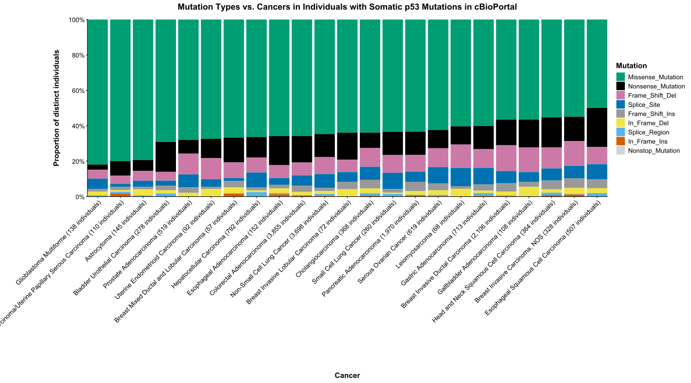

$~$


``` r
# make stacked barchart of p53 mut prevalence in all somatic pts and within cancers
stackedbarchart_muttissuesomatic <- ggplot(data_muttissuesomatic %>%
                                             mutate(temp = ifelse(str_detect(Cancer, 
                                                                             "Total") & Mutation == "yes",
                                                                  "total",
                                                                  as.character(Mutation))) %>%
                                             mutate(temp = ifelse((gsub(" \\(.*", 
                                                                        "",
                                                                        Cancer) %in% gsub(" \\(.*", 
                                                                                          "", pivotdfnobottomtotal100muts$CANCER_TYPE_DETAILED)) & Mutation == "yes",
                                                                  "subset",
                                                                  temp)), 
                                           aes(x = factor(Cancer,
                                                          levels = (data_muttissuesomatic %>% 
                                                                      subset(Mutation == "yes") %>% 
                                                                      arrange(-Proportion) %>% 
                                                                      pull(Cancer) %>%
                                                                      unique())), 
                                               y = Proportion, 
                                               fill = factor(temp,
                                                             levels = c("yes", 
                                                                        "subset",
                                                                        "total", 
                                                                        "no"))
                                               # relevel(as.factor(Mutation),
                                               #              ref = "yes")
                                           )) +
  geom_bar(position = "fill",
           stat = "identity") + 
  ggtitle("Presence of Somatic p53 Mutations in Individuals with Cancer in cBioPortal") + 
  ylab("Proportion of distinct individuals") +
  xlab("Cancer") +
  labs(fill = "p53 mutated") +
  scale_y_continuous(labels = scales::percent_format(), 
                     expand = c(0, 0), 
                     breaks = scales::pretty_breaks(n = 6)) + 
  scale_x_discrete(expand = c(0, 0)) + 
  scale_fill_manual(
    #breaks = c("yes",
    #           "no"),
    labels = c("yes", 
               "yes; subset", 
               "yes; total", 
               "no"),
    values = c("yes" = "skyblue",#"#56B4E9"
               "subset" = "#0072B2",
               "total" = "black",#"#D55E00"
               "no" = "gray90")) +
  theme_classic() + 
  theme(axis.text.x = element_text(angle = 45, 
                                   vjust = 1,
                                   hjust = 1),
        axis.text = element_text(color = "black",
                                 size = 12,
                                 vjust = 0.5), 
        axis.title = element_text(color = "black",
                                  face = "bold",
                                  size = 14),
        axis.title.x = element_text(margin = unit(c(5,0,0,0), units = "mm")),
        axis.title.y = element_text(margin = unit(c(0,5,0,0), units = "mm")),
        plot.title = element_text(hjust = 0.5,
                                  face = "bold",
                                  color = "black",
                                  size = 16,
                                  margin = margin(0,0,5,0, "mm")),
        legend.title = element_text(face = "bold",
                                    size = 14, 
                                    color = "black"),
        legend.text = element_text(size = 12, 
                                   color = "black"),
        plot.margin = margin(2,2,2,78, 
                             unit = "mm")) 
stackedbarchart_muttissuesomatic
```

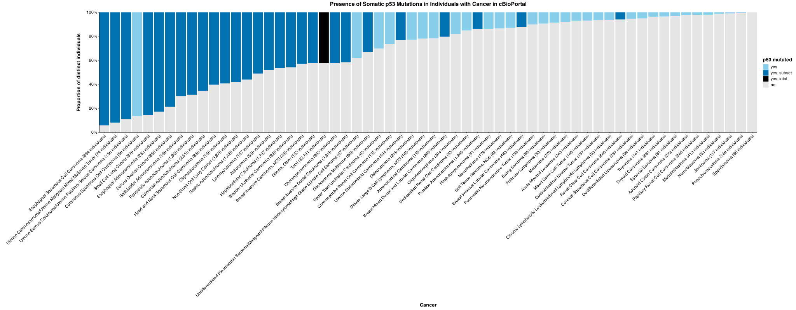

$~$


``` r
# make horiz stacked barchart
stackedbarchart_muttissuesomatic_horiz <- ggplot(data_muttissuesomatic %>%
                                                   mutate(Proportion = ifelse(is.na(Proportion),
                                                                              0,
                                                                              Proportion)) %>%
                                                   mutate(temp = ifelse(str_detect(Cancer, 
                                                                                   "Total") & Mutation == "yes",
                                                                        "total",
                                                                        as.character(Mutation))) %>%
                                                   mutate(temp = ifelse((gsub(" \\(.*", 
                                                                              "",
                                                                              Cancer) %in% gsub(" \\(.*", 
                                                                                                "", pivotdfnobottomtotal100muts$CANCER_TYPE_DETAILED)) & Mutation == "yes",
                                                                        "subset",
                                                                        temp)), 
                                                 aes(x = factor(Cancer,
                                                                levels = (data_muttissuesomatic %>% 
                                                                            subset(Mutation == "yes") %>% 
                                                                            arrange(-Proportion) %>% 
                                                                            pull(Cancer) %>%
                                                                            unique())), 
                                                     y = Proportion, 
                                                     fill = factor(temp,
                                                                   levels = c("yes", 
                                                                              "subset",
                                                                              "total", 
                                                                              "no"))
                                                     # relevel(as.factor(Mutation),
                                                     #              ref = "yes")
                                                 )) +
  geom_bar(position = position_fill(reverse = TRUE),
           stat = "identity") + # add percents of yes to barchart
  geom_text(aes(label = ifelse(Proportion %in% (data_muttissuesomatic %>% 
                                                  mutate(Proportion = ifelse(is.na(Proportion),
                                                                             0,
                                                                             Proportion)) %>%
                                                  subset(temp != "no") %>% 
                                                  pull(Proportion)),
                               paste0(plyr::round_any(Proportion * 100,
                                                      0.1
                                                      #,
                                                      #f = ceiling
                               ),
                               "%"),
                               "")
  ),
  position = position_fill(reverse = TRUE),
  color = "black",
  size = 4.5,
  fontface = "bold",
  alpha = 0.5, # level of transparency (lower is more transparent)
  vjust = 0.5,
  hjust = -0.25) +
  ggtitle("Presence of Somatic p53 Mutations in Individuals with Cancer in cBioPortal") + 
  ylab("Proportion of distinct individuals") +
  xlab("Cancer") +
  labs(fill = "p53 mutated") +
  scale_y_continuous(labels = scales::percent_format(), 
                     expand = c(0, 0), 
                     breaks = scales::pretty_breaks(n = 6),
                     position = "right") + 
  scale_x_discrete(expand = c(0, 0),
                   limits = rev) + 
  scale_fill_manual(
    #breaks = c("yes",
    #           "no"),
    labels = c("yes", 
               "yes; subset", 
               "yes; total", 
               "no"),
    values = c("yes" = "skyblue",#"#56B4E9"
               "subset" = "#0072B2",
               "total" = "black",#"#D55E00"
               "no" = "gray90")) +
  theme_classic() + 
  coord_flip(ylim = c(0, 1.04)) +
  theme(axis.text.x = element_text(angle = 0, 
                                   hjust = 0.5), 
        axis.text = element_text(color = "black",
                                 size = 12), 
        axis.title = element_text(color = "black",
                                  face = "bold",
                                  size = 14),
        axis.title.x.top = element_text(margin = unit(c(0,0,10,0), units = "mm")),
        axis.title.y = element_text(margin = unit(c(0,10,0,0), units = "mm")),
        plot.title = element_text(hjust = 0.5,
                                  face = "bold",
                                  color = "black",
                                  size = 16,
                                  margin = margin(0,0,10,0, "mm")),
        legend.text = element_text(color = "black",
                                   size = 12),
        legend.box.spacing = margin(30), # increase space between legend and plot
        legend.justification = "top", # put legend in top right of plot
        legend.title = element_text(color = "black",
                                    face = "bold",
                                    size = 14),
        axis.text.y = element_text(vjust = 0.5))
stackedbarchart_muttissuesomatic_horiz
```

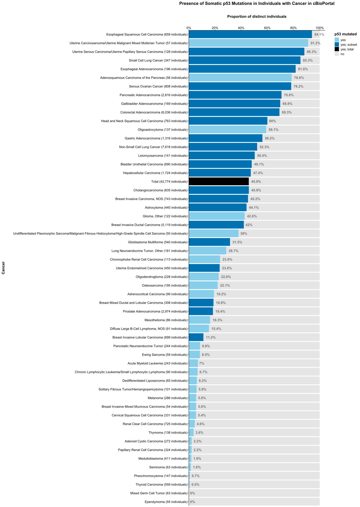

$~$


``` r
# make 100% stacked barchart with ggplot2
ggplotstackedbarchart_age_tissue <- ggplot(pivotage_melted,
                                           aes(x = Age,
                                               y = Proportion,
                                               fill = Cancer)) +
  geom_bar(position = "fill",
           stat = "identity") +
  ggtitle("Cancers vs. Ages of Cancer Diagnoses in Individuals \nwith Somatic p53 Mutations in cBioPortal") +
  xlab("Age when diagnosed (years)") +
  ylab("Proportion of distinct individuals") +
  scale_y_continuous(labels = scales::percent_format(),
                     expand = c(0,0),
                     breaks = scales::pretty_breaks(n = 6)) +
  scale_x_discrete(
    #limits = rev(levels(pivotage_melted$Age)),
    expand = c(0,0)) +
  scale_fill_manual(values = c(#"#c670e5",
    "limegreen",
    "#84007e",
    "#4342b3",
    "#ff8ea5",
    "#7e9900",
    "#50006c",
    "#e03e97",
    "#930002",
    "#ba0069",
    "#006f17",
    "lavender",
    "#420f48",
    "#eea52d",
    "#6294ff",
    "#cade66",
    "#02e9c7",
    "#806300",
    #"#c4379f",
    #"#5a1500",
    "#004584",
    "#ff865d",
    #"#ada9ff",
    "#007e3e",
    "#eea3ff",
    "#630021",
    "#002670",
    #"#ffa4d8",
    "#a44c00",
    "#d388be",
    "#ebd386",
    "red",
    "#ff7f7d",
    "#62742e",
    "gray80",
    "black")) +
  theme_classic() +
  theme(axis.text.x = element_text(angle = 45, 
                                   hjust = 1, 
                                   vjust = 1), 
        axis.text = element_text(color = "black",
                                 size = 12), 
        axis.title = element_text(color = "black",
                                  face = "bold",
                                  size = 14),
        axis.title.x = element_text(margin = unit(c(5,0,0,0), units = "mm")),
        axis.title.y = element_text(margin = unit(c(0,5,0,0), units = "mm")),
        plot.title = element_text(hjust = 0.5,
                                  face = "bold",
                                  color = "black",
                                  size = 16,
                                  margin = margin(0,0,5,0, "mm")),
        legend.text = element_text(color = "black",
                                   size = 12),
        legend.title = element_text(color = "black",
                                    face = "bold",
                                    size = 14),
        plot.margin = margin(0,10,0,10, "mm"))
ggplotstackedbarchart_age_tissue
```

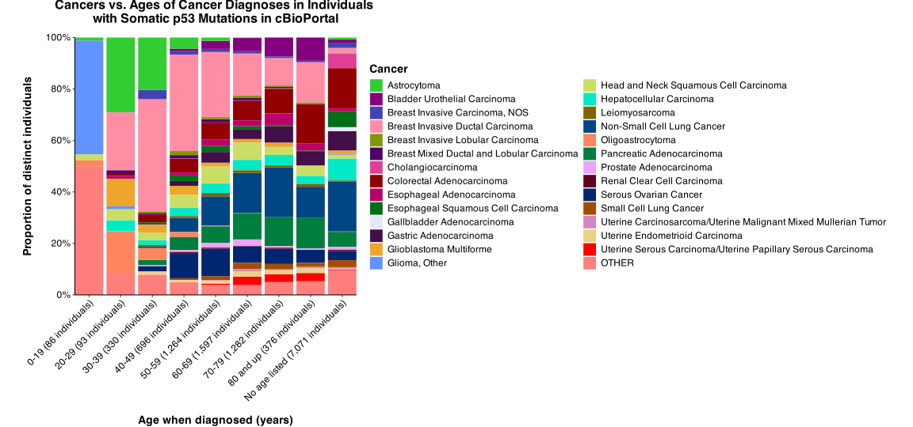

$~$


``` r
# because stacked barchart too crowded, make faceted barchart of age vs number of pts per cancer
barchart_facet_age_tissue <- ggplot(pivotagenobottom %>% 
                                      dplyr::select(-c(Total)) %>% 
                                      dplyr::mutate(Age_stratum = gsub("NA",
                                                                       "No age listed",
                                                                       Age_stratum)) %>%
                                      reshape2::melt() %>% 
                                      dplyr::rename(Age = Age_stratum,
                                                    Cancer = variable, 
                                                    Num_Distinct_Pts = value) 
                                    #%>%
                                    # subset(!str_detect(Cancer, 
                                    #                    "OTHER"))
                                    ,
                                    aes(x = factor(Cancer,
                                                   levels = 
                                                     c(
                                                       sort(unique(colnames(pivotagenobottom %>% 
                                                                              dplyr::select(-c(
                                                                                OTHER,
                                                                                Total, 
                                                                                Age_stratum)))))
                                                       ,
                                                       "OTHER")
                                    ),
                                    y = Num_Distinct_Pts,
                                    fill = factor(Cancer,
                                                  levels = 
                                                    c(
                                                      sort(unique(colnames(pivotagenobottom %>% 
                                                                             dplyr::select(-c(
                                                                               OTHER,
                                                                               Total, 
                                                                               Age_stratum)))))
                                                      ,
                                                      "OTHER")
                                    ))) + 
  geom_bar(stat = "identity", 
           position = position_dodge2()) + # to keep some space b/t barcharts in same mut
  ggtitle("Cancers vs. Ages of Cancer Diagnoses in Individuals with Somatic p53 Mutations in cBioPortal") +
  xlab("Cancer") +
  ylab("Number of distinct individuals") +
  labs(fill = "Cancer") +
  facet_wrap2(. ~ Age,
              #strip.position = "right",
              #labeller = labeller(groupwrap = label_wrap_gen(10)), # wrap labels on right based on characters
              ncol = 3,
              axes = "all", # show internal axes but without x labels
              remove_labels = "x") + # show internal axes but without x labels
  guides(fill = guide_legend(ncol = 1)) + 
  scale_y_continuous(expand = c(0,0)) +
  scale_x_discrete(expand = c(0,0)) +
  coord_cartesian(ylim = c(0, (pivotagenobottom %>% 
                                 subset(!str_detect(Age_stratum,
                                                    "NA")) %>% 
                                 dplyr::select(-c(Total)) %>% 
                                 reshape2::melt() %>% 
                                 pull(value) %>% 
                                 na.omit() %>% 
                                 max() %>% 
                                 plyr::round_any(500, 
                                                 ceiling)))) + # shorter y axis since no age listed is dwarfing actual cancers
  scale_fill_manual(values = c(#"#c670e5",
    "limegreen",
    "#84007e",
    "#4342b3",
    "#ff8ea5",
    "#7e9900",
    "#50006c",
    "#e03e97",
    "#930002",
    "#ba0069",
    "#006f17",
    "lavender",
    "#420f48",
    "#eea52d",
    "#6294ff",
    "#cade66",
    "#02e9c7",
    "#806300",
    #"#c4379f",
    #"#5a1500",
    "#004584",
    "#ff865d",
    #"#ada9ff",
    "#007e3e",
    "#eea3ff",
    "#630021",
    "#002670",
    #"#ffa4d8",
    "#a44c00",
    "#d388be",
    "#ebd386",
    "red",
    "#ff7f7d",
    "#62742e",
    "gray80"
    ,
    "black"
  )) +
  theme_classic() +
  theme(axis.text.x = element_text(angle = 45, 
                                   hjust = 1, 
                                   vjust = 1), 
        axis.text = element_text(color = "black",
                                 size = 12), 
        axis.title = element_text(color = "black",
                                  face = "bold",
                                  size = 14),
        axis.title.x = element_text(margin = unit(c(10,0,0,0), units = "mm")),
        axis.title.y = element_text(margin = unit(c(0,10,0,0), units = "mm")),
        plot.title = element_text(hjust = 0.5,
                                  face = "bold",
                                  color = "black",
                                  size = 16,
                                  margin = margin(0,0,10,0, "mm")),
        legend.text = element_text(color = "black",
                                   size = 12),
        legend.title = element_text(color = "black",
                                    face = "bold",
                                    size = 14),
        legend.box.spacing = margin(30), # increase space between legend and plot
        legend.justification = "top", # put legend in top right of plot
        #legend.position = c(,), # c(0,0) bottom left, c(1,1) top-right within plot
        strip.background = element_blank(),
        strip.text = element_text(color = "black",
                                  size = 14,
                                  face = "bold",
                                  margin = margin(0,0,5,0, "mm")),
        panel.spacing.y = unit(-16, "lines"),
        panel.spacing.x = unit(2, "lines"),
        plot.margin = margin(0,0,0,10, unit = "mm"))
barchart_facet_age_tissue
```

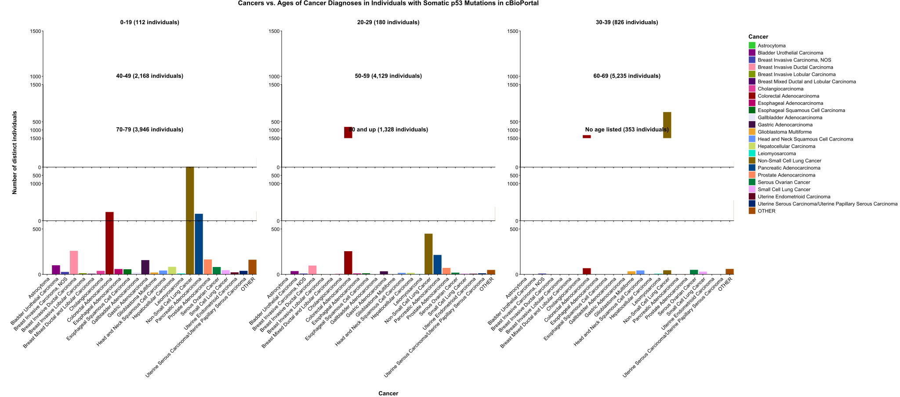

$~$


``` r
# because many muts per pt, adding up to beyond 100% so ggplot2 automatically scaling down numbers to add to 100%, which is why plot looks uneven; order of sexes is accurate for highest to lowest missense, but the values depicted are different from the real values because ggplot2 has already scaled them, can't 'fit' the values here either because we actually need to see all muts' actual percentages, rather than binarizing and keeping accurate percentages for what we want to see and scaling down other percentages

# make 100% stacked barchart with ggplot2 with reversed missense order i.e. highest to lowest
ggplotstackedbarchart_sex <- ggplot(pivotsex_type_melted, 
                                    aes(x = SEX, 
                                        y = Proportion, 
                                        fill = Mutation)) + 
  geom_bar(position = "fill", 
           stat = "identity") + 
  ggtitle("Mutation Types vs. Sexes in \nIndividuals with Cancer and \nSomatic p53 Mutations in cBioPortal") + 
  xlab("Sex") +
  ylab("Proportion of distinct individuals") +
  scale_y_continuous(labels = scales::percent_format(), 
                     expand = c(0,0), 
                     breaks = scales::pretty_breaks(n = 6)) +
  scale_x_discrete(
    #limits = rev(levels(pivotsex_type_melted$SEX)), 
    expand = c(0,0)) +
  scale_fill_manual(values = c("#009E73",
                               "#000000",
                               "#CC79A7",
                               "#0072B2",
                               "#999999",
                               "#F0E442",
                               "#56B4E9",
                               "#D55E00",
                               "lightgray",
                               "#E69F00")) + 
  theme_classic() + 
  theme(axis.text.x = element_text(angle = 45, 
                                   hjust = 1, 
                                   vjust = 1), 
        axis.text = element_text(color = "black",
                                 size = 12), 
        axis.title = element_text(color = "black",
                                  face = "bold",
                                  size = 14),
        axis.title.x = element_text(margin = margin(5,0,0,0,"mm")),
        axis.title.y = element_text(margin = margin(0,5,0,0,"mm")),
        plot.title = element_text(hjust = 0.5,
                                  face = "bold",
                                  color = "black",
                                  size = 16,
                                  margin = margin(0,0,5,0, 
                                                  unit = "mm")),
        legend.text = element_text(color = "black",
                                   size = 12),
        legend.title = element_text(color = "black",
                                    face = "bold",
                                    size = 14),
        plot.margin = margin(0,0,0,10, unit = "mm"))
ggplotstackedbarchart_sex
```

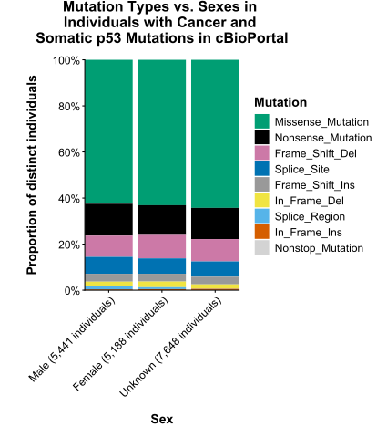

$~$


``` r
# make 100% stacked barchart with ggplot2
ggplotstackedbarchart_sex_tissue <- ggplot(pivotsex_melted,
                                           aes(x = SEX,
                                               y = Proportion,
                                               fill = Cancer)) +
  geom_bar(position = "fill",
           stat = "identity") +
  ggtitle("Cancers vs. Sexes in Individuals \nwith Somatic p53 Mutations in cBioPortal") +
  xlab("Sex") +
  ylab("Proportion of distinct individuals") +
  scale_y_continuous(labels = scales::percent_format(),
                     expand = c(0,0),
                     breaks = scales::pretty_breaks(n = 6)) +
  scale_x_discrete(
    #limits = rev(levels(pivotsex_melted$SEX)),
    expand = c(0,0)) +
  scale_fill_manual(values = c(#"#c670e5",
    "limegreen",
    "#84007e",
    "#4342b3",
    "#ff8ea5",
    "#7e9900",
    "#50006c",
    "#e03e97",
    "#930002",
    "#ba0069",
    "#006f17",
    "lavender",
    "#420f48",
    "#eea52d",
    "#6294ff",
    "#cade66",
    "#02e9c7",
    "#806300",
    #"#c4379f",
    #"#5a1500",
    "#004584",
    "#ff865d",
    #"#ada9ff",
    "#007e3e",
    "#eea3ff",
    "#630021",
    "#002670",
    #"#ffa4d8",
    "#a44c00",
    "#d388be",
    "#ebd386",
    "red",
    "#ff7f7d",
    "#62742e",
    "gray80",
    "black")) +
  theme_classic() +
  theme(axis.text.x = element_text(angle = 45, 
                                   hjust = 1, 
                                   vjust = 1), 
        axis.text = element_text(color = "black",
                                 size = 12), 
        axis.title = element_text(color = "black",
                                  face = "bold",
                                  size = 14),
        axis.title.x = element_text(margin = unit(c(5,0,0,0), units = "mm")),
        axis.title.y = element_text(margin = unit(c(0,5,0,0), units = "mm")),
        plot.title = element_text(hjust = 0.5,
                                  face = "bold",
                                  color = "black",
                                  size = 16,
                                  margin = margin(0,0,5,0, "mm")),
        legend.text = element_text(color = "black",
                                   size = 12),
        legend.title = element_text(color = "black",
                                    face = "bold",
                                    size = 14),
        plot.margin = margin(0,10,0,15, "mm"))
ggplotstackedbarchart_sex_tissue
```

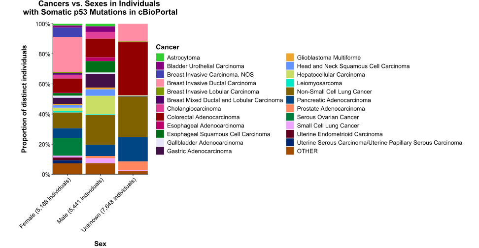

$~$


``` r
# because stacked barchart too crowded, make faceted barchart of sex vs number of pts per cancer
barchart_facet_sex_tissue <- ggplot(pivotsexnobottom %>% 
                                      dplyr::select(-c(Total)) %>% 
                                      reshape2::melt() %>% 
                                      dplyr::rename(Cancer = variable, 
                                                    Num_Distinct_Pts = value) 
                                    # %>%
                                    #   subset(!str_detect(Cancer, 
                                    #                      "OTHER"))
                                    ,
                                    aes(x = factor(Cancer,
                                                   levels = 
                                                     c(
                                                       sort(unique(colnames(pivotsexnobottom %>% 
                                                                              dplyr::select(-c(
                                                                                OTHER,
                                                                                Total, 
                                                                                SEX)))))
                                                       ,
                                                       "OTHER")
                                    ),
                                    y = Num_Distinct_Pts,
                                    fill = factor(Cancer,
                                                  levels = 
                                                    c(
                                                      sort(unique(colnames(pivotsexnobottom %>% 
                                                                             dplyr::select(-c(
                                                                               OTHER,
                                                                               Total, 
                                                                               SEX)))))
                                                      ,
                                                      "OTHER")
                                    ))) + 
  geom_bar(stat = "identity", 
           position = position_dodge2()) + # to keep some space b/t barcharts in same mut
  ggtitle("Cancers vs. Sex in Individuals with Somatic p53 Mutations in cBioPortal") +
  xlab("Cancer") +
  ylab("Number of distinct individuals") +
  labs(fill = "Cancer") +
  facet_wrap2(. ~ SEX,
              #strip.position = "right",
              #labeller = labeller(groupwrap = label_wrap_gen(10)), # wrap labels on right based on characters
              ncol = 2,
              axes = "all", # show internal axes but without x labels
              remove_labels = "x") + # show internal axes but without x labels
  guides(fill = guide_legend(ncol = 1)) + 
  scale_y_continuous(expand = c(0,0)) +
  scale_x_discrete(expand = c(0,0)) +
  coord_cartesian(ylim = c(0, (pivotsexnobottom %>% 
                                 dplyr::select(-c(Total)) %>% 
                                 reshape2::melt() %>% 
                                 pull(value) %>% 
                                 na.omit() %>% 
                                 max() %>% 
                                 plyr::round_any(500, 
                                                 ceiling)))) +
  scale_fill_manual(values = c(#"#c670e5",
    "limegreen",
    "#84007e",
    "#4342b3",
    "#ff8ea5",
    "#7e9900",
    "#50006c",
    "#e03e97",
    "#930002",
    "#ba0069",
    "#006f17",
    "lavender",
    "#420f48",
    "#eea52d",
    "#6294ff",
    "#cade66",
    "#02e9c7",
    "#806300",
    #"#c4379f",
    #"#5a1500",
    "#004584",
    "#ff865d",
    #"#ada9ff",
    "#007e3e",
    "#eea3ff",
    "#630021",
    "#002670",
    #"#ffa4d8",
    "#a44c00",
    "#d388be",
    "#ebd386",
    "red",
    "#ff7f7d",
    "#62742e",
    "gray80"
    ,
    "black"
  )) +
  theme_classic() +
  theme(axis.text.x = element_text(angle = 45, 
                                   hjust = 1, 
                                   vjust = 1), 
        axis.text = element_text(color = "black",
                                 size = 12), 
        axis.title = element_text(color = "black",
                                  face = "bold",
                                  size = 14),
        axis.title.x = element_text(margin = unit(c(10,0,0,0), units = "mm")),
        axis.title.y = element_text(margin = unit(c(0,10,0,0), units = "mm")),
        plot.title = element_text(hjust = 0.5,
                                  face = "bold",
                                  color = "black",
                                  size = 16,
                                  margin = margin(0,0,10,0, "mm")),
        legend.text = element_text(color = "black",
                                   size = 12),
        legend.title = element_text(color = "black",
                                    face = "bold",
                                    size = 14),
        legend.box.spacing = margin(30), # increase space between legend and plot
        #legend.justification = "top", # put legend in top right of plot
        #legend.position = c(,), # c(0,0) bottom left, c(1,1) top-right within plot
        strip.background = element_blank(),
        strip.text = element_text(color = "black",
                                  size = 14,
                                  face = "bold",
                                  margin = margin(0,0,5,0, "mm")),
        #panel.spacing.y = unit(-16, "lines"),
        panel.spacing.x = unit(3, "lines"),
        plot.margin = margin(0,0,0,10, unit = "mm"))
barchart_facet_sex_tissue
```

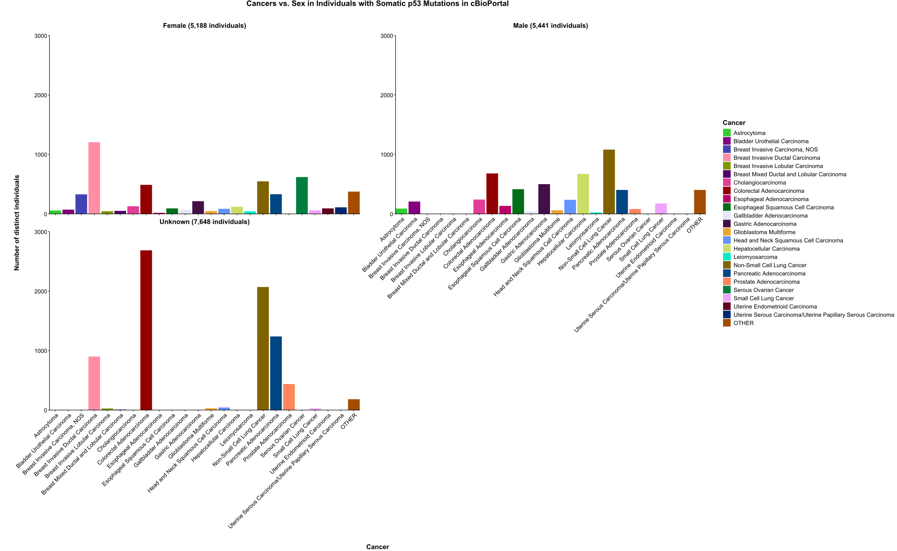

$~$


``` r
# make stacked barchart of isoform yes no in pts
stackedbarchart_pts_splice <- ggplot(pt_splice_df_ggplot %>%
                                       filter(str_detect(Patient, 
                                                         "All")), 
                                     aes(x = Patient,
                                         #factor(Patient,
                                         # levels = sort(unique(pt_splice_df_ggplot$Patient),
                                         #decreasing = TRUE)[order(c(2,3,1))]), 
                                         y = Calc, 
                                         fill = relevel(as.factor(Isoform),
                                                        ref = "yes"))) + 
  geom_bar(position = "fill", 
           stat = "identity") + 
  ggtitle("Proportion of Somatic Mutations \nAffecting TP53 Splicing in \nIndividuals with Cancer in cBioPortal") +
  xlab("Patient type") +
  ylab("Proportion of distinct individuals") +
  labs(fill = "Splicing affected") +
  scale_y_continuous(labels = scales::percent_format(), 
                     expand = c(0,0), 
                     breaks = scales::pretty_breaks(n = 6)) +
  scale_x_discrete(expand = c(0,0)) +
  scale_fill_manual(values = c("#0072B2",
                               "lightgray")) +
  theme_classic() + 
  theme(axis.text.x = element_text(angle = 45, 
                                   hjust = 1, 
                                   vjust = 1), 
        axis.text = element_text(color = "black",
                                 size = 12), 
        axis.title = element_text(color = "black",
                                  face = "bold",
                                  size = 14),
        axis.title.x = element_text(margin = unit(c(5,0,0,0), units = "mm")),
        axis.title.y = element_text(margin = unit(c(0,5,0,0), units = "mm")),
        plot.title = element_text(hjust = 0.5,
                                  face = "bold",
                                  color = "black",
                                  size = 16,
                                  margin = margin(0,0,5,0, "mm")),
        legend.text = element_text(color = "black",
                                   size = 12),
        legend.title = element_text(color = "black",
                                    face = "bold",
                                    size = 14),
        plot.margin = margin(0,0,0,20, "mm"))
stackedbarchart_pts_splice
```

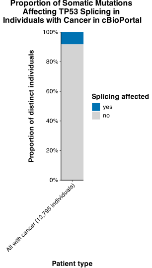

$~$


``` r
# because many somatic muts in mult pts, percents not adding up to 100% so shrink other muts to fit expected %
to_fit_mult <- 1 - (sum(pt_spliceperpos_df_ggplot %>%
                          subset(Isoform == "yes" & grepl("Multiple", 
                                                          Patient)) %>%
                          pull(Calc)))

# other percentages in all and sole pts not exactly adding up to 100% either but very close
to_fit_all <- 1 - (sum(pt_spliceperpos_df_ggplot %>%
                         subset(Isoform == "yes" & grepl("All", 
                                                         Patient)) %>%
                         pull(Calc)))

to_fit_sole <- 1 - (sum(pt_spliceperpos_df_ggplot %>%
                          subset(Isoform == "yes" & grepl("One", 
                                                          Patient)) %>%
                          pull(Calc)))

# plot zoomed in stacked barchart with adjusted %
stackedbarchart_pts_spliceperpos <- ggplot(pt_spliceperpos_df_ggplot %>%
                                             mutate(Calc_label = Calc) %>%
                                             mutate(Calc_label = dplyr::case_when(Isoform == "no" & grepl("Multiple", 
                                                                                                          Patient) ~ to_fit_mult/nrow(pt_spliceperpos_df_ggplot %>%
                                                                                                                                        subset(Isoform == "no" & grepl("Multiple", 
                                                                                                                                                                       Patient))),
                                                                                  Isoform == "no" & grepl("All", 
                                                                                                          Patient) ~ to_fit_all/nrow(pt_spliceperpos_df_ggplot %>%
                                                                                                                                       subset(Isoform == "no" & grepl("All", 
                                                                                                                                                                      Patient))),
                                                                                  Isoform == "no" & grepl("One", 
                                                                                                          Patient) ~ to_fit_sole/nrow(pt_spliceperpos_df_ggplot %>%
                                                                                                                                        subset(Isoform == "no" & grepl("One", 
                                                                                                                                                                       Patient))),
                                                                                  TRUE ~ Calc_label)) %>%
                                             filter(str_detect(Patient,
                                                               "All")), 
                                           aes(x = Patient,
                                               #factor(Patient,
                                               #levels = sort(unique(pt_spliceperpos_df_ggplot$Patient),
                                               #  decreasing = TRUE)[order(c(2,3,1))]), 
                                               y = Calc_label, 
                                               fill = factor(Label,
                                                             levels = c((pt_spliceperpos_df_ggplot %>%
                                                                           filter(str_detect(Patient,
                                                                                             "All")) %>%
                                                                           arrange(-Calc) %>%
                                                                           pull(Label) %>%
                                                                           unique())[(pt_spliceperpos_df_ggplot %>% 
                                                                                        filter(str_detect(Patient,
                                                                                                          "All")) %>%
                                                                                        arrange(-Calc) %>%
                                                                                        pull(Label) %>%
                                                                                        unique()) != "Other"], 
                                                                        "Other")))) + 
  geom_bar(position = "fill", 
           stat = "identity") + 
  ggtitle("Proportion of Somatic Mutations \nAffecting TP53 Splicing in \nIndividuals with Cancer in cBioPortal") +
  xlab("Patient type") +
  ylab("Proportion of distinct individuals") +
  labs(fill = "Mutation") +
  scale_y_continuous(labels = scales::percent_format(), 
                     expand = c(0,0), 
                     breaks = scales::pretty_breaks(n = 6)) +
  scale_x_discrete(expand = c(0,0)) +
  coord_cartesian(ylim = c((plyr::round_any(to_fit_all, 
                                            0.05, 
                                            f = floor)), 1.0000001), # set axis limits in coord_cartesian to zoom in on percentages
                  expand = FALSE) +
  scale_fill_manual(values = c(hue_pal()(length(c((pt_spliceperpos_df_ggplot %>%
                                                     filter(str_detect(Patient,
                                                                       "All")) %>%
                                                     arrange(-Calc) %>%
                                                     pull(Label) %>%
                                                     unique())[(pt_spliceperpos_df_ggplot %>% 
                                                                  filter(str_detect(Patient,
                                                                                    "All")) %>%
                                                                  arrange(-Calc) %>%
                                                                  pull(Label) %>%
                                                                  unique()) != "Other"], 
                                                  "Other"))) %>% 
                                 head(-1),
                               "lightgray")) + # extract automatic gradient colors and replace final one i.e. other with lightgray
  theme_classic() + 
  theme(axis.text.x = element_text(angle = 45, 
                                   hjust = 1, 
                                   vjust = 1), 
        axis.text = element_text(color = "black",
                                 size = 12), 
        axis.title = element_text(color = "black",
                                  face = "bold",
                                  size = 14),
        axis.title.x = element_text(margin = unit(c(5,0,0,0), units = "mm")),
        axis.title.y = element_text(margin = unit(c(0,5,0,0), units = "mm")),
        plot.title = element_text(hjust = 0.5,
                                  face = "bold",
                                  color = "black",
                                  size = 16,
                                  margin = margin(0,0,5,0, "mm")),
        legend.text = element_text(color = "black",
                                   size = 12),
        legend.title = element_text(color = "black",
                                    face = "bold",
                                    size = 14),
        plot.margin = margin(0,0,0,20, "mm"))
stackedbarchart_pts_spliceperpos
```

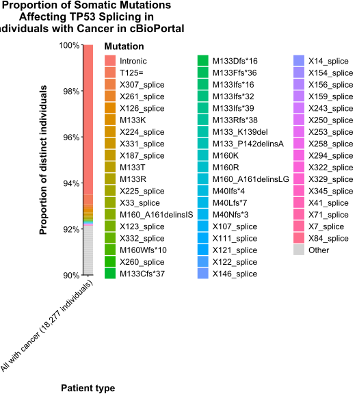

$~$


``` r
# to simplify above plot, make facet barchart on muts of interest i.e. T125T, M133T, M133R
barchart_pts_keysplicepos <- ggplot(pt_spliceperpos_df_ggplot %>% 
                                      mutate(Label = gsub("T125=",
                                                          "T125T",
                                                          Label)) %>%
                                      subset(Isoform == "yes" & Label %in% c("T125T", 
                                                                             "M133T", 
                                                                             "M133R")) %>%
                                      filter(str_detect(Patient, 
                                                        "All")), 
                                    aes(x = Patient,
                                        # factor(Patient,
                                        #        levels = sort(unique(pt_spliceperpos_df_ggplot$Patient))[c(1,3,2)]), 
                                        y = Calc, 
                                        fill = Patient
                                        # factor(Patient,
                                        #    levels = sort(unique(pt_spliceperpos_df_ggplot$Patient))[c(1,3,2)])
                                    )) + 
  geom_bar(stat = "identity", 
           position = position_dodge2()) + # to keep some space b/t barcharts in same mut
  geom_text(aes(label = paste0(plyr::round_any(Calc * 100, 
                                               0.01),
                               "%")),
            color = "black",
            size = 3.5,
            fontface = "bold",
            alpha = 0.75, # level of transparency (lower is more transparent)
            vjust = -0.5,
            hjust = 0.5) +
  xlab("Patient type") +
  ylab("Proportion of distinct individuals") +
  labs(fill = "Patient type") + 
  ggtitle("Proportion of Somatic Mutations Affecting TP53 Splicing \nin Individuals with Cancer in cBioPortal") +
  facet_wrap2(. ~ factor(Label,
                         levels = c("T125T", 
                                    "M133T", 
                                    "M133R")),
              axes = "y") + # show all inner y axes labels too
  scale_y_continuous(labels = scales::percent_format(), 
                     expand = c(0,0), 
                     breaks = scales::pretty_breaks(n = 6), 
                     limits = c(0, ((pt_spliceperpos_df_ggplot %>% 
                                       mutate(Label = gsub("T125=",
                                                           "T125T",
                                                           Label)) %>%
                                       subset(Isoform == "yes" & Label %in% c("T125T", 
                                                                              "M133T", 
                                                                              "M133R")) %>%
                                       filter(str_detect(Patient, 
                                                         "All")) %>% 
                                       pull(Calc) %>% 
                                       max() %>% 
                                       plyr::round_any(0.02,
                                                       f = ceiling)) * 1.00001))) + 
  scale_x_discrete(
    #limits = rev, 
    expand = c(0,0)) + 
  scale_fill_manual(values = c("#D55E00",
                               "#0072B2",
                               "#009E73"
                               #,"#E69F00",
                               #"#56B4E9",
                               #"#CC79A7"
  )) +
  theme_classic() + 
  theme(axis.text.x = element_text(angle = 45, 
                                   hjust = 1, 
                                   vjust = 1), 
        axis.text = element_text(color = "black",
                                 size = 12), 
        axis.title = element_text(color = "black",
                                  face = "bold",
                                  size = 14),
        axis.title.x = element_text(margin = unit(c(10,0,0,0), units = "mm")),
        axis.title.y = element_text(margin = unit(c(0,10,0,0), units = "mm")),
        plot.title = element_text(hjust = 0.5,
                                  face = "bold",
                                  color = "black",
                                  size = 16,
                                  margin = margin(0,0,10,0, "mm")),
        legend.text = element_text(color = "black",
                                   size = 12),
        legend.title = element_text(color = "black",
                                    face = "bold",
                                    size = 14),
        legend.justification = "top", # put legend in top right of plot
        #legend.position = c(,), # c(0,0) bottom left, c(1,1) top-right within plot
        strip.background = element_blank(),
        strip.text = element_text(color = "black",
                                  size = 14,
                                  face = "bold",
                                  margin = margin(0,0,10,0, "mm")),
        panel.spacing.x = unit(3, "lines"),
        plot.margin = margin(0,0,0,20, unit = "mm"))
barchart_pts_keysplicepos
```

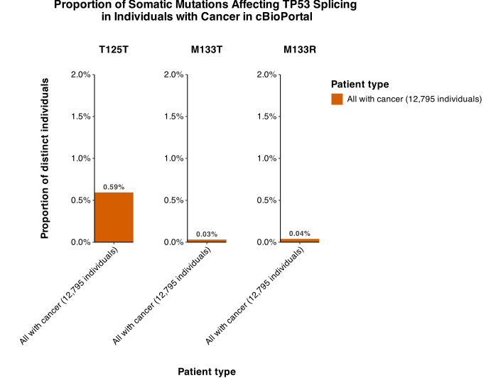

$~$


``` r
# draw stacked barchart
stackedbarchart_pts_splice_cancers <- ggplot(p53mutssplicepercancer_pivot_melted %>% 
                                               subset(!str_detect(Cancer, 
                                                                  "OTHER")),
                                             aes(x = factor(Cancer,
                                                            levels = p53mutssplicepercancer_pivot_melted %>% 
                                                              subset(!str_detect(Cancer, 
                                                                                 "OTHER")) %>% 
                                                              subset(Isoform == "yes") %>%
                                                              arrange(-Proportion) %>% 
                                                              pull(Cancer) %>% 
                                                              unique() %>% 
                                                              as.vector()),
                                                 y = Proportion,
                                                 fill = relevel(as.factor(Isoform),
                                                                ref = "yes"))) + 
  geom_bar(position = "fill", 
           stat = "identity") + 
  ggtitle("Proportion of Somatic Mutations Affecting TP53 Splicing in Individuals with Cancer in cBioPortal") + 
  xlab("Cancer") +
  ylab("Proportion of distinct individuals") +
  labs(fill = "Splicing affected") +
  scale_y_continuous(labels = scales::percent_format(), 
                     expand = c(0,0), 
                     breaks = scales::pretty_breaks(n = 6)) +
  scale_x_discrete(expand = c(0,0)) +
  scale_fill_manual(values = c("#0072B2",
                               "lightgray")) +
  theme_classic() + 
  theme(axis.text.x = element_text(angle = 45, 
                                   hjust = 1, 
                                   vjust = 1), 
        axis.text = element_text(color = "black",
                                 size = 12), 
        axis.title = element_text(color = "black",
                                  face = "bold",
                                  size = 14),
        axis.title.x = element_text(margin = unit(c(5,0,0,0), units = "mm")),
        axis.title.y = element_text(margin = unit(c(0,5,0,0), units = "mm")),
        plot.title = element_text(hjust = 0.5,
                                  face = "bold",
                                  color = "black",
                                  size = 16,
                                  margin = margin(0,0,10,0, "mm")),
        legend.text = element_text(color = "black",
                                   size = 12),
        legend.title = element_text(color = "black",
                                    face = "bold",
                                    size = 14),
        plot.margin = margin(0,0,0,50, "mm"))
stackedbarchart_pts_splice_cancers
```

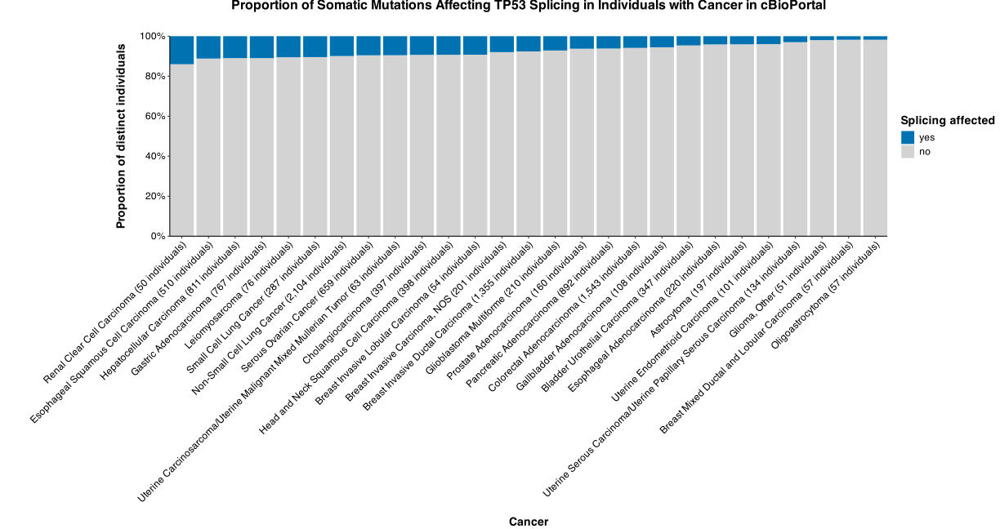

$~$


``` r
# add total to barcharts
df_total_ggplot <- p53mutssplicepercancer_pivot %>% # add num pts to cancer colnames
  rename_at(vars(2:(ncol(.) 
                    #- 1
  )),
  ~ paste0(.,
           " (",
           format(as.numeric(p53mutssplicepercancer_pivot[nrow(p53mutssplicepercancer_pivot), .]), 
                  big.mark = ",", 
                  trim = TRUE),
           " individuals)")) %>% # divide down each col by last value i.e. total pts
  mutate(across(where(is.numeric),
                ~ .x/last(.x))) %>% 
  subset(Isoform != "Total") %>%
  #dplyr::select(-Total) %>% 
  reshape2::melt() %>% 
  dplyr::rename(Cancer = variable,
                Proportion = value) %>% 
  mutate(label = ifelse(str_detect(Cancer, "Total") & Isoform == "yes",
                        "yes; total",
                        Isoform))

# make stacked barchart with total
stackedbarchart_pts_splice_cancers_total <- ggplot(df_total_ggplot %>% 
                                                     subset(!str_detect(Cancer, 
                                                                        "OTHER")),
                                                   aes(x = factor(Cancer,
                                                                  levels = df_total_ggplot %>% 
                                                                    subset(!str_detect(Cancer, 
                                                                                       "OTHER")) %>% 
                                                                    subset(Isoform == "yes") %>%
                                                                    arrange(-Proportion) %>% 
                                                                    pull(Cancer) %>% 
                                                                    unique() %>% 
                                                                    as.vector()),
                                                       y = Proportion,
                                                       fill = factor(label,
                                                                     levels = c("yes",
                                                                                "yes; total",
                                                                                "no")))) + 
  geom_bar(position = "fill", 
           stat = "identity") + 
  ggtitle("Proportion of Somatic Mutations Affecting TP53 Splicing in Individuals with Cancer in cBioPortal") + 
  xlab("Cancer") +
  ylab("Proportion of distinct individuals") +
  labs(fill = "Splicing affected") +
  scale_y_continuous(labels = scales::percent_format(), 
                     expand = c(0,0), 
                     breaks = scales::pretty_breaks(n = 6)) +
  scale_x_discrete(expand = c(0,0)) +
  scale_fill_manual(values = c("#0072B2",
                               "black",
                               "lightgray")) +
  theme_classic() + 
  theme(axis.text.x = element_text(angle = 45, 
                                   hjust = 1, 
                                   vjust = 1), 
        axis.text = element_text(color = "black",
                                 size = 12), 
        axis.title = element_text(color = "black",
                                  face = "bold",
                                  size = 14),
        axis.title.x = element_text(margin = unit(c(5,0,0,0), units = "mm")),
        axis.title.y = element_text(margin = unit(c(0,5,0,0), units = "mm")),
        plot.title = element_text(hjust = 0.5,
                                  face = "bold",
                                  color = "black",
                                  size = 16,
                                  margin = margin(0,0,10,0, "mm")),
        legend.text = element_text(color = "black",
                                   size = 12),
        legend.title = element_text(color = "black",
                                    face = "bold",
                                    size = 14),
        plot.margin = margin(0,0,0,50, "mm"))
stackedbarchart_pts_splice_cancers_total
```

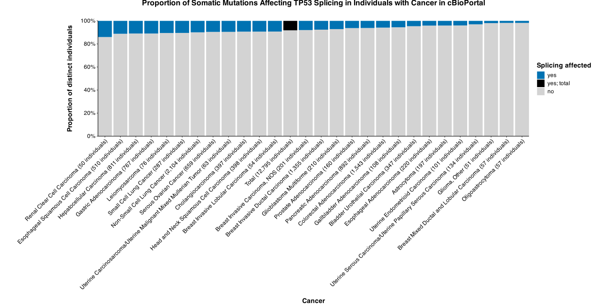

$~$


``` r
# make horiz stacked barchart with total
stackedbarchart_pts_splice_cancers_total_horiz <- ggplot(df_total_ggplot %>%
                                                           subset(!str_detect(Cancer, 
                                                                              "OTHER")),
                                                         aes(x = factor(Cancer,
                                                                        levels = df_total_ggplot %>% 
                                                                          subset(!str_detect(Cancer,
                                                                                             "OTHER")) %>% 
                                                                          subset(Isoform == "yes") %>%
                                                                          arrange(-Proportion) %>% 
                                                                          pull(Cancer) %>% 
                                                                          unique() %>% 
                                                                          as.vector()),
                                                             y = Proportion,
                                                             fill = factor(label,
                                                                           levels = c("yes",
                                                                                      "yes; total",
                                                                                      "no")))) + 
  geom_bar(position = position_fill(reverse = TRUE),
           stat = "identity") + # add percents of yes to barchart
  geom_text(aes(label = paste0(plyr::round_any(Proportion * 100,
                                               0.1
                                               #,
                                               #f = ceiling
  ),
  "%")),
  position = position_fill(reverse = TRUE),
  color = "black",
  size = 4.5,
  fontface = "bold",
  alpha = 0.5, # level of transparency (lower is more transparent)
  vjust = 0.5,
  hjust = -0.25) +
  ggtitle("Proportion of Somatic Mutations Affecting TP53 Splicing in Individuals with Cancer in cBioPortal") + 
  xlab("Cancer") +
  ylab("Proportion of distinct individuals") +
  labs(fill = "Splicing affected") +
  scale_y_continuous(labels = scales::percent_format(), 
                     expand = c(0,0), 
                     breaks = scales::pretty_breaks(n = 5),
                     position = "right") +
  scale_x_discrete(expand = c(0,0),
                   limits = rev) +
  scale_fill_manual(values = c("#0072B2",
                               "black",
                               "lightgray")) +
  theme_classic() + 
  coord_flip(ylim = c(0, ((df_total_ggplot %>% 
                             subset(!str_detect(Cancer, 
                                                "OTHER")) %>% 
                             subset(Isoform == "yes") %>% 
                             pull(Proportion) %>% 
                             max() %>% 
                             plyr::round_any(0.1, 
                                             f = ceiling)) * 1.000001))) + # calls coord_cartesian to set axis limits to zoom in on percentages
  theme(axis.text.x = element_text(angle = 0, 
                                   hjust = 0.5), 
        axis.text = element_text(color = "black",
                                 size = 12), 
        axis.title = element_text(color = "black",
                                  face = "bold",
                                  size = 14),
        axis.title.x.top = element_text(margin = unit(c(0,0,10,0), units = "mm")),
        axis.title.y = element_text(margin = unit(c(0,10,0,0), units = "mm")),
        plot.title = element_text(hjust = 0.5,
                                  face = "bold",
                                  color = "black",
                                  size = 16,
                                  margin = margin(0,0,10,0, "mm")),
        legend.text = element_text(color = "black",
                                   size = 12),
        legend.title = element_text(color = "black",
                                    face = "bold",
                                    size = 14),
        legend.justification = "top", # put legend at top right
        axis.text.y = element_text(vjust = 0.5))
stackedbarchart_pts_splice_cancers_total_horiz
```

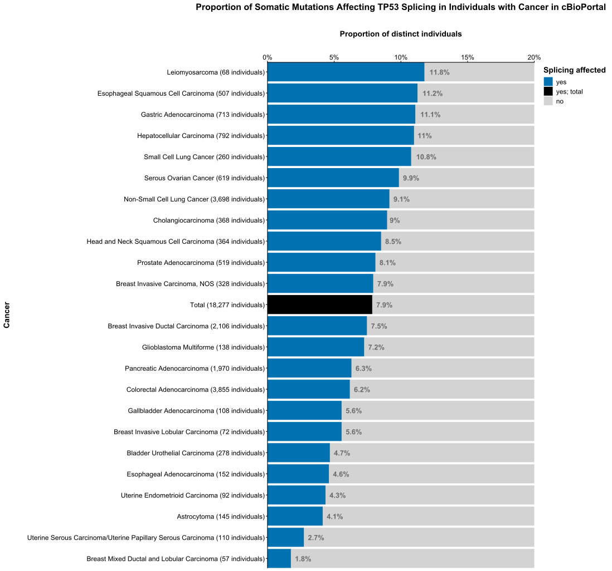

$~$


``` r
saveRDS(df_total_ggplot %>% 
          subset(label == "yes; total") %>% 
          mutate(Type = gsub("Total",
                             "somatic",
                             Cancer)),
        file = paste0(table_path,
                      "som_overall_splice.rds"))
```

$~$


``` r
# make horiz stacked barchart
stackedbarchart_pts_splice_cancers_horiz <- ggplot(p53mutssplicepercancer_pivot_melted %>%
                                                     subset(!str_detect(Cancer, 
                                                                        "OTHER")),
                                                   aes(x = factor(Cancer,
                                                                  levels = p53mutssplicepercancer_pivot_melted %>% 
                                                                    subset(!str_detect(Cancer,
                                                                                       "OTHER")) %>% 
                                                                    subset(Isoform == "yes") %>%
                                                                    arrange(-Proportion) %>% 
                                                                    pull(Cancer) %>% 
                                                                    unique() %>% 
                                                                    as.vector()),
                                                       y = Proportion,
                                                       fill = relevel(as.factor(Isoform),
                                                                      ref = "yes"))) +
  geom_bar(position = position_fill(reverse = TRUE),
           stat = "identity") + # add percents of yes to barchart
  geom_text(aes(label = paste0(plyr::round_any(Proportion * 100,
                                               0.1
                                               #,
                                               #f = ceiling
  ),
  "%")),
  position = position_fill(reverse = TRUE),
  color = "black",
  size = 4.5,
  fontface = "bold",
  alpha = 0.5, # level of transparency (lower is more transparent)
  vjust = 0.5,
  hjust = -0.25) +
  ggtitle("Proportion of Somatic Mutations Affecting TP53 Splicing in Individuals with Cancer in cBioPortal") + 
  xlab("Cancer") +
  ylab("Proportion of distinct individuals") +
  labs(fill = "Splicing affected") +
  scale_y_continuous(labels = scales::percent_format(), 
                     expand = c(0,0), 
                     breaks = scales::pretty_breaks(n = 5),
                     position = "right") +
  scale_x_discrete(expand = c(0,0),
                   limits = rev) +
  scale_fill_manual(values = c("#0072B2",
                               "lightgray")) +
  theme_classic() + 
  coord_flip(ylim = c(0, ((p53mutssplicepercancer_pivot_melted %>% 
                             subset(!str_detect(Cancer, 
                                                "OTHER")) %>% 
                             subset(Isoform == "yes") %>% 
                             pull(Proportion) %>% 
                             max() %>% 
                             plyr::round_any(0.05, 
                                             f = ceiling)) * 1.000001))) + # calls coord_cartesian to set axis limits to zoom in on percentages
  theme(axis.text.x = element_text(angle = 0, 
                                   hjust = 0.5), 
        axis.text = element_text(color = "black",
                                 size = 12), 
        axis.title = element_text(color = "black",
                                  face = "bold",
                                  size = 14),
        axis.title.x.top = element_text(margin = unit(c(0,0,10,0), units = "mm")),
        axis.title.y = element_text(margin = unit(c(0,10,0,0), units = "mm")),
        plot.title = element_text(hjust = 0.5,
                                  face = "bold",
                                  color = "black",
                                  size = 16,
                                  margin = margin(0,0,10,0, "mm")),
        legend.text = element_text(color = "black",
                                   size = 12),
        legend.title = element_text(color = "black",
                                    face = "bold",
                                    size = 14),
        legend.justification = "top", # put legend at top right
        axis.text.y = element_text(vjust = 0.5))
stackedbarchart_pts_splice_cancers_horiz
```

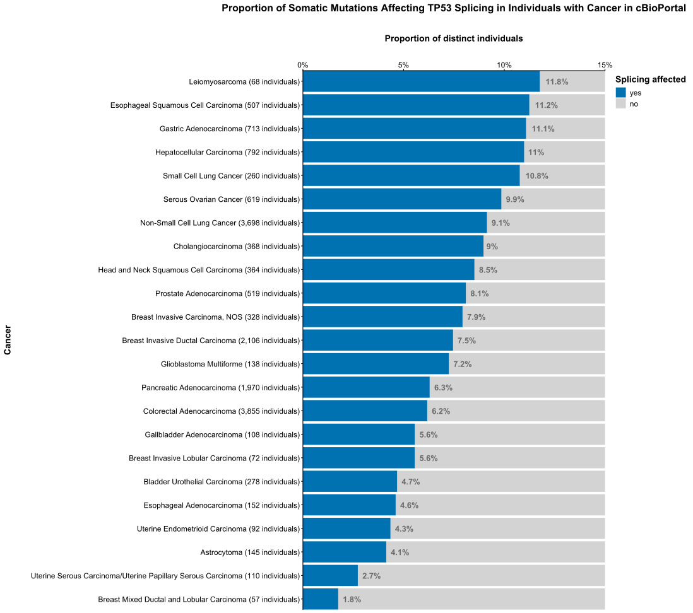

$~$


``` r
# b/c multiple somatic muts in pts, just in case percents != 100%, shrink other muts to fit expected %
to_fit <- p53mutssplicepercancer_pivot_melted %>%
  subset(Isoform == "no")

# get how many cancers to account for
length(to_fit$Cancer) # 31 here including other
```

```
[1] 24
```

``` r
# plot zoomed in stacked barchart
stackedbarchart_pts_splice_cancers_pos <- ggplot(p53mutssplicepercancerpos_pivot_melted %>% 
                                                   mutate(Proportion_label = Proportion) %>% 
                                                   mutate(Proportion_label = dplyr::case_when(Isoform == "no" & Cancer == as.character(to_fit$Cancer[1]) ~ to_fit$Proportion[1]/nrow(p53mutssplicepercancerpos_pivot_melted %>%
                                                                                                                                                                                       subset(Isoform == "no" & Cancer == as.character(to_fit$Cancer[1]))),
                                                                                              Isoform == "no" & Cancer == as.character(to_fit$Cancer[2]) ~ to_fit$Proportion[2]/nrow(p53mutssplicepercancerpos_pivot_melted %>%
                                                                                                                                                                                       subset(Isoform == "no" & Cancer == as.character(to_fit$Cancer[2]))),
                                                                                              Isoform == "no" & Cancer == as.character(to_fit$Cancer[3]) ~ to_fit$Proportion[3]/nrow(p53mutssplicepercancerpos_pivot_melted %>%
                                                                                                                                                                                       subset(Isoform == "no" & Cancer == as.character(to_fit$Cancer[3]))),
                                                                                              Isoform == "no" & Cancer == as.character(to_fit$Cancer[4]) ~ to_fit$Proportion[4]/nrow(p53mutssplicepercancerpos_pivot_melted %>%
                                                                                                                                                                                       subset(Isoform == "no" & Cancer == as.character(to_fit$Cancer[4]))),
                                                                                              Isoform == "no" & Cancer == as.character(to_fit$Cancer[5]) ~ to_fit$Proportion[5]/nrow(p53mutssplicepercancerpos_pivot_melted %>%
                                                                                                                                                                                       subset(Isoform == "no" & Cancer == as.character(to_fit$Cancer[5]))),
                                                                                              Isoform == "no" & Cancer == as.character(to_fit$Cancer[6]) ~ to_fit$Proportion[6]/nrow(p53mutssplicepercancerpos_pivot_melted %>%
                                                                                                                                                                                       subset(Isoform == "no" & Cancer == as.character(to_fit$Cancer[6]))),
                                                                                              Isoform == "no" & Cancer == as.character(to_fit$Cancer[7]) ~ to_fit$Proportion[7]/nrow(p53mutssplicepercancerpos_pivot_melted %>%
                                                                                                                                                                                       subset(Isoform == "no" & Cancer == as.character(to_fit$Cancer[7]))),
                                                                                              Isoform == "no" & Cancer == as.character(to_fit$Cancer[8]) ~ to_fit$Proportion[8]/nrow(p53mutssplicepercancerpos_pivot_melted %>%
                                                                                                                                                                                       subset(Isoform == "no" & Cancer == as.character(to_fit$Cancer[8]))),
                                                                                              Isoform == "no" & Cancer == as.character(to_fit$Cancer[9]) ~ to_fit$Proportion[9]/nrow(p53mutssplicepercancerpos_pivot_melted %>%
                                                                                                                                                                                       subset(Isoform == "no" & Cancer == as.character(to_fit$Cancer[9]))),
                                                                                              Isoform == "no" & Cancer == as.character(to_fit$Cancer[10]) ~ to_fit$Proportion[10]/nrow(p53mutssplicepercancerpos_pivot_melted %>%
                                                                                                                                                                                         subset(Isoform == "no" & Cancer == as.character(to_fit$Cancer[10]))),
                                                                                              Isoform == "no" & Cancer == as.character(to_fit$Cancer[11]) ~ to_fit$Proportion[11]/nrow(p53mutssplicepercancerpos_pivot_melted %>%
                                                                                                                                                                                         subset(Isoform == "no" & Cancer == as.character(to_fit$Cancer[11]))),
                                                                                              Isoform == "no" & Cancer == as.character(to_fit$Cancer[12]) ~ to_fit$Proportion[12]/nrow(p53mutssplicepercancerpos_pivot_melted %>%
                                                                                                                                                                                         subset(Isoform == "no" & Cancer == as.character(to_fit$Cancer[12]))),
                                                                                              Isoform == "no" & Cancer == as.character(to_fit$Cancer[13]) ~ to_fit$Proportion[13]/nrow(p53mutssplicepercancerpos_pivot_melted %>%
                                                                                                                                                                                         subset(Isoform == "no" & Cancer == as.character(to_fit$Cancer[13]))),
                                                                                              Isoform == "no" & Cancer == as.character(to_fit$Cancer[14]) ~ to_fit$Proportion[14]/nrow(p53mutssplicepercancerpos_pivot_melted %>%
                                                                                                                                                                                         subset(Isoform == "no" & Cancer == as.character(to_fit$Cancer[14]))),
                                                                                              Isoform == "no" & Cancer == as.character(to_fit$Cancer[15]) ~ to_fit$Proportion[15]/nrow(p53mutssplicepercancerpos_pivot_melted %>%
                                                                                                                                                                                         subset(Isoform == "no" & Cancer == as.character(to_fit$Cancer[15]))),
                                                                                              Isoform == "no" & Cancer == as.character(to_fit$Cancer[16]) ~ to_fit$Proportion[16]/nrow(p53mutssplicepercancerpos_pivot_melted %>%
                                                                                                                                                                                         subset(Isoform == "no" & Cancer == as.character(to_fit$Cancer[16]))),
                                                                                              Isoform == "no" & Cancer == as.character(to_fit$Cancer[17]) ~ to_fit$Proportion[17]/nrow(p53mutssplicepercancerpos_pivot_melted %>%
                                                                                                                                                                                         subset(Isoform == "no" & Cancer == as.character(to_fit$Cancer[17]))),
                                                                                              Isoform == "no" & Cancer == as.character(to_fit$Cancer[18]) ~ to_fit$Proportion[18]/nrow(p53mutssplicepercancerpos_pivot_melted %>%
                                                                                                                                                                                         subset(Isoform == "no" & Cancer == as.character(to_fit$Cancer[18]))),
                                                                                              Isoform == "no" & Cancer == as.character(to_fit$Cancer[19]) ~ to_fit$Proportion[19]/nrow(p53mutssplicepercancerpos_pivot_melted %>%
                                                                                                                                                                                         subset(Isoform == "no" & Cancer == as.character(to_fit$Cancer[19]))),
                                                                                              Isoform == "no" & Cancer == as.character(to_fit$Cancer[20]) ~ to_fit$Proportion[20]/nrow(p53mutssplicepercancerpos_pivot_melted %>%
                                                                                                                                                                                         subset(Isoform == "no" & Cancer == as.character(to_fit$Cancer[20]))),
                                                                                              Isoform == "no" & Cancer == as.character(to_fit$Cancer[21]) ~ to_fit$Proportion[21]/nrow(p53mutssplicepercancerpos_pivot_melted %>%
                                                                                                                                                                                         subset(Isoform == "no" & Cancer == as.character(to_fit$Cancer[21]))),
                                                                                              Isoform == "no" & Cancer == as.character(to_fit$Cancer[22]) ~ to_fit$Proportion[22]/nrow(p53mutssplicepercancerpos_pivot_melted %>%
                                                                                                                                                                                         subset(Isoform == "no" & Cancer == as.character(to_fit$Cancer[22]))),
                                                                                              Isoform == "no" & Cancer == as.character(to_fit$Cancer[23]) ~ to_fit$Proportion[23]/nrow(p53mutssplicepercancerpos_pivot_melted %>%
                                                                                                                                                                                         subset(Isoform == "no" & Cancer == as.character(to_fit$Cancer[23]))),
                                                                                              Isoform == "no" & Cancer == as.character(to_fit$Cancer[24]) ~ to_fit$Proportion[24]/nrow(p53mutssplicepercancerpos_pivot_melted %>%
                                                                                                                                                                                         subset(Isoform == "no" & Cancer == as.character(to_fit$Cancer[24]))),
                                                                                              Isoform == "no" & Cancer == as.character(to_fit$Cancer[25]) ~ to_fit$Proportion[25]/nrow(p53mutssplicepercancerpos_pivot_melted %>%
                                                                                                                                                                                         subset(Isoform == "no" & Cancer == as.character(to_fit$Cancer[25]))),
                                                                                              Isoform == "no" & Cancer == as.character(to_fit$Cancer[26]) ~ to_fit$Proportion[26]/nrow(p53mutssplicepercancerpos_pivot_melted %>%
                                                                                                                                                                                         subset(Isoform == "no" & Cancer == as.character(to_fit$Cancer[26]))),
                                                                                              Isoform == "no" & Cancer == as.character(to_fit$Cancer[27]) ~ to_fit$Proportion[27]/nrow(p53mutssplicepercancerpos_pivot_melted %>%
                                                                                                                                                                                         subset(Isoform == "no" & Cancer == as.character(to_fit$Cancer[27]))),
                                                                                              Isoform == "no" & Cancer == as.character(to_fit$Cancer[28]) ~ to_fit$Proportion[28]/nrow(p53mutssplicepercancerpos_pivot_melted %>%
                                                                                                                                                                                         subset(Isoform == "no" & Cancer == as.character(to_fit$Cancer[28]))),
                                                                                              Isoform == "no" & Cancer == as.character(to_fit$Cancer[29]) ~ to_fit$Proportion[29]/nrow(p53mutssplicepercancerpos_pivot_melted %>%
                                                                                                                                                                                         subset(Isoform == "no" & Cancer == as.character(to_fit$Cancer[29]))),
                                                                                              Isoform == "no" & Cancer == as.character(to_fit$Cancer[30]) ~ to_fit$Proportion[30]/nrow(p53mutssplicepercancerpos_pivot_melted %>%
                                                                                                                                                                                         subset(Isoform == "no" & Cancer == as.character(to_fit$Cancer[30]))),
                                                                                              Isoform == "no" & Cancer == as.character(to_fit$Cancer[31]) ~ to_fit$Proportion[31]/nrow(p53mutssplicepercancerpos_pivot_melted %>%
                                                                                                                                                                                         subset(Isoform == "no" & Cancer == as.character(to_fit$Cancer[31]))),
                                                                                              Isoform == "no" & Cancer == as.character(to_fit$Cancer[32]) ~ to_fit$Proportion[32]/nrow(p53mutssplicepercancerpos_pivot_melted %>%
                                                                                                                                                                                         subset(Isoform == "no" & Cancer == as.character(to_fit$Cancer[32]))),
                                                                                              Isoform == "no" & Cancer == as.character(to_fit$Cancer[33]) ~ to_fit$Proportion[33]/nrow(p53mutssplicepercancerpos_pivot_melted %>%
                                                                                                                                                                                         subset(Isoform == "no" & Cancer == as.character(to_fit$Cancer[33]))),
                                                                                              Isoform == "no" & Cancer == as.character(to_fit$Cancer[34]) ~ to_fit$Proportion[34]/nrow(p53mutssplicepercancerpos_pivot_melted %>%
                                                                                                                                                                                         subset(Isoform == "no" & Cancer == as.character(to_fit$Cancer[34]))),
                                                                                              Isoform == "no" & Cancer == as.character(to_fit$Cancer[35]) ~ to_fit$Proportion[35]/nrow(p53mutssplicepercancerpos_pivot_melted %>%
                                                                                                                                                                                         subset(Isoform == "no" & Cancer == as.character(to_fit$Cancer[35]))),
                                                                                              Isoform == "no" & Cancer == as.character(to_fit$Cancer[36]) ~ to_fit$Proportion[36]/nrow(p53mutssplicepercancerpos_pivot_melted %>%
                                                                                                                                                                                         subset(Isoform == "no" & Cancer == as.character(to_fit$Cancer[36]))),
                                                                                              TRUE ~ Proportion_label)) %>% 
                                                   subset(!str_detect(Cancer, 
                                                                      "OTHER")), 
                                                 aes(x = factor(Cancer,
                                                                levels = p53mutssplicepercancer_pivot_melted %>% 
                                                                  subset(!str_detect(Cancer, 
                                                                                     "OTHER")) %>% 
                                                                  subset(Isoform == "yes") %>%
                                                                  arrange(-Proportion) %>% 
                                                                  pull(Cancer) %>% 
                                                                  unique() %>% 
                                                                  as.vector()), 
                                                     y = Proportion_label, 
                                                     fill = factor(Label,
                                                                   levels = c((p53mutssplicepercancerpos_pivot_melted %>%
                                                                                 arrange(-Proportion) %>%
                                                                                 pull(Label) %>%
                                                                                 unique())[(p53mutssplicepercancerpos_pivot_melted %>% 
                                                                                              arrange(-Proportion) %>%
                                                                                              pull(Label) %>%
                                                                                              unique()) != "Other"], 
                                                                              "Other")))) + 
  geom_bar(position = "fill", 
           stat = "identity") + 
  ggtitle("Proportion of Somatic Mutations Affecting TP53 Splicing in Individuals with Cancer in cBioPortal") + 
  xlab("Cancer") +
  ylab("Proportion of distinct individuals") +
  labs(fill = "Mutation") +
  scale_y_continuous(labels = scales::percent_format(), 
                     expand = c(0,0), 
                     breaks = scales::pretty_breaks(n = 7)) +
  scale_x_discrete(expand = c(0,0)) +
  coord_cartesian(ylim = c((plyr::round_any(min(to_fit$Proportion), 
                                            0.05, 
                                            f = floor)), 1.0000001), # set axis limits in coord_cartesian to zoom in on percentages
                  expand = FALSE) + 
  scale_fill_manual(values = c(hue_pal()(length(c((p53mutssplicepercancerpos_pivot_melted %>%
                                                     arrange(-Proportion) %>%
                                                     pull(Label) %>%
                                                     unique())[(p53mutssplicepercancerpos_pivot_melted %>% 
                                                                  arrange(-Proportion) %>%
                                                                  pull(Label) %>%
                                                                  unique()) != "Other"], 
                                                  "Other"))) %>% 
                                 head(-1),
                               "lightgray")) + # extract automatic gradient colors and replace final one i.e. other with lightgray
  theme_classic() + 
  theme(axis.text.x = element_text(angle = 45, 
                                   hjust = 1, 
                                   vjust = 1), 
        axis.text = element_text(color = "black",
                                 size = 12), 
        axis.title = element_text(color = "black",
                                  face = "bold",
                                  size = 14),
        axis.title.x = element_text(margin = unit(c(5,0,0,0), units = "mm")),
        axis.title.y = element_text(margin = unit(c(0,5,0,0), units = "mm")),
        plot.title = element_text(hjust = 0.5,
                                  face = "bold",
                                  color = "black",
                                  size = 16,
                                  margin = margin(0,0,5,0, "mm")),
        legend.text = element_text(color = "black",
                                   size = 12),
        legend.title = element_text(color = "black",
                                    face = "bold",
                                    size = 14),
        plot.margin = margin(0,0,0,50, "mm"))
stackedbarchart_pts_splice_cancers_pos
```

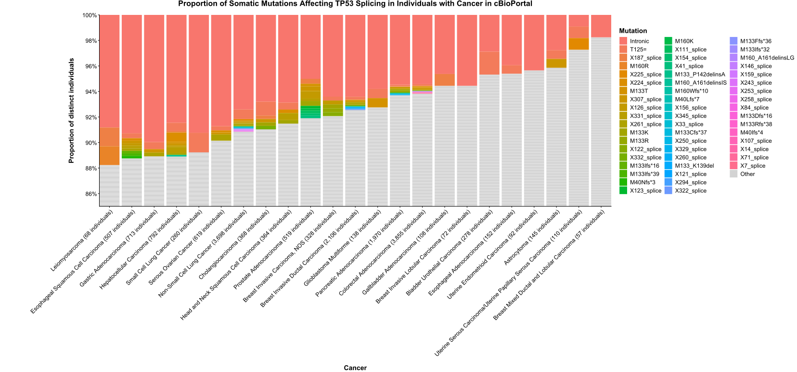

$~$


``` r
# because multiple somatic muts in pts, just in case percents != 100%, shrink other muts to fit expected %
to_fit <- p53mutssplicepercancer_pivot_melted %>%
  subset(Isoform == "no")

# get how many cancers to account for
length(to_fit$Cancer) # 31 here including other
```

```
[1] 24
```

``` r
# plot zoomed in stacked barchart
stackedbarchart_pts_splice_cancers_pos_horiz <- ggplot(p53mutssplicepercancerpos_pivot_melted %>% 
                                                         mutate(Proportion_label = Proportion) %>% 
                                                         mutate(Proportion_label = dplyr::case_when(Isoform == "no" & Cancer == as.character(to_fit$Cancer[1]) ~ to_fit$Proportion[1]/nrow(p53mutssplicepercancerpos_pivot_melted %>%
                                                                                                                                                                                             subset(Isoform == "no" & Cancer == as.character(to_fit$Cancer[1]))),
                                                                                                    Isoform == "no" & Cancer == as.character(to_fit$Cancer[2]) ~ to_fit$Proportion[2]/nrow(p53mutssplicepercancerpos_pivot_melted %>%
                                                                                                                                                                                             subset(Isoform == "no" & Cancer == as.character(to_fit$Cancer[2]))),
                                                                                                    Isoform == "no" & Cancer == as.character(to_fit$Cancer[3]) ~ to_fit$Proportion[3]/nrow(p53mutssplicepercancerpos_pivot_melted %>%
                                                                                                                                                                                             subset(Isoform == "no" & Cancer == as.character(to_fit$Cancer[3]))),
                                                                                                    Isoform == "no" & Cancer == as.character(to_fit$Cancer[4]) ~ to_fit$Proportion[4]/nrow(p53mutssplicepercancerpos_pivot_melted %>%
                                                                                                                                                                                             subset(Isoform == "no" & Cancer == as.character(to_fit$Cancer[4]))),
                                                                                                    Isoform == "no" & Cancer == as.character(to_fit$Cancer[5]) ~ to_fit$Proportion[5]/nrow(p53mutssplicepercancerpos_pivot_melted %>%
                                                                                                                                                                                             subset(Isoform == "no" & Cancer == as.character(to_fit$Cancer[5]))),
                                                                                                    Isoform == "no" & Cancer == as.character(to_fit$Cancer[6]) ~ to_fit$Proportion[6]/nrow(p53mutssplicepercancerpos_pivot_melted %>%
                                                                                                                                                                                             subset(Isoform == "no" & Cancer == as.character(to_fit$Cancer[6]))),
                                                                                                    Isoform == "no" & Cancer == as.character(to_fit$Cancer[7]) ~ to_fit$Proportion[7]/nrow(p53mutssplicepercancerpos_pivot_melted %>%
                                                                                                                                                                                             subset(Isoform == "no" & Cancer == as.character(to_fit$Cancer[7]))),
                                                                                                    Isoform == "no" & Cancer == as.character(to_fit$Cancer[8]) ~ to_fit$Proportion[8]/nrow(p53mutssplicepercancerpos_pivot_melted %>%
                                                                                                                                                                                             subset(Isoform == "no" & Cancer == as.character(to_fit$Cancer[8]))),
                                                                                                    Isoform == "no" & Cancer == as.character(to_fit$Cancer[9]) ~ to_fit$Proportion[9]/nrow(p53mutssplicepercancerpos_pivot_melted %>%
                                                                                                                                                                                             subset(Isoform == "no" & Cancer == as.character(to_fit$Cancer[9]))),
                                                                                                    Isoform == "no" & Cancer == as.character(to_fit$Cancer[10]) ~ to_fit$Proportion[10]/nrow(p53mutssplicepercancerpos_pivot_melted %>%
                                                                                                                                                                                               subset(Isoform == "no" & Cancer == as.character(to_fit$Cancer[10]))),
                                                                                                    Isoform == "no" & Cancer == as.character(to_fit$Cancer[11]) ~ to_fit$Proportion[11]/nrow(p53mutssplicepercancerpos_pivot_melted %>%
                                                                                                                                                                                               subset(Isoform == "no" & Cancer == as.character(to_fit$Cancer[11]))),
                                                                                                    Isoform == "no" & Cancer == as.character(to_fit$Cancer[12]) ~ to_fit$Proportion[12]/nrow(p53mutssplicepercancerpos_pivot_melted %>%
                                                                                                                                                                                               subset(Isoform == "no" & Cancer == as.character(to_fit$Cancer[12]))),
                                                                                                    Isoform == "no" & Cancer == as.character(to_fit$Cancer[13]) ~ to_fit$Proportion[13]/nrow(p53mutssplicepercancerpos_pivot_melted %>%
                                                                                                                                                                                               subset(Isoform == "no" & Cancer == as.character(to_fit$Cancer[13]))),
                                                                                                    Isoform == "no" & Cancer == as.character(to_fit$Cancer[14]) ~ to_fit$Proportion[14]/nrow(p53mutssplicepercancerpos_pivot_melted %>%
                                                                                                                                                                                               subset(Isoform == "no" & Cancer == as.character(to_fit$Cancer[14]))),
                                                                                                    Isoform == "no" & Cancer == as.character(to_fit$Cancer[15]) ~ to_fit$Proportion[15]/nrow(p53mutssplicepercancerpos_pivot_melted %>%
                                                                                                                                                                                               subset(Isoform == "no" & Cancer == as.character(to_fit$Cancer[15]))),
                                                                                                    Isoform == "no" & Cancer == as.character(to_fit$Cancer[16]) ~ to_fit$Proportion[16]/nrow(p53mutssplicepercancerpos_pivot_melted %>%
                                                                                                                                                                                               subset(Isoform == "no" & Cancer == as.character(to_fit$Cancer[16]))),
                                                                                                    Isoform == "no" & Cancer == as.character(to_fit$Cancer[17]) ~ to_fit$Proportion[17]/nrow(p53mutssplicepercancerpos_pivot_melted %>%
                                                                                                                                                                                               subset(Isoform == "no" & Cancer == as.character(to_fit$Cancer[17]))),
                                                                                                    Isoform == "no" & Cancer == as.character(to_fit$Cancer[18]) ~ to_fit$Proportion[18]/nrow(p53mutssplicepercancerpos_pivot_melted %>%
                                                                                                                                                                                               subset(Isoform == "no" & Cancer == as.character(to_fit$Cancer[18]))),
                                                                                                    Isoform == "no" & Cancer == as.character(to_fit$Cancer[19]) ~ to_fit$Proportion[19]/nrow(p53mutssplicepercancerpos_pivot_melted %>%
                                                                                                                                                                                               subset(Isoform == "no" & Cancer == as.character(to_fit$Cancer[19]))),
                                                                                                    Isoform == "no" & Cancer == as.character(to_fit$Cancer[20]) ~ to_fit$Proportion[20]/nrow(p53mutssplicepercancerpos_pivot_melted %>%
                                                                                                                                                                                               subset(Isoform == "no" & Cancer == as.character(to_fit$Cancer[20]))),
                                                                                                    Isoform == "no" & Cancer == as.character(to_fit$Cancer[21]) ~ to_fit$Proportion[21]/nrow(p53mutssplicepercancerpos_pivot_melted %>%
                                                                                                                                                                                               subset(Isoform == "no" & Cancer == as.character(to_fit$Cancer[21]))),
                                                                                                    Isoform == "no" & Cancer == as.character(to_fit$Cancer[22]) ~ to_fit$Proportion[22]/nrow(p53mutssplicepercancerpos_pivot_melted %>%
                                                                                                                                                                                               subset(Isoform == "no" & Cancer == as.character(to_fit$Cancer[22]))),
                                                                                                    Isoform == "no" & Cancer == as.character(to_fit$Cancer[23]) ~ to_fit$Proportion[23]/nrow(p53mutssplicepercancerpos_pivot_melted %>%
                                                                                                                                                                                               subset(Isoform == "no" & Cancer == as.character(to_fit$Cancer[23]))),
                                                                                                    Isoform == "no" & Cancer == as.character(to_fit$Cancer[24]) ~ to_fit$Proportion[24]/nrow(p53mutssplicepercancerpos_pivot_melted %>%
                                                                                                                                                                                               subset(Isoform == "no" & Cancer == as.character(to_fit$Cancer[24]))),
                                                                                                    Isoform == "no" & Cancer == as.character(to_fit$Cancer[25]) ~ to_fit$Proportion[25]/nrow(p53mutssplicepercancerpos_pivot_melted %>%
                                                                                                                                                                                               subset(Isoform == "no" & Cancer == as.character(to_fit$Cancer[25]))),
                                                                                                    Isoform == "no" & Cancer == as.character(to_fit$Cancer[26]) ~ to_fit$Proportion[26]/nrow(p53mutssplicepercancerpos_pivot_melted %>%
                                                                                                                                                                                               subset(Isoform == "no" & Cancer == as.character(to_fit$Cancer[26]))),
                                                                                                    Isoform == "no" & Cancer == as.character(to_fit$Cancer[27]) ~ to_fit$Proportion[27]/nrow(p53mutssplicepercancerpos_pivot_melted %>%
                                                                                                                                                                                               subset(Isoform == "no" & Cancer == as.character(to_fit$Cancer[27]))),
                                                                                                    Isoform == "no" & Cancer == as.character(to_fit$Cancer[28]) ~ to_fit$Proportion[28]/nrow(p53mutssplicepercancerpos_pivot_melted %>%
                                                                                                                                                                                               subset(Isoform == "no" & Cancer == as.character(to_fit$Cancer[28]))),
                                                                                                    Isoform == "no" & Cancer == as.character(to_fit$Cancer[29]) ~ to_fit$Proportion[29]/nrow(p53mutssplicepercancerpos_pivot_melted %>%
                                                                                                                                                                                               subset(Isoform == "no" & Cancer == as.character(to_fit$Cancer[29]))),
                                                                                                    Isoform == "no" & Cancer == as.character(to_fit$Cancer[30]) ~ to_fit$Proportion[30]/nrow(p53mutssplicepercancerpos_pivot_melted %>%
                                                                                                                                                                                               subset(Isoform == "no" & Cancer == as.character(to_fit$Cancer[30]))),
                                                                                                    Isoform == "no" & Cancer == as.character(to_fit$Cancer[31]) ~ to_fit$Proportion[31]/nrow(p53mutssplicepercancerpos_pivot_melted %>%
                                                                                                                                                                                               subset(Isoform == "no" & Cancer == as.character(to_fit$Cancer[31]))),
                                                                                                    Isoform == "no" & Cancer == as.character(to_fit$Cancer[32]) ~ to_fit$Proportion[32]/nrow(p53mutssplicepercancerpos_pivot_melted %>%
                                                                                                                                                                                               subset(Isoform == "no" & Cancer == as.character(to_fit$Cancer[32]))),
                                                                                                    Isoform == "no" & Cancer == as.character(to_fit$Cancer[33]) ~ to_fit$Proportion[33]/nrow(p53mutssplicepercancerpos_pivot_melted %>%
                                                                                                                                                                                               subset(Isoform == "no" & Cancer == as.character(to_fit$Cancer[33]))),
                                                                                                    Isoform == "no" & Cancer == as.character(to_fit$Cancer[34]) ~ to_fit$Proportion[34]/nrow(p53mutssplicepercancerpos_pivot_melted %>%
                                                                                                                                                                                               subset(Isoform == "no" & Cancer == as.character(to_fit$Cancer[34]))),
                                                                                                    Isoform == "no" & Cancer == as.character(to_fit$Cancer[35]) ~ to_fit$Proportion[35]/nrow(p53mutssplicepercancerpos_pivot_melted %>%
                                                                                                                                                                                               subset(Isoform == "no" & Cancer == as.character(to_fit$Cancer[35]))),
                                                                                                    Isoform == "no" & Cancer == as.character(to_fit$Cancer[36]) ~ to_fit$Proportion[36]/nrow(p53mutssplicepercancerpos_pivot_melted %>%
                                                                                                                                                                                               subset(Isoform == "no" & Cancer == as.character(to_fit$Cancer[36]))),
                                                                                                    TRUE ~ Proportion_label)) %>% 
                                                         subset(!str_detect(Cancer,
                                                                            "OTHER")), 
                                                       aes(x = factor(Cancer,
                                                                      levels = p53mutssplicepercancer_pivot_melted %>% 
                                                                        subset(!str_detect(Cancer,
                                                                                           "OTHER")) %>% 
                                                                        subset(Isoform == "yes") %>%
                                                                        arrange(-Proportion) %>% 
                                                                        pull(Cancer) %>% 
                                                                        unique() %>% 
                                                                        as.vector()), 
                                                           y = Proportion_label, 
                                                           fill = factor(Label,
                                                                         levels = c((p53mutssplicepercancerpos_pivot_melted %>%
                                                                                       arrange(-Proportion) %>%
                                                                                       pull(Label) %>%
                                                                                       unique())[(p53mutssplicepercancerpos_pivot_melted %>% 
                                                                                                    arrange(-Proportion) %>%
                                                                                                    pull(Label) %>%
                                                                                                    unique()) != "Other"], 
                                                                                    "Other")))) + 
  geom_bar(position = position_fill(reverse = TRUE), 
           stat = "identity") +  
  ggtitle("Proportion of Somatic Mutations Affecting TP53 Splicing in Individuals with Cancer in cBioPortal") + 
  xlab("Cancer") +
  ylab("Proportion of distinct individuals") +
  labs(fill = "Mutation") +
  scale_y_continuous(labels = scales::percent_format(), 
                     expand = c(0,0), 
                     breaks = scales::pretty_breaks(n = 7),
                     position = "right") +
  scale_x_discrete(expand = c(0,0),
                   limits = rev) +
  scale_fill_manual(values = c(hue_pal()(length(c((p53mutssplicepercancerpos_pivot_melted %>%
                                                     arrange(-Proportion) %>%
                                                     pull(Label) %>%
                                                     unique())[(p53mutssplicepercancerpos_pivot_melted %>% 
                                                                  arrange(-Proportion) %>%
                                                                  pull(Label) %>%
                                                                  unique()) != "Other"], 
                                                  "Other"))) %>% 
                                 head(-1),
                               "lightgray")) + # extract automatic gradient colors and replace final one i.e. other with lightgray
  theme_classic() + 
  coord_flip(ylim = c(0, ((p53mutssplicepercancer_pivot_melted %>%
                             subset(!str_detect(Cancer,
                                                "OTHER")) %>% 
                             subset(Isoform == "yes") %>%
                             pull(Proportion) %>% 
                             max() %>% 
                             plyr::round_any(0.05,
                                             f = ceiling)) * 1.00001))) + # calls coord_cartesian to set axis limits to zoom in on percentages
  guides(fill = guide_legend(ncol = 2)) + 
  theme(axis.text.x = element_text(angle = 0, 
                                   hjust = 0.5), 
        axis.text = element_text(color = "black",
                                 size = 12), 
        axis.title = element_text(color = "black",
                                  face = "bold",
                                  size = 14),
        axis.title.x.top = element_text(margin = unit(c(0,0,10,0), units = "mm")),
        axis.title.y = element_text(margin = unit(c(0,10,0,0), units = "mm")),
        plot.title = element_text(hjust = 0.5,
                                  face = "bold",
                                  color = "black",
                                  size = 16,
                                  margin = margin(0,0,10,0, "mm")),
        legend.text = element_text(color = "black",
                                   size = 12),
        legend.title = element_text(color = "black",
                                    face = "bold",
                                    size = 14),
        axis.text.y = element_text(vjust = 0.5))
stackedbarchart_pts_splice_cancers_pos_horiz
```

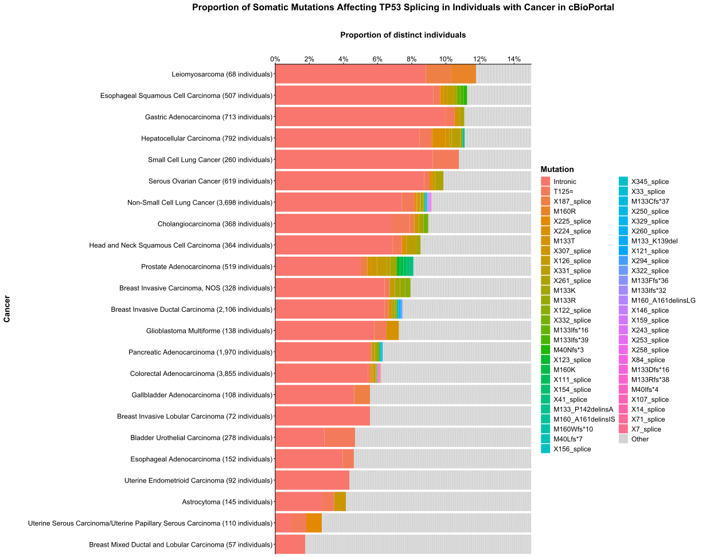

$~$


``` r
save_plot(file = paste0(fig_path,
                        "stackedbarchart_pts_splice_cancers_pos_horiz_barchart.png"), # .svg is too big to insert into powerpoint so need to save as png
          stackedbarchart_pts_splice_cancers_pos_horiz,
          base_width = 17,
          base_height = 13.5,
          dpi = 600,
          limitsize = FALSE) # specifying dpi because saving as png since svg cannot insert into ppt
```

$~$


``` r
# to simplify above plot, make facet barchart on muts of interest i.e. T125T, M133T, M133R
barchart_pts_keysplicepos_cancers <- ggplot(p53mutssplicepercancerpos_pivot_melted %>% 
                                              subset(!str_detect(Cancer, 
                                                                 "OTHER")) %>% 
                                              mutate(Label = gsub("T125=",
                                                                  "T125T",
                                                                  Label)) %>%
                                              subset(Isoform == "yes" & Label %in% c("T125T", 
                                                                                     "M133T", 
                                                                                     "M133R")), 
                                            aes(x = factor(Cancer,
                                                           levels = sort(unique(as.vector(p53mutssplicepercancerpos_pivot_melted$Cancer)))[!str_detect(sort(unique(as.vector(p53mutssplicepercancerpos_pivot_melted$Cancer))), 
                                                                                                                                                       "OTHER")]),
                                                # factor(Cancer,
                                                #          levels = c(sort(unique(as.vector(p53mutssplicepercancerpos_pivot_melted$Cancer)))[!str_detect(sort(unique(as.vector(p53mutssplicepercancerpos_pivot_melted$Cancer))), 
                                                #                                                                                                        "OTHER")], sort(unique(as.vector(p53mutssplicepercancerpos_pivot_melted$Cancer)))[str_detect(sort(unique(as.vector(p53mutssplicepercancerpos_pivot_melted$Cancer))), 
                                                #                                                                                                                                                                                                     "OTHER")])), 
                                                y = Proportion, 
                                                fill = factor(Cancer,
                                                              levels = sort(unique(as.vector(p53mutssplicepercancerpos_pivot_melted$Cancer)))[!str_detect(sort(unique(as.vector(p53mutssplicepercancerpos_pivot_melted$Cancer))), 
                                                                                                                                                          "OTHER")]),
                                                # factor(Cancer,
                                                #             levels = c(sort(unique(as.vector(p53mutssplicepercancerpos_pivot_melted$Cancer)))[!str_detect(sort(unique(as.vector(p53mutssplicepercancerpos_pivot_melted$Cancer))),
                                                #                                                                                                           "OTHER")], sort(unique(as.vector(p53mutssplicepercancerpos_pivot_melted$Cancer)))[str_detect(sort(unique(as.vector(p53mutssplicepercancerpos_pivot_melted$Cancer))),
                                                #                                                                                                                                                                                                        "OTHER")]))
                                            )) + 
  geom_bar(stat = "identity", 
           position = position_dodge2()) + # to keep some space b/t barcharts in same mut
  geom_text(aes(label = paste0(plyr::round_any(Proportion * 100, 
                                               0.1),
                               "%")),
            color = "black",
            size = 3.5,
            fontface = "bold",
            alpha = 0.75, # level of transparency (lower is more transparent)
            vjust = -0.5,
            hjust = 0.5) +
  xlab("Cancer") +
  ylab("Proportion of distinct individuals") +
  labs(fill = "Cancer") + 
  ggtitle("Proportion of Somatic Mutations Affecting TP53 Splicing in Individuals with Cancer in cBioPortal") +
  facet_wrap2(. ~ factor(Label,
                         levels = c("T125T", 
                                    "M133T", 
                                    "M133R")),
              ncol = 1,
              axes = "all", # show internal axes but without x labels
              remove_labels = "x" # show internal axes but without x labels
  ) + 
  scale_y_continuous(labels = scales::percent_format(), 
                     expand = c(0,0), 
                     breaks = scales::pretty_breaks(n = 5), 
                     limits = c(0, ((p53mutssplicepercancerpos_pivot_melted %>% 
                                       subset(!str_detect(Cancer, 
                                                          "OTHER")) %>% 
                                       mutate(Label = gsub("T125=",
                                                           "T125T",
                                                           Label)) %>%
                                       subset(Isoform == "yes" & Label %in% c("T125T", 
                                                                              "M133T", 
                                                                              "M133R")) %>%
                                       pull(Proportion) %>% 
                                       max() %>% 
                                       plyr::round_any(0.08, 
                                                       f = ceiling)) * 1.00001))) + 
  scale_x_discrete(
    #limits = rev, 
    expand = c(0,0)) + 
  scale_fill_manual(values = c(#"#c670e5",
    "limegreen",
    "#84007e",
    "#4342b3",
    "#ff8ea5",
    "#7e9900",
    "#50006c",
    "#e03e97",
    "#930002",
    "#ba0069",
    "#006f17",
    "lavender",
    "#420f48",
    "#eea52d",
    "#6294ff",
    "#cade66",
    "#02e9c7",
    "#806300",
    #"#c4379f",
    #"#5a1500",
    "#004584",
    "#ff865d",
    #"#ada9ff",
    "#007e3e",
    "#eea3ff",
    "#630021",
    "#002670",
    #"#ffa4d8",
    "#a44c00",
    "#d388be",
    "#ebd386",
    "red",
    "#ff7f7d",
    "#62742e",
    "gray80"
    #,"black"
  )) +
  guides(fill = guide_legend(ncol = 1)) +
  theme_classic() + 
  theme(axis.text.x = element_text(angle = 45, 
                                   hjust = 1, 
                                   vjust = 1), 
        axis.text = element_text(color = "black",
                                 size = 12), 
        axis.title = element_text(color = "black",
                                  face = "bold",
                                  size = 14),
        axis.title.x = element_text(margin = unit(c(10,0,0,0), units = "mm")),
        axis.title.y = element_text(margin = unit(c(0,10,0,0), units = "mm")),
        plot.title = element_text(hjust = 0.5,
                                  face = "bold",
                                  color = "black",
                                  size = 16,
                                  margin = margin(0,0,10,0, "mm")),
        legend.text = element_text(color = "black",
                                   size = 12),
        legend.title = element_text(color = "black",
                                    face = "bold",
                                    size = 14),
        legend.box.spacing = margin(30), # increase space between legend and plot
        legend.justification = "top", # put legend in top right of plot
        legend.margin = margin(0,5,0,0, unit = "mm"),
        #legend.position = c(,), # c(0,0) bottom left, c(1,1) top-right within plot
        strip.background = element_blank(),
        strip.text = element_text(color = "black",
                                  size = 14,
                                  face = "bold",
                                  margin = margin(10,0,10,0, "mm")),
        #panel.spacing.x = unit(3, "lines"),
        panel.spacing.y = unit(-20, "lines"),
        plot.margin = margin(0,0,0,32, unit = "mm"))
barchart_pts_keysplicepos_cancers
```

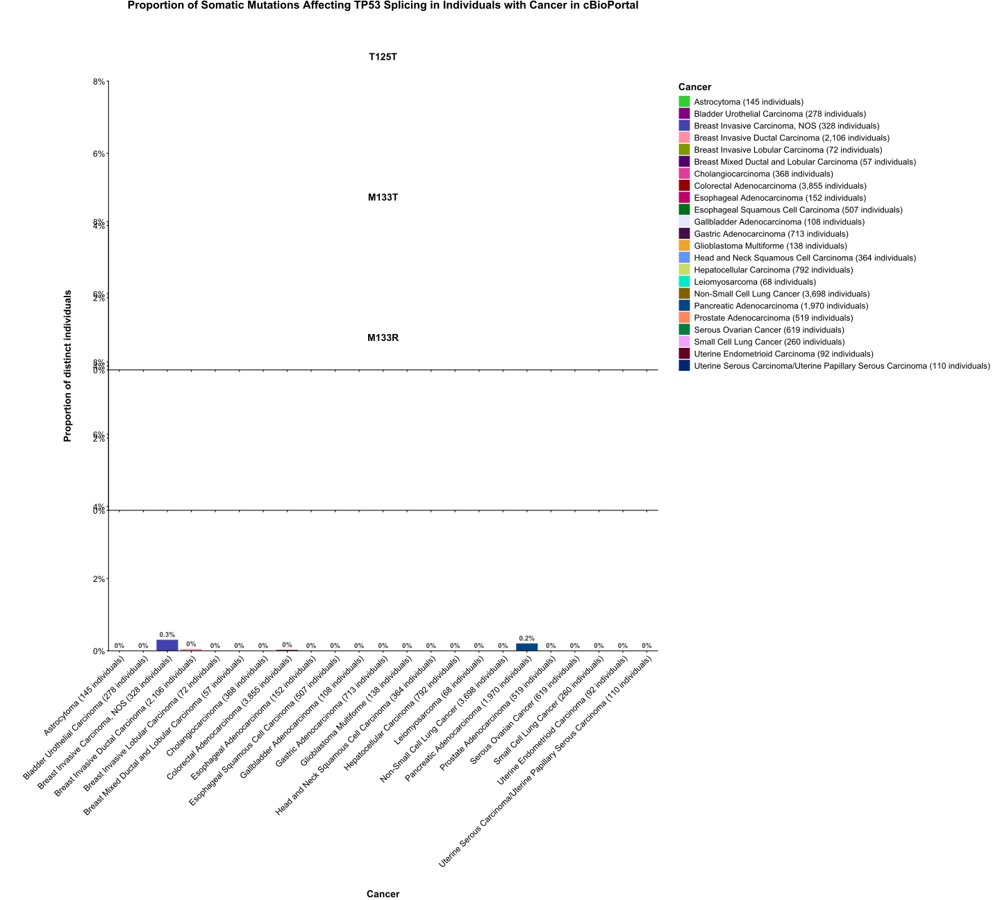

$~$


``` r
# make stacked barchart of 1:1 cancer matching germline
barchart_keysplicepos_matchgermline_cancers <- ggplot(p53mutssplicepercancerpos_matchgermline_melted %>% 
                                                        subset(!str_detect(Cancer, 
                                                                           "OTHER")) %>% 
                                                        mutate(Label = gsub("T125=",
                                                                            "T125T",
                                                                            Label)) %>%
                                                        subset(Isoform == "yes" & Label %in% c("T125T", 
                                                                                               "M133T", 
                                                                                               "M133R")), 
                                                      aes(x = factor(Cancer,
                                                                     levels = sort(unique(as.vector(p53mutssplicepercancerpos_matchgermline_melted$Cancer)))[!str_detect(sort(unique(as.vector(p53mutssplicepercancerpos_matchgermline_melted$Cancer))), 
                                                                                                                                                                         "OTHER")]),
                                                          # factor(Cancer,
                                                          #          levels = c(sort(unique(as.vector(p53mutssplicepercancerpos_matchgermline_melted$Cancer)))[!str_detect(sort(unique(as.vector(p53mutssplicepercancerpos_matchgermline_melted$Cancer))), 
                                                          #                                                                                                        "OTHER")], sort(unique(as.vector(p53mutssplicepercancerpos_matchgermline_melted$Cancer)))[str_detect(sort(unique(as.vector(p53mutssplicepercancerpos_matchgermline_melted$Cancer))), 
                                                          #                                                                                                                                                                                                     "OTHER")])), 
                                                          y = Proportion, 
                                                          fill = factor(Cancer,
                                                                        levels = sort(unique(as.vector(p53mutssplicepercancerpos_matchgermline_melted$Cancer)))[!str_detect(sort(unique(as.vector(p53mutssplicepercancerpos_matchgermline_melted$Cancer))), 
                                                                                                                                                                            "OTHER")]),
                                                          # factor(Cancer,
                                                          #             levels = c(sort(unique(as.vector(p53mutssplicepercancerpos_matchgermline_melted$Cancer)))[!str_detect(sort(unique(as.vector(p53mutssplicepercancerpos_matchgermline_melted$Cancer))),
                                                          #                                                                                                           "OTHER")], sort(unique(as.vector(p53mutssplicepercancerpos_matchgermline_melted$Cancer)))[str_detect(sort(unique(as.vector(p53mutssplicepercancerpos_matchgermline_melted$Cancer))),
                                                          #                                                                                                                                                                                                        "OTHER")]))
                                                      )) + 
  geom_bar(stat = "identity", 
           position = position_dodge2()) + # to keep some space b/t barcharts in same mut
  xlab("Cancer") +
  ylab("Proportion of distinct individuals") +
  labs(fill = "Cancer") + 
  ggtitle("Proportion of Somatic Mutations Affecting TP53 Splicing in Individuals with Cancer in cBioPortal") +
  facet_wrap2(. ~ factor(Label,
                         levels = c("T125T", 
                                    "M133T", 
                                    "M133R")),
              ncol = 3,
              axes = "all", # show internal axes but without x labels
              remove_labels = "x" # show internal axes but without x labels
  ) + 
  scale_y_continuous(labels = scales::percent_format(), 
                     expand = c(0,0), 
                     breaks = scales::pretty_breaks(n = 5), 
                     limits = c(0, ((p53mutssplicepercancerpos_matchgermline_melted %>% 
                                       subset(!str_detect(Cancer, 
                                                          "OTHER")) %>% 
                                       mutate(Label = gsub("T125=",
                                                           "T125T",
                                                           Label)) %>%
                                       subset(Isoform == "yes" & Label %in% c("T125T", 
                                                                              "M133T", 
                                                                              "M133R")) %>%
                                       pull(Proportion) %>% 
                                       max() %>% 
                                       plyr::round_any(0.08, 
                                                       f = ceiling)) * 1.00001))) + 
  scale_x_discrete(
    #limits = rev, 
    expand = c(0,0)) + 
  scale_fill_manual(values = c("#CC79A7",
                               "#E69F00",
                               "#009E73",
                               "#56B4E9",
                               "#999999"
                               #,
                               #"#000000"
  )) +
  guides(fill = guide_legend(ncol = 1)) +
  theme_classic() + 
  theme(axis.text.x = element_text(angle = 45, 
                                   hjust = 1, 
                                   vjust = 1), 
        axis.text = element_text(color = "black",
                                 size = 12), 
        axis.title = element_text(color = "black",
                                  face = "bold",
                                  size = 14),
        axis.title.x = element_text(margin = unit(c(10,0,0,0), units = "mm")),
        axis.title.y = element_text(margin = unit(c(0,10,0,0), units = "mm")),
        plot.title = element_text(hjust = 0.5,
                                  face = "bold",
                                  color = "black",
                                  size = 16,
                                  margin = margin(0,0,10,0, "mm")),
        legend.text = element_text(color = "black",
                                   size = 12),
        legend.title = element_text(color = "black",
                                    face = "bold",
                                    size = 14),
        legend.box.spacing = margin(30), # increase space between legend and plot
        legend.justification = "top", # put legend in top right of plot
        legend.margin = margin(0,5,0,0, unit = "mm"),
        #legend.position = c(,), # c(0,0) bottom left, c(1,1) top-right within plot
        strip.background = element_blank(),
        strip.text = element_text(color = "black",
                                  size = 14,
                                  face = "bold",
                                  margin = margin(10,0,10,0, "mm")),
        panel.spacing.x = unit(5, "lines"),
        #panel.spacing.y = unit(-20, "lines"),
        plot.margin = margin(0,0,0,32, unit = "mm"))
barchart_keysplicepos_matchgermline_cancers
```

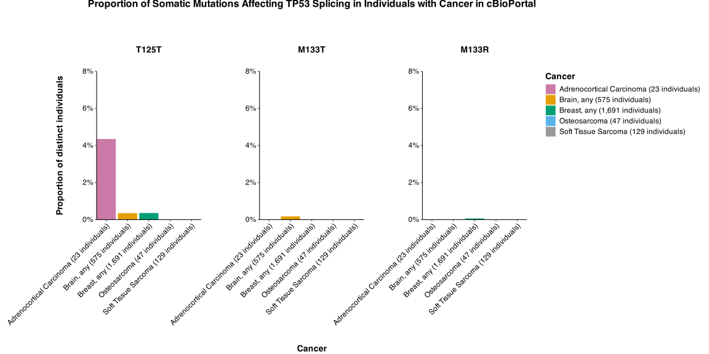

$~$


$~$


$~$


$~$


``` r
# stacked barchart of splice muts across all somatic cancers
stackedbarchart_splicetissuesomatic <- ggplot(splicetissuesomatic_pivot_melted,
                                              aes(x = factor(Cancer,
                                                             levels = (splicetissuesomatic_pivot_melted %>%
                                                                         subset(Isoform == "yes") %>%
                                                                         arrange(-Proportion) %>%
                                                                         pull(Cancer) %>% 
                                                                         unique())),
                                                  y = Proportion,
                                                  fill = factor(temp,
                                                                levels = c("yes",
                                                                           "subset",
                                                                           "total",
                                                                           "no")))) +
  geom_bar(position = "fill",
           stat = "identity") + 
  ggtitle("Presence of Somatic Mutations Affecting TP53 Splicing in Individuals with Cancer in cBioPortal") + 
  ylab("Proportion of distinct individuals") +
  xlab("Cancer") +
  labs(fill = "Splicing affected") +
  scale_y_continuous(labels = scales::percent_format(), 
                     expand = c(0, 0), 
                     breaks = scales::pretty_breaks(n = 6)) + 
  scale_x_discrete(expand = c(0, 0)) + 
  scale_fill_manual(
    #breaks = c("yes",
    #           "no"),
    labels = c("yes", 
               "yes; subset", 
               "yes; total", 
               "no"),
    values = c("yes" = "skyblue",#"#56B4E9"
               "subset" = "#0072B2",
               "total" = "black",#"#D55E00"
               "no" = "gray90")) +
  theme_classic() + 
  theme(axis.text.x = element_text(angle = 45, 
                                   vjust = 1,
                                   hjust = 1),
        axis.text = element_text(color = "black",
                                 size = 12,
                                 vjust = 0.5), 
        axis.title = element_text(color = "black",
                                  face = "bold",
                                  size = 14),
        axis.title.x = element_text(margin = unit(c(5,0,0,0), units = "mm")),
        axis.title.y = element_text(margin = unit(c(0,5,0,0), units = "mm")),
        plot.title = element_text(hjust = 0.5,
                                  face = "bold",
                                  color = "black",
                                  size = 16,
                                  margin = margin(0,0,5,0, "mm")),
        legend.title = element_text(face = "bold",
                                    size = 14, 
                                    color = "black"),
        legend.text = element_text(size = 12, 
                                   color = "black"),
        plot.margin = margin(2,2,2,60, 
                             unit = "mm")) 
stackedbarchart_splicetissuesomatic
```

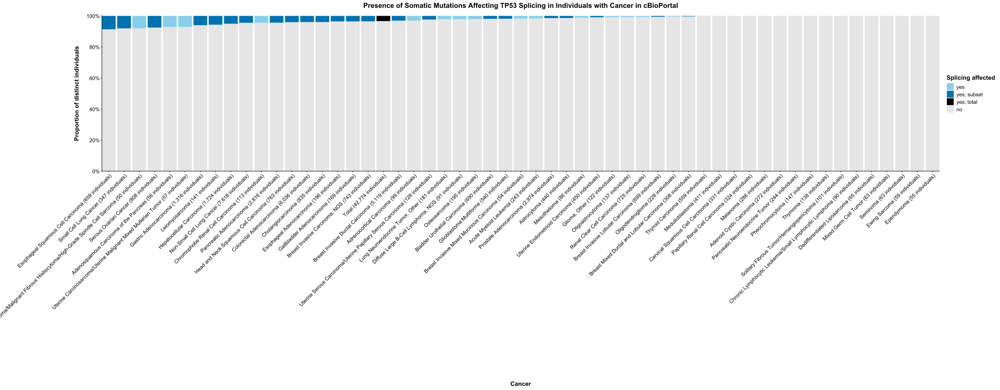

$~$


``` r
# make horiz barchart
stackedbarchart_splicetissuesomatic_horiz <- ggplot(splicetissuesomatic_pivot_melted,
                                                    aes(x = factor(Cancer,
                                                                   levels = (splicetissuesomatic_pivot_melted %>%
                                                                               subset(Isoform == "yes") %>%
                                                                               arrange(-Proportion) %>%
                                                                               pull(Cancer) %>% 
                                                                               unique())),
                                                        y = Proportion,
                                                        fill = factor(temp,
                                                                      levels = c("yes",
                                                                                 "subset",
                                                                                 "total",
                                                                                 "no")))) +
  geom_bar(position = position_fill(reverse = TRUE),
           stat = "identity") + # add percents of yes to barchart
  geom_text(aes(label = paste0(plyr::round_any(Proportion * 100,
                                               0.1
                                               #,
                                               #f = ceiling
  ),
  "%")),
  position = position_fill(reverse = TRUE),
  color = "black",
  size = 4.5,
  fontface = "bold",
  alpha = 0.5, # level of transparency (lower is more transparent)
  vjust = 0.5,
  hjust = -0.25) +
  ggtitle("Presence of Somatic Mutations Affecting TP53 Splicing in Individuals with Cancer in cBioPortal") + 
  ylab("Proportion of distinct individuals") +
  xlab("Cancer") +
  labs(fill = "Splicing affected") +
  scale_y_continuous(labels = scales::percent_format(), 
                     expand = c(0, 0), 
                     breaks = scales::pretty_breaks(n = 6),
                     position = "right") + 
  scale_x_discrete(expand = c(0, 0),
                   limits = rev) + 
  scale_fill_manual(
    #breaks = c("yes",
    #           "no"),
    labels = c("yes", 
               "yes; subset", 
               "yes; total", 
               "no"),
    values = c("yes" = "skyblue",#"#56B4E9"
               "subset" = "#0072B2",
               "total" = "black",#"#D55E00"
               "no" = "gray90")) +
  theme_classic() + 
  coord_flip(ylim = c(0, ((splicetissuesomatic_pivot_melted %>% 
                             subset(Isoform == "yes") %>% 
                             pull(Proportion) %>% 
                             max() %>% 
                             plyr::round_any(0.125, 
                                             f = ceiling)) * 1.00001))) + # calls coord_cartesian to set axis limits to zoom in on percentages
  theme(axis.text.x = element_text(angle = 0, 
                                   hjust = 0.5), 
        axis.text = element_text(color = "black",
                                 size = 12), 
        axis.title = element_text(color = "black",
                                  face = "bold",
                                  size = 14),
        axis.title.x.top = element_text(margin = unit(c(0,0,10,0), units = "mm")),
        axis.title.y = element_text(margin = unit(c(0,10,0,0), units = "mm")),
        plot.title = element_text(hjust = 0.5,
                                  face = "bold",
                                  color = "black",
                                  size = 16,
                                  margin = margin(0,0,10,0, "mm")),
        legend.text = element_text(color = "black",
                                   size = 12),
        legend.box.spacing = margin(30), # increase space between legend and plot
        legend.justification = "top", # put legend in top right of plot
        legend.title = element_text(color = "black",
                                    face = "bold",
                                    size = 14),
        axis.text.y = element_text(vjust = 0.5))
stackedbarchart_splicetissuesomatic_horiz
```

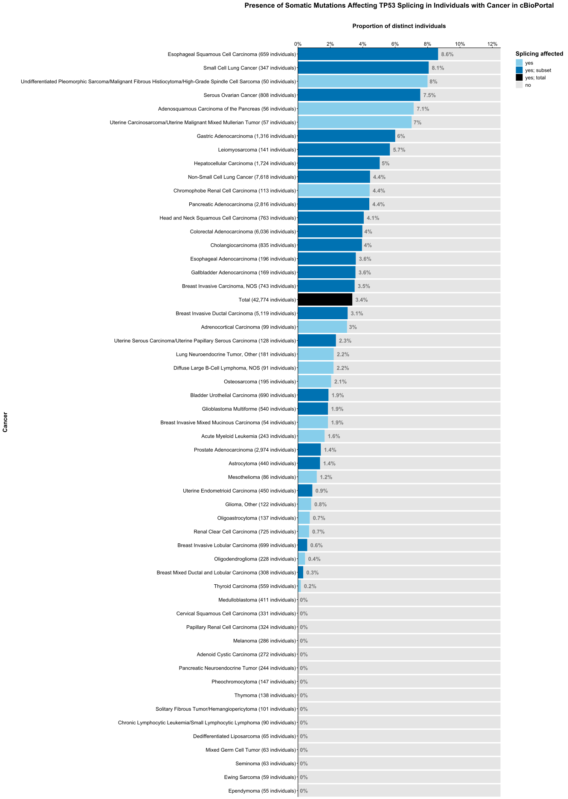

$~$


``` r
# make stacked barchart of ATO-rescuable alterations yes no in pts
stackedbarchart_pts_ATO <- ggplot(pt_ATO_df_ggplot %>%
                                    filter(str_detect(Patient,
                                                      "All")), 
                                  aes(x = Patient,
                                      #factor(Patient,
                                      #levels = sort(unique(pt_ATO_df_ggplot$Patient),
                                      #decreasing = TRUE)[order(c(2,3,1))]), 
                                      y = Calc, 
                                      fill = relevel(as.factor(ATO),
                                                     ref = "yes"))) + 
  geom_bar(position = "fill", 
           stat = "identity") + 
  ggtitle("Proportion of ATO-Rescuable \nSomatic Mutations in TP53 in \nIndividuals with Cancer in cBioPortal") +
  xlab("Patient type") +
  ylab("Proportion of distinct individuals") +
  labs(fill = "ATO-rescuable") +
  scale_y_continuous(labels = scales::percent_format(), 
                     expand = c(0,0), 
                     breaks = scales::pretty_breaks(n = 6)) +
  scale_x_discrete(expand = c(0,0)) +
  scale_fill_manual(values = c("#0072B2",
                               "lightgray")) +
  theme_classic() + 
  theme(axis.text.x = element_text(angle = 45, 
                                   hjust = 1, 
                                   vjust = 1), 
        axis.text = element_text(color = "black",
                                 size = 12), 
        axis.title = element_text(color = "black",
                                  face = "bold",
                                  size = 14),
        axis.title.x = element_text(margin = unit(c(5,0,0,0), units = "mm")),
        axis.title.y = element_text(margin = unit(c(0,5,0,0), units = "mm")),
        plot.title = element_text(hjust = 0.5,
                                  face = "bold",
                                  color = "black",
                                  size = 16,
                                  margin = margin(0,0,5,0, "mm")),
        legend.text = element_text(color = "black",
                                   size = 12),
        legend.title = element_text(color = "black",
                                    face = "bold",
                                    size = 14),
        plot.margin = margin(0,0,0,20, "mm"))
stackedbarchart_pts_ATO
```

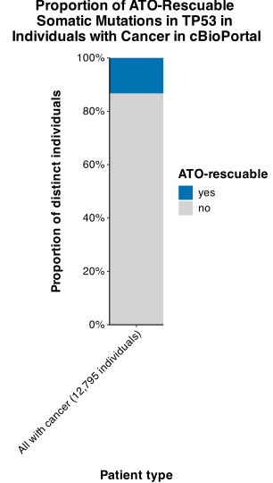

$~$


``` r
# because many somatic muts in mult pts, percents not adding up to 100% so shrink other muts to fit expected %
to_fit_mult <- 1 - (sum(pt_ATOperpos_df_ggplot %>%
                          subset(ATO == "yes" & grepl("Multiple", 
                                                      Patient)) %>%
                          pull(Calc)))

# other percentages in all and sole pts not exactly adding up to 100% either but very close
to_fit_all <- 1 - (sum(pt_ATOperpos_df_ggplot %>%
                         subset(ATO == "yes" & grepl("All", 
                                                     Patient)) %>%
                         pull(Calc)))

to_fit_sole <- 1 - (sum(pt_ATOperpos_df_ggplot %>%
                          subset(ATO == "yes" & grepl("One", 
                                                      Patient)) %>%
                          pull(Calc)))

# plot zoomed in stacked barchart with adjusted %
stackedbarchart_pts_ATOperpos <- ggplot(pt_ATOperpos_df_ggplot %>%
                                          mutate(Calc_label = Calc) %>%
                                          mutate(Calc_label = dplyr::case_when(ATO == "no" & grepl("Multiple", 
                                                                                                   Patient) ~ to_fit_mult/nrow(pt_ATOperpos_df_ggplot %>%
                                                                                                                                 subset(ATO == "no" & grepl("Multiple", 
                                                                                                                                                            Patient))),
                                                                               ATO == "no" & grepl("All", 
                                                                                                   Patient) ~ to_fit_all/nrow(pt_ATOperpos_df_ggplot %>%
                                                                                                                                subset(ATO == "no" & grepl("All", 
                                                                                                                                                           Patient))),
                                                                               ATO == "no" & grepl("One", 
                                                                                                   Patient) ~ to_fit_sole/nrow(pt_ATOperpos_df_ggplot %>%
                                                                                                                                 subset(ATO == "no" & grepl("One", 
                                                                                                                                                            Patient))),
                                                                               TRUE ~ Calc_label)) %>%
                                          filter(str_detect(Patient,
                                                            "All")), 
                                        aes(x = Patient,
                                            #factor(Patient,
                                            # levels = sort(unique(pt_ATOperpos_df_ggplot$Patient),
                                            # decreasing = TRUE)[order(c(2,3,1))]), 
                                            y = Calc_label, 
                                            fill = factor(Label,
                                                          levels = c((pt_ATOperpos_df_ggplot %>%
                                                                        filter(str_detect(Patient,
                                                                                          "All")) %>%
                                                                        arrange(-Calc) %>%
                                                                        pull(Label) %>%
                                                                        unique())[(pt_ATOperpos_df_ggplot %>%
                                                                                     filter(str_detect(Patient,
                                                                                                       "All")) %>% 
                                                                                     arrange(-Calc) %>%
                                                                                     pull(Label) %>%
                                                                                     unique()) != "Other"], 
                                                                     "Other")))) + 
  geom_bar(position = "fill", 
           stat = "identity") + 
  ggtitle("Proportion of ATO-Rescuable \nSomatic Mutations in TP53 in \nIndividuals with Cancer in cBioPortal") +
  xlab("Patient type") +
  ylab("Proportion of distinct individuals") +
  labs(fill = "Mutation") +
  scale_y_continuous(labels = scales::percent_format(), 
                     expand = c(0,0), 
                     breaks = scales::pretty_breaks(n = 6)) +
  scale_x_discrete(expand = c(0,0)) +
  coord_cartesian(ylim = c((plyr::round_any(to_fit_all, 
                                            0.02, 
                                            f = floor)), 1.0000001), # set axis limits in coord_cartesian to zoom in on percentages
                  expand = FALSE) +
  scale_fill_manual(values = c(hue_pal()(length(c((pt_ATOperpos_df_ggplot %>%
                                                     filter(str_detect(Patient,
                                                                       "All")) %>%
                                                     arrange(-Calc) %>%
                                                     pull(Label) %>%
                                                     unique())[(pt_ATOperpos_df_ggplot %>%
                                                                  filter(str_detect(Patient,
                                                                                    "All")) %>% 
                                                                  arrange(-Calc) %>%
                                                                  pull(Label) %>%
                                                                  unique()) != "Other"], 
                                                  "Other"))) %>% 
                                 head(-1),
                               "lightgray")) + # extract automatic gradient colors and replace final one i.e. other with lightgray
  theme_classic() + 
  theme(axis.text.x = element_text(angle = 45, 
                                   hjust = 1, 
                                   vjust = 1), 
        axis.text = element_text(color = "black",
                                 size = 12), 
        axis.title = element_text(color = "black",
                                  face = "bold",
                                  size = 14),
        axis.title.x = element_text(margin = unit(c(5,0,0,0), units = "mm")),
        axis.title.y = element_text(margin = unit(c(0,5,0,0), units = "mm")),
        plot.title = element_text(hjust = 0.5,
                                  face = "bold",
                                  color = "black",
                                  size = 16,
                                  margin = margin(0,0,5,0, "mm")),
        legend.text = element_text(color = "black",
                                   size = 12),
        legend.title = element_text(color = "black",
                                    face = "bold",
                                    size = 14),
        plot.margin = margin(0,0,0,20, "mm"))
stackedbarchart_pts_ATOperpos
```

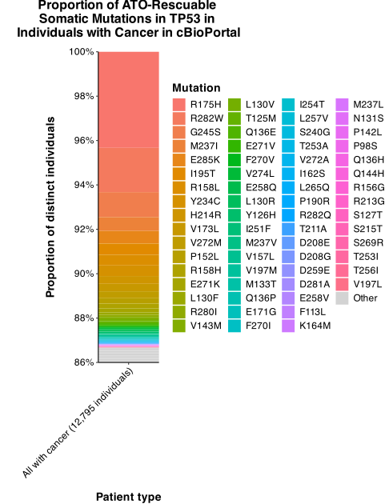

$~$


``` r
# make facet barchart on top ATO-rescuable germ/som across all pts
barchart_pts_keyATOpos_combined <- ggplot(pt_ATOperpos_df_ggplot %>% 
                                            filter(str_detect(Patient, 
                                                              "All with cancer")) %>%
                                            subset(ATO == "yes" & Label %in% top_ATO_germ_som_cbio_combined),
                                          aes(x = Patient,
                                              #factor(Patient,
                                              #levels = sort(unique(pt_ATOperpos_df_ggplot$Patient))[c(1,3,2)]),
                                              y = Calc,
                                              fill = Patient
                                              #factor(Patient,
                                              #levels = sort(unique(pt_ATOperpos_df_ggplot$Patient))[c(1,3,2)])
                                          )) + 
  geom_bar(stat = "identity", 
           position = position_dodge2()) + # to keep some space b/t barcharts in same mut
  geom_text(aes(label = paste0(plyr::round_any(Calc * 100, 
                                               0.1),
                               "%")),
            color = "black",
            size = 3.5,
            fontface = "bold",
            alpha = 0.75, # level of transparency (lower is more transparent)
            vjust = -0.5,
            hjust = 0.5) +
  xlab("Patient type") +
  ylab("Proportion of distinct individuals") +
  labs(fill = "Patient type") + 
  ggtitle("Proportion of ATO-Rescuable Mutations in TP53 in Individuals with Cancer") + # different facet_wrap function which allows conditional strip i.e. facet formatting
  facet_wrap2(. ~ factor(Label,
                         levels = top_ATO_germ_som_cbio_combined[order(abs(parse_number(top_ATO_germ_som_cbio_combined)))]), # order by codon number so that colors match
              ncol = 5,
              strip = conditional_strips_ATO,
              trim_blank = FALSE, # leave blank plots where muts not in dataset
              axes = "all", # show internal axes but without x labels
              remove_labels = "x", # show internal axes but without x labels
              drop = FALSE) + # ensure muts not in dataset still shown as blanks
  scale_y_continuous(labels = scales::percent_format(), 
                     expand = c(0,0), 
                     breaks = scales::pretty_breaks(n = 5), 
                     limits = c(0, ((pt_ATOperpos_df_ggplot %>% 
                                       filter(str_detect(Patient, 
                                                         "All with cancer")) %>%
                                       subset(ATO == "yes" & Label %in% top_ATO_germ_som_cbio_combined) %>% 
                                       pull(Calc) %>% 
                                       max() %>% 
                                       plyr::round_any(0.01, 
                                                       f = ceiling)) * 1.000001))) +
  scale_x_discrete(
    #limits = rev, 
    expand = c(0,0),
    drop = FALSE) + # ensure muts not in dataset are still shown as blanks
  scale_fill_manual(values = c("#D55E00",
                               "#0072B2",
                               "#009E73"
                               # ,"#E69F00",
                               
  )) +
  theme_classic() + 
  theme(axis.text.x = element_text(angle = 45, 
                                   hjust = 1, 
                                   vjust = 1), 
        axis.text = element_text(color = "black",
                                 size = 12), 
        axis.title = element_text(color = "black",
                                  face = "bold",
                                  size = 14),
        axis.title.x = element_text(margin = unit(c(10,0,0,0), units = "mm")),
        axis.title.y = element_text(margin = unit(c(0,10,0,0), units = "mm")),
        plot.title = element_text(hjust = 0.5,
                                  face = "bold",
                                  color = "black",
                                  size = 16,
                                  margin = margin(0,0,10,0, "mm")),
        legend.text = element_text(color = "black",
                                   size = 12),
        legend.title = element_text(color = "black",
                                    face = "bold",
                                    size = 14),
        legend.box.spacing = margin(30), # increase space between legend and plot
        legend.justification = "top", # put legend in top right of plot
        #legend.position = c(,), # c(0,0) bottom left, c(1,1) top-right within plot
        strip.background = element_blank(),
        strip.text = element_text(color = "black",
                                  size = 14,
                                  face = "bold",
                                  margin = margin(10,0,10,0, "mm")),
        panel.spacing.x = unit(5, "lines"),
        panel.spacing.y = unit(-8, "lines"),
        plot.margin = margin(0,5,0,20, unit = "mm"))
barchart_pts_keyATOpos_combined
```

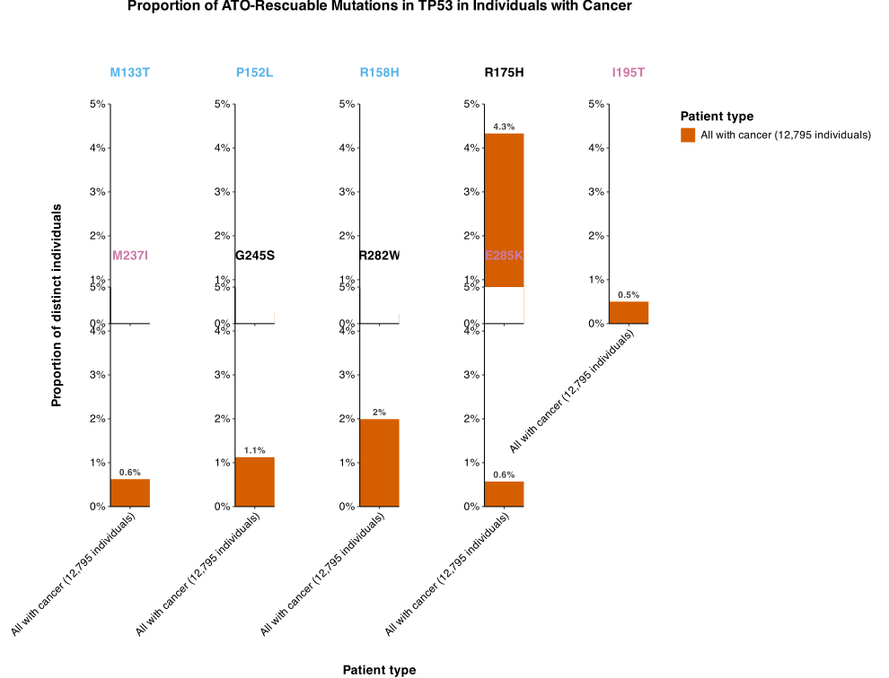

$~$


``` r
# make facet barchart on top muts germ/som across all, sole, mult
barchart_pts_topmutsifATO_combined <- ggplot(pt_ATOperpos_df_ggplot %>% 
                                               filter(str_detect(Patient, 
                                                                 "All with cancer")) %>%
                                               subset(ATO == "yes" & Label %in% top_muts_germ_som_cbio_combined),
                                             aes(x = Patient,
                                                 #factor(Patient,
                                                 #levels = sort(unique(pt_ATOperpos_df_ggplot$Patient))[c(1,3,2)]),
                                                 y = Calc,
                                                 fill = Patient
                                                 #factor(Patient,
                                                 #levels = sort(unique(pt_ATOperpos_df_ggplot$Patient))[c(1,3,2)])
                                             )) + 
  geom_bar(stat = "identity", 
           position = position_dodge2()) + # to keep some space b/t barcharts in same mut
  geom_text(aes(label = paste0(plyr::round_any(Calc * 100, 
                                               0.1),
                               "%")),
            color = "black",
            size = 3.5,
            fontface = "bold",
            alpha = 0.75, # level of transparency (lower is more transparent)
            vjust = -0.5,
            hjust = 0.5) +
  xlab("Patient type") +
  ylab("Proportion of distinct individuals") +
  labs(fill = "Patient type") + 
  ggtitle("Proportion of Hotspot Mutations in TP53 in Individuals with Cancer that are Effectively Rescued by ATO") + # different facet_wrap function which allows conditional strip i.e. facet formatting
  facet_wrap2(. ~ factor(Label,
                         levels = top_muts_germ_som_cbio_combined[order(abs(parse_number(top_muts_germ_som_cbio_combined)))]), # order by codon number so that colors match
              ncol = 5,
              strip = conditional_strips_muts,
              trim_blank = FALSE, # leave blank plots where muts not in dataset
              axes = "all", # show internal y axes but without labels
              remove_labels = "x", # show internal y axes but without labels
              drop = FALSE) + # ensure muts not in dataset still shown as blanks
  scale_y_continuous(labels = scales::percent_format(), 
                     expand = c(0,0), 
                     breaks = scales::pretty_breaks(n = 6), 
                     limits = c(0, ((pt_ATOperpos_df_ggplot %>% 
                                       filter(str_detect(Patient, 
                                                         "All with cancer")) %>%
                                       subset(ATO == "yes" & Label %in% top_muts_germ_som_cbio_combined) %>% 
                                       pull(Calc) %>%
                                       max() %>% 
                                       plyr::round_any(0.01, 
                                                       f = ceiling)) * 1.000001))) +
  scale_x_discrete(
    #limits = rev, 
    expand = c(0,0),
    drop = FALSE) + # ensure muts not in dataset are still shown as blanks
  scale_fill_manual(values = c("#D55E00",
                               "#0072B2",
                               "#009E73"
                               # ,"#E69F00",
                               
  )) +
  theme_classic() + 
  theme(axis.text.x = element_text(angle = 45, 
                                   hjust = 1, 
                                   vjust = 1), 
        axis.text = element_text(color = "black",
                                 size = 12), 
        axis.title = element_text(color = "black",
                                  face = "bold",
                                  size = 14),
        axis.title.x = element_text(margin = unit(c(10,0,0,0), units = "mm")),
        axis.title.y = element_text(margin = unit(c(0,10,0,0), units = "mm")),
        plot.title = element_text(hjust = 0.5,
                                  face = "bold",
                                  color = "black",
                                  size = 16,
                                  margin = margin(0,0,10,0, "mm")),
        legend.text = element_text(color = "black",
                                   size = 12),
        legend.title = element_text(color = "black",
                                    face = "bold",
                                    size = 14),
        legend.justification = "top", # put legend in top right of plot
        #legend.position = c(,), # c(0,0) bottom left, c(1,1) top-right within plot
        strip.background = element_blank(),
        strip.text = element_text(color = "black",
                                  size = 14,
                                  face = "bold",
                                  margin = margin(10,0,10,0, "mm")),
        panel.spacing.x = unit(5, "lines"),
        panel.spacing.y = unit(-8, "lines"),
        plot.margin = margin(0,0,0,20, unit = "mm"))
barchart_pts_topmutsifATO_combined
```

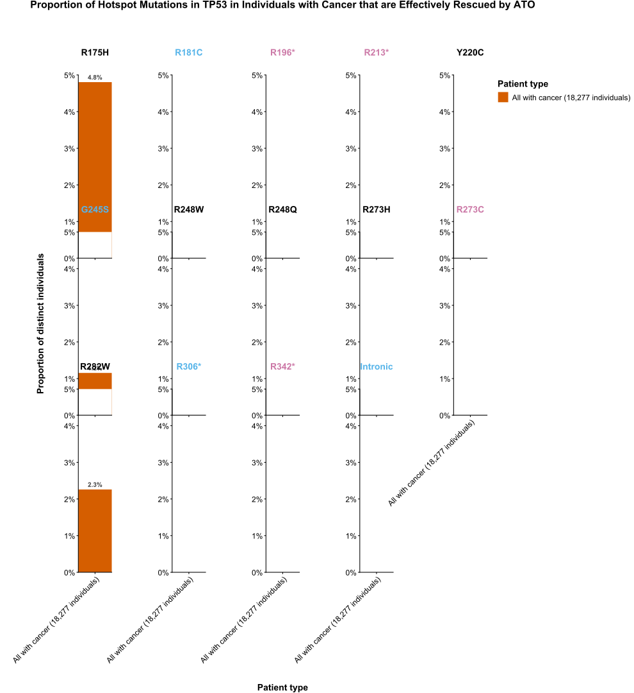

$~$


``` r
# make stacked barchart
stackedbarchart_pts_ATO_cancers <- ggplot(p53mutsATOpercancer_pivot_melted %>% 
                                            subset(!str_detect(Cancer,
                                                               "OTHER")),
                                          aes(x = factor(Cancer,
                                                         levels = p53mutsATOpercancer_pivot_melted %>% 
                                                           subset(!str_detect(Cancer,
                                                                              "OTHER")) %>% 
                                                           subset(ATO == "yes") %>%
                                                           arrange(-Proportion) %>% 
                                                           pull(Cancer) %>% 
                                                           unique() %>% 
                                                           as.vector()),
                                              y = Proportion,
                                              fill = relevel(as.factor(ATO),
                                                             ref = "yes"))) + 
  geom_bar(position = "fill", 
           stat = "identity") + 
  ggtitle("Proportion of ATO-Rescuable Somatic Mutations in TP53 in Individuals with Cancer in cBioPortal") + 
  xlab("Cancer") +
  ylab("Proportion of distinct individuals") +
  labs(fill = "ATO-rescuable") +
  scale_y_continuous(labels = scales::percent_format(), 
                     expand = c(0,0), 
                     breaks = scales::pretty_breaks(n = 6)) +
  scale_x_discrete(expand = c(0,0)) +
  scale_fill_manual(values = c("#0072B2",
                               "lightgray")) +
  theme_classic() + 
  theme(axis.text.x = element_text(angle = 45, 
                                   hjust = 1, 
                                   vjust = 1), 
        axis.text = element_text(color = "black",
                                 size = 12), 
        axis.title = element_text(color = "black",
                                  face = "bold",
                                  size = 14),
        axis.title.x = element_text(margin = unit(c(5,0,0,0), units = "mm")),
        axis.title.y = element_text(margin = unit(c(0,5,0,0), units = "mm")),
        plot.title = element_text(hjust = 0.5,
                                  face = "bold",
                                  color = "black",
                                  size = 16,
                                  margin = margin(0,0,5,0, "mm")),
        legend.text = element_text(color = "black",
                                   size = 12),
        legend.title = element_text(color = "black",
                                    face = "bold",
                                    size = 14),
        plot.margin = margin(0,0,0,50, "mm"))
stackedbarchart_pts_ATO_cancers
```

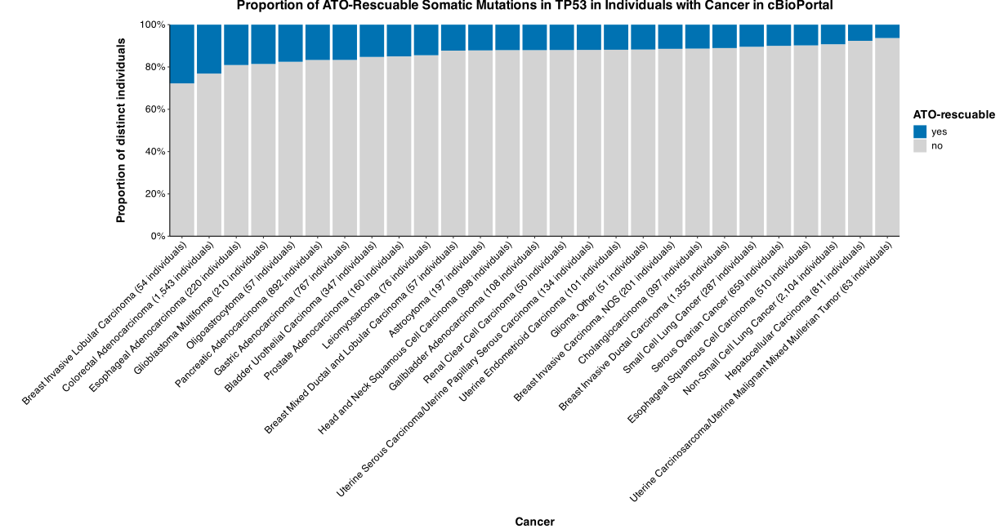

$~$


``` r
# make same barchart but also with total included
df_with_total_ggplot <- p53mutsATOpercancer_pivot %>% # add num pts to cancer colnames
  rename_at(vars(2:(ncol(.)
                    #- 1
  )),
  ~ paste0(.,
           " (",
           format(as.numeric(p53mutsATOpercancer_pivot[nrow(p53mutsATOpercancer_pivot), .]), 
                  big.mark = ",", 
                  trim = TRUE),
           " individuals)")) %>% # divide down each col by last value i.e. total pts
  mutate(across(where(is.numeric),
                ~ .x/last(.x))) %>% 
  subset(ATO != "Total") %>%
  #dplyr::select(-Total) %>% 
  reshape2::melt() %>% 
  dplyr::rename(Cancer = variable,
                Proportion = value) %>%
  mutate(label = ifelse(str_detect(Cancer, "Total") & ATO == "yes",
                        "yes; total",
                        ATO))

# make stacked barchart with total
stackedbarchart_pts_ATO_cancers_total <- ggplot(df_with_total_ggplot %>% 
                                                  subset(!str_detect(Cancer,
                                                                     "OTHER")),
                                                aes(x = factor(Cancer,
                                                               levels = df_with_total_ggplot %>% 
                                                                 subset(!str_detect(Cancer,
                                                                                    "OTHER")) %>% 
                                                                 subset(ATO == "yes") %>%
                                                                 arrange(-Proportion) %>% 
                                                                 pull(Cancer) %>% 
                                                                 unique() %>% 
                                                                 as.vector()),
                                                    y = Proportion,
                                                    fill = factor(label,
                                                                  levels = c("yes", 
                                                                             "yes; total",
                                                                             "no")))) + 
  geom_bar(position = "fill", 
           stat = "identity") + 
  ggtitle("Proportion of ATO-Rescuable Somatic Mutations in TP53 in Individuals with Cancer in cBioPortal") + 
  xlab("Cancer") +
  ylab("Proportion of distinct individuals") +
  labs(fill = "ATO-rescuable") +
  scale_y_continuous(labels = scales::percent_format(), 
                     expand = c(0,0), 
                     breaks = scales::pretty_breaks(n = 6)) +
  scale_x_discrete(expand = c(0,0)) +
  scale_fill_manual(values = c("#0072B2",
                               "black",
                               "lightgray")) +
  theme_classic() + 
  theme(axis.text.x = element_text(angle = 45, 
                                   hjust = 1, 
                                   vjust = 1), 
        axis.text = element_text(color = "black",
                                 size = 12), 
        axis.title = element_text(color = "black",
                                  face = "bold",
                                  size = 14),
        axis.title.x = element_text(margin = unit(c(5,0,0,0), units = "mm")),
        axis.title.y = element_text(margin = unit(c(0,5,0,0), units = "mm")),
        plot.title = element_text(hjust = 0.5,
                                  face = "bold",
                                  color = "black",
                                  size = 16,
                                  margin = margin(0,0,5,0, "mm")),
        legend.text = element_text(color = "black",
                                   size = 12),
        legend.title = element_text(color = "black",
                                    face = "bold",
                                    size = 14),
        plot.margin = margin(0,0,0,50, "mm"))
stackedbarchart_pts_ATO_cancers_total
```

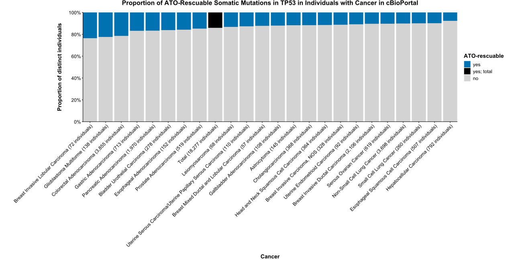

$~$


``` r
# make horiz stacked barchart with total
stackedbarchart_pts_ATO_cancers_total_horiz <- ggplot(df_with_total_ggplot %>% 
                                                        subset(!str_detect(Cancer, 
                                                                           "OTHER")),
                                                      aes(x = factor(Cancer,
                                                                     levels = df_with_total_ggplot %>% 
                                                                       subset(!str_detect(Cancer,
                                                                                          "OTHER")) %>% 
                                                                       subset(ATO == "yes") %>%
                                                                       arrange(-Proportion) %>% 
                                                                       pull(Cancer) %>% 
                                                                       unique() %>% 
                                                                       as.vector()),
                                                          y = Proportion,
                                                          fill = factor(label,
                                                                        levels = c("yes", 
                                                                                   "yes; total",
                                                                                   "no")))) + 
  geom_bar(position = position_fill(reverse = TRUE),
           stat = "identity") + # add percents of yes to barchart
  geom_text(aes(label = paste0(plyr::round_any(Proportion * 100,
                                               0.1
                                               #,
                                               #f = ceiling
  ),
  "%")),
  position = position_fill(reverse = TRUE),
  color = "black",
  size = 4.5,
  fontface = "bold",
  alpha = 0.5, # level of transparency (lower is more transparent)
  vjust = 0.5,
  hjust = -0.25) +
  ggtitle("Proportion of ATO-Rescuable Somatic Mutations \nin TP53 in Individuals with Cancer in cBioPortal") + 
  xlab("Cancer") +
  ylab("Proportion of distinct individuals") +
  labs(fill = "ATO-rescuable") +
  scale_y_continuous(labels = scales::percent_format(), 
                     expand = c(0,0), 
                     breaks = scales::pretty_breaks(n = 6),
                     position = "right") +
  scale_x_discrete(expand = c(0,0),
                   limits = rev) +
  scale_fill_manual(values = c("#0072B2",
                               "black",
                               "lightgray")) +
  theme_classic() + 
  coord_flip(ylim = c(0, ((df_with_total_ggplot %>% 
                             subset(!str_detect(Cancer, 
                                                "OTHER")) %>% 
                             subset(ATO == "yes") %>% 
                             pull(Proportion) %>% 
                             max() %>% 
                             plyr::round_any(0.1167, 
                                             f = ceiling)) * 1.00001))) + # calls coord_cartesian to set axis limits to zoom in on percentages
  theme(axis.text.x = element_text(angle = 0, 
                                   hjust = 0.5), 
        axis.text = element_text(color = "black",
                                 size = 12), 
        axis.title = element_text(color = "black",
                                  face = "bold",
                                  size = 14),
        axis.title.x.top = element_text(margin = unit(c(0,0,10,0), units = "mm")),
        axis.title.y = element_text(margin = unit(c(0,10,0,0), units = "mm")),
        plot.title = element_text(hjust = 0.5,
                                  face = "bold",
                                  color = "black",
                                  size = 16,
                                  margin = margin(0,0,10,0, "mm")),
        legend.text = element_text(color = "black",
                                   size = 12),
        legend.justification = "top", # put legend in top right of plot
        legend.title = element_text(color = "black",
                                    face = "bold",
                                    size = 14),
        axis.text.y = element_text(vjust = 0.5))
stackedbarchart_pts_ATO_cancers_total_horiz
```

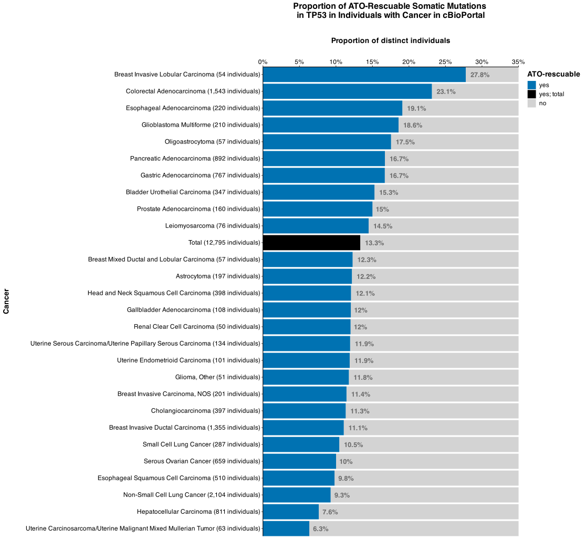

$~$


``` r
saveRDS(df_with_total_ggplot %>% 
          subset(label == "yes; total") %>% 
          mutate(Type = gsub("Total",
                             "somatic",
                             Cancer)),
        file = paste0(table_path,
                      "som_overall_ATO.rds"))
```

$~$


``` r
df_to_save_ATOnot <- p53mutsATOnotpercancer_pivot %>% # add num pts to cancer colnames
  rename_at(vars(2:(ncol(.)
                    #- 1
  )),
  ~ paste0(.,
           " (",
           format(as.numeric(p53mutsATOnotpercancer_pivot[nrow(p53mutsATOnotpercancer_pivot), .]), 
                  big.mark = ",", 
                  trim = TRUE),
           " individuals)")) %>% # divide down each col by last value i.e. total pts
  mutate(across(where(is.numeric),
                ~ .x/last(.x))) %>% 
  subset(ATO_not != "Total") %>%
  #dplyr::select(-Total) %>% 
  reshape2::melt() %>% 
  dplyr::rename(Cancer = variable,
                Proportion = value) %>%
  mutate(label = ifelse(str_detect(Cancer, "Total") & ATO_not == "no",
                        "no; total",
                        ATO_not))
```

```
Using ATO_not as id variables
```

``` r
saveRDS(df_to_save_ATOnot %>% 
          subset(label == "no; total") %>% 
          mutate(Type = gsub("Total",
                             "somatic",
                             Cancer)),
        file = paste0(table_path,
                      "som_overall_ATOnot.rds"))
```

$~$


``` r
df_to_save_PAT <- p53mutsPATpercancer_pivot %>% # add num pts to cancer colnames
  rename_at(vars(2:(ncol(.)
                    #- 1
  )),
  ~ paste0(.,
           " (",
           format(as.numeric(p53mutsPATpercancer_pivot[nrow(p53mutsPATpercancer_pivot), .]), 
                  big.mark = ",", 
                  trim = TRUE),
           " individuals)")) %>% # divide down each col by last value i.e. total pts
  mutate(across(where(is.numeric),
                ~ .x/last(.x))) %>% 
  subset(PAT != "Total") %>%
  #dplyr::select(-Total) %>% 
  reshape2::melt() %>% 
  dplyr::rename(Cancer = variable,
                Proportion = value) %>%
  mutate(label = ifelse(str_detect(Cancer, "Total") & PAT == "yes",
                        "yes; total",
                        PAT))
```

```
Using PAT as id variables
```

``` r
saveRDS(df_to_save_PAT %>% 
          subset(label == "yes; total") %>% 
          mutate(Type = gsub("Total",
                             "somatic",
                             Cancer)),
        file = paste0(table_path,
                      "som_overall_PAT.rds"))
```

$~$


``` r
# make horiz stacked barchart
stackedbarchart_pts_ATO_cancers_horiz <- ggplot(p53mutsATOpercancer_pivot_melted %>% 
                                                  subset(!str_detect(Cancer, 
                                                                     pattern = "OTHER")),
                                                aes(x = factor(Cancer,
                                                               levels = p53mutsATOpercancer_pivot_melted %>% 
                                                                 subset(!str_detect(Cancer,
                                                                                    pattern = "OTHER")) %>% 
                                                                 subset(ATO == "yes") %>%
                                                                 arrange(-Proportion) %>% 
                                                                 pull(Cancer) %>% 
                                                                 unique() %>% 
                                                                 as.vector()),
                                                    y = Proportion,
                                                    fill = relevel(as.factor(ATO),
                                                                   ref = "yes"))) +
  geom_bar(position = position_fill(reverse = TRUE),
           stat = "identity") + # add percents of yes to barchart
  geom_text(aes(label = paste0(plyr::round_any(Proportion * 100,
                                               0.1
                                               #,
                                               #f = ceiling
  ),
  "%")),
  position = position_fill(reverse = TRUE),
  color = "black",
  size = 4.5,
  fontface = "bold",
  alpha = 0.5, # level of transparency (lower is more transparent)
  vjust = 0.5,
  hjust = -0.25) +
  ggtitle("Proportion of ATO-Rescuable Somatic Mutations \nin TP53 in Individuals with Cancer in cBioPortal") + 
  xlab("Cancer") +
  ylab("Proportion of distinct individuals") +
  labs(fill = "ATO-rescuable") +
  scale_y_continuous(labels = scales::percent_format(), 
                     expand = c(0,0), 
                     breaks = scales::pretty_breaks(n = 6),
                     position = "right") +
  scale_x_discrete(expand = c(0,0),
                   limits = rev) +
  scale_fill_manual(values = c("#0072B2",
                               "lightgray")) +
  theme_classic() + 
  coord_flip(ylim = c(0, ((p53mutsATOpercancer_pivot_melted %>% 
                             subset(!str_detect(Cancer, 
                                                pattern = "OTHER")) %>% 
                             subset(ATO == "yes") %>% 
                             pull(Proportion) %>% 
                             max() %>% 
                             plyr::round_any(0.1167, 
                                             f = ceiling)) * 1.00001))) + # calls coord_cartesian to set axis limits to zoom in on percentages
  theme(axis.text.x = element_text(angle = 0, 
                                   hjust = 0.5), 
        axis.text = element_text(color = "black",
                                 size = 12), 
        axis.title = element_text(color = "black",
                                  face = "bold",
                                  size = 14),
        axis.title.x.top = element_text(margin = unit(c(0,0,10,0), units = "mm")),
        axis.title.y = element_text(margin = unit(c(0,10,0,0), units = "mm")),
        plot.title = element_text(hjust = 0.5,
                                  face = "bold",
                                  color = "black",
                                  size = 16,
                                  margin = margin(0,0,10,0, "mm")),
        legend.text = element_text(color = "black",
                                   size = 12),
        legend.justification = "top", # put legend in top right of plot
        legend.title = element_text(color = "black",
                                    face = "bold",
                                    size = 14),
        axis.text.y = element_text(vjust = 0.5))
stackedbarchart_pts_ATO_cancers_horiz
```

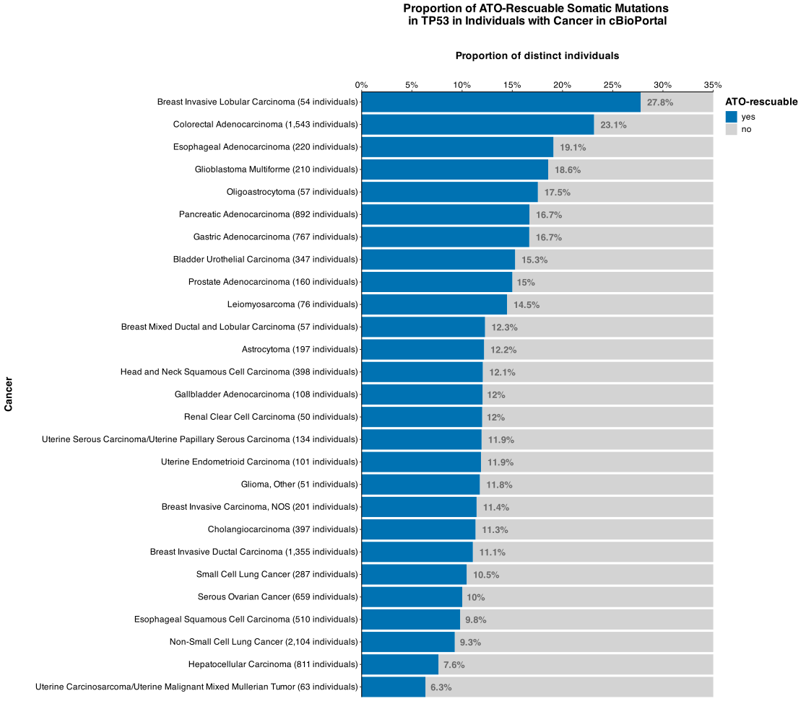

$~$


``` r
# b/c multiple somatic muts in pts, just in case percents != 100%, shrink other muts to fit expected %
to_fit <- p53mutsATOpercancer_pivot_melted %>%
  subset(ATO == "no")

# get how many cancers to account for
length(to_fit$Cancer) # 31 here including other
```

```
[1] 24
```

``` r
# plot zoomed in stacked barchart
stackedbarchart_pts_ATO_cancers_pos <- ggplot(p53mutsATOpercancerpos_pivot_melted %>% 
                                                mutate(Proportion_label = Proportion) %>% 
                                                mutate(Proportion_label = dplyr::case_when(ATO == "no" & Cancer == as.character(to_fit$Cancer[1]) ~ to_fit$Proportion[1]/nrow(p53mutsATOpercancerpos_pivot_melted %>%
                                                                                                                                                                                subset(ATO == "no" & Cancer == as.character(to_fit$Cancer[1]))),
                                                                                           ATO == "no" & Cancer == as.character(to_fit$Cancer[2]) ~ to_fit$Proportion[2]/nrow(p53mutsATOpercancerpos_pivot_melted %>%
                                                                                                                                                                                subset(ATO == "no" & Cancer == as.character(to_fit$Cancer[2]))),
                                                                                           ATO == "no" & Cancer == as.character(to_fit$Cancer[3]) ~ to_fit$Proportion[3]/nrow(p53mutsATOpercancerpos_pivot_melted %>%
                                                                                                                                                                                subset(ATO == "no" & Cancer == as.character(to_fit$Cancer[3]))),
                                                                                           ATO == "no" & Cancer == as.character(to_fit$Cancer[4]) ~ to_fit$Proportion[4]/nrow(p53mutsATOpercancerpos_pivot_melted %>%
                                                                                                                                                                                subset(ATO == "no" & Cancer == as.character(to_fit$Cancer[4]))),
                                                                                           ATO == "no" & Cancer == as.character(to_fit$Cancer[5]) ~ to_fit$Proportion[5]/nrow(p53mutsATOpercancerpos_pivot_melted %>%
                                                                                                                                                                                subset(ATO == "no" & Cancer == as.character(to_fit$Cancer[5]))),
                                                                                           ATO == "no" & Cancer == as.character(to_fit$Cancer[6]) ~ to_fit$Proportion[6]/nrow(p53mutsATOpercancerpos_pivot_melted %>%
                                                                                                                                                                                subset(ATO == "no" & Cancer == as.character(to_fit$Cancer[6]))),
                                                                                           ATO == "no" & Cancer == as.character(to_fit$Cancer[7]) ~ to_fit$Proportion[7]/nrow(p53mutsATOpercancerpos_pivot_melted %>%
                                                                                                                                                                                subset(ATO == "no" & Cancer == as.character(to_fit$Cancer[7]))),
                                                                                           ATO == "no" & Cancer == as.character(to_fit$Cancer[8]) ~ to_fit$Proportion[8]/nrow(p53mutsATOpercancerpos_pivot_melted %>%
                                                                                                                                                                                subset(ATO == "no" & Cancer == as.character(to_fit$Cancer[8]))),
                                                                                           ATO == "no" & Cancer == as.character(to_fit$Cancer[9]) ~ to_fit$Proportion[9]/nrow(p53mutsATOpercancerpos_pivot_melted %>%
                                                                                                                                                                                subset(ATO == "no" & Cancer == as.character(to_fit$Cancer[9]))),
                                                                                           ATO == "no" & Cancer == as.character(to_fit$Cancer[10]) ~ to_fit$Proportion[10]/nrow(p53mutsATOpercancerpos_pivot_melted %>%
                                                                                                                                                                                  subset(ATO == "no" & Cancer == as.character(to_fit$Cancer[10]))),
                                                                                           ATO == "no" & Cancer == as.character(to_fit$Cancer[11]) ~ to_fit$Proportion[11]/nrow(p53mutsATOpercancerpos_pivot_melted %>%
                                                                                                                                                                                  subset(ATO == "no" & Cancer == as.character(to_fit$Cancer[11]))),
                                                                                           ATO == "no" & Cancer == as.character(to_fit$Cancer[12]) ~ to_fit$Proportion[12]/nrow(p53mutsATOpercancerpos_pivot_melted %>%
                                                                                                                                                                                  subset(ATO == "no" & Cancer == as.character(to_fit$Cancer[12]))),
                                                                                           ATO == "no" & Cancer == as.character(to_fit$Cancer[13]) ~ to_fit$Proportion[13]/nrow(p53mutsATOpercancerpos_pivot_melted %>%
                                                                                                                                                                                  subset(ATO == "no" & Cancer == as.character(to_fit$Cancer[13]))),
                                                                                           ATO == "no" & Cancer == as.character(to_fit$Cancer[14]) ~ to_fit$Proportion[14]/nrow(p53mutsATOpercancerpos_pivot_melted %>%
                                                                                                                                                                                  subset(ATO == "no" & Cancer == as.character(to_fit$Cancer[14]))),
                                                                                           ATO == "no" & Cancer == as.character(to_fit$Cancer[15]) ~ to_fit$Proportion[15]/nrow(p53mutsATOpercancerpos_pivot_melted %>%
                                                                                                                                                                                  subset(ATO == "no" & Cancer == as.character(to_fit$Cancer[15]))),
                                                                                           ATO == "no" & Cancer == as.character(to_fit$Cancer[16]) ~ to_fit$Proportion[16]/nrow(p53mutsATOpercancerpos_pivot_melted %>%
                                                                                                                                                                                  subset(ATO == "no" & Cancer == as.character(to_fit$Cancer[16]))),
                                                                                           ATO == "no" & Cancer == as.character(to_fit$Cancer[17]) ~ to_fit$Proportion[17]/nrow(p53mutsATOpercancerpos_pivot_melted %>%
                                                                                                                                                                                  subset(ATO == "no" & Cancer == as.character(to_fit$Cancer[17]))),
                                                                                           ATO == "no" & Cancer == as.character(to_fit$Cancer[18]) ~ to_fit$Proportion[18]/nrow(p53mutsATOpercancerpos_pivot_melted %>%
                                                                                                                                                                                  subset(ATO == "no" & Cancer == as.character(to_fit$Cancer[18]))),
                                                                                           ATO == "no" & Cancer == as.character(to_fit$Cancer[19]) ~ to_fit$Proportion[19]/nrow(p53mutsATOpercancerpos_pivot_melted %>%
                                                                                                                                                                                  subset(ATO == "no" & Cancer == as.character(to_fit$Cancer[19]))),
                                                                                           ATO == "no" & Cancer == as.character(to_fit$Cancer[20]) ~ to_fit$Proportion[20]/nrow(p53mutsATOpercancerpos_pivot_melted %>%
                                                                                                                                                                                  subset(ATO == "no" & Cancer == as.character(to_fit$Cancer[20]))),
                                                                                           ATO == "no" & Cancer == as.character(to_fit$Cancer[21]) ~ to_fit$Proportion[21]/nrow(p53mutsATOpercancerpos_pivot_melted %>%
                                                                                                                                                                                  subset(ATO == "no" & Cancer == as.character(to_fit$Cancer[21]))),
                                                                                           ATO == "no" & Cancer == as.character(to_fit$Cancer[22]) ~ to_fit$Proportion[22]/nrow(p53mutsATOpercancerpos_pivot_melted %>%
                                                                                                                                                                                  subset(ATO == "no" & Cancer == as.character(to_fit$Cancer[22]))),
                                                                                           ATO == "no" & Cancer == as.character(to_fit$Cancer[23]) ~ to_fit$Proportion[23]/nrow(p53mutsATOpercancerpos_pivot_melted %>%
                                                                                                                                                                                  subset(ATO == "no" & Cancer == as.character(to_fit$Cancer[23]))),
                                                                                           ATO == "no" & Cancer == as.character(to_fit$Cancer[24]) ~ to_fit$Proportion[24]/nrow(p53mutsATOpercancerpos_pivot_melted %>%
                                                                                                                                                                                  subset(ATO == "no" & Cancer == as.character(to_fit$Cancer[24]))),
                                                                                           ATO == "no" & Cancer == as.character(to_fit$Cancer[25]) ~ to_fit$Proportion[25]/nrow(p53mutsATOpercancerpos_pivot_melted %>%
                                                                                                                                                                                  subset(ATO == "no" & Cancer == as.character(to_fit$Cancer[25]))),
                                                                                           ATO == "no" & Cancer == as.character(to_fit$Cancer[26]) ~ to_fit$Proportion[26]/nrow(p53mutsATOpercancerpos_pivot_melted %>%
                                                                                                                                                                                  subset(ATO == "no" & Cancer == as.character(to_fit$Cancer[26]))),
                                                                                           ATO == "no" & Cancer == as.character(to_fit$Cancer[27]) ~ to_fit$Proportion[27]/nrow(p53mutsATOpercancerpos_pivot_melted %>%
                                                                                                                                                                                  subset(ATO == "no" & Cancer == as.character(to_fit$Cancer[27]))),
                                                                                           ATO == "no" & Cancer == as.character(to_fit$Cancer[28]) ~ to_fit$Proportion[28]/nrow(p53mutsATOpercancerpos_pivot_melted %>%
                                                                                                                                                                                  subset(ATO == "no" & Cancer == as.character(to_fit$Cancer[28]))),
                                                                                           ATO == "no" & Cancer == as.character(to_fit$Cancer[29]) ~ to_fit$Proportion[29]/nrow(p53mutsATOpercancerpos_pivot_melted %>%
                                                                                                                                                                                  subset(ATO == "no" & Cancer == as.character(to_fit$Cancer[29]))),
                                                                                           ATO == "no" & Cancer == as.character(to_fit$Cancer[30]) ~ to_fit$Proportion[30]/nrow(p53mutsATOpercancerpos_pivot_melted %>%
                                                                                                                                                                                  subset(ATO == "no" & Cancer == as.character(to_fit$Cancer[30]))),
                                                                                           ATO == "no" & Cancer == as.character(to_fit$Cancer[31]) ~ to_fit$Proportion[31]/nrow(p53mutsATOpercancerpos_pivot_melted %>%
                                                                                                                                                                                  subset(ATO == "no" & Cancer == as.character(to_fit$Cancer[31]))),
                                                                                           ATO == "no" & Cancer == as.character(to_fit$Cancer[32]) ~ to_fit$Proportion[32]/nrow(p53mutsATOpercancerpos_pivot_melted %>%
                                                                                                                                                                                  subset(ATO == "no" & Cancer == as.character(to_fit$Cancer[32]))),
                                                                                           ATO == "no" & Cancer == as.character(to_fit$Cancer[33]) ~ to_fit$Proportion[33]/nrow(p53mutsATOpercancerpos_pivot_melted %>%
                                                                                                                                                                                  subset(ATO == "no" & Cancer == as.character(to_fit$Cancer[33]))),
                                                                                           ATO == "no" & Cancer == as.character(to_fit$Cancer[34]) ~ to_fit$Proportion[34]/nrow(p53mutsATOpercancerpos_pivot_melted %>%
                                                                                                                                                                                  subset(ATO == "no" & Cancer == as.character(to_fit$Cancer[34]))),
                                                                                           ATO == "no" & Cancer == as.character(to_fit$Cancer[35]) ~ to_fit$Proportion[35]/nrow(p53mutsATOpercancerpos_pivot_melted %>%
                                                                                                                                                                                  subset(ATO == "no" & Cancer == as.character(to_fit$Cancer[35]))),
                                                                                           ATO == "no" & Cancer == as.character(to_fit$Cancer[36]) ~ to_fit$Proportion[36]/nrow(p53mutsATOpercancerpos_pivot_melted %>%
                                                                                                                                                                                  subset(ATO == "no" & Cancer == as.character(to_fit$Cancer[36]))),
                                                                                           TRUE ~ Proportion_label)) %>% 
                                                subset(!str_detect(Cancer,
                                                                   "OTHER")), 
                                              aes(x = factor(Cancer,
                                                             levels = p53mutsATOpercancer_pivot_melted %>% 
                                                               subset(!str_detect(Cancer,
                                                                                  "OTHER")) %>% 
                                                               subset(ATO == "yes") %>%
                                                               arrange(-Proportion) %>% 
                                                               pull(Cancer) %>% 
                                                               unique() %>% 
                                                               as.vector()), 
                                                  y = Proportion_label, 
                                                  fill = factor(Label,
                                                                levels = c((p53mutsATOpercancerpos_pivot_melted %>%
                                                                              arrange(-Proportion) %>%
                                                                              pull(Label) %>%
                                                                              unique())[(p53mutsATOpercancerpos_pivot_melted %>% 
                                                                                           arrange(-Proportion) %>%
                                                                                           pull(Label) %>%
                                                                                           unique()) != "Other"], 
                                                                           "Other")))) + 
  geom_bar(position = "fill", 
           stat = "identity") + 
  ggtitle("Proportion of ATO-Rescuable Somatic Mutations in TP53 in Individuals with Cancer in cBioPortal") + 
  xlab("Cancer") +
  ylab("Proportion of distinct individuals") +
  labs(fill = "Mutation") +
  scale_y_continuous(labels = scales::percent_format(), 
                     expand = c(0,0), 
                     breaks = scales::pretty_breaks(n = 7)) +
  scale_x_discrete(expand = c(0,0)) +
  coord_cartesian(ylim = c((plyr::round_any(min(to_fit$Proportion), 
                                            0.05, 
                                            f = floor)), 1.0000001), # set axis limits in coord_cartesian to zoom in on percentages
                  expand = FALSE) + 
  scale_fill_manual(values = c(hue_pal()(length(c((p53mutsATOpercancerpos_pivot_melted %>%
                                                     arrange(-Proportion) %>%
                                                     pull(Label) %>%
                                                     unique())[(p53mutsATOpercancerpos_pivot_melted %>% 
                                                                  arrange(-Proportion) %>%
                                                                  pull(Label) %>%
                                                                  unique()) != "Other"], 
                                                  "Other"))) %>% 
                                 head(-1),
                               "lightgray")) + # extract automatic gradient colors and replace final one i.e. other with lightgray
  theme_classic() + 
  theme(axis.text.x = element_text(angle = 45, 
                                   hjust = 1, 
                                   vjust = 1), 
        axis.text = element_text(color = "black",
                                 size = 12), 
        axis.title = element_text(color = "black",
                                  face = "bold",
                                  size = 14),
        axis.title.x = element_text(margin = unit(c(5,0,0,0), units = "mm")),
        axis.title.y = element_text(margin = unit(c(0,5,0,0), units = "mm")),
        plot.title = element_text(hjust = 0.5,
                                  face = "bold",
                                  color = "black",
                                  size = 16,
                                  margin = margin(0,0,5,0, "mm")),
        legend.text = element_text(color = "black",
                                   size = 12),
        legend.title = element_text(color = "black",
                                    face = "bold",
                                    size = 14),
        plot.margin = margin(0,0,0,50, "mm"))
stackedbarchart_pts_ATO_cancers_pos
```

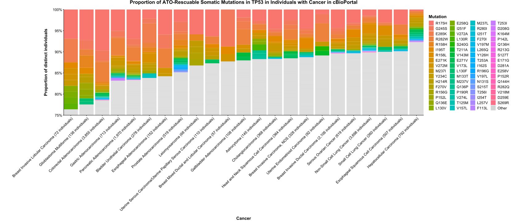

$~$


``` r
# because multiple somatic muts in pts, just in case percents != 100%, shrink other muts to fit expected %
to_fit <- p53mutsATOpercancer_pivot_melted %>%
  subset(ATO == "no")

# get how many cancers to account for
length(to_fit$Cancer) # 31 here including other
```

```
[1] 24
```

``` r
# plot zoomed in stacked barchart
stackedbarchart_pts_ATO_cancers_pos_horiz <- ggplot(p53mutsATOpercancerpos_pivot_melted %>% 
                                                      mutate(Proportion_label = Proportion) %>% 
                                                      mutate(Proportion_label = dplyr::case_when(ATO == "no" & Cancer == as.character(to_fit$Cancer[1]) ~ to_fit$Proportion[1]/nrow(p53mutsATOpercancerpos_pivot_melted %>%
                                                                                                                                                                                      subset(ATO == "no" & Cancer == as.character(to_fit$Cancer[1]))),
                                                                                                 ATO == "no" & Cancer == as.character(to_fit$Cancer[2]) ~ to_fit$Proportion[2]/nrow(p53mutsATOpercancerpos_pivot_melted %>%
                                                                                                                                                                                      subset(ATO == "no" & Cancer == as.character(to_fit$Cancer[2]))),
                                                                                                 ATO == "no" & Cancer == as.character(to_fit$Cancer[3]) ~ to_fit$Proportion[3]/nrow(p53mutsATOpercancerpos_pivot_melted %>%
                                                                                                                                                                                      subset(ATO == "no" & Cancer == as.character(to_fit$Cancer[3]))),
                                                                                                 ATO == "no" & Cancer == as.character(to_fit$Cancer[4]) ~ to_fit$Proportion[4]/nrow(p53mutsATOpercancerpos_pivot_melted %>%
                                                                                                                                                                                      subset(ATO == "no" & Cancer == as.character(to_fit$Cancer[4]))),
                                                                                                 ATO == "no" & Cancer == as.character(to_fit$Cancer[5]) ~ to_fit$Proportion[5]/nrow(p53mutsATOpercancerpos_pivot_melted %>%
                                                                                                                                                                                      subset(ATO == "no" & Cancer == as.character(to_fit$Cancer[5]))),
                                                                                                 ATO == "no" & Cancer == as.character(to_fit$Cancer[6]) ~ to_fit$Proportion[6]/nrow(p53mutsATOpercancerpos_pivot_melted %>%
                                                                                                                                                                                      subset(ATO == "no" & Cancer == as.character(to_fit$Cancer[6]))),
                                                                                                 ATO == "no" & Cancer == as.character(to_fit$Cancer[7]) ~ to_fit$Proportion[7]/nrow(p53mutsATOpercancerpos_pivot_melted %>%
                                                                                                                                                                                      subset(ATO == "no" & Cancer == as.character(to_fit$Cancer[7]))),
                                                                                                 ATO == "no" & Cancer == as.character(to_fit$Cancer[8]) ~ to_fit$Proportion[8]/nrow(p53mutsATOpercancerpos_pivot_melted %>%
                                                                                                                                                                                      subset(ATO == "no" & Cancer == as.character(to_fit$Cancer[8]))),
                                                                                                 ATO == "no" & Cancer == as.character(to_fit$Cancer[9]) ~ to_fit$Proportion[9]/nrow(p53mutsATOpercancerpos_pivot_melted %>%
                                                                                                                                                                                      subset(ATO == "no" & Cancer == as.character(to_fit$Cancer[9]))),
                                                                                                 ATO == "no" & Cancer == as.character(to_fit$Cancer[10]) ~ to_fit$Proportion[10]/nrow(p53mutsATOpercancerpos_pivot_melted %>%
                                                                                                                                                                                        subset(ATO == "no" & Cancer == as.character(to_fit$Cancer[10]))),
                                                                                                 ATO == "no" & Cancer == as.character(to_fit$Cancer[11]) ~ to_fit$Proportion[11]/nrow(p53mutsATOpercancerpos_pivot_melted %>%
                                                                                                                                                                                        subset(ATO == "no" & Cancer == as.character(to_fit$Cancer[11]))),
                                                                                                 ATO == "no" & Cancer == as.character(to_fit$Cancer[12]) ~ to_fit$Proportion[12]/nrow(p53mutsATOpercancerpos_pivot_melted %>%
                                                                                                                                                                                        subset(ATO == "no" & Cancer == as.character(to_fit$Cancer[12]))),
                                                                                                 ATO == "no" & Cancer == as.character(to_fit$Cancer[13]) ~ to_fit$Proportion[13]/nrow(p53mutsATOpercancerpos_pivot_melted %>%
                                                                                                                                                                                        subset(ATO == "no" & Cancer == as.character(to_fit$Cancer[13]))),
                                                                                                 ATO == "no" & Cancer == as.character(to_fit$Cancer[14]) ~ to_fit$Proportion[14]/nrow(p53mutsATOpercancerpos_pivot_melted %>%
                                                                                                                                                                                        subset(ATO == "no" & Cancer == as.character(to_fit$Cancer[14]))),
                                                                                                 ATO == "no" & Cancer == as.character(to_fit$Cancer[15]) ~ to_fit$Proportion[15]/nrow(p53mutsATOpercancerpos_pivot_melted %>%
                                                                                                                                                                                        subset(ATO == "no" & Cancer == as.character(to_fit$Cancer[15]))),
                                                                                                 ATO == "no" & Cancer == as.character(to_fit$Cancer[16]) ~ to_fit$Proportion[16]/nrow(p53mutsATOpercancerpos_pivot_melted %>%
                                                                                                                                                                                        subset(ATO == "no" & Cancer == as.character(to_fit$Cancer[16]))),
                                                                                                 ATO == "no" & Cancer == as.character(to_fit$Cancer[17]) ~ to_fit$Proportion[17]/nrow(p53mutsATOpercancerpos_pivot_melted %>%
                                                                                                                                                                                        subset(ATO == "no" & Cancer == as.character(to_fit$Cancer[17]))),
                                                                                                 ATO == "no" & Cancer == as.character(to_fit$Cancer[18]) ~ to_fit$Proportion[18]/nrow(p53mutsATOpercancerpos_pivot_melted %>%
                                                                                                                                                                                        subset(ATO == "no" & Cancer == as.character(to_fit$Cancer[18]))),
                                                                                                 ATO == "no" & Cancer == as.character(to_fit$Cancer[19]) ~ to_fit$Proportion[19]/nrow(p53mutsATOpercancerpos_pivot_melted %>%
                                                                                                                                                                                        subset(ATO == "no" & Cancer == as.character(to_fit$Cancer[19]))),
                                                                                                 ATO == "no" & Cancer == as.character(to_fit$Cancer[20]) ~ to_fit$Proportion[20]/nrow(p53mutsATOpercancerpos_pivot_melted %>%
                                                                                                                                                                                        subset(ATO == "no" & Cancer == as.character(to_fit$Cancer[20]))),
                                                                                                 ATO == "no" & Cancer == as.character(to_fit$Cancer[21]) ~ to_fit$Proportion[21]/nrow(p53mutsATOpercancerpos_pivot_melted %>%
                                                                                                                                                                                        subset(ATO == "no" & Cancer == as.character(to_fit$Cancer[21]))),
                                                                                                 ATO == "no" & Cancer == as.character(to_fit$Cancer[22]) ~ to_fit$Proportion[22]/nrow(p53mutsATOpercancerpos_pivot_melted %>%
                                                                                                                                                                                        subset(ATO == "no" & Cancer == as.character(to_fit$Cancer[22]))),
                                                                                                 ATO == "no" & Cancer == as.character(to_fit$Cancer[23]) ~ to_fit$Proportion[23]/nrow(p53mutsATOpercancerpos_pivot_melted %>%
                                                                                                                                                                                        subset(ATO == "no" & Cancer == as.character(to_fit$Cancer[23]))),
                                                                                                 ATO == "no" & Cancer == as.character(to_fit$Cancer[24]) ~ to_fit$Proportion[24]/nrow(p53mutsATOpercancerpos_pivot_melted %>%
                                                                                                                                                                                        subset(ATO == "no" & Cancer == as.character(to_fit$Cancer[24]))),
                                                                                                 ATO == "no" & Cancer == as.character(to_fit$Cancer[25]) ~ to_fit$Proportion[25]/nrow(p53mutsATOpercancerpos_pivot_melted %>%
                                                                                                                                                                                        subset(ATO == "no" & Cancer == as.character(to_fit$Cancer[25]))),
                                                                                                 ATO == "no" & Cancer == as.character(to_fit$Cancer[26]) ~ to_fit$Proportion[26]/nrow(p53mutsATOpercancerpos_pivot_melted %>%
                                                                                                                                                                                        subset(ATO == "no" & Cancer == as.character(to_fit$Cancer[26]))),
                                                                                                 ATO == "no" & Cancer == as.character(to_fit$Cancer[27]) ~ to_fit$Proportion[27]/nrow(p53mutsATOpercancerpos_pivot_melted %>%
                                                                                                                                                                                        subset(ATO == "no" & Cancer == as.character(to_fit$Cancer[27]))),
                                                                                                 ATO == "no" & Cancer == as.character(to_fit$Cancer[28]) ~ to_fit$Proportion[28]/nrow(p53mutsATOpercancerpos_pivot_melted %>%
                                                                                                                                                                                        subset(ATO == "no" & Cancer == as.character(to_fit$Cancer[28]))),
                                                                                                 ATO == "no" & Cancer == as.character(to_fit$Cancer[29]) ~ to_fit$Proportion[29]/nrow(p53mutsATOpercancerpos_pivot_melted %>%
                                                                                                                                                                                        subset(ATO == "no" & Cancer == as.character(to_fit$Cancer[29]))),
                                                                                                 ATO == "no" & Cancer == as.character(to_fit$Cancer[30]) ~ to_fit$Proportion[30]/nrow(p53mutsATOpercancerpos_pivot_melted %>%
                                                                                                                                                                                        subset(ATO == "no" & Cancer == as.character(to_fit$Cancer[30]))),
                                                                                                 ATO == "no" & Cancer == as.character(to_fit$Cancer[31]) ~ to_fit$Proportion[31]/nrow(p53mutsATOpercancerpos_pivot_melted %>%
                                                                                                                                                                                        subset(ATO == "no" & Cancer == as.character(to_fit$Cancer[31]))),
                                                                                                 ATO == "no" & Cancer == as.character(to_fit$Cancer[32]) ~ to_fit$Proportion[32]/nrow(p53mutsATOpercancerpos_pivot_melted %>%
                                                                                                                                                                                        subset(ATO == "no" & Cancer == as.character(to_fit$Cancer[32]))),
                                                                                                 ATO == "no" & Cancer == as.character(to_fit$Cancer[33]) ~ to_fit$Proportion[33]/nrow(p53mutsATOpercancerpos_pivot_melted %>%
                                                                                                                                                                                        subset(ATO == "no" & Cancer == as.character(to_fit$Cancer[33]))),
                                                                                                 ATO == "no" & Cancer == as.character(to_fit$Cancer[34]) ~ to_fit$Proportion[34]/nrow(p53mutsATOpercancerpos_pivot_melted %>%
                                                                                                                                                                                        subset(ATO == "no" & Cancer == as.character(to_fit$Cancer[34]))),
                                                                                                 ATO == "no" & Cancer == as.character(to_fit$Cancer[35]) ~ to_fit$Proportion[35]/nrow(p53mutsATOpercancerpos_pivot_melted %>%
                                                                                                                                                                                        subset(ATO == "no" & Cancer == as.character(to_fit$Cancer[35]))),
                                                                                                 ATO == "no" & Cancer == as.character(to_fit$Cancer[36]) ~ to_fit$Proportion[36]/nrow(p53mutsATOpercancerpos_pivot_melted %>%
                                                                                                                                                                                        subset(ATO == "no" & Cancer == as.character(to_fit$Cancer[36]))),
                                                                                                 TRUE ~ Proportion_label)) %>% 
                                                      subset(!str_detect(Cancer,
                                                                         "OTHER")), 
                                                    aes(x = factor(Cancer,
                                                                   levels = p53mutsATOpercancer_pivot_melted %>% 
                                                                     subset(!str_detect(Cancer,
                                                                                        "OTHER")) %>% 
                                                                     subset(ATO == "yes") %>%
                                                                     arrange(-Proportion) %>% 
                                                                     pull(Cancer) %>% 
                                                                     unique() %>% 
                                                                     as.vector()), 
                                                        y = Proportion_label, 
                                                        fill = factor(Label,
                                                                      levels = c((p53mutsATOpercancerpos_pivot_melted %>%
                                                                                    arrange(-Proportion) %>%
                                                                                    pull(Label) %>%
                                                                                    unique())[(p53mutsATOpercancerpos_pivot_melted %>% 
                                                                                                 arrange(-Proportion) %>%
                                                                                                 pull(Label) %>%
                                                                                                 unique()) != "Other"], 
                                                                                 "Other")))) + 
  geom_bar(position = position_fill(reverse = TRUE), 
           stat = "identity") + 
  ggtitle("Proportion of ATO-Rescuable Somatic Mutations \nin TP53 in Individuals with Cancer in cBioPortal") + 
  xlab("Cancer") +
  ylab("Proportion of distinct individuals") +
  labs(fill = "Mutation") +
  scale_y_continuous(labels = scales::percent_format(), 
                     expand = c(0,0), 
                     breaks = scales::pretty_breaks(n = 7),
                     position = "right") +
  scale_x_discrete(expand = c(0,0),
                   limits = rev) +
  scale_fill_manual(values = c(hue_pal()(length(c((p53mutsATOpercancerpos_pivot_melted %>%
                                                     arrange(-Proportion) %>%
                                                     pull(Label) %>%
                                                     unique())[(p53mutsATOpercancerpos_pivot_melted %>% 
                                                                  arrange(-Proportion) %>%
                                                                  pull(Label) %>%
                                                                  unique()) != "Other"], 
                                                  "Other"))) %>% 
                                 head(-1),
                               "lightgray")) + # extract automatic gradient colors and replace final one i.e. other with lightgray
  theme_classic() + 
  coord_flip(ylim = c(0, ((p53mutsATOpercancer_pivot_melted %>%
                             subset(ATO == "yes") %>%
                             pull(Proportion) %>% 
                             max() %>% 
                             plyr::round_any(0.05,
                                             f = ceiling)) * 1.00001))) + # calls coord_cartesian to set axis limits to zoom in on percentages
  guides(fill = guide_legend(ncol = 2)) + 
  theme(axis.text.x = element_text(angle = 0, 
                                   hjust = 0.5), 
        axis.text = element_text(color = "black",
                                 size = 12), 
        axis.title = element_text(color = "black",
                                  face = "bold",
                                  size = 14),
        axis.title.x.top = element_text(margin = unit(c(0,0,10,0), units = "mm")),
        axis.title.y = element_text(margin = unit(c(0,10,0,0), units = "mm")),
        plot.title = element_text(hjust = 0.5,
                                  face = "bold",
                                  color = "black",
                                  size = 16,
                                  margin = margin(0,0,10,0, "mm")),
        legend.text = element_text(color = "black",
                                   size = 12),
        legend.title = element_text(color = "black",
                                    face = "bold",
                                    size = 14),
        axis.text.y = element_text(vjust = 0.5))
stackedbarchart_pts_ATO_cancers_pos_horiz
```


$~$


``` r
save_plot(file = paste0(fig_path,
                        "stackedbarchart_pts_ATO_cancers_pos_horiz_barchart.png"), # .svg is too big to insert into powerpoint so need to save as png
          stackedbarchart_pts_ATO_cancers_pos_horiz,
          base_width = 15,
          base_height = 13.5,
          dpi = 600,
          limitsize = FALSE) # specifying dpi because saving as png since svg cannot insert into ppt
```

$~$


``` r
# make facet barchart on top ATO-rescuable germ/som across cancers
barchart_facet_keyATOpos_cancers <- ggplot(p53mutsATOpercancerpos_pivot_melted %>% 
                                             subset(!str_detect(Cancer, 
                                                                "OTHER")) %>% 
                                             subset(ATO == "yes" & Label %in% top_ATO_germ_som_cbio_combined),
                                           aes(x = factor(Cancer,
                                                          levels = sort(unique(as.vector(p53mutsATOpercancerpos_pivot_melted$Cancer)))[!str_detect(sort(unique(as.vector(p53mutsATOpercancerpos_pivot_melted$Cancer))), 
                                                                                                                                                   "OTHER")]),
                                               # factor(Cancer,
                                               #          levels = c(sort(unique(as.vector(p53mutsATOpercancerpos_pivot_melted$Cancer)))[!str_detect(sort(unique(as.vector(p53mutsATOpercancerpos_pivot_melted$Cancer))), 
                                               #                                                                                                     "OTHER")], sort(unique(as.vector(p53mutsATOpercancerpos_pivot_melted$Cancer)))[str_detect(sort(unique(as.vector(p53mutsATOpercancerpos_pivot_melted$Cancer))), 
                                               #                                                                                                                                                                                               "OTHER")])),
                                               y = Proportion,
                                               fill = factor(Cancer,
                                                             levels = sort(unique(as.vector(p53mutsATOpercancerpos_pivot_melted$Cancer)))[!str_detect(sort(unique(as.vector(p53mutsATOpercancerpos_pivot_melted$Cancer))), 
                                                                                                                                                      "OTHER")])
                                               # factor(Cancer,
                                               #             levels = c(sort(unique(as.vector(p53mutsATOpercancerpos_pivot_melted$Cancer)))[!str_detect(sort(unique(as.vector(p53mutsATOpercancerpos_pivot_melted$Cancer))), 
                                               #                                                                                                        "OTHER")], sort(unique(as.vector(p53mutsATOpercancerpos_pivot_melted$Cancer)))[str_detect(sort(unique(as.vector(p53mutsATOpercancerpos_pivot_melted$Cancer))), 
                                               #                                                                                                                                                                                                  "OTHER")]))
                                           )) + 
  geom_bar(stat = "identity", 
           position = position_dodge2()) + # to keep some space b/t barcharts in same mut
  geom_text(aes(label = paste0(plyr::round_any(Proportion * 100, 
                                               0.1),
                               "%")),
            color = "black",
            size = 3.5,
            fontface = "bold",
            alpha = 0.75, # level of transparency (lower is more transparent)
            vjust = -0.5,
            hjust = 0.5) +
  xlab("Cancer") +
  ylab("Proportion of distinct individuals") +
  labs(fill = "Cancer") + 
  ggtitle("Proportion of ATO-Rescuable Mutations in TP53 in Individuals with Cancer") + # different facet_wrap function which allows conditional strip i.e. facet formatting
  facet_wrap2(. ~ factor(Label,
                         levels = top_ATO_germ_som_cbio_combined[order(abs(parse_number(top_ATO_germ_som_cbio_combined)))]), # order by codon number so that colors match
              ncol = 2,
              strip = conditional_strips_ATO,
              trim_blank = FALSE, # leave blank plots where muts not in dataset
              axes = "all", # show internal axes but without x labels
              remove_labels = "x", # show internal axes but without x labels
              drop = FALSE) + # ensure muts not in dataset still shown as blanks
  scale_y_continuous(labels = scales::percent_format(), 
                     expand = c(0,0), 
                     breaks = scales::pretty_breaks(n = 5), 
                     limits = c(0, ((p53mutsATOpercancerpos_pivot_melted %>% 
                                       subset(!str_detect(Cancer, 
                                                          "OTHER")) %>% 
                                       subset(ATO == "yes" & Label %in% top_ATO_germ_som_cbio_combined) %>% 
                                       pull(Proportion) %>% 
                                       max() %>%
                                       plyr::round_any(0.12, 
                                                       f = ceiling)) * 1.000001))) +
  scale_x_discrete(
    #limits = rev, 
    expand = c(0,0),
    drop = FALSE) + # ensure muts not in dataset are still shown as blanks
  scale_fill_manual(values = c(#"#c670e5",
    "limegreen",
    "#84007e",
    "#4342b3",
    "#ff8ea5",
    "#7e9900",
    "#50006c",
    "#e03e97",
    "#930002",
    "#ba0069",
    "#006f17",
    "lavender",
    "#420f48",
    "#eea52d",
    "#6294ff",
    "#cade66",
    "#02e9c7",
    "#806300",
    #"#c4379f",
    #"#5a1500",
    "#004584",
    "#ff865d",
    #"#ada9ff",
    "#007e3e",
    "#eea3ff",
    "#630021",
    "#002670",
    #"#ffa4d8",
    "#a44c00",
    "#d388be",
    "#ebd386",
    "red",
    "#ff7f7d",
    "#62742e",
    "gray80"
    #,"black"
  )) +
  guides(fill = guide_legend(ncol = 1)) +
  theme_classic() + 
  theme(axis.text.x = element_text(angle = 45, 
                                   hjust = 1, 
                                   vjust = 1), 
        axis.text = element_text(color = "black",
                                 size = 12), 
        axis.title = element_text(color = "black",
                                  face = "bold",
                                  size = 14),
        axis.title.x = element_text(margin = unit(c(10,0,0,0), units = "mm")),
        axis.title.y = element_text(margin = unit(c(0,10,0,0), units = "mm")),
        plot.title = element_text(hjust = 0.5,
                                  face = "bold",
                                  color = "black",
                                  size = 16,
                                  margin = margin(0,0,10,0, "mm")),
        legend.text = element_text(color = "black",
                                   size = 12),
        legend.title = element_text(color = "black",
                                    face = "bold",
                                    size = 14),
        legend.box.spacing = margin(30), # increase space between legend and plot
        legend.margin = margin(0,5,0,0, unit = "mm"),
        legend.justification = "top", # put legend in top right of plot
        #legend.position = c(,), # c(0,0) bottom left, c(1,1) top-right within plot
        strip.background = element_blank(),
        strip.text = element_text(color = "black",
                                  size = 14,
                                  face = "bold",
                                  margin = margin(10,0,10,0, "mm")),
        panel.spacing.x = unit(5, "lines"),
        panel.spacing.y = unit(-20, "lines"),
        plot.margin = margin(0,5,0,35, unit = "mm"))
barchart_facet_keyATOpos_cancers
```

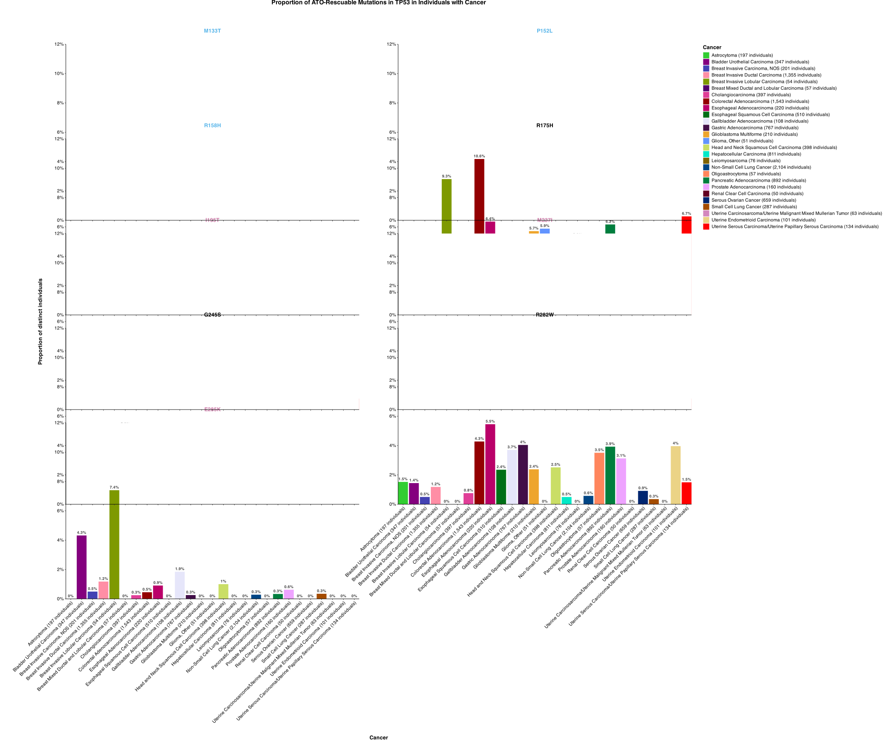

$~$


``` r
# make stacked barchart of 1:1 cancers matching germline
barchart_facet_keyATOpos_matchedgermline_cancers <- ggplot(p53mutsATOpercancerpos_matchgermline_melted %>% 
                                                             subset(!str_detect(Cancer, 
                                                                                "OTHER")) %>% 
                                                             subset(ATO == "yes" & Label %in% top_ATO_germ_som_cbio_combined),
                                                           aes(x = factor(Cancer,
                                                                          levels = sort(unique(as.vector(p53mutsATOpercancerpos_matchgermline_melted$Cancer)))[!str_detect(sort(unique(as.vector(p53mutsATOpercancerpos_matchgermline_melted$Cancer))), 
                                                                                                                                                                           "OTHER")]),
                                                               # factor(Cancer,
                                                               #          levels = c(sort(unique(as.vector(p53mutsATOpercancerpos_matchgermline_melted$Cancer)))[!str_detect(sort(unique(as.vector(p53mutsATOpercancerpos_matchgermline_melted$Cancer))), 
                                                               #                                                                                                     "OTHER")], sort(unique(as.vector(p53mutsATOpercancerpos_matchgermline_melted$Cancer)))[str_detect(sort(unique(as.vector(p53mutsATOpercancerpos_matchgermline_melted$Cancer))), 
                                                               #                                                                                                                                                                                               "OTHER")])),
                                                               y = Proportion,
                                                               fill = factor(Cancer,
                                                                             levels = sort(unique(as.vector(p53mutsATOpercancerpos_matchgermline_melted$Cancer)))[!str_detect(sort(unique(as.vector(p53mutsATOpercancerpos_matchgermline_melted$Cancer))), 
                                                                                                                                                                              "OTHER")])
                                                               # factor(Cancer,
                                                               #             levels = c(sort(unique(as.vector(p53mutsATOpercancerpos_matchgermline_melted$Cancer)))[!str_detect(sort(unique(as.vector(p53mutsATOpercancerpos_matchgermline_melted$Cancer))), 
                                                               #                                                                                                        "OTHER")], sort(unique(as.vector(p53mutsATOpercancerpos_matchgermline_melted$Cancer)))[str_detect(sort(unique(as.vector(p53mutsATOpercancerpos_matchgermline_melted$Cancer))), 
                                                               #                                                                                                                                                                                                  "OTHER")]))
                                                           )) + 
  geom_bar(stat = "identity", 
           position = position_dodge2()) + # to keep some space b/t barcharts in same mut
  geom_text(aes(label = paste0(plyr::round_any(Proportion * 100, 
                                               0.1),
                               "%")),
            color = "black",
            size = 3.5,
            fontface = "bold",
            alpha = 0.75, # level of transparency (lower is more transparent)
            vjust = -0.5,
            hjust = 0.5) +
  xlab("Cancer") +
  ylab("Proportion of distinct individuals") +
  labs(fill = "Cancer") + 
  ggtitle("Proportion of ATO-Rescuable Mutations in TP53 in Individuals with Cancer") + # different facet_wrap function which allows conditional strip i.e. facet formatting
  facet_wrap2(. ~ factor(Label,
                         levels = top_ATO_germ_som_cbio_combined[order(abs(parse_number(top_ATO_germ_som_cbio_combined)))]), # order by codon number so that colors match
              ncol = 3,
              strip = conditional_strips_ATO,
              trim_blank = FALSE, # leave blank plots where muts not in dataset
              axes = "all", # show internal axes but without x labels
              remove_labels = "x", # show internal axes but without x labels
              drop = FALSE) + # ensure muts not in dataset still shown as blanks
  scale_y_continuous(labels = scales::percent_format(), 
                     expand = c(0,0), 
                     breaks = scales::pretty_breaks(n = 5), 
                     limits = c(0, ((p53mutsATOpercancerpos_matchgermline_melted %>% 
                                       subset(!str_detect(Cancer, 
                                                          "OTHER")) %>% 
                                       subset(ATO == "yes" & Label %in% top_ATO_germ_som_cbio_combined) %>% 
                                       pull(Proportion) %>% 
                                       max() %>%
                                       plyr::round_any(0.12, 
                                                       f = ceiling)) * 1.000001))) +
  scale_x_discrete(
    #limits = rev, 
    expand = c(0,0),
    drop = FALSE) + # ensure muts not in dataset are still shown as blanks
  scale_fill_manual(values = c("#CC79A7",
                               "#E69F00",
                               "#009E73",
                               "#56B4E9",
                               "#999999"
                               #,
                               #"#000000"
  )) +
  guides(fill = guide_legend(ncol = 1)) +
  theme_classic() + 
  theme(axis.text.x = element_text(angle = 45, 
                                   hjust = 1, 
                                   vjust = 1), 
        axis.text = element_text(color = "black",
                                 size = 12), 
        axis.title = element_text(color = "black",
                                  face = "bold",
                                  size = 14),
        axis.title.x = element_text(margin = unit(c(10,0,0,0), units = "mm")),
        axis.title.y = element_text(margin = unit(c(0,10,0,0), units = "mm")),
        plot.title = element_text(hjust = 0.5,
                                  face = "bold",
                                  color = "black",
                                  size = 16,
                                  margin = margin(0,0,10,0, "mm")),
        legend.text = element_text(color = "black",
                                   size = 12),
        legend.title = element_text(color = "black",
                                    face = "bold",
                                    size = 14),
        legend.box.spacing = margin(30), # increase space between legend and plot
        legend.margin = margin(0,5,0,0, unit = "mm"),
        legend.justification = "top", # put legend in top right of plot
        #legend.position = c(,), # c(0,0) bottom left, c(1,1) top-right within plot
        strip.background = element_blank(),
        strip.text = element_text(color = "black",
                                  size = 14,
                                  face = "bold",
                                  margin = margin(10,0,10,0, "mm")),
        panel.spacing.x = unit(5, "lines"),
        panel.spacing.y = unit(-8, "lines"),
        plot.margin = margin(0,5,0,35, unit = "mm"))
barchart_facet_keyATOpos_matchedgermline_cancers
```

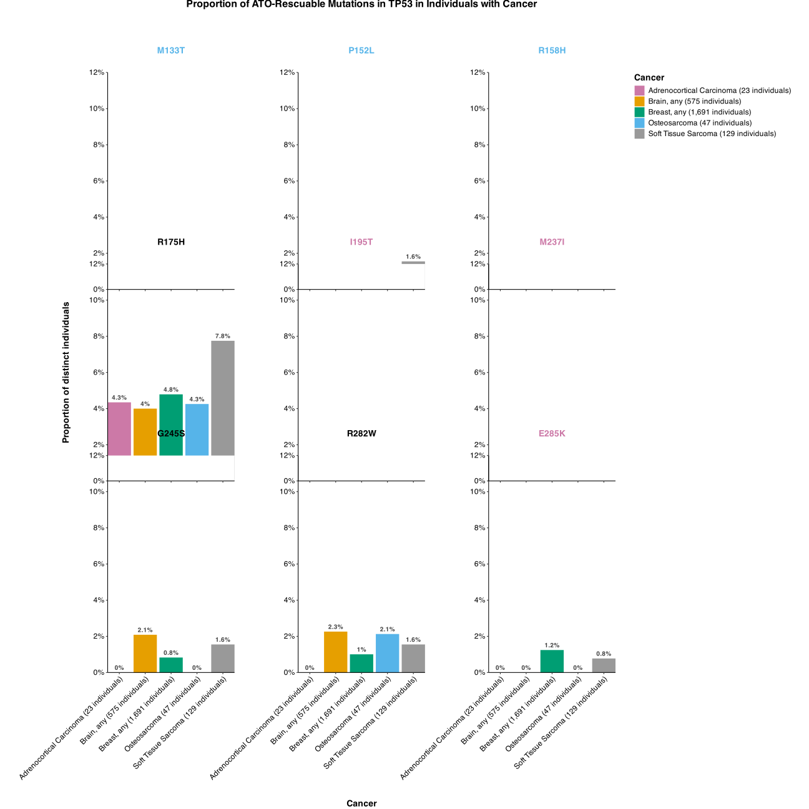

$~$


``` r
# make facet barchart on top muts germ/som across cancers
barchart_facet_keymutsifATO_cancers <- ggplot(p53mutsATOpercancerpos_pivot_melted %>% 
                                                subset(!str_detect(Cancer,
                                                                   "OTHER")) %>% 
                                                subset(ATO == "yes" & Label %in% top_muts_germ_som_cbio_combined),
                                              aes(x = factor(Cancer,
                                                             levels = sort(unique(as.vector(p53mutsATOpercancerpos_pivot_melted$Cancer)))[!str_detect((sort(unique(as.vector(p53mutsATOpercancerpos_pivot_melted$Cancer)))), 
                                                                                                                                                      "OTHER")]),
                                                  # factor(Cancer,
                                                  #          levels = c(sort(unique(as.vector(p53mutsATOpercancerpos_pivot_melted$Cancer)))[!str_detect(sort(unique(as.vector(p53mutsATOpercancerpos_pivot_melted$Cancer))), 
                                                  #                                                                                                     "OTHER")], sort(unique(as.vector(p53mutsATOpercancerpos_pivot_melted$Cancer)))[str_detect(sort(unique(as.vector(p53mutsATOpercancerpos_pivot_melted$Cancer))), 
                                                  #                                                                                                                                                                                               "OTHER")])),
                                                  y = Proportion,
                                                  fill = factor(Cancer,
                                                                levels = sort(unique(as.vector(p53mutsATOpercancerpos_pivot_melted$Cancer)))[!str_detect((sort(unique(as.vector(p53mutsATOpercancerpos_pivot_melted$Cancer)))), 
                                                                                                                                                         "OTHER")]),
                                                  # factor(Cancer,
                                                  #             levels = c(sort(unique(as.vector(p53mutsATOpercancerpos_pivot_melted$Cancer)))[!str_detect(sort(unique(as.vector(p53mutsATOpercancerpos_pivot_melted$Cancer))), 
                                                  #                                                                                                        "OTHER")], sort(unique(as.vector(p53mutsATOpercancerpos_pivot_melted$Cancer)))[str_detect(sort(unique(as.vector(p53mutsATOpercancerpos_pivot_melted$Cancer))), 
                                                  #                                                                                                                                                                                                  "OTHER")]))
                                              )) + 
  geom_bar(stat = "identity", 
           position = position_dodge2()) + # to keep some space b/t barcharts in same mut
  geom_text(aes(label = paste0(plyr::round_any(Proportion * 100, 
                                               0.1),
                               "%")),
            color = "black",
            size = 3.5,
            fontface = "bold",
            alpha = 0.75, # level of transparency (lower is more transparent)
            vjust = -0.5,
            hjust = 0.5) +
  xlab("Cancer") +
  ylab("Proportion of distinct individuals") +
  labs(fill = "Cancer") + 
  ggtitle("Proportion of Hotspot Mutations in TP53 in Individuals with Cancer that are Effectively Rescued by ATO") + # different facet_wrap function which allows conditional strip i.e. facet formatting
  facet_wrap2(. ~ factor(Label,
                         levels = top_muts_germ_som_cbio_combined[order(abs(parse_number(top_muts_germ_som_cbio_combined)))]), # order by codon number so that colors match
              ncol = 3,
              strip = conditional_strips_muts,
              trim_blank = FALSE, # leave blank plots where muts not in dataset
              axes = "all", # show internal axes but without x labels
              remove_labels = "x", # show internal axes but without x labels
              drop = FALSE) + # ensure muts not in dataset still shown as blanks
  scale_y_continuous(labels = scales::percent_format(), 
                     expand = c(0,0), 
                     breaks = scales::pretty_breaks(n = 6), 
                     limits = c(0, ((p53mutsATOpercancerpos_pivot_melted %>% 
                                       subset(!str_detect(Cancer,
                                                          "OTHER")) %>% 
                                       subset(ATO == "yes" & Label %in% top_muts_germ_som_cbio_combined) %>% 
                                       pull(Proportion) %>% 
                                       max() %>%
                                       plyr::round_any(0.12, 
                                                       f = ceiling)) * 1.000001))) +
  scale_x_discrete(
    #limits = rev, 
    expand = c(0,0),
    drop = FALSE) + # ensure muts not in dataset are still shown as blanks
  scale_fill_manual(values = c(#"#c670e5",
    "limegreen",
    "#84007e",
    "#4342b3",
    "#ff8ea5",
    "#7e9900",
    "#50006c",
    "#e03e97",
    "#930002",
    "#ba0069",
    "#006f17",
    "lavender",
    "#420f48",
    "#eea52d",
    "#6294ff",
    "#cade66",
    "#02e9c7",
    "#806300",
    #"#c4379f",
    #"#5a1500",
    "#004584",
    "#ff865d",
    #"#ada9ff",
    "#007e3e",
    "#eea3ff",
    "#630021",
    "#002670",
    #"#ffa4d8",
    "#a44c00",
    "#d388be",
    "#ebd386",
    "red",
    "#ff7f7d",
    "#62742e",
    "gray80"
    #,"black"
  )) +
  guides(fill = guide_legend(ncol = 1)) +
  theme_classic() + 
  theme(axis.text.x = element_text(angle = 45, 
                                   hjust = 1, 
                                   vjust = 1), 
        axis.text = element_text(color = "black",
                                 size = 12), 
        axis.title = element_text(color = "black",
                                  face = "bold",
                                  size = 14),
        axis.title.x = element_text(margin = unit(c(10,0,0,0), units = "mm")),
        axis.title.y = element_text(margin = unit(c(0,10,0,0), units = "mm")),
        plot.title = element_text(hjust = 0.5,
                                  face = "bold",
                                  color = "black",
                                  size = 16,
                                  margin = margin(0,0,10,0, "mm")),
        legend.text = element_text(color = "black",
                                   size = 12),
        legend.title = element_text(color = "black",
                                    face = "bold",
                                    size = 14),
        legend.justification = "top", # put legend in top right of plot
        legend.margin = margin(0,5,0,0, unit = "mm"),
        #legend.position = c(,), # c(0,0) bottom left, c(1,1) top-right within plot
        strip.background = element_blank(),
        strip.text = element_text(color = "black",
                                  size = 14,
                                  face = "bold",
                                  margin = margin(10,0,10,0, "mm")),
        panel.spacing.x = unit(5, "lines"),
        panel.spacing.y = unit(-21, "lines"),
        plot.margin = margin(0,0,0,35, unit = "mm"))
barchart_facet_keymutsifATO_cancers
```

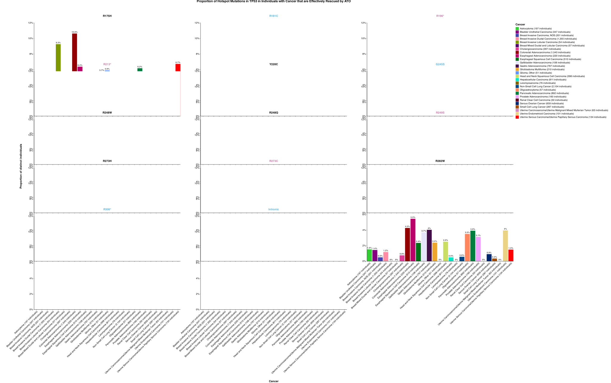

$~$


``` r
top_splice_allp53mut_gridprep <- condformat(pt_spliceperpos_df_ggplot %>%
                                      filter(str_detect(Patient, 
                                                        "All with cancer") & Isoform == "yes") %>% 
                                      left_join(., 
                                                p53mutsspliceperpos_pivot %>% 
                                                  dplyr::select(c(protchange_collapseintronic, 
                                                                  Total)), 
                                                by = "protchange_collapseintronic") %>% 
                                      arrange(-Calc) %>%
                                      head(10) %>%
                                      mutate(Proportion = plyr::round_any(Calc * 100,
                                                                          0.01)) %>%
                                        mutate(Label = gsub("T125=", 
                                                            "T125T",
                                                            Label)) %>% 
                                      dplyr::select(c(Label,
                                                      Proportion,
                                                      Total)) %>%
                                      dplyr::rename(Mutation = Label,
                                                    Percent = Proportion,
                                                    Patients = Total)) %>% 
  theme_grob(rows = NULL, 
             theme = ttheme_default(base_size = 10,
                                    core = list(padding = unit(c(15, 4), "mm")))) %>%
  condformat2grob(draw = FALSE)

top_splice_sole_grid <- grid.arrange(top_splice_allp53mut_gridprep,
                                  top = textGrob("Prevalence of Top Splice Mutations \nAcross Individuals with p53-Mutant Cancers \nin cBioPortal",
                                                 hjust = 0.5,
                                                 gp = gpar(fontface = "bold")))
```

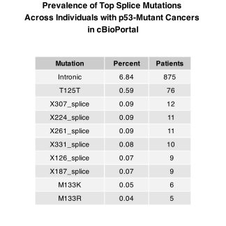

$~$


``` r
top_consensus_sd_sa_allp53mut_gridprep <- condformat(p53mutssplice_consensusperpos_pivot_calc %>%
                                      filter(str_detect(Patient, 
                                                        "All with cancer") & Isoform == "yes" & !str_detect(consensus_sd_sa, "NA")) %>% 
                                      left_join(., 
                                                p53mutssplice_consensusperpos_pivot %>% 
                                                  dplyr::select(c(consensus_sd_sa, 
                                                                  Total)), 
                                                by = "consensus_sd_sa") %>% 
                                      arrange(-Calc) %>%
                                      head(10) %>%
                                      mutate(Proportion = plyr::round_any(Calc * 100,
                                                                          0.01)) %>%
                                      dplyr::select(c(Label,
                                                      Proportion,
                                                      Total)) %>%
                                      dplyr::rename(Location = Label,
                                                    Percent = Proportion,
                                                    Patients = Total)) %>% 
  theme_grob(rows = NULL, 
             theme = ttheme_default(base_size = 10,
                                    core = list(padding = unit(c(15, 4), "mm")))) %>%
  condformat2grob(draw = FALSE)

top_consensus_sd_sa_allp53mut_grid <- grid.arrange(top_consensus_sd_sa_allp53mut_gridprep,
                                  top = textGrob("Prevalence of Top Consensus SD/SA Mutations \nAcross Individuals with p53-Mutant Cancers \nin cBioPortal",
                                                 hjust = 0.5,
                                                 gp = gpar(fontface = "bold")))
```

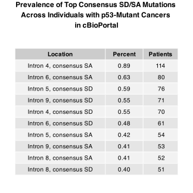

$~$


``` r
top_introns_allp53mut_gridprep <- condformat(p53mutssplice_intronicperpos_pivot_calc %>%
                                      filter(str_detect(Patient, 
                                                        "All with cancer") & Isoform == "yes" & !str_detect(intron_manual, "NA")) %>% 
                                      left_join(., 
                                                p53mutssplice_intronicperpos_pivot %>% 
                                                  dplyr::select(c(intron_manual, 
                                                                  Total)), 
                                                by = "intron_manual") %>% 
                                      arrange(-Calc) %>%
                                      head(10) %>%
                                      mutate(Proportion = plyr::round_any(Calc * 100,
                                                                          0.01)) %>%
                                      dplyr::select(c(Label,
                                                      Proportion,
                                                      Total)) %>%
                                      dplyr::rename(Intron = Label,
                                                    Percent = Proportion,
                                                    Patients = Total)) %>% 
  theme_grob(rows = NULL, 
             theme = ttheme_default(base_size = 10,
                                    core = list(padding = unit(c(15, 4), "mm")))) %>%
  condformat2grob(draw = FALSE)

top_introns_allp53mut_grid <- grid.arrange(top_introns_allp53mut_gridprep,
                                  top = textGrob("Prevalence of Top Intronic Mutations \nAcross Individuals with p53-Mutant Cancers \nin cBioPortal",
                                                 hjust = 0.5,
                                                 gp = gpar(fontface = "bold")))
```

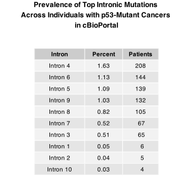

$~$


``` r
# make table of top ATO-rescuable muts in cancers with p53mut
# df_grid <- p53mutsATOpercancerpos_pivot %>% # add num pts to cancer colnames
#   rename_at(vars(3:(ncol(.) 
#                     #- 1
#   )),
#   ~ paste0(.,
#            " (",
#            format(as.numeric(p53mutsATOpercancerpos_pivot[nrow(p53mutsATOpercancerpos_pivot), .]), 
#                   big.mark = ",", 
#                   trim = TRUE),
#            " individuals)")) %>% # divide down each col by last value i.e. total pts
#   mutate(across(where(is.numeric),
#                 ~ .x/last(.x))) %>% 
#   mutate(Label = ifelse(ATO == "yes",
#                         proteinChange,
#                         "Other")) %>%
#   subset(ATO != "Total") %>%
#   #dplyr::select(-Total) %>% 
#   reshape2::melt() %>% 
#   dplyr::rename(Cancer = variable,
#                 Proportion = value)

top_ATO_allp53mut_gridprep <- condformat(pt_ATOperpos_df_ggplot %>%
                                           subset(str_detect(Patient, 
                                                             "All with cancer") & ATO == "yes") %>%
                                      left_join(., 
                                                p53mutsATOperpos_pivot %>% 
                                                  dplyr::select(c(proteinChange, 
                                                                  Total)), 
                                                by = "proteinChange") %>% 
                                      arrange(-Calc) %>%
                                      head(10) %>%
                                      mutate(Proportion = plyr::round_any(Calc * 100,
                                                                          0.01)) %>%
                                      dplyr::select(c(Label,
                                                      Proportion,
                                                      Total)) %>%
                                      dplyr::rename(Mutation = Label,
                                                    Percent = Proportion,
                                                    Patients = Total)) %>% 
  # rule_text_color(Mutation,
  #                 ifelse(Mutation %in% top_ATO_germ_som_cbio_combined,
  #                        "red",
  #                        "")) %>%
  # rule_text_bold(Mutation,
  #                expression = Mutation %in% top_ATO_germ_som_cbio_combined) %>%
  theme_grob(rows = NULL, 
             theme = ttheme_default(base_size = 10,
                                    core = list(padding = unit(c(15, 4), "mm")))) %>%
  condformat2grob(draw = FALSE)

top_ATO_allp53mut_grid <- grid.arrange(top_ATO_allp53mut_gridprep,
                                       top = textGrob("Prevalence of Top ATO-Rescuable Mutations \nAcross Individuals with p53-Mutant Cancers \nin cBioPortal",
                                                      hjust = 0.5,
                                                      gp = gpar(fontface = "bold")))
```

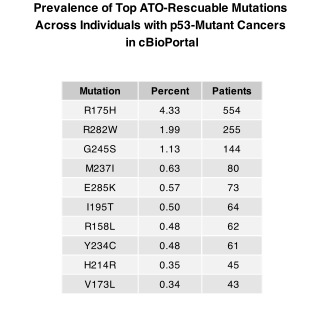

$~$


``` r
top_PAT_allp53mut_gridprep <- condformat(p53mutsPATperpos_pivot_calc %>%
                                           subset(str_detect(Patient, 
                                                             "All with cancer") & PAT == "yes") %>%
                                      left_join(., 
                                                p53mutsPATperpos_pivot %>% 
                                                  dplyr::select(c(proteinChange, 
                                                                  Total)), 
                                                by = "proteinChange") %>% 
                                      arrange(-Calc) %>%
                                      head(10) %>%
                                      mutate(Proportion = plyr::round_any(Calc * 100,
                                                                          0.01)) %>%
                                      dplyr::select(c(Label,
                                                      Proportion,
                                                      Total)) %>%
                                      dplyr::rename(Mutation = Label,
                                                    Percent = Proportion,
                                                    Patients = Total)) %>% 
  # rule_text_color(Mutation,
  #                 ifelse(Mutation %in% top_PAT_germ_som_cbio_combined,
  #                        "red",
  #                        "")) %>%
  # rule_text_bold(Mutation,
  #                expression = Mutation %in% top_PAT_germ_som_cbio_combined) %>%
  theme_grob(rows = NULL, 
             theme = ttheme_default(base_size = 10,
                                    core = list(padding = unit(c(15, 4), "mm")))) %>%
  condformat2grob(draw = FALSE)

top_PAT_allp53mut_grid <- grid.arrange(top_PAT_allp53mut_gridprep,
                                       top = textGrob("Prevalence of Top PAT-Rescuable Mutations \nAcross Individuals with p53-Mutant Cancers \nin cBioPortal",
                                                      hjust = 0.5,
                                                      gp = gpar(fontface = "bold")))
```

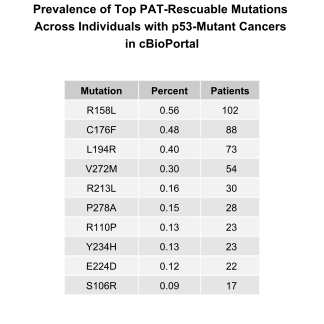

$~$


$~$


$~$


$~$


``` r
# stacked barchart of ATO muts across all somatic cancers
stackedbarchart_ATOtissuesomatic <- ggplot(ATOtissuesomatic_pivot_melted,
                                           aes(x = factor(Cancer,
                                                          levels = (ATOtissuesomatic_pivot_melted %>%
                                                                      subset(ATO == "yes") %>%
                                                                      arrange(-Proportion) %>%
                                                                      pull(Cancer) %>% 
                                                                      unique())),
                                               y = Proportion,
                                               fill = factor(temp,
                                                             levels = c("yes",
                                                                        "subset",
                                                                        "total",
                                                                        "no")))) +
  geom_bar(position = "fill",
           stat = "identity") + 
  ggtitle("Presence of Somatic Mutations in TP53 Rescued by ATO in Individuals with Cancer in cBioPortal") + 
  ylab("Proportion of distinct individuals") +
  xlab("Cancer") +
  labs(fill = "ATO-rescuable") +
  scale_y_continuous(labels = scales::percent_format(), 
                     expand = c(0, 0), 
                     breaks = scales::pretty_breaks(n = 6)) + 
  scale_x_discrete(expand = c(0, 0)) + 
  scale_fill_manual(
    #breaks = c("yes",
    #           "no"),
    labels = c("yes", 
               "yes; subset", 
               "yes; total", 
               "no"),
    values = c("yes" = "skyblue",#"#56B4E9"
               "subset" = "#0072B2",
               "total" = "black",#"#D55E00"
               "no" = "gray90")) +
  theme_classic() + 
  theme(axis.text.x = element_text(angle = 45, 
                                   vjust = 1,
                                   hjust = 1),
        axis.text = element_text(color = "black",
                                 size = 12,
                                 vjust = 0.5), 
        axis.title = element_text(color = "black",
                                  face = "bold",
                                  size = 14),
        axis.title.x = element_text(margin = unit(c(5,0,0,0), units = "mm")),
        axis.title.y = element_text(margin = unit(c(0,5,0,0), units = "mm")),
        plot.title = element_text(hjust = 0.5,
                                  face = "bold",
                                  color = "black",
                                  size = 16,
                                  margin = margin(0,0,5,0, "mm")),
        legend.title = element_text(face = "bold",
                                    size = 14, 
                                    color = "black"),
        legend.text = element_text(size = 12, 
                                   color = "black"),
        plot.margin = margin(2,2,2,50, 
                             unit = "mm")) 
stackedbarchart_ATOtissuesomatic
```

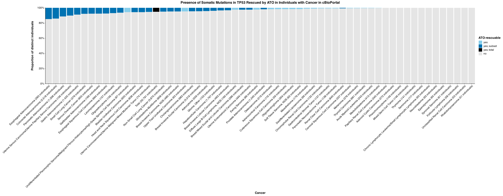

$~$


``` r
# make horiz barchart
stackedbarchart_ATOtissuesomatic_horiz <- ggplot(ATOtissuesomatic_pivot_melted,
                                                 aes(x = factor(Cancer,
                                                                levels = (ATOtissuesomatic_pivot_melted %>%
                                                                            subset(ATO == "yes") %>%
                                                                            arrange(-Proportion) %>%
                                                                            pull(Cancer) %>% 
                                                                            unique())),
                                                     y = Proportion,
                                                     fill = factor(temp,
                                                                   levels = c("yes",
                                                                              "subset",
                                                                              "total",
                                                                              "no")))) +
  geom_bar(position = position_fill(reverse = TRUE),
           stat = "identity") + # add percents of yes to barchart
  geom_text(aes(label = paste0(plyr::round_any(Proportion * 100,
                                               0.1
                                               #,
                                               #f = ceiling
  ),
  "%")),
  position = position_fill(reverse = TRUE),
  color = "black",
  size = 4.5,
  fontface = "bold",
  alpha = 0.5, # level of transparency (lower is more transparent)
  vjust = 0.5,
  hjust = -0.25) +
  ggtitle("Presence of Somatic Mutations in TP53 Rescued by ATO in Individuals with Cancer in cBioPortal") + 
  ylab("Proportion of distinct individuals") +
  xlab("Cancer") +
  labs(fill = "ATO-rescuable") +
  scale_y_continuous(labels = scales::percent_format(), 
                     expand = c(0, 0), 
                     breaks = scales::pretty_breaks(n = 6),
                     position = "right") + 
  scale_x_discrete(expand = c(0, 0),
                   limits = rev) + 
  scale_fill_manual(
    #breaks = c("yes",
    #           "no"),
    labels = c("yes", 
               "yes; subset", 
               "yes; total", 
               "no"),
    values = c("yes" = "skyblue",#"#56B4E9"
               "subset" = "#0072B2",
               "total" = "black",#"#D55E00"
               "no" = "gray90")) +
  theme_classic() + 
  coord_flip(ylim = c(0, ((ATOtissuesomatic_pivot_melted %>% 
                             subset(ATO == "yes") %>% 
                             pull(Proportion) %>% 
                             max() %>% 
                             plyr::round_any(0.1, 
                                             f = ceiling)) * 1.00001))) + # calls coord_cartesian to set axis limits to zoom in on percentages
  theme(axis.text.x = element_text(angle = 0, 
                                   hjust = 0.5), 
        axis.text = element_text(color = "black",
                                 size = 12), 
        axis.title = element_text(color = "black",
                                  face = "bold",
                                  size = 14),
        axis.title.x.top = element_text(margin = unit(c(0,0,10,0), units = "mm")),
        axis.title.y = element_text(margin = unit(c(0,10,0,0), units = "mm")),
        plot.title = element_text(hjust = 0.5,
                                  face = "bold",
                                  color = "black",
                                  size = 16,
                                  margin = margin(0,0,10,0, "mm")),
        legend.text = element_text(color = "black",
                                   size = 12),
        legend.box.spacing = margin(30), # increase space between legend and plot
        legend.justification = "top", # put legend in top right of plot
        legend.title = element_text(color = "black",
                                    face = "bold",
                                    size = 14),
        axis.text.y = element_text(vjust = 0.5))
stackedbarchart_ATOtissuesomatic_horiz
```

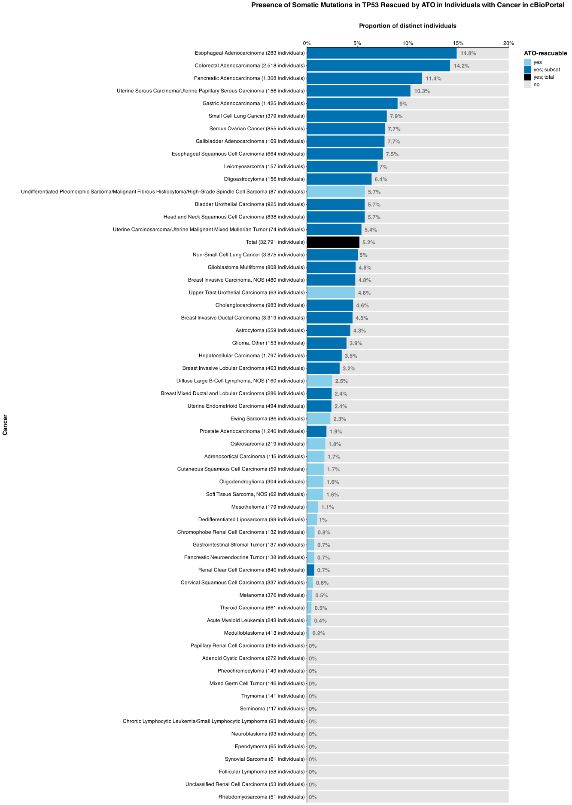

$~$


``` r
# make table of top ato-rescuable muts across all somatic cancers
top_ATO_allsomatic_gridprep <- condformat(pivotdfpos_somatic_melted %>%
                                            subset(str_detect(Cancer, 
                                                              "Total") & Mutation %in% mut_rescued) %>%
                                            arrange(-Proportion) %>%
                                            head(10) %>%
                                            mutate(Proportion = plyr::round_any(Proportion * 100,
                                                                                0.01)) %>%
                                            dplyr::select(c(Mutation,
                                                            Proportion)) %>%
                                            dplyr::rename(Percent = Proportion)) %>% 
  rule_text_color(Mutation,
                  ifelse(Mutation %in% top_ATO_germ_som_cbio_combined,
                         "red",
                         "")) %>%
  rule_text_bold(Mutation,
                 expression = Mutation %in% top_ATO_germ_som_cbio_combined) %>%
  theme_grob(rows = NULL, 
             theme = ttheme_default(base_size = 10,
                                    core = list(padding = unit(c(15, 4), "mm")))) %>%
  condformat2grob(draw = FALSE)

top_ATO_allsomatic_grid <- grid.arrange(top_ATO_allsomatic_gridprep,
                                        top = textGrob("Prevalence of Top ATO-Rescuable Mutations \nAcross Individuals with Cancer \nin cBioPortal",
                                                       hjust = 0.5,
                                                       gp = gpar(fontface = "bold")))
```

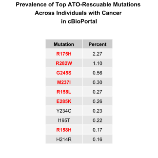

$~$


``` r
# make faceted barchart of top ato-rescuable mut combined germ/som across each somatic cancer
barchart_facet_keyATOpos_cancers_somatic <- ggplot(pivotdfpos_somatic_melted %>% 
                                                     subset(!str_detect(Cancer, 
                                                                        "Total") & Mutation %in% top_ATO_germ_som_cbio_combined),
                                                   aes(x = factor(Cancer,
                                                                  levels = sort(unique(as.vector(pivotdfpos_somatic_melted$Cancer)))[!str_detect(sort(unique(as.vector(pivotdfpos_somatic_melted$Cancer))), 
                                                                                                                                                 "Total")]),
                                                       # factor(Cancer,
                                                       #          levels = c(sort(unique(as.vector(pivotdfpos_somatic_melted$Cancer)))[!str_detect(sort(unique(as.vector(pivotdfpos_somatic_melted$Cancer))), 
                                                       #                                                                                                     "Total")], sort(unique(as.vector(pivotdfpos_somatic_melted$Cancer)))[str_detect(sort(unique(as.vector(pivotdfpos_somatic_melted$Cancer))), 
                                                       #                                                                                                                                                                                               "Total")])),
                                                       y = Proportion,
                                                       fill = factor(Cancer,
                                                                     levels = sort(unique(as.vector(pivotdfpos_somatic_melted$Cancer)))[!str_detect(sort(unique(as.vector(pivotdfpos_somatic_melted$Cancer))), 
                                                                                                                                                    "Total")])
                                                       # factor(Cancer,
                                                       #             levels = c(sort(unique(as.vector(pivotdfpos_somatic_melted$Cancer)))[!str_detect(sort(unique(as.vector(pivotdfpos_somatic_melted$Cancer))), 
                                                       #                                                                                                        "Total")], sort(unique(as.vector(pivotdfpos_somatic_melted$Cancer)))[str_detect(sort(unique(as.vector(pivotdfpos_somatic_melted$Cancer))), 
                                                       #                                                                                                                                                                                                  "Total")]))
                                                   )) + 
  geom_bar(stat = "identity", 
           position = position_dodge2()) + # to keep some space b/t barcharts in same mut
  geom_text(aes(label = paste0(plyr::round_any(Proportion * 100, 
                                               0.1),
                               "%")),
            color = "black",
            size = 3.5,
            fontface = "bold",
            alpha = 0.75, # level of transparency (lower is more transparent)
            vjust = -0.5,
            hjust = 0.5) +
  xlab("Cancer") +
  ylab("Proportion of distinct individuals") +
  labs(fill = "Cancer") + 
  ggtitle("Proportion of ATO-Rescuable Mutations in TP53 in Individuals with Cancer") + # different facet_wrap function which allows conditional strip i.e. facet formatting
  facet_wrap2(. ~ factor(Mutation,
                         levels = top_ATO_germ_som_cbio_combined[order(abs(parse_number(top_ATO_germ_som_cbio_combined)))]), # order by codon number so that colors match
              ncol = 2,
              strip = conditional_strips_ATO,
              trim_blank = FALSE, # leave blank plots where muts not in dataset
              axes = "all", # show internal axes but without x labels
              remove_labels = "x", # show internal axes but without x labels
              drop = FALSE) + # ensure muts not in dataset still shown as blanks
  scale_y_continuous(labels = scales::percent_format(), 
                     expand = c(0,0), 
                     breaks = scales::pretty_breaks(n = 5), 
                     limits = c(0, ((pivotdfpos_somatic_melted %>% 
                                       subset(!str_detect(Cancer, 
                                                          "Total") & Mutation %in% top_ATO_germ_som_cbio_combined) %>% 
                                       pull(Proportion) %>% 
                                       na.omit() %>%
                                       max() %>%
                                       plyr::round_any(0.12, 
                                                       f = ceiling)) * 1.000001))) +
  scale_x_discrete(
    #limits = rev, 
    expand = c(0,0),
    drop = FALSE) + # ensure muts not in dataset are still shown as blanks
  scale_fill_manual(values = c("darkslateblue",
                               "#5a1500",
                               "#c4379f",
                               "limegreen",
                               "#84007e",
                               "#4342b3",
                               "#ff8ea5",
                               "#7e9900",
                               "#50006c",
                               "#ada9ff",
                               "#e03e97",
                               "skyblue",
                               "lightpink",
                               "#930002",
                               "#ba0069",
                               "lightblue1",
                               "dodgerblue",
                               "#ffa4d8",
                               "#006f17",
                               "lavender",
                               "hotpink",
                               "slategray2",
                               "#420f48",
                               "#eea52d",
                               "darkgray",
                               "#6294ff",
                               "#cade66",
                               "#02e9c7",
                               "#806300",
                               "#004584",
                               "lightgreen",
                               "navajowhite2",
                               "lightcyan2",
                               "magenta",
                               "black",
                               "#ff865d",
                               "#007e3e",
                               "#eea3ff",
                               "#630021",
                               "#002670",
                               "mediumseagreen",
                               "olivedrab2",
                               "lightsteelblue2",
                               "#a44c00",
                               "#d388be",
                               "sandybrown",
                               "springgreen",
                               "#ebd386",
                               "red",
                               "paleturquoise",
                               "wheat3",
                               "thistle1",
                               "yellow2",
                               "yellowgreen",
                               "steelblue",
                               "tan",
                               "#ff7f7d",
                               "#62742e",
                               "gray80")) +
  guides(fill = guide_legend(ncol = 1)) +
  theme_classic() + 
  theme(axis.text.x = element_text(angle = 45, 
                                   hjust = 1, 
                                   vjust = 1), 
        axis.text = element_text(color = "black",
                                 size = 12), 
        axis.title = element_text(color = "black",
                                  face = "bold",
                                  size = 14),
        axis.title.x = element_text(margin = unit(c(10,0,0,0), units = "mm")),
        axis.title.y = element_text(margin = unit(c(0,10,0,0), units = "mm")),
        plot.title = element_text(hjust = 0.5,
                                  face = "bold",
                                  color = "black",
                                  size = 16,
                                  margin = margin(0,0,10,0, "mm")),
        legend.text = element_text(color = "black",
                                   size = 12),
        legend.title = element_text(color = "black",
                                    face = "bold",
                                    size = 14),
        legend.box.spacing = margin(30), # increase space between legend and plot
        legend.margin = margin(0,5,0,0, unit = "mm"),
        legend.justification = "top", # put legend in top right of plot
        #legend.position = c(,), # c(0,0) bottom left, c(1,1) top-right within plot
        strip.background = element_blank(),
        strip.text = element_text(color = "black",
                                  size = 14,
                                  face = "bold",
                                  margin = margin(10,0,10,0, "mm")),
        panel.spacing.x = unit(5, "lines"),
        panel.spacing.y = unit(-30, "lines"),
        plot.margin = margin(0,5,0,35, unit = "mm"))
barchart_facet_keyATOpos_cancers_somatic
```

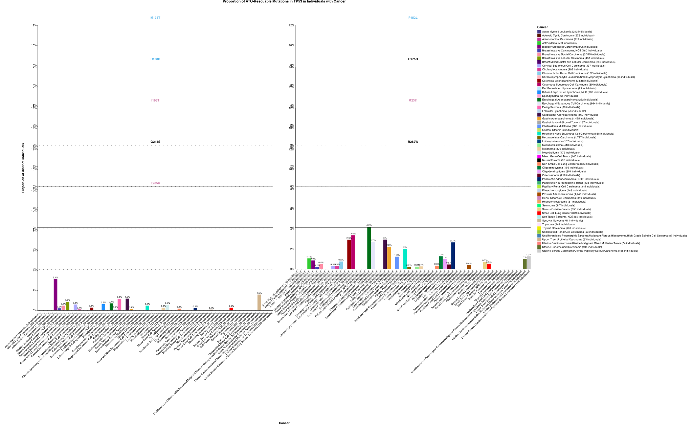

$~$


``` r
# make barchart and horiz barchart of each cancer in clindatacombined, with subset i.e. cancers with at least 50 pts in p53muts used for all analyses marked as dark blue
df_to_plot <- pivotdf %>%
  mutate(Prop = Total/last(Total)) %>%
  subset(CANCER_TYPE_DETAILED != "Total") %>%
  mutate(Cancer = paste0(CANCER_TYPE_DETAILED,
                         " (",
                         format(Total, 
                                big.mark = ",", 
                                trim = TRUE),
                         " individuals)")) %>%
  mutate(Cancer = ifelse(Total == 1,
                         gsub("individuals",
                              "individual",
                              Cancer),
                         Cancer)) %>% 
  mutate(color_label = ifelse(gsub(" \\(.*",
                                   "",
                                   Cancer) %in% gsub(" \\(.*",
                                                     "",
                                                     pivotdfnobottomtotal100muts$CANCER_TYPE_DETAILED),
                              "subset",
                              "cancer")) %>%
  dplyr::select(c(Cancer,
                  Total,
                  Prop,
                  color_label))

# barchart
justify_p53mut_cancer_prevalence_barchart <- ggplot(df_to_plot,
                                                    aes(x = factor(Cancer,
                                                                   levels = unique(df_to_plot$Cancer)),
                                                        y = Prop,
                                                        fill = relevel(as.factor(color_label),
                                                                       ref = "subset"))) + 
  geom_bar(position = position_dodge2(), 
           stat = "identity") + 
  ggtitle("Proportion of Cancers in Individuals with Somatic Mutations in TP53") + 
  xlab("Cancer") +
  ylab("Proportion of distinct individuals") +
  labs(fill = "Type") +
  scale_y_continuous(labels = scales::percent_format(), 
                     expand = c(0,0), 
                     breaks = scales::pretty_breaks(n = 5),
                     limits = c(0, plyr::round_any(max(df_to_plot$Prop),
                                                   0.1,
                                                   f = ceiling) * 1.0000001)) +
  scale_x_discrete(expand = c(0,0)) +
  scale_fill_manual(values = c("#0072B2",
                               "skyblue")) +
  theme_classic() + 
  theme(axis.text.x = element_text(angle = 45, 
                                   hjust = 1, 
                                   vjust = 1), 
        axis.text = element_text(color = "black",
                                 size = 12), 
        axis.title = element_text(color = "black",
                                  face = "bold",
                                  size = 14),
        axis.title.x = element_text(margin = unit(c(10,0,0,0), units = "mm")),
        axis.title.y = element_text(margin = unit(c(0,10,0,0), units = "mm")),
        plot.title = element_text(hjust = 0.5,
                                  face = "bold",
                                  color = "black",
                                  size = 16,
                                  margin = margin(0,0,10,0, "mm")),
        legend.text = element_text(color = "black",
                                   size = 12),
        legend.title = element_text(color = "black",
                                    face = "bold",
                                    size = 14),
        plot.margin = margin(0,0,0,50, "mm"))
justify_p53mut_cancer_prevalence_barchart
```

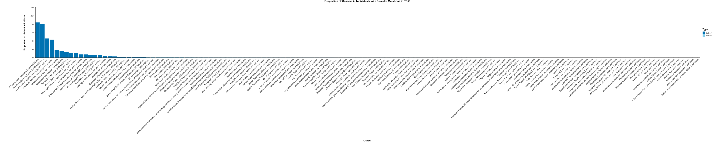

$~$


``` r
# horiz barchart
justify_p53mut_cancer_prevalence_barchart_horiz <- ggplot(df_to_plot,
                                                          aes(x = factor(Cancer,
                                                                         levels = unique(df_to_plot$Cancer)),
                                                              y = Prop,
                                                              fill = relevel(as.factor(color_label),
                                                                             ref = "subset"))) + 
  geom_bar(position = position_dodge2(),
           stat = "identity") +
  geom_text(aes(label = paste0(plyr::round_any(Prop * 100,
                                               0.1
                                               #,
                                               #f = ceiling
  ),
  "%")),
  position = position_dodge2(),
  color = "black",
  size = 4.5,
  fontface = "bold",
  alpha = 0.5, # level of transparency (lower is more transparent)
  vjust = 0.5,
  hjust = -0.25) +
  ggtitle("Proportion of Cancers in Individuals with Somatic Mutations in TP53") + 
  xlab("Cancer") +
  ylab("Proportion of distinct individuals") +
  labs(fill = "Type") +
  scale_y_continuous(labels = scales::percent_format(), 
                     expand = c(0,0), 
                     breaks = scales::pretty_breaks(n = 5),
                     position = "right") +
  scale_x_discrete(expand = c(0,0),
                   limits = rev) +
  scale_fill_manual(values = c("#0072B2",
                               "skyblue")) +
  theme_classic() + 
  coord_flip(ylim = c(0, plyr::round_any(max(df_to_plot$Prop),
                                         0.1,
                                         f = ceiling) * 1.0000001)) + # calls coord_cartesian to set axis limits to zoom in on percentages
  theme(axis.text.x = element_text(angle = 0, 
                                   hjust = 0.5), 
        axis.text = element_text(color = "black",
                                 size = 12), 
        axis.title = element_text(color = "black",
                                  face = "bold",
                                  size = 14),
        axis.title.x.top = element_text(margin = unit(c(0,0,10,0), units = "mm")),
        axis.title.y = element_text(margin = unit(c(0,10,0,0), units = "mm")),
        plot.title = element_text(hjust = 0.5,
                                  face = "bold",
                                  color = "black",
                                  size = 16,
                                  margin = margin(0,0,10,0, "mm")),
        legend.box.spacing = margin(30),
        legend.justification = "top", # put legend in top right of plot
        legend.text = element_text(color = "black",
                                   size = 12),
        legend.title = element_text(color = "black",
                                    face = "bold",
                                    size = 14),
        axis.text.y = element_text(vjust = 0.5))
justify_p53mut_cancer_prevalence_barchart_horiz
```

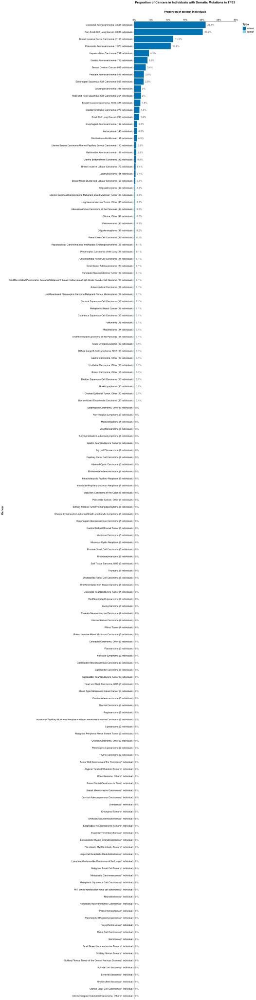

$~$


``` r
# make barchart and horiz barchart of each cancer in p53muts, with subset i.e. cancers with at least 50 pts in p53muts used for all analyses marked as dark blue
df_to_plot <- pivotdf_muttissuesomatic %>%
  mutate(Prop = Total/last(Total)) %>%
  subset(CANCER_TYPE_DETAILED != "Total") %>%
  mutate(Cancer = paste0(CANCER_TYPE_DETAILED,
                         " (",
                         format(Total, 
                                big.mark = ",", 
                                trim = TRUE),
                         " individuals)")) %>%
  mutate(Cancer = ifelse(Total == 1,
                         gsub("individuals",
                              "individual",
                              Cancer),
                         Cancer)) %>% 
  mutate(color_label = ifelse(gsub(" \\(.*",
                                   "",
                                   Cancer) %in% gsub(" \\(.*",
                                                     "",
                                                     pivotdfnobottomtotal100muts$CANCER_TYPE_DETAILED),
                              "subset",
                              "cancer")) %>%
  dplyr::select(c(Cancer,
                  Total,
                  Prop,
                  color_label))

# barchart
justify_clindata_cancer_prevalence_barchart <- ggplot(df_to_plot,
                                                      aes(x = factor(Cancer,
                                                                     levels = unique(df_to_plot$Cancer)),
                                                          y = Prop,
                                                          fill = relevel(as.factor(color_label),
                                                                         ref = "subset"))) + 
  geom_bar(position = position_dodge2(), 
           stat = "identity") + 
  ggtitle("Proportion of Cancers in Individuals with Somatic Cancers") + 
  xlab("Cancer") +
  ylab("Proportion of distinct individuals") +
  labs(fill = "Type") +
  scale_y_continuous(labels = scales::percent_format(), 
                     expand = c(0,0), 
                     breaks = scales::pretty_breaks(n = 5),
                     limits = c(0, plyr::round_any(max(df_to_plot$Prop),
                                                   0.05,
                                                   f = ceiling) * 1.0000001)) +
  scale_x_discrete(expand = c(0,0)) +
  scale_fill_manual(values = c("#0072B2",
                               "skyblue")) +
  theme_classic() + 
  theme(axis.text.x = element_text(angle = 45, 
                                   hjust = 1, 
                                   vjust = 1), 
        axis.text = element_text(color = "black",
                                 size = 12), 
        axis.title = element_text(color = "black",
                                  face = "bold",
                                  size = 14),
        axis.title.x = element_text(margin = unit(c(10,0,0,0), units = "mm")),
        axis.title.y = element_text(margin = unit(c(0,10,0,0), units = "mm")),
        plot.title = element_text(hjust = 0.5,
                                  face = "bold",
                                  color = "black",
                                  size = 16,
                                  margin = margin(0,0,10,0, "mm")),
        legend.text = element_text(color = "black",
                                   size = 12),
        legend.title = element_text(color = "black",
                                    face = "bold",
                                    size = 14),
        plot.margin = margin(0,0,0,50, "mm"))
justify_clindata_cancer_prevalence_barchart
```

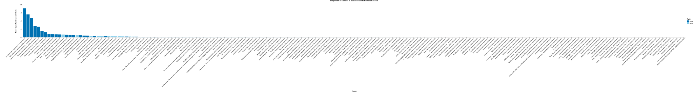

$~$


``` r
# horiz barchart
justify_clindata_cancer_prevalence_barchart_horiz <- ggplot(df_to_plot,
                                                            aes(x = factor(Cancer,
                                                                           levels = unique(df_to_plot$Cancer)),
                                                                y = Prop,
                                                                fill = relevel(as.factor(color_label),
                                                                               ref = "subset"))) + 
  geom_bar(position = position_dodge2(),
           stat = "identity") +
  geom_text(aes(label = paste0(plyr::round_any(Prop * 100,
                                               0.1
                                               #,
                                               #f = ceiling
  ),
  "%")),
  position = position_dodge2(),
  color = "black",
  size = 4.5,
  fontface = "bold",
  alpha = 0.5, # level of transparency (lower is more transparent)
  vjust = 0.5,
  hjust = -0.25) +
  ggtitle("Proportion of Cancers in Individuals with Somatic Cancers") + 
  xlab("Cancer") +
  ylab("Proportion of distinct individuals") +
  labs(fill = "Type") +
  scale_y_continuous(labels = scales::percent_format(), 
                     expand = c(0,0), 
                     breaks = scales::pretty_breaks(n = 5),
                     position = "right") +
  scale_x_discrete(expand = c(0,0),
                   limits = rev) +
  scale_fill_manual(values = c("#0072B2",
                               "skyblue")) +
  theme_classic() + 
  coord_flip(ylim = c(0, plyr::round_any(max(df_to_plot$Prop),
                                         0.05,
                                         f = ceiling) * 1.0000001)) + # calls coord_cartesian to set axis limits to zoom in on percentages
  theme(axis.text.x = element_text(angle = 0, 
                                   hjust = 0.5), 
        axis.text = element_text(color = "black",
                                 size = 12), 
        axis.title = element_text(color = "black",
                                  face = "bold",
                                  size = 14),
        axis.title.x.top = element_text(margin = unit(c(0,0,10,0), units = "mm")),
        axis.title.y = element_text(margin = unit(c(0,10,0,0), units = "mm")),
        plot.title = element_text(hjust = 0.5,
                                  face = "bold",
                                  color = "black",
                                  size = 16,
                                  margin = margin(0,0,10,0, "mm")),
        legend.box.spacing = margin(30),
        legend.justification = "top", # put legend in top right of plot
        legend.text = element_text(color = "black",
                                   size = 12),
        legend.title = element_text(color = "black",
                                    face = "bold",
                                    size = 14),
        axis.text.y = element_text(vjust = 0.5))
justify_clindata_cancer_prevalence_barchart_horiz
```

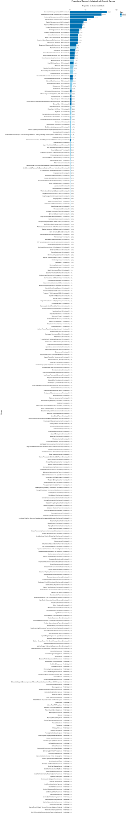

$~$


$~$


$~$


$~$


$~$

# **Drawing Heatmaps** {#heatmaps}

$~$


``` r
# #draw complexheatmaps, two pairs without and with cancer clustering for samples or total muts
# x <- scale(x) # scale and center columns
# x <- t(scale(t(x))) # scale and center rows

complexhm_totalmuts <- ComplexHeatmap::Heatmap(t(scale(t(pos_matrix_ordered_totalmuts))),
                                               col = circlize::colorRamp2(c(plyr::round_any(min(t(scale(t(pos_matrix_ordered_totalmuts))), na.rm = TRUE), 0.1, f = floor),
                                                                            0,
                                                                            plyr::round_any(max(t(scale(t(pos_matrix_ordered_totalmuts))), na.rm = TRUE), 0.1, f = ceiling)),
                                                                          c("lavender", 
                                                                            "white",
                                                                            "red")),
                                               name = "Row Z-Score",
                                               na_col = "white",
                                               row_names_side = "left",
                                               column_names_side = "top",
                                               row_dend_side = "left",
                                               column_dend_side = "top",
                                               clustering_distance_rows = "euclidean",
                                               clustering_method_rows = "complete",
                                               clustering_distance_columns = "euclidean",
                                               clustering_method_columns = "complete",
                                               column_title = "Mutations in Individuals with Cancer and Somatic p53 Mutations in cBioPortal, ≥ 1% proportion",
                                               column_title_side = "top",
                                               column_title_gp = gpar(fontface = "bold"),
                                               row_names_gp = gpar(fontsize = 10),
                                               row_names_max_width = max_text_width(
                                                 rownames(pos_matrix_ordered_totalmuts), 
                                                 gp = gpar(fontsize = 10)),
                                               column_names_gp = gpar(fontsize = 10),
                                               top_annotation = column_ha_2,
                                               left_annotation = row_ha_2,
                                               heatmap_legend_param = list(at = c(plyr::round_any(min(t(scale(t(pos_matrix_ordered_totalmuts))), na.rm = TRUE), 0.1, f = floor), 
                                                                                  0, plyr::round_any(max(t(scale(t(pos_matrix_ordered_totalmuts))), na.rm = TRUE), 0.1, f = ceiling))
                                               ))
draw(complexhm_totalmuts,
     heatmap_legend_side = "bottom",
     annotation_legend_side = "bottom",
     legend_grouping = "original",
     merge_legend = TRUE)
```

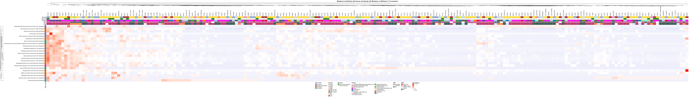

$~$


$~$

# **Drawing Alluvial Plots (all old now)** {#alluvialplots .hidden .unlisted .unnumbered}

$~$


$~$


$~$


$~$


$~$


$~$


$~$


$~$


$~$


$~$


$~$


$~$


$~$


$~$


$~$


$~$


$~$


$~$


$~$


$~$


$~$


$~$


$~$


$~$


$~$


$~$


$~$


$~$


$~$


$~$


$~$


$~$


$~$


$~$


$~$


$~$


$~$

# **Other Old Plots** {#oldplots .hidden .unlisted .unnumbered}

$~$


$~$


$~$


$~$


$~$


$~$


$~$


$~$


$~$


$~$


$~$


$~$


$~$


$~$


$~$


$~$


$~$


$~$


$~$


$~$


$~$


$~$


$~$


$~$


$~$


$~$


$~$


$~$


$~$


$~$


$~$


$~$


$~$


$~$


$~$

# **Session Info** {#sessioninfo}

$~$

Here is the R version used and all packages loaded for analysis (indicated as an asterisk).

$~$


``` r
devtools::session_info()
```

```
─ Session info ───────────────────────────────────────────────────────────────
 setting  value
 version  R version 4.5.2 (2025-10-31 ucrt)
 os       Windows 11 x64 (build 26200)
 system   x86_64, mingw32
 ui       RTerm
 language (EN)
 collate  English_United States.utf8
 ctype    English_United States.utf8
 tz       America/Chicago
 date     2025-12-26
 pandoc   3.6.3 @ C:/Program Files/RStudio/resources/app/bin/quarto/bin/tools/ (via rmarkdown)
 quarto   1.7.32 @ C:\\PROGRA~1\\RStudio\\RESOUR~1\\app\\bin\\quarto\\bin\\quarto.exe

─ Packages ───────────────────────────────────────────────────────────────────
 package              * version    date (UTC) lib source
 abind                  1.4-8      2024-09-12 [1] CRAN (R 4.5.0)
 AnnotationDbi          1.72.0     2025-10-29 [1] https://bioc-release.r-universe.dev (R 4.5.2)
 AnVIL                * 1.22.3     2025-12-11 [1] https://bioc-release.r-universe.dev (R 4.5.2)
 AnVILBase            * 1.4.0      2025-10-29 [1] https://bioc-release.r-universe.dev (R 4.5.2)
 askpass                1.2.1      2024-10-04 [1] CRAN (R 4.5.0)
 backports              1.5.0      2024-05-23 [1] CRAN (R 4.5.0)
 Biobase              * 2.70.0     2025-10-29 [1] https://bioc-release.r-universe.dev (R 4.5.2)
 BiocBaseUtils          1.12.0     2025-10-29 [1] https://bioc-release.r-universe.dev (R 4.5.2)
 BiocFileCache          3.0.0      2025-10-29 [1] https://bioc-release.r-universe.dev (R 4.5.2)
 BiocGenerics         * 0.56.0     2025-10-29 [1] https://bioc-release.r-universe.dev (R 4.5.2)
 BiocIO                 1.20.0     2025-10-29 [1] https://bioc-release.r-universe.dev (R 4.5.2)
 BiocManager          * 1.30.27    2025-11-14 [1] CRAN (R 4.5.2)
 BiocParallel           1.44.0     2025-10-29 [1] https://bioc-release.r-universe.dev (R 4.5.2)
 Biostrings             2.78.0     2025-10-29 [1] https://bioc-release.r-universe.dev (R 4.5.2)
 bit                    4.6.0      2025-03-06 [1] CRAN (R 4.5.0)
 bit64                  4.6.0-1    2025-01-16 [1] CRAN (R 4.5.0)
 bitops                 1.0-9      2024-10-03 [1] CRAN (R 4.5.0)
 blob                   1.2.4      2023-03-17 [1] CRAN (R 4.5.0)
 bookdown               0.46       2025-12-05 [1] CRAN (R 4.5.2)
 broom                  1.0.11     2025-12-04 [1] CRAN (R 4.5.2)
 bslib                  0.9.0      2025-01-30 [1] CRAN (R 4.5.0)
 cachem                 1.1.0      2024-05-16 [1] CRAN (R 4.5.0)
 Cairo                  1.7-0      2025-10-29 [1] CRAN (R 4.5.2)
 car                    3.1-3      2024-09-27 [1] CRAN (R 4.5.0)
 carData                3.0-5      2022-01-06 [1] CRAN (R 4.5.0)
 cards                  0.7.1      2025-12-02 [1] CRAN (R 4.5.2)
 cardx                  0.3.1      2025-12-04 [1] CRAN (R 4.5.2)
 cBioPortalData       * 2.22.1     2025-11-07 [1] https://bioc-release.r-universe.dev (R 4.5.2)
 cbioportalR          * 1.1.1      2024-11-20 [1] CRAN (R 4.5.1)
 checkmate              2.3.3      2025-08-18 [1] CRAN (R 4.5.1)
 chromote               0.5.1      2025-04-24 [1] CRAN (R 4.5.2)
 cigarillo              1.0.0      2025-10-29 [1] https://bioc-release.r-universe.dev (R 4.5.2)
 circlize               0.4.17     2025-12-08 [1] CRAN (R 4.5.2)
 cli                    3.6.5      2025-04-23 [1] CRAN (R 4.5.0)
 clue                   0.3-66     2024-11-13 [1] CRAN (R 4.5.0)
 cluster                2.1.8.1    2025-03-12 [2] CRAN (R 4.5.2)
 codetools              0.2-20     2024-03-31 [2] CRAN (R 4.5.2)
 colorspace             2.1-2      2025-09-22 [1] CRAN (R 4.5.1)
 commonmark             2.0.0      2025-07-07 [1] CRAN (R 4.5.1)
 ComplexHeatmap       * 2.26.0     2025-10-29 [1] https://bioc-release.r-universe.dev (R 4.5.2)
 condformat           * 0.10.1     2023-10-08 [1] CRAN (R 4.5.0)
 cowplot              * 1.2.0      2025-07-07 [1] CRAN (R 4.5.1)
 crayon                 1.5.3      2024-06-20 [1] CRAN (R 4.5.0)
 curl                   7.0.0      2025-08-19 [1] CRAN (R 4.5.1)
 data.table             1.17.8     2025-07-10 [1] CRAN (R 4.5.1)
 DBI                    1.2.3      2024-06-02 [1] CRAN (R 4.5.0)
 dbplyr                 2.5.1      2025-09-10 [1] CRAN (R 4.5.1)
 DelayedArray           0.36.0     2025-10-29 [1] https://bioc-release.r-universe.dev (R 4.5.2)
 devEMF                 4.5-1      2025-03-24 [1] CRAN (R 4.5.0)
 devtools             * 2.4.6      2025-10-03 [1] CRAN (R 4.5.1)
 digest                 0.6.39     2025-11-19 [1] CRAN (R 4.5.2)
 doParallel             1.0.17     2022-02-07 [1] CRAN (R 4.5.0)
 dplyr                * 1.1.4      2023-11-17 [1] CRAN (R 4.5.0)
 DT                     0.34.0     2025-09-02 [1] CRAN (R 4.5.1)
 editData               0.1.8      2021-04-02 [1] CRAN (R 4.5.0)
 ellipsis               0.3.2      2021-04-29 [1] CRAN (R 4.5.0)
 evaluate               1.0.5      2025-08-27 [1] CRAN (R 4.5.1)
 farver                 2.1.2      2024-05-13 [1] CRAN (R 4.5.0)
 fastmap                1.2.0      2024-05-15 [1] CRAN (R 4.5.0)
 filelock               1.0.3      2023-12-11 [1] CRAN (R 4.5.1)
 flextable              0.9.10     2025-08-24 [1] CRAN (R 4.5.1)
 fontBitstreamVera      0.1.1      2017-02-01 [1] CRAN (R 4.5.0)
 fontLiberation         0.1.0      2016-10-15 [1] CRAN (R 4.5.0)
 fontquiver             0.2.1      2017-02-01 [1] CRAN (R 4.5.0)
 forcats              * 1.0.1      2025-09-25 [1] CRAN (R 4.5.1)
 foreach                1.5.2      2022-02-02 [1] CRAN (R 4.5.0)
 formatR                1.14       2023-01-17 [1] CRAN (R 4.5.0)
 Formula                1.2-5      2023-02-24 [1] CRAN (R 4.5.0)
 fs                     1.6.6      2025-04-12 [1] CRAN (R 4.5.0)
 futile.logger          1.4.3      2016-07-10 [1] CRAN (R 4.5.0)
 futile.options         1.0.1      2018-04-20 [1] CRAN (R 4.5.0)
 GCPtools               1.0.0      2025-10-29 [1] https://bioc-release.r-universe.dev (R 4.5.2)
 gdtools                0.4.4      2025-10-06 [1] CRAN (R 4.5.1)
 generics             * 0.1.4      2025-05-09 [1] CRAN (R 4.5.0)
 GenomeInfoDb           1.46.2     2025-12-04 [1] https://bioc-release.r-universe.dev (R 4.5.2)
 GenomicAlignments      1.46.0     2025-10-29 [1] https://bioc-release.r-universe.dev (R 4.5.2)
 GenomicDataCommons     1.34.1     2025-11-07 [1] https://bioc-release.r-universe.dev (R 4.5.2)
 GenomicFeatures        1.62.0     2025-10-29 [1] https://bioc-release.r-universe.dev (R 4.5.2)
 GenomicRanges        * 1.62.1     2025-12-08 [1] https://bioc-release.r-universe.dev (R 4.5.2)
 GetoptLong             1.1.0      2025-11-28 [1] CRAN (R 4.5.2)
 ggalluvial           * 0.12.5     2023-02-22 [1] CRAN (R 4.5.2)
 ggforce                0.5.0      2025-06-18 [1] CRAN (R 4.5.0)
 ggh4x                * 0.3.1      2025-05-30 [1] CRAN (R 4.5.2)
 ggplot2              * 4.0.1      2025-11-14 [1] CRAN (R 4.5.2)
 ggpubr                 0.6.2      2025-10-17 [1] CRAN (R 4.5.1)
 ggsignif               0.6.4      2022-10-13 [1] CRAN (R 4.5.0)
 GlobalOptions          0.1.3      2025-11-28 [1] CRAN (R 4.5.2)
 glue                   1.8.0      2024-09-30 [1] CRAN (R 4.5.0)
 gridExtra            * 2.3        2017-09-09 [1] CRAN (R 4.5.0)
 gt                   * 1.2.0      2025-12-16 [1] CRAN (R 4.5.2)
 gtable                 0.3.6      2024-10-25 [1] CRAN (R 4.5.0)
 gtsummary            * 2.5.0      2025-12-05 [1] CRAN (R 4.5.2)
 hms                    1.1.4      2025-10-17 [1] CRAN (R 4.5.1)
 htmlTable              2.4.3      2024-07-21 [1] CRAN (R 4.5.0)
 htmltools              0.5.9      2025-12-04 [1] CRAN (R 4.5.2)
 htmlwidgets            1.6.4      2023-12-06 [1] CRAN (R 4.5.0)
 httpuv                 1.6.16     2025-04-16 [1] CRAN (R 4.5.0)
 httr                   1.4.7      2023-08-15 [1] CRAN (R 4.5.0)
 httr2                  1.2.2      2025-12-08 [1] CRAN (R 4.5.2)
 insight                1.4.4      2025-12-06 [1] CRAN (R 4.5.2)
 IRanges              * 2.44.0     2025-10-29 [1] https://bioc-release.r-universe.dev (R 4.5.2)
 iterators              1.0.14     2022-02-05 [1] CRAN (R 4.5.0)
 janitor              * 2.2.1      2024-12-22 [1] CRAN (R 4.5.0)
 jquerylib              0.1.4      2021-04-26 [1] CRAN (R 4.5.0)
 jsonlite               2.0.0      2025-03-27 [1] CRAN (R 4.5.0)
 KEGGREST               1.50.0     2025-10-29 [1] https://bioc-release.r-universe.dev (R 4.5.2)
 knitr                * 1.51       2025-12-20 [1] CRAN (R 4.5.2)
 labeling               0.4.3      2023-08-29 [1] CRAN (R 4.5.0)
 lambda.r               1.2.4      2019-09-18 [1] CRAN (R 4.5.0)
 later                  1.4.4      2025-08-27 [1] CRAN (R 4.5.1)
 lattice                0.22-7     2025-04-02 [1] CRAN (R 4.5.0)
 lazyeval               0.2.2      2019-03-15 [1] CRAN (R 4.5.0)
 lifecycle              1.0.4      2023-11-07 [1] CRAN (R 4.5.0)
 litedown               0.9        2025-12-18 [1] CRAN (R 4.5.2)
 lmtest                 0.9-40     2022-03-21 [1] CRAN (R 4.5.0)
 lubridate            * 1.9.4      2024-12-08 [1] CRAN (R 4.5.0)
 magrittr               2.0.4      2025-09-12 [1] CRAN (R 4.5.1)
 markdown               2.0        2025-03-23 [1] CRAN (R 4.5.0)
 MASS                   7.3-65     2025-02-28 [2] CRAN (R 4.5.2)
 Matrix                 1.7-4      2025-08-28 [1] CRAN (R 4.5.1)
 MatrixGenerics       * 1.22.0     2025-10-29 [1] https://bioc-release.r-universe.dev (R 4.5.2)
 matrixStats          * 1.5.0      2025-01-07 [1] CRAN (R 4.5.0)
 memoise                2.0.1      2021-11-26 [1] CRAN (R 4.5.0)
 mime                   0.13       2025-03-17 [1] CRAN (R 4.5.0)
 miniUI                 0.1.2      2025-04-17 [1] CRAN (R 4.5.0)
 mnormt                 2.1.1      2022-09-26 [1] CRAN (R 4.5.0)
 moonBook               0.3.1      2022-01-05 [1] CRAN (R 4.5.0)
 MultiAssayExperiment * 1.36.1     2025-11-17 [1] https://bioc-release.r-universe.dev (R 4.5.2)
 nlme                   3.1-168    2025-03-31 [2] CRAN (R 4.5.2)
 officer                0.7.2      2025-12-04 [1] CRAN (R 4.5.2)
 openssl                2.3.4      2025-09-30 [1] CRAN (R 4.5.1)
 openxlsx               4.2.8.1    2025-10-31 [1] CRAN (R 4.5.2)
 otel                   0.2.0      2025-08-29 [1] CRAN (R 4.5.1)
 pacman               * 0.5.1      2019-03-11 [1] CRAN (R 4.5.0)
 pillar                 1.11.1     2025-09-17 [1] CRAN (R 4.5.1)
 pivottabler          * 1.5.6      2025-04-22 [1] CRAN (R 4.5.1)
 pkgbuild               1.4.8      2025-05-26 [1] CRAN (R 4.5.0)
 pkgconfig              2.0.3      2019-09-22 [1] CRAN (R 4.5.0)
 pkgload                1.4.1      2025-09-23 [1] CRAN (R 4.5.1)
 plotly               * 4.11.0     2025-06-19 [1] CRAN (R 4.5.0)
 plyr                   1.8.9      2023-10-02 [1] CRAN (R 4.5.0)
 png                    0.1-8      2022-11-29 [1] CRAN (R 4.5.0)
 polyclip               1.10-7     2024-07-23 [1] CRAN (R 4.5.0)
 processx               3.8.6      2025-02-21 [1] CRAN (R 4.5.0)
 promises               1.5.0      2025-11-01 [1] CRAN (R 4.5.2)
 ps                     1.9.1      2025-04-12 [1] CRAN (R 4.5.0)
 psych                  2.5.6      2025-06-23 [1] CRAN (R 4.5.0)
 purrr                * 1.2.0      2025-11-04 [1] CRAN (R 4.5.2)
 R6                     2.6.1      2025-02-15 [1] CRAN (R 4.5.0)
 ragg                   1.5.0      2025-09-02 [1] CRAN (R 4.5.1)
 RaggedExperiment       1.34.0     2025-10-29 [1] https://bioc-release.r-universe.dev (R 4.5.2)
 rapiclient             0.1.8      2024-09-30 [1] CRAN (R 4.5.1)
 rappdirs               0.3.3      2021-01-31 [1] CRAN (R 4.5.0)
 RColorBrewer         * 1.1-3      2022-04-03 [1] CRAN (R 4.5.0)
 Rcpp                   1.1.0      2025-07-02 [1] CRAN (R 4.5.1)
 RCurl                  1.98-1.17  2025-03-22 [1] CRAN (R 4.5.0)
 readr                * 2.1.6      2025-11-14 [1] CRAN (R 4.5.2)
 remotes                2.5.0      2024-03-17 [1] CRAN (R 4.5.0)
 reshape2             * 1.4.5      2025-11-12 [1] CRAN (R 4.5.2)
 restfulr               0.0.16     2025-06-27 [1] CRAN (R 4.5.1)
 rio                    1.2.4      2025-09-26 [1] CRAN (R 4.5.1)
 rjson                  0.2.23     2024-09-16 [1] CRAN (R 4.5.0)
 RJSONIO                2.0.0      2025-04-05 [1] CRAN (R 4.5.0)
 rlang                  1.1.6      2025-04-11 [1] CRAN (R 4.5.0)
 rmarkdown            * 2.30       2025-09-28 [1] CRAN (R 4.5.1)
 rrtable                0.3.0      2022-04-05 [1] CRAN (R 4.5.0)
 Rsamtools              2.26.0     2025-10-29 [1] https://bioc-release.r-universe.dev (R 4.5.2)
 RSQLite                2.4.5      2025-11-30 [1] CRAN (R 4.5.2)
 rstatix                0.7.3      2025-10-18 [1] CRAN (R 4.5.1)
 rstudioapi             0.17.1     2024-10-22 [1] CRAN (R 4.5.0)
 RTCGAToolbox           2.40.0     2025-10-29 [1] https://bioc-release.r-universe.dev (R 4.5.2)
 rtracklayer            1.70.0     2025-10-29 [1] https://bioc-release.r-universe.dev (R 4.5.2)
 rvest                  1.0.5      2025-08-29 [1] CRAN (R 4.5.1)
 rvg                    0.4.0      2025-10-06 [1] CRAN (R 4.5.1)
 S4Arrays               1.10.1     2025-12-01 [1] https://bioc-release.r-universe.dev (R 4.5.2)
 S4Vectors            * 0.48.0     2025-10-29 [1] https://bioc-release.r-universe.dev (R 4.5.2)
 S7                     0.2.1      2025-11-14 [1] CRAN (R 4.5.2)
 sass                   0.4.10     2025-04-11 [1] CRAN (R 4.5.0)
 scales               * 1.4.0      2025-04-24 [1] CRAN (R 4.5.0)
 Seqinfo              * 1.0.0      2025-10-29 [1] https://bioc-release.r-universe.dev (R 4.5.2)
 sessioninfo            1.2.3.9000 2025-12-25 [1] Github (r-lib/sessioninfo@d4e98a4)
 shape                  1.4.6.1    2024-02-23 [1] CRAN (R 4.5.0)
 shiny                  1.12.1     2025-12-09 [1] CRAN (R 4.5.2)
 shinyWidgets           0.9.0      2025-02-21 [1] CRAN (R 4.5.0)
 sjlabelled             1.2.0      2022-04-10 [1] CRAN (R 4.5.0)
 sjmisc                 2.8.11     2025-07-30 [1] CRAN (R 4.5.1)
 snakecase              0.11.1     2023-08-27 [1] CRAN (R 4.5.0)
 SparseArray            1.10.8     2025-12-18 [1] Bioconductor 3.22 (R 4.5.2)
 stringi                1.8.7      2025-03-27 [1] CRAN (R 4.5.0)
 stringr              * 1.6.0      2025-11-04 [1] CRAN (R 4.5.2)
 SummarizedExperiment * 1.40.0     2025-10-29 [1] https://bioc-release.r-universe.dev (R 4.5.2)
 svglite              * 2.2.2      2025-10-21 [1] CRAN (R 4.5.1)
 systemfonts            1.3.1      2025-10-01 [1] CRAN (R 4.5.1)
 TCGAutils              1.30.2     2025-12-11 [1] https://bioc-release.r-universe.dev (R 4.5.2)
 textshaping            1.0.4      2025-10-10 [1] CRAN (R 4.5.1)
 tibble               * 3.3.0      2025-06-08 [1] CRAN (R 4.5.0)
 tidyr                * 1.3.2      2025-12-19 [1] CRAN (R 4.5.2)
 tidyselect             1.2.1      2024-03-11 [1] CRAN (R 4.5.0)
 tidyverse            * 2.0.0      2023-02-22 [1] CRAN (R 4.5.0)
 timechange             0.3.0      2024-01-18 [1] CRAN (R 4.5.0)
 tweenr                 2.0.3      2024-02-26 [1] CRAN (R 4.5.0)
 tzdb                   0.5.0      2025-03-15 [1] CRAN (R 4.5.0)
 UCSC.utils             1.6.1      2025-12-09 [1] https://bioc-release.r-universe.dev (R 4.5.2)
 usethis              * 3.2.1      2025-09-06 [1] CRAN (R 4.5.2)
 uuid                   1.2-1      2024-07-29 [1] CRAN (R 4.5.0)
 vcd                    1.4-13     2024-09-16 [1] CRAN (R 4.5.0)
 vctrs                  0.6.5      2023-12-01 [1] CRAN (R 4.5.0)
 viridisLite            0.4.2      2023-05-02 [1] CRAN (R 4.5.0)
 vroom                  1.6.7      2025-11-28 [1] CRAN (R 4.5.2)
 webr                 * 0.1.5      2020-01-26 [1] CRAN (R 4.5.0)
 webshot2             * 0.1.2      2025-04-23 [1] CRAN (R 4.5.2)
 websocket              1.4.4      2025-04-10 [1] CRAN (R 4.5.2)
 withr                  3.0.2      2024-10-28 [1] CRAN (R 4.5.0)
 xfun                   0.55       2025-12-16 [1] CRAN (R 4.5.2)
 XML                    3.99-0.20  2025-11-08 [1] CRAN (R 4.5.2)
 xml2                   1.5.1      2025-12-01 [1] CRAN (R 4.5.2)
 xtable                 1.8-4      2019-04-21 [1] CRAN (R 4.5.0)
 XVector                0.50.0     2025-10-29 [1] https://bioc-release.r-universe.dev (R 4.5.2)
 yaml                   2.3.12     2025-12-10 [1] CRAN (R 4.5.2)
 zip                    2.3.3      2025-05-13 [1] CRAN (R 4.5.0)
 zoo                    1.8-15     2025-12-15 [1] CRAN (R 4.5.2)
 ztable                 0.2.3      2021-09-28 [1] CRAN (R 4.5.0)

 [1] C:/Users/Owner/AppData/Local/R/win-library/4.5
 [2] C:/Program Files/R/R-4.5.2/library
 * ── Packages attached to the search path.

──────────────────────────────────────────────────────────────────────────────
```

$~$

At the end of the page are references for all packages and papers referenced, in APA style. The following code allows for the automatic compilation of package references, while papers are manually inputted into a somaticpapers.bib file. Papers are added in the Visual editor by DOI and included as in-text citations.

$~$


``` r
knitr::write_bib(c(.packages()), 
                 file = paste0(table_path, 
                               "somaticpkgs.bib"))
```

$~$

# **References** {#references}

<div class="tocify-extend-page" data-unique="tocify-extend-page" style="height: 0;"></div>
